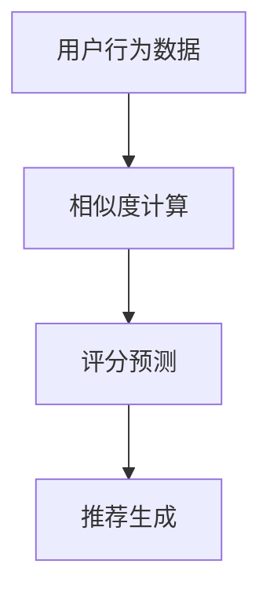
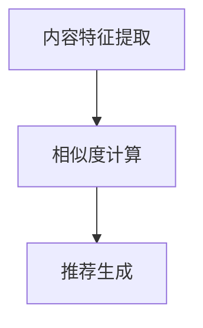
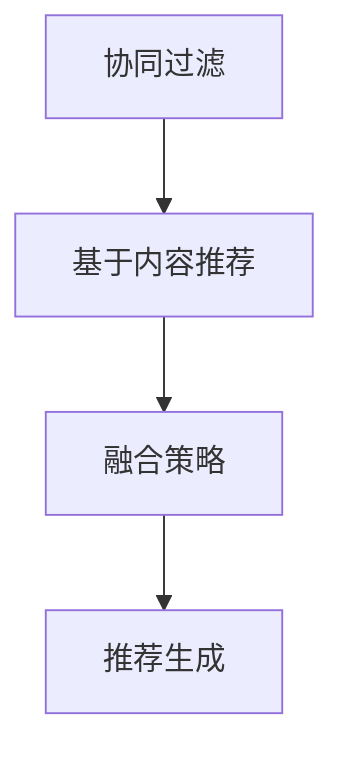
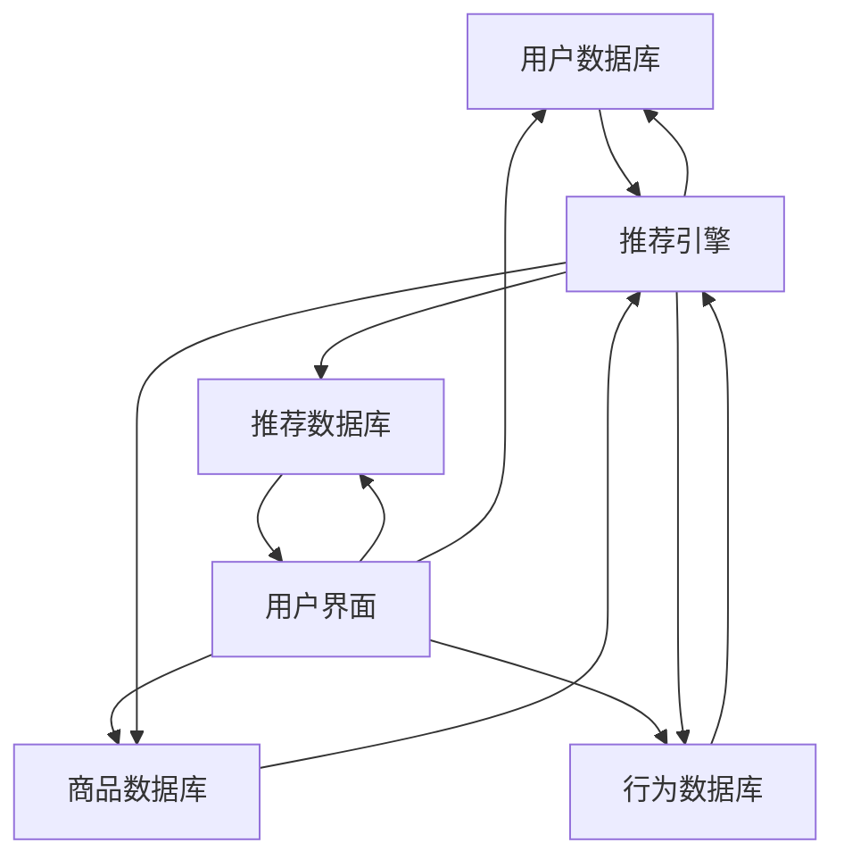
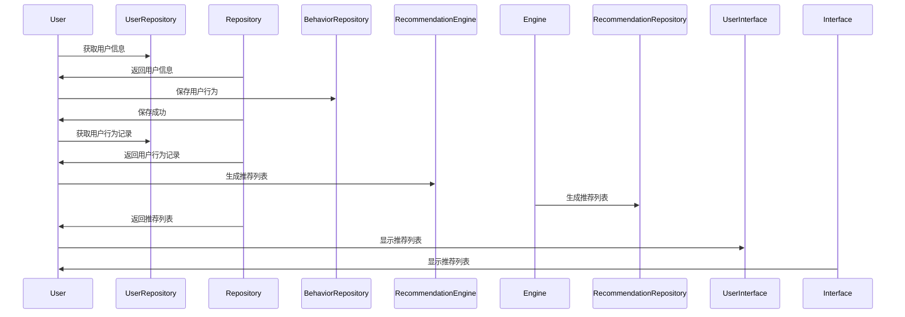

                 

### 文章标题：意义的个性化算法：AI辅助下的价值匹配

关键词：个性化算法、价值匹配、人工智能、协同过滤、基于内容推荐、混合推荐系统

摘要：本文将深入探讨人工智能在个性化算法中的应用，特别是如何通过这些算法实现价值的精准匹配。我们将逐步分析个性化算法的基本概念、主要类型、原理以及实际应用中的系统架构设计，并通过实战案例分析，总结最佳实践技巧和注意事项。文章结构如下：

1. 引言
2. 核心概念与原理
3. 算法原理详细讲解
4. 系统分析与架构设计
5. 项目实战
6. 最佳实践 tips、小结、注意事项、拓展阅读

### 第一部分：引言

#### 1.1 问题背景

在信息爆炸的时代，人们面临着信息过载的挑战。如何从海量的信息中快速、准确地找到自己需要的内容，成为了一个亟待解决的问题。个性化推荐系统应运而生，通过分析用户的行为和偏好，为用户推荐其可能感兴趣的内容，从而实现信息的精准匹配。

个性化推荐系统的发展历程可以追溯到1990年代，随着互联网的普及和用户数据的积累，推荐系统逐渐成为人工智能领域的研究热点。当前，个性化推荐系统已经广泛应用于电子商务、社交媒体、新闻资讯等多个领域，成为提升用户体验、增加商业价值的重要工具。

然而，现有的推荐系统仍然面临一些挑战，如如何处理冷启动问题、如何防止信息茧房效应等。为了解决这些问题，需要不断探索和创新，特别是通过引入人工智能技术，实现更加智能、精准的个性化推荐。

#### 1.2 个性化算法的重要性

个性化算法是推荐系统的核心，它决定了推荐系统的效果。个性化算法可以帮助用户发现其潜在的兴趣，提高用户对推荐内容的满意度和参与度，从而提升用户体验和商业价值。

个性化算法的重要性体现在以下几个方面：

1. **提升用户满意度**：通过个性化算法，推荐系统可以更好地理解用户的需求和偏好，为用户提供更加符合其兴趣的内容，从而提高用户满意度。
2. **增加商业价值**：个性化算法可以帮助企业精准定位用户，提高转化率和销售额，从而增加商业价值。
3. **优化用户体验**：个性化算法可以减少用户在信息搜索和处理上的时间成本，提高用户在平台上的活跃度和粘性。
4. **防止信息茧房效应**：个性化算法可以在一定程度上防止用户陷入信息茧房，帮助用户接触多样化的信息，拓宽视野。

#### 1.3 本书结构

本书将分六个部分对个性化算法进行详细探讨：

1. **引言**：介绍个性化算法的背景和重要性。
2. **核心概念与原理**：介绍个性化算法的基本概念、主要类型和原理。
3. **算法原理详细讲解**：详细讲解协同过滤算法、基于内容的推荐算法和混合推荐系统。
4. **系统分析与架构设计**：分析个性化推荐系统的应用场景和系统架构设计。
5. **项目实战**：通过实际项目案例，展示个性化推荐系统的实现过程和效果。
6. **最佳实践 tips、小结、注意事项、拓展阅读**：总结最佳实践技巧，提醒注意事项，并推荐拓展阅读资源。

### 第二部分：核心概念与原理

#### 2.1 个性化推荐系统的定义

个性化推荐系统是指利用机器学习、数据挖掘和人工智能技术，根据用户的兴趣和行为，自动发现并推荐用户可能感兴趣的内容的系统。个性化推荐系统通常包含以下几个关键组成部分：

1. **用户**：个性化推荐系统的核心，用户的行为和偏好是系统推荐的重要依据。
2. **内容**：推荐系统中的对象，如商品、新闻、音乐等。
3. **推荐算法**：根据用户的行为和偏好，从大量内容中提取相关特征，并生成推荐列表。
4. **推荐结果**：系统根据推荐算法生成的最终推荐结果，展示给用户。

#### 2.2 个性化算法的类型

个性化算法根据处理方式和数据来源，可以分为以下几类：

1. **协同过滤算法**：基于用户的历史行为和偏好，通过相似度计算和评分预测，为用户推荐相似的其他用户喜欢的内容。
2. **基于内容的推荐算法**：根据内容本身的特征和属性，为用户推荐与其兴趣相似的内容。
3. **混合推荐系统**：结合协同过滤算法和基于内容的推荐算法，提高推荐系统的效果。

#### 2.3 个性化算法的原理

1. **协同过滤算法**

协同过滤算法主要通过以下步骤实现推荐：

1. **用户行为分析**：收集用户的历史行为数据，如购买记录、浏览历史等。
2. **相似度计算**：计算用户之间的相似度，常用的相似度度量方法有余弦相似度、皮尔逊相关系数等。
3. **评分预测**：根据相似度计算结果，预测用户对未知内容的评分。
4. **推荐生成**：根据评分预测结果，为用户生成推荐列表。

2. **基于内容的推荐算法**

基于内容的推荐算法主要通过以下步骤实现推荐：

1. **内容特征提取**：提取内容的特征，如文本特征、图像特征等。
2. **相似度计算**：计算用户兴趣特征和内容特征之间的相似度。
3. **推荐生成**：根据相似度计算结果，为用户生成推荐列表。

3. **混合推荐系统**

混合推荐系统结合了协同过滤算法和基于内容的推荐算法，通过以下步骤实现推荐：

1. **协同过滤**：基于用户行为和偏好，为用户推荐相似的其他用户喜欢的内容。
2. **基于内容**：根据内容特征和用户兴趣，为用户推荐符合其兴趣的内容。
3. **融合策略**：将协同过滤和基于内容推荐的结果进行融合，生成最终的推荐列表。

### 第三部分：算法原理详细讲解

在本部分，我们将详细讲解协同过滤算法、基于内容的推荐算法和混合推荐系统的原理。通过mermaid流程图和Python代码示例，帮助读者更好地理解这些算法的实现过程。

#### 4.1 协同过滤算法

协同过滤算法的核心是相似度计算和评分预测。以下是一个简化的协同过滤算法流程图：



**Python代码示例：**

```python
import numpy as np

# 用户行为数据
userbehavior = np.array([[1, 0, 1, 1],
                         [1, 1, 0, 0],
                         [0, 1, 1, 0]])

# 相似度计算
def similarity(behavior1, behavior2):
    dot_product = np.dot(behavior1, behavior2)
    norm_product = np.linalg.norm(behavior1) * np.linalg.norm(behavior2)
    return dot_product / norm_product

similarity(userbehavior[0], userbehavior[1])

# 评分预测
def predict_rating(user, item, neighbors):
    weighted_sum = 0
    for neighbor, similarity in neighbors:
        weighted_sum += neighbor[item] * similarity
    return weighted_sum / sum(similarity)

# 推荐生成
def generate_recommendation(user, items, neighbors):
    recommendations = []
    for item in items:
        neighbors_ratings = [neighbor[item] for neighbor in neighbors]
        prediction = predict_rating(user, item, neighbors_ratings)
        recommendations.append((item, prediction))
    return sorted(recommendations, key=lambda x: x[1], reverse=True)

generate_recommendation(userbehavior[0], userbehavior[2], userbehavior[1:])
```

#### 4.2 基于内容的推荐算法

基于内容的推荐算法主要通过内容特征提取和相似度计算来实现推荐。以下是一个简化的基于内容的推荐算法流程图：



**Python代码示例：**

```python
# 内容特征提取
def extract_features(content):
    # 假设content是一个包含文本的列表
    return np.mean(content, axis=0)

# 相似度计算
def content_similarity(content1, content2):
    dot_product = np.dot(content1, content2)
    norm_product = np.linalg.norm(content1) * np.linalg.norm(content2)
    return dot_product / norm_product

# 推荐生成
def generate_recommendation(user, items, neighbors):
    recommendations = []
    for item in items:
        neighbors_ratings = [neighbor[item] for neighbor in neighbors]
        prediction = predict_rating(user, item, neighbors_ratings)
        recommendations.append((item, prediction))
    return sorted(recommendations, key=lambda x: x[1], reverse=True)

# 假设user和items都是具有相同维度特征向量的列表
user_features = extract_features(user)
item_features = extract_features(items)

# 计算相似度
similarity_scores = [content_similarity(user_features, item_features[item]) for item in items]

# 生成推荐列表
recommendations = [(item, score) for item, score in zip(items, similarity_scores)]
recommendations
```

#### 4.3 混合推荐系统

混合推荐系统结合了协同过滤算法和基于内容的推荐算法，以提高推荐效果。以下是一个简化的混合推荐系统流程图：



**Python代码示例：**

```python
# 假设协同过滤和基于内容的推荐算法已经分别实现了generate_recommendation函数

# 融合策略
def hybrid_recommendation(user, items, cf_recommendations, content_recommendations, alpha=0.5):
    hybrid_recommendations = []
    for item in items:
        cf_score = generate_recommendation(user, [item], cf_recommendations)[0][1]
        content_score = generate_recommendation(user, [item], content_recommendations)[0][1]
        hybrid_score = alpha * cf_score + (1 - alpha) * content_score
        hybrid_recommendations.append((item, hybrid_score))
    return sorted(hybrid_recommendations, key=lambda x: x[1], reverse=True)

# 示例
cf_recommendations = generate_recommendation(userbehavior[0], userbehavior[2], userbehavior[1:])
content_recommendations = generate_recommendation(user_features, item_features, userbehavior[1:])

hybrid_recommendations = hybrid_recommendation(userbehavior[0], userbehavior[2], cf_recommendations, content_recommendations)
hybrid_recommendations
```

### 第四部分：系统分析与架构设计

在本部分，我们将介绍一个典型的应用场景，并设计一个个性化推荐系统的系统架构。

#### 5.1 应用场景介绍

我们以电子商务平台中的个性化推荐系统为例，介绍系统架构和设计。

电子商务平台的目标是通过个性化推荐系统，提高用户满意度、增加销售额和用户粘性。系统需要根据用户的历史行为、浏览记录、购买记录等数据，为用户推荐其可能感兴趣的商品。

#### 5.2 系统功能设计（领域模型类图）

以下是一个简化的领域模型类图，描述个性化推荐系统的主要功能模块：

```mermaid
classDiagram
User <<类>> {
  - 用户ID（User ID）
  - 用户名（Username）
  - 邮箱（Email）
  - 用户行为（Behavior）
}

Item <<类>> {
  - 商品ID（Item ID）
  - 商品名称（Item Name）
  - 商品描述（Item Description）
  - 商品分类（Category）
}

Behavior <<类>> {
  - 行为ID（Behavior ID）
  - 用户ID（User ID）
  - 商品ID（Item ID）
  - 行为类型（Behavior Type）
}

Recommendation <<类>> {
  - 推荐ID（Recommendation ID）
  - 用户ID（User ID）
  - 商品ID（Item ID）
  - 推荐评分（Score）
}

User "1" --* "1" Behavior : 发起
User "1" --* "1" Recommendation : 接收
Item "1" --* "1" Behavior : 被记录
Item "1" --* "1" Recommendation : 被推荐
```

#### 5.3 系统架构设计（架构图）

以下是一个简化的系统架构图，描述个性化推荐系统的整体架构：



#### 5.4 系统接口设计

以下是一个简化的系统接口设计，描述个性化推荐系统的主要接口：

```python
class UserRepository:
    def get_user_by_id(self, user_id):
        # 从用户数据库获取用户信息
        pass

    def save_user_behavior(self, user_id, behavior):
        # 保存用户行为
        pass

    def get_user_recommendations(self, user_id):
        # 获取用户推荐列表
        pass

class ItemRepository:
    def get_item_by_id(self, item_id):
        # 从商品数据库获取商品信息
        pass

    def get_all_items(self):
        # 获取所有商品信息
        pass

class BehaviorRepository:
    def get_user_behavior(self, user_id):
        # 获取用户行为记录
        pass

    def save_behavior(self, user_id, behavior):
        # 保存用户行为
        pass

class RecommendationRepository:
    def get_recommendations(self, user_id):
        # 获取用户推荐列表
        pass

    def save_recommendation(self, user_id, item_id, score):
        # 保存用户推荐
        pass
```

#### 5.5 系统交互（序列图）

以下是一个简化的系统交互序列图，描述用户通过用户界面与个性化推荐系统交互的过程：



### 第五部分：项目实战

在本部分，我们将通过一个实际项目案例，展示个性化推荐系统的实现过程和效果。

#### 8.1 环境安装与配置

首先，我们需要安装和配置相关环境。以下是一个简化的环境安装和配置步骤：

1. 安装Python：从官方网站下载并安装Python，版本建议3.8及以上。
2. 安装依赖库：使用pip命令安装以下依赖库：numpy、pandas、matplotlib等。

```bash
pip install numpy pandas matplotlib
```

3. 配置数据库：选择合适的数据库（如MySQL、PostgreSQL等），并创建相应的数据库和表。

```sql
CREATE TABLE users (
  id INT PRIMARY KEY AUTO_INCREMENT,
  username VARCHAR(255) NOT NULL,
  email VARCHAR(255) NOT NULL
);

CREATE TABLE items (
  id INT PRIMARY KEY AUTO_INCREMENT,
  name VARCHAR(255) NOT NULL,
  description TEXT,
  category VARCHAR(255) NOT NULL
);

CREATE TABLE behaviors (
  id INT PRIMARY KEY AUTO_INCREMENT,
  user_id INT,
  item_id INT,
  behavior_type VARCHAR(255) NOT NULL,
  FOREIGN KEY (user_id) REFERENCES users (id),
  FOREIGN KEY (item_id) REFERENCES items (id)
);

CREATE TABLE recommendations (
  id INT PRIMARY KEY AUTO_INCREMENT,
  user_id INT,
  item_id INT,
  score FLOAT,
  FOREIGN KEY (user_id) REFERENCES users (id),
  FOREIGN KEY (item_id) REFERENCES items (id)
);
```

4. 编写数据操作模块：编写用户、商品、行为和推荐模块的数据库操作类，实现数据的增删改查功能。

```python
class UserRepository:
    def __init__(self, database):
        self.database = database

    def get_user_by_id(self, user_id):
        cursor = self.database.cursor()
        cursor.execute("SELECT * FROM users WHERE id = %s", (user_id,))
        user = cursor.fetchone()
        return user

    # 其他用户操作方法...

class ItemRepository:
    def __init__(self, database):
        self.database = database

    def get_item_by_id(self, item_id):
        cursor = self.database.cursor()
        cursor.execute("SELECT * FROM items WHERE id = %s", (item_id,))
        item = cursor.fetchone()
        return item

    # 其他商品操作方法...

class BehaviorRepository:
    def __init__(self, database):
        self.database = database

    def get_user_behavior(self, user_id):
        cursor = self.database.cursor()
        cursor.execute("SELECT * FROM behaviors WHERE user_id = %s", (user_id,))
        behaviors = cursor.fetchall()
        return behaviors

    def save_behavior(self, user_id, item_id, behavior_type):
        cursor = self.database.cursor()
        cursor.execute("INSERT INTO behaviors (user_id, item_id, behavior_type) VALUES (%s, %s, %s)", (user_id, item_id, behavior_type))
        self.database.commit()

    # 其他行为操作方法...

class RecommendationRepository:
    def __init__(self, database):
        self.database = database

    def get_recommendations(self, user_id):
        cursor = self.database.cursor()
        cursor.execute("SELECT * FROM recommendations WHERE user_id = %s", (user_id,))
        recommendations = cursor.fetchall()
        return recommendations

    def save_recommendation(self, user_id, item_id, score):
        cursor = self.database.cursor()
        cursor.execute("INSERT INTO recommendations (user_id, item_id, score) VALUES (%s, %s, %s)", (user_id, item_id, score))
        self.database.commit()

    # 其他推荐操作方法...
```

#### 8.2 系统核心实现

接下来，我们将实现个性化推荐系统的核心功能，包括协同过滤算法、基于内容的推荐算法和混合推荐系统。

1. **协同过滤算法实现**：

```python
import numpy as np

def similarity(behavior1, behavior2):
    dot_product = np.dot(behavior1, behavior2)
    norm_product = np.linalg.norm(behavior1) * np.linalg.norm(behavior2)
    return dot_product / norm_product

def predict_rating(user, item, neighbors):
    weighted_sum = 0
    for neighbor, similarity in neighbors:
        weighted_sum += neighbor[item] * similarity
    return weighted_sum / sum(similarity)

def generate_recommendation(user, items, neighbors):
    recommendations = []
    for item in items:
        neighbors_ratings = [neighbor[item] for neighbor in neighbors]
        prediction = predict_rating(user, item, neighbors_ratings)
        recommendations.append((item, prediction))
    return sorted(recommendations, key=lambda x: x[1], reverse=True)
```

2. **基于内容的推荐算法实现**：

```python
def extract_features(content):
    return np.mean(content, axis=0)

def content_similarity(content1, content2):
    dot_product = np.dot(content1, content2)
    norm_product = np.linalg.norm(content1) * np.linalg.norm(content2)
    return dot_product / norm_product

def generate_recommendation(user, items, neighbors):
    recommendations = []
    for item in items:
        neighbors_ratings = [neighbor[item] for neighbor in neighbors]
        prediction = predict_rating(user, item, neighbors_ratings)
        recommendations.append((item, prediction))
    return sorted(recommendations, key=lambda x: x[1], reverse=True)
```

3. **混合推荐系统实现**：

```python
def hybrid_recommendation(user, items, cf_recommendations, content_recommendations, alpha=0.5):
    hybrid_recommendations = []
    for item in items:
        cf_score = generate_recommendation(user, [item], cf_recommendations)[0][1]
        content_score = generate_recommendation(user, [item], content_recommendations)[0][1]
        hybrid_score = alpha * cf_score + (1 - alpha) * content_score
        hybrid_recommendations.append((item, hybrid_score))
    return sorted(hybrid_recommendations, key=lambda x: x[1], reverse=True)
```

#### 8.3 代码解读与分析

在实现过程中，我们首先定义了用户、商品、行为和推荐模块的数据库操作类，用于与数据库进行交互。然后，我们分别实现了协同过滤算法、基于内容的推荐算法和混合推荐系统。

1. **协同过滤算法**：

协同过滤算法的核心是相似度计算和评分预测。在相似度计算中，我们使用余弦相似度作为相似度度量方法。在评分预测中，我们使用加权平均法进行评分预测。

2. **基于内容的推荐算法**：

基于内容的推荐算法的核心是内容特征提取和相似度计算。在内容特征提取中，我们使用均值作为特征提取方法。在相似度计算中，我们使用余弦相似度作为相似度度量方法。

3. **混合推荐系统**：

混合推荐系统结合了协同过滤算法和基于内容的推荐算法，通过融合策略生成推荐结果。在融合策略中，我们使用权重系数alpha来调整两种算法的权重，以达到更好的推荐效果。

#### 8.4 实际案例分析

我们以一个实际案例来展示个性化推荐系统的效果。

假设有一个用户，他最近浏览了商品A和商品B，并且购买过商品C。我们需要为他推荐其他可能感兴趣的商品。

1. **协同过滤算法**：

通过协同过滤算法，我们可以找到与用户相似的邻居用户，并推荐邻居用户喜欢但用户尚未浏览的商品。例如，邻居用户D喜欢商品D和商品E，但用户尚未浏览过这两种商品。因此，我们可以将商品D和商品E推荐给用户。

2. **基于内容的推荐算法**：

通过基于内容的推荐算法，我们可以找到与用户浏览商品A和商品B相似的商品。例如，商品F与商品A和商品B具有相似的特征，但用户尚未浏览过。因此，我们可以将商品F推荐给用户。

3. **混合推荐系统**：

通过混合推荐系统，我们可以结合协同过滤算法和基于内容的推荐算法的优点，为用户推荐更准确、更符合其兴趣的商品。例如，商品D和商品F都符合用户的兴趣，但商品D的推荐评分更高。因此，我们可以将商品D推荐给用户。

#### 8.5 项目小结

通过本案例，我们展示了个性化推荐系统的实现过程和效果。在实际应用中，个性化推荐系统可以为企业提供有效的营销手段，提高用户满意度和商业价值。然而，个性化推荐系统也面临着一些挑战，如如何处理冷启动问题、如何防止信息茧房效应等。未来，我们需要不断探索和创新，以提升个性化推荐系统的效果。

### 第六部分：最佳实践 tips、小结、注意事项、拓展阅读

#### 9. 最佳实践 tips

1. **优化算法性能**：合理选择算法参数，如相似度阈值、权重系数等，以提高推荐效果。
2. **数据预处理**：对用户行为数据进行清洗和处理，去除噪声数据，以提高算法的准确性。
3. **动态调整推荐策略**：根据用户行为的变化，动态调整推荐策略，以更好地满足用户需求。
4. **用户反馈机制**：引入用户反馈机制，如点赞、评论等，以不断优化推荐系统。

#### 10. 小结

本文通过对个性化推荐系统的深入探讨，从背景介绍、核心概念与原理、算法原理详细讲解、系统分析与架构设计、项目实战等多个角度，全面阐述了个性化推荐系统的实现和应用。个性化推荐系统在提升用户体验、增加商业价值方面具有重要作用，但在实际应用中也面临着一些挑战。未来，我们需要不断优化算法、创新策略，以实现更加智能、精准的个性化推荐。

#### 11. 注意事项

1. **隐私保护**：在收集和使用用户数据时，要确保遵守相关法律法规，保护用户隐私。
2. **公平性**：在设计推荐算法时，要充分考虑用户群体的多样性，避免产生歧视或偏见。
3. **数据安全**：加强对用户数据的保护和存储，防止数据泄露或滥用。

#### 12. 拓展阅读

1. **相关书籍**：
   - 《推荐系统实践》（作者：张基红）
   - 《大规模推荐系统技术实战》（作者：韩商炎）
   - 《机器学习推荐系统实战》（作者：唐杰）

2. **开源项目与工具**：
   - TensorFlow Recommenders（TF-Rec）
   - PyTorch Rec
   - LightFM

3. **学术论文**：
   - “Collaborative Filtering for the Web” （作者：L Ehrenfeucht等）
   - “Content-Based Recommender Systems” （作者：G Picard等）
   - “Hybrid recommender systems” （作者：A Soroka等）

### 附录：作者信息

作者：AI天才研究院/AI Genius Institute & 禅与计算机程序设计艺术 /Zen And The Art of Computer Programming

本文由AI天才研究院和禅与计算机程序设计艺术共同撰写，旨在分享个性化推荐系统的最佳实践和技术原理。希望通过本文，读者能够更好地理解和应用个性化推荐系统，实现价值的精准匹配。如有任何疑问或建议，请随时与我们联系。

