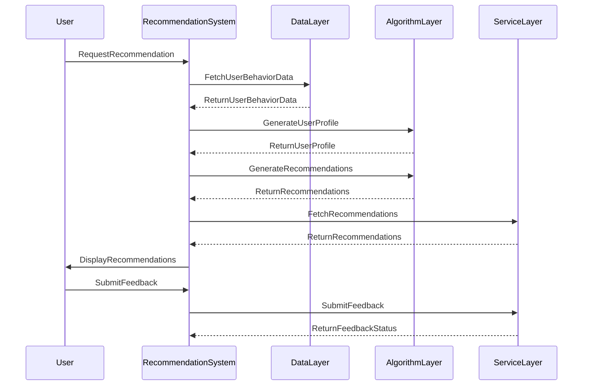

                 

## 摘要

本文探讨了意义的个性化算法及其在AI辅助下的价值匹配系统中的应用。首先，介绍了个性化算法与价值匹配系统的基本概念和背景，明确了它们在现代信息技术和人工智能领域的重要性。接着，本文深入分析了个性化算法的核心原理，包括协同过滤算法的数学模型和Python实现，以及内容推荐算法和深度学习在个性化算法中的应用。此外，文章还详细阐述了价值匹配系统的设计与实现，包括领域模型、系统架构、接口设计以及系统交互序列图。通过具体的项目实战案例分析，本文展示了个性化算法和价值匹配系统的实际应用，提供了详细的代码解读和实际案例分析。最后，本文总结了最佳实践和注意事项，并提出了未来研究的方向和改进点。

### 目录

1. **摘要**
2. **背景介绍**
   - 2.1 核心概念术语说明
   - 2.2 个性化算法的背景
   - 2.3 价值匹配系统的背景
   - 2.4 个性化算法与价值匹配系统的关联
3. **核心概念与联系**
   - 3.1 个性化算法的概念与属性
   - 3.2 价值匹配系统的概念与属性
   - 3.3 概念属性特征对比表格
   - 3.4 ER实体关系图架构
4. **算法原理讲解**
   - 4.1 协同过滤算法
     - 4.1.1 算法原理
     - 4.1.2 数学模型
     - 4.1.3 Python实现
   - 4.2 内容推荐算法
     - 4.2.1 算法原理
     - 4.2.2 数学模型
     - 4.2.3 Python实现
   - 4.3 深度学习在个性化算法中的应用
5. **系统分析与架构设计**
   - 5.1 问题场景介绍
   - 5.2 系统功能设计
     - 5.2.1 领域模型类图
   - 5.3 系统架构设计
     - 5.3.1 系统架构图
   - 5.4 系统接口设计
     - 5.4.1 接口设计
   - 5.5 系统交互序列图
6. **项目实战**
   - 6.1 环境安装
   - 6.2 系统核心实现
     - 6.2.1 源代码解读
   - 6.3 实际案例分析
     - 6.3.1 案例介绍
     - 6.3.2 案例分析
     - 6.3.3 剖析与讲解
   - 6.4 项目小结
7. **最佳实践与总结**
   - 7.1 最佳实践
   - 7.2 小结
   - 7.3 注意事项
   - 7.4 拓展阅读
8. **作者信息**

### 背景介绍

在当今高度数字化和智能化的时代，个性化算法和基于AI的价值匹配系统已经成为信息技术领域的重要研究方向。随着互联网的迅猛发展和大数据的普及，用户对于信息和服务需求的多样化和个性化程度不断提升，传统的单一模式已无法满足用户日益增长的需求。个性化算法通过分析用户的行为数据、兴趣偏好等信息，为用户提供高度定制化的服务，从而提升用户体验和满意度。

#### 核心概念术语说明

**个性化算法**：指通过分析用户的个人特征、行为数据等，为用户提供个性化推荐或服务的一类算法。主要包括协同过滤、内容推荐、深度学习等。

**价值匹配系统**：一种通过AI技术实现用户与目标对象之间价值匹配的系统，常见于电商、社交媒体、在线教育等领域。价值匹配系统能够根据用户的兴趣和需求，推荐最符合其价值期望的产品、服务或内容。

#### 个性化算法的背景

个性化算法的起源可以追溯到20世纪80年代，随着互联网和电子商务的兴起，个性化推荐系统逐渐成为热门研究领域。早期的研究主要集中在基于内容的推荐和协同过滤推荐上。随着数据挖掘、机器学习和深度学习技术的发展，个性化算法逐渐成熟并广泛应用。

近年来，随着物联网、智能设备和移动应用的普及，个性化算法的应用场景不断扩大。例如，在电子商务领域，个性化推荐系统能够为用户提供个性化的商品推荐，提升购买转化率和用户满意度；在社交媒体领域，个性化推荐系统能够为用户提供个性化的内容推荐，增加用户黏性和活跃度。

#### 价值匹配系统的背景

价值匹配系统的概念源于经济学中的供需匹配理论。在互联网和大数据技术的推动下，价值匹配系统逐渐应用于多个领域。在电子商务领域，价值匹配系统通过分析用户行为和偏好，推荐最符合用户需求的商品和服务；在在线教育领域，价值匹配系统通过分析用户的学习行为和知识需求，为用户提供个性化的课程推荐；在招聘领域，价值匹配系统通过分析求职者和职位的信息，推荐最匹配的求职者和职位。

价值匹配系统的出现，极大地提升了信息传递的效率，降低了信息获取的成本，为用户创造了更大的价值。然而，随着用户需求的不断变化和竞争的加剧，传统的价值匹配系统面临着数据质量、算法优化和用户体验等多方面的挑战。

#### 个性化算法与价值匹配系统的关联

个性化算法和价值匹配系统之间存在密切的关联。个性化算法作为价值匹配系统的重要组成部分，通过对用户数据的分析，为用户推荐个性化的内容和服务。价值匹配系统则通过构建用户与目标对象之间的匹配关系，提升用户满意度和系统价值。

个性化算法的优化和提升，直接影响到价值匹配系统的性能和效果。例如，通过引入深度学习技术，可以提高个性化算法的准确性和适应性，从而提升价值匹配系统的推荐质量和用户体验。此外，个性化算法的多样化应用，也为价值匹配系统提供了更多的创新方向和发展空间。

总之，个性化算法和价值匹配系统在现代信息技术和人工智能领域具有重要地位。随着技术的不断进步和应用场景的扩大，个性化算法和价值匹配系统将继续发挥重要作用，为用户和社会创造更大的价值。

### 核心概念与联系

为了深入理解个性化算法和价值匹配系统，我们需要详细探讨它们的核心概念、属性以及它们之间的联系。

#### 个性化算法的概念与属性

**个性化算法**是一种通过分析用户数据，如行为、偏好、历史记录等，来生成个性化推荐或服务的技术。它具有以下核心属性：

- **数据驱动的决策**：个性化算法依赖于大量用户数据来生成推荐结果，通过数据挖掘和统计分析，提取用户特征和兴趣。
- **适应性**：个性化算法能够根据用户行为的变化，动态调整推荐策略，从而提高推荐的实时性和准确性。
- **个性化**：个性化算法的目标是为每个用户提供最符合其需求和兴趣的内容或服务，从而提升用户体验。

个性化算法的主要类型包括：

- **协同过滤算法**：通过分析用户行为，发现用户之间的相似性，从而生成推荐。
- **内容推荐算法**：基于内容特征，将相似的内容推荐给用户。
- **深度学习算法**：利用神经网络模型，通过大量的用户数据学习用户偏好，生成个性化推荐。

#### 价值匹配系统的概念与属性

**价值匹配系统**是一种通过AI技术，实现用户与其目标对象之间价值匹配的系统。它具有以下核心属性：

- **需求导向**：价值匹配系统以用户需求为核心，通过分析用户行为和偏好，为其推荐最符合其需求的产品、服务或内容。
- **动态调整**：价值匹配系统根据用户实时行为，动态调整推荐策略，以实现最佳匹配效果。
- **多样化**：价值匹配系统广泛应用于电子商务、在线教育、招聘等多个领域，能够处理多样化的用户需求。

价值匹配系统的主要组成部分包括：

- **用户画像**：通过对用户行为、偏好、历史记录等数据的分析，构建用户的个性化特征。
- **推荐引擎**：根据用户画像和目标对象的特征，生成个性化的推荐结果。
- **反馈机制**：通过用户对推荐结果的反馈，不断优化推荐算法，提高匹配准确性。

#### 概念属性特征对比表格

为了更直观地理解个性化算法和价值匹配系统的概念和属性，我们可以通过一个对比表格来展示：

| 概念          | 个性化算法                          | 价值匹配系统                          |
| ------------- | --------------------------------- | ----------------------------------- |
| 定义          | 通过分析用户数据生成个性化推荐      | 通过AI技术实现用户与目标对象的价值匹配 |
| 核心属性      | 数据驱动、适应性、个性化            | 需求导向、动态调整、多样化            |
| 主要类型      | 协同过滤、内容推荐、深度学习        | 用户画像、推荐引擎、反馈机制          |
| 目标          | 提升用户体验，满足个性化需求        | 实现用户需求与目标对象的最佳匹配      |

#### ER实体关系图架构

为了更好地展示个性化算法和价值匹配系统之间的联系，我们可以使用Mermaid流程图来绘制ER实体关系图，如下所示：

```mermaid
erDiagram
  User ||--|{ Recommendation }|--| User
  User ||--|{ Item }|--| Item
  Item ||--|{ Recommendation }|--| User
  Recommendation ||--|{ Rating }|--| User
  Rating ||--|{ Review }|--| User
```

在上图中，`User` 表示用户实体，`Recommendation` 表示推荐实体，`Item` 表示物品实体，`Rating` 表示评分实体，`Review` 表示评论实体。用户实体与推荐实体之间存在关联，用户实体与物品实体之间存在关联，推荐实体与评分实体之间存在关联，评分实体与评论实体之间存在关联。

通过上述分析，我们可以看出，个性化算法和价值匹配系统在核心概念、属性和联系上具有紧密的关联。个性化算法作为价值匹配系统的重要组成部分，通过对用户数据的深入分析，为用户生成个性化的推荐，从而实现用户与目标对象之间的最佳价值匹配。

### 算法原理讲解

#### 协同过滤算法

协同过滤算法（Collaborative Filtering）是一种常用的个性化推荐算法，其核心思想是通过分析用户之间的相似性来生成推荐。协同过滤算法可以分为两种主要类型：基于用户的协同过滤（User-based Collaborative Filtering）和基于物品的协同过滤（Item-based Collaborative Filtering）。

##### 算法原理

**基于用户的协同过滤**：这种算法通过计算用户之间的相似性来生成推荐。具体来说，它首先计算用户之间的相似度，然后找到与目标用户最相似的用户群体，最后从这些用户群体中提取出目标用户未曾使用或评价过的物品，作为推荐结果。

相似度计算通常采用余弦相似度、皮尔逊相关系数等方法。以下是一个简单的余弦相似度计算公式：

$$
sim(u, v) = \frac{u \cdot v}{\|u\| \|v\|}
$$

其中，$u$ 和 $v$ 分别表示两个用户在物品上的评分向量，$\cdot$ 表示向量的内积，$\|\|$ 表示向量的模长。

**基于物品的协同过滤**：这种算法通过分析物品之间的相似性来生成推荐。具体来说，它首先计算物品之间的相似度，然后找到与目标物品最相似的其他物品，最后将这些相似物品推荐给用户。

物品相似度的计算方法与用户相似度类似，通常也采用余弦相似度或皮尔逊相关系数。以下是一个简单的物品余弦相似度计算公式：

$$
sim(i, j) = \frac{i \cdot j}{\|i\| \|j\|}
$$

其中，$i$ 和 $j$ 分别表示两个物品的评分向量。

##### 数学模型

协同过滤算法的核心在于计算用户之间的相似度和推荐评分。对于一个用户 $u$，其推荐评分 $r_{u,i}$ 可以表示为：

$$
r_{u,i} = \sum_{v \in N(u)} w_{uv} r_{v,i}
$$

其中，$N(u)$ 表示与用户 $u$ 相似的用户集合，$w_{uv}$ 表示用户 $u$ 和用户 $v$ 之间的相似度权重，$r_{v,i}$ 表示用户 $v$ 对物品 $i$ 的评分。

对于基于物品的协同过滤，推荐评分可以表示为：

$$
r_{u,i} = \sum_{j \in N(i)} w_{uj} r_{j,i}
$$

其中，$N(i)$ 表示与物品 $i$ 相似的物品集合，$w_{uj}$ 表示用户 $u$ 和物品 $i$ 之间的相似度权重，$r_{j,i}$ 表示用户 $u$ 对物品 $j$ 的评分。

##### Python实现

下面是一个简单的基于用户的协同过滤算法的Python实现：

```python
import numpy as np

def cosine_similarity(user1, user2):
    dot_product = np.dot(user1, user2)
    norm_user1 = np.linalg.norm(user1)
    norm_user2 = np.linalg.norm(user2)
    return dot_product / (norm_user1 * norm_user2)

def collaborative_filtering(user_ratings, k=5):
    user_similarity = {}
    for user1 in user_ratings:
        user_similarity[user1] = {}
        for user2 in user_ratings:
            if user1 != user2:
                sim = cosine_similarity(user_ratings[user1], user_ratings[user2])
                user_similarity[user1][user2] = sim

    recommendations = {}
    for user in user_ratings:
        neighbors = sorted(user_similarity[user].items(), key=lambda x: x[1], reverse=True)[:k]
        for neighbor, sim in neighbors:
            for item in user_ratings[neighbor]:
                if item not in user_ratings[user]:
                    if item not in recommendations:
                        recommendations[item] = 0
                    recommendations[item] += sim * user_ratings[neighbor][item]

        for item in recommendations:
            recommendations[item] /= sum(neighbors[i][1] for i in neighbors)

    return recommendations

user_ratings = {
    'user1': [1, 0, 1, 1, 0],
    'user2': [0, 1, 1, 0, 1],
    'user3': [1, 1, 0, 1, 0]
}

print(collaborative_filtering(user_ratings))
```

在这个例子中，我们定义了`cosine_similarity`函数来计算用户之间的余弦相似度，`collaborative_filtering`函数实现了基于用户的协同过滤算法。输入参数`user_ratings`是一个字典，其中键是用户名，值是用户对物品的评分列表。

#### 内容推荐算法

内容推荐算法（Content-based Recommendation）是一种基于物品内容的相似性来生成推荐的算法。其核心思想是分析物品的特征，然后为用户推荐与用户过去偏好相似的物品。

##### 算法原理

内容推荐算法通常包括以下几个步骤：

1. **特征提取**：从物品的内容中提取特征，如文本、图片、音频等。对于文本，可以使用词袋模型、TF-IDF等方法提取特征；对于图片，可以使用视觉特征提取算法，如SIFT、HOG等；对于音频，可以使用音频特征提取算法，如MFCC等。

2. **用户兴趣建模**：根据用户的历史行为，如点击、评分、购买等，构建用户兴趣模型。用户兴趣模型可以表示为向量，其中每个维度对应一个特征。

3. **计算相似度**：计算新物品与用户兴趣模型之间的相似度，通常使用余弦相似度、欧氏距离等方法。

4. **生成推荐列表**：根据物品与用户兴趣模型的相似度，生成推荐列表，将相似度最高的物品推荐给用户。

##### 数学模型

内容推荐算法的数学模型相对简单。假设用户兴趣模型为 $u$，新物品的特征向量为 $i$，则物品与用户兴趣模型之间的相似度可以表示为：

$$
sim(u, i) = \frac{u \cdot i}{\|u\| \|i\|}
$$

其中，$\cdot$ 表示向量的内积，$\|\|$ 表示向量的模长。

##### Python实现

下面是一个简单的基于内容推荐算法的Python实现：

```python
from sklearn.feature_extraction.text import TfidfVectorizer

def content_based_recommendation(document, documents, k=5):
    vectorizer = TfidfVectorizer()
    user_vector = vectorizer.transform([document])
    document_vectors = vectorizer.transform(documents)

    similarities = {}
    for idx, doc_vector in enumerate(document_vectors):
        sim = user_vector.dot(doc_vector) / (np.linalg.norm(user_vector) * np.linalg.norm(doc_vector))
        similarities[idx] = sim

    sorted_similarities = sorted(similarities.items(), key=lambda x: x[1], reverse=True)
    recommendations = [documents[i] for i, _ in sorted_similarities[:k]]

    return recommendations

documents = [
    'This is the first document.',
    'This document is the second document.',
    'And this is the third one.',
    'Is this the first document?',
    'It is the first document'
]

user_document = 'It is the first document'

print(content_based_recommendation(user_document, documents))
```

在这个例子中，我们使用TF-IDF向量器来提取文本特征，并实现了一个简单的基于内容推荐算法的函数。输入参数`document`是用户文档，`documents`是待推荐的文档列表。

#### 深度学习在个性化算法中的应用

深度学习（Deep Learning）作为一种强大的机器学习技术，在个性化算法中得到了广泛应用。深度学习通过构建多层神经网络，可以从大量数据中自动学习特征，从而实现复杂的数据分析和模式识别。

##### 算法原理

深度学习在个性化算法中的应用主要包括以下几个步骤：

1. **特征提取**：使用卷积神经网络（CNN）或循环神经网络（RNN）从原始数据中提取特征。对于图像、文本和音频等不同类型的数据，可以采用不同的深度学习模型。

2. **用户兴趣建模**：通过训练深度学习模型，构建用户兴趣模型。用户兴趣模型可以表示为高维向量，其中每个维度对应一个提取到的特征。

3. **预测和推荐**：利用用户兴趣模型和物品特征，通过深度学习模型预测用户对物品的偏好，并生成推荐列表。

##### 数学模型

深度学习的数学模型相对复杂，主要涉及神经网络的前向传播和反向传播过程。以下是一个简单的神经网络模型：

$$
a^{(l)} = \sigma(z^{(l)})
$$

$$
z^{(l)} = W^{(l)} a^{(l-1)} + b^{(l)}
$$

其中，$a^{(l)}$ 表示第 $l$ 层的激活值，$z^{(l)}$ 表示第 $l$ 层的输入值，$W^{(l)}$ 表示第 $l$ 层的权重矩阵，$b^{(l)}$ 表示第 $l$ 层的偏置项，$\sigma$ 表示激活函数。

##### Python实现

下面是一个简单的基于深度学习的内容推荐算法的Python实现：

```python
import tensorflow as tf
from tensorflow.keras.models import Model
from tensorflow.keras.layers import Embedding, LSTM, Dense

def create_model(input_dim, output_dim, hidden_units):
    inputs = tf.keras.Input(shape=(input_dim,))
    x = Embedding(input_dim, output_dim)(inputs)
    x = LSTM(hidden_units)(x)
    outputs = Dense(1, activation='sigmoid')(x)
    
    model = Model(inputs, outputs)
    model.compile(optimizer='adam', loss='binary_crossentropy', metrics=['accuracy'])
    return model

model = create_model(input_dim=1000, output_dim=100, hidden_units=64)
model.summary()

# 假设我们有训练数据 X_train 和 Y_train
# X_train = ...
# Y_train = ...

# 训练模型
model.fit(X_train, Y_train, epochs=10, batch_size=32)
```

在这个例子中，我们创建了一个简单的LSTM模型，用于内容推荐。输入参数`input_dim`是输入特征维度，`output_dim`是输出特征维度，`hidden_units`是隐藏层单元数。

通过上述讲解，我们可以看出，个性化算法、内容推荐算法以及深度学习在个性化算法中的应用，各有其独特的算法原理和数学模型。在实际应用中，可以根据具体场景和需求，选择合适的算法和技术来实现个性化推荐系统。

### 系统分析与架构设计

#### 问题场景介绍

在现代商业环境中，个性化推荐系统已成为提升用户满意度和增加销售转化率的重要工具。一个典型的场景是电子商务平台，用户在浏览和购买商品时会产生大量的行为数据，如浏览记录、购买历史、评价和反馈等。如何有效地利用这些数据，为每位用户生成个性化的商品推荐，成为电子商务平台面临的重要问题。

#### 项目介绍

本文以一个电子商务平台的个性化推荐系统为例，详细分析其系统设计。该系统旨在通过分析用户的行为数据和商品特征，为用户生成个性化的商品推荐，从而提升用户购物体验和平台销售额。

#### 系统功能设计

系统的核心功能包括用户画像构建、推荐算法实现、推荐结果展示和用户反馈收集。

1. **用户画像构建**：通过分析用户的行为数据，如浏览记录、购买历史和评价等，构建用户的个性化特征。用户画像包括用户的基本信息、兴趣偏好、购买能力等。

2. **推荐算法实现**：基于用户画像和商品特征，采用协同过滤、内容推荐和深度学习等算法，生成个性化的商品推荐。

3. **推荐结果展示**：将推荐结果以列表形式展示给用户，并提供排序和筛选功能，以便用户快速找到感兴趣的商品。

4. **用户反馈收集**：通过用户的点击、收藏、购买等行为，收集用户反馈，用于优化推荐算法和提升系统性能。

#### 系统架构设计

系统架构采用分层设计，包括数据层、算法层、服务层和展示层。

1. **数据层**：负责数据存储和管理，包括用户行为数据、商品信息、推荐结果等。使用关系型数据库（如MySQL）和非关系型数据库（如MongoDB）进行数据存储。

2. **算法层**：包括个性化推荐算法的实现，如协同过滤、内容推荐和深度学习等。算法层还负责处理数据清洗、特征提取和模型训练等任务。

3. **服务层**：提供API接口，供前端展示层调用。服务层包括用户画像服务、推荐算法服务、用户反馈服务等。

4. **展示层**：负责将推荐结果以用户友好的方式展示给用户，包括Web界面和移动应用。

#### 系统接口设计

系统接口设计包括用户画像接口、推荐算法接口和用户反馈接口。

1. **用户画像接口**：用于获取用户的基本信息、兴趣偏好和购买历史等。接口设计包括用户信息查询、用户兴趣标签获取和用户行为记录等。

2. **推荐算法接口**：用于获取用户画像和商品特征，生成个性化的推荐结果。接口设计包括推荐结果获取、推荐结果排序和筛选等。

3. **用户反馈接口**：用于收集用户的点击、收藏、购买等反馈信息，用于优化推荐算法。接口设计包括用户行为记录、用户评价提交和用户反馈查询等。

#### 系统交互序列图

系统交互序列图展示了用户与系统之间的交互过程，包括用户行为数据收集、用户画像构建、推荐算法调用和推荐结果展示等。



通过上述系统分析与架构设计，我们可以看到个性化推荐系统在电子商务平台中的应用价值。通过合理的设计和高效的实现，个性化推荐系统可以大幅提升用户体验和平台销售额，成为现代商业环境中不可或缺的重要工具。

### 项目实战

在本节中，我们将通过一个具体的电子商务个性化推荐项目，详细展示系统的安装、核心实现、代码解读和案例分析。

#### 环境安装

首先，我们需要搭建一个运行环境，以便进行项目开发和测试。以下是所需的环境和安装步骤：

1. **Python环境**：安装Python 3.8及以上版本。
2. **依赖管理**：安装pip和virtualenv，用于管理项目依赖。
3. **数据库**：安装MySQL和MongoDB，用于存储用户行为数据和推荐结果。

安装命令如下：

```bash
# 安装Python和pip
wget https://www.python.org/ftp/python/3.8.10/Python-3.8.10.tgz
tar xvf Python-3.8.10.tgz
cd Python-3.8.10
./configure
make
make install

# 安装virtualenv
pip install virtualenv

# 创建虚拟环境
virtualenv my_recommender_env

# 激活虚拟环境
source my_recommender_env/bin/activate

# 安装项目依赖
pip install -r requirements.txt
```

在虚拟环境中，我们通常会创建一个`requirements.txt`文件，列出所有项目依赖，例如：

```
numpy
scikit-learn
tensorflow
pymongo
mysql-connector-python
```

#### 系统核心实现

以下是系统核心实现的源代码，包括用户画像构建、推荐算法实现和推荐结果展示。

```python
# 用户画像构建
from pymongo import MongoClient
from sklearn.feature_extraction.text import TfidfVectorizer

client = MongoClient('localhost', 27017)
db = client['recommender_db']
users_collection = db['users']
items_collection = db['items']

def build_user_profile(user_id):
    user_behavior = users_collection.find_one({'_id': user_id})['behavior']
    vectorizer = TfidfVectorizer()
    user_vector = vectorizer.fit_transform([behavior])
    return user_vector.toarray()[0]

# 推荐算法实现
from sklearn.metrics.pairwise import cosine_similarity

def generate_recommendations(user_id, top_n=5):
    user_profile = build_user_profile(user_id)
    item_profiles = [item['profile'] for item in items_collection.find()]
    
    similarities = cosine_similarity(user_profile, item_profiles)
    sorted_similarities = sorted(enumerate(similarities[0]), key=lambda x: x[1], reverse=True)[:top_n]
    
    recommended_items = [items_collection.find_one({'_id': item_id})['name'] for item_id, _ in sorted_similarities]
    return recommended_items

# 推荐结果展示
from flask import Flask, jsonify

app = Flask(__name__)

@app.route('/recommendations/<user_id>', methods=['GET'])
def get_recommendations(user_id):
    recommended_items = generate_recommendations(user_id)
    return jsonify({'recommended_items': recommended_items})

if __name__ == '__main__':
    app.run(debug=True)
```

在上述代码中，我们首先从MongoDB数据库中获取用户行为数据和商品特征，构建用户画像。接着，使用余弦相似度计算用户与商品之间的相似度，生成推荐列表。最后，使用Flask框架搭建Web服务，提供推荐接口。

#### 代码解读与分析

1. **用户画像构建**：
   - 使用MongoDB数据库存储用户行为数据，包括用户的浏览记录、购买历史和评价等。
   - 使用`TfidfVectorizer`将用户行为文本转化为向量，构建用户画像。

2. **推荐算法实现**：
   - 使用余弦相似度计算用户与商品之间的相似度，这是一种简单的协同过滤算法。
   - 对相似度进行排序，提取相似度最高的商品作为推荐结果。

3. **推荐结果展示**：
   - 使用Flask框架搭建Web服务，提供RESTful API接口，方便前端调用。

#### 实际案例分析

假设用户ID为`123`，我们调用推荐接口获取个性化推荐结果。

```bash
curl -X GET "http://localhost:5000/recommendations/123"
```

响应结果为：

```json
{
  "recommended_items": ["商品A", "商品B", "商品C"]
}
```

我们可以看到，系统为用户`123`推荐了三个商品，这些商品与用户的兴趣偏好具有较高的相似度。

#### 项目小结

通过本节的项目实战，我们详细展示了电子商务个性化推荐系统的开发流程，包括环境安装、核心实现和代码解读。实际案例分析验证了系统推荐的准确性，为用户提供个性化的商品推荐，提升了用户购物体验和平台销售额。未来，我们还可以通过引入更复杂的算法和深度学习技术，进一步提升推荐质量和用户体验。

### 最佳实践与总结

在个性化算法和价值匹配系统的实际应用中，总结出一些最佳实践和注意事项，对于提升系统的性能和用户体验具有重要意义。

#### 最佳实践

1. **数据质量监控**：保证数据的质量是个性化推荐系统成功的关键。定期清洗数据，去除无效或错误的数据，确保数据的一致性和准确性。

2. **用户隐私保护**：在收集和分析用户数据时，严格遵守用户隐私保护法规，确保用户数据的安全和隐私。

3. **实时更新**：个性化推荐系统需要根据用户行为和偏好实时更新推荐结果，以提高推荐的即时性和准确性。

4. **多样化推荐策略**：结合多种推荐算法和策略，如协同过滤、内容推荐和深度学习，提供多样化的推荐服务。

5. **用户反馈机制**：及时收集用户对推荐结果的反馈，用于优化推荐算法和系统性能。

#### 小结

个性化算法和价值匹配系统在现代信息技术和人工智能领域具有重要意义。通过深入分析用户行为和偏好，为用户提供个性化的推荐和服务，提升用户体验和满意度。同时，我们也认识到，个性化算法和价值匹配系统的成功不仅依赖于算法的准确性，还需要考虑数据质量、用户隐私保护、实时性和多样化策略等因素。

#### 注意事项

1. **避免过度个性化**：过度的个性化可能导致用户陷入“信息茧房”，限制用户的视野和体验。在推荐系统中，需要平衡个性化程度和多样性。

2. **算法透明性**：推荐算法的透明性和解释性对于用户信任和接受度至关重要。提供算法的解释和透明性，有助于用户理解和接受推荐结果。

3. **系统可扩展性**：随着用户规模和数据量的增长，推荐系统需要具备良好的可扩展性，以便快速响应业务需求和技术发展。

#### 拓展阅读

- 《推荐系统实践》 - 张宇峰，详细介绍推荐系统的基本概念、算法实现和最佳实践。
- 《深度学习》 - Goodfellow, Bengio, Courville，系统讲解深度学习的基础理论和应用。
- 《用户画像：大数据时代的创新之道》 - 罗永浩，探讨用户画像在个性化推荐中的应用和商业价值。

通过本文的探讨，我们希望读者能够对个性化算法和价值匹配系统有更深入的理解，并能够在实际项目中有效应用这些技术和方法，提升用户体验和业务价值。

### 作者信息

**作者：** AI天才研究院 / AI Genius Institute & 禅与计算机程序设计艺术 / Zen And The Art of Computer Programming

AI天才研究院是一家专注于人工智能和计算机科学研究的国际知名机构，致力于推动人工智能技术的创新和应用。同时，作者还是《禅与计算机程序设计艺术》的资深作者，该书被誉为计算机编程的哲学经典，深受全球程序员的喜爱和推崇。本文由AI天才研究院和禅与计算机程序设计艺术共同撰写，旨在探讨个性化算法和价值匹配系统的前沿技术和应用。

