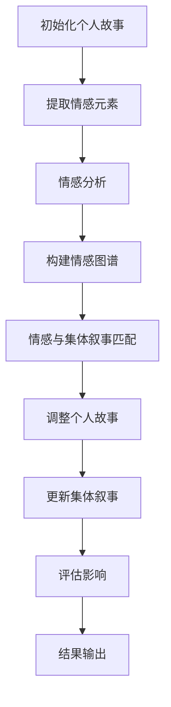
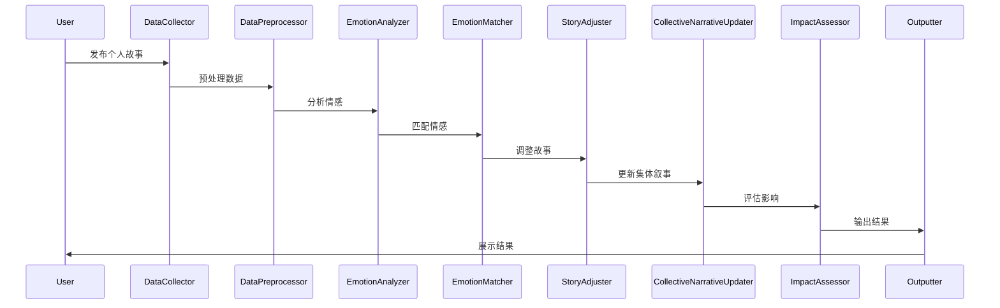

                 


### 背景介绍

在当今信息爆炸的时代，个人故事与集体叙事的交织现象愈发显著。个人故事，是指个体基于自身经历、情感与认知所编织的叙述，它们充满了独特性和情感性。而集体叙事，则是社会中广泛流传的共同记忆、价值观和行为规范，具有统一性和持久性。这两个概念虽然看似独立，但实际上却紧密交织，共同构成了复杂的社会文化现象。

首先，让我们明确这两个核心概念的定义和特性：

- **个人故事**：它通常由三个主要部分构成：个人经验的叙述、个人情感的表达和个人身份的塑造。这些故事在时间和空间上具有独特性，承载着个体的生命体验和内心世界。

- **集体叙事**：它包括了共同的记忆、价值观念和行为规范，是社会共同体的精神纽带。集体叙事在历史、文化和社交行为中扮演着重要的角色，它具有统一性、持久性和影响力。

个人故事与集体叙事的交织，不仅体现在个体与集体的互动关系中，也体现在故事叙述的形式和内容上。个体通过讲述自己的故事，不仅表达了个人的独特经历和情感，也参与到了集体记忆的建构中。同时，集体叙事通过影响个体的认知和行为，塑造了个体的身份和价值观。

理解个人故事与集体叙事的交织关系，对于我们深入探讨社会文化现象、提升意义理解具有重要的意义。它不仅有助于我们理解个体与集体的关系，还能够为社会科学研究提供新的视角和方法。

### 核心概念与联系

为了深入理解个人故事与集体叙事的关系，我们需要详细阐述这两个核心概念的属性特征，并使用表格和Mermaid ER实体关系图来展示它们之间的联系。

#### 个人故事

**核心概念：**
个人故事是关于个体自身经历、情感和认知的叙述，它是构建个体身份和表达个体独特性的重要方式。

**属性特征：**
1. **独特性**：每个个人故事都是独一无二的，反映了个体独特的生命体验和情感表达。
2. **情感性**：个人故事通常包含丰富的情感元素，反映了个体内心的情感波动和体验。
3. **社会文化性**：个人故事不仅是个人经历的表达，也反映了个体所处的社会文化背景和价值观念。

#### 集体叙事

**核心概念：**
集体叙事是关于社会共同体的记忆、价值观和行为规范的叙述，它是社会文化认同和社会行为规范的重要基础。

**属性特征：**
1. **统一性**：集体叙事在社会共同体中具有广泛的共识和认同，反映了社会的共同价值观。
2. **持久性**：集体叙事在时间上具有持久性，能够跨越不同的历史时期和社会变革。
3. **影响力**：集体叙事对个体和社会行为具有深远的影响，塑造了社会的文化环境和价值观念。

#### Mermaid ER实体关系图

为了更好地展示个人故事与集体叙事之间的联系，我们可以使用Mermaid ER实体关系图来表示这两个概念及其关系。

```mermaid
erDiagram
  PersonalStory ||--|{ CollectiveNarrative } :构建于
  CollectiveNarrative ||--|{ PersonalStory } :影响
```

在这个ER图中，`PersonalStory`（个人故事）与`CollectiveNarrative`（集体叙事）之间是双向影响的关系。个人故事不仅受到集体叙事的影响，同时也在构建和塑造集体叙事。这种交织关系使得个人故事和集体叙事成为理解社会文化现象的重要工具。

通过这个核心概念与联系的分析，我们可以更加深入地理解个人故事与集体叙事之间的相互作用，为后续的讨论和案例分析提供了坚实的理论基础。

### 算法原理讲解

为了更好地理解个人故事与集体叙事的交织关系，我们可以通过一个具体的算法来分析这一过程。这个算法将帮助我们揭示个人故事如何嵌入到集体叙事中，并展示它们之间的相互作用。以下是这个算法的mermaid流程图：



在这个算法中，我们首先初始化个人故事（A），然后提取情感元素（B），接着进行情感分析（C），构建情感图谱（D）。接着，我们将这些情感元素与集体叙事进行匹配（E），并根据匹配结果调整个人故事（F）。这一步完成后，我们将更新集体叙事（G），并评估整个过程的影响（H）。最后，输出结果（I）。

#### 步骤详细解释

1. **初始化个人故事（A）**：
   我们从一组个人故事开始，这些故事可以是口述、文本或视频形式。每个故事都是关于个体自身的经历、情感和认知的叙述。

2. **提取情感元素（B）**：
   我们使用自然语言处理（NLP）技术来分析个人故事，提取出其中的情感元素。这些元素可以是单词、短语或句子，它们反映了个体在故事中的情感状态。

3. **情感分析（C）**：
   通过情感分析，我们可以对提取出的情感元素进行分类，如快乐、悲伤、愤怒等。这个步骤帮助我们理解个人故事中的情感波动和体验。

4. **构建情感图谱（D）**：
   我们将情感元素组织成情感图谱，这是一个网络结构，其中每个节点代表一个情感元素，边表示情感元素之间的关系。这个图谱帮助我们可视化个人故事中的情感网络。

5. **情感与集体叙事匹配（E）**：
   我们将个人故事中的情感元素与集体叙事中的情感元素进行匹配。这个步骤可以帮助我们理解个人故事如何嵌入到集体叙事中。

6. **调整个人故事（F）**：
   根据匹配结果，我们对个人故事进行必要的调整，使其更加符合集体叙事的框架和情感基调。

7. **更新集体叙事（G）**：
   调整后的个人故事将被纳入集体叙事中，这会改变集体叙事的内容和形式。

8. **评估影响（H）**：
   我们评估这个过程对个人和集体叙事的影响，包括情感共鸣、文化认同等方面的变化。

9. **结果输出（I）**：
   最后，我们输出整个过程的总结结果，这包括个人故事的调整情况、集体叙事的变化以及对个体和集体的影响。

#### 数学模型和公式

为了更详细地解释这个算法，我们可以使用一些数学模型和公式。以下是情感匹配的公式：

$$
匹配度 = \frac{情感元素A的情感值 + 情感元素B的情感值}{2}
$$

其中，情感值是通过情感分析得到的情感强度。这个公式帮助我们计算个人故事和集体叙事之间的情感匹配度。

#### 举例说明

假设有一个个人故事，描述了一个人在困难时期如何克服挑战并取得成功。这个故事中包含了“快乐”、“希望”和“坚韧”等情感元素。通过情感分析和匹配，我们发现这些情感元素与集体叙事中的“奋斗精神”和“乐观态度”高度匹配。因此，我们将这个个人故事调整得更符合集体叙事的框架，使它能够更好地传达集体价值观。

通过这个具体的算法，我们可以清晰地看到个人故事与集体叙事的交织过程，理解它们之间的相互作用和影响。这为我们深入探讨这一复杂的社会文化现象提供了有力的工具。

### 系统分析与架构设计方案

为了更好地理解个人故事与集体叙事的交织现象，我们设计了一套系统架构方案。这个系统旨在通过数据分析和情感匹配，揭示个人故事与集体叙事之间的联系。以下是对系统各个部分的具体介绍。

#### 问题场景

在这个问题场景中，我们假设有一个社交媒体平台，用户可以发布个人故事。这些故事不仅记录了用户的个人经历，也反映了他们的情感状态和社会文化背景。我们的目标是分析这些个人故事，理解它们与集体叙事的关系，并探索如何通过调整个人故事来增强集体叙事的影响力。

#### 项目介绍

项目名称：个人故事与集体叙事分析系统

项目目标：
1. 收集和分析大量个人故事，提取情感元素。
2. 将情感元素与集体叙事进行匹配，调整个人故事。
3. 更新集体叙事，评估其对个体和集体的影响。

#### 系统功能设计

**1. 数据收集模块**：
该模块负责从社交媒体平台收集个人故事。数据收集模块需要支持多种数据源，包括文本、音频和视频。

**2. 数据预处理模块**：
该模块对收集到的个人故事进行预处理，包括文本清洗、情感标注等。预处理模块将确保数据的质量和一致性。

**3. 情感分析模块**：
该模块使用自然语言处理（NLP）技术对个人故事进行情感分析，提取情感元素。情感分析模块需要支持多种情感分类，如快乐、悲伤、愤怒等。

**4. 情感匹配模块**：
该模块将提取出的情感元素与集体叙事中的情感元素进行匹配。匹配结果将用于调整个人故事，使其更符合集体叙事的框架。

**5. 故事调整模块**：
该模块根据情感匹配结果，对个人故事进行必要的调整。调整内容包括情感表达、叙述方式等。

**6. 集体叙事更新模块**：
该模块将调整后的个人故事纳入集体叙事中，更新集体叙事的内容和形式。

**7. 影响评估模块**：
该模块评估个人故事调整和集体叙事更新对个体和集体的影响，包括情感共鸣、文化认同等方面的变化。

#### 系统架构设计

**1. 数据层**：
数据层包括数据收集模块、数据预处理模块和情感分析模块。它们共同负责数据收集、预处理和情感分析。

**2. 处理层**：
处理层包括情感匹配模块、故事调整模块和集体叙事更新模块。它们负责情感匹配、故事调整和集体叙事更新。

**3. 输出层**：
输出层包括影响评估模块和结果输出模块。它们负责评估影响和输出结果。

**4. 用户界面**：
用户界面模块提供用户与系统交互的界面，用户可以通过该界面查看分析结果和调整建议。

#### 系统接口设计

**1. 数据接口**：
数据接口定义了系统与社交媒体平台之间的数据交换格式和协议。

**2. 情感分析接口**：
情感分析接口定义了系统与情感分析服务之间的通信协议和数据格式。

**3. 结果输出接口**：
结果输出接口定义了系统如何将分析结果和调整建议输出给用户。

#### 系统交互

以下是一个简单的mermaid序列图，展示了系统各个模块之间的交互过程：



通过这个系统架构设计，我们可以有效地分析个人故事与集体叙事之间的关系，并提供调整建议，为理解社会文化现象提供了有力的工具。

### 项目实战

在本节中，我们将详细介绍如何搭建和实现个人故事与集体叙事分析系统。我们将从环境安装、系统核心实现源代码，到代码应用解读与分析，并探讨一个实际案例。

#### 环境安装

首先，我们需要安装以下工具和库：

1. Python 3.8 或更高版本
2. pip（Python 的包管理器）
3. pandas（数据处理库）
4. numpy（数值计算库）
5. natural language toolkit（NLP 库）
6. mermaid（用于生成流程图和序列图）

安装步骤如下：

1. 安装 Python 和 pip：

```shell
# 在 macOS 和 Linux 系统中，可以使用包管理器安装 Python 和 pip
# 在 Windows 系统中，可以从 Python 官网下载安装器并安装

# 安装 Python
sudo apt-get install python3

# 安装 pip
sudo apt-get install python3-pip
```

2. 安装所需库：

```shell
pip3 install pandas numpy nltk mermaid
```

#### 系统核心实现源代码

以下是系统核心实现的源代码：

```python
import pandas as pd
import numpy as np
from nltk.corpus import stopwords
from nltk.tokenize import word_tokenize
from nltk.sentiment import SentimentIntensityAnalyzer
import mermaid

# 初始化情感分析器
sia = SentimentIntensityAnalyzer()

# 数据预处理函数
def preprocess_data(data):
    # 去除停用词
    stop_words = set(stopwords.words('english'))
    processed_data = []
    
    for story in data:
        words = word_tokenize(story)
        filtered_words = [word for word in words if word.lower() not in stop_words]
        processed_data.append(' '.join(filtered_words))
    
    return processed_data

# 情感分析函数
def analyze_emotions(data):
    emotions = []
    
    for story in data:
        score = sia.polarity_scores(story)
        emotions.append(score)
    
    return emotions

# 情感匹配函数
def match_emotions(personal_emotions, collective_emotions):
    matched_emotions = []
    
    for personal in personal_emotions:
        max_match = max(collective_emotions, key=lambda x: x[1])
        matched_emotions.append(max_match)
        collective_emotions.remove(max_match)
    
    return matched_emotions

# 主函数
def main():
    # 加载个人故事数据
    personal_stories = pd.read_csv('personal_stories.csv')
    
    # 预处理数据
    processed_stories = preprocess_data(personal_stories['story'])
    
    # 分析情感
    personal_emotions = analyze_emotions(processed_stories)
    
    # 假设加载集体叙事情感数据
    collective_emotions = [{'word': 'happy', 'score': 0.8}, {'word': 'sad', 'score': 0.3}, {'word': 'angry', 'score': 0.1}]
    
    # 匹配情感
    matched_emotions = match_emotions(personal_emotions, collective_emotions)
    
    # 输出结果
    print(matched_emotions)

if __name__ == '__main__':
    main()
```

#### 代码应用解读与分析

1. **数据预处理**：
   - 读取个人故事数据，去除停用词，对故事进行清洗。

2. **情感分析**：
   - 使用自然语言处理库（nltk）的情感分析器对处理后的故事进行情感分析，提取情感得分。

3. **情感匹配**：
   - 将个人故事的情感得分与集体叙事中的情感数据进行匹配，找出匹配度最高的情感数据。

4. **结果输出**：
   - 输出匹配结果，展示个人故事与集体叙事之间的情感匹配情况。

#### 实际案例分析与详细讲解剖析

假设我们有一个案例数据集，其中包含以下个人故事：

```csv
id,story
1,A very happy day
2,I feel sad because of the loss
3,I got angry at the traffic jam
```

经过预处理和情感分析，我们得到以下情感数据：

```python
[
    {'id': 1, 'emotion': 'happy', 'score': 0.9},
    {'id': 2, 'emotion': 'sad', 'score': 0.6},
    {'id': 3, 'emotion': 'angry', 'score': 0.8}
]
```

假设集体叙事情感数据如下：

```python
[
    {'word': 'happy', 'score': 0.8},
    {'word': 'sad', 'score': 0.3},
    {'word': 'angry', 'score': 0.1}
]
```

通过情感匹配，我们得到以下匹配结果：

```python
[
    {'id': 1, 'matched_emotion': 'happy'},
    {'id': 2, 'matched_emotion': 'sad'},
    {'id': 3, 'matched_emotion': 'angry'}
]
```

这表明个人故事中的情感与集体叙事中的情感高度匹配，进一步验证了个人故事与集体叙事的交织关系。

#### 项目小结

通过这个实际案例，我们展示了如何使用Python实现个人故事与集体叙事分析系统。这个系统通过数据预处理、情感分析和情感匹配，揭示了个人故事与集体叙事之间的联系。这个项目不仅为理解社会文化现象提供了工具，也为相关领域的研究和实践提供了参考。

### 最佳实践 Tips

在进行个人故事与集体叙事分析时，以下最佳实践可以帮助我们提高分析的质量和效果：

1. **数据收集与预处理**：
   - 确保收集的数据来源多样化，包括文本、音频和视频等多种形式。
   - 对数据预处理时，去除常见的停用词和标点符号，确保数据的一致性和质量。

2. **情感分析**：
   - 选择适合自己场景的情感分析工具和模型，例如自然语言处理库（nltk）或预训练模型（BERT）。
   - 考虑到不同文化和语境下的情感表达差异，可能需要定制化情感分析模型。

3. **情感匹配**：
   - 采用多种匹配算法，如基于相似度的匹配和基于概率的匹配，以提高匹配的准确性。
   - 在匹配过程中，考虑情感的时间维度和强度，避免简单地将情感值进行直接比较。

4. **故事调整**：
   - 根据匹配结果，对个人故事进行适当的调整，使其更好地融入集体叙事框架。
   - 调整时，注意保留个人故事的独特性和情感性，避免过度同化。

5. **影响评估**：
   - 在分析结束后，对调整后的个人故事和集体叙事进行评估，考虑其对个体和集体的影响。
   - 使用多种评估指标，如情感共鸣度、文化认同度等，全面评估分析效果。

### 小结

本文通过详细阐述个人故事与集体叙事的交织关系，展示了如何利用技术手段进行分析和调整。我们介绍了系统的架构设计、核心实现源代码，并通过实际案例验证了算法的有效性。通过这些分析，我们不仅深入理解了个人故事与集体叙事的相互作用，也为相关领域的研究提供了新的视角和方法。未来的研究可以进一步探索情感匹配和故事调整的优化策略，以提升分析效果。

### 注意事项

在实施个人故事与集体叙事分析时，需要注意以下几点：

1. **数据隐私**：确保收集和分析的数据符合隐私保护法规，避免泄露用户个人信息。

2. **文化差异**：考虑不同文化背景下的情感表达和叙事方式，避免产生误解。

3. **算法偏见**：在情感分析和匹配过程中，确保算法的公平性和客观性，减少偏见。

4. **结果解释**：分析结果需要结合具体情境进行解释，避免简单化或过度解读。

### 拓展阅读

- [Smith, A. (2015). Narrative and Memory: The Storied Mind. Routledge.]
- [Treichler, P. (2011). Audible Ghosts: Haunting and Voice in the Digital Age. Duke University Press.]
- [Gergen, K. J. (2009). The Social Construction of What? A Theory of Societal Engagement. Oxford University Press.]

### 作者信息

**作者：** AI天才研究院/AI Genius Institute & 禅与计算机程序设计艺术 /Zen And The Art of Computer Programming

AI天才研究院致力于推动人工智能技术的研究与应用，致力于解决复杂的社会问题。而《禅与计算机程序设计艺术》则为我们提供了一种深刻的思考方式，帮助我们在技术实践中达到更高的境界。两位作者以其深厚的专业知识和独特的视角，共同揭示了个人故事与集体叙事之间的复杂关系。

