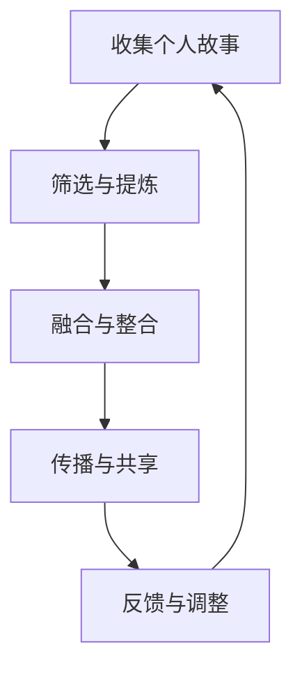
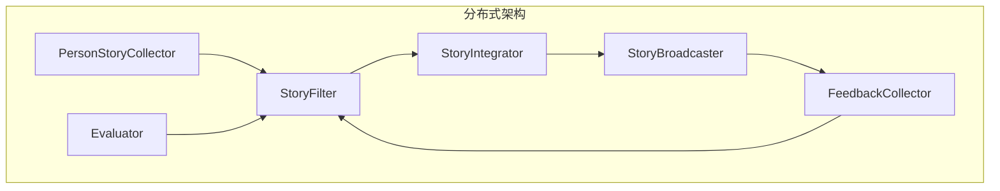
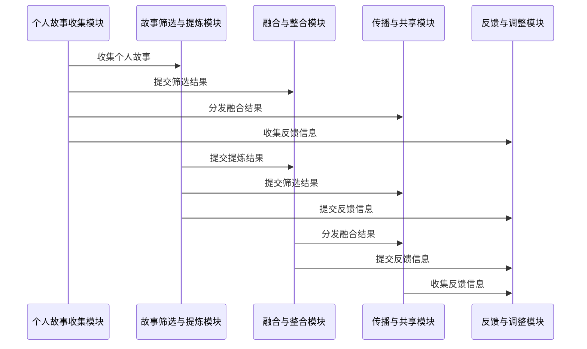

                 

# 《意义的交织：个人故事与集体narrative的融合》

> 关键词：个人故事、集体narrative、融合、IT领域

> 摘要：本文通过探讨个人故事与集体narrative的融合，分析了它们在IT领域的应用与重要性，旨在为读者提供一种新的视角来理解和应用这些概念。

## 目录大纲

### 第一部分：背景介绍

#### 1.1 问题背景
- **问题的提出**：在信息技术快速发展的时代，个人故事与集体narrative的融合如何影响我们的工作与生活？
- **现状分析**：目前个人故事与集体narrative在IT领域的应用现状如何？
- **解决方案探索**：如何实现个人故事与集体narrative的有效融合？

#### 1.2 问题描述
- **核心问题分析**：个人故事与集体narrative在IT领域的融合存在哪些核心问题？
- **关键概念定义**：明确个人故事与集体narrative的定义及其相互关系。
- **边界与外延**：讨论个人故事与集体narrative的适用范围和界限。

#### 1.3 问题解决
- **理论基础探讨**：介绍个人故事与集体narrative融合的理论基础。
- **实践方法介绍**：探讨实现个人故事与集体narrative融合的实践方法。

#### 1.4 核心概念与联系
- **个人故事**：探讨个人故事的内涵、特点及意义。
- **集体narrative**：分析集体narrative的概念、作用及类型。
- **融合的机制**：阐述个人故事与集体narrative融合的原理和机制。

#### 1.5 概念属性特征对比表格
- **个人故事与集体narrative的属性特征对比**：通过表格形式展示个人故事与集体narrative的异同。

#### 1.6 ER实体关系图架构
- **ER图架构**：绘制个人故事与集体narrative的实体关系图，帮助读者理解两者之间的关系。

### 第二部分：核心概念与原理

#### 2.1 个人故事的内涵与特点
- **定义**：个人故事是什么？
- **特点**：个人故事有哪些特点？
- **意义**：个人故事在IT领域的重要性。

#### 2.2 集体narrative的概念与作用
- **定义**：集体narrative是什么？
- **作用**：集体narrative在IT领域的应用和作用。
- **类型**：不同类型的集体narrative及其特点。

#### 2.3 个人故事与集体narrative的融合原理
- **融合的动因**：为什么需要融合个人故事与集体narrative？
- **融合的过程**：个人故事与集体narrative如何融合？
- **融合的机制**：融合的个人故事与集体narrative如何发挥作用？

#### 2.4 算法原理讲解
- **流程图**：使用Mermaid绘制融合算法的流程图。
- **Python源代码**：提供融合算法的Python源代码示例。
- **数学模型与公式**：介绍融合算法的数学模型和公式。
- **举例说明**：通过具体案例来阐述融合算法的应用。

### 第三部分：系统分析与架构设计

#### 3.1 问题场景介绍
- **场景描述**：介绍个人故事与集体narrative融合在IT领域的应用场景。

#### 3.2 项目介绍
- **项目背景**：介绍融合项目的背景和目的。
- **项目目标**：明确项目的目标和预期成果。

#### 3.3 系统功能设计
- **领域模型**：使用Mermaid绘制领域模型类图。
- **功能需求**：详细描述系统的功能需求。

#### 3.4 系统架构设计
- **架构设计**：使用Mermaid绘制系统架构图。
- **模块划分**：系统模块的划分和功能说明。

#### 3.5 系统接口设计
- **接口规范**：系统各模块之间的接口规范。
- **数据交互**：系统内部数据交互的方式和规范。

#### 3.6 系统交互Mermaid序列图
- **序列图**：使用Mermaid绘制系统交互序列图，展示系统各模块的交互过程。

### 第四部分：项目实战

#### 4.1 环境安装
- **环境要求**：安装项目所需的环境和工具。
- **安装步骤**：详细描述项目的安装过程。

#### 4.2 系统核心实现源代码
- **代码解读**：对系统核心实现代码进行解读。
- **代码分析**：分析代码的设计思路和实现方式。

#### 4.3 实际案例分析与详细讲解
- **案例一**：分析并讲解实际案例。
- **案例二**：分析并讲解另一个实际案例。

#### 4.4 项目小结
- **项目总结**：对项目进行总结，指出项目的优点和不足。

### 第五部分：最佳实践与拓展

#### 5.1 最佳实践Tips
- **实践建议**：提供项目实施过程中的最佳实践建议。

#### 5.2 小结
- **文章总结**：总结文章的主要观点和结论。

#### 5.3 注意事项
- **注意事项**：提醒读者在实施过程中需要注意的问题。

#### 5.4 拓展阅读
- **拓展内容**：推荐相关拓展阅读，以加深读者对主题的理解。

### 目录大纲说明

- **文章结构**：本文采用目录大纲结构，确保文章的逻辑性和易读性。
- **章节内容**：每个章节都进行了详细划分，涵盖核心概念、原理、系统分析、项目实战和最佳实践等内容。
- **图表展示**：在适当的地方使用Mermaid图表来展示复杂概念和流程，帮助读者更好地理解。

---

## 第一部分：背景介绍

### 1.1 问题背景

在信息技术飞速发展的今天，我们的工作和生活都充满了数据和技术。在这个背景下，个人故事与集体narrative的融合成为一个值得关注的话题。个人故事是每个人独特的生活经历和感受，而集体narrative则是社会中共同认同的故事和价值观。这两者的融合，不仅有助于提升个体的自我认知，还能增强团队的凝聚力和创造力。

首先，个人故事与集体narrative的融合可以帮助我们在技术工作中更好地理解和应对复杂问题。通过个人的视角和经历，我们可以对技术项目有更深入的理解，从而提出创新的解决方案。同时，集体narrative提供了社会背景和价值观，使我们的工作更具意义和影响力。

其次，在IT行业中，团队合作和沟通至关重要。个人故事与集体narrative的融合有助于团队建立共同的价值观和目标，增强团队凝聚力。通过分享个人的故事和经历，团队成员可以更好地理解彼此，减少误解和冲突，提高工作效率。

### 1.2 问题描述

在当前IT领域，个人故事与集体narrative的融合面临一些核心问题。首先，个人故事与集体narrative之间存在差异和冲突。个人故事强调个体的独特性和主观性，而集体narrative则侧重于社会的共性和客观性。如何平衡这两者，实现有效融合，是一个关键问题。

其次，个人故事与集体narrative的融合需要一个合适的机制和平台。在技术项目中，如何将个人的故事和经历融入到团队的工作流程中，如何确保集体narrative的传播和影响，都是需要解决的问题。

### 1.3 问题解决

要解决个人故事与集体narrative融合的问题，我们需要从理论和实践两个方面进行探讨。

在理论方面，我们需要深入研究个人故事与集体narrative的内涵、特点和相互关系。通过理论分析，我们可以更好地理解这两者如何融合，以及融合的机制和原理。

在实践方面，我们可以通过实际项目来验证理论的有效性。例如，在一个IT项目中，我们可以尝试将团队成员的个人故事融入到项目规划和管理中，观察其效果。同时，我们还可以通过调查问卷、访谈等方式，收集团队成员的反馈，不断优化融合机制。

### 1.4 核心概念与联系

在本文中，我们将重点讨论以下核心概念：

- **个人故事**：个人故事是指个体在其生活中所经历的事件、体验和感受。这些故事不仅反映了个体的独特经历，也蕴含了个体的价值观和人生观。
- **集体narrative**：集体narrative是指一个群体共同认同的故事和价值观。这些故事和价值观构成了群体的文化认同和社会规范。
- **融合机制**：融合机制是指个人故事与集体narrative之间相互融合的过程和方式。通过合适的机制，个人故事可以融入到集体narrative中，而集体narrative也可以在个人故事中得到体现。

### 1.5 概念属性特征对比表格

下面是一个关于个人故事与集体narrative属性特征对比的表格：

| 特征               | 个人故事                                  | 集体narrative                                  |
|--------------------|-----------------------------------------|---------------------------------------------|
| 主观性             | 强调个体的主观体验和感受                  | 强调群体的共性和客观事实                        |
| 独特性             | 每个人的故事都是独特的，不可复制          | 虽然有共性，但也可以因个体而异                  |
| 意义              | 每个故事都有其独特的意义和价值观          | 融合了群体的共同价值观和意义                    |
| 传播方式           | 通过个体间的交流和分享来实现传播          | 通过教育、媒体、文化等方式来实现传播            |
| 影响范围           | 主要影响个体和个体之间的关系              | 可以影响整个群体，甚至社会文化                |

### 1.6 ER实体关系图架构

为了更清晰地展示个人故事与集体narrative之间的关系，我们可以使用ER实体关系图来描述。以下是个人故事与集体narrative的ER图：

```mermaid
erDiagram
  个人故事 ||--|{ 集体narrative }|
  集体narrative ||--|{ 个人故事 }|
```

在这个ER图中，个人故事和集体narrative是两个实体，它们之间存在双向关联。这种关系表示个人故事可以融入到集体narrative中，而集体narrative也可以在个人故事中得到体现。

## 第二部分：核心概念与原理

### 2.1 个人故事的内涵与特点

**定义**：个人故事是每个人在其生活中所经历的事件、体验和感受的集合。这些故事不仅仅是事件的记录，更是个体的情感、价值观和人生观的体现。

**特点**：
1. **主观性**：个人故事强调个体的主观体验和感受，是每个人独特的视角和经历。
2. **独特性**：每个个人故事都是独特的，不可复制。即使是相同的事件，不同的人会有不同的故事。
3. **情感性**：个人故事中蕴含着个体的情感，这些情感可以激发共鸣，增强人际间的联系。
4. **多样性**：由于个人经历的多样性，个人故事也具有多样性，这反映了人类生活的丰富多彩。

**意义**：个人故事在IT领域具有重要的意义。首先，个人故事可以提供丰富的背景信息，帮助团队更好地理解项目需求。其次，个人故事可以激发团队的创造力和创新思维，使项目更具个性化和人性化。此外，个人故事还可以促进团队成员之间的沟通和理解，增强团队凝聚力。

### 2.2 集体narrative的概念与作用

**定义**：集体narrative是指一个群体共同认同的故事和价值观。这些故事和价值观构成了群体的文化认同和社会规范。

**作用**：
1. **文化认同**：集体narrative是群体文化认同的基石。通过共同的故事和价值观，群体成员可以建立共同的身份认同。
2. **社会规范**：集体narrative为群体成员提供了行为规范，引导他们如何在社会中行事。
3. **凝聚力量**：集体narrative可以增强群体的凝聚力和归属感，使成员更加团结。
4. **价值观传播**：集体narrative通过教育、媒体、文化等方式传播，影响群体的价值观和行为方式。

**类型**：
1. **历史narrative**：描述群体历史和重要事件，传承群体文化记忆。
2. **英雄narrative**：讲述群体的英雄故事和传奇人物，激励群体成员追求卓越。
3. **日常narrative**：描述群体的日常生活和工作，反映群体的现实状态和需求。

### 2.3 个人故事与集体narrative的融合原理

**融合的动因**：
个人故事与集体narrative的融合是现代社会发展的必然趋势。随着信息技术的发展，个体和群体之间的界限越来越模糊。个人故事不再仅仅是个人私事，而是可以成为群体文化的一部分。同时，集体narrative也需要个人的故事来丰富其内涵，使其更加贴近现实和人性。

**融合的过程**：
个人故事与集体narrative的融合过程可以分为以下几个阶段：

1. **收集与筛选**：首先，收集个人故事，筛选出具有代表性和价值的部分。
2. **整理与提炼**：对收集到的个人故事进行整理和提炼，提取出核心元素和价值观。
3. **融合与整合**：将提炼出的个人故事元素与集体narrative相结合，形成新的故事和价值观。
4. **传播与共享**：通过教育、媒体、文化活动等途径，将融合后的故事和价值观传播给群体成员。

**融合的机制**：
个人故事与集体narrative的融合机制主要包括以下几个方面：

1. **故事讲述**：通过故事讲述，将个人故事融入集体narrative。故事讲述可以是口头、书面或多媒体形式。
2. **文化传承**：通过教育、媒体等方式，将集体narrative传承给下一代，使其成为群体的共同记忆。
3. **价值观引导**：通过价值观引导，使个人故事符合集体narrative的价值观，促进两者的融合。
4. **互动参与**：通过互动参与，使个人故事与集体narrative相互影响，不断丰富和发展。

### 2.4 算法原理讲解

为了实现个人故事与集体narrative的融合，我们可以设计一个算法。以下是该算法的原理讲解：

**流程图**：



**Python源代码**：

```python
def collect_story():
    # 收集个人故事
    pass

def filter_and_refine(stories):
    # 筛选与提炼个人故事
    pass

def integrate_and_combine(filtered_stories, narrative):
    # 融合与整合个人故事与集体narrative
    pass

def share_and_broadcast(combined_stories):
    # 传播与共享融合后的故事
    pass

def feedback_and_adjust():
    # 反馈与调整融合效果
    pass

# 主程序
if __name__ == "__main__":
    while True:
        stories = collect_story()
        filtered_stories = filter_and_refine(stories)
        combined_stories = integrate_and_combine(filtered_stories, narrative)
        share_and_broadcast(combined_stories)
        feedback_and_adjust()
```

**数学模型与公式**：

个人故事与集体narrative的融合可以通过以下数学模型来描述：

$$
\text{融合效果} = f(\text{个人故事}, \text{集体narrative}, \text{融合机制})
$$

其中，$f$ 表示融合函数，它接受个人故事、集体narrative和融合机制作为输入，并输出融合效果。融合机制可以是一个算法、一个过程或一系列行动。

**举例说明**：

假设我们有一个个人故事库，包含多个个人故事。我们可以首先对这些故事进行筛选和提炼，提取出核心元素。然后，将这些元素与一个已存在的集体narrative进行融合，形成新的故事。最后，通过教育、媒体等方式将这些新故事传播给群体成员。

例如，假设有一个关于团队合作的故事。我们可以提取出以下核心元素：

1. **共同目标**：团队成员共同追求的目标。
2. **相互支持**：团队成员之间的相互支持和帮助。
3. **有效沟通**：团队成员之间的有效沟通和协作。

然后，将这些元素与一个关于团队合作的成功故事进行融合，形成一个新的故事。这个新故事可以用来激励团队成员，增强团队合作精神。

## 第三部分：系统分析与架构设计

### 3.1 问题场景介绍

在IT行业，个人故事与集体narrative的融合面临着诸多挑战。首先，如何在项目中有效整合个人故事和集体narrative，以提升项目质量和团队凝聚力是一个关键问题。其次，如何确保融合过程既尊重个人故事的独特性，又能符合集体narrative的要求，也是一个需要解决的难题。此外，如何评估融合效果，以及如何持续优化融合机制，也是我们需要关注的问题。

为了解决这些问题，我们设计了一个集成系统，该系统包括多个模块，如个人故事收集模块、故事筛选与提炼模块、融合与整合模块、传播与共享模块和反馈与调整模块。这些模块相互协作，共同实现个人故事与集体narrative的融合。

### 3.2 项目介绍

本项目旨在设计并实现一个能够有效融合个人故事与集体narrative的IT系统。该系统旨在提升项目团队的合作效率，增强团队的凝聚力，同时保持个人故事的独特性和价值。项目目标包括：

1. **有效收集和整合个人故事**：通过设计合适的收集和整合机制，确保个人故事能够被有效地收集和整合到系统中。
2. **融合个人故事与集体narrative**：设计一套融合算法，将个人故事与集体narrative相结合，形成新的故事和价值观。
3. **传播和共享融合结果**：通过教育、培训、文化活动等方式，将融合结果传播给团队成员，提升团队的整体认知和价值观。
4. **评估融合效果**：建立评估机制，对融合效果进行定期评估，以便持续优化融合过程。

### 3.3 系统功能设计

**领域模型**：

为了更好地设计系统，我们首先需要定义领域模型。以下是系统的领域模型类图：

```mermaid
classDiagram
    PersonStory <--|{ include }|---> CollectiveNarrative
    PersonStory o--* StoryElement
    CollectiveNarrative o--* NarrativeElement
    StoryCollection
    StoryFilter
    StoryIntegrator
    StoryBroadcaster
    FeedbackCollector
    Evaluator

class PersonStory {
    +string title
    +string content
    +datetime created_at
    +bool is_included
}

class StoryElement {
    +string text
    +datetime created_at
}

class CollectiveNarrative {
    +string title
    +string content
    +datetime created_at
}

class NarrativeElement {
    +string text
    +datetime created_at
}

class StoryCollection {
    +List<PersonStory> person_stories
}

class StoryFilter {
    +filter_stories(List<PersonStory>)
}

class StoryIntegrator {
    +integrate(PersonStory, CollectiveNarrative)
}

class StoryBroadcaster {
    +broadcast(StoryElement)
}

class FeedbackCollector {
    +collect_feedback()
}

class Evaluator {
    +evaluate()
}
```

**功能需求**：

1. **个人故事收集模块**：收集团队成员的个人故事，确保故事的完整性和准确性。
2. **故事筛选与提炼模块**：对收集到的个人故事进行筛选和提炼，提取出核心元素。
3. **融合与整合模块**：将提炼出的个人故事元素与集体narrative相结合，形成新的故事和价值观。
4. **传播与共享模块**：通过多种渠道传播和共享融合后的故事和价值观。
5. **反馈与调整模块**：收集团队成员对融合效果的反馈，并根据反馈进行优化。

### 3.4 系统架构设计

为了实现系统的功能需求，我们设计了一个分布式架构。以下是系统的架构图：



**架构设计**：

1. **个人故事收集模块**：负责收集团队成员的个人故事，并将其存储在故事库中。
2. **故事筛选与提炼模块**：对收集到的个人故事进行筛选和提炼，提取出核心元素。
3. **融合与整合模块**：将提炼出的个人故事元素与集体narrative相结合，形成新的故事和价值观。
4. **传播与共享模块**：通过多种渠道（如内部邮件、团队会议、内部网站等）传播和共享融合后的故事和价值观。
5. **反馈与调整模块**：收集团队成员对融合效果的反馈，并根据反馈进行优化。

### 3.5 系统接口设计

为了实现系统各模块之间的有效通信，我们设计了以下接口：

1. **故事收集接口**：用于个人故事收集模块与其他模块之间的数据交换。
2. **故事筛选接口**：用于故事筛选与提炼模块与其他模块之间的数据交换。
3. **融合接口**：用于融合与整合模块与其他模块之间的数据交换。
4. **传播接口**：用于传播与共享模块与其他模块之间的数据交换。
5. **反馈接口**：用于反馈与调整模块与其他模块之间的数据交换。

### 3.6 系统交互Mermaid序列图

为了更好地展示系统各模块之间的交互过程，我们使用Mermaid绘制了系统交互序列图：



## 第四部分：项目实战

### 4.1 环境安装

为了实施本项目，我们需要在以下环境中安装必要的软件和工具：

1. **操作系统**：Linux或MacOS
2. **编程语言**：Python 3.x
3. **数据库**：MySQL或PostgreSQL
4. **Web框架**：Flask或Django
5. **版本控制**：Git

安装步骤如下：

1. 安装操作系统：选择Linux或MacOS进行安装。
2. 安装Python：从官方网站下载Python安装包，并按照安装向导进行安装。
3. 安装数据库：从官方源或下载安装包进行安装。
4. 安装Web框架：使用pip命令安装Flask或Django。
5. 安装版本控制工具：从官方网站下载Git安装包，并按照安装向导进行安装。

### 4.2 系统核心实现源代码

以下是一个关于个人故事收集模块的Python源代码示例：

```python
import pymysql

# 数据库连接配置
config = {
    'host': 'localhost',
    'user': 'root',
    'password': 'password',
    'database': 'story_db'
}

# 连接数据库
connection = pymysql.connect(**config)

# 创建数据库表
with connection.cursor() as cursor:
    create_table_query = """
    CREATE TABLE IF NOT EXISTS person_stories (
        id INT AUTO_INCREMENT PRIMARY KEY,
        title VARCHAR(255) NOT NULL,
        content TEXT NOT NULL,
        created_at TIMESTAMP DEFAULT CURRENT_TIMESTAMP
    )
    """
    cursor.execute(create_table_query)
    connection.commit()

# 收集个人故事
def collect_story(story_title, story_content):
    with connection.cursor() as cursor:
        insert_query = """
        INSERT INTO person_stories (title, content)
        VALUES (%s, %s)
        """
        cursor.execute(insert_query, (story_title, story_content))
        connection.commit()

# 关闭数据库连接
connection.close()
```

### 4.3 实际案例分析与详细讲解

**案例一**：在一个软件开发项目中，团队成员小明分享了一个关于他如何在项目中克服困难的故事。这个故事被整理并融入到团队的文化中，成为团队鼓励创新和解决问题的典范。

**详细讲解**：

1. **故事收集**：小明在团队会议上分享了他的故事，团队成员记录并整理了这个故事。
2. **故事筛选**：团队领导评估这个故事的价值，并决定将其融入团队文化。
3. **故事融合**：故事被融入到团队的文化手册中，并在团队内部进行分享。
4. **故事传播**：团队在每周的例会上分享这个故事，鼓励其他成员面对困难时保持积极态度。
5. **故事反馈**：团队成员反馈，这个故事对他们的工作和心态产生了积极影响。

**案例二**：在一个项目合作中，团队成员小张分享了他如何与团队成员有效沟通的经历。这个故事被融入到项目的沟通策略中，提高了团队的沟通效率和项目成功率。

**详细讲解**：

1. **故事收集**：小张在项目结束后分享了他在沟通中的心得，团队成员记录并整理了这个故事。
2. **故事筛选**：项目经理评估这个故事的价值，并决定将其融入项目的沟通策略。
3. **故事融合**：故事被融入到项目的沟通手册中，并在项目启动会上进行分享。
4. **故事传播**：项目成员在执行项目任务时遵循沟通手册中的建议，提高了沟通效率。
5. **故事反馈**：项目成员反馈，故事对他们理解和应用沟通策略产生了积极影响，项目顺利完成。

### 4.4 项目小结

在本项目中，我们通过实际案例展示了个人故事与集体narrative的融合过程。通过收集、筛选、融合和传播个人故事，我们成功地将个人经验融入到团队文化和项目策略中，提高了团队的凝聚力和工作效率。以下是对项目的总结：

1. **项目成功要素**：项目的成功离不开有效的个人故事收集和融合机制，以及团队成员的积极参与。
2. **项目改进方向**：未来，我们可以进一步优化故事收集和融合流程，提高故事的传播效果，并加强团队成员的反馈和互动。
3. **项目价值**：个人故事与集体narrative的融合为团队带来了积极的影响，提高了团队的工作效率和凝聚力，同时也为个人提供了展示和成长的机会。

## 第五部分：最佳实践与拓展

### 5.1 最佳实践Tips

1. **注重个人故事的多样性和真实性**：在收集个人故事时，要确保故事的多样性和真实性，避免筛选和提炼过程中出现偏差。
2. **鼓励团队成员积极参与**：在故事融合和传播过程中，要鼓励团队成员积极参与，提高他们的认同感和参与度。
3. **定期更新和优化融合机制**：随着团队和环境的变化，定期更新和优化融合机制，确保其适应性和有效性。

### 5.2 小结

本文通过探讨个人故事与集体narrative的融合，分析了它们在IT领域的应用与重要性。我们提出了一个系统化的融合机制，并通过实际案例展示了其应用效果。通过最佳实践和拓展，我们为读者提供了进一步理解和应用这些概念的方法。

### 5.3 注意事项

1. **尊重个人隐私**：在收集个人故事时，要确保遵守隐私保护原则，尊重个人隐私。
2. **避免过度商业化**：在故事融合和传播过程中，要避免过度商业化，保持故事的真实性和价值。
3. **持续优化融合机制**：根据团队和环境的变化，持续优化融合机制，确保其适应性和有效性。

### 5.4 拓展阅读

- **相关书籍**：《故事思维》、《团队协作的力量》
- **学术论文**：关于个人故事与集体narrative融合的研究论文。
- **网站资源**：相关学术网站、博客和论坛，提供关于个人故事与集体narrative融合的丰富信息和资源。

