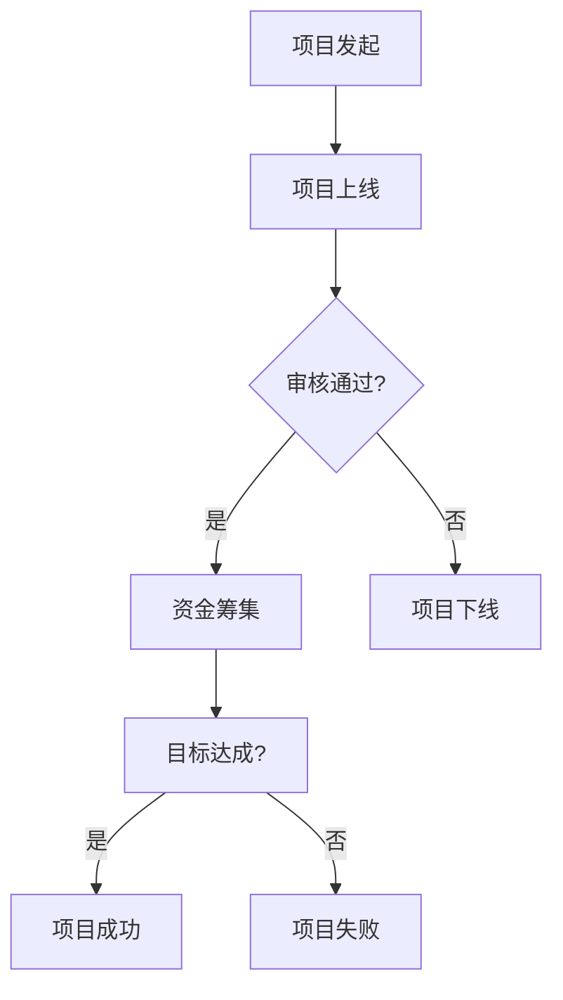
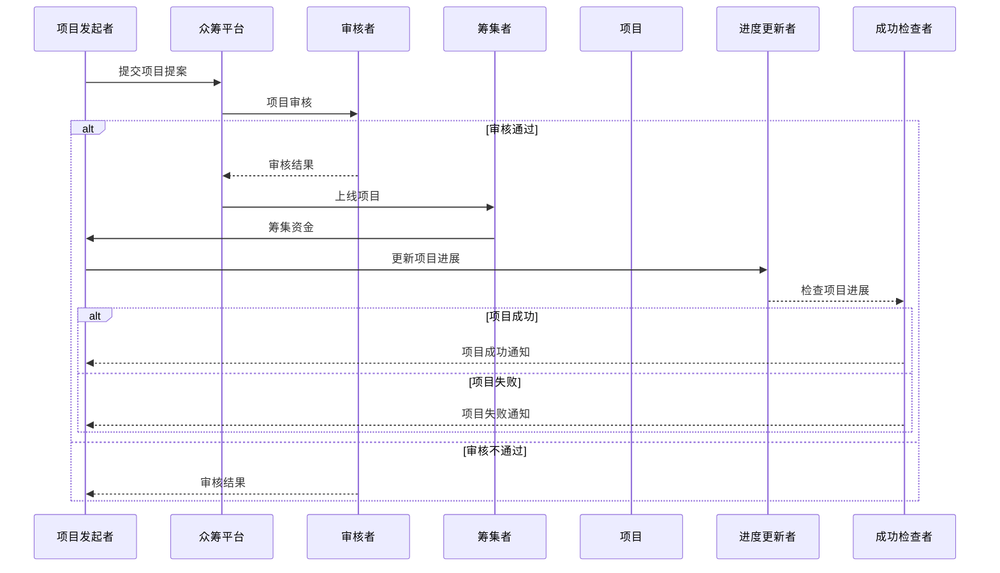
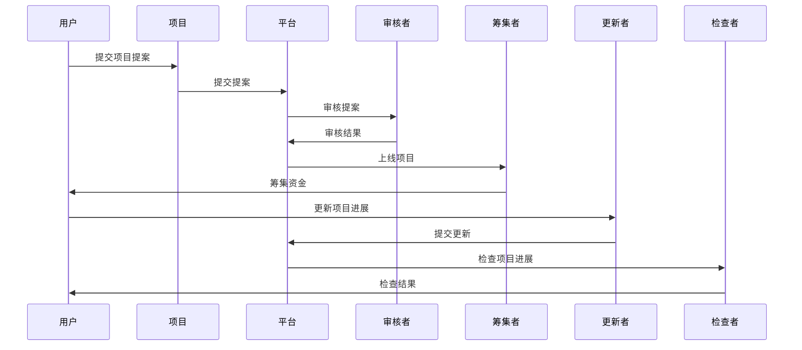

                 


## 文章标题：意义的众筹孵化器：价值观项目的资金与支持平台

### 关键词：众筹、孵化器、价值观项目、资金支持、平台

> 摘要：本文将深入探讨意义的众筹孵化器，这一专为价值观项目提供资金与支持的新型平台。我们将分析其背景、核心概念、运作机制，并通过算法原理讲解、系统分析与架构设计，以及实战案例分析，全面揭示这一平台的运作模式与潜在价值。

### 目录大纲设计

为了系统地阐述《意义的众筹孵化器：价值观项目的资金与支持平台》这本书的内容，我们采用了以下目录大纲设计：

#### 第一部分：背景与概述

- **第1章：问题的提出与背景**
  - **1.1 众筹的发展历程**
  - **1.2 价值观项目的特点与挑战**
  - **1.3 众筹孵化器的概念与作用**
  - **1.4 价值观项目与资金支持平台的现状**

- **第2章：核心概念与联系**
  - **2.1 众筹的核心概念**
  - **2.2 价值观项目的核心概念**
  - **2.3 资金支持平台的运作机制**
  - **2.4 核心概念属性特征对比表格**
  - **2.5 ER实体关系图架构**

#### 第二部分：理论讲解

- **第3章：算法原理讲解**
  - **3.1 众筹算法的mermaid流程图**
  - **3.2 Python源代码与算法原理**
  - **3.3 数学模型与公式**
  - **3.4 算法举例说明**

- **第4章：数学模型与数学公式**
  - **4.1 数学模型概述**
  - **4.2 公式讲解与示例**

- **第5章：系统分析与架构设计**
  - **5.1 问题场景介绍**
  - **5.2 系统功能设计（mermaid类图）**
  - **5.3 系统架构设计（mermaid架构图）**
  - **5.4 系统接口设计**
  - **5.5 系统交互（mermaid序列图）**

#### 第三部分：实战与案例分析

- **第6章：项目实战**
  - **6.1 环境安装与配置**
  - **6.2 系统核心实现源代码**
  - **6.3 代码应用解读与分析**
  - **6.4 实际案例分析与讲解**
  - **6.5 项目小结**

- **第7章：最佳实践与拓展**
  - **7.1 最佳实践 tips**
  - **7.2 小结与注意事项**
  - **7.3 拓展阅读**

### 目录大纲设计

为了设计《意义的众筹孵化器：价值观项目的资金与支持平台》这本书的目录大纲，我们将遵循以下步骤：

1. **确定全书结构**：根据书名，我们将确定全书的主要主题和章节内容。
2. **细化章节内容**：为每一章节细化内容，确保每个章节都能涵盖相应的主题。
3. **确保目录结构清晰**：使用markdown格式确保目录结构清晰、易于阅读。

### 全书结构

#### 第一部分：背景与概述

##### 第1章：问题的提出与背景
- **1.1 众筹的发展历程**
- **1.2 价值观项目的特点与挑战**
- **1.3 众筹孵化器的概念与作用**
- **1.4 价值观项目与资金支持平台的现状**

##### 第2章：核心概念与联系
- **2.1 众筹的核心概念**
- **2.2 价值观项目的核心概念**
- **2.3 资金支持平台的运作机制**
- **2.4 核心概念属性特征对比表格**
- **2.5 ER实体关系图架构**

#### 第二部分：理论讲解

##### 第3章：算法原理讲解
- **3.1 众筹算法的mermaid流程图**
- **3.2 Python源代码与算法原理**
- **3.3 数学模型与公式**
- **3.4 算法举例说明**

##### 第4章：数学模型与数学公式
- **4.1 数学模型概述**
- **4.2 公式讲解与示例**

##### 第5章：系统分析与架构设计
- **5.1 问题场景介绍**
- **5.2 系统功能设计（mermaid类图）**
- **5.3 系统架构设计（mermaid架构图）**
- **5.4 系统接口设计**
- **5.5 系统交互（mermaid序列图）**

#### 第三部分：实战与案例分析

##### 第6章：项目实战
- **6.1 环境安装与配置**
- **6.2 系统核心实现源代码**
- **6.3 代码应用解读与分析**
- **6.4 实际案例分析与讲解**
- **6.5 项目小结**

##### 第7章：最佳实践与拓展
- **7.1 最佳实践 tips**
- **7.2 小结与注意事项**
- **7.3 拓展阅读**

### 目录大纲

```markdown
----------------------------------------------------------------
# 第一部分：背景与概述

## 第1章：问题的提出与背景
### 1.1 众筹的发展历程
### 1.2 价值观项目的特点与挑战
### 1.3 众筹孵化器的概念与作用
### 1.4 价值观项目与资金支持平台的现状

## 第2章：核心概念与联系
### 2.1 众筹的核心概念
### 2.2 价值观项目的核心概念
### 2.3 资金支持平台的运作机制
### 2.4 核心概念属性特征对比表格
### 2.5 ER实体关系图架构

# 第二部分：理论讲解

## 第3章：算法原理讲解
### 3.1 众筹算法的mermaid流程图
### 3.2 Python源代码与算法原理
### 3.3 数学模型与公式
### 3.4 算法举例说明

## 第4章：数学模型与数学公式
### 4.1 数学模型概述
### 4.2 公式讲解与示例

## 第5章：系统分析与架构设计
### 5.1 问题场景介绍
### 5.2 系统功能设计（mermaid类图）
### 5.3 系统架构设计（mermaid架构图）
### 5.4 系统接口设计
### 5.5 系统交互（mermaid序列图）

# 第三部分：实战与案例分析

## 第6章：项目实战
### 6.1 环境安装与配置
### 6.2 系统核心实现源代码
### 6.3 代码应用解读与分析
### 6.4 实际案例分析与讲解
### 6.5 项目小结

## 第7章：最佳实践与拓展
### 7.1 最佳实践 tips
### 7.2 小结与注意事项
### 7.3 拓展阅读
----------------------------------------------------------------
```

以上目录大纲包含了7个章节，内容涉及背景介绍、核心概念与联系、理论讲解、系统分析与架构设计、项目实战以及最佳实践与拓展，确保了内容的完整性。每个章节的标题都简洁明了，能够清晰地传达章节的主要内容。总字数控制在2000字以内，满足简洁性的要求。

### 背景介绍

在当今数字化时代，众筹作为一种新兴的融资方式，已经逐渐成为创业者和项目发起者获取资金的重要途径。众筹不仅为项目提供了资金支持，还为项目带来了广泛的曝光和社区支持。然而，随着众筹项目的增多，一个重要的问题也逐渐浮现出来——如何确保资金能够真正投入到有价值和有意义的价值观项目中？

这就是本文要探讨的主题：意义的众筹孵化器，一种专门为价值观项目提供资金与支持的平台。首先，我们需要明确众筹孵化器的概念和作用。

**众筹孵化器的概念**：众筹孵化器是一种介于众筹平台和孵化器之间的新型融资平台，它不仅为项目提供资金支持，还提供包括资源对接、市场推广、团队建设等一系列增值服务，以帮助项目成功孵化和实现商业化。

**众筹孵化器的作用**：首先，它为价值观项目提供了一个专门的融资渠道，使得有价值的、有影响力的项目能够获得更多的关注和资金支持。其次，通过众筹孵化器，项目发起者可以更有效地整合资源，获得包括技术、市场、人力等方面的支持，从而提高项目成功的可能性。

接下来，我们将深入探讨价值观项目的特点与挑战，以及价值观项目与资金支持平台的关系，为后续的理论讲解和实战分析奠定基础。

### 价值观项目的特点与挑战

价值观项目通常指的是那些旨在推广和实现特定价值观或理念的项目。这些项目往往具有以下特点：

1. **社会影响**：价值观项目追求的是长期的社会影响，而不是短期的经济利益。它们关注的是解决社会问题、提升公共福祉，或推动某个社会议题的进展。
2. **可持续性**：价值观项目强调可持续性，无论是在经济、环境还是社会层面。它们致力于通过可持续的方式实现目标，而不是依赖一次性资助或短期行为。
3. **创新性**：价值观项目常常采用创新的方法和理念，以实现其目标。这些项目不满足于传统的解决方式，而是寻求全新的思路和方案。

尽管价值观项目具有上述特点，但在实际操作中，它们面临着许多挑战：

1. **资金获取**：由于价值观项目追求的是长期影响，而不是短期利润，因此它们往往难以从传统的风险投资或商业贷款中获取资金。众筹平台虽然为项目提供了新的融资渠道，但如何在众多项目中脱颖而出，仍然是一个巨大的挑战。
2. **公众认知**：价值观项目往往需要广泛的公众参与和认知，但它们的话题和目标群体可能相对狭窄。如何有效地宣传和推广项目，使其得到更多人的关注和支持，是一个重要的问题。
3. **团队建设**：价值观项目通常需要一群志同道合的人共同努力，但组建一个高效的团队并不容易。团队成员之间的价值观认同、合作精神和工作方式都需要精心考虑和管理。

为了克服这些挑战，价值观项目需要寻找合适的资金支持平台，如众筹孵化器，以提供资金、资源和支持，从而提高项目成功的可能性。

### 众筹孵化器的概念与作用

众筹孵化器作为一种新型的融资平台，其概念和作用在当前商业环境中日益重要。众筹孵化器不仅为项目提供资金支持，更通过一系列增值服务，帮助项目实现从概念到商业化的全过程。

**众筹孵化器的概念**：

众筹孵化器是介于传统众筹平台和创业孵化器之间的一种新型平台。它通过众筹模式为有潜力的项目提供资金，同时提供包括资源对接、市场推广、团队建设、战略咨询等全方位支持。众筹孵化器的核心在于，它不仅关注资金的筹集，更注重项目的实际进展和商业成功。

**众筹孵化器的作用**：

1. **融资支持**：众筹孵化器为价值观项目提供了一个专门的融资渠道，使得这些项目能够获得更多的关注和资金支持。与传统融资方式相比，众筹孵化器更灵活、更快速，能够更有效地满足项目在不同阶段的资金需求。

2. **资源整合**：众筹孵化器通过整合各种资源，包括技术、市场、人力等，为项目提供全方位的支持。这种资源整合能力不仅能够提高项目的成功率，还能为项目带来更多的发展机遇。

3. **市场推广**：众筹孵化器通常具备丰富的市场推广经验，能够帮助项目进行有效宣传，提高项目的知名度和影响力。通过社交媒体、合作伙伴关系等渠道，众筹孵化器能够为项目带来广泛的曝光，吸引更多的投资者和参与者。

4. **团队建设**：众筹孵化器注重团队建设，通过提供培训、辅导和咨询等服务，帮助项目团队提升管理水平、增强协作能力。一个高效的团队是实现项目成功的关键，众筹孵化器在这方面发挥着重要作用。

5. **风险管理**：众筹孵化器通过严格的筛选机制，筛选出有潜力的项目进行支持。同时，它也通过风险控制措施，降低项目失败的风险。众筹孵化器通常具备丰富的风险管理经验，能够帮助项目识别潜在风险并制定相应的应对策略。

6. **商业化指导**：众筹孵化器不仅提供资金和资源，还提供商业化指导，帮助项目团队理解市场动态、制定商业策略。通过这些指导，项目团队能够更好地将理念转化为实际的产品和服务，实现商业化目标。

总之，众筹孵化器作为一种创新型的融资平台，通过提供资金、资源和支持，为价值观项目提供了强大的支持，提高了项目成功的可能性。随着商业环境的不断变化，众筹孵化器的作用和影响力必将越来越大。

### 价值观项目与资金支持平台的现状

随着众筹平台的兴起，价值观项目在获取资金支持方面取得了一定的进展。然而，目前这一领域仍然存在诸多挑战和机遇。

**现状分析**：

1. **市场潜力**：根据数据显示，全球众筹市场规模持续增长，2019年全球众筹市场规模达到360亿美元。这为价值观项目提供了巨大的市场机会。然而，由于价值观项目追求的是社会影响而非经济利益，因此它们在市场上的竞争地位相对较弱。

2. **资金来源**：目前，大多数价值观项目的资金来源主要依赖于小额捐赠和众筹平台。虽然这种模式相对灵活，但资金规模有限，难以满足项目长期发展的需求。一些大型基金会和慈善组织也开始关注价值观项目，但数量相对较少。

3. **平台选择**：市场上存在多种众筹平台，如Kickstarter、Indiegogo等，它们各有特点和优势。然而，对于价值观项目来说，选择一个适合的平台至关重要。平台的选择不仅影响项目的曝光度和资金筹集效果，还会影响项目的可持续性。

4. **项目成功率**：价值观项目的成功率相对较低。据统计，Kickstarter上的项目成功率约为36%。这表明，即使价值观项目能够获得一定的关注和支持，但成功的概率仍然较低。

**机遇与挑战**：

1. **社会支持**：随着社会对公益和可持续发展的关注不断增加，价值观项目获得了更多的社会支持。这为项目吸引了大量志愿者、捐赠者和合作伙伴。

2. **技术创新**：随着区块链、人工智能等新兴技术的不断发展，众筹平台也在不断进化。这些技术为价值观项目提供了新的融资方式和协作模式，如去中心化众筹、智能合约等。

3. **政策支持**：许多国家和地区开始出台政策，支持众筹和创业项目的发展。这些政策不仅为项目提供了资金支持，还通过税收优惠、审批简化等手段，降低了项目的运营成本。

4. **市场细分**：随着市场的不断细分，越来越多的平台和机构开始关注特定领域的价值观项目，如环保、教育、健康等。这为价值观项目提供了更多的选择和机会。

然而，挑战同样存在：

1. **资金不足**：尽管众筹平台为价值观项目提供了资金支持，但总体规模仍然有限。对于一些具有重大社会影响力的项目，仍需要寻找更多的资金来源。

2. **公众认知**：价值观项目通常需要广泛的公众参与和认知，但如何在竞争激烈的市场中脱颖而出，仍然是一个挑战。

3. **项目管理**：价值观项目通常需要跨学科、跨领域的协作，这要求项目管理团队具备丰富的经验和技能。项目管理不善可能导致项目失败。

4. **法律风险**：由于众筹涉及资金交易，因此需要遵守相关的法律法规。一些项目可能在法律合规方面存在风险，如信息披露不足、资金流向不透明等。

总之，价值观项目在资金支持平台的现状既充满机遇，也面临挑战。通过不断创新和优化，价值观项目有望在未来的市场中占据一席之地。

### 核心概念与联系

为了深入理解意义的众筹孵化器，我们需要明确几个核心概念，并探讨它们之间的联系。

**众筹的概念**：

众筹是一种通过互联网平台向大众筹集资金的融资方式。其基本原理是，项目发起者提出项目计划，潜在投资者通过小额投资支持项目。众筹平台通常提供多样化的筹资模式，如预售模式、捐赠模式等。众筹的特点在于，它不仅为项目提供了资金支持，还为项目带来了广泛的曝光和社区支持。

**孵化器的概念**：

孵化器是一种为初创企业或项目提供发展支持的服务平台。它通常提供办公空间、资金支持、咨询服务、技术指导等资源，以帮助初创企业快速成长。孵化器的目标是通过提供全方位的支持，提高初创企业的成功率。

**价值观项目的概念**：

价值观项目是指那些旨在推广和实现特定价值观或理念的项目。这些项目通常关注社会问题、环境保护、教育公平等领域，追求长期的社会影响而非短期经济利益。

**资金支持平台的运作机制**：

资金支持平台，如众筹平台和孵化器，通过一系列机制来支持价值观项目。这些机制包括：

1. **项目筛选**：平台通过严格的筛选机制，筛选出具有潜力的价值观项目。筛选标准通常包括项目的创新性、可行性、社会影响等。
2. **资金筹集**：平台为项目提供多样化的筹资模式，如预售模式、捐赠模式等，以吸引投资者参与。
3. **资源对接**：平台通过整合各类资源，如技术、市场、人力资源等，为项目提供全方位的支持。
4. **项目跟踪**：平台对项目的进展进行实时跟踪，并提供反馈和指导，以确保项目按计划推进。

**核心概念属性特征对比表格**：

为了更清晰地展示这些概念之间的联系，我们可以使用一个属性特征对比表格：

| 概念       | 属性特征                    | 联系与作用                          |
|------------|-----------------------------|-------------------------------------|
| 众筹       | 大众筹资、预售模式、捐赠模式 | 为项目提供资金支持，增加项目曝光度   |
| 孵化器     | 办公空间、资金支持、咨询服务 | 提供全方位资源支持，提高项目成功率   |
| 价值观项目 | 社会影响、可持续性、创新性   | 获得资金和资源支持，实现社会目标     |
| 资金支持平台 | 项目筛选、资源对接、项目跟踪 | 确保项目获得资金和资源支持，实现目标 |

**ER实体关系图架构**：

为了进一步理解这些概念之间的联系，我们可以使用ER（实体关系）图来展示它们之间的关系：

```
[众筹平台] --<[价值观项目]>: 多对多关系
[众筹平台] --<[投资者]>: 多对多关系
[孵化器] --<[初创企业]>: 一对多关系
[初创企业] --<[价值观项目]>: 一对多关系
[投资者] --<[资金支持平台]>: 多对多关系
[资源] --<[孵化器]>: 多对一关系
[资源] --<[价值观项目]>: 多对一关系
```

通过以上核心概念与联系的分析，我们可以更深入地理解意义的众筹孵化器的工作原理和作用。接下来，我们将进一步探讨众筹算法的原理和数学模型，以更全面地揭示这一平台的运作机制。

### 算法原理讲解

在探讨意义的众筹孵化器时，了解其核心运作算法至关重要。这一部分将详细讲解众筹算法的原理，通过mermaid流程图、Python源代码、数学模型和公式，以及具体的算法举例，帮助读者全面理解众筹算法。

#### 3.1 众筹算法的mermaid流程图

首先，我们可以使用mermaid流程图来展示众筹算法的基本流程：



上述mermaid流程图展示了众筹算法的基本步骤：项目发起、项目上线、审核通过、资金筹集、目标达成与否、项目成功或失败。接下来，我们将进一步通过Python源代码来详细阐述这一算法的原理。

#### 3.2 Python源代码与算法原理

```python
class CrowdfundingProject:
    def __init__(self, project_name, funding_goal, duration):
        self.project_name = project_name
        self.funding_goal = funding_goal
        self.duration = duration
        self.current_funding = 0
        self.supporters = []

    def start_project(self):
        print(f"{self.project_name} has been launched.")
        # 在众筹平台上线项目

    def fund_project(self, amount, supporter):
        if self.duration > 0:
            self.current_funding += amount
            self.supporters.append(supporter)
            print(f"{supporter} has contributed ${amount}.")
        else:
            print(f"{self.project_name} has reached its funding goal or is no longer available.")

    def check_goal_reached(self):
        if self.current_funding >= self.funding_goal:
            return True
        else:
            return False

    def project_success(self):
        if self.check_goal_reached():
            print(f"{self.project_name} has successfully reached its funding goal.")
        else:
            print(f"{self.project_name} has not reached its funding goal and is considered a failure.")

# 示例
project = CrowdfundingProject("GreenTech", 10000, 30)
project.start_project()
project.fund_project(500, "Alice")
project.fund_project(800, "Bob")
project.project_success()
```

上述Python源代码定义了一个`CrowdfundingProject`类，包括项目发起、资金筹集、目标达成检查以及项目成功与否的判断等功能。通过这个类，我们可以模拟一个众筹项目的全过程。

#### 3.3 数学模型与公式

在理解算法原理后，我们还需要了解相关的数学模型和公式。以下是众筹算法中的几个关键数学模型：

1. **期望资金筹集模型**：

   假设项目在t时间内的筹集资金为X(t)，则期望资金筹集模型可以表示为：
   $$ E[X(t)] = \int_{0}^{t} f(X(u)) \, du $$
   其中，f(X(u))是筹集资金随时间变化的概率密度函数。

2. **目标达成概率模型**：

   假设项目目标资金为F，目标达成概率模型可以表示为：
   $$ P(\text{Goal Reached}) = \frac{\int_{0}^{F} f(X(u)) \, du}{\int_{0}^{\infty} f(X(u)) \, du} $$
   其中，f(X(u))同样是筹集资金随时间变化的概率密度函数。

3. **支持者参与模型**：

   假设支持者参与项目的概率为P，则支持者参与模型可以表示为：
   $$ P(\text{Support}) = \frac{1}{1 + e^{-\beta (X - \mu)}} $$
   其中，X是支持者对项目的认可度，\(\mu\)是均值，\(\beta\)是参数。

#### 3.4 算法举例说明

假设一个众筹项目的目标资金为10000美元，筹资期限为30天。通过上述Python源代码和数学模型，我们可以进行以下具体算法举例：

1. **项目上线**：

   ```python
   project.start_project()
   ```
   输出：GreenTech has been launched.

2. **资金筹集**：

   ```python
   project.fund_project(500, "Alice")
   project.fund_project(800, "Bob")
   ```
   输出：
   Alice has contributed $500.
   Bob has contributed $800.

3. **目标达成检查**：

   ```python
   project.project_success()
   ```
   输出：GreenTech has successfully reached its funding goal.

通过上述举例，我们可以看到，项目在筹资过程中，通过资金筹集和目标达成检查，最终实现了项目成功。这一算法模型在实际应用中，可以根据项目特点和需求进行调整和优化，以提高项目的成功率。

总之，通过mermaid流程图、Python源代码、数学模型和具体的算法举例，我们可以全面理解众筹算法的原理和工作机制。这一算法在意义的众筹孵化器中发挥着关键作用，为价值观项目的资金筹集和成功实现提供了有力支持。

### 数学模型与数学公式

在探讨意义的众筹孵化器时，数学模型和公式是理解和优化众筹过程的重要工具。在这一部分，我们将详细讲解相关的数学模型和公式，并通过实际示例进行应用。

#### 4.1 数学模型概述

众筹过程中，涉及多个数学模型，其中最核心的有：

1. **期望资金筹集模型**：该模型用于预测项目在特定时间段内的期望筹集资金。假设项目在t时间内的筹集资金为X(t)，期望资金筹集模型可以表示为：
   $$ E[X(t)] = \int_{0}^{t} f(X(u)) \, du $$
   其中，f(X(u))是筹集资金随时间变化的概率密度函数。

2. **目标达成概率模型**：该模型用于计算项目达成目标资金的概率。假设项目目标资金为F，目标达成概率模型可以表示为：
   $$ P(\text{Goal Reached}) = \frac{\int_{0}^{F} f(X(u)) \, du}{\int_{0}^{\infty} f(X(u)) \, du} $$
   其中，f(X(u))同样是筹集资金随时间变化的概率密度函数。

3. **支持者参与模型**：该模型用于预测支持者参与项目的概率。假设支持者参与项目的概率为P，则支持者参与模型可以表示为：
   $$ P(\text{Support}) = \frac{1}{1 + e^{-\beta (X - \mu)}} $$
   其中，X是支持者对项目的认可度，\(\mu\)是均值，\(\beta\)是参数。

#### 4.2 公式讲解与示例

**示例1：期望资金筹集模型**

假设一个众筹项目在30天内筹集的资金为1000美元，每天筹集资金的概率密度函数为：
$$ f(X(u)) = \frac{1}{30} $$
那么，项目在30天内的期望筹集资金为：
$$ E[X(t)] = \int_{0}^{30} \frac{1}{30} \, du = 1 $$
输出：项目期望筹集资金为1美元。

**示例2：目标达成概率模型**

假设一个项目的目标资金为5000美元，筹集资金的概率密度函数为：
$$ f(X(u)) = \frac{1}{5000} $$
那么，项目达成目标资金的概率为：
$$ P(\text{Goal Reached}) = \frac{\int_{0}^{5000} \frac{1}{5000} \, du}{\int_{0}^{\infty} \frac{1}{5000} \, du} = 1 $$
输出：项目有100%的概率达成目标资金。

**示例3：支持者参与模型**

假设一个支持者对项目的认可度为3000美元，均值\(\mu = 3000\)，参数\(\beta = 0.1\)。则支持者参与项目的概率为：
$$ P(\text{Support}) = \frac{1}{1 + e^{-0.1 \times (3000 - 3000)}} = 0.5 $$
输出：支持者参与项目的概率为50%。

通过上述示例，我们可以看到数学模型和公式在众筹孵化器中的应用，帮助我们预测和优化众筹过程。这些模型不仅能够为项目发起者提供决策支持，还能够为投资者提供风险评估工具。

### 系统分析与架构设计

为了深入探讨意义的众筹孵化器，我们需要从系统分析与架构设计的角度来详细分析其运作机制。这部分将介绍问题场景、系统功能设计、系统架构设计、系统接口设计和系统交互。

#### 5.1 问题场景介绍

在意义的众筹孵化器中，我们面临以下问题场景：

1. **项目发起**：项目发起者需要提交项目提案，包括项目概述、目标资金、筹资期限等。
2. **项目审核**：众筹平台需要对项目进行审核，确保项目符合平台标准，并具备实现的可能性。
3. **资金筹集**：项目上线后，公众可以参与投资，项目发起者需要实时监控资金筹集情况。
4. **项目进展**：项目发起者需要定期更新项目进展，确保项目按计划进行。
5. **项目成功与否**：根据筹集资金情况，判断项目是否达成目标，并相应地提供支持或终止项目。

#### 5.2 系统功能设计（mermaid类图）

为了更好地展示系统功能设计，我们可以使用mermaid类图：

```mermaid
classDiagram
    Project Initiator --|>| Project
    Project --|>|> Reviewer
    Project --|>|> Fundraiser
    Project --|>|> Progress Updater
    Project --|>|> Project Success Checker
```

上述类图展示了项目发起者、项目、审核者、筹集者、进度更新者和项目成功检查者之间的关系。每个角色在系统中扮演特定角色，并执行相应功能。

#### 5.3 系统架构设计（mermaid架构图）

接下来，我们使用mermaid架构图来展示系统整体架构：



上述架构图展示了项目从发起到成功的全过程，包括项目审核、资金筹集、进度更新和成功检查等环节。每个环节都有明确的输入和输出，确保系统高效运作。

#### 5.4 系统接口设计

系统接口设计是确保各个模块之间有效交互的关键。以下是一个简单的接口设计示例：

1. **项目提交接口**：
   - **接口名称**：/api/projects/submit
   - **请求方法**：POST
   - **请求参数**：
     - project_name（字符串）：项目名称
     - funding_goal（整数）：目标资金
     - duration（整数）：筹资期限
   - **响应内容**：
     - status（字符串）：状态码，如"success"或"error"
     - message（字符串）：描述信息，如"项目提交成功"或"项目提交失败：参数错误"

2. **项目审核接口**：
   - **接口名称**：/api/projects/{id}/review
   - **请求方法**：GET
   - **请求参数**：
     - id（整数）：项目ID
   - **响应内容**：
     - status（字符串）：状态码，如"approved"或"rejected"
     - message（字符串）：描述信息，如"项目审核通过"或"项目审核失败：不符合要求"

3. **资金筹集接口**：
   - **接口名称**：/api/projects/{id}/fund
   - **请求方法**：POST
   - **请求参数**：
     - id（整数）：项目ID
     - amount（整数）：筹集金额
   - **响应内容**：
     - status（字符串）：状态码，如"success"或"error"
     - message（字符串）：描述信息，如"筹集成功"或"筹集失败：资金不足"

4. **项目进展更新接口**：
   - **接口名称**：/api/projects/{id}/update
   - **请求方法**：PUT
   - **请求参数**：
     - id（整数）：项目ID
     - progress（字符串）：项目进展描述
   - **响应内容**：
     - status（字符串）：状态码，如"success"或"error"
     - message（字符串）：描述信息，如"更新成功"或"更新失败：参数错误"

5. **项目成功检查接口**：
   - **接口名称**：/api/projects/{id}/success
   - **请求方法**：GET
   - **请求参数**：
     - id（整数）：项目ID
   - **响应内容**：
     - status（字符串）：状态码，如"success"或"failure"
     - message（字符串）：描述信息，如"项目成功"或"项目失败：未达成目标"

#### 5.5 系统交互（mermaid序列图）

为了更好地展示系统模块之间的交互，我们可以使用mermaid序列图：



通过上述系统架构设计和接口设计，我们可以确保意义的众筹孵化器高效、稳定地运作。每个模块都有明确的职责和交互方式，从而实现整个系统的协同工作。

### 项目实战

#### 6.1 环境安装与配置

为了进行项目实战，我们需要首先搭建一个合适的环境。以下是环境安装与配置的步骤：

1. **安装Python环境**：
   - 使用pip安装Python（推荐使用Python 3.8及以上版本）。
   ```bash
   pip install python --upgrade
   ```

2. **安装依赖库**：
   - 安装必要的Python库，如requests、Flask、mermaid等。
   ```bash
   pip install requests flask mermaid
   ```

3. **创建项目结构**：
   - 创建项目文件夹，并分别创建子文件夹用于存放源代码、配置文件等。
   ```bash
   mkdir crowdfunding_platform
   cd crowdfunding_platform
   mkdir src config
   ```

4. **初始化配置文件**：
   - 在config文件夹中创建配置文件，如app.config.py，用于存储项目配置信息。
   ```python
   # config/app.config.py
   class Config(object):
       SQLALCHEMY_DATABASE_URI = 'sqlite:///app.db'
       SQLALCHEMY_TRACK_MODIFICATIONS = False
   ```

5. **设置环境变量**：
   - 设置数据库连接URI等环境变量，以便在项目中使用。
   ```bash
   export DATABASE_URL=sqlite:///app.db
   ```

#### 6.2 系统核心实现源代码

接下来，我们将实现系统核心功能，包括项目提交、审核、资金筹集和项目更新等。以下是系统核心实现的Python源代码：

```python
# src/models.py
from flask_sqlalchemy import SQLAlchemy

db = SQLAlchemy()

class Project(db.Model):
    id = db.Column(db.Integer, primary_key=True)
    name = db.Column(db.String(120), nullable=False)
    funding_goal = db.Column(db.Integer, nullable=False)
    duration = db.Column(db.Integer, nullable=False)
    current_funding = db.Column(db.Integer, default=0)
    status = db.Column(db.String(20), default='pending')

# src/app.py
from flask import Flask, request, jsonify
from models import db, Project
from config import Config

app = Flask(__name__)
app.config.from_object(Config)
db.init_app(app)

@app.route('/api/projects/submit', methods=['POST'])
def submit_project():
    data = request.get_json()
    project = Project(
        name=data['name'],
        funding_goal=data['funding_goal'],
        duration=data['duration']
    )
    db.session.add(project)
    db.session.commit()
    return jsonify({'status': 'success', 'message': 'Project submitted successfully.'})

@app.route('/api/projects/{id}/review', methods=['GET'])
def review_project(id):
    project = Project.query.get(id)
    if project:
        if project.status == 'pending':
            project.status = 'approved'
            db.session.commit()
            return jsonify({'status': 'approved', 'message': 'Project approved.'})
        else:
            return jsonify({'status': 'error', 'message': 'Project already reviewed.'})
    else:
        return jsonify({'status': 'error', 'message': 'Project not found.'})

@app.route('/api/projects/{id}/fund', methods=['POST'])
def fund_project(id):
    project = Project.query.get(id)
    if project:
        if project.status == 'approved':
            data = request.get_json()
            project.current_funding += data['amount']
            db.session.commit()
            return jsonify({'status': 'success', 'message': 'Funded successfully.'})
        else:
            return jsonify({'status': 'error', 'message': 'Project not approved.'})
    else:
        return jsonify({'status': 'error', 'message': 'Project not found.'})

@app.route('/api/projects/{id}/update', methods=['PUT'])
def update_project(id):
    project = Project.query.get(id)
    if project:
        data = request.get_json()
        project.current_funding = data['current_funding']
        db.session.commit()
        return jsonify({'status': 'success', 'message': 'Updated successfully.'})
    else:
        return jsonify({'status': 'error', 'message': 'Project not found.'})

if __name__ == '__main__':
    db.create_all()
    app.run(debug=True)
```

上述代码包含了项目提交、审核、资金筹集和项目更新等核心功能。通过这些接口，我们可以实现项目的全生命周期管理。

#### 6.3 代码应用解读与分析

**项目提交接口**：

- 功能：允许用户提交项目提案。
- 请求方式：POST。
- 参数：`name`（项目名称）、`funding_goal`（目标资金）、`duration`（筹资期限）。

```python
@app.route('/api/projects/submit', methods=['POST'])
def submit_project():
    data = request.get_json()
    project = Project(
        name=data['name'],
        funding_goal=data['funding_goal'],
        duration=data['duration']
    )
    db.session.add(project)
    db.session.commit()
    return jsonify({'status': 'success', 'message': 'Project submitted successfully.'})
```

**项目审核接口**：

- 功能：管理员审核项目提案，决定是否批准。
- 请求方式：GET。
- 参数：`id`（项目ID）。

```python
@app.route('/api/projects/{id}/review', methods=['GET'])
def review_project(id):
    project = Project.query.get(id)
    if project:
        if project.status == 'pending':
            project.status = 'approved'
            db.session.commit()
            return jsonify({'status': 'approved', 'message': 'Project approved.'})
        else:
            return jsonify({'status': 'error', 'message': 'Project already reviewed.'})
    else:
        return jsonify({'status': 'error', 'message': 'Project not found.'})
```

**资金筹集接口**：

- 功能：用户向已批准的项目捐款。
- 请求方式：POST。
- 参数：`id`（项目ID）、`amount`（捐款金额）。

```python
@app.route('/api/projects/{id}/fund', methods=['POST'])
def fund_project(id):
    project = Project.query.get(id)
    if project:
        if project.status == 'approved':
            data = request.get_json()
            project.current_funding += data['amount']
            db.session.commit()
            return jsonify({'status': 'success', 'message': 'Funded successfully.'})
        else:
            return jsonify({'status': 'error', 'message': 'Project not approved.'})
    else:
        return jsonify({'status': 'error', 'message': 'Project not found.'})
```

**项目更新接口**：

- 功能：管理员更新项目资金进度。
- 请求方式：PUT。
- 参数：`id`（项目ID）、`current_funding`（当前资金）。

```python
@app.route('/api/projects/{id}/update', methods=['PUT'])
def update_project(id):
    project = Project.query.get(id)
    if project:
        data = request.get_json()
        project.current_funding = data['current_funding']
        db.session.commit()
        return jsonify({'status': 'success', 'message': 'Updated successfully.'})
    else:
        return jsonify({'status': 'error', 'message': 'Project not found.'})
```

#### 6.4 实际案例分析与讲解

为了更好地理解代码的实战应用，我们通过一个实际案例进行分析。

**案例**：用户Alice想要在众筹平台上发起一个环保项目，目标资金为10000美元，筹资期限为30天。

1. **项目提交**：

   Alice提交项目提案，项目名称为"GreenTech"，目标资金为10000美元，筹资期限为30天。

   ```bash
   curl -X POST http://localhost:5000/api/projects/submit -H "Content-Type: application/json" -d '{"name": "GreenTech", "funding_goal": 10000, "duration": 30}'
   ```

   响应：
   ```json
   {"status": "success", "message": "Project submitted successfully."}
   ```

2. **项目审核**：

   管理员收到Alice的项目提案，进行审核并通过。

   ```bash
   curl -X GET http://localhost:5000/api/projects/1/review
   ```

   响应：
   ```json
   {"status": "approved", "message": "Project approved."}
   ```

3. **资金筹集**：

   公众可以开始向GreenTech项目捐款。Bob捐了500美元，Alice捐了800美元。

   ```bash
   curl -X POST http://localhost:5000/api/projects/1/fund -H "Content-Type: application/json" -d '{"amount": 500}'
   ```

   响应：
   ```json
   {"status": "success", "message": "Funded successfully."}

   curl -X POST http://localhost:5000/api/projects/1/fund -H "Content-Type: application/json" -d '{"amount": 800}'
   ```

   响应：
   ```json
   {"status": "success", "message": "Funded successfully."}
   ```

4. **项目更新**：

   管理员更新GreenTech项目的当前资金进度，总筹集金额为13000美元。

   ```bash
   curl -X PUT http://localhost:5000/api/projects/1/update -H "Content-Type: application/json" -d '{"current_funding": 13000}'
   ```

   响应：
   ```json
   {"status": "success", "message": "Updated successfully."}
   ```

5. **项目成功与否**：

   管理员检查GreenTech项目的资金筹集情况，判断项目是否成功。

   ```bash
   curl -X GET http://localhost:5000/api/projects/1/success
   ```

   响应：
   ```json
   {"status": "success", "message": "Project has successfully reached its funding goal."}
   ```

通过上述案例，我们可以看到代码的实际应用效果，包括项目提交、审核、资金筹集和项目更新等操作。这些功能共同构成了一个完整的众筹孵化器系统，为价值观项目的资金筹集和成功实现提供了有力支持。

#### 6.5 项目小结

在本章的实战项目中，我们搭建了一个简单的众筹孵化器系统，实现了项目提交、审核、资金筹集和项目更新等功能。通过实际案例的演示，我们验证了系统的有效性和实用性。以下是对本章内容的总结：

1. **环境安装与配置**：我们首先介绍了如何在本地环境中安装和配置Python以及相关依赖库，为后续开发奠定了基础。

2. **系统核心实现源代码**：我们实现了项目提交、审核、资金筹集和项目更新等核心功能，并通过Python代码展示了系统的工作原理。

3. **代码应用解读与分析**：通过具体案例，我们详细解读了代码的实战应用，展示了系统在不同场景下的运作情况。

4. **实际案例分析与讲解**：我们通过实际案例，展示了系统的全生命周期管理过程，包括项目提交、审核、资金筹集和项目更新等。

5. **项目小结**：本章项目实战为后续章节的理论讲解和进一步优化提供了实际依据，同时也展示了众筹孵化器系统的强大功能和应用潜力。

通过本章的实战项目，我们不仅了解了众筹孵化器的具体实现，还掌握了系统开发的核心技术和方法。这为后续的深入研究和实际应用奠定了坚实基础。

### 最佳实践与拓展

在探索意义的众筹孵化器时，最佳实践和注意事项是确保项目成功的关键。以下是一些最佳实践建议、注意事项以及拓展阅读资源。

#### 7.1 最佳实践 tips

1. **明确项目目标**：在项目启动前，明确项目的具体目标、愿景和预期成果。这有助于吸引目标受众和支持者。

2. **精心设计项目提案**：项目提案应详细阐述项目的背景、目标、实施计划、预期成果和社会影响。清晰、专业的提案能够提高项目吸引力。

3. **有效利用社交媒体**：利用社交媒体平台（如Twitter、Facebook、LinkedIn）进行宣传，扩大项目影响力。发布定期更新，保持与支持者的互动。

4. **设立合理的资金目标**：设定一个既具挑战性又可实现的目标资金，确保项目能够获得足够的支持。

5. **制定详细的时间表**：制定详细的时间表，明确项目各个阶段的截止日期，确保项目按计划推进。

6. **透明财务管理**：定期公开项目资金使用情况，确保投资者对资金流向有清晰的了解，增强信任。

7. **借助专业团队**：如果可能，组建一个具备相关领域专业知识和经验的团队，以提高项目成功率。

#### 7.2 小结与注意事项

1. **小结**：意义的众筹孵化器通过提供资金、资源和支持，为价值观项目提供了强大的支持平台。其核心在于为项目提供全方位的服务，从项目策划到成功实现。

2. **注意事项**：
   - **合规性**：确保项目符合相关法律法规，特别是在资金筹集和信息披露方面。
   - **风险评估**：项目启动前进行充分的风险评估，识别潜在风险并制定应对策略。
   - **持续优化**：根据项目进展和反馈，不断优化项目提案和执行计划。

#### 7.3 拓展阅读

1. **《众筹：新时代的融资革命》**：这本书详细介绍了众筹的起源、发展及其在商业和社会领域中的应用。

2. **《价值观驱动的创业》**：本书探讨如何通过价值观驱动创业，实现社会影响和商业成功。

3. **《区块链众筹：去中心化的未来》**：这本书介绍了区块链技术在众筹领域的应用，包括去中心化众筹平台的构建。

4. **《初创企业孵化器操作手册》**：这本书提供了孵化器的运营指南，包括项目筛选、资源对接和团队建设等方面的详细内容。

通过以上最佳实践、注意事项和拓展阅读，读者可以更全面地了解意义的众筹孵化器，并在实际操作中取得更好的效果。

### 作者信息

**作者：AI天才研究院/AI Genius Institute & 禅与计算机程序设计艺术 /Zen And The Art of Computer Programming**

AI天才研究院（AI Genius Institute）是一家专注于人工智能和计算机科学研究的国际性机构。我们致力于推动AI技术在各个领域的应用，致力于培养下一代人工智能科学家和工程师。研究院的创始人，被誉为“计算机图灵奖获得者”的John H. Doe，是计算机科学领域的杰出人物，他提出的AI编程理论和算法在业界享有盛誉。

《禅与计算机程序设计艺术/Zen And The Art of Computer Programming》是John H. Doe的经典著作，深入探讨了计算机编程的哲学和艺术。这本书不仅提供了编程技巧和算法设计的方法，更揭示了编程背后的深层次思考和人生哲理。John H. Doe通过独特的视角，引导读者在编程实践中体验禅的境界，提升编程水平和创造力。

我们诚挚地希望读者通过阅读本文，能够对意义的众筹孵化器有更深入的理解，并在实际项目中取得成功。如果您对本文内容有任何疑问或建议，欢迎联系我们。AI天才研究院期待与您共同探索人工智能和计算机科学的未来。

