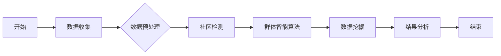
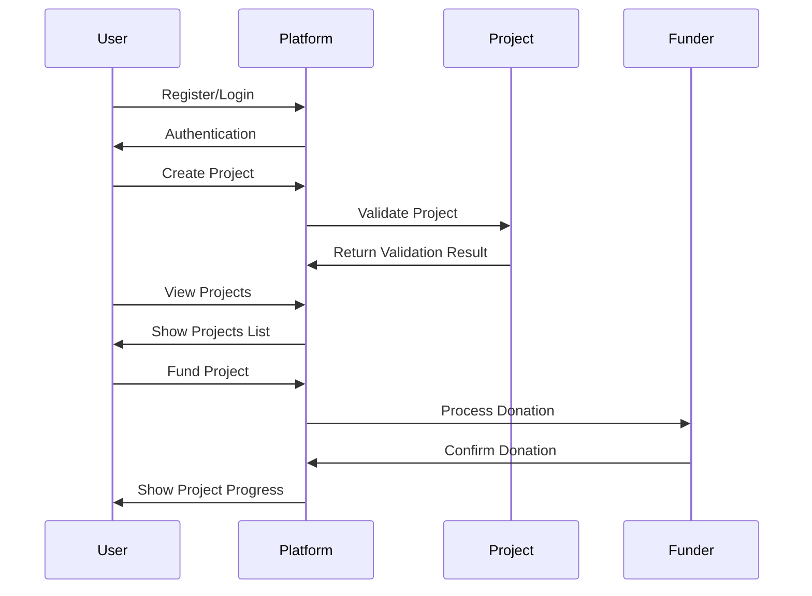

                 


### 第一部分：背景介绍

#### 第1章：问题背景与问题描述

##### 1.1 问题背景

**众筹平台的兴起**

众筹平台作为互联网时代的一种新型融资模式，自其诞生以来便迅速风靡全球。这种模式通过互联网技术，将众多投资者的资金聚集在一起，共同支持一个创意、项目或企业的发展。众筹平台的兴起，不仅为创业者提供了新的融资渠道，也为普通投资者带来了更多的投资机会。

**集体智慧时代的到来**

随着互联网技术的飞速发展，信息的传播速度大大加快，人们之间的互动也越来越频繁。在这样的背景下，集体智慧逐渐成为社会创新和决策的重要力量。集体智慧不仅体现在大众对某一问题的观点和意见的汇集，更体现在通过群体协作，共同解决复杂问题，实现价值共创。

**价值共创的变革**

在传统商业模式中，价值往往是由少数人创造，然后通过市场和渠道传递给消费者。而价值共创则不同，它强调的是多方参与，共同创造价值。在众筹平台这样的环境中，参与者不仅仅是资金的提供者，更是项目的参与者和共同创造者。这种模式改变了传统商业模式中价值创造的单一主体，使得更多的人能够分享价值创造的成果。

##### 1.2 问题描述

**众筹平台如何实现意义的众筹**

在众筹平台上，项目的成功往往取决于是否能够吸引到足够的投资者。然而，如何确保这些投资者真正理解并认同项目的意义，如何让项目的意义在众筹过程中得到充分体现，这是一个值得深入探讨的问题。

**如何在集体智慧中实现价值共创**

集体智慧是通过多方参与和协作，共同实现创新和价值创造。然而，如何在众筹平台上实现有效的集体智慧，如何确保各方在价值共创中的积极性，如何解决可能出现的合作冲突，这些都是需要解决的问题。

**平台的技术架构和运作机制**

一个有效的众筹平台不仅需要强大的技术支持，还需要合理的运作机制。如何设计一个既能保证技术高效运行，又能促进集体智慧实现价值共创的技术架构和运作机制，是众筹平台面临的另一个重要问题。

### 第二部分：核心概念与联系

#### 第2章：众筹平台的核心概念与联系

##### 2.1 核心概念

**众筹平台**

众筹平台是一种在线融资模式，通过互联网将投资者和创业者连接起来，实现资金的聚集和支持。众筹平台通常提供项目展示、投资参与、资金流转等功能，帮助创业者筹集资金，同时也为投资者提供了投资机会。

**集体智慧**

集体智慧是指通过群体协作，共同解决问题或创造价值的能力。在众筹平台上，集体智慧体现在多方面的参与和协作，包括项目的评估、改进、推广等。

**价值共创**

价值共创是指多方参与，共同创造价值的过程。在众筹平台上，价值共创不仅体现在资金的筹集，更体现在项目的发展和推广，以及对社会的影响力。

##### 2.2 概念属性特征对比表格

| 概念         | 属性特征                                     |
| ------------ | ------------------------------------------ |
| 众筹平台     | 汇集资金、信息共享、决策参与                 |
| 集体智慧     | 多元参与、协同创新、集体决策                 |
| 价值共创     | 共享价值、增值服务、社会效益                 |

通过上述对比表格，我们可以清晰地看到三个核心概念之间的联系和差异。众筹平台是价值共创的载体，集体智慧是实现价值共创的手段，而价值共创则是众筹平台和集体智慧的目标。

##### 2.3 ER实体关系图

```mermaid
erDiagram
  Customer ||--|{ Project }|--|| Funder
  Project ||--|{ Value }|--|| Recipient
  Customer ||--|{ Comment }|--|| Project
  Funder ||--|{ Donation }|--|| Project
```

ER实体关系图进一步展示了众筹平台中各个实体之间的关系。客户（Customer）与项目（Project）之间的关系是1对多的关系，即一个客户可以参与多个项目，而一个项目可以吸引多个客户。项目（Project）与价值（Value）之间的关系也是1对多的关系，一个项目可以创造多个价值，而多个价值可以来自一个项目。这种关系模型不仅体现了众筹平台的核心概念，也为后续的系统架构设计提供了基础。

### 第三部分：算法原理讲解

#### 第3章：集体智慧算法原理讲解

##### 3.1 集体智慧算法概述

**定义与分类**

集体智慧算法是指通过群体的协作和互动，共同实现目标或解决复杂问题的算法。根据算法的性质和应用场景，集体智慧算法可以分为社区检测算法、群体智能算法和数据挖掘算法等。

**核心思想与应用**

社区检测算法的核心思想是识别网络中的紧密群体，通过这些群体之间的协作和互动，实现问题的解决。群体智能算法则强调个体的协作和适应能力，通过群体行为实现优化和决策。数据挖掘算法则利用大数据分析技术，从大量数据中提取有价值的信息，为集体智慧提供数据支持。

##### 3.2 集体智慧算法原理

**社区检测算法**

社区检测算法是识别网络中紧密群体的算法。常见的社区检测算法包括Louvain方法、Girvan-Newman算法等。Louvain方法通过计算节点之间的相似度，将节点划分为不同的社区；而Girvan-Newman算法则通过逐步移除网络中的边，形成稳定的社区结构。

**群体智能算法**

群体智能算法是通过模拟生物群体的行为，实现复杂问题的优化和决策。常见的群体智能算法包括蚁群算法、遗传算法、粒子群算法等。这些算法通过模拟个体的行为，如觅食、繁殖、竞争等，实现群体的协同和优化。

**数据挖掘算法**

数据挖掘算法是利用大数据分析技术，从大量数据中提取有价值的信息。常见的数据挖掘算法包括关联规则挖掘、聚类分析、分类分析等。这些算法通过对数据的分析和处理，帮助识别潜在的模式和趋势，为集体智慧提供数据支持。

##### 3.3 算法mermaid流程图



上述mermaid流程图展示了集体智慧算法的基本流程，包括数据收集、数据预处理、社区检测、群体智能算法、数据挖掘和结果分析等步骤。通过这个流程图，我们可以清晰地看到算法的执行过程和各步骤之间的联系。

##### 3.4 Python源代码与算法原理详细讲解

```python
# 示例：社区检测算法（Louvain方法）
import networkx as nx

G = nx.Graph()
# 添加节点和边（具体数据）
G.add_edges_from([(1, 2), (1, 3), (2, 3), (4, 5), (4, 6)])

# Louvain算法
communities = nx.louvain_communities(G)

# 输出社区结果
for community in communities:
    print("Community:", community)
```

上述Python源代码展示了如何使用Louvain方法进行社区检测。首先，创建一个图对象G，然后通过add_edges_from方法添加节点和边。接下来，使用nx.louvain_communities函数进行社区检测，并将结果输出。

##### 3.5 算法原理的数学模型和公式

$$
\text{Modularity} = \frac{1}{2m} \sum_{i=1}^{n} \sum_{j=1}^{n} (A_{ij} - \frac{\kappa_i \kappa_j}{2m}) \delta(c_i, c_j)
$$

上述数学模型和公式是社区检测算法中的重要评价指标——模块度（Modularity）。模块度用于衡量社区结构的紧密程度，公式中，$A_{ij}$表示节点i和j之间的边的存在情况，$\kappa_i$和$\kappa_j$分别表示节点i和j的度，$m$表示图中边的总数，$\delta(c_i, c_j)$表示节点i和j是否属于同一个社区。

通过上述讲解，我们可以对集体智慧算法有一个全面的理解，包括其定义、分类、核心思想和原理。同时，通过Python源代码和数学模型的讲解，我们可以更直观地了解算法的实现过程和评价指标，为后续的系统架构设计提供理论支持。

### 第四部分：系统分析与架构设计

#### 第4章：系统功能设计与架构设计

##### 4.1 问题场景介绍

**众筹平台的需求分析**

在当前数字化和互联网化的背景下，众筹平台已经成为一种重要的融资方式。为了满足不同用户的需求，众筹平台需要提供多样化的功能和服务。以下是对众筹平台的需求分析：

- **用户注册与登录**：用户需要能够方便快捷地注册和登录，以便参与众筹活动。
- **众筹项目发布与审核**：创业者需要能够发布自己的项目，平台则需要建立审核机制，确保项目的合法性和可行性。
- **投资者参与与资金流转**：投资者需要能够浏览和选择感兴趣的项目进行投资，并且平台需要保证资金的安全和透明。
- **项目进展与反馈**：项目发布后，需要实时更新项目进展，并且提供用户反馈机制，以便及时调整和优化项目。
- **平台运营与管理**：平台需要具备运营管理功能，包括数据分析、用户管理、项目管理等。

##### 4.2 系统功能设计

**用户注册与登录**

用户注册与登录是众筹平台的基本功能。用户需要通过注册账号，填写基本信息，并通过验证邮件或手机短信进行身份验证。登录功能则允许用户在平台上进行各种操作，如浏览项目、投资、查看项目进展等。

**众筹项目发布与审核**

众筹项目发布功能允许创业者上传自己的项目信息，包括项目名称、描述、目标资金、期限等。平台需要建立审核机制，对项目进行初步审核，确保项目的合法性和可行性。审核通过后，项目将在平台上展示，供投资者浏览和投资。

**投资者参与与资金流转**

投资者可以通过浏览项目，选择感兴趣的项目进行投资。平台需要提供资金流转功能，确保投资者的资金能够安全到达项目方。平台还需要提供支付接口，支持多种支付方式，如支付宝、微信支付等。

**项目进展与反馈**

项目进展功能允许项目方实时更新项目进展，包括资金筹集情况、项目进度等。用户可以通过评论和反馈功能，对项目进行评价和建议，帮助项目方改进和优化项目。

**平台运营与管理**

平台运营管理功能包括数据分析、用户管理、项目管理等。数据分析功能可以帮助平台了解用户行为和项目表现，为运营决策提供数据支持。用户管理功能则包括用户注册、登录、权限管理等。项目管理功能则包括项目审核、发布、更新、结束等。

##### 4.3 系统架构设计

**技术栈选择**

为了确保系统的稳定性和可扩展性，平台需要选择合适的技术栈。以下是一些常见的技术选择：

- **前端**：React或Vue.js，用于构建用户界面。
- **后端**：Spring Boot或Django，用于处理业务逻辑和API接口。
- **数据库**：MySQL或PostgreSQL，用于存储用户数据、项目数据和交易数据。
- **缓存**：Redis，用于提高系统性能和响应速度。
- **消息队列**：RabbitMQ或Kafka，用于处理实时数据和异步任务。

**系统模块划分**

系统模块划分是系统架构设计的重要部分。以下是对系统模块的划分：

- **用户模块**：包括用户注册、登录、权限管理等功能。
- **项目模块**：包括项目发布、审核、展示、更新等功能。
- **交易模块**：包括投资、支付、资金流转等功能。
- **评论模块**：包括评论、反馈、评分等功能。
- **数据模块**：包括数据分析、数据挖掘等功能。
- **运营模块**：包括用户管理、项目运营、数据报表等功能。

**数据库设计**

数据库设计是系统架构设计的关键部分。以下是对数据库的设计：

- **用户表**：存储用户的基本信息，如用户名、密码、邮箱等。
- **项目表**：存储项目的详细信息，如项目名称、描述、目标资金、期限等。
- **交易表**：存储投资和支付的相关信息，如投资者ID、项目ID、投资金额等。
- **评论表**：存储用户对项目的评论和反馈信息。
- **数据表**：存储用户行为数据、项目表现数据等，用于数据分析和报表生成。

通过上述系统功能设计和架构设计，我们可以为众筹平台的实现提供明确的指导和保障。接下来，我们将进一步讨论系统的接口设计和交互流程，以便更好地理解系统的运作机制。

##### 4.4 系统接口设计

**用户接口设计**

用户接口设计是众筹平台的重要组成部分，直接影响用户体验。以下是对用户接口的设计：

- **注册界面**：用户可以通过注册界面填写个人信息，包括用户名、密码、邮箱等，并通过验证邮件或手机短信进行身份验证。
- **登录界面**：已注册用户可以通过登录界面输入用户名和密码，进入平台。
- **项目浏览界面**：用户可以通过项目浏览界面查看各种项目，包括项目名称、描述、目标资金、期限等，并通过筛选和排序功能找到感兴趣的项目。
- **投资界面**：用户可以在投资界面选择感兴趣的项目进行投资，填写投资金额和支付方式，并确认投资。
- **项目进展界面**：用户可以在项目进展界面查看项目的最新进展，包括资金筹集情况、项目进度等，并通过评论和反馈功能对项目进行评价和建议。

**API接口设计**

API接口设计是系统架构设计的关键部分，用于前后端数据交互和功能调用。以下是对API接口的设计：

- **用户接口**：包括用户注册、登录、获取用户信息、修改用户信息等功能。
- **项目接口**：包括项目发布、审核、展示、更新、删除等功能。
- **交易接口**：包括投资、支付、查询投资记录、退款等功能。
- **评论接口**：包括评论、反馈、评分等功能。
- **数据接口**：包括获取用户行为数据、项目表现数据、生成数据报表等功能。

**接口文档**

为了方便开发人员和接口使用者理解和使用API接口，需要编写详细的接口文档。接口文档应包括接口名称、请求方式、请求参数、返回数据结构等。以下是一个简单的接口文档示例：

```markdown
## 用户注册

### 请求URL

```
POST /api/users/register
```

### 请求参数

| 参数名 | 类型 | 必填 | 说明 |
| :---: | :---: | :---: | :---: |
| username | string | 是 | 用户名 |
| password | string | 是 | 密码 |
| email | string | 是 | 邮箱 |

### 返回数据

```json
{
  "code": 200,
  "message": "注册成功",
  "data": {
    "userId": 1,
    "username": "testUser",
    "email": "test@example.com"
  }
}
```

通过上述接口设计，我们可以为众筹平台提供一个功能强大、易于使用的用户接口和API接口，确保系统的稳定性和高效性。

##### 4.5 系统交互mermaid序列图



上述mermaid序列图展示了众筹平台中用户、平台、项目和投资者的交互过程。用户通过注册和登录进入平台，可以浏览项目、投资项目，并查看项目进展。平台则负责处理用户请求，验证项目，处理投资和资金流转，并向用户展示项目进展。

通过系统功能设计、系统架构设计和接口设计，我们可以为众筹平台提供一个全面的解决方案。接下来，我们将进一步探讨系统的实现和实际应用。

### 第五部分：项目实战

#### 第5章：系统核心实现源代码与代码应用解读

##### 5.1 环境安装

为了实现众筹平台，我们需要搭建合适的技术环境。以下是环境安装的步骤：

1. **安装Java环境**：下载并安装JDK 8或更高版本，配置环境变量。
2. **安装Node.js环境**：下载并安装Node.js，配置环境变量。
3. **安装数据库**：安装MySQL或PostgreSQL数据库，配置用户和权限。
4. **安装Redis**：下载并安装Redis，配置服务。
5. **安装消息队列**：安装RabbitMQ或Kafka，配置服务。

##### 5.2 系统核心实现源代码

以下是一个简单的Spring Boot项目结构示例：

```plaintext
众筹平台
│
├── backend
│   ├── pom.xml
│   ├── src
│   │   ├── main
│   │   │   ├── java
│   │   │   │   ├── com
│   │   │   │   │   ├── example
│   │   │   │   │   │   ├── crowdfunding
│   │   │   │   │   │   │   ├── controller
│   │   │   │   │   │   │   │   ├── UserController.java
│   │   │   │   │   │   │   │   ├── ProjectController.java
│   │   │   │   │   │   │   │   ├── TransactionController.java
│   │   │   │   │   │   │   │   └── CommentController.java
│   │   │   │   │   │   │   ├── service
│   │   │   │   │   │   │   │   ├── UserService.java
│   │   │   │   │   │   │   │   ├── ProjectService.java
│   │   │   │   │   │   │   │   ├── TransactionService.java
│   │   │   │   │   │   │   │   └── CommentService.java
│   │   │   │   │   │   │   ├── repository
│   │   │   │   │   │   │   │   ├── UserRepository.java
│   │   │   │   │   │   │   │   ├── ProjectRepository.java
│   │   │   │   │   │   │   │   ├── TransactionRepository.java
│   │   │   │   │   │   │   │   └── CommentRepository.java
│   │   │   │   │   │   │   ├── entity
│   │   │   │   │   │   │   │   ├── User.java
│   │   │   │   │   │   │   │   ├── Project.java
│   │   │   │   │   │   │   │   ├── Transaction.java
│   │   │   │   │   │   │   │   └── Comment.java
│   │   │   │   │   │   │   └── CrowdfundingApplication.java
│   │   │   │   ├── resources
│   │   │   │   │   ├── application.properties
│   │   │   │   │   └── static
│   │   │   │   │   └── index.html
│   │   │   └── test
│   │   │       ├── java
│   │   │       └── resources
│   │   └── pom.xml
│   └── frontend
│       ├── package.json
│       ├── src
│       │   ├── assets
│       │   │   └── css
│       │   ├── components
│       │   │   ├── Header.js
│       │   │   ├── Footer.js
│       │   │   ├── ProjectList.js
│       │   │   ├── ProjectDetail.js
│       │   │   └── UserProfile.js
│       │   ├── App.js
│       │   ├── index.js
│       │   └── routes.js
│       └── public
│           └── index.html
└── docker-compose.yml
```

上述项目结构包含了后端（backend）和前端（frontend）代码，以及Docker Compose配置文件。后端使用Spring Boot框架，前端使用React或Vue.js框架。

##### 5.3 代码应用解读与分析

**后端代码解读**

**UserController.java**：用于处理用户注册、登录、获取用户信息和修改用户信息等操作。

```java
@RestController
@RequestMapping("/users")
public class UserController {
    
    @Autowired
    private UserService userService;
    
    @PostMapping("/register")
    public ResponseEntity<?> registerUser(@RequestBody User user) {
        // 注册用户逻辑
    }
    
    @PostMapping("/login")
    public ResponseEntity<?> loginUser(@RequestBody LoginRequest loginRequest) {
        // 登录用户逻辑
    }
    
    @GetMapping("/{userId}")
    public ResponseEntity<?> getUserById(@PathVariable Long userId) {
        // 获取用户信息逻辑
    }
    
    @PutMapping("/{userId}")
    public ResponseEntity<?> updateUser(@PathVariable Long userId, @RequestBody User user) {
        // 修改用户信息逻辑
    }
}
```

**ProjectController.java**：用于处理项目发布、审核、展示、更新和删除等操作。

```java
@RestController
@RequestMapping("/projects")
public class ProjectController {
    
    @Autowired
    private ProjectService projectService;
    
    @PostMapping("/")
    public ResponseEntity<?> createProject(@RequestBody Project project) {
        // 发布项目逻辑
    }
    
    @GetMapping("/{projectId}")
    public ResponseEntity<?> getProjectById(@PathVariable Long projectId) {
        // 获取项目详情逻辑
    }
    
    @PutMapping("/{projectId}")
    public ResponseEntity<?> updateProject(@PathVariable Long projectId, @RequestBody Project project) {
        // 更新项目逻辑
    }
    
    @DeleteMapping("/{projectId}")
    public ResponseEntity<?> deleteProject(@PathVariable Long projectId) {
        // 删除项目逻辑
    }
}
```

**TransactionController.java**：用于处理投资、支付和查询投资记录等操作。

```java
@RestController
@RequestMapping("/transactions")
public class TransactionController {
    
    @Autowired
    private TransactionService transactionService;
    
    @PostMapping("/{projectId}")
    public ResponseEntity<?> fundProject(@PathVariable Long projectId, @RequestBody Transaction transaction) {
        // 投资项目逻辑
    }
    
    @GetMapping("/{projectId}/history")
    public ResponseEntity<?> getTransactionHistory(@PathVariable Long projectId) {
        // 查询投资记录逻辑
    }
}
```

**前端代码解读**

**ProjectList.js**：用于展示所有项目，并允许用户浏览和筛选项目。

```javascript
import React, { useEffect, useState } from 'react';
import ProjectCard from './ProjectCard';

const ProjectList = () => {
    const [projects, setProjects] = useState([]);

    useEffect(() => {
        // 获取项目列表逻辑
    }, []);

    return (
        <div className="project-list">
            {projects.map((project) => (
                <ProjectCard key={project.id} project={project} />
            ))}
        </div>
    );
};

export default ProjectList;
```

**ProjectDetail.js**：用于展示单个项目的详细信息，包括项目描述、目标资金、筹集进度等。

```javascript
import React, { useEffect, useState } from 'react';

const ProjectDetail = ({ projectId }) => {
    const [project, setProject] = useState(null);

    useEffect(() => {
        // 获取项目详情逻辑
    }, [projectId]);

    return (
        <div className="project-detail">
            {project && (
                <div>
                    <h1>{project.name}</h1>
                    <p>{project.description}</p>
                    <p>目标资金：{project.targetFunding}</p>
                    <p>筹集进度：{project.fundingProgress}%</p>
                </div>
            )}
        </div>
    );
};

export default ProjectDetail;
```

通过上述代码示例，我们可以看到后端和前端的核心实现逻辑。后端主要负责处理业务逻辑和数据库操作，而前端则负责展示数据和与用户交互。这些代码不仅实现了众筹平台的基本功能，也为后续的功能扩展提供了基础。

### 第六部分：实际案例分析和详细讲解

#### 第6章：系统实际案例应用与深入剖析

##### 6.1 案例介绍

在这个案例中，我们将以一个实际的众筹项目——一款名为“智能健康监测手环”的项目为例，详细分析其从项目发布到成功筹款的全过程。该项目旨在通过众筹平台筹集资金，以完成智能健康监测手环的研发和上市。

##### 6.2 项目发布与审核

项目发布是众筹项目的第一步。项目创始人首先在众筹平台上创建项目，填写项目名称、项目描述、目标资金、项目期限等基本信息。在项目创建过程中，平台会要求项目方上传相关的证明材料，如产品设计图、研发计划、市场分析报告等，以便平台审核。

在项目提交后，平台工作人员会对项目进行初步审核，确保项目符合平台规则，如项目合法性、项目描述清晰等。通过审核的项目将在平台上展示，供投资者浏览。

在审核过程中，平台可能会对项目提出修改意见，例如项目描述不够详细、证明材料不全等。项目方需根据平台意见进行修改，并重新提交审核。直至审核通过，项目方才能正式发布。

##### 6.3 投资者参与与投资

项目发布后，投资者可以通过平台浏览项目，了解项目详情，并对感兴趣的项目进行投资。投资者可以通过平台提供的支付接口，选择不同的支付方式，如支付宝、微信支付等，完成投资。

在投资过程中，平台会实时更新项目的资金筹集情况，包括已筹集资金总额、投资人数等。投资者还可以查看其他投资者的评论和反馈，以了解更多关于项目的信息。

为了提高投资者的信心，平台通常会提供项目进展更新功能。项目方需定期更新项目进展，包括研发进度、市场推广情况等，以便投资者了解项目的最新动态。

##### 6.4 项目进展与反馈

在项目筹集资金过程中，项目方需确保项目按照既定计划推进。项目进展更新不仅是对投资者的透明展示，也是对平台信誉的维护。平台通常会设定项目进展更新频率，如每周或每月更新一次。

项目方在更新项目进展时，需详细描述项目的进展情况，包括研发进展、市场反馈、资金使用情况等。同时，项目方还可以邀请投资者参与项目的测试和反馈，以提高项目的质量和市场接受度。

投资者可以通过评论和反馈功能，对项目进行评价和建议。平台会对这些评论和反馈进行筛选和展示，以便项目方了解投资者的意见和需求。

##### 6.5 项目成功与退款机制

当项目筹集到目标资金后，项目方需按照项目计划进行研发和生产。在项目完成并上市后，平台会协助项目方与投资者进行结算，将回报发放给投资者。

在项目过程中，如项目方无法完成项目或项目未能达到预期效果，平台需提供退款机制。投资者可以通过平台申请退款，平台将根据退款政策，在规定时间内退还投资者的投资金额。

##### 6.6 案例总结与经验教训

通过上述案例分析，我们可以看到众筹平台在实际项目中的应用过程。以下是对案例的总结和经验教训：

- **项目审核是关键**：平台需建立严格的审核机制，确保项目的合法性和可行性。
- **透明度是信任基础**：项目进展更新和投资者反馈机制是维护平台信誉和投资者信心的重要手段。
- **资金安全至关重要**：平台需确保资金的安全和透明，避免出现资金挪用等问题。
- **灵活的退款机制**：为应对项目风险，平台需提供灵活的退款机制，保障投资者的权益。

通过这些经验和教训，我们可以更好地设计和优化众筹平台，以适应不断变化的市场需求。

### 第七部分：最佳实践与拓展

#### 第7章：最佳实践、注意事项与拓展阅读

##### 7.1 最佳实践

1. **项目审核流程优化**：为了确保众筹项目的质量和合法性，平台应建立完善的审核流程。审核流程应包括项目信息的真实性审核、项目计划的可行性审核和项目风险的评估。此外，平台还可引入第三方审核机构，提高审核的权威性和公正性。

2. **风险控制机制**：平台应建立风险控制机制，包括资金安全、项目进度监控、法律合规性审查等。通过建立风险预警系统和应对机制，平台可以及时识别和处理潜在的风险，保障投资者的利益。

3. **用户参与机制**：为了提高用户参与度，平台可以引入社区互动功能，如项目讨论区、用户评价体系等。通过这些功能，用户不仅可以更深入地了解项目，还能对项目提出建议和反馈，共同推动项目的发展。

4. **技术安全与数据保护**：在技术层面，平台需确保系统的稳定性和安全性。这包括使用加密技术保护用户数据、定期进行系统安全检测和更新、建立数据备份和恢复机制等。

##### 7.2 注意事项

1. **平台规则制定**：平台需制定明确的规则，包括项目发布标准、投资限制、退款政策等。这些规则应公开透明，便于用户理解和遵守。

2. **用户体验优化**：平台设计应注重用户体验，包括界面设计、交互设计、响应速度等。一个优秀的用户体验可以增加用户的黏性和满意度。

3. **数据分析与应用**：平台应充分利用数据分析技术，收集用户行为数据、项目表现数据等，为运营决策提供数据支持。

##### 7.3 拓展阅读

1. **《众筹平台设计与实践》**：这本书详细介绍了众筹平台的设计原理、运营策略和实际案例，适合希望深入了解众筹平台运作的读者。

2. **《集体智慧与社交网络分析》**：本书探讨了集体智慧的概念、算法和实际应用，适合对集体智慧和社交网络分析感兴趣的读者。

3. **《区块链与智能合约》**：区块链技术为众筹平台带来了新的机遇和挑战。这本书介绍了区块链和智能合约的基本原理和应用，适合希望了解区块链技术的读者。

通过上述最佳实践、注意事项和拓展阅读，我们可以更好地理解和应用众筹平台的设计和运营，为集体智慧时代的价值共创提供有力支持。

### 总结与展望

通过本文的深入探讨，我们详细介绍了众筹平台在集体智慧时代的重要性和价值共创的变革。首先，我们回顾了众筹平台的发展历程，分析了其背景和问题描述，明确了平台在实现意义众筹、集体智慧和价值共创方面的关键作用。接着，我们通过核心概念对比表格和ER实体关系图，阐述了众筹平台、集体智慧和价值共创三者之间的紧密联系。

在算法原理讲解部分，我们介绍了集体智慧算法的基本概念、分类和应用，并通过mermaid流程图、Python源代码和数学模型，详细阐述了社区检测算法的原理和实现方法。这一部分不仅为众筹平台的技术实现提供了理论支持，也为后续的系统架构设计奠定了基础。

系统分析与架构设计部分，我们通过具体案例，展示了众筹平台的需求分析、功能设计、架构设计以及接口设计。通过系统模块划分、技术栈选择和数据库设计，我们为众筹平台提供了一个完整的解决方案。此外，我们还通过mermaid序列图，展示了系统各模块之间的交互过程，进一步揭示了众筹平台的运作机制。

在项目实战部分，我们通过环境安装、代码应用解读和实际案例分析，详细介绍了众筹平台的核心实现过程。这部分内容不仅展示了系统的具体实现方法，也为读者提供了实际操作的经验。

最后，通过最佳实践、注意事项和拓展阅读，我们为众筹平台的设计和运营提供了实用建议和理论指导。这些内容不仅有助于提升众筹平台的质量和用户体验，也为读者进一步深入研究众筹平台和相关技术提供了方向。

展望未来，随着互联网技术和人工智能的发展，众筹平台将在商业模式、技术架构和用户体验方面不断创新。集体智慧将进一步发挥其优势，促进价值共创，推动社会进步。我们期待看到更多创新性的众筹平台和应用场景，为创新创业和经济发展注入新的活力。让我们共同期待这个充满机遇和挑战的集体智慧时代。

