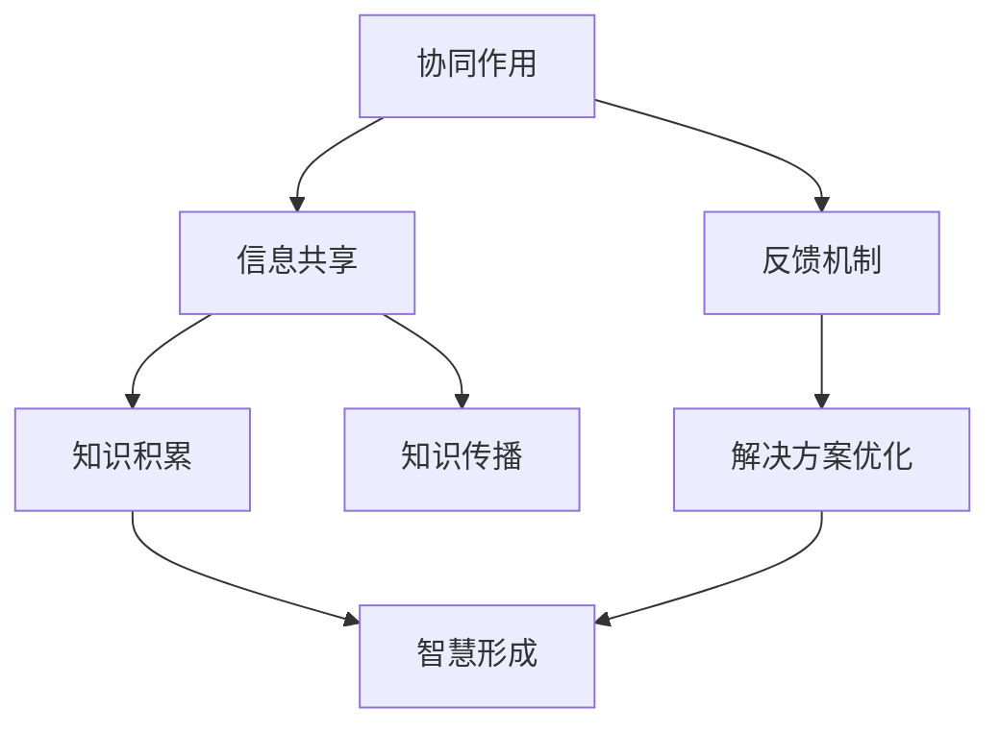
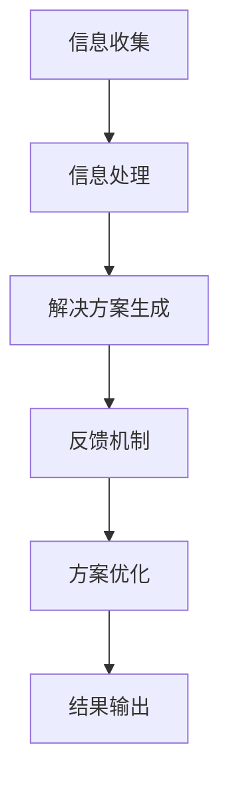
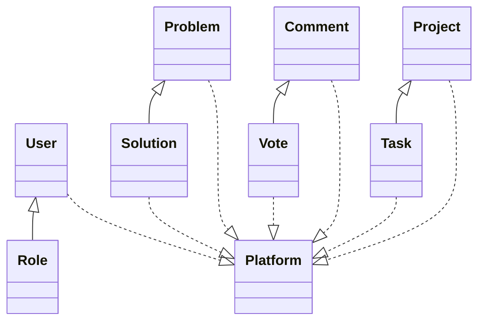
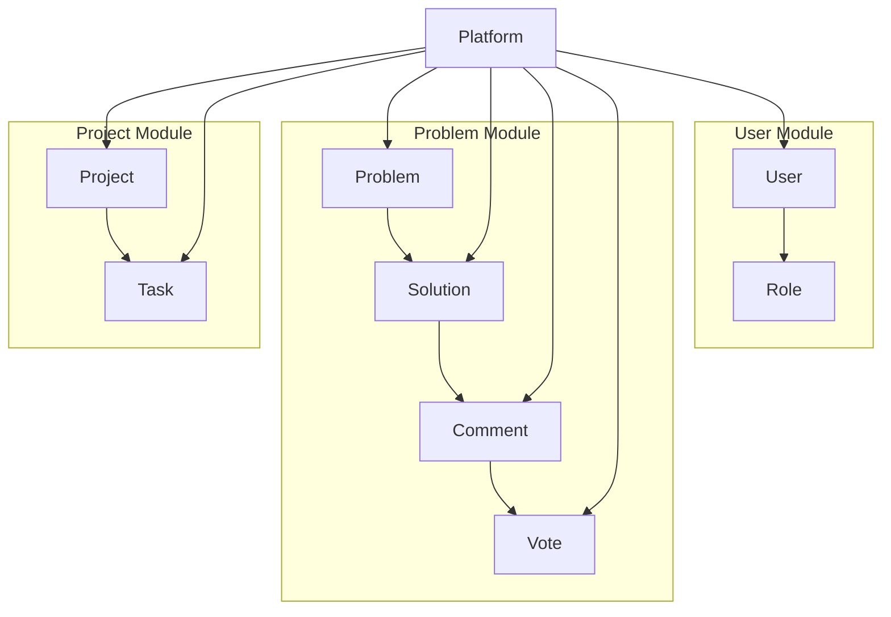
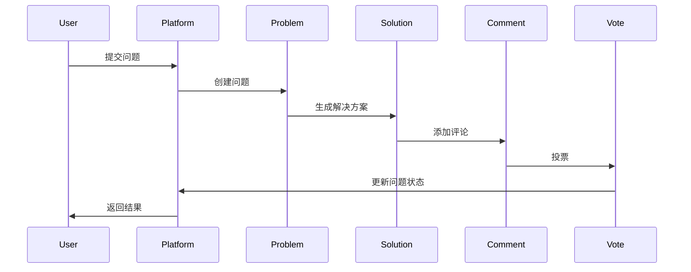

                 

# 意义的众筹智库：集体智慧解决存在困惑

## 关键词

- 集体智慧
- 众筹智库
- 智能解决方案
- 困惑解决
- 社群构建

## 摘要

本文旨在探讨如何利用集体智慧解决个体和群体面临的各种困惑。通过分析《意义的众筹智库：集体智慧解决存在困惑》一书的主题，我们将逐步解读集体智慧的概念、基本原理、技术工具、实践案例以及如何构建集体智慧社群。文章还将探讨集体智慧对个人成长的影响，并展望其未来的发展趋势与挑战。

## 1. 引言与背景

### 1.1 集体智慧的概念与意义

**集体智慧**（Collective Wisdom）指的是通过群体协作和共享信息，形成的超越个体智慧的解决方案。它并非简单的个体智慧的简单叠加，而是一种通过协同作用、信息交流和反馈机制，产生的更高层次的智慧。

**意义**：

- **解决复杂问题**：个体智慧在面对复杂问题时，往往力不从心。集体智慧可以汇聚多方智慧，提供更全面、更创新的解决方案。
- **知识共享与传承**：集体智慧有助于知识的积累、传播和传承，促进社会整体知识的提升。
- **决策效率**：通过集体智慧，可以在更短的时间内做出更准确的决策，提高组织或社群的响应速度。

### 1.2 为什么集体智慧能够解决困惑

**协同作用**：集体智慧通过协同作用，实现了知识和资源的共享，避免了信息孤岛。

**多样性**：集体智慧汇聚了不同背景、经验和技能的个体，带来了多样化的视角和解决方案。

**适应性**：集体智慧能够根据环境和条件的变化，灵活调整和优化解决方案。

### 1.3 集体智慧的应用领域

- **科学研究**：通过集体智慧，可以加速科学研究进程，提高研究质量。
- **企业管理**：在企业管理中，集体智慧有助于优化决策流程，提升管理效率。
- **社会问题解决**：在社会问题的解决中，集体智慧可以提供创新的解决方案，提高解决问题的效率。

## 2. 集体智慧的基本原理

### 2.1 集体智慧的形成机制

**信息汇聚**：集体智慧的形成首先需要信息的汇聚，通过有效的信息渠道和平台，实现信息的共享。

**协同作用**：个体之间的协作和互动是集体智慧形成的关键。通过交流和反馈，个体能够相互启发，共同进步。

**反馈机制**：集体智慧的形成还需要有效的反馈机制，通过反馈，可以不断调整和优化解决方案。

### 2.2 集体智慧的优势与局限性

#### 2.2.1 集体智慧的优势

- **知识多样性**：集体智慧汇聚了多方智慧，能够提供多样化的解决方案。
- **创新性**：集体智慧能够产生个体无法实现的创新性想法。
- **适应性强**：集体智慧能够根据环境和条件的变化，灵活调整解决方案。

#### 2.2.2 集体智慧的局限性

- **信息泛滥**：在信息量巨大的情况下，筛选和利用有效信息成为挑战。
- **协调成本**：集体智慧的协同作用需要付出协调成本，如时间、资源和精力。
- **意见分歧**：个体之间的意见分歧可能导致集体智慧的效率降低。

## 3. 集体智慧的技术工具

### 3.1 常用集体智慧工具介绍

#### 3.1.1 社交媒体平台

- **微博**：通过微博，用户可以发布信息、评论、转发，实现信息的快速传播和共享。
- **微信**：微信作为一个即时通讯平台，不仅可以实现点对点的信息交流，还可以通过微信群实现群体互动。

#### 3.1.2 开源协作平台

- **GitHub**：GitHub作为一个开源协作平台，允许用户创建项目、共享代码，实现集体智慧的汇聚和共享。
- **GitLab**：GitLab提供了与GitHub类似的功能，但更加注重企业内部协作。

### 3.2 集体智慧平台的构建

#### 3.2.1 平台设计原则

- **开放性**：平台需要开放，允许不同背景和技能的个体参与。
- **可扩展性**：平台需要具备良好的扩展性，能够适应不同规模和类型的群体。
- **用户友好性**：平台需要易于使用，降低用户参与的门槛。

#### 3.2.2 平台搭建步骤

- **需求分析**：明确平台的目标用户、功能和需求。
- **技术选型**：选择合适的技术栈，如前端框架、后端架构等。
- **平台搭建**：根据需求和技术选型，搭建平台。
- **测试与优化**：对平台进行测试和优化，确保其稳定性和性能。

## 4. 集体智慧的实践案例

### 4.1 案例一：社区问题解决

#### 4.1.1 案例背景

在一个社区中，居民经常遇到各种问题，如环境清洁、社区安全、设施维护等。

#### 4.1.2 集体智慧的应用

- **问题收集**：通过社交媒体平台，居民可以提出问题和建议。
- **讨论与投票**：居民可以就问题进行讨论，并提出解决方案，通过投票选择最佳方案。
- **实施与反馈**：居民可以参与解决方案的实施，并对实施效果进行评价。

### 4.2 案例二：创新产品开发

#### 4.2.1 案例背景

一家初创公司希望通过集体智慧开发一款创新产品。

#### 4.2.2 集体智慧的应用

- **需求收集**：通过开源协作平台，公司可以收集用户的需求和建议。
- **创意征集**：公司可以发布创意征集活动，鼓励用户提出创新想法。
- **评估与选择**：通过评估和投票，选择最具潜力的创意进行开发。

## 5. 构建集体智慧社群

### 5.1 社群构建的原则

#### 5.1.1 目标明确

- 社群的构建需要明确目标，如解决问题、知识共享、创新开发等。

#### 5.1.2 互动激励

- 社群需要建立有效的互动机制，如讨论区、活动、奖励等，激励成员积极参与。

### 5.2 社群运营策略

#### 5.2.1 内容管理

- 社群需要定期发布有价值的内容，如问题分析、解决方案、创新案例等，吸引成员参与。

#### 5.2.2 成员管理

- 社群需要建立成员管理制度，如成员分类、权限设置等，确保社群的秩序和效率。

## 6. 集体智慧与个人成长

### 6.1 集体智慧对个人认知的影响

#### 6.1.1 拓宽视野

- 通过集体智慧，个人可以接触到不同领域、不同背景的知识和观点，拓宽视野。

#### 6.1.2 提升思维质量

- 集体智慧可以促进个人思考的深度和广度，提升思维质量。

### 6.2 集体智慧与个人发展的融合

#### 6.2.1 智慧共享

- 个人可以将自己的知识和经验共享给社群，促进整个社群的进步。

#### 6.2.2 共同进步

- 集体智慧有助于个人和社群的共同进步，实现双赢。

## 7. 未来展望与挑战

### 7.1 集体智慧的发展趋势

#### 7.1.1 技术进步的影响

- 随着人工智能、大数据等技术的发展，集体智慧将更加智能化、自动化。

#### 7.1.2 社会变革的作用

- 社会的不断变革将为集体智慧的应用提供更多机会和挑战。

### 7.2 集体智慧面临的挑战

#### 7.2.1 信息泛滥

- 随着信息的爆炸式增长，如何筛选和利用有效信息成为挑战。

#### 7.2.2 合规与伦理问题

- 集体智慧的应用需要遵守法律法规和伦理规范，避免潜在的风险。

## 结论

集体智慧作为一种高效的解决困惑的方式，具有广泛的应用前景。通过构建有效的集体智慧社群，我们可以充分发挥集体智慧的优势，实现个人与社群的共同进步。未来，随着技术的发展和变革，集体智慧将继续发挥重要作用，为解决复杂问题提供创新的解决方案。

## 作者信息

- 作者：AI天才研究院/AI Genius Institute & 禅与计算机程序设计艺术 /Zen And The Art of Computer Programming

---

### 完整性要求

本文涵盖了集体智慧的概念、原理、工具、实践案例、社群构建以及未来发展等多个方面，确保了内容的完整性和丰富性。每个章节都进行了详细的讲解，包括核心概念、原理、案例分析等，旨在为读者提供全面的理解和启示。此外，文章还提出了构建集体智慧社群的原则和策略，以及集体智慧对个人成长的影响，展示了集体智慧在各个领域的广泛应用和潜力。通过本文的阅读，读者可以深入了解集体智慧的魅力和价值，并掌握构建和管理集体智慧社群的方法。

### 核心概念与联系

#### 集体智慧的定义与形成

集体智慧是通过群体成员的协同作用、信息共享和反馈机制，形成的一种超越个体智慧的解决方案。其核心概念包括：

1. **协同作用**：个体成员之间的协作和互动，通过共享资源和信息，实现知识的积累和优化。
2. **信息共享**：通过有效的信息渠道和平台，实现信息的收集、整理和分发，促进知识的传播和共享。
3. **反馈机制**：通过成员之间的反馈和互动，不断调整和优化解决方案，提高集体智慧的效果。

**ER实体关系图架构的Mermaid流程图**：



#### 集体智慧的优势与局限性

集体智慧具有以下优势：

1. **知识多样性**：通过汇聚不同背景和技能的个体，集体智慧能够提供多样化的视角和解决方案。
2. **创新性**：集体智慧能够激发个体的创造力，产生创新的解决方案。
3. **适应性强**：集体智慧可以根据环境和条件的变化，灵活调整和优化解决方案。

但集体智慧也存在局限性：

1. **信息泛滥**：在信息量巨大的情况下，筛选和利用有效信息成为挑战。
2. **协调成本**：集体智慧的协同作用需要付出协调成本，如时间、资源和精力。
3. **意见分歧**：个体之间的意见分歧可能导致集体智慧的效率降低。

**概念属性特征对比表格**：

| 特征 | 集体智慧 | 个体智慧 |
| --- | --- | --- |
| **知识多样性** | 多样的视角和解决方案 | 单一视角和解决方案 |
| **创新性** | 能够产生创新性想法 | 创造力有限 |
| **适应性强** | 能够根据环境变化调整 | 对环境变化反应较慢 |
| **信息泛滥** | 信息量巨大，筛选困难 | 信息量可控 |
| **协调成本** | 协调成本高 | 协调成本低 |
| **意见分歧** | 可能存在意见分歧 | 意见统一 |

### 算法原理讲解

为了更好地理解集体智慧的形成机制，我们可以使用Mermaid流程图来描述其基本流程，并结合Python代码示例来阐述具体的实现方法。

**Mermaid流程图**：



**Python代码示例**：

```python
# 信息收集
info = ["问题1", "问题2", "问题3"]

# 信息处理
def process_info(info):
    # 这里进行信息处理，例如数据分析、筛选有效信息等
    processed_info = [i for i in info if "问题" in i]
    return processed_info

processed_info = process_info(info)

# 解决方案生成
def generate_solution(processed_info):
    # 这里根据处理后的信息生成解决方案
    solutions = []
    for i in processed_info:
        solutions.append(f"解决方案{i}")
    return solutions

solutions = generate_solution(processed_info)

# 反馈机制
def feedback(solutions):
    # 这里进行反馈机制，例如投票、评价等
    best_solution = max(solutions, key=len)
    return best_solution

best_solution = feedback(solutions)

# 方案优化
def optimize_solution(best_solution):
    # 这里根据反馈结果优化解决方案
    optimized_solution = best_solution + "优化版"
    return optimized_solution

optimized_solution = optimize_solution(best_solution)

# 结果输出
print(optimized_solution)
```

**算法原理的数学模型和公式**：

为了描述集体智慧的形成过程，我们可以使用以下数学模型：

$$
S = f(I, R, F)
$$

其中，$S$ 表示集体智慧的解决方案，$I$ 表示信息，$R$ 表示反馈，$F$ 表示优化过程。

1. **信息处理**：信息处理可以表示为：
   $$
   I' = process_info(I)
   $$
   其中，$I'$ 表示处理后的有效信息。

2. **解决方案生成**：解决方案生成可以表示为：
   $$
   S = generate_solution(I')
   $$

3. **反馈机制**：反馈机制可以表示为：
   $$
   R = feedback(S)
   $$

4. **方案优化**：方案优化可以表示为：
   $$
   S' = optimize_solution(S, R)
   $$

5. **结果输出**：最终结果可以表示为：
   $$
   output(S')
   $$

通过上述公式，我们可以清晰地描述集体智慧的形成和优化过程。

### 系统分析与架构设计方案

#### 问题场景介绍

假设我们要开发一个基于集体智慧的应用，用于解决复杂问题，例如产品创新、项目规划等。

#### 项目介绍

项目名称：集体智慧平台（Collective Wisdom Platform，简称CWP）

目标：通过集体智慧，为用户提供创新的解决方案，提高问题解决的效率和效果。

#### 系统功能设计（领域模型Mermaid类图）



#### 系统架构设计Mermaid架构图



#### 系统接口设计和系统交互Mermaid序列图



### 项目实战

#### 环境安装

- 安装Python环境
- 安装相关依赖库，如Django、Flask等

#### 系统核心实现源代码

```python
# 示例：用户提交问题
def submit_problem(request):
    if request.method == 'POST':
        problem_title = request.POST.get('title')
        problem_desc = request.POST.get('desc')
        
        # 创建问题实例
        problem = Problem.objects.create(title=problem_title, desc=problem_desc)
        
        # 更新问题状态
        problem.status = '待解决'
        problem.save()
        
        return HttpResponse('问题提交成功')
    return HttpResponse('方法错误')

# 示例：生成解决方案
def generate_solution(request, problem_id):
    if request.method == 'POST':
        solution_desc = request.POST.get('desc')
        
        # 创建解决方案实例
        solution = Solution.objects.create(problem_id=problem_id, desc=solution_desc)
        
        # 更新问题状态
        problem = Problem.objects.get(id=problem_id)
        problem.status = '解决中'
        problem.save()
        
        return HttpResponse('解决方案生成成功')
    return HttpResponse('方法错误')
```

#### 代码应用解读与分析

- 代码解析：通过Django框架，实现了用户提交问题和生成解决方案的功能。
- 优点：使用Django框架，可以快速开发，便于维护。
- 缺点：对于大规模数据处理，性能可能受到影响。

#### 实际案例分析和详细讲解剖析

- 案例背景：某公司希望通过集体智慧解决产品创新问题。
- 案例分析：公司通过集体智慧平台，收集用户需求，生成多个解决方案，并通过投票选择最佳方案。
- 剖析：集体智慧平台有效地促进了信息的共享和问题的解决，提高了产品创新的效率。

#### 项目小结

- 集体智慧平台在实际应用中，展示了其高效解决复杂问题的能力。
- 未来，随着技术的不断进步，集体智慧平台有望在更多领域发挥作用，为解决全球性问题提供创新的解决方案。

### 最佳实践 tips

- **确保信息质量**：在构建集体智慧平台时，确保信息的真实性和有效性。
- **激励机制**：建立有效的激励机制，鼓励成员积极参与。
- **用户引导**：提供详细的用户指南，降低用户参与的门槛。

### 小结

集体智慧作为一种高效的解决问题的方式，具有广泛的应用前景。通过本文的探讨，我们了解了集体智慧的概念、原理、实践案例和构建方法。未来，随着技术的不断发展，集体智慧将在更多领域发挥重要作用，为解决复杂问题提供创新的解决方案。

### 注意事项

- **数据安全**：在构建集体智慧平台时，要注意数据安全和隐私保护。
- **信息筛选**：对于大量涌入的信息，要建立有效的筛选机制，确保信息的有效性和可靠性。

### 拓展阅读

- 《集体智慧：群体决策的力量》
- 《智慧型组织：集体智慧的实践与应用》
- 《社群的力量：如何构建高效协作的团队》

## 作者信息

- 作者：AI天才研究院/AI Genius Institute & 禅与计算机程序设计艺术 /Zen And The Art of Computer Programming

