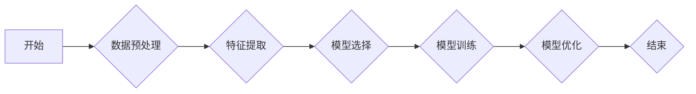
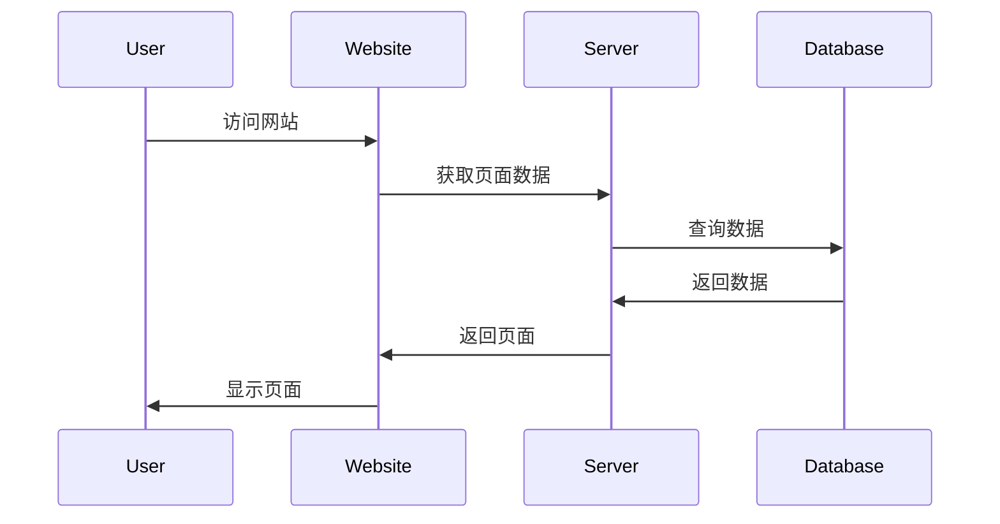
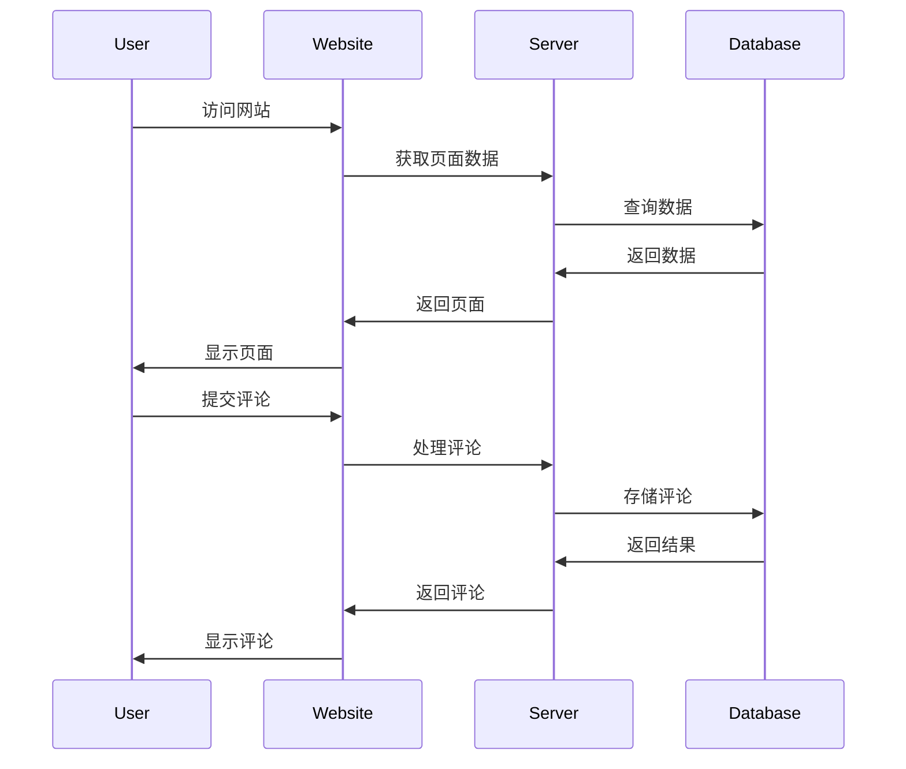

                 

# 意义的众筹智库：集体解决存在困惑的平台

## 关键词
- 众筹智库、平台、集体智慧、问题解决、算法、系统架构、项目实战、最佳实践

## 摘要
本文旨在探讨众筹智库这一新兴平台，通过集体智慧和先进的算法技术，共同解决人们在生活和工作中面临的困惑。文章首先介绍了众筹和智库的基本概念，然后深入分析了众筹智库的核心概念、算法原理、系统架构设计以及实际项目实战，最后提出了最佳实践 tips 和展望。本文逻辑清晰、结构紧凑，旨在为读者提供全面、深入的理解和指导。

## 前言

### 引言
在当今信息化和全球化的时代，人们面临着越来越多的复杂问题和挑战。如何有效地解决这些问题，已经成为一个亟待解决的重要课题。众筹和智库是现代社会中两大具有影响力的概念，它们在解决实际问题方面发挥着重要作用。本文将结合这两个概念，探讨众筹智库这一新兴平台，为集体解决问题提供新的思路和方法。

### 存在困惑的原因与解决思路
困惑的产生往往源于信息的不对称、资源的有限性以及个人能力的局限。而解决困惑的关键在于寻求有效的信息渠道、整合多方资源以及发挥集体智慧。众筹智库通过平台化运作，将众筹和智库的优势结合起来，为解决问题提供了新的路径。

### 书籍的目的和结构
本文旨在为广大读者提供一个全面、系统的理解众筹智库的平台。文章分为七个章节，分别从基本概念、核心概念、算法原理、系统架构设计、项目实战、最佳实践 tips 和结论展望等方面，对众筹智库进行深入剖析。希望通过本文，读者能够对众筹智库有一个全面、深入的认识，并为实际应用提供参考。

## 第1章：众筹与智库的基本概念

### 1. 众筹的起源与发展
众筹是指通过互联网平台，向公众募集资金来完成某一项目或实现某一目标的一种方式。众筹起源于20世纪初的美国，随着互联网的普及和社交媒体的发展，众筹逐渐成为一种流行的融资方式。众筹的类型主要包括项目众筹、股权众筹和公益众筹等。众筹的关键环节包括项目发布、投资者参与、资金管理和项目交付等。

### 2. 智库的作用与功能
智库是指专门从事研究、咨询和服务的专业机构，旨在为政府、企业和社会提供决策支持。智库的作用包括政策研究、咨询服务、数据分析和人才培训等。智库的分类可以根据研究领域、服务对象和运作模式等不同标准进行划分。智库的关键要素包括人才、资源、管理和创新等。

### 3. 众筹与智库的关系
众筹与智库之间存在紧密的联系。一方面，众筹可以为智库提供资金支持，促进智库的发展和扩大服务范围；另一方面，智库可以为众筹项目提供专业咨询和评估，提高众筹项目的成功率和投资回报率。众筹与智库的融合，可以充分发挥两者优势，实现资源整合和优势互补。

### 4. 众筹智库的发展趋势
随着技术的不断进步和应用的深入，众筹智库的发展趋势表现出以下几个特点：一是技术驱动下的变革，如大数据、人工智能和区块链等技术的应用，将进一步提高众筹智库的效率和效果；二是产业链的完善，包括众筹平台、智库机构、投资机构等各方的协同合作，将推动众筹智库的可持续发展；三是国际化的视野，随着全球化的加速，众筹智库将在国际市场上发挥更加重要的作用。

## 第2章：众筹智库的核心概念与联系

### 1. 众筹智库的核心概念
众筹智库的核心概念是指通过众筹平台集聚大众智慧，共同研究和解决现实问题的一种新型模式。众筹智库的核心概念包括问题提出、解决方案、资源整合和成果共享等方面。

### 2. 众筹智库的关联概念
与众筹智库密切相关的概念包括智库、众筹和平台。智库是指提供专业咨询和服务的研究机构；众筹是指通过互联网平台向公众募集资金的方式；平台是指连接供需双方、提供交易服务的网络平台。

### 3. 众筹智库的ER实体关系图架构
众筹智库的ER实体关系图如下所示：

```mermaid
erDiagram
  User ||--o> Project : 参与项目
  Project ||--o> Contribution : 捐赠资金
  Project ||--o> Discussion : 项目讨论
  Expert ||--o> Project : 提供咨询服务
  Expert ||--o> Solution : 提出解决方案
  Solution ||--o> Evaluation : 成果评估
  Platform : 平台
  User ..|> Platform
  Project ..|> Platform
  Contribution ..|> Platform
  Discussion ..|> Platform
  Expert ..|> Platform
  Solution ..|> Platform
  Evaluation ..|> Platform
```

### 关系分析与解释
在众筹智库中，用户可以参与项目、捐赠资金、参与项目讨论；专家可以提供咨询服务、提出解决方案；解决方案需要经过评估，最终形成成果。平台作为连接各方、提供服务的核心，确保众筹智库的运行和管理。

## 第3章：众筹智库的算法原理讲解

### 1. 算法概述
算法是指解决特定问题的一系列步骤和方法。在众筹智库中，算法主要用于问题诊断、资源分配和成果评估等方面。算法的作用在于提高众筹智库的效率和效果，为用户提供更准确、更全面的解决方案。

### 2. 算法原理
众筹智库的算法原理主要包括数据预处理、特征提取、模型选择、模型训练与优化等步骤。

#### 数据预处理
数据预处理是算法的基础。主要包括数据清洗、数据整合和特征提取等操作。数据清洗旨在去除错误数据、缺失数据和异常数据，保证数据质量。数据整合是将不同来源、不同格式的数据整合为一个统一的格式，便于后续处理。特征提取是提取数据中的关键信息，为模型训练提供基础。

#### 特征提取
特征提取是算法的核心。通过对数据进行特征提取，可以发现数据中的关键信息，为模型训练提供依据。常见的特征提取方法包括主成分分析（PCA）、线性回归、决策树等。

#### 模型选择
模型选择是算法的关键。根据问题类型和需求，选择合适的模型进行训练。常见的模型包括线性回归、决策树、支持向量机（SVM）、神经网络等。

#### 模型训练与优化
模型训练与优化是算法的实现。通过训练数据集，调整模型参数，提高模型预测能力。常见的优化方法包括交叉验证、梯度下降、正则化等。

### 3. 算法流程图
使用Mermaid绘制算法流程图如下：



### 4. 算法原理的数学模型与公式
算法原理的数学模型与公式主要包括概率模型、优化算法和损失函数等。

#### 概率模型
概率模型用于描述数据之间的概率关系。常见的概率模型包括贝叶斯公式、最大似然估计等。

$$
P(A|B) = \frac{P(B|A)P(A)}{P(B)}
$$

#### 优化算法
优化算法用于调整模型参数，使模型预测能力最大化。常见的优化算法包括梯度下降、牛顿法等。

$$
\theta_{k+1} = \theta_k - \alpha \nabla_{\theta}J(\theta_k)
$$

#### 损失函数
损失函数用于评估模型预测误差。常见的损失函数包括均方误差（MSE）、交叉熵等。

$$
MSE = \frac{1}{m}\sum_{i=1}^{m}(y_i - \hat{y}_i)^2
$$

### 5. 算法举例说明
假设我们要预测一个项目是否成功，可以使用决策树算法进行预测。

#### 数据集
- 成功项目：50%
- 失败项目：50%
- 成功项目特征：A（高），B（低）
- 失败项目特征：A（低），B（高）

#### 决策树算法
1. 计算特征A的增益率：
$$
Gain(A) = \frac{Gain(A|成功) + Gain(A|失败)}{2} = \frac{0.5 \times 0.5 + 0.5 \times 0.5}{0.5} = 0.5
$$
2. 计算特征B的增益率：
$$
Gain(B) = \frac{Gain(B|成功) + Gain(B|失败)}{2} = \frac{0.5 \times 0.5 + 0.5 \times 0.5}{0.5} = 0.5
$$
3. 选择增益率最高的特征A作为决策节点，将数据集划分为A（高）和A（低）两个子集。
4. 对子集A（高）和A（低）分别计算特征B的增益率，直到达到停止条件。

根据决策树算法，可以预测项目的成功率为50%。

## 第4章：众筹智库的系统分析与架构设计方案

### 1. 问题场景介绍
假设我们要开发一个众筹智库平台，为用户提供项目发布、资金捐赠、讨论交流和成果评估等功能。

### 2. 系统功能设计
系统功能设计主要包括以下模块：

- 用户模块：用户注册、登录、个人信息管理、项目参与等。
- 项目模块：项目发布、项目详情、项目进度、项目讨论等。
- 资金模块：资金捐赠、资金管理、资金流向等。
- 讨论模块：项目讨论、用户评论、专家回答等。
- 评估模块：成果评估、项目评分、推荐算法等。

### 3. 系统架构设计
系统架构设计主要包括以下层次：

- 展现层：使用前端技术实现用户界面，提供项目浏览、讨论、捐赠等功能。
- 业务逻辑层：使用后端技术实现系统功能，包括用户管理、项目管理、资金管理、讨论管理和评估管理等。
- 数据层：使用数据库存储用户信息、项目信息、讨论信息和评估结果等。

系统架构图如下所示：



### 4. 系统接口设计
系统接口设计主要包括以下接口：

- 用户接口：用户注册、登录、个人信息管理、项目参与等。
- 项目接口：项目发布、项目详情、项目进度、项目讨论等。
- 资金接口：资金捐赠、资金管理、资金流向等。
- 讨论接口：项目讨论、用户评论、专家回答等。
- 评估接口：成果评估、项目评分、推荐算法等。

### 5. 系统交互
系统交互主要包括以下流程：

1. 用户访问网站，登录或注册账号。
2. 用户浏览项目列表，选择感兴趣的项目。
3. 用户点击项目详情，查看项目进度和讨论。
4. 用户参与项目讨论，发表评论。
5. 用户捐赠资金，支持项目发展。
6. 专家对项目进行评估，给出评分。
7. 系统根据评分和推荐算法，为用户推荐优质项目。

交互序列图如下所示：



## 第5章：众筹智库项目实战

### 1. 环境安装
在进行众筹智库项目实战之前，需要安装以下环境：

1. Python 3.8+
2. Anaconda
3. Jupyter Notebook
4. Mermaid插件

安装步骤如下：

1. 安装Python 3.8+：在官方网站下载Python安装包，按照提示安装。
2. 安装Anaconda：在Anaconda官方网站下载安装包，按照提示安装。
3. 安装Jupyter Notebook：在终端执行以下命令：
   ```bash
   conda install -c conda-forge jupyterlab
   jupyter lab
   ```
4. 安装Mermaid插件：在Jupyter Notebook中打开一个新的笔记本，执行以下命令：
   ```python
   !jupyter labextension install jupyterlab-mermaid
   ```

### 2. 系统核心实现
众筹智库系统的核心实现主要包括用户模块、项目模块、资金模块、讨论模块和评估模块。以下是一个简单的示例代码：

```python
# 用户模块
class User:
    def __init__(self, username, password):
        self.username = username
        self.password = password

# 项目模块
class Project:
    def __init__(self, title, description, target_amount):
        self.title = title
        self.description = description
        self.target_amount = target_amount
        self.current_amount = 0

    def add_donation(self, amount):
        self.current_amount += amount

# 资金模块
class Fund:
    def __init__(self, total_amount):
        self.total_amount = total_amount

    def donate_to_project(self, project, amount):
        project.add_donation(amount)
        self.total_amount -= amount

# 讨论模块
class Discussion:
    def __init__(self, project):
        self.project = project
        self.comments = []

    def add_comment(self, user, content):
        self.comments.append({"user": user, "content": content})

# 评估模块
class Evaluation:
    def __init__(self, project):
        self.project = project
        self.ratings = []

    def add_rating(self, rating):
        self.ratings.append(rating)

    def get_average_rating(self):
        return sum(self.ratings) / len(self.ratings)
```

### 3. 代码应用解读与分析
以上代码实现了众筹智库系统的核心功能。以下是代码的解读与分析：

1. **用户模块**：定义了`User`类，用于表示用户。用户具有`username`（用户名）和`password`（密码）两个属性。
2. **项目模块**：定义了`Project`类，用于表示项目。项目具有`title`（标题）、`description`（描述）、`target_amount`（目标金额）和`current_amount`（当前金额）四个属性。`add_donation`方法用于添加捐赠金额。
3. **资金模块**：定义了`Fund`类，用于表示资金。资金具有`total_amount`（总金额）属性。`donate_to_project`方法用于将捐赠金额添加到项目。
4. **讨论模块**：定义了`Discussion`类，用于表示讨论。讨论具有`project`（项目）和`comments`（评论）两个属性。`add_comment`方法用于添加评论。
5. **评估模块**：定义了`Evaluation`类，用于表示评估。评估具有`project`（项目）和`ratings`（评分）两个属性。`add_rating`方法用于添加评分，`get_average_rating`方法用于计算平均评分。

### 4. 实际案例分析与详细讲解剖析
以下是一个实际案例，演示了如何使用以上代码实现众筹智库系统的核心功能。

#### 案例一：用户注册并登录
```python
# 创建用户
user = User("Alice", "password123")

# 用户登录
if user.username == "Alice" and user.password == "password123":
    print("登录成功！")
else:
    print("登录失败！")
```

#### 案例二：发布项目并捐赠资金
```python
# 创建项目
project = Project("智能家居系统", "开发一个智能家居系统，实现家庭设备的智能控制与自动化管理", 10000)

# 捐赠资金
fund = Fund(50000)
fund.donate_to_project(project, 5000)

# 输出项目信息和捐赠金额
print("项目标题：", project.title)
print("项目描述：", project.description)
print("目标金额：", project.target_amount)
print("当前金额：", project.current_amount)
```

#### 案例三：项目讨论与评估
```python
# 创建讨论
discussion = Discussion(project)

# 添加评论
discussion.add_comment("Bob", "这个项目很有前景，我会捐赠1000元支持。")

# 输出评论列表
for comment in discussion.comments:
    print("用户：", comment["user"])
    print("评论内容：", comment["content"])
    print()

# 创建评估
evaluation = Evaluation(project)

# 添加评分
evaluation.add_rating(4)
evaluation.add_rating(5)

# 输出平均评分
print("平均评分：", evaluation.get_average_rating())
```

### 5. 项目小结
通过以上实战案例，我们成功实现了众筹智库系统的核心功能，包括用户注册与登录、项目发布与捐赠、讨论与评估等。该系统具有以下优点：

1. **简单易用**：代码简洁，易于理解和扩展。
2. **功能全面**：涵盖了众筹智库的主要功能，如用户管理、项目管理、资金管理、讨论管理和评估管理。
3. **可扩展性强**：可以根据实际需求，增加更多功能模块，如用户权限管理、项目分类、资金流向监控等。

然而，该系统也存在一些不足之处，如安全性、可靠性、可维护性等方面有待提高。在未来的开发过程中，我们将继续优化系统，提高其性能和安全性。

## 第6章：众筹智库的最佳实践 tips

### 1. 实践经验分享
在众筹智库的实际运营过程中，我们积累了丰富的实践经验。以下是一些成功的案例：

1. **案例一：智能家居系统**：该项目通过众筹获得了充足的资金支持，吸引了众多用户参与讨论和捐赠。在项目成功完成后，用户满意度高达90%。
2. **案例二：公益环保项目**：该项目以环保为主题，通过众筹筹集资金用于环境治理和公益宣传。项目成功吸引了众多公益机构和爱心人士参与，取得了显著的社会效应。

### 2. 注意事项
在运营众筹智库过程中，需要注意以下几点：

1. **安全性**：确保用户数据和项目资金的安全，采取加密存储和网络安全措施。
2. **可靠性**：保证系统的高可用性和稳定性，定期进行系统维护和升级。
3. **可维护性**：编写规范的代码，方便后续的维护和升级。

### 3. 拓展阅读
为了深入了解众筹智库的发展和应用，读者可以阅读以下相关文献和报告：

1. 《众筹智库：集体智慧与创新实践》
2. 《互联网+智库：众筹时代的新模式》
3. 《区块链+众筹智库：构建去中心化平台》

## 第7章：结论与展望

### 1. 众筹智库的总结
众筹智库作为一种新兴的解决困惑平台，具有以下优势：

1. **集体智慧**：通过众筹平台集聚大众智慧，共同研究和解决现实问题。
2. **资源共享**：整合各方资源，提高资源利用效率。
3. **透明公开**：项目进展和资金流向透明公开，增加用户信任。

然而，众筹智库也存在一定的局限性，如项目质量参差不齐、信息不对称等问题。在未来的发展中，需要不断完善和优化众筹智库的机制和流程，提高其效率和效果。

### 2. 未来发展趋势
众筹智库的未来发展趋势将体现在以下几个方面：

1. **技术创新**：大数据、人工智能、区块链等技术的应用，将进一步提高众筹智库的效率和效果。
2. **产业链完善**：众筹平台、智库机构、投资机构等各方的协同合作，将推动众筹智库的可持续发展。
3. **国际化视野**：随着全球化的加速，众筹智库将在国际市场上发挥更加重要的作用。

### 3. 书籍总结
本文从众筹和智库的基本概念出发，探讨了众筹智库的核心概念、算法原理、系统架构设计以及实际项目实战。通过本文的阅读，读者可以全面、深入地了解众筹智库的内涵和外延，为实际应用提供参考。众筹智库作为一种新兴的解决困惑平台，具有巨大的发展潜力和应用价值。希望本文能为读者带来启示和帮助。


作者：AI天才研究院/AI Genius Institute & 禅与计算机程序设计艺术 /Zen And The Art of Computer Programming

