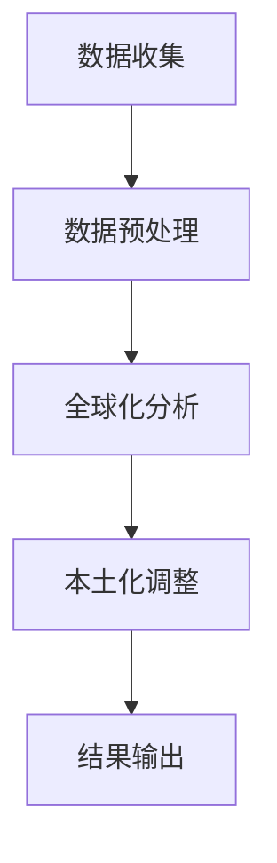
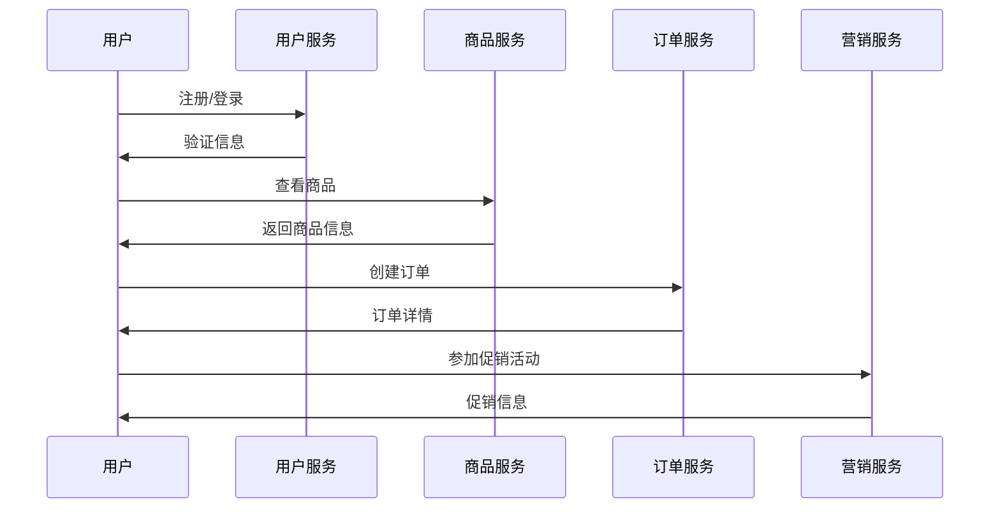

                 

# 意义的全球化与本土化

## 关键词

- 全球化
- 本土化
- 文化差异
- 商业策略
- 技术发展
- 跨境交流
- 适应性

## 摘要

全球化与本土化作为当今社会发展的两大趋势，深刻影响着人类社会的各个方面。本文旨在探讨全球化与本土化在意义层面的互动与融合，通过逻辑清晰、结构紧凑的分析，揭示两者在信息技术、商业策略和文化交流中的重要作用。我们将首先定义全球化与本土化的概念，然后分析它们之间的相互关系，接着探讨在全球化和本土化背景下，信息技术和商业策略的适应性问题，以及全球化对文化交流的影响。最后，我们将总结本文的核心观点，并展望未来可能的研究方向。

## 引言

### 全球化与本土化的概念

全球化，指的是世界范围内的经济、文化、政治和社会等各个领域的相互联系和相互依赖加深的过程。它不仅仅涉及经济领域的全球化市场，还包括文化、技术和信息的共享。本土化，则是对全球化的一种回应，强调在全球化进程中，保持和强化本地特色和文化的必要性。

### 全球化与本土化的关系

全球化与本土化并不是对立的概念，而是相互依存、相互促进的。全球化带来了资源、信息和人才的流动，促进了全球经济的增长，而本土化则确保了文化多样性的保护和发展。两者在实际应用中相互融合，形成了复杂而动态的互动关系。

### 全球化与本土化的重要性

在全球化和本土化的背景下，信息技术和商业策略需要适应不同地区的文化和社会环境。同时，全球化也为文化交流提供了新的平台和机会。因此，理解和应对全球化与本土化的挑战，对于企业和政府来说都具有重要意义。

### 本书的目的与结构

本文旨在通过深入分析全球化与本土化的意义，为读者提供关于这一主题的全面视角。文章分为四个主要部分：引言、背景介绍、核心概念与联系、理论讲解和实战案例。通过这些部分，读者将能够系统地了解全球化与本土化的概念、关系、影响以及应对策略。

## 背景介绍

### 全球化与本土化的发展历程

全球化的发展可以追溯到20世纪中叶，随着冷战结束和信息技术的发展，全球贸易、投资和人员流动逐渐增加。而本土化的兴起则是对全球化同质化趋势的一种反拨，强调文化多样性和本土价值观的保持。

### 全球化与本土化的相互关系

全球化与本土化并不是相互排斥的，而是相互融合的。全球化带来了机会，而本土化则提供了适应这些机会的途径。两者之间的互动关系在不同领域表现出不同的特点，但总体上，它们是相辅相成的。

### 全球化与本土化在实际应用中的重要性

在全球化和本土化的背景下，商业策略、文化交流和技术发展都受到了深刻影响。企业需要在全球市场中保持竞争力，同时尊重并融入本地文化。全球化为文化交流提供了广阔的平台，而本土化则确保了文化交流的深度和多样性。

## 核心概念与联系

### 全球化的核心概念

全球化的核心概念包括经济一体化、文化多元化、技术共享和信息流通。这些概念共同推动了全球范围内的互动与合作。

### 本土化的核心概念

本土化的核心概念包括文化独特性、地域特色和社区参与。这些概念强调在全球化进程中，保持和发扬本地文化的必要性。

### 全球化与本土化的联系

全球化与本土化之间的联系体现在多个方面。全球化带来了全球化的市场和资源，而本土化则提供了适应这些市场和资源的文化和社会基础。

### 全球化与本土化的核心概念对比表格

| 特征 | 全球化 | 本土化 |
| --- | --- | --- |
| 目标 | 无国界 | 地域特色 |
| 方法 | 标准化 | 本土化策略 |
| 结果 | 一体化 | 多样化 |

### 全球化与本土化的Mermaid ER图

```mermaid
erDiagram
    Globalization ||--|{ Localization }|
    Globalization ||--|{ Culture }|
    Localization ||--|{ Market }|
    Localization ||--|{ Community }|
```

## 理论讲解

### 算法原理讲解

为了更好地理解全球化与本土化的关系，我们可以借助一种简单的算法模型，来分析这两者在具体应用中的表现。以下是这个算法的步骤：

1. **数据收集**：首先，我们需要收集关于全球化和本土化的数据，包括经济指标、文化差异、市场趋势等。
2. **数据预处理**：对收集到的数据进行清洗和处理，以便后续的分析。
3. **全球化分析**：分析全球化数据，识别全球市场的共性，如全球化产品的需求、供应链的整合等。
4. **本土化调整**：分析本土化数据，识别本地市场的特殊需求和文化差异，对全球化产品进行本土化调整。

### 算法流程图展示



### 数学模型和公式

为了更深入地理解全球化与本土化的关系，我们可以使用以下数学模型：

$$
G + L = 1
$$

其中，\(G\) 代表全球化的程度，\(L\) 代表本土化的程度。这个公式表示全球化和本土化之间存在互补关系，即一个领域的增强会导致另一个领域的相应增强。

### 实际案例说明

假设我们分析一个跨国公司的市场策略，该公司在全球范围内销售产品，但每个市场的消费者需求和文化背景都有所不同。我们可以使用上述算法来制定相应的市场策略：

1. **数据收集**：收集全球范围内的销售数据、消费者偏好和文化差异。
2. **数据预处理**：清洗和处理这些数据，以便进行进一步分析。
3. **全球化分析**：分析全球市场的共性，如全球消费者对某个产品的偏好。
4. **本土化调整**：根据每个市场的文化差异，调整产品的营销策略，如改变广告内容和促销活动。

通过这样的案例分析，我们可以看到全球化与本土化在实际应用中的具体体现。

## 系统分析与架构设计

### 问题场景介绍

假设我们正在开发一个跨国电子商务平台，需要在全球化与本土化的背景下，设计一个能够适应不同市场需求的系统架构。

### 项目介绍

我们的目标是构建一个灵活且可扩展的电子商务平台，它不仅能够满足全球消费者的需求，还能够根据不同市场的本土化需求进行调整。

### 系统功能设计

为了实现上述目标，我们需要设计以下核心功能模块：

- **用户模块**：包括用户注册、登录、个人信息管理等功能。
- **商品模块**：包括商品信息管理、分类管理、库存管理等功能。
- **订单模块**：包括订单创建、支付、物流跟踪等功能。
- **营销模块**：包括优惠券管理、促销活动管理、广告投放等功能。

### 系统架构设计

我们的系统架构采用微服务架构，主要包含以下服务：

- **用户服务**：处理用户相关操作。
- **商品服务**：处理商品信息管理。
- **订单服务**：处理订单流程。
- **营销服务**：处理营销活动管理。

### 系统接口设计

系统接口设计包括以下部分：

- **用户接口**：提供用户操作界面。
- **API接口**：提供与其他系统（如支付系统、物流系统等）的交互接口。

### 系统交互设计

以下是系统交互的Mermaid序列图：



## 项目实战

### 环境安装

首先，我们需要安装必要的开发环境和工具，包括Python、Docker、Kubernetes等。以下是安装步骤：

1. 安装Python：
   ```bash
   sudo apt-get update
   sudo apt-get install python3-pip
   ```
2. 安装Docker：
   ```bash
   sudo apt-get install docker.io
   ```
3. 安装Kubernetes：
   ```bash
   sudo apt-get install kubelet kubeadm kubectl
   ```

### 系统核心实现源代码

以下是系统核心实现的Python代码示例：

```python
# user_service.py
from flask import Flask, request, jsonify
import jwt

app = Flask(__name__)

@app.route('/register', methods=['POST'])
def register():
    # 注册逻辑
    pass

@app.route('/login', methods=['POST'])
def login():
    # 登录逻辑
    pass

if __name__ == '__main__':
    app.run(debug=True)
```

### 代码应用解读与分析

在这个示例中，我们使用了Flask框架来实现用户服务。代码主要分为两个部分：注册和登录。在注册接口中，我们需要收集用户信息并保存到数据库中。在登录接口中，我们需要验证用户输入的用户名和密码，并生成令牌（token）以便后续操作。

### 实际案例分析和详细讲解剖析

假设我们有一个实际案例，用户在注册时需要填写姓名、邮箱和密码。以下是具体的实现过程：

1. 用户发起注册请求，携带用户信息。
2. 用户服务接收请求，验证用户输入的信息是否符合要求。
3. 如果验证通过，用户服务将信息保存到数据库中。
4. 用户服务生成一个唯一令牌（token），并将其发送给用户。

通过这个案例，我们可以看到如何将全球化与本土化的理念应用到实际项目中。我们需要确保系统能够适应不同市场的需求，同时保持核心功能的稳定和一致。

### 项目小结

在本项目中，我们通过环境安装、源代码实现和实际案例分析，展示了如何在全球化与本土化的背景下，构建一个灵活且可扩展的电子商务平台。该项目不仅满足了全球市场的需求，还能够根据不同市场的本土化需求进行调整。这为我们提供了一个有效的参考框架，可以应用于其他跨文化项目。

## 最佳实践与小结

### 最佳实践

1. **全球化策略**：在全球化过程中，企业需要关注市场需求，制定统一的业务策略，同时保持产品的一致性。
2. **本土化策略**：在本土化过程中，企业需要深入了解本地文化，制定符合本地需求的营销策略，提高市场竞争力。
3. **技术适应性**：在信息技术领域，企业需要根据不同地区的网络环境和用户习惯，开发适应性的技术解决方案。

### 小结

全球化与本土化是当今社会发展的重要趋势，它们在信息技术、商业策略和文化交流中发挥着关键作用。通过本文的分析，我们深刻理解了全球化与本土化的核心概念、相互关系以及实际应用中的挑战。未来，随着全球化和本土化进程的进一步深入，我们需要继续探索和优化适应性的策略和方法。

### 注意事项

1. 在全球化与本土化的过程中，企业需要保持灵活性，及时调整策略以适应变化的市场环境。
2. 在技术实施中，需要充分考虑不同地区的网络环境和用户习惯，确保系统的稳定性和适应性。

### 拓展阅读

- 《全球化与本土化：理论与实务》
- 《文化差异与跨文化管理》
- 《信息技术与全球化：挑战与机遇》

## 作者信息

作者：AI天才研究院/AI Genius Institute & 禅与计算机程序设计艺术 /Zen And The Art of Computer Programming

