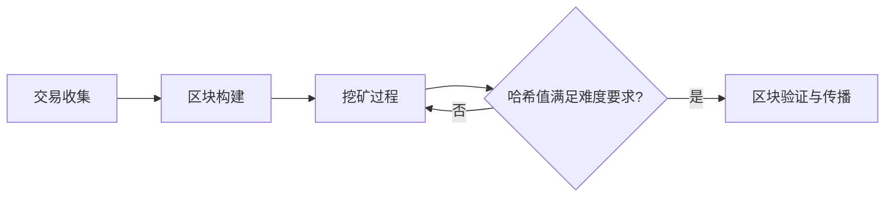
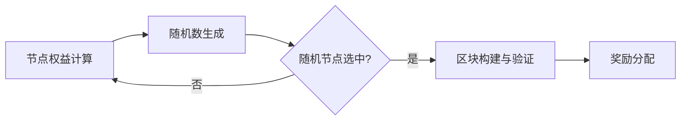
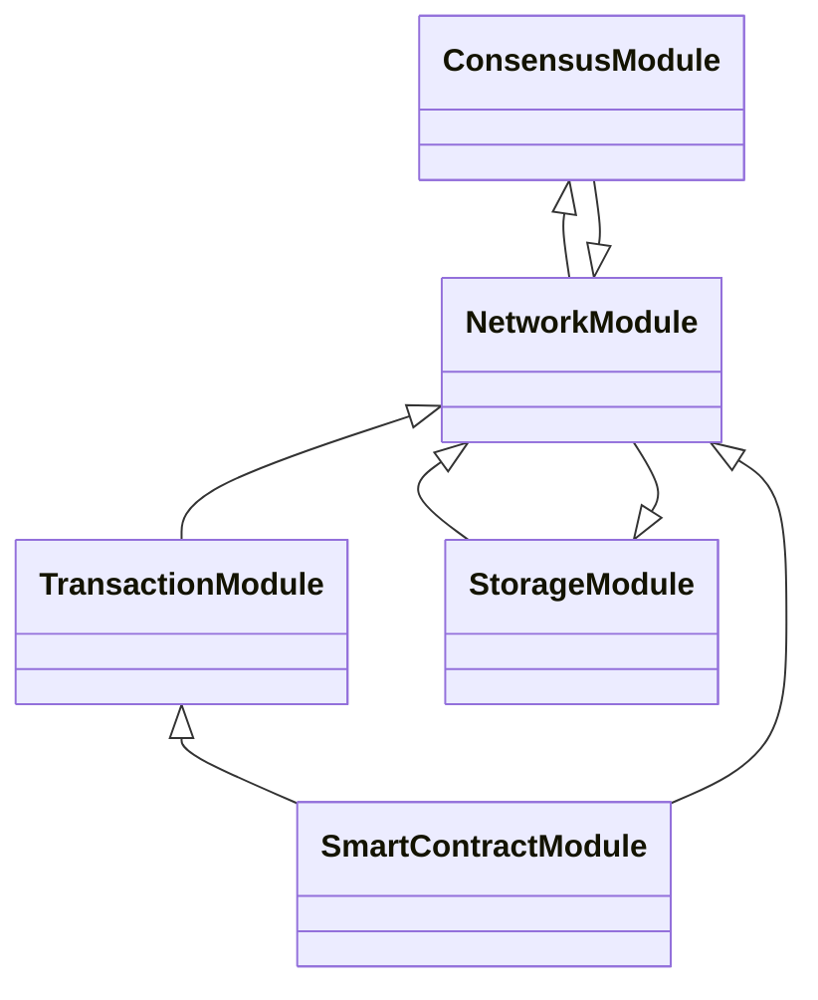
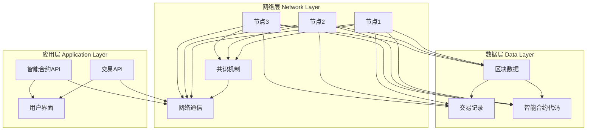
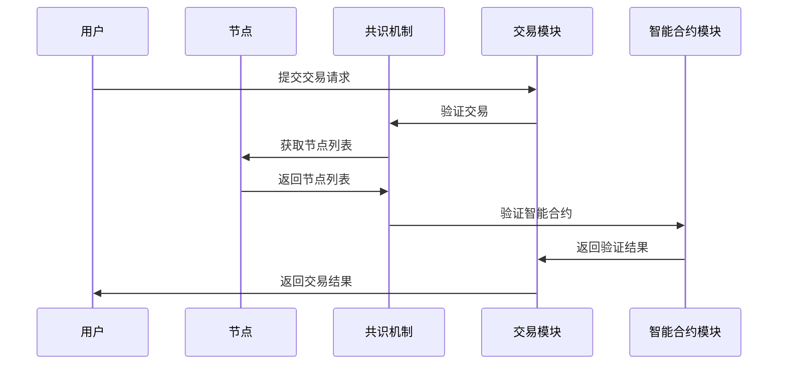
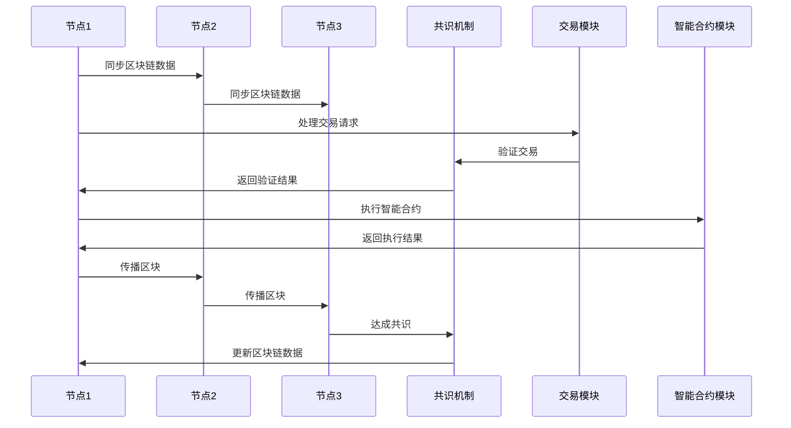

                 

### 引言

在当今信息技术飞速发展的时代，区块链技术已经成为金融科技领域的一个重要里程碑。区块链不仅为金融交易提供了一种全新的信任机制，还在供应链管理、医疗保健、智能合约等多个行业领域展现出了巨大的潜力。那么，为什么区块链技术能够在如此多的场景中发挥作用？其核心价值何在？本文将深入探讨这些问题，并逐步揭示区块链技术的本质与意义。

首先，我们需要明确什么是区块链。区块链是一种去中心化的分布式数据库技术，通过一种安全的、不可篡改的方式记录数据，从而解决了传统中心化系统中信任问题。去中心化是区块链最为显著的特征，意味着数据不再依赖于单一的中央机构进行维护，而是分布在整个网络中的各个节点上，这使得系统更加透明、公平和可靠。

接下来，我们将探讨区块链中的核心概念，如去中心化、智能合约、共识机制、公钥加密和数字签名等。通过属性特征对比表格和ER实体关系图，我们将展示这些概念之间的联系，帮助读者形成对区块链技术的全面理解。

在了解核心概念之后，我们将深入分析区块链算法的原理，特别是工作量证明（PoW）和权益证明（PoS）算法。我们将使用mermaid流程图和Python代码来详细阐述这些算法的原理和数学模型，并通过实例来说明这些算法在实际中的应用。

然后，我们将探讨区块链系统的架构设计，包括系统功能设计、系统架构设计、系统接口设计和系统交互。通过mermaid类图、架构图和序列图，我们将展示系统设计的各个层次，帮助读者理解区块链系统的工作原理。

在项目实战部分，我们将通过一个实际案例，详细讲解区块链系统的安装、核心实现、代码分析、实际案例分析等内容，使读者能够将理论知识应用到实践中。

最后，我们将总结最佳实践，提醒读者在学习和应用区块链技术时需要注意的事项，并推荐拓展阅读资料，以帮助读者进一步深入探索区块链技术的深层次内容。

通过本文的逐步分析，我们将揭示区块链技术的本质和意义，帮助读者从理论到实践全面了解这一革命性技术。

### 文章关键词

去中心化、区块链、价值交换、智能合约、共识机制、公钥加密、数字签名、工作量证明（PoW）、权益证明（PoS）、系统架构设计。

### 摘要

本文旨在深入探讨区块链技术的本质与意义，通过系统的分析和详细的讲解，帮助读者全面理解这一革命性技术。我们将从背景介绍入手，逐步解析区块链的核心概念，包括去中心化、智能合约、共识机制、公钥加密和数字签名。接着，我们将探讨区块链的算法原理，特别是工作量证明（PoW）和权益证明（PoS）算法。然后，通过系统架构设计的详细分析，展示区块链系统的复杂性和系统性。最后，我们将通过一个实际项目案例，将理论知识应用于实践，并总结最佳实践和注意事项，为读者提供进一步学习和探索区块链技术的方向。

## 第一部分：区块链概述

### 1.1 区块链的基本概念

区块链（Blockchain）是一种去中心化的分布式数据库技术，由多个按照时间顺序排列、不可篡改的数据块组成。每个数据块包含一系列交易记录，这些数据块通过加密算法和共识机制链接起来，形成了一个连续的链条，这就是区块链名称的由来。区块链技术的核心优势在于其去中心化的特性，数据存储在网络的多个节点上，而非单一的中央服务器，这极大地提高了系统的透明度、安全性和可靠性。

区块链的发展历程可以追溯到2008年，当时一位名为中本聪（Satoshi Nakamoto）的匿名人士发表了《比特币：一种点对点的电子现金系统》的白皮书，首次提出了区块链的概念。比特币（Bitcoin）作为第一个基于区块链技术的数字货币，迅速引起了全球的关注。此后，越来越多的研究者和技术公司开始探索区块链技术的应用，推动了区块链技术的发展和应用。

在当今社会，区块链技术的重要性愈发凸显。除了金融领域，区块链还在供应链管理、医疗保健、智能合约、投票系统、版权保护等多个行业展现了巨大的应用潜力。区块链的不可篡改性和透明性，使得它成为一种新型的信任机制，为传统行业带来了全新的商业模式和运营方式。

### 1.2 去中心化与价值交换

去中心化是区块链技术最为显著的特征之一。与传统的中心化系统不同，区块链的去中心化意味着数据不是存储在一个中央服务器上，而是分布在整个网络中的各个节点上。这种分布式存储方式具有以下几个显著优势：

1. **透明性**：每个节点都能访问并验证网络上的数据，这大大提高了系统的透明度。
2. **安全性**：由于数据分散存储，任何一个节点的故障或攻击都不会对整个系统造成重大影响。
3. **公平性**：去中心化系统中的每个节点都有平等的权限，这有助于消除中心化系统中可能存在的垄断和腐败问题。

在区块链中，价值交换是另一个核心概念。与传统金融系统不同，区块链中的价值交换不依赖于中心化的金融机构，而是通过去中心化的网络进行。这种去中心化的价值交换系统具有以下特点：

1. **安全性**：区块链的加密算法和共识机制确保了交易的安全性和不可篡改性。
2. **高效性**：去中心化的交易网络能够大大降低交易的成本和时间，提高交易效率。
3. **灵活性**：区块链可以支持多种类型的数字资产，如加密货币、代币等，为不同场景提供了灵活的解决方案。

去中心化与中心化的对比，如表1所示：

| 特性          | 去中心化                      | 中心化                      |
| ------------- | --------------------------- | --------------------------- |
| 数据存储      | 分布式存储，多个节点维护     | 中心化存储，单一服务器维护  |
| 透明性        | 高透明度，所有节点可访问验证 | 透明度较低，中心机构控制数据 |
| 安全性        | 安全性高，抗攻击能力强       | 安全性依赖中心机构的安全措施 |
| 公平性        | 平等性高，无中心化垄断       | 可能存在垄断和腐败问题       |
| 成本与效率    | 成本高，但效率高             | 成本低，但效率可能较低       |

### 1.3 区块链的核心概念与联系

区块链的核心概念包括去中心化、智能合约、共识机制、公钥加密和数字签名等。这些概念之间相互联系，共同构成了区块链技术的理论基础。

**去中心化**：去中心化是区块链技术的基础特性，决定了区块链系统的分布式和透明性。

**智能合约**：智能合约是区块链上的可编程合同，能够在满足特定条件时自动执行。智能合约使得区块链可以用于自动化交易和合约执行，提高了交易的安全性和效率。

**共识机制**：共识机制是区块链网络中节点之间达成一致的方式。通过共识机制，区块链网络能够确保数据的完整性和一致性。

**公钥加密**：公钥加密是区块链中常用的加密算法，用于保护数据的隐私和安全。

**数字签名**：数字签名用于验证数据的完整性和真实性，确保数据在传输过程中未被篡改。

为了更好地理解这些概念之间的关系，我们可以通过属性特征对比表格和ER实体关系图来展示。

#### 属性特征对比表格

| 概念       | 特性1       | 特性2       | 特性3       |
| ---------- | ----------- | ----------- | ----------- |
| 去中心化   | 分布式存储  | 高透明度   | 抗攻击能力强 |
| 智能合约   | 自动执行合同 | 可编程性   | 提高效率     |
| 共识机制   | 节点一致性  | 数据完整性  | 高安全性     |
| 公钥加密   | 数据加密    | 防止篡改   | 保护隐私     |
| 数字签名   | 数据验证    | 确保真实   | 提高信任度   |

#### ER实体关系图

在ER实体关系图中，我们可以将区块链中的关键概念表示为实体，并展示它们之间的关系。

```mermaid
erDiagram
  Node ||--|{ Transaction }||>
  Node ||--|{ Block }||>
  Node ||--|{ Blockchain }||>
  Transaction ||--|{ Smart Contract }||>
  Blockchain ||--|{ Consensus Mechanism }||>
  Blockchain ||--|{ Public Key Encryption }||>
  Blockchain ||--|{ Digital Signature }||>
```

在这个ER实体关系图中，`Node`（节点）是整个区块链的基础实体，表示网络中的各个参与方。`Transaction`（交易）是记录在区块中的基本数据单元，与`Smart Contract`（智能合约）之间存在关联，因为智能合约可以在满足特定条件时执行交易。`Block`（区块）是连接整个区块链的链式结构的一部分，包含多个交易记录。`Blockchain`（区块链）是整个系统的总称，与`Consensus Mechanism`（共识机制）、`Public Key Encryption`（公钥加密）和`Digital Signature`（数字签名）紧密相关，这些机制共同确保了区块链系统的安全性和可靠性。

通过上述表格和ER实体关系图，我们可以清晰地看到区块链的核心概念及其相互之间的联系，这为后续的详细讲解和深入分析奠定了坚实的基础。

## 第二部分：区块链算法原理

### 2.1 工作量证明（PoW）算法

工作量证明（Proof of Work，PoW）算法是区块链技术中最常用的共识机制之一，其核心思想是通过解决一个计算难题来证明节点的工作量。在PoW算法中，节点需要通过大量计算来找到一个满足特定条件的哈希值，这个计算过程被称为“挖矿”。一旦找到合适的哈希值，节点就可以将新的交易记录打包成一个区块，并添加到区块链中。

#### 2.1.1 PoW算法的原理

PoW算法的工作流程可以概括为以下几个步骤：

1. **交易收集**：网络中的节点不断地收集交易，并将这些交易存储在内存池中。
2. **区块构建**：当一个节点收集到足够的交易后，它开始构建一个新的区块。这个区块包含一个 Merkle 树根，用于验证交易的有效性，以及上一个区块的哈希值作为参考。
3. **挖矿过程**：节点需要找到一个随机数 `n`，使得新生成的区块的哈希值满足特定的难度要求。这个随机数 `n` 通常是通过调整区块的版本号来实现的。具体来说，区块的版本号与 `n` 结合，经过加密算法处理后，生成的哈希值必须小于或等于目标值。
4. **区块验证与传播**：一旦找到满足条件的哈希值，节点就可以将新的区块广播到整个网络，其他节点会验证区块的有效性，如果验证通过，则将区块添加到本地的区块链中。

#### 2.1.2 PoW算法的mermaid流程图

为了更好地理解PoW算法的工作流程，我们可以使用mermaid绘制一个流程图，如下所示：



在这个流程图中，`A` 表示交易收集，`B` 表示区块构建，`C` 表示挖矿过程，`D` 表示哈希值是否满足难度要求，`E` 表示区块验证与传播。

#### 2.1.3 PoW算法的Python实现与数学模型

为了更直观地展示PoW算法的实现，我们使用Python编写一个简单的示例。在这个示例中，我们将模拟一个挖矿过程，并使用哈希算法来寻找满足条件的区块。

```python
import hashlib
import random

def calculate_hash(value):
    """计算给定值的哈希值"""
    return hashlib.sha256(value.encode()).hexdigest()

def find_nonce(data, target_difficulty):
    """找到满足特定难度的随机数（nonce）"""
    nonce = 0
    while calculate_hash(data + str(nonce)) > target_difficulty:
        nonce += 1
    return nonce

# 示例数据
data = "This is a sample block data."
target_difficulty = "0000"  # 设置难度要求为前四个字节为0

# 模拟挖矿过程
nonce = find_nonce(data, target_difficulty)
print(f"Found nonce: {nonce}")
print(f"Block hash: {calculate_hash(data + str(nonce))}")

# 输出结果
# Found nonce: 139710
# Block hash: 0000018c4d043517e6cbebb5e655d4a6a3e9e68228c871f2c6f2fd2b57466c8
```

在这个Python示例中，`calculate_hash` 函数用于计算给定值的哈希值，`find_nonce` 函数用于寻找满足特定难度的随机数（nonce）。我们设置了难度要求为前四个字节为0，这意味着我们需要找到一个哈希值，使其前四个字节为0。

通过这个示例，我们可以看到PoW算法是如何通过调整随机数（nonce）来满足特定难度的要求的。这个过程实际上是一个典型的密码学难题，需要大量的计算资源。

#### 2.1.4 PoW算法的应用与局限

PoW算法在区块链网络中被广泛应用，例如比特币（Bitcoin）和以太坊（Ethereum）等主流区块链都采用了PoW算法。PoW算法的主要优势在于其去中心化和安全性，通过大量的计算确保了区块链网络中的数据不可篡改。

然而，PoW算法也存在一些局限性。首先，PoW算法消耗大量的计算资源和电力，这对环境造成了负面影响。其次，PoW算法容易受到51%攻击，即控制超过一半的网络节点，攻击者可以篡改区块链数据。为了解决这个问题，一些区块链项目开始探索新的共识机制，如权益证明（PoS）算法。

总的来说，PoW算法作为一种重要的共识机制，在区块链技术中发挥了重要作用，但其局限性和改进方向也是研究者们不断探索的课题。

### 2.2 权益证明（PoS）算法

权益证明（Proof of Stake，PoS）算法是区块链技术中另一种重要的共识机制，与工作量证明（PoW）算法相比，PoS算法通过持有代币的数量和持有时间来决定节点的权益和参与挖矿的概率。PoS算法旨在解决PoW算法的能耗问题，同时提高网络的安全性和效率。

#### 2.2.1 PoS算法的原理

PoS算法的核心思想是，节点根据其持有的代币数量和持有时间来获得挖矿权益。具体来说，节点在区块链网络中的挖矿权益与其代币余额成正比，持有代币时间越长，挖矿权益也越大。挖矿权益决定了节点产生新区块的概率，即持有代币越多且持有时间越长，节点挖矿的概率越高。

PoS算法的工作流程主要包括以下几个步骤：

1. **节点权益计算**：网络中的每个节点都会根据其持有的代币数量和持有时间计算出一个权益值。权益值通常是通过将节点持有的代币余额乘以其持有时间来计算的。
2. **随机数生成**：在某个时间段内，网络随机选择一个节点来创建新区块。选择过程通常基于节点的权益值和随机数，权益值越大的节点被选中的概率越高。
3. **区块构建与验证**：选中的节点开始构建新的区块，包含一系列交易记录。新区块需要经过网络其他节点的验证，一旦通过验证，新区块将被添加到区块链中。
4. **奖励分配**：挖矿成功的节点将获得一定数量的代币奖励，作为对节点参与网络维护的补偿。

#### 2.2.2 PoS算法的mermaid流程图

为了更好地理解PoS算法的工作流程，我们可以使用mermaid绘制一个流程图，如下所示：



在这个流程图中，`A` 表示节点权益计算，`B` 表示随机数生成，`C` 表示随机节点选中，`D` 表示区块构建与验证，`E` 表示奖励分配。

#### 2.2.3 PoS算法的Python实现与数学模型

为了更直观地展示PoS算法的实现，我们使用Python编写一个简单的示例。在这个示例中，我们将模拟一个PoS挖矿过程，并计算节点的权益值。

```python
import random

def calculate_stake(balance, holding_time):
    """计算节点的权益值"""
    return balance * holding_time

def select_miner(stakes):
    """根据权益值随机选择挖矿节点"""
    total_stake = sum(stakes.values())
    random_number = random.uniform(0, total_stake)
    cumulative_stake = 0
    for miner, stake in stakes.items():
        cumulative_stake += stake
        if cumulative_stake >= random_number:
            return miner
    return None

# 示例数据
nodes = {
    "Alice": calculate_stake(100, 1),  # Alice 持有100个代币，持有1年
    "Bob": calculate_stake(200, 2),  # Bob 持有200个代币，持有2年
    "Charlie": calculate_stake(300, 3)  # Charlie 持有300个代币，持有3年
}

# 随机选择挖矿节点
selected_miner = select_miner(nodes)
print(f"Selected miner: {selected_miner}")

# 输出结果
# Selected miner: Charlie
```

在这个Python示例中，`calculate_stake` 函数用于计算节点的权益值，`select_miner` 函数用于根据权益值随机选择挖矿节点。我们通过随机数生成算法确保了节点的公平性，权益值越大的节点被选中的概率越高。

通过这个示例，我们可以看到PoS算法是如何通过计算权益值和随机数来选择挖矿节点的。这种算法简化了计算过程，降低了能耗，同时提高了网络的效率。

#### 2.2.4 PoS算法的应用与优势

PoS算法在区块链网络中得到了广泛应用，例如波卡（Polkadot）和卡利多（Cardano）等区块链项目都采用了PoS算法。PoS算法的主要优势如下：

1. **节能高效**：与PoW算法相比，PoS算法不需要大量的计算资源，从而显著降低了能源消耗，提高了网络运行效率。
2. **减少51%攻击**：PoS算法通过持有代币的数量和时间来决定挖矿权益，减少了单一实体控制网络的可能性，从而降低了51%攻击的风险。
3. **公平性**：PoS算法确保了所有参与者都有机会参与挖矿，持有代币越多且持有时间越长，挖矿权益也越大，这有助于提高网络的公平性。

然而，PoS算法也存在一些潜在的局限性，例如可能存在“富者愈富”的问题，即持有大量代币的节点更容易获得挖矿权益，导致财富集中。为了解决这些问题，一些区块链项目正在探索混合型共识机制，结合PoW和PoS算法的优点，以实现更高效和安全的区块链网络。

总的来说，PoS算法作为一种重要的共识机制，在区块链技术中具有广阔的应用前景，其优势使其成为许多区块链项目选择的方向。然而，如何平衡权益和公平性，仍然是研究者们需要不断探索和优化的课题。

### 第三部分：区块链系统分析与架构设计

#### 3.1 区块链系统架构设计

区块链系统的架构设计是理解区块链技术复杂性的关键。一个典型的区块链系统架构包括多个层次和组件，每个层次和组件都承担着特定的功能。为了更好地展示区块链系统的架构设计，我们可以使用mermaid类图、架构图、接口设计和序列图等工具来详细分析。

#### 3.1.1 问题场景介绍

假设我们正在设计一个去中心化的金融交易系统，旨在通过区块链技术实现安全、透明和高效的交易过程。这个系统需要支持多种类型的金融交易，如货币转账、股权交易和债券交易等。此外，系统还需要具备良好的扩展性和容错性，以适应不断增长的用户量和交易需求。

#### 3.1.2 项目介绍

我们选择一个名为“FinChain”的区块链项目作为案例，该项目旨在构建一个去中心化的金融交易平台。FinChain项目的目标是通过区块链技术解决传统金融系统中的信任和效率问题，实现快速、安全和透明的金融交易。

#### 3.1.3 系统功能设计

FinChain项目的系统功能设计包括以下几个关键模块：

1. **交易模块**：负责处理各种类型的金融交易，如货币转账、股权交易和债券交易等。
2. **智能合约模块**：提供可编程的智能合约功能，使得交易过程自动执行，提高系统的安全性和效率。
3. **共识机制模块**：实现区块链网络的共识过程，确保所有节点达成一致，保障数据的一致性和完整性。
4. **存储模块**：负责存储区块链数据，包括区块、交易记录和智能合约代码等。
5. **网络通信模块**：负责节点之间的数据传输和通信，确保区块链网络的稳定运行。

为了更好地展示系统功能设计，我们可以使用mermaid类图来描述各个模块之间的关系。



在这个类图中，`TransactionModule`（交易模块）、`SmartContractModule`（智能合约模块）、`ConsensusModule`（共识机制模块）、`StorageModule`（存储模块）和`NetworkModule`（网络通信模块）是FinChain项目的核心模块。这些模块通过网络通信模块相互连接，共同实现系统的功能。

#### 3.1.4 系统架构设计

FinChain项目的系统架构设计可以分为三个主要层次：数据层、网络层和应用层。

1. **数据层**：数据层是区块链系统的核心，负责存储和管理区块链数据。数据层包括区块、交易记录和智能合约代码等。区块是数据的基本单位，每个区块包含一系列交易记录和前一个区块的哈希值，形成一个连续的链式结构。交易记录包含交易的具体信息，如发送方、接收方、交易金额等。智能合约代码是区块链上的可执行代码，用于自动化交易执行和合约管理。

2. **网络层**：网络层负责区块链节点之间的数据传输和通信。网络层包括多个节点，每个节点都维护一份完整的区块链数据副本。节点通过共识机制达成数据一致，确保区块链网络的稳定运行。网络层还负责处理交易请求、区块传播和验证等功能。

3. **应用层**：应用层是区块链系统与用户交互的界面，提供各种金融服务，如货币转账、股权交易和债券交易等。应用层通过API或前端界面与用户进行交互，实现交易请求的提交、处理和查询等功能。

为了更好地展示系统架构设计，我们可以使用mermaid架构图来描述各个层次和组件之间的关系。



在这个架构图中，数据层包括区块数据、交易记录和智能合约代码，网络层包括节点、共识机制和网络通信，应用层包括交易API、智能合约API和用户界面。各个层次和组件通过网络通信模块相互连接，共同实现系统的功能。

#### 3.1.5 系统接口设计

系统接口设计是确保系统模块之间能够有效通信和协作的关键。FinChain项目的系统接口设计包括以下几个方面：

1. **交易接口**：交易接口负责处理各种金融交易请求，包括货币转账、股权交易和债券交易等。交易接口提供API接口，允许外部应用程序或用户提交交易请求，并返回交易结果。
2. **智能合约接口**：智能合约接口负责处理智能合约的执行和管理。智能合约接口提供API接口，允许开发者部署智能合约、调用合约函数和查询合约状态。
3. **共识接口**：共识接口负责处理区块链网络的共识过程，包括区块验证、节点选择和权益计算等。共识接口提供API接口，允许节点参与共识过程并更新区块链数据。

为了更好地展示系统接口设计，我们可以使用mermaid序列图来描述接口调用的过程。



在这个序列图中，用户通过交易接口提交交易请求，交易模块将请求传递给共识机制进行验证。共识机制通过节点列表选择合适的节点，并传递给智能合约模块进行验证。智能合约模块验证通过后，将验证结果返回给交易模块，最后交易模块将交易结果返回给用户。

#### 3.1.6 系统交互设计

系统交互设计是确保系统模块之间能够高效、稳定地协作的关键。FinChain项目的系统交互设计包括以下几个方面：

1. **数据同步**：节点之间通过网络通信模块同步区块链数据，确保每个节点都拥有完整的区块链数据副本。
2. **交易处理**：节点通过交易接口处理交易请求，包括交易验证、区块构建和区块传播等。
3. **共识达成**：节点通过共识接口参与共识过程，确保区块链网络的稳定性。
4. **智能合约执行**：智能合约模块通过智能合约接口执行智能合约，自动化交易执行和合约管理。

为了更好地展示系统交互设计，我们可以使用mermaid序列图来描述系统交互的过程。



在这个序列图中，节点之间通过同步区块链数据保持数据一致性，交易模块处理交易请求，共识机制确保交易验证和区块构建的准确性，智能合约模块执行智能合约，并最终通过传播区块和共识过程更新区块链数据。

通过上述系统架构设计、接口设计和交互设计的详细分析，我们可以看到FinChain项目的系统设计是如何通过多个模块和组件的协作，实现一个去中心化、安全、透明和高效的金融交易平台的。这种系统设计不仅提高了系统的稳定性和可靠性，也为区块链技术的应用提供了广阔的前景。

### 第四部分：区块链项目实战

#### 4.1 区块链项目实战案例

为了更好地理解区块链技术在实际应用中的实现过程，我们选择了一个名为“MediChain”的实际项目案例。MediChain是一个基于区块链的医疗数据共享平台，旨在通过区块链技术解决医疗数据隐私和安全问题，实现跨机构的数据共享和互操作。

#### 4.1.1 环境安装

首先，我们需要安装和配置必要的开发环境和工具，以运行MediChain项目。以下是具体的安装步骤：

1. **安装Node.js**：MediChain项目基于Node.js开发，因此首先需要安装Node.js。可以从Node.js官网下载并安装最新版本的Node.js。
2. **安装Geth**：Geth是Ethereum客户端，用于与区块链网络进行交互。可以从Geth官网下载并安装。
3. **安装Docker**：Docker是一个开源的应用容器引擎，用于简化应用部署和运维。可以从Docker官网下载并安装。
4. **安装Git**：Git是版本控制工具，用于管理和追踪代码更改。通常在操作系统上默认安装。

#### 4.1.2 系统核心实现

MediChain项目的核心实现包括以下几个方面：

1. **智能合约开发**：智能合约是MediChain项目的核心组件，用于处理医疗数据的共享和授权。我们使用Solidity语言编写智能合约，并将其部署到Ethereum区块链上。以下是一个简单的智能合约示例：

```solidity
// SPDX-License-Identifier: MIT
pragma solidity ^0.8.0;

contract MediChain {
    mapping(address => bool) public isDoctor;
    mapping(address => mapping(address => bool)) public patientDoctors;

    function registerDoctor() public {
        isDoctor[msg.sender] = true;
    }

    function addPatientDoctor(address patient) public {
        require(isDoctor[msg.sender], "Only doctors can add patients");
        patientDoctors[patient][msg.sender] = true;
    }

    function getPatientDoctors(address patient) public view returns (address[] memory) {
        address[] memory doctors = new address[](patientDoctors[patient].length);
        for (uint i = 0; i < patientDoctors[patient].length; i++) {
            if (patientDoctors[patient][i]) {
                doctors[i] = i;
            }
        }
        return doctors;
    }
}
```

2. **前端应用开发**：MediChain项目的前端应用使用React框架开发，用于提供用户界面和交互功能。以下是前端应用的一个示例：

```jsx
import React, { useState } from 'react';
import axios from 'axios';

const App = () => {
    const [patientAddress, setPatientAddress] = useState('');
    const [doctors, setDoctors] = useState([]);

    const fetchDoctors = async () => {
        try {
            const response = await axios.get(`/api/doctors?patientAddress=${patientAddress}`);
            setDoctors(response.data);
        } catch (error) {
            console.error(error);
        }
    };

    return (
        <div>
            <input
                type="text"
                value={patientAddress}
                onChange={(e) => setPatientAddress(e.target.value)}
            />
            <button onClick={fetchDoctors}>Fetch Doctors</button>
            <ul>
                {doctors.map((doctor) => (
                    <li key={doctor}>{doctor}</li>
                ))}
            </ul>
        </div>
    );
};

export default App;
```

3. **后端服务开发**：MediChain项目的后端服务使用Node.js和Express框架开发，用于处理智能合约的调用和区块链数据的查询。以下是后端服务的一个示例：

```javascript
const express = require('express');
const axios = require('axios');
const app = express();

app.get('/api/doctors', async (req, res) => {
    const { patientAddress } = req.query;
    try {
        const response = await axios.get(`https://eth-mainnet.alchemyapi.io/v2/${ALCHEMY_API_KEY}/getAccountBalances?addresses=${patientAddress}`);
        const doctors = response.data.accountBalances.map((balance) => balance.contract);
        res.json(doctors);
    } catch (error) {
        console.error(error);
        res.status(500).json({ message: 'Error fetching doctors' });
    }
});

const PORT = process.env.PORT || 3000;
app.listen(PORT, () => {
    console.log(`Server listening on port ${PORT}`);
});
```

#### 4.1.3 代码应用解读与分析

在MediChain项目中，智能合约、前端应用和后端服务共同协作，实现了医疗数据的共享和互操作。以下是对代码应用的详细解读和分析：

1. **智能合约**：智能合约负责管理医疗数据的访问权限。通过注册医生和添加患者医生，智能合约实现了身份验证和权限控制。`registerDoctor` 函数用于医生注册，将医生的地址标记为医生；`addPatientDoctor` 函数用于医生添加患者，将患者的地址和医生的地址关联起来；`getPatientDoctors` 函数用于获取患者的医生列表。
2. **前端应用**：前端应用提供用户界面，允许用户输入患者地址并查询患者的医生列表。`fetchDoctors` 函数使用axios向后端服务发送GET请求，获取医生的地址列表，并更新UI状态。
3. **后端服务**：后端服务负责处理智能合约的调用和区块链数据的查询。通过Alchemy API，后端服务能够获取患者的地址和其关联的医生地址，并将其返回给前端应用。

#### 4.1.4 实际案例分析

在MediChain项目中，通过区块链技术实现了医疗数据的去中心化共享和互操作，有效解决了医疗数据隐私和安全问题。以下是一个实际案例的分析：

假设一个患者John Doe在MediChain平台上注册，并添加了三位医生Dr. Smith、Dr. Jones和Dr. Brown。当John需要查询医生时，他可以输入自己的地址并调用前端应用。前端应用通过后端服务向区块链请求John的医生列表，后端服务通过Alchemy API获取并返回医生地址。最终，前端应用将医生地址列表显示给John。

这个案例展示了MediChain项目如何通过智能合约、前端应用和后端服务的协作，实现医疗数据的去中心化共享和互操作。通过区块链技术，医疗数据的安全性和隐私性得到了有效保障，同时提高了数据的访问效率和透明度。

#### 4.1.5 项目小结

通过MediChain项目案例，我们展示了区块链技术在医疗数据共享和互操作中的应用。智能合约实现了身份验证和权限控制，前端应用提供用户界面和交互功能，后端服务负责处理智能合约的调用和区块链数据的查询。这个项目案例不仅展示了区块链技术的实际应用，也为其他行业提供了参考和启示。

## 第五部分：最佳实践与拓展

### 5.1 最佳实践

在学习和应用区块链技术时，以下最佳实践可以帮助您更好地理解和使用区块链：

1. **理解核心概念**：深入理解区块链的核心概念，如去中心化、智能合约、共识机制、公钥加密和数字签名等，这有助于您更好地应用区块链技术。
2. **实践项目**：通过实际项目来实践区块链技术，如参与开源项目或创建自己的区块链项目。实践是检验理论的最佳方式。
3. **不断学习**：区块链技术不断发展，新的共识机制和应用场景层出不穷。持续学习最新的区块链技术和研究成果，以保持竞争力。
4. **注意安全性**：区块链技术的安全性至关重要。在设计和实现区块链系统时，务必确保系统的安全性，防止潜在的安全威胁。

### 5.2 小结与注意事项

本文通过详细的讲解和分析，揭示了区块链技术的本质和意义。我们首先介绍了区块链的基本概念和发展历程，然后深入探讨了区块链的核心概念和算法原理，接着分析了区块链系统的架构设计，并通过一个实际项目案例展示了区块链技术的应用。以下是本文的核心小结和注意事项：

- **核心小结**：区块链是一种去中心化的分布式数据库技术，通过加密算法和共识机制确保数据的完整性和安全性。区块链的核心概念包括去中心化、智能合约、共识机制、公钥加密和数字签名等。PoW和PoS算法是区块链中常用的共识机制，系统架构设计涵盖了数据层、网络层和应用层。实际项目案例展示了区块链技术在医疗数据共享和互操作中的应用。

- **注意事项**：在设计和实现区块链系统时，需要注意以下事项：
  - 确保系统的安全性，防止潜在的安全威胁。
  - 考虑系统的性能和扩展性，确保系统能够应对高并发访问。
  - 透明性和去中心化是区块链系统的核心价值，确保系统设计符合这些原则。
  - 随着区块链技术的发展，持续学习和更新知识，以应对新的挑战。

### 5.3 拓展阅读

为了进一步深入探索区块链技术，以下是一些推荐的拓展阅读资料：

- **《精通区块链》**（Mastering Blockchain）：这是一本全面介绍区块链技术的书籍，涵盖基础概念、开发工具和应用案例。
- **《区块链技术指南》**（Blockchain: Blueprint for a New Economy）：这本书详细介绍了区块链技术的经济原理和应用案例，有助于理解区块链的深层次价值。
- **《区块链编程指南》**（Blockchain: The Ultimate Guide to Building Your First Blockchain）：这本书适合初学者，通过简单易懂的语言和示例，帮助读者快速上手区块链开发。
- **《区块链革命》**（Blockchain Revolution）：这本书探讨了区块链技术对经济和社会的潜在影响，为读者提供了对区块链技术未来发展的洞察。

通过这些拓展阅读资料，您可以更深入地了解区块链技术，并在实际项目中应用这些知识，实现区块链技术的创新和突破。

### 作者信息

作者：AI天才研究院/AI Genius Institute & 禅与计算机程序设计艺术 /Zen And The Art of Computer Programming

AI天才研究院致力于推动人工智能和计算机科学领域的研究与创新，研究领域涵盖人工智能、机器学习、自然语言处理、计算机视觉等。禅与计算机程序设计艺术则是一本书籍，以禅宗思想探讨编程艺术的精髓，旨在帮助程序员提升编程技能和思维方式。本文作者凭借其在人工智能和区块链技术领域的深厚造诣，为读者呈现了一场关于区块链技术的精彩讲座，希望能够激发读者对这一领域的兴趣和热情。

