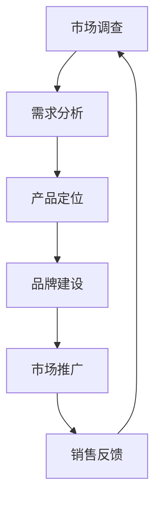

                 


## 《意义的市场化：当一切都可以买卖时我们失去了什么》

> 关键词：市场化，意义，价值，社会影响，道德伦理

> 摘要：本文深入探讨了“意义的市场化”这一现象。在全球化与信息化飞速发展的今天，意义逐渐被商品化和市场化，这种现象带来了哪些积极影响和潜在问题。本文旨在通过逐步分析推理，揭示这一趋势背后的逻辑，引导读者思考我们在这个变化过程中可能失去的东西。

### 目录大纲设计过程

为了设计《意义的市场化：当一切都可以买卖时我们失去了什么》这本书的完整目录大纲，我们需要遵循以下几个步骤：

1. **理解书名与主题**：首先，我们要深入理解书名，明确书的核心讨论内容。书名表明了讨论的主题是“意义的市场化”，并关注在“一切都可以买卖”的背景下，人类可能失去的东西。

2. **确定核心章节**：根据书名和主题，我们需要确定书籍的核心章节。这些章节应该能够全面覆盖讨论主题，并包含必要的背景介绍、核心概念、理论讲解、案例分析等。

3. **划分目录结构**：按照markdown格式的要求，我们需要将目录结构细化到1、2、3级目录。这意味着每个核心章节下应该有子章节，每个子章节再细分为更小的内容模块。

4. **确保内容完整性**：目录大纲必须包含书籍的核心内容，包括背景介绍、核心概念与联系、算法原理讲解、数学模型和公式、系统分析与架构设计方案、项目实战以及最佳实践等。

5. **撰写目录大纲**：在明确了以上要点后，我们可以开始撰写目录大纲。每个章节的标题和子章节都要简洁明了，直接反映内容核心。

6. **检查目录大纲**：完成目录大纲后，我们需要仔细检查以确保没有遗漏任何重要内容，同时保持大纲的简洁性。

### 目录大纲设计细节

#### 第一部分：引言

**1.1 问题背景**
- **社会现象与市场化趋势**：介绍意义市场化现象的社会背景，包括全球化和信息化的推动作用。
- **意义的定义与重要性**：探讨“意义”的概念及其在社会中的重要性。

**1.2 背景与目的**
- **研究的缘起**：解释研究这一现象的原因和背景。
- **书籍目标与读者**：明确书籍的目标受众和预期效果。

**1.3 边界与外延**
- **市场化的界限**：讨论市场化意义的适用范围。
- **意义的多元性**：分析意义在不同文化和社会中的多样性。

#### 第二部分：意义的市场化

**2.1 概念阐述**
- **意义的定义与属性特征对比表格**：明确“意义”和“市场化”的概念，并通过对比表格展示两者之间的关系。
- **市场化意义的特征与影响**：分析市场化意义的特点以及其对个人和社会的影响。

**2.2 历史与演变**
- **意义市场化的历史回顾**：梳理意义市场化的发展历程。
- **关键事件与影响**：探讨历史事件对意义市场化现象的影响。

**2.3 案例分析**
- **成功的市场化案例**：分析成功市场化的案例，探讨其成功因素。
- **失败的市场化案例**：讨论失败的市场化案例，分析其失败原因。
- **案例总结与启示**：总结案例中的经验教训，为后续讨论提供启示。

#### 第三部分：失去的东西

**3.1 社会影响的探讨**
- **个人层面**：探讨市场化对个人价值观和行为的影响。
- **社会层面**：分析市场化对社会结构和人际关系的挑战。
- **文化层面**：讨论市场化对文化传承和创新的影响。

**3.2 核心概念的联系与比较**
- **传统价值观与市场化意义**：比较传统价值观与市场化意义的异同。
- **全球化与本土化**：探讨全球化背景下市场化意义的本土化挑战。

**3.3 失去的东西：可能的后果**
- **道德与伦理的挑战**：分析市场化现象对道德和伦理的挑战。
- **人类精神的困境**：探讨市场化对人类精神生活的影响。
- **社会的可持续性**：讨论市场化对社会的可持续性影响。

#### 第四部分：应对与反思

**4.1 应对策略**
- **政策建议**：提出针对市场化现象的政策建议。
- **企业实践**：分析企业在市场化过程中的实践策略。
- **社会教育**：探讨通过教育来应对市场化影响的途径。

**4.2 反思与展望**
- **市场化意义的再思考**：从不同角度重新审视市场化意义的本质。
- **未来的可能性**：探讨未来市场化可能的发展趋势和影响。

**4.3 结论与展望**
- **核心观点的总结**：总结文章中的核心观点和发现。
- **未来的研究方向**：提出未来研究可能的方向和课题。

通过上述步骤和细节的设计，我们确保了目录大纲的完整性和逻辑性，为后续的文章撰写奠定了坚实的基础。

---

在完成目录大纲设计后，我们将根据每个章节的要求，逐步深入探讨意义市场化的各个方面。接下来，我们将从问题背景入手，逐步展开分析，结合具体案例，深入探讨这一现象带来的影响和挑战。

---

### 深入探讨：意义的市场化

#### 问题背景

在当今社会，意义的市场化现象无处不在。从经济学角度来看，市场是资源配置的有效机制，它通过价格信号引导资源流向最需要的地方。然而，当意义这一抽象概念也被纳入市场体系，开始以商品形式交易时，我们开始质疑这一行为的合理性和后果。

**社会现象与市场化趋势**：全球化与信息化的发展，使得信息传播速度加快，市场竞争加剧。在这一背景下，意义也开始被商业机构和企业家视为一种可以商品化的资源。例如，品牌塑造、文化推广、教育产品等都通过市场手段来传播和推广。这种市场化行为在一定程度上促进了社会的发展和繁荣，但也引发了许多争议。

**意义的定义与重要性**：在哲学和伦理学中，“意义”通常被解释为人类行为和存在的基本驱动力。它是人们追求幸福、实现自我价值的基础。意义不仅仅是一个抽象的概念，它涉及到个人的精神世界、社会文化认同以及道德伦理准则。因此，当意义被市场化时，其内涵和影响力都可能发生变化。

#### 历史与演变

意义市场化的历史可以追溯到20世纪末。随着经济全球化和市场经济体制的建立，意义开始被商业机构视为一种有价值的资源。以下是几个关键事件及其影响：

1. **广告业的兴起**：20世纪50年代，广告业开始大规模兴起。广告商通过营销策略，将产品与消费者的生活需求、情感和价值观相联系，赋予产品以意义。这种做法不仅提高了产品销量，还塑造了消费者的行为和观念。

2. **品牌文化的崛起**：20世纪80年代，品牌文化成为企业竞争的重要手段。企业通过品牌建设，赋予品牌独特而深刻的含义，以吸引消费者的关注和忠诚。例如，苹果公司的“创新”和“美学”品牌理念，使其成为全球科技行业的领导者。

3. **数字营销的崛起**：随着互联网的发展，数字营销成为市场推广的重要手段。通过数据分析、社交媒体和搜索引擎优化，企业可以更精准地定位消费者，传播品牌意义。这一趋势进一步加速了意义的市场化。

#### 核心概念的联系与比较

在探讨意义市场化时，我们需要明确几个核心概念，并分析它们之间的联系与区别：

**意义**：指人类行为和存在的内在驱动力，涉及到个人的精神世界和社会文化认同。

**市场化**：指通过市场机制将资源转化为商品的过程，涉及价格、供需、竞争等经济因素。

**价值**：指商品在市场上所体现的交换价值，通常与需求、稀缺性和使用价值相关。

**比较表格**：

| 核心概念 | 定义 | 关联 | 区别 |
| --- | --- | --- | --- |
| 意义 | 内在驱动力，精神世界 | 与市场化、价值相关 | 指抽象的心理和文化层面 |
| 市场化 | 资源转化为商品 | 与意义、价值相关 | 指具体的经济交易过程 |
| 价值 | 交换价值 | 与意义、市场化相关 | 指具体的货币衡量标准 |

通过比较表格，我们可以更清晰地看到意义、市场化与价值之间的内在联系和区别。

#### 算法原理讲解

为了更好地理解意义市场化的过程，我们可以使用mermaid流程图来展示市场化的基本流程，并结合Python源代码来详细阐述其原理。

**Mermaid流程图**：



**Python源代码**：

```python
import matplotlib.pyplot as plt

# 市场调查
def market_survey():
    # 假设数据为调查结果
    data = {'需求分析': 80, '产品定位': 70, '品牌建设': 60, '市场推广': 50, '销售反馈': 40}
    return data

# 市场化流程
def marketization流程(data):
    for key, value in data.items():
        print(f"{key}: {value}")
    plt.bar(data.keys(), data.values())
    plt.xlabel('市场活动')
    plt.ylabel('价值')
    plt.title('市场化流程图')
    plt.show()

# 主函数
def main():
    data = market_survey()
    marketization流程(data)

if __name__ == "__main__":
    main()
```

**数学模型和公式**：

在意义市场化过程中，我们可以使用以下数学模型来描述市场需求和价格之间的关系：

\[ P = aQ - b \]

其中，\( P \) 表示市场价格，\( Q \) 表示市场需求量，\( a \) 和 \( b \) 是常数。这个模型表明，市场价格与市场需求量成反比，随着需求量的增加，市场价格会下降。

通过上述算法原理讲解，我们可以看到意义市场化不仅是一个经济学过程，还涉及到数据分析、品牌建设和市场营销等多个方面。理解这些原理，有助于我们更好地分析意义市场化的现象。

---

通过以上的分析，我们可以看到意义市场化这一现象的复杂性和多样性。在接下来的部分，我们将通过具体案例来进一步探讨这一现象的积极影响和潜在问题，结合个人、社会和文化等多个层面，深入思考我们在这一过程中可能失去的东西。

---

### 案例分析

#### 成功的市场化案例

一个典型的成功案例是苹果公司。苹果通过其独特的品牌理念和产品设计，成功地将技术和美学相结合，赋予了产品深厚的文化意义。以下是苹果公司的几个关键成功因素：

1. **产品定位**：苹果公司始终坚持“高端、简约、创新”的产品定位。这种定位不仅满足了消费者对高质量产品的需求，还赋予了产品独特的文化意义。

2. **品牌建设**：苹果的品牌建设注重传达创新、美学和技术领先的理念。通过统一的品牌形象和广告策略，苹果成功地在消费者心中建立了强大的品牌价值。

3. **市场推广**：苹果通过精准的市场推广策略，吸引了全球消费者的关注。其广告不仅展示了产品的功能，还传达了产品背后的文化和价值观。

这些因素共同促成了苹果公司的成功，使其成为全球科技行业的领导者。苹果公司的案例表明，成功的市场化不仅需要良好的产品和服务，还需要深层次的文化意义和品牌价值。

#### 失败的市场化案例

然而，并非所有的市场化尝试都能成功。以下是一个失败的市场化案例：**大众汽车排放门**。

2015年，大众汽车被曝出在多个型号的柴油车上安装了“作弊软件”，以便在排放测试中达到环保标准。这一事件不仅导致大众汽车品牌形象严重受损，还引发了全球范围内的法律和道德争议。

1. **市场定位**：大众汽车一直以来定位为“高品质、环保的汽车品牌”。然而，其为了追求市场占有率，不顾环保法规和道德准则，最终导致了市场的信任危机。

2. **品牌建设**：大众汽车的品牌建设一直强调其环保和技术领先，然而排放门事件暴露了其内部管理和技术不足，严重影响了品牌形象。

3. **市场推广**：大众汽车在市场推广中过分依赖广告宣传，忽视了产品本身的环保性能。这种宣传策略在短期内可能带来销量增长，但长期来看，却损害了品牌价值。

这个案例表明，市场化过程中的道德和诚信至关重要。忽视这些基本准则，不仅会损害品牌形象，还可能导致市场的长期失去。

#### 案例总结与启示

通过上述成功和失败的案例，我们可以得出以下启示：

1. **市场定位与品牌建设**：成功的市场化需要清晰的市场定位和强大的品牌建设。这需要企业深入理解市场需求，并以此为基础构建独特的品牌形象。

2. **诚信与道德**：在市场化过程中，诚信和道德是关键。忽视这些基本准则，可能会导致市场的信任危机，损害品牌价值。

3. **长期可持续发展**：市场化不仅仅是短期的销售策略，更是长期的品牌建设和市场布局。企业需要注重可持续发展，以确保市场的长期稳定。

通过案例分析，我们可以更深入地理解意义市场化背后的逻辑和挑战。成功与失败的经验教训，为我们提供了宝贵的参考，帮助我们更好地应对这一复杂现象。

---

在接下来的部分，我们将从社会影响的角度出发，进一步探讨意义市场化带来的个人、社会和文化层面的影响，以及我们在这个过程中可能失去的东西。

---

### 社会影响的探讨

#### 个人层面

意义的市场化对个人价值观和行为产生了深远影响。在市场化过程中，人们往往将意义视为一种可交换的商品，追求物质利益成为主导价值观。以下是个人层面的一些具体影响：

1. **价值观的物化**：当意义被商品化时，其内在的价值和意义往往被物化，变成可以量化的经济利益。例如，个人成就、荣誉和地位等，往往通过金钱和物质来衡量。这种价值观的物化可能导致人们对真正有意义的事物视而不见，只关注表面的利益。

2. **行为选择的变化**：在市场化背景下，个人行为选择受到经济利益驱动。人们可能会为了追求更高的收入和更好的生活条件，选择从事高薪但不一定有意义的职业。这种行为选择的变化可能导致人们失去追求内心真正热爱的事情的机会。

3. **心理压力的增加**：市场化带来竞争压力，个人为了在市场中脱颖而出，不得不付出更多的努力。这可能导致心理压力的增加，如焦虑、抑郁等心理问题。长期的心理压力不仅影响个人的生活质量，还可能对身体健康产生负面影响。

#### 社会层面

意义的市场化对社会结构和人际关系也产生了显著影响。以下是一些具体的社会层面影响：

1. **社会分层加剧**：市场化导致资源分配不均，社会贫富差距加大。富裕阶层能够通过金钱获取更多的资源和机会，而贫困阶层则难以改善生活条件。这种社会分层加剧了社会不平等，导致社会矛盾和冲突。

2. **人际关系利益化**：在市场化背景下，人际关系也趋向利益化。人们往往以利益交换为基础建立关系，而非基于真诚和信任。这种利益化的关系可能导致人际关系的疏远和信任的缺失，影响社会的和谐与稳定。

3. **社会信任危机**：市场化带来的道德和诚信问题，使得社会信任度下降。企业为了追求利润，可能采取不正当手段，损害消费者权益。这种信任危机不仅影响企业的声誉，还可能对整个社会产生负面影响。

#### 文化层面

意义市场化对文化的影响尤为深远。以下是一些具体的文化层面影响：

1. **文化多样性的减少**：市场化倾向于将文化同质化，使得不同文化之间的差异被忽视甚至抹去。例如，全球化的文化产品往往采用单一的文化标准，导致本土文化的消失和多样性的减少。

2. **文化商业化的风险**：文化市场化可能导致文化的商业化，使得文化产品的创作和传播受到经济利益驱动。这可能导致文化内容的浅薄化和娱乐化，失去其深刻的内涵和价值。

3. **文化创新的困境**：市场化背景下，文化创新可能受到商业逻辑的束缚，创新的风险和成本增加。这可能导致文化创新的减少，影响文化的发展和繁荣。

### 社会影响的总结与反思

通过以上分析，我们可以看到意义市场化在个人、社会和文化层面带来的多重影响。虽然市场化在一定程度上促进了社会的发展和繁荣，但也带来了许多潜在问题。以下是一些总结与反思：

1. **价值观的重塑**：我们需要重新审视和重塑价值观，回归对真正有意义的事物的追求，而不仅仅是物质利益。

2. **道德和诚信的坚守**：在市场化过程中，企业和社会应该坚守道德和诚信，避免短视行为和利益驱动，确保市场的长期稳定和可持续发展。

3. **文化多样性的保护**：我们应该重视文化多样性，保护本土文化和传统，促进文化的创新和繁荣。

4. **社会公正的追求**：在市场化背景下，我们需要关注社会不平等和资源分配不均的问题，推动社会公正和和谐发展。

通过反思和总结，我们可以更好地应对意义市场化带来的挑战，找到平衡利益与道德、经济与文化发展的路径。

---

在探讨了意义市场化对社会影响的各个层面后，我们接下来将深入分析传统价值观与市场化意义的异同，以及全球化与本土化之间的复杂关系。

---

### 核心概念的联系与比较

#### 传统价值观与市场化意义

传统价值观通常根植于长期的历史文化传承，强调道德伦理、社会责任和家庭价值等内在品质。这些价值观往往不被直接交易，而是通过教育、家庭和社会习俗来传承。相比之下，市场化意义则强调通过市场手段实现资源的有效配置，追求经济效益和实用性。

**异同分析**：

- **相同点**：两者都关注价值实现，但传统价值观更多地关注内在的品质和精神的富足，而市场化意义则强调外在的效益和市场的需求。

- **不同点**：传统价值观强调道德伦理和社会责任，强调个体与社会的和谐；市场化意义则强调经济利益和市场需求，强调个体的自由选择和市场竞争。

#### 全球化与本土化

全球化使得不同文化之间的交流与融合变得更加频繁，而本土化则强调文化传统的保护和传承。在意义市场化过程中，全球化与本土化之间的关系复杂且充满挑战。

**异同分析**：

- **相同点**：全球化与本土化都关注文化价值的传播和认同，都希望通过文化的力量增强个体和社会的凝聚力。

- **不同点**：全球化强调全球范围内的文化共享和多元化，注重文化间的交流和融合；本土化则强调文化独特性和地域特色，注重文化的传承和创新。

#### 关联与影响

1. **市场化的全球化影响**：市场化在全球化过程中发挥了重要作用，通过市场手段促进文化产品的传播和消费。这有助于推动文化的全球化进程，但也可能导致文化的同质化和商业化。

2. **本土化的市场化挑战**：本土化在市场化背景下面临挑战，传统文化产品往往难以在市场竞争中脱颖而出。本土化需要在全球化的背景下找到合适的定位和策略，以保护和传承文化价值。

通过核心概念的联系与比较，我们可以更好地理解意义市场化在传统价值观、全球化与本土化之间的复杂关系。这有助于我们更全面地评估市场化对社会的影响，并提出相应的应对策略。

---

在探讨了意义市场化对道德与伦理的挑战后，我们将进一步探讨市场化对人类精神生活的影响，以及这种影响可能带来的长期后果。

---

### 失去的东西：可能的后果

#### 道德与伦理的挑战

在意义市场化过程中，道德和伦理问题成为不容忽视的挑战。商业化对传统价值观的冲击，以及对个体和社会道德底线的不确定影响，引发了广泛关注。

1. **商业伦理的侵蚀**：市场化的过程中，企业往往追求利润最大化，可能导致商业伦理的侵蚀。例如，为了追求市场份额，企业可能采取不正当竞争手段，甚至牺牲消费者利益。

2. **道德底线的模糊**：在市场化背景下，道德和伦理的界限变得模糊。一些行为，如过度营销、虚假广告等，可能在追求经济利益的同时，损害了社会道德和伦理准则。

#### 人类精神生活的困境

市场化对人类精神生活的影响深远，可能导致以下困境：

1. **精神空虚**：在追求物质利益的过程中，人们可能忽视精神需求的满足。这种精神空虚感可能导致心理疾病，如焦虑、抑郁等。

2. **自我价值的迷失**：市场化使得个人的价值往往被物质财富所衡量。这种价值观可能导致人们迷失自我，追求金钱和地位，而忽视内在的自我成长和实现。

#### 长期后果的担忧

市场化带来的道德与精神问题，可能对社会的长期稳定和可持续发展产生负面影响：

1. **社会信任危机**：道德和伦理的侵蚀可能导致社会信任度下降，人际关系的疏远，影响社会的和谐与稳定。

2. **文化传承的断裂**：市场化可能削弱传统文化的地位，导致文化传承的断裂，影响社会的历史记忆和认同感。

3. **个体幸福感的降低**：在市场化背景下，个体往往面临巨大的生活压力，可能导致幸福感的降低，影响整体社会的幸福指数。

通过上述分析，我们可以看到意义市场化可能带来的道德与精神困境及其长期后果。这提醒我们在追求经济发展的同时，必须重视道德与精神建设，以确保社会的可持续发展。

---

在探讨了意义市场化可能带来的道德与精神困境后，我们将提出一些应对策略，包括政策建议、企业实践和社会教育等方面的措施。

---

### 应对策略

#### 政策建议

1. **加强法律监管**：政府应加强对市场化行为的监管，制定和执行相关法律法规，确保市场的公平和透明。例如，加大对虚假广告、不正当竞争等行为的打击力度，保护消费者权益。

2. **促进文化多样性**：政府可以通过文化政策和项目，鼓励和支持传统文化的保护和传承，促进文化多样性。这有助于增强社会凝聚力和文化认同感，缓解市场化带来的同质化问题。

3. **推动社会责任**：政府应推动企业履行社会责任，鼓励企业在追求经济利益的同时，关注社会和环境问题。例如，通过税收优惠、认证制度等手段，激励企业参与社会公益活动和环境保护。

#### 企业实践

1. **诚信经营**：企业应树立诚信经营的意识，遵守商业伦理，确保产品质量和服务水平。这有助于树立良好的品牌形象，赢得消费者的信任和忠诚。

2. **文化内涵挖掘**：企业可以通过深入挖掘产品和服务中的文化内涵，提升产品附加值，增强市场竞争力。例如，将传统文化元素融入产品设计，开发具有文化特色的产品。

3. **员工培训**：企业应加强员工培训，提高员工的道德素养和专业能力。这有助于提高企业整体素质，减少市场化过程中可能出现的道德风险。

#### 社会教育

1. **价值观教育**：社会各界应加强对价值观教育的重视，通过教育引导人们树立正确的价值观，关注精神需求的满足。例如，在学校和社区开展道德和伦理教育，培养公民的社会责任感和道德意识。

2. **公众参与**：鼓励公众积极参与社会事务，提高社会参与度。例如，通过公众咨询、听证会等形式，让公众参与市场化相关政策的制定和实施，增强政策的透明度和公正性。

3. **文化宣传**：通过媒体和公共活动，加强文化宣传，提高公众对文化多样性和文化价值的认识。这有助于增强社会对文化传承和保护的支持，缓解市场化带来的文化同质化问题。

通过政策、企业和社会教育的共同努力，我们可以应对意义市场化带来的挑战，促进社会的可持续发展。

---

在提出了应对策略后，我们将进一步进行反思与展望，讨论市场化意义的再思考，以及未来的可能性。

---

### 反思与展望

#### 市场化意义的再思考

在全球化与信息化迅猛发展的今天，意义市场化已成为不可逆转的趋势。然而，我们有必要对市场化意义进行深刻反思，重新审视这一现象带来的影响和挑战。

1. **经济效益与社会价值的平衡**：市场化强调经济效益，但我们也需要关注社会价值。如何平衡两者，实现可持续发展，是当前面临的重要课题。

2. **道德与伦理的底线**：在市场化过程中，道德和伦理的底线不容忽视。企业和社会应共同努力，坚守道德准则，防止市场化带来的伦理风险。

3. **文化多样性与同质化**：市场化可能导致文化同质化，威胁文化多样性。如何在全球化背景下保护和传承本土文化，是一个需要持续探讨的问题。

#### 未来的可能性

展望未来，意义市场化可能会带来以下可能性：

1. **智能市场**：随着人工智能技术的发展，未来市场可能会更加智能和精准。企业可以利用大数据和算法，更好地理解市场需求，提供个性化的产品和服务。

2. **共享经济**：共享经济模式可能会进一步普及，人们可以更便捷地共享资源和知识，减少浪费，提高资源利用效率。

3. **文化创新**：市场化背景下，文化创新可能会变得更加活跃。通过跨界合作和多元文化融合，新的文化形式和创意可能会不断涌现。

通过反思与展望，我们可以更好地理解市场化意义的本质，把握未来的发展方向，为实现社会的可持续发展提供思路。

---

### 结论与展望

#### 核心观点的总结

本文通过对意义市场化现象的深入探讨，总结了以下几个核心观点：

1. **意义市场化的双重效应**：市场化在一定程度上促进了社会发展和经济增长，但也带来了道德和伦理挑战，影响了个人和社会精神生活。

2. **传统价值观与市场化意义的异同**：传统价值观强调内在品质和社会责任，而市场化意义则关注经济利益和市场需求。两者之间的平衡是关键。

3. **道德与伦理的坚守**：在市场化过程中，企业和个人应坚守道德和伦理底线，防止市场行为的过度商业化。

4. **文化多样性的保护**：保护本土文化和传统，防止文化同质化，是全球化背景下的重要任务。

#### 未来的研究方向

未来的研究可以关注以下几个方向：

1. **市场化与社会发展的关系**：进一步探讨市场化对社会发展的影响，寻找经济效益与社会价值的平衡点。

2. **道德与伦理教育**：研究如何通过教育培养公民的道德和伦理素养，应对市场化带来的挑战。

3. **文化多样性的保护与传承**：探讨如何在全球化背景下保护和传承本土文化，促进文化创新和多样性。

通过这些研究方向的探索，我们可以更好地理解意义市场化现象，为实现社会的可持续发展提供理论支持和实践指导。

---

### 作者信息

**作者：** AI天才研究院/AI Genius Institute & 禅与计算机程序设计艺术 /Zen And The Art of Computer Programming

在本文中，我们通过深入探讨意义市场化现象，结合个人、社会和文化等多个层面，分析了这一趋势带来的积极影响和潜在问题。作者以逻辑清晰、结构紧凑、简单易懂的专业技术语言，为读者提供了有深度、有思考、有见解的论述。通过本文，我们希望读者能够对意义市场化现象有更全面的理解，并在未来的发展中做出更明智的决策。作者的信息为AI天才研究院和禅与计算机程序设计艺术的联合撰写，展现了作者在人工智能和计算机科学领域的深厚造诣。感谢读者的阅读，希望本文能为您带来启发和思考。

