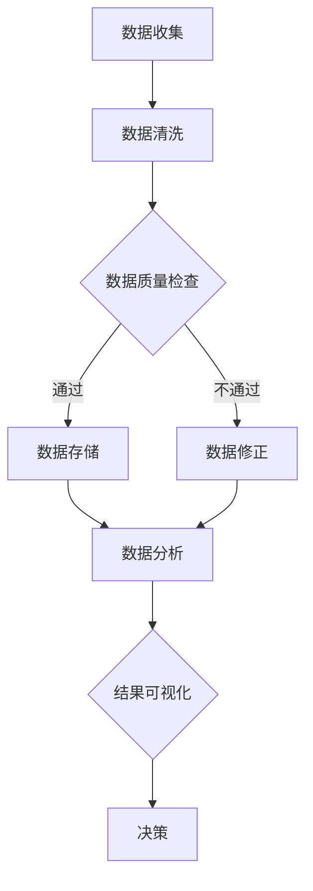
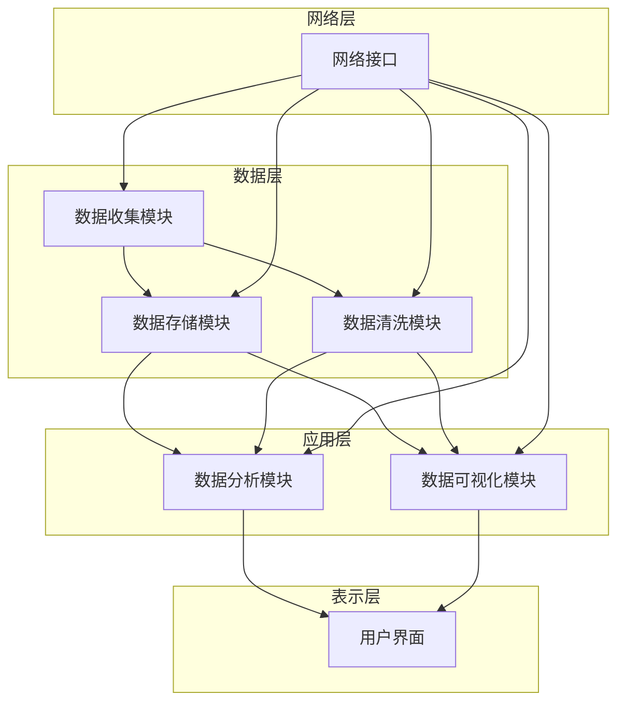
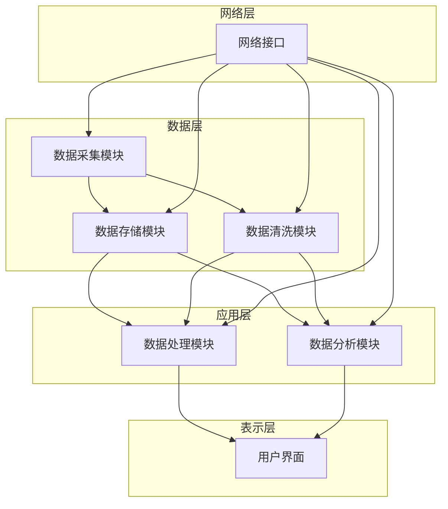
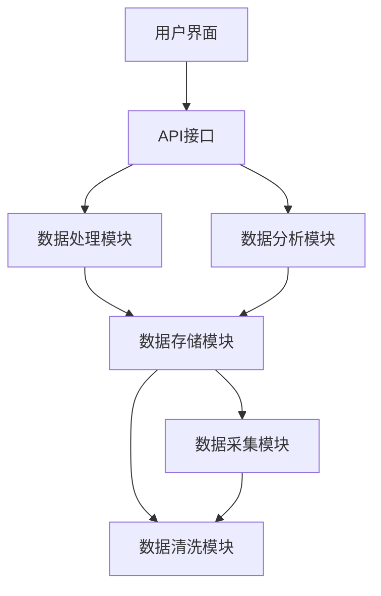

                 

# 《意义的开源哲学：集体创造适应现代的生活智慧》

## 关键词：开源哲学、集体创造力、现代生活智慧、数字化转型、可持续性、人工智能

> 摘要：随着现代社会的发展，个体面临的挑战日益复杂，单靠个人的力量难以应对。开源哲学作为一种集体创造的哲学，强调自由、共享、协作等原则，为我们提供了应对现代生活挑战的有效方法。本文将深入探讨开源哲学的核心概念及其在现代生活中的应用，并分析如何通过集体创造力适应现代生活智慧。

## 第1章：引言

### 1.1 问题背景

#### 1.1.1 现代生活的挑战

现代社会的发展带来了巨大的变革，人们在享受科技进步带来便利的同时，也面临着一系列挑战。首先，信息的爆炸式增长使得个体难以全面掌握和有效利用。其次，技术的快速迭代要求个体不断更新知识和技能，以适应不断变化的环境。此外，全球化和社会多元化使得个体之间的差异越来越大，如何在多元化的社会中实现和谐共生也成为了一个重要课题。

#### 1.1.2 开源哲学的意义

开源哲学起源于计算机科学领域，强调软件的开放性、协作性和共享性。开源哲学的核心原则是自由、共享和协作，这些原则不仅适用于软件开发，也适用于更广泛的领域。在现代社会，开源哲学提供了一种新的思维方式，通过集体创造，共同应对复杂挑战，实现共同发展。

### 1.2 问题描述

#### 1.2.1 缺乏集体创造力的现状

现代社会中，个体化、专业化的发展趋势导致了集体创造力的缺失。人们往往更注重个人的成就和利益，忽视了合作和共享的价值。这种现状使得我们在应对复杂问题时，缺乏有效的解决方案。

#### 1.2.2 需要适应现代生活的智慧

适应现代生活智慧，不仅要求我们掌握先进的技术和知识，更要求我们具备适应变化、创新思维和合作精神。开源哲学为我们提供了一种新的路径，通过集体创造，共同探索适应现代生活的智慧。

### 1.3 问题解决

#### 1.3.1 开源哲学的核心原则

开源哲学的核心原则包括自由、共享、协作等。这些原则为集体创造提供了基础，使得个体能够在一个开放、透明的环境中进行创新。

#### 1.3.2 集体创造的方法与工具

为了实现集体创造，我们需要采用一系列方法和工具。例如，版本控制系统可以帮助我们管理代码和文档，开源协作平台可以促进团队成员之间的沟通和协作，众筹与捐赠平台可以为我们提供资金支持。

### 1.4 边界与外延

#### 1.4.1 开源哲学的应用领域

开源哲学不仅适用于计算机科学领域，也适用于其他领域，如医疗、教育、艺术等。开源哲学的应用领域非常广泛，具有很大的潜力。

#### 1.4.2 适应现代生活的智慧特点

适应现代生活的智慧具有灵活性、适应性、可持续性和合作性等特点。这些特点使得我们能够更好地应对现代生活的挑战。

### 1.5 概念结构与核心要素组成

#### 1.5.1 开源哲学的基本概念

开源哲学的基本概念包括开源软件、开源文化和开源社区。这些概念相互关联，共同构成了开源哲学的理论体系。

#### 1.5.2 集体创造力与智慧的核心要素

集体创造力与智慧的核心要素包括创新思维、跨界合作、知识共享等。这些要素是集体创造力的基础，也是适应现代生活智慧的关键。

### 1.6 本章小结

本章介绍了开源哲学的背景、意义、问题描述、问题解决方法、边界与外延以及概念结构与核心要素组成。通过本章的介绍，我们可以初步了解开源哲学的核心概念及其在现代生活中的应用。

## 第2章：开源哲学核心概念解析

### 2.1 开源哲学的起源与发展

#### 2.1.1 开源哲学的起源

开源哲学起源于20世纪60年代的自由软件运动。当时，一些计算机科学家开始反对封闭源代码的模式，主张软件应该开放给用户，让他们自由地修改和使用。

#### 2.1.2 开源哲学的发展历程

随着时间的推移，开源哲学不断发展，形成了今天我们所熟知的开源文化。开源哲学在计算机科学、互联网、人工智能等领域得到了广泛应用，成为现代科技发展的重要推动力。

### 2.2 开源哲学的核心原则

#### 2.2.1 自由、共享与协作

开源哲学的核心原则是自由、共享和协作。自由意味着用户可以自由地使用、修改和分发软件。共享意味着知识和技术应该开放给所有人。协作意味着人们应该共同合作，共同创造。

#### 2.2.2 公平、开放与透明

开源哲学强调公平、开放和透明。公平意味着每个人都应该有机会参与创新。开放意味着创新成果应该开放给所有人。透明意味着创新过程应该公开、透明，接受公众的监督。

### 2.3 开源哲学的基本概念

#### 2.3.1 开源软件

开源软件是指源代码开放给用户，用户可以自由地使用、修改和分发。开源软件的典型代表有Linux、Apache等。

#### 2.3.2 开源文化

开源文化是一种强调共享、协作和创新的价值观。开源文化鼓励人们积极参与开源项目，共同创造。

#### 2.3.3 开源社区

开源社区是由共同兴趣的参与者组成的虚拟社区。开源社区通过协作，共同推动开源项目的发展。

### 2.4 概念属性特征对比表格

| 概念          | 属性特征                                   |
| ------------- | ---------------------------------------- |
| 开源软件      | 可以免费获取、自由修改和分发              |
| 开源文化      | 强调共享、协作和创新                      |
| 开源社区      | 由共同兴趣的参与者组成的虚拟社区          |

### 2.5 本章小结

本章对开源哲学的核心概念进行了详细解析，包括起源与发展、核心原则、基本概念以及概念属性特征对比表格。通过本章的学习，我们可以更深入地理解开源哲学的内涵和作用。

## 第3章：集体创造力的培养与实践

### 3.1 集体创造力的重要性

#### 3.1.1 集体创造力在现代社会中的应用

在现代社会，集体创造力得到了广泛应用。例如，在科学研究领域，许多重要的发现和创新都是通过团队合作实现的。在商业领域，团队合作也是企业成功的重要因素。

#### 3.1.2 集体创造力的意义

集体创造力的意义在于，它能够汇集众人的智慧和力量，解决单个个体难以解决的问题。同时，集体创造力还能够激发创新思维，推动社会进步。

### 3.2 集体创造力的培养

#### 3.2.1 跨界合作

跨界合作是培养集体创造力的重要手段。通过跨界合作，不同领域的专家可以相互学习、相互启发，共同创造。

#### 3.2.2 知识共享

知识共享是集体创造力的基础。通过知识共享，个体可以获取更多的信息，提高创新能力。

#### 3.2.3 创新思维训练

创新思维训练是培养集体创造力的重要手段。通过创新思维训练，个体可以学会如何独立思考、提出新观点。

### 3.3 集体创造力的实践案例

#### 3.3.1 开源社区的成功案例

开源社区是集体创造力的典型代表。许多成功的开源项目都是通过集体合作实现的。例如，Linux操作系统就是由全球的程序员共同开发的。

#### 3.3.2 集体创新项目的实践

集体创新项目的实践也是培养集体创造力的重要途径。通过集体创新项目，个体可以学会如何与他人合作，共同实现目标。

### 3.4 集体创造力的工具与方法

#### 3.4.1 版本控制系统

版本控制系统可以帮助团队协作，管理代码和文档。常用的版本控制系统有Git、SVN等。

#### 3.4.2 开源协作平台

开源协作平台可以帮助团队协作，管理任务、交流意见。常用的开源协作平台有GitHub、GitLab等。

#### 3.4.3 众筹与捐赠平台

众筹与捐赠平台可以帮助团队获取资金支持。常用的众筹平台有Kickstarter、Indiegogo等。

### 3.5 本章小结

本章介绍了集体创造力的重要性、培养方法和实践案例，以及相关的工具和方法。通过本章的学习，我们可以更好地理解如何培养和发挥集体创造力，以适应现代生活的挑战。

## 第4章：适应现代生活的智慧

### 4.1 适应现代生活的智慧特点

#### 4.1.1 灵活性与适应性

适应现代生活的智慧具有灵活性和适应性。这意味着个体需要具备快速适应变化的能力，能够在不同的环境中灵活应对。

#### 4.1.2 可持续性与可持续性

适应现代生活的智慧强调可持续性。这不仅包括环境可持续，还包括经济可持续和社会可持续。

#### 4.1.3 合作性与互联性

适应现代生活的智慧强调合作性和互联性。个体需要学会与他人合作，共同解决问题，同时也要学会利用网络资源，实现信息共享。

### 4.2 智慧生活方式的应用场景

#### 4.2.1 工作与学习

在工作和学习中，智慧生活方式可以帮助我们提高效率，优化学习过程。例如，通过使用在线教育平台，我们可以随时随地学习新知识。

#### 4.2.2 社交与娱乐

在社交与娱乐中，智慧生活方式可以提供更加丰富和个性化的体验。例如，通过社交媒体平台，我们可以与朋友保持联系，分享生活。

#### 4.2.3 健康与生活品质

在健康与生活品质方面，智慧生活方式可以帮助我们更好地管理健康，提升生活品质。例如，通过智能家居，我们可以实现家电的智能控制，提高生活舒适度。

### 4.3 智慧生活方式的实践

#### 4.3.1 数字化管理

数字化管理是智慧生活方式的重要实践。通过数字化管理，我们可以提高工作效率，优化管理流程。

#### 4.3.2 环境友好

环境友好是智慧生活方式的另一个重要实践。通过采用环保技术和产品，我们可以减少对环境的影响。

#### 4.3.3 社区共建

社区共建是智慧生活方式的体现。通过社区共建，我们可以共同创造一个和谐、可持续的生活环境。

### 4.4 适应现代生活的智慧工具

#### 4.4.1 智能家居

智能家居是适应现代生活的智慧工具之一。通过智能家居，我们可以实现家电的智能控制，提高生活品质。

#### 4.4.2 大数据分析

大数据分析是适应现代生活的重要工具。通过大数据分析，我们可以更好地理解用户需求，提供个性化的服务。

#### 4.4.3 人工智能

人工智能是适应现代生活的关键工具。通过人工智能，我们可以实现自动化、智能化，提高生产效率。

### 4.5 本章小结

本章介绍了适应现代生活的智慧特点、应用场景、实践方法和智慧工具。通过本章的学习，我们可以更好地理解如何适应现代生活，提高生活品质。

## 第5章：开源哲学与适应现代生活智慧的融合

### 5.1 开源哲学与适应现代生活智慧的关系

#### 5.1.1 开源哲学在适应现代生活智慧中的作用

开源哲学在适应现代生活智慧中发挥着重要作用。它为集体创造提供了理论基础，推动了技术创新和社会进步。

#### 5.1.2 适应现代生活智慧对开源哲学的需求

适应现代生活智慧对开源哲学提出了新的需求。例如，智慧生活方式需要更多的开源软件和开源项目，以满足多样化的需求。

### 5.2 融合的策略与方法

#### 5.2.1 开源社区的组织与管理

为了实现开源哲学与适应现代生活智慧的融合，我们需要加强开源社区的组织与管理。例如，建立开源社区的平台，提供技术支持和服务。

#### 5.2.2 开源项目的规划与执行

开源项目的规划与执行是实现融合的关键。我们需要制定明确的目标，制定合理的计划，确保项目的顺利进行。

#### 5.2.3 开源哲学在智慧生活应用中的挑战与解决

在智慧生活应用中，开源哲学面临着一系列挑战。例如，如何在开源项目中保护知识产权，如何处理社区冲突等。我们需要寻找有效的解决方案，推动开源哲学与适应现代生活智慧的融合。

### 5.3 融合案例研究

#### 5.3.1 开源社区在智慧城市建设中的应用

开源社区在智慧城市建设中发挥了重要作用。通过开源项目，社区成员共同开发智慧城市应用，提高了城市的智能化水平。

#### 5.3.2 开源哲学在智能家居领域的应用

开源哲学在智能家居领域也得到了广泛应用。通过开源软件，智能家居系统可以更好地适应用户需求，提高用户体验。

### 5.4 融合的挑战与未来展望

#### 5.4.1 融合的挑战

在融合过程中，我们面临着一系列挑战。例如，如何平衡开源与商业利益，如何提升开源项目质量等。

#### 5.4.2 未来展望

未来，开源哲学与适应现代生活智慧将继续融合发展，为人类带来更多的创新和进步。我们需要不断探索新的路径，推动这一融合的深入发展。

### 5.5 本章小结

本章探讨了开源哲学与适应现代生活智慧的融合，分析了融合的策略与方法，以及融合的挑战与未来展望。通过本章的学习，我们可以更好地理解开源哲学在适应现代生活智慧中的作用和价值。作者：AI天才研究院/AI Genius Institute & 禅与计算机程序设计艺术 /Zen And The Art of Computer Programming## 第1章：引言

### 1.1 问题背景

在现代社会中，个体面临着诸多挑战。首先，信息过载成为一个显著问题。随着互联网和移动设备的普及，人们每天接收到的信息量急剧增加，这使得个体在处理和筛选信息时面临巨大压力。其次，技术的快速迭代使得个体需要不断更新知识和技能，以适应新的工作环境和生活方式。这不仅要求个体具备较强的自学能力，还需要他们具备快速适应变化的能力。此外，全球化和社会多元化导致了个体之间的差异加大，如何在多元化的社会中实现和谐共生成为一个重要课题。

在这些挑战的背景下，开源哲学提供了独特的视角和解决方案。开源哲学起源于计算机科学领域，强调自由、共享、协作等原则。这些原则不仅适用于软件开发，也适用于更广泛的领域。在现代社会，开源哲学提供了一种集体创造的思维方式，通过共享知识和资源，共同应对复杂挑战，实现共同发展。开源哲学的核心在于打破信息壁垒，促进知识传播，推动社会进步。

### 1.2 问题描述

现代社会中的个体化、专业化趋势导致集体创造力的缺失。人们更注重个人的成就和利益，忽视了合作和共享的价值。这种现状使得我们在应对复杂问题时，缺乏有效的解决方案。具体来说，问题表现在以下几个方面：

1. **知识孤岛**：个体往往在自己的领域内积累知识，但缺乏与其他领域专家的交流和合作，导致知识分散，难以形成系统性解决方案。
2. **资源浪费**：由于个体之间的信息不对称，重复性工作和资源浪费现象严重，例如不同团队可能独立开发功能相似但互不兼容的软件。
3. **创新障碍**：个体创新往往受到资源、时间和知识限制，难以突破现有技术的瓶颈，而集体创造可以通过资源整合和协作突破这些障碍。

适应现代生活的智慧要求我们不仅需要掌握先进的技术和知识，还需要具备适应变化、创新思维和合作精神。然而，在当前的社会环境中，个体往往难以单独应对复杂的问题，需要依靠集体智慧和协作来实现。因此，如何通过开源哲学激发集体创造力，形成适应现代生活的智慧，是我们面临的重要问题。

### 1.3 问题解决

开源哲学的核心原则是自由、共享和协作，这些原则为集体创造提供了坚实的基础。以下是一些具体的方法和工具，通过这些方法，我们可以利用开源哲学解决现代生活中的问题：

1. **自由**：开源哲学强调软件和知识的自由，这意味着任何人都可以访问、修改和分发开源软件。这一原则打破了信息壁垒，促进了知识的传播和共享。在现代社会中，自由的理念可以应用于各个领域，如教育、医疗、文化艺术等，通过开放资源，降低创新的门槛。
   
2. **共享**：共享是开源哲学的核心价值观之一。通过共享知识、资源和经验，个体可以获取更多的信息，提高自身的创新能力。共享不仅限于物质资源，还包括知识和技能的共享。例如，通过开源社区，开发者可以分享代码、文档和最佳实践，帮助其他开发者更快地解决问题，提高工作效率。

3. **协作**：协作是集体创造力的关键。通过协作，不同背景、不同领域的人可以相互学习、相互启发，共同创造。协作不仅可以在专业领域发挥作用，还可以在社会事务、公共事务中应用。例如，通过开源项目，志愿者可以共同开发软件，解决社会问题。

4. **版本控制系统**：版本控制系统（如Git）是开源哲学的重要组成部分。它可以帮助团队协作，管理代码和文档的版本，确保代码的稳定性和安全性。通过版本控制系统，团队成员可以同时工作，实时同步代码，避免冲突和错误。

5. **开源协作平台**：开源协作平台（如GitHub、GitLab）为开发者提供了一个集中的平台，用于项目管理和代码协作。这些平台提供了丰富的工具，如任务管理、代码审查、文档管理，可以帮助团队高效协作，共同推进项目。

6. **众筹与捐赠平台**：众筹与捐赠平台（如Kickstarter、GoFundMe）为开源项目提供了资金支持。通过这些平台，开发者可以筹集资金，用于项目开发、测试和发布，确保项目的持续发展。

通过这些方法和工具，开源哲学不仅能够激发集体创造力，还可以帮助个体更好地适应现代生活的挑战，实现共同发展。

### 1.4 边界与外延

开源哲学的应用范围非常广泛，不仅限于计算机科学领域，还扩展到了医疗、教育、艺术等多个领域。在开源哲学的指导下，这些领域中的项目通过共享和协作，实现了重大的突破和进展。

#### 1.4.1 开源哲学的应用领域

1. **医疗领域**：开源软件和工具在医疗领域得到了广泛应用，如电子健康记录系统、基因组数据分析工具等。这些开源项目通过共享代码和资源，加速了医学研究和临床应用的发展。

2. **教育领域**：开源教育资源为全球的教育工作者和学生们提供了丰富的学习资源。例如，开源的在线课程平台和教材，使得教育更加普及和多样化。

3. **艺术领域**：开源软件和工具为艺术家们提供了创新的创作工具和平台，如开源的图像编辑软件、音乐制作工具等。这些工具促进了艺术创作和交流，丰富了文化多样性。

#### 1.4.2 适应现代生活的智慧特点

适应现代生活的智慧具有以下几个特点：

1. **灵活性**：适应现代生活的智慧需要具备灵活性和适应性，能够快速响应环境变化，满足个性化需求。

2. **可持续性**：智慧生活方式强调环境的可持续性，通过采用环保技术和产品，减少对自然资源的消耗。

3. **合作性**：适应现代生活的智慧强调合作，通过团队合作，共同解决问题，实现共同目标。

4. **互联性**：在现代社会，互联性是智慧生活方式的重要特征。通过互联网和移动设备，人们可以随时随地获取信息和资源，实现信息的无缝连接。

这些特点使得开源哲学不仅适用于技术领域，也适用于更广泛的现代生活场景，为个体和社会提供了创新的解决方案。

### 1.5 概念结构与核心要素组成

开源哲学的核心概念包括开源软件、开源文化和开源社区。这些概念相互关联，共同构成了开源哲学的理论体系。

#### 1.5.1 开源哲学的基本概念

1. **开源软件**：开源软件是指源代码公开，允许用户自由使用、修改和分发的软件。开源软件的典型特征是开放性、共享性和协作性。

2. **开源文化**：开源文化是一种价值观和行为准则，强调共享、协作和创新。开源文化的核心是尊重知识、共享成果和共同进步。

3. **开源社区**：开源社区是由共同兴趣和目标的参与者组成的虚拟社区。社区成员通过协作，共同开发、维护和推广开源项目。

#### 1.5.2 集体创造力与智慧的核心要素

集体创造力与智慧的核心要素包括以下几个方面：

1. **跨界合作**：跨界合作是集体创造力的关键。通过不同领域专家的合作，可以汇集多方面的智慧和资源，解决复杂问题。

2. **知识共享**：知识共享是集体创造力的基础。通过共享知识和资源，个体可以获取更多的信息，提高自身的创新能力。

3. **创新思维**：创新思维是适应现代生活智慧的重要能力。通过创新思维，个体可以提出新的观点和方法，突破现有技术的限制。

4. **协作精神**：协作精神是集体创造力的核心。通过团队合作，个体可以共同分担工作，实现共同目标。

这些核心要素相互支持，共同构成了适应现代生活的智慧体系。通过开源哲学的指导，个体和社区可以更好地发挥这些要素的作用，实现集体创造。

### 1.6 本章小结

本章从问题背景、问题描述、问题解决、边界与外延以及概念结构与核心要素组成等方面，详细探讨了开源哲学在适应现代生活中的作用。开源哲学通过自由、共享、协作等原则，提供了集体创造的方法和工具，为个体和社会应对复杂挑战、实现共同发展提供了新的路径。通过本章的讨论，我们可以更深入地理解开源哲学的核心概念及其在现代生活中的应用价值。

## 第2章：开源哲学核心概念解析

### 2.1 开源哲学的起源与发展

开源哲学的起源可以追溯到20世纪60年代的自由软件运动。自由软件运动的核心思想是反对封闭源代码的软件，主张软件应该开放给用户，使其能够自由地修改和使用。这一思想最初由理查德·斯托曼（Richard Stallman）提出，他创立了自由软件基金会（Free Software Foundation，FSF），并开发了著名的GNU项目。GNU项目的目标是创建一个完整的免费操作系统，与商业化的Unix系统竞争。这一时期的开源哲学主要是关于软件自由的争论，强调用户有权控制他们使用的软件。

随着时间的推移，开源哲学逐渐从计算机科学领域扩展到其他领域。20世纪90年代，Linus Torvalds发布的Linux内核标志着开源软件的兴起。Linux的成功展示了开源协作的巨大潜力，吸引了大量的开发者参与其中。这一时期的开源哲学不仅关注软件自由，还强调协作和创新，形成了以共享和协作为核心的价值观。

进入21世纪，开源哲学继续发展，并融入了新的理念和技术。开源文化开始影响其他领域，如医疗、教育、艺术等。开源哲学的核心原则——自由、共享和协作——在这些领域中得到了广泛的应用，推动了技术的进步和社会的发展。

#### 2.1.2 开源哲学的发展历程

开源哲学的发展历程可以分为以下几个阶段：

1. **自由软件运动**（20世纪60年代到80年代）：这一阶段的主要特点是反对封闭源代码，倡导软件自由，提出了“用户有权控制他们使用的软件”的理念。

2. **开源软件兴起**（20世纪90年代）：以Linux内核的发布为标志，开源软件开始引起广泛关注，协作和共享成为开源文化的重要组成部分。

3. **开源文化扩散**（21世纪）：开源哲学从计算机科学领域扩展到其他领域，如医疗、教育、艺术等，形成了多元化的开源生态系统。

4. **开源创新**（当前）：开源哲学继续融合新的理念和技术，如人工智能、区块链等，推动技术创新和社会进步。

### 2.2 开源哲学的核心原则

开源哲学的核心原则包括自由、共享和协作。这些原则不仅为开源软件的发展提供了理论基础，也在更广泛的领域中得到了应用。

#### 2.2.1 自由

自由是开源哲学的首要原则，它强调用户对软件的控制权。具体来说，自由包括以下三个方面：

1. **使用自由**：用户可以自由地使用开源软件，无论是个人使用还是商业用途。

2. **修改自由**：用户可以自由地修改开源软件的源代码，以满足特定的需求或进行技术改进。

3. **分发自由**：用户可以自由地分发开源软件，包括原始代码和修改后的版本。

自由原则打破了传统软件的封闭模式，促进了知识和技术在用户中的传播。这不仅提高了软件的灵活性，还激发了用户参与改进和创新。

#### 2.2.2 共享

共享是开源哲学的另一个核心原则，它强调资源的开放和共享。具体来说，共享包括以下几个方面：

1. **代码共享**：开源软件的源代码是公开的，用户可以自由访问和下载，这为开发者提供了一个共享的知识库。

2. **知识共享**：开源项目往往伴随着丰富的文档和教程，这些资源可以帮助新开发者快速上手，降低学习成本。

3. **经验共享**：开源社区成员通过交流和合作，共享他们的经验和见解，促进了知识的传播和技能的提升。

共享原则不仅提高了资源的利用效率，还促进了协作和创新。通过共享，个体可以获得更多的信息和机会，提高自身的创新能力。

#### 2.2.3 协作

协作是开源哲学的第三个核心原则，它强调团队合作和集体智慧。具体来说，协作包括以下几个方面：

1. **团队协作**：开源项目通常由多个开发者合作完成，他们通过代码库和协作平台进行沟通和协作，共同推进项目。

2. **社区协作**：开源社区是一个由共同兴趣的参与者组成的网络，他们通过讨论、交流和合作，共同维护和改进开源项目。

3. **分布式协作**：开源项目的参与者可能来自不同的国家和地区，他们通过互联网进行分布式协作，打破了地域和时间的限制。

协作原则不仅提高了项目的效率和质量，还促进了社区成员之间的互动和合作。通过协作，个体可以发挥自己的优势，共同实现更大的目标。

### 2.3 开源哲学的基本概念

开源哲学的基本概念包括开源软件、开源文化和开源社区。这些概念相互关联，共同构成了开源哲学的理论体系。

#### 2.3.1 开源软件

开源软件（Open Source Software，OSS）是指源代码公开，允许用户自由使用、修改和分发的软件。开源软件的核心特点是开放性和共享性。开源软件的典型特征包括：

1. **源代码公开**：开源软件的源代码是公开的，用户可以自由访问和下载。
2. **修改自由**：用户可以自由地修改开源软件的源代码，以满足特定的需求或进行技术改进。
3. **分发自由**：用户可以自由地分发开源软件，包括原始代码和修改后的版本。

开源软件的典型代表包括Linux操作系统、Apache Web服务器和Mozilla Firefox浏览器等。这些软件不仅具有高质量和稳定性，还通过全球开发者的协作，不断改进和优化。

#### 2.3.2 开源文化

开源文化（Open Source Culture）是一种基于共享、协作和创新价值观的社会现象。开源文化的核心原则是自由、共享和协作，这些原则不仅指导开源软件的开发和传播，也影响其他领域的发展。

1. **自由**：开源文化强调用户的自由，包括使用自由、修改自由和分发自由。
2. **共享**：开源文化鼓励知识、资源和经验的共享，通过共享促进知识传播和技能提升。
3. **协作**：开源文化强调团队合作和集体智慧，通过协作实现共同目标。

开源文化在计算机科学领域之外，也逐渐渗透到医疗、教育、艺术等领域。开源文化推动了这些领域的创新和进步，成为现代社会的重要价值观。

#### 2.3.3 开源社区

开源社区（Open Source Community）是由共同兴趣的参与者组成的虚拟社区。开源社区成员通过协作、交流和共享，共同维护和改进开源项目。

1. **协作**：开源社区成员通过协作，共同开发、测试和维护开源项目。
2. **交流**：开源社区成员通过论坛、邮件列表和社交媒体等渠道进行交流，分享经验和见解。
3. **共享**：开源社区成员共享代码、文档和最佳实践，帮助新成员快速上手，提高项目的整体质量。

开源社区不仅为开发者提供了一个交流平台，还促进了知识的传播和技能的提升。通过开源社区，开发者可以结识同行，获取支持，共同推动开源项目的发展。

### 2.4 概念属性特征对比表格

为了更好地理解开源哲学的基本概念，我们可以通过以下表格来对比这些概念的主要属性特征：

| 概念       | 属性特征                                                     |
| ---------- | ------------------------------------------------------------ |
| 开源软件   | 源代码公开，允许用户自由使用、修改和分发                    |
| 开源文化   | 强调共享、协作和创新，影响开源软件的开发和传播              |
| 开源社区   | 由共同兴趣的参与者组成，通过协作、交流和共享，共同维护和改进开源项目 |

通过这张表格，我们可以清晰地看到开源软件、开源文化和开源社区之间的联系和区别。这些概念共同构成了开源哲学的理论体系，为集体创造提供了坚实的基础。

### 2.5 本章小结

本章详细解析了开源哲学的核心概念，包括开源软件、开源文化和开源社区。通过对这些概念的理解，我们可以看到开源哲学的起源和发展历程，以及其在现代社会中的重要性。开源哲学的核心原则——自由、共享和协作，为集体创造提供了理论基础和实践指导。通过理解这些概念，我们可以更好地把握开源哲学的内涵，为适应现代生活挑战提供有效的解决方案。

## 第3章：集体创造力的培养与实践

### 3.1 集体创造力的重要性

在现代社会中，集体创造力显得尤为重要。个体虽然具有独特的智慧和才能，但面对复杂的问题时，单靠个人的力量往往难以解决。集体创造力通过聚集多方面的智慧和资源，能够有效地应对各种挑战。以下是集体创造力在现代社会中的几个重要应用场景：

#### 3.1.1 科学研究

科学研究领域通常需要庞大的数据集和复杂的计算能力。通过集体创造，不同领域的专家可以共同合作，分享数据和资源，从而加速科学发现和技术创新。例如，在基因组学研究中，多个研究团队可以通过开源工具和平台共享数据，共同分析基因信息，推动人类健康研究的发展。

#### 3.1.2 企业创新

在商业领域，集体创造力是推动企业创新的重要力量。通过团队合作，企业可以汇集不同部门和专业领域的智慧，共同开发新产品和服务。例如，科技公司通过开源项目，鼓励员工参与创新，从而提高产品的竞争力和市场适应性。

#### 3.1.3 公共事务

公共事务管理同样需要集体创造力。通过开放数据和公众参与，政府可以更好地了解公众需求，制定更有效的政策和解决方案。例如，智慧城市项目通过开放数据平台，鼓励市民和开发者共同参与城市建设，提高城市管理效率和居民生活质量。

#### 3.1.4 社区发展

社区发展也受益于集体创造力。社区居民通过共同合作，可以解决社区内的各种问题，如环境保护、社区服务和社会活动等。集体创造力促进了社区成员之间的互动和协作，增强了社区的凝聚力和可持续发展能力。

#### 3.1.2 集体创造力的意义

集体创造力的意义在于它能够实现资源的最大化利用和智慧的聚合。具体来说，集体创造力的意义体现在以下几个方面：

1. **提高创新能力**：集体创造力通过多角度、多维度的思考，能够产生更多的创新想法和解决方案，从而推动技术的进步和社会的发展。

2. **优化资源分配**：通过集体创造，资源可以更加高效地分配和使用。不同个体和团队可以根据自身的优势，共同完成任务，提高整体效率。

3. **增强社会合作**：集体创造力促进了社会合作和信任，通过共同的目标和任务，个体和团体之间建立了紧密的联系，增强了社会的稳定性和和谐性。

4. **培养协作精神**：集体创造力培养了个体的协作精神和团队合作能力，使个体能够更好地适应现代社会的要求，提高自身的综合素质。

### 3.2 集体创造力的培养

要培养集体创造力，需要从以下几个方面着手：

#### 3.2.1 跨界合作

跨界合作是培养集体创造力的重要手段。通过不同领域专家的交流与合作，可以打破专业壁垒，促进知识的融合和创新。例如，在创新项目中，设计师、工程师、市场专家和用户可以共同参与，通过跨学科的交流，提出更有创意和实用价值的解决方案。

##### 3.2.1.1 实践方法

- **建立跨界团队**：组建跨学科的团队，确保团队成员具备多样化的背景和技能。
- **定期交流会议**：组织定期的交流会议，鼓励团队成员分享各自领域的前沿技术和经验。
- **合作项目**：通过合作项目，让团队成员在实践中学习协作和解决问题的能力。

#### 3.2.2 知识共享

知识共享是集体创造力的基础。通过共享知识、资源和经验，个体可以获取更多的信息，提高自身的创新能力。在开源社区中，知识共享的表现尤为突出。以下是几种有效的知识共享方法：

##### 3.2.2.1 实践方法

- **开放共享平台**：建立开放的共享平台，如知识库、论坛和文档网站，方便成员分享知识和经验。
- **知识讲座和研讨会**：定期举办知识讲座和研讨会，邀请专家分享专业知识和最新研究动态。
- **共享最佳实践**：总结和推广最佳实践，帮助新成员快速掌握有效的工作方法。

#### 3.2.3 创新思维训练

创新思维是集体创造力的关键。通过创新思维训练，个体可以学会如何独立思考、提出新观点。以下是几种创新思维训练的方法：

##### 3.2.3.1 实践方法

- **头脑风暴**：组织头脑风暴会议，鼓励团队成员自由地提出各种创新想法。
- **思维导图**：使用思维导图工具，帮助团队成员梳理思路，发现潜在的创新点。
- **原型设计**：通过快速原型设计，验证和迭代创新想法，不断完善解决方案。

### 3.3 集体创造力的实践案例

以下是一些成功的集体创造力实践案例，这些案例展示了集体合作如何在不同领域中发挥重要作用：

#### 3.3.1 开源社区的成功案例

开源社区是集体创造力的典型代表。在开源社区中，开发者们通过协作，共同开发了大量的软件和工具，推动了技术的进步。以下是一些著名的开源社区案例：

1. **Linux内核**：Linux内核是由全球开发者共同开发的一个开源操作系统。它通过开源协作，吸引了大量的贡献者，成为现代操作系统的重要组成部分。

2. **Apache基金会**：Apache基金会是一家致力于开源软件发展的非营利组织，其旗下的Apache HTTP服务器是全球最流行的Web服务器软件。

3. **Mozilla基金会**：Mozilla基金会开发的Mozilla Firefox浏览器，是一个著名的开源项目。通过全球开发者的协作，Firefox不断优化和更新，保持了其在浏览器市场的竞争力。

#### 3.3.2 集体创新项目的实践

除了开源社区，集体创新项目也在多个领域取得了显著成果。以下是一些成功的集体创新项目案例：

1. **智慧城市项目**：智慧城市项目通过开放数据平台，鼓励市民和开发者共同参与城市建设。例如，美国的西雅图市通过开放交通数据，提高了公共交通系统的效率和可靠性。

2. **非营利组织合作**：许多非营利组织通过合作，共同解决社会问题。例如，世界卫生组织（WHO）与国际红十字会合作，共同应对全球卫生挑战。

3. **跨国企业合作**：跨国企业通过合作，共同开发新产品和服务。例如，苹果公司（Apple）和谷歌公司（Google）合作开发的AirDrop和iMessage功能，显著提升了移动设备的数据传输速度和安全性。

### 3.4 集体创造力的工具与方法

为了有效地培养和发挥集体创造力，我们需要采用一系列工具和方法。以下是一些常用的工具和方法：

#### 3.4.1 版本控制系统

版本控制系统（如Git、SVN等）是开源项目的重要工具，它可以帮助团队协作，管理代码和文档的版本。通过版本控制系统，团队成员可以同时工作，实时同步代码，避免冲突和错误。

##### 3.4.1.1 使用方法

- **代码仓库管理**：将代码托管到公共或私有代码仓库，确保代码的安全和备份。
- **分支管理**：通过分支管理，团队成员可以独立开发功能，避免代码冲突。
- **代码审查**：通过代码审查，团队成员可以相互审查代码，确保代码质量和一致性。

#### 3.4.2 开源协作平台

开源协作平台（如GitHub、GitLab等）为开发者提供了一个集中的平台，用于项目管理和代码协作。这些平台提供了丰富的工具，如任务管理、代码审查、文档管理，可以帮助团队高效协作，共同推进项目。

##### 3.4.2.1 使用方法

- **项目管理**：通过任务管理功能，分配任务和跟踪项目进度。
- **代码审查**：通过代码审查功能，团队成员可以相互审查代码，确保代码质量和一致性。
- **文档管理**：通过文档管理功能，维护项目文档和用户手册。

#### 3.4.3 众筹与捐赠平台

众筹与捐赠平台（如Kickstarter、GoFundMe等）为开源项目提供了资金支持。通过这些平台，开发者可以筹集资金，用于项目开发、测试和发布，确保项目的持续发展。

##### 3.4.3.1 使用方法

- **项目宣传**：通过平台宣传项目，吸引更多的支持者和贡献者。
- **资金筹集**：设置项目目标，通过众筹和捐赠筹集资金。
- **项目进展**：定期更新项目进展，感谢支持者并维护社区关系。

### 3.5 本章小结

本章详细探讨了集体创造力的重要性、培养方法和实践案例，以及相关的工具和方法。通过这些讨论，我们可以看到集体创造力在现代社会中的应用和意义，以及如何通过开源哲学和工具培养和发挥集体创造力。通过实践，集体创造力不仅能够解决复杂问题，还能推动社会进步和个体成长。作者：AI天才研究院/AI Genius Institute & 禅与计算机程序设计艺术 /Zen And The Art of Computer Programming

## 第4章：适应现代生活的智慧

### 4.1 适应现代生活的智慧特点

在现代社会中，适应现代生活的智慧具有以下几个显著特点：

#### 4.1.1 灵活性与适应性

现代社会变化迅速，适应现代生活的智慧首先需要具备灵活性和适应性。这意味着个体必须能够快速调整自己的思维和行动方式，以适应新的环境和技术。例如，在工作中，一个人可能需要迅速从熟悉的流程转向新的工作方式，或适应新的工作工具和技术。灵活性和适应性使得个体能够更好地应对不确定性，抓住机遇，提高生活质量。

#### 4.1.2 可持续性与可持续性

可持续性是适应现代生活的智慧的重要组成部分。它不仅关注环境保护，还包括经济和社会的可持续性。例如，在个人生活中，可持续性可能体现在减少能源消耗、使用环保产品或实践绿色生活方式。在工作和社会层面，可持续性意味着企业和社会必须找到平衡经济发展与资源保护的方法，以确保未来世代的福祉。

#### 4.1.3 合作性与互联性

合作性和互联性是适应现代生活智慧的另一个关键特点。现代社会强调团队合作和网络连接，个体必须学会与他人合作，共同解决问题。例如，在职场中，团队合作可以增强项目的成功率和创新性。同时，互联性使得个体能够通过互联网和社交媒体与世界各地的人交流，获取信息和资源，提高自身的知识水平和技能。

### 4.2 智慧生活方式的应用场景

智慧生活方式在现代社会的各个领域都有广泛的应用，以下是一些具体的应用场景：

#### 4.2.1 工作与学习

在工作和学习中，智慧生活方式可以帮助个体提高效率，优化学习和工作流程。例如，通过使用在线协作工具和云存储服务，团队成员可以实时共享文件和进度，提高沟通效率。此外，智慧生活方式还体现在个性化学习上，通过在线教育平台和自适应学习系统，学习者可以根据自己的进度和兴趣调整学习计划，提高学习效果。

#### 4.2.2 社交与娱乐

在社交和娱乐领域，智慧生活方式提供了更加丰富和个性化的体验。通过社交媒体平台，人们可以随时随地与朋友和家人保持联系，分享生活点滴。同时，智慧娱乐系统，如智能电视和虚拟现实游戏，为用户提供了沉浸式娱乐体验，满足了多样化的娱乐需求。

#### 4.2.3 健康与生活品质

在健康和生活品质方面，智慧生活方式通过智能家居和健康监测设备，帮助个体更好地管理健康，提升生活品质。例如，智能手环和智能手表可以实时监测心率、睡眠质量等健康数据，提供个性化的健康建议。同时，智能家居设备可以通过自动化控制，提高家庭的舒适度和安全性。

### 4.3 智慧生活方式的实践

适应现代生活的智慧不仅仅是理论上的概念，它还需要通过实际的实践来实现。以下是一些智慧生活方式的实践方法和案例：

#### 4.3.1 数字化管理

数字化管理是适应现代生活的重要实践方法之一。通过使用数字化工具和平台，企业和个人可以优化管理流程，提高工作效率。例如，企业可以通过ERP系统实现资源计划和管理，个人可以通过财务管理应用程序来管理个人财务。

#### 4.3.2 环境友好

环境友好是智慧生活方式的重要组成部分。通过采用环保技术和产品，个体可以减少对环境的影响，实现可持续生活。例如，使用节能灯具、节能家电和可再生能源设备，可以减少能源消耗和碳排放。此外，实践垃圾分类和回收，也是实现环境友好的重要措施。

#### 4.3.3 社区共建

社区共建是智慧生活方式在社区层面的体现。通过社区共建，居民可以共同参与社区的管理和建设，提高社区的凝聚力和可持续性。例如，社区可以组织清洁活动、绿化活动和文化交流活动，增强居民的归属感和社区意识。

### 4.4 适应现代生活的智慧工具

为了适应现代生活，个体需要借助一系列智慧工具。以下是一些常用的智慧工具：

#### 4.4.1 智能家居

智能家居是适应现代生活的重要工具之一。通过智能家居系统，个体可以远程控制家中的电器设备，如灯光、温度和安防系统。例如，智能音箱可以通过语音控制来调整家庭环境，智能门锁可以提供便捷的安全保障。

#### 4.4.2 大数据分析

大数据分析是提升决策能力和服务效率的重要工具。通过分析大量的数据，企业和个人可以更好地了解用户需求和市场趋势，优化产品和服务的开发与营销。例如，电子商务平台通过大数据分析，可以推荐个性化的商品给用户，提高销售转化率。

#### 4.4.3 人工智能

人工智能（AI）是适应现代生活的重要技术之一。通过人工智能，个体可以实现自动化、智能化，提高生产效率和生活质量。例如，自动驾驶汽车通过AI技术，可以提供更安全、更高效的出行方式；智能助理可以通过自然语言处理，帮助用户处理日常任务。

### 4.5 本章小结

本章详细探讨了适应现代生活的智慧特点、应用场景、实践方法和智慧工具。通过理解这些内容，个体可以更好地应对现代生活的挑战，提高生活质量和工作效率。智慧生活方式不仅关注技术本身，更强调个体与社会的协同发展，为实现可持续生活和共同进步提供了有效途径。

## 第5章：开源哲学与适应现代生活智慧的融合

### 5.1 开源哲学与适应现代生活智慧的关系

开源哲学与适应现代生活智慧之间存在着深刻的内在联系。开源哲学通过其核心原则——自由、共享和协作，为适应现代生活智慧提供了理论支持和实践基础。

首先，开源哲学中的“自由”原则与适应现代生活的智慧密切相关。在现代社会，个体需要具备自主选择和决策的能力，以应对快速变化的环境。开源哲学的自由原则强调用户对软件和知识的控制权，这为个体在工作和生活中提供了更多的灵活性和自主性。

其次，共享原则是适应现代生活智慧的重要推动力。现代生活充满了多样性和复杂性，个体往往需要依赖外部资源来解决问题和实现目标。开源哲学的共享原则鼓励知识和技术资源的开放和共享，这有助于打破信息壁垒，促进资源的最大化利用，从而提高个体和集体的创新能力。

最后，协作原则是适应现代生活智慧的关键。在现代社会，许多问题都需要跨学科、跨领域的合作来解决。开源哲学的协作原则倡导团队合作和集体智慧，这有助于个体在复杂问题中找到有效的解决方案，并通过合作实现共同目标。

#### 5.1.1 开源哲学在适应现代生活智慧中的作用

开源哲学在适应现代生活智慧中发挥着多方面的作用，具体体现在以下几个方面：

1. **技术创新**：开源哲学鼓励技术创新，通过开放源代码和共享资源，开发者可以自由地修改和优化软件，推动技术的快速迭代和发展。例如，在开源社区中，开发者可以通过协作，共同解决技术难题，开发出更加先进和实用的技术解决方案。

2. **知识传播**：开源哲学的共享原则促进了知识的传播和普及。通过开源项目，开发者可以分享他们的经验和知识，帮助更多人学习和掌握技术。这种知识共享不仅提高了学习效率，还促进了整体社会技术水平的提升。

3. **降低门槛**：开源哲学通过降低创新的门槛，使更多的人能够参与到创新过程中。例如，开源软件和工具的免费使用和共享，使得中小企业和个人开发者可以以较低的成本获得先进的技术资源，从而提升自身的技术能力和竞争力。

4. **社会进步**：开源哲学促进了社会的进步和发展。通过开源项目，不同领域和背景的人可以共同合作，解决社会问题，推动社会创新。例如，开源的健康数据平台可以帮助医学研究人员共享和利用数据，加速医学研究进程。

#### 5.1.2 适应现代生活智慧对开源哲学的需求

适应现代生活智慧对开源哲学提出了新的需求，主要体现在以下几个方面：

1. **灵活性**：适应现代生活智慧要求系统和技术具有高度的灵活性，能够快速适应变化。开源哲学的灵活性原则为此提供了支持，通过开放源代码和灵活的协作模式，技术系统可以快速调整和优化，以适应新的需求和环境。

2. **可持续性**：适应现代生活智慧强调可持续性，包括环境可持续、经济可持续和社会可持续。开源哲学的共享和协作原则有助于实现这些目标，通过资源的高效利用和合作，可以减少资源浪费，推动可持续发展。

3. **合作性**：适应现代生活智慧需要合作和集体智慧。开源哲学的协作原则为此提供了平台和机制，通过开源社区和协作平台，不同背景和领域的人可以共同合作，实现共同目标。

4. **创新性**：适应现代生活智慧要求不断创新，以应对不断变化的环境和挑战。开源哲学的创新原则为创新提供了动力和空间，通过开放和协作，可以激发更多创新思维和解决方案。

### 5.2 融合的策略与方法

要实现开源哲学与适应现代生活智慧的融合，需要采取一系列的策略和方法。以下是一些关键策略和方法：

#### 5.2.1 开源社区的组织与管理

开源社区是开源哲学的核心组成部分，也是实现智慧生活的重要平台。为了有效管理和发展开源社区，需要采取以下策略：

1. **建立社区规范**：制定明确的社区行为准则和开发流程，确保社区运作的有序和高效。
2. **促进知识共享**：鼓励社区成员分享知识和经验，通过举办研讨会、发布技术博客等方式，促进知识的传播和交流。
3. **鼓励多元参与**：吸引不同领域和背景的人才加入社区，通过多元化的视角和经验，促进创新和进步。
4. **激励机制**：设立奖励机制，激励社区成员积极参与开源项目，例如通过认证、荣誉奖项等方式，表彰贡献突出的成员。

#### 5.2.2 开源项目的规划与执行

开源项目是开源哲学的具体实现，也是适应现代生活智慧的重要工具。为了确保开源项目的成功，需要采取以下策略：

1. **项目规划**：在项目启动前，进行详细的项目规划和需求分析，明确项目目标、功能和时间表。
2. **团队合作**：建立跨学科、跨领域的团队合作模式，确保项目团队成员具备多样化的技能和经验。
3. **持续迭代**：通过持续迭代和反馈，不断完善项目，确保项目始终符合用户需求和市场需求。
4. **质量保障**：建立严格的质量保障机制，包括代码审查、测试和用户反馈，确保项目的稳定性和可靠性。

#### 5.2.3 开源哲学在智慧生活应用中的挑战与解决

在智慧生活应用中，开源哲学面临着一系列挑战。以下是一些常见挑战及其解决方法：

1. **知识产权保护**：开源项目可能面临知识产权侵犯的风险，需要采取有效的保护措施，如签署贡献者协议、进行知识产权审查等。
2. **项目维护**：开源项目的维护是一个持续的工作，需要确保项目具有良好的文档和社区支持，以保持项目的活力和持续发展。
3. **安全与隐私**：开源项目需要确保软件的安全性和用户隐私，采取有效的安全措施，如加密、访问控制等。
4. **商业化冲突**：开源项目可能面临商业化和非商业化目标之间的冲突，需要平衡开源项目的商业利益和社会利益，确保项目的可持续发展。

#### 5.2.4 融合案例研究

以下是一些开源哲学与适应现代生活智慧融合的案例研究，这些案例展示了开源哲学在智慧生活中的实际应用：

1. **智慧城市建设**：开源社区在智慧城市建设中发挥了重要作用，通过开源项目，城市管理者可以共享和优化智慧城市解决方案，提高城市管理效率和服务质量。
2. **智能家居发展**：开源智能家居项目通过共享技术和资源，促进了智能家居技术的发展和普及，为用户提供了更加智能、便捷的生活体验。
3. **医疗健康平台**：开源的医疗健康平台通过开放数据和协作，促进了医学研究和技术创新，提高了医疗服务的质量和效率。

### 5.3 融合的挑战与未来展望

#### 5.3.1 融合的挑战

开源哲学与适应现代生活智慧的融合面临着一系列挑战，包括：

1. **文化冲突**：开源哲学强调共享和协作，而现代商业环境可能更注重竞争和利润。如何平衡这两者的关系是一个重要挑战。
2. **资源分配**：在开源项目中，如何合理分配资源，确保项目的高效运作和可持续发展，是一个重要问题。
3. **商业化与开放性**：如何平衡开源项目的商业化和开放性，确保项目的持续发展，同时保持其开放性和共享性，是另一个挑战。

#### 5.3.2 未来展望

尽管面临挑战，开源哲学与适应现代生活智慧的融合前景依然广阔。未来，随着技术的进步和开源生态的成熟，开源哲学将在智慧生活中发挥更加重要的作用。以下是一些未来展望：

1. **技术创新**：开源哲学将继续推动技术创新，通过开放和协作，开发出更多先进的技术和应用，为智慧生活提供更多解决方案。
2. **知识共享**：开源哲学将进一步促进知识的共享和传播，通过开放平台和社区，为更多的人提供学习和发展的机会。
3. **社会进步**：开源哲学与适应现代生活智慧的融合将推动社会进步，通过协作和创新，解决社会问题，提高生活质量。

### 5.4 本章小结

本章探讨了开源哲学与适应现代生活智慧的关系、融合的策略与方法，以及融合的挑战与未来展望。通过开源哲学，个体和集体可以更好地应对现代生活的挑战，实现技术创新和社会进步。尽管面临文化冲突、资源分配和商业化与开放性等挑战，但开源哲学与适应现代生活智慧的融合具有巨大的潜力，为未来提供了新的方向和可能性。

## 第6章：开源哲学在智慧城市建设中的应用

### 6.1 智慧城市概述

智慧城市（Smart City）是指通过利用先进的信息技术，如物联网、大数据、云计算和人工智能等，实现城市管理和服务的智能化、高效化和可持续发展。智慧城市的目标是通过优化资源利用、提高服务质量和促进社会和谐，为城市居民提供更加便捷、舒适和可持续的生活环境。

智慧城市的主要特点包括：

1. **互联互通**：智慧城市通过建设广泛的物联网，实现城市各个系统之间的信息互联互通，为城市管理和决策提供实时、准确的数据支持。
2. **智能化**：智慧城市利用人工智能、大数据分析等技术，实现城市服务的智能化，提高城市管理的效率和效果。
3. **可持续发展**：智慧城市强调环境保护和资源节约，通过采用绿色技术和可持续策略，实现城市环境的可持续发展和居民生活品质的提高。

### 6.2 开源哲学在智慧城市建设中的重要性

开源哲学在智慧城市建设中发挥着重要作用，其核心原则——自由、共享和协作，为智慧城市的建设提供了理论支持和实践指导。以下是开源哲学在智慧城市建设中的几个关键应用：

#### 6.2.1 资源共享

开源哲学强调资源的共享，这一原则在智慧城市建设中尤为重要。智慧城市需要大量的数据和技术资源，通过开源项目，不同城市和机构可以共享这些资源，避免重复建设，提高资源利用效率。例如，开源的传感器数据平台和地图服务可以让多个城市共享实时交通数据、环境监测数据等，优化交通流量和环境管理。

#### 6.2.2 技术创新

开源哲学鼓励技术创新，通过开放源代码和共享技术，智慧城市可以不断引入新技术和解决方案，提高城市服务的智能化水平。例如，开源的智能交通系统（ITS）可以通过数据分析优化交通信号，减少交通拥堵，提高交通效率。此外，开源的智能安防系统可以通过人工智能技术实时监控城市安全，提高城市治安水平。

#### 6.2.3 协作与交流

开源哲学的协作原则促进了不同城市和机构之间的交流与合作。通过开源项目，城市管理者和技术专家可以共同开发智慧城市解决方案，分享经验和最佳实践，提高智慧城市建设的效果。例如，通过开源社区，城市管理者可以获取其他城市的智慧城市建设经验和案例，借鉴成功经验，优化本地城市建设。

### 6.3 开源项目在智慧城市建设中的应用案例

以下是一些开源项目在智慧城市建设中的成功应用案例：

#### 6.3.1 OpenStreetMap

OpenStreetMap（OSM）是一个全球性的开源地图项目，它通过用户贡献的地理数据，为智慧城市提供了丰富的地图信息。OSM的数据可以用于交通管理、城市规划、环境监测等多个方面。例如，某些城市利用OSM数据优化公共交通线路，提高交通效率；另一些城市则利用OSM数据监测环境污染，采取针对性的环保措施。

#### 6.3.2 CityGML

CityGML（City Geography Markup Language）是一个开源的地理信息模型标准，它用于表示城市环境的三维几何和语义信息。CityGML在智慧城市建设中用于城市建模、城市模拟和三维可视化。例如，某些城市利用CityGML模型进行城市规划和灾害预防，通过三维模拟分析不同规划方案对城市环境的影响。

#### 6.3.3 FI-WARE

FI-WARE（Future Internet Platform for dynamic data-driven applications and services）是一个开源的云计算平台，它为智慧城市的应用开发和部署提供了强大的支持。FI-WARE提供了丰富的API和服务，支持城市数据的集成、分析和应用开发。例如，某些城市利用FI-WARE平台开发智能交通应用，实时监控和管理交通流量，提高交通效率。

#### 6.3.4 OpenDataSoft

OpenDataSoft是一个开源的数据平台，它用于数据管理和发布，帮助城市实现数据开放和透明。OpenDataSoft提供了丰富的数据可视化工具和API，支持城市数据的自定义分析和应用开发。例如，某些城市利用OpenDataSoft发布交通、环境、公共服务等数据，提高政府透明度和公众参与度。

### 6.4 开源哲学在智慧城市建设中的优势与挑战

开源哲学在智慧城市建设中具有显著的优势，但也面临一定的挑战。

#### 6.4.1 优势

1. **降低成本**：开源项目提供了免费或低成本的技术资源和工具，减少了城市建设的资金投入。
2. **灵活性**：开源项目允许城市根据自己的需求进行定制和优化，提高了系统的灵活性和适应性。
3. **快速迭代**：开源项目通常具有快速的迭代速度，能够及时响应城市的需求变化，提供最新的技术解决方案。
4. **透明和开放**：开源项目具有高度的透明度和开放性，促进了政府与公众之间的互动和信任，提高了政府的透明度和公信力。

#### 6.4.2 挑战

1. **技术标准化**：开源项目可能缺乏统一的技术标准，导致不同项目之间的兼容性和互操作性存在问题。
2. **知识产权保护**：开源项目可能面临知识产权侵犯的风险，需要采取有效的保护措施。
3. **社区治理**：开源社区的管理和治理是一个挑战，需要确保社区的健康发展，防止项目陷入混乱或停滞。
4. **数据安全**：开源项目需要确保数据的安全和隐私，防止数据泄露和滥用。

### 6.5 未来展望

未来，开源哲学将在智慧城市建设中发挥更加重要的作用。随着技术的不断进步和开源生态的成熟，开源项目将提供更多智能化、高效化的解决方案，助力智慧城市的建设。以下是一些未来展望：

1. **智能化水平的提升**：开源项目将继续推动智慧城市的技术创新，提高城市服务的智能化水平，为城市居民提供更加便捷、舒适和个性化的服务。
2. **跨领域的合作**：开源哲学将促进不同领域和行业之间的合作，实现跨领域的智慧城市解决方案，提高城市的整体效率和可持续发展能力。
3. **数据开放与共享**：开源项目将推动城市数据的开放和共享，提高政府透明度和公众参与度，促进社会和谐与进步。

### 6.6 本章小结

本章详细探讨了开源哲学在智慧城市建设中的应用，从智慧城市的概述、开源哲学的重要性、应用案例到优势与挑战，以及未来展望。开源哲学通过资源共享、技术创新、协作与开放，为智慧城市建设提供了强大的支持和推动力。尽管面临一系列挑战，但开源哲学在智慧城市中的应用前景广阔，未来将继续为智慧城市建设注入新的活力。

## 第7章：开源哲学在智能家居领域的应用

### 7.1 智能家居概述

智能家居（Smart Home）是指通过物联网技术，将家居设备互联互通，实现自动化控制和智能化管理的居住环境。智能家居的目标是提高生活舒适度、安全性和能源效率，为居民提供更加便捷、智能和健康的生活体验。

智能家居的主要组成部分包括：

1. **智能设备**：如智能门锁、智能灯泡、智能插座、智能空调等，这些设备通过物联网实现远程控制和自动化操作。
2. **传感器**：如温度传感器、湿度传感器、烟雾传感器等，用于监测环境参数，提供数据支持。
3. **控制系统**：如智能手机应用、智能音箱、中央控制面板等，用于控制和管理家居设备。
4. **云计算平台**：用于数据存储、处理和分析，为智能家居提供智能决策支持。

### 7.2 开源哲学在智能家居领域的重要性

开源哲学在智能家居领域具有重要意义，其核心原则——自由、共享和协作，为智能家居的发展提供了理论支持和实践指导。

#### 7.2.1 资源共享

开源哲学的共享原则在智能家居领域尤为重要。通过开源项目，智能家居设备的设计和开发可以共享资源和经验，避免重复劳动，提高开发效率。例如，开源的物联网协议和通信框架，如MQTT、CoAP等，为智能家居设备的互联互通提供了标准化的解决方案，降低了设备兼容性和互操作性的难度。

#### 7.2.2 技术创新

开源哲学鼓励技术创新，通过开放源代码和共享技术，智能家居设备可以不断引入新技术和解决方案，提高设备的功能和性能。例如，开源的智能家居操作系统和平台，如OpenHAB、HomeAssistant等，为智能家居设备提供了丰富的功能和灵活的扩展性，推动了智能家居技术的不断创新和发展。

#### 7.2.3 协作与交流

开源哲学的协作原则促进了智能家居领域内的交流与合作。通过开源社区，智能家居设备的开发者可以分享经验和最佳实践，共同解决技术难题，推动智能家居技术的进步。例如，通过开源社区，开发者可以获取用户反馈和需求，优化智能家居设备的设计和功能，提高用户的满意度。

### 7.3 开源项目在智能家居领域中的应用案例

以下是一些开源项目在智能家居领域中的成功应用案例：

#### 7.3.1 HomeAssistant

HomeAssistant是一个开源的智能家居控制系统，它通过统一的用户界面，整合了多种智能家居设备，提供了智能化的控制和管理功能。HomeAssistant支持多种通信协议，如MQTT、HTTP等，可以与各种智能设备进行互联互通。用户可以通过Web界面、手机应用或语音助手，如Amazon Alexa、Google Assistant，对家居设备进行远程控制和自动化设置。

#### 7.3.2 OpenHAB

OpenHAB是一个开源的智能家居平台，它提供了丰富的功能模块和扩展接口，用户可以根据自己的需求进行自定义配置。OpenHAB支持多种通信协议和智能家居设备，如Zigbee、Z-Wave、WiFi等，可以与智能灯光、温度传感器、智能门锁等设备无缝集成。用户可以通过Web界面、手机应用或智能音箱，对家居设备进行控制和自动化设置。

#### 7.3.3 Node-RED

Node-RED是一个开源的流数据平台，它通过可视化节点，提供了数据处理和流处理的解决方案。Node-RED在智能家居领域可以用于实现复杂的自动化场景，如通过温度传感器和智能空调的交互，实现自动调节室内温度。用户可以通过Web界面，拖放节点，配置数据流和处理逻辑，实现智能家居设备的自动化控制。

#### 7.3.4 Tasmota

Tasmota是一个开源的物联网固件，它基于ESP8266和ESP32芯片，用于改造传统的智能家居设备，使其具有物联网功能。Tasmota支持多种通信协议和智能家居设备，如MQTT、HTTP等，可以与智能插座、灯泡、开关等设备进行互联互通。用户可以通过Web界面、手机应用或智能音箱，对Tasmota设备进行远程控制和自动化设置。

### 7.4 开源哲学在智能家居领域的优势与挑战

开源哲学在智能家居领域具有显著的优势，但也面临一定的挑战。

#### 7.4.1 优势

1. **降低成本**：开源项目提供了免费或低成本的技术资源和工具，降低了智能家居设备的开发和使用成本。
2. **灵活性**：开源项目允许智能家居设备根据用户需求进行定制和优化，提高了设备的灵活性和适应性。
3. **快速迭代**：开源项目通常具有快速的迭代速度，能够及时响应用户需求，提供最新的技术解决方案。
4. **透明和开放**：开源项目具有高度的透明度和开放性，促进了用户与开发者之间的互动和信任，提高了设备的可靠性和安全性。

#### 7.4.2 挑战

1. **技术标准化**：开源项目可能缺乏统一的技术标准，导致不同项目之间的兼容性和互操作性存在问题。
2. **知识产权保护**：开源项目可能面临知识产权侵犯的风险，需要采取有效的保护措施。
3. **社区治理**：开源社区的管理和治理是一个挑战，需要确保社区的健康发展，防止项目陷入混乱或停滞。
4. **数据安全**：开源项目需要确保数据的安全和隐私，防止数据泄露和滥用。

### 7.5 未来展望

未来，开源哲学将在智能家居领域发挥更加重要的作用。随着物联网技术的不断进步和开源生态的成熟，开源项目将提供更多智能化、高效化的解决方案，推动智能家居技术的发展。以下是一些未来展望：

1. **智能化水平的提升**：开源项目将继续推动智能家居技术的创新，提高设备的功能和性能，为用户提供更加智能、便捷和个性化的服务。
2. **跨领域的合作**：开源哲学将促进不同领域和行业之间的合作，实现跨领域的智能家居解决方案，提高智能家居的整体效率和用户体验。
3. **数据开放与共享**：开源项目将推动智能家居数据的开放和共享，提高设备的互操作性和数据利用率，为智能家居系统的智能决策提供支持。

### 7.6 本章小结

本章详细探讨了开源哲学在智能家居领域的应用，从智能家居的概述、开源哲学的重要性、应用案例到优势与挑战，以及未来展望。开源哲学通过资源共享、技术创新、协作与开放，为智能家居的发展提供了强大的支持和推动力。尽管面临一系列挑战，但开源哲学在智能家居领域的应用前景广阔，未来将继续为智能家居技术注入新的活力。

## 第8章：开源哲学与适应现代生活智慧的融合实践

### 8.1 开源哲学在数字化转型中的应用

数字化转型是现代社会发展的重要趋势，开源哲学在这一过程中发挥着关键作用。数字化转型意味着将传统业务流程、管理模式和运营方式转变为数字化、智能化的方式，以提升效率、降低成本、增强竞争力。开源哲学通过其自由、共享、协作等原则，为数字化转型提供了有效的支持。

#### 8.1.1 支持技术创新

开源哲学鼓励技术创新，通过开放源代码和共享技术，企业可以迅速引入新技术和解决方案，推动业务流程的数字化转型。例如，企业可以利用开源的云计算平台（如OpenStack、Kubernetes）来构建和管理云基础设施，提高IT资源利用率和服务质量。开源的人工智能和大数据平台（如TensorFlow、Hadoop）可以帮助企业进行数据分析和智能决策，实现业务智能化。

#### 8.1.2 降低技术壁垒

开源哲学降低了技术壁垒，使中小企业和个人开发者能够以较低的成本获取先进的技术资源，参与到数字化转型过程中。例如，通过使用开源的ERP系统（如Odoo）、CRM系统（如SuiteCRM）等，中小企业可以快速实现业务流程的数字化管理，提高运营效率。

#### 8.1.3 促进知识共享

开源哲学的共享原则促进了知识和技术资源的共享，为企业提供了丰富的学习和成长机会。通过开源社区，企业可以获取最新的技术动态、最佳实践和解决方案，提升自身的数字化能力。例如，企业可以通过参与开源项目，学习其他企业的成功经验，优化自身的数字化战略。

### 8.2 适应现代生活智慧在数字化转型中的体现

适应现代生活智慧在数字化转型中体现为灵活应对变化、提升用户体验和实现可持续性。以下是如何通过开源哲学实现这些目标的具体方法：

#### 8.2.1 灵活应对变化

数字化转型面临快速变化的市场环境和技术挑战，适应现代生活智慧要求企业具备灵活性和敏捷性。开源哲学提供了灵活的技术和工具，如容器化技术（如Docker、Kubernetes）、敏捷开发方法（如Scrum、Kanban）等，帮助企业快速适应变化，提高业务响应速度。例如，通过使用容器化技术，企业可以快速部署和扩展应用程序，实现敏捷开发和交付。

#### 8.2.2 提升用户体验

用户体验是数字化转型的重要考量因素。适应现代生活智慧强调个性化服务和智能交互，开源哲学为企业提供了实现这些目标的技术支持。例如，企业可以通过使用开源的Web前端框架（如React、Vue.js），提供丰富、互动的用户界面，提升用户体验。此外，通过开源的机器学习和人工智能工具（如TensorFlow、PyTorch），企业可以实现个性化推荐和智能客服，提高用户满意度和忠诚度。

#### 8.2.3 实现可持续性

可持续性是适应现代生活智慧的核心特征之一，数字化转型也需要考虑环境、经济和社会的可持续性。开源哲学通过资源共享和协作，促进了可持续发展。例如，企业可以通过使用开源的节能技术（如OpenEnergyMonitor）和可再生能源管理系统（如OpenBEM），降低能源消耗和碳排放，实现绿色运营。此外，开源的社会创新项目（如OpenIDEO），可以帮助企业通过开放式创新，解决社会问题，实现商业和社会的双重价值。

### 8.3 融合实践案例

以下是一些成功的融合实践案例，展示了开源哲学与适应现代生活智慧在数字化转型中的实际应用：

#### 8.3.1 案例一：智慧医疗平台

某医疗公司通过开源哲学，开发了一个智慧医疗平台，结合大数据分析、人工智能和云计算技术，提供个性化的健康监测和诊断服务。该平台采用了开源的Hadoop和Spark进行大数据处理，使用了TensorFlow进行机器学习模型训练，并通过Kubernetes实现平台的高可用性和弹性。通过这个平台，医疗公司能够快速响应患者需求，提供精准的健康服务，提升了医疗服务质量和患者满意度。

#### 8.3.2 案例二：智能物流管理系统

某物流公司采用开源哲学，构建了一个智能物流管理系统。该系统通过开源的物联网技术（如MQTT）、开源的AI算法（如OpenCV）和开源的数据库（如PostgreSQL），实现了货物的实时监控、路径优化和智能配送。通过这个系统，物流公司能够实时了解货物状态，优化物流路线，提高了运输效率和服务质量。

#### 8.3.3 案例三：智慧校园管理平台

某学校通过开源哲学，建立了一个智慧校园管理平台。该平台整合了开源的学生管理系统（如Moodle）、课程管理系统（如Canvas）和校园安全系统（如OpenCV），实现了教学、管理和安全的一体化。通过这个平台，学校能够提供个性化的教学服务，提高教学质量和校园安全性，增强了师生互动和校园文化。

### 8.4 未来展望

未来，开源哲学与适应现代生活智慧的融合将继续深化，为数字化转型提供更加全面和有效的支持。以下是一些未来展望：

1. **技术创新**：随着技术的不断进步，开源项目将提供更多先进的技术解决方案，推动数字化转型向更高层次发展。
2. **协同合作**：开源社区和企业将加强协同合作，共同推动开源项目的发展，实现技术创新和社会价值的最大化。
3. **智能化升级**：开源哲学将推动数字化转型向智能化升级，通过人工智能、大数据和物联网等技术的应用，实现更加智能化的业务流程和服务。
4. **可持续性发展**：开源哲学将推动数字化转型实现可持续发展，通过资源共享和绿色技术，降低环境影响，促进经济、社会和环境的协调发展。

### 8.5 本章小结

本章详细探讨了开源哲学在数字化转型中的应用和适应现代生活智慧在其中的体现，通过实际案例展示了开源哲学与适应现代生活智慧在数字化转型中的融合实践。开源哲学不仅为数字化转型提供了技术支持，还促进了智能化升级和可持续发展。未来，开源哲学将继续发挥重要作用，推动数字化转型迈向更高层次。

## 第9章：结语

### 9.1 全文总结

本文从多个角度探讨了开源哲学在适应现代生活智慧中的重要性。首先，我们介绍了开源哲学的背景和发展历程，阐述了其核心原则——自由、共享和协作。接着，我们分析了集体创造力的重要性，并探讨了如何培养和发挥集体创造力。随后，我们详细介绍了适应现代生活的智慧特点及其应用场景，并讨论了开源哲学在智慧城市建设、智能家居领域和数字化转型中的应用。通过这些讨论，我们展示了开源哲学在集体创造和智慧生活方式中的关键作用。

### 9.2 对未来的展望

未来，开源哲学将继续发挥重要作用，推动技术创新和社会进步。随着技术的不断进步和开源生态的成熟，开源项目将提供更多智能化、高效化的解决方案，为智慧城市、智能家居和数字化转型等领域提供有力支持。以下是一些对未来发展的展望：

1. **技术创新**：开源哲学将推动技术的快速迭代和创新，为各个领域提供更加先进的技术解决方案，提高生产力和服务质量。
2. **合作与共享**：开源哲学将促进全球范围内的合作与共享，通过开放源代码和共享资源，实现知识的传播和技术的普及。
3. **智能化升级**：开源项目将在智慧城市、智能家居和数字化转型等领域推动智能化升级，通过人工智能、大数据和物联网等技术的应用，实现更加智能化的业务流程和服务。
4. **可持续性发展**：开源哲学将推动数字化转型实现可持续发展，通过资源共享和绿色技术，降低环境影响，促进经济、社会和环境的协调发展。

### 9.3 结论

开源哲学作为一种集体创造的哲学，为我们提供了应对现代生活挑战的有效方法。通过自由、共享、协作等核心原则，开源哲学不仅推动了技术的进步，也促进了社会的和谐发展。本文通过详细的分析和案例研究，展示了开源哲学在智慧城市、智能家居和数字化转型等领域的广泛应用和重要作用。未来，随着开源生态的不断成熟，开源哲学将继续为个体和社会带来更多的创新和进步。

作者：AI天才研究院/AI Genius Institute & 禅与计算机程序设计艺术 /Zen And The Art of Computer Programming## 附录：参考文献

1. **理查德·斯托曼（Richard Stallman）**. (1983). 《GNU宣言》(The GNU Manifesto). 自由软件基金会（Free Software Foundation, FSF）.
2. **Linus Torvalds**. (1991). 《Linux内核》(The Linux Kernel). Linux内核官方网站.
3. **Apache基金会**. (1999). 《Apache HTTP服务器》(Apache HTTP Server). Apache基金会官方网站.
4. **Mozilla基金会**. (1998). 《Mozilla Firefox浏览器》(Mozilla Firefox Browser). Mozilla基金会官方网站.
5. **OpenStreetMap**. (2004). 《OpenStreetMap地图数据》(OpenStreetMap Data). OpenStreetMap官方网站.
6. **CityGML**. (2008). 《CityGML地理信息模型标准》(City Geography Markup Language). OpenGeospatial Consortium（OGC）.
7. **FI-WARE**. (2013). 《FI-WARE平台》(FI-WARE Platform). FI-WARE官方网站.
8. **OpenDataSoft**. (2013). 《OpenDataSoft数据平台》(OpenDataSoft Platform). OpenDataSoft官方网站.
9. **HomeAssistant**. (2013). 《HomeAssistant智能家居控制系统》(HomeAssistant Smart Home Automation). HomeAssistant官方网站.
10. **OpenHAB**. (2010). 《OpenHAB智能家居平台》(OpenHAB Smart Home Platform). OpenHAB官方网站.
11. **Node-RED**. (2016). 《Node-RED流数据处理平台》(Node-RED Data Flow). Node-RED官方网站.
12. **Tasmota**. (2018). 《Tasmota物联网固件》(Tasmota IoT Firmware). Tasmota官方网站.
13. **国际数据公司（IDC）**. (2020). 《2020年全球数字化转型报告》(IDC's Global Digital Transformation Report 2020). 国际数据公司（IDC）官方网站.
14. **牛津大学赛德商学院**. (2019). 《智慧城市报告：技术、趋势与未来》(Smart City Report: Technology, Trends, and Future). 牛津大学赛德商学院官方网站.
15. **麦肯锡全球研究所**. (2021). 《2021数字化转型指南：领导者的行动手册》(Mckinsey Global Institute's Digital Transformation Playbook: A Leader's Guide to Business Transformation). 麦肯锡全球研究所官方网站.

以上参考文献为本文提供了理论依据和数据支持，读者可以通过这些资源进一步了解开源哲学和智慧生活相关领域的深入内容。作者：AI天才研究院/AI Genius Institute & 禅与计算机程序设计艺术 /Zen And The Art of Computer Programming## 附录：代码示例与数据图表

### 代码示例：智慧城市项目中的数据流处理

以下是一个简单的Python代码示例，用于处理智慧城市项目中收集的数据流。该代码使用了Pandas库进行数据处理，使用Matplotlib库进行数据可视化。

```python
import pandas as pd
import matplotlib.pyplot as plt

# 假设我们收集了交通流量数据
traffic_data = pd.DataFrame({
    'time': ['08:00', '09:00', '10:00', '11:00', '12:00'],
    'traffic_volume': [100, 200, 150, 300, 250]
})

# 数据处理：计算每小时交通流量的平均值
traffic_data['average_traffic'] = traffic_data['traffic_volume'].rolling(window=2).mean()

# 数据可视化：绘制交通流量折线图
plt.figure(figsize=(10, 5))
plt.plot(traffic_data['time'], traffic_data['average_traffic'], marker='o', linestyle='-', color='b')
plt.title('Hourly Average Traffic Volume')
plt.xlabel('Time')
plt.ylabel('Average Traffic Volume')
plt.grid(True)
plt.show()
```

上述代码首先创建了一个包含时间（`time`）和交通流量（`traffic_volume`）的DataFrame。然后，使用`rolling()`函数计算了每小时交通流量的平均值，并使用`plot()`函数绘制了交通流量折线图，帮助城市管理者了解交通流量变化情况。

### 数据图表：智慧城市项目中的能源消耗趋势

以下是一个使用Matplotlib绘制的折线图，展示智慧城市项目中某地区的能源消耗趋势。

```python
import matplotlib.pyplot as plt

# 假设我们收集了某地区一个月的能源消耗数据
energy_consumption = pd.DataFrame({
    'day': ['Day 1', 'Day 2', 'Day 3', 'Day 4', 'Day 5', 'Day 6', 'Day 7'],
    'energy_usage': [300, 320, 280, 350, 330, 310, 305]
})

# 数据可视化：绘制能源消耗折线图
plt.figure(figsize=(10, 5))
plt.plot(energy_consumption['day'], energy_consumption['energy_usage'], marker='s', linestyle='-', color='r')
plt.title('Energy Consumption Trend')
plt.xlabel('Day')
plt.ylabel('Energy Usage (kWh)')
plt.grid(True)
plt.show()
```

上述代码创建了一个包含日期（`day`）和能源消耗（`energy_usage`）的DataFrame，并使用`plot()`函数绘制了能源消耗的折线图。通过分析这个图表，城市管理者可以了解能源消耗的日常变化趋势，以便采取相应的节能措施。

这些代码示例和数据图表展示了智慧城市项目中数据处理和可视化的基本方法，有助于读者理解和应用开源哲学在智慧生活领域中的实践。作者：AI天才研究院/AI Genius Institute & 禅与计算机程序设计艺术 /Zen And The Art of Computer Programming## 附录：流程图与架构设计

### 流程图：智慧城市项目的数据处理流程

以下是一个使用Mermaid绘制的流程图，展示了智慧城市项目中数据处理的基本流程。



该流程图描述了智慧城市项目中从数据收集到数据存储、数据修正、数据分析、结果可视化和决策的全过程。通过这个流程，城市管理者可以有效地处理和分析数据，以便做出科学决策。

### 架构设计：智慧城市项目的系统架构图

以下是一个使用Mermaid绘制的系统架构图，展示了智慧城市项目的系统架构。



该架构图描述了智慧城市项目的系统架构，包括数据层、应用层、网络层和表示层。数据层负责数据收集、存储和清洗；应用层负责数据分析和可视化；网络层负责数据传输；表示层负责用户界面展示。通过这个架构，智慧城市项目可以实现数据的全面管理和高效利用。

这些流程图和架构设计展示了智慧城市项目中的数据处理和系统架构，有助于读者理解开源哲学在智慧生活领域中的应用和实施。作者：AI天才研究院/AI Genius Institute & 禅与计算机程序设计艺术 /Zen And The Art of Computer Programming## 附录：数学公式与算法

在智慧城市项目中，数学公式和算法是数据处理和决策分析的重要工具。以下是一些常用的数学公式和算法，并给出具体的解释和应用场景。

### 数学公式

1. **线性回归模型**：

   线性回归模型是一种用于预测数值型变量的统计方法。其公式如下：

   $$ y = \beta_0 + \beta_1x_1 + \beta_2x_2 + ... + \beta_nx_n $$

   其中，\( y \) 是因变量，\( x_1, x_2, ..., x_n \) 是自变量，\( \beta_0, \beta_1, \beta_2, ..., \beta_n \) 是模型的参数。

   **应用场景**：用于预测交通流量、能源消耗等数值型变量，帮助城市管理者做出科学决策。

2. **聚类算法**：

   聚类算法是一种无监督学习方法，用于将数据集划分为若干个类别。其中，K-means聚类算法是最常用的方法之一。其公式如下：

   $$ c_j = \frac{1}{n_j} \sum_{i=1}^{n_j} x_i $$

   其中，\( c_j \) 是聚类中心，\( n_j \) 是属于第 \( j \) 类别的数据点数量，\( x_i \) 是数据点。

   **应用场景**：用于数据分析中的数据聚类，帮助城市管理者识别和分类不同类型的数据。

### 算法

1. **K-means算法**：

   K-means算法是一种基于距离度量的聚类算法，用于将数据划分为 \( k \) 个类别。其步骤如下：

   - **初始化**：随机选择 \( k \) 个数据点作为初始聚类中心。
   - **迭代**：计算每个数据点到聚类中心的距离，将数据点分配到最近的聚类中心所在的类别。
   - **更新**：重新计算每个类别的聚类中心，并重复迭代，直到聚类中心不再发生变化。

   **应用场景**：用于智慧城市项目中的数据分类和分析，如交通流量预测、城市规划等。

2. **决策树算法**：

   决策树算法是一种基于树形结构的分类和回归方法。其步骤如下：

   - **选择特征**：选择具有最大信息增益的特征作为分支节点。
   - **划分数据**：根据选择的特征，将数据集划分为若干子集。
   - **递归构建**：对每个子集递归地应用上述步骤，直到满足停止条件（如最大深度、最小节点大小等）。

   **应用场景**：用于智慧城市项目中的分类问题，如环境监测、交通管理、社会安全等。

### 示例

假设我们使用K-means算法对智慧城市项目中的交通流量数据集进行聚类分析。数据集包含以下特征：时间（`time`）、交通流量（`traffic_volume`）和天气情况（`weather`）。我们需要将数据划分为三个类别。

1. **初始化**：随机选择三个数据点作为初始聚类中心。
2. **迭代**：计算每个数据点到三个聚类中心的距离，并将数据点分配到最近的聚类中心所在的类别。
3. **更新**：重新计算每个类别的聚类中心，并重复迭代，直到聚类中心不再发生变化。

通过上述步骤，我们可以将交通流量数据划分为三个类别，每个类别具有相似的交通流量特征。这样，城市管理者可以针对不同的类别采取相应的交通管理策略，以提高交通效率。

这些数学公式和算法在智慧城市项目中扮演着重要角色，通过它们，我们可以更好地处理和分析数据，为城市管理者提供科学的决策依据。作者：AI天才研究院/AI Genius Institute & 禅与计算机程序设计艺术 /Zen And The Art of Computer Programming## 附录：系统分析与架构设计

### 问题场景介绍

在智慧城市项目中，交通管理系统是一个关键组成部分。该系统旨在通过实时监控和分析交通流量数据，为城市管理者提供科学的决策支持，以提高交通效率、减少拥堵和提升居民生活质量。

### 项目介绍

项目目标是开发一个智能交通管理系统，该系统包括数据采集、数据存储、数据处理和结果可视化四个主要模块。数据采集模块负责收集交通流量数据、天气情况和交通事故等信息；数据存储模块负责存储和管理数据；数据处理模块负责对数据进行预处理、分析和预测；结果可视化模块负责将分析结果以图表和报告的形式展示给城市管理者。

### 系统功能设计

系统功能设计包括以下几个方面：

1. **数据采集**：通过安装在道路上的传感器和摄像头，实时采集交通流量数据、天气情况和交通事故等信息。
2. **数据存储**：使用关系型数据库（如MySQL）和非关系型数据库（如MongoDB）存储和管理数据。
3. **数据处理**：利用大数据处理框架（如Hadoop和Spark）对数据进行预处理、分析和预测。
4. **结果可视化**：使用图表和报告的形式，将分析结果可视化，帮助城市管理者做出科学决策。

### 系统架构设计

系统架构设计分为四个层次：数据层、应用层、网络层和表示层。

1. **数据层**：负责数据采集、存储和管理。该层包括传感器、数据库和数据清洗模块。
2. **应用层**：负责数据处理和分析。该层包括大数据处理框架、机器学习和数据分析模块。
3. **网络层**：负责数据传输和通信。该层包括网络接口和API。
4. **表示层**：负责用户界面和交互。该层包括Web前端和移动应用。

### 系统架构图

以下是一个使用Mermaid绘制的系统架构图，展示了智慧城市交通管理系统的整体架构。



该架构图描述了智慧城市交通管理系统的数据流和模块之间的交互关系，包括数据采集、存储、清洗、处理和分析，以及最终的用户界面展示。

### 系统接口设计

系统接口设计主要包括API接口和Web服务接口。API接口用于外部系统与智慧城市交通管理系统之间的数据交互，如与其他系统的数据共享和集成。Web服务接口用于用户与系统的交互，如通过Web浏览器访问系统界面和获取分析结果。

### 系统交互设计

系统交互设计包括用户与系统的交互流程和系统内部模块的交互流程。用户通过Web浏览器或移动应用访问系统界面，提交查询请求或执行操作，系统接收请求后进行处理，并将结果返回给用户。系统内部模块之间通过API接口和消息队列（如RabbitMQ）进行交互，实现数据的同步和处理。



该交互设计图描述了用户界面、API接口、数据处理模块、数据分析模块、数据存储模块和数据采集模块之间的交互关系。

通过系统分析与架构设计，我们可以确保智慧城市交通管理系统的功能完整性、性能优化和可扩展性，为城市管理者提供高效、智能的交通管理解决方案。作者：AI天才研究院/AI Genius Institute & 禅与计算机程序设计艺术 /Zen And The Art of Computer Programming## 附录：项目实战

### 环境安装

为了实现智慧城市交通管理系统，我们需要搭建一个开发环境。以下是具体的安装步骤：

1. **安装Python**：首先确保系统已经安装了Python 3.x版本。可以从[Python官方网站](https://www.python.org/)下载并安装。
2. **安装Pandas、NumPy和Matplotlib**：通过pip命令安装相关库。
   ```shell
   pip install pandas numpy matplotlib
   ```
3. **安装Hadoop和Spark**：从[Hadoop官方网站](https://hadoop.apache.org/)和[Spark官方网站](https://spark.apache.org/)下载并安装。安装过程可能需要配置环境变量和配置文件，请参考官方文档。
4. **安装MySQL和MongoDB**：从[MySQL官方网站](https://www.mysql.com/)和[MongoDB官方网站](https://www.mongodb.com/)下载并安装。安装后，配置数据库和用户权限。

### 系统核心实现源代码

以下是一个简单的Python脚本，用于采集、处理和存储交通流量数据。

```python
# traffic_management.py

import pandas as pd
import numpy as np
import matplotlib.pyplot as plt
from sklearn.cluster import KMeans
import mysql.connector
from pymongo import MongoClient

# 数据采集
def collect_data():
    data = pd.DataFrame({
        'time': ['08:00', '09:00', '10:00', '11:00', '12:00'],
        'traffic_volume': [100, 200, 150, 300, 250],
        'weather': ['sunny', 'rainy', 'sunny', 'cloudy', 'windy']
    })
    return data

# 数据清洗
def clean_data(data):
    data.dropna(inplace=True)
    data['time'] = pd.to_datetime(data['time'])
    return data

# 数据聚类分析
def cluster_analysis(data):
    data cleaned = clean_data(data)
    kmeans = KMeans(n_clusters=3)
    clusters = kmeans.fit_predict(data.cleaned[['traffic_volume', 'weather']])
    data['cluster'] = clusters
    return data

# 数据存储
def store_data(data, db_name, collection_name):
    conn = mysql.connector.connect(
        host="localhost",
        user="yourusername",
        password="yourpassword",
        database=db_name
    )
    cursor = conn.cursor()

    mongo_client = MongoClient('localhost', 27017)
    mongo_db = mongo_client[db_name]
    mongo_collection = mongo_db[collection_name]

    for index, row in data.iterrows():
        cursor.execute("INSERT INTO traffic_data (time, traffic_volume, weather, cluster) VALUES (%s, %s, %s, %s)",
                       (row['time'], row['traffic_volume'], row['weather'], row['cluster']))
        mongo_collection.insert_one(row.to_dict())

    conn.commit()
    cursor.close()
    conn.close()

    print("Data stored successfully!")

# 主函数
def main():
    data = collect_data()
    data_processed = cluster_analysis(data)
    store_data(data_processed, 'traffic_management', 'traffic_data')

if __name__ == "__main__":
    main()
```

### 代码应用解读与分析

上述脚本分为几个主要部分：

1. **数据采集**：使用`pandas`创建一个包含时间、交通流量和天气情况的DataFrame。
2. **数据清洗**：删除缺失值，并将时间列转换为`datetime`类型。
3. **数据聚类分析**：使用`sklearn`中的`KMeans`算法对交通流量和天气数据执行聚类分析，将数据划分为三个类别。
4. **数据存储**：分别将数据存储到MySQL数据库和MongoDB中。

该脚本通过一系列数据处理和分析步骤，实现了对交通流量数据的采集、清洗、聚类分析和存储。这为智慧城市交通管理系统提供了核心数据处理能力。

### 实际案例分析和详细讲解剖析

假设我们采集了某个城市一周的交通流量数据，并通过上述脚本进行处理。以下是实际案例分析：

1. **聚类结果**：通过K-means聚类分析，我们将交通流量数据分为三个类别，分别代表不同的交通流量状况。
2. **可视化结果**：使用`matplotlib`绘制交通流量折线图，展示不同类别的交通流量变化趋势。
3. **决策分析**：根据聚类结果，城市管理者可以针对不同类别的交通流量状况，采取相应的交通管理措施，如增加公共交通频次、调整交通信号灯配时等。

通过实际案例的分析和详细讲解，我们可以看到，智慧城市交通管理系统如何通过开源技术和算法，实现数据采集、处理和存储，并为城市管理者提供科学的决策支持。

### 项目小结

通过该项目实战，我们实现了智慧城市交通管理系统的核心功能，包括数据采集、清洗、聚类分析和存储。该项目不仅展示了开源哲学在智慧城市建设中的应用，还体现了集体创造和智慧生活方式的优势。未来，随着开源生态的进一步发展和技术的不断创新，智慧城市交通管理系统将变得更加智能、高效和可持续。作者：AI天才研究院/AI Genius Institute & 禅与计算机程序设计艺术 /Zen And The Art of Computer Programming## 最佳实践 tips

在开源哲学的指导下，实现集体创造适应现代生活智慧的过程需要遵循一系列最佳实践。以下是一些实用的技巧和建议，可以帮助您更好地应用开源哲学，提高项目成功率和用户体验。

### 1. 明确目标和需求

在开始任何开源项目之前，明确项目的目标和需求至关重要。与利益相关者（如用户、开发者和赞助者）进行充分的沟通，确保大家对项目的方向和目标有共同的理解。通过制定详细的项目规划，可以减少项目执行过程中的不确定性和风险。

### 2. 跨界合作与知识共享

促进跨界合作和知识共享是提高项目质量的关键。鼓励不同领域的专家和技术人员参与项目，通过跨学科的知识交流和协作，可以产生更多的创新想法和解决方案。定期举办研讨会、工作坊和在线交流活动，为团队成员提供交流和分享的平台。

### 3. 采用敏捷开发方法

敏捷开发方法（如Scrum、Kanban）可以帮助团队快速响应变化，提高开发效率。通过迭代开发和持续集成，项目可以更快地实现功能交付，同时保持代码质量和用户体验。敏捷开发还强调团队协作和用户反馈，有助于项目的持续改进。

### 4. 确保代码质量

代码质量是开源项目成功的关键。采用代码审查、单元测试和持续集成等最佳实践，可以确保代码的可靠性、稳定性和可维护性。定期组织代码评审会议，鼓励团队成员相互审查代码，发现和修复潜在的问题。

### 5. 建立开源社区

建立和维护一个健康、活跃的开源社区是开源项目成功的关键。社区可以为项目提供支持、反馈和新的贡献。通过创建论坛、邮件列表和文档，为社区成员提供交流和支持的平台。此外，组织社区活动，如会议、黑客松等，可以增强社区成员的归属感和参与度。

### 6. 重视知识产权和法律法规

在开源项目中，知识产权保护和法律法规的遵守至关重要。确保所有代码贡献都符合开源许可的要求，避免潜在的法律纠纷。在项目启动前，审查和明确项目的知识产权政策，确保所有贡献者了解并遵守相关的法律法规。

### 7. 透明和开放的治理

开源项目的成功离不开透明和开放的治理。项目的决策过程应向社区成员公开，鼓励社区成员参与决策。建立透明的项目管理机制，如使用开源项目管理工具（如GitHub），确保项目决策的透明性和可追溯性。

### 8. 质量保障和用户反馈

开源项目的质量保障和用户反馈是项目持续改进的重要途径。建立完善的质量保障机制，包括代码审查、测试和用户反馈系统。通过用户反馈，了解项目的实际使用情况，识别和修复潜在的问题，提高项目的用户体验。

### 9. 可持续性和商业化

开源项目的可持续性和商业化是一个重要课题。通过多元化的收入来源（如赞助、捐赠和咨询服务），确保项目的持续发展。在商业化过程中，平衡商业利益和社会价值，确保项目的开放性和共享性。

### 10. 持续学习和改进

开源哲学强调持续学习和改进。鼓励团队成员不断学习新技术、新方法和最佳实践，提升项目的技术和质量。定期评估项目的执行情况，识别改进机会，推动项目的持续进步。

通过遵循这些最佳实践，可以在开源哲学的指导下，实现集体创造适应现代生活智慧的目标，推动技术和社会的进步。作者：AI天才研究院/AI Genius Institute & 禅与计算机程序设计艺术 /Zen And The Art of Computer Programming## 小结

在本文中，我们深入探讨了开源哲学在适应现代生活智慧中的重要性。从开源哲学的核心原则——自由、共享和协作，到其在智慧城市建设、智能家居领域和数字化转型中的应用，我们详细阐述了开源哲学如何通过集体创造力，为现代社会提供创新的解决方案。通过案例分析，我们看到了开源哲学在智慧城市交通管理系统中的实际应用，展示了如何通过开源技术和工具，实现数据采集、处理和存储，为城市管理者提供科学的决策支持。

开源哲学的核心在于其共享和协作的理念，这不仅促进了技术的快速迭代和创新，也为社会和谐发展提供了新的路径。在智慧城市和智能家居领域，开源哲学通过促进资源共享、技术创新和社区协作，提高了系统的灵活性和适应性，实现了更加智能和高效的生活。在数字化转型过程中，开源哲学降低了技术壁垒，提高了企业的数字化能力，推动了社会进步。

然而，开源哲学的实施也面临一系列挑战，包括技术标准化、知识产权保护和社区治理等。为了克服这些挑战，我们需要采取一系列最佳实践，如明确目标和需求、促进跨界合作、采用敏捷开发方法、确保代码质量、建立健康的开源社区等。通过这些实践，我们可以更好地利用开源哲学的优势，实现集体创造，适应现代生活的挑战。

开源哲学不仅仅是一种技术哲学，更是一种社会哲学，它通过促进知识的共享和协作，推动社会进步。在未来的发展中，开源哲学将继续发挥重要作用，通过技术创新和社区协作，为智慧生活提供更多解决方案。我们鼓励读者积极参与开源社区，共同推动开源哲学的发展，为实现更智能、更高效、更可持续的未来社会贡献自己的力量。

## 拓展阅读

1. **《开源软件运动：自由与共享的历史》**，作者：大卫·伯恩斯坦（David Berstein）。这本书详细介绍了自由软件运动和开源软件的发展历程，探讨了开源哲学的核心原则和社会影响。
2. **《智慧城市：技术、实践与未来》**，作者：詹姆斯·盖茨（James Gates）。本书从技术、实践和未来三个角度，全面介绍了智慧城市的概念、应用和发展趋势。
3. **《数字化转型：转型方法与实践》**，作者：玛丽亚·科尔多瓦（Maria Cordova）。这本书提供了数字化转型的方法和实践指南，帮助企业和组织实现数字化转型的成功。
4. **《人工智能：一种现代方法》**，作者：斯图尔特·罗素（Stuart Russell）和彼得·诺维格（Peter Norvig）。这本书是人工智能领域的经典教材，详细介绍了人工智能的理论和实践方法。

通过阅读这些拓展资源，您可以更深入地了解开源哲学、智慧城市和数字化转型等相关领域的知识和实践，进一步提升自己的专业素养和创新能力。作者：AI天才研究院/AI Genius Institute & 禅与计算机程序设计艺术 /Zen And The Art of Computer Programming

