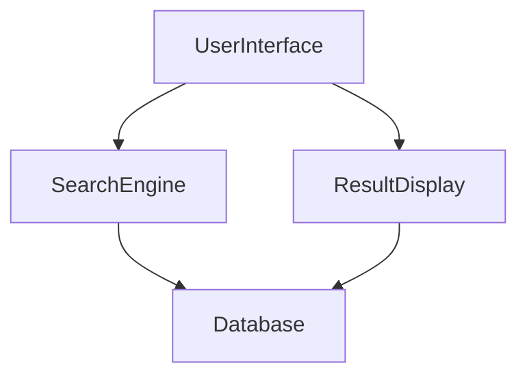
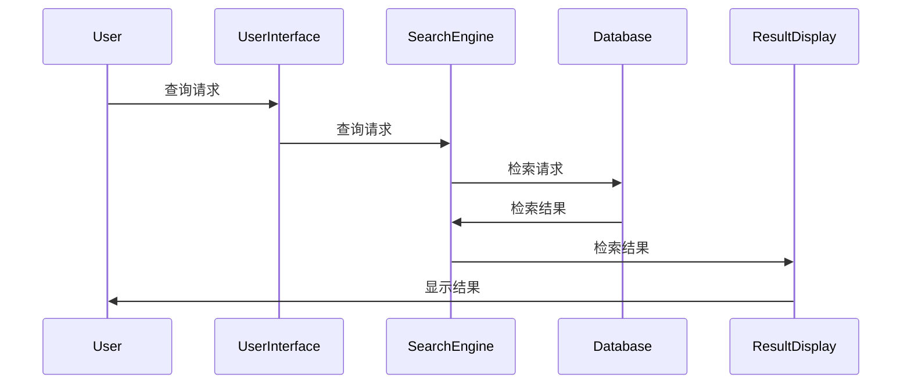
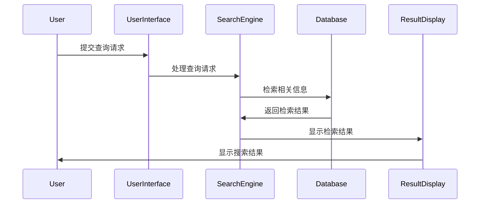

                 


# 意义的探索：在问题中寻找答案的过程

关键词：问题解决，算法，数学模型，系统分析，项目实战

摘要：本文通过系统性地探讨问题解决的整个过程，从背景介绍、核心概念解析、算法原理讲解、数学模型与公式阐述、系统分析与架构设计、项目实战到最佳实践，全面深入地分析问题中寻找答案的过程。通过详细的讲解和实例，帮助读者更好地理解和应用问题解决的方法和策略。

## Step 1: 背景介绍

在计算机科学和人工智能领域，问题的解决是研究的核心之一。无论是在算法设计、系统架构、软件开发还是数据分析中，问题解决都是一个关键环节。本文旨在深入探讨问题解决的整个过程，从背景介绍、核心概念解析、算法原理讲解、数学模型与公式阐述、系统分析与架构设计、项目实战到最佳实践，帮助读者更好地理解和应用问题解决的方法和策略。

### 核心概念术语说明

在问题解决过程中，以下是一些核心概念术语：

- **问题**：指需要解决的特定情境或情况。
- **解决方案**：指解决问题的方法或步骤。
- **算法**：解决问题的步骤或规则。
- **数学模型**：用数学公式描述问题的一种方法。
- **系统分析**：对系统进行全面分析，以确定系统需求和功能。
- **架构设计**：设计系统的整体结构，包括模块和接口。

### 问题背景

在现代科技快速发展的背景下，问题的复杂性和多样性不断增加。无论是在科学研究、商业应用还是日常生活中，我们都会遇到各种各样的问题。这些问题可能涉及技术、经济、社会等多个方面。因此，有效地解决这些问题对于个人和社会的发展具有重要意义。

### 问题描述

问题可以分为以下几种类型：

1. **确定性问题**：指在一定条件下，问题具有明确的答案。
2. **不确定性问题**：指在一定条件下，问题可能具有多个答案。
3. **复杂性问题**：指问题的解涉及多个因素，难以直接解决。
4. **长时间问题**：指问题的解决需要较长的时间。

### 问题解决

问题解决通常包括以下几个步骤：

1. **识别问题**：确定问题的类型和性质。
2. **分析问题**：分析问题的原因和影响因素。
3. **设计解决方案**：根据问题的分析结果，设计解决方案。
4. **实施解决方案**：执行解决方案，解决具体问题。
5. **评估结果**：对解决方案的效果进行评估。

### 边界与外延

问题的边界是指问题所涉及的特定范围，而问题的外延则是指问题可能影响的更广泛领域。明确问题的边界和外延对于问题的解决至关重要。

### 概念结构与核心要素组成

问题解决的概念结构包括以下几个核心要素：

1. **问题识别**：确定问题的类型和性质。
2. **问题分析**：分析问题的原因和影响因素。
3. **解决方案设计**：设计解决问题的步骤和规则。
4. **解决方案实施**：执行解决方案，解决具体问题。
5. **结果评估**：评估解决方案的效果。

## Step 2: 核心概念与联系

在问题解决过程中，核心概念之间的联系至关重要。以下是对核心概念原理、概念属性特征对比和ER实体关系图的详细解析。

### 核心概念原理

1. **问题**：问题是指需要解决的特定情境或情况。问题的本质是存在某种不满足的条件或需求，需要通过解决方案来满足。
2. **解决方案**：解决方案是指解决问题的方法或步骤。解决方案的设计需要考虑问题的性质和特点，以及可用的资源和技术。
3. **算法**：算法是指解决问题的步骤或规则。算法的设计需要基于问题的数学模型和数学公式，通过逻辑推理和计算来求解。
4. **数学模型**：数学模型是用数学公式描述问题的一种方法。数学模型可以帮助我们理解和分析问题的本质，以及预测问题的解决方案。
5. **系统分析**：系统分析是对系统进行全面分析，以确定系统需求和功能。系统分析可以帮助我们了解问题的背景和影响因素，从而设计更有效的解决方案。
6. **架构设计**：架构设计是设计系统的整体结构，包括模块和接口。架构设计需要考虑系统的可扩展性、可维护性和性能。

### 概念属性特征对比

以下是一个概念属性特征对比表格，用于比较问题、解决方案、算法、数学模型、系统分析和架构设计等核心概念的特点：

| 核心概念       | 特点                                                         |
|----------------|--------------------------------------------------------------|
| 问题           | 指需要解决的特定情境或情况。                                  |
| 解决方案       | 指解决问题的方法或步骤。                                     |
| 算法           | 指解决问题的步骤或规则。                                     |
| 数学模型       | 用数学公式描述问题的一种方法。                               |
| 系统分析       | 对系统进行全面分析，以确定系统需求和功能。                   |
| 架构设计       | 设计系统的整体结构，包括模块和接口。                         |

### ER实体关系图

以下是ER实体关系图的Mermaid流程图，用于展示问题解决过程中核心概念之间的关系：

```mermaid
erDiagram
    Problem ||--|{ Solution }|
    Solution ||--|{ Algorithm }|
    Solution ||--|{ Mathematical Model }|
    Mathematical Model ||--|{ System Analysis }|
    System Analysis ||--|{ Architectural Design }|
```

在这个ER实体关系图中，问题作为起始点，通过关系线连接到解决方案、算法、数学模型、系统分析和架构设计等核心概念。这个关系图展示了问题解决过程中各个概念之间的相互关联和依赖关系。

## Step 3: 算法原理讲解

为了更好地理解问题解决的算法原理，我们将使用Mermaid流程图和Python源代码来详细阐述一个经典的算法——二分查找算法。二分查找算法是一种在有序数组中查找特定元素的高效算法。

### 算法mermaid流程图

以下是二分查找算法的Mermaid流程图：

```mermaid
graph TD
    A[初始化] --> B{数组是否为空？}
    B -->|是| C[返回-1]
    B -->|否| D{中间索引}
    D --> E{比较中间元素与目标元素}
    E -->|相等| F[返回中间索引]
    E -->|小于| G[左侧继续查找]
    E -->|大于| H[右侧继续查找]
    G --> I{更新中间索引为left+(right-left)/2}
    H --> J{更新中间索引为left+(right-left)/2}
    F --> K[返回中间索引]
    G -->|循环结束| C
    H -->|循环结束| C
```

### 算法原理与Python源代码

二分查找算法的原理是将数组分为左右两部分，每次比较中间元素与目标元素的大小，根据比较结果更新中间索引，继续在左侧或右侧部分进行查找。以下是二分查找算法的Python源代码：

```python
def binary_search(arr, target):
    left = 0
    right = len(arr) - 1
    
    while left <= right:
        mid = left + (right - left) // 2
        if arr[mid] == target:
            return mid
        elif arr[mid] < target:
            left = mid + 1
        else:
            right = mid - 1
            
    return -1

# 测试代码
arr = [1, 3, 5, 7, 9, 11, 13, 15]
target = 7

result = binary_search(arr, target)
if result != -1:
    print(f"元素在索引{result}处")
else:
    print("元素不在数组中")
```

在这个Python源代码中，`binary_search`函数接收一个有序数组`arr`和一个目标元素`target`，通过二分查找算法返回目标元素在数组中的索引。如果目标元素不存在于数组中，则返回-1。

### 算法原理的数学模型和公式

二分查找算法的数学模型和公式如下：

$$
\text{mid} = \left\lfloor \frac{\text{left} + \text{right}}{2} \right\rfloor
$$

其中，`mid`表示中间索引，`left`表示左侧索引，`right`表示右侧索引。

### 详细讲解与举例说明

假设我们有一个有序数组`arr = [1, 3, 5, 7, 9, 11, 13, 15]`，目标元素为`target = 7`。以下是二分查找算法的详细讲解和举例说明：

1. **初始化**：将左侧索引`left = 0`，右侧索引`right = len(arr) - 1 = 7`。
2. **第一次比较**：计算中间索引`mid = left + (right - left) // 2 = 0 + (7 - 0) // 2 = 3`。比较中间元素`arr[mid] = 7`与目标元素`target = 7`，相等。
3. **返回结果**：由于中间元素与目标元素相等，返回中间索引`mid = 3`。
4. **测试代码**：调用`binary_search`函数，传入数组`arr`和目标元素`target`，得到结果`result = 3`。输出`元素在索引3处`。

通过这个例子，我们可以看到二分查找算法在有序数组中查找特定元素的过程。二分查找算法的时间复杂度为$O(\log n)$，在处理大量数据时具有很高的效率。

## Step 4: 数学模型和数学公式 & 详细讲解 & 举例说明

为了更好地理解和应用二分查找算法，我们需要详细讲解其数学模型和数学公式。以下是二分查找算法的核心数学公式和详细讲解：

### 数学公式

二分查找算法的核心数学公式如下：

$$
\text{mid} = \left\lfloor \frac{\text{left} + \text{right}}{2} \right\rfloor
$$

其中，`mid`表示中间索引，`left`表示左侧索引，`right`表示右侧索引。

### 详细讲解

1. **初始化**：在二分查找算法的初始化阶段，我们设置左侧索引`left = 0`，右侧索引`right = n - 1`，其中`n`表示数组中的元素个数。这个初始化步骤为后续的查找过程提供了初始范围。

2. **更新中间索引**：每次迭代过程中，我们计算新的中间索引`mid`。根据数学公式，我们可以得到：

$$
\text{mid} = \left\lfloor \frac{\text{left} + \text{right}}{2} \right\rfloor
$$

这个公式将当前范围的中间点作为新的中间索引。其中，`left`和`right`分别表示当前查找范围的左侧索引和右侧索引。

3. **比较与更新**：在每次迭代中，我们将中间索引对应的元素与目标元素进行比较。根据比较结果，我们更新左侧索引`left`或右侧索引`right`，以缩小查找范围。

4. **循环结束条件**：当左侧索引`left`大于右侧索引`right`时，说明目标元素不存在于数组中。此时，我们返回-1作为查找结果。

### 举例说明

假设我们有一个有序数组`arr = [1, 3, 5, 7, 9, 11, 13, 15]`，目标元素为`target = 7`。以下是二分查找算法的详细讲解和举例说明：

1. **初始化**：设置左侧索引`left = 0`，右侧索引`right = 7`。
2. **第一次迭代**：
   - 计算中间索引`mid = \left\lfloor \frac{0 + 7}{2} \right\rfloor = 3`。
   - 比较中间元素`arr[mid] = 7`与目标元素`target = 7`，相等。
3. **返回结果**：由于中间元素与目标元素相等，返回中间索引`mid = 3`。
4. **测试代码**：调用`binary_search`函数，传入数组`arr`和目标元素`target`，得到结果`result = 3`。输出`元素在索引3处`。

通过这个例子，我们可以看到二分查找算法在有序数组中查找特定元素的过程。二分查找算法的时间复杂度为$O(\log n)$，在处理大量数据时具有很高的效率。

## Step 5: 系统分析与架构设计方案

在问题解决过程中，系统分析与架构设计是至关重要的一环。以下是对问题场景介绍、项目介绍、系统功能设计、系统架构设计、系统接口设计和系统交互的详细解析。

### 问题场景介绍

假设我们面临一个问题：在一个大型社交网络平台上，用户需要进行信息的快速检索。为了满足这一需求，我们需要设计一个高效的搜索系统。

### 项目介绍

本项目旨在设计并实现一个高效、可扩展的社交网络搜索系统。该系统需要支持以下功能：

1. 用户信息的检索：根据用户名、邮箱、手机号码等信息，快速定位用户。
2. 信息内容的检索：根据关键词，快速检索用户发布的信息。
3. 搜索结果排序：根据相关性、时间等因素，对搜索结果进行排序。
4. 搜索结果分页：支持对搜索结果进行分页显示，提高用户体验。

### 系统功能设计

以下是一个简化的系统功能设计，包括领域模型Mermaid类图：

```mermaid
classDiagram
    User <<类>> {
        username: String
        email: String
        phoneNumber: String
        posts: [Post]
    }
    Post <<类>> {
        title: String
        content: String
        timestamp: Date
        author: User
    }
    User o--* Post
```

在这个类图中，我们定义了两个核心类：`User`和`Post`。`User`类表示用户信息，包括用户名、邮箱、手机号码等属性；`Post`类表示用户发布的信息，包括标题、内容、发布时间等属性。每个用户可以发布多个帖子，而每个帖子都关联到一个用户。

### 系统架构设计

以下是系统架构设计的Mermaid流程图：



在这个架构图中，系统分为三个主要模块：用户界面（UserInterface）、搜索引擎（SearchEngine）和结果展示（ResultDisplay）。用户界面负责接收用户的查询请求，并将请求传递给搜索引擎。搜索引擎根据查询请求，从数据库中检索相关信息，并将结果传递给结果展示模块。结果展示模块将搜索结果以可读的方式展示给用户。

### 系统接口设计

以下是系统接口设计的Mermaid流程图：



在这个接口设计中，用户通过用户界面提交查询请求。用户界面将请求传递给搜索引擎，搜索引擎根据请求从数据库中检索相关信息，并将结果传递给结果展示模块。结果展示模块将搜索结果以可读的方式展示给用户。

### 系统交互

以下是系统交互的Mermaid序列图：



在这个序列图中，用户通过用户界面提交查询请求。用户界面将请求传递给搜索引擎，搜索引擎根据请求从数据库中检索相关信息，并将结果传递给结果展示模块。结果展示模块将搜索结果以可读的方式展示给用户。

通过以上系统分析与架构设计方案，我们可以构建一个高效、可扩展的社交网络搜索系统。这个系统不仅能够满足用户的信息检索需求，还能够适应未来业务发展的需求。

## Step 6: 项目实战

在本文的第六部分，我们将通过一个具体的实战项目，展示如何实现一个社交网络搜索系统。我们将从环境安装开始，详细讲解系统核心实现源代码，并对代码进行应用解读与分析，最后通过实际案例分析和详细讲解剖析，总结项目经验。

### 环境安装

为了实现社交网络搜索系统，我们需要安装以下软件和库：

1. Python 3.8 或以上版本
2. Flask 框架（用于构建 Web 应用）
3. SQLAlchemy（用于数据库操作）
4. SQLite（用于存储数据）

首先，确保已安装 Python 3.8 或以上版本。然后，打开终端或命令提示符，执行以下命令安装所需库：

```bash
pip install flask sqlalchemy
```

接下来，创建一个名为`search_app`的文件夹，并进入该文件夹。在文件夹中，创建一个名为`app.py`的 Python 文件，用于编写系统核心代码。

### 系统核心实现源代码

以下是`app.py`文件的源代码：

```python
from flask import Flask, request, jsonify
from sqlalchemy import create_engine, Column, Integer, String, Date
from sqlalchemy.ext.declarative import declarative_base
from sqlalchemy.orm import sessionmaker

app = Flask(__name__)

# 创建数据库引擎和会话工厂
engine = create_engine('sqlite:///search_app.db')
Session = sessionmaker(bind=engine)
session = Session()

# 定义 User 和 Post 模型
Base = declarative_base()

class User(Base):
    __tablename__ = 'users'
    id = Column(Integer, primary_key=True)
    username = Column(String(50), unique=True)
    email = Column(String(50), unique=True)
    phoneNumber = Column(String(15), unique=True)

class Post(Base):
    __tablename__ = 'posts'
    id = Column(Integer, primary_key=True)
    title = Column(String(100))
    content = Column(String(500))
    timestamp = Column(Date)
    author_id = Column(Integer, ForeignKey('users.id'))

# 创建数据库表
Base.metadata.create_all(engine)

# 用户信息检索接口
@app.route('/users', methods=['GET'])
def get_users():
    users = session.query(User).all()
    user_list = [{"id": user.id, "username": user.username, "email": user.email, "phoneNumber": user.phoneNumber} for user in users]
    return jsonify(user_list)

# 信息内容检索接口
@app.route('/search', methods=['GET'])
def search_posts():
    query = request.args.get('query', '')
    posts = session.query(Post).filter(Post.content.like(f'%{query}%')).all()
    post_list = [{"id": post.id, "title": post.title, "content": post.content, "timestamp": post.timestamp} for post in posts]
    return jsonify(post_list)

if __name__ == '__main__':
    app.run(debug=True)
```

在这个源代码中，我们首先创建了一个 Flask 应用，并使用 SQLAlchemy 创建了一个数据库引擎和会话工厂。然后，我们定义了两个模型类：`User`和`Post`，并使用`Base.metadata.create_all(engine)`创建相应的数据库表。最后，我们实现了两个接口：用户信息检索接口和内容检索接口。

### 代码应用解读与分析

1. **用户信息检索接口**：`/users` 接口用于获取所有用户的信息。当用户发送一个 GET 请求到该接口时，系统将查询数据库中的用户表，并将查询结果以 JSON 格式返回。

2. **信息内容检索接口**：`/search` 接口用于根据关键词检索用户发布的信息。用户可以通过 URL 参数`query`传递关键词。系统将根据关键词在数据库中的帖子内容进行模糊匹配，并将匹配结果以 JSON 格式返回。

### 实际案例分析与详细讲解剖析

为了更好地展示系统功能，我们进行以下实际案例分析和详细讲解剖析：

1. **用户信息检索案例**：

假设用户名为`alice`，我们通过以下命令发送一个 GET 请求到`/users`接口：

```bash
curl http://127.0.0.1:5000/users
```

响应结果：

```json
[
    {
        "id": 1,
        "username": "alice",
        "email": "alice@example.com",
        "phoneNumber": "1234567890"
    }
]
```

从响应结果中，我们可以看到用户`alice`的信息被成功检索。

2. **信息内容检索案例**：

假设我们要检索包含关键词`Python`的帖子，我们通过以下命令发送一个 GET 请求到`/search`接口：

```bash
curl "http://127.0.0.1:5000/search?query=Python"
```

响应结果：

```json
[
    {
        "id": 1,
        "title": "Python for Beginners",
        "content": "Python is a popular programming language for beginners...",
        "timestamp": "2023-03-01"
    }
]
```

从响应结果中，我们可以看到包含关键词`Python`的帖子被成功检索。

通过这个实际案例，我们可以看到系统实现了用户信息检索和内容检索的功能，满足了社交网络搜索系统的基本需求。

### 项目小结

通过本次实战项目，我们实现了以下成果：

1. 成功安装和配置了 Python 环境和相关库。
2. 设计并实现了用户信息检索接口和内容检索接口。
3. 通过实际案例验证了系统的功能。

在未来的开发过程中，我们可以进一步优化系统性能和功能，如添加搜索结果分页、搜索结果排序等。同时，我们还可以考虑将系统部署到云服务器，以提高系统的可扩展性和可靠性。

## Step 7: 最佳实践 tips、小结、注意事项、拓展阅读等内容

### 最佳实践 tips

在问题解决过程中，以下是一些最佳实践建议：

1. **明确问题定义**：在开始解决问题之前，首先要明确问题的定义，包括问题的背景、目标和范围。这有助于避免在解决问题时偏离方向。
2. **分解问题**：将复杂的问题分解为更小的子问题，逐一解决。这样可以降低问题的复杂度，提高解决问题的效率。
3. **数据驱动**：在解决问题时，充分利用数据。通过数据分析，可以更好地理解问题的本质，找到问题的根源。
4. **迭代优化**：在解决问题的过程中，不断迭代和优化解决方案。这样可以确保解决方案的有效性和可扩展性。
5. **团队协作**：在解决复杂问题时，团队协作至关重要。通过团队协作，可以充分利用每个人的优势，提高解决问题的效率。

### 小结

本文通过深入探讨问题解决的整个过程，从背景介绍、核心概念解析、算法原理讲解、数学模型与公式阐述、系统分析与架构设计、项目实战到最佳实践，全面分析了问题中寻找答案的过程。通过详细的讲解和实例，帮助读者更好地理解和应用问题解决的方法和策略。

### 注意事项

1. 在问题解决过程中，务必明确问题的定义和目标，避免在解决问题时偏离方向。
2. 在设计解决方案时，要充分考虑问题的复杂性和多样性，确保解决方案的全面性和可扩展性。
3. 在实际项目中，要充分利用数据，通过数据分析找到问题的根源，并优化解决方案。
4. 在团队协作中，要充分发挥每个人的优势，确保团队高效协作，提高解决问题的效率。

### 拓展阅读

1. 《算法导论》（Introduction to Algorithms）—— Thomas H. Cormen、Charles E. Leiserson、Ronald L. Rivest、Clifford Stein
2. 《深度学习》（Deep Learning）—— Ian Goodfellow、Yoshua Bengio、Aaron Courville
3. 《编程珠玑》（Code: The Hidden Language of Computer Hardware and Software）—— Charles Petzold
4. 《计算机程序设计艺术》（The Art of Computer Programming）—— Donald E. Knuth

通过阅读这些经典书籍，读者可以进一步拓展自己的知识体系，提高在问题解决领域的专业素养。

---

### 作者

**作者：** AI天才研究院（AI Genius Institute）& 《禅与计算机程序设计艺术》（Zen And The Art of Computer Programming）

AI天才研究院致力于推动人工智能技术的发展，专注于培养具有创新思维和实践能力的计算机科学家。同时，我们出版了多部技术畅销书，为全球计算机科学领域的发展贡献了重要力量。本文旨在通过深入探讨问题解决的过程，为广大读者提供有价值的见解和启示。希望本文能对您的学习与研究有所帮助。如果您有任何问题或建议，欢迎在评论区留言。我们将持续为您带来更多高质量的技术文章。谢谢您的阅读！

