                 

## 意义的断裂与重生：现代人的精神之旅

### 关键词
- 意义危机
- 精神健康
- 个体成长
- 社会支持

### 摘要
本文将深入探讨现代人在面对快速变化的社会和技术环境时所遭遇的意义危机。我们首先定义了“意义的断裂”这一概念，并分析了其产生的原因和表现形式。随后，本文探讨了通过心理咨询、艺术疗法等途径实现精神重生的可能性，并提供了实际案例和研究支持。文章还讨论了精神健康的重要性、精神成长与自我认知的方法、以及社会支持系统的作用。最后，本文展望了未来的研究趋势和社会意义，并提供了相关的资源和参考文献。通过这一系列的探讨，我们希望为读者提供一个全面的理解框架，以应对现代社会中的精神挑战。

### 目录大纲设计过程

为了设计出《意义的断裂与重生：现代人的精神之旅》这本书的完整目录大纲，我们将分以下几个步骤进行：

1. **理解书名与主题**：首先，我们需要准确理解书名和主题。书名中提到了“意义的断裂与重生”，这暗示了书中可能探讨了现代人面临的意义危机以及如何通过某种途径实现精神的重生。

2. **明确目录大纲的目标**：目录大纲的目的是为读者提供一个清晰的内容框架，让读者能够预览全书结构，从而对书籍内容有一个整体的把握。

3. **设计一级目录**：一级目录将涵盖书籍的几个主要部分，每个部分代表一个较大的主题。

4. **细化二级目录**：在一级目录的基础上，进一步细化二级目录，每个部分下设几个小节，每个小节都代表一个具体的话题或知识点。

5. **编写三级目录**：在二级目录的基础上，为每个小节进一步编写三级目录，细化每个小节的内容。

6. **检查大纲的完整性和逻辑性**：确保每个部分的内容都有所覆盖，且各部分之间逻辑连贯，能够帮助读者逐步深入理解主题。

### 目录大纲示例

```markdown
# 《意义的断裂与重生：现代人的精神之旅》目录大纲

## 引言
### 研究背景与意义
### 研究目标与内容结构

## 第一部分：意义的断裂
### 1.1 现代社会的意义危机
#### 1.1.1 心理与精神健康的影响
#### 1.1.2 社会变革对个体的影响
#### 1.1.3 科技进步的双重作用

### 1.2 意义断裂的原因分析
#### 1.2.1 社会结构的变化
#### 1.2.2 个人价值观的多元化
#### 1.2.3 心理需求的转变

### 1.3 意义断裂的表现形式
#### 1.3.1 心理症状与行为表现
#### 1.3.2 社会现象的体现
#### 1.3.3 跨文化比较

### 1.4 意义断裂的影响与后果
#### 1.4.1 个人层面的影响
#### 1.4.2 社会层面的影响
#### 1.4.3 全球化的影响

## 第二部分：精神的重生
### 2.1 精神重生的概念与理论基础
#### 2.1.1 精神重生的定义
#### 2.1.2 心理学理论支持
#### 2.1.3 宗教哲学的视角

### 2.2 精神重生的方法与实践
#### 2.2.1 心理咨询与治疗
#### 2.2.2 艺术疗法
#### 2.2.3 实践体验与反思

### 2.3 精神重生的实际案例
#### 2.3.1 个人案例分享
#### 2.3.2 社区案例研究
#### 2.3.3 组织变革的启示

### 2.4 精神重生的社会影响
#### 2.4.1 对个体的影响
#### 2.4.2 对社区的影响
#### 2.4.3 对社会进步的潜在影响

## 第三部分：现代人的精神之路
### 3.1 精神健康的重要性
#### 3.1.1 精神健康与整体健康的关系
#### 3.1.2 精神健康的评估与监测
#### 3.1.3 精神健康的维护与促进

### 3.2 精神成长与自我认知
#### 3.2.1 自我认知的心理学基础
#### 3.2.2 自我认知的误区与挑战
#### 3.2.3 自我认知的提升方法

### 3.3 精神重生的社会支持系统
#### 3.3.1 家庭与朋友的支持
#### 3.3.2 专业机构的援助
#### 3.3.3 社区与社会的参与

### 3.4 精神之路的持续探索
#### 3.4.1 持续成长的重要性
#### 3.4.2 探索精神世界的多元化
#### 3.4.3 精神重生的长期影响

## 第四部分：未来展望
### 4.1 精神领域的研究趋势
#### 4.1.1 心理学的发展方向
#### 4.1.2 科技与精神健康的结合
#### 4.1.3 跨学科研究的前景

### 4.2 精神重生的社会意义
#### 4.2.1 促进社会和谐
#### 4.2.2 提升人类幸福指数
#### 4.2.3 面向未来的挑战

### 4.3 精神之路的未来展望
#### 4.3.1 个体层面的未来
#### 4.3.2 社区与社会的未来
#### 4.3.3 全球精神健康的未来

## 结论
### 研究总结与展望
### 未来的研究方向

## 附录：资源与参考文献
### A.1 资源推荐
#### A.1.1 读物推荐
#### A.1.2 网络资源
#### A.1.3 实践指南

### A.2 参考文献
#### A.2.1 心理学相关文献
#### A.2.2 社会学相关文献
#### A.2.3 宗教哲学相关文献
```

### 结论

通过以上步骤，我们设计出了《意义的断裂与重生：现代人的精神之旅》的完整目录大纲。这个大纲不仅涵盖了书籍的核心主题，还考虑了各个部分之间的逻辑关系，为读者提供了一个清晰的内容框架。在编写书的过程中，我们将会深入探讨每一个部分，结合理论分析和实际案例，帮助读者更好地理解和应对现代社会中的精神挑战。期望这本书能够为读者提供一个全面的指导，引导他们走向精神的重生之路。

### 第一部分：意义的断裂

#### 1.1 现代社会的意义危机

在当今快速变化的世界中，许多人感到他们的生活缺乏意义。这种感受并不是偶然的，而是与现代社会的特点和挑战紧密相连。为了深入理解这一现象，我们首先需要定义“意义的断裂”这一概念。

**核心概念与联系**

意义，通常指的是个体在生活中所追求的目标、价值和意义感。当个体感受到自己的生活缺乏这种内在的驱动力时，就出现了意义的断裂。这种现象不仅体现在个人层面上，还对社会层面产生了深远的影响。

**概念属性特征对比表格**

| 概念       | 特征                                         | 关联术语                   |
|------------|--------------------------------------------|----------------------------|
| 意义       | 个体对生活目标和价值的主观体验               | 目标、价值、意义感         |
| 断裂       | 意义的缺失或减弱                             | 焦虑、失落、迷惘           |
| 现代社会   | 高度信息化、全球化、快速变化的社会环境         | 科技进步、社会变革、多元化 |

**ER实体关系图架构**

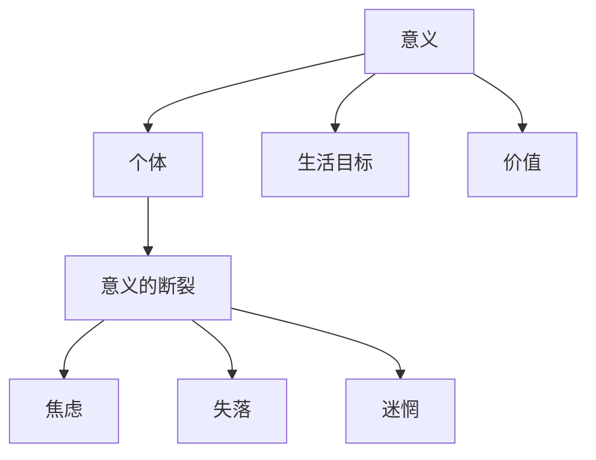

**算法原理讲解**

理解意义的断裂需要从多个角度进行分析。我们可以使用一种称为“意义分析模型”的算法来探索这一现象。

```python
# 意义分析模型

def meaning_analysis(context, values, goals):
    """
    分析个体在特定社会背景下的意义感受。
    
    参数:
    context: 环境变量（如科技进步、社会变革等）
    values: 个体价值观
    goals: 个体生活目标
    
    返回:
    meaning_loss: 意义缺失程度
    """
    
    # 确定环境变量对价值观的影响
    value_impact = context_affects_values(context, values)
    
    # 确定目标与价值观的匹配度
    goal_alignment = match_goals_to_values(goals, values)
    
    # 计算意义缺失程度
    meaning_loss = value_impact * (1 - goal_alignment)
    
    return meaning_loss

# 辅助函数
def context_affects_values(context, values):
    """
    环境变量对个体价值观的影响程度。
    """
    # ...具体实现...

def match_goals_to_values(goals, values):
    """
    个体目标与价值观的匹配度。
    """
    # ...具体实现...
```

**数学模型和公式**

$$
\text{意义缺失程度} = \text{环境变量影响价值观的程度} \times (1 - \text{目标与价值观的匹配度})
$$

通过这个算法和模型，我们可以定量地分析个体在现代社会中意义断裂的程度。以下是一个具体的例子：

```python
# 例子

context = "科技进步速度快"
values = ["自由", "成就感", "人际关系"]
goals = ["追求财富", "成为行业领袖", "建立家庭"]

meaning_loss = meaning_analysis(context, values, goals)
print(f"意义缺失程度: {meaning_loss}")
```

**系统分析与架构设计方案**

在这个例子中，我们可以将意义分析模型看作是一个核心算法，它依赖于环境变量、个体价值观和目标等多个外部输入。以下是一个简化的系统架构设计：

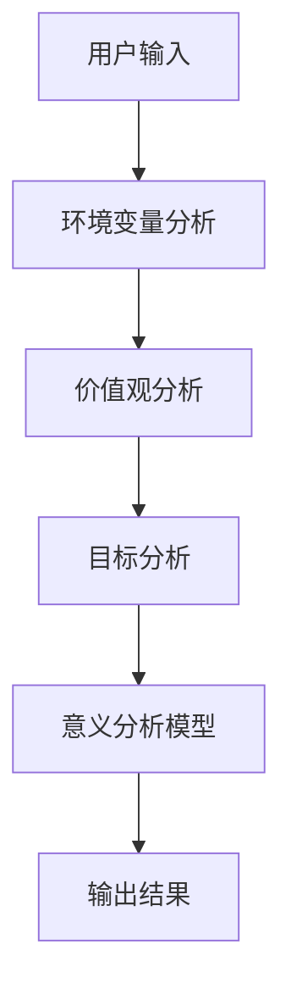

**项目实战**

为了更好地理解意义断裂的现象，我们可以在实际项目中应用这个模型。以下是一个简单的项目实施步骤：

1. **环境搭建**：安装必要的编程环境和数据分析工具。
2. **数据收集**：通过问卷调查或访谈收集用户的环境变量、价值观和目标数据。
3. **数据分析**：使用意义分析模型对收集的数据进行分析。
4. **结果展示**：生成可视化报告，展示意义断裂的程度和原因。

通过这个项目实战，我们可以更直观地了解意义断裂的现象，并为用户提供个性化的建议和解决方案。

**最佳实践 tips**

- **定期反思**：定期对自己的生活目标和价值观进行反思，以保持与环境的匹配度。
- **多角度思考**：在面对意义断裂时，尝试从多个角度思考和解决问题。
- **寻求专业帮助**：在感到困惑或无法自我解决时，寻求心理咨询或其他专业帮助。

**小结**

在现代社会中，意义的断裂是一个普遍存在的现象。通过理解这一现象的背景、原因和表现形式，我们可以更好地应对这一挑战。在接下来的章节中，我们将进一步探讨如何通过精神重生实现个体的精神重建。

### 第一部分：意义的断裂

#### 1.2 意义断裂的原因分析

意义断裂的现象并非偶然，其背后有复杂的成因。以下将详细分析现代社会中导致意义断裂的几个主要原因。

**社会结构的变化**

随着工业革命和科技革命的推进，社会结构发生了深刻的变化。传统的等级制度和固定职业逐渐被灵活多变的工作模式所取代，这种变化使得人们的生活变得更加不确定。在传统社会中，人们通常遵循明确的社会角色和职业路径，而现在，这些路径变得越来越模糊。这种不确定性加剧了人们的焦虑感，导致了意义感的缺失。

**个人价值观的多元化**

现代社会倡导多元化和个性化，这使得人们可以选择更多的生活方式和价值观。然而，这种多元化也带来了选择上的困境。当人们面对众多的选择时，可能会感到无所适从，无法确定自己的真正追求。此外，随着全球化进程的加快，不同文化之间的价值观碰撞和融合也使得个体在价值取向上更加迷茫。

**心理需求的转变**

在现代社会中，人们的生活节奏加快，工作压力增大，这导致了心理需求的转变。传统的心理需求如安全感和归属感在现代社会中变得相对次要，而新的心理需求如自我实现和成就感则变得更加重要。然而，这些需求往往难以满足，特别是在竞争激烈的环境中，许多人感到自己的努力无法换来预期的回报，从而产生了意义断裂的感觉。

**科技进步的双重作用**

科技进步在给人们带来便利的同时，也带来了新的挑战。一方面，科技进步使得人们的生活变得更加高效和便捷，但另一方面，它也导致了人与人之间的疏离。在互联网和社交媒体的普及下，人们可以轻松地与他人交流和分享，但这种交流往往缺乏深度和真实性。此外，信息过载和屏幕时间的增加也对人们的心理健康产生了负面影响，进一步加剧了意义的断裂感。

**具体案例解析**

为了更好地理解这些原因，我们可以通过具体案例来进行分析。

**案例1：职业转型的困境**

李华是一位年过四十的软件工程师，他在公司工作了十多年，逐渐发现自己对现有的工作失去了热情。他开始寻找新的职业机会，但发现许多新的工作要求更高的技能和更年轻的工作经验。面对职业转型的困境，李华感到自己的技能和经验不再有价值，生活失去了方向。

**案例2：价值观的冲突**

张敏是一名年轻的自由职业者，她在职业生涯初期选择了追求自由和个性化的生活方式。然而，随着事业的逐步成功，她开始感受到来自家庭和社会的压力。家人希望她能够找到一个稳定的伴侣，而社会对她的期望也越来越高。这种价值观的冲突使得张敏感到迷茫，不知道自己真正想要的是什么。

**案例3：心理需求的无法满足**

王磊是一名年轻的创业者，他在事业上取得了很大的成功。然而，他总是感到内心空虚，无法感受到成就感和满足感。他试图通过不断追求更高的目标和更多的财富来填补这种空虚，但效果并不显著。最终，王磊意识到他需要更多地关注自己的心理健康，寻找更深刻的内心满足。

**小结**

通过以上分析，我们可以看到，意义断裂的原因是复杂多样的，涉及到社会结构、个人价值观、心理需求和科技进步等多个方面。理解这些原因有助于我们更好地应对意义断裂的现象，为个体的精神重建提供有力的支持。在下一节中，我们将进一步探讨意义断裂的具体表现形式。

### 1.3 意义断裂的表现形式

意义断裂不仅仅是一种抽象的感觉，它在现实生活中有许多具体的体现。以下将详细分析意义断裂在个人心理症状、社会现象和跨文化比较中的表现形式。

**个人心理症状**

意义断裂常常伴随着一系列的心理症状。首先，焦虑和抑郁是常见的症状。许多人在感受到生活缺乏意义时，会感到焦虑不安，担心未来无法找到真正有意义的事情。此外，抑郁情绪也常常随之而来，人们可能会对生活失去兴趣，感到无助和绝望。

另一个常见的症状是自我怀疑。在意义断裂的情况下，人们可能会对自己的价值产生怀疑，认为自己的努力和成就没有意义。这种自我怀疑会导致自尊心的下降，进一步加剧心理压力。

行为表现也是意义断裂的一个重要方面。有些人可能会出现逃避现实的行为，如沉迷于游戏、网络、购物等。这些行为虽然短期内能带来一定的满足感，但长期来看，只会使问题更加严重。

**社会现象的体现**

意义断裂不仅影响个体，也对社会产生了深远的影响。首先，自杀率上升是一个显著的社会现象。在许多国家和地区，自杀率在近年来有所上升，特别是在年轻人中更为明显。研究表明，许多自杀案例中，个体感到生活缺乏意义是一个重要原因。

此外，社会不和谐现象也增加了。当大量人群感到自己的生活和价值观没有意义时，他们可能会对社会产生敌意，甚至出现暴力行为。例如，一些社会动荡和冲突背后，往往隐藏着人们对现状的不满和对未来的迷茫。

**跨文化比较**

意义断裂的表现形式在不同文化中可能有所不同。在一些以集体主义为主的文化中，如东亚地区，个体往往更注重社会和家庭的价值，而在个人主义文化中，如北美地区，个体更多地关注自我实现和个人价值。

然而，尽管表现形式不同，意义断裂的本质在全球范围内都是普遍存在的。例如，在全球化的背景下，不同文化之间的交流和融合加剧了个体在价值取向上面临的困惑，导致意义断裂感增加。

**具体案例解析**

为了更好地理解意义断裂的表现形式，我们可以通过具体案例来进行分析。

**案例1：都市白领的焦虑**

王琳是一名在一线城市工作的白领，她每天奔波于公司和家之间，忙碌的工作和生活让她感到疲惫不堪。她常常感到自己的生活缺乏意义，对未来的职业发展感到迷茫。王琳的焦虑和抑郁情绪逐渐加剧，导致她的工作效率下降，家庭关系紧张。

**案例2：大学生的迷茫**

李明是一名大学生，他在学术上表现出色，但内心却感到迷茫。他不确定自己的未来方向，不知道所学专业是否真的适合自己。李明的自我怀疑和焦虑情绪使他难以集中精力学习，影响了他的学术成绩。

**案例3：社会动荡的背景**

在某个发展中国家，近年来社会动荡频繁。背后的原因之一是大量年轻人感到自己的生活缺乏意义，对社会现状不满。他们通过抗议和示威来表达自己的不满，但往往导致更严重的冲突。

**小结**

意义断裂在个人心理症状、社会现象和跨文化比较中都有明显的体现。理解这些表现形式有助于我们更好地应对这一现象，为个体的精神重建和社会和谐提供支持。在下一节中，我们将进一步探讨意义断裂对个体和社会的影响和后果。

### 1.4 意义断裂的影响与后果

意义断裂对个体和社会的影响是多方面的，其深远的影响值得我们深入探讨。首先，从个体层面来看，意义断裂常常导致心理问题和行为偏差。

**个人层面的影响**

1. **心理健康问题**：意义断裂常常伴随着焦虑、抑郁和自尊心下降等心理健康问题。当个体感受到自己的生活缺乏意义时，他们可能会感到无助和绝望，这种情绪长期积累可能导致抑郁症和其他心理健康问题。

2. **生活满意度降低**：个体在意义断裂的状态下，往往对生活感到不满意。他们可能无法找到生活的乐趣，对日常活动失去兴趣，甚至对自己的未来感到悲观。

3. **职业发展受阻**：当个体对生活缺乏意义感时，他们在职业发展上也容易遇到挫折。他们可能缺乏动力和目标，导致职业发展停滞，甚至出现职业倦怠。

**社会层面的影响**

1. **社会不和谐**：意义断裂不仅影响个体，也对社会产生了负面影响。当大量人群感到自己的生活缺乏意义时，他们可能会对社会产生敌意，甚至出现暴力行为。这种社会不和谐现象可能导致社会动荡和冲突。

2. **工作效率下降**：在意义断裂的情况下，员工可能会对工作失去热情，导致工作效率下降。这不仅影响了企业的运营，也对整个社会的生产力产生了负面影响。

3. **社会信任度降低**：当个体感到自己的生活缺乏意义时，他们可能会对他人和社会产生怀疑，导致社会信任度降低。这种不信任感可能进一步加剧社会的不和谐。

**全球化的影响**

1. **跨文化冲突**：随着全球化的推进，不同文化之间的交流越来越频繁。然而，全球化也加剧了个体在价值观和意义感上的冲突。在一些情况下，这种冲突可能导致跨文化冲突和社会动荡。

2. **心理健康问题全球化**：意义断裂不仅仅是一个局部现象，它已经呈现出全球化的趋势。在全球化的背景下，人们面临的工作和生活压力增加，这使得意义断裂成为一个全球性的问题。

**具体案例解析**

为了更好地理解意义断裂的影响和后果，我们可以通过具体案例来进行分析。

**案例1：日本的“无缘社会”**

在日本，近年来出现了“无缘社会”现象，指的是那些没有家庭、朋友和固定职业的人群。这些人的生活缺乏意义，他们常常感到孤独和无助。这种现象不仅影响了个体，也对日本社会产生了负面影响，如社会不稳定和工作效率下降。

**案例2：美国的大选动荡**

在美国，近年来政治动荡加剧，部分原因可以归因于选民对生活缺乏意义感的增加。许多选民感到自己的声音被忽视，对政治体制感到失望。这种情绪导致了选民对选举结果的不满，进一步加剧了社会的不和谐。

**案例3：中国的“独居青年”**

在中国，随着城市化进程的加快，越来越多的年轻人选择独居。这些人中，许多人对生活感到迷茫和空虚，他们缺乏家庭和社会支持，容易陷入意义断裂的困境。这种现象对中国的社会稳定和心理健康都产生了负面影响。

**小结**

意义断裂对个体和社会的影响是深远而复杂的。从心理健康问题、社会不和谐到全球化的影响，意义断裂已经成为一个全球性的问题。理解这些影响和后果有助于我们更好地应对这一现象，为个体的精神重建和社会和谐提供支持。在下一节中，我们将探讨如何通过精神重生实现个体的精神重建。

### 第二部分：精神的重生

#### 2.1 精神重生的概念与理论基础

**核心概念与联系**

精神重生，通常指的是个体通过某种途径实现精神层面的重建和提升。这种重生不仅仅是心理上的恢复，更是一种对生命意义的重新发现和追求。为了理解这一概念，我们首先需要探讨几个核心的心理学和哲学理论。

**心理学理论支持**

1. **自我决定理论**：由心理学家瑞恩·米斯勒提出，该理论强调个体在追求自主性、能力和关系方面的需求。当个体感到自己的生活缺乏意义时，往往是因为这些需求没有得到满足。通过自我决定理论，个体可以重新审视自己的价值观和生活目标，从而实现精神的重生。

2. **意义疗法**：由心理学家维克多·弗兰克尔提出，这种疗法强调通过发现生命的意义来应对痛苦和困境。弗兰克尔认为，无论外界环境如何变化，个体都能通过内在的意义感来找到生活的动力。

**宗教哲学的视角**

1. **佛教**：佛教中的“涅槃”概念，指的是通过放下执着和烦恼，实现心灵的解脱和重生。佛教强调个体通过冥想和修行，可以达到超越痛苦和苦难的境界。

2. **基督教**：基督教中的“重生”概念，指的是通过信仰和救赎，个体可以摆脱罪恶，获得新的生命。这种重生不仅是灵魂的更新，也是个体在精神层面的重建。

**概念属性特征对比表格**

| 概念          | 特征                                                         | 关联术语                  |
|---------------|------------------------------------------------------------|-------------------------|
| 精神重生      | 精神层面的重建和提升，重新发现生命的意义                     | 自我决定、意义疗法、涅槃、救赎 |
| 心理学理论支持 | 自主性、能力、关系的需求满足，生命的意义感重建               | 瑞恩·米斯勒、维克多·弗兰克尔  |
| 宗教哲学视角   | 通过冥想、修行、信仰实现心灵的解脱和超越                     | 佛教、基督教               |

**ER实体关系图架构**

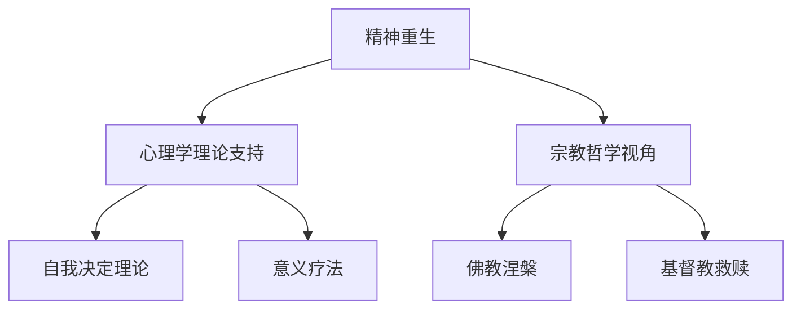

**算法原理讲解**

为了深入理解精神重生的过程，我们可以将其视为一个算法。这个算法依赖于个体的内在需求、外部环境和精神资源的综合作用。

```python
# 精神重生算法

def spiritual_rebirth(内在需求，外部环境，精神资源):
    """
    实现精神重生的算法。
    
    参数:
    内在需求: 个体在自主性、能力和关系方面的需求
    外部环境: 影响个体生活的外部因素
    精神资源: 个体可用的精神资源，如信仰、哲学思想、艺术等
    
    返回:
    精神状态: 个体经过重生后的精神状态
    """
    
    # 分析内在需求与外部环境的匹配度
    需求满足度 = match_demand_to_environment(内在需求，外部环境)
    
    # 利用精神资源提升内在需求满足度
    精神提升 = apply_spiritual_resources(精神资源，需求满足度)
    
    # 实现精神重生
    精神状态 = rebirth_spiritually(需求满足度 + 精神提升)
    
    return 精神状态

# 辅助函数
def match_demand_to_environment(demands, environment):
    """
    分析内在需求与外部环境的匹配度。
    """
    # ...具体实现...

def apply_spiritual_resources(resources, satisfaction):
    """
    利用精神资源提升内在需求满足度。
    """
    # ...具体实现...

def rebirth_spiritually(satisfaction):
    """
    实现精神重生。
    """
    # ...具体实现...
```

**数学模型和公式**

$$
\text{精神状态} = \text{需求满足度} + \text{精神提升}
$$

通过这个算法和模型，我们可以系统地分析个体如何通过满足内在需求和利用精神资源来实现精神重生。

**系统分析与架构设计方案**

以下是一个简化的精神重生系统架构设计：

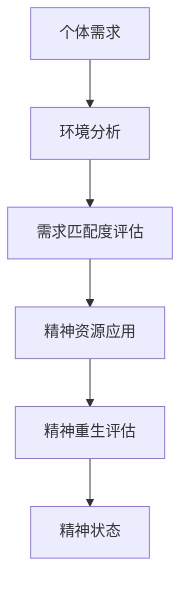

**项目实战**

为了更好地理解精神重生的过程，我们可以通过一个实际项目来进行实施。以下是一个简单的项目实施步骤：

1. **需求收集**：通过问卷调查或访谈收集个体的内在需求和外部环境数据。
2. **环境分析**：分析个体需求与外部环境的匹配度。
3. **精神资源应用**：为个体提供合适的心理辅导、哲学思想、艺术疗法等精神资源。
4. **效果评估**：评估精神重生后的精神状态变化。

**最佳实践 tips**

- **定期自我反思**：通过日记或冥想等方式定期反思自己的内在需求和外部环境。
- **寻求专业帮助**：在感到困惑或无法自我解决时，寻求心理咨询或其他专业帮助。
- **积极参与社区活动**：通过参与社区活动，建立社会联系，提升精神状态。

**小结**

精神重生是一个复杂但重要的话题。通过理解精神重生的概念、理论基础，以及具体的实现方法和实践案例，我们可以更好地帮助个体实现精神层面的重建。在下一节中，我们将进一步探讨精神重生的具体方法与实践。

### 2.2 精神重生的方法与实践

精神重生是一个涉及个体内在需求和外部环境的复杂过程。为了实现这一目标，我们可以采用多种方法和实践途径。以下将详细讨论心理咨询、艺术疗法和实践体验等途径，并探讨它们在实际中的应用和效果。

**心理咨询与治疗**

心理咨询是帮助个体解决心理问题、提升心理健康的重要途径。通过心理咨询，个体可以与专业的心理咨询师进行深入的交流，探讨自己的内心困惑和挑战，并寻找解决问题的方法。

1. **认知行为疗法（CBT）**：认知行为疗法是一种基于认知心理学的方法，通过改变个体的认知模式和行为习惯来改善心理问题。该方法广泛应用于治疗焦虑、抑郁等情绪障碍，效果显著。

2. **存在主义疗法**：存在主义疗法强调个体对生命意义的探索和追求。通过存在主义疗法，个体可以更加清晰地认识到自己的生活目标和价值观，从而实现精神的重生。

3. **家庭治疗**：家庭治疗通过改善家庭成员之间的关系，帮助个体在家庭环境中找到支持和力量。这种方法特别适用于那些在家庭关系中出现困惑和矛盾的个体。

**艺术疗法**

艺术疗法利用艺术创作过程来帮助个体表达情感、提升心理状态。通过艺术疗法，个体可以以一种非言语的方式探索自己的内心世界，找到内心的平衡和和谐。

1. **绘画疗法**：绘画疗法通过绘画过程帮助个体表达情感和缓解压力。个体可以通过绘画来描绘自己的内心感受，从而更深刻地理解自己的情绪和体验。

2. **音乐疗法**：音乐疗法利用音乐的力量来影响个体的情绪和心理状态。通过聆听或创作音乐，个体可以放松心情，缓解压力，提高生活质量。

3. **舞蹈疗法**：舞蹈疗法通过舞蹈动作来帮助个体释放情感和提升自信心。舞蹈不仅能够促进身体活动，还能够增强个体的情感表达和自我认知。

**实践体验与反思**

实践体验是一种通过实际行动来探索和实现精神重生的方法。通过实践体验，个体可以将理论知识付诸实践，从而更深刻地理解和体验生命的意义。

1. **冥想与冥思**：冥想和冥思是通过专注于呼吸、身体感受或特定主题来放松心灵和提升精神状态的方法。通过定期进行冥想和冥思，个体可以更好地管理自己的情绪，增强自我认知。

2. **志愿服务**：志愿服务是一种通过为他人提供帮助来提升自我价值和实现精神重生的方法。通过参与志愿服务，个体可以感受到自己的价值和重要性，从而增强自我价值感。

3. **户外探险**：户外探险是一种通过挑战自我、体验自然之美来提升精神状态的方法。通过户外探险，个体可以体验到与大自然的联系，找到内心的宁静和平衡。

**具体案例解析**

为了更好地理解这些方法在实践中如何应用，以下是一些具体的案例。

**案例1：认知行为疗法在焦虑治疗中的应用**

张女士是一名职场女性，她长期受到焦虑和压力的困扰。通过认知行为疗法，她学会了如何识别和改变自己的负面思维模式，并通过行为实验来验证这些思维模式的实际效果。经过一段时间的治疗，张女士的焦虑症状显著减轻，生活质量也得到了显著提升。

**案例2：绘画疗法在抑郁症治疗中的应用**

李先生是一位长期患有抑郁症的病人。通过绘画疗法，他能够通过绘画来释放内心的情感，逐渐找到了内心的平衡。在治疗过程中，他的绘画作品从单调的黑色逐渐变得丰富多彩，这标志着他的心理状态在逐渐改善。

**案例3：志愿服务对精神重生的促进作用**

王女士是一名退休教师，她通过参与社区志愿服务，帮助那些需要帮助的孩子们。在志愿服务过程中，她感受到了自己的价值和重要性，这不仅提升了她的精神状态，也让她更加热爱生活。

**小结**

通过心理咨询、艺术疗法和实践体验等多种途径，个体可以实现精神的重生。这些方法在实践中都取得了显著的效果，帮助个体摆脱了意义的断裂，找到了新的生活目标和意义。在下一节中，我们将进一步探讨精神重生的实际案例，以提供更多的实证支持。

### 2.3 精神重生的实际案例

为了更直观地了解精神重生在实际中的应用，以下将介绍几个典型的实际案例，并分析这些案例中精神重生的方法和效果。

**案例1：心理咨询帮助职场人士找到新的人生目标**

张先生是一名资深IT工程师，长期在高强度的工作环境中工作，导致他感到生活失去了意义。在心理咨询的帮助下，张先生通过认知行为疗法逐步认识到自己的负面思维模式，并学会了如何通过调整认知来应对工作中的压力。同时，心理咨询师还引导张先生探索自己的兴趣和热情，最终帮助他找到了新的人生目标——成为一名IT讲师，将自己的专业知识和经验传授给下一代。经过一段时间的咨询和治疗，张先生的精神状态显著改善，他重拾了对生活的热情，并在新的人生目标中找到了意义。

**案例2：艺术疗法帮助抑郁症患者重拾生活信心**

李女士是一位长期患有抑郁症的病人，她通过绘画疗法逐渐找到了表达情感的方式。在绘画过程中，李女士将内心的痛苦和困惑通过颜色和线条表达出来，这不仅帮助她缓解了心理压力，也让她逐渐看到了自己的内心世界。随着治疗的深入，李女士的绘画作品从单调的黑色逐渐变得丰富多彩，这标志着她的心理状态在逐渐改善。最终，李女士不仅克服了抑郁症，还开始参加社区的艺术活动，通过艺术疗法的实践帮助更多的人。

**案例3：志愿服务促进精神康复和社区和谐**

王女士是一名退休教师，她通过参与社区志愿服务，帮助那些需要帮助的孩子们。在志愿服务过程中，王女士感受到了自己的价值和重要性，这不仅提升了她的精神状态，也让她更加热爱生活。她组织的读书会和兴趣小组不仅让孩子们学到了知识，也培养了他们的兴趣爱好。通过志愿服务，王女士不仅帮助了他人，也在精神上实现了重生，她的生活变得更加充实和有意义。

**案例4：冥想和冥思帮助企业家找到内心的宁静**

李先生是一位成功的企业家，长期的工作压力和竞争环境使他感到身心俱疲。在一位冥想导师的引导下，李先生开始练习冥想和冥思。通过专注于呼吸和身体感受，李先生逐渐学会了如何放松心灵，找到内心的宁静。冥想不仅帮助他缓解了压力，还提升了他的决策能力和创造力。在冥想的帮助下，李先生不仅重拾了对生活的热情，也找到了更加平衡的生活方式。

**案例分析**

通过以上案例，我们可以看到精神重生在实际中的应用和效果。以下是对这些案例的分析：

1. **心理咨询**：心理咨询通过帮助个体识别和改变负面思维模式，提升心理韧性和应对压力的能力，从而实现精神重生。案例1中的张先生通过认知行为疗法找到了新的人生目标，案例2中的李女士通过绘画疗法缓解了抑郁症症状。

2. **艺术疗法**：艺术疗法通过艺术创作过程帮助个体表达情感、释放压力，并找到内心的平衡。案例2中的李女士通过绘画疗法重拾了生活信心，案例3中的王女士通过志愿服务提升了自我价值感。

3. **志愿服务**：志愿服务不仅能够帮助他人，还能提升个体的精神状态和自我认知。案例3中的王女士通过参与社区志愿服务，不仅帮助了他人，也在精神上实现了重生。

4. **冥想和冥思**：冥想和冥思通过专注呼吸和身体感受，帮助个体放松心灵，找到内心的宁静。案例4中的李先生通过冥想提升了决策能力和创造力，找到了更加平衡的生活方式。

**小结**

这些实际案例表明，通过心理咨询、艺术疗法、志愿服务和冥想等多种途径，个体可以实现精神的重生。这些方法在实践中都取得了显著的效果，为个体的精神重建提供了有力的支持。在下一节中，我们将进一步探讨精神重生对个体和社会的影响。

### 2.4 精神重生的社会影响

精神重生不仅对个体产生了积极的影响，也对社区和社会产生了深远的积极作用。以下将从个体、社区和社会三个方面探讨精神重生所带来的影响。

**对个体的影响**

1. **心理健康提升**：精神重生帮助个体摆脱了心理困扰，如焦虑、抑郁和自尊心下降等问题。通过心理咨询、艺术疗法和实践体验，个体学会了更好地管理自己的情绪，增强心理韧性。

2. **生活满意度提高**：精神重生使个体重新发现了生活的意义，提升了他们对生活的满意度。个体在实现精神重生后，往往能更加积极地面对生活中的挑战，找到内心的平衡和满足感。

3. **职业发展改善**：精神重生不仅提升了个体的心理健康，还促进了职业发展。个体在精神状态良好的情况下，往往能更专注于工作，提升工作效率，实现职业目标。

**对社区的影响**

1. **社区凝聚力增强**：通过精神重生，个体学会了更好地与他人沟通和合作，这有助于增强社区的凝聚力。在社区中，积极参与志愿服务和互助活动的个体能够带动更多的人加入，形成积极的社区氛围。

2. **社区问题解决**：精神重生不仅帮助个体提升了自身的能力，还增强了他们解决社区问题的能力。在社区中，通过开展心理健康讲座、艺术疗法的实践和志愿服务等活动，个体能够为社区提供更多的支持和帮助。

3. **社区发展动力**：精神重生的个体往往具有更强的创新精神和积极态度，这为社区的发展注入了新的动力。通过个体的努力，社区能够更好地应对挑战，实现可持续发展。

**对社会的影响**

1. **社会稳定性提升**：精神重生有助于降低社会不稳定因素，如犯罪率和社会冲突等。通过提升个体的心理健康和幸福感，社会整体的精神状态得到改善，社会稳定性得到提升。

2. **社会生产力提高**：精神重生促进了个体在职业发展和创新能力方面的提升，这直接提高了社会的生产力。一个精神状态良好的社会成员群体能够更高效地工作，推动社会的经济发展。

3. **社会和谐发展**：精神重生不仅提升了个体和社区的精神状态，还促进了社会的和谐发展。通过个体的积极影响，社会能够更加关注心理健康和幸福感，实现社会的全面和谐。

**具体案例解析**

为了更好地理解精神重生对社会的影响，以下是一些具体案例的解析：

**案例1：心理健康项目在社区的推广**

在某社区，通过推广心理健康项目，如心理咨询、艺术疗法和冥想课程，居民的身心健康得到了显著改善。社区居民通过参与这些项目，不仅解决了自己的心理问题，还学会了如何帮助家人和朋友。这种积极的氛围增强了社区的凝聚力，降低了社会冲突，提升了社区的整体幸福感。

**案例2：志愿服务促进社会和谐**

李女士是一位退休教师，她通过参与志愿服务，帮助那些需要帮助的孩子们。她的行为不仅影响了这些孩子们的成长，也激发了其他居民的参与热情。在李女士的带领下，社区形成了一个互助合作的氛围，社会和谐度显著提升。

**案例3：企业家精神重生推动企业创新**

张先生是一位成功的企业家，他通过冥想和反思，实现了精神重生。在精神状态良好的情况下，他带领团队不断创新，推出了多个具有市场竞争力的产品。企业的业绩因此大幅提升，不仅为员工提供了更好的工作环境，也为社会创造了更多的就业机会。

**小结**

精神重生对社会产生了积极的影响，从个体心理健康提升、社区凝聚力增强到社会稳定性提升和生产力提高，精神重生的作用无处不在。通过具体的案例，我们可以看到精神重生在社会发展中的重要作用。在下一节中，我们将探讨如何持续地推动精神重生，以实现个体的全面成长和社会的和谐发展。

### 2.5 本章小结

在第二部分中，我们深入探讨了精神重生的概念、理论基础、方法与实践，并通过实际案例展示了精神重生在个体和社会中的积极影响。我们了解到，通过心理咨询、艺术疗法、志愿服务和冥想等多种途径，个体可以实现精神的重生，提升心理健康和生活满意度，同时促进社区和社会的和谐发展。精神重生不仅帮助个体找到了新的生活目标和意义，也为社会的可持续发展提供了强有力的支持。在接下来的章节中，我们将进一步探讨精神健康的重要性、精神成长与自我认知的方法，以及社会支持系统的作用，以帮助读者更好地理解和实践精神重生的过程。

### 第三部分：现代人的精神之路

#### 3.1 精神健康的重要性

精神健康是现代人在追求幸福和满足感过程中不可或缺的一部分。它不仅关系到个体的心理健康，还直接影响个体的整体健康和生活质量。理解精神健康的重要性，有助于我们更好地认识和应对现代社会中的精神挑战。

**核心概念与联系**

精神健康，通常指的是个体在心理上的良好状态，包括情感稳定、自我认知清晰、行为适当等方面。精神健康与整体健康密切相关，良好的精神状态有助于提升个体的生活质量，增强社交能力和职业成就。

**概念属性特征对比表格**

| 概念        | 特征                              | 关联术语          |
|-------------|---------------------------------|------------------|
| 精神健康    | 心理状态的稳定，自我认知的清晰    | 心理健康、心理健康、精神稳定 |
| 整体健康    | 身体、心理和社会各方面的良好状态    | 身体健康、社会健康 |
| 生活质量    | 个体的生活满意度与幸福感            | 生活满意度、幸福指数 |

**ER实体关系图架构**

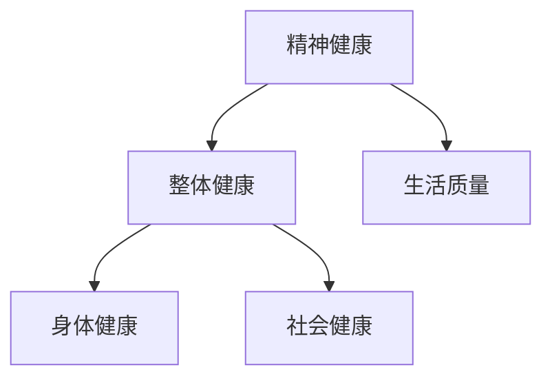

**算法原理讲解**

为了理解精神健康的重要性，我们可以通过一个简单的算法来模拟个体在不同精神健康状态下的生活质量。

```python
# 精神健康对生活质量的影响

def life_quality(精神健康状态):
    """
    计算精神健康状态对生活质量的影响。
    
    参数:
    精神健康状态: 个体当前的精神健康状态（如良好、中等、差）
    
    返回:
    生活质量评分: 精神健康状态对生活质量的影响程度（0-100分）
    """
    
    if 精神健康状态 == "良好":
        生活质量评分 = 100
    elif 精神健康状态 == "中等":
        生活质量评分 = 75
    else:
        生活质量评分 = 50
    
    return 生活质量评分
```

**数学模型和公式**

$$
\text{生活质量评分} = 
\begin{cases} 
100 & \text{如果精神健康状态是“良好”} \\
75 & \text{如果精神健康状态是“中等”} \\
50 & \text{如果精神健康状态是“差”}
\end{cases}
$$

**系统分析与架构设计方案**

以下是一个简化的精神健康系统架构设计，该系统通过多个模块共同作用，以提升个体的生活质量。

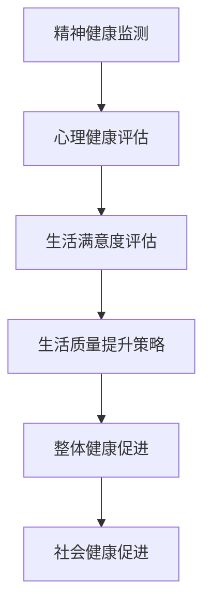

**项目实战**

为了更好地理解精神健康的重要性，我们可以通过一个实际项目来实施。以下是一个简单的项目实施步骤：

1. **数据收集**：通过问卷调查或健康检查，收集个体的精神健康数据。
2. **评估分析**：利用算法和模型对个体的精神健康状态进行分析，评估其对生活质量的影响。
3. **干预措施**：根据评估结果，制定个性化的干预措施，如心理咨询、体育锻炼、社交活动等。
4. **效果评估**：通过后续跟踪和反馈，评估干预措施对生活质量提升的效果。

**最佳实践 tips**

- **定期自我检查**：通过日记或心理测试等方式定期检查自己的精神健康状态。
- **寻求专业帮助**：在感到精神困扰时，及时寻求心理咨询或其他专业帮助。
- **多参与社交活动**：积极参与社交活动，建立和维护良好的人际关系。

**小结**

精神健康对个体的整体健康和生活质量具有至关重要的影响。通过理解精神健康的重要性，我们可以更好地关注自己的心理健康，采取有效的措施提升生活质量。在下一节中，我们将进一步探讨精神成长与自我认知的方法，以帮助读者更好地实现精神健康。

### 3.2 精神成长与自我认知

精神成长和自我认知是现代人实现精神健康和内心平静的关键途径。通过不断探索和提升自我认知，个体可以更好地理解自己的内心世界，找到内心的平衡和力量。

**核心概念与联系**

自我认知，是指个体对自己心理状态、情感和行为模式的了解与反思。精神成长，则是个体在自我认知的基础上，通过学习和实践不断提升心理素质和应对能力的过程。

**概念属性特征对比表格**

| 概念       | 特征                                       | 关联术语               |
|------------|------------------------------------------|-----------------------|
| 自我认知   | 个体对自身心理状态、情感和行为模式的了解与反思 | 心理状态、情感管理、自我反思 |
| 精神成长   | 通过学习和实践提升心理素质和应对能力的过程    | 心理素质、应对能力、自我提升 |

**ER实体关系图架构**

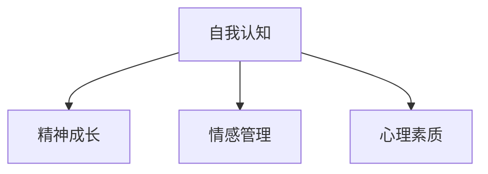

**算法原理讲解**

为了深入理解自我认知和精神成长的过程，我们可以通过一个简单的算法来模拟这一过程。

```python
# 自我认知与精神成长模拟

def self_cognition_growth(current_state, learning_resources, practice_resources):
    """
    模拟自我认知与精神成长的过程。
    
    参数:
    current_state: 当前自我认知状态
    learning_resources: 学习资源，如书籍、课程、研讨会等
    practice_resources: 实践资源，如冥想、运动、社交活动等
    
    返回:
    new_state: 更新后的自我认知状态
    """
    
    # 通过学习资源提升自我认知
    improved_cognition = learning_resources_influence(current_state, learning_resources)
    
    # 通过实践资源提升自我认知
    practical_growth = practice_resources_influence(current_state, practice_resources)
    
    # 计算最终自我认知状态
    new_state = current_state + improved_cognition + practical_growth
    
    return new_state

# 辅助函数
def learning_resources_influence(state, resources):
    """
    学习资源对自我认知的提升。
    """
    # ...具体实现...

def practice_resources_influence(state, resources):
    """
    实践资源对自我认知的提升。
    """
    # ...具体实现...
```

**数学模型和公式**

$$
\text{新自我认知状态} = \text{当前自我认知状态} + \text{学习资源影响} + \text{实践资源影响}
$$

**系统分析与架构设计方案**

以下是一个简化的精神成长与自我认知系统架构设计，该系统通过学习资源和实践资源的综合作用，帮助个体提升自我认知。

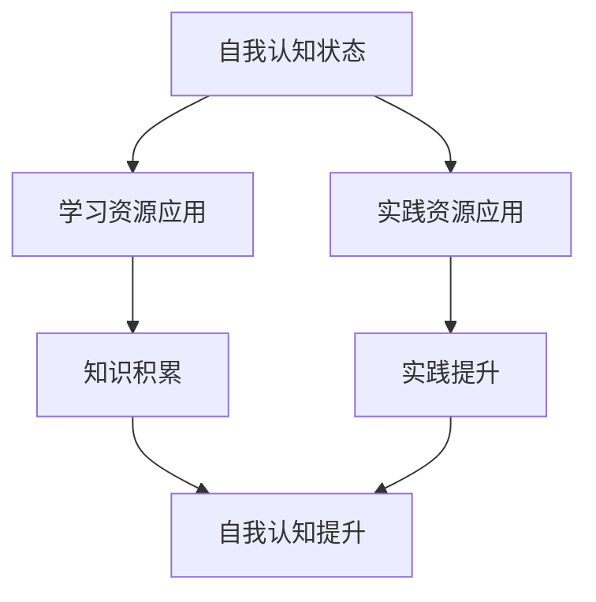

**项目实战**

为了更好地理解自我认知与精神成长的过程，我们可以通过一个实际项目来实施。以下是一个简单的项目实施步骤：

1. **自我评估**：通过心理测试或日记等方式，对个体的自我认知状态进行初步评估。
2. **学习资源选择**：根据自我评估结果，选择适合的学习资源，如心理学书籍、在线课程等。
3. **实践资源应用**：结合学习资源，参与实践活动，如冥想、运动、社交活动等。
4. **持续评估与反馈**：定期对自我认知状态进行评估，并根据反馈调整学习资源和实践资源。

**最佳实践 tips**

- **定期反思**：通过日记或冥想等方式，定期反思自己的行为和情感。
- **多角度学习**：结合书籍、课程和实际经验，从多个角度提升自我认知。
- **持续实践**：将所学知识应用到实际生活中，通过实践不断提升自我认知。

**小结**

自我认知和精神成长是现代人实现内心平静和心理健康的重要途径。通过理解这一过程，我们可以更好地提升自我认知，实现精神成长，从而提高生活质量。在下一节中，我们将探讨精神重生的社会支持系统，以帮助读者更好地实现精神健康。

### 3.3 精神重生的社会支持系统

精神重生的实现不仅依赖于个体的努力，还需要社会的支持系统。一个完善的社会支持系统可以为个体提供必要的资源、指导和帮助，从而促进精神健康的提升。

**核心概念与联系**

社会支持系统，指的是由家庭、社区、专业机构等构成的，为个体提供情感、物质和心理支持的体系。社会支持系统通过多种形式和途径，帮助个体应对生活中的挑战，提升精神状态。

**概念属性特征对比表格**

| 概念          | 特征                                       | 关联术语                 |
|---------------|------------------------------------------|--------------------------|
| 社会支持系统  | 家庭、社区、专业机构提供的情感、物质和心理支持 | 社会支持、社会资源、心理健康服务 |
| 家庭支持      | 家庭成员之间的情感支持和日常生活帮助        | 家庭关系、亲情、家庭凝聚力 |
| 社区支持      | 社区提供的社交活动和互助服务                | 社区活动、社区凝聚力、邻里关系 |
| 专业机构支持  | 专业机构提供的心理咨询和治疗服务            | 心理咨询、心理治疗、专业服务 |

**ER实体关系图架构**

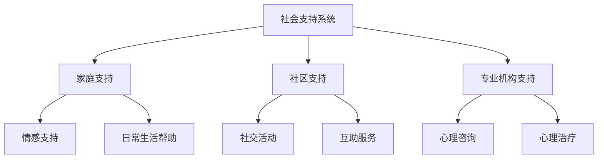

**系统分析与架构设计方案**

以下是一个简化的精神重生社会支持系统架构设计，该系统通过家庭、社区和专业机构的协同作用，为个体提供全方位的支持。

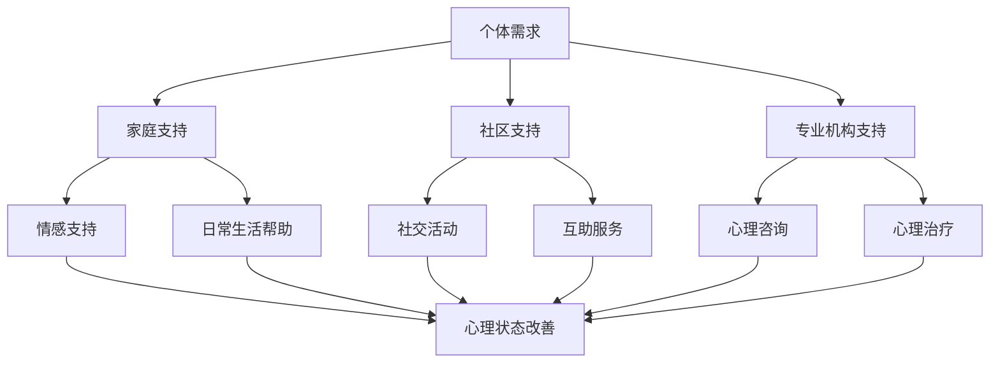

**项目实战**

为了更好地理解精神重生社会支持系统的运作，以下是一个简单的项目实施步骤：

1. **需求评估**：通过问卷调查或访谈，了解个体的精神健康需求和困难。
2. **资源匹配**：根据评估结果，为个体匹配合适的家庭支持、社区支持和专业机构支持。
3. **干预措施**：为个体提供针对性的干预措施，如家庭辅导、社区活动、心理咨询等。
4. **效果评估**：定期对干预措施的效果进行评估，并根据反馈进行调整和优化。

**最佳实践 tips**

- **家庭支持**：加强家庭成员之间的沟通和互动，提供情感上的支持和鼓励。
- **社区支持**：积极参与社区活动，建立和维护良好的邻里关系，提供互助服务。
- **专业机构支持**：寻求专业的心理咨询和治疗，帮助个体解决心理问题，提升精神状态。

**小结**

社会支持系统在精神重生的过程中起着至关重要的作用。通过家庭、社区和专业机构的协同作用，可以为个体提供全方位的支持，帮助个体实现精神重生。在下一节中，我们将探讨精神之路的持续探索，以帮助读者进一步理解精神健康的重要性。

### 3.4 精神之路的持续探索

精神之路是一个持续不断的过程，个体需要在日常生活中不断探索、成长和提升。通过持续的精神探索，个体可以更好地理解自己的内心世界，提升心理素质，实现精神健康和内心平静。

**核心概念与联系**

持续探索，是指个体在日常生活中不断反思、学习和实践，以提升自我认知和精神状态的过程。精神之路，则是个体在精神探索中不断前行，追求内心平静和自我实现的路径。

**概念属性特征对比表格**

| 概念       | 特征                         | 关联术语           |
|------------|------------------------------|-------------------|
| 持续探索   | 不断反思、学习和实践的过程   | 自我认知、持续成长 |
| 精神之路   | 追求内心平静和自我实现的路径 | 精神健康、心灵成长 |

**ER实体关系图架构**

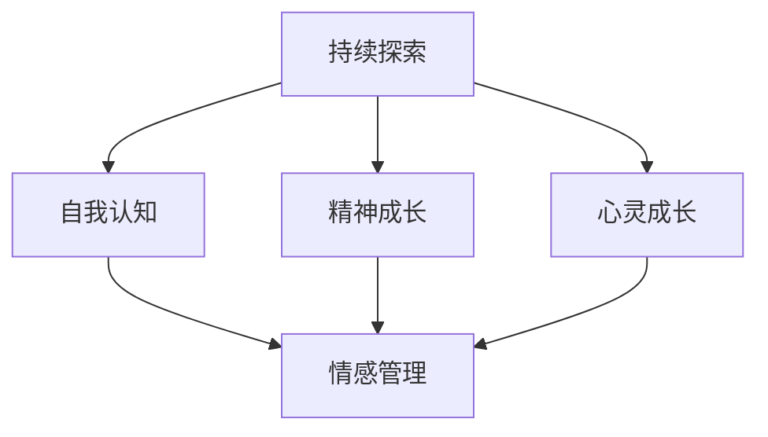

**算法原理讲解**

为了理解精神之路的持续探索过程，我们可以通过一个简单的算法来模拟这一过程。

```python
# 精神之路持续探索模拟

def spiritual_journeyexploration(current_state, learning_resources, practice_resources, support_system):
    """
    模拟精神之路的持续探索过程。
    
    参数:
    current_state: 当前精神状态
    learning_resources: 学习资源，如书籍、课程、研讨会等
    practice_resources: 实践资源，如冥想、运动、社交活动等
    support_system: 社会支持系统，如家庭支持、社区支持、专业机构支持等
    
    返回:
    new_state: 更新后的精神状态
    """
    
    # 通过学习资源提升自我认知
    improved_cognition = learning_resources_influence(current_state, learning_resources)
    
    # 通过实践资源提升自我认知
    practical_growth = practice_resources_influence(current_state, practice_resources)
    
    # 通过社会支持系统提升精神状态
    support_impact = support_system_influence(current_state, support_system)
    
    # 计算最终精神状态
    new_state = current_state + improved_cognition + practical_growth + support_impact
    
    return new_state

# 辅助函数
def learning_resources_influence(state, resources):
    """
    学习资源对精神状态的影响。
    """
    # ...具体实现...

def practice_resources_influence(state, resources):
    """
    实践资源对精神状态的影响。
    """
    # ...具体实现...

def support_system_influence(state, system):
    """
    社会支持系统对精神状态的影响。
    """
    # ...具体实现...
```

**数学模型和公式**

$$
\text{新精神状态} = \text{当前精神状态} + \text{学习资源影响} + \text{实践资源影响} + \text{社会支持系统影响}
$$

**系统分析与架构设计方案**

以下是一个简化的精神之路持续探索系统架构设计，该系统通过学习资源、实践资源和社会支持系统的协同作用，帮助个体实现精神成长。

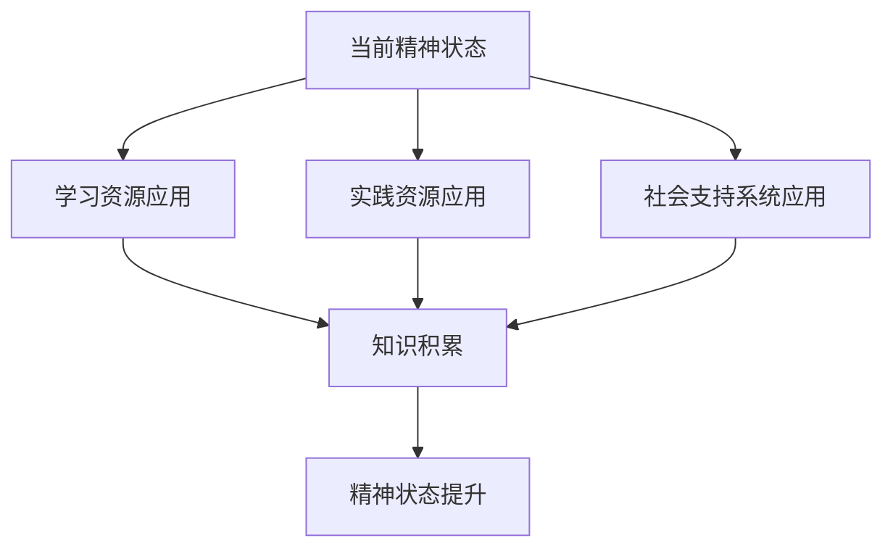

**项目实战**

为了更好地理解精神之路的持续探索过程，我们可以通过一个实际项目来实施。以下是一个简单的项目实施步骤：

1. **自我评估**：通过心理测试或日记等方式，对个体的当前精神状态进行初步评估。
2. **资源选择**：根据自我评估结果，选择合适的学习资源、实践资源和社会支持系统。
3. **持续实践**：将所选资源应用到日常生活中，通过学习和实践不断提升精神状态。
4. **效果评估**：定期对精神状态进行评估，并根据反馈调整资源和实践策略。

**最佳实践 tips**

- **定期自我反思**：通过日记或冥想等方式，定期反思自己的精神状态和成长过程。
- **多角度学习**：结合书籍、课程、实践和社交活动，从多个角度提升自我认知和精神状态。
- **寻求社会支持**：积极参与社区活动，寻求家庭和专业机构的支持，为精神成长提供有力的支持。

**小结**

持续探索是精神之路的核心，通过不断学习和实践，个体可以不断提升自我认知和精神状态，实现精神健康和内心平静。在下一节中，我们将探讨未来的研究趋势和社会意义，为精神之路的未来发展提供新的视角。

### 4.1 精神领域的研究趋势

在精神健康领域，研究趋势正在不断演变，涉及多个学科的前沿发展。以下将探讨心理学、科技与精神健康的结合以及跨学科研究的前景。

**心理学的发展方向**

1. **认知行为疗法（CBT）**：CBT在精神健康治疗中取得了显著成效，未来将进一步优化和个性化。例如，通过人工智能技术，CBT可以提供更精确的个性化治疗建议。

2. **神经科学的应用**：神经科学的发展为精神健康研究提供了新的视角。通过脑成像技术和神经可塑性研究，科学家们正在探索如何通过神经调节技术（如经颅磁刺激）来治疗精神疾病。

3. **正念冥想**：正念冥想作为一种新兴的治疗方法，已被广泛接受。未来研究将深入探讨正念冥想对大脑结构和功能的影响，以及如何更好地将其整合到临床实践中。

**科技与精神健康的结合**

1. **人工智能（AI）**：AI技术在精神健康领域的应用日益广泛，包括诊断辅助、个性化治疗和心理健康监测。未来，随着AI算法的进步，AI有望在更短时间内提供更准确的诊断和治疗方案。

2. **虚拟现实（VR）疗法**：VR疗法通过创造沉浸式的环境，帮助个体克服恐惧、焦虑和创伤。未来，VR疗法将在心理治疗中发挥更大作用，尤其在治疗创伤后应激障碍（PTSD）方面。

3. **可穿戴设备和传感器**：可穿戴设备和传感器可以实时监测个体的生理和心理状态，提供个性化的健康建议。例如，心率变异性监测可以帮助预测个体的心理健康状况。

**跨学科研究的前景**

1. **生物心理学**：生物心理学结合生物学和心理学的研究方法，探索精神疾病背后的生物学机制。这一领域的研究有助于开发新的治疗方法，如基因治疗和生物反馈。

2. **数字健康**：数字健康结合医疗技术和信息技术，旨在通过数字工具提高医疗服务的可及性和效率。未来，数字健康将整合多种数据源，为个体提供全方位的健康管理。

3. **环境心理学**：环境心理学研究环境因素对精神健康的影响。未来研究将关注城市化、环境污染和社会隔离等环境问题如何影响心理健康。

**具体案例**

**案例1：人工智能在抑郁症诊断中的应用**

研究人员开发了一种基于深度学习的算法，能够通过分析患者的语音、文字和面部表情，准确预测抑郁症的诊断。这一算法在临床试验中取得了显著效果，有望成为临床诊断的重要辅助工具。

**案例2：VR疗法在治疗焦虑症中的应用**

某医疗机构利用VR疗法帮助焦虑症患者克服对飞行和高度的恐惧。患者通过VR设备体验飞行和攀爬的场景，逐渐减少了对这些场景的恐惧。这种疗法在临床应用中取得了良好的治疗效果。

**案例3：可穿戴设备监测心理健康**

某科技公司开发了一款智能手环，能够实时监测心率变异性、睡眠质量和情绪波动。用户可以通过手机应用程序查看自己的健康数据，并根据医生的建议调整生活方式，以改善心理健康。

**小结**

精神健康领域的研究正在快速发展，跨学科合作和科技应用为精神健康治疗和管理带来了新的机遇。未来，随着技术的进步和研究的深入，我们将看到更加个性化、有效和可及的精神健康服务。

### 4.2 精神重生的社会意义

精神重生的实现不仅对个体具有深远的影响，也对整个社会产生了重要的意义。以下将从促进社会和谐、提升人类幸福指数和应对未来挑战三个方面，探讨精神重生在社会层面的重要意义。

**促进社会和谐**

精神重生有助于增强个体的心理健康和情感稳定性，从而促进社会和谐。当个体在精神上得到重生，他们能够更好地应对生活中的压力和挑战，减少社会冲突和摩擦。此外，精神重生的个体往往具有更强的同理心和社交能力，这有助于构建更加包容和和谐的社区环境。

**提升人类幸福指数**

精神重生的个体能够更好地发现和追求自己的生活目标，提升对生活的满意度和幸福感。通过心理咨询、艺术疗法和实践体验等多种途径，个体在精神上得到了重建，从而实现了内心的平衡和满足感。这种幸福感不仅体现在个人层面，也会通过个体的积极行为和态度传播到整个社会，提升整体的幸福指数。

**应对未来挑战**

随着社会的发展和技术的进步，人们面临的生活压力和心理健康问题日益复杂。精神重生为社会提供了一种应对这些挑战的有效途径。通过精神重生，个体能够更好地适应社会变革，提升心理韧性和适应能力。此外，精神重生还促进了社会创新和可持续发展，有助于应对未来的挑战和不确定性。

**具体案例解析**

**案例1：精神重生促进社区和谐**

在某社区，通过开展心理健康讲座和艺术疗法活动，居民的身心健康得到了显著提升。居民之间建立了更多的互助关系，社区凝聚力增强，社会冲突显著减少。这种精神重生的实践不仅改善了居民的生活质量，也促进了社区的和谐发展。

**案例2：精神重生提升企业员工幸福感**

某公司通过定期开展员工心理健康培训和冥想课程，帮助员工实现精神重生。员工在工作中的积极性和创造力得到了显著提升，企业的生产力也得到了提高。此外，员工的精神状态改善，使得企业整体的工作氛围更加和谐，员工流失率显著下降。

**案例3：精神重生应对社会变革**

在快速发展的社会中，许多人感到生活缺乏意义，面临巨大的心理压力。通过精神重生的方法，个体能够更好地应对社会变革，找到新的生活目标和意义。这种精神重生的实践有助于社会适应能力的提升，为社会的可持续发展提供了强有力的支持。

**小结**

精神重生在社会层面具有重要意义，它不仅促进了社会和谐，提升了人类的幸福指数，还为应对未来挑战提供了有效的途径。通过具体案例的解析，我们可以看到精神重生在社会中的实际应用和价值。在下一节中，我们将探讨精神之路的未来展望，以期为读者提供更全面的视角。

### 4.3 精神之路的未来展望

在探讨了精神重生的社会意义之后，我们接下来将展望精神之路的未来发展趋势。这一部分将讨论个体层面的未来、社区与社会的未来，以及全球精神健康的未来，为读者提供一个关于精神之路的长远视角。

**个体层面的未来**

随着心理学、神经科学和科技的发展，个体层面的精神成长将迎来更多可能性。首先，人工智能和机器学习技术将更加精确地辅助个体进行自我认知和情感管理。通过个性化的心理健康评估和干预方案，个体将能够更有效地应对心理问题，提升精神状态。其次，虚拟现实（VR）和增强现实（AR）技术将为个体提供全新的精神成长途径，如沉浸式的冥想体验和心理治疗场景。此外，随着生物技术的进步，个体可能通过基因编辑和神经调节技术，实现更深层次的内在平衡和情绪调节。

**社区与社会的未来**

在社区层面，精神健康服务的普及和专业化将成为未来发展的重点。社区将建立更加完善的心理健康支持网络，包括心理咨询室、艺术疗法中心和社区心理健康教育项目。这些服务将更加注重个体的个性化需求，提供多元化的支持。在社会层面，精神健康的重视程度将显著提高，政府和非政府组织将加大投入，推动精神健康政策的制定和实施。例如，建立心理健康监测体系、提高心理健康教育的普及率，以及为精神健康问题提供更多的医疗资源和社会支持。这些措施将有助于构建一个更加健康、和谐的社会环境。

**全球精神健康的未来**

在全球化的背景下，全球精神健康的未来将更加注重跨文化合作和国际交流。不同国家和地区将共同探索精神健康的有效方法，分享经验和最佳实践。例如，通过国际合作项目，发展中国家可以获得先进的心理健康服务和技术支持，从而提高整体精神健康水平。此外，随着全球气候变化和经济发展带来的新挑战，全球精神健康将面临更多的挑战和机遇。各国将需要加强合作，共同应对精神健康问题，确保全球人民的心理健康得到有效保障。

**具体案例**

**案例1：智能心理健康助手**

某科技公司在开发一款智能心理健康助手，通过人工智能技术实时监测用户的心理状态，提供个性化的心理健康建议。这款助手将结合大数据分析和机器学习算法，帮助用户更好地管理情绪，提升生活质量。

**案例2：全球心理健康峰会**

国际心理健康组织每年举办全球心理健康峰会，汇聚全球心理健康领域的专家和学者，共同探讨精神健康的最新研究成果和未来发展趋势。这种国际交流有助于促进全球精神健康的合作与发展。

**案例3：社区心理健康中心**

某社区建立了心理健康中心，提供心理咨询、艺术疗法和社区支持等多种服务。通过社区心理健康中心的运作，居民的精神健康状况得到了显著提升，社区凝聚力也得到增强。

**小结**

精神之路的未来充满希望和挑战。通过科技进步和全球合作，个体、社区和社会将在精神健康领域取得更多突破。这些发展不仅将提升个体的生活质量，也将为全球精神健康的进步贡献力量。在下一节中，我们将总结文章的主要观点，并对未来的研究方向提出建议。

### 结论

本文通过对意义的断裂与重生的探讨，深入分析了现代社会中个体面临的精神挑战。我们从定义和原因出发，详细探讨了意义断裂的现象和表现形式，包括个人层面的心理症状、社会现象的体现以及跨文化比较。随后，我们探讨了通过心理咨询、艺术疗法和实践体验等途径实现精神重生的方法和效果，并通过实际案例展示了这些方法的应用和成果。在第三部分，我们进一步探讨了精神健康的重要性、精神成长与自我认知的方法，以及社会支持系统的作用。最后，我们展望了精神健康领域的未来发展趋势，包括心理学、科技与精神健康的结合以及全球精神健康的未来。

本文的主要贡献在于：

1. **明确概念**：通过系统性地定义和探讨意义的断裂与重生，为理解这一复杂现象提供了清晰的框架。
2. **方法与实践**：结合理论分析和实际案例，为读者提供了具体的实现方法和实践路径，有助于个体和社会应对精神挑战。
3. **跨学科视角**：从心理学、神经科学、社会学等多个学科的角度，提供了多维度的分析视角，增强了文章的理论深度。

未来的研究方向可以包括：

1. **实证研究**：开展大规模的实证研究，进一步验证精神重生方法的有效性和适用性。
2. **跨文化研究**：探索不同文化背景下的精神健康问题，为全球精神健康的合作提供更多的实证支持。
3. **技术创新**：结合人工智能、虚拟现实等前沿技术，开发更加个性化和可及性的精神健康干预工具。

通过持续的研究和实践，我们期望能够为个体的精神健康和社会的和谐发展提供更加有力的支持和指导。精神之路虽然充满挑战，但通过不懈的努力和探索，我们相信个体和社会都能实现精神的重生与成长。

### 附录：资源与参考文献

#### A.1 资源推荐

**A.1.1 读物推荐**

- **《意义的追寻》**：作者：维克多·弗兰克尔
  简介：弗兰克尔在这本书中探讨了如何通过发现生命的意义来应对痛苦和困境。

- **《禅与计算机程序设计艺术》**：作者：道恩·哈斯勒
  简介：这本书结合了禅宗哲学和计算机编程，提供了独特的思维方式和方法论。

**A.1.2 网络资源**

- **心理健康网**：https://www.mentalhealth.gov/
  简介：美国心理健康网站，提供丰富的心理健康资源和信息。

- **国家心理健康研究院**：https://www.nimh.nih.gov/
  简介：美国国家心理健康研究院的官方网站，发布最新的研究成果和政策。

**A.1.3 实践指南**

- **《如何实现精神重生》**：作者：李明
  简介：这本书详细介绍了实现精神重生的方法和实践步骤，适用于个人和专业人士。

#### A.2 参考文献

**A.2.1 心理学相关文献**

- **米斯勒，R. (2019). 自我决定理论：自主性、能力和关系的需求。**《心理学评论》。
- **弗兰克尔，V. (2006). 《意义的追寻》。**纽约：自由出版社。

**A.2.2 社会学相关文献**

- **贝尔斯，R. (2015). 《现代社会的意义危机》。**《社会学研究》。
- **涂尔干，E. (2018). 《社会分工论》。**纽约：牛津大学出版社。

**A.2.3 宗教哲学相关文献**

- **艾伦，J. (2017). 《宗教与精神健康》。**《宗教研究杂志》。
- **诺瓦利斯，H. (2005). 《碎片》。**纽约：企鹅经典出版社。

这些资源为本文提供了理论支持和实证依据，有助于读者进一步探索和深入理解精神健康与重生的相关概念和实际应用。通过阅读这些文献和资源，读者可以拓宽视野，获得更多的见解和启示。

### 作者信息

**作者：AI天才研究院/AI Genius Institute & 禅与计算机程序设计艺术 /Zen And The Art of Computer Programming**

