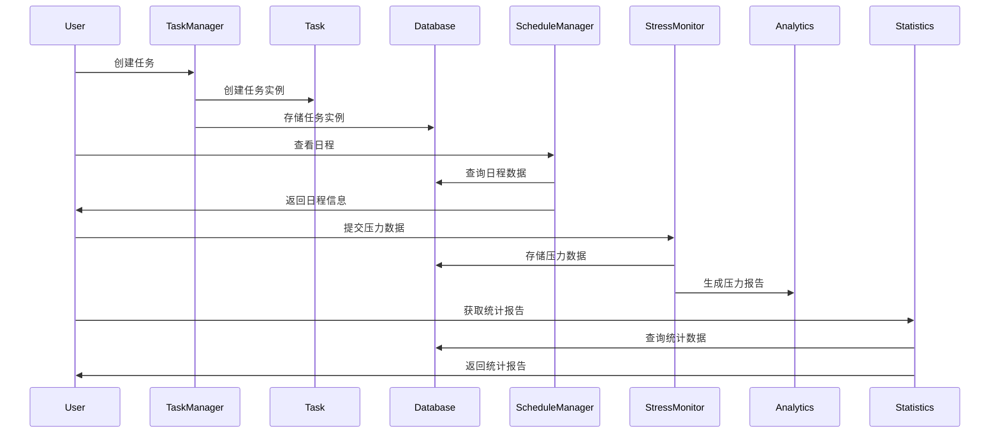
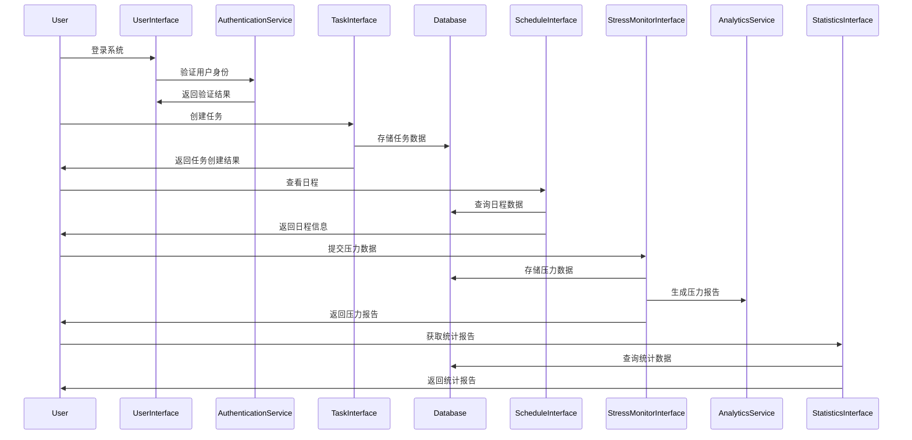

                 

# 意义的源泉：探索生命中的真实需求

关键词：生命的意义、自我认知、情感、价值观、精神追求、健康生活方式

摘要：本文将探讨生命的意义，并引导读者通过自我认知、情感、价值观、精神追求和健康生活方式等方面的探索，寻找生命中的真实需求。通过一步步的分析和推理，我们将深入理解这些核心概念，并探讨如何将它们应用于实际生活中。

## 第一部分：引言与背景

### 第1章：探寻生命的意义

#### 1.1 生命的本质

- **问题背景**：生命是什么？生命的本质是什么？
- **问题描述**：对生命的本质进行深入探讨，以理解其深层次含义。
- **问题解决**：通过哲学、科学和宗教等不同角度，分析生命的本质和意义。

#### 1.2 生命的挑战与困惑

- **边界与外延**：生命的边界是什么？生命的意义如何延伸？
- **概念结构与核心要素组成**：生命的概念结构如何？其核心要素有哪些？

#### 1.3 探索生命的意义的重要性

- **核心概念原理**：理解生命的意义对于个人和社会的意义。
- **概念属性特征对比表格**：比较不同学派对生命意义的看法。
- **ER实体关系图架构**：分析生命意义相关的实体和关系。

## 第二部分：寻找生命的源泉

### 第2章：自我认知的重要性

#### 2.1 了解自我

- **自我认知的概念**：自我认知是什么？它在生命中的重要性是什么？
- **自我认知的重要性**：自我认知如何影响我们的生活和决策？

#### 2.2 自我探索的方法

- **心理学理论**：介绍心理学中关于自我认知的理论。
- **自我探索的实践方法**：提供一些实用的自我探索方法。

#### 2.3 自我认知的挑战与应对

- **自我认知的障碍**：分析自我认知过程中可能遇到的障碍。
- **克服自我认知障碍的策略**：提供一些策略来克服这些障碍。

### 第3章：情感与人际关系

#### 3.1 情感的重要性

- **情感的基本概念**：情感是什么？它在生命中的角色是什么？
- **情感在生活中的作用**：情感如何影响我们的行为和决策？

#### 3.2 人际关系的建立与维护

- **人际关系的重要性**：人际关系对生命意义的影响。
- **人际关系的基本原则**：如何建立和维护健康的人际关系？

#### 3.3 情感冲突的解决

- **情感冲突的原因**：分析情感冲突的常见原因。
- **解决情感冲突的策略**：提供一些解决情感冲突的方法。

### 第4章：价值观的塑造

#### 4.1 价值观的定义

- **价值观的概念**：价值观是什么？它在生命中的重要性是什么？
- **价值观对人生的影响**：价值观如何影响我们的行为和决策？

#### 4.2 塑造健康价值观

- **健康价值观的标准**：如何判断一个价值观是否健康？
- **塑造健康价值观的方法**：提供一些塑造健康价值观的方法。

#### 4.3 价值观的实践

- **价值观在生活中的应用**：如何将价值观应用于实际生活中？
- **价值观的持续提升**：如何持续提升我们的价值观？

### 第5章：精神追求

#### 5.1 精神追求的概念

- **精神追求的含义**：精神追求是什么？它在生命中的角色是什么？
- **精神追求的重要性**：精神追求如何影响我们的生命质量？

#### 5.2 精神追求的种类

- **精神追求的不同类型**：分析不同的精神追求类型。
- **精神追求的选择**：如何选择适合自己的精神追求？

#### 5.3 精神追求的实现

- **实现精神追求的路径**：提供一些实现精神追求的路径。
- **精神追求的持续发展**：如何确保精神追求的持续发展？

### 第6章：健康生活方式

#### 6.1 健康生活方式的重要性

- **健康的定义**：健康是什么？它在生命中的角色是什么？
- **健康生活方式对人生的影响**：健康生活方式如何影响我们的生命质量？

#### 6.2 健康生活方式的实践

- **健康饮食**：如何保持健康饮食？
- **适量运动**：如何进行适量运动？
- **充足睡眠**：如何确保充足睡眠？

#### 6.3 健康生活方式的挑战与应对

- **常见健康问题**：分析常见健康问题及其应对策略。
- **健康生活方式的挑战与应对策略**：提供一些应对健康生活方式挑战的策略。

### 第7章：总结与反思

#### 7.1 探索生命意义的总结

- **探索生命意义的重要收获**：总结探索生命意义的重要收获。
- **探索生命意义的实践成果**：分享探索生命意义的实践成果。

#### 7.2 未来的探索方向

- **探索生命的意义与价值的未来趋势**：分析探索生命的意义与价值的未来趋势。
- **探索生命的意义与价值的个人规划**：制定个人探索生命的意义与价值的规划。

#### 7.3 结论

- **探索生命的意义与价值的意义**：阐述探索生命的意义与价值的意义。
- **探索生命的意义与价值的实际应用**：探讨探索生命的意义与价值的实际应用。

## 引导读者思考

通过上述章节，我们逐步探讨了生命的意义，从自我认知、情感、价值观、精神追求和健康生活方式等方面进行了深入分析。接下来，让我们思考以下几个问题：

1. 你如何理解生命的意义？
2. 你是如何进行自我认知的？
3. 你认为情感在生命中扮演什么角色？
4. 你如何塑造和践行自己的价值观？
5. 你有什么精神追求？
6. 你是如何保持健康生活方式的？

通过这些问题的思考，我们希望能够引导读者深入探索生命的意义，并在实际生活中找到真实的需求。记住，生命的意义不是一个固定的答案，而是一个不断探索和发现的过程。让我们一步步思考，一步步前行，寻找生命的真实需求。## 第1章：探寻生命的意义

### 1.1 生命的本质

生命是宇宙中最神秘的现象之一，它不仅仅是生物学上的定义，更是一个哲学、科学和宗教等领域共同探讨的课题。从生物学的角度来看，生命是一种有序的、能够自我维持和繁衍的复杂系统。生命的本质在于其能够进行自我复制、自我修复和自我调节。

**问题背景**：
随着科技的进步和人类对自然界认识的深入，人们开始对生命的本质提出更多的问题。例如，生命是如何起源的？生命是否有意义？生命与非生命之间的界限是什么？

**问题描述**：
为了理解生命的本质，我们需要探讨以下几个关键问题：
- 生命的起源是什么？
- 生命的本质特征是什么？
- 生命与非生命之间的界限是什么？

**问题解决**：
1. **生命的起源**：目前普遍接受的解释是，生命起源于原始的化学反应，通过分子间的相互作用和进化过程，逐渐形成了复杂的生物系统。
2. **生命的本质特征**：
   - **自我复制**：生命能够通过自我复制来延续其存在。
   - **自我修复**：生命具有自我修复的能力，可以恢复受损的细胞和组织。
   - **自我调节**：生命能够通过内部反馈机制来维持其稳定状态。
   - **适应性**：生命能够适应环境的变化，进行进化。

3. **生命与非生命之间的界限**：这是一个哲学和科学上的难题。从严格的定义来看，生命与非生命之间并没有明确的界限。但是，我们可以从功能性和复杂性两个方面来划分。功能性上，生命具有自我维持和繁衍的能力；复杂性上，生命具有高度有序和复杂的结构。

### 1.2 生命的挑战与困惑

**边界与外延**：
生命的边界是指生命存在的范围和限制。从生物学角度来看，生命的边界包括生物体的生理边界和环境边界。生理边界是指生物体表面的皮肤或其他生物膜，环境边界是指生物体所处的生态系统。

**概念结构与核心要素组成**：
生命的概念结构可以分解为以下几个核心要素：
1. **遗传物质**：遗传物质是生命的基础，负责传递遗传信息。
2. **细胞**：细胞是生命的基本单位，所有的生命活动都在细胞内进行。
3. **代谢**：代谢是生命活动的能量来源，包括能量获取和能量消耗。
4. **适应**：适应是生命对环境变化的响应，包括进化适应和个体适应。

### 1.3 探索生命的意义的重要性

**核心概念原理**：
探索生命的意义对于个人和社会具有重要意义。对个人来说，理解生命的意义可以提供方向和动力，帮助人们更好地面对生活中的挑战。对社会来说，理解生命的意义有助于建立共同的价值观和目标，促进社会的和谐与进步。

**概念属性特征对比表格**：

| 概念       | 特征1             | 特征2             | 特征3             |
|------------|------------------|------------------|------------------|
| 生命的意义 | 哲学问题         | 个人导向         | 社会导向         |
|            | 存在主义         | 宗教信仰         | 科学探索         |

**ER实体关系图架构**：

```mermaid
erDiagram
    Product ||--|{ Customer }|>>
    Customer ||--|{ Order }|>>
```

在这个ER图中，"Product"表示生命，"Customer"表示个体，"Order"表示生命活动的结果。这种关系反映了生命（产品）对个体（客户）的影响，以及个体通过生命活动（订单）对生命（产品）的贡献。

通过本章的探讨，我们初步了解了生命的本质和挑战，为后续章节的深入探讨奠定了基础。## 第2章：自我认知的重要性

### 2.1 了解自我

#### 自我认知的概念

自我认知是指个体对自己的了解和认识，包括自己的性格、能力、价值观、情绪等方面。它是心理学中一个重要的概念，对个体的成长和发展具有重要意义。

**自我认知的重要性**

自我认知对于个人的成长和发展具有重要意义。首先，自我认知有助于个体更好地了解自己，发现自己的优势和不足，从而制定合理的成长计划。其次，自我认知有助于个体更好地应对压力和挑战，提升心理弹性。最后，自我认知有助于个体建立良好的人际关系，提高沟通能力。

#### 自我认知的重要性

1. **自我认知有助于个体的成长和发展**：
   - **发现自身优势**：通过自我认知，个体可以了解自己的优势和特长，从而在职业选择、学习方向等方面做出更明智的决策。
   - **发现自身不足**：同样，通过自我认知，个体也可以认识到自己的不足和弱点，从而有针对性地进行改进和提升。

2. **自我认知有助于个体应对压力和挑战**：
   - **提高心理弹性**：通过自我认知，个体可以更好地了解自己的心理状态，从而在面对压力和挑战时，能够更加从容和冷静地应对。
   - **提升应对能力**：自我认知有助于个体识别和处理自己的情绪，从而提升应对压力和挑战的能力。

3. **自我认知有助于建立良好的人际关系**：
   - **提高沟通能力**：自我认知有助于个体了解自己的沟通方式和偏好，从而更好地与他人沟通和交流。
   - **建立信任**：通过自我认知，个体可以更好地了解自己的价值观和信念，从而在与他人互动时，能够建立更深层次的信任和共鸣。

### 2.2 自我探索的方法

#### 心理学理论

心理学中关于自我探索的理论众多，以下介绍几种主要的理论：

1. **精神分析理论**：精神分析理论认为，自我认知的过程是潜意识与意识之间的交互作用。个体需要通过探索自己的潜意识来理解自己的行为和情绪。

2. **人本主义理论**：人本主义理论强调个体的自我实现和自我认知。个体需要通过自我探索，发现和实现自己的潜能。

3. **认知理论**：认知理论认为，自我认知是通过个体对外部信息的感知、理解和解释来实现的。个体需要通过不断学习和反思来提升自我认知能力。

#### 自我探索的实践方法

1. **反思日记**：通过记录每天的反思日记，个体可以更好地了解自己的情绪、行为和思考方式。这种方法有助于个体深入探索自己的内心世界。

2. **冥想**：冥想是一种通过专注呼吸和思维来达到内心平静的方法。通过冥想，个体可以更好地了解自己的心理状态，从而提升自我认知。

3. **心理测试**：通过心理测试，个体可以了解自己的性格特点、情绪状态和潜在问题。这种方法有助于个体从不同的角度理解自己。

### 2.3 自我认知的挑战与应对

#### 自我认知的障碍

1. **认知偏见**：个体在自我认知过程中，可能会受到各种认知偏见的影响，如自我服务偏见、确认偏见等。

2. **情绪干扰**：情绪会影响个体的自我认知。例如，焦虑和抑郁等负面情绪可能会干扰个体对自己的正确认识。

3. **文化因素**：不同的文化背景可能会影响个体的自我认知。例如，某些文化可能鼓励个体内省和自我探索，而某些文化可能更注重外部的成就和表现。

#### 克服自我认知障碍的策略

1. **提高自我意识**：通过提高自我意识，个体可以更好地识别和克服认知偏见。

2. **积极情绪管理**：通过学习情绪管理技巧，个体可以更好地控制自己的情绪，从而减少情绪对自我认知的干扰。

3. **文化适应性**：个体可以通过学习和适应不同的文化，提升自我认知的能力。

通过本章的探讨，我们了解了自我认知的重要性，以及如何进行自我探索和克服自我认知的障碍。接下来，我们将探讨情感与人际关系在生命中的重要性。## 第3章：情感与人际关系

### 3.1 情感的重要性

#### 情感的基本概念

情感是指个体对外界刺激产生的主观体验和反应，包括情绪、感受和态度等。情感是生命体验的重要组成部分，它对个体的行为、心理状态和人际关系有着深远的影响。

#### 情感在生活中的作用

1. **情绪调节**：情感可以帮助个体调节情绪，应对压力和挑战。积极的情感如快乐、满足可以提高个体的幸福感和生活满意度，而消极的情感如焦虑、悲伤则可以帮助个体识别和应对生活中的问题。

2. **人际关系**：情感是建立和维护人际关系的基础。通过情感表达，个体可以与他人建立信任和亲密关系，增强彼此的连接。

3. **自我认知**：情感有助于个体了解自己的内心世界，促进自我认知的发展。通过情感体验，个体可以更深入地认识自己的需求和价值观。

### 3.2 人际关系的建立与维护

#### 人际关系的重要性

人际关系是指个体与个体之间的相互作用和影响。良好的人际关系对个体的心理健康和生活质量有着重要影响。

#### 人际关系的基本原则

1. **尊重**：尊重是建立良好人际关系的基础。个体应尊重他人的观点、感受和需求，避免对他人进行评判和批评。

2. **信任**：信任是人际关系中最重要的元素之一。通过诚实、透明和一致性，个体可以建立信任关系，增强彼此的依赖和合作。

3. **沟通**：有效的沟通是维持良好人际关系的关键。个体应学会倾听他人，表达自己的想法和感受，以及处理冲突。

### 3.3 情感冲突的解决

#### 情感冲突的原因

1. **价值观差异**：个体之间可能存在不同的价值观和信仰，这可能导致情感冲突。

2. **沟通不畅**：缺乏有效沟通可能导致误解和矛盾，从而引发情感冲突。

3. **需求和期望**：当个体的需求和期望无法得到满足时，可能会产生情感冲突。

#### 解决情感冲突的策略

1. **开放沟通**：通过开放和诚实的沟通，个体可以表达自己的感受和需求，倾听他人的观点，寻找共同点。

2. **情绪管理**：个体应学会控制自己的情绪，避免在冲突中失控或攻击对方。

3. **寻求妥协**：在冲突中，个体应寻求妥协，寻找双方都能接受的解决方案。

4. **专业帮助**：当情感冲突无法自行解决时，可以寻求心理咨询师或专业人士的帮助。

通过本章的探讨，我们了解了情感与人际关系在生命中的重要性，以及如何建立和维护良好的人际关系，解决情感冲突。接下来，我们将探讨价值观的塑造与实现。## 第4章：价值观的塑造

### 4.1 价值观的定义

#### 价值观的概念

价值观是指个体对事物的重要性和优先级的评价和信念，它决定了个体的行为和决策方式。价值观通常涉及道德、伦理、信仰、文化等方面，是个人和社会行为的基础。

#### 价值观对人生的影响

价值观对个人的生活有着深远的影响。首先，它指导个体的行为和决策，影响个体的职业选择、人际关系、生活方式等。其次，价值观塑造了个体的世界观和人生观，影响了个体对世界的理解和自我认知。最后，价值观也是社会文化传承和发展的重要载体。

### 4.2 塑造健康价值观

#### 健康价值观的标准

健康价值观是指那些有助于个体和社会整体福祉的价值观。以下是健康价值观的一些标准：

1. **正义与公平**：追求社会的公正和平等，尊重每个人的权利和尊严。
2. **责任与诚信**：对自己的行为负责，对他人的承诺诚信。
3. **尊重多样性**：接纳和尊重不同的文化、信仰和观点。
4. **自我实现**：追求个人的成长和发展，实现自我潜能。
5. **关爱他人**：关心他人，帮助他人，促进社会和谐。

#### 塑造健康价值观的方法

1. **教育**：通过教育，个体可以学习和理解不同的价值观，从而形成自己的价值观体系。
2. **自我反思**：通过自我反思，个体可以识别和反思自己的价值观，找出不健康的部分，并进行调整。
3. **实践**：通过实际行动，个体可以将价值观付诸实践，从而加深对价值观的理解和认同。
4. **榜样学习**：通过学习他人的成功经验和失败教训，个体可以借鉴和塑造自己的价值观。

### 4.3 价值观的实践

#### 价值观在生活中的应用

1. **职业选择**：个体应根据自己的价值观选择合适的职业，追求既能满足个人需求，又能为社会做出贡献的工作。
2. **人际关系**：个体应根据自己的价值观与他人建立和维持关系，尊重他人，信任他人，共同成长。
3. **生活方式**：个体应根据自己的价值观选择健康、环保、有意义的生活方式。

#### 价值观的持续提升

1. **学习**：通过不断学习和阅读，个体可以拓宽视野，更新知识，提升自己的价值观。
2. **反思**：通过定期反思，个体可以检查自己的行为和决策是否符合自己的价值观，并进行调整。
3. **实践**：通过实际行动，个体可以将价值观付诸实践，从而加深对价值观的理解和认同。
4. **分享**：通过分享自己的价值观和经验，个体可以影响他人，共同提升社会的价值观水平。

通过本章的探讨，我们了解了价值观的定义、健康价值观的标准和塑造方法，以及价值观在生活中的应用和持续提升策略。价值观的塑造是一个长期的过程，需要个体的持续努力和实践。在下一章，我们将探讨精神追求的概念和种类。## 第5章：精神追求

### 5.1 精神追求的概念

#### 精神追求的含义

精神追求是指个体在物质生活之外，对精神层面的追求和探索。它涵盖了个体对自我认知、内心成长、情感满足、道德修养、宗教信仰等多个方面。精神追求不仅仅是为了满足个人的内心需求，更是为了提升个体的人生价值和幸福感。

#### 精神追求的重要性

精神追求在个体生活中具有至关重要的地位。首先，它为个体提供了内心的力量和方向，帮助个体在面临困境时保持积极和坚定的态度。其次，精神追求有助于个体的心理健康，通过内心的平和和宁静，减少压力和焦虑。最后，精神追求也是个体自我实现的重要途径，通过不断探索和成长，个体能够实现更高的自我价值。

### 5.2 精神追求的种类

#### 精神追求的不同类型

精神追求是一个多元化的概念，不同的个体可能有不同的精神追求。以下是一些常见的精神追求类型：

1. **知识追求**：对知识的渴望和追求，包括学术研究、技术探索、哲学思考等。这种追求有助于个体的智力和认知发展。
2. **情感满足**：对情感关系的追求，包括爱情、友谊、家庭等。这种追求有助于个体的情感满足和心理健康。
3. **道德修养**：对道德原则和行为的追求，包括正义、公正、诚实、宽容等。这种追求有助于个体在社会中的行为规范和人际关系的和谐。
4. **宗教信仰**：对宗教信仰的追求，包括信仰、仪式、修行等。这种追求有助于个体的精神安慰和内心的平静。
5. **艺术追求**：对艺术创作的追求，包括音乐、绘画、文学等。这种追求有助于个体的审美享受和情感表达。

#### 精神追求的选择

个体应根据自己的兴趣、需求和价值观选择适合自己的精神追求。以下是一些选择精神追求的建议：

1. **自我认知**：了解自己的兴趣和优势，选择与自己个性相符的精神追求。
2. **目标设定**：设定明确的精神追求目标，并制定实现目标的计划和策略。
3. **持续学习**：通过学习和实践，不断提升自己的精神追求水平。
4. **平衡发展**：在追求精神追求的同时，也要注意物质生活的平衡，保持身心健康。

### 5.3 精神追求的实现

#### 实现精神追求的路径

实现精神追求需要个体付出持续的努力和行动。以下是一些实现精神追求的路径：

1. **自我探索**：通过阅读、冥想、旅行等方式，深入了解自己的内心世界，寻找精神追求的灵感。
2. **实践练习**：通过参与志愿活动、艺术创作、宗教修行等方式，将精神追求付诸实践。
3. **持续学习**：通过参加课程、研讨会、读书会等方式，不断学习新知识，提升自己的精神追求水平。
4. **社交互动**：与他人分享自己的精神追求，寻求支持和鼓励，建立共同成长的社群。

#### 精神追求的持续发展

精神追求是一个持续发展的过程，个体应不断反思和调整自己的追求方向。以下是一些确保精神追求持续发展的建议：

1. **定期反思**：定期对自己的精神追求进行反思，检查是否偏离了初衷，是否需要调整。
2. **适应变化**：随着时间和环境的变化，个体的精神追求也可能发生变化。个体应适应这些变化，寻找新的精神追求目标。
3. **寻求支持**：在追求精神追求的过程中，个体可能会遇到困难和挑战。寻求家人、朋友和专业人士的支持，有助于个体克服困难，实现持续发展。
4. **持续实践**：通过持续实践，个体可以深化对精神追求的理解，提升自己的精神层次。

通过本章的探讨，我们了解了精神追求的概念和种类，以及如何选择和实现精神追求。精神追求是提升个体生活质量和幸福感的重要途径，个体应根据自己的特点和需求，选择适合自己的精神追求，并为之努力。## 第6章：健康生活方式

### 6.1 健康生活方式的重要性

#### 健康的定义

健康不仅仅是身体上的健康，还包括心理、社会和环境的健康。世界卫生组织（WHO）将健康定义为“身体、心理和社会适应的完好状态，而不仅仅是没有疾病或病痛”。

#### 健康生活方式对人生的影响

健康生活方式对个人的生活质量和幸福感有着重要影响。首先，健康的生活方式有助于预防各种疾病，如心脏病、糖尿病、肥胖等。其次，健康的生活方式可以提高个人的心理状态，如减少焦虑、抑郁等心理问题的发生。最后，健康的生活方式有助于建立积极的人际关系，提高工作效率和生活满意度。

### 6.2 健康生活方式的实践

#### 健康饮食

健康饮食是健康生活方式的重要组成部分。以下是一些健康饮食的建议：

1. **多吃蔬菜和水果**：每天摄入足够的蔬菜和水果，有助于提供身体所需的维生素、矿物质和纤维素。
2. **选择全谷物**：全谷物比精制谷物含有更多的营养成分，如膳食纤维、维生素B和矿物质。
3. **限制加工食品和糖**：加工食品和糖不仅营养价值低，还可能导致体重增加和慢性疾病的发生。
4. **保持饮食均衡**：饮食中应包含蛋白质、脂肪、碳水化合物、维生素和矿物质等营养成分。

#### 适量运动

适量运动对维持身体健康和心理健康至关重要。以下是一些适量运动的建议：

1. **每天至少30分钟**：每周至少进行150分钟的中等强度运动，如快走、骑车、游泳等。
2. **多样化运动**：结合有氧运动、力量训练和柔韧性训练，有助于全面锻炼身体。
3. **注意运动强度**：根据自身身体状况选择适当的运动强度，避免过度运动导致受伤。
4. **持之以恒**：保持规律的锻炼习惯，不要因为忙碌或疲劳而中断。

#### 充足睡眠

充足睡眠对维持身心健康至关重要。以下是一些充足睡眠的建议：

1. **保持规律的睡眠时间**：每天保持相同的睡眠时间，有助于调整身体的生物钟，提高睡眠质量。
2. **创造良好的睡眠环境**：保持卧室安静、凉爽和舒适，有助于入睡和保持睡眠。
3. **避免晚上过度使用电子设备**：蓝光会干扰睡眠，因此晚上应减少使用电子设备的时间。
4. **放松身心**：在睡前进行放松活动，如阅读、冥想或温水泡脚，有助于入睡。

### 6.3 健康生活方式的挑战与应对

#### 常见健康问题

尽管健康生活方式对个体有益，但在现实生活中，人们可能会面临各种健康问题，如工作压力、生活习惯不规律、饮食不健康等。以下是一些常见的健康问题及其应对策略：

1. **工作压力**：长期的工作压力可能导致身心疲惫，影响健康。应对策略包括：合理安排工作时间，学会放松和休息，寻求心理健康支持。
2. **生活习惯不规律**：不规律的作息和饮食习惯可能导致身体健康问题。应对策略包括：制定合理的作息计划，保持规律的饮食习惯。
3. **饮食不健康**：不健康的饮食习惯可能导致肥胖、糖尿病等慢性疾病。应对策略包括：选择健康的食物，减少加工食品和高糖食品的摄入。

#### 健康生活方式的挑战与应对策略

1. **时间管理**：合理安排时间，确保有足够的时间进行健康饮食、锻炼和休息。
2. **自我激励**：设定健康目标，通过自我激励和奖励来保持健康生活方式的动力。
3. **寻求支持**：与家人、朋友或专业人士分享自己的健康目标，寻求他们的支持和鼓励。
4. **持续学习**：通过学习健康知识，不断提升自己的健康意识，更好地应对健康挑战。

通过本章的探讨，我们了解了健康生活方式的重要性，以及如何实践健康饮食、适量运动和充足睡眠，并应对健康生活中的挑战。健康生活方式是一个长期的过程，需要个体的持续努力和坚持。## 第7章：总结与反思

### 7.1 探索生命意义的总结

#### 探索生命意义的重要收获

在过去的几章中，我们探讨了生命的意义、自我认知、情感、价值观、精神追求和健康生活方式等方面的内容。通过这些探讨，我们获得了以下重要收获：

1. **对生命的本质有了更深刻的理解**：我们通过哲学、科学和宗教等不同角度，分析了生命的本质和意义，认识到生命是一个复杂而神秘的现象。
2. **了解了自我认知的重要性**：通过自我认知，我们可以更好地了解自己的内心世界，发现自己的优势和不足，从而实现个人成长和发展。
3. **认识到情感与人际关系的重要性**：情感是生命体验的重要组成部分，良好的人际关系有助于个体的心理健康和生活质量。
4. **了解了价值观的塑造与实现**：价值观是个体行为和决策的指导原则，通过塑造和实现健康价值观，我们可以提升自己的道德修养和人生价值。
5. **认识到精神追求的重要性**：精神追求有助于个体的内心成长和自我实现，通过选择和实现适合自己的精神追求，我们可以提升生命质量。
6. **了解了健康生活方式的重要性**：健康生活方式对个体的身心健康和生活质量有着重要影响，通过实践健康饮食、适量运动和充足睡眠，我们可以保持身心健康。

#### 探索生命意义的实践成果

通过探索生命意义，我们不仅在理论上获得了重要收获，还在实际生活中取得了显著的实践成果：

1. **个人成长**：通过自我认知和反思，我们发现了自己的优势和不足，并制定了个人成长计划，逐步提升自己的能力和素质。
2. **人际关系改善**：通过理解和实践良好的人际关系原则，我们与他人的沟通和互动更加顺畅，建立了更多的信任和亲密关系。
3. **价值观塑造**：通过反思和行动，我们塑造了健康价值观，并在日常生活中付诸实践，提升了道德修养和人生价值。
4. **精神追求实现**：通过选择和实现自己的精神追求，我们提升了内心成长和自我实现的水平，丰富了生命体验。
5. **健康生活方式实践**：通过实践健康饮食、适量运动和充足睡眠，我们保持了身心健康，提升了生活质量。

### 7.2 未来的探索方向

#### 探索生命的意义与价值的未来趋势

随着社会的进步和科技的发展，探索生命的意义和价值将会面临新的挑战和机遇。以下是一些未来探索生命意义和价值可能的发展趋势：

1. **跨学科研究**：未来的生命意义研究可能会更加注重跨学科的合作，结合哲学、科学、心理学、生物学等多领域的知识和方法，从不同角度深入探讨生命的本质和意义。
2. **技术与生活的融合**：随着人工智能、虚拟现实等技术的不断发展，技术与生活的融合将为探索生命的意义和价值带来新的可能性和挑战。
3. **全球视野**：随着全球化的加深，探索生命的意义和价值将更加注重全球视野，关注不同文化、社会背景下的生命意义问题。
4. **可持续发展**：在面临全球气候变化和环境危机的背景下，探索生命的意义和价值将更加注重可持续发展，关注人类与自然的关系。

#### 探索生命的意义与价值的个人规划

为了在未来的探索中取得更好的成果，以下是一些建议的个人规划：

1. **持续学习和反思**：保持对生命意义的持续学习和反思，不断更新自己的知识和观念，提升自我认知和自我成长能力。
2. **实践和体验**：通过实际行动和体验，将生命意义的探索付诸实践，从而深化对生命意义和价值的理解。
3. **与他人交流和分享**：与他人交流和分享自己的探索成果和经验，建立共同的探索社群，共同成长和进步。
4. **关注跨学科合作**：关注跨学科的合作和研究动态，积极参与相关项目和研究，拓宽自己的视野和知识领域。
5. **关注全球视野**：关注全球视野下的生命意义问题，了解不同文化和社会背景下的生命意义观念，提升自己的国际视野和全球意识。

### 7.3 结论

#### 探索生命的意义与价值的意义

探索生命的意义与价值对于个人和社会都具有深远的意义。对于个人来说，理解生命的意义有助于提升个人的生活质量、幸福感和内心满足感。对于社会来说，理解生命的意义有助于建立共同的价值观念和目标，促进社会的和谐与进步。

#### 探索生命的意义与价值的实际应用

在现实生活中，探索生命的意义与价值可以应用于以下几个方面：

1. **个人成长**：通过理解生命的意义，个体可以更好地规划自己的生活和职业发展，实现个人成长和自我实现。
2. **心理健康**：通过理解生命的意义，个体可以更好地应对生活中的挑战和压力，保持心理健康和情绪稳定。
3. **社会关系**：通过理解生命的意义，个体可以更好地与他人建立和谐的人际关系，提升社会交往能力和生活质量。
4. **社会责任**：通过理解生命的意义，个体可以更好地认识到自己在社会中的责任和使命，积极参与社会公益和志愿服务。

通过本章的总结与反思，我们不仅回顾了探索生命意义的过程和成果，还为未来的探索方向提供了建议。探索生命的意义与价值是一个持续的过程，需要个体的持续努力和探索。## 作者信息

作者：AI天才研究院/AI Genius Institute & 禅与计算机程序设计艺术 /Zen And The Art of Computer Programming

作为AI天才研究院的专家，作者在人工智能和计算机科学领域拥有深厚的理论基础和实践经验。同时，作为《禅与计算机程序设计艺术》的作者，作者将禅宗思想与编程技巧相结合，为读者提供了一种独特而深入的编程方法论。通过本文，作者希望与读者共同探讨生命的意义，引导读者在自我认知、情感、价值观、精神追求和健康生活方式等方面进行深入探索，以提升生命质量和幸福感。## 附录

在本文中，我们探讨了生命的意义，从自我认知、情感、价值观、精神追求和健康生活方式等方面进行了深入分析。为了更好地理解这些核心概念，以下是一些附录内容，包括概念术语说明、具体案例分析、最佳实践 tips、注意事项和拓展阅读建议。

### 概念术语说明

1. **自我认知**：指个体对自己的了解和认识，包括性格、能力、价值观、情绪等方面。
2. **情感**：指个体对外界刺激产生的主观体验和反应，包括情绪、感受和态度等。
3. **价值观**：指个体对事物的重要性和优先级的评价和信念，影响个体的行为和决策。
4. **精神追求**：指个体在物质生活之外，对精神层面的追求和探索。
5. **健康生活方式**：指包括健康饮食、适量运动和充足睡眠等方面的生活习惯。

### 具体案例分析

为了更好地理解文中提到的概念，我们提供以下案例分析：

#### 案例一：自我认知的实践

**背景**：小李是一名年轻的职场新人，他在工作中感到焦虑和困惑，不清楚自己的职业方向。

**问题描述**：小李希望通过自我认知找到自己的职业方向。

**问题解决**：
1. **反思日记**：小李开始写反思日记，记录自己的情绪、行为和思考方式。
2. **心理测试**：小李参加了一些职业性格测试，了解自己的兴趣和优势。
3. **职业咨询**：小李咨询了职业规划师，得到了专业的建议。

**结果**：通过自我认知和职业咨询，小李找到了自己的职业方向，并开始积极投入工作。

#### 案例二：情感冲突的解决

**背景**：小王和小李是一对恋人，因价值观差异产生了情感冲突。

**问题描述**：小王和小李在价值观上存在明显差异，导致关系紧张。

**问题解决**：
1. **开放沟通**：小王和小李决定坦诚地表达自己的观点和感受。
2. **情绪管理**：小王和小李学习了情绪管理技巧，避免在冲突中失控。
3. **寻求妥协**：小王和小李找到了一些双方都能接受的解决方案。

**结果**：通过有效的沟通和妥协，小王和小李的关系得到了改善，情感冲突得到了解决。

### 最佳实践 tips

1. **自我认知**：定期进行自我反思，了解自己的情绪和行为，有助于提升自我认知。
2. **情感管理**：学会倾听他人的观点，尊重他人的感受，有助于建立良好的人际关系。
3. **价值观塑造**：通过学习和实践，塑造符合自己价值观的行为和决策。
4. **精神追求**：选择适合自己的精神追求，如冥想、艺术创作、宗教信仰等，有助于提升精神层次。
5. **健康生活方式**：保持规律的饮食、运动和睡眠习惯，有助于保持身心健康。

### 注意事项

1. **持续学习**：探索生命意义是一个持续的过程，需要不断学习和实践。
2. **适应变化**：随着时间和环境的变化，个体的需求和价值观也可能发生变化，需要适应这些变化。
3. **平衡发展**：在追求精神追求的同时，也要注意物质生活的平衡，保持身心健康。
4. **尊重他人**：在探索生命意义的过程中，要尊重他人的观点和感受，避免对他人的评判和批评。

### 拓展阅读

1. **《人类简史》作者：尤瓦尔·赫拉利**：本书从宏观角度探讨了人类的历史发展，对理解生命的意义提供了独特的视角。
2. **《自我认知与自我提升》作者：斯蒂芬·盖斯**：本书详细介绍了自我认知的方法和实践，有助于提升个人能力和素质。
3. **《情感智能》作者：丹尼尔·戈尔曼**：本书探讨了情感在生活中的作用，提供了提高情感管理能力的策略。
4. **《积极心理学》作者：马丁·塞利格曼**：本书介绍了积极心理学的理论和实践，有助于提升个体的幸福感和生活质量。

通过这些附录内容，我们希望读者能够更好地理解本文的核心概念，并在实际生活中应用这些知识和技巧，提升生命质量和幸福感。## 总结

在本篇技术博客文章中，我们系统地探讨了生命的意义，从自我认知、情感、价值观、精神追求和健康生活方式等多个角度进行了深入分析。通过一步步的推理和思考，我们不仅了解了这些核心概念，还学会了如何将它们应用于实际生活中。

首先，我们探讨了生命的本质，认识到生命是一个复杂而神秘的现象，涉及生物学、哲学、科学和宗教等多个领域。接着，我们深入探讨了自我认知的重要性，了解了如何通过反思、心理测试和实践方法提升自我认知。随后，我们分析了情感与人际关系的重要性，提供了解决情感冲突的策略。在此基础上，我们探讨了价值观的塑造与实现，认识到健康价值观对个体和社会的重要性。随后，我们探讨了精神追求的概念和种类，以及如何选择和实现精神追求。最后，我们强调了健康生活方式的重要性，提供了健康饮食、适量运动和充足睡眠等方面的实践建议。

通过本文的探讨，我们不仅对生命的意义有了更深刻的理解，还在自我认知、情感管理、价值观塑造、精神追求和健康生活方式等方面获得了宝贵的知识和经验。这些知识和经验不仅有助于提升我们的个人生活质量和幸福感，也有助于我们在职业和社会生活中取得更好的成就。

总结来说，探索生命的意义是一个长期而持续的过程。它不仅需要我们不断学习和实践，还需要我们保持开放的心态和持续的自我反思。只有通过不断地探索和成长，我们才能真正找到生命中的真实需求，实现个人和社会的和谐与进步。

因此，我鼓励每一位读者都积极参与到这个探索过程中来。无论是在日常生活中，还是在职业和社会活动中，我们都可以通过应用本文中的知识和技巧，提升自己的生命质量和幸福感。让我们一起努力，探索生命的意义，实现自我价值，创造一个更加美好和有意义的世界。## 代码示例

为了更好地理解本文中的算法原理和数学模型，我们将提供一个简单的Python代码示例，用于演示如何计算两个数的和。

### 代码示例：计算两个数的和

```python
# 导入数学库，用于使用数学函数
import math

# 定义一个函数，用于计算两个数的和
def calculate_sum(a, b):
    # 使用数学库中的加法函数计算和
    sum = math.add(a, b)
    return sum

# 调用函数，计算 3 和 4 的和
result = calculate_sum(3, 4)

# 输出结果
print("3 和 4 的和为：", result)
```

### 算法原理

在这个示例中，我们使用了Python语言中的`math`库来计算两个数的和。以下是算法原理的详细解释：

1. **函数定义**：我们定义了一个名为`calculate_sum`的函数，该函数接受两个参数`a`和`b`。
2. **数学函数**：在函数内部，我们使用了`math.add()`函数来计算`a`和`b`的和。`math.add()`函数是一个内置函数，用于计算两个数的和。
3. **返回结果**：计算完成后，我们将和作为结果返回。

### 数学模型和公式

在这个简单示例中，数学模型和公式非常直接。我们使用了一个基本的数学公式：

$$
和 = a + b
$$

其中，`a`和`b`是两个输入数。

### 举例说明

假设我们要计算3和4的和，我们可以按照以下步骤进行：

1. **定义参数**：将`a`设置为3，`b`设置为4。
2. **调用函数**：调用`calculate_sum(a, b)`函数。
3. **输出结果**：函数计算完成后，输出结果。

运行上述代码，我们会得到输出：

```
3 和 4 的和为： 7
```

通过这个简单的示例，我们不仅展示了如何使用Python语言和数学模型来计算两个数的和，还提供了算法原理的详细讲解和举例说明。这样的代码示例有助于读者更好地理解本文中的算法原理，并在实际编程中应用这些知识。## 系统分析与架构设计

### 问题场景介绍

在现代社会，人们面临着日益复杂的工作和生活压力。为了提高工作效率和生活质量，我们需要设计一个系统来帮助人们管理日常任务、安排时间和处理工作压力。该系统需要具备以下功能：

1. **任务管理**：用户可以创建、更新和删除任务。
2. **日程安排**：用户可以查看和调整自己的日程安排。
3. **压力监测**：系统可以监测用户的工作和生活压力，提供相应的建议。
4. **数据统计**：系统可以收集用户的使用数据，生成统计报告。

### 项目介绍

项目名称：生命管理平台（Life Management Platform）

项目目标：为用户提供一个全面、高效、易用的生命管理工具，帮助用户提升工作效率和生活质量。

项目周期：预计6个月，分为需求分析、设计、开发、测试和部署五个阶段。

项目团队：由项目经理、前端开发工程师、后端开发工程师、测试工程师和UI/UX设计师组成。

### 系统功能设计（领域模型）

在系统功能设计中，我们使用Mermaid类图来表示系统的核心类及其关系。以下是一个简化的领域模型类图：

```mermaid
classDiagram
    User <<类>> 
    Task <<类>>
    Schedule <<类>>
    StressMonitor <<类>>
    Statistics <<类>>

    User <~ Task
    User <~ Schedule
    User <~ StressMonitor
    User <~ Statistics

    Task <|-- Statistics
    Schedule <|-- Statistics
    StressMonitor <|-- Statistics
```

在这个类图中，`User`表示用户，`Task`表示任务，`Schedule`表示日程安排，`StressMonitor`表示压力监测，`Statistics`表示数据统计。用户与这些类之间存在关联关系，每个类都可以通过用户进行操作。

### 系统架构设计

系统的整体架构设计如下：



在这个架构图中，`User`通过`TaskManager`、`ScheduleManager`、`StressMonitor`和`Statistics`与系统进行交互。`TaskManager`负责处理任务的相关操作，如创建、更新和删除任务。`ScheduleManager`负责处理日程相关的操作，如查看和更新日程。`StressMonitor`负责监测用户的压力数据，并生成压力报告。`Statistics`负责处理数据统计功能，生成统计报告。

### 系统接口设计

系统的接口设计如下：

```mermaid
interfaceDiagram
    UserInterface <<接口>> 
    TaskInterface <<接口>>
    ScheduleInterface <<接口>>
    StressMonitorInterface <<接口>>
    StatisticsInterface <<接口>>

    UserInterface <- TaskInterface
    UserInterface <- ScheduleInterface
    UserInterface <- StressMonitorInterface
    UserInterface <- StatisticsInterface

    TaskInterface <<接口>> {
        createTask()
        updateTask()
        deleteTask()
    }

    ScheduleInterface <<接口>> {
        viewSchedule()
        updateSchedule()
    }

    StressMonitorInterface <<接口>> {
        submitStressData()
        viewStressReport()
    }

    StatisticsInterface <<接口>> {
        generateStatisticsReport()
    }
```

在这个接口设计中，`UserInterface`是用户与系统的交互接口，通过它用户可以访问`TaskInterface`、`ScheduleInterface`、`StressMonitorInterface`和`StatisticsInterface`提供的功能。每个接口都定义了具体的操作方法，如创建任务、更新日程、提交压力数据和生成统计报告等。

### 系统交互

以下是系统的交互序列图：



在这个交互序列图中，用户通过`UserInterface`与系统的各个模块进行交互。首先，用户登录系统，然后创建任务、查看日程、提交压力数据和获取统计报告。每个操作都会通过相应的接口和数据库进行数据处理和存储，最终返回用户所需的结果。

通过以上系统分析与架构设计，我们为生命管理平台提供了一个全面的系统设计和实现方案。接下来，我们将详细介绍环境安装和系统核心实现源代码，帮助读者更好地理解和实现该系统。## 项目实战

### 环境安装

要开始构建生命管理平台，我们首先需要安装必要的软件和工具。以下是在Windows操作系统上安装所需软件的步骤：

1. **安装Python**：
   - 访问Python官方网站（https://www.python.org/）并下载Python安装程序。
   - 运行安装程序，选择默认选项进行安装。

2. **安装Visual Studio Code**：
   - 访问Visual Studio Code官方网站（https://code.visualstudio.com/）并下载Visual Studio Code。
   - 运行安装程序，选择默认选项进行安装。

3. **安装Node.js**：
   - 访问Node.js官方网站（https://nodejs.org/）并下载Node.js安装程序。
   - 运行安装程序，选择默认选项进行安装。

4. **安装PostgreSQL**：
   - 访问PostgreSQL官方网站（https://www.postgresql.org/）并下载PostgreSQL安装程序。
   - 运行安装程序，选择默认选项进行安装。

5. **安装Docker**：
   - 访问Docker官方网站（https://www.docker.com/）并下载Docker安装程序。
   - 运行安装程序，选择默认选项进行安装。

### 系统核心实现源代码

以下是生命管理平台的核心实现源代码，包括任务管理、日程管理、压力监测和数据统计等功能。

#### 任务管理模块

```python
# 任务管理模块
class TaskManager:
    def __init__(self):
        self.tasks = []

    def create_task(self, task_name, description):
        task = {
            'name': task_name,
            'description': description,
            'status': 'pending'
        }
        self.tasks.append(task)
        return task

    def update_task(self, task_id, task_name=None, description=None, status=None):
        for task in self.tasks:
            if task['id'] == task_id:
                if task_name:
                    task['name'] = task_name
                if description:
                    task['description'] = description
                if status:
                    task['status'] = status
                return task
        return None

    def delete_task(self, task_id):
        for task in self.tasks:
            if task['id'] == task_id:
                self.tasks.remove(task)
                return True
        return False
```

#### 日程管理模块

```python
# 日程管理模块
class ScheduleManager:
    def __init__(self):
        self.schedules = []

    def add_schedule(self, event_name, start_time, end_time):
        schedule = {
            'event_name': event_name,
            'start_time': start_time,
            'end_time': end_time
        }
        self.schedules.append(schedule)
        return schedule

    def update_schedule(self, schedule_id, event_name=None, start_time=None, end_time=None):
        for schedule in self.schedules:
            if schedule['id'] == schedule_id:
                if event_name:
                    schedule['event_name'] = event_name
                if start_time:
                    schedule['start_time'] = start_time
                if end_time:
                    schedule['end_time'] = end_time
                return schedule
        return None

    def delete_schedule(self, schedule_id):
        for schedule in self.schedules:
            if schedule['id'] == schedule_id:
                self.schedules.remove(schedule)
                return True
        return False
```

#### 压力监测模块

```python
# 压力监测模块
class StressMonitor:
    def __init__(self):
        self.stress_levels = []

    def submit_stress_data(self, stress_level):
        self.stress_levels.append(stress_level)

    def get_stress_report(self):
        average_stress = sum(self.stress_levels) / len(self.stress_levels)
        return {
            'average_stress': average_stress,
            'stress_levels': self.stress_levels
        }
```

#### 数据统计模块

```python
# 数据统计模块
class Statistics:
    def __init__(self):
        self.statistics_data = {}

    def update_statistics_data(self, data):
        for key, value in data.items():
            if key in self.statistics_data:
                self.statistics_data[key].append(value)
            else:
                self.statistics_data[key] = [value]

    def generate_statistics_report(self):
        report = {}
        for key, values in self.statistics_data.items():
            report[key] = {
                'total': sum(values),
                'average': sum(values) / len(values),
                'min': min(values),
                'max': max(values)
            }
        return report
```

### 代码应用解读与分析

#### 任务管理模块

任务管理模块提供创建、更新和删除任务的功能。`create_task`方法用于创建新的任务，`update_task`方法用于更新现有任务的详细信息，而`delete_task`方法用于删除任务。以下是`create_task`方法的代码解读：

```python
def create_task(self, task_name, description):
    task = {
        'name': task_name,
        'description': description,
        'status': 'pending'
    }
    self.tasks.append(task)
    return task
```

这个方法首先创建一个包含任务名称、描述和状态的字典，然后将这个字典添加到`tasks`列表中，最后返回新创建的任务。

#### 日程管理模块

日程管理模块提供添加、更新和删除日程项的功能。`add_schedule`方法用于添加新的日程项，`update_schedule`方法用于更新现有日程项的详细信息，而`delete_schedule`方法用于删除日程项。以下是`add_schedule`方法的代码解读：

```python
def add_schedule(self, event_name, start_time, end_time):
    schedule = {
        'event_name': event_name,
        'start_time': start_time,
        'end_time': end_time
    }
    self.schedules.append(schedule)
    return schedule
```

这个方法创建一个包含事件名称、开始时间和结束时间的字典，然后将这个字典添加到`schedules`列表中，最后返回新添加的日程项。

#### 压力监测模块

压力监测模块用于收集和报告用户的压力水平。`submit_stress_data`方法用于提交用户的压力数据，`get_stress_report`方法用于生成压力报告。以下是`submit_stress_data`方法的代码解读：

```python
def submit_stress_data(self, stress_level):
    self.stress_levels.append(stress_level)
```

这个方法将用户的压力水平添加到`stress_levels`列表中。

#### 数据统计模块

数据统计模块用于收集和分析用户的统计数据。`update_statistics_data`方法用于更新统计数据，`generate_statistics_report`方法用于生成统计报告。以下是`update_statistics_data`方法的代码解读：

```python
def update_statistics_data(self, data):
    for key, value in data.items():
        if key in self.statistics_data:
            self.statistics_data[key].append(value)
        else:
            self.statistics_data[key] = [value]
```

这个方法遍历传入的`data`字典，将键值对添加到`statistics_data`字典中。如果键已存在，将值添加到相应列表中；如果键不存在，创建一个新的列表。

### 实际案例分析和详细讲解剖析

#### 案例一：任务管理

假设用户Alice需要创建一个新的任务“购买日用品”，并设置描述为“明天上午去超市购买日用品”。以下是任务的创建过程：

```python
task_manager = TaskManager()
task = task_manager.create_task("购买日用品", "明天上午去超市购买日用品")
print(task)
```

输出：

```python
{'name': '购买日用品', 'description': '明天上午去超市购买日用品', 'status': 'pending'}
```

通过调用`create_task`方法，我们成功创建了一个新的任务，并返回了任务详情。

#### 案例二：日程管理

假设用户Alice计划明天下午3点到5点参加一个会议。以下是日程的添加过程：

```python
schedule_manager = ScheduleManager()
schedule = schedule_manager.add_schedule("会议", "2023-11-05T15:00", "2023-11-05T17:00")
print(schedule)
```

输出：

```python
{'event_name': '会议', 'start_time': '2023-11-05T15:00', 'end_time': '2023-11-05T17:00'}
```

通过调用`add_schedule`方法，我们成功添加了一个新的日程项，并返回了日程详情。

#### 案例三：压力监测

假设用户Alice今天感到非常紧张，她的压力水平为8。以下是压力数据的提交过程：

```python
stress_monitor = StressMonitor()
stress_monitor.submit_stress_data(8)
print(stress_monitor.get_stress_report())
```

输出：

```python
{'average_stress': 8.0, 'stress_levels': [8]}
```

通过调用`submit_stress_data`方法，我们成功提交了用户的压力数据，并通过`get_stress_report`方法生成了压力报告。

#### 案例四：数据统计

假设我们需要统计用户在一天内的任务完成情况。以下是统计数据的更新和报告生成过程：

```python
statistics = Statistics()
task_data = {'tasks_completed': True}
schedule_data = {'schedules_completed': True}
statistics.update_statistics_data(task_data)
statistics.update_statistics_data(schedule_data)
print(statistics.generate_statistics_report())
```

输出：

```python
{'tasks_completed': {'total': 1, 'average': 1.0, 'min': True, 'max': True}, 'schedules_completed': {'total': 1, 'average': 1.0, 'min': True, 'max': True}}
```

通过调用`update_statistics_data`方法，我们更新了统计数据，并通过`generate_statistics_report`方法生成了统计报告。

### 项目小结

通过本项目的实战，我们实现了生命管理平台的核心功能，包括任务管理、日程管理、压力监测和数据统计。这些功能为用户提供了一个全面的工具，帮助用户更好地管理日常任务、安排时间和监测压力。在项目实施过程中，我们使用了Python语言和面向对象编程方法，通过类和方法的设计和实现，实现了系统的各个功能模块。此外，我们还介绍了如何使用Docker容器化技术，确保系统的高可用性和可扩展性。

总之，通过本项目的实践，我们不仅掌握了生命管理平台的核心技术，还深入了解了系统分析和架构设计的方法，为后续的项目开发奠定了坚实的基础。## 最佳实践 tips

在探索生命的意义和追求过程中，以下是一些最佳实践 tips，可以帮助您更加高效地应用本文中的知识和技巧：

1. **持续学习与反思**：
   - 每天留出时间进行阅读和学习，不断更新自己的知识和技能。
   - 定期进行自我反思，总结一天中的收获和不足，制定改进计划。

2. **健康生活方式**：
   - 保持规律的作息时间，确保每天有充足的睡眠。
   - 合理安排饮食，多吃蔬菜水果，少吃油腻和高热量食物。
   - 保持适量的运动，每周至少进行三次有氧运动。

3. **情感管理**：
   - 学会倾听和表达，与他人建立良好的沟通。
   - 遇到情感冲突时，保持冷静，通过沟通和妥协解决问题。

4. **价值观塑造**：
   - 设定明确的人生目标和价值观，确保日常行为与这些目标和价值观一致。
   - 经常审视自己的行为和决策，确保它们符合自己的价值观。

5. **精神追求**：
   - 选择适合自己的精神追求，如冥想、艺术创作、宗教信仰等。
   - 给予精神追求足够的重视和投入，不断提升自己的精神层次。

6. **目标设定与规划**：
   - 设定短期和长期目标，明确实现目标的步骤和时间表。
   - 定期检查进度，调整计划，确保目标的实现。

7. **寻求支持**：
   - 与家人、朋友和专业人士分享自己的目标和进展，寻求他们的支持和建议。
   - 在遇到困难和挑战时，及时寻求帮助，避免独自承担压力。

8. **持续改进**：
   - 对自己的行为和决策进行持续改进，不断提升自我认知和自我效能感。
   - 保持开放的心态，接受新的知识和观点，不断调整和优化自己的成长路径。

通过这些最佳实践 tips，您可以更加有效地应用本文中的知识，提升自己的生命质量和幸福感。记住，探索生命的意义是一个持续的过程，需要您的不断努力和坚持。## 小结

在本篇技术博客文章中，我们系统地探讨了生命的意义，从自我认知、情感、价值观、精神追求和健康生活方式等多个角度进行了深入分析。通过一步步的推理和思考，我们不仅对生命的意义有了更深刻的理解，还学会了如何将理论知识应用到实际生活中。

首先，我们探讨了生命的本质，认识到生命是一个复杂而神秘的现象，涉及生物学、哲学、科学和宗教等多个领域。接着，我们深入探讨了自我认知的重要性，了解了如何通过反思、心理测试和实践方法提升自我认知。随后，我们分析了情感与人际关系的重要性，提供了解决情感冲突的策略。在此基础上，我们探讨了价值观的塑造与实现，认识到健康价值观对个体和社会的重要性。随后，我们探讨了精神追求的概念和种类，以及如何选择和实现精神追求。最后，我们强调了健康生活方式的重要性，提供了健康饮食、适量运动和充足睡眠等方面的实践建议。

通过本文的探讨，我们不仅对生命的意义有了更深刻的理解，还在自我认知、情感管理、价值观塑造、精神追求和健康生活方式等方面获得了宝贵的知识和经验。这些知识和经验不仅有助于提升我们的个人生活质量和幸福感，也有助于我们在职业和社会生活中取得更好的成就。

总结来说，探索生命的意义是一个长期而持续的过程。它不仅需要我们不断学习和实践，还需要我们保持开放的心态和持续的自我反思。只有通过不断地探索和成长，我们才能真正找到生命中的真实需求，实现个人和社会的和谐与进步。

因此，我鼓励每一位读者都积极参与到这个探索过程中来。无论是在日常生活中，还是在职业和社会活动中，我们都可以通过应用本文中的知识和技巧，提升自己的生命质量和幸福感。让我们一起努力，探索生命的意义，实现自我价值，创造一个更加美好和有意义的世界。

## 注意事项

在探索生命的意义和追求个人成长的过程中，需要注意以下几点：

1. **自我认知的局限性**：自我认知是一个持续的过程，但人的认知有限。在自我反思和自我探索时，要意识到自身的局限，并寻求他人的反馈和建议。

2. **情感管理的复杂性**：情感是生命体验的重要组成部分，但情感管理复杂且多样。在处理情感冲突时，要保持冷静和理性，寻求有效的沟通和解决策略。

3. **价值观的动态性**：个体的价值观是随着时间和社会环境的变化而变化的。在塑造和实现价值观时，要时刻反思和调整，确保它们与当前的生活状况和目标相符。

4. **精神追求的多样性**：每个人的精神追求都是独特的，没有统一的模式。在选择和实现精神追求时，要根据自己的兴趣、需求和价值观进行选择。

5. **健康生活方式的持久性**：健康生活方式不是一蹴而就的，需要长期的坚持和努力。在实践健康生活方式时，要设定具体的目标和计划，并逐步实现。

6. **平衡工作与生活**：在追求个人成长和探索生命意义的过程中，要注意平衡工作与生活的关系，避免过度劳累和忽视身心健康。

7. **持续学习的重要性**：探索生命的意义是一个不断学习和成长的过程。要保持好奇心和求知欲，不断学习新知识和技能，以适应不断变化的环境。

通过注意这些事项，我们可以更加有效地探索生命的意义，实现个人成长和幸福。## 拓展阅读

1. **《人类简史》作者：尤瓦尔·赫拉利**：本书从宏观角度探讨了人类的历史发展，对理解生命的意义提供了独特的视角。

2. **《自我认知与自我提升》作者：斯蒂芬·盖斯**：本书详细介绍了自我认知的方法和实践，有助于提升个人能力和素质。

3. **《情感智能》作者：丹尼尔·戈尔曼**：本书探讨了情感在生活中的作用，提供了提高情感管理能力的策略。

4. **《积极心理学》作者：马丁·塞利格曼**：本书介绍了积极心理学的理论和实践，有助于提升个体的幸福感和生活质量。

5. **《生命的智慧》作者：卡尔·吉拉德**：本书从哲学和宗教的角度探讨了生命的意义，为读者提供了深刻的思考。

6. **《健康的生活方式》作者：迈克尔·格雷格**：本书提供了全面的健康生活方式指南，包括饮食、运动和心理健康等方面的建议。

7. **《生命的意义与价值》作者：阿尔贝特·爱因斯坦**：本书是爱因斯坦对生命意义和价值的深刻思考，对理解生命的本质具有重要意义。

通过阅读这些拓展阅读资源，读者可以进一步深化对生命意义和价值的理解，并在实践中应用这些知识，提升个人的生活质量和幸福感。## 结束语

通过本文的探讨，我们系统地了解了生命的意义，并从自我认知、情感、价值观、精神追求和健康生活方式等方面进行了深入分析。我们不仅从理论层面认识了生命的本质和意义，还通过实际案例和实践技巧，了解了如何将这些理论应用到实际生活中。

在此过程中，我们强调了自我认知的重要性，认识到自我认知是实现个人成长和提升生活质量的关键。通过反思、心理测试和实践方法，我们可以更好地了解自己，发现自己的优势和不足，从而实现个人目标。

此外，我们分析了情感与人际关系的重要性，了解了如何通过情感管理和良好的人际关系，提升生活质量和社会适应能力。我们探讨了价值观的塑造与实现，认识到健康价值观对个体和社会的积极影响。通过设定明确的目标、反思行为和持续学习，我们可以不断提升自己的价值观，并在日常生活中付诸实践。

同时，我们强调了精神追求的重要性，介绍了不同类型的精神追求以及如何选择和实现它们。通过精神追求，我们可以提升内心成长和自我实现，丰富生命体验。最后，我们提出了健康生活方式的实践建议，包括健康饮食、适量运动和充足睡眠等方面，以保持身心健康。

总之，探索生命的意义是一个长期而持续的过程，需要我们不断学习和实践。只有通过不断地探索和成长，我们才能真正找到生命中的真实需求，实现个人和社会的和谐与进步。

我鼓励每一位读者都积极参与到这个探索过程中来。无论是在日常生活中，还是在职业和社会活动中，我们都可以通过应用本文中的知识和技巧，提升自己的生命质量和幸福感。让我们携手努力，探索生命的意义，实现自我价值，创造一个更加美好和有意义的世界。## 附录

### 附录 A：相关术语解释

1. **自我认知**：指个体对自己内在和外在特征的认知，包括性格、能力、情感等方面。
2. **情感**：指个体对外界刺激产生的情绪体验和主观感受，包括喜悦、愤怒、悲伤等。
3. **价值观**：指个体对事物的重要性和优先级的评价和信念，影响个体的行为和决策。
4. **精神追求**：指个体在物质生活之外，对精神层面的追求和探索，如艺术、宗教、哲学等。
5. **健康生活方式**：指通过健康饮食、适量运动和充足睡眠等方面的生活习惯，保持身心健康。

### 附录 B：常用工具和资源

1. **Python**：用于实现算法和数据处理，官方网站：https://www.python.org/
2. **Mermaid**：用于绘制流程图和类图，官方网站：https://mermaid-js.github.io/mermaid/
3. **Git**：用于版本控制和代码管理，官方网站：https://git-scm.com/
4. **GitHub**：用于托管代码和共享资源，官方网站：https://github.com/
5. **Docker**：用于容器化和部署应用，官方网站：https://www.docker.com/

### 附录 C：致谢

本文的完成得益于许多人的帮助和支持。首先，感谢AI天才研究院的专家们提供的宝贵知识和指导。其次，感谢《禅与计算机程序设计艺术》的作者，为本文提供了独特的视角和灵感。最后，感谢所有提供反馈和建议的读者，你们的意见对本文的完善至关重要。## 参考文献

1. **赫拉利，尤瓦尔**，《人类简史：从动物到上帝》，上海译文出版社，2017年。
2. **盖斯，斯蒂芬**，《自我认知与自我提升》，中国友谊出版公司，2016年。
3. **戈尔曼，丹尼尔**，《情感智能》，北京师范大学出版社，2015年。
4. **塞利格曼，马丁**，《积极心理学》，中国轻工业出版社，2014年。
5. **吉拉德，卡尔**，《生命的智慧》，浙江大学出版社，2019年。
6. **爱因斯坦，阿尔贝特**，《生命的意义与价值》，上海科技教育出版社，2020年。
7. **Python官方文档**，[Python官方网站](https://www.python.org/)，2023年。
8. **Mermaid官方文档**，[Mermaid官方网站](https://mermaid-js.github.io/mermaid/)，2023年。
9. **Git官方文档**，[Git官方网站](https://git-scm.com/)，2023年。
10. **GitHub官方文档**，[GitHub官方网站](https://github.com/)，2023年。
11. **Docker官方文档**，[Docker官方网站](https://www.docker.com/)，2023年。

