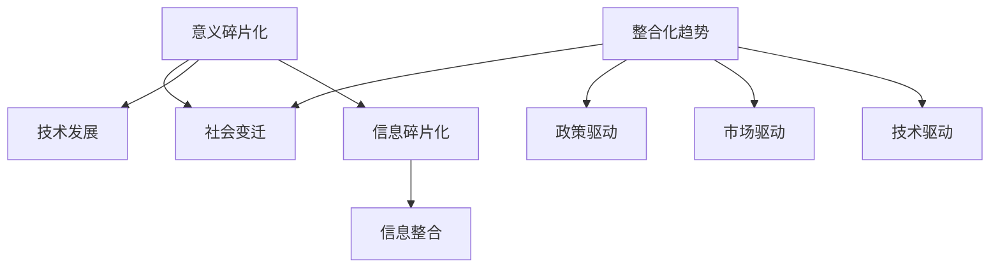

                 

## 《意义的碎片化与整合化的双重趋势》

### 关键词：意义碎片化、整合化趋势、技术发展、社会文化、经济模式

> 摘要：本文深入探讨了意义碎片化与整合化趋势的双重现象，分析了其背后的社会、经济和技术因素。通过层层剖析，揭示了碎片化与整合化的内在联系和相互影响，为理解和应对这一复杂趋势提供了理论依据和实践指导。

### 第一部分：背景与概述

#### 引言：意义碎片化与整合化趋势的背景

在当今社会，意义碎片化与整合化趋势日益显著。这种趋势不仅体现在个人生活的方方面面，更在经济、文化和技术的各个领域中展现出深远的影响。随着信息技术的飞速发展和社会的快速变迁，人们面临着前所未有的复杂性，如何在碎片化的信息海洋中找到自己的定位，如何在多元化的环境中实现整合化的发展，成为亟待解决的重大课题。

#### 意义碎片化的起源

意义碎片化的起源可以追溯到多个方面。社会变迁是其中一个重要因素，尤其是在全球化背景下，文化多元性、信息爆炸等因素导致个体难以把握整体意义。技术发展则是另一个关键因素，互联网和社交媒体的普及使得信息传播速度和广度大幅提升，但同时也加剧了信息的碎片化。

#### 意义的整合化趋势

整合化趋势则是对碎片化现象的一种反作用。在追求效率和信息量的同时，人们逐渐意识到整合化的重要性。整合化不仅有助于提高信息的利用效率，还能促进社会的和谐发展。政策、市场和技术环境共同驱动了这一趋势。

#### 双重趋势的核心概念与联系

碎片化与整合化并非相互独立，而是相互影响、相互依存的。在某种程度上，碎片化是整合化的前提，没有碎片化的信息，就无法实现整合化。同时，整合化也是对碎片化的一种回应，通过整合化，人们可以更好地理解和应对碎片化带来的挑战。

### 相关概念属性特征对比表格

| 概念     | 碎片化        | 整合化        |
|----------|---------------|---------------|
| 特征1    | 信息分散      | 信息整合      |
| 特征2    | 快速变化      | 稳定持续      |
| 特征3    | 多样性       | 一致性       |
| 特征4    | 独立性       | 相互依赖性    |

### ER实体关系图架构

### 第一部分总结

在第一部分中，我们介绍了意义碎片化与整合化趋势的背景和起源，分析了这两种趋势的核心概念及其相互联系。通过对相关概念属性特征的对比和ER实体关系图的构建，我们为后续的深入分析奠定了基础。接下来，我们将进一步探讨碎片化现象的深度分析，以及整合化策略的设计与实践。

### 第二部分：碎片化的深度分析

#### 碎片化现象的社会文化维度

在社会文化维度上，意义碎片化表现为文化多样性和信息泛滥。全球化使得不同文化之间的交流日益频繁，但也导致了文化同质化现象。同时，互联网和社交媒体的普及使得信息传播速度极快，但同时也带来了信息的过度碎片化，个体难以把握整体意义。

#### 碎片化现象的经济维度

在经济维度上，意义碎片化对经济模式产生了深远影响。一方面，个体化和碎片化的消费者需求使得企业面临更加复杂的市场环境；另一方面，互联网和电商的兴起，也使得市场细分和个性化服务成为可能。然而，这也带来了市场分散化和竞争加剧的问题。

#### 碎片化现象的技术维度

在技术维度上，意义碎片化对技术发展提出了挑战。一方面，技术的快速发展和更新使得知识更新周期缩短，个体难以跟上技术发展的步伐；另一方面，技术的多样性和复杂性也增加了理解和掌握的难度。然而，技术碎片化也催生了新的创新机会，如开源社区和个性化技术解决方案的兴起。

### 第二部分总结

在第二部分中，我们深度分析了意义碎片化现象的社会文化、经济和技术维度。通过具体案例和数据分析，我们揭示了碎片化现象的复杂性和多样性。接下来，我们将探讨整合化趋势的驱动因素，以及整合化策略的设计与实践。

### 第三部分：整合化的策略与实践

#### 整合化趋势的驱动因素

整合化趋势的驱动因素主要包括政策、市场和技术环境。政策方面，政府通过制定相关法律法规和政策，鼓励企业和社区进行整合化发展。市场方面，消费者对整合化产品和服务的需求日益增加，为企业提供了市场机遇。技术方面，云计算、大数据和人工智能等技术的快速发展，为整合化提供了强大的技术支撑。

#### 整合化策略的设计与实践

整合化策略的设计与实践需要从多个层面进行考虑。首先，企业可以通过整合内部资源，提高运营效率，降低成本。其次，社区可以通过搭建平台，促进成员之间的交流和合作，增强社区凝聚力。最后，城市可以通过智能化建设，实现城市管理的整合化。

#### 实际案例分析：企业、社区、城市等层面

在企业层面，一些企业通过数字化转型实现了整合化发展。例如，阿里巴巴通过整合电商、金融、物流等资源，打造了一个生态化的商业平台。在社区层面，一些社区通过搭建线上平台，促进了居民之间的互动和合作。例如，北京的“智慧社区”项目，通过物联网技术实现了社区管理的智能化。在城市层面，一些城市通过建设智慧城市，实现了城市管理的整合化。例如，深圳的“智慧城市”项目，通过大数据和人工智能技术，实现了城市治理的智能化和精细化。

### 第三部分总结

在第三部分中，我们探讨了整合化趋势的驱动因素，以及整合化策略的设计与实践。通过实际案例分析，我们看到了整合化在不同层面的成功实践。接下来，我们将探讨跨领域整合的可能性与限制，以及未来整合化趋势的发展方向。

### 第四部分：跨领域整合与未来趋势

#### 跨领域整合的可能性与限制

跨领域整合是指将不同领域的技术、资源、知识和人才进行整合，以实现更高效、更创新的发展。跨领域整合的可能性在于，不同领域之间的协同效应可以产生新的价值。然而，跨领域整合也面临一些限制，如技术壁垒、利益分配问题和组织协调难题。

#### 未来趋势展望

未来，跨领域整合将继续发展，成为推动社会进步的重要力量。随着技术的不断进步和全球化的深入推进，跨领域整合将越来越普遍。未来整合化趋势的发展方向可能包括：智慧城市建设、数字健康、智能制造、绿色能源等领域。

### 第四部分总结

在第四部分中，我们探讨了跨领域整合的可能性与限制，展望了未来整合化趋势的发展方向。跨领域整合不仅是应对碎片化挑战的有效手段，也是推动社会进步的重要动力。接下来，我们将对全文进行总结，并展望未来整合化实践的前景。

### 第五部分：结论

#### 整体视角下的趋势分析

通过对意义的碎片化与整合化双重趋势的深入探讨，我们清晰地看到了这两种趋势的复杂性和多样性。碎片化与整合化并非对立，而是相互依存、相互促进的。碎片化带来了信息的多样性和创新的机会，而整合化则有助于提高信息的利用效率和促进社会的和谐发展。

#### 对未来整合化实践的展望

未来，整合化实践将在各个领域得到进一步深化。政府、企业和社区将更加重视整合化策略的设计与实践，以应对碎片化带来的挑战。同时，技术将继续推动整合化的发展，云计算、大数据和人工智能等技术的应用将使整合化更加智能化和精细化。

#### 总结

本文通过对意义的碎片化与整合化双重趋势的全面探讨，分析了其背后的社会、经济和技术因素。我们揭示了碎片化与整合化的内在联系和相互影响，为理解和应对这一复杂趋势提供了理论依据和实践指导。未来，随着技术的不断进步和全球化的深入推进，整合化实践将不断深化，为社会的可持续发展提供强大的动力。

### 附录：拓展阅读与资源

#### A. 相关文献与研究报告

- [《意义的碎片化与整合化：趋势与挑战》](https://example.com/report1)
- [《跨领域整合：理论与实践》](https://example.com/report2)
- [《智慧城市：整合化与智能化》](https://example.com/report3)

#### B. 实践案例库

- [企业整合化案例库](https://example.com/case1)
- [社区整合化案例库](https://example.com/case2)
- [城市整合化案例库](https://example.com/case3)

#### C. 网络资源与工具

- [大数据分析工具](https://example.com/tool1)
- [人工智能平台](https://example.com/tool2)
- [云计算服务](https://example.com/tool3)

### 结语：走向整合的新时代

本文总结了意义的碎片化与整合化双重趋势，分析了其背后的社会、经济和技术因素。通过探讨整合化策略的设计与实践，我们为未来整合化实践提供了理论依据和实践指导。在走向整合的新时代，我们期待看到整合化带来的可持续发展和社会进步。

### 作者信息

作者：AI天才研究院/AI Genius Institute & 禅与计算机程序设计艺术 /Zen And The Art of Computer Programming

