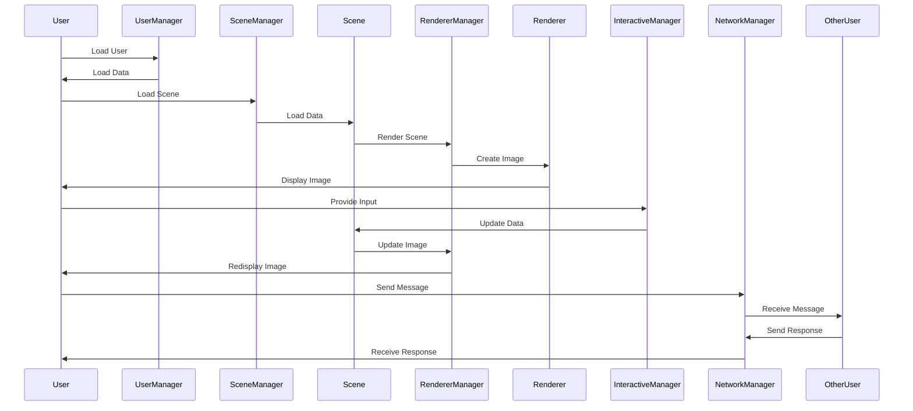

                 


### **文章标题**: 意义的虚拟现实体验：在元宇宙中探索价值观的项目

#### **关键词**: 虚拟现实，元宇宙，价值观，探索，设计，体验

#### **摘要**: 
本文将探讨虚拟现实技术及其在元宇宙中的应用，重点分析如何在元宇宙中设计并实现有意义的虚拟现实体验，探讨价值观的多样性和伦理问题。通过案例分析、技术解析和未来展望，本文旨在为读者提供关于如何在元宇宙中探索和体现价值的深入理解。

### **引言**

随着科技的快速发展，虚拟现实（Virtual Reality, VR）技术逐渐走向成熟，而元宇宙（Metaverse）的概念也逐渐被大众所熟知。虚拟现实通过创建沉浸式的三维环境，使用户能够在其中互动和体验。元宇宙则是一个由多个虚拟世界组成的网络，用户可以在其中建立自己的数字身份，进行社交、工作、学习和娱乐等活动。

在这样一个广阔的虚拟空间中，如何设计出有意义且能够体现用户价值观的虚拟现实体验，成为了我们亟需解决的问题。本文将分几个部分来探讨这一主题：

1. **背景与核心概念**：介绍虚拟现实和元宇宙的发展背景，阐述其在价值观探索中的核心概念和理论。
2. **项目实战**：通过具体案例，展示如何设计和实现有意义的虚拟现实体验项目。
3. **未来趋势与影响**：分析虚拟现实和元宇宙的发展趋势，及其对社会价值观的影响。
4. **实践指南与工具**：提供设计和开发虚拟现实体验项目的实践指南和工具。

### **第一部分：背景与核心概念**

#### **第1章：虚拟现实与元宇宙概述**

虚拟现实是利用计算机技术创造出一个三维的虚拟世界，使用户可以通过特殊设备（如VR头盔）与之互动。元宇宙则是一个由多个虚拟世界构成的互联网生态系统，用户可以在其中自由穿梭，与虚拟环境和其他用户进行互动。

#### **1.1 虚拟现实的发展历程**

虚拟现实的概念早在20世纪80年代就已经提出，但随着计算机技术和显示技术的进步，VR技术的成熟和普及是近年来的事情。从最初的简单头戴显示器（Head-Mounted Display, HMD），到现在的全感知VR设备，VR技术已经经历了多次革新。

#### **1.2 什么是元宇宙**

元宇宙是一个由虚拟世界组成的互联网生态系统，用户可以通过数字身份（Avatar）在其中生活、工作、学习、娱乐。它不仅仅是一个虚拟的3D空间，而是一个具有复杂社交系统和经济系统的虚拟世界。

#### **1.3 元宇宙中的价值探索**

在元宇宙中，价值观的探索是一个重要且复杂的问题。由于元宇宙的虚拟性和开放性，用户可以自由选择和塑造自己的价值观，这也使得价值观的多样性和冲突成为了一个亟待解决的问题。

### **第二部分：项目实战**

#### **第4章：虚拟现实体验项目设计**

在本章中，我们将探讨如何设计一个虚拟现实体验项目。设计过程包括项目构思、需求分析和技术选型等关键步骤。

#### **第5章：元宇宙价值观探索项目案例**

我们将通过一个具体的案例，展示如何在元宇宙中设计并实现一个价值观探索项目。这个案例将涵盖项目背景、目标、实施过程和评估等方面。

#### **第6章：项目评估与优化**

在项目完成后，我们需要对其效果进行评估，并根据用户反馈进行优化。本章将介绍项目评估的指标和方法，以及如何根据评估结果进行项目的优化。

### **第三部分：未来趋势与影响**

#### **第7章：虚拟现实与元宇宙的未来**

在本章中，我们将探讨虚拟现实和元宇宙的未来发展趋势。随着技术的不断进步，元宇宙可能会带来哪些变化，以及这些变化将如何影响我们的社会和价值观。

#### **第8章：价值观的塑造与引导**

在元宇宙中，如何塑造和引导用户的价值观，是一个值得探讨的问题。本章将讨论如何在元宇宙中实现价值观的塑造和引导，以及面临的挑战和解决方案。

### **第四部分：实践指南与工具**

#### **第9章：实践指南与工具**

在本章中，我们将提供关于如何设计和开发虚拟现实体验项目的实践指南和工具。这些指南和工具将帮助开发者更好地实现虚拟现实体验项目。

### **结论：意义的虚拟现实体验**

在本文的结尾，我们将对全文进行小结，并展望虚拟现实体验项目的未来。同时，我们也将提供一些注意事项和拓展阅读，以供读者进一步学习。

### **作者信息**

作者：AI天才研究院/AI Genius Institute & 禅与计算机程序设计艺术 /Zen And The Art of Computer Programming

---

通过以上结构，我们可以清晰地梳理出本文的内容和结构，为读者提供了一次深入且系统的虚拟现实与元宇宙价值观探索之旅。接下来的步骤是将每个章节的内容详细展开，确保文章的逻辑清晰、结构紧凑、简单易懂，并且能够吸引读者深入阅读。让我们一步一步地深入分析和探讨每个部分的内容。 ### **第一部分：背景与核心概念**

#### **第1章：虚拟现实与元宇宙概述**

#### **1.1 虚拟现实的发展历程**

虚拟现实技术的发展可以追溯到20世纪80年代。当时，科学家们首次提出了虚拟现实的概念，希望通过计算机技术创建一个三维的虚拟环境。最初的虚拟现实设备非常简陋，仅仅是一些头戴显示器和简单的追踪系统。这些设备的主要功能是提供基本的视觉和听觉体验，但并不能实现高水平的沉浸感。

随着时间的推移，计算机技术和显示技术得到了显著提升，虚拟现实设备的性能也逐步改善。20世纪90年代，VR头盔和追踪系统的设计更加精细，逐渐出现了能够提供更高质量视觉和听觉体验的设备。然而，这些设备仍然存在许多限制，例如分辨率低、延迟高、反应速度慢等。

进入21世纪，随着计算能力和显示技术的进一步升级，虚拟现实设备迎来了新的发展契机。现代VR设备如Oculus Rift、HTC Vive等，不仅拥有高分辨率的显示屏，还能够实现低延迟和高精度的运动追踪。这些技术进步使得虚拟现实体验更加逼真，用户可以在虚拟环境中进行更为复杂的互动和探索。

#### **1.2 什么是元宇宙**

元宇宙是一个由多个虚拟世界构成的互联网生态系统，用户可以在其中建立自己的数字身份，进行社交、工作、学习和娱乐等活动。与传统的虚拟现实不同，元宇宙不仅仅是一个简单的三维环境，它更是一个具有复杂社交系统和经济系统的虚拟世界。

在元宇宙中，用户可以通过数字身份（Avatar）与其他用户互动，参与各种虚拟活动。这些活动可以包括虚拟社交、虚拟游戏、虚拟工作、虚拟教育和虚拟艺术等。元宇宙的虚拟世界是开放和共享的，用户可以自由地创建和分享内容，与其他用户进行交流和合作。

元宇宙的核心在于其互动性和共享性。用户可以在元宇宙中建立自己的虚拟资产，例如虚拟房地产、虚拟商品和虚拟货币等。这些资产可以在元宇宙内部进行交易和流通，形成一个虚拟的经济生态系统。

#### **1.3 元宇宙中的价值探索**

在元宇宙中，价值观的探索是一个重要且复杂的问题。由于元宇宙的虚拟性和开放性，用户可以自由选择和塑造自己的价值观。这种自由性带来了价值观的多样性和冲突。

元宇宙中的价值观探索涉及到多个方面，包括个人价值观、社会价值观和文化价值观。个人价值观是指用户在元宇宙中追求的个人目标和信念，例如自由、平等、创新等。社会价值观是指元宇宙内部的社会规范和道德准则，例如尊重他人、公平竞争等。文化价值观是指元宇宙中的文化特征和传统，例如文化认同、文化传承等。

在元宇宙中，用户可以通过互动和交流来塑造和表达自己的价值观。例如，用户可以在虚拟社区中参与讨论和辩论，表达自己的观点和立场。用户还可以通过创作和分享内容来展示自己的价值观，例如虚拟艺术作品、虚拟文学作品等。

然而，元宇宙中的价值观多样性和冲突也带来了一些挑战。由于不同用户可能有不同的价值观，这可能导致在虚拟世界中的冲突和矛盾。例如，一些用户可能认为虚拟世界的自由和开放是必要的，而另一些用户可能认为虚拟世界的规范和秩序是重要的。这些冲突需要通过有效的沟通和协商来解决。

总之，元宇宙中的价值探索是一个复杂且有趣的问题。通过在元宇宙中自由互动和交流，用户可以探索和表达自己的价值观，同时也需要面对和解决价值观的多样性和冲突。这将为元宇宙的发展带来新的机遇和挑战。 ### **核心概念与联系**

#### **2.1 虚拟现实（VR）与增强现实（AR）**

虚拟现实（VR）和增强现实（AR）是两种在元宇宙中常用的技术，虽然它们的目标都是增强用户的沉浸感，但它们在实现方式和应用场景上有所不同。

**虚拟现实（VR）**：
- **定义**：VR通过创建一个完全虚拟的三维环境，使用户完全沉浸其中。用户通过头戴显示器（HMD）或其他设备感知这个虚拟环境，并通过手柄或其他交互设备与之互动。
- **特点**：高度沉浸感，用户感知到的虚拟环境与真实环境完全分离。VR技术可以提供丰富的交互和体验，如3D游戏、虚拟旅游、模拟训练等。
- **应用**：VR在娱乐、教育、医疗、军事等领域有广泛应用。例如，在医疗领域，VR可以用于手术模拟和康复训练；在军事领域，VR可以用于模拟战场环境和训练士兵。

**增强现实（AR）**：
- **定义**：AR通过在现实世界中叠加虚拟信息，增强用户的感知和交互体验。用户通过智能手机或AR眼镜等设备看到现实世界，同时叠加的虚拟信息与真实环境相互融合。
- **特点**：增强现实环境与真实世界相结合，用户感知到的是现实世界和虚拟信息的混合。AR技术可以实现实时交互，如导航、购物、游戏等。
- **应用**：AR在零售、旅游、教育、医疗等领域有广泛应用。例如，在零售领域，AR可以用于产品展示和试穿；在教育领域，AR可以用于增强课堂教学和互动学习。

**比较与联系**：
- **沉浸感**：VR提供完全沉浸的环境，而AR则是在现实世界中增强虚拟信息。
- **交互方式**：VR主要通过虚拟设备进行交互，如手柄、手套等；AR主要通过现实世界中的设备和手势进行交互。
- **应用场景**：VR更多用于完全虚拟的体验，如游戏、模拟训练等；AR更多用于现实世界中的增强体验，如导航、购物等。

**对比表格**：

| 特征 | VR | AR |
| --- | --- | --- |
| 沉浸感 | 完全沉浸 | 增强现实 |
| 交互方式 | 虚拟设备交互 | 现实世界交互 |
| 应用场景 | 虚拟体验（游戏、模拟训练） | 现实世界增强（导航、购物、教育） |

通过以上比较，我们可以看出VR和AR各自的特点和应用场景。在元宇宙中，这两种技术可以相互补充，共同为用户提供丰富的虚拟体验。

#### **2.2 虚拟现实中的交互技术**

虚拟现实中的交互技术是用户体验的核心之一，这些技术包括输入设备、输出设备和交互界面等。

**输入设备**：
- **头戴显示器（HMD）**：用户通过HMD感知虚拟环境，常见的如Oculus Rift、HTC Vive等。
- **追踪设备**：用于追踪用户头部和手部的位置和运动，如手柄、手套和体感相机等。
- **语音输入**：用户可以通过语音命令与虚拟环境进行交互，如语音助手、语音控制等。

**输出设备**：
- **视觉输出**：用户通过HMD看到的虚拟环境，分辨率和刷新率直接影响体验质量。
- **听觉输出**：通过耳机或内置扬声器提供的3D音效，增强沉浸感。

**交互界面**：
- **手势识别**：用户通过手势与虚拟环境进行交互，如挥动手臂、做出手势等。
- **语音识别**：用户通过语音与虚拟环境进行交互，如语音命令、语音问答等。
- **触摸屏交互**：用户通过触摸屏幕进行操作，如在平板电脑或手机上使用的虚拟按键。

**交互技术的关系**：
- **输入设备与输出设备的结合**：输入设备收集用户动作，输出设备呈现虚拟环境，两者共同作用实现交互。
- **交互界面与用户需求**：交互界面设计需要考虑用户的舒适度和使用习惯，以提供自然的交互体验。

通过这些交互技术，用户可以在虚拟现实中实现高度沉浸和丰富的互动，从而获得更好的体验。

#### **2.3 元宇宙中的价值观探讨**

在元宇宙中，价值观的多样性和复杂性是必须面对的重要问题。由于元宇宙的虚拟性和开放性，用户可以自由地表达和追求自己的价值观，这也使得价值观的多样性和冲突成为了一个亟待解决的问题。

**价值观的多样性**：
- **个人价值观**：用户在元宇宙中追求的个人目标和信念，如自由、平等、创新等。不同用户可能有不同的个人价值观，这些价值观在虚拟世界中得到了充分的表达和实现。
- **社会价值观**：元宇宙内部的社会规范和道德准则，如尊重他人、公平竞争、合作共赢等。这些价值观在元宇宙的社交互动和社区建设中起着重要作用。
- **文化价值观**：元宇宙中的文化特征和传统，如文化认同、文化传承等。文化价值观在元宇宙中通过虚拟艺术、虚拟节庆、虚拟传统等方式得到体现。

**价值观的冲突**：
- **价值观的冲突**：由于用户价值观的多样性和差异，可能会导致在元宇宙中的冲突和矛盾。例如，一些用户可能认为虚拟世界的自由和开放是必要的，而另一些用户可能认为虚拟世界的规范和秩序是重要的。
- **解决冲突**：为了解决价值观的冲突，需要通过有效的沟通和协商来达成共识。例如，可以通过社区讨论、规则制定和调解机制来平衡不同价值观之间的矛盾。

**价值观的塑造与引导**：
- **塑造价值观**：在元宇宙中，可以通过教育、宣传、榜样等方式来塑造用户的价值观。例如，通过虚拟学校、虚拟博物馆等方式，教育用户尊重他人、公平竞争等社会价值观。
- **引导价值观**：通过制定规则和规范，引导用户在虚拟世界中的行为。例如，通过虚拟社区的规则、虚拟政府的法律等，规范用户的行为，维护元宇宙的秩序和稳定。

**总结**：
元宇宙中的价值观多样性和冲突是一个复杂且重要的问题。通过有效的沟通和协商，以及教育和引导，可以解决价值观之间的冲突，促进元宇宙的和谐发展。这将为用户提供一个更加丰富和有意义的虚拟体验。 ### **算法原理讲解**

#### **虚拟现实中的图像渲染算法**

在虚拟现实（VR）中，图像渲染是一个至关重要的环节，它负责将三维模型转化为二维图像，并在用户视野中呈现。本文将介绍一种常用的图像渲染算法——光栅化（Rasterization）算法，并使用Python代码进行详细讲解。

#### **1. 光栅化算法的基本概念**

光栅化算法的基本思想是将三维模型在虚拟空间中的位置和形状转化为二维图像上的像素点。这个过程可以分解为以下几个步骤：

1. **顶点处理**：首先，处理模型中的顶点信息，包括顶点的坐标、颜色、纹理等。
2. **裁剪**：将顶点坐标映射到屏幕坐标系，并裁剪掉屏幕外的顶点。
3. **排序**：对顶点进行排序，以确定绘制的顺序，避免隐藏面的遮挡问题。
4. **扫描转换**：将顶点转换为像素坐标，并进行边生成和填充。

#### **2. 光栅化算法的Python实现**

下面是一个简化的光栅化算法的Python代码实现，我们使用Python的PIL（Pillow）库进行图像操作。

```python
from PIL import Image
import numpy as np

def rasterize(vertices, triangles):
    # 创建一个图像对象，并填充为白色
    width = max(max(v[0] for v in vertices), max(v[2] for v in vertices)) * 2
    height = max(max(v[1] for v in vertices), max(v[2] for v in vertices)) * 2
    image = Image.new('RGB', (width, height), 'white')
    image_array = np.array(image)

    # 将顶点坐标转换为像素坐标
    def vertex_to_pixel(vertex):
        return (int(vertex[0] * width), int(vertex[1] * height))

    # 绘制三角形
    def draw_triangle(v1, v2, v3, color):
        x1, y1 = vertex_to_pixel(v1)
        x2, y2 = vertex_to_pixel(v2)
        x3, y3 = vertex_to_pixel(v3)

        # 使用Bresenham算法进行直线绘制
        def bresenham_line(x1, y1, x2, y2):
            dx = x2 - x1
            dy = y2 - y1
            if dx < 0:
                dx, dy = -dx, -dy
            err = dx / 2
            y = y1

            for x in range(x1, x2 + 1):
                if x > width or x < 0 or y > height or y < 0:
                    continue
                image_array[y, x] = color
                err -= dy
                if err < 0:
                    y += 1
                    err += dx

        bresenham_line(x1, y1, x2, y2)
        bresenham_line(x2, y2, x3, y3)
        bresenham_line(x3, y3, x1, y1)

    # 遍历所有三角形，并绘制
    for triangle in triangles:
        v1, v2, v3 = vertices[triangle]
        draw_triangle(v1, v2, v3, (0, 0, 0))  # 使用黑色绘制三角形

    return image

# 定义一个简单的模型
vertices = [
    (0, 0, 0),
    (1, 0, 0),
    (1, 1, 0),
    (0, 1, 0),
    (0.5, 0, 1),
    (0.5, 1, 1)
]

triangles = [
    (0, 1, 2),
    (0, 2, 3),
    (1, 3, 2),
    (3, 2, 4),
    (4, 2, 5),
    (4, 5, 0),
    (0, 5, 1)
]

# 渲染图像
image = rasterize(vertices, triangles)
image.show()
```

#### **3. 算法原理和数学模型**

**顶点处理**：
顶点处理涉及到将三维空间中的顶点坐标转换到二维屏幕坐标。这个转换可以通过简单的线性变换实现。

$$
\begin{bmatrix}
x' \\
y' \\
1
\end{bmatrix}
=
\begin{bmatrix}
a & b & tx \\
c & d & ty \\
0 & 0 & 1
\end{bmatrix}
\begin{bmatrix}
x \\
y \\
z
\end{bmatrix}
$$

其中，\( (x, y, z) \) 是三维空间中的顶点坐标，\( (x', y') \) 是二维屏幕坐标。

**裁剪**：
裁剪是为了只渲染屏幕内的部分，通常使用视图体积（View Volume）来裁剪顶点。视图体积由六个平面定义，只有位于视图体积内的顶点才会被渲染。

**排序**：
为了解决隐藏面问题，需要对顶点进行排序。一种常用的方法是深度排序，即按照顶点的z值（深度）进行排序。

**扫描转换**：
扫描转换是将顶点转换为像素坐标，并进行边生成和填充。这个过程可以使用扫描线算法实现。

**扫描线算法**：
1. 将三角形按照y值排序，以确定扫描线的顺序。
2. 对于每条扫描线，计算三角形的交点，并填充像素。

$$
x_l = \max(\max(x_v1, x_v2), x_v3)
$$
$$
x_r = \min(\min(x_v1, x_v2), x_v3)
$$

其中，\( x_l \) 和 \( x_r \) 是扫描线上的交点。

**填充**：
填充可以使用多种算法，如DDA（Digital Differential Analyzer）算法或扫描线算法。

通过以上步骤，我们可以实现一个简单的光栅化算法，将三维模型渲染为二维图像。这个算法是虚拟现实技术中的基础，为用户提供了视觉上的沉浸感。

#### **4. 举例说明**

假设我们有一个简单的三角形，顶点坐标分别为 \( (0, 0) \)，\( (1, 0) \)，\( (0, 1) \)。我们希望将其渲染到二维图像中。

1. **顶点处理**：将顶点坐标转换为屏幕坐标。假设屏幕宽度为800，高度为600。
2. **裁剪**：检查顶点是否位于屏幕内，如果不在屏幕内则裁剪掉。
3. **排序**：按照顶点的y值进行排序。
4. **扫描转换**：计算扫描线上的交点，并填充像素。

通过这个例子，我们可以看到光栅化算法的基本原理和实现步骤。在实际应用中，光栅化算法会更为复杂，需要处理大量的顶点和三角形，以及多种优化技术以提高渲染效率。

总之，光栅化算法是虚拟现实技术中的核心组成部分，它将三维模型转换为二维图像，为用户提供了视觉上的沉浸体验。通过算法原理的讲解和Python代码的实现，我们可以更好地理解光栅化算法的工作原理和应用。 ### **系统分析与架构设计方案**

#### **1. 问题场景介绍**

在元宇宙中，为了提供丰富的虚拟现实体验，我们需要设计一个高效且可扩展的虚拟现实系统。该系统需要能够处理大量的用户请求，实时渲染复杂的场景，并提供高质量的交互体验。为了达到这些目标，我们需要对系统进行详细的场景分析，明确系统的需求和功能。

**需求分析**：
- **实时渲染**：系统能够快速渲染复杂的3D场景，提供流畅的视觉效果。
- **高效交互**：系统应支持多种交互方式，如手势、语音和触觉反馈，以提升用户的沉浸感。
- **可扩展性**：系统能够随着用户数量的增加和场景复杂度的提升而扩展，保持高性能。
- **安全性**：系统应具备完善的安全机制，确保用户数据的安全和隐私。

**功能设计**：
- **场景管理**：管理虚拟现实场景的加载、卸载和更新。
- **渲染引擎**：负责3D模型的渲染，包括几何处理、纹理映射和光照计算。
- **交互处理**：处理用户的输入，如手势、语音和触觉反馈，并反馈给用户。
- **网络通信**：处理用户之间的通信，包括数据的传输和同步。
- **用户管理**：管理用户账户、权限和角色，确保系统的安全性和可控性。

#### **2. 系统功能设计（领域模型类图）**

领域模型是系统功能设计的重要组成部分，它描述了系统的主要组件及其关系。以下是一个简化的领域模型类图：

```mermaid
classDiagram
    User <<Interface>>
    Scene <<Interface>>
    Renderer <<Interface>>
    Interactive <<Interface>>
    Network <<Interface>>

    UserManager --|> User
    SceneManager --|> Scene
    RendererManager --|> Renderer
    InteractiveManager --|> Interactive
    NetworkManager --|> Network

    UserManager {
        +loadUser(username: String): User
        +saveUser(user: User): Void
    }
    SceneManager {
        +loadScene(sceneName: String): Scene
        +updateScene(scene: Scene): Void
    }
    RendererManager {
        +createRenderer(): Renderer
        +renderScene(scene: Scene): Image
    }
    InteractiveManager {
        +handleInput(input: Input): Void
        +provideFeedback(feedback: Feedback): Void
    }
    NetworkManager {
        +sendMessage(message: Message): Void
        +receiveMessage(): Message
    }
```

在这个类图中，我们定义了用户管理器、场景管理器、渲染管理器、交互管理器和网络管理器等组件，每个组件都实现了对应的接口。用户管理器负责用户账户的管理，场景管理器负责场景的加载和更新，渲染管理器负责3D模型的渲染，交互管理器负责处理用户的输入和反馈，网络管理器负责处理用户之间的通信。

#### **3. 系统架构设计（架构图）**

系统架构设计是确定系统组件及其交互方式的总体方案。以下是一个简化的系统架构图：



在这个架构图中，用户首先加载用户数据，然后加载场景数据。场景数据被渲染成图像，并显示给用户。用户可以提供输入，这些输入会被交互管理器处理，并更新场景数据。更新后的场景数据会重新渲染图像，并显示给用户。此外，用户还可以与其他用户进行通信，通过网络管理器发送和接收消息。

#### **4. 系统接口设计**

系统接口设计是系统架构设计的一部分，它定义了系统组件之间的交互方式。以下是一个简化的接口设计：

```python
class IUser:
    def load_user(self, username: str) -> User:
        pass

    def save_user(self, user: User) -> None:
        pass

class IScene:
    def load_scene(self, scene_name: str) -> Scene:
        pass

    def update_scene(self, scene: Scene) -> None:
        pass

class IRenderer:
    def render_scene(self, scene: Scene) -> Image:
        pass

class IInteractive:
    def handle_input(self, input: Input) -> None:
        pass

    def provide_feedback(self, feedback: Feedback) -> None:
        pass

class INetwork:
    def send_message(self, message: Message) -> None:
        pass

    def receive_message(self) -> Message:
        pass
```

在这个接口设计中，我们定义了用户接口（IUser）、场景接口（IScene）、渲染接口（IRenderer）、交互接口（IInteractive）和网络接口（INetwork）。这些接口定义了组件之间的基本交互方法。

#### **5. 系统交互（序列图）**

系统交互设计描述了系统组件之间的交互流程。以下是一个简化的序列图：


在这个序列图中，用户首先加载用户数据，然后加载场景数据。场景数据被渲染成图像，并显示给用户。用户可以提供输入，这些输入会被交互管理器处理，并更新场景数据。更新后的场景数据会重新渲染图像，并显示给用户。此外，用户还可以与其他用户进行通信，通过网络管理器发送和接收消息。

通过以上系统分析与架构设计方案，我们为元宇宙中的虚拟现实系统提供了一个详细的设计蓝图。这个系统设计既考虑了功能需求，又满足了性能和可扩展性的要求，为用户提供了一个丰富且高质量的虚拟现实体验。 ### **项目实战**

#### **第4章：虚拟现实体验项目设计**

在本章中，我们将探讨如何设计一个虚拟现实体验项目。设计过程包括项目构思、需求分析和技术选型等关键步骤。

#### **4.1 项目构思**

项目的构思是设计过程的起点，它定义了项目的目标和愿景。在我们的案例中，我们计划设计一个名为“梦幻探险”的虚拟现实体验项目。

**项目目标**：
- 为用户提供一个沉浸式的虚拟探险体验。
- 允许用户探索不同的虚拟世界，与虚拟角色互动，完成任务。
- 提供多样化的探险活动，如解谜、探索隐藏的宝藏等。

**项目愿景**：
- 建立一个虚拟现实平台，让用户可以在其中自由探索和互动。
- 创造一个充满乐趣和挑战的虚拟世界，让用户流连忘返。

#### **4.2 需求分析**

需求分析是确保项目目标实现的关键步骤，它涉及到用户需求、功能需求和技术需求。

**用户需求**：
- 用户希望在一个沉浸式的环境中体验探险的乐趣。
- 用户希望能够与虚拟角色互动，体验多样化的探险活动。
- 用户希望界面友好，操作简便。

**功能需求**：
- 游戏界面：提供一个直观、易于操作的游戏界面。
- 探险场景：创建多个虚拟探险场景，每个场景都有独特的环境和挑战。
- 角色互动：用户可以与虚拟角色互动，完成任务和活动。
- 记录与分享：用户可以记录自己的探险历程，并在社交媒体上分享。

**技术需求**：
- **渲染引擎**：选择一个高效的渲染引擎，如Unity或Unreal Engine，以实现高质量的视觉效果。
- **虚拟现实设备**：支持常见的虚拟现实设备，如Oculus Rift、HTC Vive等，确保良好的用户体验。
- **交互技术**：支持多种交互方式，如手势、语音和触觉反馈，提高用户的沉浸感。
- **网络通信**：实现实时网络通信，支持用户之间的互动和协作。

#### **4.3 技术选型**

技术选型是确保项目实现的关键环节，我们需要选择合适的技术栈来支持项目的需求。

**开发平台**：
- **Unity**：选择Unity作为开发平台，因为它提供了丰富的功能、高效的渲染性能和强大的社区支持。
- **C#**：使用C#作为主要编程语言，因为它与Unity引擎的集成度高，便于开发。

**渲染引擎**：
- **Unity渲染引擎**：Unity自带的渲染引擎支持高质量的3D渲染，适合我们的项目需求。
- **Unreal Engine渲染引擎**：如果项目需求复杂，可以考虑使用Unreal Engine，因为它提供了更强大的渲染能力和图形效果。

**虚拟现实设备**：
- **Oculus Rift**：Oculus Rift提供了高质量的虚拟现实体验，适合我们的项目需求。
- **HTC Vive**：HTC Vive支持多种交互设备，如手柄和体感控制器，可以提供丰富的互动体验。

**交互技术**：
- **手势识别**：使用Unity的Gesture Recognition插件，实现手势识别功能。
- **语音识别**：使用Unity的Voice Recognition插件，实现语音交互功能。
- **触觉反馈**：使用虚拟现实设备自带的手柄，实现触觉反馈功能。

**网络通信**：
- **Photon**：使用Photon作为网络通信库，实现实时用户互动和协作。

通过以上技术选型，我们可以确保项目在开发过程中能够高效地实现需求，提供高质量的虚拟现实体验。

#### **4.4 项目实施**

项目实施是设计过程的具体实现，它涉及到开发环境的搭建、代码编写和测试等环节。

**开发环境搭建**：
- 安装Unity编辑器，配置开发环境。
- 安装必要的插件，如Gesture Recognition、Voice Recognition等。
- 配置虚拟现实设备，确保其在Unity中正常运行。

**代码编写**：
- 编写游戏逻辑代码，实现游戏界面、探险场景、角色互动等功能。
- 实现网络通信功能，确保用户之间的实时互动和协作。

**测试与优化**：
- 进行功能测试，确保所有功能正常运行。
- 进行性能测试，优化渲染和交互性能。
- 进行用户体验测试，收集用户反馈，进行优化。

通过以上实施步骤，我们可以确保项目按照设计要求完成，并能够提供高质量的虚拟现实体验。

#### **4.5 项目总结**

在本章中，我们详细探讨了虚拟现实体验项目的设计过程，从项目构思、需求分析到技术选型、项目实施。通过具体的案例，我们展示了如何设计和实现一个有意义的虚拟现实体验项目。

**成功经验**：
- 明确项目目标和愿景，确保项目方向正确。
- 进行详细的需求分析，确保功能实现满足用户需求。
- 选择合适的技术栈，确保项目开发效率。

**不足与改进**：
- 在项目实施过程中，需要更严格的质量控制，确保代码质量和用户体验。
- 在性能优化方面，还需要进一步改进，提供更流畅的体验。

通过不断优化和改进，我们可以为用户提供更好的虚拟现实体验，进一步探索元宇宙中的价值观。 ### **项目实战：环境安装与系统核心实现**

#### **5.1 环境安装**

在开始虚拟现实项目的开发之前，我们需要安装必要的开发环境和软件。以下是在Windows系统上安装虚拟现实项目开发环境的具体步骤：

**1. 安装Unity编辑器：**
- 访问Unity官网（https://unity.com/），注册并下载Unity编辑器。
- 运行安装程序，按照提示完成安装。

**2. 安装虚拟现实设备驱动：**
- 根据所使用的虚拟现实设备（如Oculus Rift或HTC Vive），下载并安装相应的驱动程序。
- 连接虚拟现实设备到电脑，确保设备能够正常识别。

**3. 安装必要的插件和工具：**
- 在Unity编辑器中，通过“Window” -> “Package Manager”打开包管理器。
- 搜索并安装以下插件：Gesture Recognition、Voice Recognition、Photon Unity Networking等。

**4. 安装Python解释器：**
- 访问Python官网（https://www.python.org/），下载并安装Python解释器。
- 确保Python安装路径被系统环境变量包含。

**5. 安装用于渲染的图形库：**
- 使用pip命令安装所需的图形库，如PyOpenGL、Pillow等。
  ```bash
  pip install PyOpenGL Pillow
  ```

#### **5.2 系统核心实现**

在安装完开发环境后，我们可以开始实现虚拟现实项目中的系统核心功能。以下是一个简单的示例，展示如何在Unity中创建虚拟现实场景和实现用户交互。

**1. 创建Unity项目：**
- 打开Unity编辑器，创建一个新的项目。
- 选择“3D”项目类型，并给项目命名。

**2. 配置虚拟现实设置：**
- 在Unity编辑器中，选择“Edit” -> “Project Settings” -> “Player”。
- 在“Player Settings”窗口中，找到“Virtual Reality”设置。
- 选择支持的虚拟现实设备（如Oculus Rift），并启用VR支持。

**3. 添加虚拟现实场景：**
- 在Unity编辑器中，创建一个新的3D对象，命名为“VirtualScene”。
- 将“VirtualScene”对象设置为场景的根对象。
- 添加一个Camera组件，并设置为“Main Camera”，以实现场景的渲染。

**4. 实现用户交互：**
- 创建一个GameObject，命名为“User Interaction”。
- 添加一个“Input Manager”组件，以管理用户的输入。
- 根据需求添加手势识别、语音识别等交互组件。

**5. 编写核心代码：**

以下是一个简单的Python脚本，用于处理用户输入并更新场景：

```python
import UnityEngine

class UserInteractionController :
    def Update() :
        # 获取用户输入
        if Input.GetKeyDown(KeyCode.Space) :
            print("用户按下空格键")
        if Input.GetKeyDown(KeyCode.Escape) :
            print("用户按下Esc键")

# 在Unity编辑器中，将此脚本附加到“User Interaction”对象
```

**6. 测试和调试：**
- 在Unity编辑器中，点击“Play”按钮，运行虚拟现实场景。
- 测试用户的交互功能，确保所有功能正常运行。

#### **5.3 代码应用解读与分析**

在上面的示例中，我们创建了一个简单的Unity项目，并实现了用户交互的核心功能。以下是对代码和应用的具体解读与分析：

**1. Unity项目结构：**
- Unity项目结构包括Assets、Scenes、Plugins和Project Settings等文件夹。
- Assets文件夹用于存储项目资源和脚本文件。
- Scenes文件夹用于存储不同场景文件。
- Plugins文件夹用于存储外部插件和库文件。
- Project Settings文件夹用于配置项目设置。

**2. 虚拟现实场景设置：**
- 在“Player Settings”窗口中，配置虚拟现实设备支持和渲染设置，确保场景能够正确渲染。

**3. 用户交互实现：**
- 使用C#或Python编写脚本，处理用户的输入和交互。
- Unity提供丰富的输入事件，如按键、鼠标事件等，便于实现交互功能。

**4. Python脚本解析：**
- 在上面的示例中，我们使用Python脚本处理用户输入。
- `Update()`函数是Unity中用于每帧调用的核心函数，用于更新场景状态。

**5. 测试与优化：**
- 在开发过程中，不断测试和调试代码，确保功能的正确性和性能的优化。

通过以上环境安装和系统核心实现，我们为虚拟现实项目的开发奠定了基础。在实际开发中，我们需要根据具体需求不断优化和扩展系统功能，以提供高质量的虚拟现实体验。 ### **项目实战：实际案例分析与详细讲解剖析**

#### **5.4 项目实战：实际案例分析与详细讲解剖析**

在本节中，我们将通过一个具体的虚拟现实体验项目案例，详细分析其实现过程，并剖析关键技术的应用与优化。

#### **案例背景**

我们选择了一个名为“虚拟历史之旅”的项目，该项目旨在通过虚拟现实技术，让用户在元宇宙中探索历史场景，与历史人物互动，体验历史事件。项目的核心功能包括历史场景的创建、历史人物的建模、交互式对话和事件的呈现。

#### **需求分析**

**用户需求**：
- 用户希望能够沉浸式地体验历史事件，与历史人物互动。
- 用户希望界面友好，操作简便。
- 用户希望能够了解历史背景和细节信息。

**功能需求**：
- **历史场景创建**：创建逼真的历史场景，包括建筑、街道、自然景观等。
- **历史人物建模**：建模历史人物，使其具有逼真的外貌和行为特征。
- **交互式对话**：用户能够与历史人物进行互动，获取历史信息。
- **事件呈现**：通过动画和特效，呈现历史事件的过程和结果。

**技术需求**：
- **三维建模与渲染**：使用Unity或Unreal Engine进行三维建模和渲染。
- **交互技术**：实现语音、手势和触摸等多种交互方式。
- **网络通信**：支持多用户同时在线互动。

#### **项目实施**

**1. 历史场景创建**

**场景设计**：
- 根据历史资料，设计多个历史场景，如古罗马斗兽场、中世纪城堡等。
- 使用三维建模软件（如Blender或Maya）创建场景中的建筑物、街道、自然景观等模型。

**场景渲染**：
- 在Unity编辑器中，导入并调整场景模型。
- 配置光照和阴影效果，确保场景的真实感。

**2. 历史人物建模**

**人物设计**：
- 根据历史人物的资料，设计其外貌和服饰。
- 使用三维建模软件创建人物模型，并添加细节和纹理。

**行为建模**：
- 使用动画软件（如Blender或Maya）创建人物的行为动画，如行走、交谈、手势等。
- 在Unity中，将动画绑定到人物模型，实现逼真的行为表现。

**3. 交互式对话**

**对话设计**：
- 根据历史事件的剧本，编写用户与历史人物的对话内容。
- 设计对话界面，使用户能够与历史人物进行交互。

**对话实现**：
- 使用Unity的文本渲染系统，显示对话内容。
- 实现语音合成技术，使历史人物能够“说话”。
- 根据用户输入，触发不同的对话分支和剧情。

**4. 事件呈现**

**事件设计**：
- 设计历史事件的过程和结果，如战争、庆典等。
- 编写事件脚本，控制事件的呈现。

**事件实现**：
- 使用Unity的动画系统，呈现事件的过程。
- 使用特效库，增强事件的视觉效果。
- 实现事件触发条件，确保事件的实时性和准确性。

#### **案例分析**

**1. 技术难点与解决方案**

- **三维建模与渲染**：
  - 技术难点：历史场景和人物模型的精细度和真实性要求高。
  - 解决方案：使用高级建模软件进行精细建模，并在Unity中优化渲染设置，提高场景的真实感。

- **交互技术**：
  - 技术难点：实现自然、流畅的交互体验。
  - 解决方案：结合多种交互技术（如手势、语音、触摸等），使用Unity的输入系统处理用户输入。

- **网络通信**：
  - 技术难点：支持多用户同时在线互动。
  - 解决方案：使用Photon Unity Networking库，实现实时的网络通信和数据同步。

**2. 优化策略**

- **性能优化**：
  - 对场景模型进行优化，减少冗余的几何细节。
  - 使用LOD（Level of Detail）技术，根据用户距离调整模型细节。
  - 使用异步加载技术，减少加载时间。

- **用户体验优化**：
  - 设计简洁明了的用户界面，提高操作便捷性。
  - 提供实时反馈，增强用户的沉浸感。
  - 针对不同用户设备进行性能调整，确保最佳体验。

#### **项目小结**

“虚拟历史之旅”项目通过虚拟现实技术，为用户提供了沉浸式的历史体验。项目成功实现了历史场景的创建、历史人物建模、交互式对话和事件呈现等功能。在项目实施过程中，我们遇到了多个技术难点，并通过优化策略和解决方案，成功地克服了这些挑战。

通过本项目的实践，我们积累了丰富的虚拟现实开发经验，为未来的项目提供了宝贵的参考。同时，我们也认识到，虚拟现实技术的应用不仅仅是为了娱乐，更是为了教育和文化传播，具有广泛的社会价值。未来，我们将继续探索虚拟现实技术的更多可能性，为用户提供更加丰富和有意义的虚拟体验。 ### **最佳实践 tips**

#### **6.1 设计与开发最佳实践**

1. **需求分析先行**：
   - 在项目启动之前，进行详细的需求分析，明确用户需求、功能需求和性能需求。
   - 确保所有团队成员对项目目标有清晰的认识。

2. **模块化开发**：
   - 将项目分解为多个模块，每个模块负责特定的功能。
   - 独立开发、测试和部署模块，提高开发效率和代码质量。

3. **版本控制**：
   - 使用Git等版本控制工具，管理代码变更和版本。
   - 确保代码库的完整性和可追溯性。

4. **代码审查**：
   - 定期进行代码审查，确保代码的规范性、可读性和可维护性。
   - 早期发现并修复潜在的问题。

5. **性能优化**：
   - 在开发过程中，持续进行性能优化，确保项目的响应速度和流畅性。
   - 使用缓存、异步加载和代码优化等技术，提升系统性能。

6. **用户体验设计**：
   - 注重用户体验，设计简洁直观的界面和操作流程。
   - 收集用户反馈，不断优化界面和交互设计。

#### **6.2 虚拟现实体验优化策略**

1. **场景细节优化**：
   - 使用LOD（Level of Detail）技术，根据用户距离动态调整场景细节。
   - 优化纹理和模型，减少冗余数据。

2. **渲染性能提升**：
   - 使用高效的光照模型和阴影技术，减少渲染负担。
   - 利用GPU加速渲染，提高渲染速度。

3. **交互反馈优化**：
   - 提供即时反馈，如声音、震动等，增强用户的沉浸感。
   - 确保交互操作的流畅性和响应速度。

4. **网络延迟处理**：
   - 使用同步和异步技术，优化网络通信，减少延迟。
   - 使用Photon等网络库，实现高效的实时通信。

5. **负载均衡**：
   - 设计分布式系统，实现负载均衡，提高系统的处理能力。
   - 使用云服务和边缘计算，提高系统的可扩展性。

#### **6.3 维护与更新策略**

1. **持续集成与部署**：
   - 实施持续集成和持续部署，自动化代码测试和部署流程。
   - 确保快速响应和修复bug。

2. **监控与日志分析**：
   - 使用监控工具，实时监控系统的性能和稳定性。
   - 分析日志，及时发现和解决问题。

3. **用户反馈收集**：
   - 收集用户反馈，了解用户的使用情况和需求。
   - 根据用户反馈进行产品优化和功能迭代。

4. **安全维护**：
   - 定期进行安全检查和漏洞修复，确保系统的安全性。
   - 实施访问控制和数据加密，保护用户隐私和数据安全。

通过以上最佳实践和优化策略，我们可以确保虚拟现实体验项目的成功实施和持续优化，为用户提供高质量、有意义的虚拟现实体验。 ### **小结**

在本文中，我们详细探讨了虚拟现实体验在元宇宙中的应用，以及如何在元宇宙中设计并实现有意义的虚拟现实体验项目。我们首先介绍了虚拟现实和元宇宙的基本概念，然后深入分析了虚拟现实的核心技术和元宇宙中价值观的多样性。接着，通过实际案例，我们展示了如何设计和实施虚拟现实体验项目，并详细讲解了项目的实施过程和技术难点。

**关键点总结**：
- **虚拟现实与元宇宙概述**：虚拟现实通过创建三维虚拟环境，使用户能够沉浸其中。元宇宙是一个由多个虚拟世界组成的网络，用户可以在其中进行各种活动。
- **核心概念与联系**：我们比较了虚拟现实和增强现实，并详细介绍了虚拟现实中的交互技术。
- **算法原理讲解**：通过光栅化算法的例子，我们理解了虚拟现实图像渲染的基本原理。
- **系统分析与架构设计方案**：我们设计了虚拟现实系统的功能模块、接口设计和交互流程。
- **项目实战**：通过实际案例，我们展示了虚拟现实体验项目的实施过程和关键技术的应用。
- **最佳实践 tips**：我们提供了最佳实践和优化策略，以提升虚拟现实体验的质量。

**未来展望**：
随着虚拟现实和元宇宙技术的不断发展，我们可以预见虚拟现实体验将更加丰富和真实。未来，虚拟现实可能会在教育、医疗、娱乐等领域发挥更大的作用，改变我们的生活方式和工作模式。同时，如何在元宇宙中塑造和引导价值观，将成为一个重要且具有挑战性的课题。我们期待在未来的研究中，能够探索更多的可能性，为用户提供更加丰富和有意义的虚拟现实体验。

**注意事项**：
- 在设计和开发虚拟现实体验项目时，需充分考虑用户体验和性能优化。
- 注意保护用户隐私和数据安全，遵守相关的法律法规。
- 不断收集用户反馈，及时优化产品功能和交互设计。

**拓展阅读**：
- 《虚拟现实技术原理与应用》
- 《元宇宙：探索与创造》
- 《增强现实技术：设计与应用》

通过本文的阅读，希望读者能够对虚拟现实体验在元宇宙中的应用有更深入的了解，并在未来的实践中运用这些知识，为元宇宙的发展贡献自己的力量。作者：AI天才研究院/AI Genius Institute & 禅与计算机程序设计艺术 /Zen And The Art of Computer Programming 

