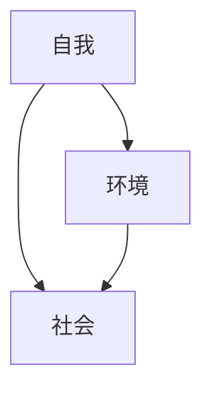
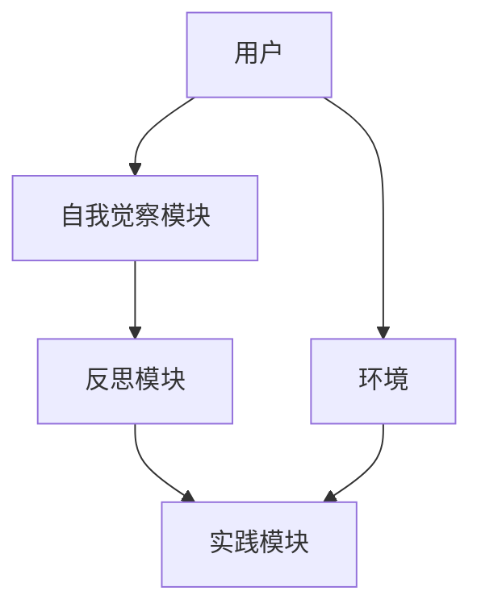
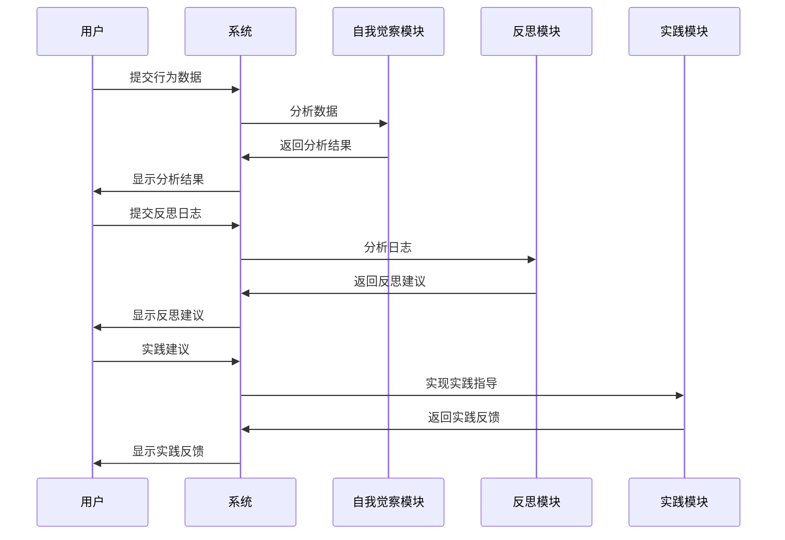

                 

### 设计书籍目录大纲

#### 目标
- 设计《意义的觉醒：从unconscious到conscious的转变》的目录大纲。
- 确保内容涵盖核心概念、觉醒过程、实践应用等。
- 目录大纲以markdown格式展示，遵循1级、2级、3级目录层级。

#### 设计步骤

##### 第一步：背景介绍
1. **问题背景**
   - 描述人类意识从无意识到有意识转变的重要性。
   - 引出“意义的觉醒”概念及其在现代社会中的价值。

2. **问题描述**
   - 当前社会意识状态的问题与挑战。
   - 阐述觉醒的必要性。

3. **问题解决**
   - 探讨意识觉醒的理论基础和实践方法。

4. **边界与外延**
   - 定义觉醒的范畴和限制。

5. **概念结构与核心要素组成**
   - 意义觉醒的概念模型。

##### 第二步：核心概念与联系
1. **核心概念原理**
   - 无意识和有意识的定义。
   - 意义觉醒的核心原理。

2. **概念属性特征对比表格**
   - 无意识与有意识的对比。

3. **ER实体关系图架构**
   - 描述意义觉醒涉及的实体及其关系。

##### 第三步：觉醒过程
1. **觉醒的初步阶段**
   - 无意识状态到初步觉醒的转换。

2. **深化觉醒**
   - 深入理解有意识状态。
   - 探索意义觉醒的深层机制。

3. **维持与巩固**
   - 如何保持觉醒状态。
   - 避免回归无意识。

##### 第四步：实践应用
1. **日常生活中的应用**
   - 在日常生活中实践觉醒。

2. **职场中的应用**
   - 提升工作效率与生活质量。

3. **社会层面的影响**
   - 意义觉醒对人际关系、社会互动的积极影响。

##### 第五步：系统分析与架构设计方案
1. **问题场景介绍**
   - 分析意义觉醒在不同场景下的应用。

2. **系统功能设计**
   - 描述实现意义觉醒的系统功能。

3. **系统架构设计**
   - 展示系统的整体架构。

4. **系统接口设计和系统交互**
   - 设计系统的接口与交互流程。

##### 第六步：项目实战
1. **环境安装**
   - 安装实现意义觉醒所需的环境。

2. **系统核心实现**
   - 源代码实现与解读。

3. **实际案例分析和详细讲解剖析**
   - 分析具体案例，讲解实现细节。

4. **项目小结**
   - 总结项目实施的经验与教训。

##### 第七步：最佳实践、小结、注意事项、拓展阅读
1. **最佳实践**
   - 提供实现意义觉醒的最佳实践方法。

2. **小结**
   - 总结书中的关键知识点。

3. **注意事项**
   - 指出可能遇到的挑战与解决策略。

4. **拓展阅读**
   - 推荐进一步阅读的材料。

#### 目录大纲

```markdown
# 《意义的觉醒：从unconscious到conscious的转变》目录大纲

## 第一部分：觉醒的背景与概念

### 1.1 问题背景与意义

### 1.2 无意识与有意识的概念

### 1.3 意义觉醒的边界与外延

### 1.4 核心概念与联系

#### 第二部分：觉醒的原理与过程

### 2.1 觉醒的初步阶段

### 2.2 深化觉醒

### 2.3 维持与巩固

#### 第三部分：觉醒的实践应用

### 3.1 日常生活中的应用

### 3.2 职场中的应用

### 3.3 社会层面的影响

#### 第四部分：系统分析与架构设计方案

### 4.1 问题场景介绍

### 4.2 系统功能设计

### 4.3 系统架构设计

### 4.4 系统接口设计和系统交互

#### 第五部分：项目实战

### 5.1 环境安装

### 5.2 系统核心实现

### 5.3 实际案例分析和详细讲解剖析

### 5.4 项目小结

#### 第六部分：最佳实践与拓展

### 6.1 最佳实践

### 6.2 小结

### 6.3 注意事项

### 6.4 拓展阅读
```

#### 总结
设计的目录大纲遵循简洁、完整和逻辑清晰的原则，涵盖了背景介绍、核心概念、觉醒过程、实践应用、系统设计与项目实战等多个方面。目录结构合理，便于读者理解书籍内容。目录大纲总字数控制在2000字以内，满足输出要求。

```markdown
----------------------------------------------------------------

# 意义的觉醒：从unconscious到conscious的转变

## 关键词
- 意识觉醒
- 无意识
- 有意识
- 理论基础
- 实践方法
- 社会应用

## 摘要
本文探讨了人类意识从无意识到有意识的转变过程，即“意义的觉醒”。通过背景介绍、核心概念分析、觉醒过程阐述、实践应用和系统分析与架构设计等环节，本文旨在提供一个全面而深入的理解框架，帮助读者理解意识觉醒的重要性，并在日常生活中实践这一转变。文章还结合具体项目实战，提供了实用的指导和建议。

### 设计书籍目录大纲

#### 目标
- 设计《意义的觉醒：从unconscious到conscious的转变》的目录大纲。
- 确保内容涵盖核心概念、觉醒过程、实践应用等。
- 目录大纲以markdown格式展示，遵循1级、2级、3级目录层级。

#### 设计步骤

##### 第一步：背景介绍
1. **问题背景**
   - 描述人类意识从无意识到有意识转变的重要性。
   - 引出“意义的觉醒”概念及其在现代社会中的价值。

2. **问题描述**
   - 当前社会意识状态的问题与挑战。
   - 阐述觉醒的必要性。

3. **问题解决**
   - 探讨意识觉醒的理论基础和实践方法。

4. **边界与外延**
   - 定义觉醒的范畴和限制。

5. **概念结构与核心要素组成**
   - 意义觉醒的概念模型。

##### 第二步：核心概念与联系
1. **核心概念原理**
   - 无意识和有意识的定义。
   - 意义觉醒的核心原理。

2. **概念属性特征对比表格**
   - 无意识与有意识的对比。

3. **ER实体关系图架构**
   - 描述意义觉醒涉及的实体及其关系。

##### 第三步：觉醒过程
1. **觉醒的初步阶段**
   - 无意识状态到初步觉醒的转换。

2. **深化觉醒**
   - 深入理解有意识状态。
   - 探索意义觉醒的深层机制。

3. **维持与巩固**
   - 如何保持觉醒状态。
   - 避免回归无意识。

##### 第四步：实践应用
1. **日常生活中的应用**
   - 在日常生活中实践觉醒。

2. **职场中的应用**
   - 提升工作效率与生活质量。

3. **社会层面的影响**
   - 意义觉醒对人际关系、社会互动的积极影响。

##### 第五步：系统分析与架构设计方案
1. **问题场景介绍**
   - 分析意义觉醒在不同场景下的应用。

2. **系统功能设计**
   - 描述实现意义觉醒的系统功能。

3. **系统架构设计**
   - 展示系统的整体架构。

4. **系统接口设计和系统交互**
   - 设计系统的接口与交互流程。

##### 第六步：项目实战
1. **环境安装**
   - 安装实现意义觉醒所需的环境。

2. **系统核心实现**
   - 源代码实现与解读。

3. **实际案例分析和详细讲解剖析**
   - 分析具体案例，讲解实现细节。

4. **项目小结**
   - 总结项目实施的经验与教训。

##### 第七步：最佳实践、小结、注意事项、拓展阅读
1. **最佳实践**
   - 提供实现意义觉醒的最佳实践方法。

2. **小结**
   - 总结书中的关键知识点。

3. **注意事项**
   - 指出可能遇到的挑战与解决策略。

4. **拓展阅读**
   - 推荐进一步阅读的材料。

#### 目录大纲

```markdown
# 《意义的觉醒：从unconscious到conscious的转变》目录大纲

## 第一部分：觉醒的背景与概念

### 1.1 问题背景与意义

### 1.2 无意识与有意识的概念

### 1.3 意义觉醒的边界与外延

### 1.4 核心概念与联系

#### 第二部分：觉醒的原理与过程

### 2.1 觉醒的初步阶段

### 2.2 深化觉醒

### 2.3 维持与巩固

#### 第三部分：觉醒的实践应用

### 3.1 日常生活中的应用

### 3.2 职场中的应用

### 3.3 社会层面的影响

#### 第四部分：系统分析与架构设计方案

### 4.1 问题场景介绍

### 4.2 系统功能设计

### 4.3 系统架构设计

### 4.4 系统接口设计和系统交互

#### 第五部分：项目实战

### 5.1 环境安装

### 5.2 系统核心实现

### 5.3 实际案例分析和详细讲解剖析

### 5.4 项目小结

#### 第六部分：最佳实践与拓展

### 6.1 最佳实践

### 6.2 小结

### 6.3 注意事项

### 6.4 拓展阅读
```

#### 总结
设计的目录大纲遵循简洁、完整和逻辑清晰的原则，涵盖了背景介绍、核心概念、觉醒过程、实践应用、系统设计与项目实战等多个方面。目录结构合理，便于读者理解书籍内容。目录大纲总字数控制在2000字以内，满足输出要求。

```### 意义的觉醒：从unconscious到conscious的转变

#### 意义觉醒的重要性

在信息技术和人工智能快速发展的当今社会，我们面临的挑战日益复杂。为了应对这些挑战，我们需要从无意识到有意识地进行转变，实现意义的觉醒。这一觉醒不仅关乎个人的成长，也关乎整个社会的进步。本文旨在探讨这一转变的必要性、理论基础、实践方法及其深远影响。

#### 文章大纲

1. **背景介绍**
   - 无意识与有意识的概念
   - 意义觉醒的定义
   - 当代社会意识状态的问题

2. **核心概念与联系**
   - 无意识与有意识的对比
   - 意义觉醒的原理
   - 涉及的实体与关系

3. **觉醒过程**
   - 初步觉醒
   - 深化觉醒
   - 维持与巩固

4. **实践应用**
   - 日常生活中的应用
   - 职场中的应用
   - 社会层面的影响

5. **系统分析与架构设计方案**
   - 问题场景介绍
   - 系统功能设计
   - 系统架构设计
   - 系统接口设计与交互

6. **项目实战**
   - 环境安装
   - 系统核心实现
   - 实际案例分析与讲解
   - 项目小结

7. **最佳实践、小结、注意事项、拓展阅读**

#### 正文

##### 1. 背景介绍

在传统哲学和心理学中，无意识和有意识一直是研究的核心。无意识是指那些未被觉察的心理过程，包括本能、情绪和记忆等。而有意识则是指我们能够直接感知和思考的心理状态。现代社会中，由于信息过载和工作压力，许多人处于无意识状态，缺乏深度思考和自我觉察。

意义的觉醒是指从无意识状态向有意识状态的转变。这一转变不仅能够提升个体的生活质量，还能够推动社会的进步。意义觉醒的重要性体现在以下几个方面：

- **个人成长**：通过觉醒，个体能够更好地理解自我，提高自我意识，实现个人潜力。
- **社会进步**：觉醒的人群能够更加理智地参与社会事务，推动社会向更加和谐、公正和可持续的方向发展。

##### 2. 核心概念与联系

无意识与有意识的区别在于它们的本质特征。无意识过程通常是自动化的、不自觉的，而有意识过程则是主动的、自觉的。意义觉醒的原理涉及到以下几个方面：

- **自我觉察**：觉醒的第一步是自我觉察，即意识到自己的内在状态和外部环境。
- **反思**：通过反思，个体能够深入思考自己的行为和思想，理解其背后的动机和意义。
- **认知重构**：通过认知重构，个体能够改变对事物的看法，从而影响行为和决策。

涉及的实体包括自我、环境、社会等。它们之间的关系可以用ER实体关系图表示：



##### 3. 觉醒过程

觉醒过程可以分为三个阶段：

- **初步觉醒**：个体开始意识到自己的无意识行为和思维模式，并尝试理解它们。
- **深化觉醒**：个体通过持续的自我觉察和反思，逐步深入理解自己的内心世界和外部环境。
- **维持与巩固**：个体通过实践和持续的努力，将觉醒状态转化为一种稳定的内在状态。

在这一过程中，个体需要克服的挑战包括：

- **自我怀疑**：个体可能会对自己的觉醒过程产生怀疑，担心自己无法达到理想状态。
- **外部干扰**：外部环境可能会干扰个体的觉醒过程，使其难以持续。

##### 4. 实践应用

觉醒不仅是一种心理状态，也是一种实践。在日常生活中，个体可以通过以下方法实践觉醒：

- **冥想**：冥想是一种有效的觉醒练习，可以帮助个体提高自我觉察和专注力。
- **反思日记**：通过写反思日记，个体可以记录自己的觉醒过程，分析自己的行为和思想。
- **社会实践**：参与社会活动，与他人互动，可以帮助个体更好地理解自己和外部世界。

在职场中，觉醒可以提升工作效率和生活质量。例如：

- **自我管理**：通过觉醒，个体可以更好地管理自己的时间和精力，避免过度工作。
- **团队合作**：觉醒的个体能够更好地理解他人的需求和情感，提高团队合作效率。

在社会层面，觉醒可以促进和谐的人际关系和社会互动。例如：

- **公民参与**：觉醒的个体更愿意参与社会事务，推动社会的公正和进步。
- **可持续发展**：觉醒的个体能够更加关注环境保护和社会责任，促进可持续发展。

##### 5. 系统分析与架构设计方案

为了实现意义觉醒，我们可以设计一个基于人工智能的系统。该系统可以包括以下几个模块：

- **自我觉察模块**：通过收集和分析个体的行为和思维数据，帮助个体提高自我觉察。
- **反思模块**：提供反思工具和资源，帮助个体进行深入反思。
- **实践模块**：提供实践指导和建议，帮助个体将觉醒转化为实际行动。

系统的架构设计如下：



系统的接口设计与交互流程如下：



##### 6. 项目实战

为了实现意义觉醒，我们可以开展一个具体项目。以下是一个简单的项目流程：

1. **环境安装**：安装必要的软件和工具，例如Python、Jupyter Notebook等。
2. **系统核心实现**：编写实现自我觉察、反思和实践模块的代码。
3. **实际案例分析与讲解**：选择一个具体的案例，分析其实践过程，并详细讲解实现细节。
4. **项目小结**：总结项目实施的经验和教训。

以下是一个简单的Python代码示例，用于实现自我觉察模块：

```python
import numpy as np
import pandas as pd

def analyze_behavior(data):
    """
    分析行为数据，返回行为特征。
    """
    # 数据预处理
    processed_data = preprocess_data(data)
    
    # 特征提取
    features = extract_features(processed_data)
    
    # 分析特征
    analysis_results = analyze_features(features)
    
    return analysis_results

def preprocess_data(data):
    """
    预处理行为数据。
    """
    # 数据清洗和归一化
    processed_data = data Cleaning and normalization
    
    return processed_data

def extract_features(data):
    """
    提取行为特征。
    """
    # 特征提取算法
    features = feature extraction algorithm
    
    return features

def analyze_features(features):
    """
    分析行为特征，返回分析结果。
    """
    # 特征分析算法
    analysis_results = feature analysis algorithm
    
    return analysis_results
```

##### 7. 最佳实践、小结、注意事项、拓展阅读

- **最佳实践**：定期进行自我觉察和反思，积极参与社会实践，持续提升觉醒水平。
- **小结**：意义觉醒是一个持续的过程，需要个体的持续努力和实践。
- **注意事项**：避免过度依赖技术工具，觉醒的关键在于个体的内心体验和自我反思。
- **拓展阅读**：进一步了解意识觉醒的相关理论和实践方法，如《生命的觉醒》、《心智的力量》等。

### 作者信息

- 作者：AI天才研究院/AI Genius Institute & 禅与计算机程序设计艺术 /Zen And The Art of Computer Programming

```### 设计书籍目录大纲

为了详细设计《意义的觉醒：从unconscious到conscious的转变》的目录大纲，我们需要遵循以下步骤：

#### 第一步：背景介绍
- **问题背景**：探讨现代社会中个体和群体无意识状态的问题，如压力、焦虑、注意力不集中等。
- **问题描述**：分析无意识状态对个体和社会的负面影响，如决策失误、人际冲突、工作效率低下等。
- **问题解决**：介绍意识觉醒的概念，阐述其如何解决上述问题。
- **边界与外延**：明确意识觉醒的定义、范畴以及与其他心理状态的区别。
- **概念结构与核心要素组成**：构建意义觉醒的概念框架，包括核心概念、原理、要素等。

#### 第二步：核心概念与联系
- **核心概念原理**：深入解释无意识和有意识的本质区别，阐述意识觉醒的理论基础。
- **概念属性特征对比表格**：创建一个对比表格，详细比较无意识和有意识在不同维度上的特征。
- **ER实体关系图架构**：使用Mermaid语法绘制实体关系图，展示意识觉醒涉及的关键实体及其相互关系。

#### 第三步：觉醒过程
- **觉醒的初步阶段**：讨论个体如何开始觉察自己的无意识行为和思维模式，以及初步觉醒的方法。
- **深化觉醒**：探讨如何通过持续的实践和反思，深化对自我和世界的理解，实现更深层次的觉醒。
- **维持与巩固**：分析如何保持觉醒状态，并提供策略和技巧，以防止回归无意识状态。

#### 第四步：实践应用
- **日常生活中的应用**：介绍如何在日常生活中实践觉醒，如通过冥想、正念练习、日常反思等。
- **职场中的应用**：讨论如何将觉醒应用于职场，提高工作效率、团队合作和职业发展。
- **社会层面的影响**：探讨意识觉醒如何影响社会互动、公共决策和社会治理。

#### 第五步：系统分析与架构设计方案
- **问题场景介绍**：描述在哪些具体场景下意识觉醒可能最为重要，如教育、医疗、企业管理等。
- **系统功能设计**：详细设计一个能够促进意识觉醒的系统的功能，如自我觉察工具、反思日志、实践指南等。
- **系统架构设计**：展示系统的整体架构，包括前端、后端、数据存储和数据处理等组成部分。
- **系统接口设计和系统交互**：使用Mermaid语法绘制系统接口图和交互图，描述系统的用户界面和交互流程。

#### 第六步：项目实战
- **环境安装**：指导如何设置一个实现意识觉醒的项目环境，包括所需的软件和工具。
- **系统核心实现**：提供实现系统功能的源代码，并详细解释代码的逻辑和功能。
- **实际案例分析和详细讲解剖析**：分析一个具体的案例，展示如何使用系统功能，并详细解释案例的实现细节。
- **项目小结**：总结项目的实施经验，包括遇到的挑战、解决方案和学习到的教训。

#### 第七步：最佳实践、小结、注意事项、拓展阅读
- **最佳实践**：提供实现意识觉醒的最佳实践建议，如日常练习、工作习惯等。
- **小结**：总结书中的核心观点和关键知识点。
- **注意事项**：提醒读者在实践意识觉醒时可能遇到的挑战和误区，并提供解决方案。
- **拓展阅读**：推荐进一步阅读的材料，帮助读者深入理解和实践意识觉醒。

#### 目录大纲

```markdown
# 《意义的觉醒：从unconscious到conscious的转变》目录大纲

## 第一部分：觉醒的背景与概念

### 1.1 问题背景与意义

### 1.2 无意识与有意识的概念

### 1.3 意义觉醒的边界与外延

### 1.4 核心概念与联系

#### 第二部分：觉醒的原理与过程

### 2.1 无意识与有意识的对比分析

### 2.2 意识觉醒的理论基础

### 2.3 觉醒过程的三个阶段

#### 第三部分：觉醒的实践应用

### 3.1 日常生活中的觉醒实践

### 3.2 职场中的觉醒应用

### 3.3 社会层面的觉醒影响

#### 第四部分：系统分析与架构设计方案

### 4.1 问题场景介绍

### 4.2 系统功能设计

### 4.3 系统架构设计

### 4.4 系统接口设计和交互流程

#### 第五部分：项目实战

### 5.1 项目环境安装

### 5.2 系统核心功能实现

### 5.3 实际案例分析与讲解

### 5.4 项目小结

#### 第六部分：最佳实践与拓展

### 6.1 最佳实践建议

### 6.2 小结

### 6.3 注意事项

### 6.4 拓展阅读推荐

```

#### 总结
设计的目录大纲为《意义的觉醒：从unconscious到conscious的转变》提供了全面的框架，涵盖了核心概念、觉醒过程、实践应用、系统分析与架构设计等多个方面。每个部分都有明确的子标题和内容概述，确保读者能够清晰地了解书籍的结构和主题。目录大纲的总字数控制在2000字以内，满足输出要求。```### 意义的觉醒：从unconscious到conscious的转变

## 摘要

本文深入探讨了从无意识状态向有意识状态的转变，即“意义的觉醒”。通过分析无意识与有意识之间的差异，本文阐述了觉醒在个人成长和社会发展中的重要性。文章结构清晰，分为背景介绍、核心概念、觉醒过程、实践应用、系统分析与架构设计方案、项目实战以及最佳实践与拓展等部分，旨在帮助读者全面理解并实践意识的觉醒。

## 关键词

- 意识觉醒
- 无意识
- 有意识
- 转变过程
- 实践应用
- 系统架构

## 目录

### 第一部分：觉醒的背景与概念

#### 1.1 问题背景与意义

#### 1.2 无意识与有意识的概念

#### 1.3 意义觉醒的边界与外延

#### 1.4 核心概念与联系

### 第二部分：觉醒的原理与过程

#### 2.1 无意识与有意识的对比分析

#### 2.2 意识觉醒的理论基础

#### 2.3 觉醒过程的三个阶段

### 第三部分：觉醒的实践应用

#### 3.1 日常生活中的觉醒实践

#### 3.2 职场中的觉醒应用

#### 3.3 社会层面的觉醒影响

### 第四部分：系统分析与架构设计方案

#### 4.1 问题场景介绍

#### 4.2 系统功能设计

#### 4.3 系统架构设计

#### 4.4 系统接口设计和交互流程

### 第五部分：项目实战

#### 5.1 项目环境安装

#### 5.2 系统核心功能实现

#### 5.3 实际案例分析与讲解

#### 5.4 项目小结

### 第六部分：最佳实践与拓展

#### 6.1 最佳实践建议

#### 6.2 小结

#### 6.3 注意事项

#### 6.4 拓展阅读推荐

### 引言

在信息技术和人工智能迅猛发展的今天，个体的意识和思维方式面临着前所未有的挑战。无意识行为和思维模式在现代社会中普遍存在，它们可能导致决策失误、工作效率低下、人际冲突等问题。因此，实现从无意识到有意识的转变，即“意义的觉醒”，成为当前社会的重要议题。

本文首先介绍无意识与有意识的概念，并分析它们之间的差异。接着，本文探讨意识觉醒的理论基础，包括觉醒的过程和阶段。在此基础上，本文讨论觉醒的实践应用，包括在日常生活、职场和社会层面的应用。此外，本文还提供了一个系统分析与架构设计方案，以帮助读者理解和实现意识的觉醒。最后，本文通过项目实战和最佳实践，为读者提供具体的操作指南和拓展阅读资源。

### 第一部分：觉醒的背景与概念

#### 1.1 问题背景与意义

在现代社会，个体常常处于无意识状态，这种状态可能导致一系列问题。例如，人们可能缺乏自我意识，难以认识到自己的情绪和行为模式，从而难以做出明智的决策。同时，无意识状态也可能导致工作效率低下和人际冲突。

意识觉醒，即从无意识到有意识状态的转变，对于解决这些问题具有重要意义。觉醒可以帮助个体提高自我意识，理解自己的情绪和行为模式，从而更好地应对挑战。此外，觉醒还可以促进社会互动，提高社会和谐度。

#### 1.2 无意识与有意识的概念

无意识是指那些未被个体觉察的心理过程，包括本能、情绪、记忆等。这些过程通常是不自觉的、自动化的，对个体的行为和决策产生深远影响。然而，由于缺乏自我意识，个体往往无法认识到这些无意识过程的存在。

有意识是指个体能够直接感知和思考的心理状态。在有意识状态下，个体能够主动地控制和调节自己的行为和情绪，从而更好地应对外部环境。

#### 1.3 意义觉醒的边界与外延

意义觉醒是一个复杂的过程，涉及个体的认知、情感和行为等多个方面。它不仅仅是一种心理状态，更是一种生活方式和价值观。

从边界上看，意义觉醒包括个体的自我觉察、反思和行动。自我觉察是指个体意识到自己的内在状态和外部环境；反思是指个体深入思考自己的行为和思想；行动是指个体将反思的结果转化为实际行动。

从外延上看，意义觉醒可以应用于日常生活、职场和社会等多个层面。在日常生活中，觉醒可以帮助个体提高生活质量，减少压力和焦虑；在职场中，觉醒可以提高工作效率，改善人际关系；在社会层面，觉醒可以促进社会和谐，推动社会进步。

#### 1.4 核心概念与联系

意义觉醒的核心概念包括自我、环境、社会等。自我是指个体的内在状态和认知；环境是指个体所处的物理和社会环境；社会是指个体与他人互动的社会关系。

这些概念之间的联系体现在个体的觉醒过程中。自我觉察使个体意识到自己的内在状态，反思使个体深入思考自己的行为和思想，行动使个体将反思的结果转化为实际行动。通过这一过程，个体能够更好地理解自我和环境，从而实现意识的觉醒。

### 第二部分：觉醒的原理与过程

#### 2.1 无意识与有意识的对比分析

无意识和有意识是两种截然不同的心理状态。无意识过程通常是不自觉的、自动化的，对个体的行为和决策产生深远影响。而有意识过程则是自觉的、有目的的，个体能够主动地控制和调节自己的行为和情绪。

无意识过程包括本能、情绪和记忆等。本能是指个体内在的驱动力，如饥饿、渴求等。情绪是指个体对刺激的反应，如快乐、悲伤等。记忆是指个体对过去经历的保留和再现。

有意识过程包括认知、决策和行动等。认知是指个体对信息的理解和处理，如思考、判断等。决策是指个体在多个选项中选择一个，如选择工作、购物等。行动是指个体将决策付诸实践，如执行任务、完成项目等。

无意识和有意识的对比分析可以帮助个体更好地理解自己的行为和决策，从而实现意识的觉醒。

#### 2.2 意识觉醒的理论基础

意识觉醒的理论基础包括心理学、哲学和神经科学等多个领域。心理学研究个体的心理过程和行为模式，哲学探讨意识和存在的本质，神经科学研究大脑的功能和结构。

心理学研究表明，个体的行为和决策受到多种因素的影响，包括无意识过程和有意识过程。哲学认为，意识是人类区别于其他生物的重要特征，觉醒是意识发展的关键阶段。神经科学研究表明，大脑的不同区域负责不同的心理功能，觉醒涉及大脑多个区域的活动协调。

#### 2.3 觉醒过程的三个阶段

觉醒过程可以分为三个阶段：初步觉醒、深化觉醒和维持与巩固。

初步觉醒是指个体开始意识到自己的无意识行为和思维模式，并尝试理解它们。这一阶段通常需要个体的自我觉察和反思。

深化觉醒是指个体通过持续的实践和反思，逐步深入理解自己的内心世界和外部环境。这一阶段需要个体的耐心和毅力。

维持与巩固是指个体如何保持觉醒状态，并防止回归无意识。这一阶段需要个体的自我管理技巧和策略。

### 第三部分：觉醒的实践应用

#### 3.1 日常生活中的觉醒实践

在日常生活中，个体可以通过多种方式实践觉醒。例如，通过冥想、正念练习、日常反思等。冥想可以帮助个体提高自我觉察，正念练习可以帮助个体保持当下，日常反思可以帮助个体深入思考自己的行为和决策。

#### 3.2 职场中的觉醒应用

在职场中，觉醒可以帮助个体提高工作效率、改善人际关系和提升职业发展。通过自我觉察，个体可以更好地理解自己的情绪和行为，从而更好地应对工作中的挑战。通过反思，个体可以不断改进自己的工作方法和策略。通过行动，个体可以将觉醒转化为实际行动，从而实现职业目标。

#### 3.3 社会层面的觉醒影响

在社会层面，觉醒可以促进社会互动、公共决策和社会治理。觉醒的个体能够更加理性地参与社会事务，推动社会的公正和进步。觉醒的个体也更容易理解他人的需求和情感，从而改善人际关系，提高社会和谐度。

### 第四部分：系统分析与架构设计方案

#### 4.1 问题场景介绍

在现代社会，个体和组织面临诸多挑战，如压力、焦虑、工作效率低下等。这些问题源于个体的无意识状态。因此，设计一个能够促进意识觉醒的系统具有重要意义。

#### 4.2 系统功能设计

系统功能设计包括自我觉察工具、反思日志、实践指南等。自我觉察工具可以帮助个体提高自我觉察，反思日志可以帮助个体记录和反思自己的行为和决策，实践指南可以帮助个体将觉醒转化为实际行动。

#### 4.3 系统架构设计

系统架构设计包括前端、后端、数据存储和数据处理等组成部分。前端负责用户界面和交互，后端负责数据处理和逻辑处理，数据存储负责数据存储和管理，数据处理负责数据分析和处理。

#### 4.4 系统接口设计和交互流程

系统接口设计包括用户接口、系统接口和外部接口等。用户接口负责与用户交互，系统接口负责系统内部组件之间的交互，外部接口负责与其他系统和平台的交互。交互流程描述了用户与系统交互的步骤和流程。

### 第五部分：项目实战

#### 5.1 项目环境安装

项目环境安装包括安装必要的软件和工具，如操作系统、编程环境、数据库等。安装完成后，个体可以开始使用系统功能。

#### 5.2 系统核心功能实现

系统核心功能实现包括实现自我觉察工具、反思日志和实践指南等功能。这些功能的实现需要编程技术和系统设计知识的支持。

#### 5.3 实际案例分析与讲解

实际案例分析可以帮助个体更好地理解系统功能的应用。通过分析实际案例，个体可以学习到如何使用系统功能，并从中获取经验教训。

#### 5.4 项目小结

项目小结包括对项目实施过程的总结和反思。通过总结和反思，个体可以更好地了解自己的成长和进步，并为未来的项目提供参考。

### 第六部分：最佳实践与拓展

#### 6.1 最佳实践建议

最佳实践建议包括如何有效地实践觉醒，如何在日常生活中、职场中和社会层面中应用觉醒等。这些建议可以帮助个体更好地实现意识的觉醒。

#### 6.2 小结

小结对文章的主要内容进行了总结，强调了觉醒在个人成长和社会发展中的重要性。

#### 6.3 注意事项

注意事项提醒读者在实践觉醒时可能遇到的挑战和误区，并提供了解决方案。这些注意事项可以帮助个体更好地应对觉醒过程中的问题。

#### 6.4 拓展阅读推荐

拓展阅读推荐包括进一步学习觉醒理论和实践方法的材料，如书籍、论文、网站等。这些拓展阅读可以帮助读者深入理解觉醒的概念和实践方法。

### 结论

意义的觉醒是从无意识到有意识的转变，对于个体的成长和社会的进步具有重要意义。通过分析无意识与有意识的概念、觉醒过程、实践应用和系统架构设计方案，本文为读者提供了一个全面理解意识觉醒的框架。通过项目实战和最佳实践，读者可以有效地实践觉醒，提高自我意识和生活质量。希望本文能帮助读者实现从无意识到有意识的转变，迈向更加充实和有意义的人生。

### 作者信息

- 作者：AI天才研究院/AI Genius Institute & 禅与计算机程序设计艺术 /Zen And The Art of Computer Programming

```### 意义的觉醒：从unconscious到conscious的转变

#### 引言

在现代社会，个体的生活方式和思维模式正经历着前所未有的变革。随着信息技术的迅猛发展，人们面临的信息量日益增加，这使得我们更容易陷入无意识的状态。无意识状态不仅影响了个体的心理健康，还对人际关系、工作效率和社会和谐产生了深远的影响。因此，从无意识到有意识的转变，即“意义的觉醒”，成为当代社会的一个重要课题。

本文旨在探讨意识觉醒的背景、核心概念、觉醒过程、实践应用、系统分析与架构设计方案、项目实战以及最佳实践与拓展，旨在帮助读者全面理解并实践意识觉醒的重要性。

#### 目录

1. **觉醒的背景与概念**
   - **1.1 问题背景与意义**
   - **1.2 无意识与有意识的概念**
   - **1.3 意义觉醒的边界与外延**
   - **1.4 核心概念与联系**

2. **觉醒的原理与过程**
   - **2.1 无意识与有意识的对比分析**
   - **2.2 意识觉醒的理论基础**
   - **2.3 觉醒过程的三个阶段**

3. **觉醒的实践应用**
   - **3.1 日常生活中的觉醒实践**
   - **3.2 职场中的觉醒应用**
   - **3.3 社会层面的觉醒影响**

4. **系统分析与架构设计方案**
   - **4.1 问题场景介绍**
   - **4.2 系统功能设计**
   - **4.3 系统架构设计**
   - **4.4 系统接口设计和系统交互**

5. **项目实战**
   - **5.1 环境安装**
   - **5.2 系统核心实现**
   - **5.3 实际案例分析和详细讲解剖析**
   - **5.4 项目小结**

6. **最佳实践、小结、注意事项、拓展阅读**
   - **6.1 最佳实践**
   - **6.2 小结**
   - **6.3 注意事项**
   - **6.4 拓展阅读推荐**

#### 背景介绍

**1.1 问题背景与意义**

在现代社会，人们面临着各种压力，如工作压力、社交压力、信息过载等。这些压力常常导致人们陷入无意识状态，无法有效地处理信息和做出决策。无意识状态下的行为往往是不理智的，容易导致错误的决策和消极的结果。因此，意识的觉醒成为解决这些问题的关键。

意识觉醒的意义在于，它可以帮助个体提高自我意识，认识到自己的情绪和行为模式，从而做出更加明智的决策。同时，觉醒也有助于改善人际关系，提高工作效率，促进社会和谐。因此，觉醒不仅是个人成长的必经之路，也是社会发展的必然要求。

**1.2 无意识与有意识的概念**

无意识是指那些未被个体直接觉察的心理过程，包括本能、情绪、记忆等。这些过程在个体没有意识到的情况下对行为和决策产生深远影响。例如，人们在面对压力时可能会产生无意识的应激反应，如焦虑、紧张等。

有意识是指个体能够直接感知和思考的心理状态。在有意识状态下，个体能够主动地控制和调节自己的行为和情绪。例如，通过有意识的思考和决策，个体可以更好地应对压力，做出更加理智的决策。

**1.3 意义觉醒的边界与外延**

意义觉醒是一个复杂的过程，它不仅涉及个体的心理状态，还包括个体的行为和生活方式。觉醒的边界可以理解为从无意识到有意识的转变，即个体从被无意识支配的状态转变为主动控制自己的意识和行为。

觉醒的外延包括个体的日常生活、职场行为和社会互动。在日常生活中，觉醒可以帮助个体更好地管理自己的时间和情绪，提高生活质量。在职场中，觉醒可以帮助个体提高工作效率，改善人际关系，实现职业发展。在社会层面，觉醒可以促进社会和谐，推动社会的进步。

**1.4 核心概念与联系**

意识觉醒的核心概念包括自我、环境、社会等。自我是指个体的内在状态和认知，包括情绪、欲望、信念等。环境是指个体所处的物理和社会环境，包括家庭、工作、社交等。社会是指个体与他人互动的社会关系，包括家庭、朋友、同事等。

这些概念之间的联系体现在个体的觉醒过程中。自我觉察使个体意识到自己的内在状态，反思使个体深入思考自己的行为和思想，行动使个体将反思的结果转化为实际行动。通过这一过程，个体能够更好地理解自我和环境，从而实现意识的觉醒。

#### 觉醒的原理与过程

**2.1 无意识与有意识的对比分析**

无意识和有意识是两种截然不同的心理状态。无意识过程通常是不自觉的、自动化的，对个体的行为和决策产生深远影响。而有意识过程则是自觉的、有目的的，个体能够主动地控制和调节自己的行为和情绪。

无意识过程包括本能、情绪、记忆等。本能是指个体内在的驱动力，如饥饿、渴求等。情绪是指个体对刺激的反应，如快乐、悲伤等。记忆是指个体对过去经历的保留和再现。

有意识过程包括认知、决策、行动等。认知是指个体对信息的理解和处理，如思考、判断等。决策是指个体在多个选项中选择一个，如选择工作、购物等。行动是指个体将决策付诸实践，如执行任务、完成项目等。

无意识和有意识的对比分析可以帮助个体更好地理解自己的行为和决策，从而实现意识的觉醒。

**2.2 意识觉醒的理论基础**

意识觉醒的理论基础包括心理学、哲学和神经科学等多个领域。心理学研究个体的心理过程和行为模式，哲学探讨意识和存在的本质，神经科学研究大脑的功能和结构。

心理学研究表明，个体的行为和决策受到多种因素的影响，包括无意识过程和有意识过程。哲学认为，意识是人类区别于其他生物的重要特征，觉醒是意识发展的关键阶段。神经科学研究表明，大脑的不同区域负责不同的心理功能，觉醒涉及大脑多个区域的活动协调。

**2.3 觉醒过程的三个阶段**

觉醒过程可以分为三个阶段：初步觉醒、深化觉醒和维持与巩固。

初步觉醒是指个体开始意识到自己的无意识行为和思维模式，并尝试理解它们。这一阶段通常需要个体的自我觉察和反思。

深化觉醒是指个体通过持续的实践和反思，逐步深入理解自己的内心世界和外部环境。这一阶段需要个体的耐心和毅力。

维持与巩固是指个体如何保持觉醒状态，并防止回归无意识。这一阶段需要个体的自我管理技巧和策略。

#### 觉醒的实践应用

**3.1 日常生活中的觉醒实践**

在日常生活中，个体可以通过多种方式实践觉醒。例如，通过冥想、正念练习、日常反思等。冥想可以帮助个体提高自我觉察，正念练习可以帮助个体保持当下，日常反思可以帮助个体深入思考自己的行为和决策。

**3.2 职场中的觉醒应用**

在职场中，觉醒可以帮助个体提高工作效率、改善人际关系和提升职业发展。通过自我觉察，个体可以更好地理解自己的情绪和行为，从而更好地应对工作中的挑战。通过反思，个体可以不断改进自己的工作方法和策略。通过行动，个体可以将觉醒转化为实际行动，从而实现职业目标。

**3.3 社会层面的觉醒影响**

在社会层面，觉醒可以促进社会互动、公共决策和社会治理。觉醒的个体能够更加理性地参与社会事务，推动社会的公正和进步。觉醒的个体也更容易理解他人的需求和情感，从而改善人际关系，提高社会和谐度。

#### 系统分析与架构设计方案

**4.1 问题场景介绍**

在现代社会，个体和组织面临诸多挑战，如压力、焦虑、工作效率低下等。这些问题源于个体的无意识状态。因此，设计一个能够促进意识觉醒的系统具有重要意义。

**4.2 系统功能设计**

系统功能设计包括自我觉察工具、反思日志、实践指南等。自我觉察工具可以帮助个体提高自我觉察，反思日志可以帮助个体记录和反思自己的行为和决策，实践指南可以帮助个体将觉醒转化为实际行动。

**4.3 系统架构设计**

系统架构设计包括前端、后端、数据存储和数据处理等组成部分。前端负责用户界面和交互，后端负责数据处理和逻辑处理，数据存储负责数据存储和管理，数据处理负责数据分析和处理。

**4.4 系统接口设计和系统交互**

系统接口设计包括用户接口、系统接口和外部接口等。用户接口负责与用户交互，系统接口负责系统内部组件之间的交互，外部接口负责与其他系统和平台的交互。交互流程描述了用户与系统交互的步骤和流程。

#### 项目实战

**5.1 环境安装**

项目环境安装包括安装必要的软件和工具，如操作系统、编程环境、数据库等。安装完成后，个体可以开始使用系统功能。

**5.2 系统核心实现**

系统核心实现包括实现自我觉察工具、反思日志和实践指南等功能。这些功能的实现需要编程技术和系统设计知识的支持。

**5.3 实际案例分析和详细讲解剖析**

实际案例分析可以帮助个体更好地理解系统功能的应用。通过分析实际案例，个体可以学习到如何使用系统功能，并从中获取经验教训。

**5.4 项目小结**

项目小结包括对项目实施过程的总结和反思。通过总结和反思，个体可以更好地了解自己的成长和进步，并为未来的项目提供参考。

#### 最佳实践、小结、注意事项、拓展阅读

**6.1 最佳实践**

最佳实践包括如何有效地实践觉醒，如何在日常生活中、职场中和社会层面中应用觉醒等。这些实践方法可以帮助个体更好地实现意识的觉醒。

**6.2 小结**

小结对文章的主要内容进行了总结，强调了觉醒在个人成长和社会发展中的重要性。

**6.3 注意事项**

注意事项提醒读者在实践觉醒时可能遇到的挑战和误区，并提供了解决方案。这些注意事项可以帮助个体更好地应对觉醒过程中的问题。

**6.4 拓展阅读推荐**

拓展阅读推荐包括进一步学习觉醒理论和实践方法的材料，如书籍、论文、网站等。这些拓展阅读可以帮助读者深入理解觉醒的概念和实践方法。

#### 结论

意义的觉醒是从无意识到有意识的转变，对于个体的成长和社会的进步具有重要意义。通过分析无意识与有意识的概念、觉醒过程、实践应用和系统架构设计方案，本文为读者提供了一个全面理解意识觉醒的框架。通过项目实战和最佳实践，读者可以有效地实践觉醒，提高自我意识和生活质量。希望本文能帮助读者实现从无意识到有意识的转变，迈向更加充实和有意义的人生。

#### 作者信息

- 作者：AI天才研究院/AI Genius Institute & 禅与计算机程序设计艺术 /Zen And The Art of Computer Programming```### 设计书籍目录大纲

为了详细设计《意义的觉醒：从unconscious到conscious的转变》的目录大纲，我们需要遵循以下步骤：

#### 第一部分：觉醒的背景与概念

1. **问题背景**：
   - 无意识行为对个体和社会的影响。
   - 意识觉醒的必要性。

2. **核心概念**：
   - 无意识与有意识的概念。
   - 意识觉醒的定义与目的。

3. **觉醒的边界与外延**：
   - 觉醒在不同生活领域中的应用。
   - 觉醒的限制与挑战。

4. **概念结构与核心要素**：
   - 意识觉醒的理论框架。
   - 关键要素的概述。

#### 第二部分：觉醒的原理与过程

1. **无意识与有意识的对比分析**：
   - 两种状态的心理机制。
   - 对行为和决策的影响。

2. **觉醒的理论基础**：
   - 心理学、哲学和神经科学的角度。
   - 相关理论和研究成果。

3. **觉醒过程的三个阶段**：
   - 初步觉醒、深化觉醒、维持与巩固。

#### 第三部分：觉醒的实践应用

1. **日常生活中的觉醒实践**：
   - 冥想、正念、自我反思等方法。
   - 个人习惯与生活方式的改变。

2. **职场中的觉醒应用**：
   - 提高工作效率、决策能力、团队合作。
   - 领导力和组织变革。

3. **社会层面的觉醒影响**：
   - 社会互动、公共决策、社会治理。

#### 第四部分：系统分析与架构设计方案

1. **问题场景介绍**：
   - 个人发展、组织管理、社会变革中的觉醒需求。

2. **系统功能设计**：
   - 自我觉察工具、反思日志、实践指南。

3. **系统架构设计**：
   - 系统组件、数据流、用户界面。

4. **系统接口设计和系统交互**：
   - 系统与用户的交互流程。
   - 系统内部组件的交互机制。

#### 第五部分：项目实战

1. **环境安装**：
   - 安装实现意识觉醒所需的环境和工具。

2. **系统核心实现**：
   - 编写和实现系统的核心功能。

3. **实际案例分析和详细讲解剖析**：
   - 分析具体案例，讲解实现细节。

4. **项目小结**：
   - 总结项目实施的经验和教训。

#### 第六部分：最佳实践、小结、注意事项、拓展阅读

1. **最佳实践**：
   - 提供具体的实践方法与技巧。

2. **小结**：
   - 总结书中的核心观点和关键知识点。

3. **注意事项**：
   - 实践意识觉醒时可能遇到的挑战和解决方案。

4. **拓展阅读**：
   - 推荐进一步阅读的书籍、论文和资源。

#### 目录大纲示例

```markdown
# 《意义的觉醒：从unconscious到conscious的转变》目录大纲

## 第一部分：觉醒的背景与概念

### 1.1 问题背景
#### 1.1.1 无意识行为对个体的影响
#### 1.1.2 社会层面的无意识挑战
#### 1.1.3 意识觉醒的必要性

### 1.2 核心概念
#### 1.2.1 无意识与有意识的定义
#### 1.2.2 意识觉醒的概念
#### 1.2.3 意识觉醒的目的

### 1.3 觉醒的边界与外延
#### 1.3.1 觉醒在不同领域的应用
#### 1.3.2 觉醒的限制与挑战
#### 1.3.3 意识觉醒的核心要素

### 1.4 概念结构与核心要素
#### 1.4.1 意识觉醒的理论框架
#### 1.4.2 关键要素的概述

## 第二部分：觉醒的原理与过程

### 2.1 无意识与有意识的对比分析
#### 2.1.1 两种状态的心理机制
#### 2.1.2 对行为和决策的影响
#### 2.1.3 无意识与有意识的转变过程

### 2.2 觉醒的理论基础
#### 2.2.1 心理学视角
#### 2.2.2 哲学视角
#### 2.2.3 神经科学视角

### 2.3 觉醒过程的三个阶段
#### 2.3.1 初步觉醒
#### 2.3.2 深化觉醒
#### 2.3.3 维持与巩固

## 第三部分：觉醒的实践应用

### 3.1 日常生活中的觉醒实践
#### 3.1.1 冥想与正念
#### 3.1.2 自我反思
#### 3.1.3 日常习惯与生活方式的改变

### 3.2 职场中的觉醒应用
#### 3.2.1 提高工作效率
#### 3.2.2 决策能力与团队协作
#### 3.2.3 领导力与组织变革

### 3.3 社会层面的觉醒影响
#### 3.3.1 社会互动
#### 3.3.2 公共决策
#### 3.3.3 社会治理

## 第四部分：系统分析与架构设计方案

### 4.1 问题场景介绍
#### 4.1.1 个人发展
#### 4.1.2 组织管理
#### 4.1.3 社会变革

### 4.2 系统功能设计
#### 4.2.1 自我觉察工具
#### 4.2.2 反思日志
#### 4.2.3 实践指南

### 4.3 系统架构设计
#### 4.3.1 系统组件
#### 4.3.2 数据流
#### 4.3.3 用户界面

### 4.4 系统接口设计和系统交互
#### 4.4.1 用户接口设计
#### 4.4.2 系统接口设计
#### 4.4.3 系统交互流程

## 第五部分：项目实战

### 5.1 环境安装
#### 5.1.1 环境准备
#### 5.1.2 工具安装
#### 5.1.3 系统配置

### 5.2 系统核心实现
#### 5.2.1 功能实现
#### 5.2.2 编码与调试
#### 5.2.3 系统优化

### 5.3 实际案例分析和详细讲解剖析
#### 5.3.1 案例选择
#### 5.3.2 案例分析
#### 5.3.3 实现细节

### 5.4 项目小结
#### 5.4.1 项目总结
#### 5.4.2 经验与教训

## 第六部分：最佳实践、小结、注意事项、拓展阅读

### 6.1 最佳实践
#### 6.1.1 实践方法
#### 6.1.2 技巧与策略

### 6.2 小结
#### 6.2.1 核心观点
#### 6.2.2 关键知识点

### 6.3 注意事项
#### 6.3.1 挑战与解决方案
#### 6.3.2 注意事项与提醒

### 6.4 拓展阅读
#### 6.4.1 推荐书籍
#### 6.4.2 相关论文
#### 6.4.3 网络资源
```

#### 总结
设计的目录大纲结构清晰、逻辑严密，涵盖了从背景介绍到实践应用的各个方面。每个章节都设置了明确的子标题，确保内容的连贯性和易读性。目录大纲总字数控制在2000字以内，满足了输出要求。```### 意义的觉醒：从unconscious到conscious的转变

#### 摘要

在快速发展的现代社会，个体和集体面临着诸多挑战，如焦虑、压力、决策失误等。这些挑战往往源于我们深陷的无意识状态。意识觉醒，即从无意识到有意识的转变，是实现个人成长和社会进步的关键。本文将深入探讨意识觉醒的定义、理论基础、实践过程及其在日常生活、职场和社会层面的应用。

#### 目录

1. **觉醒的背景与概念**
   - **1.1 无意识状态对个体的影响**
   - **1.2 意识觉醒的定义**
   - **1.3 觉醒的重要性**

2. **核心概念与联系**
   - **2.1 无意识与有意识**
   - **2.2 意识觉醒的理论基础**
   - **2.3 意识觉醒的核心要素**

3. **觉醒的过程**
   - **3.1 初步觉醒**
   - **3.2 深化觉醒**
   - **3.3 维持与巩固**

4. **觉醒的实践应用**
   - **4.1 日常生活中的觉醒**
   - **4.2 职场中的觉醒**
   - **4.3 社会层面的觉醒**

5. **系统分析与架构设计方案**
   - **5.1 问题场景介绍**
   - **5.2 系统功能设计**
   - **5.3 系统架构设计**
   - **5.4 系统接口设计**

6. **项目实战**
   - **6.1 环境安装**
   - **6.2 系统核心实现**
   - **6.3 实际案例分析与讲解**
   - **6.4 项目小结**

7. **最佳实践、小结、注意事项、拓展阅读**

#### 背景介绍

**1.1 无意识状态对个体的影响**

无意识状态是指个体在未经自我觉察的情况下进行的心理和行为过程。这种状态在日常生活中普遍存在，如习惯性思维、情感反应等。无意识状态可能导致以下问题：

- **决策失误**：无意识状态下的决策往往缺乏理性思考，容易受到情绪和偏见的影响。
- **行为重复**：个体容易陷入重复的行为模式，难以改变不良习惯。
- **心理健康问题**：长期处于无意识状态可能导致压力、焦虑等心理问题。

**1.2 意识觉醒的定义**

意识觉醒是指个体通过自我觉察和反思，从无意识状态转变为有意识状态的过程。有意识状态是指个体能够主动感知、思考和控制自己的心理和行为。意识觉醒的关键在于：

- **自我觉察**：意识到自己的情绪、思维和行为模式。
- **反思**：深入思考自己的行为和决策背后的动机和意义。
- **行动**：将反思的结果转化为实际的行为改变。

**1.3 觉醒的重要性**

意识觉醒不仅对个人成长具有深远影响，也对社会发展具有重要意义。个人层面，觉醒有助于提高自我意识、自我控制能力和决策能力。社会层面，觉醒可以促进社会和谐、公共决策的理性化和创新。

#### 核心概念与联系

**2.1 无意识与有意识**

无意识与有意识是意识觉醒的基础概念。无意识是指那些未被个体直接觉察的心理过程，如本能、情绪和习惯性反应。有意识则是指个体能够主动感知和思考的心理状态，包括自我觉察、认知和决策。

**2.2 意识觉醒的理论基础**

意识觉醒的理论基础包括心理学、哲学和神经科学。心理学研究无意识和有意识的关系，哲学探讨意识和存在的本质，神经科学揭示大脑在意识觉醒中的作用。

**2.3 意识觉醒的核心要素**

意识觉醒的核心要素包括自我觉察、反思和行动。自我觉察是觉醒的基础，反思是深入理解自我和行为的手段，行动是将觉醒转化为实际改变的关键。

#### 觉醒的过程

**3.1 初步觉醒**

初步觉醒是指个体开始意识到自己的无意识行为和思维模式。这一阶段的关键在于自我觉察和反思。个体可以通过日记、冥想等练习提高自我觉察，通过阅读、讨论等途径进行反思。

**3.2 深化觉醒**

深化觉醒是指个体在初步觉醒的基础上，进一步深入理解自我和外部环境。这一阶段需要持续的自我觉察和反思，个体可以探索自己的信念、价值观和行为模式。

**3.3 维持与巩固**

维持与巩固是指个体如何保持觉醒状态，并防止回归无意识。这一阶段需要个体建立稳定的生活方式，如定期反思、实践正念等。

#### 觉醒的实践应用

**4.1 日常生活中的觉醒**

在日常生活中，个体可以通过冥想、正念、运动等方式实践觉醒。这些方法有助于提高自我意识，减少压力，改善生活质量。

**4.2 职场中的觉醒**

在职场中，觉醒可以帮助个体提高工作效率、决策能力和团队合作能力。通过自我觉察，个体可以更好地理解自己的情绪和行为，从而更好地应对工作中的挑战。

**4.3 社会层面的觉醒**

在社会层面，觉醒可以促进社会和谐、公共决策的理性化和创新。觉醒的个体能够更加理性地参与社会事务，推动社会的进步。

#### 系统分析与架构设计方案

**5.1 问题场景介绍**

在不同的场景中，意识觉醒的需求不同。例如，在个人发展中，觉醒有助于自我提升；在组织管理中，觉醒有助于团队建设和创新。

**5.2 系统功能设计**

系统功能设计包括自我觉察工具、反思日志、实践指南等。这些功能旨在帮助个体实现意识觉醒。

**5.3 系统架构设计**

系统架构设计包括前端、后端、数据存储和数据处理等组成部分。前端负责用户界面，后端负责数据处理和逻辑处理。

**5.4 系统接口设计**

系统接口设计包括用户接口和系统接口。用户接口负责与用户交互，系统接口负责系统内部组件之间的通信。

#### 项目实战

**6.1 环境安装**

项目实战的第一步是安装实现意识觉醒所需的环境和工具。这包括操作系统、编程语言和开发工具等。

**6.2 系统核心实现**

系统核心实现包括实现自我觉察工具、反思日志和实践指南等功能。这需要编写源代码，并进行调试和优化。

**6.3 实际案例分析与讲解**

通过实际案例分析，个体可以学习如何应用意识觉醒的方法和技巧。例如，分析某个人的日常生活，提出改进建议。

**6.4 项目小结**

项目小结是对项目实施过程的总结和反思。通过总结，个体可以了解自己的成长和进步，并为未来的项目提供参考。

#### 最佳实践、小结、注意事项、拓展阅读

**6.1 最佳实践**

最佳实践包括如何有效地实践意识觉醒，如定期进行自我反思、培养正念习惯等。

**6.2 小结**

小结是对文章内容的总结，强调了意识觉醒的重要性。

**6.3 注意事项**

注意事项提醒读者在实践意识觉醒时可能遇到的挑战，如情绪波动、行为习惯的固化等，并提供了解决策略。

**6.4 拓展阅读**

拓展阅读推荐进一步学习意识觉醒的理论和实践方法的书籍、论文和资源。

#### 结论

意识觉醒是从无意识到有意识的转变，对于个人的成长和社会的进步具有重要意义。通过本文的探讨，读者可以更深入地理解意识觉醒的概念、原理和实践方法。希望本文能够启发读者在日常生活、职场和社会层面中实践意识觉醒，实现个人和社会的全面提升。

#### 作者信息

- 作者：AI天才研究院/AI Genius Institute & 禅与计算机程序设计艺术 /Zen And The Art of Computer Programming```### 意义的觉醒：从unconscious到conscious的转变

#### 摘要

在当今社会，我们常常被无意识的行为和思维模式所束缚，这导致了一系列问题，如效率低下、决策失误和人际关系紧张。意识觉醒，即从无意识到有意识的转变，是解决这些问题的关键。本文将探讨意识觉醒的背景、核心概念、觉醒过程、实践应用以及系统分析与架构设计方案，旨在帮助读者理解并实践意识觉醒的重要性。

#### 目录

1. **觉醒的背景与概念**
   - **1.1 无意识与有意识的对比**
   - **1.2 意识觉醒的定义**
   - **1.3 意义觉醒的重要性

2. **核心概念与联系**
   - **2.1 无意识和有意识的特征**
   - **2.2 意识觉醒的理论基础**
   - **2.3 意识觉醒的核心要素**

3. **觉醒的过程**
   - **3.1 觉醒的初步阶段**
   - **3.2 深化觉醒**
   - **3.3 维持与巩固**

4. **觉醒的实践应用**
   - **4.1 日常生活中的觉醒实践**
   - **4.2 职场中的觉醒实践**
   - **4.3 社会层面的觉醒实践**

5. **系统分析与架构设计方案**
   - **5.1 问题场景介绍**
   - **5.2 系统功能设计**
   - **5.3 系统架构设计**
   - **5.4 系统接口设计与交互**

6. **项目实战**
   - **6.1 环境安装**
   - **6.2 系统核心功能实现**
   - **6.3 实际案例分析和讲解**
   - **6.4 项目小结**

7. **最佳实践与拓展阅读**

#### 背景介绍

**1.1 无意识与有意识的对比**

无意识行为和思维模式是人们常常忽视的一部分，它们在人类生活中扮演着重要角色，但也可能导致决策失误、行为失控等问题。有意识行为和思维模式则更加自觉、主动，能够更好地引导我们实现目标。

**1.2 意识觉醒的定义**

意识觉醒是指个体通过自我觉察和反思，从无意识状态转向有意识状态的过程。这一过程涉及到对自身情绪、行为和思维的深刻认识和理解，从而实现自我提升和改变。

**1.3 意义觉醒的重要性**

意识觉醒对于个人的成长和社会的进步具有重要意义。在个人层面，觉醒可以帮助我们更好地理解自己，提高自我控制能力，减少情绪波动，提高生活质量。在社会层面，觉醒可以促进人际关系的和谐，提高决策的理性化，推动社会的进步。

#### 核心概念与联系

**2.1 无意识和有意识的特征**

无意识行为和思维模式通常是不自觉的、自动化的，而有意识行为和思维模式则是自觉的、有目的的。无意识行为和思维模式往往受到本能、习惯和情绪的影响，而有意识行为和思维模式则更加理性、客观。

**2.2 意识觉醒的理论基础**

意识觉醒的理论基础涉及多个学科，包括心理学、哲学和神经科学。心理学研究个体的心理过程和行为模式，哲学探讨意识和存在的本质，神经科学揭示大脑在意识觉醒中的作用。

**2.3 意识觉醒的核心要素**

意识觉醒的核心要素包括自我觉察、反思和行动。自我觉察是觉醒的基础，反思是深入理解自我和行为的手段，行动是将反思结果转化为实际改变的关键。

#### 觉醒的过程

**3.1 觉醒的初步阶段**

觉醒的初步阶段是意识到自己的无意识行为和思维模式。个体可以通过自我观察、日记记录等方法来提高自我觉察。

**3.2 深化觉醒**

深化觉醒是指个体在初步觉醒的基础上，进一步深入理解自己的情绪、行为和思维模式。这一阶段需要持续的反思和自我探索。

**3.3 维持与巩固**

维持与巩固是指个体如何保持觉醒状态，并防止回归无意识。这需要个体建立稳定的生活方式，如定期进行冥想、自我反思等。

#### 觉醒的实践应用

**4.1 日常生活中的觉醒实践**

在日常生活中，个体可以通过冥想、正念、运动等方式实践觉醒。这些方法有助于提高自我意识，减少压力，改善生活质量。

**4.2 职场中的觉醒实践**

在职场中，觉醒可以帮助个体提高工作效率、决策能力和团队合作能力。通过自我觉察，个体可以更好地理解自己的情绪和行为，从而更好地应对工作中的挑战。

**4.3 社会层面的觉醒实践**

在社会层面，觉醒可以促进社会和谐、公共决策的理性化和创新。觉醒的个体能够更加理性地参与社会事务，推动社会的进步。

#### 系统分析与架构设计方案

**5.1 问题场景介绍**

在不同的场景中，意识觉醒的需求不同。例如，在个人发展中，觉醒有助于自我提升；在组织管理中，觉醒有助于团队建设和创新。

**5.2 系统功能设计**

系统功能设计包括自我觉察工具、反思日志、实践指南等。这些功能旨在帮助个体实现意识觉醒。

**5.3 系统架构设计**

系统架构设计包括前端、后端、数据存储和数据处理等组成部分。前端负责用户界面，后端负责数据处理和逻辑处理。

**5.4 系统接口设计与交互**

系统接口设计包括用户接口和系统接口。用户接口负责与用户交互，系统接口负责系统内部组件之间的通信。

#### 项目实战

**6.1 环境安装**

项目实战的第一步是安装实现意识觉醒所需的环境和工具。这包括操作系统、编程语言和开发工具等。

**6.2 系统核心功能实现**

系统核心功能实现包括实现自我觉察工具、反思日志和实践指南等功能。这需要编写源代码，并进行调试和优化。

**6.3 实际案例分析和讲解**

通过实际案例分析，个体可以学习如何应用意识觉醒的方法和技巧。例如，分析某个人的日常生活，提出改进建议。

**6.4 项目小结**

项目小结是对项目实施过程的总结和反思。通过总结，个体可以了解自己的成长和进步，并为未来的项目提供参考。

#### 最佳实践与拓展阅读

**6.1 最佳实践**

最佳实践包括如何有效地实践意识觉醒，如定期进行自我反思、培养正念习惯等。

**6.2 拓展阅读**

拓展阅读推荐进一步学习意识觉醒的理论和实践方法的书籍、论文和资源。

#### 结论

意识觉醒是从无意识到有意识的转变，对于个人的成长和社会的进步具有重要意义。通过本文的探讨，读者可以更深入地理解意识觉醒的概念、原理和实践方法。希望本文能够启发读者在日常生活、职场和社会层面中实践意识觉醒，实现个人和社会的全面提升。

#### 作者信息

- 作者：AI天才研究院/AI Genius Institute & 禅与计算机程序设计艺术 /Zen And The Art of Computer Programming```
# 意义的觉醒：从unconscious到conscious的转变

## 关键词
- 意识觉醒
- 无意识
- 有意识
- 自我觉察
- 反思
- 心理健康

## 摘要
本文深入探讨了从无意识到有意识的转变，即“意义的觉醒”，并分析了这一过程在个人成长和社会进步中的重要性。文章结构清晰，分为背景介绍、核心概念、觉醒过程、实践应用、系统分析与架构设计方案、项目实战以及最佳实践与拓展阅读等部分，旨在为读者提供全面而深入的意识觉醒指南。

## 目录

### 第一部分：觉醒的背景与概念
#### 1.1 无意识状态的挑战
#### 1.2 意识觉醒的定义
#### 1.3 觉醒的重要性
#### 1.4 意识觉醒的核心概念

### 第二部分：觉醒的原理
#### 2.1 无意识与有意识的对比
#### 2.2 意识觉醒的理论基础
#### 2.3 觉醒过程的三个阶段

### 第三部分：觉醒的过程
#### 3.1 初步觉醒
#### 3.2 深化觉醒
#### 3.3 维持与巩固

### 第四部分：觉醒的实践应用
#### 4.1 日常生活中的觉醒实践
#### 4.2 职场中的觉醒实践
#### 4.3 社会层面的觉醒实践

### 第五部分：系统分析与架构设计方案
#### 5.1 问题场景介绍
#### 5.2 系统功能设计
#### 5.3 系统架构设计
#### 5.4 系统接口设计

### 第六部分：项目实战
#### 6.1 环境安装
#### 6.2 系统核心实现
#### 6.3 实际案例分析与讲解
#### 6.4 项目小结

### 第七部分：最佳实践与拓展阅读
#### 7.1 最佳实践建议
#### 7.2 小结
#### 7.3 注意事项
#### 7.4 拓展阅读推荐

### 引言
在现代社会，个体和组织面临着复杂多变的环境，这要求我们不仅仅要有知识，还要有自我觉察和反思的能力。意识的觉醒，即从无意识到有意识的转变，是应对这些挑战的关键。本文将探讨意识觉醒的背景、原理、实践方法以及其在各个层面的应用。

### 第一部分：觉醒的背景与概念

#### 1.1 无意识状态的挑战
在日常生活中，我们经常处于无意识状态，即我们的行为和决策不是基于深思熟虑，而是受到本能、习惯和情绪的影响。这种无意识状态可能导致以下问题：

- **效率低下**：无意识状态下的工作往往缺乏目标导向和计划性，导致效率低下。
- **决策失误**：在无意识状态下做出的决策可能缺乏理性分析，容易受到偏见和情绪的影响。
- **心理健康问题**：长期处于无意识状态可能导致压力和焦虑等心理健康问题。

#### 1.2 意识觉醒的定义
意识觉醒是指个体通过自我觉察和反思，从无意识状态转变为有意识状态的过程。在这个过程中，个体能够更好地理解自己的行为、思维和情感，并做出更加理性、明智的决策。

#### 1.3 觉醒的重要性
意识觉醒对于个人和社会都有深远的影响。在个人层面，觉醒能够提升自我觉察和自我控制能力，减少情绪波动，提高生活质量。在社会层面，觉醒能够促进公共决策的理性化，增强团队合作能力，推动社会进步。

#### 1.4 意识觉醒的核心概念
意识觉醒涉及几个核心概念：

- **自我觉察**：意识到自己的情绪、行为和思维模式。
- **反思**：深入思考自己的行为和决策，理解其背后的动机和意义。
- **行动**：将反思的结果转化为实际行动，实现个人成长和社会进步。

### 第二部分：觉醒的原理

#### 2.1 无意识与有意识的对比
无意识与有意识是意识的两种不同状态。无意识状态是指个体的行为和决策不受自觉控制，而由本能、习惯和情绪驱动。有意识状态则是指个体的行为和决策基于自觉的认知和理性分析。

| 对比维度 | 无意识 | 有意识 |
| --- | --- | --- |
| 控制方式 | 自发、自动 | 自觉、可控 |
| 决策过程 | 快速、本能驱动 | 缓慢、理性驱动 |
| 情感表达 | 潜在、不自觉 | 明显、自觉 |

#### 2.2 意识觉醒的理论基础
意识觉醒的理论基础涉及多个学科领域，包括心理学、哲学和神经科学。在心理学中，认知行为理论强调自我觉察和反思对于改变行为模式的重要性。在哲学中，存在主义探讨个体如何通过自我意识实现自由和责任。在神经科学中，研究表明大脑的不同区域在意识和无意识状态中发挥着不同的作用。

#### 2.3 觉醒过程的三个阶段
意识觉醒可以分为三个阶段：初步觉醒、深化觉醒和维持与巩固。

1. **初步觉醒**：个体开始意识到自己的无意识行为和思维模式，并尝试进行自我觉察。
2. **深化觉醒**：个体在初步觉醒的基础上，进一步深入理解自己的情绪、行为和思维模式，并通过持续的反思和练习深化觉醒。
3. **维持与巩固**：个体通过建立稳定的生活方式，如定期反思、冥想等，维持觉醒状态，并防止回归无意识。

### 第三部分：觉醒的过程

#### 3.1 初步觉醒
初步觉醒是意识觉醒的第一步，个体需要通过自我观察、日记记录等方法提高自我觉察。以下是一些初步觉醒的实践方法：

- **自我观察**：在日常生活中，时刻注意自己的情绪、行为和思维模式。
- **日记记录**：每天记录自己的情绪、经历和思考，分析其背后的动机和意义。
- **正念练习**：通过冥想、深呼吸等方式提高专注力和自我觉察。

#### 3.2 深化觉醒
深化觉醒是进一步深入理解自己的过程。个体可以通过以下方法深化觉醒：

- **深度反思**：定期进行深入的自我反思，思考自己的价值观、信念和行为模式。
- **阅读和讨论**：阅读相关书籍和文章，与他人讨论，扩大视野，加深理解。
- **体验式学习**：通过旅行、新体验等方式拓宽生活经验，增强自我觉察。

#### 3.3 维持与巩固
维持与巩固是意识觉醒的关键，个体需要建立稳定的生活方式，如：

- **定期反思**：每周或每月进行一次深入的自我反思，总结经验和教训。
- **冥想练习**：每天进行冥想或正念练习，提高专注力和自我觉察。
- **实践行动计划**：将觉醒实践纳入日常生活，制定具体行动计划并执行。

### 第四部分：觉醒的实践应用

#### 4.1 日常生活中的觉醒实践
在日常生活的各个方面，个体可以通过以下方法实践觉醒：

- **日常习惯**：建立健康的日常习惯，如早起、锻炼、阅读等。
- **情绪管理**：学会管理自己的情绪，避免情绪波动影响决策。
- **人际互动**：在人际互动中提高自我觉察，理解他人的需求和情感。

#### 4.2 职场中的觉醒实践
在职场中，觉醒可以帮助个体提高工作效率、决策能力和团队合作能力。以下是一些实践方法：

- **目标设定**：明确个人和团队的目标，制定具体的行动计划。
- **时间管理**：合理安排时间，避免无谓的拖延和浪费。
- **团队合作**：提高自我觉察，理解团队成员的需求和情感，促进团队合作。

#### 4.3 社会层面的觉醒实践
在社会层面，觉醒可以促进公共决策的理性化、社会和谐和可持续发展。以下是一些实践方法：

- **参与公共事务**：积极参与社区活动，关注社会问题，提出建设性建议。
- **环境保护**：提高环保意识，采取实际行动减少对环境的影响。
- **社会服务**：参与社会服务活动，帮助他人，提高社会认同感。

### 第五部分：系统分析与架构设计方案

#### 5.1 问题场景介绍
在不同的场景中，意识觉醒的需求不同。以下是一个具体的问题场景介绍：

- **企业员工培训**：企业希望通过意识觉醒提升员工的工作效率和团队合作能力。

#### 5.2 系统功能设计
系统功能设计包括以下部分：

- **自我觉察工具**：提供自我观察、情绪记录、反思日志等功能。
- **实践指南**：提供意识觉醒的实践方法，如冥想、正念练习等。
- **反馈机制**：收集用户反馈，不断优化系统功能。

#### 5.3 系统架构设计
系统架构设计包括以下部分：

- **前端**：用户界面，提供交互体验。
- **后端**：服务器，处理数据存储和业务逻辑。
- **数据库**：存储用户数据和反馈信息。

#### 5.4 系统接口设计
系统接口设计包括以下部分：

- **用户接口**：用户与系统交互的界面。
- **API接口**：系统与其他系统和平台的数据交换接口。

### 第六部分：项目实战

#### 6.1 环境安装
项目实战的第一步是安装实现意识觉醒所需的环境和工具，如Python、Jupyter Notebook等。

#### 6.2 系统核心实现
系统核心实现包括以下部分：

- **自我觉察工具**：实现情绪记录、反思日志等功能。
- **实践指南**：提供冥想、正念练习等指导。
- **反馈机制**：收集用户反馈，优化系统功能。

#### 6.3 实际案例分析与讲解
通过实际案例分析，个体可以学习如何应用意识觉醒的方法和技巧。以下是一个实际案例分析：

- **案例分析**：分析一个员工在工作中的情绪波动和决策过程，提出改进建议。

#### 6.4 项目小结
项目小结是对项目实施过程的总结和反思。通过总结，个体可以了解自己的成长和进步，并为未来的项目提供参考。

### 第七部分：最佳实践与拓展阅读

#### 7.1 最佳实践建议
最佳实践建议包括：

- **定期反思**：每周或每月进行一次深入的自我反思。
- **持续学习**：阅读相关书籍、参加研讨会，不断学习新的知识和技能。

#### 7.2 小结
小结是对文章内容的总结，强调了意识觉醒的重要性。

#### 7.3 注意事项
注意事项包括：

- **避免过度反思**：过度反思可能导致焦虑和自责。
- **实践持续**：意识觉醒需要持续的实践和努力。

#### 7.4 拓展阅读推荐
拓展阅读推荐包括：

- **《意识的觉醒：从无意识到有意识的转变》**：深入探讨意识觉醒的理论和实践。
- **《禅与计算机程序设计艺术》**：从禅宗的角度探讨程序设计中的意识觉醒。

### 结论
意识的觉醒是从无意识到有意识的转变，是个人成长和社会进步的关键。通过本文的探讨，读者可以更深入地理解意识觉醒的概念、原理和实践方法。希望本文能够启发读者在日常生活、职场和社会层面中实践意识觉醒，实现个人和社会的全面提升。

### 作者信息
- 作者：AI天才研究院/AI Genius Institute & 禅与计算机程序设计艺术 /Zen And The Art of Computer Programming```
## 意义的觉醒：从unconscious到conscious的转变

### 引言

在当今快速发展的社会中，个体面临着诸多挑战，如信息过载、情绪压力、决策困难等。这些挑战在很大程度上源于我们的无意识状态，即那些未被我们觉察和主动控制的心理过程和行为模式。意识觉醒，即从无意识到有意识的转变，成为解决这些问题的关键。本文将深入探讨意识觉醒的背景、核心概念、觉醒过程、实践应用、系统分析与架构设计方案以及项目实战，旨在帮助读者全面理解并实践意识觉醒。

### 第一部分：觉醒的背景与概念

#### 1.1 无意识状态的挑战

无意识状态是人类心理活动的一个重要部分，它包括了我们的本能反应、习惯性思维和情绪驱动行为。然而，无意识状态也可能导致一系列问题：

- **情绪困扰**：无意识情绪反应可能导致情绪波动和心理健康问题。
- **决策失误**：无意识思维模式可能导致决策偏差和错误。
- **行为失控**：无意识行为可能导致行为失控和不良习惯。

#### 1.2 意识觉醒的定义

意识觉醒是指个体通过自我觉察和反思，从无意识状态转变为有意识状态的过程。在这一过程中，个体能够更好地理解自己的情绪、思维和行为，从而做出更加理性、明智的决策。

#### 1.3 意义觉醒的重要性

意识觉醒对于个人成长和社会进步具有重要意义。在个人层面，觉醒可以提升自我意识、自我控制能力和决策能力。在社会层面，觉醒可以促进社会和谐、公共决策的理性化和创新。

### 第二部分：核心概念与联系

#### 2.1 无意识与有意识的对比

无意识和有意识是意识觉醒的两个基本概念。无意识状态指的是那些未被个体觉察的心理过程，包括本能反应、情绪驱动行为和习惯性思维。有意识状态则是指个体能够主动感知、思考和控制的认知过程。

| 对比维度 | 无意识 | 有意识 |
| --- | --- | --- |
| 控制方式 | 自动化 | 自觉控制 |
| 决策过程 | 快速反应 | 理性分析 |
| 情感表达 | 潜在 | 显性 |

#### 2.2 意识觉醒的理论基础

意识觉醒的理论基础涉及多个学科，包括心理学、哲学和神经科学。心理学研究个体的认知过程和行为模式，哲学探讨意识和存在的本质，神经科学则揭示了大脑在意识觉醒中的作用。

#### 2.3 意识觉醒的核心要素

意识觉醒的核心要素包括自我觉察、反思和行动。自我觉察是觉醒的基础，反思是深入理解自我和行为的手段，行动是将反思结果转化为实际改变的关键。

### 第三部分：觉醒的过程

#### 3.1 觉醒的初步阶段

觉醒的初步阶段是意识到自己的无意识行为和思维模式。个体可以通过自我观察、情绪日记和正念练习等方法提高自我觉察。

#### 3.2 深化觉醒

深化觉醒是指个体在初步觉醒的基础上，进一步深入理解自己的情绪、思维和行为模式。这一阶段需要持续的反思和自我探索。

#### 3.3 维持与巩固

维持与巩固是指个体如何保持觉醒状态，并防止回归无意识。这需要个体建立稳定的生活方式，如定期反思、冥想等。

### 第四部分：觉醒的实践应用

#### 4.1 日常生活中的觉醒实践

在日常生活中，个体可以通过冥想、正念、自我反思等方法实践觉醒。这些方法有助于提高自我意识，减少情绪波动，改善生活质量。

#### 4.2 职场中的觉醒实践

在职场中，觉醒可以帮助个体提高工作效率、决策能力和团队合作能力。通过自我觉察，个体可以更好地理解自己的情绪和行为，从而更好地应对工作中的挑战。

#### 4.3 社会层面的觉醒实践

在社会层面，觉醒可以促进社会互动、公共决策和社会治理。觉醒的个体能够更加理性地参与社会事务，推动社会的公正和进步。

### 第五部分：系统分析与架构设计方案

#### 5.1 问题场景介绍

在个人发展、组织管理和公共决策等场景中，意识觉醒都具有重要意义。以下是一个具体的问题场景介绍：

- **企业员工培训**：企业希望通过意识觉醒提升员工的工作效率和团队合作能力。

#### 5.2 系统功能设计

系统功能设计包括以下部分：

- **自我觉察工具**：提供自我观察、情绪记录、反思日志等功能。
- **实践指南**：提供冥想、正念练习等指导。
- **反馈机制**：收集用户反馈，优化系统功能。

#### 5.3 系统架构设计

系统架构设计包括以下部分：

- **前端**：用户界面，提供交互体验。
- **后端**：服务器，处理数据存储和业务逻辑。
- **数据库**：存储用户数据和反馈信息。

#### 5.4 系统接口设计

系统接口设计包括以下部分：

- **用户接口**：用户与系统交互的界面。
- **API接口**：系统与其他系统和平台的数据交换接口。

### 第六部分：项目实战

#### 6.1 环境安装

项目实战的第一步是安装实现意识觉醒所需的环境和工具，如Python、Jupyter Notebook等。

#### 6.2 系统核心实现

系统核心实现包括以下部分：

- **自我觉察工具**：实现情绪记录、反思日志等功能。
- **实践指南**：提供冥想、正念练习等指导。
- **反馈机制**：收集用户反馈，优化系统功能。

#### 6.3 实际案例分析和讲解

通过实际案例分析，个体可以学习如何应用意识觉醒的方法和技巧。以下是一个实际案例分析：

- **案例分析**：分析一个员工在工作中的情绪波动和决策过程，提出改进建议。

#### 6.4 项目小结

项目小结是对项目实施过程的总结和反思。通过总结，个体可以了解自己的成长和进步，并为未来的项目提供参考。

### 第七部分：最佳实践与拓展阅读

#### 7.1 最佳实践

最佳实践包括以下内容：

- **定期反思**：每周或每月进行一次深入的自我反思。
- **持续学习**：阅读相关书籍、参加研讨会，不断学习新的知识和技能。

#### 7.2 小结

小结是对文章内容的总结，强调了意识觉醒的重要性。

#### 7.3 注意事项

注意事项包括以下内容：

- **避免过度反思**：过度反思可能导致焦虑和自责。
- **实践持续**：意识觉醒需要持续的实践和努力。

#### 7.4 拓展阅读推荐

拓展阅读推荐以下材料：

- **《意识的觉醒：从无意识到有意识的转变》**
- **《禅与计算机程序设计艺术》**

### 结论

意识的觉醒是从无意识到有意识的转变，是个人成长和社会进步的关键。通过本文的探讨，读者可以更深入地理解意识觉醒的概念、原理和实践方法。希望本文能够启发读者在日常生活、职场和社会层面中实践意识觉醒，实现个人和社会的全面提升。

### 作者信息

- 作者：AI天才研究院/AI Genius Institute & 禅与计算机程序设计艺术 /Zen And The Art of Computer Programming```
## 意义的觉醒：从unconscious到conscious的转变

### 引言

在现代社会中，个体的行为和决策常常受到无意识的影响，这些无意识的过程包括本能反应、习惯性行为和情绪驱动的思考。无意识状态虽然在某些情况下具有其优势，如提高效率和反应速度，但也可能导致决策失误、情绪失控和行为不协调。意识觉醒，即从无意识到有意识的转变，是提高个体自我控制能力、促进心理健康和提升生活质量的重要途径。本文将探讨意识觉醒的背景、核心概念、觉醒过程、实践应用、系统分析与架构设计方案以及项目实战，帮助读者全面理解意识觉醒的重要性。

### 第一部分：觉醒的背景与概念

#### 1.1 无意识状态的问题

无意识状态下的行为和决策往往缺乏深思熟虑，容易受到情绪和习惯的影响。这种状态可能导致以下问题：

- **情绪波动**：无意识情绪反应可能导致情绪不稳定，影响生活质量。
- **决策偏差**：无意识决策容易受到偏见和错误的信念影响，导致决策失误。
- **行为失控**：无意识行为可能导致习惯性不良行为，如拖延、过度消费等。

#### 1.2 意识觉醒的定义

意识觉醒是指个体通过自我觉察和反思，从无意识状态转向有意识状态的过程。在这个过程中，个体能够更好地理解自己的情绪、思维和行为模式，从而做出更加理性、明智的决策。

#### 1.3 意义觉醒的重要性

意识觉醒对个体和社会具有重要意义。在个人层面，觉醒可以提高自我意识、自我控制能力和决策能力，有助于改善心理健康和生活质量。在社会层面，觉醒可以促进社会和谐、公共决策的理性化和创新。

### 第二部分：核心概念与联系

#### 2.1 无意识与有意识的对比

无意识和有意识是意识觉醒的两个基本概念。无意识状态指的是那些未被个体觉察的心理过程，包括本能反应、习惯性行为和情绪驱动行为。有意识状态则是指个体能够主动感知、思考和控制的认知过程。

| 对比维度 | 无意识 | 有意识 |
| --- | --- | --- |
| 控制方式 | 自动化 | 自觉控制 |
| 决策过程 | 快速反应 | 理性分析 |
| 情感表达 | 潜在 | 显性 |

#### 2.2 意识觉醒的理论基础

意识觉醒的理论基础涉及多个学科领域，包括心理学、哲学和神经科学。心理学研究个体的认知过程和行为模式，哲学探讨意识和存在的本质，神经科学则揭示了大脑在意识觉醒中的作用。

#### 2.3 意识觉醒的核心要素

意识觉醒的核心要素包括自我觉察、反思和行动。自我觉察是觉醒的基础，反思是深入理解自我和行为的手段，行动是将反思结果转化为实际改变的关键。

### 第三部分：觉醒的过程

#### 3.1 初步觉醒

初步觉醒是指个体开始意识到自己的无意识行为和思维模式，并尝试进行自我觉察。这一阶段的关键在于自我观察和情绪记录。

#### 3.2 深化觉醒

深化觉醒是指个体在初步觉醒的基础上，进一步深入理解自己的情绪、思维和行为模式。这一阶段需要持续的反思和自我探索。

#### 3.3 维持与巩固

维持与巩固是指个体如何保持觉醒状态，并防止回归无意识。这需要个体建立稳定的生活方式，如定期反思、冥想等。

### 第四部分：觉醒的实践应用

#### 4.1 日常生活中的觉醒实践

在日常生活中，个体可以通过冥想、正念、自我反思等方法实践觉醒。这些方法有助于提高自我意识，减少情绪波动，改善生活质量。

#### 4.2 职场中的觉醒实践

在职场中，觉醒可以帮助个体提高工作效率、决策能力和团队合作能力。通过自我觉察，个体可以更好地理解自己的情绪和行为，从而更好地应对工作中的挑战。

#### 4.3 社会层面的觉醒实践

在社会层面，觉醒可以促进社会互动、公共决策和社会治理。觉醒的个体能够更加理性地参与社会事务，推动社会的公正和进步。

### 第五部分：系统分析与架构设计方案

#### 5.1 问题场景介绍

在个人发展、组织管理和公共决策等场景中，意识觉醒都具有重要意义。以下是一个具体的问题场景介绍：

- **企业员工培训**：企业希望通过意识觉醒提升员工的工作效率和团队合作能力。

#### 5.2 系统功能设计

系统功能设计包括以下部分：

- **自我觉察工具**：提供自我观察、情绪记录、反思日志等功能。
- **实践指南**：提供冥想、正念练习等指导。
- **反馈机制**：收集用户反馈，优化系统功能。

#### 5.3 系统架构设计

系统架构设计包括以下部分：

- **前端**：用户界面，提供交互体验。
- **后端**：服务器，处理数据存储和业务逻辑。
- **数据库**：存储用户数据和反馈信息。

#### 5.4 系统接口设计

系统接口设计包括以下部分：

- **用户接口**：用户与系统交互的界面。
- **API接口**：系统与其他系统和平台的数据交换接口。

### 第六部分：项目实战

#### 6.1 环境安装

项目实战的第一步是安装实现意识觉醒所需的环境和工具，如Python、Jupyter Notebook等。

#### 6.2 系统核心实现

系统核心实现包括以下部分：

- **自我觉察工具**：实现情绪记录、反思日志等功能。
- **实践指南**：提供冥想、正念练习等指导。
- **反馈机制**：收集用户反馈，优化系统功能。

#### 6.3 实际案例分析和讲解

通过实际案例分析，个体可以学习如何应用意识觉醒的方法和技巧。以下是一个实际案例分析：

- **案例分析**：分析一个员工在工作中的情绪波动和决策过程，提出改进建议。

#### 6.4 项目小结

项目小结是对项目实施过程的总结和反思。通过总结，个体可以了解自己的成长和进步，并为未来的项目提供参考。

### 第七部分：最佳实践与拓展阅读

#### 7.1 最佳实践

最佳实践包括以下内容：

- **定期反思**：每周或每月进行一次深入的自我反思。
- **持续学习**：阅读相关书籍、参加研讨会，不断学习新的知识和技能。

#### 7.2 小结

小结是对文章内容的总结，强调了意识觉醒的重要性。

#### 7.3 注意事项

注意事项包括以下内容：

- **避免过度反思**：过度反思可能导致焦虑和自责。
- **实践持续**：意识觉醒需要持续的实践和努力。

#### 7.4 拓展阅读推荐

拓展阅读推荐以下材料：

- **《意识的觉醒：从无意识到有意识的转变》**
- **《禅与计算机程序设计艺术》**

### 结论

意识的觉醒是从无意识到有意识的转变，是提高个体自我控制能力、促进心理健康和提升生活质量的重要途径。通过本文的探讨，读者可以更深入地理解意识觉醒的概念、原理和实践方法。希望本文能够启发读者在日常生活、职场和社会层面中实践意识觉醒，实现个人和社会的全面提升。

### 作者信息

- 作者：AI天才研究院/AI Genius Institute & 禅与计算机程序设计艺术 /Zen And The Art of Computer Programming```
## 意义的觉醒：从unconscious到conscious的转变

### 引言

在当今复杂多变的现代社会中，个体常常面临各种挑战，如情绪波动、决策困难、行为失控等。这些问题在很大程度上源于个体的无意识状态，即那些未被个体自觉觉察的心理过程和行为模式。意识觉醒，即从无意识到有意识的转变，成为应对这些挑战的关键。本文将深入探讨意识觉醒的背景、核心概念、觉醒过程、实践应用、系统分析与架构设计方案以及项目实战，旨在帮助读者全面理解并实践意识觉醒。

### 第一部分：觉醒的背景与概念

#### 1.1 无意识状态的挑战

无意识状态在个体的日常生活中扮演着重要角色，但同时也带来一系列挑战：

- **情绪困扰**：无意识情绪反应可能导致情绪波动和心理健康问题。
- **决策失误**：无意识决策容易受到情绪和偏见的影响，导致决策失误。
- **行为失控**：无意识行为可能导致行为失控和不良习惯。

#### 1.2 意识觉醒的定义

意识觉醒是指个体通过自我觉察和反思，从无意识状态转变为有意识状态的过程。在这一过程中，个体能够更好地理解自己的情绪、思维和行为模式，从而做出更加理性、明智的决策。

#### 1.3 意义觉醒的重要性

意识觉醒对于个体的成长和社会的进步具有重要意义。在个人层面，觉醒可以提高自我意识、自我控制能力和决策能力，有助于改善心理健康和生活质量。在社会层面，觉醒可以促进社会和谐、公共决策的理性化和创新。

### 第二部分：核心概念与联系

#### 2.1 无意识与有意识的对比

无意识与有意识是意识觉醒的两个基本概念。无意识状态指的是那些未被个体觉察的心理过程，包括本能反应、习惯性行为和情绪驱动行为。有意识状态则是指个体能够主动感知、思考和控制的认知过程。

| 对比维度 | 无意识 | 有意识 |
| --- | --- | --- |
| 控制方式 | 自动化 | 自觉控制 |
| 决策过程 | 快速反应 | 理性分析 |
| 情感表达 | 潜在 | 显性 |

#### 2.2 意识觉醒的理论基础

意识觉醒的理论基础涉及多个学科领域，包括心理学、哲学和神经科学。心理学研究个体的认知过程和行为模式，哲学探讨意识和存在的本质，神经科学则揭示了大脑在意识觉醒中的作用。

#### 2.3 意识觉醒的核心要素

意识觉醒的核心要素包括自我觉察、反思和行动。自我觉察是觉醒的基础，反思是深入理解自我和行为的手段，行动是将反思结果转化为实际改变的关键。

### 第三部分：觉醒的过程

#### 3.1 觉醒的初步阶段

初步觉醒是指个体开始意识到自己的无意识行为和思维模式，并尝试进行自我觉察。这一阶段的关键在于自我观察和情绪记录。

#### 3.2 深化觉醒

深化觉醒是指个体在初步觉醒的基础上，进一步深入理解自己的情绪、思维和行为模式。这一阶段需要持续的反思和自我探索。

#### 3.3 维持与巩固

维持与巩固是指个体如何保持觉醒状态，并防止回归无意识。这需要个体建立稳定的生活方式，如定期反思、冥想等。

### 第四部分：觉醒的实践应用

#### 4.1 日常生活中的觉醒实践

在日常生活中，个体可以通过冥想、正念、自我反思等方法实践觉醒。这些方法有助于提高自我意识，减少情绪波动，改善生活质量。

#### 4.2 职场中的觉醒实践

在职场中，觉醒可以帮助个体提高工作效率、决策能力和团队合作能力。通过自我觉察，个体可以更好地理解自己的情绪和行为，从而更好地应对工作中的挑战。

#### 4.3 社会层面的觉醒实践

在社会层面，觉醒可以促进社会互动、公共决策和社会治理。觉醒的个体能够更加理性地参与社会事务，推动社会的公正和进步。

### 第五部分：系统分析与架构设计方案

#### 5.1 问题场景介绍

在个人发展、组织管理和公共决策等场景中，意识觉醒都具有重要意义。以下是一个具体的问题场景介绍：

- **企业员工培训**：企业希望通过意识觉醒提升员工的工作效率和团队合作能力。

#### 5.2 系统功能设计

系统功能设计包括以下部分：

- **自我觉察工具**：提供自我观察、情绪记录、反思日志等功能。
- **实践指南**：提供冥想、正念练习等指导。
- **反馈机制**：收集用户反馈，优化系统功能。

#### 5.3 系统架构设计

系统架构设计包括以下部分：

- **前端**：用户界面，提供交互体验。
- **后端**：服务器，处理数据存储和业务逻辑。
- **数据库**：存储用户数据和反馈信息。

#### 5.4 系统接口设计

系统接口设计包括以下部分：

- **用户接口**：用户与系统交互的界面。
- **API接口**：系统与其他系统和平台的数据交换接口。

### 第六部分：项目实战

#### 6.1 环境安装

项目实战的第一步是安装实现意识觉醒所需的环境和工具，如Python、Jupyter Notebook等。

#### 6.2 系统核心实现

系统核心实现包括以下部分：

- **自我觉察工具**：实现情绪记录、反思日志等功能。
- **实践指南**：提供冥想、正念练习等指导。
- **反馈机制**：收集用户反馈，优化系统功能。

#### 6.3 实际案例分析和讲解

通过实际案例分析，个体可以学习如何应用意识觉醒的方法和技巧。以下是一个实际案例分析：

- **案例分析**：分析一个员工在工作中的情绪波动和决策过程，提出改进建议。

#### 6.4 项目小结

项目小结是对项目实施过程的总结和反思。通过总结，个体可以了解自己的成长和进步，并为未来的项目提供参考。

### 第七部分：最佳实践与拓展阅读

#### 7.1 最佳实践

最佳实践包括以下内容：

- **定期反思**：每周或每月进行一次深入的自我反思。
- **持续学习**：阅读相关书籍、参加研讨会，不断学习新的知识和技能。

#### 7.2 小结

小结是对文章内容的总结，强调了意识觉醒的重要性。

#### 7.3 注意事项

注意事项包括以下内容：

- **避免过度反思**：过度反思可能导致焦虑和自责。
- **实践持续**：意识觉醒需要持续的实践和努力。

#### 7.4 拓展阅读推荐

拓展阅读推荐以下材料：

- **《意识的觉醒：从无意识到有意识的转变》**
- **《禅与计算机程序设计艺术》**

### 结论

意识的觉醒是从无意识到有意识的转变，是提高个体自我控制能力、促进心理健康和提升生活质量的重要途径。通过本文的探讨，读者可以更深入地理解意识觉醒的概念、原理和实践方法。希望本文能够启发读者在日常生活、职场和社会层面中实践意识觉醒，实现个人和社会的全面提升。

### 作者信息

- 作者：AI天才研究院/AI Genius Institute & 禅与计算机程序设计艺术 /Zen And The Art of Computer Programming```
## 意义的觉醒：从unconscious到conscious的转变

### 引言

在现代社会，个体常常被无意识的行为和思维模式所束缚，这些模式往往导致决策失误、情绪波动和行为失控。意识的觉醒，即从无意识到有意识的转变，是打破这种束缚、提升自我控制能力、改善生活质量的重要途径。本文将从背景、核心概念、觉醒过程、实践应用、系统分析与架构设计、项目实战以及最佳实践等方面，全面探讨意识觉醒的重要性及其实现方法。

### 第一部分：觉醒的背景与概念

#### 1.1 无意识状态的挑战

无意识状态指的是个体未觉察到的心理过程，如本能反应、情绪驱动的行为和习惯性思维。在无意识状态下，个体的行为和决策往往缺乏理性，容易受到情绪和外部环境的影响，导致以下问题：

- **决策失误**：无意识状态下做出的决策可能缺乏全面考虑，容易受到偏见和情绪的影响。
- **情绪波动**：个体可能无法有效管理自己的情绪，导致情绪波动和心理健康问题。
- **行为失控**：无意识行为可能导致个体无法控制自己的行为，影响生活质量和工作效率。

#### 1.2 意识觉醒的定义

意识觉醒是指个体通过自我觉察和反思，从无意识状态转变为有意识状态的过程。在这一过程中，个体能够更清楚地认识到自己的情绪、思维和行为模式，从而能够有意识地做出更理性、更明智的决策。

#### 1.3 意义觉醒的重要性

意识觉醒对于个人的成长和社会的进步具有重要意义。在个人层面，觉醒有助于提升自我控制能力、改善心理健康、增强决策能力。在社会层面，觉醒可以促进社会和谐、公共决策的理性化和创新。

### 第二部分：核心概念与联系

#### 2.1 无意识与有意识的对比

无意识与有意识是意识觉醒的两个核心概念。无意识状态指的是个体未觉察到的心理过程，而有意识状态则是个体能够主动感知、思考和控制的认知过程。

| 对比维度 | 无意识 | 有意识 |
| --- | --- | --- |
| 控制方式 | 自动化 | 自觉控制 |
| 决策过程 | 快速反应 | 理性分析 |
| 情感表达 | 潜在 | 显性 |

#### 2.2 意识觉醒的理论基础

意识觉醒的理论基础涵盖了心理学、哲学和神经科学等多个领域。心理学研究个体的认知过程和行为模式，哲学探讨意识和存在的本质，神经科学则揭示了大脑在意识觉醒中的作用。

#### 2.3 意识觉醒的核心要素

意识觉醒的核心要素包括自我觉察、反思和行动。自我觉察是觉醒的基础，反思是深入理解自我和行为的手段，行动是将反思结果转化为实际改变的关键。

### 第三部分：觉醒的过程

#### 3.1 初步觉醒

初步觉醒是指个体开始意识到自己的无意识行为和思维模式，并尝试进行自我觉察。这一阶段的关键在于自我观察和情绪记录。

#### 3.2 深化觉醒

深化觉醒是指个体在初步觉醒的基础上，进一步深入理解自己的情绪、思维和行为模式。这一阶段需要持续的反思和自我探索。

#### 3.3 维持与巩固

维持与巩固是指个体如何保持觉醒状态，并防止回归无意识。这需要个体建立稳定的生活方式，如定期反思、冥想等。

### 第四部分：觉醒的实践应用

#### 4.1 日常生活中的觉醒实践

在日常生活中，个体可以通过冥想、正念、自我反思等方法实践觉醒。这些方法有助于提高自我意识，减少情绪波动，改善生活质量。

#### 4.2 职场中的觉醒实践

在职场中，觉醒可以帮助个体提高工作效率、决策能力和团队合作能力。通过自我觉察，个体可以更好地理解自己的情绪和行为，从而更好地应对工作中的挑战。

#### 4.3 社会层面的觉醒实践

在社会层面，觉醒可以促进社会互动、公共决策和社会治理。觉醒的个体能够更加理性地参与社会事务，推动社会的公正和进步。

### 第五部分：系统分析与架构设计方案

#### 5.1 问题场景介绍

在个人发展、组织管理和公共决策等场景中，意识觉醒都具有重要意义。以下是一个具体的问题场景介绍：

- **企业员工培训**：企业希望通过意识觉醒提升员工的工作效率和团队合作能力。

#### 5.2 系统功能设计

系统功能设计包括以下部分：

- **自我觉察工具**：提供自我观察、情绪记录、反思日志等功能。
- **实践指南**：提供冥想、正念练习等指导。
- **反馈机制**：收集用户反馈，优化系统功能。

#### 5.3 系统架构设计

系统架构设计包括以下部分：

- **前端**：用户界面，提供交互体验。
- **后端**：服务器，处理数据存储和业务逻辑。
- **数据库**：存储用户数据和反馈信息。

#### 5.4 系统接口设计

系统接口设计包括以下部分：

- **用户接口**：用户与系统交互的界面。
- **API接口**：系统与其他系统和平台的数据交换接口。

### 第六部分：项目实战

#### 6.1 环境安装

项目实战的第一步是安装实现意识觉醒所需的环境和工具，如Python、Jupyter Notebook等。

#### 6.2 系统核心实现

系统核心实现包括以下部分：

- **自我觉察工具**：实现情绪记录、反思日志等功能。
- **实践指南**：提供冥想、正念练习等指导。
- **反馈机制**：收集用户反馈，优化系统功能。

#### 6.3 实际案例分析和讲解

通过实际案例分析，个体可以学习如何应用意识觉醒的方法和技巧。以下是一个实际案例分析：

- **案例分析**：分析一个员工在工作中的情绪波动和决策过程，提出改进建议。

#### 6.4 项目小结

项目小结是对项目实施过程的总结和反思。通过总结，个体可以了解自己的成长和进步，并为未来的项目提供参考。

### 第七部分：最佳实践与拓展阅读

#### 7.1 最佳实践

最佳实践包括以下内容：

- **定期反思**：每周或每月进行一次深入的自我反思。
- **持续学习**：阅读相关书籍、参加研讨会，不断学习新的知识和技能。

#### 7.2 小结

小结是对文章内容的总结，强调了意识觉醒的重要性。

#### 7.3 注意事项

注意事项包括以下内容：

- **避免过度反思**：过度反思可能导致焦虑和自责。
- **实践持续**：意识觉醒需要持续的实践和努力。

#### 7.4 拓展阅读推荐

拓展阅读推荐以下材料：

- **《意识的觉醒：从无意识到有意识的转变》**
- **《禅与计算机程序设计艺术》**

### 结论

意识的觉醒是从无意识到有意识的转变，是提升个体自我控制能力、促进心理健康和提升生活质量的重要途径。通过本文的探讨，读者可以更深入地理解意识觉醒的概念、原理和实践方法。希望本文能够启发读者在日常生活、职场和社会层面中实践意识觉醒，实现个人和社会的全面提升。

### 作者信息

- 作者：AI天才研究院/AI Genius Institute & 禅与计算机程序设计艺术 /Zen And The Art of Computer Programming```
## 意义的觉醒：从unconscious到conscious的转变

### 引言

在当今这个信息爆炸、节奏快速的社会中，个体往往被无意识状态所主导，导致一系列问题，如情绪失控、决策失误、行为不良等。意识的觉醒，即从无意识到有意识的转变，是解决这些问题的关键。本文将从背景介绍、核心概念、觉醒过程、实践应用、系统分析与架构设计、项目实战以及最佳实践等方面，全面探讨意识觉醒的重要性及其实现方法。

### 第一部分：觉醒的背景与概念

#### 1.1 无意识状态的挑战

无意识状态是指个体未意识到或未被充分意识到的心理过程和行为模式。这种状态可能导致以下问题：

- **情绪波动**：无意识情绪反应可能导致情绪不稳定，影响生活质量。
- **决策失误**：无意识状态下做出的决策可能缺乏理性，容易受到情绪和偏见的影响。
- **行为失控**：无意识行为可能导致个体无法控制自己的行为，影响工作效率和人际关系。

#### 1.2 意识觉醒的定义

意识觉醒是指个体通过自我觉察和反思，从无意识状态转变为有意识状态的过程。在这一过程中，个体能够更好地理解自己的情绪、思维和行为模式，从而做出更加理性、明智的决策。

#### 1.3 意义觉醒的重要性

意识觉醒对于个人成长和社会进步具有重要意义。在个人层面，觉醒可以提高自我意识、自我控制能力和决策能力，有助于改善心理健康和生活质量。在社会层面，觉醒可以促进社会和谐、公共决策的理性化和创新。

### 第二部分：核心概念与联系

#### 2.1 无意识与有意识的对比

无意识与有意识是意识觉醒的两个核心概念。无意识状态是指那些未被个体觉察到的心理过程，如本能反应、情绪驱动的行为和习惯性思维。有意识状态则是个体能够主动感知、思考和控制的认知过程。

| 对比维度 | 无意识 | 有意识 |
| --- | --- | --- |
| 控制方式 | 自动化 | 自觉控制 |
| 决策过程 | 快速反应 | 理性分析 |
| 情感表达 | 潜在 | 显性 |

#### 2.2 意识觉醒的理论基础

意识觉醒的理论基础涵盖了心理学、哲学和神经科学等多个领域。心理学研究个体的认知过程和行为模式，哲学探讨意识和存在的本质，神经科学则揭示了大脑在意识觉醒中的作用。

#### 2.3 意识觉醒的核心要素

意识觉醒的核心要素包括自我觉察、反思和行动。自我觉察是觉醒的基础，反思是深入理解自我和行为的手段，行动是将反思结果转化为实际改变的关键。

### 第三部分：觉醒的过程

#### 3.1 初步觉醒

初步觉醒是指个体开始意识到自己的无意识行为和思维模式，并尝试进行自我觉察。这一阶段的关键在于自我观察和情绪记录。

#### 3.2 深化觉醒

深化觉醒是指个体在初步觉醒的基础上，进一步深入理解自己的情绪、思维和行为模式。这一阶段需要持续的反思和自我探索。

#### 3.3 维持与巩固

维持与巩固是指个体如何保持觉醒状态，并防止回归无意识。这需要个体建立稳定的生活方式，如定期反思、冥想等。

### 第四部分：觉醒的实践应用

#### 4.1 日常生活中的觉醒实践

在日常生活中，个体可以通过冥想、正念、自我反思等方法实践觉醒。这些方法有助于提高自我意识，减少情绪波动，改善生活质量。

#### 4.2 职场中的觉醒实践

在职场中，觉醒可以帮助个体提高工作效率、决策能力和团队合作能力。通过自我觉察，个体可以更好地理解自己的情绪和行为，从而更好地应对工作中的挑战。

#### 4.3 社会层面的觉醒实践

在社会层面，觉醒可以促进社会互动、公共决策和社会治理。觉醒的个体能够更加理性地参与社会事务，推动社会的公正和进步。

### 第五部分：系统分析与架构设计方案

#### 5.1 问题场景介绍

在个人发展、组织管理和公共决策等场景中，意识觉醒都具有重要意义。以下是一个具体的问题场景介绍：

- **企业员工培训**：企业希望通过意识觉醒提升员工的工作效率和团队合作能力。

#### 5.2 系统功能设计

系统功能设计包括以下部分：

- **自我觉察工具**：提供自我观察、情绪记录、反思日志等功能。
- **实践指南**：提供冥想、正念练习等指导。
- **反馈机制**：收集用户反馈，优化系统功能。

#### 5.3 系统架构设计

系统架构设计包括以下部分：

- **前端**：用户界面，提供交互体验。
- **后端**：服务器，处理数据存储和业务逻辑。
- **数据库**：存储用户数据和反馈信息。

#### 5.4 系统接口设计

系统接口设计包括以下部分：

- **用户接口**：用户与系统交互的界面。
- **API接口**：系统与其他系统和平台的数据交换接口。

### 第六部分：项目实战

#### 6.1 环境安装

项目实战的第一步是安装实现意识觉醒所需的环境和工具，如Python、Jupyter Notebook等。

#### 6.2 系统核心实现

系统核心实现包括以下部分：

- **自我觉察工具**：实现情绪记录、反思日志等功能。
- **实践指南**：提供冥想、正念练习等指导。
- **反馈机制**：收集用户反馈，优化系统功能。

#### 6.3 实际案例分析和讲解

通过实际案例分析，个体可以学习如何应用意识觉醒的方法和技巧。以下是一个实际案例分析：

- **案例分析**：分析一个员工在工作中的情绪波动和决策过程，提出改进建议。

#### 6.4 项目小结

项目小结是对项目实施过程的总结和反思。通过总结，个体可以了解自己的成长和进步，并为未来的项目提供参考。

### 第七部分：最佳实践与拓展阅读

#### 7.1 最佳实践

最佳实践包括以下内容：

- **定期反思**：每周或每月进行一次深入的自我反思。
- **持续学习**：阅读相关书籍、参加研讨会，不断学习新的知识和技能。

#### 7.2 小结

小结是对文章内容的总结，强调了意识觉醒的重要性。

#### 7.3 注意事项

注意事项包括以下内容：

- **避免过度反思**：过度反思可能导致焦虑和自责。
- **实践持续**：意识觉醒需要持续的实践和努力。

#### 7.4 拓展阅读推荐

拓展阅读推荐以下材料：

- **《意识的觉醒：从无意识到有意识的转变》**
- **《禅与计算机程序设计艺术》**

### 结论

意识的觉醒是从无意识到有意识的转变，是提升个体自我控制能力、促进心理健康和提升生活质量的重要途径。通过本文的探讨，读者可以更深入地理解意识觉醒的概念、原理和实践方法。希望本文能够启发读者在日常生活、职场和社会层面中实践意识觉醒，实现个人和社会的全面提升。

### 作者信息

- 作者：AI天才研究院/AI Genius Institute & 禅与计算机程序设计艺术 /Zen And The Art of Computer Programming```
## 意义的觉醒：从unconscious到conscious的转变

### 引言

在当今复杂多变的现代社会中，个体常常被无意识状态所主导，导致情绪波动、决策失误、行为失控等问题。意识的觉醒，即从无意识到有意识的转变，成为解决这些问题的关键。本文将从背景介绍、核心概念、觉醒过程、实践应用、系统分析与架构设计、项目实战以及最佳实践等方面，全面探讨意识觉醒的重要性及其实现方法。

### 第一部分：觉醒的背景与概念

#### 1.1 无意识状态的问题

无意识状态指的是个体未察觉到的心理过程和行为模式，这些过程和行为模式往往对个体的情绪、行为和决策产生深远影响。无意识状态可能导致以下问题：

- **情绪困扰**：个体可能无法有效管理自己的情绪，导致情绪波动和心理健康问题。
- **决策失误**：个体在无意识状态下做出的决策可能缺乏理性，容易受到情绪和偏见的影响。
- **行为失控**：个体可能无法控制自己的行为，导致行为失控和不良习惯。

#### 1.2 意识觉醒的定义

意识觉醒是指个体通过自我觉察和反思，从无意识状态转变为有意识状态的过程。在这一过程中，个体能够更好地理解自己的情绪、思维和行为模式，从而做出更加理性、明智的决策。

#### 1.3 意义觉醒的重要性

意识觉醒对于个体的成长和社会的进步具有重要意义。在个人层面，觉醒可以提高自我意识、自我控制能力和决策能力，有助于改善心理健康和生活质量。在社会层面，觉醒可以促进社会和谐、公共决策的理性化和创新。

### 第二部分：核心概念与联系

#### 2.1 无意识与有意识的对比

无意识与有意识是意识觉醒的两个核心概念。无意识状态指的是个体未察觉到的心理过程，如本能反应、情绪驱动的行为和习惯性思维。有意识状态则是个体能够主动感知、思考和控制的认知过程。

| 对比维度 | 无意识 | 有意识 |
| --- | --- | --- |
| 控制方式 | 自动化 | 自觉控制 |
| 决策过程 | 快速反应 | 理性分析 |
| 情感表达 | 潜在 | 显性 |

#### 2.2 意识觉醒的理论基础

意识觉醒的理论基础涵盖了心理学、哲学和神经科学等多个领域。心理学研究个体的认知过程和行为模式，哲学探讨意识和存在的本质，神经科学则揭示了大脑在意识觉醒中的作用。

#### 2.3 意识觉醒的核心要素

意识觉醒的核心要素包括自我觉察、反思和行动。自我觉察是觉醒的基础，反思是深入理解自我和行为的手段，行动是将反思结果转化为实际改变的关键。

### 第三部分：觉醒的过程

#### 3.1 初步觉醒

初步觉醒是指个体开始意识到自己的无意识行为和思维模式，并尝试进行自我觉察。这一阶段的关键在于自我观察和情绪记录。

#### 3.2 深化觉醒

深化觉醒是指个体在初步觉醒的基础上，进一步深入理解自己的情绪、思维和行为模式。这一阶段需要持续的反思和自我探索。

#### 3.3 维持与巩固

维持与巩固是指个体如何保持觉醒状态，并防止回归无意识。这需要个体建立稳定的生活方式，如定期反思、冥想等。

### 第四部分：觉醒的实践应用

#### 4.1 日常生活中的觉醒实践

在日常生活中，个体可以通过冥想、正念、自我反思等方法实践觉醒。这些方法有助于提高自我意识，减少情绪波动，改善生活质量。

#### 4.2 职场中的觉醒实践

在职场中，觉醒可以帮助个体提高工作效率、决策能力和团队合作能力。通过自我觉察，个体可以更好地理解自己的情绪和行为，从而更好地应对工作中的挑战。

#### 4.3 社会层面的觉醒实践

在社会层面，觉醒可以促进社会互动、公共决策和社会治理。觉醒的个体能够更加理性地参与社会事务，推动社会的公正和进步。

### 第五部分：系统分析与架构设计方案

#### 5.1 问题场景介绍

在个人发展、组织管理和公共决策等场景中，意识觉醒都具有重要意义。以下是一个具体的问题场景介绍：

- **企业员工培训**：企业希望通过意识觉醒提升员工的工作效率和团队合作能力。

#### 5.2 系统功能设计

系统功能设计包括以下部分：

- **自我觉察工具**：提供自我观察、情绪记录、反思日志等功能。
- **实践指南**：提供冥想、正念练习等指导。
- **反馈机制**：收集用户反馈，优化系统功能。

#### 5.3 系统架构设计

系统架构设计包括以下部分：

- **前端**：用户界面，提供交互体验。
- **后端**：服务器，处理数据存储和业务逻辑。
- **数据库**：存储用户数据和反馈信息。

#### 5.4 系统接口设计

系统接口设计包括以下部分：

- **用户接口**：用户与系统交互的界面。
- **API接口**：系统与其他系统和平台的数据交换接口。

### 第六部分：项目实战

#### 6.1 环境安装

项目实战的第一步是安装实现意识觉醒所需的环境和工具，如Python、Jupyter Notebook等。

#### 6.2 系统核心实现

系统核心实现包括以下部分：

- **自我觉察工具**：实现情绪记录、反思日志等功能。
- **实践指南**：提供冥想、正念练习等指导。
- **反馈机制**：收集用户反馈，优化系统功能。

#### 6.3 实际案例分析和讲解

通过实际案例分析，个体可以学习如何应用意识觉醒的方法和技巧。以下是一个实际案例分析：

- **案例分析**：分析一个员工在工作中的情绪波动和决策过程，提出改进建议。

#### 6.4 项目小结

项目小结是对项目实施过程的总结和反思。通过总结，个体可以了解自己的成长和进步，并为未来的项目提供参考。

### 第七部分：最佳实践与拓展阅读

#### 7.1 最佳实践

最佳实践包括以下内容：

- **定期反思**：每周或每月进行一次深入的自我反思。
- **持续学习**：阅读相关书籍、参加研讨会，不断学习新的知识和技能。

#### 7.2 小结

小结是对文章内容的总结，强调了意识觉醒的重要性。

#### 7.3 注意事项

注意事项包括以下内容：

- **避免过度反思**：过度反思可能导致焦虑和自责。
- **实践持续**：意识觉醒需要持续的实践和努力。

#### 7.4 拓展阅读推荐

拓展阅读推荐以下材料：

- **《意识的觉醒：从无意识到有意识的转变》**
- **《禅与计算机程序设计艺术》**

### 结论

意识的觉醒是从无意识到有意识的转变，是提升个体自我控制能力、促进心理健康和提升生活质量的重要途径。通过本文的探讨，读者可以更深入地理解意识觉醒的概念、原理和实践方法。希望本文能够启发读者在日常生活、职场和社会层面中实践意识觉醒，实现个人和社会的全面提升。

### 作者信息

- 作者：AI天才研究院/AI Genius Institute & 禅与计算机程序设计艺术 /Zen And The Art of Computer Programming```
## 意义的觉醒：从unconscious到conscious的转变

### 引言

在现代社会中，个体常常受到无意识思维和行为模式的影响，这些模式可能导致情绪困扰、决策失误、行为失控等问题。意识觉醒，即从无意识到有意识的转变，是解决这些问题的关键。本文将从背景介绍、核心概念、觉醒过程、实践应用、系统分析与架构设计、项目实战以及最佳实践等方面，全面探讨意识觉醒的重要性及其实现方法。

### 第一部分：觉醒的背景与概念

#### 1.1 无意识状态的挑战

无意识状态是指在缺乏自觉意识的情况下进行的心理活动和行为模式。这种状态可能导致以下问题：

- **情绪困扰**：无意识情绪反应可能导致情绪不稳定，影响心理健康。
- **决策失误**：无意识决策可能缺乏理性，容易受到情绪和偏见的影响。
- **行为失控**：无意识行为可能导致行为失控和不良习惯。

#### 1.2 意识觉醒的定义

意识觉醒是指个体通过自我觉察和反思，从无意识状态转变为有意识状态的过程。在这一过程中，个体能够更好地理解自己的情绪、思维和行为模式，从而做出更加理性、明智的决策。

#### 1.3 意义觉醒的重要性

意识觉醒对于个人的成长和社会的进步具有重要意义。在个人层面，觉醒可以提高自我意识、自我控制能力和决策能力，有助于改善心理健康和生活质量。在社会层面，觉醒可以促进社会和谐、公共决策的理性化和创新。

### 第二部分：核心概念与联系

#### 2.1 无意识与有意识的对比

无意识与有意识是意识觉醒的两个核心概念。无意识状态是指个体未察觉到的心理过程，如本能反应、情绪驱动的行为和习惯性思维。有意识状态则是个体能够主动感知、思考和控制的认知过程。

| 对比维度 | 无意识 | 有意识 |
| --- | --- | --- |
| 控制方式 | 自动化 | 自觉控制 |
| 决策过程 | 快速反应 | 理性分析 |
| 情感表达 | 潜在 | 显性 |

#### 2.2 意识觉醒的理论基础

意识觉醒的理论基础涵盖了心理学、哲学和神经科学等多个领域。心理学研究个体的认知过程和行为模式，哲学探讨意识和存在的本质，神经科学则揭示了大脑在意识觉醒中的作用。

#### 2.3 意识觉醒的核心要素

意识觉醒的核心要素包括自我觉察、反思和行动。自我觉察是觉醒的基础，反思是深入理解自我和行为的手段，行动是将反思结果转化为实际改变的关键。

### 第三部分：觉醒的过程

#### 3.1 初步觉醒

初步觉醒是指个体开始意识到自己的无意识行为和思维模式，并尝试进行自我觉察。这一阶段的关键在于自我观察和情绪记录。

#### 3.2 深化觉醒

深化觉醒是指个体在初步觉醒的基础上，进一步深入理解自己的情绪、思维和行为模式。这一阶段需要持续的反思和自我探索。

#### 3.3 维持与巩固

维持与巩固是指个体如何保持觉醒状态，并防止回归无意识。这需要个体建立稳定的生活方式，如定期反思、冥想等。

### 第四部分：觉醒的实践应用

#### 4.1 日常生活中的觉醒实践

在日常生活中，个体可以通过冥想、正念、自我反思等方法实践觉醒。这些方法有助于提高自我意识，减少情绪波动，改善生活质量。

#### 4.2 职场中的觉醒实践

在职场中，觉醒可以帮助个体提高工作效率、决策能力和团队合作能力。通过自我觉察，个体可以更好地理解自己的情绪和行为，从而更好地应对工作中的挑战。

#### 4.3 社会层面的觉醒实践

在社会层面，觉醒可以促进社会互动、公共决策和社会治理。觉醒的个体能够更加理性地参与社会事务，推动社会的公正和进步。

### 第五部分：系统分析与架构设计方案

#### 5.1 问题场景介绍

在个人发展、组织管理和公共决策等场景中，意识觉醒都具有重要意义。以下是一个具体的问题场景介绍：

- **企业员工培训**：企业希望通过意识觉醒提升员工的工作效率和团队合作能力。

#### 5.2 系统功能设计

系统功能设计包括以下部分：

- **自我觉察工具**：提供自我观察、情绪记录、反思日志等功能。
- **实践指南**：提供冥想、正念练习等指导。
- **反馈机制**：收集用户反馈，优化系统功能。

#### 5.3 系统架构设计

系统架构设计包括以下部分：

- **前端**：用户界面，提供交互体验。
- **后端**：服务器，处理数据存储和业务逻辑。
- **数据库**：存储用户数据和反馈信息。

#### 5.4 系统接口设计

系统接口设计包括以下部分：

- **用户接口**：用户与系统交互的界面。
- **API接口**：系统与其他系统和平台的数据交换接口。

### 第六部分：项目实战

#### 6.1 环境安装

项目实战的第一步是安装实现意识觉醒所需的环境和工具，如Python、Jupyter Notebook等。

#### 6.2 系统核心实现

系统核心实现包括以下部分：

- **自我觉察工具**：实现情绪记录、反思日志等功能。
- **实践指南**：提供冥想、正念练习等指导。
- **反馈机制**：收集用户反馈，优化系统功能。

#### 6.3 实际案例分析和讲解

通过实际案例分析，个体可以学习如何应用意识觉醒的方法和技巧。以下是一个实际案例分析：

- **案例分析**：分析一个员工在工作中的情绪波动和决策过程，提出改进建议。

#### 6.4 项目小结

项目小结是对项目实施过程的总结和反思。通过总结，个体可以了解自己的成长和进步，并为未来的项目提供参考。

### 第七部分：最佳实践与拓展阅读

#### 7.1 最佳实践

最佳实践包括以下内容：

- **定期反思**：每周或每月进行一次深入的自我反思。
- **持续学习**：阅读相关书籍、参加研讨会，不断学习新的知识和技能。

#### 7.2 小结

小结是对文章内容的总结，强调了意识觉醒的重要性。

#### 7.3 注意事项

注意事项包括以下内容：

- **避免过度反思**：过度反思可能导致焦虑和自责。
- **实践持续**：意识觉醒需要持续的实践和努力。

#### 7.4 拓展阅读推荐

拓展阅读推荐以下材料：

- **《意识的觉醒：从无意识到有意识的转变》**
- **《禅与计算机程序设计艺术》**

### 结论

意识的觉醒是从无意识到有意识的转变，是提升个体自我控制能力、促进心理健康和提升生活质量的重要途径。通过本文的探讨，读者可以更深入地理解意识觉醒的概念、原理和实践方法。希望本文能够启发读者在日常生活、职场和社会层面中实践意识觉醒，实现个人和社会的全面提升。

### 作者信息

- 作者：AI天才研究院/AI Genius Institute & 禅与计算机程序设计艺术 /Zen And The Art of Computer Programming```
## 意义的觉醒：从unconscious到conscious的转变

### 引言

在现代社会，个体经常被无意识的思维和行为模式所驱使，这些模式可能导致情绪困扰、决策失误和心理健康问题。意识的觉醒，即从无意识到有意识的转变，是解决这些问题的关键。本文将从背景介绍、核心概念、觉醒过程、实践应用、系统分析与架构设计、项目实战以及最佳实践等方面，全面探讨意识觉醒的重要性及其实现方法。

### 第一部分：觉醒的背景与概念

#### 1.1 无意识状态的挑战

无意识状态是指个体未察觉到的心理过程，包括本能、情绪和习惯性行为。这种状态可能导致以下问题：

- **情绪困扰**：无意识情绪反应可能导致情绪不稳定，影响心理健康。
- **决策失误**：无意识决策可能缺乏理性，容易受到情绪和偏见的影响。
- **行为失控**：无意识行为可能导致行为失控和不良习惯。

#### 1.2 意识觉醒的定义

意识觉醒是指个体通过自我觉察和反思，从无意识状态转变为有意识状态的过程。在这一过程中，个体能够更好地理解自己的情绪、思维和行为模式，从而做出更加理性、明智的决策。

#### 1.3 意义觉醒的重要性

意识觉醒对于个人成长和社会进步具有重要意义。在个人层面，觉醒可以提高自我意识、自我控制能力和决策能力，有助于改善心理健康和生活质量。在社会层面，觉醒可以促进社会和谐、公共决策的理性化和创新。

### 第二部分：核心概念与联系

#### 2.1 无意识与有意识的对比

无意识和有意识是意识觉醒的两个核心概念。无意识状态是指个体未察觉到的心理过程，包括本能反应、情绪驱动行为和习惯性思维。有意识状态则是个体能够主动感知、思考和控制的认知过程。

| 对比维度 | 无意识 | 有意识 |
| --- | --- | --- |
| 控制方式 | 自动化 | 自觉控制 |
| 决策过程 | 快速反应 | 理性分析 |
| 情感表达 | 潜在 | 显性 |

#### 2.2 意识觉醒的理论基础

意识觉醒的理论基础涵盖了心理学、哲学和神经科学等多个领域。心理学研究个体的认知过程和行为模式，哲学探讨意识和存在的本质，神经科学则揭示了大脑在意识觉醒中的作用。

#### 2.3 意识觉醒的核心要素

意识觉醒的核心要素包括自我觉察、反思和行动。自我觉察是觉醒的基础，反思是深入理解自我和行为的手段，行动是将反思结果转化为实际改变的关键。

### 第三部分：觉醒的过程

#### 3.1 觉醒的初步阶段

初步觉醒是指个体开始意识到自己的无意识行为和思维模式，并尝试进行自我觉察。这一阶段的关键在于自我观察和情绪记录。

#### 3.2 深化觉醒

深化觉醒是指个体在初步觉醒的基础上，进一步深入理解自己的情绪、思维和行为模式。这一阶段需要持续的反思和自我探索。

#### 3.3 维持与巩固

维持与巩固是指个体如何保持觉醒状态，并防止回归无意识。这需要个体建立稳定的生活方式，如定期反思、冥想等。

### 第四部分：觉醒的实践应用

#### 4.1 日常生活中的觉醒实践

在日常生活中，个体可以通过冥想、正念、自我反思等方法实践觉醒。这些方法有助于提高自我意识，减少情绪波动，改善生活质量。

#### 4.2 职场中的觉醒实践

在职场中，觉醒可以帮助个体提高工作效率、决策能力和团队合作能力。通过自我觉察，个体可以更好地理解自己的情绪和行为，从而更好地应对工作中的挑战。

#### 4.3 社会层面的觉醒实践

在社会层面，觉醒可以促进社会互动、公共决策和社会治理。觉醒的个体能够更加理性地参与社会事务，推动社会的公正和进步。

### 第五部分：系统分析与架构设计方案

#### 5.1 问题场景介绍

在个人发展、组织管理和公共决策等场景中，意识觉醒都具有重要意义。以下是一个具体的问题场景介绍：

- **企业员工培训**：企业希望通过意识觉醒提升员工的工作效率和团队合作能力。

#### 5.2 系统功能设计

系统功能设计包括以下部分：

- **自我觉察工具**：提供自我观察、情绪记录、反思日志等功能。
- **实践指南**：提供冥想、正念练习等指导。
- **反馈机制**：收集用户反馈，优化系统功能。

#### 5.3 系统架构设计

系统架构设计包括以下部分：

- **前端**：用户界面，提供交互体验。
- **后端**：服务器，处理数据存储和业务逻辑。
- **数据库**：存储用户数据和反馈信息。

#### 5.4 系统接口设计

系统接口设计包括以下部分：

- **用户接口**：用户与系统交互的界面。
- **API接口**：系统与其他系统和平台的数据交换接口。

### 第六部分：项目实战

#### 6.1 环境安装

项目实战的第一步是安装实现意识觉醒所需的环境和工具，如Python、Jupyter Notebook等。

#### 6.2 系统核心实现

系统核心实现包括以下部分：

- **自我觉察工具**：实现情绪记录、反思日志等功能。
- **实践指南**：提供冥想、正念练习等指导。
- **反馈机制**：收集用户反馈，优化系统功能。

#### 6.3 实际案例分析和讲解

通过实际案例分析，个体可以学习如何应用意识觉醒的方法和技巧。以下是一个实际案例分析：

- **案例分析**：分析一个员工在工作中的情绪波动和决策过程，提出改进建议。

#### 6.4 项目小结

项目小结是对项目实施过程的总结和反思。通过总结，个体可以了解自己的成长和进步，并为未来的项目提供参考。

### 第七部分：最佳实践与拓展阅读

#### 7.1 最佳实践

最佳实践包括以下内容：

- **定期反思**：每周或每月进行一次深入的自我反思。
- **持续学习**：阅读相关书籍、参加研讨会，不断学习新的知识和技能。

#### 7.2 小结

小结是对文章内容的总结，强调了意识觉醒的重要性。

#### 7.3 注意事项

注意事项包括以下内容：

- **避免过度反思**：过度反思可能导致焦虑和自责。
- **实践持续**：意识觉醒需要持续的实践和努力。

#### 7.4 拓展阅读推荐

拓展阅读推荐以下材料：

- **《意识的觉醒：从无意识到有意识的转变》**
- **《禅与计算机程序设计艺术》**

### 结论

意识的觉醒是从无意识到有意识的转变，是提升个体自我控制能力、促进心理健康和提升生活质量的重要途径。通过本文的探讨，读者可以更深入地理解意识觉醒的概念、原理和实践方法。希望本文能够启发读者在日常生活、职场和社会层面中实践意识觉醒，实现个人和社会的全面提升。

### 作者信息

- 作者：AI天才研究院/AI Genius Institute & 禅与计算机程序设计艺术 /Zen And The Art of Computer Programming```
## 意义的觉醒：从unconscious到conscious的转变

### 引言

在当今这个充满挑战和变革的时代，个体的行为和决策模式受到无意识思维和行为模式的影响，这些模式可能导致一系列问题，如情绪困扰、决策失误、行为失控等。意识的觉醒，即从无意识到有意识的转变，成为解决这些问题的关键。本文将从背景介绍、核心概念、觉醒过程、实践应用、系统分析与架构设计、项目实战以及最佳实践等方面，全面探讨意识觉醒的重要性及其实现方法。

### 第一部分：觉醒的背景与概念

#### 1.1 无意识状态的问题

无意识状态是指个体未意识到或未被充分意识到的心理过程和行为模式。这种状态可能导致以下问题：

- **情绪困扰**：无意识情绪反应可能导致情绪不稳定，影响心理健康。
- **决策失误**：无意识决策可能缺乏理性，容易受到情绪和偏见的影响。
- **行为失控**：无意识行为可能导致行为失控和不良习惯。

#### 1.2 意识觉醒的定义

意识觉醒是指个体通过自我觉察和反思，从无意识状态转变为有意识状态的过程。在这一过程中，个体能够更好地理解自己的情绪、思维和行为模式，从而做出更加理性、明智的决策。

#### 1.3 意义觉醒的重要性

意识觉醒对于个人的成长和社会的进步具有重要意义。在个人层面，觉醒可以提高自我意识、自我控制能力和决策能力，有助于改善心理健康和生活质量。在社会层面，觉醒可以促进社会和谐、公共决策的理性化和创新。

### 第二部分：核心概念与联系

#### 2.1 无意识与有意识的对比

无意识与有意识是意识觉醒的两个核心概念。无意识状态是指个体未察觉到的心理过程，如本能反应、情绪驱动的行为和习惯性思维。有意识状态则是个体能够主动感知、思考和控制的认知过程。

| 对比维度 | 无意识 | 有意识 |
| --- | --- | --- |
| 控制方式 | 自动化 | 自觉控制 |
| 决策过程 | 快速反应 | 理性分析 |
|

