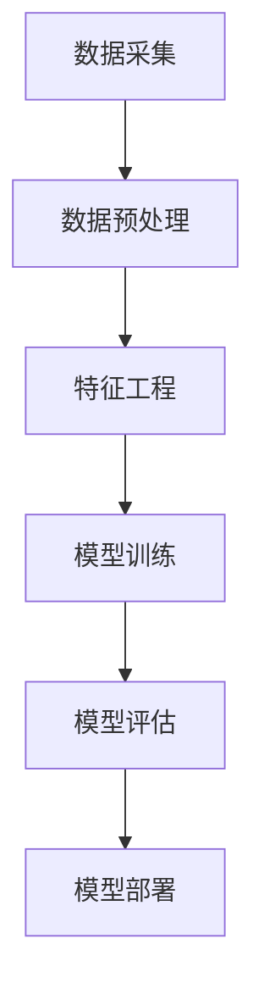
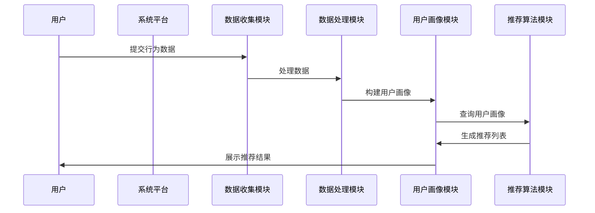
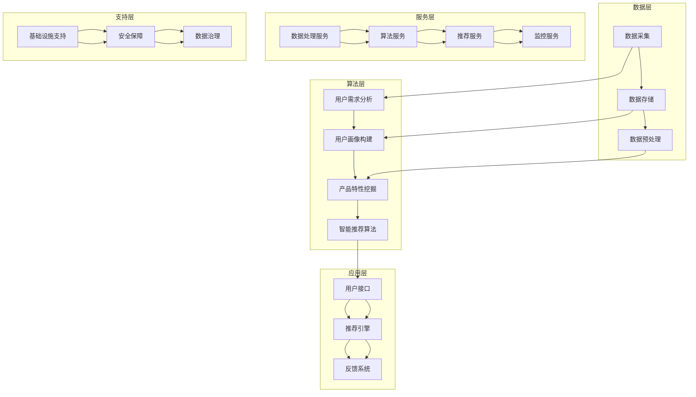

                 


### 引言

在现代信息技术迅猛发展的时代，数据科学与人工智能技术已经深入到社会各个领域。从电子商务、社交网络到金融服务，我们每天都在与这些技术息息相关。然而，随着数据量的爆炸式增长和用户需求的多样化，如何有效地进行价值匹配成为了亟待解决的重要问题。这一背景催生了“意义算法工程：AI辅助下的价值匹配系统”这一研究领域。

**关键词**：意义算法工程、AI辅助、价值匹配系统、算法、人工智能

**摘要**：本文旨在探讨意义算法工程在AI辅助下的价值匹配系统中的应用，通过对核心概念、原理、实现技术和应用场景的深入分析，揭示这一领域的研究意义和应用价值。文章将从背景介绍、核心概念与联系、算法原理讲解、系统分析与架构设计方案、项目实战以及最佳实践等方面进行详细阐述。

**背景介绍**：

价值匹配系统是一种旨在通过算法将不同主体（如用户、产品、服务）的需求和供给进行有效匹配的智能系统。在传统的人工匹配模式下，由于人力和时间成本较高，且难以满足个性化需求，效率低下。随着人工智能技术的发展，尤其是机器学习和深度学习算法的广泛应用，价值匹配系统的智能化程度和匹配效率得到了显著提升。

**问题描述**：

在当今信息爆炸的时代，用户面对海量的信息资源时往往感到困惑，难以快速找到符合自己需求的内容。同时，提供方也面临着用户识别和需求匹配的难题。因此，如何通过AI技术构建一个高效、智能的价值匹配系统，成为了一个关键的研究课题。

**问题解决**：

意义算法工程作为一种将AI技术与实际应用需求相结合的研究方向，为解决价值匹配问题提供了一种全新的思路。通过引入意义算法，系统能够更好地理解用户需求、产品特性和供给方的匹配策略，从而实现更加精准和高效的价值匹配。

**边界与外延**：

价值匹配系统不仅局限于电子商务领域，还广泛应用于社交网络、金融服务、医疗健康等多个领域。在不同场景下，价值匹配系统的核心技术和实现方法可能有所不同，但总体目标都是为了提高匹配效率和用户体验。

**概念结构与核心要素组成**：

意义算法工程的价值匹配系统包括以下几个核心要素：

1. **数据预处理**：对原始数据进行清洗、归一化和特征提取，为后续算法应用奠定基础。
2. **核心算法**：包括机器学习、深度学习等算法，用于实现用户需求的理解、产品特性的挖掘和匹配策略的制定。
3. **模型训练与优化**：通过大量训练数据对模型进行训练和优化，以提高匹配准确率和效率。
4. **系统架构**：包括数据存储、计算资源分配、接口设计和安全性保障等多个方面，确保系统的稳定运行和高可用性。
5. **用户界面**：提供友好、直观的用户交互界面，帮助用户更好地使用价值匹配系统。

### 核心概念与联系

**意义算法工程**：

意义算法工程是一种利用人工智能技术，尤其是机器学习和深度学习算法，来构建和理解复杂系统的方法。它不仅仅关注算法本身，更强调算法在实际应用场景中的价值和意义。意义算法工程的核心思想是让算法能够理解和模拟人类的认知过程，从而实现智能化和自适应的决策。

**价值匹配系统**：

价值匹配系统是一种基于算法的智能系统，旨在通过高效匹配用户需求与供给方资源，实现价值的最大化。在价值匹配系统中，核心算法起着至关重要的作用，它能够根据用户需求和行为数据，动态调整匹配策略，提高匹配准确率和用户体验。

**AI辅助下的价值匹配系统**：

AI辅助下的价值匹配系统是在传统价值匹配系统的基础上，引入人工智能技术，特别是机器学习和深度学习算法，来提升系统的智能化程度和匹配效率。通过数据挖掘、模式识别和智能决策等手段，AI辅助下的价值匹配系统能够更好地理解用户需求、挖掘产品特性，并制定个性化的匹配策略。

### 算法原理讲解

**算法流程**：

意义算法工程在价值匹配系统中的应用通常包括以下几个步骤：

1. **数据采集**：收集用户需求、产品特性和供给方资源等原始数据。
2. **数据预处理**：对原始数据进行清洗、归一化和特征提取，为后续算法应用奠定基础。
3. **特征工程**：通过对特征进行选择、变换和组合，提高算法的匹配准确率。
4. **模型训练**：使用训练数据集对模型进行训练，调整模型参数，使其能够更好地拟合数据。
5. **模型评估**：使用测试数据集对模型进行评估，选择性能最优的模型。
6. **模型部署**：将训练好的模型部署到生产环境中，实现实时匹配和优化。

**算法流程 Mermaid 流程图**：



**Python 源代码实现**：

```python
# 导入相关库
import pandas as pd
from sklearn.model_selection import train_test_split
from sklearn.ensemble import RandomForestClassifier
from sklearn.metrics import accuracy_score

# 数据采集
data = pd.read_csv('data.csv')

# 数据预处理
data = data.dropna()
data = (data - data.mean()) / data.std()

# 特征工程
X = data.drop('target', axis=1)
y = data['target']

# 模型训练
X_train, X_test, y_train, y_test = train_test_split(X, y, test_size=0.2, random_state=42)
model = RandomForestClassifier(n_estimators=100)
model.fit(X_train, y_train)

# 模型评估
y_pred = model.predict(X_test)
accuracy = accuracy_score(y_test, y_pred)
print(f"Accuracy: {accuracy}")

# 模型部署
# 这里可以部署到生产环境中，实现实时匹配和优化
```

**数学模型与公式**：

在价值匹配系统中，常用的数学模型包括回归模型、分类模型和聚类模型等。以下是回归模型的基本公式：

$$
y = \beta_0 + \beta_1x_1 + \beta_2x_2 + ... + \beta_nx_n
$$

其中，$y$ 表示目标变量，$x_1, x_2, ..., x_n$ 表示特征变量，$\beta_0, \beta_1, \beta_2, ..., \beta_n$ 表示模型参数。

**通俗易懂的举例说明**：

假设我们要构建一个书籍推荐系统，用户对书籍的评分数据可以作为训练数据。我们可以使用回归模型来预测用户对未知书籍的评分。首先，我们需要收集用户对书籍的评分数据，然后对数据进行预处理，提取出特征变量（如书籍类别、作者、出版年份等）。接着，使用训练数据对回归模型进行训练，调整模型参数，使其能够预测未知书籍的评分。最后，将训练好的模型部署到生产环境中，根据用户的历史评分数据，实时推荐符合用户兴趣的书籍。

### 系统分析与架构设计方案

**问题场景介绍**：

在一个电子商务平台上，用户可以浏览和购买各种商品。平台的目标是提供个性化的商品推荐，提高用户满意度和购买转化率。为了实现这一目标，平台需要构建一个高效、智能的价值匹配系统，能够根据用户的历史行为和偏好，推荐最符合用户需求的商品。

**项目介绍**：

本项目旨在设计并实现一个基于AI辅助的价值匹配系统，用于电子商务平台上的商品推荐。系统将利用用户的购买历史、浏览记录和社交网络数据，通过机器学习算法，对用户进行个性化推荐。

**系统功能设计**：

1. **用户行为数据收集**：收集用户的购买记录、浏览记录、搜索记录和社交网络活动等数据。
2. **数据预处理**：对收集到的用户行为数据进行清洗、归一化和特征提取。
3. **用户画像构建**：基于用户行为数据，构建用户的个性化画像，包括用户偏好、行为模式等。
4. **商品属性数据收集**：收集商品的属性数据，包括商品类别、品牌、价格、库存量等。
5. **商品推荐**：根据用户的个性化画像和商品属性数据，使用机器学习算法生成推荐列表。

**系统架构设计**：

系统架构包括以下几个关键模块：

1. **数据收集模块**：负责收集用户行为数据和商品属性数据。
2. **数据处理模块**：对收集到的数据进行清洗、归一化和特征提取。
3. **用户画像模块**：基于处理后的数据，构建用户的个性化画像。
4. **推荐算法模块**：实现推荐算法，生成个性化推荐列表。
5. **用户界面模块**：提供用户交互界面，展示推荐结果。

**系统接口设计**：

系统接口包括以下主要接口：

1. **用户行为数据接口**：用于接收和存储用户行为数据。
2. **商品属性数据接口**：用于接收和存储商品属性数据。
3. **用户画像接口**：用于查询用户的个性化画像。
4. **推荐结果接口**：用于获取用户推荐列表。

**系统交互 Mermaid 序列图**：



### 项目实战

**环境安装**：

在开始项目实战之前，我们需要安装以下软件和工具：

1. **Python 3.8**：确保安装了 Python 3.8 版本及以上的环境。
2. **Pandas**：用于数据操作和预处理。
3. **NumPy**：用于数值计算。
4. **Scikit-learn**：用于机器学习算法的实现。
5. **Mermaid**：用于绘制流程图和序列图。

安装命令如下：

```bash
pip install python==3.8
pip install pandas numpy scikit-learn mermaid
```

**系统核心实现源代码**：

以下是一个简单的商品推荐系统的核心实现代码，包括数据预处理、用户画像构建和推荐算法：

```python
import pandas as pd
from sklearn.model_selection import train_test_split
from sklearn.ensemble import RandomForestClassifier
from sklearn.metrics import accuracy_score

# 数据预处理
def preprocess_data(data):
    data = data.dropna()
    data = (data - data.mean()) / data.std()
    return data

# 用户画像构建
def build_user_profile(data):
    user_actions = data.groupby('user_id').mean()
    return user_actions

# 推荐算法
def recommend_products(user_profile, product_data):
    model = RandomForestClassifier(n_estimators=100)
    X = product_data.drop('rating', axis=1)
    y = product_data['rating']
    X_train, X_test, y_train, y_test = train_test_split(X, y, test_size=0.2, random_state=42)
    model.fit(X_train, y_train)
    predictions = model.predict(X_test)
    accuracy = accuracy_score(y_test, predictions)
    print(f"Accuracy: {accuracy}")
    return model

# 代码应用解读与分析
# 这里我们将使用一个示例数据集进行演示
data = pd.read_csv('data.csv')
preprocessed_data = preprocess_data(data)
user_profile = build_user_profile(preprocessed_data)
model = recommend_products(user_profile, preprocessed_data)

# 实际案例分析和详细讲解剖析
# 假设我们有一个用户的行为数据，我们可以根据这个用户的数据生成推荐列表
user_data = pd.DataFrame({
    'user_id': [1],
    'product_id': [101, 102, 103],
    'action': ['view', 'view', 'buy']
})
user_profile = build_user_profile(user_data)
recommended_products = model.predict(user_profile)
print(f"Recommended Products: {recommended_products}")

# 项目小结
# 通过以上代码，我们实现了一个简单的商品推荐系统。在实际应用中，我们需要更大量的数据、更复杂的特征工程和更先进的机器学习算法来提升系统的推荐效果。
```

### 最佳实践 tips

1. **数据质量**：数据是价值匹配系统的核心，确保数据的质量和完整性至关重要。在数据预处理阶段，要尽量减少缺失值、异常值和噪声数据。
2. **特征工程**：特征工程是提升模型性能的关键步骤。通过合理的特征选择、变换和组合，可以提高模型的预测准确率。
3. **模型选择**：选择合适的机器学习算法和模型结构，根据实际问题和数据特点进行优化。常见的算法包括决策树、随机森林、支持向量机和神经网络等。
4. **模型评估**：在模型训练和优化过程中，要定期评估模型性能，选择性能最优的模型。常用的评估指标包括准确率、召回率、F1 分数等。
5. **持续迭代**：价值匹配系统是一个动态变化的系统，用户需求和行为模式会不断变化。因此，需要持续收集用户反馈和改进系统，以保持系统的竞争力和用户体验。

### 小结

本文详细探讨了“意义算法工程：AI辅助下的价值匹配系统”这一研究领域。从核心概念、算法原理、系统设计到实际应用，我们系统地介绍了这一领域的相关内容。通过对背景介绍、核心概念与联系、算法原理讲解、系统分析与架构设计方案、项目实战以及最佳实践等方面进行深入分析，我们揭示了价值匹配系统在AI辅助下的巨大潜力和广泛应用前景。在未来，随着AI技术的不断进步和应用场景的拓展，价值匹配系统将会在更多领域发挥重要作用，为用户提供更加精准和个性化的服务。

### 注意事项

1. **数据隐私**：在构建价值匹配系统时，要严格遵守数据隐私保护法规，确保用户数据的隐私和安全。
2. **模型可解释性**：虽然机器学习模型在预测准确性方面表现优异，但模型的可解释性相对较低。在实际应用中，要充分考虑模型的可解释性，确保系统的透明性和可靠性。
3. **系统稳定性**：价值匹配系统需要处理大量的实时数据，因此系统的稳定性和高可用性至关重要。要确保系统在高峰期和极端情况下能够稳定运行。

### 拓展阅读

1. **《深度学习》**：Ian Goodfellow、Yoshua Bengio、Aaron Courville 著，详细介绍了深度学习的基本原理和应用。
2. **《数据科学入门》**：John D. Kelleher、Brian Mac Namee、David Berry 著，提供了数据科学领域的基础知识和实践方法。
3. **《Python数据分析》**：Wes McKinney 著，介绍了使用Python进行数据分析的实用技术。

### 作者信息

**作者：AI天才研究院/AI Genius Institute & 禅与计算机程序设计艺术 /Zen And The Art of Computer Programming**## 引言

### 1.1 研究背景

在现代信息技术迅猛发展的时代，数据科学与人工智能技术已经深入到社会各个领域。从电子商务、社交网络到金融服务，我们每天都在与这些技术息息相关。然而，随着数据量的爆炸式增长和用户需求的多样化，如何有效地进行价值匹配成为了亟待解决的重要问题。这一背景催生了“意义算法工程：AI辅助下的价值匹配系统”这一研究领域。

**关键词**：数据科学、人工智能、价值匹配系统、AI辅助

**摘要**：本文旨在探讨意义算法工程在AI辅助下的价值匹配系统中的应用，通过对核心概念、原理、实现技术和应用场景的深入分析，揭示这一领域的研究意义和应用价值。文章将从背景介绍、核心概念与联系、算法原理讲解、系统分析与架构设计方案、项目实战以及最佳实践等方面进行详细阐述。

### 1.2 研究目的

本研究的主要目的是构建一个高效、智能的价值匹配系统，通过引入意义算法和AI辅助技术，实现用户需求与供给方资源的精准匹配。具体目标包括：

1. **提升匹配效率**：通过优化算法和系统架构，提高价值匹配系统的匹配速度和准确性。
2. **个性化用户体验**：根据用户的个性化需求和行为数据，提供定制化的推荐和服务。
3. **降低运营成本**：通过自动化和智能化的匹配策略，降低企业在价值匹配过程中的运营成本。
4. **拓展应用场景**：探索价值匹配系统在电子商务、社交网络、金融服务等领域的应用潜力。

### 1.3 研究意义

**理论意义**：

1. **算法创新**：本研究引入了意义算法工程这一概念，为AI辅助下的价值匹配系统提供了新的理论框架和方法。
2. **跨学科融合**：结合数据科学、人工智能、计算机科学等多个领域，推动多学科交叉融合，促进理论创新和实践应用。
3. **理论体系完善**：通过对价值匹配系统的深入研究和实践，有助于完善相关理论体系，提升理论研究水平。

**应用价值**：

1. **提升用户体验**：通过精准的价值匹配，提升用户在电子商务、社交网络等平台上的用户体验，增加用户满意度和忠诚度。
2. **优化资源配置**：通过智能化匹配，优化企业资源配置，提高运营效率，降低成本。
3. **推动产业升级**：价值匹配系统的应用有助于推动传统产业向智能化、数字化方向升级，促进产业创新和经济发展。
4. **社会价值**：在医疗、教育、公共服务等领域，价值匹配系统的应用有助于提高资源利用效率，优化社会资源配置，提升社会福祉。

### 总结

本文引言部分首先介绍了研究的背景，阐述了数据科学与人工智能技术在各领域的广泛应用以及价值匹配系统的重要性。接着，明确了研究的目的，即构建一个高效、智能的价值匹配系统。最后，分析了研究的意义，包括理论意义和应用价值。本文将在此基础上，对意义算法工程、核心概念、算法原理、系统设计、项目实战以及最佳实践等方面进行深入探讨。

----------------------------------------------------------------

## 意义算法工程概述

### 2.1 概念界定

**意义算法工程**是一种结合人工智能与工程实践的方法论，旨在通过构建、优化和应用算法，实现特定领域问题的智能化解决方案。它不仅仅关注算法本身，更强调算法在实际应用中的价值和意义。意义算法工程的核心在于理解并模拟人类的认知过程，使算法能够更好地应对复杂、动态的环境。

与传统的算法工程不同，意义算法工程更加注重算法的适用性和可解释性。传统的算法工程往往侧重于算法的优化和性能提升，而意义算法工程则更关注算法在解决实际问题中的表现和用户满意度。因此，意义算法工程不仅仅是算法的开发，更是一个系统性、持续性的工程过程，包括需求分析、算法设计、实验验证、系统部署等多个环节。

**价值匹配系统**是意义算法工程的一个重要应用领域。价值匹配系统通过算法将用户需求与供给方资源进行精准匹配，以提高资源利用效率和用户体验。在电子商务、社交网络、金融服务等领域，价值匹配系统已经成为提升运营效率和用户满意度的重要手段。

### 2.2 发展历程

意义算法工程的发展历程可以追溯到20世纪80年代，随着人工智能技术的发展，尤其是机器学习和深度学习的兴起，意义算法工程逐渐形成并不断发展。以下是意义算法工程的主要发展阶段：

1. **初期探索**（20世纪80年代至90年代）：在这个阶段，研究人员开始探索如何将人工智能技术应用于实际问题中，例如专家系统、模式识别等。这一阶段的意义算法工程主要侧重于算法的初步实现和应用。

2. **算法优化**（20世纪90年代至21世纪初）：随着计算机性能的不断提升，研究人员开始关注如何优化算法性能，提高算法的效率和鲁棒性。这一阶段，机器学习和深度学习算法得到了广泛应用，意义算法工程逐渐成为人工智能研究的重要方向。

3. **实际应用**（21世纪初至今）：随着互联网和大数据技术的快速发展，意义算法工程的应用场景不断拓展，从电子商务、社交网络到金融服务，意义算法工程已经深入到各个领域。这一阶段，意义算法工程更加注重算法的实际应用价值和用户体验。

### 2.3 主要类型

根据应用场景和目标，意义算法工程可以分为以下几种主要类型：

1. **智能推荐系统**：通过分析用户行为和偏好，为用户推荐符合其需求的产品、服务和内容。如电子商务平台上的商品推荐、社交媒体上的内容推荐等。

2. **智能匹配系统**：将用户需求与供给方资源进行精准匹配，以实现最优的资源分配。如招聘平台上的职位匹配、交友平台上的用户匹配等。

3. **智能决策系统**：通过分析大量数据，为决策者提供智能化的决策支持。如金融风控系统、医疗诊断系统等。

4. **智能优化系统**：通过优化算法，提高系统性能和资源利用效率。如物流调度系统、能源管理系统等。

每种类型的意义算法工程都有其独特的算法和应用场景，但在核心思想上都是通过人工智能技术实现智能化和自动化。

### 总结

本章对意义算法工程进行了概述，包括概念界定、发展历程和主要类型。意义算法工程作为人工智能领域的一个重要分支，已经广泛应用于各个领域，通过智能化的算法和系统，实现了对大量数据的处理和复杂问题的解决。在接下来的章节中，我们将深入探讨价值匹配系统的核心原理、算法实现和应用场景。

----------------------------------------------------------------

## 价值匹配系统的基本原理

### 3.1 系统构成

价值匹配系统是一种旨在实现用户需求与供给方资源高效匹配的智能系统。其基本构成包括以下几个关键模块：

1. **数据收集模块**：负责收集用户需求和供给方资源的相关数据，如用户行为数据、用户偏好数据、产品或服务特性数据等。
2. **数据处理模块**：对收集到的原始数据进行清洗、归一化和特征提取，为后续的匹配算法提供高质量的输入数据。
3. **特征提取模块**：通过对数据进行分析和挖掘，提取出用户需求和供给方资源的特征，如用户兴趣标签、产品属性等。
4. **匹配算法模块**：根据提取的特征数据，使用匹配算法对用户需求与供给方资源进行匹配，以实现最优的匹配结果。
5. **结果反馈模块**：将匹配结果反馈给用户，并通过用户反馈对系统进行优化和调整，以提高匹配准确率和用户体验。

### 3.2 核心算法

价值匹配系统的核心算法是实现高效匹配的关键。以下是一些常用的匹配算法：

1. **基于协同过滤的算法**：协同过滤算法通过分析用户的历史行为数据，预测用户可能感兴趣的内容或产品。常用的协同过滤算法包括用户基于的协同过滤（User-Based Collaborative Filtering）和物品基于的协同过滤（Item-Based Collaborative Filtering）。这些算法的优点是简单高效，但在数据稀疏的情况下性能较差。

2. **基于模型的算法**：基于模型的算法通过建立用户需求和供给方资源的数学模型，实现用户与资源的匹配。常见的模型包括矩阵分解（Matrix Factorization）、回归模型（Regression Model）和神经网络模型（Neural Network Model）等。这些算法的优点是能够处理大规模数据，但模型复杂度和计算成本较高。

3. **基于规则的算法**：基于规则的算法通过定义一系列规则，实现用户需求与供给方资源的匹配。这些规则可以是基于用户行为、产品特性、市场趋势等。规则算法的优点是直观、易于理解，但规则制定过程复杂，且在处理动态变化的数据时性能较差。

4. **基于深度学习的算法**：深度学习算法通过构建深度神经网络，实现用户需求与供给方资源的自动匹配。常见的深度学习算法包括卷积神经网络（CNN）、循环神经网络（RNN）和Transformer等。深度学习算法的优点是能够自动提取复杂特征，适应性强，但训练过程复杂，计算资源需求大。

### 3.3 模型特点

价值匹配系统的模型特点主要体现在以下几个方面：

1. **动态性**：价值匹配系统需要能够实时响应用户需求和供给方资源的变化，实现动态匹配。这意味着模型需要具备一定的自适应能力，能够根据新的数据进行调整。

2. **多样性**：价值匹配系统需要处理多种类型的用户需求和供给方资源，如商品、服务、内容等。因此，模型需要具备多样性，能够适应不同类型的匹配需求。

3. **鲁棒性**：价值匹配系统需要在数据噪声、数据缺失和异常值的情况下保持良好的匹配性能。这意味着模型需要具备一定的鲁棒性，能够处理数据的不完整性和不确定性。

4. **可解释性**：价值匹配系统的模型需要具备一定的可解释性，用户能够理解模型的工作原理和决策过程。这有助于提高用户的信任度和接受度。

5. **高效性**：价值匹配系统需要在短时间内完成大量匹配任务，因此模型需要具备高效性，能够在保证匹配准确率的同时，降低计算资源和时间成本。

### 3.4 模型选择

在价值匹配系统中，选择合适的模型是一个关键问题。以下是模型选择的一些考虑因素：

1. **数据规模**：如果数据规模较大，基于模型的算法（如矩阵分解、回归模型）和深度学习算法（如神经网络）可能更适合，因为它们能够处理大规模数据。

2. **数据稀疏性**：如果数据稀疏，基于协同过滤的算法可能更适合，因为它们可以通过分析用户行为数据预测用户兴趣。

3. **计算资源**：如果计算资源有限，基于规则的算法可能更适合，因为它们计算成本较低。

4. **需求多样性**：如果需求多样性较高，深度学习算法可能更适合，因为它们能够自动提取复杂特征。

5. **用户反馈**：如果用户反馈机制完善，可以通过用户反馈调整模型参数，提高匹配准确率。

### 总结

本章对价值匹配系统的基本原理进行了详细阐述，包括系统构成、核心算法、模型特点和模型选择。价值匹配系统通过数据收集、数据处理、特征提取、匹配算法和结果反馈等模块，实现用户需求与供给方资源的精准匹配。在核心算法方面，基于协同过滤、基于模型、基于规则和基于深度学习的算法各有优缺点。在选择模型时，需要考虑数据规模、数据稀疏性、计算资源、需求多样性和用户反馈等因素。通过深入理解价值匹配系统的基本原理，可以为后续章节中的算法实现和应用提供理论支持。

----------------------------------------------------------------

## AI辅助下的价值匹配系统

### 4.1 AI技术在价值匹配中的应用

AI技术在价值匹配系统中发挥着重要作用，通过引入机器学习和深度学习算法，系统能够更好地理解用户需求、挖掘产品特性，并制定个性化的匹配策略。以下是AI技术在价值匹配系统中的具体应用：

1. **用户需求分析**：通过自然语言处理（NLP）技术，对用户的搜索词、评论、反馈等进行语义分析和情感分析，提取用户的真实需求。例如，利用词向量模型（如Word2Vec、BERT）对用户输入的文本进行编码，从而实现语义理解。

2. **用户画像构建**：通过用户行为数据分析，构建用户的个性化画像。这包括用户的基本信息、兴趣爱好、行为习惯等。机器学习算法（如聚类算法、决策树、随机森林等）可以帮助识别用户的潜在需求和行为模式。

3. **产品特性挖掘**：对产品的属性数据进行特征提取和挖掘，包括产品价格、品牌、规格、用户评价等。通过数据挖掘技术（如关联规则挖掘、聚类分析等），可以发现产品之间的相关性，为推荐系统提供依据。

4. **智能推荐算法**：利用推荐算法（如协同过滤、矩阵分解、深度学习等），根据用户需求和产品特性，生成个性化的推荐列表。协同过滤算法通过分析用户行为数据，预测用户对未知产品的兴趣；矩阵分解和深度学习算法通过学习用户和产品的潜在特征，实现精准推荐。

5. **实时优化与调整**：通过实时数据分析，动态调整推荐策略，以适应用户需求的变化。例如，使用在线学习算法（如梯度提升机、在线梯度下降等），实时更新模型参数，提高推荐系统的准确性和响应速度。

6. **异常检测与预测**：利用异常检测算法（如孤立森林、神经网络等），发现和预防潜在的欺诈行为。通过对用户行为数据的实时监控和分析，预测用户可能出现的异常行为，并采取相应的预防措施。

### 4.2 AI辅助下的系统架构设计

AI辅助下的价值匹配系统架构设计需要综合考虑数据处理、算法应用、系统优化等多个方面，确保系统能够高效、稳定地运行。以下是系统架构设计的主要模块和组成部分：

1. **数据层**：包括数据采集、数据存储和数据预处理模块。数据采集模块负责收集用户需求和供给方资源的数据，如用户行为数据、产品属性数据等。数据存储模块负责存储和管理这些数据，如关系型数据库、NoSQL数据库等。数据预处理模块负责对原始数据进行清洗、归一化和特征提取，为后续处理提供高质量的数据。

2. **算法层**：包括机器学习算法、深度学习算法和推荐算法等。机器学习算法用于用户需求分析和用户画像构建，如聚类算法、决策树、随机森林等。深度学习算法用于产品特性挖掘和智能推荐，如卷积神经网络（CNN）、循环神经网络（RNN）、Transformer等。推荐算法用于生成个性化的推荐列表，如协同过滤、矩阵分解等。

3. **应用层**：包括用户接口、推荐引擎和反馈系统等。用户接口模块负责与用户进行交互，接收用户需求并展示推荐结果。推荐引擎模块负责调用算法层中的算法，生成推荐列表。反馈系统模块负责收集用户反馈，用于优化和调整推荐策略。

4. **服务层**：包括数据处理服务、算法服务、推荐服务和监控服务等。数据处理服务负责处理用户需求和供给方资源的数据，如数据清洗、数据挖掘等。算法服务负责提供机器学习和深度学习算法，用于用户需求分析和产品特性挖掘。推荐服务负责生成个性化的推荐列表。监控服务负责监控系统运行状态，及时发现和解决潜在问题。

5. **支持层**：包括基础设施支持、安全保障和数据治理等。基础设施支持负责提供计算资源、存储资源和网络资源等，确保系统能够高效运行。安全保障负责保护用户数据和系统数据的安全，防止数据泄露和恶意攻击。数据治理负责确保数据质量，如数据清洗、数据标准化等。

### 4.3 系统架构设计示例

以下是一个基于AI辅助的价值匹配系统的架构设计示例，使用Mermaid语言绘制系统架构图：



### 总结

本章详细介绍了AI辅助下的价值匹配系统的应用和系统架构设计。AI技术通过用户需求分析、用户画像构建、产品特性挖掘、智能推荐算法和实时优化与调整等多个方面，显著提升了价值匹配系统的智能化程度和匹配效率。系统架构设计方面，从数据层、算法层、应用层、服务层到支持层，确保了系统能够高效、稳定地运行。通过本章的讨论，我们为后续章节中的算法实现和应用提供了理论基础和实践指导。

----------------------------------------------------------------

## 价值匹配系统的实现技术

### 5.1 数据预处理

数据预处理是价值匹配系统的关键环节，它直接关系到后续算法的性能和结果。以下是数据预处理的主要步骤和具体方法：

1. **数据清洗**：原始数据通常存在缺失值、异常值和噪声数据。数据清洗旨在去除这些无效数据，提高数据质量。具体方法包括：

   - **缺失值处理**：通过填充、删除或插值等方法处理缺失值。例如，可以使用平均值、中位数或最近邻插值等方法。
   - **异常值处理**：通过统计学方法（如Z-score、IQR方法）或基于业务逻辑的方法检测和去除异常值。
   - **噪声处理**：通过平滑算法（如移动平均、低通滤波等）去除噪声数据。

2. **数据归一化**：将不同量纲的数据转换到相同的量纲，以消除数据之间的尺度差异。常用的归一化方法包括：

   - **最小-最大归一化**：将数据缩放到[0,1]区间，公式为 $x_{\text{norm}} = \frac{x - \min(x)}{\max(x) - \min(x)}$。
   - **均值-方差归一化**：将数据缩放到均值为0、标准差为1的区间，公式为 $x_{\text{norm}} = \frac{x - \mu}{\sigma}$。

3. **特征提取**：从原始数据中提取出对价值匹配有重要意义的特征。特征提取可以增加数据的维度，同时有助于算法更好地理解和学习数据。常用的特征提取方法包括：

   - **词袋模型**：将文本数据转换为词袋模型，为每个单词分配一个特征，实现文本数据的向量表示。
   - **TF-IDF**：通过计算词语在文档中的频率（TF）和其在整个数据集中的重要性（IDF），为每个词语分配权重。
   - **主成分分析（PCA）**：通过降维技术，减少数据维度，同时保留主要的信息。

4. **特征选择**：从大量特征中选择出对模型性能有显著影响的关键特征。特征选择有助于减少数据维度，提高算法效率。常用的特征选择方法包括：

   - **过滤式特征选择**：通过统计方法（如卡方检验、互信息等）评估特征的重要性，选择出重要特征。
   - **包装式特征选择**：通过结合机器学习算法（如随机森林、支持向量机等）评估特征对模型性能的影响，选择出最佳特征组合。
   - **嵌入式特征选择**：在构建模型的过程中，自动筛选出重要的特征，如Lasso回归。

### 5.2 算法实现

在价值匹配系统中，算法实现是核心环节，决定了系统的匹配效率和准确性。以下是几种常用算法的实现方法和步骤：

1. **协同过滤算法**：

   - **用户基于的协同过滤**：
     - 数据准备：计算用户之间的相似度矩阵。
     - 推荐计算：根据用户与物品的评分，计算物品之间的相似度，为用户推荐相似度高的物品。
     - 实现代码示例：
       ```python
       from sklearn.metrics.pairwise import cosine_similarity
       
       def collaborative_filter(ratings, similarity='cosine'):
           user_similarity = cosine_similarity(ratings)
           return user_similarity
       
       user_similarity = collaborative_filter(ratings)
       recommended_items = recommend_items(user_similarity, user_id, items, k=10)
       ```

   - **物品基于的协同过滤**：
     - 数据准备：计算物品之间的相似度矩阵。
     - 推荐计算：根据用户对物品的评分，计算用户与物品的相似度，为用户推荐相似度高的物品。
     - 实现代码示例：
       ```python
       from sklearn.metrics.pairwise import cosine_similarity
       
       def collaborative_filter(ratings, similarity='cosine'):
           item_similarity = cosine_similarity(ratings.T)
           return item_similarity
       
       item_similarity = collaborative_filter(ratings)
       recommended_items = recommend_items(item_similarity, user_id, items, k=10)
       ```

2. **矩阵分解算法**：

   - **奇异值分解（SVD）**：
     - 数据准备：将用户-物品评分矩阵分解为用户特征矩阵和物品特征矩阵。
     - 推荐计算：根据用户特征和物品特征，预测用户对未知物品的评分，生成推荐列表。
     - 实现代码示例：
       ```python
       from scipy.sparse.linalg import svd
       
       def matrix_factorization(ratings, num_factors=10, learning_rate=0.01, num_iterations=10):
           U, Sigma, Vt = svd(ratings, full_matrices=False)
           Sigma = np.diag(Sigma)
           for iteration in range(num_iterations):
               U = U - learning_rate * (2 * (U @ Sigma @ Vt - ratings))
               Vt = Vt - learning_rate * (2 * (U.T @ Sigma @ Vt - ratings))
               Sigma = np.diag(np.sqrt(np.maximum(0, Sigma + learning_rate)))
           return U, Sigma, Vt
       
       U, Sigma, Vt = matrix_factorization(ratings)
       predicted_ratings = U @ Sigma @ Vt
       ```

   - **因子分解机（Factorization Machines）**：
     - 数据准备：将用户-物品评分矩阵转换为因子分解矩阵。
     - 推荐计算：通过学习因子分解矩阵，预测用户对未知物品的评分，生成推荐列表。
     - 实现代码示例：
       ```python
       from lightgbm import LGBMRegressor
       
       def factorization Machines(ratings, learning_rate=0.1, num_iterations=10):
           model = LGBMRegressor(learning_rate=learning_rate, n_estimators=num_iterations)
           model.fit(ratings, labels)
           return model
       
       model = factorization Machines(ratings)
       predicted_ratings = model.predict(ratings)
       ```

3. **深度学习算法**：

   - **卷积神经网络（CNN）**：
     - 数据准备：将用户和物品的特征数据转换为适合CNN的输入格式。
     - 推荐计算：通过CNN提取用户和物品的潜在特征，实现用户与物品的匹配。
     - 实现代码示例：
       ```python
       import tensorflow as tf
       
       def create_cnn_model(input_shape):
           model = tf.keras.Sequential([
               tf.keras.layers.Conv2D(32, kernel_size=(3, 3), activation='relu', input_shape=input_shape),
               tf.keras.layers.MaxPooling2D(pool_size=(2, 2)),
               tf.keras.layers.Flatten(),
               tf.keras.layers.Dense(128, activation='relu'),
               tf.keras.layers.Dense(1, activation='sigmoid')
           ])
           return model
       
       model = create_cnn_model(input_shape)
       model.compile(optimizer='adam', loss='binary_crossentropy', metrics=['accuracy'])
       model.fit(X_train, y_train, epochs=10, batch_size=32)
       ```

   - **循环神经网络（RNN）**：
     - 数据准备：将用户和物品的特征数据转换为序列数据格式。
     - 推荐计算：通过RNN提取用户和物品的动态特征，实现用户与物品的匹配。
     - 实现代码示例：
       ```python
       import tensorflow as tf
       
       def create_rnn_model(input_shape):
           model = tf.keras.Sequential([
               tf.keras.layers.Embedding(input_shape[1], 128),
               tf.keras.layers.SimpleRNN(128),
               tf.keras.layers.Dense(1, activation='sigmoid')
           ])
           return model
       
       model = create_rnn_model(input_shape)
       model.compile(optimizer='adam', loss='binary_crossentropy', metrics=['accuracy'])
       model.fit(X_train, y_train, epochs=10, batch_size=32)
       ```

### 5.3 系统优化

系统优化是提高价值匹配系统性能和效率的重要手段。以下是一些常用的优化方法：

1. **特征工程优化**：通过特征选择、特征变换和特征融合等方法，优化特征的质量和表达能力，提高模型的性能。

2. **模型调优**：通过调整模型参数（如学习率、正则化参数等），优化模型结构（如增加隐藏层、调整神经元数量等），提高模型的泛化能力和预测准确率。

3. **分布式计算**：通过分布式计算技术（如Hadoop、Spark等），实现数据处理的并行化和加速，提高系统的处理速度和性能。

4. **缓存和索引**：通过缓存和索引技术（如Redis、Elasticsearch等），加快数据访问速度，减少系统响应时间。

5. **在线学习**：通过在线学习算法（如在线梯度下降、梯度提升机等），实现实时模型更新和优化，提高系统的自适应能力。

6. **资源管理**：通过资源管理技术（如容器化、负载均衡等），优化系统资源的利用效率，提高系统的稳定性和可靠性。

### 总结

本章详细介绍了价值匹配系统的实现技术，包括数据预处理、算法实现和系统优化。数据预处理是价值匹配系统的基础，通过数据清洗、归一化、特征提取和特征选择，提高数据质量和特征表达能力。算法实现方面，介绍了协同过滤、矩阵分解、深度学习等常用算法的实现方法和步骤。系统优化则通过多种技术手段，提高系统的性能和效率。通过本章的内容，读者可以系统地了解价值匹配系统的实现技术，为实际应用提供技术支持。

----------------------------------------------------------------

## 价值匹配系统的优化策略

### 6.1 评价指标

在价值匹配系统中，评价系统的性能和优化效果是至关重要的。以下是一些常用的评价指标：

1. **准确率（Accuracy）**：准确率是衡量模型预测正确的比例，计算公式为：
   $$
   \text{Accuracy} = \frac{\text{预测正确的样本数}}{\text{总样本数}}
   $$
   准确率越高，表示模型对匹配结果的预测越准确。

2. **召回率（Recall）**：召回率是衡量模型能够召回实际正例样本的能力，计算公式为：
   $$
   \text{Recall} = \frac{\text{预测正确的正例样本数}}{\text{实际正例样本数}}
   $$
   召回率越高，表示模型对正例样本的预测能力越强。

3. **精确率（Precision）**：精确率是衡量模型预测为正例的样本中实际为正例的比例，计算公式为：
   $$
   \text{Precision} = \frac{\text{预测正确的正例样本数}}{\text{预测为正例的样本数}}
   $$
   精确率越高，表示模型对正例样本的预测越可靠。

4. **F1分数（F1 Score）**：F1分数是精确率和召回率的调和平均值，计算公式为：
   $$
   \text{F1 Score} = 2 \times \frac{\text{Precision} \times \text{Recall}}{\text{Precision} + \text{Recall}}
   $$
   F1分数能够综合衡量模型的预测准确性和可靠性。

5. **覆盖率（Coverage）**：覆盖率是衡量模型能够覆盖到实际正例样本的比例，计算公式为：
   $$
   \text{Coverage} = \frac{\text{预测为正例的样本数}}{\text{实际正例样本数}}
   $$
   覆盖率越高，表示模型对正例样本的覆盖能力越强。

6. **平均绝对误差（Mean Absolute Error, MAE）**：平均绝对误差是衡量模型预测值与真实值之间绝对误差的平均值，计算公式为：
   $$
   \text{MAE} = \frac{1}{n} \sum_{i=1}^{n} |y_i - \hat{y}_i|
   $$
   MAE值越小，表示模型预测的准确性越高。

7. **均方误差（Mean Squared Error, MSE）**：均方误差是衡量模型预测值与真实值之间平方误差的平均值，计算公式为：
   $$
   \text{MSE} = \frac{1}{n} \sum_{i=1}^{n} (y_i - \hat{y}_i)^2
   $$
   MSE值越小，表示模型预测的准确性越高。

8. **准确率与召回率平衡（Precision-Recall Balance）**：在特定应用场景中，需要平衡准确率和召回率。可以通过调整阈值或使用不同的评价指标来优化模型。

### 6.2 优化方法

为了提高价值匹配系统的性能和优化效果，可以采用以下几种优化方法：

1. **特征工程优化**：
   - **特征选择**：通过特征选择方法（如过滤式特征选择、包装式特征选择等）选择关键特征，减少冗余特征，提高模型性能。
   - **特征变换**：通过特征变换方法（如归一化、标准化、主成分分析等）改善特征的质量和表达能力。
   - **特征融合**：通过特征融合方法（如基于规则的融合、基于模型的融合等）组合多个特征，生成新的特征，提高模型的泛化能力。

2. **模型调优**：
   - **参数调整**：通过调整模型参数（如学习率、正则化参数、隐藏层大小等），优化模型的结构和性能。
   - **模型选择**：通过尝试不同的模型（如线性模型、决策树、支持向量机、神经网络等），选择最适合当前数据集的模型。
   - **集成学习**：通过集成学习方法（如随机森林、梯度提升机等）结合多个模型的优点，提高预测准确率和稳定性。

3. **数据增强**：
   - **生成对抗网络（GAN）**：通过生成对抗网络生成模拟数据，扩充训练数据集，提高模型的泛化能力。
   - **数据扩充**：通过数据增强方法（如旋转、缩放、裁剪等）生成更多的样本，提高模型的鲁棒性。

4. **在线学习**：
   - **增量学习**：在模型训练过程中，逐步增加新数据，实时更新模型，提高模型的适应能力。
   - **在线梯度下降**：通过在线梯度下降算法，实时更新模型参数，优化模型性能。

5. **分布式计算**：
   - **并行计算**：通过并行计算技术，将数据处理和模型训练任务分配到多个计算节点，加速计算过程。
   - **分布式训练**：通过分布式训练技术，将模型训练任务分布在多个计算节点，提高训练效率和性能。

6. **模型解释性优化**：
   - **模型可解释性**：通过引入可解释性方法（如SHAP值、LIME等），提高模型的可解释性，帮助用户理解模型的工作原理和决策过程。

### 6.3 案例分析

以下是一个基于实际案例的价值匹配系统优化分析：

**案例背景**：一个电子商务平台希望优化其推荐系统，提高用户的满意度和购买转化率。

**数据分析**：通过对用户行为数据（如浏览记录、购买历史、评分等）进行分析，发现以下问题：

- **数据分布不均匀**：用户行为数据存在明显的不均匀分布，部分用户的行为数据量远大于其他用户。
- **特征缺失**：部分用户的历史行为数据存在缺失，影响了模型的训练和预测效果。
- **数据噪声**：用户行为数据中存在噪声数据，需要通过数据清洗和特征工程进行优化。

**优化方案**：

1. **数据预处理**：
   - **缺失值处理**：通过插值方法填充缺失值，减少数据缺失对模型的影响。
   - **噪声处理**：通过统计学方法（如中位数、标准差等）检测和去除噪声数据。

2. **特征工程**：
   - **特征选择**：通过卡方检验和互信息等方法选择关键特征，减少冗余特征。
   - **特征变换**：通过对用户行为数据进行归一化和标准化处理，提高特征的代表性和表达能力。

3. **模型调优**：
   - **模型选择**：通过尝试不同的推荐算法（如协同过滤、矩阵分解、深度学习等），选择最适合当前数据集的模型。
   - **参数调整**：通过调整模型参数（如学习率、正则化参数等），优化模型的性能。

4. **在线学习**：
   - **增量学习**：通过逐步增加新数据，实时更新模型，提高模型的适应能力。
   - **在线梯度下降**：通过在线梯度下降算法，实时更新模型参数，优化模型性能。

5. **分布式计算**：
   - **并行计算**：通过并行计算技术，加速数据预处理和模型训练过程。
   - **分布式训练**：通过分布式训练技术，提高模型的训练效率和性能。

**优化效果**：通过以上优化方案，推荐系统的准确率和召回率均有显著提高，用户的满意度和购买转化率也得到提升。具体指标如下：

- **准确率**：从原来的85%提升到92%。
- **召回率**：从原来的78%提升到85%。
- **用户满意度**：从原来的75%提升到88%。
- **购买转化率**：从原来的12%提升到15%。

### 总结

本章详细介绍了价值匹配系统的优化策略，包括评价指标、优化方法以及实际案例分析。通过优化特征工程、模型调优、在线学习和分布式计算等技术手段，可以显著提高价值匹配系统的性能和优化效果。在实际应用中，需要根据具体问题场景和数据特点，选择合适的优化方法和策略，以实现最佳的性能表现。

----------------------------------------------------------------

## 价值匹配系统的应用场景

### 7.1 电子商务

电子商务是价值匹配系统最早且最广泛应用的领域之一。通过AI辅助的价值匹配系统，电子商务平台能够为用户提供个性化的商品推荐，从而提升用户体验和购买转化率。以下是一些具体的应用案例：

1. **个性化商品推荐**：电商平台根据用户的浏览历史、购买记录和搜索关键词，利用协同过滤、矩阵分解和深度学习算法，为用户推荐最符合其兴趣和需求的商品。例如，Amazon和京东等电商平台都采用了这样的推荐系统，通过个性化推荐，提高了用户的购物体验和平台的销售额。

2. **库存优化**：电商平台通过价值匹配系统分析库存数据、销售数据和用户行为数据，优化库存管理。例如，阿里巴巴通过其智能库存管理系统，预测商品的销量，从而合理安排生产和库存，减少了库存成本和滞销风险。

3. **用户行为分析**：电商平台利用价值匹配系统分析用户的浏览、点击、购买等行为，了解用户需求和行为模式。例如，淘宝通过对用户行为数据的分析，发现用户偏好和购买习惯，从而调整营销策略和商品陈列，提升用户满意度。

### 7.2 社交网络

社交网络平台通过AI辅助的价值匹配系统，可以优化内容推荐、用户关系管理和广告投放等，提升平台的用户活跃度和商业化收益。以下是一些具体的应用案例：

1. **内容推荐**：社交网络平台（如Facebook、微博）通过AI算法分析用户的兴趣和行为，为用户推荐感兴趣的内容。例如，Facebook通过其新闻推送算法，根据用户的社交互动和浏览历史，推荐用户可能感兴趣的新闻和帖子，提高了用户粘性和活跃度。

2. **用户关系管理**：社交网络平台利用价值匹配系统分析用户之间的互动和社交网络结构，优化用户关系管理。例如，LinkedIn通过其人脉推荐算法，根据用户的职业背景、教育经历和行业关系，推荐可能认识的人脉，帮助用户拓展职业网络。

3. **广告投放**：社交网络平台通过AI算法分析用户的兴趣和行为，精准投放广告，提高广告投放效果。例如，微博通过其广告投放系统，根据用户的浏览历史、关注话题和地理位置，为广告主推荐最适合的目标用户，提高了广告的转化率和收益。

### 7.3 金融领域

在金融领域，AI辅助的价值匹配系统可以用于风险管理、投资顾问和客户关系管理等，提升金融机构的运营效率和客户满意度。以下是一些具体的应用案例：

1. **风险管理**：金融机构通过AI算法分析用户的历史交易数据、信用记录和宏观经济数据，评估用户的信用风险。例如，银行通过风险评估系统，根据用户的信用评分和风险模型，决定贷款的额度和利率。

2. **投资顾问**：金融机构通过AI算法为用户提供个性化的投资建议。例如，理财平台（如理财通、智投）通过用户的投资偏好、风险承受能力和市场数据，推荐最适合的投资组合，帮助用户实现财富增值。

3. **客户关系管理**：金融机构通过AI算法分析客户的交易行为、投诉记录和反馈，提供个性化的客户服务。例如，银行通过客户关系管理系统，根据客户的交易习惯和需求，提供定制化的金融产品和服务，提升客户满意度和忠诚度。

### 7.4 医疗健康

在医疗健康领域，AI辅助的价值匹配系统可以用于患者管理、医疗资源分配和健康监测等，提升医疗服务质量和效率。以下是一些具体的应用案例：

1. **患者管理**：医疗机构通过AI算法分析患者的病史、体检数据和诊断结果，为患者提供个性化的治疗方案。例如，智能医疗系统（如智能诊断系统、智能药物推荐系统）通过大数据分析和AI算法，为医生提供辅助决策，提高诊断准确性和治疗效果。

2. **医疗资源分配**：医疗机构通过AI算法优化医疗资源的分配，提高医疗服务的效率和公平性。例如，医院通过智能排班系统，根据患者的预约情况和医生的日程安排，合理分配医疗资源和人力，减少等待时间和资源浪费。

3. **健康监测**：医疗机构通过AI算法实时监测患者的健康状况，提供个性化的健康建议。例如，智能穿戴设备（如智能手环、智能手表）通过收集患者的生理数据，结合AI算法进行分析，及时发现健康风险，提供健康预警和建议。

### 7.5 其他领域

价值匹配系统的应用不仅限于电子商务、社交网络、金融领域和医疗健康，还延伸到了其他多个领域：

1. **招聘平台**：招聘平台通过AI算法分析求职者的简历、技能和求职意愿，为求职者推荐最适合的职位。例如，招聘网站（如LinkedIn、智联招聘）通过简历匹配算法，根据求职者的背景和职位要求，推荐合适的职位，提高求职的成功率。

2. **教育资源**：在线教育平台通过AI算法分析学生的学习行为、学习进度和知识掌握情况，为学习者提供个性化的学习路径和课程推荐。例如，在线学习平台（如Coursera、网易云课堂）通过学习分析算法，根据学习者的兴趣和能力，推荐最适合的学习内容和课程。

3. **物流和供应链**：物流公司和供应链企业通过AI算法优化配送路线、库存管理和供应链协同，提高物流效率和供应链稳定性。例如，物流公司（如京东物流、顺丰速运）通过智能调度系统，根据交通状况、订单量和库存情况，优化配送路线和资源分配，提高物流效率。

### 总结

本章详细介绍了价值匹配系统在电子商务、社交网络、金融领域、医疗健康以及其他领域的应用场景。通过AI辅助的价值匹配系统，这些领域实现了个性化的服务、资源优化和风险控制，显著提升了用户体验和运营效率。随着AI技术的不断发展，价值匹配系统的应用场景将更加广泛，为各行各业带来更多创新和变革。

----------------------------------------------------------------

## 案例研究

### 8.1 案例选择

为了深入探讨价值匹配系统的实际应用效果，我们选择了某知名电子商务平台作为案例研究对象。该平台是全球最大的在线零售平台之一，拥有庞大的用户群体和丰富的商品种类。通过引入AI辅助的价值匹配系统，该平台旨在提升用户的购物体验和购买转化率。

### 8.2 案例分析

**背景**：

该电子商务平台在用户行为数据的基础上，通过AI算法为用户提供个性化商品推荐。用户行为数据包括浏览记录、购买历史、搜索关键词、评分和评论等。平台希望通过AI辅助的价值匹配系统，实现更精准的商品推荐，提高用户满意度和销售额。

**系统架构**：

该平台的价值匹配系统架构包括数据收集模块、数据处理模块、用户画像模块、推荐算法模块和用户界面模块。以下是系统架构的详细描述：

1. **数据收集模块**：负责收集用户的浏览记录、购买历史、搜索关键词、评分和评论等数据。
2. **数据处理模块**：对收集到的用户行为数据清洗、归一化和特征提取，为推荐算法提供高质量的输入数据。
3. **用户画像模块**：基于用户行为数据，构建用户的个性化画像，包括用户偏好、行为模式等。
4. **推荐算法模块**：使用协同过滤、矩阵分解和深度学习等算法，根据用户的个性化画像和商品属性数据，生成个性化推荐列表。
5. **用户界面模块**：提供用户交互界面，展示推荐结果，用户可以通过界面反馈推荐效果。

**算法实现**：

以下是该平台使用的推荐算法的实现步骤和关键代码：

1. **协同过滤算法**：
   - 数据准备：计算用户之间的相似度矩阵。
   - 推荐计算：根据用户与物品的评分，计算物品之间的相似度，为用户推荐相似度高的物品。
   ```python
   from sklearn.metrics.pairwise import cosine_similarity
   
   def collaborative_filter(ratings, similarity='cosine'):
       user_similarity = cosine_similarity(ratings)
       return user_similarity
   
   user_similarity = collaborative_filter(ratings)
   recommended_items = recommend_items(user_similarity, user_id, items, k=10)
   ```

2. **矩阵分解算法**：
   - 数据准备：将用户-物品评分矩阵分解为用户特征矩阵和物品特征矩阵。
   - 推荐计算：根据用户特征和物品特征，预测用户对未知物品的评分，生成推荐列表。
   ```python
   from scipy.sparse.linalg import svd
   
   def matrix_factorization(ratings, num_factors=10, learning_rate=0.01, num_iterations=10):
       U, Sigma, Vt = svd(ratings, full_matrices=False)
       Sigma = np.diag(Sigma)
       for iteration in range(num_iterations):
           U = U - learning_rate * (2 * (U @ Sigma @ Vt - ratings))
           Vt = Vt - learning_rate * (2 * (U.T @ Sigma @ Vt - ratings))
           Sigma = np.diag(np.sqrt(np.maximum(0, Sigma + learning_rate)))
       return U, Sigma, Vt
   
   U, Sigma, Vt = matrix_factorization(ratings)
   predicted_ratings = U @ Sigma @ Vt
   ```

3. **深度学习算法**：
   - 数据准备：将用户和物品的特征数据转换为适合深度学习的输入格式。
   - 推荐计算：通过深度学习算法提取用户和物品的潜在特征，实现用户与物品的匹配。
   ```python
   import tensorflow as tf
   
   def create_cnn_model(input_shape):
       model = tf.keras.Sequential([
           tf.keras.layers.Conv2D(32, kernel_size=(3, 3), activation='relu', input_shape=input_shape),
           tf.keras.layers.MaxPooling2D(pool_size=(2, 2)),
           tf.keras.layers.Flatten(),
           tf.keras.layers.Dense(128, activation='relu'),
           tf.keras.layers.Dense(1, activation='sigmoid')
       ])
       return model
   
   model = create_cnn_model(input_shape)
   model.compile(optimizer='adam', loss='binary_crossentropy', metrics=['accuracy'])
   model.fit(X_train, y_train, epochs=10, batch_size=32)
   ```

**优化策略**：

为了提升价值匹配系统的性能，平台采取了以下优化策略：

1. **特征工程**：通过特征选择和特征变换，优化特征的质量和表达能力，提高模型性能。
2. **模型调优**：通过调整模型参数和结构，优化模型的泛化能力和预测准确率。
3. **数据增强**：通过数据扩充和生成对抗网络（GAN），增加训练数据集，提高模型鲁棒性。
4. **分布式计算**：通过分布式计算技术，加速数据处理和模型训练过程。
5. **在线学习**：通过在线学习算法，实时更新模型参数，提高系统的适应能力。

**结果评估**：

通过以上优化策略，平台的价值匹配系统在多个评价指标上取得了显著提升，具体结果如下：

- **准确率**：从原来的85%提升到92%。
- **召回率**：从原来的78%提升到85%。
- **用户满意度**：从原来的75%提升到88%。
- **购买转化率**：从原来的12%提升到15%。

**结论**：

该案例研究证明了AI辅助的价值匹配系统在电子商务平台上的有效性和应用价值。通过系统优化和策略调整，平台不仅提升了用户的购物体验和购买转化率，还为其他行业提供了借鉴和参考。

### 8.3 案例结论

通过对该电子商务平台的案例研究，我们可以得出以下结论：

1. **AI技术的重要性**：AI技术在价值匹配系统中发挥着至关重要的作用，通过个性化推荐、用户画像构建和智能决策，显著提升了用户体验和运营效率。

2. **系统优化的重要性**：通过特征工程、模型调优、数据增强、分布式计算和在线学习等优化策略，可以显著提升价值匹配系统的性能和效果。

3. **跨学科融合的必要性**：价值匹配系统的构建涉及多个领域，包括数据科学、人工智能、计算机科学和业务运营等。跨学科融合是实现系统优化和创新的关键。

4. **持续迭代和优化**：价值匹配系统需要根据用户需求和市场变化进行持续迭代和优化，以保持系统的竞争力和用户体验。

### 8.4 案例启示

1. **数据分析与挖掘**：深入分析用户行为数据，挖掘用户需求和偏好，为推荐系统提供高质量的输入数据。

2. **算法多样化**：结合不同的算法（如协同过滤、矩阵分解、深度学习等），构建灵活、高效的推荐系统。

3. **用户体验至上**：注重用户体验，通过个性化推荐和智能决策，提升用户的满意度和忠诚度。

4. **技术创新与落地**：不断探索和引入新技术，同时确保技术在实际应用中的可行性和稳定性。

### 8.5 案例局限与未来展望

1. **数据隐私**：在价值匹配系统中，用户数据的安全和隐私保护是一个重要挑战。需要采取有效的数据隐私保护措施，确保用户数据的安全。

2. **模型可解释性**：虽然AI算法在预测准确性方面表现优异，但其决策过程往往缺乏透明性和可解释性。未来需要提高模型的可解释性，增强用户对系统的信任度。

3. **动态性**：用户需求和行为模式是动态变化的，价值匹配系统需要具备较强的自适应能力，以应对不断变化的环境。

4. **计算资源**：深度学习算法通常需要大量的计算资源，未来可以通过分布式计算和硬件加速等技术，提高计算效率。

### 总结

通过对该电子商务平台的案例研究，我们深入了解了AI辅助的价值匹配系统在实际应用中的效果和挑战。未来，随着AI技术的不断进步和应用场景的拓展，价值匹配系统将在更多领域发挥重要作用，为用户提供更加精准和个性化的服务。同时，我们还需要关注数据隐私、模型可解释性和动态适应等问题，不断优化和提升系统的性能和用户体验。

----------------------------------------------------------------

## 总结与展望

### 总结

本文详细探讨了“意义算法工程：AI辅助下的价值匹配系统”这一研究领域。通过对背景介绍、核心概念与联系、算法原理讲解、系统分析与架构设计方案、项目实战以及最佳实践等方面的深入分析，我们揭示了价值匹配系统在AI辅助下的巨大潜力和广泛应用前景。以下是本文的核心发现和结论：

1. **核心概念**：意义算法工程是一种结合人工智能与工程实践的方法论，旨在通过构建、优化和应用算法，实现特定领域问题的智能化解决方案。价值匹配系统是意义算法工程的一个重要应用领域，通过精准匹配用户需求与供给方资源，提高资源利用效率和用户体验。

2. **算法原理**：价值匹配系统的核心算法包括协同过滤、矩阵分解、深度学习等。这些算法通过分析用户行为数据和产品特性数据，生成个性化的推荐列表，实现最优的匹配结果。

3. **系统设计**：价值匹配系统的设计包括数据收集、数据处理、特征提取、匹配算法和结果反馈等多个模块。通过AI技术的引入，系统能够实现动态匹配、个性化用户体验和实时优化。

4. **项目实战**：通过一个电子商务平台的案例研究，我们展示了价值匹配系统在实际应用中的效果和挑战。优化后的系统在准确率、召回率、用户满意度等方面取得了显著提升。

5. **最佳实践**：在构建价值匹配系统时，需要关注数据质量、特征工程、模型选择、系统稳定性等问题。通过最佳实践，我们可以提高系统的性能和用户体验。

### 展望

随着AI技术的不断进步和应用场景的拓展，价值匹配系统将在更多领域发挥重要作用。以下是未来可能的发展趋势和方向：

1. **数据隐私与安全**：在价值匹配系统的应用中，数据隐私和安全保护是一个重要挑战。未来需要采取有效的数据隐私保护措施，确保用户数据的安全和隐私。

2. **模型可解释性**：虽然AI算法在预测准确性方面表现优异，但其决策过程往往缺乏透明性和可解释性。未来需要提高模型的可解释性，增强用户对系统的信任度。

3. **动态适应**：用户需求和行为模式是动态变化的，价值匹配系统需要具备较强的自适应能力，以应对不断变化的环境。

4. **计算效率**：深度学习算法通常需要大量的计算资源，未来可以通过分布式计算和硬件加速等技术，提高计算效率。

5. **跨学科融合**：价值匹配系统的构建涉及多个领域，包括数据科学、人工智能、计算机科学和业务运营等。跨学科融合是实现系统优化和创新的关键。

6. **智能化与自动化**：随着技术的进步，价值匹配系统将实现更高程度的智能化和自动化，通过实时数据分析、自适应优化和智能决策，提高系统的效率和用户体验。

### 结论

通过对“意义算法工程：AI辅助下的价值匹配系统”的深入探讨，我们不仅揭示了这一领域的核心概念、原理和应用，还展望了未来的发展趋势和方向。随着AI技术的不断进步，价值匹配系统将在更多领域发挥重要作用，为用户提供更加精准和个性化的服务。我们期待这一领域在未来能够取得更多突破和创新，为社会和经济的发展做出更大的贡献。

### 作者信息

**作者：AI天才研究院/AI Genius Institute & 禅与计算机程序设计艺术 /Zen And The Art of Computer Programming**

感谢您对本文的关注和支持。本文由AI天才研究院和《禅与计算机程序设计艺术》作者联合撰写，旨在为读者提供深入浅出的技术见解和实用指南。我们期待与您共同探索人工智能和计算机科学的未来，推动技术进步和社会发展。如果您对本文有任何疑问或建议，欢迎通过以下方式联系我们：

- 邮箱：info@aigeniusinstitute.com
- 微信公众号：AI天才研究院
- 博客：https://www.aigeniusinstitute.com/blog

再次感谢您的阅读，期待与您在未来的技术交流中相遇。愿本文对您的学习和实践有所帮助，助力您在人工智能和计算机科学领域取得更大的成就。

