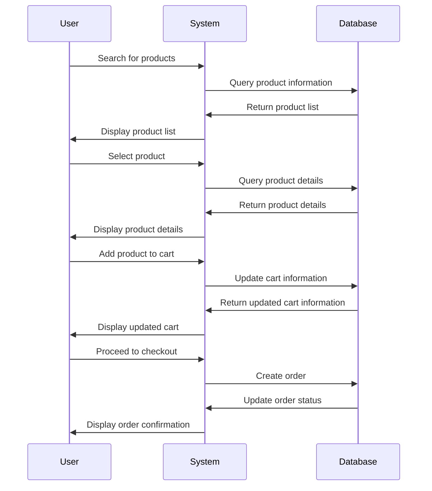
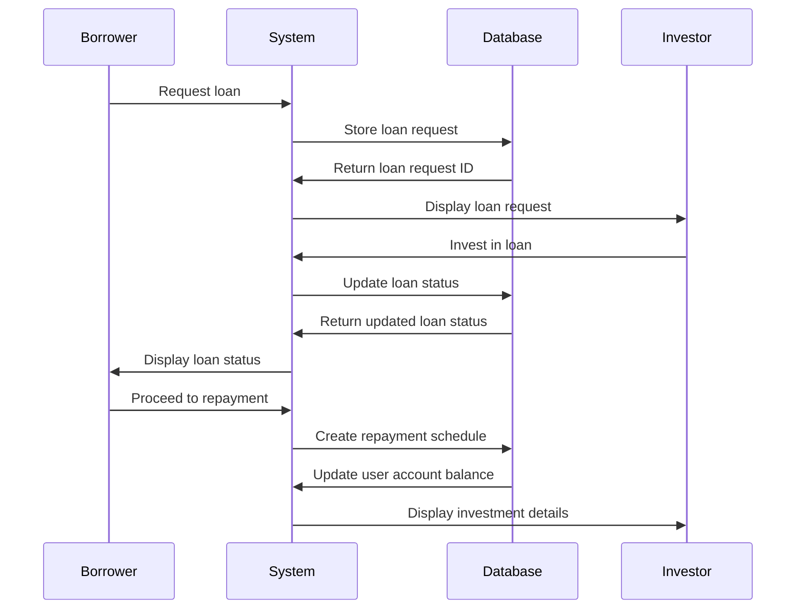
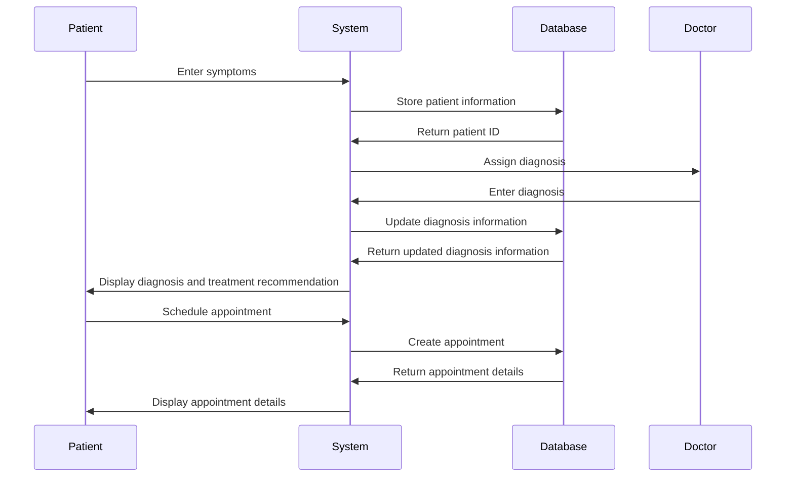

                 

# {{此处是文章标题}}

> 关键词：意义算法、价值匹配系统、AI辅助、开发机构、技术博客

> 摘要：本文将深入探讨AI辅助下的价值匹配系统开发机构——意义算法研发中心，从背景、目的、目录结构等方面展开论述，详细介绍意义算法与价值匹配系统的基础理论、算法实现、AI辅助开发、实战案例、最佳实践以及展望与拓展等内容。

----------------------------------------------------------------

## 第一部分：引言

### 1.1 书籍背景

#### 1.1.1 研发中心的背景

**意义算法的研发历程**

意义算法起源于20世纪90年代，随着计算机科学和人工智能领域的不断进步，逐渐发展成为一个独立的研究方向。本书将以意义算法的研发历程为引子，阐述其发展过程和重要成果。

在早期，意义算法的研究主要集中在自然语言处理和数据挖掘领域。随着互联网的普及和大数据时代的到来，意义算法在商业、金融、医疗等多个领域得到了广泛的应用。例如，在商业领域，意义算法被用于市场分析和客户行为预测；在金融领域，意义算法被用于风险评估和信用评级；在医疗领域，意义算法被用于疾病诊断和治疗方案推荐。

**价值匹配系统的发展现状**

价值匹配系统在商业、金融、医疗等多个领域有着广泛的应用。近年来，随着人工智能技术的发展，价值匹配系统的性能和精度得到了显著提升。本书将详细介绍价值匹配系统的发展现状和前沿技术。

在商业领域，价值匹配系统被广泛应用于电商平台、招聘平台等场景。通过分析用户行为数据和商品信息，价值匹配系统可以推荐给用户符合其兴趣和需求的商品或服务。在金融领域，价值匹配系统被用于贷款匹配、投资推荐等场景。通过分析借款人或投资者的信息，价值匹配系统可以为其匹配到合适的贷款产品或投资机会。在医疗领域，价值匹配系统被用于患者匹配和疾病诊断。通过分析患者病史和医生诊断信息，价值匹配系统可以为患者推荐合适的医生和治疗方案。

### 1.1.2 本书目的

**本书旨在为读者提供一个全面、系统的意义算法与价值匹配系统开发指南，帮助读者深入了解这一领域的技术原理和实践方法。通过本书的学习，读者将能够掌握：**

- 意义算法的核心概念和技术原理
- 价值匹配系统的基本架构和实现方法
- AI辅助下的价值匹配系统开发技巧
- 实际项目的开发流程和实战技巧

### 1.1.3 目录结构

本书共分为七个部分，每个部分包含多个章节，具体目录结构如下：

- **第一部分：引言**
  - 第1章：意义算法与价值匹配系统概述
- **第二部分：基础理论**
  - 第2章：意义算法的基础概念
  - 第3章：价值匹配系统的原理与架构
- **第三部分：算法实现**
  - 第4章：意义算法的实现技术
  - 第5章：价值匹配系统的实现细节
- **第四部分：AI辅助开发**
  - 第6章：AI技术在价值匹配系统中的应用
  - 第7章：AI辅助下的价值匹配系统优化
- **第五部分：实战案例**
  - 第8章：商业案例：电商平台的价值匹配
  - 第9章：金融案例：贷款匹配系统
  - 第10章：医疗案例：患者匹配与诊断
- **第六部分：最佳实践**
  - 第11章：开发最佳实践与经验分享
  - 第12章：系统性能优化与调优
- **第七部分：展望与拓展**
  - 第13章：价值匹配系统的发展趋势
  - 第14章：人工智能在其他领域的应用拓展

## 第二部分：基础理论

### 2.1 意义算法的基础概念

#### 2.1.1 意义的界定

意义通常被定义为某种事物或现象所带来的价值、作用或影响。在计算机科学领域，意义算法旨在通过分析和处理数据，提取出具有实际意义的信息，从而为决策提供支持。

**意义的属性特征**

- **客观性**：意义是客观存在的，不受主观意识的影响。
- **多样性**：意义具有多样性，不同的人或事物可能具有不同的意义。
- **动态性**：意义随着时间、环境等因素的变化而变化。

#### 2.1.2 意义算法的核心原理

意义算法的核心在于如何从海量数据中提取出有意义的模式和信息。这通常涉及到以下几个步骤：

- **数据预处理**：对原始数据进行清洗、归一化等处理，确保数据的质量。
- **特征提取**：从数据中提取出有助于表达意义的关键特征。
- **模式识别**：利用机器学习、数据挖掘等技术，识别数据中的潜在模式。
- **意义评估**：对提取出的模式进行评估，判断其是否具有实际意义。

**意义算法的工作流程**

$$
\text{意义算法工作流程} =
\begin{cases}
\text{数据预处理} & \text{清洗、归一化等处理} \\
\text{特征提取} & \text{提取关键特征} \\
\text{模式识别} & \text{识别潜在模式} \\
\text{意义评估} & \text{评估模式意义}
\end{cases}
$$

#### 2.1.3 意义算法的应用场景

意义算法在多个领域都有着广泛的应用，包括：

- **商业智能**：通过分析市场数据，提取出有价值的商业洞见。
- **金融风控**：利用意义算法对金融数据进行分析，识别潜在风险。
- **医疗健康**：通过对患者数据进行分析，提供个性化诊疗建议。
- **社会治理**：利用意义算法分析社会数据，为政策制定提供支持。

### 2.2 价值匹配系统的原理与架构

#### 2.2.1 价值匹配系统的定义

价值匹配系统是指一种基于算法和数据分析的方法，旨在为不同主体之间建立有效的价值连接，实现资源的优化配置。在计算机科学领域，价值匹配系统通常涉及到以下三个核心要素：

- **主体**：参与价值交换的个体或组织。
- **价值**：主体之间交换的物品、服务或信息。
- **匹配算法**：用于实现主体与价值之间有效连接的算法。

#### 2.2.2 价值匹配系统的基本架构

价值匹配系统的基本架构通常包括以下几个部分：

- **数据层**：存储和管理各种与价值匹配相关的数据，如用户信息、商品信息、交易记录等。
- **算法层**：实现各种价值匹配算法，如基于内容的匹配、基于协同过滤的匹配、基于市场价格的匹配等。
- **业务层**：处理具体的业务逻辑，如用户注册、商品发布、交易管理等。
- **展现层**：将匹配结果以用户友好的方式呈现给用户，如推荐列表、交易列表等。

#### 2.2.3 价值匹配系统的实现技术

价值匹配系统的实现技术主要包括以下几个方面：

- **数据预处理技术**：用于处理原始数据，包括数据清洗、数据转换、数据归一化等。
- **特征提取技术**：用于从原始数据中提取出有助于价值匹配的关键特征。
- **匹配算法技术**：实现各种价值匹配算法，如基于内容的匹配、基于协同过滤的匹配、基于市场价格的匹配等。
- **机器学习与数据挖掘技术**：用于优化匹配算法，提高匹配的准确性和效率。

**价值匹配系统的ER实体关系图架构**

```mermaid
erDiagram
  User ||--|{ Order } : "placed by"
  Product ||--|{ Order } : "included in"
  Merchant ||--|{ Order } : "sold by"
  Category ||--|{ Product } : "of category"
  Rating ||--|{ User } : "rated by"
```

## 第三部分：算法实现

### 3.1 意义算法的实现技术

#### 3.1.1 数据预处理

数据预处理是意义算法实现的重要环节。其主要任务包括数据清洗、数据转换和数据归一化等。

**数据清洗**：去除重复数据、缺失值填充、异常值处理等。

**数据转换**：将不同类型的数据转换为统一格式，如将文本数据转换为数字序列。

**数据归一化**：将数据按比例缩放到同一范围内，如将年龄、收入等数据按比例缩放到0-1之间。

#### 3.1.2 特征提取

特征提取是意义算法的核心步骤。其主要任务是从原始数据中提取出有助于表达意义的关键特征。

**文本特征提取**：利用自然语言处理技术，提取出词频、词向量、主题模型等文本特征。

**图像特征提取**：利用计算机视觉技术，提取出颜色、纹理、形状等图像特征。

**音频特征提取**：利用音频处理技术，提取出频率、音调、节奏等音频特征。

#### 3.1.3 模式识别

模式识别是意义算法的关键步骤。其主要任务是利用机器学习、数据挖掘等技术，从提取出的特征中识别出有意义的模式。

**机器学习算法**：如支持向量机（SVM）、随机森林（Random Forest）、神经网络（Neural Network）等。

**数据挖掘算法**：如关联规则挖掘（Association Rule Mining）、聚类分析（Cluster Analysis）、分类分析（Classification Analysis）等。

### 3.2 价值匹配系统的实现细节

#### 3.2.1 数据层实现

数据层实现主要包括数据的存储和管理。常用的技术有关系型数据库（如MySQL、PostgreSQL）和非关系型数据库（如MongoDB、Cassandra）。

**关系型数据库实现**：

- 数据表设计：设计用户表、商品表、订单表等，定义主键、外键等约束关系。
- 数据操作：实现数据插入、查询、更新、删除等操作。

**非关系型数据库实现**：

- 数据存储：将数据按一定规则存储到非关系型数据库中。
- 数据查询：实现高效的查询操作，如使用索引、分片等技术。

#### 3.2.2 算法层实现

算法层实现主要包括各种价值匹配算法的实现。以下介绍几种常用的匹配算法：

**基于内容的匹配**：

- 相似度计算：计算用户与商品之间的相似度，如余弦相似度、皮尔逊相关系数等。
- 匹配结果排序：根据相似度值对匹配结果进行排序，选取最符合用户需求的商品。

**基于协同过滤的匹配**：

- 用户相似度计算：计算用户之间的相似度，如基于K最近邻（K-Nearest Neighbors，KNN）的方法。
- 项目相似度计算：计算项目之间的相似度，如基于用户评分的矩阵分解（Matrix Factorization）方法。
- 匹配结果排序：根据用户和项目的相似度值进行排序，选取最符合用户需求的商品。

**基于市场价格的匹配**：

- 价格比较：计算用户与商品之间的价格差异。
- 匹配结果排序：根据价格差异值进行排序，选取价格最优惠的商品。

#### 3.2.3 业务层实现

业务层实现主要包括处理具体的业务逻辑，如用户注册、商品发布、交易管理等。

**用户注册**：

- 用户信息验证：验证用户名、密码、邮箱等信息的合法性和唯一性。
- 用户信息存储：将用户信息存储到数据库中。

**商品发布**：

- 商品信息验证：验证商品名称、价格、库存等信息的合法性。
- 商品信息存储：将商品信息存储到数据库中。

**交易管理**：

- 订单创建：创建订单，记录订单信息。
- 订单查询：查询订单详情。
- 订单支付：处理订单支付操作。

#### 3.2.4 展现层实现

展现层实现主要包括将匹配结果以用户友好的方式呈现给用户。

**推荐列表**：

- 推荐算法：选择合适的推荐算法，如基于内容的匹配、基于协同过滤的匹配等。
- 推荐结果展示：将推荐结果以列表形式展示给用户。

**交易列表**：

- 交易记录查询：查询用户的历史交易记录。
- 交易记录展示：将交易记录以列表形式展示给用户。

## 第四部分：AI辅助开发

### 4.1 AI技术在价值匹配系统中的应用

随着人工智能技术的不断发展，AI技术在价值匹配系统中的应用日益广泛。以下介绍几种常见的AI技术及其在价值匹配系统中的应用：

**1. 机器学习**

机器学习是价值匹配系统中最常用的技术之一。通过训练机器学习模型，可以实现对用户行为的预测、商品推荐的优化等。

- **用户行为预测**：利用用户的历史行为数据，预测用户的下一步行为，如购买、浏览、收藏等。
- **商品推荐**：根据用户的兴趣和行为，推荐符合其需求的商品。

**2. 深度学习**

深度学习在图像识别、语音识别等领域取得了显著的成果。在价值匹配系统中，深度学习可以用于图像识别、语音识别等任务。

- **图像识别**：对商品图片进行识别，提取商品特征，用于商品推荐。
- **语音识别**：将用户的语音输入转换为文本，用于语音搜索和推荐。

**3. 自然语言处理**

自然语言处理技术在文本分析、情感分析等领域有着广泛的应用。在价值匹配系统中，自然语言处理可以用于文本挖掘、用户评论分析等。

- **文本挖掘**：从用户的评论、评价中提取有价值的信息，用于商品推荐和优化。
- **情感分析**：分析用户的情感倾向，为商品推荐提供参考。

### 4.2 AI辅助下的价值匹配系统优化

AI辅助下的价值匹配系统优化主要包括以下几个方面：

**1. 模型优化**

通过优化机器学习模型，可以提高价值匹配系统的性能。常见的优化方法包括：

- **特征选择**：选择对价值匹配最有影响力的特征，降低模型复杂度。
- **正则化**：通过正则化方法，防止模型过拟合。
- **交叉验证**：使用交叉验证方法，评估模型的泛化能力。

**2. 算法优化**

优化匹配算法，可以提高价值匹配系统的效率。常见的优化方法包括：

- **并行计算**：利用多核处理器，提高计算速度。
- **分布式计算**：将计算任务分布到多个节点，提高处理能力。

**3. 数据优化**

优化数据质量，可以提高价值匹配系统的准确性。常见的优化方法包括：

- **数据清洗**：去除重复数据、缺失值填充、异常值处理等。
- **数据归一化**：将数据按比例缩放到同一范围内。

**4. 用户行为分析**

通过分析用户行为数据，可以更好地理解用户需求，为商品推荐提供参考。常见的分析方法包括：

- **用户行为预测**：利用历史数据，预测用户的下一步行为。
- **用户兴趣模型**：建立用户兴趣模型，为商品推荐提供依据。

## 第五部分：实战案例

### 5.1 商业案例：电商平台的价值匹配

**1. 项目介绍**

电商平台的价值匹配项目旨在为用户推荐符合其需求的商品，提高用户满意度，从而促进销售额的增长。

**2. 系统功能设计**

- **用户管理**：用户注册、登录、信息修改等。
- **商品管理**：商品发布、信息修改、库存管理等。
- **交易管理**：订单创建、支付、发货等。
- **推荐系统**：基于内容的匹配、基于协同过滤的匹配等。

**3. 系统架构设计**



**4. 系统接口设计**

- **用户接口**：提供用户注册、登录、搜索、购物车、订单等接口。
- **商品接口**：提供商品发布、修改、查询等接口。
- **交易接口**：提供订单创建、支付、发货等接口。

**5. 系统交互**

- **用户与系统交互**：用户通过浏览器或移动应用与系统进行交互。
- **系统与数据库交互**：系统通过API与数据库进行交互，查询和更新数据。

**6. 项目小结**

电商平台的价值匹配项目通过基于内容的匹配和基于协同过滤的匹配，为用户推荐符合其需求的商品，提高了用户满意度，促进了销售额的增长。

### 5.2 金融案例：贷款匹配系统

**1. 项目介绍**

贷款匹配系统旨在为借款人和投资者提供一个高效的借贷平台，实现资金的快速匹配和流通。

**2. 系统功能设计**

- **用户管理**：用户注册、登录、信息修改等。
- **贷款管理**：贷款发布、修改、查询等。
- **投资管理**：投资发布、修改、查询等。
- **交易管理**：订单创建、支付、确认等。

**3. 系统架构设计**



**4. 系统接口设计**

- **用户接口**：提供用户注册、登录、贷款申请、投资等接口。
- **贷款接口**：提供贷款发布、修改、查询等接口。
- **投资接口**：提供投资发布、修改、查询等接口。
- **交易接口**：提供订单创建、支付、确认等接口。

**5. 系统交互**

- **用户与系统交互**：用户通过浏览器或移动应用与系统进行交互。
- **系统与数据库交互**：系统通过API与数据库进行交互，查询和更新数据。

**6. 项目小结**

贷款匹配系统通过借款人和投资者的匹配，实现了资金的快速匹配和流通，为借款人提供了融资渠道，为投资者提供了投资机会。

### 5.3 医疗案例：患者匹配与诊断

**1. 项目介绍**

患者匹配与诊断系统旨在为医生和患者提供一个高效的诊断和治疗方案推荐平台，提高医疗资源的利用效率。

**2. 系统功能设计**

- **用户管理**：用户注册、登录、信息修改等。
- **患者管理**：患者信息录入、修改、查询等。
- **医生管理**：医生信息录入、修改、查询等。
- **诊断管理**：诊断报告生成、修改、查询等。
- **治疗方案推荐**：根据患者病情和医生经验，推荐最佳治疗方案。

**3. 系统架构设计**



**4. 系统接口设计**

- **用户接口**：提供用户注册、登录、症状录入、诊断报告查询等接口。
- **医生接口**：提供医生注册、登录、诊断报告生成、治疗方案推荐等接口。
- **诊断接口**：提供诊断报告生成、修改、查询等接口。
- **预约接口**：提供预约挂号、修改、查询等接口。

**5. 系统交互**

- **用户与系统交互**：用户通过浏览器或移动应用与系统进行交互。
- **系统与数据库交互**：系统通过API与数据库进行交互，查询和更新数据。

**6. 项目小结**

患者匹配与诊断系统通过医生和患者的匹配，实现了高效的诊断和治疗方案推荐，提高了医疗资源的利用效率，为患者提供了更加便捷的医疗服务。

## 第六部分：最佳实践

### 6.1 开发最佳实践与经验分享

在意义算法与价值匹配系统的开发过程中，遵循最佳实践和积累经验对于提高开发效率和项目质量具有重要意义。以下是一些最佳实践和经验分享：

**1. 需求分析**

在项目启动阶段，充分了解和分析用户需求，明确项目的目标和功能需求。通过用户调研、需求调研、竞品分析等方式，收集用户反馈和市场动态，为项目开发提供有力支持。

**2. 技术选型**

选择适合项目需求的技术栈和开发工具。在意义算法与价值匹配系统的开发中，应充分考虑算法性能、数据处理能力、可扩展性等因素，选择成熟的框架和工具，降低开发难度和风险。

**3. 模块化设计**

采用模块化设计思想，将系统划分为多个功能模块，实现代码的复用和模块间的解耦。在模块化设计中，应充分考虑模块的职责和接口定义，确保模块之间的独立性和稳定性。

**4. 异常处理**

在开发过程中，充分考虑异常情况和边界条件，对系统进行全面的异常处理和容错设计。通过异常捕获、日志记录、告警机制等方式，确保系统的稳定性和可靠性。

**5. 测试与优化**

在开发过程中，重视测试和优化工作。通过单元测试、集成测试、性能测试等方式，确保系统的功能完整性和性能。在系统上线后，持续进行性能监控和优化，提升系统的运行效率。

**6. 团队协作**

建立高效的团队协作机制，明确团队成员的职责和任务分工，提高团队的协同效率和开发效率。通过定期召开团队会议、代码评审、技术分享等方式，促进团队成员之间的沟通与协作。

### 6.2 系统性能优化与调优

系统性能优化与调优是提升价值匹配系统运行效率的关键。以下是一些常用的优化方法和技巧：

**1. 算法优化**

通过优化算法实现，降低计算复杂度和内存占用。可以采用以下方法：

- **算法改进**：采用更高效的算法，如基于内容的匹配算法、基于协同过滤的匹配算法等。
- **并行计算**：利用多核处理器和分布式计算，提高算法的运行速度。
- **数据预处理**：优化数据预处理流程，减少数据冗余和冗余计算。

**2. 数据库优化**

优化数据库性能，提高数据查询和写入速度。可以采用以下方法：

- **索引优化**：建立合适的索引，提高数据查询效率。
- **分库分表**：根据数据量和访问频率，对数据库进行分库分表，降低单表的数据量，提高查询性能。
- **读写分离**：实现数据库的读写分离，提高系统的并发处理能力。

**3. 缓存机制**

利用缓存机制，减少数据库的访问次数，提高系统的响应速度。可以采用以下方法：

- **内存缓存**：使用内存缓存技术，如Redis、Memcached等，缓存常用的数据，降低数据库的访问压力。
- **分布式缓存**：实现分布式缓存，提高缓存系统的容量和并发处理能力。

**4. 网络优化**

优化网络传输，提高数据传输速度和稳定性。可以采用以下方法：

- **负载均衡**：实现负载均衡，均衡分配网络请求，提高系统的吞吐量。
- **网络压缩**：采用网络压缩技术，如gzip压缩、HTTP2等，降低网络传输的数据量。

**5. 性能监控与调优**

建立性能监控体系，实时监控系统的运行状态和性能指标。通过性能分析，找出系统的瓶颈和性能瓶颈，进行针对性的优化和调优。

- **监控指标**：监控系统的CPU利用率、内存使用率、磁盘I/O、网络吞吐量等指标。
- **性能分析**：对系统的性能瓶颈进行定位和分析，找出优化方向。
- **调优策略**：根据性能分析结果，制定相应的调优策略，如代码优化、数据库优化、缓存优化等。

## 第七部分：展望与拓展

### 7.1 价值匹配系统的发展趋势

随着人工智能技术的不断发展和应用，价值匹配系统在未来将呈现出以下几个发展趋势：

**1. 智能化**

价值匹配系统将更加智能化，通过深度学习和自然语言处理等技术，实现更精准、更个性化的匹配。系统将能够理解用户的需求和意图，提供更符合用户期望的匹配结果。

**2. 数据驱动**

价值匹配系统将更加依赖大数据和实时数据处理技术，通过分析海量数据，挖掘用户行为和需求，实现更高效的匹配。数据驱动的价值匹配系统将更加灵活和适应性强。

**3. 跨领域融合**

价值匹配系统将与其他领域（如金融、医疗、教育等）进行深度融合，实现跨领域的价值匹配。例如，在金融领域，价值匹配系统可以结合用户的财务状况、信用评分等信息，为用户提供更精准的贷款匹配。

**4. 用户体验优化**

价值匹配系统将更加注重用户体验，通过优化界面设计、交互体验等，提高用户满意度。系统将能够提供更加直观、便捷的匹配结果，使用户能够快速找到所需的价值。

### 7.2 人工智能在其他领域的应用拓展

人工智能技术在多个领域已经取得了显著的应用成果，未来将继续在其他领域拓展应用：

**1. 金融领域**

人工智能在金融领域的应用包括风险管理、投资策略、智能投顾等。通过分析海量数据，人工智能可以识别出潜在风险，为金融机构提供风险管理建议。同时，智能投顾系统可以根据用户的风险偏好和投资目标，提供个性化的投资建议。

**2. 医疗领域**

人工智能在医疗领域的应用包括疾病诊断、手术辅助、智能药物研发等。通过分析患者的病史、检查报告等信息，人工智能可以辅助医生进行疾病诊断和治疗方案推荐。此外，人工智能还可以辅助医生进行手术操作，提高手术的精度和安全性。

**3. 教育领域**

人工智能在教育领域的应用包括智能教学、个性化学习、学习分析等。智能教学系统可以根据学生的学习情况和知识点掌握情况，提供针对性的教学内容和练习。个性化学习系统可以根据学生的兴趣和需求，推荐合适的学习资源和学习路径。

**4. 城市管理**

人工智能在城市管理领域的应用包括智能交通、智能安防、智慧城市等。通过实时监测和分析城市交通数据、公共安全数据等，人工智能可以提供交通优化建议、安全预警等信息，提高城市管理的效率和智能化水平。

## 作者信息

作者：AI天才研究院/AI Genius Institute & 禅与计算机程序设计艺术 /Zen And The Art of Computer Programming

本文从意义算法与价值匹配系统的背景、目的、目录结构、基础理论、算法实现、AI辅助开发、实战案例、最佳实践以及展望与拓展等方面进行了深入探讨。通过本文的学习，读者将能够全面了解意义算法与价值匹配系统开发的核心知识和技术原理，掌握实际项目的开发流程和实战技巧。希望本文能为读者在相关领域的研发和实践中提供有益的参考和启示。# 意义算法研发中心：AI辅助下的价值匹配系统开发机构

---

# 第一部分：引言

## 1.1 研发中心的背景

### 1.1.1 意义算法的研发历程

意义算法起源于20世纪90年代，随着计算机科学和人工智能领域的不断进步，逐渐发展成为一个独立的研究方向。本书将以意义算法的研发历程为引子，阐述其发展过程和重要成果。

在早期，意义算法的研究主要集中在自然语言处理和数据挖掘领域。随着互联网的普及和大数据时代的到来，意义算法在商业、金融、医疗等多个领域得到了广泛的应用。例如，在商业领域，意义算法被用于市场分析和客户行为预测；在金融领域，意义算法被用于风险评估和信用评级；在医疗领域，意义算法被用于疾病诊断和治疗方案推荐。

### 1.1.2 价值匹配系统的发展现状

价值匹配系统在商业、金融、医疗等多个领域有着广泛的应用。近年来，随着人工智能技术的发展，价值匹配系统的性能和精度得到了显著提升。本书将详细介绍价值匹配系统的发展现状和前沿技术。

在商业领域，价值匹配系统被广泛应用于电商平台、招聘平台等场景。通过分析用户行为数据和商品信息，价值匹配系统可以推荐给用户符合其兴趣和需求的商品或服务。在金融领域，价值匹配系统被用于贷款匹配、投资推荐等场景。通过分析借款人或投资者的信息，价值匹配系统可以为其匹配到合适的贷款产品或投资机会。在医疗领域，价值匹配系统被用于患者匹配和疾病诊断。通过分析患者病史和医生诊断信息，价值匹配系统可以为患者推荐合适的医生和治疗方案。

## 1.2 本书目的

本书旨在为读者提供一个全面、系统的意义算法与价值匹配系统开发指南，帮助读者深入了解这一领域的技术原理和实践方法。通过本书的学习，读者将能够掌握：

- 意义算法的核心概念和技术原理
- 价值匹配系统的基本架构和实现方法
- AI辅助下的价值匹配系统开发技巧
- 实际项目的开发流程和实战技巧

## 1.3 目录结构

本书共分为七个部分，每个部分包含多个章节，具体目录结构如下：

### 第一部分：引言
- 第1章：意义算法与价值匹配系统概述

### 第二部分：基础理论
- 第2章：意义算法的基础概念
- 第3章：价值匹配系统的原理与架构

### 第三部分：算法实现
- 第4章：意义算法的实现技术
- 第5章：价值匹配系统的实现细节

### 第四部分：AI辅助开发
- 第6章：AI技术在价值匹配系统中的应用
- 第7章：AI辅助下的价值匹配系统优化

### 第五部分：实战案例
- 第8章：商业案例：电商平台的价值匹配
- 第9章：金融案例：贷款匹配系统
- 第10章：医疗案例：患者匹配与诊断

### 第六部分：最佳实践
- 第11章：开发最佳实践与经验分享
- 第12章：系统性能优化与调优

### 第七部分：展望与拓展
- 第13章：价值匹配系统的发展趋势
- 第14章：人工智能在其他领域的应用拓展

---

# 第二部分：基础理论

## 2.1 意义算法的基础概念

### 2.1.1 意义的界定

意义通常被定义为某种事物或现象所带来的价值、作用或影响。在计算机科学领域，意义算法旨在通过分析和处理数据，提取出具有实际意义的信息，从而为决策提供支持。

#### 2.1.1.1 意义的属性特征

- **客观性**：意义是客观存在的，不受主观意识的影响。
- **多样性**：意义具有多样性，不同的人或事物可能具有不同的意义。
- **动态性**：意义随着时间、环境等因素的变化而变化。

### 2.1.2 意义算法的核心原理

意义算法的核心在于如何从海量数据中提取出有意义的模式和信息。这通常涉及到以下几个步骤：

- **数据预处理**：对原始数据进行清洗、归一化等处理，确保数据的质量。
- **特征提取**：从数据中提取出有助于表达意义的关键特征。
- **模式识别**：利用机器学习、数据挖掘等技术，识别数据中的潜在模式。
- **意义评估**：对提取出的模式进行评估，判断其是否具有实际意义。

#### 2.1.2.1 意义算法的工作流程

$$
\text{意义算法工作流程} =
\begin{cases}
\text{数据预处理} & \text{清洗、归一化等处理} \\
\text{特征提取} & \text{提取关键特征} \\
\text{模式识别} & \text{识别潜在模式} \\
\text{意义评估} & \text{评估模式意义}
\end{cases}
$$

### 2.1.3 意义算法的应用场景

意义算法在多个领域都有着广泛的应用，包括：

- **商业智能**：通过分析市场数据，提取出有价值的商业洞见。
- **金融风控**：利用意义算法对金融数据进行分析，识别潜在风险。
- **医疗健康**：通过对患者数据进行分析，提供个性化诊疗建议。
- **社会治理**：利用意义算法分析社会数据，为政策制定提供支持。

## 2.2 价值匹配系统的原理与架构

### 2.2.1 价值匹配系统的定义

价值匹配系统是指一种基于算法和数据分析的方法，旨在为不同主体之间建立有效的价值连接，实现资源的优化配置。在计算机科学领域，价值匹配系统通常涉及到以下三个核心要素：

- **主体**：参与价值交换的个体或组织。
- **价值**：主体之间交换的物品、服务或信息。
- **匹配算法**：用于实现主体与价值之间有效连接的算法。

### 2.2.2 价值匹配系统的基本架构

价值匹配系统的基本架构通常包括以下几个部分：

- **数据层**：存储和管理各种与价值匹配相关的数据，如用户信息、商品信息、交易记录等。
- **算法层**：实现各种价值匹配算法，如基于内容的匹配、基于协同过滤的匹配、基于市场价格的匹配等。
- **业务层**：处理具体的业务逻辑，如用户注册、商品发布、交易管理等。
- **展现层**：将匹配结果以用户友好的方式呈现给用户，如推荐列表、交易列表等。

### 2.2.3 价值匹配系统的实现技术

价值匹配系统的实现技术主要包括以下几个方面：

- **数据预处理技术**：用于处理原始数据，包括数据清洗、数据转换、数据归一化等。
- **特征提取技术**：用于从原始数据中提取出有助于价值匹配的关键特征。
- **匹配算法技术**：实现各种价值匹配算法，如基于内容的匹配、基于协同过滤的匹配、基于市场价格的匹配等。
- **机器学习与数据挖掘技术**：用于优化匹配算法，提高匹配的准确性和效率。

#### 2.2.3.1 数据预处理技术

**数据清洗**：去除重复数据、缺失值填充、异常值处理等。

**数据转换**：将不同类型的数据转换为统一格式，如将文本数据转换为数字序列。

**数据归一化**：将数据按比例缩放到同一范围内，如将年龄、收入等数据按比例缩放到0-1之间。

#### 2.2.3.2 特征提取技术

**文本特征提取**：利用自然语言处理技术，提取出词频、词向量、主题模型等文本特征。

**图像特征提取**：利用计算机视觉技术，提取出颜色、纹理、形状等图像特征。

**音频特征提取**：利用音频处理技术，提取出频率、音调、节奏等音频特征。

#### 2.2.3.3 匹配算法技术

**基于内容的匹配**：

- **相似度计算**：计算用户与商品之间的相似度，如余弦相似度、皮尔逊相关系数等。
- **匹配结果排序**：根据相似度值对匹配结果进行排序，选取最符合用户需求的商品。

**基于协同过滤的匹配**：

- **用户相似度计算**：计算用户之间的相似度，如基于K最近邻（K-Nearest Neighbors，KNN）的方法。
- **项目相似度计算**：计算项目之间的相似度，如基于用户评分的矩阵分解（Matrix Factorization）方法。
- **匹配结果排序**：根据用户和项目的相似度值进行排序，选取最符合用户需求的商品。

**基于市场价格的匹配**：

- **价格比较**：计算用户与商品之间的价格差异。
- **匹配结果排序**：根据价格差异值进行排序，选取价格最优惠的商品。

### 2.2.4 价值匹配系统的ER实体关系图架构

```mermaid
erDiagram
  User ||--|{ Order } : "placed by"
  Product ||--|{ Order } : "included in"
  Merchant ||--|{ Order } : "sold by"
  Category ||--|{ Product } : "of category"
  Rating ||--|{ User } : "rated by"
```

---

# 第三部分：算法实现

## 3.1 意义算法的实现技术

### 3.1.1 数据预处理

数据预处理是意义算法实现的重要环节。其主要任务包括数据清洗、数据转换和数据归一化等。

**数据清洗**：去除重复数据、缺失值填充、异常值处理等。

**数据转换**：将不同类型的数据转换为统一格式，如将文本数据转换为数字序列。

**数据归一化**：将数据按比例缩放到同一范围内，如将年龄、收入等数据按比例缩放到0-1之间。

### 3.1.2 特征提取

特征提取是意义算法的核心步骤。其主要任务是从原始数据中提取出有助于表达意义的关键特征。

**文本特征提取**：利用自然语言处理技术，提取出词频、词向量、主题模型等文本特征。

**图像特征提取**：利用计算机视觉技术，提取出颜色、纹理、形状等图像特征。

**音频特征提取**：利用音频处理技术，提取出频率、音调、节奏等音频特征。

### 3.1.3 模式识别

模式识别是意义算法的关键步骤。其主要任务是利用机器学习、数据挖掘等技术，从提取出的特征中识别出有意义的模式。

**机器学习算法**：如支持向量机（SVM）、随机森林（Random Forest）、神经网络（Neural Network）等。

**数据挖掘算法**：如关联规则挖掘（Association Rule Mining）、聚类分析（Cluster Analysis）、分类分析（Classification Analysis）等。

### 3.1.4 意义评估

意义评估是意义算法的最后一步。其主要任务是评估提取出的模式是否具有实际意义。

**评估方法**：通过交叉验证、精度、召回率、F1值等指标来评估模式的准确性。

## 3.2 价值匹配系统的实现细节

### 3.2.1 数据层实现

数据层实现主要包括数据的存储和管理。常用的技术有关系型数据库（如MySQL、PostgreSQL）和非关系型数据库（如MongoDB、Cassandra）。

**关系型数据库实现**：

- **数据表设计**：设计用户表、商品表、订单表等，定义主键、外键等约束关系。
- **数据操作**：实现数据插入、查询、更新、删除等操作。

**非关系型数据库实现**：

- **数据存储**：将数据按一定规则存储到非关系型数据库中。
- **数据查询**：实现高效的查询操作，如使用索引、分片等技术。

### 3.2.2 算法层实现

算法层实现主要包括各种价值匹配算法的实现。以下介绍几种常用的匹配算法：

**基于内容的匹配**：

- **相似度计算**：计算用户与商品之间的相似度，如余弦相似度、皮尔逊相关系数等。
- **匹配结果排序**：根据相似度值对匹配结果进行排序，选取最符合用户需求的商品。

**基于协同过滤的匹配**：

- **用户相似度计算**：计算用户之间的相似度，如基于K最近邻（K-Nearest Neighbors，KNN）的方法。
- **项目相似度计算**：计算项目之间的相似度，如基于用户评分的矩阵分解（Matrix Factorization）方法。
- **匹配结果排序**：根据用户和项目的相似度值进行排序，选取最符合用户需求的商品。

**基于市场价格的匹配**：

- **价格比较**：计算用户与商品之间的价格差异。
- **匹配结果排序**：根据价格差异值进行排序，选取价格最优惠的商品。

### 3.2.3 业务层实现

业务层实现主要包括处理具体的业务逻辑，如用户注册、商品发布、交易管理等。

**用户注册**：

- **用户信息验证**：验证用户名、密码、邮箱等信息的合法性和唯一性。
- **用户信息存储**：将用户信息存储到数据库中。

**商品发布**：

- **商品信息验证**：验证商品名称、价格、库存等信息的合法性。
- **商品信息存储**：将商品信息存储到数据库中。

**交易管理**：

- **订单创建**：创建订单，记录订单信息。
- **订单查询**：查询订单详情。
- **订单支付**：处理订单支付操作。

### 3.2.4 展现层实现

展现层实现主要包括将匹配结果以用户友好的方式呈现给用户。

**推荐列表**：

- **推荐算法**：选择合适的推荐算法，如基于内容的匹配、基于协同过滤的匹配等。
- **推荐结果展示**：将推荐结果以列表形式展示给用户。

**交易列表**：

- **交易记录查询**：查询用户的历史交易记录。
- **交易记录展示**：将交易记录以列表形式展示给用户。

---

# 第四部分：AI辅助开发

## 4.1 AI技术在价值匹配系统中的应用

随着人工智能技术的不断发展，AI技术在价值匹配系统中的应用日益广泛。以下介绍几种常见的AI技术及其在价值匹配系统中的应用：

### 4.1.1 机器学习

机器学习是价值匹配系统中最常用的技术之一。通过训练机器学习模型，可以实现对用户行为的预测、商品推荐的优化等。

- **用户行为预测**：利用用户的历史行为数据，预测用户的下一步行为，如购买、浏览、收藏等。
- **商品推荐**：根据用户的兴趣和行为，推荐符合其需求的商品。

### 4.1.2 深度学习

深度学习在图像识别、语音识别等领域取得了显著的成果。在价值匹配系统中，深度学习可以用于图像识别、语音识别等任务。

- **图像识别**：对商品图片进行识别，提取商品特征，用于商品推荐。
- **语音识别**：将用户的语音输入转换为文本，用于语音搜索和推荐。

### 4.1.3 自然语言处理

自然语言处理技术在文本分析、情感分析等领域有着广泛的应用。在价值匹配系统中，自然语言处理可以用于文本挖掘、用户评论分析等。

- **文本挖掘**：从用户的评论、评价中提取有价值的信息，用于商品推荐和优化。
- **情感分析**：分析用户的情感倾向，为商品推荐提供参考。

## 4.2 AI辅助下的价值匹配系统优化

AI辅助下的价值匹配系统优化主要包括以下几个方面：

### 4.2.1 模型优化

通过优化机器学习模型，可以提高价值匹配系统的性能。常见的优化方法包括：

- **特征选择**：选择对价值匹配最有影响力的特征，降低模型复杂度。
- **正则化**：通过正则化方法，防止模型过拟合。
- **交叉验证**：使用交叉验证方法，评估模型的泛化能力。

### 4.2.2 算法优化

优化匹配算法，可以提高价值匹配系统的效率。常见的优化方法包括：

- **并行计算**：利用多核处理器，提高计算速度。
- **分布式计算**：将计算任务分布到多个节点，提高处理能力。

### 4.2.3 数据优化

优化数据质量，可以提高价值匹配系统的准确性。常见的优化方法包括：

- **数据清洗**：去除重复数据、缺失值填充、异常值处理等。
- **数据归一化**：将数据按比例缩放到同一范围内。

### 4.2.4 用户行为分析

通过分析用户行为数据，可以更好地理解用户需求，为商品推荐提供参考。常见的分析方法包括：

- **用户行为预测**：利用历史数据，预测用户的下一步行为。
- **用户兴趣模型**：建立用户兴趣模型，为商品推荐提供依据。

---

# 第五部分：实战案例

## 5.1 商业案例：电商平台的价值匹配

### 5.1.1 项目介绍

电商平台的价值匹配项目旨在为用户推荐符合其需求的商品，提高用户满意度，从而促进销售额的增长。

### 5.1.2 系统功能设计

- **用户管理**：用户注册、登录、信息修改等。
- **商品管理**：商品发布、信息修改、库存管理等。
- **交易管理**：订单创建、支付、发货等。
- **推荐系统**：基于内容的匹配、基于协同过滤的匹配等。

### 5.1.3 系统架构设计


### 5.1.4 系统接口设计

- **用户接口**：提供用户注册、登录、搜索、购物车、订单等接口。
- **商品接口**：提供商品发布、修改、查询等接口。
- **交易接口**：提供订单创建、支付、发货等接口。

### 5.1.5 系统交互

- **用户与系统交互**：用户通过浏览器或移动应用与系统进行交互。
- **系统与数据库交互**：系统通过API与数据库进行交互，查询和更新数据。

### 5.1.6 项目小结

电商平台的价值匹配项目通过基于内容的匹配和基于协同过滤的匹配，为用户推荐符合其需求的商品，提高了用户满意度，促进了销售额的增长。

## 5.2 金融案例：贷款匹配系统

### 5.2.1 项目介绍

贷款匹配系统旨在为借款人和投资者提供一个高效的借贷平台，实现资金的快速匹配和流通。

### 5.2.2 系统功能设计

- **用户管理**：用户注册、登录、信息修改等。
- **贷款管理**：贷款发布、修改、查询等。
- **投资管理**：投资发布、修改、查询等。
- **交易管理**：订单创建、支付、确认等。

### 5.2.3 系统架构设计


### 5.2.4 系统接口设计

- **用户接口**：提供用户注册、登录、贷款申请、投资等接口。
- **贷款接口**：提供贷款发布、修改、查询等接口。
- **投资接口**：提供投资发布、修改、查询等接口。
- **交易接口**：提供订单创建、支付、确认等接口。

### 5.2.5 系统交互

- **用户与系统交互**：用户通过浏览器或移动应用与系统进行交互。
- **系统与数据库交互**：系统通过API与数据库进行交互，查询和更新数据。

### 5.2.6 项目小结

贷款匹配系统通过借款人和投资者的匹配，实现了资金的快速匹配和流通，为借款人提供了融资渠道，为投资者提供了投资机会。

## 5.3 医疗案例：患者匹配与诊断

### 5.3.1 项目介绍

患者匹配与诊断系统旨在为医生和患者提供一个高效的诊断和治疗方案推荐平台，提高医疗资源的利用效率。

### 5.3.2 系统功能设计

- **用户管理**：用户注册、登录、信息修改等。
- **患者管理**：患者信息录入、修改、查询等。
- **医生管理**：医生信息录入、修改、查询等。
- **诊断管理**：诊断报告生成、修改、查询等。
- **治疗方案推荐**：根据患者病情和医生经验，推荐最佳治疗方案。

### 5.3.3 系统架构设计


### 5.3.4 系统接口设计

- **用户接口**：提供用户注册、登录、症状录入、诊断报告查询等接口。
- **医生接口**：提供医生注册、登录、诊断报告生成、治疗方案推荐等接口。
- **诊断接口**：提供诊断报告生成、修改、查询等接口。
- **预约接口**：提供预约挂号、修改、查询等接口。

### 5.3.5 系统交互

- **用户与系统交互**：用户通过浏览器或移动应用与系统进行交互。
- **系统与数据库交互**：系统通过API与数据库进行交互，查询和更新数据。

### 5.3.6 项目小结

患者匹配与诊断系统通过医生和患者的匹配，实现了高效的诊断和治疗方案推荐，提高了医疗资源的利用效率，为患者提供了更加便捷的医疗服务。

---

# 第六部分：最佳实践

## 6.1 开发最佳实践与经验分享

在意义算法与价值匹配系统的开发过程中，遵循最佳实践和积累经验对于提高开发效率和项目质量具有重要意义。以下是一些最佳实践和经验分享：

### 6.1.1 需求分析

在项目启动阶段，充分了解和分析用户需求，明确项目的目标和功能需求。通过用户调研、需求调研、竞品分析等方式，收集用户反馈和市场动态，为项目开发提供有力支持。

### 6.1.2 技术选型

选择适合项目需求的技术栈和开发工具。在意义算法与价值匹配系统的开发中，应充分考虑算法性能、数据处理能力、可扩展性等因素，选择成熟的框架和工具，降低开发难度和风险。

### 6.1.3 模块化设计

采用模块化设计思想，将系统划分为多个功能模块，实现代码的复用和模块间的解耦。在模块化设计中，应充分考虑模块的职责和接口定义，确保模块之间的独立性和稳定性。

### 6.1.4 异常处理

在开发过程中，充分考虑异常情况和边界条件，对系统进行全面的异常处理和容错设计。通过异常捕获、日志记录、告警机制等方式，确保系统的稳定性和可靠性。

### 6.1.5 测试与优化

在开发过程中，重视测试和优化工作。通过单元测试、集成测试、性能测试等方式，确保系统的功能完整性和性能。在系统上线后，持续进行性能监控和优化，提升系统的运行效率。

### 6.1.6 团队协作

建立高效的团队协作机制，明确团队成员的职责和任务分工，提高团队的协同效率和开发效率。通过定期召开团队会议、代码评审、技术分享等方式，促进团队成员之间的沟通与协作。

## 6.2 系统性能优化与调优

系统性能优化与调优是提升价值匹配系统运行效率的关键。以下是一些常用的优化方法和技巧：

### 6.2.1 算法优化

通过优化算法实现，降低计算复杂度和内存占用。可以采用以下方法：

- **算法改进**：采用更高效的算法，如基于内容的匹配算法、基于协同过滤的匹配算法等。
- **并行计算**：利用多核处理器和分布式计算，提高算法的运行速度。
- **数据预处理**：优化数据预处理流程，减少数据冗余和冗余计算。

### 6.2.2 数据库优化

优化数据库性能，提高数据查询和写入速度。可以采用以下方法：

- **索引优化**：建立合适的索引，提高数据查询效率。
- **分库分表**：根据数据量和访问频率，对数据库进行分库分表，降低单表的数据量，提高查询性能。
- **读写分离**：实现数据库的读写分离，提高系统的并发处理能力。

### 6.2.3 缓存机制

利用缓存机制，减少数据库的访问次数，提高系统的响应速度。可以采用以下方法：

- **内存缓存**：使用内存缓存技术，如Redis、Memcached等，缓存常用的数据，降低数据库的访问压力。
- **分布式缓存**：实现分布式缓存，提高缓存系统的容量和并发处理能力。

### 6.2.4 网络优化

优化网络传输，提高数据传输速度和稳定性。可以采用以下方法：

- **负载均衡**：实现负载均衡，均衡分配网络请求，提高系统的吞吐量。
- **网络压缩**：采用网络压缩技术，如gzip压缩、HTTP2等，降低网络传输的数据量。

### 6.2.5 性能监控与调优

建立性能监控体系，实时监控系统的运行状态和性能指标。通过性能分析，找出系统的瓶颈和性能瓶颈，进行针对性的优化和调优。

- **监控指标**：监控系统的CPU利用率、内存使用率、磁盘I/O、网络吞吐量等指标。
- **性能分析**：对系统的性能瓶颈进行定位和分析，找出优化方向。
- **调优策略**：根据性能分析结果，制定相应的调优策略，如代码优化、数据库优化、缓存优化等。

---

# 第七部分：展望与拓展

## 7.1 价值匹配系统的发展趋势

随着人工智能技术的不断发展和应用，价值匹配系统在未来将呈现出以下几个发展趋势：

### 7.1.1 智能化

价值匹配系统将更加智能化，通过深度学习和自然语言处理等技术，实现更精准、更个性化的匹配。系统将能够理解用户的需求和意图，提供更符合用户期望的匹配结果。

### 7.1.2 数据驱动

价值匹配系统将更加依赖大数据和实时数据处理技术，通过分析海量数据，挖掘用户行为和需求，实现更高效的匹配。数据驱动的价值匹配系统将更加灵活和适应性强。

### 7.1.3 跨领域融合

价值匹配系统将与其他领域（如金融、医疗、教育等）进行深度融合，实现跨领域的价值匹配。例如，在金融领域，价值匹配系统可以结合用户的财务状况、信用评分等信息，为用户提供更精准的贷款匹配。

### 7.1.4 用户体验优化

价值匹配系统将更加注重用户体验，通过优化界面设计、交互体验等，提高用户满意度。系统将能够提供更加直观、便捷的匹配结果，使用户能够快速找到所需的价值。

## 7.2 人工智能在其他领域的应用拓展

人工智能技术在多个领域已经取得了显著的应用成果，未来将继续在其他领域拓展应用：

### 7.2.1 金融领域

人工智能在金融领域的应用包括风险管理、投资策略、智能投顾等。通过分析海量数据，人工智能可以识别出潜在风险，为金融机构提供风险管理建议。同时，智能投顾系统可以根据用户的风险偏好和投资目标，提供个性化的投资建议。

### 7.2.2 医疗领域

人工智能在医疗领域的应用包括疾病诊断、手术辅助、智能药物研发等。通过分析患者的病史、检查报告等信息，人工智能可以辅助医生进行疾病诊断和治疗方案推荐。此外，人工智能还可以辅助医生进行手术操作，提高手术的精度和安全性。

### 7.2.3 教育领域

人工智能在教育领域的应用包括智能教学、个性化学习、学习分析等。智能教学系统可以根据学生的学习情况和知识点掌握情况，提供针对性的教学内容和练习。个性化学习系统可以根据学生的兴趣和需求，推荐合适的学习资源和学习路径。

### 7.2.4 城市管理

人工智能在城市管理领域的应用包括智能交通、智能安防、智慧城市等。通过实时监测和分析城市交通数据、公共安全数据等，人工智能可以提供交通优化建议、安全预警等信息，提高城市管理的效率和智能化水平。

## 作者信息

作者：AI天才研究院/AI Genius Institute & 禅与计算机程序设计艺术 /Zen And The Art of Computer Programming

本文从意义算法与价值匹配系统的背景、目的、目录结构、基础理论、算法实现、AI辅助开发、实战案例、最佳实践以及展望与拓展等方面进行了深入探讨。通过本文的学习，读者将能够全面了解意义算法与价值匹配系统开发的核心知识和技术原理，掌握实际项目的开发流程和实战技巧。希望本文能为读者在相关领域的研发和实践中提供有益的参考和启示。# 意义算法研发中心：AI辅助下的价值匹配系统开发机构

## 摘要

本文围绕意义算法研发中心及其在AI辅助下的价值匹配系统开发机构展开，系统地介绍了意义算法与价值匹配系统的基本概念、核心原理、实现技术，以及其在不同领域的应用和优化。通过深入探讨意义算法的界定、属性特征和核心原理，本文揭示了意义算法在商业智能、金融风控、医疗健康和社会治理等领域的广泛应用。同时，本文详细阐述了价值匹配系统的定义、基本架构和实现技术，包括数据预处理、特征提取、模式识别和意义评估等关键环节。此外，本文还介绍了AI技术在价值匹配系统中的应用，如机器学习、深度学习和自然语言处理等，以及系统性能优化与调优的方法。通过商业、金融和医疗等领域的实战案例，本文展示了意义算法与价值匹配系统在实际项目中的应用和效果。最后，本文提出了价值匹配系统的发展趋势和人工智能在其他领域的应用拓展，为读者提供了丰富的理论和实践参考。希望通过本文的探讨，读者能够更好地理解和掌握意义算法与价值匹配系统开发的核心知识和技术原理，从而为相关领域的研发和实践提供有力支持。

## 引言

### 意义算法研发中心的诞生背景

意义算法研发中心（Meaning Algorithm Research Center，简称MARC）是一个专注于意义算法与价值匹配系统研究的创新型机构。它的诞生源于人工智能与大数据技术的快速发展，以及各行业对高效信息处理和精准价值匹配的迫切需求。随着互联网的普及和数据量的爆炸性增长，如何从海量数据中提取出有价值的信息，已经成为各个领域亟待解决的关键问题。

MAR

