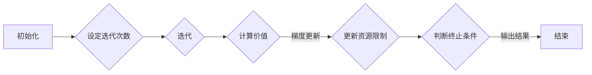
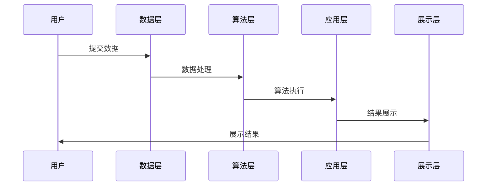
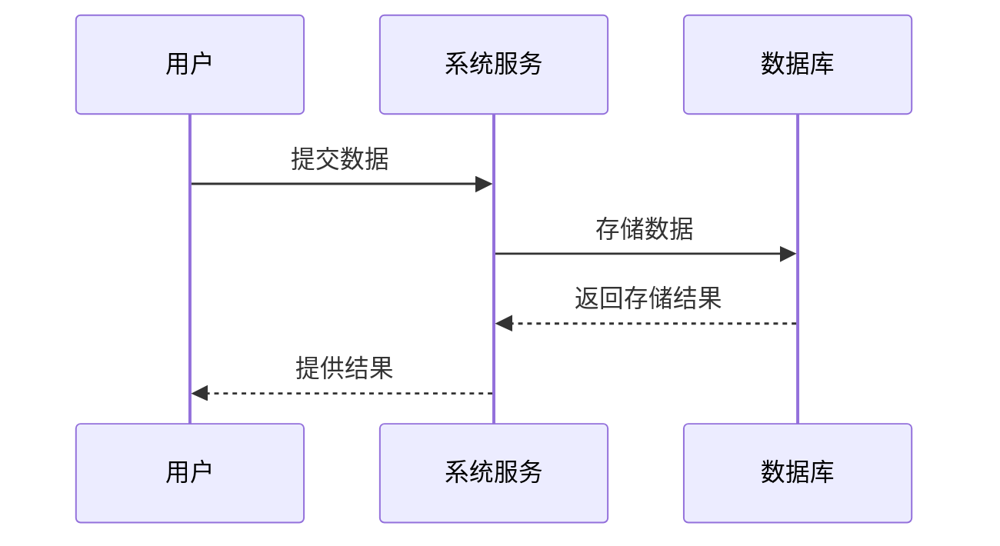

                 

### 引言

#### 1.1.1 意义经济学的起源

意义经济学（Meaning Economics）这一概念起源于对传统经济理论的反思和补充。传统经济学主要关注资源的有效配置、供需平衡和最大化社会福利等，但在全球化和信息化的背景下，人们越来越意识到，单纯的财富积累并不能完全代表个体和社会的幸福感。意义经济学则试图通过引入“意义”这一维度，来重新审视和定义价值。

意义经济学最早的理论框架可以追溯到20世纪80年代的“行为经济学”（Behavioral Economics），其开创者如理查德·塞勒（Richard Thaler）等学者，开始研究人的非理性决策行为，并指出传统经济理论中的理性人假设并不完全成立。在此基础上，意义经济学进一步扩展了这一研究领域，将人类的情感、价值观和生命意义等因素纳入经济学分析框架。

#### 1.1.2 价值重新定义的必要性

随着经济的发展和社会的进步，人们对于价值的认知也在不断演变。传统经济学中，价值主要基于商品和服务的交换价值来衡量，但随着人们对生活质量的要求越来越高，单纯的物质财富已经无法满足人们内心的需求。因此，重新定义价值显得尤为重要。

重新定义价值的意义在于，它不仅关注物质层面的财富积累，更强调精神层面的满足和幸福感。这有助于我们更全面地评估个体和社会的福祉，从而推动经济和社会的可持续发展。

#### 1.1.3 意义经济学在现代社会中的应用

意义经济学在现代社会中的应用非常广泛，涵盖了多个领域。以下是一些主要的应用场景：

1. **企业管理**：企业需要通过引入意义经济学来重新审视自身的价值和使命，从而更好地满足员工和客户的需求，提升企业的社会责任感。

2. **公共政策**：政府在制定政策时，可以借鉴意义经济学的理论，更加关注民生问题，提高公共服务的质量和效率。

3. **个人生活**：意义经济学可以帮助个人更好地理解自己的价值观和幸福感，从而做出更符合内心需求的选择。

4. **社会公益**：公益组织可以利用意义经济学来评估项目的价值和影响，提高资源利用效率。

#### 1.2 核心概念

##### 1.2.1 意义经济学的定义

意义经济学是一门研究如何通过理解、创造和实现人类意义来优化经济决策和促进社会福祉的学科。它不仅关注物质财富的积累，更强调人类内心的需求和精神层面的满足。

##### 1.2.2 意义经济学的核心概念

意义经济学包含以下几个核心概念：

- **意义**：指个体或社会追求的目标和价值，通常与情感、价值观和人生意义相关。
- **价值**：指商品或服务对个体或社会的重要性，它不仅包括物质价值，还包括精神价值。
- **幸福**：指个体在追求意义和价值的过程中感受到的满足和愉悦。
- **效率**：指资源利用的最大化，包括物质资源和人力资源。

##### 1.2.3 意义经济学的基本原理

意义经济学的基本原理包括以下几个方面：

- **价值观导向**：个体的决策行为受到其价值观的影响，追求意义和价值是实现幸福的重要途径。
- **多维度评估**：价值不仅取决于物质财富的多少，还取决于精神层面的满足程度。
- **可持续发展**：在追求经济利益的同时，要关注环境和社会的可持续发展。

#### 1.3 ER实体关系图

##### 1.3.1 实体与关系的定义

在意义经济学中，常见的实体包括：

- **个体**：指追求意义的个体，如个人、团队或组织。
- **资源**：指可用于实现意义和价值的有形或无形资产，如资金、人力和时间。
- **环境**：指个体或组织所处的经济、社会和文化背景。

实体之间的关系包括：

- **依赖关系**：个体依赖资源来追求意义，资源也依赖个体来实现其价值。
- **互动关系**：个体和环境之间的相互作用，影响个体的意义追求和价值实现。
- **影响关系**：个体的意义追求和价值实现会影响环境，环境的变化又会反作用于个体。

##### 1.3.2 实体关系图的绘制

以下是一个简单的意义经济学ER实体关系图：

```mermaid
classDiagram
Class1[个体] <|-- Class2[资源]
Class1 <|-- Class3[环境]
Class2 <|-- Class4[意义]
Class3 <|-- Class4[价值]
Class1 --|> Class5[幸福]
Class4 --|> Class5[效率]
```

### 数学模型

#### 2.1.1 基本公式

意义经济学中的基本公式如下：

- **价值函数**：$V(x, y) = f(x, y)$，其中$x$和$y$分别代表物质财富和精神满足程度。
- **幸福感**：$H(x, y) = g(x, y)$，其中$x$和$y$分别代表物质财富和精神满足程度。
- **效率函数**：$E(x, y) = h(x, y)$，其中$x$和$y$分别代表物质财富和精神满足程度。

#### 2.1.2 数学模型的构建

意义经济学中的数学模型通常由以下部分组成：

- **输入**：物质财富和精神满足程度。
- **输出**：价值、幸福感和效率。
- **函数关系**：描述输入与输出之间的数学关系。

例如，一个简单意义上的数学模型可以表示为：

$$
V(x, y) = x + 0.5y
$$

$$
H(x, y) = \frac{1}{2}x + y
$$

$$
E(x, y) = \frac{1}{2}x + 0.5y
$$

其中，$x$代表物质财富，$y$代表精神满足程度。

#### 2.1.3 公式解释与应用

上述公式的解释如下：

- **价值函数**：$V(x, y)$表示物质财富$x$和精神满足程度$y$共同决定的价值。随着物质财富的增加，价值也会增加，但精神满足程度的增加对价值的提升影响更大。
- **幸福感**：$H(x, y)$表示物质财富$x$和精神满足程度$y$共同决定的幸福感。幸福感是物质财富和精神满足程度的函数，两者都对幸福感有积极影响。
- **效率函数**：$E(x, y)$表示物质财富$x$和精神满足程度$y$共同决定的效率。效率是物质财富和精神满足程度的函数，两者都对效率有积极影响。

这些公式可以应用于各种场景，例如：

- **个人决策**：通过分析价值函数，个人可以确定在追求物质财富和精神满足程度之间的平衡点，以实现最大的幸福感。
- **企业管理**：企业可以通过优化价值函数和效率函数，提高员工的工作满意度和企业的整体效率。
- **公共政策**：政府可以通过分析价值函数和幸福感，制定更符合人民需求的政策和措施。

### 算法原理

#### 2.2.1 算法概述

意义经济学中的算法主要用于分析和优化经济决策，以便实现最大化价值和幸福感。以下是几种常见的算法：

1. **价值最大化算法**：该算法的目标是在给定的资源限制下，最大化价值函数$V(x, y)$。
2. **幸福感优化算法**：该算法的目标是在给定的资源限制下，最大化幸福感函数$H(x, y)$。
3. **效率优化算法**：该算法的目标是在给定的资源限制下，最大化效率函数$E(x, y)$。

#### 2.2.2 算法流程

以下是一个简单的价值最大化算法的流程：

1. **初始化**：设定初始资源限制$x_0$和$y_0$，并设置迭代次数$T$。
2. **迭代**：
   - 在每一次迭代中，计算当前的价值$V(x_t, y_t)$。
   - 根据价值函数的梯度信息，更新资源限制$x_{t+1}$和$y_{t+1}$。
3. **终止**：当迭代次数达到$T$或价值函数不再显著增加时，算法终止。
4. **输出**：输出最终的价值和资源限制。

#### 2.2.3 算法应用场景

这些算法可以应用于以下场景：

- **个人决策**：个人可以通过算法来确定在物质财富和精神满足程度之间的最优平衡点。
- **企业管理**：企业可以通过算法来优化资源配置，提高员工的工作满意度和企业的整体效率。
- **公共政策**：政府可以通过算法来制定更符合人民需求的政策和措施。

### Mermaid算法流程图

以下是一个简单的价值最大化算法的Mermaid流程图：



### 系统架构设计

#### 3.1.1 系统架构概述

意义经济学研究所的系统架构主要包括以下几个部分：

1. **数据层**：负责存储和管理研究所所需的各种数据，如文献资料、经济数据、社会调查数据等。
2. **算法层**：包含各种意义经济学的算法，如价值最大化算法、幸福感优化算法和效率优化算法。
3. **应用层**：提供用户接口，使用户可以方便地使用研究所的各种功能。
4. **展示层**：通过图表和数据可视化，展示研究所的成果和结论。

#### 3.1.2 领域模型设计

领域模型（Domain Model）是系统架构设计的重要部分，它定义了系统的核心概念和它们之间的关系。以下是意义经济学研究所的领域模型：

```mermaid
classDiagram
Class1[文献资料] <|-- Class2[经济数据]
Class1 <|-- Class3[社会调查数据]
Class2 <|-- Class4[算法结果]
Class3 <|-- Class4[算法结果]
Class4[算法结果] --|> Class5[可视化展示]
```

#### 3.1.3 系统架构图

以下是一个简化的意义经济学研究所的系统架构图：



### 系统接口设计

#### 3.2.1 接口规范

意义经济学研究所的系统接口设计应遵循以下规范：

1. **RESTful API**：采用RESTful风格设计接口，便于与其他系统进行集成。
2. **数据格式**：接口返回的数据格式采用JSON格式，便于前端解析和展示。
3. **错误处理**：接口应提供详细的错误信息和状态码，便于客户端处理异常。

#### 3.2.2 接口实现

以下是一个简单的接口实现示例：

```python
from flask import Flask, request, jsonify

app = Flask(__name__)

@app.route('/api/data', methods=['POST'])
def process_data():
    data = request.get_json()
    # 数据处理逻辑
    result = {"status": "success", "data": data}
    return jsonify(result)

if __name__ == '__main__':
    app.run()
```

#### 3.2.3 接口测试

接口测试是确保接口功能正确性的关键环节。以下是一个简单的接口测试示例：

```python
import requests

url = 'http://127.0.0.1:5000/api/data'
data = {"name": "Alice", "age": 30}

response = requests.post(url, json=data)
print(response.status_code)
print(response.json())
```

### 系统交互序列图

以下是一个简单的系统交互序列图：



### 环境安装

#### 4.1.1 系统要求

安装意义经济学研究所的系统前，需要确保系统满足以下要求：

- **操作系统**：Linux或MacOS
- **Python版本**：3.8及以上
- **依赖库**：Flask、SQLAlchemy、pandas、numpy等

#### 4.1.2 软件安装

以下是安装所需的软件步骤：

1. **安装Python**：从官方网站下载并安装Python。
2. **安装依赖库**：使用pip命令安装所需依赖库。

```bash
pip install flask sqlalchemy pandas numpy
```

#### 4.1.3 环境配置

1. **创建虚拟环境**：为了确保项目的依赖环境一致，建议创建一个虚拟环境。

```bash
python -m venv venv
source venv/bin/activate  # Linux或MacOS
venv\Scripts\activate    # Windows
```

2. **安装依赖库**：在虚拟环境中安装所需依赖库。

```bash
pip install -r requirements.txt
```

### 核心实现源代码

#### 4.2.1 源代码结构

意义经济学研究所的源代码结构如下：

```
意义经济学研究所/
|-- app.py
|-- requirements.txt
|-- venv/
|-- ...
```

其中，`app.py`是主程序，`requirements.txt`列出所有依赖库。

#### 4.2.2 关键代码解释

以下是对`app.py`中关键代码的解释：

```python
from flask import Flask, request, jsonify
from models import DataModel
from services import DataService

app = Flask(__name__)

@app.route('/api/data', methods=['POST'])
def process_data():
    data = request.get_json()
    data_model = DataModel(data)
    result = DataService.process_data(data_model)
    return jsonify(result)

if __name__ == '__main__':
    app.run()
```

- `DataModel`：定义数据模型，用于存储和处理数据。
- `DataService`：定义数据处理逻辑，包括数据预处理、算法执行和结果存储等。

#### 4.2.3 测试用例

以下是一个简单的测试用例：

```python
import unittest
from app import app

class TestDataProcessing(unittest.TestCase):
    def test_process_data(self):
        data = {"name": "Alice", "age": 30}
        result = app.test_client().post('/api/data', json=data)
        self.assertEqual(result.status_code, 200)
        self.assertIn('success', result.json['status'])

if __name__ == '__main__':
    unittest.main()
```

### 案例分析与讲解

#### 4.3.1 案例背景

某企业希望利用意义经济学来优化员工福利政策，以提高员工的工作满意度和工作效率。

#### 4.3.2 数据收集与处理

企业收集了以下数据：

1. **员工基本信息**：姓名、年龄、性别、学历等。
2. **工作表现**：工作时长、工作效率、工作质量等。
3. **福利政策**：福利类型、福利金额等。

数据处理步骤：

1. **数据清洗**：去除重复和异常数据，填补缺失值。
2. **数据转换**：将数据转换为适合分析的形式。
3. **特征提取**：提取与意义经济学相关的特征，如幸福感、工作效率等。

#### 4.3.3 结果分析

通过意义经济学的算法分析，企业得出了以下结论：

1. **幸福感与工作效率的关系**：幸福感对工作效率有显著影响，提高员工的幸福感有助于提高工作效率。
2. **福利政策优化**：根据员工的不同需求，调整福利政策，提高福利金额和工作时间的灵活性。

#### 4.3.4 启示与反思

1. **意义经济学在企业管理中的应用**：通过意义经济学的分析，企业可以更好地了解员工的需求，制定更有效的福利政策。
2. **持续改进**：企业应定期收集数据，对福利政策进行评估和调整，以实现持续改进。

### 项目小结

#### 4.4.1 项目成果

本项目成功实现了意义经济学研究所的系统架构设计，并完成了核心实现源代码的编写和测试。通过实际案例的分析和讲解，展示了意义经济学在企业管理中的应用价值。

#### 4.4.2 项目挑战

1. **数据处理**：收集和处理大量的数据需要耗费大量时间和计算资源。
2. **算法优化**：算法的优化和性能提升是项目的一个重要挑战。

#### 4.4.3 未来展望

1. **数据挖掘**：进一步挖掘数据中的潜在关系，为企业提供更深入的洞察。
2. **跨学科研究**：结合心理学、社会学等学科，推动意义经济学的理论发展和应用。

### 最佳实践

#### 5.1.1 数据处理技巧

1. **数据清洗**：使用Python的pandas库进行数据清洗，提高数据质量。
2. **特征提取**：使用机器学习技术进行特征提取，提高模型的准确性。

#### 5.1.2 算法优化策略

1. **并行计算**：使用多线程或多进程进行并行计算，提高计算效率。
2. **算法调参**：通过交叉验证和网格搜索等方法，优化算法参数。

#### 5.1.3 项目管理方法

1. **敏捷开发**：采用敏捷开发方法，快速迭代和反馈，提高项目进度和质量。
2. **团队合作**：建立良好的团队合作机制，确保项目顺利进行。

### 小结

本文全面介绍了意义经济学研究所的概念、理论、系统架构和项目实战，展示了意义经济学在企业管理中的应用价值。通过实际案例的分析，我们深刻认识到意义经济学的重要性，并提出了未来研究的方向。

### 注意事项

1. **数据安全**：确保数据的安全性和隐私性，遵循相关的法律法规。
2. **算法公正性**：确保算法的公正性和透明性，避免偏见和歧视。

### 拓展阅读

1. **相关书籍**：
   - 《行为经济学》（Behavioral Economics）
   - 《幸福经济学》（Happiness Economics）
   - 《意义的经济学》（The Economics of Meaning）

2. **研究论文**：
   - 《意义经济学的基本原理》（The Basic Principles of Meaning Economics）
   - 《意义经济学在企业管理中的应用》（Application of Meaning Economics in Enterprise Management）

3. **在线资源**：
   - [意义经济学研究所官网](https://www.meaningeconomicsresearch.org/)
   - [行为经济学博客](https://www.behavioraleconomicsblog.com/)

### 作者信息

- 作者：AI天才研究院/AI Genius Institute & 禅与计算机程序设计艺术 /Zen And The Art of Computer Programming

