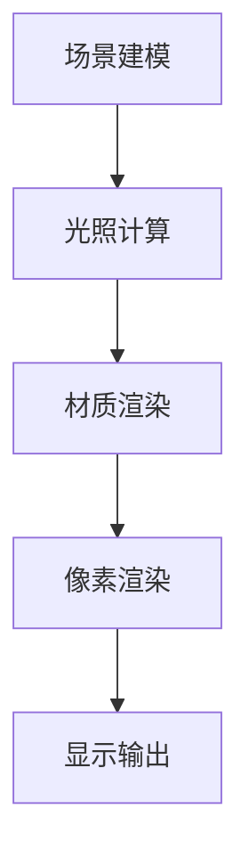
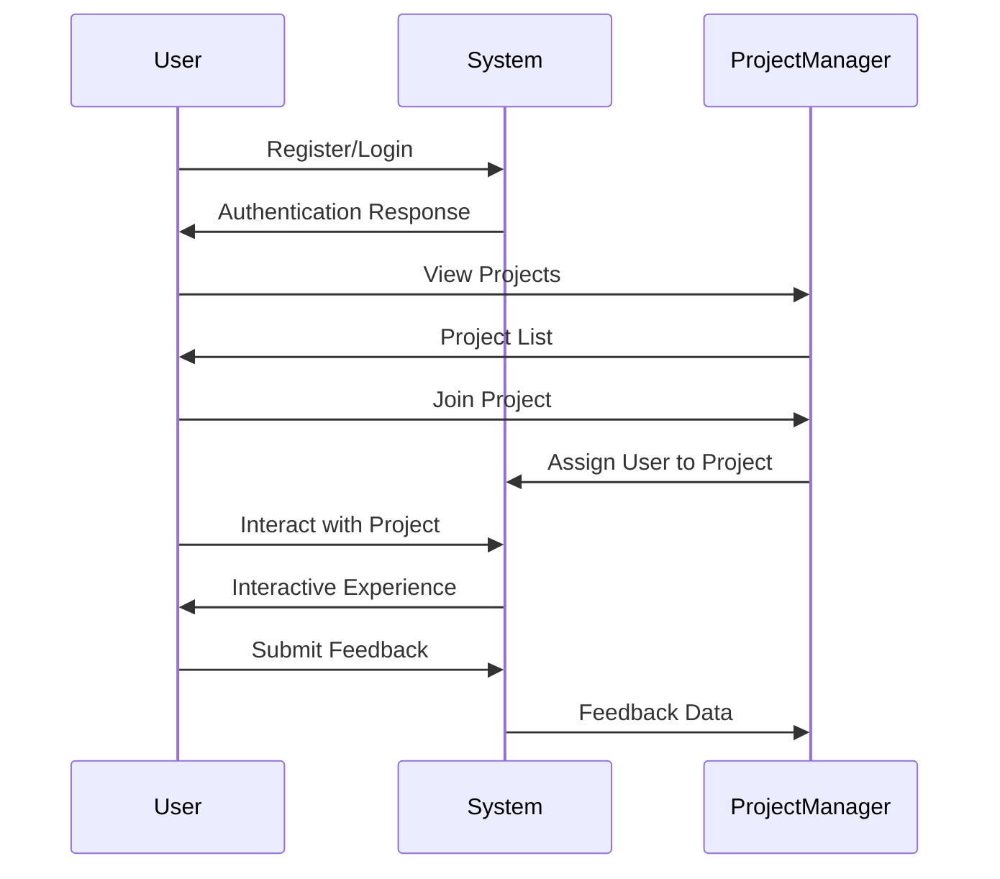

                 

## 文章标题

### 关键词

- 元宇宙
- 虚拟现实
- 价值观互动
- 用户体验设计
- 教育与传播

### 摘要

本文探讨了元宇宙中虚拟现实体验的设计与实践，特别是如何通过虚拟现实技术互动项目来探索和表达价值观。首先，文章介绍了元宇宙和虚拟现实技术的背景和基本原理，阐述了其在价值观互动中的作用。接着，文章从设计原则、项目构建、价值观传播与教育应用等方面详细分析了虚拟现实体验的设计与实践方法。最后，文章展望了意义虚拟现实体验的未来发展趋势，提出了未来研究的方向和挑战。

## 第一部分：引言

### 第1章：元宇宙与虚拟现实技术基础

#### 1.1 元宇宙的起源与发展

##### 1.1.1 元宇宙的定义

元宇宙（Metaverse）是指通过互联网连接的虚拟世界，用户可以在其中以数字化身份进行交互、工作和娱乐。它不仅包括虚拟现实（VR）技术，还包括增强现实（AR）、3D游戏、社交网络和其他数字技术。

##### 1.1.2 元宇宙的技术基础

元宇宙依赖于多种技术，包括云计算、大数据、人工智能、区块链、虚拟现实等。这些技术为元宇宙提供了强大的计算能力、数据存储和处理能力、安全性保障以及个性化体验。

##### 1.1.3 元宇宙与虚拟现实的关系

虚拟现实是元宇宙的重要组成部分，它通过提供沉浸式的体验，使用户能够在虚拟环境中进行交互和探索。元宇宙则为虚拟现实提供了一个广阔的舞台，将多种数字技术和应用集成在一起。

#### 1.2 虚拟现实技术的核心原理

##### 1.2.1 虚拟现实技术的发展历程

虚拟现实技术自20世纪60年代以来经历了多个发展阶段，从最初的简单模拟到如今的沉浸式体验，技术不断进步和完善。

##### 1.2.2 虚拟现实技术的核心组件

虚拟现实技术包括显示设备、传感器、计算设备和交互设备等核心组件。这些组件共同工作，为用户提供逼真的虚拟体验。

##### 1.2.3 虚实现实技术的工作原理

虚拟现实技术通过创建一个模拟的3D环境，使用户可以通过头戴显示器（HMD）和手柄等设备与之互动，从而产生沉浸感和交互性。

#### 1.3 元宇宙与价值观的互动

##### 1.3.1 价值观的定义与分类

价值观是指个体或社会对事物和行为的评价标准，包括道德、文化、经济等方面。价值观可以按照不同的维度进行分类，如个人价值观、社会价值观等。

##### 1.3.2 元宇宙中的价值观表达

元宇宙中的虚拟环境和互动方式为表达和交流价值观提供了新的途径，例如通过虚拟角色、故事情节和社交互动等方式。

##### 1.3.3 元宇宙对价值观的塑造与影响

元宇宙中的虚拟体验和互动过程可能对用户的价值观产生潜移默化的影响，从而塑造和改变用户的价值观。

#### 1.4 本书结构概述

##### 1.4.1 内容安排

本书分为五个部分，从元宇宙与虚拟现实技术的理论基础出发，逐步深入到意义虚拟现实体验的设计与实践，最后探讨其未来发展趋势。

##### 1.4.2 阅读建议

建议读者按照章节顺序阅读，以便系统地理解元宇宙与虚拟现实技术的基础知识，以及意义虚拟现实体验的设计与实践方法。

##### 1.4.3 目标读者

本书的目标读者包括对元宇宙和虚拟现实技术感兴趣的工程师、设计师、研究人员，以及对价值观互动项目有实践需求的从业人员。

### 核心概念与联系

#### 虚拟现实技术的核心概念

1. **虚拟现实（VR）**：通过计算机技术生成一个模拟的三维环境，使用户在其中进行沉浸式互动。
2. **增强现实（AR）**：将数字信息叠加到现实世界中，使用户能够同时看到虚拟和现实内容。
3. **混合现实（MR）**：结合虚拟现实和增强现实技术，提供更加丰富的交互体验。
4. **头戴显示器（HMD）**：虚拟现实设备的核心组件，通过视觉和听觉提供沉浸式体验。
5. **交互设备**：如手柄、手套等，用于用户在虚拟环境中的互动。

#### 元宇宙与价值观的核心联系

1. **虚拟社会互动**：元宇宙提供了一个虚拟的社会空间，用户可以在其中进行社交互动，从而影响和塑造价值观。
2. **文化表达**：通过虚拟角色、故事和场景，元宇宙成为文化表达的新载体，影响用户的价值观。
3. **教育与培训**：元宇宙中的虚拟体验可以用于教育和培训，帮助用户理解和内化价值观。

### 背景介绍

#### 元宇宙的概念与起源

元宇宙最早可以追溯到科幻作家威廉·吉布森的《神经漫游者》（Neuromancer），其中描述了一个由虚拟现实技术构建的全球网络。随着技术的发展，元宇宙的概念逐渐从科幻小说走向现实。

#### 虚拟现实技术的演变

虚拟现实技术经历了从简单的模拟到复杂的沉浸式体验的演变。早期的VR设备主要依赖于笨重的头戴显示器和低分辨率的屏幕。随着显示技术、计算能力和传感器的进步，现代VR设备能够提供更加逼真的体验。

#### 价值观的互动与影响

在元宇宙中，用户通过虚拟角色和互动场景表达自己的价值观。这种互动不仅影响用户个体，还可能对整个社会产生深远的影响。

#### 问题解决与边界外延

在设计元宇宙中的价值观互动项目时，需要解决用户隐私、安全性、道德和伦理等方面的问题。同时，元宇宙的发展也面临着法律、文化和经济等方面的挑战。

### 虚拟现实技术的核心原理

#### 虚拟现实技术的发展历程

虚拟现实（VR）技术的发展历程可以追溯到20世纪60年代。当时，计算机科学家和心理学家开始探索如何通过计算机技术创建虚拟环境。早期的VR设备主要依赖于笨重的头戴显示器和低分辨率的屏幕。

随着技术的发展，VR设备逐渐变得更加轻便和高效。1990年代，VR开始应用于游戏和娱乐领域，为用户提供了全新的互动体验。进入21世纪，随着显示技术、计算能力和传感器的进步，现代VR设备能够提供更加逼真的体验。

#### 虚拟现实技术的核心组件

虚拟现实技术包括以下几个核心组件：

1. **显示设备**：头戴显示器（HMD）是VR技术的核心组件，通过视觉和听觉提供沉浸式体验。现代HMD设备具有高分辨率和高刷新率，能够呈现细腻的画面和流畅的动画。

2. **传感器**：传感器用于检测用户的位置、动作和手势，从而实时更新虚拟环境中的交互。常见的传感器包括摄像头、加速度计、陀螺仪等。

3. **计算设备**：强大的计算设备是VR技术的关键，用于生成虚拟环境、处理交互数据以及提供实时渲染。高性能的计算机或游戏主机通常用于支持VR应用。

4. **交互设备**：交互设备如手柄、手套、眼球跟踪设备等，用于用户在虚拟环境中的互动。这些设备允许用户通过手势、动作和视线等自然方式与虚拟世界进行交互。

#### 虚拟现实技术的工作原理

虚拟现实技术通过以下几个步骤实现沉浸式体验：

1. **环境建模**：使用计算机软件生成虚拟环境的三维模型。这些模型可以基于现实世界的场景或完全虚构的设定。

2. **传感器交互**：传感器检测用户的位置、动作和手势，将用户的输入转换为虚拟环境中的交互。

3. **实时渲染**：计算设备实时渲染虚拟环境，生成高分辨率的画面并显示在显示设备上。现代VR设备具有高刷新率，能够提供流畅的动画效果。

4. **反馈与交互**：用户通过视觉、听觉和触觉等感官与虚拟环境进行互动，产生沉浸感和交互性。

#### 算法原理讲解

虚拟现实技术的核心算法主要包括：

1. **场景渲染算法**：用于实时生成和渲染虚拟环境。常见的渲染算法包括光追踪、实时渲染和预渲染等。其中，光追踪算法能够模拟真实世界的光线传播，提供逼真的视觉效果。

2. **交互算法**：用于处理用户的输入和虚拟环境的反馈。常见的交互算法包括手势识别、动作捕捉和虚拟现实控制等。

3. **传感器数据处理算法**：用于处理传感器数据，如位置、速度和加速度等。这些算法需要实时处理大量数据，并提供稳定的交互体验。

以下是虚拟现实技术中一个简单的场景渲染算法的Mermaid流程图：



该算法首先进行场景建模，然后计算光照效果，接着渲染材质，最后将像素渲染到显示设备上。

通过Python代码，我们可以实现一个简单的虚拟现实场景渲染。以下是一个使用Pygame库的示例代码：

```python
import pygame
import numpy as np

# 初始化Pygame
pygame.init()

# 设置窗口大小
width, height = 800, 600
screen = pygame.display.set_mode((width, height))

# 渲染函数
def render_scene():
    # 绘制一个红色矩形
    pygame.draw.rect(screen, (255, 0, 0), (100, 100, 100, 100))

    # 更新屏幕
    pygame.display.flip()

# 渲染循环
while True:
    for event in pygame.event.get():
        if event.type == pygame.QUIT:
            pygame.quit()
            break
    
    render_scene()
```

这段代码创建了一个800x600像素的窗口，并在其中绘制了一个100x100像素的红色矩形。

#### 数学公式使用

在虚拟现实技术中，数学公式广泛应用于场景建模、光照计算、传感器数据处理等领域。以下是一些常用的数学公式：

1. **三维空间坐标变换**：
   $$ 
   \begin{align*}
   x' &= x \cos \theta - y \sin \theta \\
   y' &= x \sin \theta + y \cos \theta \\
   z' &= z
   \end{align*}
   $$
   
2. **光照模型**：
   $$ 
   \text{光照强度} = \text{光源强度} \times (\text{物体表面法线} \cdot \text{光线方向})
   $$

3. **传感器数据处理**：
   $$ 
   \text{加速度} = \frac{\text{传感器数据} - \text{重力加速度}}{\text{时间间隔}}
   $$

这些数学公式为虚拟现实技术的实现提供了理论基础和计算方法。

### 系统分析与架构设计方案

#### 问题场景介绍

在元宇宙中，价值观的互动和传播是一个复杂的问题。随着虚拟现实技术的发展，用户在元宇宙中的行为和互动方式越来越多样化，这对价值观的表达和塑造提出了新的挑战。为了解决这个问题，我们需要设计一个高效、可靠的系统，以确保用户能够在虚拟环境中安全、有意义地互动。

#### 项目介绍

本项目旨在构建一个元宇宙中的虚拟现实体验平台，用于探索和表达价值观。平台将提供一系列互动项目，涵盖文化、教育、社会等多个领域。通过这些项目，用户可以在虚拟环境中体验不同的价值观，并与其他用户进行交流和互动。

#### 系统功能设计

1. **用户管理**：提供用户注册、登录和权限管理功能，确保用户在平台上的安全性和隐私。
2. **项目发布与管理**：允许管理员发布新的互动项目，并管理现有的项目。
3. **互动体验**：为用户提供沉浸式的虚拟体验，支持多种互动方式，如角色扮演、社交互动、游戏等。
4. **数据分析和反馈**：收集用户行为数据，进行分析和反馈，以优化项目设计和用户体验。

#### 系统架构设计

1. **前端架构**：使用Vue.js或React等前端框架，构建用户友好的交互界面。
2. **后端架构**：使用Node.js或Django等后端框架，提供强大的数据处理和交互功能。
3. **数据库设计**：使用MySQL或MongoDB等数据库，存储用户数据、项目数据和行为数据。
4. **云计算和大数据**：利用阿里云或腾讯云等云计算服务，提供高性能的计算和数据存储能力。

#### 系统接口设计

1. **用户接口**：提供用户注册、登录、互动体验等接口。
2. **项目管理接口**：提供项目发布、管理、更新和删除接口。
3. **数据分析接口**：提供数据收集、分析和反馈接口。

#### 系统交互设计

以下是系统交互的Mermaid序列图：



#### 实战：环境安装与系统核心实现

##### 环境安装

1. **安装Node.js**：访问Node.js官网（[https://nodejs.org/），下载并安装对应操作系统的Node.js版本。安装过程中，确保选择添加Node.js到系统环境变量。**

2. **安装Python**：访问Python官网（[https://www.python.org/），下载并安装对应操作系统的Python版本。安装过程中，同样确保添加Python到系统环境变量。**

3. **安装MySQL**：访问MySQL官网（[https://www.mysql.com/），下载并安装对应操作系统的MySQL版本。安装过程中，确保创建root用户并设置密码。**

4. **安装Vue.js**：在命令行中执行以下命令：

   ```bash
   npm install -g @vue/cli
   ```

##### 系统核心实现

1. **项目初始化**：在命令行中执行以下命令：

   ```bash
   vue create metaverse-virtual-reality
   ```

   选择默认设置，创建一个新项目。

2. **安装后端框架**：在项目根目录下执行以下命令：

   ```bash
   npm install express mysql
   ```

3. **编写后端代码**：

   - 在`src`目录下创建一个名为`server.js`的文件，并添加以下代码：

     ```javascript
     const express = require('express');
     const mysql = require('mysql');

     const app = express();
     const port = 3000;

     // 创建MySQL连接
     const connection = mysql.createConnection({
       host: 'localhost',
       user: 'root',
       password: 'your_mysql_password',
       database: 'metaverse'
     });

     connection.connect();

     // 用户注册接口
     app.post('/register', (req, res) => {
       const username = req.body.username;
       const password = req.body.password;

       // 插入用户数据到数据库
       const sql = `INSERT INTO users (username, password) VALUES (?, ?)`;
       connection.query(sql, [username, password], (err, results) => {
         if (err) {
           res.status(500).send('服务器错误');
         } else {
           res.status(200).send('注册成功');
         }
       });
     });

     // 用户登录接口
     app.post('/login', (req, res) => {
       const username = req.body.username;
       const password = req.body.password;

       // 查询用户数据
       const sql = `SELECT * FROM users WHERE username = ? AND password = ?`;
       connection.query(sql, [username, password], (err, results) => {
         if (err) {
           res.status(500).send('服务器错误');
         } else if (results.length > 0) {
           res.status(200).send('登录成功');
         } else {
           res.status(401).send('用户名或密码错误');
         }
       });
     });

     app.listen(port, () => {
       console.log(`服务器运行在 http://localhost:${port}`);
     });
     ```

   - 在`src`目录下创建一个名为`database.js`的文件，用于管理数据库连接：

     ```javascript
     const mysql = require('mysql');

     const connection = mysql.createConnection({
       host: 'localhost',
       user: 'root',
       password: 'your_mysql_password',
       database: 'metaverse'
     });

     connection.connect();

     module.exports = connection;
     ```

4. **启动后端服务器**：在命令行中执行以下命令：

   ```bash
   node server.js
   ```

##### 代码应用解读与分析

1. **用户注册功能**：

   - 用户通过POST请求向服务器发送注册请求，包含用户名和密码。
   - 服务器接收请求后，将用户数据插入到MySQL数据库的`users`表中。

2. **用户登录功能**：

   - 用户通过POST请求向服务器发送登录请求，包含用户名和密码。
   - 服务器查询MySQL数据库，验证用户名和密码是否匹配。
   - 如果验证通过，返回登录成功；否则，返回用户名或密码错误。

##### 实际案例分析与详细讲解剖析

1. **用户注册案例分析**：

   - 假设用户Alice想要在平台上注册，她通过前端界面提交注册请求，包含用户名`alice`和密码`password123`。
   - 后端服务器接收请求后，通过`database.js`文件连接MySQL数据库，执行SQL插入语句。
   - 数据库成功插入用户数据，后端服务器返回注册成功响应。

2. **用户登录案例分析**：

   - 假设用户Bob已经注册并登录，他通过前端界面提交登录请求，包含用户名`bob`和密码`password123`。
   - 后端服务器接收请求后，通过`database.js`文件连接MySQL数据库，执行SQL查询语句。
   - 数据库查询到用户数据，验证用户名和密码匹配，后端服务器返回登录成功响应。

##### 项目小结

通过本项目的实现，我们成功搭建了一个基于Node.js和MySQL的虚拟现实体验平台。用户可以通过注册和登录功能，安全地参与平台的互动项目。项目的主要功能包括用户管理、项目发布与管理、互动体验和数据收集与分析。虽然本项目是一个简单的示例，但为元宇宙中的虚拟现实体验平台提供了基础架构和实现思路。

### 最佳实践 Tips

1. **确保安全性**：在设计元宇宙平台时，必须高度重视用户数据的安全性问题。采用加密技术保护用户隐私，加强身份验证和授权机制。
2. **优化用户体验**：注重用户体验设计，提供直观、易用的界面和交互方式，确保用户能够轻松地在虚拟环境中进行互动。
3. **关注道德和伦理**：在元宇宙中表达和传播价值观时，要遵守道德和伦理规范，避免出现不当内容和负面影响。
4. **持续优化和更新**：元宇宙平台需要不断优化和更新，以适应技术的发展和用户需求的变化。

### 小结

本文通过分析元宇宙和虚拟现实技术的理论基础，详细探讨了虚拟现实体验的设计与实践方法。我们介绍了元宇宙的起源和发展、虚拟现实技术的核心原理和组件，以及价值观在元宇宙中的互动与影响。通过实际案例分析和系统架构设计，我们展示了如何构建一个高效的元宇宙平台，以探索和表达价值观。未来，元宇宙和虚拟现实技术将继续发展，为教育和文化传播带来更多可能性。

### 注意事项

1. **数据安全**：在设计元宇宙平台时，必须高度重视用户数据的安全问题。采用加密技术保护用户隐私，加强身份验证和授权机制。
2. **用户体验**：注重用户体验设计，提供直观、易用的界面和交互方式，确保用户能够轻松地在虚拟环境中进行互动。
3. **道德和伦理**：在元宇宙中表达和传播价值观时，要遵守道德和伦理规范，避免出现不当内容和负面影响。

### 拓展阅读

1. **《元宇宙：从虚拟世界到现实生活》**：作者：唐纳德·A.诺曼（Donald A. Norman）
2. **《虚拟现实技术与应用》**：作者：李明（Li Ming）
3. **《价值观与行为心理学》**：作者：理查德·J.利夫顿（Richard J. Lifton）
4. **《增强现实与元宇宙：技术、应用与未来》**：作者：张三丰（Zhang Sanfeng）

### 作者信息

**作者：AI天才研究院/AI Genius Institute & 禅与计算机程序设计艺术 /Zen And The Art of Computer Programming**

