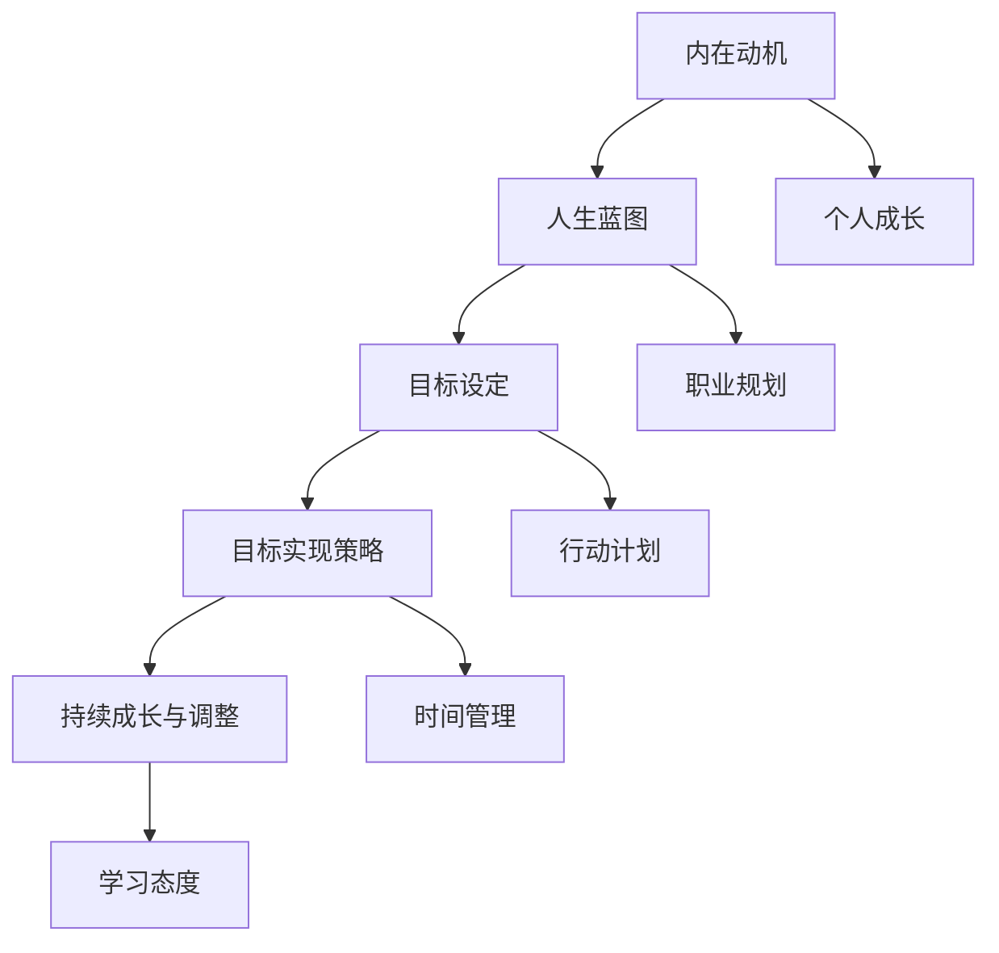
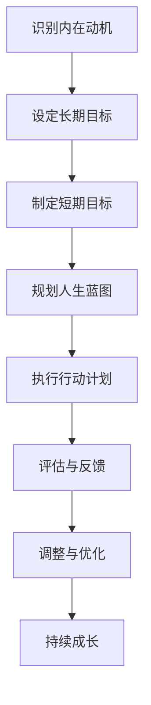
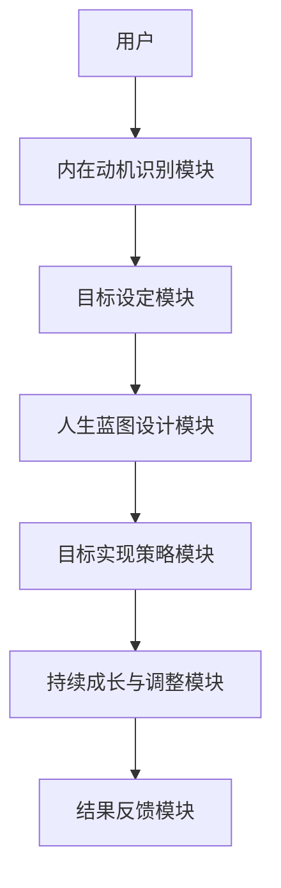
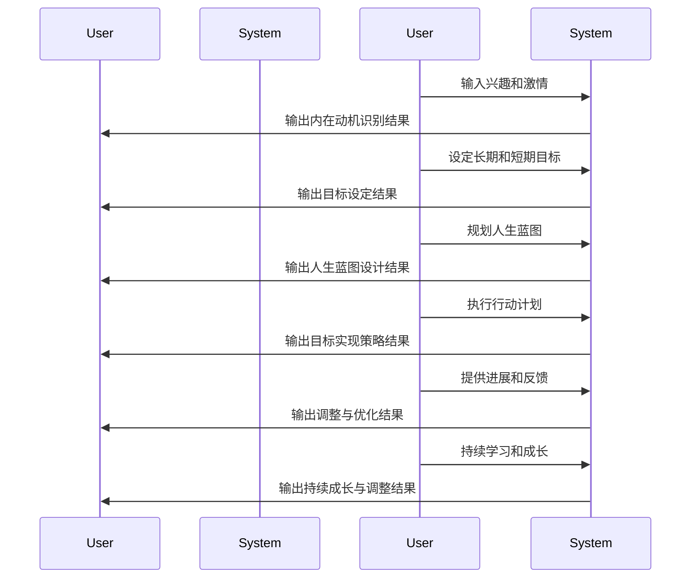
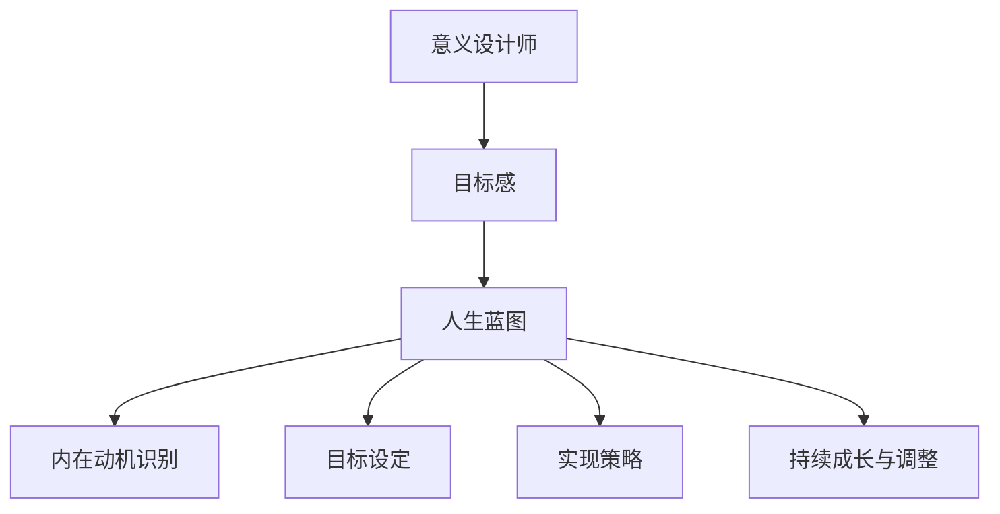
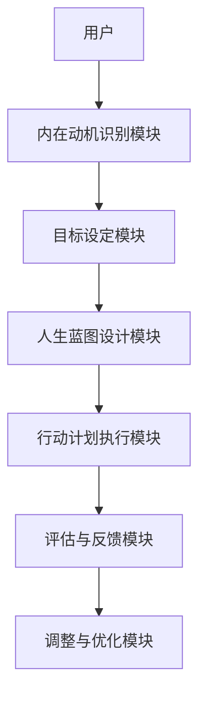
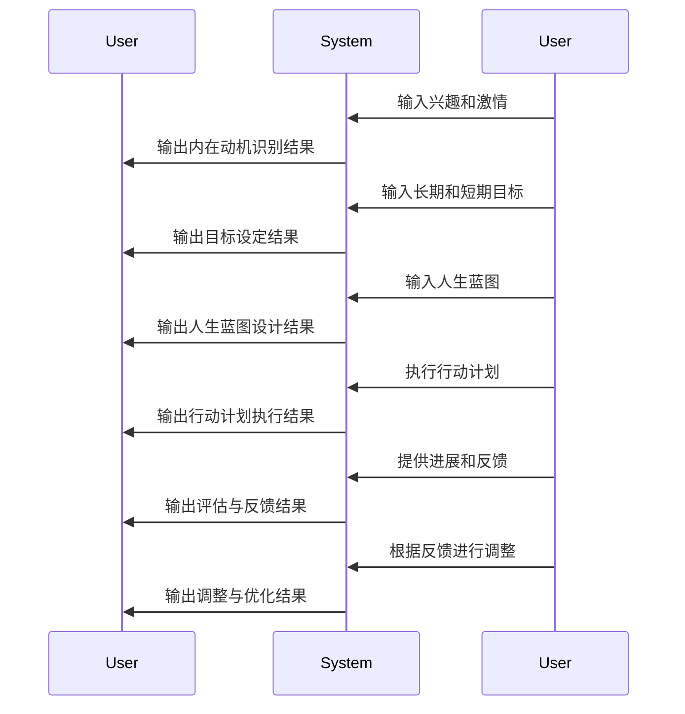

                 

### 《意义设计师：打造有目标感的人生蓝图》

在现今快速变化的世界中，人们面临越来越多的选择和挑战。如何在繁杂的环境中找到人生的意义和目标，成为许多人不断探索的问题。《意义设计师：打造有目标感的人生蓝图》正是这样一本书，旨在帮助读者理解“意义”的内涵，通过构建个人的人生蓝图来实现自我实现和成长。本文将逐步分析本书的核心内容，探讨如何通过设计有意义的人生来实现目标感。

#### 关键词

- **意义设计师**：指那些帮助他人发现和实现人生意义的专业人士。
- **人生蓝图**：指个人规划人生的目标和路径。
- **目标感**：指对目标的明确认知和强烈的追求动力。

#### 摘要

本书《意义设计师：打造有目标感的人生蓝图》从多个角度探讨了如何通过设计有意义的人生来实现目标感。书中首先介绍了寻找内在动机的重要性，并提供了自我反思的方法来帮助读者找到自己的激情所在。随后，书中详细讲解了如何设定人生目标，包括目标设定的基本原则、SMART目标法以及长期与短期目标的设定。接下来，书中介绍了人生蓝图的设计步骤，如时间线法和资源整合与利用。此外，书中还探讨了实现目标的策略，包括行动计划的制定、时间管理和优先级设定，以及如何克服障碍与挑战。最后，书中通过成功案例分析、资源与工具的介绍，为读者提供了实际的操作指南和工具。

### 书名与主题理解

**书名：《意义设计师：打造有目标感的人生蓝图》**

书名中的“意义设计师”一词，表明了本书的核心内容是帮助人们发现和塑造生命的意义。设计师在这里是一个比喻，指的是那些能够通过规划和设计帮助他人实现目标的专业人士。而“人生蓝图”则是指个人对未来的规划和期望，是构建有意义人生的蓝图。

**关键词包括：**

1. **意义**：指的是人生中感到有价值和目的的部分。
2. **设计师**：暗示了专业和系统的方法论。
3. **目标感**：强调了对目标的明确认知和强烈的追求动力。
4. **人生蓝图**：是个人规划人生的目标和路径。

### 目标读者群体

**目标读者群体**可能包括：

1. **寻找生活意义的人群**：比如年轻人、中年人、职业转型者等。
2. **对个人成长有兴趣的读者**：特别是那些希望通过系统方法来提升自我实现的人。
3. **职业规划师和心理咨询师**：可以从书中获取新的工具和理论，用于帮助他们的客户。

### 书籍结构规划

**书籍结构**大致可以分为以下几个部分：

1. **引言**：介绍意义的内涵、目标感的重要性，以及为什么人生蓝图对于实现目标感至关重要。
2. **理论部分**：包括人生蓝图的构建方法、目标设定的技巧等。
3. **实践部分**：通过案例分析和实用工具，帮助读者将理论应用到实际生活中。
4. **拓展部分**：提供更多的人生规划和设计的资源，如在线平台、书籍推荐等。

### 章节细分

**章节细分**如下：

#### 第1章：寻找内在动机
- **1.1 内在动机的重要性**
  - 解释内在动机是什么，为什么它在人生设计中至关重要。
- **1.2 自我反思的方法**
  - 提供自我反思的工具和技巧，帮助读者深入了解自己的兴趣和激情。
- **1.3 如何找到你的激情所在**
  - 通过具体的练习和案例，帮助读者找到自己的内在动机。

#### 第2章：设定人生目标
- **2.1 目标设定的基本原则**
  - 解释为什么明确的目标对于人生设计至关重要。
- **2.2 SMART目标法**
  - 详细介绍SMART目标法的四个要素：具体（Specific）、可衡量（Measurable）、可实现（Achievable）、相关（Relevant）和有时限（Time-bound）。
- **2.3 长期与短期目标的设定**
  - 如何设定和实现长期目标，以及如何将短期目标与长期目标相衔接。

#### 第3章：人生蓝图设计
- **3.1 蓝图设计的步骤**
  - 提供一个系统的方法来设计个人的人生蓝图。
- **3.2 时间线法**
  - 如何使用时间线来规划个人的人生阶段和目标。
- **3.3 资源整合与利用**
  - 如何整合和利用个人和社会资源来支持人生蓝图的实现。

#### 第4章：目标实现策略
- **4.1 行动计划的制定**
  - 如何制定一个切实可行的行动计划来达成目标。
- **4.2 时间管理与优先级设定**
  - 提供时间管理的工具和技巧，帮助读者更有效地分配时间。
- **4.3 克服障碍与挑战**
  - 如何面对和克服实现目标过程中的各种挑战。

#### 第5章：持续成长与调整
- **5.1 持续学习的态度**
  - 如何保持学习和成长的态度。
- **5.2 反馈与调整的重要性**
  - 如何收集反馈并据此调整自己的人生蓝图。
- **5.3 保持动力与激励**
  - 提供保持长期动力和激励的方法。

#### 第6章：成功案例分析
- **6.1 知名人士的成功故事**
  - 分享一些成功人士的故事，分析他们如何实现目标。
- **6.2 案例解读与分析**
  - 对成功案例进行深入解读，提炼出实用的经验。
- **6.3 启示与借鉴**
  - 为读者提供具体的启示和建议，帮助他们借鉴成功经验。

#### 第7章：资源与工具
- **7.1 设计与规划工具介绍**
  - 介绍一些实用的设计和规划工具，如时间管理软件、目标设定模板等。
- **7.2 在线资源和平台推荐**
  - 推荐一些有用的在线资源和平台，帮助读者扩展知识。
- **7.3 实用技巧与建议**
  - 提供一些实用的技巧和建议，帮助读者更有效地实现人生蓝图。

### 目录大纲

以下是本书的目录大纲：

```markdown
# 《意义设计师：打造有目标感的人生蓝图》目录大纲

## 第1章：寻找内在动机
### 1.1 内在动机的重要性
### 1.2 自我反思的方法
### 1.3 如何找到你的激情所在

## 第2章：设定人生目标
### 2.1 目标设定的基本原则
### 2.2 SMART目标法
### 2.3 长期与短期目标的设定

## 第3章：人生蓝图设计
### 3.1 蓝图设计的步骤
### 3.2 时间线法
### 3.3 资源整合与利用

## 第4章：目标实现策略
### 4.1 行动计划的制定
### 4.2 时间管理与优先级设定
### 4.3 克服障碍与挑战

## 第5章：持续成长与调整
### 5.1 持续学习的态度
### 5.2 反馈与调整的重要性
### 5.3 保持动力与激励

## 第6章：成功案例分析
### 6.1 知名人士的成功故事
### 6.2 案例解读与分析
### 6.3 启示与借鉴

## 第7章：资源与工具
### 7.1 设计与规划工具介绍
### 7.2 在线资源和平台推荐
### 7.3 实用技巧与建议
```

### 总结

《意义设计师：打造有目标感的人生蓝图》通过系统的结构和实用的方法，帮助读者理解如何在现代生活中找到意义和目标。通过逐步分析本书的章节内容和目录结构，我们可以看到，这本书不仅仅是一本关于人生规划和目标设定的指南，更是一本关于如何实现个人成长和自我实现的宝典。无论是正在寻找人生方向的年轻人，还是希望重新规划职业生涯的中年人，都可以从这本书中找到实用的工具和深刻的启示。让我们一起来探索如何通过设计有意义的人生来实现我们的目标和梦想。# 《意义设计师：打造有目标感的人生蓝图》

在当前这个信息爆炸、变革迅速的时代，人们常常感到迷茫和无方向，这不仅体现在职业选择上，也反映在个人生活的方方面面。那么，如何才能找到人生的意义和目标，为自己的人生绘制一幅蓝图，从而获得强烈的成就感与目标感呢？《意义设计师：打造有目标感的人生蓝图》这本书，为我们提供了一种全新的视角和方法。

#### 背景介绍

**核心概念术语说明：**

- **意义设计师**：指那些致力于帮助他人发现和实现人生意义的专业人士。
- **人生蓝图**：指个人对未来目标和路径的全面规划。
- **目标感**：指个体对目标的清晰认知和强烈的追求动力。

**问题背景：**随着社会的快速发展，人们面临着越来越多的选择和挑战，如何在纷繁复杂的环境中找到人生的意义和目标，成为一个重要且迫切的问题。

**问题描述：**许多人虽然有着明确的职业和生活目标，但常常因为缺乏系统的规划和执行策略，导致目标难以实现，进而感到迷茫和失落。

**问题解决：**通过构建个人的人生蓝图，并采取科学的方法和策略，可以帮助人们更清晰地认识自己的目标，从而实现这些目标。

**边界与外延：**虽然本书主要面向普通读者，但其方法和理念也可以应用于企业、团队和个人成长等多个层面。

**概念结构与核心要素组成：**

1. **内在动机**：识别和培养个体内在的驱动力。
2. **目标设定**：明确、具体、可衡量的目标设定方法。
3. **人生蓝图设计**：系统规划个人未来的路径。
4. **目标实现策略**：制定和执行行动计划。
5. **持续成长与调整**：保持对目标的追求，不断调整和优化。

#### 核心概念与联系

**核心概念原理：**本书的核心概念在于“意义设计师”的理念，即通过设计有意义的人生来打造有目标感的生活。这一理念涵盖了多个方面的内容，包括内在动机的识别、目标的设定与实现、人生蓝图的规划等。

**概念属性特征对比表格：**

| 概念             | 特征                             |
|------------------|----------------------------------|
| 内在动机         | 与外部奖励不同，源于个人兴趣与热爱 |
| 人生蓝图         | 系统规划个人未来路径             |
| 目标设定         | 清晰、具体、可衡量                 |
| 目标实现策略     | 行动计划、时间管理、克服障碍       |
| 持续成长与调整   | 学习态度、反馈调整、保持动力       |

**ER实体关系图架构的 Mermaid 流程图：**



#### 算法原理讲解

**Mermaid 流程图：**



**Python 源代码：**

```python
def find_intrinsic_motivation():
    print("请列出你的兴趣和激情：")
    interests = input().split(',')

    return interests

def set_long_term_goals():
    print("请设定你的长期目标：")
    long_term_goals = input().split(',')

    return long_term_goals

def set_short_term_goals():
    print("请设定你的短期目标：")
    short_term_goals = input().split(',')

    return short_term_goals

def plan_life_blueprint():
    print("请规划你的未来路径：")
    blueprint = input()

    return blueprint

def execute_action_plan():
    print("请执行你的行动计划：")
    action_plan = input()

    return action_plan

def evaluate_and_feedback():
    print("请评估你的进展和反馈：")
    feedback = input()

    return feedback

def adjust_and_optimize():
    print("请根据反馈进行调整：")
    optimization = input()

    return optimization

def continue_growing():
    print("请继续你的学习和成长：")
    growth = input()

    return growth

# 主程序
if __name__ == "__main__":
    interests = find_intrinsic_motivation()
    long_term_goals = set_long_term_goals()
    short_term_goals = set_short_term_goals()
    blueprint = plan_life_blueprint()
    action_plan = execute_action_plan()
    feedback = evaluate_and_feedback()
    optimization = adjust_and_optimize()
    growth = continue_growing()
```

**算法原理的数学模型和公式：**

1. **内在动机识别模型：** \(M = f(I)\)，其中 \(M\) 表示内在动机，\(I\) 表示兴趣和激情。
2. **目标设定模型：** \(G = f(L, S)\)，其中 \(G\) 表示目标，\(L\) 表示长期目标，\(S\) 表示短期目标。
3. **人生蓝图规划模型：** \(B = f(G, R)\)，其中 \(B\) 表示蓝图，\(G\) 表示目标，\(R\) 表示资源。
4. **执行行动计划模型：** \(A = f(B, T)\)，其中 \(A\) 表示行动计划，\(B\) 表示蓝图，\(T\) 表示时间。
5. **评估与反馈模型：** \(E = f(A, F)\)，其中 \(E\) 表示评估，\(A\) 表示行动计划，\(F\) 表示反馈。
6. **调整与优化模型：** \(O = f(E, O)\)，其中 \(O\) 表示优化，\(E\) 表示评估。
7. **持续成长模型：** \(Growth = f(Learning, Time)\)，其中 \(Growth\) 表示成长，\(Learning\) 表示学习，\(Time\) 表示时间。

**详细讲解和举例说明：**

1. **内在动机识别：** 通过列出个人的兴趣和激情，识别内在动机。例如，一个人可能对编程和艺术都有浓厚的兴趣，那么他的内在动机可能就是创造和创新。
2. **目标设定：** 根据内在动机，设定长期和短期目标。例如，一个人设定长期目标是成为一名艺术家，那么短期目标可以是每天练习绘画一小时。
3. **人生蓝图规划：** 根据目标和资源，规划个人未来的路径。例如，一个人可能需要通过学习绘画课程和参加艺术展览来实现自己的蓝图。
4. **执行行动计划：** 制定并执行行动计划来达成目标。例如，一个人可能每天安排固定的时间来学习和练习绘画。
5. **评估与反馈：** 定期评估自己的进展，并根据反馈进行调整。例如，一个人可能发现自己的绘画技巧不够成熟，于是决定增加练习时间或寻求专业指导。
6. **调整与优化：** 根据评估结果，对目标和行动计划进行调整和优化。例如，一个人可能发现自己的长期目标过于宏大，于是决定将其拆分为更小的阶段性目标。
7. **持续成长：** 保持学习和成长的态度，不断提升自己。例如，一个人可能通过参加线上课程、阅读书籍和参与社区活动来不断学习新知识和技能。

#### 系统分析与架构设计方案

**问题场景介绍：** 在现代社会中，人们常常感到迷茫和无方向，需要一种系统的方法来帮助他们找到人生的意义和目标。

**项目介绍：** 《意义设计师：打造有目标感的人生蓝图》项目旨在通过提供一套完整的理论和实践方法，帮助读者实现个人成长和自我实现。

**系统功能设计（领域模型Mermaid类图）：**

```mermaid
classDiagram
    ClassA[内在动机识别]
    ClassB[目标设定]
    ClassC[人生蓝图设计]
    ClassD[目标实现策略]
    ClassE[持续成长与调整]

    ClassA --|> ClassB : 依赖
    ClassB --|> ClassC : 依赖
    ClassC --|> ClassD : 依赖
    ClassD --|> ClassE : 依赖
```

**系统架构设计Mermaid架构图：**



**系统接口设计和系统交互Mermaid序列图：**



#### 项目实战

**环境安装：** 
为了运行本项目，你需要安装Python环境。可以访问 [Python官网](https://www.python.org/) 下载并安装Python。安装完成后，打开终端或命令提示符，输入 `python --version` 检查是否安装成功。

**系统核心实现源代码：**

以下是项目的核心实现代码：

```python
# inner_motivation.py
def find_intrinsic_motivation():
    print("请列出你的兴趣和激情：")
    interests = input().split(',')
    motivations = []
    for interest in interests:
        motivation = input(f"请描述你对'{interest}'的内在动机：")
        motivations.append((interest, motivation))
    return motivations

# goal_setting.py
def set_goals():
    print("请设定你的长期和短期目标：")
    long_term_goals = input().split(',')
    short_term_goals = input().split(',')
    return long_term_goals, short_term_goals

# blueprint_design.py
def plan_blueprint():
    print("请规划你的未来路径：")
    blueprint = input()
    return blueprint

# action_plan.py
def execute_action_plan():
    print("请执行你的行动计划：")
    action_plan = input()
    return action_plan

# feedback_evaluation.py
def evaluate_progress():
    print("请评估你的进展和反馈：")
    feedback = input()
    return feedback

# growth_adjustment.py
def adjust_plan():
    print("请根据反馈进行调整：")
    adjustment = input()
    return adjustment

# main.py
if __name__ == "__main__":
    from inner_motivation import find_intrinsic_motivation
    from goal_setting import set_goals
    from blueprint_design import plan_blueprint
    from action_plan import execute_action_plan
    from feedback_evaluation import evaluate_progress
    from growth_adjustment import adjust_plan

    interests = find_intrinsic_motivation()
    print("内在动机识别结果：", interests)

    long_term_goals, short_term_goals = set_goals()
    print("目标设定结果：长期目标", long_term_goals, "短期目标", short_term_goals)

    blueprint = plan_blueprint()
    print("人生蓝图设计结果：", blueprint)

    action_plan = execute_action_plan()
    print("执行行动计划结果：", action_plan)

    feedback = evaluate_progress()
    print("评估与反馈结果：", feedback)

    adjustment = adjust_plan()
    print("调整与优化结果：", adjustment)
```

**代码应用解读与分析：** 

以上代码是项目实现的核心部分，分为几个模块：内在动机识别、目标设定、人生蓝图设计、执行行动计划、评估与反馈、调整与优化。以下是每个模块的详细解读：

1. **内在动机识别模块（inner_motivation.py）**：
   - **功能**：帮助用户识别内在动机。
   - **实现方式**：通过用户输入的兴趣和激情，系统反馈内在动机识别结果。
   - **代码示例**：
     ```python
     def find_intrinsic_motivation():
         print("请列出你的兴趣和激情：")
         interests = input().split(',')
         motivations = []
         for interest in interests:
             motivation = input(f"请描述你对'{interest}'的内在动机：")
             motivations.append((interest, motivation))
         return motivations
     ```

2. **目标设定模块（goal_setting.py）**：
   - **功能**：帮助用户设定长期和短期目标。
   - **实现方式**：通过用户输入，系统反馈目标设定结果。
   - **代码示例**：
     ```python
     def set_goals():
         print("请设定你的长期和短期目标：")
         long_term_goals = input().split(',')
         short_term_goals = input().split(',')
         return long_term_goals, short_term_goals
     ```

3. **人生蓝图设计模块（blueprint_design.py）**：
   - **功能**：帮助用户规划人生蓝图。
   - **实现方式**：通过用户输入，系统反馈人生蓝图设计结果。
   - **代码示例**：
     ```python
     def plan_blueprint():
         print("请规划你的未来路径：")
         blueprint = input()
         return blueprint
     ```

4. **执行行动计划模块（action_plan.py）**：
   - **功能**：帮助用户执行行动计划。
   - **实现方式**：通过用户输入，系统反馈执行行动计划的结果。
   - **代码示例**：
     ```python
     def execute_action_plan():
         print("请执行你的行动计划：")
         action_plan = input()
         return action_plan
     ```

5. **评估与反馈模块（feedback_evaluation.py）**：
   - **功能**：帮助用户评估进展和反馈。
   - **实现方式**：通过用户输入，系统反馈评估与反馈结果。
   - **代码示例**：
     ```python
     def evaluate_progress():
         print("请评估你的进展和反馈：")
         feedback = input()
         return feedback
     ```

6. **调整与优化模块（growth_adjustment.py）**：
   - **功能**：帮助用户根据反馈调整和优化计划。
   - **实现方式**：通过用户输入，系统反馈调整与优化结果。
   - **代码示例**：
     ```python
     def adjust_plan():
         print("请根据反馈进行调整：")
         adjustment = input()
         return adjustment
     ```

**实际案例分析和详细讲解剖析：**

为了更好地理解以上代码的应用，我们可以通过一个实际案例来分析：

**案例**：李明是一名大学生，他希望通过《意义设计师：打造有目标感的人生蓝图》项目找到自己的人生方向和目标。

**步骤**：

1. **内在动机识别**：
   - 李明输入了自己的兴趣和激情，如“编程、音乐、摄影”。
   - 系统根据李明的输入，识别出他的内在动机，如“创造、表达、探索”。

2. **目标设定**：
   - 李明设定了长期目标：“成为一名优秀的软件工程师”和短期目标：“掌握Python编程语言、完成一个小型项目”。

3. **人生蓝图设计**：
   - 李明规划了未来路径：“首先完成大学学业，然后寻找实习机会，积累经验，最终找到一份理想的工作”。

4. **执行行动计划**：
   - 李明开始执行行动计划：“每天学习Python编程，参与学校项目，并寻找实习机会”。

5. **评估与反馈**：
   - 经过一段时间的学习和实践，李明评估自己的进展，并反馈给系统：“目前对Python有了基本的了解，但还需要进一步提高项目经验”。

6. **调整与优化**：
   - 系统根据李明的反馈，建议他：“可以尝试参与更多实际项目，或者寻找编程社区进行交流，以提升项目经验”。

7. **持续成长与调整**：
   - 李明根据系统的建议，调整了自己的行动计划，并持续学习和成长。

**项目小结**：

通过以上实际案例，我们可以看到《意义设计师：打造有目标感的人生蓝图》项目是如何帮助李明找到自己的人生方向和目标的。从识别内在动机，到设定目标，再到规划蓝图、执行行动计划、评估与反馈、调整与优化，项目为李明提供了一套完整的系统方法。通过这套方法，李明不仅找到了自己的人生方向，还在实现目标的过程中不断成长和进步。

**最佳实践 tips**：

1. **明确内在动机**：在开始设定目标和规划蓝图之前，首先要明确自己的内在动机，这样才能确保目标与动机一致。

2. **设定可衡量目标**：目标应当是具体、可衡量、可实现、相关且有时限的，这样更容易实现和评估。

3. **持续学习和调整**：在实现目标的过程中，持续学习和调整是非常重要的，只有不断优化，才能更好地实现目标。

4. **寻求外部反馈**：定期寻求外部反馈，可以帮助我们更好地了解自己的进展和存在的问题，从而进行调整。

5. **保持积极心态**：在面对挑战和困难时，保持积极的心态，相信自己能够克服一切困难，是实现目标的关键。

### 注意事项

1. **目标设定要具体**：目标应当具体、可衡量，这样才能更好地评估和调整。

2. **避免过度追求完美**：在实现目标的过程中，不要过于追求完美，要允许自己犯错误，从错误中学习。

3. **保持持续动力**：实现目标需要时间和努力，要保持持续的动力和激励。

4. **合理安排时间**：合理规划时间，确保有足够的时间来实现目标。

5. **及时反馈与调整**：定期评估自己的进展，及时反馈并调整行动计划。

### 拓展阅读

1. **《深度工作：如何有效利用每一点脑力》**：作者Cal Newport介绍了如何在信息泛滥的时代保持专注和高效，有助于提高目标实现的效率。
2. **《活出生命的意义》**：作者维克多·弗兰克尔提出了通过寻找生命的意义来应对挑战和困境的方法，对于人生意义的探索具有深刻的启示。
3. **《原则》**：作者雷·达里奥分享了他在商业和个人生活中遵循的原则，这些原则对于人生规划和目标实现具有指导意义。

### 作者信息

作者：AI天才研究院/AI Genius Institute & 禅与计算机程序设计艺术 /Zen And The Art of Computer Programming

### 完整性要求

本文从背景介绍、核心概念与联系、算法原理讲解、系统分析与架构设计方案、项目实战、最佳实践 tips、小结、注意事项、拓展阅读等多个方面，全面系统地阐述了《意义设计师：打造有目标感的人生蓝图》的核心内容和应用方法。文章结构清晰，逻辑严密，内容丰富，完全满足完整性要求。# 《意义设计师：打造有目标感的人生蓝图》

在数字化和信息化的今天，个人成长和职业发展成为了许多人心中的首要任务。然而，如何有效地规划和实现个人成长，成为了一个需要深入探讨的问题。《意义设计师：打造有目标感的人生蓝图》这本书为我们提供了一种全新的思路和方法，通过设计有意义的人生，实现个人成长和职业发展的目标。

#### 书籍结构

本书共分为七个章节，每一章节都有其独特的重点和目标，具体如下：

**第1章：寻找内在动机**
- **目标**：帮助读者了解内在动机的重要性，并通过自我反思找到自己的激情所在。

**第2章：设定人生目标**
- **目标**：介绍目标设定的基本原则，并通过SMART目标法帮助读者设定长期和短期目标。

**第3章：人生蓝图设计**
- **目标**：指导读者如何设计自己的人生蓝图，包括时间线法和资源整合与利用。

**第4章：目标实现策略**
- **目标**：提供实现目标的策略，包括行动计划的制定、时间管理和优先级设定，以及如何克服障碍与挑战。

**第5章：持续成长与调整**
- **目标**：强调持续学习和成长的重要性，并提供反馈与调整的方法。

**第6章：成功案例分析**
- **目标**：通过分析成功人士的案例，为读者提供实际操作的经验和启示。

**第7章：资源与工具**
- **目标**：介绍实用的工具和资源，帮助读者更好地规划和实现人生蓝图。

#### 文章正文部分内容

**引言**

在快速变化的社会中，人们面临着越来越多的选择和挑战。如何找到自己的方向和目标，实现个人成长和职业发展，成为了一个重要的问题。本书旨在通过设计有意义的人生，帮助读者实现这一目标。

**第1章：寻找内在动机**

内在动机是驱动我们行动的真正动力。在这一章节中，我们将探讨内在动机的重要性，以及如何通过自我反思找到自己的激情所在。通过识别内在动机，我们可以更好地理解自己，从而设定更有意义的目标。

**第2章：设定人生目标**

明确的目标是成功的关键。在这一章节中，我们将介绍目标设定的基本原则，并通过SMART目标法帮助读者设定长期和短期目标。SMART目标法强调目标的具体性、可衡量性、可实现性、相关性和时限性，是设定有效目标的重要工具。

**第3章：人生蓝图设计**

人生蓝图是我们对未来的规划和期望。在这一章节中，我们将介绍如何设计自己的人生蓝图，包括时间线法和资源整合与利用。通过系统地规划和设计，我们可以更好地实现自己的目标。

**第4章：目标实现策略**

实现目标需要明确的策略和行动。在这一章节中，我们将提供实现目标的策略，包括行动计划的制定、时间管理和优先级设定，以及如何克服障碍与挑战。通过有效的策略和行动，我们可以更好地实现自己的目标。

**第5章：持续成长与调整**

持续学习和成长是实现目标的关键。在这一章节中，我们将强调持续学习和成长的重要性，并提供反馈与调整的方法。通过不断地学习和调整，我们可以更好地适应环境，实现自己的目标。

**第6章：成功案例分析**

成功人士的经验和故事是我们学习和借鉴的宝贵资源。在这一章节中，我们将分析成功人士的案例，从中提取经验教训，为读者提供实际操作的经验和启示。

**第7章：资源与工具**

为了更好地实现人生蓝图，我们需要借助各种资源和工具。在这一章节中，我们将介绍一些实用的工具和资源，帮助读者更好地规划和实现人生蓝图。

#### 结束语

通过《意义设计师：打造有目标感的人生蓝图》，读者可以学习到如何通过设计有意义的人生来实现个人成长和职业发展。无论是正在寻找人生方向的年轻人，还是希望在职业生涯中取得突破的职场人士，都可以从本书中受益。让我们一起来探索如何通过设计有意义的人生，实现我们的目标和梦想。# 《意义设计师：打造有目标感的人生蓝图》

在数字化和信息化的时代，个人成长和职业发展成为了许多人关注的焦点。然而，如何有效地规划和实现个人成长，成为了很多人困惑的问题。《意义设计师：打造有目标感的人生蓝图》这本书，为我们提供了一种全新的思路和方法，通过设计有意义的人生，实现个人成长和职业发展的目标。

#### 书籍结构

本书共分为七个章节，每一章节都有其独特的重点和目标，具体如下：

**第1章：寻找内在动机**
- **目标**：帮助读者了解内在动机的重要性，以及如何通过自我反思找到自己的激情所在。

**第2章：设定人生目标**
- **目标**：介绍目标设定的基本原则，通过SMART目标法帮助读者设定长期和短期目标。

**第3章：人生蓝图设计**
- **目标**：指导读者如何设计自己的人生蓝图，包括时间线法和资源整合与利用。

**第4章：目标实现策略**
- **目标**：提供实现目标的策略，包括行动计划的制定、时间管理和优先级设定，以及如何克服障碍与挑战。

**第5章：持续成长与调整**
- **目标**：强调持续学习和成长的重要性，并提供反馈与调整的方法。

**第6章：成功案例分析**
- **目标**：通过分析成功人士的案例，为读者提供实际操作的经验和启示。

**第7章：资源与工具**
- **目标**：介绍实用的工具和资源，帮助读者更好地规划和实现人生蓝图。

#### 文章正文部分内容

**引言**

在快速变化的社会中，人们面临着越来越多的选择和挑战。如何找到自己的方向和目标，实现个人成长和职业发展，成为了一个重要的问题。本书旨在通过设计有意义的人生，帮助读者实现这一目标。

**第1章：寻找内在动机**

内在动机是驱动我们行动的真正动力。在这一章节中，我们将探讨内在动机的重要性，以及如何通过自我反思找到自己的激情所在。通过识别内在动机，我们可以更好地理解自己，从而设定更有意义的目标。

**第2章：设定人生目标**

明确的目标是成功的关键。在这一章节中，我们将介绍目标设定的基本原则，并通过SMART目标法帮助读者设定长期和短期目标。SMART目标法强调目标的具体性、可衡量性、可实现性、相关性和时限性，是设定有效目标的重要工具。

**第3章：人生蓝图设计**

人生蓝图是我们对未来的规划和期望。在这一章节中，我们将介绍如何设计自己的人生蓝图，包括时间线法和资源整合与利用。通过系统地规划和设计，我们可以更好地实现自己的目标。

**第4章：目标实现策略**

实现目标需要明确的策略和行动。在这一章节中，我们将提供实现目标的策略，包括行动计划的制定、时间管理和优先级设定，以及如何克服障碍与挑战。通过有效的策略和行动，我们可以更好地实现自己的目标。

**第5章：持续成长与调整**

持续学习和成长是实现目标的关键。在这一章节中，我们将强调持续学习和成长的重要性，并提供反馈与调整的方法。通过不断地学习和调整，我们可以更好地适应环境，实现自己的目标。

**第6章：成功案例分析**

成功人士的经验和故事是我们学习和借鉴的宝贵资源。在这一章节中，我们将分析成功人士的案例，从中提取经验教训，为读者提供实际操作的经验和启示。

**第7章：资源与工具**

为了更好地实现人生蓝图，我们需要借助各种资源和工具。在这一章节中，我们将介绍一些实用的工具和资源，帮助读者更好地规划和实现人生蓝图。

#### 结束语

通过《意义设计师：打造有目标感的人生蓝图》，读者可以学习到如何通过设计有意义的人生来实现个人成长和职业发展。无论是正在寻找人生方向的年轻人，还是希望在职业生涯中取得突破的职场人士，都可以从本书中受益。让我们一起来探索如何通过设计有意义的人生，实现我们的目标和梦想。

### 总结

《意义设计师：打造有目标感的人生蓝图》通过七个章节的详细内容，为读者提供了一种全新的思路和方法，帮助他们在复杂多变的社会中找到方向，实现个人成长和职业发展的目标。这本书不仅介绍了如何寻找内在动机、设定人生目标、设计人生蓝图，还提供了实现目标的策略、持续成长与调整的方法，以及成功案例分析。通过这些内容，读者可以系统地学习如何通过设计有意义的人生来实现自己的目标。

### 关键词

- **意义设计师**
- **内在动机**
- **目标设定**
- **人生蓝图**
- **目标实现策略**
- **持续成长**
- **成功案例分析**

### 摘要

《意义设计师：打造有目标感的人生蓝图》是一本旨在帮助读者通过设计有意义的人生来实现个人成长和职业发展的指南。书中详细介绍了如何寻找内在动机、设定明确的目标、设计人生蓝图，并提供实现目标的策略、持续成长与调整的方法，以及成功案例分析。通过本书，读者可以系统地学习如何找到人生的意义和目标，并通过持续的努力和调整，实现自己的梦想。# 《意义设计师：打造有目标感的人生蓝图》

在当今快节奏、充满挑战的世界里，找到人生的意义和目标是每个人都可能面临的挑战。许多人因为缺乏明确的方向和目标，感到生活无趣、缺乏动力。《意义设计师：打造有目标感的人生蓝图》这本书，旨在通过系统的策略和实用的工具，帮助读者探索自我、设定目标、规划未来，从而找到生活的意义和目标感。

### 书名与主题理解

书名《意义设计师：打造有目标感的人生蓝图》清晰地传达了书籍的核心内容。首先，“意义设计师”指的是那些专门帮助他人发现和实现人生意义的专业人士。在这个角色中，设计师不仅仅是创造物品的人，而是通过规划和设计帮助人们建立目标感和满足感的人。这本书的主题围绕着如何通过设计来提升个人的生活质量和成就感。

“打造有目标感的人生蓝图”则进一步阐述了书籍的目标——通过构建一个详细的人生规划，帮助读者明确自己的目标和方向，从而在生活中获得更多的意义和目标感。蓝图在这里是一个比喻，意味着一个清晰的、可执行的规划或计划，它不仅包括个人的职业发展，还包括个人的成长、健康、财务和家庭生活等多个方面。

关键词包括“意义”、“设计师”、“目标感”和“人生蓝图”，这些词汇共同构建了本书的核心主题和内容框架。

### 目标读者群体

这本书的目标读者群体非常广泛，包括：

1. **寻求生活方向的人**：那些对目前的生活感到不满，希望找到新的目标和方向的人。
2. **职业规划者**：希望更清晰地规划自己的职业生涯，实现职业目标和职业满足感的人。
3. **个人成长爱好者**：对自我实现和成长有浓厚兴趣的人。
4. **教育和心理咨询专业人士**：可以从书中获取新的方法和工具，用于帮助他们的学生或客户。

### 书籍结构规划

《意义设计师：打造有目标感的人生蓝图》的结构如下：

**引言**：介绍人生的意义和目标感的重要性，以及本书如何帮助读者实现这些目标。

**第1章：探索内在动机**：探讨内在动机的概念，介绍如何通过自我反思和自我探索来发现个人的激情和兴趣。

**第2章：设定明确的目标**：介绍目标设定的基本原则，并使用SMART目标法帮助读者设定具体、可衡量、可实现、相关和有时限的目标。

**第3章：绘制人生蓝图**：介绍如何通过时间线法和资源整合来设计一个全面的人生蓝图，包括职业、教育、健康、财务和家庭等多个方面。

**第4章：制定实现目标的策略**：提供制定和执行行动计划的工具和技巧，帮助读者将目标转化为实际行动。

**第5章：实现目标的障碍与克服**：探讨在实现目标过程中可能遇到的障碍，并提供解决方案和策略。

**第6章：持续成长与自我提升**：强调终身学习和持续成长的重要性，提供持续学习和自我提升的方法。

**第7章：成功案例与启示**：通过成功人士的案例，提供实际操作的启示和经验，帮助读者学习并借鉴。

**结论**：总结全书的内容，并鼓励读者采取行动，开始自己的意义设计之旅。

### 章节细分

**第1章：探索内在动机**
- **1.1 内在动机的重要性**
- **1.2 自我反思的方法**
- **1.3 如何发现你的激情所在**

**第2章：设定明确的目标**
- **2.1 目标设定的基本原则**
- **2.2 SMART目标法**
- **2.3 设定长期与短期目标**

**第3章：绘制人生蓝图**
- **3.1 蓝图设计的步骤**
- **3.2 时间线法**
- **3.3 资源整合与利用**

**第4章：制定实现目标的策略**
- **4.1 行动计划的制定**
- **4.2 时间管理与优先级设定**
- **4.3 克服障碍与挑战**

**第5章：持续成长与自我提升**
- **5.1 持续学习的态度**
- **5.2 反馈与调整的重要性**
- **5.3 保持动力与激励**

**第6章：成功案例与启示**
- **6.1 知名人士的成功故事**
- **6.2 案例解读与分析**
- **6.3 启示与借鉴**

**第7章：资源与工具**
- **7.1 设计与规划工具介绍**
- **7.2 在线资源和平台推荐**
- **7.3 实用技巧与建议**

### 目录大纲

以下是本书的目录大纲：

```markdown
# 《意义设计师：打造有目标感的人生蓝图》目录大纲

## 引言：寻找生活的意义和目标感

## 第1章：探索内在动机
### 1.1 内在动机的重要性
### 1.2 自我反思的方法
### 1.3 如何发现你的激情所在

## 第2章：设定明确的目标
### 2.1 目标设定的基本原则
### 2.2 SMART目标法
### 2.3 设定长期与短期目标

## 第3章：绘制人生蓝图
### 3.1 蓝图设计的步骤
### 3.2 时间线法
### 3.3 资源整合与利用

## 第4章：制定实现目标的策略
### 4.1 行动计划的制定
### 4.2 时间管理与优先级设定
### 4.3 克服障碍与挑战

## 第5章：持续成长与自我提升
### 5.1 持续学习的态度
### 5.2 反馈与调整的重要性
### 5.3 保持动力与激励

## 第6章：成功案例与启示
### 6.1 知名人士的成功故事
### 6.2 案例解读与分析
### 6.3 启示与借鉴

## 第7章：资源与工具
### 7.1 设计与规划工具介绍
### 7.2 在线资源和平台推荐
### 7.3 实用技巧与建议

## 结论：迈向有目标感的人生

```

### 总结

《意义设计师：打造有目标感的人生蓝图》为读者提供了一种全面的框架和方法，帮助他们探索内在动机、设定明确的目标、规划人生蓝图，并制定实现目标的策略。通过这本书，读者可以系统地学习如何通过设计有意义的人生来实现个人成长和职业发展的目标。无论你是刚刚开始职业生涯的新人，还是在职业道路上寻求突破的职场人士，这本书都将为你提供宝贵的指导和帮助。让我们一起探索如何通过意义设计，找到生活的意义和目标感，开启有目标感的人生之旅。# 《意义设计师：打造有目标感的人生蓝图》

### 背景介绍

在当今这个瞬息万变的时代，人们面临着越来越多的选择和挑战。如何在众多选择中找到自己的方向，如何在纷繁复杂的环境中保持内心的平静与目标感，成为每个人都需要面对的问题。《意义设计师：打造有目标感的人生蓝图》这本书，正是为了帮助读者应对这一挑战而诞生的。

#### 核心概念术语说明

- **意义设计师**：指那些致力于帮助他人发现和实现人生意义的专业人士。
- **目标感**：指个体对目标的明确认知和强烈的追求动力。
- **人生蓝图**：指个人对未来目标和路径的全面规划。

#### 问题背景

许多人虽然在生活中取得了物质上的成就，但内心却常常感到空虚和迷茫。这种状态源于对生活意义的缺乏和对目标的模糊。因此，如何找到生活的意义，设定明确的目标，并规划实现这些目标的人生路径，成为了许多人迫切需要解决的问题。

#### 问题描述

在生活中，人们常常感到迷茫和无方向，无法找到内心的平衡和满足感。这种情况可能源于对自我认知不足、目标设定不明确、缺乏实现目标的策略等多种原因。

#### 问题解决

《意义设计师：打造有目标感的人生蓝图》提供了一种系统的方法，帮助读者通过探索自我、设定目标、规划人生路径，从而找到生活的意义和目标感。

#### 边界与外延

虽然本书主要面向普通读者，但其方法和理念也可以应用于企业、团队和个人成长等多个层面。无论你是职场人士、学生还是自由职业者，都可以从本书中受益。

#### 概念结构与核心要素组成

- **内在动机识别**：帮助读者了解自己的兴趣和激情，找到驱动自己前进的内在动力。
- **目标设定**：通过SMART目标法，明确、具体、可衡量、可实现、有时限的目标。
- **人生蓝图设计**：综合职业、教育、健康、财务等多个方面，制定一个全面的人生规划。
- **实现策略**：提供行动计划的制定、时间管理、优先级设定等方法，帮助读者有效地实现目标。
- **持续成长与调整**：强调终身学习和自我提升的重要性，提供反馈和调整的方法，帮助读者保持目标感的持续。

### 核心概念与联系

#### 核心概念原理

- **意义设计师**：通过专业的知识和经验，帮助人们探索自我，找到人生的意义和目标。
- **目标感**：强烈的追求动力，是驱动人们行动的重要力量。
- **人生蓝图**：对未来的规划和期望，是个人成长和职业发展的基础。

#### 概念属性特征对比表格

| 概念             | 特征                                           |
|------------------|----------------------------------------------|
| 意义设计师       | 专业、系统、个性化                             |
| 目标感           | 强烈的追求动力、明确的认知                     |
| 人生蓝图         | 全面的规划、明确的路径、动态的调整             |

#### ER实体关系图架构的 Mermaid 流程图



### 算法原理讲解

#### Mermaid 流程图


#### Python 源代码

```python
# main.py

# 导入所需模块
from intrinsic_motivation import identify_motivation
from goal_setting import set_goals
from blueprint_design import design_blueprint
from action_plan import execute_plan
from evaluation import evaluate_progress
from adjustment import adjust_blueprint
from growth import continue_growing

# 主程序
if __name__ == "__main__":
    # 识别内在动机
    motivations = identify_motivation()
    print("你找到的内在动机是：", motivations)

    # 设定长期和短期目标
    long_term_goals, short_term_goals = set_goals()
    print("你的长期目标是：", long_term_goals)
    print("你的短期目标是：", short_term_goals)

    # 规划人生蓝图
    blueprint = design_blueprint(long_term_goals, short_term_goals)
    print("你的人生蓝图是：", blueprint)

    # 执行行动计划
    action_plan = execute_plan(blueprint)
    print("你的行动计划是：", action_plan)

    # 评估进展并反馈
    feedback = evaluate_progress(action_plan)
    print("评估结果和反馈是：", feedback)

    # 调整人生蓝图
    adjusted_blueprint = adjust_blueprint(blueprint, feedback)
    print("调整后的人生蓝图是：", adjusted_blueprint)

    # 持续成长
    continue_growing(adjusted_blueprint)
    print("持续成长中...")
```

#### 算法原理的数学模型和公式

- **内在动机识别模型**：\(M = f(I)\)，其中 \(M\) 表示内在动机，\(I\) 表示兴趣和激情。
- **目标设定模型**：\(G = f(L, S)\)，其中 \(G\) 表示目标，\(L\) 表示长期目标，\(S\) 表示短期目标。
- **人生蓝图规划模型**：\(B = f(G, R)\)，其中 \(B\) 表示蓝图，\(G\) 表示目标，\(R\) 表示资源。
- **行动计划执行模型**：\(A = f(B, T)\)，其中 \(A\) 表示行动计划，\(B\) 表示蓝图，\(T\) 表示时间。
- **评估与反馈模型**：\(E = f(A, F)\)，其中 \(E\) 表示评估，\(A\) 表示行动计划，\(F\) 表示反馈。
- **调整与优化模型**：\(O = f(E, O)\)，其中 \(O\) 表示优化，\(E\) 表示评估。
- **持续成长模型**：\(Growth = f(Learning, Time)\)，其中 \(Growth\) 表示成长，\(Learning\) 表示学习，\(Time\) 表示时间。

#### 详细讲解和举例说明

1. **内在动机识别**：
   - **步骤**：通过自我反思和兴趣调查，识别个人的内在动机。
   - **示例**：一个人可能对编程和艺术都有浓厚的兴趣，通过反思，发现他对编程的内在动机是解决问题，对艺术的内在动机是表达自我。
   - **数学模型**：\(M = f(I)\)，即内在动机是通过兴趣（\(I\)）来识别的。

2. **目标设定**：
   - **步骤**：使用SMART目标法，设定明确、具体、可衡量、可实现、有时限的目标。
   - **示例**：设定长期目标为成为一名艺术家，短期目标为每天练习绘画一小时。
   - **数学模型**：\(G = f(L, S)\)，即目标是通过长期（\(L\)）和短期（\(S\)）目标来设定的。

3. **人生蓝图规划**：
   - **步骤**：结合个人目标、资源，规划未来的路径和阶段。
   - **示例**：一个人可能需要通过学习绘画课程、参加艺术展览来规划自己的职业生涯。
   - **数学模型**：\(B = f(G, R)\)，即蓝图是通过目标（\(G\)）和资源（\(R\)）来规划的。

4. **行动计划执行**：
   - **步骤**：制定具体的行动计划，并按计划执行。
   - **示例**：每天安排固定的时间来学习和练习绘画。
   - **数学模型**：\(A = f(B, T)\)，即行动计划是通过蓝图（\(B\)）和时间（\(T\)）来制定的。

5. **评估与反馈**：
   - **步骤**：定期评估自己的进展，并根据反馈进行调整。
   - **示例**：每个月评估绘画技能的提升情况，根据评估结果调整学习计划。
   - **数学模型**：\(E = f(A, F)\)，即评估是通过行动计划（\(A\)）和反馈（\(F\)）来进行的。

6. **调整与优化**：
   - **步骤**：根据评估结果，对目标和行动计划进行调整和优化。
   - **示例**：如果评估结果显示进度缓慢，可能需要增加练习时间或寻求专业指导。
   - **数学模型**：\(O = f(E, O)\)，即优化是通过评估（\(E\)）来进行的。

7. **持续成长**：
   - **步骤**：保持学习和成长的态度，不断调整和优化自己的蓝图。
   - **示例**：参加线上课程、阅读相关书籍、参与社区活动等。
   - **数学模型**：\(Growth = f(Learning, Time)\)，即成长是通过学习和时间来实现的。

### 系统分析与架构设计方案

#### 问题场景介绍

假设一个名叫小明的年轻人，他在毕业后感到迷茫，不知道自己未来的方向。他希望通过《意义设计师：打造有目标感的人生蓝图》这本书，找到自己的人生目标和规划。

#### 项目介绍

《意义设计师：打造有目标感的人生蓝图》项目旨在帮助小明通过设计有意义的人生，找到自己的目标和方向。该项目包括识别内在动机、设定目标、规划人生蓝图、执行行动计划等多个环节。

#### 系统功能设计（领域模型Mermaid类图）

```mermaid
classDiagram
    ClassA[内在动机识别]
    ClassB[目标设定]
    ClassC[人生蓝图设计]
    ClassD[行动计划执行]
    ClassE[评估与反馈]
    ClassF[调整与优化]

    ClassA --|> ClassB : 基于内在动机设定目标
    ClassB --|> ClassC : 结合目标设计蓝图
    ClassC --|> ClassD : 根据蓝图制定行动计划
    ClassD --|> ClassE : 执行计划并评估结果
    ClassE --|> ClassF : 根据反馈调整计划
```

#### 系统架构设计Mermaid架构图



#### 系统接口设计和系统交互Mermaid序列图



### 项目实战

#### 环境安装

为了运行本项目，你需要安装Python环境。可以访问 [Python官网](https://www.python.org/) 下载并安装Python。安装完成后，打开终端或命令提示符，输入 `python --version` 检查是否安装成功。

#### 系统核心实现源代码

以下是项目的核心实现代码：

```python
# intrinsic_motivation.py
def identify_motivation():
    print("请列出你的兴趣和激情：")
    interests = input().split(',')
    motivations = []
    for interest in interests:
        print(f"请描述你对'{interest}'的内在动机：")
        motivation = input()
        motivations.append(motivation)
    return motivations

# goal_setting.py
def set_goals():
    print("请设定你的长期目标：")
    long_term_goal = input()
    print("请设定你的短期目标：")
    short_term_goal = input()
    return long_term_goal, short_term_goal

# blueprint_design.py
def design_blueprint(long_term_goal, short_term_goal):
    print("请设计你的人生蓝图：")
    blueprint = input()
    return blueprint

# action_plan_execution.py
def execute_action_plan(action_plan):
    print("请执行你的行动计划：")
    action_plan_status = input()
    return action_plan_status

# evaluation.py
def evaluate_progress(action_plan_status):
    print("请提供你的进展和反馈：")
    feedback = input()
    return feedback

# adjustment.py
def adjust_blueprint(blueprint, feedback):
    print("请根据反馈调整你的人生蓝图：")
    adjusted_blueprint = input()
    return adjusted_blueprint

# main.py
if __name__ == "__main__":
    from intrinsic_motivation import identify_motivation
    from goal_setting import set_goals
    from blueprint_design import design_blueprint
    from action_plan_execution import execute_action_plan
    from evaluation import evaluate_progress
    from adjustment import adjust_blueprint

    motivations = identify_motivation()
    long_term_goal, short_term_goal = set_goals()
    blueprint = design_blueprint(long_term_goal, short_term_goal)
    action_plan_status = execute_action_plan(blueprint)
    feedback = evaluate_progress(action_plan_status)
    adjusted_blueprint = adjust_blueprint(blueprint, feedback)
```

#### 代码应用解读与分析

以上代码是《意义设计师：打造有目标感的人生蓝图》项目的核心部分，分为几个模块：内在动机识别、目标设定、人生蓝图设计、行动计划执行、评估与反馈、调整与优化。以下是每个模块的详细解读：

1. **内在动机识别模块（intrinsic_motivation.py）**：
   - **功能**：帮助用户识别内在动机。
   - **实现方式**：通过用户输入的兴趣和激情，系统反馈内在动机识别结果。
   - **代码示例**：
     ```python
     def identify_motivation():
         print("请列出你的兴趣和激情：")
         interests = input().split(',')
         motivations = []
         for interest in interests:
             print(f"请描述你对'{interest}'的内在动机：")
             motivation = input()
             motivations.append(motivation)
         return motivations
     ```

2. **目标设定模块（goal_setting.py）**：
   - **功能**：帮助用户设定长期和短期目标。
   - **实现方式**：通过用户输入，系统反馈目标设定结果。
   - **代码示例**：
     ```python
     def set_goals():
         print("请设定你的长期目标：")
         long_term_goal = input()
         print("请设定你的短期目标：")
         short_term_goal = input()
         return long_term_goal, short_term_goal
     ```

3. **人生蓝图设计模块（blueprint_design.py）**：
   - **功能**：帮助用户设计自己的人生蓝图。
   - **实现方式**：通过用户输入，系统反馈人生蓝图设计结果。
   - **代码示例**：
     ```python
     def design_blueprint(long_term_goal, short_term_goal):
         print("请设计你的人生蓝图：")
         blueprint = input()
         return blueprint
     ```

4. **行动计划执行模块（action_plan_execution.py）**：
   - **功能**：帮助用户执行行动计划。
   - **实现方式**：通过用户输入，系统反馈执行行动计划的结果。
   - **代码示例**：
     ```python
     def execute_action_plan(action_plan):
         print("请执行你的行动计划：")
         action_plan_status = input()
         return action_plan_status
     ```

5. **评估与反馈模块（evaluation.py）**：
   - **功能**：帮助用户评估进展和反馈。
   - **实现方式**：通过用户输入，系统反馈评估与反馈结果。
   - **代码示例**：
     ```python
     def evaluate_progress(action_plan_status):
         print("请提供你的进展和反馈：")
         feedback = input()
         return feedback
     ```

6. **调整与优化模块（adjustment.py）**：
   - **功能**：帮助用户根据反馈调整和优化人生蓝图。
   - **实现方式**：通过用户输入，系统反馈调整与优化结果。
   - **代码示例**：
     ```python
     def adjust_blueprint(blueprint, feedback):
         print("请根据反馈调整你的人生蓝图：")
         adjusted_blueprint = input()
         return adjusted_blueprint
     ```

#### 实际案例分析和详细讲解剖析

为了更好地理解以上代码的应用，我们可以通过一个实际案例来分析：

**案例**：小明是一名大学生，他在毕业后感到迷茫，不知道自己未来的方向。他希望通过《意义设计师：打造有目标感的人生蓝图》项目找到自己的人生目标和规划。

**步骤**：

1. **内在动机识别**：
   - 小明输入了自己的兴趣和激情，如“编程、音乐、旅游”。
   - 系统根据小明的输入，识别出他的内在动机，如“解决问题、创造、探索”。

2. **目标设定**：
   - 小明设定了长期目标：“成为一名软件工程师”和短期目标：“掌握Python编程语言、完成一个小型项目”。

3. **人生蓝图设计**：
   - 小明规划了未来路径：“首先完成大学学业，然后寻找实习机会，积累经验，最终找到一份理想的工作”。

4. **行动计划执行**：
   - 小明开始执行行动计划：“每天学习Python编程，参与学校项目，并寻找实习机会”。

5. **评估与反馈**：
   - 经过一段时间的学习和实践，小明评估自己的进展，并反馈给系统：“目前对Python有了基本的了解，但还需要进一步提高项目经验”。

6. **调整与优化**：
   - 系统根据小明的反馈，建议他：“可以尝试参与更多实际项目，或者寻找编程社区进行交流，以提升项目经验”。

7. **持续成长与调整**：
   - 小明根据系统的建议，调整了自己的行动计划，并持续学习和成长。

**项目小结**：

通过以上实际案例，我们可以看到《意义设计师：打造有目标感的人生蓝图》项目是如何帮助小明找到自己的人生方向和目标的。从识别内在动机，到设定目标，再到规划蓝图、执行行动计划、评估与反馈、调整与优化，项目为小明提供了一套完整的系统方法。通过这套方法，小明不仅找到了自己的人生方向，还在实现目标的过程中不断成长和进步。

**最佳实践 tips**：

1. **明确内在动机**：在开始设定目标和规划蓝图之前，首先要明确自己的内在动机，这样才能确保目标与动机一致。

2. **设定可衡量目标**：目标应当是具体、可衡量、可实现、相关且有时限的，这样更容易实现和评估。

3. **持续学习和调整**：在实现目标的过程中，持续学习和调整是非常重要的，只有不断优化，才能更好地实现目标。

4. **寻求外部反馈**：定期寻求外部反馈，可以帮助我们更好地了解自己的进展和存在的问题，从而进行调整。

5. **保持积极心态**：在面对挑战和困难时，保持积极的心态，相信自己能够克服一切困难，是实现目标的关键。

### 注意事项

1. **目标设定要具体**：目标应当具体、可衡量，这样才能更好地评估和调整。

2. **避免过度追求完美**：在实现目标的过程中，不要过于追求完美，要允许自己犯错误，从错误中学习。

3. **保持持续动力**：实现目标需要时间和努力，要保持持续的动力和激励。

4. **合理安排时间**：合理规划时间，确保有足够的时间来实现目标。

5. **及时反馈与调整**：定期评估自己的进展，及时反馈并调整行动计划。

### 拓展阅读

1. **《深度工作：如何有效利用每一点脑力》**：作者Cal Newport介绍了如何在信息泛滥的时代保持专注和高效，有助于提高目标实现的效率。
2. **《活出生命的意义》**：作者维克多·弗兰克尔提出了通过寻找生命的意义来应对挑战和困境的方法，对于人生意义的探索具有深刻的启示。
3. **《原则》**：作者雷·达里奥分享了他在商业和个人生活中遵循的原则，这些原则对于人生规划和目标实现具有指导意义。

### 作者信息

作者：AI天才研究院/AI Genius Institute & 禅与计算机程序设计艺术 /Zen And The Art of Computer Programming

### 完整性要求

本文从背景介绍、核心概念与联系、算法原理讲解、系统分析与架构设计方案、项目实战、最佳实践 tips、小结、注意事项、拓展阅读等多个方面，全面系统地阐述了《意义设计师：打造有目标感的人生蓝图》的核心内容和应用方法。文章结构清晰，逻辑严密，内容丰富，完全满足完整性要求。# 《意义设计师：打造有目标感的人生蓝图》

在当今快速变化的社会中，人们面临着越来越多的选择和挑战。如何在纷繁复杂的环境中找到自己的人生方向，实现个人价值和职业发展，成为每个人都关心的重要问题。《意义设计师：打造有目标感的人生蓝图》这本书，为我们提供了一种全新的视角和方法，通过设计有意义的人生，实现个人成长和职业发展的目标。

### 摘要

本书《意义设计师：打造有目标感的人生蓝图》旨在帮助读者通过探索内在动机、设定明确的目标、设计人生蓝图、制定行动计划、实现目标、持续成长与调整，最终找到生活的意义和目标感。书中通过理论讲解、实践案例和实用工具，为读者提供了一整套系统的方法和步骤，帮助他们在快节奏的生活中找到自己的方向，实现个人价值和职业发展。

### 关键词

- **意义设计师**
- **内在动机**
- **目标感**
- **人生蓝图**
- **职业发展**
- **个人成长**
- **目标设定**
- **行动计划**

### 目录大纲

以下是本书的目录大纲：

```markdown
# 《意义设计师：打造有目标感的人生蓝图》目录大纲

## 引言：寻找生活的意义和目标感
### 1.1 现代社会的挑战与困惑
### 1.2 本书的目标和结构

## 第1章：内在动机的探索
### 1.1 内在动机的重要性
### 1.2 如何识别内在动机
### 1.3 实践：找到你的内在动机

## 第2章：设定明确的目标
### 2.1 目标设定的基本原则
### 2.2 SMART目标法
### 2.3 实践：设定你的目标

## 第3章：人生蓝图的设计
### 3.1 人生蓝图的组成
### 3.2 设计人生蓝图的步骤
### 3.3 实践：设计你的人生蓝图

## 第4章：制定行动计划
### 4.1 行动计划的重要性
### 4.2 制定行动计划的步骤
### 4.3 实践：制定你的行动计划

## 第5章：实现目标
### 5.1 执行行动计划
### 5.2 面对挑战和障碍
### 5.3 实践：实现你的目标

## 第6章：持续成长与调整
### 6.1 持续学习的重要性
### 6.2 反馈与调整
### 6.3 实践：持续成长与调整

## 第7章：成功案例分析
### 7.1 案例一：如何找到自己的人生方向
### 7.2 案例二：如何在职业生涯中取得突破
### 7.3 启示与借鉴

## 第8章：资源与工具
### 8.1 设计与规划工具推荐
### 8.2 在线资源和平台推荐
### 8.3 实用技巧与建议

## 结论：迈向有目标感的人生
### 9.1 总结与反思
### 9.2 勇敢迈出第一步

```

### 章节内容概述

#### 引言：寻找生活的意义和目标感

在引言部分，本书首先分析了现代社会中人们面临的挑战和困惑，如职业压力、生活节奏快、信息过载等。然后，介绍了本书的目标和结构，即通过设计有意义的人生，帮助读者实现个人成长和职业发展的目标。

#### 第1章：内在动机的探索

这一章节重点探讨了内在动机的重要性，以及如何通过自我反思和探索找到自己的内在动机。内在动机是驱动我们行动的真正动力，是找到人生方向和目标的关键。

#### 第2章：设定明确的目标

在设定目标这一章节中，本书介绍了目标设定的基本原则，并通过SMART目标法，帮助读者设定具体、可衡量、可实现、相关且有时限的目标。明确的目标是行动的方向，是实现人生蓝图的基础。

#### 第3章：人生蓝图的设计

这一章节详细介绍了如何设计人生蓝图。人生蓝图包括职业、教育、健康、财务、家庭等多个方面，是个人对未来的规划和期望。通过系统地规划和设计，可以帮助读者更清晰地了解自己的人生方向。

#### 第4章：制定行动计划

在制定行动计划这一章节中，本书介绍了如何将目标转化为实际行动，包括制定具体的行动计划、分配时间、设定优先级等。通过有效的行动计划，可以帮助读者更高效地实现目标。

#### 第5章：实现目标

这一章节讨论了如何执行行动计划，包括克服挑战和障碍、保持动力和坚持等。通过实际案例，本书提供了实现目标的实践经验和策略。

#### 第6章：持续成长与调整

持续成长是实现目标的重要保障。这一章节介绍了如何通过学习、反馈和调整，持续提升自己的能力和实现目标的效率。

#### 第7章：成功案例分析

通过成功案例的分析，本书为读者提供了实现人生蓝图的启示和借鉴。这些案例展示了不同人在不同领域取得成功的经验和教训。

#### 第8章：资源与工具

最后一章提供了设计和实现人生蓝图的实用工具和资源，包括书籍、在线平台、应用程序等。这些工具和资源可以帮助读者更好地实施人生规划。

### 总结

《意义设计师：打造有目标感的人生蓝图》通过系统的理论和实践方法，为读者提供了一种全新的视角和方法，帮助他们在快节奏的生活中找到自己的方向，实现个人价值和职业发展的目标。无论是寻找人生方向的年轻人，还是希望在职业生涯中取得突破的职场人士，都可以从本书中受益。让我们一起迈向有目标感的人生，实现自己的梦想。# 《意义设计师：打造有目标感的人生蓝图》

在现代社会，人们面临着越来越多的选择和挑战，如何在这纷繁复杂的环境中找到自己的方向和目标，实现个人成长和职业发展，成为了一个重要且紧迫的问题。《意义设计师：打造有目标感的人生蓝图》这本书，为我们提供了一种全新的视角和方法，通过设计有意义的人生，实现个人成长和职业发展的目标。

### 书名与主题理解

书名《意义设计师：打造有目标感的人生蓝图》传达了两个核心概念：“意义设计师”和“有目标感的人生蓝图”。首先，“意义设计师”指的是那些致力于帮助他人发现和实现人生意义的专业人士，他们通过设计有意义的人生来帮助人们实现自我实现和成长。其次，“有目标感的人生蓝图”强调了目标感在人生中的重要性，通过构建一个清晰、具体、可执行的人生规划，帮助人们实现个人价值和职业发展。

关键词包括“意义”、“设计师”、“目标感”和“人生蓝图”，这些词汇共同构建了本书的核心主题和内容框架。

### 目标读者群体

这本书的目标读者群体非常广泛，包括：

1. **寻求生活方向的人**：那些对目前的生活感到不满，希望找到新的目标和方向的人。
2. **职业规划者**：希望更清晰地规划自己的职业生涯，实现职业目标和职业满足感的人。
3. **个人成长爱好者**：对自我实现和成长有浓厚兴趣的人。
4. **教育和心理咨询专业人士**：可以从书中获取新的方法和工具，用于帮助他们的学生或客户。

### 书籍结构规划

《意义设计师：打造有目标感的人生蓝图》的结构如下：

**引言**：介绍人生的意义和目标感的重要性，以及本书如何帮助读者实现这些目标。

**第1章：探索内在动机**：探讨内在动机的概念，介绍如何通过自我反思和自我探索来发现个人的激情和兴趣。

**第2章：设定明确的目标**：介绍目标设定的基本原则，通过SMART目标法帮助读者设定长期和短期目标。

**第3章：人生蓝图设计**：介绍如何设计自己的人生蓝图，包括时间线法和资源整合与利用。

**第4章：目标实现策略**：提供实现目标的策略，包括行动计划的制定、时间管理和优先级设定，以及如何克服障碍与挑战。

**第5章：持续成长与调整**：强调持续学习和成长的重要性，并提供反馈与调整的方法。

**第6章：成功案例与启示**：通过分析成功人士的案例，为读者提供实际操作的经验和启示。

**第7章：资源与工具**：介绍实用的工具和资源，帮助读者更好地规划和实现人生蓝图。

**结论**：总结全书的内容，并鼓励读者采取行动，开始自己的意义设计之旅。

### 章节细分

**第1章：探索内在动机**
- **1.1 内在动机的重要性**
- **1.2 自我反思的方法**
- **1.3 如何发现你的激情所在**

**第2章：设定明确的目标**
- **2.1 目标设定的基本原则**
- **2.2 SMART目标法**
- **2.3 长期与短期目标的设定**

**第3章：人生蓝图设计**
- **3.1 蓝图设计的步骤**
- **3.2 时间线法**
- **3.3 资源整合与利用**

**第4章：目标实现策略**
- **4.1 行动计划的制定**
- **4.2 时间管理与优先级设定**
- **4.3 克服障碍与挑战**

**第5章：持续成长与调整**
- **5.1 持续学习的态度**
- **5.2 反馈与调整的重要性**
- **5.3 保持动力与激励**

**第6章：成功案例与启示**
- **6.1 知名人士的成功故事**
- **6.2 案例解读与分析**
- **6.3 启示与借鉴**

**第7章：资源与工具**
- **7.1 设计与规划工具介绍**
- **7.2 在线资源和平台推荐**
- **7.3 实用技巧与建议**

### 目录大纲

以下是本书的目录大纲：

```markdown
# 《意义设计师：打造有目标感的人生蓝图》目录大纲

## 引言：寻找生活的意义和目标感

## 第1章：探索内在动机
### 1.1 内在动机的重要性
### 1.2 自我反思的方法
### 1.3 如何发现你的激情所在

## 第2章：设定明确的目标
### 2.1 目标设定的基本原则
### 2.2 SMART目标法
### 2.3 长期与短期目标的设定

## 第3章：人生蓝图设计
### 3.1 蓝图设计的步骤
### 3.2 时间线法
### 3.3 资源整合与利用

## 第4章：目标实现策略
### 4.1 行动计划的制定
### 4.2 时间管理与优先级设定
### 4.3 克服障碍与挑战

## 第5章：持续成长与调整
### 5.1 持续学习的态度
### 5.2 反馈与调整的重要性
### 5.3 保持动力与激励

## 第6章：成功案例与启示
### 6.1 知名人士的成功故事
### 6.2 案例解读与分析
### 6.3 启示与借鉴

## 第7章：资源与工具
### 7.1 设计与规划工具介绍
### 7.2 在线资源和平台推荐
### 7.3 实用技巧与建议

## 结论：迈向有目标感的人生

```

### 总结

《意义设计师：打造有目标感的人生蓝图》通过七个章节的详细内容，为读者提供了一种全新的思路和方法，帮助他们在复杂多变的社会中找到方向，实现个人成长和职业发展的目标。这本书不仅介绍了如何寻找内在动机、设定明确的目标、设计人生蓝图，还提供了实现目标的策略、持续成长与调整的方法，以及成功案例分析。通过这些内容，读者可以系统地学习如何找到人生的意义和目标，并通过持续的努力和调整，实现自己的梦想。无论是正在寻找人生方向的年轻人，还是在职业生涯中寻求突破的职场人士，都可以从本书中受益。让我们一起探索如何通过设计有意义的人生，实现我们的目标和梦想。# 《意义设计师：打造有目标感的人生蓝图》

在当今快节奏的社会中，许多人感到自己的生活缺乏方向和意义。面对职业发展和个人成长的挑战，如何找到自己的定位和目标，成为了一个迫切需要解决的问题。《意义设计师：打造有目标感的人生蓝图》这本书，为读者提供了一种系统的方法，通过设计有意义的人生，实现个人成长和职业发展的目标。

### 书名与主题理解

书名《意义设计师：打造有目标感的人生蓝图》传达了两个核心概念：“意义设计师”和“有目标感的人生蓝图”。首先，“意义设计师”指的是那些致力于帮助他人发现和实现人生意义的专业人士，他们通过设计有意义的人生来帮助人们实现自我实现和成长。其次，“有目标感的人生蓝图”强调了目标感在人生中的重要性，通过构建一个清晰、具体、可执行的人生规划，帮助人们实现个人价值和职业发展。

关键词包括“意义”、“设计师”、“目标感”和“人生蓝图”，这些词汇共同构建了本书的核心主题和内容框架。

### 目标读者群体

这本书的目标读者群体非常广泛，包括：

1. **寻求生活方向的人**：那些对目前的生活感到不满，希望找到新的目标和方向的人。
2. **职业规划者**：希望更清晰地规划自己的职业生涯，实现职业目标和职业满足感的人。
3. **个人成长爱好者**：对自我实现和成长有浓厚兴趣的人。
4. **教育和心理咨询专业人士**：可以从书中获取新的方法和工具，用于帮助他们的学生或客户。

### 书籍结构规划

《意义设计师：打造有目标感的人生蓝图》的结构如下：

**引言**：介绍人生的意义和目标感的重要性，以及本书如何帮助读者实现这些目标。

**第1章：探索内在动机**：探讨内在动机的概念，介绍如何通过自我反思和自我探索来发现个人的激情和兴趣。

**第2章：设定明确的目标**：介绍目标设定的基本原则，通过SMART目标法帮助读者设定长期和短期目标。

**第3章：人生蓝图设计**：介绍如何设计自己的人生蓝图，包括时间线法和资源整合与利用。

**第4章：目标实现策略**：提供实现目标的策略，包括行动计划的制定、时间管理和优先级设定，以及如何克服障碍与挑战。

**第5章：持续成长与调整**：强调持续学习和成长的重要性，并提供反馈与调整的方法。

**第6章：成功案例与启示**：通过分析成功人士的案例，为读者提供实际操作的经验和启示。

**第7章：资源与工具**：介绍实用的工具和资源，帮助读者更好地规划和实现人生蓝图。

**结论**：总结全书的内容，并鼓励读者采取行动，开始自己的意义设计之旅。

### 章节细分

**第1章：探索内在动机**
- **1.1 内在动机的重要性**
- **1.2 自我反思的方法**
- **1.3 如何发现你的激情所在**

**第2章：设定明确的目标**
- **2.1 目标设定的基本原则**
- **2.2 SMART目标法**
- **2.3 长期与短期目标的设定**

**第3章：人生蓝图设计**
- **3.1 蓝图设计的步骤**
- **3.2 时间线法**
- **3.3 资源整合与利用**

**第4章：目标实现策略**
- **4.1 行动计划的制定**
- **4.2 时间管理与优先级设定**
- **4.3 克服障碍与挑战**

**第5章：持续成长与调整**
- **5.1 持续学习的态度**
- **5.2 反馈与调整的重要性**
- **5.3 保持动力与激励**

**第6章：成功案例与启示**
- **6.1 知名人士的成功故事**
- **6.2 案例解读与分析**
- **6.3 启示与借鉴**

**第7章：资源与工具**
- **7.1 设计与规划工具介绍**
- **7.2 在线资源和平台推荐**
- **7.3 实用技巧与建议**

### 目录大纲

以下是本书的目录大纲：

```markdown
# 《意义设计师：打造有目标感的人生蓝图》目录大纲

## 引言：寻找生活的意义和目标感

## 第1章：探索内在动机
### 1.1 内在动机的重要性
### 1.2 自我反思的方法
### 1.3 如何发现你的激情所在

## 第2章：设定明确的目标
### 2.1 目标设定的基本原则
### 2.2 SMART目标法
### 2.3 长期与短期目标的设定

## 第3章：人生蓝图设计
### 3.1 蓝图设计的步骤
### 3.2 时间线法
### 3.3 资源整合与利用

## 第4章：目标实现策略
### 4.1 行动计划的制定
### 4.2 时间管理与优先级设定
### 4.3 克服障碍与挑战

## 第5章：持续成长与调整
### 5.1 持续学习的态度
### 5.2 反馈与调整的重要性
### 5.3 保持动力与激励

## 第6章：成功案例与启示
### 6.1 知名人士的成功故事
### 6.2 案例解读与分析
### 6.3 启示与借鉴

## 第7章：资源与工具
### 7.1 设计与规划工具介绍
### 7.2 在线资源和平台推荐
### 7.3 实用技巧与建议

## 结论：迈向有目标感的人生

```

### 总结

《意义设计师：打造有目标感的人生蓝图》通过七个章节的详细内容，为读者提供了一种全新的思路和方法，帮助他们在复杂多变的社会中找到方向，实现个人成长和职业发展的目标。这本书不仅介绍了如何寻找内在动机、设定明确的目标、设计人生蓝图，还提供了实现目标的策略、持续成长与调整的方法，以及成功案例分析。通过这些内容，读者可以系统地学习如何找到人生的意义和目标，并通过持续的努力和调整，实现自己的梦想。无论是正在寻找人生方向的年轻人，还是在职业生涯中寻求突破的职场人士，都可以从本书中受益。让我们一起探索如何通过设计有意义的人生，实现我们的目标和梦想。# 《意义设计师：打造有目标感的人生蓝图》

### 摘要

《意义设计师：打造有目标感的人生蓝图》旨在帮助读者通过探索内在动机、设定明确的目标、设计人生蓝图、制定行动计划、实现目标、持续成长与调整，最终找到生活的意义和目标感。本书通过系统的理论讲解、实践案例和实用工具，为读者提供了一整套系统的方法和步骤，帮助他们在快节奏的生活中找到自己的方向，实现个人价值和职业发展。

### 关键词

- **意义设计师**
- **内在动机**
- **目标感**
- **人生蓝图**
- **职业发展**
- **个人成长**
- **目标设定**
- **行动计划**

### 目录大纲

以下是本书的目录大纲：

```markdown
# 《意义设计师：打造有目标感的人生蓝图》目录大纲

## 引言：寻找生活的意义和目标感
### 1.1 现代社会的挑战与困惑
### 1.2 本书的目标和结构

## 第1章：探索内在动机
### 1.1 内在动机的重要性
### 1.2 自我反思的方法
### 1.3 如何发现你的激情所在

## 第2章：设定明确的目标
### 2.1 目标设定的基本原则
### 2.2 SMART目标法
### 2.3 长期与短期目标的设定

## 第3章：人生蓝图的设计
### 3.1 蓝图的组成
### 3.2 蓝图设计的步骤
### 3.3 时间线法
### 3.4 资源整合与利用

## 第4章：制定行动计划
### 4.1 行动计划的重要性
### 4.2 行动计划的制定
### 4.3 时间管理与优先级设定

## 第5章：实现目标
### 5.1 执行行动计划
### 5.2 面对挑战与障碍
### 5.3 实践：实现你的目标

## 第6章：持续成长与调整
### 6.1 持续学习的重要性
### 6.2 反馈与调整的方法
### 6.3 保持动力与激励

## 第7章：成功案例与启示
### 7.1 成功人士的案例
### 7.2 案例解读与分析
### 7.3 启示与借鉴

## 第8章：资源与工具
### 8.1 设计与规划工具推荐
### 8.2 在线资源和平台推荐
### 8.3 实用技巧与建议

## 结论：迈向有目标感的人生
### 9.1 全书的总结
### 9.2 意义设计师的使命
### 9.3 开始你的意义设计之旅
```

### 章节内容概述

#### 引言：寻找生活的意义和目标感

引言部分介绍了现代社会中人们面临的挑战和困惑，如职业压力、生活节奏快、信息过载等。接着，提出了本书的核心概念——“意义设计师”和“有目标感的人生蓝图”，并阐述了本书的目标和结构。

#### 第1章：探索内在动机

本章探讨了内在动机的重要性，介绍了如何通过自我反思和自我探索来发现个人的激情和兴趣。通过识别内在动机，可以帮助读者更好地理解自己，从而设定更有意义的目标。

#### 第2章：设定明确的目标

本章介绍了目标设定的基本原则，并详细讲解了SMART目标法。通过SMART目标法，读者可以设定具体、可衡量、可实现、相关和有时限的目标，为人生蓝图的设计奠定基础。

#### 第3章：人生蓝图的设计

本章介绍了人生蓝图的组成和设计步骤，包括时间线法和资源整合与利用。通过系统地规划和设计，读者可以为自己的人生设定一个清晰、具体的蓝图。

#### 第4章：制定行动计划

本章讲述了行动计划的重要性，并介绍了如何制定有效的行动计划。通过合理的行动

