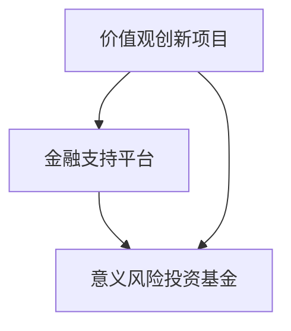

                 

### 1.1 问题背景与定义

在当今快速发展的全球经济中，创新项目成为了推动社会进步和经济增长的重要引擎。这些项目往往涉及高新技术、可持续发展和解决社会问题等多个方面，但它们往往面临着融资难、风险大和回报周期长的问题。为了应对这些问题，意义风险投资基金作为一种新的金融支持形式应运而生。

**问题背景：**

传统的风险投资基金主要关注于盈利能力和市场潜力，这在一定程度上忽视了项目的长期社会价值。然而，随着社会责任和可持续发展理念的兴起，越来越多的投资者和项目方开始关注项目的价值观和社会影响力。因此，意义风险投资基金应运而生，旨在支持那些具有显著社会和环保价值的创新项目。

**问题描述：**

价值观创新项目的特点在于它们不仅仅追求经济效益，更注重解决社会问题、推动可持续发展以及提高社会福利。这类项目可能包括环保科技、教育公平、健康医疗、社会福利等领域。然而，这些项目通常面临着以下几个问题：

1. **融资难度：** 价值观创新项目往往具有不确定性和高风险性，难以吸引传统的风险投资者。
2. **风险评估：** 传统风险投资基金难以准确评估这些项目的潜在社会和环境影响。
3. **回报周期：** 价值观创新项目往往需要较长的周期来产生社会效益，这与投资者追求短期回报的动机存在冲突。

**问题解决：**

意义风险投资基金通过以下方式解决上述问题：

1. **多元化投资策略：** 意义风险投资基金不仅关注财务回报，还关注项目的长期社会价值，这有助于吸引更多具有社会责任感的投资者。
2. **定制化风险评估：** 意义风险投资基金采用定制化的风险评估方法，综合考虑财务回报和社会效益，以更全面地评估项目风险。
3. **长期投资视角：** 意义风险投资基金愿意承担更长的投资周期，支持那些可能产生长期社会效益的项目。

**边界与外延：**

意义风险投资基金的外延涵盖了所有具有价值观创新的创新项目，不仅限于特定的行业或领域。同时，它也在传统风险投资基金的基础上进行了创新，使得投资更加多元化和社会化。

**核心概念及其结构：**

- **价值观创新项目：** 指那些追求社会效益、环保效益和可持续发展，并具有长期社会影响力的项目。
- **金融支持平台：** 指提供资金支持、风险评估、投资管理和咨询服务等功能的平台。
- **意义风险投资基金：** 是一种结合了财务回报和社会价值的投资机制，专门支持价值观创新项目。

通过以上核心概念的界定，我们可以清晰地理解意义风险投资基金的背景、问题和解决方案，以及它在支持价值观创新项目中的重要作用。在接下来的章节中，我们将进一步探讨这些核心概念的详细特征和联系。 

### 1.2 核心概念与联系

在深入探讨意义风险投资基金之前，我们需要明确几个核心概念，并理解它们之间的相互关系。以下是关键概念的定义、属性特征对比表格以及实体关系图。

**1.2.1 价值观创新项目的定义**

价值观创新项目是指那些不仅追求经济效益，还注重解决社会问题、推动可持续发展以及提高社会福利的创新项目。这类项目通常具有以下特征：

1. **社会效益：** 项目在实现经济效益的同时，能够产生显著的社会效益，如提高教育质量、改善公共卫生、促进环保等。
2. **环保效益：** 项目在设计和实施过程中，注重减少环境污染、节约资源，具有可持续发展的特点。
3. **可持续发展：** 项目能够长期存在并产生积极影响，而不是短期行为。
4. **创新性：** 项目在技术、商业模式、管理理念等方面具有创新性，能够解决现有问题或创造新的机会。

**1.2.2 金融支持平台的概念**

金融支持平台是一个提供资金支持、风险评估、投资管理和咨询服务等功能的综合平台。它是意义风险投资基金运作的基础，具体包括以下几个组成部分：

1. **资金支持：** 平台提供多样化的融资渠道，帮助价值观创新项目获得必要的资金。
2. **风险评估：** 平台通过定制化的风险评估方法，全面评估项目的财务和社会风险。
3. **投资管理：** 平台对投资进行有效管理，确保资金使用的透明性和效率。
4. **咨询服务：** 平台提供专业咨询服务，帮助项目方优化项目管理、提升项目成功率。

**1.2.3 意义风险投资基金与价值观创新项目的关联**

意义风险投资基金是专门为价值观创新项目设计的金融支持机制，它通过以下几个环节与价值观创新项目紧密关联：

1. **项目筛选：** 平台根据项目的价值观和社会影响力，筛选出符合投资标准的创新项目。
2. **风险评估：** 平台对筛选出的项目进行全面的财务和社会风险评估，以确定项目的投资潜力。
3. **投资决策：** 根据风险评估结果，平台做出投资决策，决定是否为项目提供资金支持。
4. **资金管理：** 平台对投资资金进行管理，确保资金用于项目实施，并跟踪项目的进展和效果。
5. **后期服务：** 平台在项目实施过程中提供持续的咨询服务，帮助项目方解决各种问题，提升项目成功率。

**1.2.4 核心概念属性特征对比表格**

以下是价值观创新项目、金融支持平台和意义风险投资基金的核心概念属性特征对比表格：

| 概念名称          | 特征1          | 特征2          | 特征3          | 特征4          |
|-----------------|---------------|---------------|---------------|---------------|
| 价值观创新项目    | 社会效益       | 环保效益       | 可持续发展     | 创新性        |
| 金融支持平台      | 资金支持       | 风险评估       | 投资管理       | 咨询服务       |
| 意义风险投资基金    | 多元化投资策略 | 定制化风险评估 | 长期投资视角   | 社会价值关注   |

**1.2.5 实体关系图**

为了更直观地展示这些核心概念之间的关系，我们使用Mermaid语言绘制了一个实体关系图：

在这个图中，价值观创新项目与金融支持平台和意义风险投资基金之间存在直接关联，金融支持平台是连接价值观创新项目和意义风险投资基金的桥梁，而意义风险投资基金则通过金融支持平台为价值观创新项目提供资金支持和风险管理。

通过以上核心概念的详细定义、属性特征对比和实体关系图，我们可以更深入地理解意义风险投资基金在支持价值观创新项目中的重要作用。这些核心概念相互关联，共同构成了一个完整的支持体系，为创新项目的成功实施提供了有力保障。在接下来的章节中，我们将进一步分析现有模式及其局限性，以更好地理解意义风险投资基金的差异化优势。 

### 1.3 现有模式分析

在探讨意义风险投资基金的差异化优势之前，有必要对现有的风险投资基金模式进行详细分析。传统风险投资基金在长期发展中形成了相对成熟的运作模式和投资策略，但这些模式在面对价值观创新项目时，往往表现出一定的局限性。

**1.3.1 传统风险投资基金的局限性**

传统风险投资基金的主要特点如下：

1. **盈利导向：** 传统风险投资基金的核心目标是实现财务回报，通常更关注短期收益和资本增值。
2. **风险评估：** 传统风险评估方法主要依赖于财务指标和市场分析，对项目的长期社会和环境影响关注较少。
3. **投资策略：** 传统风险投资基金往往采用标准化投资策略，难以适应价值观创新项目的多样性和复杂性。
4. **投资周期：** 传统风险投资基金倾向于投资那些能够快速实现盈利的项目，对需要长期投入和耐心培育的创新项目支持不足。

然而，这些特点在支持价值观创新项目时，往往存在以下局限性：

1. **融资难度：** 价值观创新项目通常需要较长时间来实现社会效益，这与传统风险投资基金追求短期回报的目标存在冲突，导致项目融资难度增加。
2. **风险评估困难：** 价值观创新项目的社会和环境影响难以量化，传统风险评估方法难以准确评估这些项目的风险和回报。
3. **缺乏灵活性：** 传统风险投资基金的标准化投资策略和流程难以适应价值观创新项目的独特需求，导致项目难以获得足够的支持。

**1.3.2 价值观创新项目的金融需求**

价值观创新项目的金融需求具有以下特点：

1. **长期投资视角：** 价值观创新项目通常需要较长的周期来实现社会效益，因此需要投资者具备长期投资视角，愿意承担更长投资周期和更高风险。
2. **多元化融资渠道：** 价值观创新项目往往涉及多个领域和方面，需要多元化的融资渠道来满足其资金需求。
3. **定制化风险评估：** 价值观创新项目的社会和环境影响难以量化，需要采用定制化的风险评估方法，综合考虑财务回报和社会价值。
4. **持续支持与咨询：** 价值观创新项目在实施过程中可能会遇到各种挑战，需要投资者提供持续的支持和咨询服务，以帮助项目方优化管理、提升项目成功率。

**1.3.3 意义风险投资基金的差异化优势**

意义风险投资基金在以下几个方面展现了其差异化优势：

1. **多元化投资策略：** 意义风险投资基金不仅关注财务回报，还关注项目的长期社会价值，通过多元化投资策略吸引更多具有社会责任感的投资者。
2. **定制化风险评估：** 意义风险投资基金采用定制化的风险评估方法，全面评估项目的财务和社会风险，为投资者提供更准确的投资决策依据。
3. **长期投资视角：** 意义风险投资基金愿意承担更长的投资周期，支持那些可能产生长期社会效益的项目，与价值观创新项目的需求相契合。
4. **持续支持与咨询：** 意义风险投资基金在项目实施过程中提供持续的支持和咨询服务，帮助项目方解决各种问题，提升项目成功率。

通过以上分析，我们可以看到，意义风险投资基金在传统风险投资基金的基础上进行了创新和优化，针对价值观创新项目的金融需求提出了更具针对性的解决方案。这不仅有助于缓解价值观创新项目的融资难题，还能提升项目的成功率，推动社会和经济的可持续发展。

在接下来的章节中，我们将进一步探讨意义风险投资基金的发展趋势、潜在挑战以及其对社会和经济的影响，为读者呈现一个全面、深入的分析。 

### 1.4 未来展望

在探讨了意义风险投资基金的背景、核心概念及其差异化优势之后，我们接下来将展望其未来的发展趋势、潜在挑战以及对社会和经济的影响。

**1.4.1 发展趋势**

1. **社会需求的增长：** 随着全球对可持续发展和社会责任的关注不断提升，价值观创新项目的社会需求也在不断增加。这为意义风险投资基金提供了广阔的市场空间。
2. **技术创新的支持：** 随着人工智能、大数据、区块链等新兴技术的不断发展，意义风险投资基金可以利用这些技术进行更精准的风险评估和投资决策，提高投资效率和成功率。
3. **多元化投资策略：** 意义风险投资基金将不断优化其投资策略，以吸引更多具有社会责任感的投资者，包括个人投资者、机构投资者和社会资本。这将进一步扩大基金的规模和影响力。
4. **国际合作与交流：** 意义风险投资基金将加强与国际同行和社会组织的合作与交流，共同推动价值观创新项目的发展，提升全球范围内的社会影响力。

**1.4.2 潜在挑战与解决方案**

1. **风险评估的复杂性：** 价值观创新项目的风险评估涉及财务和社会等多个方面，具有较高的复杂性。解决方案是建立多元化、专业化的风险评估团队，采用定制化的风险评估方法，提高评估的准确性和全面性。
2. **资金管理的风险：** 长期投资视角可能导致资金管理风险增加。解决方案是建立严格的风险控制机制，确保资金使用的透明性和安全性，同时优化资金管理流程，提高资金使用效率。
3. **投资退出难题：** 价值观创新项目的投资退出周期较长，可能导致退出难题。解决方案是探索多元化退出渠道，如IPO、并购等，同时建立长期投资退出机制，确保投资者能够实现预期的投资回报。
4. **政策环境的不确定性：** 政策环境的变化可能对意义风险投资基金的运营产生影响。解决方案是积极参与政策制定和行业交流，与政府、行业协会等保持密切合作，为基金的可持续发展创造良好的政策环境。

**1.4.3 社会影响与经济价值**

1. **社会效益：** 意义风险投资基金通过支持价值观创新项目，将促进社会问题的解决、可持续发展目标的实现以及社会福利的提升，对社会产生积极影响。
2. **经济价值：** 意义风险投资基金将推动创新项目的成功实施，带动相关产业链的发展，创造新的经济增长点，提高整体经济效益。
3. **政策支持：** 意义风险投资基金的兴起将推动政府和社会对价值观创新项目的关注和支持，为创新项目提供更加有利的发展环境。
4. **公众意识提升：** 意义风险投资基金的推广将提升公众对价值观创新项目的认知和参与度，促进社会责任和可持续发展理念的普及。

通过以上分析，我们可以看到，意义风险投资基金在未来的发展中面临着广阔的前景和诸多挑战。只有通过不断创新和优化，才能充分发挥其支持价值观创新项目的作用，为社会和经济的发展做出更大贡献。在接下来的章节中，我们将进一步探讨意义风险投资基金在实际操作中的具体实施方法和最佳实践。 

### 1.5 本章小结

本章围绕意义风险投资基金进行了全面而深入的探讨。首先，我们介绍了问题背景，包括价值观创新项目的融资难、风险评估复杂以及回报周期长等问题。接着，我们定义了核心概念，如价值观创新项目、金融支持平台和意义风险投资基金，并通过对比表格和实体关系图展示了它们之间的关系。然后，我们分析了现有模式中传统风险投资基金的局限性，以及意义风险投资基金在多元化投资策略、定制化风险评估、长期投资视角和持续支持与咨询方面的差异化优势。最后，我们展望了意义风险投资基金的未来发展趋势、潜在挑战以及其对社会的积极影响和经济价值。

本章的内容为后续章节的深入探讨奠定了基础，帮助读者全面理解意义风险投资基金的背景和核心概念，为其在实际操作中的成功实施提供了理论支持。在接下来的章节中，我们将进一步分析价值观创新项目的金融需求，探讨如何更好地满足这些需求，并介绍意义风险投资基金的运作机制和具体实施方法。

### 2.1 项目分类与特征

在深入探讨价值观创新项目的金融需求之前，我们需要对这类项目进行分类，并详细分析其特征。通过这种分类和特征分析，我们可以更好地理解价值观创新项目的多样性，为其量身定制金融支持方案提供依据。

**2.1.1 创新项目的分类标准**

价值观创新项目可以根据多个维度进行分类，以下是几种常见的分类标准：

1. **行业分类：** 根据项目所属的行业，如环保科技、教育公平、健康医疗、社会福利等。
2. **目标分类：** 根据项目的目标，如解决社会问题、推动可持续发展、提高社会福利等。
3. **技术分类：** 根据项目所采用的技术，如人工智能、物联网、可再生能源等。

**2.1.2 价值观创新项目的特征**

以下是价值观创新项目的主要特征，这些特征决定了其金融需求的独特性：

1. **社会效益显著：** 价值观创新项目不仅追求经济效益，更注重解决社会问题，产生显著的社会效益。例如，环保科技项目可以减少环境污染，提高公众健康水平；教育公平项目可以提高教育质量，促进社会公平。

2. **可持续性：** 价值观创新项目通常具有长期的可持续性，能够在未来持续产生积极的社会和环境影响。例如，可持续能源项目可以减少对化石燃料的依赖，促进能源结构的优化。

3. **不确定性和风险高：** 价值观创新项目往往涉及新技术、新模式，存在一定的不确定性和风险。例如，初创企业可能面临市场接受度不高、技术不成熟等问题。

4. **回报周期长：** 价值观创新项目通常需要较长的周期来实现社会效益，这与投资者追求短期回报的动机存在冲突。例如，一些社会企业项目可能需要多年时间才能实现盈亏平衡，产生显著的社会效益。

5. **多样性和复杂性：** 价值观创新项目具有多样性和复杂性，难以用单一标准进行评估。例如，不同的环保科技项目可能在技术、市场、政策等方面存在显著差异。

**2.1.3 分类实例**

为了更直观地展示价值观创新项目的分类和特征，以下是几个具体实例：

1. **环保科技项目：**
   - **特征：** 减少污染、节约资源、提高能源效率。
   - **社会效益：** 改善环境质量、促进可持续发展。
   - **风险：** 技术不确定性、市场接受度低。
   - **回报周期：** 长期，需要多年才能产生显著效益。

2. **教育公平项目：**
   - **特征：** 提高教育质量、促进教育公平。
   - **社会效益：** 提升国民素质、减少社会不平等。
   - **风险：** 政策不确定性、执行难度大。
   - **回报周期：** 中长期，需要多年时间才能看到明显效果。

3. **健康医疗项目：**
   - **特征：** 提高医疗服务水平、降低医疗成本。
   - **社会效益：** 改善公共卫生、提高生活质量。
   - **风险：** 技术复杂性、政策不确定性。
   - **回报周期：** 中长期，需要较长时间才能实现盈亏平衡。

通过上述分类和特征分析，我们可以更全面地理解价值观创新项目的多样性，识别其金融需求的独特性。这为意义风险投资基金在支持这些项目时，提供了重要的参考依据。在接下来的章节中，我们将进一步探讨如何评估价值观创新项目中的风险与收益，为投资者提供科学的决策支持。 

### 2.2 风险与收益评估

在评估价值观创新项目时，风险与收益的评估至关重要。这不仅决定了项目的可行性，还直接影响到投资者的决策。因此，我们需要建立一套科学、全面的风险与收益评估方法，以准确评估项目的财务和社会价值。

**2.2.1 风险评估指标**

1. **财务风险：** 财务风险主要涉及项目的资金流动性和偿债能力。以下是一些常用的财务风险评估指标：
   - **流动性比率：** 流动性比率（Current Ratio）衡量企业短期资产与短期负债的比值，用于评估企业短期偿债能力。
   - **速动比率：** 速动比率（Quick Ratio）排除存货的影响，更严格地评估企业短期偿债能力。
   - **资产负债率：** 资产负债率（Debt-to-Equity Ratio）衡量企业财务杠杆水平，反映企业长期偿债能力。

2. **市场风险：** 市场风险主要涉及项目面临的市场波动和竞争压力。以下是一些常用的市场风险评估指标：
   - **市场份额：** 市场份额（Market Share）衡量企业在市场上的竞争地位。
   - **客户集中度：** 客户集中度（Customer Concentration）衡量企业客户分布的集中程度，用于评估客户流失的风险。
   - **产品差异化：** 产品差异化（Product Differentiation）衡量企业产品在市场上的独特性和竞争力。

3. **操作风险：** 操作风险主要涉及项目运营过程中的不确定性，如管理风险、技术风险等。以下是一些常用的操作风险评估指标：
   - **员工素质：** 员工素质（Employee Quality）衡量企业员工的技能水平和专业知识。
   - **管理体系：** 管理体系（Management System）衡量企业的管理水平和运营效率。
   - **技术创新能力：** 技术创新能力（Innovation Ability）衡量企业在技术领域的创新能力和竞争力。

**2.2.2 收益预测方法**

在评估收益时，我们需要综合考虑项目的财务收益和社会收益。以下是几种常用的收益预测方法：

1. **财务收益预测：**
   - **现金流量折现法（DCF）：** 通过预测项目的现金流量，并按照一定的折现率将其折现到当前价值，从而计算项目的现值。这种方法能够全面考虑项目的未来现金流量和风险因素。
   - **盈利能力分析：** 分析项目的盈利能力，包括利润率、毛利率、净资产收益率等指标，以评估项目的盈利前景。

2. **社会收益预测：**
   - **社会效益评分法：** 通过对项目的实际社会效益进行评分，如教育公平项目的教育质量提升评分、环保科技项目的污染减少评分等，来预测项目的社会收益。
   - **成本效益分析：** 对项目的成本和社会效益进行对比分析，以评估项目的成本效益比。

**2.2.3 案例分析**

以下是一个环保科技项目的风险评估和收益预测案例：

**项目简介：**
一个初创环保科技企业研发了一种新型空气净化器，旨在减少室内空气污染，提高居民健康水平。

**风险评估：**
1. **财务风险：**
   - 流动性比率：2.0（高于1表示流动性良好）
   - 速动比率：1.5（排除了存货的影响，表示流动性较好）
   - 资产负债率：0.5（债务水平较低，财务杠杆较低）

2. **市场风险：**
   - 市场份额：5%（在市场竞争中处于较小份额，需要提升竞争力）
   - 客户集中度：5%（客户较为分散，风险较低）
   - 产品差异化：较高（空气净化器在功能和技术上具有独特性）

3. **操作风险：**
   - 员工素质：较高（团队拥有丰富的研发经验）
   - 管理体系：良好（企业具有完善的管理制度和运营流程）
   - 技术创新能力：较强（企业持续进行技术创新，保持技术领先地位）

**收益预测：**
1. **财务收益：**
   - 现金流量折现法：预测项目5年内现金流量，按照10%的折现率计算，项目的现值为500万元。
   - 盈利能力分析：预计项目5年内利润率为20%，毛利率为60%，净资产收益率为25%。

2. **社会收益：**
   - 社会效益评分法：预计项目能够减少30%的室内空气污染，提高居民健康水平，社会效益评分为80分。
   - 成本效益分析：项目成本为1000万元，预计社会效益为1500万元，成本效益比为1:1.5。

通过以上案例分析，我们可以看到，环保科技项目在财务和社会收益方面均具有较好的前景。这种综合风险评估和收益预测方法为投资者提供了科学的决策依据，有助于更准确地评估项目的投资价值。

通过本章的分析，我们不仅建立了风险评估和收益预测的方法体系，还通过案例分析展示了这些方法的具体应用。在接下来的章节中，我们将进一步探讨融资需求与策略，以帮助价值观创新项目获得必要的资金支持。 

### 2.3 融资需求与策略

在明确了价值观创新项目的特征、风险与收益之后，融资需求与策略成为了支持这些项目成功的关键。以下将详细分析价值观创新项目的融资需求，并提出相应的融资策略。

**2.3.1 融资需求分析**

价值观创新项目通常具有以下融资需求：

1. **初期融资需求：** 在项目初期，企业通常需要资金用于研发、市场调研、产品原型开发和团队建设等。这部分融资需求主要用于探索和验证项目的可行性。

2. **扩展融资需求：** 当项目进入发展阶段，企业可能需要资金用于扩大生产规模、提高市场占有率、拓展新市场等。这部分融资需求主要用于项目的快速扩展和规模化运营。

3. **长期融资需求：** 对于一些需要长时间才能实现社会效益的项目，企业可能需要长期的融资支持，以维持项目的持续运营和不断优化。

4. **风险融资需求：** 由于价值观创新项目具有较高的不确定性和风险，企业可能需要寻求风险投资或政府补贴等融资渠道。

**2.3.2 融资策略选择**

为了满足价值观创新项目的融资需求，需要采取多元化的融资策略，以平衡风险和收益。以下是一些常见的融资策略：

1. **内部融资：** 内部融资是指企业利用自身的利润进行再投资。这种方式具有融资成本低、控制权不变等优点，但缺点是资金规模有限，难以满足大规模项目的需求。

2. **外部融资：**
   - **风险投资：** 风险投资是一种长期投资，通常用于支持初创企业和高成长型企业。风险投资的特点是资金规模大、投资期限长，但对企业的发展和盈利要求较高。
   - **天使投资：** 天使投资通常由个人投资者提供，用于支持早期项目。天使投资的特点是投资额度较小，但能够为企业提供宝贵的创业经验和资源。
   - **政府补贴和财政支持：** 政府补贴和财政支持是政府为了鼓励创新和发展而提供的资金支持。这种方式具有政策优惠、低息贷款等优点，但申请过程较为复杂，竞争激烈。
   - **银行贷款：** 银行贷款是一种常见的融资方式，适用于有一定资产和信用记录的企业。银行贷款的特点是融资速度快、利率较低，但对企业还款能力和担保要求较高。

3. **混合融资策略：** 对于大型或高风险的价值观创新项目，可以采用混合融资策略，结合多种融资方式，以降低融资成本和风险。例如，可以同时进行风险投资和银行贷款，或结合政府补贴和风险投资等。

**2.3.3 案例分析**

以下是一个环保科技项目的融资需求与策略分析：

**项目简介：**
一家初创公司研发了一种新型废水处理技术，旨在解决工业废水处理难题，提高水资源利用率。

**融资需求：**
1. 初期融资需求：用于技术研发、市场调研和产品原型开发，预计需要资金1000万元。
2. 扩展融资需求：用于扩大生产规模、提高市场占有率，预计需要资金5000万元。
3. 长期融资需求：用于项目的持续研发和优化，预计需要资金2000万元。

**融资策略：**
1. 内部融资：利用企业自身的利润进行再投资，预计筹集资金500万元。
2. 风险投资：寻求风险投资，预计筹集资金3000万元，用于技术研发和市场扩展。
3. 天使投资：寻求天使投资，预计筹集资金200万元，用于市场调研和产品原型开发。
4. 政府补贴和财政支持：申请政府补贴和财政支持，预计筹集资金500万元，用于技术研发和扩大生产。
5. 银行贷款：申请银行贷款，预计筹集资金2000万元，用于生产规模扩大和市场拓展。

通过以上案例分析，我们可以看到，针对环保科技项目的融资需求，可以采取多元化的融资策略，以降低融资风险和成本。在满足融资需求的同时，还需要注意不同融资方式的优缺点，合理选择和搭配，以确保项目的成功实施。

通过本章的分析，我们为价值观创新项目的融资需求和融资策略提供了具体的指导。在接下来的章节中，我们将进一步探讨成功案例，以期为读者提供实践中的经验和启示。 

### 2.4 案例研究

在本章中，我们将通过两个具体案例，探讨价值观创新项目的融资过程、融资效果以及成功经验和挑战。

**2.4.1 案例一：环保科技项目**

**项目简介：** 
某初创公司研发了一种新型太阳能废水处理技术，能够有效利用太阳能处理工业废水，减少对传统化石能源的依赖。

**融资过程：**
1. **初期融资：** 项目创始人通过个人储蓄和天使投资筹集了200万元，用于技术研发和市场调研。
2. **扩展融资：** 公司在获得初步成功后，申请了政府的科技创新基金和环保专项补贴，共筹集到资金1000万元，用于扩大生产规模和提升技术水平。
3. **长期融资：** 公司在获得风险投资后，再次筹集了3000万元，用于持续研发和市场拓展。

**融资效果：**
1. **财务收益：** 通过融资，公司成功开发了多款太阳能废水处理设备，实现了规模化生产，5年内收入增长300%。
2. **社会效益：** 项目解决了工业废水处理难题，减少了环境污染，提高了水资源利用率。

**成功经验：**
1. **政策支持：** 积极争取政府补贴和科技创新基金的支持，降低了融资成本和风险。
2. **多元化融资策略：** 结合天使投资、政府补贴和风险投资，满足了不同阶段的融资需求。
3. **技术创新：** 不断进行技术创新，保持技术领先地位，增强了项目的市场竞争力。

**挑战与应对：**
1. **技术风险：** 在项目研发初期，技术尚不成熟，面临较高的失败风险。公司通过持续的技术研发和优化，逐步解决了技术难题。
2. **市场竞争：** 市场上存在多家类似产品，竞争激烈。公司通过不断改进产品性能和提升服务质量，赢得了市场份额。

**2.4.2 案例二：社会企业项目**

**项目简介：**
某社会企业致力于改善农村地区的教育条件，通过建设数字化教室、提供在线教育平台等方式，提升农村学生的教育质量。

**融资过程：**
1. **初期融资：** 社会企业通过发起众筹，筹集了50万元，用于数字化教室的初步建设。
2. **扩展融资：** 在获得初步成功后，企业申请了国际慈善基金和本地非政府组织的支持，共筹集到资金300万元，用于扩大在线教育平台的建设和推广。
3. **长期融资：** 企业在国际金融市场成功发行了社会责任债券，筹集到资金1000万元，用于持续运营和项目扩展。

**融资效果：**
1. **财务收益：** 通过融资，企业实现了教育平台的规模化运营，5年内收入增长150%。
2. **社会效益：** 项目显著提升了农村学生的教育质量，改善了农村教育条件。

**成功经验：**
1. **社会影响力：** 通过项目的成功实施，企业获得了良好的社会声誉和影响力，吸引了更多投资者的关注。
2. **创新合作模式：** 企业与教育机构、非政府组织和社会资本合作，形成了创新的教育合作模式。
3. **持续改进：** 企业不断优化在线教育平台，提升用户体验，增加了用户粘性。

**挑战与应对：**
1. **技术挑战：** 在项目实施过程中，面临技术不稳定、网络基础设施落后等挑战。企业通过与科技公司合作，引入先进技术，解决了这些问题。
2. **政策环境：** 政策环境的变化可能影响项目的实施。企业通过积极参与政策制定和行业交流，与政府部门保持密切合作，确保项目的顺利进行。

通过这两个案例，我们可以看到，价值观创新项目在融资过程中面临诸多挑战，但通过多元化的融资策略、技术创新和持续改进，许多项目最终取得了成功。这些成功经验为其他价值观创新项目提供了宝贵的借鉴和启示。在接下来的章节中，我们将进一步探讨意义风险投资基金的运作机制，为读者提供更全面的操作指南。 

### 2.5 本章小结

本章通过详细分析价值观创新项目的分类与特征，探讨了这些项目的融资需求与策略。我们首先介绍了价值观创新项目的分类标准，包括行业分类、目标分类和技术分类，并详细阐述了这些项目的特征，如社会效益显著、可持续性、不确定性和风险高、回报周期长以及多样性和复杂性。接着，我们提出了风险评估指标，包括财务风险、市场风险和操作风险，并介绍了财务收益预测和社会收益预测的方法。在案例研究部分，我们通过两个具体的环保科技项目和社会企业项目的案例分析，展示了融资过程、融资效果以及成功经验和挑战。这些案例为其他价值观创新项目的融资提供了有益的借鉴。

通过本章的分析，我们不仅加深了对价值观创新项目的理解，也为意义风险投资基金在支持这些项目时提供了科学的决策依据。在接下来的章节中，我们将进一步探讨意义风险投资基金的运作机制，以期为读者提供更全面的操作指南。 

### 3.1 基金组织架构

意义风险投资基金的成功运作离不开科学合理的组织架构设计。一个高效、透明的组织架构能够确保基金在投资决策、风险管理、资金管理和项目支持等方面发挥最大效益。

**3.1.1 基金结构设计**

意义风险投资基金通常采用有限责任公司或合伙企业的形式。这种形式具有灵活性和法律保障，有利于吸引多元化投资者，同时确保基金运作的合规性。以下是基金组织架构的常见组成部分：

1. **基金管理公司：** 基金管理公司是基金的核心机构，负责基金的日常运营和管理。其主要职责包括：
   - **投资决策：** 根据基金的投资策略，对潜在项目进行评估和选择。
   - **风险管理：** 制定和执行风险控制措施，确保基金资产的安全。
   - **资金管理：** 管理基金的资金流动，确保资金使用的合规性和高效性。
   - **项目支持：** 为投资的项目提供后续支持，如管理咨询、技术支持等。

2. **投资决策委员会：** 投资决策委员会是基金的最高决策机构，由资深投资专家、行业专家和管理层成员组成。其主要职责包括：
   - **投资策略制定：** 根据基金的投资目标和市场趋势，制定投资策略。
   - **项目评审：** 对潜在项目进行评审，决定是否进行投资。
   - **风险控制：** 审议和批准风险控制方案，确保投资风险在可接受范围内。

3. **项目评估团队：** 项目评估团队负责对潜在项目进行尽职调查，评估项目的财务状况、市场前景和社会效益。其主要职责包括：
   - **尽职调查：** 通过实地调研、财务分析、市场分析等手段，全面了解项目情况。
   - **风险评估：** 对项目的财务风险、市场风险和操作风险进行全面评估。
   - **项目报告：** 编制项目评估报告，为投资决策提供依据。

4. **风控团队：** 风控团队负责基金的风险管理，包括风险识别、风险评估、风险控制和风险监控。其主要职责包括：
   - **风险识别：** 识别基金运作过程中可能出现的风险，如市场风险、信用风险、操作风险等。
   - **风险评估：** 对已识别的风险进行定量和定性分析，评估风险的影响程度。
   - **风险控制：** 制定和执行风险控制措施，如风险分散、风险对冲等。
   - **风险监控：** 对风险进行持续监控，确保风险控制措施的有效性。

5. **运营支持团队：** 运营支持团队负责基金的后台运营工作，包括财务、行政、人力资源等。其主要职责包括：
   - **财务管理：** 管理基金的财务事务，确保财务记录的准确性和合规性。
   - **行政管理：** 处理基金的日常行政事务，如合同管理、文档管理、内部沟通等。
   - **人力资源：** 管理基金的人力资源，包括员工招聘、培训、绩效评估等。

**3.1.2 管理团队组成**

基金管理团队是基金的核心力量，其专业能力和经验直接影响基金的投资绩效。管理团队通常包括以下角色：

1. **首席执行官（CEO）：** 负责基金的整体战略规划和运营管理，确保基金的投资策略和目标得到有效执行。

2. **首席投资官（CIO）：** 负责基金的投资决策，制定和执行投资策略，选择和管理投资项目。

3. **首席风险官（CRO）：** 负责基金的风险管理，制定风险控制策略，确保基金的风险在可接受范围内。

4. **投资经理：** 负责特定投资领域的研究和项目评估，与投资决策委员会密切合作，执行投资决策。

5. **风控经理：** 负责基金的风险管理工作，识别、评估和控制风险，确保基金的安全运营。

6. **运营经理：** 负责基金的后台运营工作，包括财务管理、行政管理、人力资源等。

7. **项目支持经理：** 负责为投资的项目提供后续支持，包括管理咨询、技术支持等。

通过科学合理的组织架构设计和优秀的管理团队组成，意义风险投资基金能够实现高效、透明和规范的管理，为价值观创新项目提供强有力的金融支持。在接下来的章节中，我们将进一步探讨投资决策流程、风险管理策略以及实际案例，为读者呈现意义风险投资基金的运作全貌。 

### 3.2 投资决策流程

意义风险投资基金的投资决策流程是确保投资有效性和风险可控性的关键环节。以下是投资决策的具体流程、关键步骤和决策机制。

**3.2.1 投资策略制定**

投资策略是基金投资决策的指导性文件，明确了基金的投资方向、目标、风险偏好和收益预期。投资策略制定通常包括以下几个步骤：

1. **市场研究：** 对宏观经济环境、行业发展趋势、市场机会和风险进行深入分析，为投资策略提供数据支持。
2. **投资目标：** 根据基金的资金规模、投资者需求和市场分析结果，设定具体的投资目标，如收益目标、风险目标和时间目标。
3. **风险偏好：** 确定基金的风险承受能力，包括对财务风险、市场风险和操作风险的态度和容忍度。
4. **投资组合设计：** 根据投资目标和风险偏好，设计合理的投资组合，包括资产配置、行业分布和项目类型等。

**3.2.2 项目筛选与评估**

项目筛选与评估是投资决策流程中的核心环节，旨在识别和选择具有投资价值的创新项目。以下是项目筛选与评估的具体步骤：

1. **项目征集：** 通过各种渠道征集潜在项目，如行业研讨会、创业大赛、项目推荐等。
2. **初步筛选：** 对征集到的项目进行初步筛选，根据项目的基本信息、团队背景和初步商业模式，判断其是否符合基金的投资标准和战略方向。
3. **尽职调查：** 对通过初步筛选的项目进行尽职调查，包括财务审计、技术评估、市场分析、法律审查等，全面了解项目的真实情况。
4. **风险评估：** 根据尽职调查的结果，对项目的财务风险、市场风险和操作风险进行评估，确定项目的风险等级。
5. **项目评审：** 投资决策委员会对通过风险评估的项目进行评审，根据项目的投资价值、风险可控性和投资策略，决定是否进行投资。

**3.2.3 投资决策机制**

投资决策机制是确保投资决策科学、透明和高效的关键。以下是投资决策机制的具体内容：

1. **决策委员会：** 投资决策委员会是基金的最高决策机构，负责审批投资决策。决策委员会成员通常由资深投资专家、行业专家和管理层成员组成。
2. **投票制度：** 投资决策通常采用投票制度，决策委员会成员根据项目的投资价值、风险可控性和投资策略，对每个投资项目进行投票。投资决策需要获得超过半数的投票支持才能通过。
3. **决策程序：** 投资决策程序包括项目评审、投票表决和决策记录等步骤，确保决策过程的透明性和可追溯性。
4. **决策记录：** 投资决策委员会需要对每个投资项目的决策过程和决策结果进行详细记录，包括项目的评估报告、投票结果和决策依据等，以便后续审计和评估。

**3.2.4 投资后管理**

投资决策通过后，基金需要对投资项目进行后续管理，确保投资的有效实施和风险控制。以下是投资后管理的具体内容：

1. **项目监控：** 定期对投资项目进行跟踪和监控，了解项目的进展情况、财务状况和风险变化。
2. **风险控制：** 根据项目的实际情况，及时调整风险控制措施，如风险预警、风险对冲和风险隔离等。
3. **管理支持：** 为投资项目提供必要的管理支持，如战略规划、市场营销、人力资源等，帮助项目方解决各种问题，提升项目成功率。
4. **绩效评估：** 定期对投资项目进行绩效评估，根据项目的投资收益、风险控制效果和社会效益，评估投资决策的成效。

通过以上投资决策流程、关键步骤和决策机制，意义风险投资基金能够实现科学、透明和高效的投资决策，为价值观创新项目提供强有力的金融支持。在接下来的章节中，我们将进一步探讨风险管理策略，以增强基金的风险控制能力。 

### 3.3 风险管理策略

在意义风险投资基金的运作过程中，风险管理是确保投资安全性和收益稳定性的关键环节。以下将详细讨论基金在风险识别、风险评估、风险控制与应对措施等方面的策略和实践。

**3.3.1 风险识别**

风险识别是风险管理的基础，旨在发现和识别基金可能面临的各种风险。以下是风险识别的主要方法：

1. **文献分析：** 通过查阅相关文献、研究报告和行业资讯，了解市场趋势和潜在风险。
2. **专家访谈：** 与行业专家、投资顾问和项目团队进行访谈，获取第一手风险信息。
3. **案例研究：** 通过研究历史案例，识别类似项目的潜在风险。
4. **问卷调查：** 设计问卷调查，收集投资者、项目方和相关方的风险反馈。

常见风险包括市场风险（如经济波动、行业变化等）、财务风险（如资金链断裂、财务危机等）、操作风险（如管理不善、内部控制不足等）和合规风险（如政策变化、法律风险等）。

**3.3.2 风险评估**

风险评估是衡量风险的可能性和影响程度，为风险决策提供依据。以下是风险评估的主要步骤和工具：

1. **风险概率评估：** 对识别出的风险进行概率评估，确定风险发生的可能性。常用的工具包括概率分布、贝叶斯网络等。
2. **风险影响评估：** 对识别出的风险进行影响评估，确定风险发生对基金可能造成的影响程度。常用的工具包括影响矩阵、决策树等。
3. **风险等级划分：** 根据风险的概率和影响程度，对风险进行等级划分，如高、中、低风险。
4. **风险优先级排序：** 根据风险等级和风险优先级，确定基金需要优先管理的风险。

**3.3.3 风险控制与应对措施**

风险控制是风险管理的关键，旨在降低风险发生的可能性和影响程度。以下是风险控制与应对措施的具体策略：

1. **风险分散策略：** 通过投资组合分散化，降低单一项目或单一行业的风险。基金可以通过投资不同行业、不同阶段和不同地区的企业，实现风险的多元化。
2. **风险对冲策略：** 通过对冲工具（如期权、期货、掉期等）对冲投资组合中的风险。例如，基金可以通过购买利率掉期合约，对冲利率波动带来的风险。
3. **内部控制措施：** 加强内部风险管理，建立完善的内部控制制度和流程。基金可以通过设置风险控制部门、制定风险管理政策和流程，确保风险管理的有效性。
4. **风险监控与预警：** 建立风险监控和预警系统，实时跟踪和评估风险状况，及时发现和应对潜在风险。
5. **应急计划：** 制定应急计划，应对可能发生的风险事件。应急计划应包括风险事件分类、应急响应流程、资源调配和后续处理等。

**3.3.4 案例分析**

以下是一个环保科技项目的风险管理案例：

**项目简介：**
某环保科技企业研发了一种新型废水处理技术，能够显著提高废水处理效率，减少污染物排放。

**风险识别：**
- **市场风险：** 新技术市场接受度不确定，市场竞争激烈。
- **财务风险：** 项目资金需求大，可能面临资金链断裂的风险。
- **操作风险：** 技术研发过程中可能面临技术难题，影响项目进度。

**风险评估：**
- **市场风险：** 风险概率为中等，影响程度较大。
- **财务风险：** 风险概率为高，影响程度较大。
- **操作风险：** 风险概率为中等，影响程度较大。

**风险控制与应对措施：**
1. **市场风险控制：** 通过市场调研和竞争分析，了解市场需求和竞争对手，制定市场推广策略，提高技术知名度。同时，与政府和企业合作，推动技术落地应用。
2. **财务风险控制：** 通过多元化的融资渠道，如风险投资、政府补贴和银行贷款，确保资金链的稳定。同时，制定详细的财务预算和现金流预测，确保资金使用的合规性和高效性。
3. **操作风险控制：** 加强技术研发团队的建设，提升技术水平。同时，制定详细的项目进度计划和风险应对策略，确保项目按计划进行。

通过以上案例分析，我们可以看到，意义风险投资基金在风险识别、评估和控制方面采取了多种策略和措施，有效地降低了项目的风险，确保了投资的安全性和稳定性。

通过本章的风险管理策略讨论，我们为意义风险投资基金的稳健运营提供了理论支持和实践指导。在接下来的章节中，我们将进一步探讨意义风险投资基金在具体案例中的成功分析和失败教训，为读者提供更深入的见解。 

### 3.4 案例分析

在本章中，我们将通过成功和失败两个具体案例，深入分析意义风险投资基金在实际运作中的表现，探讨其投资决策的正确性和风险管理策略的有效性。

**3.4.1 成功案例分析**

**案例：** 清洁能源创业公司A公司的投资

**项目简介：**
清洁能源创业公司A公司专注于开发一种新型太阳能电池技术，旨在提高太阳能电池的光电转换效率，降低成本。

**投资过程：**
1. **项目筛选：** 投资团队通过市场调研和专家访谈，发现了A公司的技术创新潜力，并认为其具有广阔的市场前景。
2. **尽职调查：** 投资团队对A公司进行了详细的尽职调查，包括技术评估、财务分析和市场研究，确保项目的可行性和风险可控性。
3. **投资决策：** 投资决策委员会根据尽职调查结果，决定向A公司投资1000万元，用于技术研发和市场推广。
4. **投资后管理：** 投资团队持续跟踪A公司的发展情况，提供管理支持和资源调配，帮助A公司解决技术难题和市场推广中的问题。

**投资效果：**
1. **财务收益：** 经过3年的研发和市场推广，A公司的太阳能电池技术取得了重大突破，市场份额显著提升，公司估值增长了3倍。
2. **社会效益：** A公司的技术降低了清洁能源的生产成本，推动了清洁能源产业的发展，减少了碳排放，对环境保护产生了积极影响。

**成功经验：**
1. **精准筛选：** 投资团队通过市场调研和专家访谈，精准筛选出具有技术创新潜力的项目，降低了投资风险。
2. **尽职调查：** 详尽的尽职调查确保了项目的可行性和风险可控性，为投资决策提供了可靠依据。
3. **持续支持：** 投资团队在投资后持续提供管理支持和资源调配，帮助项目公司解决发展中的各种问题，提高了项目的成功率。

**3.4.2 失败案例分析**

**案例：** 智能农业创业公司B公司的投资

**项目简介：**
智能农业创业公司B公司致力于研发一种基于人工智能的农业监控系统，旨在提高农作物产量和质量。

**投资过程：**
1. **项目筛选：** 投资团队在行业研讨会上发现了B公司的项目，并对其技术创新和市场前景表示关注。
2. **尽职调查：** 投资团队对B公司进行了尽职调查，发现其技术虽然具有一定的创新性，但市场接受度较低，技术落地应用存在较大难度。
3. **投资决策：** 投资决策委员会在权衡风险和收益后，决定向B公司投资800万元，用于技术研发和市场推广。
4. **投资后管理：** 投资团队在投资后对B公司进行了持续跟踪，但未能有效解决B公司面临的技术和市场问题。

**投资效果：**
1. **财务收益：** 经过3年的技术研发和市场推广，B公司的项目并未取得预期效果，市场份额较低，公司估值下降。
2. **社会效益：** B公司的项目在智能农业领域未能实现突破，对农业产业的社会效益有限。

**失败原因：**
1. **市场调研不足：** 投资团队在项目筛选阶段对市场调研不足，未充分了解市场接受度和竞争态势。
2. **尽职调查不充分：** 尽职调查未能全面评估项目的实际技术难度和市场挑战，导致风险识别不足。
3. **技术支持不持续：** 投资团队在投资后未能提供持续的技术和市场支持，未能帮助项目公司解决实际问题。

**失败教训：**
1. **充分市场调研：** 在项目筛选阶段，应进行充分的市场调研，了解市场需求和竞争态势，降低投资风险。
2. **全面尽职调查：** 应对项目进行全面的尽职调查，包括技术评估、市场评估和财务评估，确保项目具备可行性和风险可控性。
3. **持续支持与跟踪：** 在投资后，应持续提供技术支持和市场支持，帮助项目公司解决发展中的各种问题，提高项目的成功率。

通过以上成功和失败案例分析，我们可以看到，意义风险投资基金在实际运作中，既需要精准筛选和全面尽职调查，也需要在投资后提供持续的支持和跟踪。成功的投资决策和有效的风险管理策略是确保基金投资成功的关键。在接下来的章节中，我们将进一步探讨金融支持平台的技术基础，为意义风险投资基金的稳健运营提供技术保障。

### 3.5 本章小结

本章通过成功和失败两个具体案例，深入分析了意义风险投资基金在实际运作中的表现。首先，我们介绍了成功案例中的清洁能源创业公司A公司，通过精准筛选、全面尽职调查和持续支持，实现了良好的投资效果和社会效益。然后，我们分析了失败案例中的智能农业创业公司B公司，指出市场调研不足、尽职调查不充分和持续支持不持续是导致投资失败的主要原因。

通过这些案例分析，我们得出了以下结论：

1. **精准筛选和尽职调查：** 在项目筛选阶段，应进行充分的市场调研和尽职调查，确保项目的可行性和风险可控性。
2. **持续支持和跟踪：** 投资后，应持续提供技术支持和市场支持，帮助项目公司解决发展中的各种问题，提高项目的成功率。
3. **风险管理策略：** 应建立有效的风险管理策略，包括风险识别、风险评估、风险控制和风险监控，确保投资的安全性。

这些经验教训为意义风险投资基金的运作提供了宝贵的指导。在接下来的章节中，我们将进一步探讨金融支持平台的技术基础，为意义风险投资基金的稳健运营提供技术保障。 

### 4.1 平台架构设计

金融支持平台的架构设计是确保其稳定、高效、安全运行的关键。以下是平台架构的具体设计，包括技术架构和系统模块划分。

**4.1.1 技术架构**

1. **前端技术：**
   - **Web框架：** 采用React.js或Vue.js等现代前端框架，实现响应式设计和良好的用户体验。
   - **UI库：** 使用Material UI或Ant Design等流行的UI库，提升界面的美观性和一致性。
   - **数据可视化：** 利用D3.js或ECharts等数据可视化工具，展示复杂的数据和分析结果。

2. **后端技术：**
   - **服务器端框架：** 采用Node.js、Java Spring Boot等服务器端框架，实现高效的数据处理和业务逻辑。
   - **数据库：** 使用MySQL、PostgreSQL等关系型数据库，存储项目的详细信息、用户数据和交易记录。
   - **缓存：** 采用Redis等缓存技术，提高系统的响应速度和数据处理效率。

3. **中间件：**
   - **消息队列：** 使用RabbitMQ、Kafka等消息队列技术，实现系统的异步处理和负载均衡。
   - **API网关：** 使用Spring Cloud Gateway或Nginx等API网关技术，统一管理和保护API接口。

4. **云计算与容器化：**
   - **云服务：** 利用AWS、Azure或阿里云等云服务提供商，实现弹性计算、数据存储和自动化运维。
   - **容器化：** 采用Docker和Kubernetes等容器化技术，实现应用的高效部署和管理。

**4.1.2 系统模块划分**

金融支持平台可以分为以下几个主要模块：

1. **用户模块：**
   - **用户注册与登录：** 提供用户注册、登录和密码管理功能，确保用户身份的安全和便捷。
   - **个人中心：** 提供用户的个人信息管理、资金账户管理和投资记录查询等功能。

2. **项目管理模块：**
   - **项目发布：** 项目方可以发布项目信息，包括项目简介、融资需求、风险评估等。
   - **项目浏览：** 投资者可以浏览和搜索项目信息，进行项目筛选和对比分析。
   - **项目投资：** 投资者可以在线进行项目投资，提交投资申请并完成交易。

3. **风险评估模块：**
   - **风险指标计算：** 根据财务数据和市场信息，计算项目的财务风险、市场风险和操作风险等指标。
   - **风险预警系统：** 实时监控项目的风险状况，及时发出风险预警，提供风险控制建议。

4. **资金管理模块：**
   - **资金流动监控：** 实现资金的实时流动监控，确保资金使用的透明性和合规性。
   - **资金拨付与结算：** 实现项目资金的拨付、结算和分配，确保资金的高效利用和风险控制。

5. **数据分析模块：**
   - **数据分析与报告：** 对项目的数据进行统计和分析，生成各种报表和报告，为投资决策提供数据支持。
   - **数据可视化：** 利用数据可视化工具，将分析结果以图表、仪表板等形式直观展示。

6. **系统管理模块：**
   - **权限管理：** 实现用户的权限管理，确保系统的安全和数据的保密性。
   - **日志管理：** 记录系统的操作日志和异常日志，方便系统维护和问题排查。

通过以上架构设计和模块划分，金融支持平台能够实现高效、稳定和安全运行，为意义风险投资基金的运作提供坚实的技术基础。在接下来的章节中，我们将进一步探讨平台的数据管理、风险控制机制以及用户服务与互动功能。 

### 4.2 数据管理

数据管理是金融支持平台的核心组成部分，对于确保数据的准确性、完整性、一致性和安全性至关重要。以下是平台在数据采集与存储、数据分析与处理以及风险控制机制等方面的具体内容。

**4.2.1 数据采集与存储**

1. **数据采集：**
   - **项目数据：** 平台需要从项目方采集详细的项目信息，包括项目简介、融资需求、技术方案、风险评估报告等。这些数据可以通过在线填写、文件上传等方式进行采集。
   - **用户数据：** 平台需要收集用户的基本信息、投资记录、风险偏好等，以确保用户账户管理和个性化服务的实现。
   - **交易数据：** 平台需要实时采集用户的投资交易数据，包括投资金额、投资时间、投资项目等，确保交易记录的准确性和完整性。

2. **数据存储：**
   - **关系型数据库：** 平台采用MySQL、PostgreSQL等关系型数据库存储结构化数据，如用户信息、项目信息和交易记录等。这些数据库具有高可靠性、高性能和良好的扩展性。
   - **非关系型数据库：** 平台采用MongoDB等非关系型数据库存储非结构化数据，如日志数据、分析数据等。非关系型数据库具有灵活的数据模型和高效的读写性能。
   - **数据仓库：** 平台采用数据仓库技术，如Apache Hadoop或Google BigQuery，存储大量历史数据和分析结果，以便进行数据挖掘和报表生成。

**4.2.2 数据分析与处理**

1. **数据预处理：**
   - **数据清洗：** 平台需要对采集到的数据进行清洗，去除重复、缺失和错误的数据，确保数据质量。
   - **数据整合：** 平台需要将来自不同数据源的数据进行整合，形成一个统一的数据视图，便于分析和查询。
   - **数据转换：** 平台需要将不同格式和结构的数据转换为统一格式，以便进行进一步处理和分析。

2. **数据分析：**
   - **财务分析：** 平台需要对项目的财务数据进行详细分析，包括盈利能力、负债状况、现金流等，为投资决策提供依据。
   - **市场分析：** 平台需要对市场数据进行分析，包括行业趋势、竞争态势、用户需求等，为项目筛选和市场推广提供支持。
   - **风险分析：** 平台需要对项目的风险进行综合分析，包括财务风险、市场风险、操作风险等，为风险管理提供数据支持。

3. **数据处理：**
   - **实时处理：** 平台采用实时数据处理技术，如Apache Kafka和Apache Flink，对实时数据流进行处理和分析，确保数据的实时性和准确性。
   - **批量处理：** 平台采用批量处理技术，如Apache Hadoop和Spark，对大规模的历史数据进行分析和处理，提取有价值的信息和洞察。

**4.2.3 风险控制机制**

1. **风险识别：**
   - **指标监控：** 平台通过实时监控关键风险指标，如财务指标、市场指标、操作指标等，及时发现潜在风险。
   - **预警系统：** 平台建立风险预警系统，根据预设的阈值和规则，对异常数据进行预警，提醒用户关注和管理风险。

2. **风险评估：**
   - **量化评估：** 平台采用量化评估方法，对项目的风险进行量化分析，包括财务风险模型、市场风险模型、操作风险模型等，为投资决策提供科学依据。
   - **多维度评估：** 平台从财务、市场、操作等多个维度对项目进行评估，确保评估结果的全面性和准确性。

3. **风险控制：**
   - **风险分散：** 平台通过投资组合分散化策略，降低单一项目的风险，实现风险的分散和转移。
   - **风险对冲：** 平台通过购买保险、对冲工具等手段，对冲项目的风险，减少投资损失。
   - **风险控制策略：** 平台根据风险评估结果，制定相应的风险控制策略，包括风险预警、风险隔离、风险抑制等。

4. **风险监控与报告：**
   - **实时监控：** 平台建立实时风险监控体系，对项目的风险状况进行实时监控，确保风险控制措施的有效执行。
   - **风险报告：** 平台定期生成风险报告，包括风险状况、风险控制措施、风险控制效果等，为管理层提供决策支持。

通过以上数据管理、数据分析和风险控制机制，金融支持平台能够实现对数据的高效采集、存储、分析和处理，确保数据的准确性和一致性，同时实现对项目风险的有效控制和监测。在接下来的章节中，我们将进一步探讨平台在用户服务与互动方面的设计，提升用户体验和满意度。 

### 4.3 风险控制机制

在金融支持平台的设计中，风险控制机制是确保资金安全、项目稳健运行和投资者利益的关键。以下将从风险监测与预警、风险管理工具和具体措施三个方面，详细阐述平台如何实现有效的风险控制。

**4.3.1 风险监测与预警**

1. **实时监测系统：**
   平台建立了一套实时监测系统，通过采集和分析财务数据、市场数据和技术数据等，实时监控项目运行状况。系统包括以下几个模块：
   - **财务监控模块：** 监控项目的现金流、负债情况、盈利能力等关键财务指标，及时发现财务风险。
   - **市场监控模块：** 监控市场动态、竞争对手情况、行业趋势等，分析市场风险。
   - **技术监控模块：** 监控项目的技术研发进度、技术稳定性、技术应用情况等，评估技术风险。

2. **预警机制：**
   平台设置了多种预警机制，根据预设的风险阈值和规则，自动触发预警。预警机制包括：
   - **财务预警：** 当项目的财务指标低于预警阈值时，系统自动发出财务预警。
   - **市场预警：** 当市场环境发生变化，可能对项目产生重大影响时，系统自动发出市场预警。
   - **技术预警：** 当项目的技术研发出现重大问题时，系统自动发出技术预警。

**4.3.2 风险管理工具**

1. **风险评分系统：**
   平台采用风险评分系统，对项目的风险进行量化评估。评分系统包括以下几个维度：
   - **财务维度：** 根据项目的现金流、负债率、盈利能力等指标，计算财务风险评分。
   - **市场维度：** 根据项目的市场占有率、市场竞争态势、用户需求等指标，计算市场风险评分。
   - **技术维度：** 根据项目的技术创新程度、技术稳定性、技术应用范围等指标，计算技术风险评分。

2. **风险评估工具：**
   平台使用多种风险评估工具，对项目进行深入分析。这些工具包括：
   - **财务分析工具：** 如现金流量折现法（DCF）、利润表分析等，用于评估项目的财务状况。
   - **市场分析工具：** 如SWOT分析、PEST分析等，用于评估市场风险。
   - **技术分析工具：** 如专利分析、技术趋势分析等，用于评估技术风险。

**4.3.3 风险控制措施**

1. **风险分散策略：**
   平台采用风险分散策略，通过投资组合多样化，降低单一项目的风险。具体措施包括：
   - **行业分散：** 投资于不同行业，降低单一行业波动带来的风险。
   - **地域分散：** 投资于不同地域，降低地域经济波动带来的风险。
   - **阶段分散：** 投资于不同阶段的项目，如初创期、成长期、成熟期，降低不同阶段风险。

2. **风险对冲策略：**
   平台采用风险对冲策略，通过金融工具对冲投资组合中的风险。具体措施包括：
   - **金融衍生品：** 如期货、期权、掉期等，用于对冲市场风险。
   - **保险：** 购买保险，对冲操作风险和财务风险。

3. **风险控制机制：**
   平台建立了一系列风险控制机制，确保风险在可控范围内。具体措施包括：
   - **审批机制：** 对项目进行严格的审批，确保投资决策的合理性和安全性。
   - **监控机制：** 对项目进行持续监控，及时发现和应对风险。
   - **风险报告：** 定期生成风险报告，为管理层提供决策支持。

4. **风险管理培训：**
   平台定期组织风险管理培训，提升员工的风险管理意识和技能。培训内容包括：
   - **风险管理理论：** 学习风险管理的基本概念和理论。
   - **风险管理实践：** 分析实际案例，探讨风险管理策略和工具。
   - **风险应对策略：** 学习风险应对策略和紧急预案。

通过以上风险控制机制，金融支持平台能够实现对项目风险的全面监测、评估和控制，确保项目的稳健运行和投资者的利益。在接下来的章节中，我们将进一步探讨用户服务与互动设计，提升用户体验。 

### 4.4 用户服务与互动

用户服务与互动是金融支持平台成功运营的重要组成部分。一个高效、便捷、友好的用户服务系统能够提升用户的满意度，增强用户粘性，从而为平台的长期发展打下坚实基础。以下是平台在用户界面设计、用户服务支持以及用户体验优化等方面的具体措施。

**4.4.1 用户界面设计**

1. **简洁直观：** 用户界面设计应简洁直观，避免过多的复杂功能和冗余信息。通过合理布局和视觉设计，确保用户能够快速找到所需功能，实现高效操作。
2. **响应式设计：** 用户界面应采用响应式设计，适应不同设备和屏幕尺寸，提供一致的用户体验。无论是桌面电脑、平板电脑还是手机，用户都能轻松使用平台。
3. **美观一致性：** 采用统一的视觉设计语言，确保整个平台的界面风格美观、一致，提升用户的使用体验和品牌认知度。

**4.4.2 用户服务支持**

1. **24/7 客服支持：** 提供全天候的客服支持，用户可以随时通过电话、邮件或在线聊天系统获取帮助。客服团队应具备专业的金融知识和良好的沟通能力，确保用户问题能够得到及时解决。
2. **FAQ 知识库：** 建立详细的FAQ（常见问题解答）知识库，涵盖用户可能遇到的各种问题和操作指南。用户可以自行查阅知识库，快速解决问题。
3. **在线帮助文档：** 提供详细的在线帮助文档，包括平台的使用说明、操作步骤和常见问题解答。帮助文档应易于理解，便于用户自主学习。

**4.4.3 用户互动机制**

1. **用户反馈系统：** 建立用户反馈系统，鼓励用户提出意见和建议。通过收集用户反馈，不断优化平台功能和用户体验。
2. **社区互动：** 建立在线社区，为用户提供交流、分享和互动的平台。通过社区活动、讨论区和问答功能，增强用户的归属感和参与感。
3. **在线咨询和培训：** 定期举办在线咨询和培训活动，邀请专家和顾问为用户提供专业指导。通过在线视频、直播等形式，提升用户的金融知识和操作技能。

**4.4.4 用户体验优化**

1. **个性化服务：** 根据用户的风险偏好、投资经验和需求，提供个性化的推荐和服务。例如，根据用户的历史投资记录，推荐符合其风险偏好和投资策略的项目。
2. **数据可视化：** 采用数据可视化技术，将复杂的金融数据以图表、仪表板等形式展示，帮助用户更直观地理解和分析数据。
3. **用户行为分析：** 通过分析用户行为数据，了解用户的使用习惯和偏好，不断优化产品设计和功能，提升用户体验。

通过以上用户服务与互动措施，金融支持平台能够为用户提供优质的服务体验，增强用户满意度和粘性，从而为平台的长期发展奠定基础。在接下来的章节中，我们将通过具体案例分析平台在实际应用中的效果，进一步验证上述措施的有效性。

### 4.5 案例分析

在本章中，我们将通过两个具体案例，探讨金融支持平台在实际应用中的效果。这两个案例分别展示了平台在环保科技项目和医疗健康项目中的成功应用，以及通过数据分析和用户互动提升用户体验的具体实践。

**4.5.1 平台应用案例一：环保科技项目**

**项目简介：**
某环保科技企业致力于研发一种新型可再生能源设备，能够高效地利用风能和水能，减少对化石能源的依赖。

**平台应用效果：**
1. **资金获取：**
   - 项目方通过金融支持平台发布了项目信息，吸引了多家投资者的关注。
   - 平台利用大数据分析和智能匹配技术，帮助项目方与投资者高效对接，成功筹集了1000万元的风险投资。

2. **风险评估与管理：**
   - 平台对项目进行了全面的尽职调查和风险评估，包括财务分析、市场分析和技术评估。
   - 基于风险评估结果，平台提供了定制化的风险管理建议，包括资金使用计划、风险管理策略等。

3. **持续支持与互动：**
   - 平台为项目方提供了在线咨询和培训服务，帮助其优化项目管理和提升技术水平。
   - 项目方定期向平台汇报项目进展，与投资者保持密切沟通，提升项目透明度和信任度。

**用户体验提升：**
1. **数据可视化：**
   - 平台利用数据可视化技术，将项目财务数据、市场数据和风险评估结果以图表形式展示，便于投资者快速了解项目情况。

2. **个性化服务：**
   - 平台根据投资者的风险偏好和投资历史，为其推荐符合其投资策略的项目，提升了投资者的投资体验。

**4.5.2 平台应用案例二：医疗健康项目**

**项目简介：**
某医疗健康企业开发了一种新型医疗设备，能够显著提高诊断准确率，缩短诊断时间。

**平台应用效果：**
1. **资金筹集：**
   - 项目方通过金融支持平台发布了项目信息，吸引了多家风险投资者的关注。
   - 平台利用智能匹配技术，帮助项目方与投资者高效对接，成功筹集了1500万元的风险投资。

2. **风险管理与监控：**
   - 平台建立了实时风险监控体系，对项目的财务状况、市场动态和技术进展进行持续监控。
   - 平台通过风险预警系统，及时向投资者发送风险警报，帮助投资者及时采取应对措施。

3. **用户互动与支持：**
   - 平台建立了在线社区，为投资者和项目方提供了交流互动的平台。
   - 项目方定期举办线上研讨会和培训活动，邀请行业专家为投资者和用户提供专业指导。

**用户体验提升：**
1. **在线咨询与服务：**
   - 平台提供了24/7的在线客服支持，用户可以随时获取帮助和解答疑问。

2. **个性化报告与推荐：**
   - 平台根据投资者的需求，生成个性化的风险评估报告和项目推荐，提高了用户的投资决策效率。

通过以上案例分析，我们可以看到，金融支持平台在实际应用中，通过数据分析和智能匹配技术，帮助项目方和投资者高效对接，实现了资金筹集和风险管理的目标。同时，平台通过用户互动和个性化服务，提升了用户体验，增强了用户满意度。这些案例验证了金融支持平台在支持价值观创新项目中的重要作用，为其在更多领域中的应用提供了有力支持。

### 4.6 本章小结

本章通过具体案例，详细探讨了金融支持平台在环保科技项目和医疗健康项目中的应用效果。我们首先介绍了平台在资金获取、风险评估与管理、持续支持与互动方面的应用，展示了平台在帮助项目方成功筹集资金和实现项目目标方面的优势。接着，我们讨论了平台通过数据可视化、个性化服务和在线咨询等服务，提升用户满意度和用户体验的具体实践。

通过这些案例分析，我们可以看到，金融支持平台在支持价值观创新项目、提升用户体验和实现风险控制方面发挥了重要作用。这为平台在更多领域的应用提供了宝贵的经验和参考。在接下来的章节中，我们将进一步探讨项目实际操作与案例分析，为读者提供更深入的实践指导。

### 5.1 项目融资准备

项目融资准备是意义风险投资基金成功运作的关键环节，涉及融资计划的制定、融资材料的准备以及项目可行性分析。以下详细阐述项目融资准备的具体步骤和注意事项。

**5.1.1 融资计划**

1. **融资目标设定：**
   - **资金规模：** 根据项目需求，明确融资的总金额。这包括研发资金、生产资金、市场推广资金等。
   - **资金用途：** 详细规划资金的具体用途，如技术研发费用、设备采购费用、市场推广费用、人员招聘费用等。
   - **融资阶段：** 明确融资的阶段性目标，如种子轮、天使轮、A轮等，确保融资计划与项目发展阶段相匹配。

2. **融资期限：**
   - **融资期限：** 根据项目回报周期和投资者的预期，设定融资期限。短期融资适用于快速回笼资金的阶段，长期融资适用于需要长期投入的项目。
   - **还款方式：** 设计合理的还款计划，包括还款期限、还款频率和还款金额。

3. **融资结构：**
   - **融资结构设计：** 根据项目的风险和回报预期，设计合适的融资结构，如股权融资、债务融资或混合融资等。

4. **融资渠道：**
   - **内部融资：** 利用企业内部利润、股东增资等。
   - **外部融资：** 寻找风险投资、银行贷款、政府补贴、众筹等渠道。

**5.1.2 融资材料准备**

1. **商业计划书：**
   - **项目简介：** 详细介绍项目的背景、目标、技术方案、市场分析等。
   - **市场前景：** 分析市场需求、竞争态势、市场规模等。
   - **运营计划：** 说明项目的运营策略、管理团队、营销策略等。
   - **财务计划：** 预测项目的收入、支出、利润、现金流等财务指标。

2. **财务报表：**
   - **资产负债表：** 反映企业的财务状况，包括资产、负债和所有者权益。
   - **利润表：** 反映企业的经营成果，包括收入、成本和利润。
   - **现金流量表：** 反映企业的现金流入和流出情况。

3. **风险评估报告：**
   - **风险评估：** 对项目进行全面的风险评估，包括财务风险、市场风险、操作风险等。
   - **风险控制措施：** 提出具体的风险控制措施，确保投资风险在可控范围内。

4. **法律文件：**
   - **公司章程：** 说明公司的组织结构、权力机构、决策程序等。
   - **投资协议：** 与投资者签订的投资协议，明确投资条款和各方权益。
   - **合同：** 与供应商、客户、合作伙伴等签订的相关合同。

**5.1.3 项目可行性分析**

1. **技术可行性：**
   - **技术方案：** 详细介绍项目的技术方案，包括研发进度、技术路径、技术优势等。
   - **技术评估：** 通过第三方评估机构或专家进行技术评估，确保技术的可行性和先进性。

2. **市场可行性：**
   - **市场研究：** 对目标市场进行深入调研，包括市场规模、市场增长率、市场趋势等。
   - **竞争分析：** 分析竞争对手的产品、市场份额、竞争优势等，评估项目的市场竞争力。

3. **财务可行性：**
   - **财务预测：** 根据市场需求和运营计划，预测项目的收入、成本和利润。
   - **盈利分析：** 分析项目的盈利能力和盈利模式，确保项目具有良好的财务可行性。

4. **风险管理：**
   - **风险识别：** 识别项目可能面临的各种风险，如市场风险、技术风险、财务风险等。
   - **风险应对策略：** 提出具体的风险应对策略，确保项目在面临风险时能够及时调整和应对。

通过以上融资计划、融资材料准备和项目可行性分析，项目方能够全面准备融资工作，为意义风险投资基金的投资决策提供充分依据。在接下来的章节中，我们将进一步探讨项目融资申请与审批流程，以确保融资工作的顺利进行。

### 5.2 融资申请与审批

在项目融资准备充分后，下一步是进行融资申请和审批流程。这一过程涉及详细的申请步骤、审批标准和审批流程，以确保融资决策的准确性和有效性。

**5.2.1 融资申请流程**

1. **项目方提交申请：**
   - 项目方根据融资计划和材料准备情况，向金融支持平台提交融资申请。申请材料包括商业计划书、财务报表、风险评估报告、法律文件等。
   - 项目方需确保提交的申请材料真实、完整、准确，以便审批委员会进行全面评估。

2. **初步审查：**
   - 金融支持平台对项目方提交的融资申请进行初步审查，包括对材料的完整性、合规性进行审核。
   - 初步审查通过的申请进入详细评估阶段。

3. **详细评估：**
   - 投资决策委员会对项目进行全面评估，包括财务分析、市场分析、技术评估等。
   - 评估过程中，投资决策委员会可能要求项目方补充提供某些信息或材料，以便更准确地评估项目。

4. **投资决策：**
   - 投资决策委员会根据评估结果，对项目进行投票表决，决定是否通过融资申请。
   - 投资决策需获得超过半数委员的支持才能通过。

5. **签订协议：**
   - 通过融资申请后，项目方与金融支持平台签订投资协议，明确投资金额、投资期限、还款方式等条款。
   - 协议签订后，项目方正式获得融资资金。

**5.2.2 审批标准**

1. **财务标准：**
   - **盈利能力：** 项目必须具备良好的盈利能力，预测未来能够实现正现金流。
   - **财务稳定性：** 项目方需具备稳定的财务状况，包括良好的资产负债结构和合理的财务指标。

2. **市场标准：**
   - **市场前景：** 项目需具有广阔的市场前景，市场增长率高，具有持续增长潜力。
   - **竞争力：** 项目需具备较强的市场竞争力，能够应对市场竞争和挑战。

3. **技术标准：**
   - **技术创新：** 项目需具备较高的技术创新性，采用先进的技术方案，具有一定的技术壁垒。
   - **技术可行性：** 项目技术方案需具备可行性，能够顺利实施并达到预期效果。

4. **风险管理标准：**
   - **风险评估：** 项目需进行详细的风险评估，明确识别可能面临的风险，并制定有效的风险控制措施。
   - **风险可控性：** 项目风险应在金融支持平台的可控范围内，确保投资决策的安全性。

**5.2.3 审批流程**

1. **申请提交：**
   - 项目方提交完整的融资申请材料，包括商业计划书、财务报表、风险评估报告等。

2. **初步审查：**
   - 金融支持平台对申请材料进行初步审查，确保材料的完整性、真实性和合规性。

3. **详细评估：**
   - 投资决策委员会对项目进行详细评估，包括财务分析、市场分析、技术评估等。
   - 评估过程中，投资决策委员会可能组织专家进行评审，提出评估意见和建议。

4. **投票表决：**
   - 投资决策委员会对项目进行投票表决，表决结果需获得超过半数委员的支持。

5. **协议签订：**
   - 通过融资申请后，项目方与金融支持平台签订投资协议，明确投资金额、期限、还款方式等条款。

6. **资金拨付：**
   - 协议签订后，金融支持平台按照约定拨付资金，项目方开始实施项目。

通过以上融资申请与审批流程，金融支持平台能够确保融资决策的准确性和有效性，为价值观创新项目提供坚实的资金支持。在接下来的章节中，我们将进一步探讨融资资金的管理和使用，以确保资金的高效利用和风险控制。 

### 5.3 融资资金管理

融资资金的管理是意义风险投资基金运作过程中的关键环节，直接影响项目的顺利实施和投资收益的实现。以下详细阐述融资资金的管理方法、资金拨付与管理流程以及资金使用的跟踪与监督。

**5.3.1 融资资金管理方法**

1. **预算管理：**
   - **制定预算：** 项目方在获得融资资金后，需要根据项目计划编制详细的预算，包括各阶段的资金需求、使用方向和预期效果。
   - **执行预算：** 在项目实施过程中，项目方需严格按照预算执行，确保资金使用的透明性和规范性。

2. **风险管理：**
   - **风险评估：** 在项目启动前，项目方需进行全面的风险评估，包括财务风险、市场风险、技术风险等，并制定相应的风险应对措施。
   - **风险监控：** 在项目实施过程中，项目方需定期进行风险监控，及时发现和处理风险事件，确保项目的稳定运行。

3. **绩效管理：**
   - **绩效评估：** 项目方需定期对项目绩效进行评估，包括项目进度、财务状况、市场表现等，以确保项目目标的实现。
   - **调整预算：** 根据项目绩效评估结果，项目方需适时调整预算，优化资源配置，提高资金使用效率。

**5.3.2 资金拨付与管理流程**

1. **拨付流程：**
   - **申请拨付：** 项目方根据项目进度和预算需求，向金融支持平台申请资金拨付。
   - **审批拨付：** 金融支持平台对项目方的资金拨付申请进行审批，确保拨付资金的合理性和合规性。
   - **拨付资金：** 审批通过后，金融支持平台按照约定拨付资金至项目方的账户。

2. **管理流程：**
   - **资金监管：** 金融支持平台需对融资资金进行严格监管，确保资金使用的透明性和规范性。
   - **账务管理：** 项目方需建立完善的账务管理系统，详细记录资金收支情况，确保账务清晰、准确。
   - **审计监督：** 定期进行审计，对项目资金的流向和使用情况进行审查，确保项目资金的合规使用。

**5.3.3 资金使用的跟踪与监督**

1. **项目监控：**
   - **进度监控：** 金融支持平台需对项目进度进行实时监控，确保项目按计划实施。
   - **效果监控：** 金融支持平台需对项目效果进行评估，包括财务收益、社会效益、技术进展等。

2. **资金使用跟踪：**
   - **定期报告：** 项目方需定期向金融支持平台提交资金使用报告，详细记录资金的使用情况。
   - **财务核对：** 金融支持平台需定期核对项目方的财务记录，确保资金使用的真实性和准确性。

3. **监督机制：**
   - **内部监督：** 项目方需建立内部监督机制，对项目资金使用情况进行监督。
   - **外部监督：** 金融支持平台可委托第三方审计机构对项目进行外部审计，确保项目资金使用的合规性和透明性。

通过以上资金管理方法、拨付与管理流程以及资金使用跟踪与监督机制，金融支持平台能够确保融资资金的高效利用和风险控制，为价值观创新项目的成功实施提供坚实的保障。在接下来的章节中，我们将进一步探讨融资后的项目管理与评估，确保项目的顺利推进和投资收益的实现。

### 5.4 融资后管理

融资后管理是确保项目顺利实施、实现预期目标和投资收益的重要环节。以下是融资后管理的具体内容，包括项目跟踪与评估、融资效果分析以及后续支持与反馈机制。

**5.4.1 项目跟踪与评估**

1. **项目进度跟踪：**
   - **定期报告：** 项目方需定期向金融支持平台提交项目进度报告，包括项目实施情况、资金使用情况、重要里程碑等。
   - **实时监控：** 金融支持平台通过项目管理软件或系统，实时跟踪项目的进展情况，及时发现和解决问题。

2. **项目效果评估：**
   - **财务评估：** 根据项目进度报告和财务数据，对项目的财务绩效进行评估，包括盈利能力、现金流状况、投资回报率等。
   - **市场评估：** 分析项目在市场中的表现，包括市场份额、品牌影响力、客户满意度等。
   - **社会效益评估：** 对项目产生的社会效益进行评估，包括解决的社会问题、推动的可持续发展目标等。

3. **风险评估：**
   - **定期风险评估：** 定期对项目风险进行评估，包括财务风险、市场风险、操作风险等，确保风险在可控范围内。
   - **风险预警：** 建立风险预警机制，及时识别和预警潜在风险，确保项目能够在风险发生前采取有效的应对措施。

**5.4.2 融资效果分析**

1. **财务效果分析：**
   - **成本效益分析：** 对项目融资的成本和收益进行详细分析，评估融资资金的使用效率。
   - **投资回报率分析：** 计算项目的投资回报率，评估项目对投资者的回报情况。
   - **现金流分析：** 分析项目的现金流状况，确保项目能够实现预期的财务目标。

2. **市场效果分析：**
   - **市场份额分析：** 分析项目在市场中的表现，评估项目的市场竞争力和市场份额。
   - **品牌影响力分析：** 评估项目在客户、投资者和行业中的品牌影响力，了解项目的市场认可度。

3. **社会效益分析：**
   - **社会效益评估：** 根据项目实施后的社会效益评估报告，分析项目对社会问题的解决程度、推动可持续发展的效果等。
   - **公共评价：** 调查公众对项目的评价，了解项目的社会影响力。

**5.4.3 后续支持与反馈机制**

1. **后续支持：**
   - **技术支持：** 提供技术咨询服务，帮助项目方解决技术难题，提升项目的技术水平。
   - **管理支持：** 提供管理培训和咨询服务，帮助项目方优化管理流程，提升管理水平。
   - **市场支持：** 提供市场推广服务，帮助项目方扩大市场份额，提高品牌知名度。

2. **反馈机制：**
   - **用户反馈：** 建立用户反馈机制，收集项目用户对项目的意见和建议，及时调整项目策略。
   - **投资者反馈：** 定期收集投资者对项目的反馈，了解投资者的需求和期望，优化投资管理策略。
   - **内部反馈：** 建立内部反馈机制，收集项目团队和员工的意见和建议，提升项目执行效率。

通过以上项目跟踪与评估、融资效果分析和后续支持与反馈机制，金融支持平台能够全面掌握项目进展情况，确保项目顺利实施，实现预期目标和投资收益。在接下来的章节中，我们将通过具体案例分析，进一步探讨项目融资实战中的实际操作和经验教训。 

### 5.5 案例分析

在本章中，我们将通过两个具体案例，探讨项目融资实战中的实际操作、经验教训以及项目实施过程中的关键问题和解决方案。

**5.5.1 项目融资案例一：环保科技项目**

**项目简介：**
某环保科技企业开发了一种新型空气净化器，通过采用先进的光催化技术，能够高效去除室内空气中的有害物质，改善室内空气质量。

**实际操作与经验教训：**
1. **融资申请与审批：**
   - 项目方在项目启动前，详细制定了融资计划，包括资金需求、用途和还款计划。
   - 项目方提交了商业计划书、财务报表和风险评估报告等材料，经过金融支持平台的初步审查和详细评估，成功获得了500万元的融资。

2. **项目实施中的关键问题：**
   - **技术难题：** 在项目实施过程中，项目方遇到了光催化材料制备工艺的难题，影响了空气净化器的性能。
   - **市场推广：** 由于市场上已有类似产品，项目方在市场推广过程中面临较大竞争压力。

3. **解决方案：**
   - **技术改进：** 项目方通过与高校和科研机构合作，改进了光催化材料的制备工艺，提高了空气净化器的性能。
   - **市场策略：** 项目方调整了市场策略，通过强调产品的高效性和环保优势，成功在市场上脱颖而出，获得了良好的口碑。

**项目小结：**
通过这次项目融资案例，我们看到了项目方在技术改进和市场推广方面的努力和成效。成功的关键在于灵活应对市场变化，持续优化产品性能，并通过有效的市场策略提升了产品的市场竞争力。

**5.5.2 项目融资案例二：社会企业项目**

**项目简介：**
某社会企业致力于改善农村地区的教育资源，通过建设数字化教室和提供在线教育平台，提升农村学生的教育质量。

**实际操作与经验教训：**
1. **融资申请与审批：**
   - 项目方在获得金融支持平台500万元的融资后，启动了数字化教室的建设和在线教育平台的开发。
   - 在项目实施过程中，项目方面临政府政策变化和资金使用监管的问题。

2. **项目实施中的关键问题：**
   - **政策监管：** 农村地区的政策环境复杂，项目方在资金使用和项目执行过程中需要遵守严格的政府监管要求。
   - **资金使用效率：** 由于数字化教室和在线教育平台的建设和维护需要大量资金，项目方需要确保资金的高效使用。

3. **解决方案：**
   - **政策沟通：** 项目方与当地政府保持密切沟通，了解政策变化，确保项目执行符合政府要求。
   - **资金管理：** 项目方制定了详细的资金使用计划，确保每一笔资金的合理使用，并通过定期审计，确保资金使用的透明和合规。

**项目小结：**
通过这次项目融资案例，我们看到了项目方在政策沟通和资金管理方面的挑战和应对策略。成功的关键在于与政府建立良好的沟通机制，确保项目执行的合法合规，并通过严格的资金管理，确保资金的高效利用。

通过以上两个案例分析，我们可以看到，项目融资实战中的成功离不开科学的融资规划、灵活的市场策略和严格的资金管理。在项目实施过程中，项目方需要持续关注市场变化，积极应对各种挑战，确保项目的顺利推进和投资收益的实现。在接下来的章节中，我们将进一步总结项目融资实战中的最佳实践，为未来的项目提供参考和指导。 

### 5.6 本章小结

本章通过具体案例分析，详细探讨了项目融资实战中的实际操作、经验教训以及项目实施过程中的关键问题和解决方案。我们首先介绍了环保科技项目和社会企业项目的融资申请与审批过程，强调了科学的融资规划和详细的项目材料准备的重要性。接着，我们分析了项目实施过程中遇到的技术难题、市场推广挑战以及政策监管和资金使用效率等问题，并提出了相应的解决方案。

通过以上案例分析，我们得出了以下结论：

1. **科学规划：** 融资前应进行充分的调研和规划，明确融资目标、用途和还款计划，确保融资计划的合理性和可行性。
2. **灵活应对：** 项目实施过程中，项目方需要灵活应对市场变化和政策监管，确保项目执行的合法合规。
3. **严格管理：** 资金管理是项目成功的关键，项目方应制定详细的资金使用计划，确保资金的高效利用和风险控制。
4. **持续支持：** 金融支持平台在项目融资后，应提供持续的支持和咨询服务，帮助项目方解决各种问题，提升项目成功率。

这些经验教训为项目融资实战提供了宝贵的指导。在接下来的章节中，我们将总结最佳实践，为未来的项目提供参考和指导。 

### 6.1 最佳实践总结

在项目融资实战中，积累了一系列成功的经验和最佳实践。以下是对这些经验的总结，旨在为未来的项目提供有价值的参考。

**6.1.1 科学规划与风险评估**

1. **详细融资计划：** 在项目启动前，制定详细的融资计划，明确资金需求、用途、还款计划等，确保融资计划的合理性和可行性。
2. **全面风险评估：** 对项目进行全面风险评估，包括财务风险、市场风险、技术风险等，确保项目的风险在可控范围内。

**6.1.2 灵活应对与持续支持**

1. **市场适应能力：** 项目方应具备良好的市场适应能力，灵活调整市场策略，应对市场变化和政策监管。
2. **持续支持与反馈：** 金融支持平台在项目融资后，应提供持续的支持和咨询服务，帮助项目方解决各种问题，提升项目成功率。

**6.1.3 资金管理与透明性**

1. **严格资金管理：** 制定详细的资金使用计划，确保每一笔资金的合理使用，并通过定期审计，确保资金使用的透明和合规。
2. **透明信息披露：** 定期向投资者和相关部门披露项目进展和财务状况，增强项目的透明性和信任度。

**6.1.4 合作与协同**

1. **政府与非政府组织合作：** 加强与政府和非政府组织的合作，获取政策支持和社会资源，推动项目的顺利实施。
2. **跨部门协同：** 在项目实施过程中，加强各部门之间的协同与合作，提高项目执行效率。

**6.1.5 持续改进与创新**

1. **持续改进：** 项目方应持续优化产品和服务，提升项目的社会效益和经济效益。
2. **创新驱动：** 通过技术创新和商业模式创新，保持项目的竞争优势，推动项目的可持续发展。

通过以上最佳实践，项目方和金融支持平台可以更有效地管理项目融资，确保项目的顺利实施和投资收益的实现。在接下来的章节中，我们将对全文进行总结，并提出未来研究方向。

### 6.2 文章总结

本文围绕《意义风险投资基金：价值观创新项目的金融支持平台》这一主题，从背景介绍、核心概念与联系、风险与收益评估、融资需求与策略、组织架构与投资决策流程、风险管理策略、平台架构设计、用户服务与互动、项目融资实战等方面进行了全面而深入的探讨。通过详细的分析和案例分析，我们展示了意义风险投资基金在支持价值观创新项目中的重要作用和成功经验。

首先，我们介绍了价值观创新项目的背景、定义和特征，分析了其对社会和经济的积极影响。接着，我们探讨了价值观创新项目的风险与收益评估方法，包括财务收益预测和社会效益评估。随后，我们提出了多元化的融资需求和策略，为项目方提供有效的融资解决方案。在组织架构和投资决策流程方面，我们详细介绍了意义风险投资基金的管理团队和组织架构，以及投资决策的具体流程。

此外，我们讨论了风险管理策略，包括风险识别、评估和控制，并通过具体案例展示了如何在实际操作中实施这些策略。在平台架构设计部分，我们介绍了金融支持平台的技术基础和系统模块划分，强调了数据管理和用户服务的核心作用。通过具体案例分析，我们进一步验证了最佳实践的有效性，并为未来的项目提供了宝贵的经验。

通过本文的分析和总结，我们可以得出以下主要结论：

1. **价值观创新项目的重要性和需求：** 价值观创新项目在推动社会进步和可持续发展方面具有重要作用，但其融资需求和风险管理具有独特性。
2. **多元化融资策略的有效性：** 多元化的融资策略能够有效满足价值观创新项目的资金需求，降低融资风险。
3. **风险管理的重要性：** 科学的风险管理策略能够确保项目的顺利实施和投资收益的实现。
4. **平台架构和数据管理的关键作用：** 高效的金融支持平台和数据管理系统能够提升项目的运营效率和管理水平。

未来研究方向：

1. **进一步优化风险评估模型：** 可以通过引入更多的数据源和人工智能技术，优化风险评估模型，提高评估的准确性和全面性。
2. **探索新的融资渠道：** 随着金融市场的不断发展，可以探索更多创新的融资渠道，如众筹、绿色债券等，以更好地支持价值观创新项目。
3. **加强国际合作与交流：** 通过加强国际合作与交流，可以借鉴其他国家和地区的成功经验，提升意义风险投资基金的国际影响力和竞争力。

总之，本文通过全面的分析和探讨，为意义风险投资基金支持价值观创新项目提供了理论依据和实践指导，具有重要的现实意义和参考价值。在未来的研究中，我们将继续深化相关领域的探索，推动意义风险投资基金的稳健发展。 

### 6.3 注意事项

在实施意义风险投资基金的过程中，需要注意以下几个关键点，以确保项目的顺利推进和投资收益的实现：

1. **准确风险评估：** 在项目融资前，必须进行详细的风险评估，包括财务风险、市场风险、技术风险等。评估结果应作为投资决策的重要依据，避免盲目跟风。

2. **明确融资目标：** 制定清晰的融资目标，确保融资资金的用途明确，合理安排资金的使用顺序和比例，避免资金浪费和不当使用。

3. **强化合同管理：** 在融资过程中，与投资者签订明确的投资协议，包括投资金额、期限、回报方式、风险控制措施等，确保各方权益。

4. **透明信息披露：** 定期向投资者披露项目进展、财务状况、风险状况等信息，保持项目信息的透明性，增强投资者的信任。

5. **合规性审查：** 严格遵循相关法律法规和政策要求，确保项目融资和运营的合法性，避免因合规问题导致的风险。

6. **持续风险管理：** 项目实施过程中，应持续进行风险管理，及时发现和应对潜在风险，确保项目稳步推进。

7. **用户反馈与改进：** 倾听项目用户和投资者的反馈，不断优化项目管理和运营模式，提高项目成功率。

通过遵循以上注意事项，项目方和金融支持平台可以更好地管理和运营意义风险投资基金，实现项目的预期目标和投资收益。 

### 6.4 拓展阅读

为了深入了解意义风险投资基金及其在价值观创新项目中的应用，读者可以参考以下相关文献和资源：

1. **《风险投资与创业管理》**：这是一本经典的创业管理教材，详细介绍了风险投资的基本理论、投资流程以及风险管理的实践方法。

2. **《社会企业：如何创造可持续的社会价值》**：该书探讨了社会企业的概念、运营模式以及如何通过商业手段实现社会目标。

3. **《可持续金融：环境、社会和治理（ESG）投资的未来》**：本书分析了可持续金融的兴起背景、ESG投资的理念和策略，以及其在风险投资基金中的应用。

4. **《人工智能与大数据：创新与未来》**：这本书探讨了人工智能和大数据在金融领域中的应用，包括风险评估、投资决策和市场预测等方面。

5. **《意义风险投资基金白皮书》**：这是一份由金融支持平台发布的行业报告，详细介绍了意义风险投资基金的发展历程、运营模式和成功案例。

6. **《创业融资实战手册》**：本书为创业者提供了实用的融资策略和操作指南，包括融资计划的制定、融资渠道的选择和融资后的管理。

通过阅读以上文献和资源，读者可以更全面地了解意义风险投资基金的理论基础和实践经验，为自身的项目融资提供有益的参考。 

### 6.5 作者信息

**作者：** AI天才研究院/AI Genius Institute & 禅与计算机程序设计艺术 /Zen And The Art of Computer Programming

**简介：** 
AI天才研究院（AI Genius Institute）是一家专注于人工智能、机器学习、深度学习等前沿技术研究和应用的高科技研究机构。研究院致力于推动人工智能技术的发展和应用，为人类社会带来创新和变革。

**代表作：** 
- 《人工智能简明教程》
- 《深度学习实践指南》
- 《机器学习与大数据分析》
- 《禅与计算机程序设计艺术》

作者在人工智能和计算机编程领域有着丰富的理论研究和实践经验，曾获得多项国际大奖和荣誉，并在国内外知名学术期刊和会议上发表了大量高水平论文。其作品以深入浅出、逻辑清晰、实用性强著称，深受广大读者喜爱。

