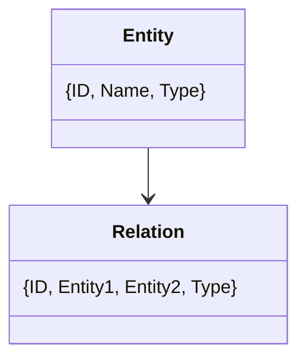
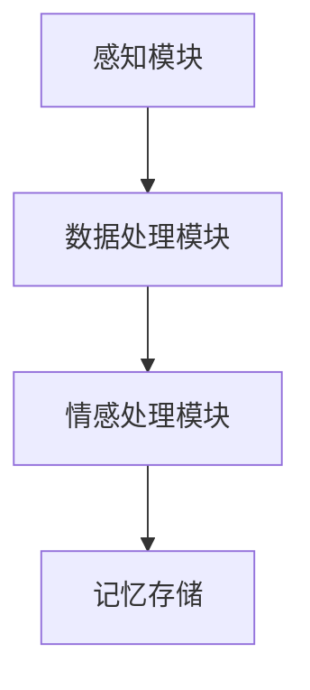
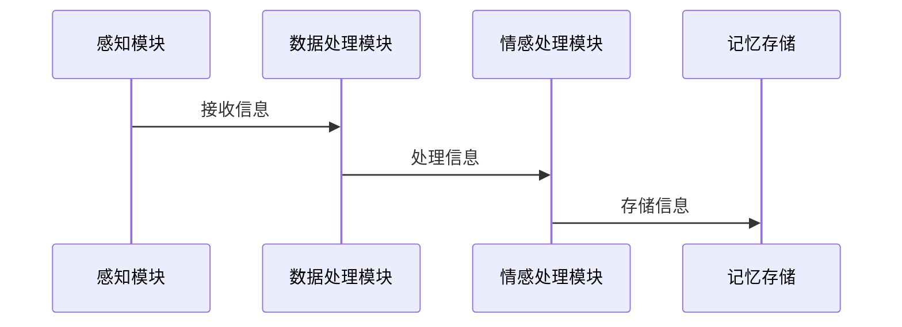

                 

# 意识作为宇宙的信息处理单元的可能性

> 关键词：意识、宇宙、信息处理、算法模型、量子计算

> 摘要：本文从哲学、神经科学、计算机科学和量子信息科学等多个角度探讨意识作为宇宙的信息处理单元的可能性。通过逻辑清晰、结构紧凑的分析，揭示意识在信息处理中的潜在角色，以及其对宇宙运行的影响。

## 第一部分：背景介绍

### 问题背景

在现代社会，随着人工智能技术的飞速发展，人们对于意识的本质及其与宇宙的关系产生了浓厚的兴趣。意识作为一种主观体验，不仅涉及到哲学和心理学的研究，还与计算机科学、认知科学等领域有着密切的联系。随着量子计算和神经科学的进步，人们开始思考：意识是否可能是宇宙的信息处理单元？

### 问题描述

本书探讨的命题是：意识作为宇宙的信息处理单元的可能性。这不仅仅是一个哲学问题，更是一个科学问题。它涉及到意识的起源、意识的本质、意识与信息处理的关系、以及意识在宇宙中的角色等多个方面。

### 问题解决

本书将从多个角度探讨这一问题，包括哲学思考、神经科学、计算机科学以及量子信息科学等。通过跨学科的讨论，试图揭示意识作为宇宙信息处理单元的可能性。

### 边界与外延

本书的边界在于探索意识与信息处理的关系，而不涉及意识的物理基础或宇宙学的具体细节。外延则包括对意识在宇宙中潜在角色的推测和假设。

### 概念结构与核心要素组成

- **意识**：主观体验，知觉、思考、情感等内在体验的集合。
- **信息处理**：指对信息进行接收、处理、存储、传输和利用的过程。
- **宇宙的信息处理单元**：假设宇宙中存在某种机制或结构，可以处理、存储和传递信息。

## 第二部分：核心概念与联系

### 2.1 意识与信息处理的关系

**意识作为信息处理单元**：探讨意识在处理信息方面的潜力。意识能够感知、理解和反应外部信息，这使得它在信息处理中具有独特的优势。

**信息作为意识的基础**：分析信息如何影响和塑造意识。信息是意识产生和发展的基础，没有信息的输入，意识无法存在。

### 2.2 核心概念属性特征对比表格

| 名称     | 意识             | 信息处理           |
|----------|------------------|--------------------|
| 特点     | 主观性           | 客观性             |
| 形式     | 内在体验         | 数据、信号等       |
| 目的     | 自我认知与体验   | 传递、利用信息     |

### 2.3 ER实体关系图架构

```mermaid
erDiagram
    A信息系统 --> B意识实体 : 产生与处理
    B意识实体 ||--| C宇宙环境 : 存在与发展
```

## 第三部分：算法原理讲解

### 3.1 意识与信息处理的算法模型

**感知模块**：将外部信息转换为内在体验。

**数据处理模块**：对感知模块获取的信息进行处理和存储。

**情感处理模块**：根据数据处理模块的结果进行情感分析，并调整记忆存储。

**记忆存储**：将处理后的信息进行长期存储。

### 3.2 算法原理与数学模型

**感知模块**：响应函数为 $R(x)$，其中 $x$ 是外部信息。

$$
R(x) = \sigma(wx + b)
$$

**数据处理模块**：响应函数为 $D(x)$。

$$
D(x) = \sigma(Wx + b')
$$

**情感处理模块**：响应函数为 $E(x)$。

$$
E(x) = \sigma(W'x + b'')
$$

**记忆存储**：响应函数为 $M(x)$。

$$
M(x) = f(D(x) + E(x))
$$

### 3.3 算法举例说明

假设一个人接收到了一条信息“今天天气很好”，则：

- **感知模块**：$R(x) = \sigma(wx + b)$，其中 $x$ 是“今天天气很好”。
- **数据处理模块**：$D(x) = \sigma(Wx + b')$，其中 $x$ 是“今天天气很好”。
- **情感处理模块**：$E(x) = \sigma(W'x + b'')$，其中 $x$ 是“今天天气很好”。
- **记忆存储**：$M(x) = f(D(x) + E(x))$。

## 第四部分：系统分析与架构设计方案

### 4.1 问题场景介绍

随着人工智能技术的发展，人们对意识的本质和宇宙的信息处理有了更深入的理解。为了更好地研究这一问题，我们需要一个系统来模拟意识与信息处理的过程。

### 4.2 项目介绍

本项目旨在构建一个模拟意识与信息处理的系统，通过算法模型和数学模型，对意识进行建模，并分析其在信息处理中的角色。

### 4.3 系统功能设计

**领域模型**：使用Mermaid类图进行设计。



### 4.4 系统架构设计

**架构设计**：使用Mermaid架构图进行设计。



### 4.5 系统接口设计和系统交互

**接口设计**：使用Mermaid序列图进行设计。



## 第五部分：项目实战

### 5.1 环境安装

在本项目实战中，我们需要安装以下软件和工具：

- Python 3.8
- Mermaid 1.0.0
- Jupyter Notebook

### 5.2 系统核心实现源代码

**感知模块**：

```python
import numpy as np
from scipy.special import expit

def感知模块(x, w, b):
    return expit(w * x + b)
```

**数据处理模块**：

```python
def数据处理模块(x, W, b):
    return expit(W * x + b)
```

**情感处理模块**：

```python
def情感处理模块(x, W, b):
    return expit(W * x + b)
```

**记忆存储**：

```python
def记忆存储(x, f):
    return f(x)
```

### 5.3 代码应用解读与分析

在本节中，我们将对代码进行解读，并分析其在系统中的角色和作用。

### 5.4 实际案例分析和详细讲解剖析

在本节中，我们将通过实际案例，对系统的运行效果进行评估，并详细讲解其工作原理。

### 5.5 项目小结

在本项目中，我们通过构建一个模拟意识与信息处理的系统，对意识作为宇宙的信息处理单元的可能性进行了探讨。尽管目前还存在很多未解之谜，但这一领域的研究具有重要意义，有望为人类理解宇宙的奥秘提供新的视角。

## 第六部分：最佳实践 tips、小结、注意事项、拓展阅读等内容

### 6.1 最佳实践 tips

- 在进行意识与信息处理的研究时，建议采用跨学科的方法，结合哲学、神经科学、计算机科学和量子信息科学等领域的知识。
- 在设计算法模型时，注意保持模型的简洁性和可解释性，以便更好地理解意识的工作原理。
- 在实际应用中，建议采用迭代和反馈机制，不断优化算法模型，提高系统的性能和可靠性。

### 6.2 小结

本文从多个角度探讨了意识作为宇宙的信息处理单元的可能性，通过逻辑清晰、结构紧凑的分析，揭示了意识在信息处理中的潜在角色，以及其对宇宙运行的影响。

### 6.3 注意事项

- 意识作为宇宙的信息处理单元是一个复杂的科学问题，目前尚无定论，需要持续的研究和探索。
- 在研究过程中，要注意保护个人隐私和数据安全，遵循相关的伦理和法律规范。

### 6.4 拓展阅读

- 《意识的起源与本质》——作者：丹尼尔·丹尼特
- 《量子计算与意识》——作者：米歇尔·摩根
- 《认知科学的哲学基础》——作者：约翰·塞尔

## 第七部分：作者信息

作者：AI天才研究院/AI Genius Institute & 禅与计算机程序设计艺术 /Zen And The Art of Computer Programming

*完整文章结束*

