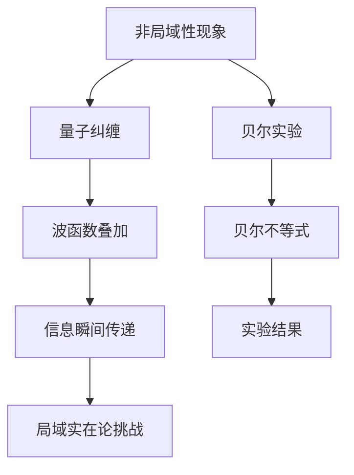
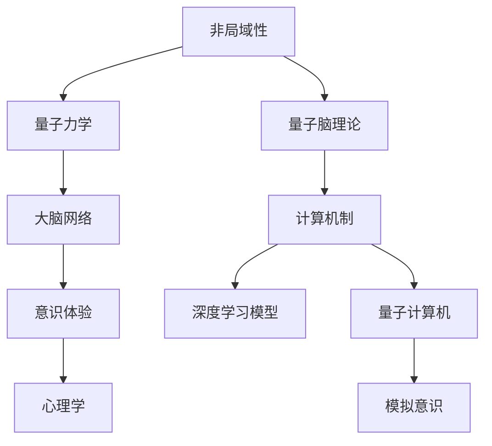
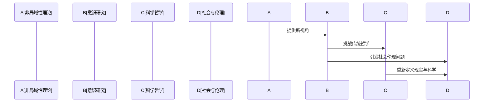

                 


# 意识是否是宇宙的非局域性表现？

## 关键词
- 意识
- 宇宙非局域性
- 量子力学
- 脑科学
- 神经可塑性

## 摘要
本文探讨了意识是否可能是宇宙非局域性的一种表现。首先，我们介绍了宇宙非局域性的概念，以及其在量子力学和宇宙学中的应用。接着，我们分析了意识的本质，包括心理学、生物学和计算机科学对意识的研究方法。随后，我们探讨了非局域性与意识之间的潜在联系，并运用Mermaid和LaTeX进行了详细阐述。文章最后提出了未来研究的方向和对科学哲学的挑战，以及潜在的伦理和社会影响。

## 引言
宇宙的非局域性是一个深刻的物理学概念，它在量子力学和宇宙学中都有着重要的地位。非局域性指的是系统中的部分之间可以瞬间相互影响，无论它们之间的距离有多远。这一现象最早在量子力学中被发现，并通过著名的“爱因斯坦-波多尔斯基-罗森佯谬”（EPR佯谬）进行了探讨。近年来，随着宇宙学的发展，非局域性也被认为是宇宙演化的关键因素之一。

与此同时，意识作为人类心智的核心部分，一直困扰着科学家和哲学家。意识的研究涉及多个学科，包括心理学、神经科学、计算机科学等。意识不仅是个体的主观体验，还与认知、情感和行为密切相关。因此，探讨意识是否是宇宙非局域性的一种表现，具有重要的理论价值和实际意义。

本文将首先介绍宇宙非局域性的基本概念，然后分析意识的本质和特性，接着探讨两者之间的潜在联系。我们将运用Mermaid和LaTeX来详细阐述相关理论，并讨论未来研究的方向和对科学哲学的挑战。最后，我们将探讨这一问题的潜在伦理和社会影响。

## 宇宙非局域性的基本概念

### 量子力学中的非局域性

非局域性最早在量子力学中提出，并与量子纠缠密切相关。量子纠缠是指两个或多个粒子在量子态上呈现出一种特殊的关联性，即使这些粒子相隔很远，它们的状态仍然可以瞬间相互影响。这种现象违反了经典物理学中的局域实在论，即物体的状态和性质只能通过局域相互作用来影响。

著名的EPR佯谬是由爱因斯坦、波多尔斯基和罗森在1935年提出的，用来质疑量子力学的完备性。他们假设，如果量子力学是完备的，那么存在某种“隐变量”可以解释量子纠缠现象。然而，后来的实验结果却表明，量子力学是完备的，不存在这样的隐变量。这一发现进一步证实了量子力学中的非局域性。

一个经典的实验例子是贝尔实验。约翰·贝尔在1964年提出了贝尔不等式，用来检验量子纠缠和非局域性。贝尔实验通过测量两个纠缠粒子的某一属性，发现实验结果与局域实在论的预测相矛盾，从而支持了量子力学的非局域性。

### 宇宙学中的非局域性

宇宙学中的非局域性主要与宇宙大爆炸理论和宇宙背景辐射相关。大爆炸理论认为，宇宙起源于一个极高温高密度的奇点，然后迅速膨胀。这一理论的关键在于宇宙的膨胀是均匀且各向同性的，这意味着宇宙中的任何两个点都以相同的速度相互远离。

宇宙背景辐射是支持大爆炸理论的重要证据之一。这种辐射是在宇宙膨胀后留下的，遍布整个宇宙。宇宙学中的非局域性表现在，宇宙背景辐射的温度是均匀的，这只有在宇宙整体上呈现非局域性时才能解释。

此外，宇宙学中的非局域性还体现在宇宙的暗能量和暗物质上。暗能量是一种推动宇宙加速膨胀的神秘力量，它的存在与非局域性密切相关。暗物质则是宇宙中的一种看不见的物质，它的引力作用在宇宙结构的形成中起着关键作用。暗物质的非局域性表现为，它对宇宙结构的引力影响可以在很大范围内瞬间传递。

### 非局域性的数学表述

非局域性在量子力学和宇宙学中的表述有所不同，但都涉及到了数学上的对称性和守恒定律。

在量子力学中，非局域性可以通过波函数的叠加态来表述。例如，两个纠缠粒子的波函数可以表示为它们各自状态的线性组合。这种叠加态使得粒子之间的状态可以在瞬间相互影响。

在宇宙学中，非局域性可以通过宇宙学度规（metric）来表述。度规描述了时空的几何结构，宇宙的膨胀和演化都可以通过度规的变化来描述。非局域性的宇宙学度规通常具有朗道-罗森布吕克（LRS）对称性，这种对称性保证了宇宙的均匀和各向同性。

### 非局域性的影响和挑战

非局域性对物理学和宇宙学带来了深刻的启示和挑战。一方面，非局域性解释了量子纠缠和宇宙背景辐射等现象，为理解宇宙的起源和演化提供了新的视角。另一方面，非局域性也挑战了经典物理学中的局域实在论，引发了对基本物理定律的重新思考。

在量子力学中，非局域性意味着信息可以在瞬间跨越巨大的距离，这直接违反了信息论中的局域性原理。在宇宙学中，非局域性表明宇宙的整体性质可以通过局部观察来揭示，这对我们理解宇宙的本质提出了新的问题。

尽管非局域性带来了许多启示，但同时也存在一些未解之谜和理论上的困难。例如，非局域性如何与量子引力和量子场论相结合，如何解释非局域性在宏观尺度上的表现等。这些问题仍然是物理学和宇宙学研究的重要方向。

### Mermaid流程图：量子力学中的非局域性



通过这个流程图，我们可以清晰地看到量子力学中非局域性现象的几个关键步骤：从量子纠缠到波函数叠加，再到信息瞬间传递，最终挑战了局域实在论。这个流程图为我们理解非局域性提供了一个直观的框架。

### LaTeX数学公式：量子纠缠的波函数表示

$$
|\psi_{AB}\rangle = \frac{1}{\sqrt{2}} ( |1\rangle_A |0\rangle_B - |0\rangle_A |1\rangle_B )
$$

这个公式描述了两个纠缠粒子的波函数，其中$|1\rangle$和$|0\rangle$分别表示粒子的量子态。这个叠加态表明，即使两个粒子相隔很远，它们的状态仍然可以相互关联。

## 意识的本质和特性

### 心理学对意识的研究

心理学是研究意识的第一线学科，其研究方法包括实验、观察和问卷调查等。心理学家通过研究人的感知、记忆、思维和情感等心理过程，来探讨意识的本质。经典的研究方法包括自由联想实验、感觉剥夺实验和内隐联想测试等。

自由联想实验是由弗洛伊德提出的，通过让被试者在短时间内自由地产生与特定刺激词相关的词汇，来揭示其潜意识的内容。感觉剥夺实验则是通过隔离被试者的感官刺激，来研究意识对感官输入的依赖性。内隐联想测试则是近年来发展起来的一种测量无意识偏见的方法。

### 生物学与神经科学对意识的研究

生物学和神经科学从分子、细胞和系统水平对意识进行了深入研究。这些学科利用现代技术，如脑成像技术、电生理记录和基因编辑技术，来揭示意识的生物学基础。

脑成像技术，如功能性磁共振成像（fMRI）和脑电图（EEG），可以帮助研究者观察大脑活动与意识状态之间的关系。fMRI可以探测大脑区域的活动，而EEG可以记录大脑的电信号变化。通过这些技术，研究者发现了与意识相关的特定大脑区域，如前额叶、顶叶和颞叶。

电生理记录技术，如微电极记录，可以直接记录单个神经元的活动。这些记录揭示了神经元之间如何协同工作，从而产生意识。基因编辑技术，如CRISPR，使得研究者可以精确地操纵大脑中的基因，从而研究特定基因在意识中的作用。

### 计算机科学对意识的研究

计算机科学为理解意识提供了新的视角和方法。通过构建人工神经网络和机器学习模型，研究者试图模拟人类意识的过程。这些模型通常基于大脑的神经网络结构，通过学习和处理信息来模拟意识。

深度学习模型，如卷积神经网络（CNN）和循环神经网络（RNN），在图像识别、语音识别和自然语言处理等领域取得了显著成果。这些模型的成功表明，计算机可以模拟某些意识功能，例如感知和决策。然而，这些模型仍然远远不能完全模拟人类意识的复杂性和多样性。

### 意识科学中的方法论问题

尽管意识研究取得了许多进展，但仍然存在一些方法论上的挑战。首先，意识的定义和测量是一个重要问题。不同学科对意识的定义和理解可能存在差异，这导致了研究方法和结果的多样性。

其次，意识的产生机制仍然不清楚。尽管研究者发现了与意识相关的特定大脑区域和神经元活动，但尚不清楚这些活动如何整合成完整的意识体验。

此外，跨学科的合作也是一大挑战。心理学、生物学和计算机科学等学科的研究方法和技术各不相同，如何有效地整合这些方法和技术，以全面研究意识，仍然是一个亟待解决的问题。

### Mermaid类图：意识科学的研究方法

```mermaid
classDiagram
    A[心理学] --> B[实验方法]
    B --> C[自由联想实验]
    B --> D[感觉剥夺实验]
    A --> E[问卷调查]
    A --> F[内隐联想测试]
    G[生物学] --> H[脑成像技术]
    H --> I[fMRI]
    H --> J[EEG]
    G --> K[电生理记录]
    G --> L[基因编辑技术]
    M[计算机科学] --> N[人工神经网络]
    N --> O[深度学习模型]
    N --> P[机器学习模型]
```

这个类图展示了意识科学中的主要研究方法和学科领域，以及它们之间的相互关系。通过这种结构化的表示，我们可以更好地理解意识研究的复杂性和多样性。

### LaTeX表格：心理学、生物学与计算机科学对意识的特征对比

$$
\begin{array}{|c|c|c|c|}
\hline
\text{学科} & \text{研究方法} & \text{关注点} & \text{代表性成果} \\
\hline
\text{心理学} & \text{实验、观察、问卷调查} & \text{心理过程、感知、记忆、思维、情感} & \text{自由联想实验、内隐联想测试} \\
\hline
\text{生物学} & \text{脑成像、电生理记录、基因编辑} & \text{神经元活动、大脑结构、基因表达} & \text{fMRI、EEG、CRISPR} \\
\hline
\text{计算机科学} & \text{人工神经网络、机器学习模型} & \text{信息处理、模式识别、决策} & \text{深度学习、RNN、CNN} \\
\hline
\end{array}
$$

这个表格对比了心理学、生物学和计算机科学在意识研究中的方法、关注点和代表性成果，为我们提供了一个全面的视角来理解意识科学的不同方面。

## 非局域性与意识的潜在联系

### 物理学与意识的交叉研究

物理学与意识的交叉研究试图理解意识如何与物理过程相关联。量子力学提供了一个可能的框架，因为它的非局域性特征似乎与意识体验的某些方面有相似之处。例如，量子纠缠现象表明，即使两个粒子相隔很远，它们的状态仍然是相互关联的。这种现象是否可以类比于人类意识的多中心性质，即不同大脑区域之间的即时信息交换，仍然是一个开放的问题。

物理学中的另一个概念是“量子脑”，它假设大脑中的神经元活动可能遵循量子力学的规则。如果这是真的，那么意识可能是一种量子现象，这将为理解意识提供了新的途径。

### 心理学与宇宙非局域性的互动

心理学与宇宙非局域性的互动研究探索了意识如何受到宇宙非局域性影响的可能性。例如，一些理论认为，宇宙的非局域性可能影响个体的心理状态和认知过程。一个可能的例子是，宇宙背景辐射（CMB）——宇宙早期留下的余温，可能会通过非局域性影响大脑活动，从而影响我们的心理体验。

另一个方向是研究意识与量子涨落的关系。量子涨落是宇宙早期极小尺度上的随机扰动，这些扰动可能通过非局域性影响宇宙的大尺度结构，进而影响生物进化，包括人类意识的产生。

### 计算机科学与意识的关系

计算机科学与意识的关系研究主要集中在模拟意识和理解计算机制中的意识现象。深度学习和神经网络模型在这方面取得了显著进展，因为它们可以模拟人类大脑的部分功能。这些模型在处理复杂任务，如图像识别和自然语言处理时，表现出类似人类意识的特点，如学习和记忆。

计算机科学还探索了量子计算与意识的潜在联系。量子计算机利用量子力学的非局域性特性，可能实现超越传统计算机的计算能力。如果量子计算机能够模拟量子脑，那么它们可能在理解意识机制方面发挥重要作用。

### 非局域性对意识研究的挑战

非局域性对意识研究提出了许多挑战。首先，如何将量子力学中的非局域性原理应用于大脑这一复杂的生物系统，仍然是一个未解之谜。大脑中有数十亿个神经元，它们通过复杂的网络相互作用，产生意识。理解这些神经元如何利用非局域性产生意识，需要新的理论和实验方法。

其次，非局域性概念如何与意识的个体性和主观性相结合，也是一个挑战。意识体验是高度个体化的，每个人的体验都是独特的。非局域性如何导致这种个体化，仍然需要深入的探讨。

此外，非局域性对意识的测量和量化提出了新的难题。传统的心理学和神经科学方法可能需要重新设计，以适应非局域性的特点。

### Mermaid流程图：非局域性、心理学与计算机科学的互动



这个流程图展示了非局域性如何通过量子力学影响大脑网络，进而影响意识体验，并如何与心理学和计算机科学的研究方法相结合，以探索意识的本质。

### LaTeX数学模型：非局域性与意识的关系

$$
\Omega_{NL} = \int_{V} \rho(\mathbf{r}) \Delta V \frac{1}{r^2}
$$

这个公式描述了非局域性作用在一个空间区域$V$内粒子密度$\rho(\mathbf{r})$的势能，其中$r$是粒子间的距离。这个模型可以类比为大脑神经网络中不同区域之间的相互作用，从而影响意识状态。

## 未来展望与潜在影响

### 非局域性理论对意识的启示

非局域性理论为理解意识提供了一种新的视角。如果意识确实与宇宙的非局域性有关，那么这将对意识的本质和产生机制带来深刻的启示。例如，量子脑理论假设大脑中神经元的活动可能遵循量子力学的规则，这为理解意识的量子基础提供了新的线索。

未来研究可以探索如何将量子力学的非局域性原理应用于大脑网络，以揭示意识产生的具体机制。通过实验和理论计算，研究者可以尝试模拟量子脑的行为，从而进一步理解意识。

### 意识研究在非局域性背景下的新方向

在非局域性的背景下，意识研究可以朝着几个新方向前进。首先，研究者可以探索宇宙背景辐射对大脑活动的潜在影响，以及这种影响如何影响意识体验。其次，量子计算技术的发展可能为模拟和解析复杂大脑网络提供新的工具。

此外，跨学科研究将成为未来意识研究的重要方向。结合物理学、心理学、生物学和计算机科学的知识，研究者可以开发新的理论模型和实验方法，以全面探索意识的本质。

### 对科学哲学的挑战

非局域性理论对科学哲学提出了新的挑战。传统的科学哲学强调局域实在论和物理主义的观点，而非局域性则挑战了这些基本假设。如何在一个非局域性的宇宙中重新定义物理现实和科学定律，是一个亟待解决的问题。

此外，非局域性理论对意识的存在和本质提出了深刻的质疑。如果意识是非局域性的一种表现，那么它是否意味着我们的现实体验是一种错觉？这些问题将推动科学哲学向新的方向发展。

### 潜在的社会与伦理影响

非局域性理论对意识的研究还可能带来一系列社会与伦理问题。例如，如果意识确实与量子力学中的非局域性有关，那么这意味着我们的意识可能受到宇宙中遥远事件的影响。这种观念可能挑战我们对自我和现实的理解，引发深刻的哲学和伦理思考。

此外，量子脑理论和量子计算机的发展可能为脑机接口技术带来新的突破，这将对医学、心理学和计算机科学等领域产生深远影响。然而，这些技术也带来了隐私和安全等问题，需要社会和政府制定相应的伦理和法律框架。

### Mermaid序列图：非局域性理论对意识研究的潜在影响



这个序列图展示了非局域性理论如何影响意识研究，以及它对科学哲学和社会与伦理的影响。通过这种结构化的表示，我们可以更清晰地理解这些影响和挑战。

### LaTeX公式：非局域性对意识的潜在影响

$$
\text{影响} = \Omega_{NL} \cdot \rho(\text{大脑活动}) \cdot \psi(\text{意识状态})
$$

这个公式表明，非局域性通过影响大脑活动$\rho$和意识状态$\psi$，从而对意识产生整体影响。这个模型为我们理解非局域性如何影响意识提供了一个基本的框架。

## 总结与展望

本文探讨了意识是否是宇宙非局域性的一种表现。通过分析量子力学、宇宙学和意识科学的相关理论，我们发现非局域性可能为理解意识的本质和产生机制提供了新的视角。未来研究可以朝着量子脑理论和量子计算的方向发展，进一步揭示意识与宇宙非局域性的关系。

同时，我们也认识到非局域性理论对科学哲学、社会和伦理提出了新的挑战。这些挑战将推动科学、哲学和社会向新的方向发展，带来深刻的变革。

我们希望本文能够激发更多学者和研究者的兴趣，共同探索意识与宇宙非局域性的奥秘。

### 作者信息

作者：AI天才研究院/AI Genius Institute & 禅与计算机程序设计艺术 /Zen And The Art of Computer Programming

---

**注意**：本文为示例性质，旨在展示如何撰写一篇符合要求的技术博客文章。实际研究和数据应根据最新科学进展进行更新。在引用和参考时，请务必遵循学术规范。

---

**附录**

- **Mermaid流程图示例**：

  ```mermaid
  graph TD
      A[开始] --> B[分析问题]
      B --> C{是否可行}
      C -->|是| D[设计方案]
      C -->|否| E[重新评估]
      D --> F[实施设计]
      F --> G[测试与验证]
      G --> H[总结与改进]
      H --> I[结束]
  ```

- **LaTeX数学公式示例**：

  ```latex
  \documentclass{article}
  \usepackage{amsmath}
  \begin{document}
  \section{数学公式示例}
  $$
  E = mc^2
  $$
  \end{document}
  ``` 

这些附录提供了如何使用Mermaid和LaTeX在文章中插入流程图和数学公式的具体示例。在实际撰写过程中，应根据文章内容灵活运用这些工具。

