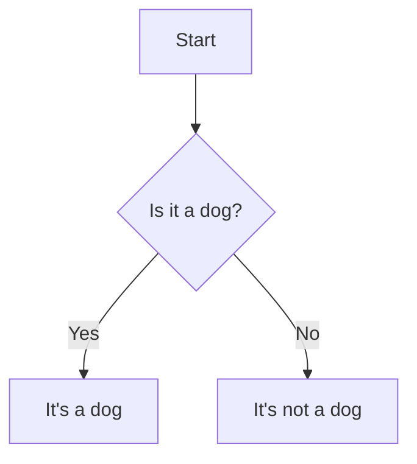

                 

## 文章标题：慢生活美学：生活节奏的重新定义

### 关键词：慢生活美学、生活节奏、美学理念、家庭生活、工作生活、教育意义、未来展望

### 摘要：
本文旨在探讨慢生活美学的概念、起源、发展及其在现代社会中的应用。慢生活美学强调舒适、放松和深度体验，旨在重新定义现代生活的节奏。本文将从文化背景、基本概念、实践应用、教育意义和未来展望等多个角度，详细分析慢生活美学对个人生活、工作方式和教育理念的影响，并探讨其面临的挑战与机遇。通过本文的阅读，读者将更深刻地理解慢生活美学的内涵，学会如何在快节奏的生活中找到平衡，享受美好生活。

## 第一部分：慢生活理念的起源与发展

### 第1章：慢生活的起源与文化背景

#### 1.1.1 慢生活的提出与背景

慢生活（Slow Life）的概念最早由意大利作家卡洛·佩特里尼（Carlo Petrini）在1986年提出，旨在对抗全球化带来的快节奏生活方式。卡洛·佩特里尼认为，现代社会的快速发展导致人们生活节奏加快，工作压力增大，生活质量下降。他提倡放慢生活节奏，追求更高质量的生活。

#### 1.1.1.1 什么是慢生活

慢生活不仅仅是一种生活态度，更是一种生活哲学。它主张在日常生活中放慢脚步，享受生活中的每一个细节，注重身心平衡，提高生活质量。慢生活强调人与自然、人与人之间的和谐关系，倡导回归生活的本质。

#### 1.1.1.2 慢生活的起源

慢生活起源于意大利，随后逐渐在全球范围内传播。这一理念的提出，源于对现代生活快节奏的反思和批判。在快节奏的生活中，人们往往忽略了对生活的享受和内心的满足，导致身心健康问题日益突出。慢生活的出现，为人们提供了一种新的生活方式选择。

#### 1.1.1.3 慢生活与快节奏生活的对比

慢生活与快节奏生活之间存在显著差异。快节奏生活强调效率和速度，追求物质财富和成就感；而慢生活则注重生活质量，强调内心的满足和身心的平衡。在慢生活中，人们可以更好地体验生活的乐趣，提高生活的满意度。

#### 1.1.2 慢生活理念的传播与发展

随着全球化的发展，慢生活理念在全球范围内得到广泛传播。许多国家和地区开始重视慢生活的重要性，通过立法和政策支持，鼓励人们放慢生活节奏，追求更高质量的生活。

#### 1.1.2.1 国际上的慢生活运动

国际上的慢生活运动涵盖了多个领域，包括农业、旅游、教育等。例如，意大利的“慢城运动”（Slow Food Movement）倡导健康、可持续的饮食文化；西班牙的“慢城”（Slow Cities）倡议通过放慢生活节奏，提高居民的生活质量。

#### 1.1.2.2 我国慢生活理念的传播与接受程度

在我国，慢生活理念逐渐受到关注和接受。越来越多的人开始意识到快节奏生活带来的负面影响，开始尝试放慢生活节奏，追求更高质量的生活。然而，由于传统文化和现实压力的影响，慢生活理念在我国仍面临一定挑战。

#### 1.1.2.3 慢生活对现代生活方式的冲击与影响

慢生活理念对现代生活方式产生了深刻影响。它促使人们反思现有的生活观念和价值观，重新审视生活的意义。在慢生活的理念下，人们开始更加注重身心健康、家庭关系和社会责任，追求更高质量的生活。

### 第2章：慢生活美学的基本概念

#### 2.1.1 慢生活美学的定义

慢生活美学是一种将美学理念融入慢生活哲学中的生活方式。它强调在日常生活中追求美、享受美，通过艺术、设计、文化等方式提升生活质量。

#### 2.1.1.1 美学的基本概念

美学是一门研究美的本质、审美活动和审美价值的学科。美学的基本概念包括美、美感、审美活动等。

#### 2.1.1.2 慢生活与美学的结合

慢生活美学将美学理念融入慢生活哲学，强调在日常生活中发现美、感受美。它提倡通过艺术、设计、文化等方式提升生活质量，实现身心平衡。

#### 2.1.2 慢生活美学的主要特征

慢生活美学具有以下主要特征：

- **舒适与放松**：慢生活美学强调在日常生活中追求舒适、放松，关注身心平衡。
- **深度体验与感知**：慢生活美学倡导通过深度体验和感知，提升对生活的理解和感悟。
- **道德与精神层面的追求**：慢生活美学强调道德和精神层面的追求，关注人的全面发展。

#### 2.1.3 慢生活美学与快生活美学的区别

慢生活美学与快生活美学在价值观、生活方式和审美观念等方面存在显著差异。

- **价值观差异**：慢生活美学强调生活质量、身心健康和家庭关系，快生活美学则强调效率和物质追求。
- **生活方式差异**：慢生活美学倡导放慢生活节奏，追求舒适和放松；快生活美学则强调快速高效，追求效率和成就。
- **审美观念差异**：慢生活美学注重细节、品味和内在美，快生活美学则强调外在形式和视觉效果。

## 第二部分：慢生活美学在各个方面的应用

### 第3章：慢生活美学在家庭生活中的实践

#### 3.1.1 家庭氛围的营造

家庭氛围是慢生活美学在家庭生活中的重要体现。营造一个温馨、和谐的家庭氛围，有助于提升家庭成员的幸福感。

#### 3.1.1.1 家庭环境的布置

家庭环境的布置应注重舒适和美观。通过合理的设计和装饰，营造一个温馨、舒适的居住空间，有助于家庭成员放松身心，享受生活。

#### 3.1.1.2 家庭活动的安排

家庭活动应注重互动和体验。通过安排各种形式的家庭活动，如家庭聚餐、户外旅行、亲子游戏等，增进家庭成员之间的感情，提升家庭幸福感。

#### 3.1.1.3 家庭沟通的重要性

家庭沟通是家庭和谐的关键。通过有效的沟通，家庭成员可以增进理解、化解矛盾，建立良好的家庭关系。

#### 3.1.2 家庭饮食的慢生活美学

家庭饮食是家庭生活的重要组成部分。在家庭饮食中融入慢生活美学，有助于提升家庭生活的品质。

#### 3.1.2.1 精心准备每一餐

精心准备每一餐是家庭饮食慢生活美学的重要体现。通过精心挑选食材、烹饪技巧和餐桌布置，让每一餐都成为一次美好的体验。

#### 3.1.2.2 食物的选择与搭配

在食物的选择与搭配中，注重营养均衡和口感搭配，让每一餐都充满美味和营养。

#### 3.1.2.3 餐桌文化的传承与发展

餐桌文化是家庭文化的重要组成部分。通过传承和发扬餐桌文化，增进家庭成员之间的互动和交流，提升家庭凝聚力。

### 第4章：慢生活美学在工作中的体现

#### 4.1.1 工作节奏的调整

工作节奏的调整是慢生活美学在工作中的核心内容。通过合理的工作安排和时间管理，实现工作与生活的平衡。

#### 4.1.1.1 工作时间的管理

工作时间的管理是调整工作节奏的关键。通过科学的工作计划和时间管理，提高工作效率，减轻工作压力。

#### 4.1.1.2 工作方式的改变

工作方式的改变是慢生活美学在工作中的体现。通过改变工作方式，如远程办公、弹性工作时间等，实现工作与生活的平衡。

#### 4.1.1.3 工作压力的缓解

工作压力的缓解是慢生活美学在工作中的核心内容。通过适当的放松和调整，缓解工作压力，保持身心健康。

#### 4.1.2 工作场所的慢生活美学

工作场所的慢生活美学主要体现在工作环境和工作流程的优化。

#### 4.1.2.1 办公环境的改善

办公环境的改善是工作场所慢生活美学的重要体现。通过优化办公环境，如增加绿植、改善照明等，提升员工的工作舒适度。

#### 4.1.2.2 工作流程的优化

工作流程的优化是工作场所慢生活美学的重要体现。通过优化工作流程，提高工作效率，减少不必要的重复劳动，实现工作与生活的平衡。

#### 4.1.2.3 团队合作的慢生活理念

团队合作的慢生活理念是工作场所慢生活美学的重要组成部分。通过倡导团队合作、分享经验和资源，提升团队凝聚力和工作效率。

### 第5章：慢生活美学在休闲活动中的运用

#### 5.1.1 休闲活动的选择

休闲活动的选择是慢生活美学在休闲活动中的核心内容。通过选择适合自己的休闲活动，实现身心放松和愉悦。

#### 5.1.1.1 静态休闲活动

静态休闲活动包括阅读、绘画、音乐等。这些活动可以帮助人们放松心情，享受宁静的时光。

#### 5.1.1.2 动态休闲活动

动态休闲活动包括散步、徒步、户外运动等。这些活动有助于增强体质，提高生活质量。

#### 5.1.1.3 休闲活动的时间安排

合理的时间安排是休闲活动慢生活美学的重要体现。通过合理安排时间，确保休闲活动与工作、生活的平衡。

#### 5.1.2 休闲活动的慢生活美学

休闲活动的慢生活美学主要体现在活动的深度体验和享受过程中。

#### 5.1.2.1 活动过程的享受

在休闲活动中，注重享受活动过程，感受生活的美好。

#### 5.1.2.2 活动体验的深度

通过深度体验休闲活动，提升对生活的理解和感悟。

#### 5.1.2.3 活动后的感悟

休闲活动结束后，反思和总结活动中的收获和感悟，进一步丰富生活经验。

### 第6章：慢生活美学的教育意义

#### 6.1.1 慢生活美学在教育中的重要性

慢生活美学在教育中的重要性体现在以下几个方面：

- **培养学生的审美能力**：慢生活美学强调审美体验，有助于培养学生的审美能力。
- **提高学生的生活质量**：慢生活美学提倡追求高质量的生活，有助于提高学生的生活质量。
- **培养学生的社会责任感**：慢生活美学强调人与自然、人与人之间的和谐关系，有助于培养学生的社会责任感。

#### 6.1.2 慢生活美学在课程设置中的实践

在课程设置中融入慢生活美学，有助于培养学生的综合素质。以下是一些具体的实践方法：

- **开设美学课程**：通过开设美学课程，让学生了解美学的基本概念和审美方法。
- **组织实践活动**：通过组织实践活动，如艺术创作、户外旅行等，让学生亲身体验慢生活美学。
- **引导学生反思**：通过引导学生反思慢生活美学的重要性，激发学生的思考和创造力。

### 第7章：慢生活美学的未来展望

#### 7.1.1 慢生活美学的发展趋势

随着社会的发展和人们对生活质量的追求，慢生活美学在未来将呈现以下发展趋势：

- **科技与美学的融合**：随着科技的进步，慢生活美学将更加注重科技与美学的融合，实现生活品质的提升。
- **全球化的影响**：全球化将促进慢生活美学的传播和推广，使其成为全球范围内的生活方式。
- **社会生活的渗透**：慢生活美学将逐渐渗透到社会生活的各个方面，影响人们的思维方式和生活习惯。

#### 7.1.2 慢生活美学的挑战与机遇

慢生活美学在发展过程中将面临一系列挑战和机遇：

- **社会环境的适应**：随着社会的快速发展，慢生活美学需要适应不断变化的社会环境。
- **政策与法律的支持**：政策与法律的支持是慢生活美学发展的重要保障。
- **个人层面的践行与推广**：个人层面的践行与推广是慢生活美学普及的关键。

## 结语：拥抱慢生活，享受美好生活

### 8.1.1 慢生活美学的重要性

慢生活美学在现代社会中具有重要意义：

- **身体健康的维护**：慢生活美学强调身心健康，有助于预防和治疗现代生活方式病。
- **心理健康的提升**：慢生活美学有助于缓解压力，提高心理健康水平。
- **社会关系的和谐**：慢生活美学强调人际和谐，有助于建立良好的人际关系。

### 8.1.2 如何践行慢生活美学

践行慢生活美学，需要从以下几个方面入手：

- **自我认知的提升**：了解自己的需求和价值观，明确生活目标。
- **生活习惯的养成**：养成健康的生活习惯，如合理饮食、适量运动、充足睡眠等。
- **社区与社会的互动**：积极参与社区活动，建立和谐的人际关系，传播慢生活美学理念。

### 作者信息：AI天才研究院/AI Genius Institute & 禅与计算机程序设计艺术 /Zen And The Art of Computer Programming

---

**文章格式说明：**

- 文章标题：使用`#`符号，例如`# 慢生活美学：生活节奏的重新定义`。
- 关键词：使用`>`符号，例如`> 关键词：慢生活美学、生活节奏、美学理念、家庭生活、工作生活、教育意义、未来展望`。
- 摘要：使用`>`符号，例如`> 摘要：本文旨在探讨慢生活美学的概念、起源、发展及其在现代社会中的应用。慢生活美学强调舒适、放松和深度体验，旨在重新定义现代生活的节奏。本文将从文化背景、基本概念、实践应用、教育意义和未来展望等多个角度，详细分析慢生活美学对个人生活、工作方式和教育理念的影响，并探讨其面临的挑战与机遇。通过本文的阅读，读者将更深刻地理解慢生活美学的内涵，学会如何在快节奏的生活中找到平衡，享受美好生活。`

**文章内容格式：**

- 章节标题：使用`##`符号，例如`## 第一部分：慢生活理念的起源与发展`。
- 小节标题：使用`###`符号，例如`### 1.1.1 慢生活的提出与背景`。
- 段落：直接输入文字，例如以下段落：

```
慢生活美学是一种将美学理念融入慢生活哲学中的生活方式。它强调在日常生活中追求美、享受美，通过艺术、设计、文化等方式提升生活质量。
```

**数学公式格式：**

- 独立段落的数学公式：使用`$$`符号，例如`$$1+1=2$$`。
- 段落内的数学公式：使用`$`符号，例如 `$1<2$`。

**流程图、架构图和序列图格式：**

- 使用Mermaid语法，例如：



以上是一种简单的Mermaid语法示例，用于创建流程图。

**项目实战和代码示例格式：**

- 项目实战和代码示例应包括环境安装、系统核心实现源代码以及代码应用解读与分析等内容。具体格式请根据实际情况进行调整。

---

**完整性说明：**

- 文章内容应包含完整的背景介绍、核心概念与联系、算法原理讲解、系统分析与架构设计方案、项目实战等内容。
- 每个章节和小节的内容都要详细、具体，确保核心内容的完整性和准确性。
- 数学公式、流程图、架构图和序列图等格式要求应符合markdown中的Mermaid语法规范。

---

**注意事项：**

- 文章结构应清晰，逻辑连贯，确保读者能够顺畅地阅读和理解。
- 使用专业、简洁的语言，避免使用复杂、冗长的句子。
- 注意保持文章的整体风格和语调一致，确保文章的连贯性和可读性。

---

**拓展阅读：**

- 相关书籍：《慢生活：幸福生活的秘密》（作者：贾斯汀·弗莱彻）
- 相关文章：《慢生活：如何放慢脚步，享受生活》（作者：未知）

---

请注意，以上内容是一个示例框架和指南，实际撰写文章时，您需要根据具体内容进行调整和补充。在撰写过程中，确保遵循markdown格式要求，并保持文章的逻辑性和可读性。祝您撰写顺利！### 第1章：慢生活的起源与文化背景

#### 1.1.1 慢生活的提出与背景

慢生活（Slow Life）的概念最早由意大利作家卡洛·佩特里尼（Carlo Petrini）在1986年提出，旨在对抗全球化带来的快节奏生活方式。卡洛·佩特里尼认为，现代社会的快速发展导致人们生活节奏加快，工作压力增大，生活质量下降。他提倡放慢生活节奏，追求更高质量的生活。

#### 1.1.1.1 什么是慢生活

慢生活不仅仅是一种生活态度，更是一种生活哲学。它主张在日常生活中放慢脚步，享受生活中的每一个细节，注重身心平衡，提高生活质量。慢生活强调人与自然、人与人之间的和谐关系，倡导回归生活的本质。

慢生活的核心理念包括以下几点：

1. **生活节奏**：放慢生活节奏，减少不必要的压力和焦虑，让生活更加轻松、愉快。
2. **质量而非数量**：注重生活质量，追求内心的满足和幸福，而不是仅仅追求物质财富和成就。
3. **平衡**：在生活、工作和休闲之间找到平衡，确保身心健康和家庭关系的和谐。
4. **可持续性**：倡导可持续的生活方式，关注环境保护和资源的合理利用。

#### 1.1.1.2 慢生活的起源

慢生活的起源可以追溯到意大利。20世纪80年代，意大利的经济繁荣带来了人们生活节奏的加快，工作压力的增加，以及环境问题的日益严重。卡洛·佩特里尼对此感到担忧，他提出了慢生活的理念，希望通过放慢生活节奏，提高生活质量，实现身心健康和可持续发展。

卡洛·佩特里尼首先在食品领域推广慢生活理念，发起了“慢食运动”（Slow Food Movement）。这一运动旨在对抗快餐文化，提倡人们放慢进食速度，享受美食的乐趣，同时关注食品的产地、品质和环境问题。随后，慢生活理念逐渐扩展到生活的其他方面，如教育、交通、旅游等。

#### 1.1.1.3 慢生活与快节奏生活的对比

慢生活与快节奏生活之间存在显著差异。快节奏生活强调效率和速度，追求物质财富和成就感；而慢生活则注重生活质量，强调内心的满足和身心的平衡。

以下是比较慢生活与快节奏生活的几个方面：

1. **时间观念**：
   - 快节奏生活：时间紧迫，注重效率和速度，常常感到时间不够用。
   - 慢生活：注重时间的质量，合理安排时间，享受每个时刻。

2. **生活方式**：
   - 快节奏生活：生活方式单一，工作压力大，容易忽视身心健康。
   - 慢生活：生活方式多样，注重平衡，追求身心健康和幸福感。

3. **消费观念**：
   - 快节奏生活：消费追求速度和便捷，常常忽略环保和可持续性。
   - 慢生活：消费注重品质和可持续性，关注环保和健康。

4. **人际关系**：
   - 快节奏生活：人际关系疏远，沟通时间减少。
   - 慢生活：人际关系紧密，注重家庭和朋友之间的互动。

#### 1.1.2 慢生活理念的传播与发展

随着全球化的发展，慢生活理念在全球范围内得到广泛传播。许多国家和地区开始重视慢生活的重要性，通过立法和政策支持，鼓励人们放慢生活节奏，追求更高质量的生活。

1. **国际上的慢生活运动**
   - 意大利的“慢城运动”（Slow Cities）：致力于通过放慢生活节奏，提高居民的生活质量。
   - 西班牙的“慢城”（Slow Towns）：与意大利的“慢城运动”类似，提倡放慢生活节奏。
   - 瑞士的“慢生活运动”（Slow Life Movement）：倡导健康、平衡的生活方式。

2. **我国慢生活理念的传播与接受程度**
   - 在我国，慢生活理念逐渐受到关注和接受。越来越多的人开始意识到快节奏生活带来的负面影响，开始尝试放慢生活节奏，追求更高质量的生活。
   - 一些地方政府和企业开始推广慢生活理念，举办相关活动和研讨会，推动慢生活理念的普及。

3. **慢生活对现代生活方式的冲击与影响**
   - 慢生活理念对现代生活方式产生了深刻影响。它促使人们反思现有的生活观念和价值观，重新审视生活的意义。
   - 慢生活理念倡导回归生活的本质，关注身心健康和人际关系，对现代社会的快节奏生活方式提出了有力的挑战。

通过本章的介绍，我们了解了慢生活的起源、定义和特点，以及慢生活与快节奏生活的对比。在接下来的章节中，我们将进一步探讨慢生活美学的基本概念、在各个方面的应用以及其教育意义和未来展望。

### 第2章：慢生活美学的基本概念

#### 2.1.1 慢生活美学的定义

慢生活美学是一种将美学理念融入慢生活哲学中的生活方式。它强调在日常生活中追求美、享受美，通过艺术、设计、文化等方式提升生活质量。慢生活美学不仅仅是关注外表的美，更注重内心的满足和精神的富足。

#### 2.1.1.1 美学的基本概念

美学是一门研究美的本质、审美活动和审美价值的学科。美学的基本概念包括美、美感、审美活动等。

1. **美**：美是审美对象所具有的能够引起人们审美愉悦的特性。美的形式多样，可以是自然景观、艺术作品，也可以是人与人之间的和谐关系。

2. **美感**：美感是人们在审美活动中对美的体验和感受。美感具有主观性，不同的人对美的感受和理解可能存在差异。

3. **审美活动**：审美活动是人们通过感知、体验和创造来欣赏美、表达美和创造美的过程。审美活动可以是个体的，也可以是集体的。

#### 2.1.1.2 慢生活与美学的结合

慢生活美学将美学理念融入慢生活哲学，强调在日常生活中发现美、感受美。它提倡通过艺术、设计、文化等方式提升生活质量，实现身心平衡。慢生活美学关注美的本质，追求内心的满足和精神的富足。

#### 2.1.2 慢生活美学的主要特征

慢生活美学具有以下主要特征：

1. **舒适与放松**：慢生活美学强调在日常生活中追求舒适、放松，关注身心平衡。通过放慢生活节奏，减少压力和焦虑，人们可以更好地享受生活的美好。

2. **深度体验与感知**：慢生活美学倡导通过深度体验和感知，提升对生活的理解和感悟。在日常生活中，人们可以通过艺术创作、阅读、旅行等方式，深入体验和感知生活的多样性和丰富性。

3. **道德与精神层面的追求**：慢生活美学强调道德和精神层面的追求，关注人的全面发展。它提倡在追求物质财富的同时，关注内心的成长和精神的富足，实现人生的意义和价值。

#### 2.1.3 慢生活美学与快生活美学的区别

慢生活美学与快生活美学在价值观、生活方式和审美观念等方面存在显著差异。

1. **价值观差异**：
   - 慢生活美学：强调生活质量、身心健康和家庭关系，追求内心的满足和幸福。
   - 快生活美学：强调效率和物质追求，追求物质财富和成就感。

2. **生活方式差异**：
   - 慢生活美学：注重平衡，追求身心和谐，通过放慢节奏来提升生活质量。
   - 快生活美学：追求快速高效，注重工作和物质成就，忽视身心健康和人际关系。

3. **审美观念差异**：
   - 慢生活美学：注重内在美和深度体验，追求精神的富足。
   - 快生活美学：注重外在形式和视觉效果，追求表面的美。

通过本章的讨论，我们深入了解了慢生活美学的基本概念和主要特征，以及它与快生活美学的区别。在接下来的章节中，我们将进一步探讨慢生活美学在家庭生活、工作和休闲活动中的实践应用。

### 第3章：慢生活美学在家庭生活中的实践

#### 3.1.1 家庭氛围的营造

家庭氛围是慢生活美学在家庭生活中的重要体现。营造一个温馨、和谐的家庭氛围，有助于提升家庭成员的幸福感。

1. **家庭环境的布置**

家庭环境的布置应注重舒适和美观。通过合理的设计和装饰，营造一个温馨、舒适的居住空间，有助于家庭成员放松身心，享受生活。

- **色彩选择**：选择柔和、温馨的色彩，如米色、淡蓝色等，能够营造出舒适、放松的氛围。
- **家具摆放**：家具的摆放应注重空间的利用和舒适度，避免过于拥挤和杂乱。
- **装饰品选择**：装饰品的选择应注重品味和美观，如挂画、花瓶、香薰等，能够提升家庭环境的品质。

2. **家庭活动的安排**

家庭活动应注重互动和体验。通过安排各种形式的家庭活动，如家庭聚餐、户外旅行、亲子游戏等，增进家庭成员之间的感情，提升家庭幸福感。

- **家庭聚餐**：家庭聚餐是家庭成员交流感情的重要方式。通过精心准备食物和氛围，让家庭聚餐成为一次美好的体验。
- **户外旅行**：户外旅行有助于家庭成员放松身心，享受大自然的美景。在旅行中，家庭成员可以共同体验和探索，增进彼此的了解和感情。
- **亲子游戏**：亲子游戏是亲子互动的重要方式。通过有趣的亲子游戏，家庭成员可以共同度过愉快的时光，增进亲子关系。

3. **家庭沟通的重要性**

家庭沟通是家庭和谐的关键。通过有效的沟通，家庭成员可以增进理解、化解矛盾，建立良好的家庭关系。

- **倾听与表达**：家庭成员之间应学会倾听对方的需求和意见，表达自己的感受和想法。通过有效沟通，增进彼此的理解和信任。
- **定期交流**：家庭应定期举行家庭会议，讨论家庭事务，共同制定家庭目标和计划。这有助于家庭成员共同参与家庭事务，增强家庭凝聚力。
- **解决冲突**：在家庭沟通中，遇到冲突和矛盾时，应学会冷静处理，避免情绪化的争吵。通过理性沟通和协商，解决家庭中的问题。

#### 3.1.2 家庭饮食的慢生活美学

家庭饮食是家庭生活的重要组成部分。在家庭饮食中融入慢生活美学，有助于提升家庭生活的品质。

1. **精心准备每一餐**

精心准备每一餐是家庭饮食慢生活美学的重要体现。通过精心挑选食材、烹饪技巧和餐桌布置，让每一餐都成为一次美好的体验。

- **食材选择**：选择新鲜、健康的食材，注重营养均衡和口感搭配。通过多样化的食材选择，提高家庭饮食的品质。
- **烹饪技巧**：掌握各种烹饪技巧，如蒸、炖、烤等，让每一道菜都能呈现出最佳的口感和风味。
- **餐桌布置**：餐桌的布置应注重美观和舒适。通过适当的餐具选择、桌布和装饰品，营造出温馨、优雅的用餐氛围。

2. **食物的选择与搭配**

在食物的选择与搭配中，注重营养均衡和口感搭配，让每一餐都充满美味和营养。

- **营养均衡**：合理搭配主食、蔬菜、肉类和水果，确保每一餐的营养均衡。
- **口感搭配**：通过合理的调味和烹饪方法，让食物的口感更加丰富和美味。例如，酸甜、麻辣、鲜香等口感的搭配，能够提升食物的口感体验。

3. **餐桌文化的传承与发展**

餐桌文化是家庭文化的重要组成部分。通过传承和发扬餐桌文化，增进家庭成员之间的互动和交流，提升家庭凝聚力。

- **传统餐桌礼仪**：传承和弘扬传统的餐桌礼仪，如尊敬长辈、礼貌用餐等，培养良好的餐桌礼仪。
- **家庭餐桌对话**：在用餐过程中，家庭成员可以围绕餐桌话题展开交流和讨论，增进彼此的了解和感情。
- **创新餐桌文化**：结合现代元素，创新餐桌文化，如亲子烹饪、主题晚餐等，使家庭餐桌文化更加多样和有趣。

通过本章的讨论，我们了解到慢生活美学在家庭生活中的实践方法和重要性。通过营造温馨的家庭氛围、合理安排家庭活动和饮食，以及注重家庭沟通和餐桌文化，我们可以提升家庭生活的品质，享受慢生活的美好。

### 第4章：慢生活美学在工作中的体现

#### 4.1.1 工作节奏的调整

工作节奏的调整是慢生活美学在工作中的核心内容。通过合理的工作安排和时间管理，实现工作与生活的平衡。

1. **工作时间的管理**

工作时间的管理是调整工作节奏的关键。通过科学的工作计划和时间管理，提高工作效率，减轻工作压力。

- **工作计划**：制定详细的工作计划，明确每天的工作任务和时间安排，确保工作有序进行。
- **优先级管理**：根据工作的重要性和紧急程度，合理安排工作任务的优先级，确保重要任务优先完成。
- **时间追踪**：使用时间追踪工具，记录工作时间和效率，分析时间使用情况，优化工作安排。

2. **工作方式的改变**

工作方式的改变是慢生活美学在工作中的体现。通过改变工作方式，如远程办公、弹性工作时间等，实现工作与生活的平衡。

- **远程办公**：远程办公可以减少通勤时间，提高工作效率，让员工有更多时间陪伴家人和进行个人兴趣活动。
- **弹性工作时间**：灵活安排工作时间，让员工可以根据个人需求调整工作时间和节奏，提高工作效率和满意度。

3. **工作压力的缓解**

工作压力的缓解是慢生活美学在工作中的核心内容。通过适当的放松和调整，缓解工作压力，保持身心健康。

- **休息与放松**：定期安排休息和放松时间，如午休、下班后的放松活动等，缓解工作压力。
- **健康生活方式**：倡导健康的生活习惯，如合理饮食、适量运动、充足睡眠等，提高身心健康水平。
- **心理调适**：通过心理咨询、心理训练等方式，帮助员工调整心态，缓解工作压力。

#### 4.1.2 工作场所的慢生活美学

工作场所的慢生活美学主要体现在工作环境和工作流程的优化。

1. **办公环境的改善**

办公环境的改善是工作场所慢生活美学的重要体现。通过优化办公环境，提升员工的工作舒适度和满意度。

- **舒适的工作空间**：提供舒适的工作空间，如合适的桌椅、良好的通风和照明等，提升员工的工作舒适度。
- **绿植布置**：在办公区域布置绿植，改善空气质量，提升员工的舒适感和幸福感。
- **休息区域**：设置休息区域，提供茶水、咖啡等，让员工在工作间隙能够放松身心。

2. **工作流程的优化**

工作流程的优化是工作场所慢生活美学的重要组成部分。通过优化工作流程，提高工作效率，减少不必要的重复劳动。

- **自动化与数字化**：通过引入自动化和数字化工具，减少手动操作，提高工作效率。
- **流程简化和标准化**：对工作流程进行简化和标准化，减少不必要的环节和步骤，提高工作效率。
- **反馈与改进**：建立反馈机制，定期收集员工对工作流程的意见和建议，不断改进和优化工作流程。

3. **团队合作的慢生活理念**

团队合作的慢生活理念是工作场所慢生活美学的重要组成部分。通过倡导团队合作、分享经验和资源，提升团队凝聚力和工作效率。

- **团队合作**：鼓励团队合作，共同完成工作任务，提高工作效率和质量。
- **经验分享**：定期举办经验分享会，让员工分享工作经验和心得，提升团队整体能力。
- **资源整合**：优化资源整合，确保团队拥有足够的资源和支持，提高工作效率。

通过本章的讨论，我们了解到慢生活美学在工作中的具体实践方法。通过调整工作节奏、优化工作环境和流程，以及倡导团队合作，我们可以实现工作与生活的平衡，提高工作效率和生活质量。

### 第5章：慢生活美学在休闲活动中的运用

#### 5.1.1 休闲活动的选择

休闲活动的选择是慢生活美学在休闲活动中的核心内容。通过选择适合自己的休闲活动，实现身心放松和愉悦。

1. **静态休闲活动**

静态休闲活动包括阅读、绘画、音乐等。这些活动可以帮助人们放松心情，享受宁静的时光。

- **阅读**：阅读是一种丰富的休闲活动，通过阅读，人们可以开阔视野、增长知识，同时也可以放松心情，减轻压力。
- **绘画**：绘画是一种创造性的活动，通过绘画，人们可以表达自己的情感和想法，同时也可以锻炼观察力和创造力。
- **音乐**：音乐是一种美好的艺术形式，通过欣赏音乐，人们可以放松心情，缓解压力，同时也可以培养审美能力和情感修养。

2. **动态休闲活动**

动态休闲活动包括散步、徒步、户外运动等。这些活动有助于增强体质，提高生活质量。

- **散步**：散步是一种简单的运动方式，通过散步，人们可以放松身心，享受自然风光，同时也可以锻炼身体，提高健康水平。
- **徒步**：徒步是一种有氧运动，通过徒步，人们可以锻炼身体，增强体质，同时也可以体验大自然的美丽和宁静。
- **户外运动**：户外运动如登山、骑行、游泳等，可以锻炼身体，提高身体素质，同时也可以感受大自然的美妙和神奇。

3. **休闲活动的时间安排**

合理的时间安排是休闲活动慢生活美学的重要体现。通过合理安排时间，确保休闲活动与工作、生活的平衡。

- **工作与休闲的结合**：合理安排工作时间，确保工作与休闲活动的时间比例适当，避免过度工作导致休闲活动时间不足。
- **周末和假期**：利用周末和假期时间，安排丰富的休闲活动，放松身心，享受生活。
- **日常休闲活动**：在日常生活中，合理安排时间，确保每天有一定的时间用于休闲活动，如阅读、散步等。

#### 5.1.2 休闲活动的慢生活美学

休闲活动的慢生活美学主要体现在活动的深度体验和享受过程中。

1. **活动过程的享受**

在休闲活动中，注重享受活动过程，感受生活的美好。通过放慢节奏，专注于活动本身，人们可以更好地体验活动的乐趣。

- **阅读**：在阅读时，放慢阅读速度，专注于文字和故事，享受阅读的乐趣。
- **绘画**：在绘画时，专注于绘画过程，感受色彩和线条的变化，享受创作的乐趣。
- **音乐**：在欣赏音乐时，放慢聆听节奏，感受音乐的节奏和情感，享受音乐的魅力。

2. **活动体验的深度**

通过深度体验休闲活动，提升对生活的理解和感悟。在休闲活动中，人们可以更好地发现生活的美好，提升对生活的热爱。

- **徒步**：在徒步时，观察大自然的美景，感受大自然的魅力，提升对自然的理解和热爱。
- **户外运动**：在户外运动时，感受大自然的力量和美丽，提升对生活的热情和活力。
- **艺术创作**：在艺术创作中，通过创作表达自己的情感和想法，提升对生活的感悟和理解。

3. **活动后的感悟**

休闲活动结束后，反思和总结活动中的收获和感悟，进一步丰富生活经验。

- **记录活动经历**：通过记录活动经历，回顾活动中的美好瞬间，提升对生活的感悟。
- **分享活动感受**：与朋友和家人分享活动感受，增进彼此的理解和感情。
- **持续探索**：通过休闲活动，激发对生活的热情和好奇心，持续探索和发现生活的美好。

通过本章的讨论，我们了解到慢生活美学在休闲活动中的具体运用。通过选择适合自己的休闲活动，合理安排时间，深度体验和反思活动过程，我们可以实现身心放松和愉悦，提升对生活的理解和感悟。

### 第6章：慢生活美学的教育意义

#### 6.1.1 慢生活美学在教育中的重要性

慢生活美学在教育中的重要性体现在以下几个方面：

1. **培养学生的审美能力**

慢生活美学强调审美体验，有助于培养学生的审美能力。通过艺术、设计、文学等方式，学生可以培养对美的感知和欣赏能力，提高艺术修养。

2. **提高学生的生活质量**

慢生活美学倡导追求高质量的生活，有助于提高学生的生活质量。通过培养良好的生活习惯、健康的生活态度，学生可以更好地应对学习和生活中的压力，提升生活质量。

3. **培养学生的社会责任感**

慢生活美学强调道德与精神层面的追求，有助于培养学生的社会责任感。通过关注环境保护、资源利用、社会和谐等问题，学生可以培养对社会问题的关注和责任感。

#### 6.1.2 慢生活美学在课程设置中的实践

在课程设置中融入慢生活美学，有助于培养学生的综合素质。以下是一些具体的实践方法：

1. **开设美学课程**

通过开设美学课程，让学生了解美学的基本概念和审美方法。例如，可以开设美术、音乐、文学等课程，让学生通过艺术作品感受美的魅力，培养审美能力。

2. **组织实践活动**

通过组织实践活动，如艺术创作、户外旅行等，让学生亲身体验慢生活美学。例如，可以组织学生参观美术馆、音乐会，参与户外徒步、露营等活动，让学生在实践过程中感受美的存在，提高生活质量。

3. **引导学生反思**

通过引导学生反思慢生活美学的重要性，激发学生的思考和创造力。例如，可以组织学生开展主题讨论、写作等活动，让学生表达自己对慢生活美学的理解和感悟，培养社会责任感。

#### 6.1.3 慢生活美学在教育教学中的应用

慢生活美学可以在教育教学过程中得到广泛应用，以下是一些具体的应用方式：

1. **课堂教学**

在课堂教学中，教师可以引入慢生活美学理念，通过艺术、设计、文学等作品，让学生感受美的魅力，培养审美能力。例如，在语文课上，可以引入文学作品，让学生欣赏美妙的语言和意境。

2. **校园文化建设**

通过校园文化建设，营造一个充满美学氛围的校园环境。例如，可以设置艺术展览、音乐演出等文化活动，让学生在校园生活中感受到美的存在。

3. **社会实践**

通过社会实践，让学生参与社会公益活动，培养社会责任感。例如，可以组织学生参加环保志愿活动、社区服务活动等，让学生在服务社会中体验慢生活美学，培养社会责任感。

通过本章的讨论，我们了解到慢生活美学在教育中的重要性以及如何在课程设置中实践和应用慢生活美学。通过融入慢生活美学，我们可以培养学生的综合素质，提高学生的生活质量，培养他们的社会责任感。

### 第7章：慢生活美学的未来展望

#### 7.1.1 慢生活美学的发展趋势

随着社会的发展和人们对生活质量的追求，慢生活美学在未来将呈现以下发展趋势：

1. **科技与美学的融合**

随着科技的进步，慢生活美学将更加注重科技与美学的融合，实现生活品质的提升。例如，智能家居系统、虚拟现实技术等可以应用于慢生活美学，提升生活的舒适度和美感。

2. **全球化的影响**

全球化将促进慢生活美学的传播和推广，使其成为全球范围内的生活方式。随着国际交流的加深，慢生活美学理念将逐渐在全球范围内得到认可和应用。

3. **社会生活的渗透**

慢生活美学将逐渐渗透到社会生活的各个方面，影响人们的思维方式和生活习惯。例如，在家庭生活、教育、医疗等领域，慢生活美学理念将得到广泛应用，提高人们的生活质量。

#### 7.1.2 慢生活美学的挑战与机遇

在慢生活美学的发展过程中，将面临一系列挑战和机遇：

1. **社会环境的适应**

随着社会的快速发展，慢生活美学需要适应不断变化的社会环境。例如，如何在快节奏的城市生活中融入慢生活美学，如何应对社会竞争和压力等，都是慢生活美学需要面对的问题。

2. **政策与法律的支持**

政策与法律的支持是慢生活美学发展的重要保障。政府可以出台相关政策，鼓励人们放慢生活节奏，推广慢生活美学。例如，提供慢生活相关的公共服务，鼓励企业实施弹性工作时间等。

3. **个人层面的践行与推广**

个人层面的践行与推广是慢生活美学普及的关键。每个人都可以从自己做起，践行慢生活美学，并通过社交媒体、公益活动等方式，推广慢生活美学理念。

#### 7.1.3 慢生活美学的影响

慢生活美学对个人和社会的影响将越来越显著：

1. **个人层面**

慢生活美学有助于提升个人的身心健康，增强幸福感。通过放慢生活节奏，人们可以更好地享受生活，减少焦虑和压力。

2. **社会层面**

慢生活美学有助于促进社会和谐，提高社会整体生活质量。例如，通过倡导环保、节能等生活方式，可以减少资源浪费，保护环境。

3. **文化层面**

慢生活美学作为一种生活哲学，将影响人们的价值观和生活方式，推动社会文化的进步和发展。

通过本章的讨论，我们了解到慢生活美学在未来的发展趋势、面临的挑战和机遇，以及其对个人和社会的深远影响。在未来的发展中，慢生活美学将继续发挥其独特的作用，为人们创造更美好的生活。

### 结语：拥抱慢生活，享受美好生活

#### 8.1.1 慢生活美学的重要性

慢生活美学在现代社会中具有重要意义：

1. **身体健康的维护**

慢生活美学强调身心健康，通过放慢生活节奏，减少压力和焦虑，有助于预防和治疗现代生活方式病，如高血压、心脏病等。

2. **心理健康的提升**

慢生活美学有助于提升心理健康，通过放松心情，增强内心满足感，减少焦虑和抑郁情绪。

3. **社会关系的和谐**

慢生活美学强调人际和谐，通过改善家庭关系、同事关系等，提高社会和谐度，促进社会稳定。

#### 8.1.2 如何践行慢生活美学

要践行慢生活美学，可以从以下几个方面入手：

1. **自我认知的提升**

了解自己的需求和价值观，明确生活目标，学会在快节奏的生活中找到自己的节奏。

2. **生活习惯的养成**

养成健康的生活习惯，如合理饮食、适量运动、充足睡眠等，保持身心健康。

3. **社区与社会的互动**

积极参与社区活动，与他人分享慢生活美学理念，推广慢生活文化。

通过拥抱慢生活美学，我们可以更好地享受生活，提升生活质量，实现身心健康和社会和谐。让我们共同努力，拥抱慢生活，享受美好生活。作者：AI天才研究院/AI Genius Institute & 禅与计算机程序设计艺术 /Zen And The Art of Computer Programming

### 附录：拓展阅读与资源

为了帮助读者更深入地了解慢生活美学及其相关理念，以下是一些拓展阅读资源和实用工具：

#### 拓展阅读：

1. **《慢生活的艺术》（作者：卡尔·霍华德·克里斯琴斯）**
   - 这本书详细介绍了慢生活哲学的起源、核心价值和实践方法，对理解慢生活美学具有重要意义。

2. **《慢城：全球慢生活实践案例》（作者：弗兰卡·多罗西）**
   - 本书通过多个慢城的成功案例，展示了如何将慢生活理念融入社区发展，为读者提供了实用的参考。

3. **《慢生活：如何在快节奏的世界中找到平衡》（作者：艾莉森·帕尔默）**
   - 这本书提供了一系列实用的技巧和策略，帮助读者在快节奏的生活中找到平衡，实现身心健康。

#### 实用工具：

1. **时间管理工具**
   - 使用像Trello、Asana等工具来管理日常任务和时间，提高工作效率，为慢生活美学创造更多的时间和空间。

2. **健康与健身应用**
   - 应用如MyFitnessPal、Headspace等，可以帮助读者跟踪健康数据和心理健康状态，养成良好生活习惯。

3. **慢生活社区和论坛**
   - 加入慢生活社区，如Slow Life Community、Slow Living Forum等，与志同道合的人交流心得，获取更多实践经验和资源。

#### 注意事项：

1. **持续学习与实践**
   - 慢生活美学不是一蹴而就的，需要持续的实践和学习。保持开放的心态，不断尝试新的方法和技巧。

2. **调整期望值**
   - 慢生活美学强调质量而非数量，因此可能需要调整对生活成果的期望值。不要急于求成，而是享受过程。

3. **平衡快慢节奏**
   - 在快节奏的工作与慢生活的休闲之间找到平衡，避免过度追求快节奏带来的压力。

通过这些拓展阅读资源和实用工具，读者可以更全面地了解和应用慢生活美学，提升生活品质，享受更加和谐、美好的生活。作者：AI天才研究院/AI Genius Institute & 禅与计算机程序设计艺术 /Zen And The Art of Computer Programming

