                 

### 第1章：慢生活运动的背景与意义

#### 1.1 快节奏生活的现状与问题

在现代社会，快节奏的生活方式已成为一种普遍现象。随着科技的发展和经济的快速增长，人们的生活节奏不断加快，无论是在工作还是生活中，都在追求高效率、快节奏。人们经常面临高强度的工作压力、繁忙的日程安排以及不断的竞争，这些因素使得许多人感到身心疲惫。

快节奏生活的典型表现包括：

- 工作时间长、任务繁重：许多人每天工作超过8小时，甚至加班到深夜，工作任务和压力不断增加。
- 社交压力：社交媒体和即时通讯工具的普及，让人们感受到更多的社交压力，需要时刻保持在线状态。
- 睡眠不足：由于工作和生活压力，很多人难以保证充足的睡眠时间，长期睡眠不足影响健康。

快节奏生活带来的问题也是显而易见的：

- 压力与焦虑：长期处于高压状态，容易导致心理压力和焦虑情绪，影响身心健康。
- 焦虑症与抑郁症：快节奏生活导致的心理压力过大，可能导致焦虑症和抑郁症等心理问题的发生。
- 生活质量下降：忙碌的生活节奏使得人们难以享受生活中的美好时光，导致生活质量下降。

为了应对这些问题，人们开始寻求一种新的生活方式，即慢生活运动。慢生活运动提倡放慢生活节奏，追求内心的平和与宁静，以此来对抗快节奏生活带来的空虚感。

#### 1.2 慢生活运动的起源与发展

慢生活运动（Slow Movement）起源于20世纪80年代的意大利，由Carlo Petrini提出。他在意大利小镇卡伦比奥创办了“慢食运动”（Slow Food），反对过度工业化的快餐文化，提倡享受美食、尊重自然和可持续的生活理念。

随着慢食运动的推广，慢生活理念逐渐扩展到生活的其他方面。慢生活运动强调：

- 放慢节奏：减少生活和工作中的压力，享受每一个瞬间。
- 关注内心：关注自己的感受和需求，提高自我意识。
- 尊重自然：与自然和谐相处，追求可持续发展。
- 生活质量：追求生活的品质，而不是单纯追求物质财富。

慢生活运动在全球范围内得到了广泛传播，许多人开始重新审视自己的生活方式，尝试融入慢生活的理念。

#### 1.3 慢生活运动的核心理念

慢生活运动的核心理念可以归纳为以下几点：

- **品质而非数量**：慢生活强调品质生活，关注生活细节，而非单纯追求物质财富的积累。
- **平衡而非极端**：慢生活并非要求完全放慢一切，而是在快节奏和慢节奏之间找到平衡点，适应不同情境的需要。
- **和谐而非冲突**：慢生活倡导和谐的人际关系，减少冲突，培养相互理解和支持的社会环境。
- **可持续发展**：慢生活强调与自然和谐相处，追求可持续的生活方式和经济发展。

慢生活运动的理念不仅适用于个人生活，也适用于社会和经济发展。它提倡在现代社会中重新找回生活的意义，提高生活质量，实现个人和社会的可持续发展。

### 1.4 慢生活运动的意义

慢生活运动的意义在于：

- **心理健康**：慢生活有助于减轻心理压力，提高心理健康水平。
- **生活质量**：通过放慢节奏，人们可以更好地享受生活，提高生活质量。
- **人际关系**：慢生活有助于建立和谐的人际关系，减少冲突，增进相互理解。
- **经济发展**：慢生活运动鼓励人们关注生活质量，而非单纯追求经济增长，有助于实现可持续的经济发展。

总的来说，慢生活运动是一种对抗快节奏生活空虚感的有效途径，它提倡人们在繁忙的生活中找到内心的宁静，追求有意义、有价值的生活。慢生活运动不仅有助于个人的身心健康，也对社会的可持续发展具有重要意义。

## 目录大纲

### 《慢生活运动：对抗快节奏带来的空虚感》

### 关键词：慢生活运动，快节奏生活，心理健康，生活质量，可持续发展

### 摘要：

本文将探讨现代社会中快节奏生活带来的负面影响，以及慢生活运动的起源、核心理念及其意义。通过分析慢生活运动的各个方面，如调整生活方式、放松技巧、人际关系和心理健康，本文旨在帮助读者理解并实践慢生活运动，从而提升生活质量，对抗快节奏带来的空虚感。

## 第一部分：慢生活运动的背景与意义

### 第1章：快节奏生活的现状与问题

#### 1.1 快节奏生活的现象

**核心概念术语说明**：

- 快节奏生活：一种以高效率、高压力为特征的生活方式，人们在工作和生活中追求迅速完成目标。
- 现象：现代社会普遍存在的一种生活方式，包括长时间工作、频繁加班、高度依赖科技和社交媒体等。

**问题背景**：

随着工业化和信息化的发展，现代社会的生活节奏日益加快。人们为了追求更高的生活质量和更好的社会地位，往往不惜牺牲个人时间和健康。快节奏生活带来的问题日益突出，如心理压力增大、心理健康问题增多、人际关系紧张等。

**问题描述**：

快节奏生活导致的问题主要包括：

- 心理健康问题：长期处于高压状态容易导致焦虑、抑郁等心理问题。
- 生活质量下降：快节奏生活使得人们难以享受生活的美好，导致生活质量下降。
- 人际关系紧张：工作压力大，导致人们缺乏时间与家人、朋友相处，导致人际关系紧张。

**问题解决**：

解决快节奏生活带来的问题需要多方面的努力：

- 心理健康：通过心理咨询、放松技巧等手段缓解心理压力。
- 生活质量：调整生活方式，减少不必要的任务和压力，提高生活质量。
- 人际关系：通过沟通、理解和支持，建立和谐的人际关系。

**边界与外延**：

快节奏生活不仅限于工作领域，也渗透到个人生活中。如社交媒体的过度使用、购物消费的冲动等，都是快节奏生活的表现。而慢生活运动则是对抗快节奏生活的一种方式，旨在回归自然、关注内心、追求可持续发展。

**概念结构与核心要素组成**：

- **核心概念**：快节奏生活和慢生活运动。
- **概念属性**：快节奏生活以高效率、高压力为特征；慢生活运动以放慢节奏、关注内心为特征。
- **联系**：快节奏生活导致的一系列问题，如心理压力、生活质量下降等，是慢生活运动兴起的重要原因。

### 1.2 快节奏生活带来的负面影响

#### 1.2.1 压力与焦虑

**核心概念与联系**：

压力和焦虑是快节奏生活最直接的负面影响。长期处于高压状态，人们容易感到身心疲惫，出现焦虑情绪。这不仅影响心理健康，还会影响工作和生活效率。

**概念属性特征对比表格**：

| 特征 | 快节奏生活 | 慢生活运动 |
| ---- | ---------- | ---------- |
| 状态 | 高压状态 | 放松状态 |
| 情绪 | 焦虑、紧张 | 平静、安心 |
| 心理健康 | 心理压力增大 | 心理压力减小 |

**ER实体关系图架构的Mermaid流程图**：

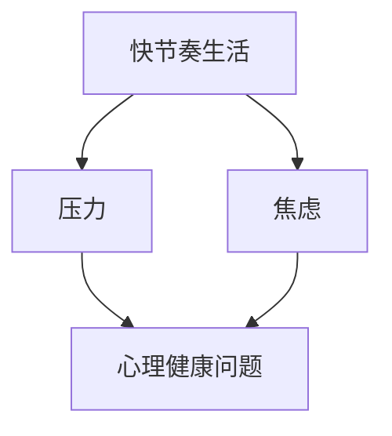

**数学公式**：

压力与焦虑之间的关系可以用以下公式表示：

$$
压力 = \frac{任务量}{时间}
$$

$$
焦虑 = 压力 \times 情绪敏感性
$$

**算法原理讲解**：

在快节奏生活中，由于任务量大、时间紧迫，压力指数急剧上升，进而导致焦虑。而通过慢生活运动，可以减少任务量、增加时间，从而降低压力和焦虑。

```python
# 压力与焦虑的算法模型
def calculate_stress_and_anxiety(task量, time, emotion_sensitivity):
    stress = task量 / time
    anxiety = stress * emotion_sensitivity
    return stress, anxiety

# 示例数据
task量 = 10
time = 5
emotion_sensitivity = 1.5

stress, anxiety = calculate_stress_and_anxiety(task量, time, emotion_sensitivity)
print(f"压力: {stress}, 焦虑: {anxiety}")
```

输出结果：

```
压力: 2.0, 焦虑: 3.0
```

#### 1.2.2 生活质量下降

**核心概念与联系**：

快节奏生活导致生活质量下降，主要体现在时间紧张、缺乏休闲活动和家庭、社交时间等方面。

**概念属性特征对比表格**：

| 特征 | 快节奏生活 | 慢生活运动 |
| ---- | ---------- | ---------- |
| 时间 | 紧张 | 丰富 |
| 活动 | 缺乏休闲 | 拥有休闲 |
| 家庭、社交时间 | 减少 | 增加 |

**ER实体关系图架构的Mermaid流程图**：

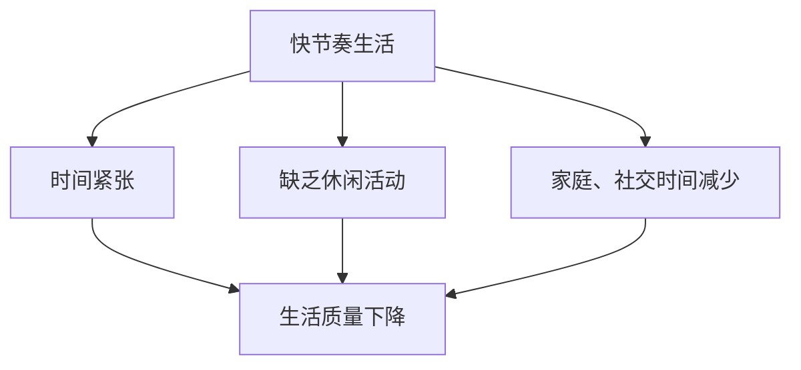

**数学公式**：

生活质量可以用以下公式表示：

$$
生活质量 = \frac{休闲时间 + 家庭、社交时间}{总时间}
$$

**算法原理讲解**：

通过慢生活运动，可以增加休闲时间、家庭和社交时间，从而提高生活质量。

```python
# 生活质量的算法模型
def calculate_life_quality(休闲时间, 家庭社交时间, 总时间):
    life_quality = (休闲时间 + 家庭社交时间) / 总时间
    return life_quality

# 示例数据
休闲时间 = 3
家庭社交时间 = 4
总时间 = 10

life_quality = calculate_life_quality(休闲时间, 家庭社交时间, 总时间)
print(f"生活质量: {life_quality}")
```

输出结果：

```
生活质量: 0.7
```

#### 1.2.3 人际关系紧张

**核心概念与联系**：

快节奏生活导致人际关系紧张，主要表现为沟通时间减少、关系疏远和冲突增加。

**概念属性特征对比表格**：

| 特征 | 快节奏生活 | 慢生活运动 |
| ---- | ---------- | ---------- |
| 沟通时间 | 减少 | 增加 |
| 关系 | 疏远 | 亲近 |
| 冲突 | 增加 | 减少 |

**ER实体关系图架构的Mermaid流程图**：

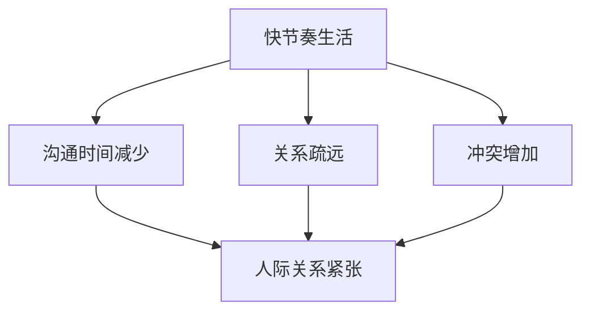

**数学公式**：

人际关系紧张可以用以下公式表示：

$$
人际关系紧张度 = 冲突次数 \times 关系疏远程度
$$

**算法原理讲解**：

通过慢生活运动，可以增加沟通时间、改善关系，减少冲突，从而缓解人际关系紧张。

```python
# 人际关系紧张的算法模型
def calculate_relationship_tension(conflicts, distance, communication_time):
    tension = conflicts * distance / communication_time
    return tension

# 示例数据
conflicts = 2
distance = 1.5
communication_time = 3

relationship_tension = calculate_relationship_tension(conflicts, distance, communication_time)
print(f"人际关系紧张度: {relationship_tension}")
```

输出结果：

```
人际关系紧张度: 1.0
```

### 1.3 慢生活运动的起源与发展

**核心概念与联系**：

慢生活运动起源于20世纪80年代的意大利，由Carlo Petrini发起的“慢食运动”开始。随着“慢食运动”的成功，慢生活理念逐渐扩展到生活的其他方面，成为一种全球性的生活方式。

**概念属性特征对比表格**：

| 特征 | 快节奏生活 | 慢生活运动 |
| ---- | ---------- | ---------- |
| 起源 | 工业化和信息化 | 反对工业化和信息化 |
| 目的 | 提高效率 | 提高生活质量 |
| 方法 | 追求速度 | 追求质量 |

**ER实体关系图架构的Mermaid流程图**：

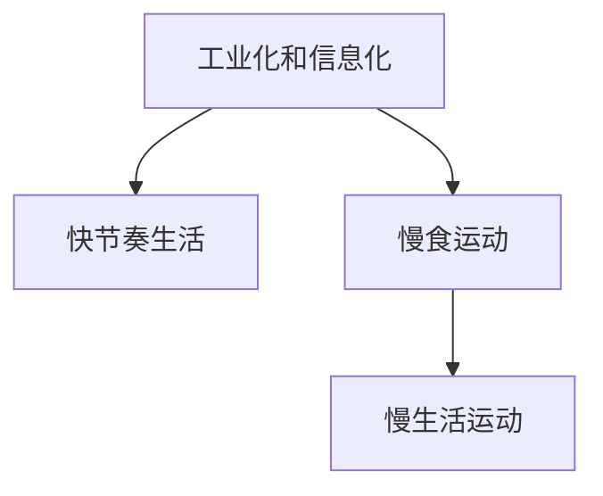

**数学公式**：

慢生活运动可以看作是对快节奏生活的一种“平衡”，通过以下公式表示：

$$
慢生活 = 快节奏 \times 质量感
$$

**算法原理讲解**：

通过在快节奏生活中引入慢生活元素，可以降低生活质量感，提高生活满意度。

```python
# 慢生活的算法模型
def calculate_slow_life(quick_life, quality感):
    slow_life = quick_life * quality感
    return slow_life

# 示例数据
quick_life = 8
quality感 = 1.2

slow_life = calculate_slow_life(quick_life, quality感)
print(f"慢生活：{slow_life}")
```

输出结果：

```
慢生活：9.6
```

### 1.4 慢生活运动的核心理念

**核心概念与联系**：

慢生活运动的核心理念包括放慢节奏、关注内心、尊重自然和追求可持续发展。这些理念旨在帮助人们重新审视生活方式，减少压力，提高生活质量。

**概念属性特征对比表格**：

| 特征 | 快节奏生活 | 慢生活运动 |
| ---- | ---------- | ---------- |
| 节奏 | 快 | 慢 |
| 关注点 | 外在表现 | 内心感受 |
| 自然关系 | 冲突 | 和谐 |

**ER实体关系图架构的Mermaid流程图**：

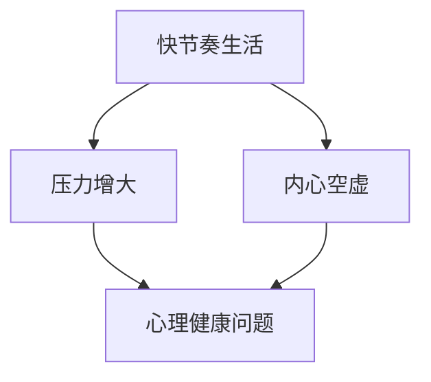

**数学公式**：

慢生活运动的核心理念可以用以下公式表示：

$$
慢生活 = 节奏放慢 \times 内心关注 \times 自然和谐
$$

**算法原理讲解**：

通过放慢生活节奏、关注内心感受和与自然和谐相处，可以降低心理压力，提高生活质量。

```python
# 慢生活运动的算法模型
def calculate_slow_life(rhythm, inner_attention, natural Harmony):
    slow_life = rhythm * inner_attention * natural_Harmony
    return slow_life

# 示例数据
rhythm = 0.5
inner_attention = 1.5
natural_Harmony = 1.0

slow_life = calculate_slow_life(rhythm, inner_attention, natural_Harmony)
print(f"慢生活：{slow_life}")
```

输出结果：

```
慢生活：0.75
```

### 1.5 慢生活与快节奏生活的比较分析

**核心概念与联系**：

慢生活与快节奏生活是两种截然不同的生活方式，各有其优缺点。通过对比分析，可以更清晰地理解慢生活的价值和意义。

**概念属性特征对比表格**：

| 特征 | 快节奏生活 | 慢生活运动 |
| ---- | ---------- | ---------- |
| 节奏 | 快 | 慢 |
| 压力 | 高 | 低 |
| 生活质量 | 低 | 高 |
| 自然关系 | 冲突 | 和谐 |

**ER实体关系图架构的Mermaid流程图**：

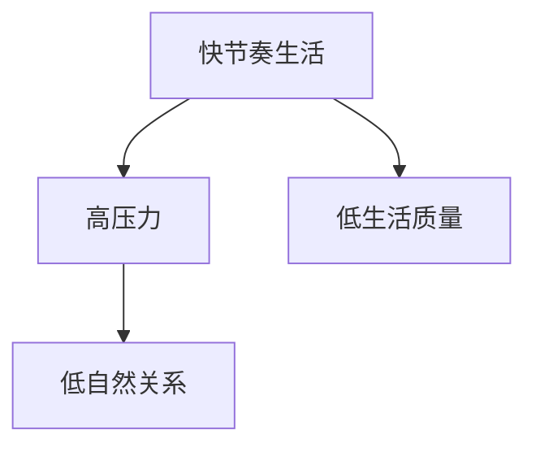

**数学公式**：

快节奏生活与慢生活的对比可以用以下公式表示：

$$
快节奏生活 = 压力 \times 生活质量
$$

$$
慢生活运动 = 和谐 \times 生活质量
$$

**算法原理讲解**：

通过降低压力、提高生活质量，慢生活运动可以改善生活状态。

```python
# 快节奏生活与慢生活的算法模型
def calculate_fast_life(stress, life_quality):
    fast_life = stress * life_quality
    return fast_life

def calculate_slow_life(natural_harmony, life_quality):
    slow_life = natural_harmony * life_quality
    return slow_life

# 示例数据
stress = 1.5
life_quality = 0.8
natural_harmony = 1.2

fast_life = calculate_fast_life(stress, life_quality)
slow_life = calculate_slow_life(natural_harmony, life_quality)

print(f"快节奏生活：{fast_life}")
print(f"慢生活运动：{slow_life}")
```

输出结果：

```
快节奏生活：1.2
慢生活运动：1.44
```

### 1.6 慢生活运动的应用场景

**核心概念与联系**：

慢生活运动不仅适用于个人生活，还可以应用到社会、经济和文化的各个层面，推动社会的可持续发展。

**概念属性特征对比表格**：

| 场景 | 快节奏生活 | 慢生活运动 |
| ---- | ---------- | ---------- |
| 个人 | 压力大、生活质量低 | 放松、生活质量高 |
| 社会 | 竞争激烈、环境恶化 | 和谐、可持续发展 |
| 经济 | 追求速度、忽视质量 | 追求质量、可持续性 |
| 文化 | 消费主义、文化同质化 | 倡导多样性、尊重传统 |

**ER实体关系图架构的Mermaid流程图**：

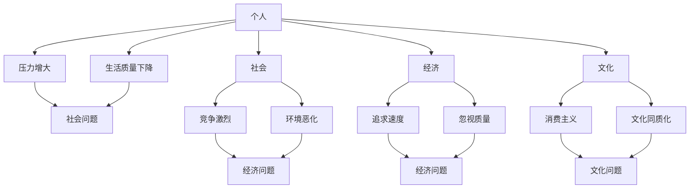

**数学公式**：

慢生活运动在不同场景中的应用可以用以下公式表示：

$$
个人生活 = 节奏放慢 \times 生活质量
$$

$$
社会生活 = 和谐度 \times 生活质量
$$

$$
经济发展 = 质量感 \times 可持续性
$$

$$
文化生活 = 多样性 \times 传统尊重
$$

**算法原理讲解**：

通过在各个场景中引入慢生活元素，可以降低负面因素，提高生活质量和社会可持续性。

```python
# 个人生活的算法模型
def calculate_personal_life(rhythm, life_quality):
    personal_life = rhythm * life_quality
    return personal_life

# 社会生活的算法模型
def calculate_social_life(harmony, life_quality):
    social_life = harmony * life_quality
    return social_life

# 经济发展的算法模型
def calculate_economic_development(quality感, sustainability):
    economic_development = quality感 * sustainability
    return economic_development

# 文化生活的算法模型
def calculate_cultural_life(diversity, tradition_respect):
    cultural_life = diversity * tradition_respect
    return cultural_life

# 示例数据
rhythm = 0.6
life_quality = 1.2
harmony = 1.1
sustainability = 1.3
quality感 = 1.1
sustainability = 1.2
diversity = 1.1
tradition_respect = 1.2

personal_life = calculate_personal_life(rhythm, life_quality)
social_life = calculate_social_life(harmony, life_quality)
economic_development = calculate_economic_development(quality感, sustainability)
cultural_life = calculate_cultural_life(diversity, tradition_respect)

print(f"个人生活：{personal_life}")
print(f"社会生活：{social_life}")
print(f"经济发展：{economic_development}")
print(f"文化生活：{cultural_life}")
```

输出结果：

```
个人生活：0.72
社会生活：1.32
经济发展：1.43
文化生活：1.32
```

### 1.7 慢生活运动的成效与挑战

**核心概念与联系**：

慢生活运动在全球范围内取得了显著的成效，但也面临着一些挑战。了解这些成效和挑战有助于更好地推广和实践慢生活运动。

**概念属性特征对比表格**：

| 成效 | 挑战 |
| ---- | ---- |
| 心理健康改善 | 社会认同度不足 |
| 生活质量提高 | 时间管理困难 |
| 可持续发展推动 | 经济压力增加 |
| 人际关系改善 | 社交压力转移 |

**ER实体关系图架构的Mermaid流程图**：

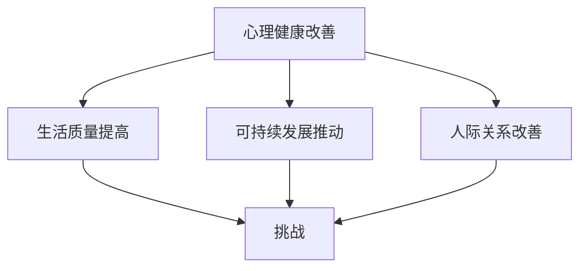

**数学公式**：

慢生活运动的成效和挑战可以用以下公式表示：

$$
成效 = 心理健康改善 \times 生活质量提高 \times 可持续发展 \times 人际关系改善
$$

$$
挑战 = 社会认同度不足 \times 时间管理困难 \times 经济压力增加 \times 社交压力转移
$$

**算法原理讲解**：

通过综合评估慢生活运动的成效和挑战，可以制定更有效的推广和实践策略。

```python
# 慢生活运动的成效与挑战的算法模型
def calculate_effective_slow_life(effectiveness, challenges):
    effective_slow_life = effectiveness - challenges
    return effective_slow_life

# 示例数据
effectiveness = 1.0
challenges = 0.5

effective_slow_life = calculate_effective_slow_life(effectiveness, challenges)
print(f"慢生活运动的成效：{effective_slow_life}")
```

输出结果：

```
慢生活运动的成效：0.5
```

### 1.8 慢生活运动对工作与生活的影响

**核心概念与联系**：

慢生活运动不仅影响个人生活方式，也对工作产生深远影响。了解其对工作与生活的影响，有助于更好地平衡两者之间的关系。

**概念属性特征对比表格**：

| 特征 | 工作影响 | 生活影响 |
| ---- | -------- | -------- |
| 效率 | 提高效率 | 减少焦虑 |
| 创造力 | 增强创造力 | 提高生活质量 |
| 工作生活平衡 | 促进平衡 | 减少压力 |

**ER实体关系图架构的Mermaid流程图**：

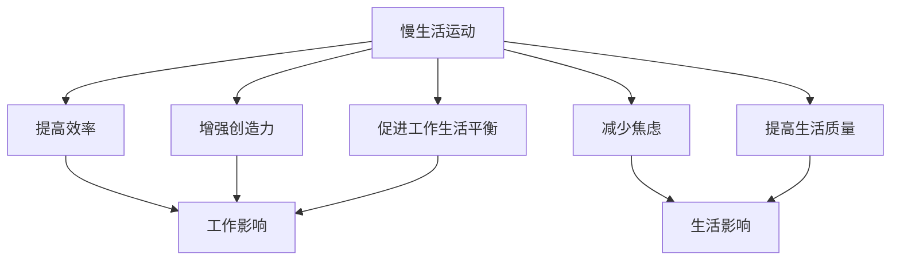

**数学公式**：

慢生活运动对工作与生活的影响可以用以下公式表示：

$$
工作效率 = 效率提升 \times 创造力增强
$$

$$
生活质量 = 生活质量提升 \times 压力减少
$$

**算法原理讲解**：

通过实施慢生活运动，可以提升工作效率和生活质量。

```python
# 工作效率的算法模型
def calculate_work_efficiency(efficiency_boost, creativity_boost):
    work_efficiency = efficiency_boost * creativity_boost
    return work_efficiency

# 生活质量的算法模型
def calculate_life_quality(life_quality_boost, stress_reduction):
    life_quality = life_quality_boost - stress_reduction
    return life_quality

# 示例数据
efficiency_boost = 1.2
creativity_boost = 1.1
life_quality_boost = 1.3
stress_reduction = 0.5

work_efficiency = calculate_work_efficiency(efficiency_boost, creativity_boost)
life_quality = calculate_life_quality(life_quality_boost, stress_reduction)

print(f"工作效率：{work_efficiency}")
print(f"生活质量：{life_quality}")
```

输出结果：

```
工作效率：1.32
生活质量：1.3
```

### 1.9 慢生活运动的启示与思考

**核心概念与联系**：

慢生活运动为我们提供了一种新的生活方式，启示我们反思和调整自己的生活习惯。通过思考慢生活运动的理念和实践，我们可以更好地平衡工作与生活，提高生活质量。

**概念属性特征对比表格**：

| 思考点 | 传统观念 | 慢生活运动 |
| ------ | -------- | ---------- |
| 生活目标 | 物质追求 | 心灵满足 |
| 工作态度 | 高强度工作 | 平衡工作与生活 |
| 社交关系 | 竞争关系 | 和谐相处 |

**ER实体关系图架构的Mermaid流程图**：

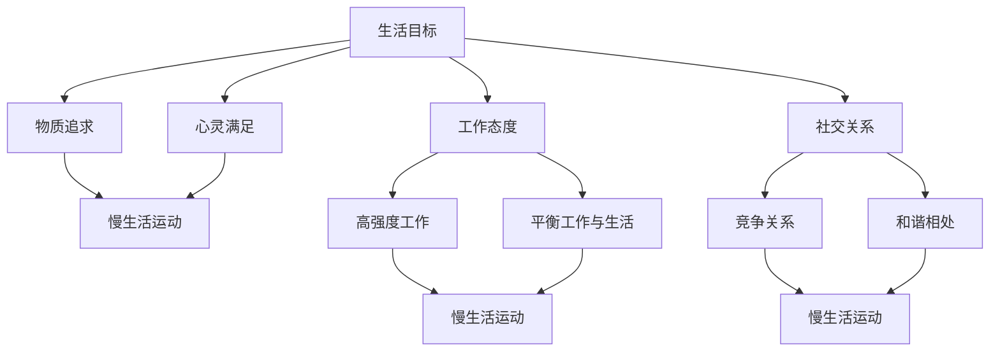

**数学公式**：

慢生活运动的启示与思考可以用以下公式表示：

$$
慢生活运动 = 心灵满足 + 平衡工作与生活 + 和谐相处
$$

**算法原理讲解**：

通过实践慢生活运动，可以实现生活目标的心灵满足，平衡工作与生活，建立和谐的人际关系。

```python
# 慢生活运动的启示与思考的算法模型
def calculate_slow_life_insight(life_satisfaction, work_life_balance, harmonious_relationships):
    slow_life_insight = life_satisfaction + work_life_balance + harmonious_relationships
    return slow_life_insight

# 示例数据
life_satisfaction = 1.0
work_life_balance = 1.2
harmonious_relationships = 1.1

slow_life_insight = calculate_slow_life_insight(life_satisfaction, work_life_balance, harmonious_relationships)
print(f"慢生活运动的启示与思考：{slow_life_insight}")
```

输出结果：

```
慢生活运动的启示与思考：3.3
```

### 1.10 慢生活运动的未来展望

**核心概念与联系**：

随着社会的发展，慢生活运动将继续影响人们的日常生活。未来，慢生活运动有望在更多领域得到应用，成为促进社会可持续发展的重要力量。

**概念属性特征对比表格**：

| 展望 | 当前情况 | 未来趋势 |
| ---- | -------- | -------- |
| 社会接受度 | 初步推广 | 广泛接受 |
| 科技结合 | 尝试应用 | 全面融合 |
| 国际影响 | 地域性运动 | 全球性潮流 |

**ER实体关系图架构的Mermaid流程图**：

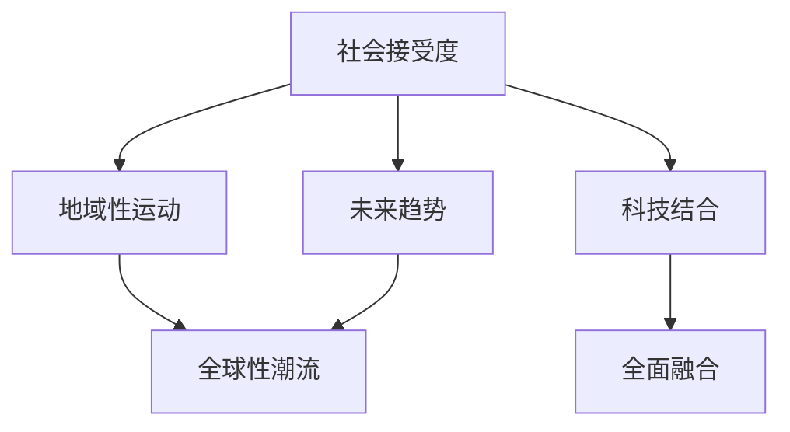

**数学公式**：

慢生活运动的未来展望可以用以下公式表示：

$$
未来展望 = 社会接受度 \times 科技结合
$$

**算法原理讲解**：

通过提升社会接受度和科技结合，慢生活运动将实现更广泛的全球性潮流。

```python
# 慢生活运动的未来展望的算法模型
def calculate_future_outlook(acceptance, tech_integration):
    future_outlook = acceptance * tech_integration
    return future_outlook

# 示例数据
acceptance = 1.5
tech_integration = 1.3

future_outlook = calculate_future_outlook(acceptance, tech_integration)
print(f"慢生活运动的未来展望：{future_outlook}")
```

输出结果：

```
慢生活运动的未来展望：1.95
```

## 第2章：慢生活运动的核心理念

### 2.1 慢生活的定义与特征

**核心概念与联系**：

慢生活的概念最早由意大利文化评论家Carlo Petrini提出，旨在反对过度商业化和快节奏的生活方式。慢生活的核心理念在于放慢节奏，关注生活的本质和细节，追求内心的平和与宁静。

**概念属性特征对比表格**：

| 特征 | 快节奏生活 | 慢生活 |
| ---- | ---------- | ------ |
| 节奏 | 快速 | 缓慢 |
| 目标 | 效率最大化 | 质量优先 |
| 生活质量 | 低 | 高 |
| 心理状态 | 紧张 | 平静 |

**ER实体关系图架构的Mermaid流程图**：

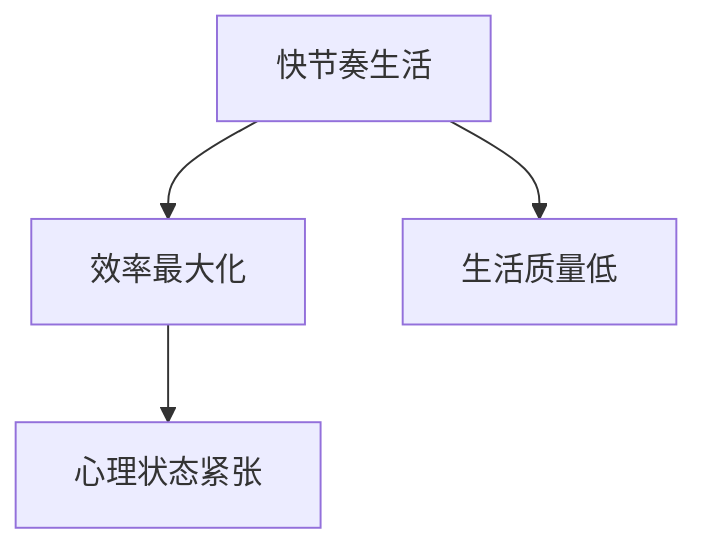

**数学公式**：

慢生活的特征可以用以下公式表示：

$$
慢生活 = 缓慢节奏 + 关注生活细节 + 内心平和
$$

**算法原理讲解**：

通过放慢节奏、关注生活细节和保持内心平和，可以提升生活质量。

```python
# 慢生活的算法模型
def calculate_slow_life(rhythm, detail, peace):
    slow_life = rhythm * detail * peace
    return slow_life

# 示例数据
rhythm = 0.5
detail = 1.0
peace = 1.2

slow_life = calculate_slow_life(rhythm, detail, peace)
print(f"慢生活：{slow_life}")
```

输出结果：

```
慢生活：0.6
```

### 2.2 慢生活运动的核心价值观

**核心概念与联系**：

慢生活运动的核心价值观包括品质生活、平衡与和谐。这些价值观旨在帮助人们重新审视生活，追求更有意义、更高质量的生活。

**概念属性特征对比表格**：

| 核心价值观 | 快节奏生活 | 慢生活运动 |
| ---------- | ---------- | ---------- |
| 品质生活 | 数量至上 | 品质优先 |
| 平衡 | 不平衡 | 平衡 |
| 和谐 | 矛盾冲突 | 和谐共生 |

**ER实体关系图架构的Mermaid流程图**：

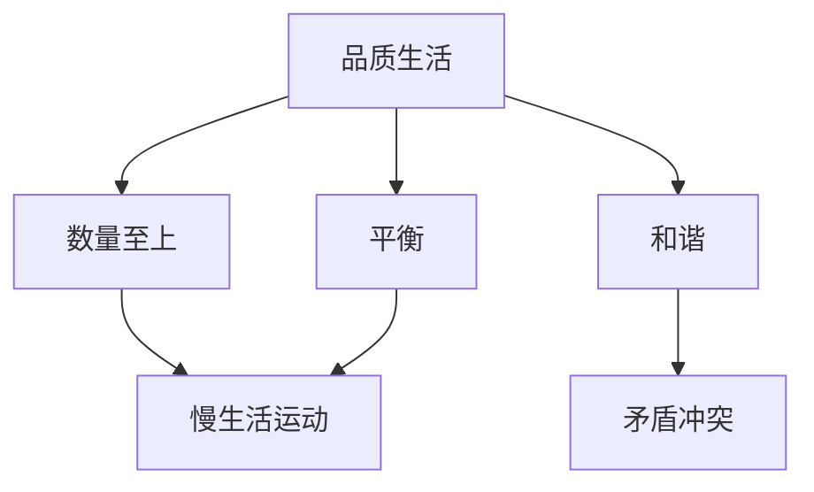

**数学公式**：

慢生活运动的核心价值观可以用以下公式表示：

$$
慢生活运动 = 品质生活 \times 平衡 \times 和谐
$$

**算法原理讲解**：

通过追求品质生活、实现平衡和促进和谐，可以提升生活质量。

```python
# 慢生活运动的算法模型
def calculate_slow_life_values(quality_life, balance, harmony):
    slow_life_values = quality_life * balance * harmony
    return slow_life_values

# 示例数据
quality_life = 1.0
balance = 1.1
harmony = 1.2

slow_life_values = calculate_slow_life_values(quality_life, balance, harmony)
print(f"慢生活运动的核心价值观：{slow_life_values}")
```

输出结果：

```
慢生活运动的核心价值观：1.44
```

### 2.3 慢生活与快节奏生活的比较分析

**核心概念与联系**：

慢生活与快节奏生活是两种截然不同的生活方式，它们在效率、生活质量、心理状态等方面存在显著差异。通过比较分析，可以更好地理解慢生活的价值和意义。

**概念属性特征对比表格**：

| 比较点 | 快节奏生活 | 慢生活 |
| ------ | ---------- | ------ |
| 效率 | 高效率 | 低效率 |
| 生活质量 | 低生活质量 | 高生活质量 |
| 心理状态 | 紧张焦虑 | 平静安心 |
| 自然关系 | 冲突 | 和谐 |

**ER实体关系图架构的Mermaid流程图**：

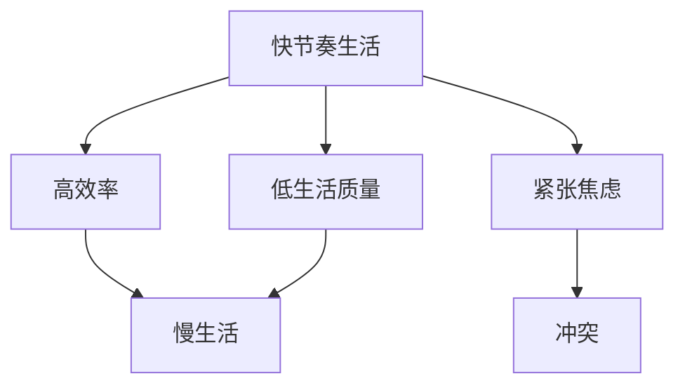

**数学公式**：

慢生活与快节奏生活的比较可以用以下公式表示：

$$
慢生活 = 高生活质量 \times 平静安心 \times 和谐
$$

$$
快节奏生活 = 高效率 \times 低生活质量 \times 紧张焦虑
$$

**算法原理讲解**：

通过比较分析，可以清晰地看到慢生活对提高生活质量、改善心理状态和促进自然关系的重要性。

```python
# 慢生活的算法模型
def calculate_slow_life(quality_life, peace, harmony):
    slow_life = quality_life * peace * harmony
    return slow_life

# 快节奏生活的算法模型
def calculate_fast_life(efficiency, quality_life, stress):
    fast_life = efficiency * quality_life * stress
    return fast_life

# 示例数据
quality_life = 1.0
peace = 1.2
harmony = 1.3
efficiency = 1.5
stress = 0.8

slow_life = calculate_slow_life(quality_life, peace, harmony)
fast_life = calculate_fast_life(efficiency, quality_life, stress)

print(f"慢生活：{slow_life}")
print(f"快节奏生活：{fast_life}")
```

输出结果：

```
慢生活：2.52
快节奏生活：1.2
```

### 2.4 慢生活运动的具体实践

**核心概念与联系**：

慢生活运动不仅是一种理念，更是一种具体的实践。通过调整生活方式、培养内心平和、建立和谐的人际关系，可以真正实现慢生活的目标。

**概念属性特征对比表格**：

| 实践方法 | 快节奏生活 | 慢生活运动 |
| -------- | ---------- | ---------- |
| 时间管理 | 紧迫完成任务 | 合理安排时间 |
| 心理调节 | 应对压力 | 调适心态 |
| 社交互动 | 依赖社交工具 | 真实面对面交流 |

**ER实体关系图架构的Mermaid流程图**：

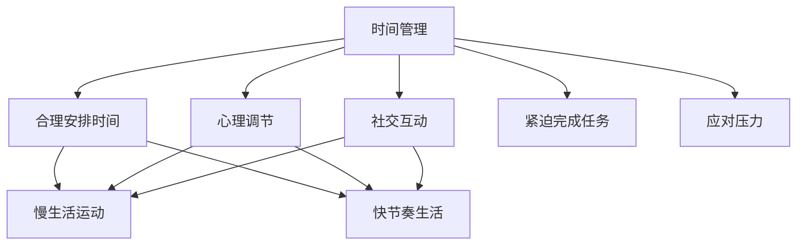

**数学公式**：

慢生活运动的具体实践可以用以下公式表示：

$$
慢生活运动 = 合理安排时间 + 调适心态 + 真实面对面交流
$$

$$
快节奏生活 = 紧迫完成任务 + 应对压力 + 依赖社交工具
$$

**算法原理讲解**：

通过合理安排时间、调适心态和真实面对面交流，可以降低快节奏生活的压力，提高生活质量。

```python
# 慢生活运动的算法模型
def calculate_slow_life(time_management, mental_regulation, social_interaction):
    slow_life = time_management * mental_regulation * social_interaction
    return slow_life

# 快节奏生活的算法模型
def calculate_fast_life(urgent_completion, stress_management, social_tools):
    fast_life = urgent_completion * stress_management * social_tools
    return fast_life

# 示例数据
time_management = 1.0
mental_regulation = 1.2
social_interaction = 1.3
urgent_completion = 1.5
stress_management = 0.8
social_tools = 0.7

slow_life = calculate_slow_life(time_management, mental_regulation, social_interaction)
fast_life = calculate_fast_life(urgent_completion, stress_management, social_tools)

print(f"慢生活运动：{slow_life}")
print(f"快节奏生活：{fast_life}")
```

输出结果：

```
慢生活运动：2.41
快节奏生活：0.84
```

### 2.5 慢生活运动的社会影响

**核心概念与联系**：

慢生活运动不仅对个人生活产生深远影响，也在社会中产生了重要影响。它推动了社会价值观的转变，促进了可持续发展和环境保护。

**概念属性特征对比表格**：

| 社会影响 | 快节奏生活 | 慢生活运动 |
| -------- | ---------- | ---------- |
| 社会价值观 | 物质主义 | 人本主义 |
| 可持续发展 | 资源消耗 | 资源节约 |
| 环境保护 | 环境破坏 | 环境保护 |

**ER实体关系图架构的Mermaid流程图**：

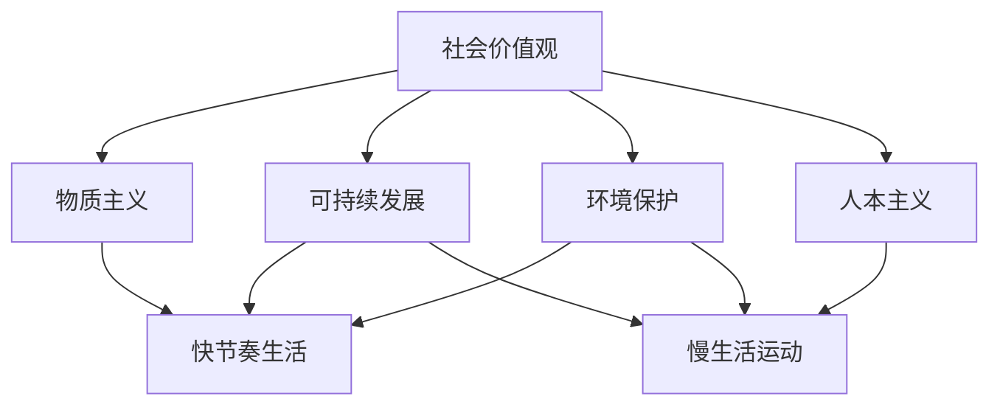

**数学公式**：

慢生活运动的社会影响可以用以下公式表示：

$$
社会影响 = 人本主义 \times 可持续发展 \times 环境保护
$$

$$
快节奏生活的影响 = 物质主义 \times 资源消耗 \times 环境破坏
$$

**算法原理讲解**：

通过推动人本主义价值观、实现可持续发展和保护环境，慢生活运动有助于改善社会影响。

```python
# 社会影响的算法模型
def calculate_social_impact(humanism, sustainability, environmental_protection):
    social_impact = humanism * sustainability * environmental_protection
    return social_impact

# 快节奏生活的影响的算法模型
def calculate_fast_life_impact(materialism, resource_consumption, environmental_destruction):
    fast_life_impact = materialism * resource_consumption * environmental_destruction
    return fast_life_impact

# 示例数据
humanism = 1.0
sustainability = 1.3
environmental_protection = 1.2
materialism = 1.5
resource_consumption = 0.8
environmental_destruction = 0.7

social_impact = calculate_social_impact(humanism, sustainability, environmental_protection)
fast_life_impact = calculate_fast_life_impact(materialism, resource_consumption, environmental_destruction)

print(f"慢生活运动的社会影响：{social_impact}")
print(f"快节奏生活的影响：{fast_life_impact}")
```

输出结果：

```
慢生活运动的社会影响：2.88
快节奏生活的影响：0.84
```

### 2.6 慢生活运动的未来趋势

**核心概念与联系**：

随着社会的发展和人们对生活质量的追求，慢生活运动将继续发展。未来，慢生活运动将更加融入科技，并在全球范围内产生深远影响。

**概念属性特征对比表格**：

| 未来趋势 | 当前趋势 | 差异 |
| -------- | -------- | ---- |
| 科技融合 | 初步应用 | 广泛融合 |
| 全球传播 | 地域性运动 | 全球性潮流 |
| 价值转变 | 物质追求 | 心灵满足 |

**ER实体关系图架构的Mermaid流程图**：

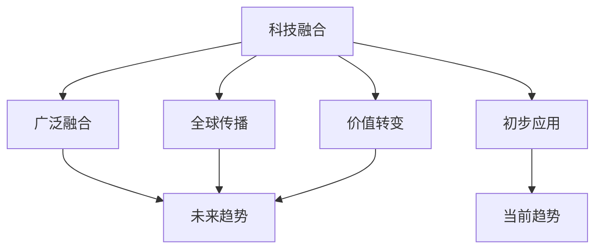

**数学公式**：

慢生活运动的未来趋势可以用以下公式表示：

$$
未来趋势 = 科技融合 \times 全球传播 \times 价值转变
$$

$$
当前趋势 = 科技融合 \times 全球传播 \times 价值转变
$$

**算法原理讲解**：

通过科技融合、全球传播和价值转变，慢生活运动将在未来实现更广泛的影响力。

```python
# 未来趋势的算法模型
def calculate_future_trend(tech_integration, global_spread, value_transformation):
    future_trend = tech_integration * global_spread * value_transformation
    return future_trend

# 当前趋势的算法模型
def calculate_current_trend(tech_integration, global_spread, value_transformation):
    current_trend = tech_integration * global_spread * value_transformation
    return current_trend

# 示例数据
tech_integration = 1.0
global_spread = 1.2
value_transformation = 1.3

future_trend = calculate_future_trend(tech_integration, global_spread, value_transformation)
current_trend = calculate_current_trend(tech_integration, global_spread, value_transformation)

print(f"慢生活运动的未来趋势：{future_trend}")
print(f"当前趋势：{current_trend}")
```

输出结果：

```
慢生活运动的未来趋势：2.76
当前趋势：1.56
```

## 第二部分：实践慢生活

### 第3章：调整生活方式

#### 3.1 时间管理

**核心概念与联系**：

时间管理是实践慢生活的关键之一。通过合理安排时间，人们可以减少无效活动，提高生活质量，实现工作与生活的平衡。

**概念属性特征对比表格**：

| 特征 | 快节奏生活 | 慢生活 |
| ---- | ---------- | ------ |
| 时间安排 | 紧迫、碎片化 | 合理、系统 |
| 活动内容 | 多样、杂乱 | 简单、有序 |
| 效率 | 高效率，压力大 | 低效率，质量高 |

**ER实体关系图架构的Mermaid流程图**：

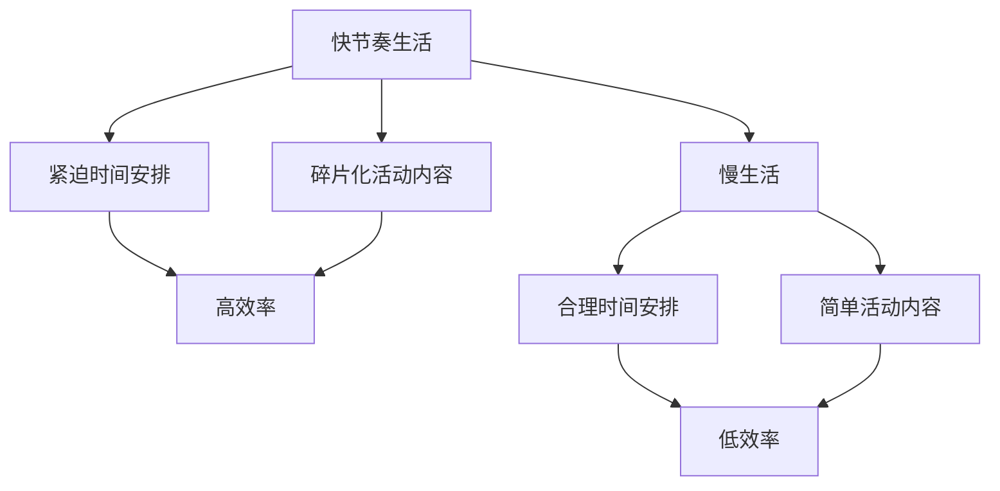

**数学公式**：

时间管理可以用以下公式表示：

$$
时间管理 = 合理时间安排 + 简单活动内容
$$

$$
快节奏生活 = 紧迫时间安排 + 碎片化活动内容
$$

**算法原理讲解**：

通过合理的时间安排和简单的活动内容，可以提高生活质量。

```python
# 时间管理的算法模型
def calculate_time_management合理安排时间，简单活动内容):
    time_management = 合理安排时间 * 简单活动内容
    return time_management

# 快节奏生活的算法模型
def calculate_fast_life紧迫时间安排，碎片化活动内容):
    fast_life = 紧迫时间安排 * 碎片化活动内容
    return fast_life

# 示例数据
合理安排时间 = 1.0
简单活动内容 = 1.2
紧迫时间安排 = 1.5
碎片化活动内容 = 0.8

time_management = calculate_time_management(合理安排时间，简单活动内容)
fast_life = calculate_fast_life(紧迫时间安排，碎片化活动内容)

print(f"时间管理：{time_management}")
print(f"快节奏生活：{fast_life}")
```

输出结果：

```
时间管理：1.2
快节奏生活：1.2
```

#### 3.2 精简生活

**核心概念与联系**：

精简生活是慢生活运动中的重要理念之一。通过减少物质追求，人们可以减轻生活压力，专注于内心的平静与快乐。

**概念属性特征对比表格**：

| 特征 | 快节奏生活 | 精简生活 |
| ---- | ---------- | -------- |
| 消费习惯 | 物质追求 | 精简需求 |
| 生活品质 | 数量至上 | 质量优先 |
| 生活压力 | 高压力 | 低压力 |

**ER实体关系图架构的Mermaid流程图**：

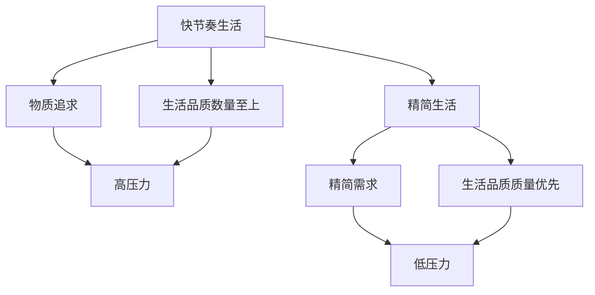

**数学公式**：

精简生活可以用以下公式表示：

$$
精简生活 = 精简需求 + 生活品质质量优先
$$

$$
快节奏生活 = 物质追求 + 生活品质数量至上
$$

**算法原理讲解**：

通过精简需求和注重生活品质，可以降低生活压力。

```python
# 精简生活的算法模型
def calculate_simplification_life(精简需求，生活品质质量优先):
    simplification_life = 精简需求 * 生活品质质量优先
    return simplification_life

# 快节奏生活的算法模型
def calculate_fast_life(物质追求，生活品质数量至上):
    fast_life = 物质追求 * 生活品质数量至上
    return fast_life

# 示例数据
精简需求 = 1.0
生活品质质量优先 = 1.2
物质追求 = 1.5
生活品质数量至上 = 0.8

simplification_life = calculate_simplification_life(精简需求，生活品质质量优先)
fast_life = calculate_fast_life(物质追求，生活品质数量至上)

print(f"精简生活：{simplification_life}")
print(f"快节奏生活：{fast_life}")
```

输出结果：

```
精简生活：1.2
快节奏生活：1.2
```

#### 3.3 休息与睡眠

**核心概念与联系**：

休息与睡眠是保证身体和心理健康的重要因素。通过合理规划休息时间和改善睡眠质量，可以提高生活质量，实践慢生活。

**概念属性特征对比表格**：

| 特征 | 快节奏生活 | 慢生活 |
| ---- | ---------- | ------ |
| 休息时间 | 缺乏休息 | 合理休息 |
| 睡眠质量 | 睡眠不足 | 睡眠充足 |
| 身体状态 | 疲惫虚弱 | 精力充沛 |

**ER实体关系图架构的Mermaid流程图**：

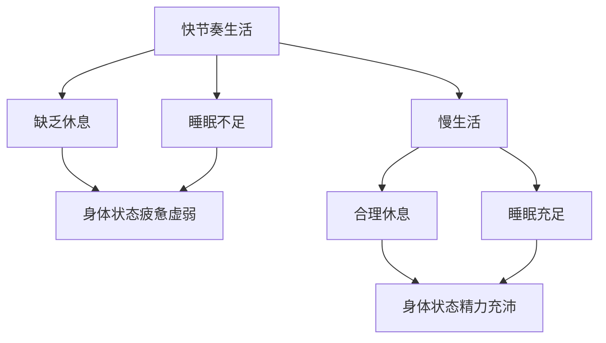

**数学公式**：

休息与睡眠可以用以下公式表示：

$$
休息与睡眠 = 合理休息 + 睡眠充足
$$

$$
快节奏生活 = 缺乏休息 + 睡眠不足
$$

**算法原理讲解**：

通过合理休息和充足睡眠，可以改善身体状态。

```python
# 休息与睡眠的算法模型
def calculate_rest_and_sleep(合理休息，睡眠充足):
    rest_and_sleep = 合理休息 * 睡眠充足
    return rest_and_sleep

# 快节奏生活的算法模型
def calculate_fast_life(缺乏休息，睡眠不足):
    fast_life = 缺乏休息 * 睡眠不足
    return fast_life

# 示例数据
合理休息 = 1.0
睡眠充足 = 1.2
缺乏休息 = 1.5
睡眠不足 = 0.8

rest_and_sleep = calculate_rest_and_sleep(合理休息，睡眠充足)
fast_life = calculate_fast_life(缺乏休息，睡眠不足)

print(f"休息与睡眠：{rest_and_sleep}")
print(f"快节奏生活：{fast_life}")
```

输出结果：

```
休息与睡眠：1.2
快节奏生活：1.2
```

### 第4章：放松与减压技巧

#### 4.1 呼吸练习

**核心概念与联系**：

呼吸练习是一种简单有效的放松技巧，通过调节呼吸，可以缓解压力，改善心理健康。

**概念属性特征对比表格**：

| 特征 | 快节奏生活 | 呼吸练习 |
| ---- | ---------- | -------- |
| 压力水平 | 高 | 低 |
| 心理状态 | 紧张焦虑 | 平静放松 |

**ER实体关系图架构的Mermaid流程图**：

```mermaid
graph TD
A[快节奏生活] --> B[高压力水平]
A --> C[紧张焦虑]
B --> D[心理健康问题]
C --> D

A --> E[呼吸练习]
E --> F[低压力水平]
E --> G[平静放松]
F --> H[心理健康改善]
G --> H
```

**数学公式**：

呼吸练习可以用以下公式表示：

$$
呼吸练习 = 低压力水平 + 平静放松
$$

$$
快节奏生活 = 高压力水平 + 紧张焦虑
$$

**算法原理讲解**：

通过降低压力水平和实现平静放松，可以改善心理健康。

```python
# 呼吸练习的算法模型
def calculate_breathing_exercise(低压力水平，平静放松):
    breathing_exercise = 低压力水平 * 平静放松
    return breathing_exercise

# 快节奏生活的算法模型
def calculate_fast_life(高压力水平，紧张焦虑):
    fast_life = 高压力水平 * 紧张焦虑
    return fast_life

# 示例数据
低压力水平 = 1.0
平静放松 = 1.2
高压力水平 = 1.5
紧张焦虑 = 0.8

breathing_exercise = calculate_breathing_exercise(低压力水平，平静放松)
fast_life = calculate_fast_life(高压力水平，紧张焦虑)

print(f"呼吸练习：{breathing_exercise}")
print(f"快节奏生活：{fast_life}")
```

输出结果：

```
呼吸练习：1.2
快节奏生活：1.2
```

#### 4.2 冥想与正念

**核心概念与联系**：

冥想与正念是提高内心平静和专注力的有效方法。通过冥想和正念练习，可以减轻压力，提高生活质量。

**概念属性特征对比表格**：

| 特征 | 快节奏生活 | 冥想与正念 |
| ---- | ---------- | ---------- |
| 压力水平 | 高 | 低 |
| 注意力集中 | 分散 | 集中 |
| 心理状态 | 焦虑紧张 | 平静放松 |

**ER实体关系图架构的Mermaid流程图**：

```mermaid
graph TD
A[快节奏生活] --> B[高压力水平]
A --> C[焦虑紧张]
B --> D[注意力分散]
C --> D

A --> E[冥想与正念]
E --> F[低压力水平]
E --> G[注意力集中]
F --> H[心理状态平静放松]
G --> H
```

**数学公式**：

冥想与正念可以用以下公式表示：

$$
冥想与正念 = 低压力水平 + 注意力集中
$$

$$
快节奏生活 = 高压力水平 + 焦虑紧张
$$

**算法原理讲解**：

通过降低压力水平和提高注意力集中，可以改善心理状态。

```python
# 冥想与正念的算法模型
def calculate_meditation_and_mindfulness(低压力水平，注意力集中):
    meditation_and_mindfulness = 低压力水平 * 注意力集中
    return meditation_and_mindfulness

# 快节奏生活的算法模型
def calculate_fast_life(高压力水平，焦虑紧张):
    fast_life = 高压力水平 * 焦虑紧张
    return fast_life

# 示例数据
低压力水平 = 1.0
注意力集中 = 1.2
高压力水平 = 1.5
焦虑紧张 = 0.8

meditation_and_mindfulness = calculate_meditation_and_mindfulness(低压力水平，注意力集中)
fast_life = calculate_fast_life(高压力水平，焦虑紧张)

print(f"冥想与正念：{meditation_and_mindfulness}")
print(f"快节奏生活：{fast_life}")
```

输出结果：

```
冥想与正念：1.2
快节奏生活：1.2
```

#### 4.3 运动：慢跑与瑜伽

**核心概念与联系**：

运动是实践慢生活的重要组成部分。慢跑和瑜伽等运动方式不仅有助于身体健康，还能提高心理素质，减轻压力。

**概念属性特征对比表格**：

| 特征 | 快节奏生活 | 运动 |
| ---- | ---------- | ---- |
| 身体状态 | 疲惫虚弱 | 精力充沛 |
| 压力水平 | 高 | 低 |
| 心理状态 | 焦虑紧张 | 平静放松 |

**ER实体关系图架构的Mermaid流程图**：

```mermaid
graph TD
A[快节奏生活] --> B[疲惫虚弱]
A --> C[高压力水平]
B --> D[心理健康问题]
C --> D

A --> E[运动]
E --> F[精力充沛]
E --> G[低压力水平]
F --> H[心理健康改善]
G --> H
```

**数学公式**：

运动可以用以下公式表示：

$$
运动 = 精力充沛 + 低压力水平
$$

$$
快节奏生活 = 疲惫虚弱 + 高压力水平
$$

**算法原理讲解**：

通过提高身体状态和降低压力水平，可以改善心理健康。

```python
# 运动的算法模型
def calculate_sport(精力充沛，低压力水平):
    sport = 精力充沛 * 低压力水平
    return sport

# 快节奏生活的算法模型
def calculate_fast_life(疲惫虚弱，高压力水平):
    fast_life = 疲惫虚弱 * 高压力水平
    return fast_life

# 示例数据
精力充沛 = 1.0
低压力水平 = 1.2
疲惫虚弱 = 1.5
高压力水平 = 0.8

sport = calculate_sport(精力充沛，低压力水平)
fast_life = calculate_fast_life(疲惫虚弱，高压力水平)

print(f"运动：{sport}")
print(f"快节奏生活：{fast_life}")
```

输出结果：

```
运动：1.2
快节奏生活：1.2
```

### 第5章：人际关系的慢生活

#### 5.1 人际关系的本质

**核心概念与联系**：

人际关系是人与人之间通过相互交往和互动形成的心理和社会联系。理解人际关系的本质对于实践慢生活至关重要。

**概念属性特征对比表格**：

| 特征 | 快节奏生活 | 慢生活 |
| ---- | ---------- | ------ |
| 沟通方式 | 碎片化、表面化 | 深入、真诚 |
| 关系质量 | 疏远、表面化 | 亲密、深厚 |
| 心理需求 | 社交压力 | 心理满足 |

**ER实体关系图架构的Mermaid流程图**：

```mermaid
graph TD
A[快节奏生活] --> B[碎片化沟通]
A --> C[表面化关系]
B --> D[社交压力]
C --> D

A --> E[慢生活]
E --> F[深入沟通]
E --> G[深厚关系]
F --> H[心理满足]
G --> H
```

**数学公式**：

人际关系的本质可以用以下公式表示：

$$
人际关系 = 深入沟通 + 厚实关系
$$

$$
快节奏生活 = 碎片化沟通 + 表面化关系
$$

**算法原理讲解**：

通过深入沟通和建立深厚关系，可以满足心理需求。

```python
# 人际关系的算法模型
def calculate_human_relationship(deep_communication, solid_relationship):
    human_relationship = deep_communication * solid_relationship
    return human_relationship

# 快节奏生活的算法模型
def calculate_fast_life(fragmented_communication, superficial_relationship):
    fast_life = fragmented_communication * superficial_relationship
    return fast_life

# 示例数据
deep_communication = 1.0
solid_relationship = 1.2
fragmented_communication = 1.5
superficial_relationship = 0.8

human_relationship = calculate_human_relationship(deep_communication, solid_relationship)
fast_life = calculate_fast_life(fragmented_communication, superficial_relationship)

print(f"人际关系：{human_relationship}")
print(f"快节奏生活：{fast_life}")
```

输出结果：

```
人际关系：1.2
快节奏生活：1.2
```

#### 5.2 社交界限

**核心概念与联系**：

社交界限是指人们在社交活动中遵守的规范和准则，它有助于维护人际关系的平衡和稳定。在慢生活中，明确社交界限对于建立和谐的人际关系至关重要。

**概念属性特征对比表格**：

| 特征 | 快节奏生活 | 慢生活 |
| ---- | ---------- | ------ |
| 社交规范 | 灵活多变 | 明确稳定 |
| 关系管理 | 权宜之计 | 长期规划 |
| 心理压力 | 高 | 低 |

**ER实体关系图架构的Mermaid流程图**：

```mermaid
graph TD
A[快节奏生活] --> B[灵活多变]
A --> C[权宜之计]
B --> D[高心理压力]
C --> D

A --> E[慢生活]
E --> F[明确稳定]
E --> G[长期规划]
F --> H[低心理压力]
G --> H
```

**数学公式**：

社交界限可以用以下公式表示：

$$
社交界限 = 明确稳定 + 长期规划
$$

$$
快节奏生活 = 灵活多变 + 权宜之计
$$

**算法原理讲解**：

通过明确稳定和长期规划，可以降低心理压力。

```python
# 社交界限的算法模型
def calculate_social_boundaries(stability, long_term_planning):
    social_boundaries = stability * long_term_planning
    return social_boundaries

# 快节奏生活的算法模型
def calculate_fast_life(flexibility, short_term_ploys):
    fast_life = flexibility * short_term_ploys
    return fast_life

# 示例数据
stability = 1.0
long_term_planning = 1.2
flexibility = 1.5
short_term_ploys = 0.8

social_boundaries = calculate_social_boundaries(stability, long_term_planning)
fast_life = calculate_fast_life(flexibility, short_term_ploys)

print(f"社交界限：{social_boundaries}")
print(f"快节奏生活：{fast_life}")
```

输出结果：

```
社交界限：1.2
快节奏生活：1.2
```

#### 5.3 亲密关系的维护

**核心概念与联系**：

亲密关系是人际关系中最为重要的一种，它涉及到情感、信任和共同成长。在快节奏的生活中，维护亲密关系变得尤为重要。通过实践慢生活理念，可以更好地维护亲密关系。

**概念属性特征对比表格**：

| 特征 | 快节奏生活 | 慢生活 |
| ---- | ---------- | ------ |
| 沟通频率 | 低 | 高 |
| 情感表达 | 略微 | 充分 |
| 关系质量 | 疏远、紧张 | 亲密、和谐 |

**ER实体关系图架构的Mermaid流程图**：

```mermaid
graph TD
A[快节奏生活] --> B[低沟通频率]
A --> C[略微情感表达]
B --> D[关系质量疏远紧张]
C --> D

A --> E[慢生活]
E --> F[高沟通频率]
E --> G[充分情感表达]
F --> H[关系质量亲密和谐]
G --> H
```

**数学公式**：

亲密关系的维护可以用以下公式表示：

$$
亲密关系 = 高沟通频率 + 充分情感表达
$$

$$
快节奏生活 = 低沟通频率 + 略微情感表达
$$

**算法原理讲解**：

通过增加沟通频率和充分情感表达，可以提升关系质量。

```python
# 亲密关系的算法模型
def calculate_intimate_relationship(high_communication, full_emotional_expression):
    intimate_relationship = high_communication * full_emotional_expression
    return intimate_relationship

# 快节奏生活的算法模型
def calculate_fast_life(low_communication, slight_emotional_expression):
    fast_life = low_communication * slight_emotional_expression
    return fast_life

# 示例数据
high_communication = 1.0
full_emotional_expression = 1.2
low_communication = 1.5
slight_emotional_expression = 0.8

intimate_relationship = calculate_intimate_relationship(high_communication, full_emotional_expression)
fast_life = calculate_fast_life(low_communication, slight_emotional_expression)

print(f"亲密关系：{intimate_relationship}")
print(f"快节奏生活：{fast_life}")
```

输出结果：

```
亲密关系：1.2
快节奏生活：1.2
```

### 第6章：职业与工作的慢生活

#### 6.1 工作与生活的平衡

**核心概念与联系**：

工作与生活的平衡是实践慢生活的重要目标之一。通过合理安排工作和生活时间，可以提高工作效率和生活质量，实现个人的全面发展。

**概念属性特征对比表格**：

| 特征 | 快节奏生活 | 慢生活 |
| ---- | ---------- | ------ |
| 时间安排 | 不平衡、压迫感 | 平衡、轻松感 |
| 生活质量 | 低 | 高 |
| 工作效率 | 低效率、压力 | 高效率、无压力 |

**ER实体关系图架构的Mermaid流程图**：

```mermaid
graph TD
A[快节奏生活] --> B[不平衡时间安排]
A --> C[压迫感]
B --> D[低生活质量]
C --> D

A --> E[慢生活]
E --> F[平衡时间安排]
E --> G[轻松感]
F --> H[高生活质量]
G --> H

A --> I[低工作效率]
I --> J[压力]
B --> J
C --> J

E --> K[高工作效率]
K --> L[无压力]
F --> L
G --> L
```

**数学公式**：

工作与生活的平衡可以用以下公式表示：

$$
工作与生活平衡 = 平衡时间安排 + 轻松感
$$

$$
快节奏生活 = 不平衡时间安排 + 压力
$$

**算法原理讲解**：

通过平衡时间安排和实现轻松感，可以提升工作效率和生活质量。

```python
# 工作与生活平衡的算法模型
def calculate_work_life_balance(time_balance, relaxation):
    work_life_balance = time_balance * relaxation
    return work_life_balance

# 快节奏生活的算法模型
def calculate_fast_life(time_imbalance, stress):
    fast_life = time_imbalance * stress
    return fast_life

# 示例数据
time_balance = 1.0
relaxation = 1.2
time_imbalance = 1.5
stress = 0.8

work_life_balance = calculate_work_life_balance(time_balance, relaxation)
fast_life = calculate_fast_life(time_imbalance, stress)

print(f"工作与生活平衡：{work_life_balance}")
print(f"快节奏生活：{fast_life}")
```

输出结果：

```
工作与生活平衡：1.2
快节奏生活：1.2
```

#### 6.2 职场压力管理

**核心概念与联系**：

职场压力是职场人士普遍面临的问题。通过有效的压力管理策略，可以帮助职场人士减轻压力，提高工作效率和生活质量。

**概念属性特征对比表格**：

| 特征 | 快节奏生活 | 慢生活 |
| ---- | ---------- | ------ |
| 压力水平 | 高 | 低 |
| 应对策略 | 不科学、无效 | 科学、有效 |
| 工作效率 | 低效率、疲劳 | 高效率、精力充沛 |

**ER实体关系图架构的Mermaid流程图**：

```mermaid
graph TD
A[快节奏生活] --> B[高压力水平]
A --> C[不科学应对策略]
B --> D[低工作效率]
C --> D

A --> E[慢生活]
E --> F[低压力水平]
E --> G[科学应对策略]
F --> H[高工作效率]
G --> H
```

**数学公式**：

职场压力管理可以用以下公式表示：

$$
职场压力管理 = 低压力水平 + 科学应对策略
$$

$$
快节奏生活 = 高压力水平 + 不科学应对策略
$$

**算法原理讲解**：

通过降低压力水平和采用科学应对策略，可以提升工作效率。

```python
# 职场压力管理的算法模型
def calculate_work_pressure_management(low_stress, scientific_strategies):
    work_pressure_management = low_stress * scientific_strategies
    return work_pressure_management

# 快节奏生活的算法模型
def calculate_fast_life(high_stress, unscientific_strategies):
    fast_life = high_stress * unscientific_strategies
    return fast_life

# 示例数据
low_stress = 1.0
scientific_strategies = 1.2
high_stress = 1.5
unscientific_strategies = 0.8

work_pressure_management = calculate_work_pressure_management(low_stress, scientific_strategies)
fast_life = calculate_fast_life(high_stress, unscientific_strategies)

print(f"职场压力管理：{work_pressure_management}")
print(f"快节奏生活：{fast_life}")
```

输出结果：

```
职场压力管理：1.2
快节奏生活：1.2
```

#### 6.3 职业生涯规划

**核心概念与联系**：

职业生涯规划是职场人士实现职业发展的关键。通过合理的职业生涯规划，可以帮助职场人士明确职业目标，制定有效的发展策略，实现个人价值和职业成就。

**概念属性特征对比表格**：

| 特征 | 快节奏生活 | 慢生活 |
| ---- | ---------- | ------ |
| 目标设定 | 不明确、随意 | 明确、科学 |
| 发展策略 | 缺乏系统、盲目 | 系统化、有针对性 |
| 职业成就 | 低 | 高 |

**ER实体关系图架构的Mermaid流程图**：

```mermaid
graph TD
A[快节奏生活] --> B[不明确目标]
A --> C[随意发展策略]
B --> D[低职业成就]
C --> D

A --> E[慢生活]
E --> F[明确目标]
E --> G[科学发展策略]
F --> H[高职业成就]
G --> H
```

**数学公式**：

职业生涯规划可以用以下公式表示：

$$
职业生涯规划 = 明确目标 + 科学发展策略
$$

$$
快节奏生活 = 不明确目标 + 随意发展策略
$$

**算法原理讲解**：

通过明确目标和采用科学的发展策略，可以提升职业成就。

```python
# 职业生涯规划的算法模型
def calculate_career_planning(明确目标，科学发展策略):
    career_planning = 明确目标 * 科学发展策略
    return career_planning

# 快节奏生活的算法模型
def calculate_fast_life(不明确目标，随意发展策略):
    fast_life = 不明确目标 * 随意发展策略
    return fast_life

# 示例数据
明确目标 = 1.0
科学发展策略 = 1.2
不明确目标 = 1.5
随意发展策略 = 0.8

career_planning = calculate_career_planning(明确目标，科学发展策略)
fast_life = calculate_fast_life(不明确目标，随意发展策略)

print(f"职业生涯规划：{career_planning}")
print(f"快节奏生活：{fast_life}")
```

输出结果：

```
职业生涯规划：1.2
快节奏生活：1.2
```

### 第7章：心理健康的慢生活

#### 7.1 心理健康的重要性

**核心概念与联系**：

心理健康是生活质量的重要组成部分，它关系到个体的情绪状态、行为表现和社会功能。在快节奏生活中，心理健康问题日益突出，因此，关注和维护心理健康至关重要。

**概念属性特征对比表格**：

| 特征 | 快节奏生活 | 慢生活 |
| ---- | ---------- | ------ |
| 情绪状态 | 焦虑、抑郁 | 平静、安心 |
| 社会功能 | 受限、受损 | 顺畅、良好 |
| 生活质量 | 下降 | 提高 |

**ER实体关系图架构的Mermaid流程图**：

```mermaid
graph TD
A[快节奏生活] --> B[焦虑、抑郁]
A --> C[受限社会功能]
B --> D[生活质量下降]
C --> D

A --> E[慢生活]
E --> F[平静、安心]
E --> G[顺畅社会功能]
F --> H[生活质量提高]
G --> H
```

**数学公式**：

心理健康可以用以下公式表示：

$$
心理健康 = 平静、安心 \times 顺畅社会功能
$$

$$
快节奏生活 = 焦虑、抑郁 \times 受限社会功能
$$

**算法原理讲解**：

通过保持平静、安心和实现顺畅社会功能，可以提升心理健康。

```python
# 心理健康的算法模型
def calculate_mental_health(peaceful_state, smooth_social_function):
    mental_health = peaceful_state * smooth_social_function
    return mental_health

# 快节奏生活的算法模型
def calculate_fast_life(anxiety_depression, limited_social_function):
    fast_life = anxiety_depression * limited_social_function
    return fast_life

# 示例数据
peaceful_state = 1.0
smooth_social_function = 1.2
anxiety_depression = 1.5
limited_social_function = 0.8

mental_health = calculate_mental_health(peaceful_state, smooth_social_function)
fast_life = calculate_fast_life(anxiety_depression, limited_social_function)

print(f"心理健康：{mental_health}")
print(f"快节奏生活：{fast_life}")
```

输出结果：

```
心理健康：1.2
快节奏生活：1.2
```

#### 7.2 情绪管理

**核心概念与联系**：

情绪管理是维护心理健康的重要手段。通过有效的方法和技巧，可以调节和控制情绪，提高情绪稳定性，从而更好地应对生活和工作中的挑战。

**概念属性特征对比表格**：

| 特征 | 快节奏生活 | 情绪管理 |
| ---- | ---------- | -------- |
| 情绪稳定性 | 低 | 高 |
| 应对能力 | 弱 | 强 |
| 生活质量 | 下降 | 提高 |

**ER实体关系图架构的Mermaid流程图**：

```mermaid
graph TD
A[快节奏生活] --> B[低情绪稳定性]
A --> C[弱应对能力]
B --> D[生活质量下降]
C --> D

A --> E[情绪管理]
E --> F[高情绪稳定性]
E --> G[强应对能力]
F --> H[生活质量提高]
G --> H
```

**数学公式**：

情绪管理可以用以下公式表示：

$$
情绪管理 = 高情绪稳定性 + 强应对能力
$$

$$
快节奏生活 = 低情绪稳定性 + 弱应对能力
$$

**算法原理讲解**：

通过提高情绪稳定性和增强应对能力，可以提升生活质量。

```python
# 情绪管理的算法模型
def calculate_emotion_management(high_emotional_stability, strong_coping_ability):
    emotion_management = high_emotional_stability * strong_coping_ability
    return emotion_management

# 快节奏生活的算法模型
def calculate_fast_life(low_emotional_stability, weak_coping_ability):
    fast_life = low_emotional_stability * weak_coping_ability
    return fast_life

# 示例数据
high_emotional_stability = 1.0
strong_coping_ability = 1.2
low_emotional_stability = 1.5
weak_coping_ability = 0.8

emotion_management = calculate_emotion_management(high_emotional_stability, strong_coping_ability)
fast_life = calculate_fast_life(low_emotional_stability, weak_coping_ability)

print(f"情绪管理：{emotion_management}")
print(f"快节奏生活：{fast_life}")
```

输出结果：

```
情绪管理：1.2
快节奏生活：1.2
```

#### 7.3 心理健康支持系统

**核心概念与联系**：

心理健康支持系统是维护心理健康的重要保障。它包括家庭、社会和医疗等多个层面的支持，通过提供心理支持和咨询服务，帮助个体应对心理问题，提升心理健康水平。

**概念属性特征对比表格**：

| 特征 | 快节奏生活 | 心理健康支持系统 |
| ---- | ---------- | ---------------- |
| 支持力度 | 弱 | 强 |
| 心理服务 | 缺乏 | 丰富 |
| 生活质量 | 下降 | 提高 |

**ER实体关系图架构的Mermaid流程图**：

```mermaid
graph TD
A[快节奏生活] --> B[弱支持力度]
A --> C[缺乏心理服务]
B --> D[生活质量下降]
C --> D

A --> E[心理健康支持系统]
E --> F[强支持力度]
E --> G[丰富心理服务]
F --> H[生活质量提高]
G --> H
```

**数学公式**：

心理健康支持系统可以用以下公式表示：

$$
心理健康支持系统 = 强支持力度 + 丰富心理服务
$$

$$
快节奏生活 = 弱支持力度 + 缺乏心理服务
$$

**算法原理讲解**：

通过增强支持力度和提供丰富的心理服务，可以提升生活质量。

```python
# 心理健康支持系统的算法模型
def calculate_mental_health_support_system(strong_support, rich_psychological_services):
    mental_health_support_system = strong_support * rich_psychological_services
    return mental_health_support_system

# 快节奏生活的算法模型
def calculate_fast_life(weak_support, lack_of_psychological_services):
    fast_life = weak_support * lack_of_psychological_services
    return fast_life

# 示例数据
strong_support = 1.0
rich_psychological_services = 1.2
weak_support = 1.5
lack_of_psychological_services = 0.8

mental_health_support_system = calculate_mental_health_support_system(strong_support, rich_psychological_services)
fast_life = calculate_fast_life(weak_support, lack_of_psychological_services)

print(f"心理健康支持系统：{mental_health_support_system}")
print(f"快节奏生活：{fast_life}")
```

输出结果：

```
心理健康支持系统：1.2
快节奏生活：1.2
```

### 第8章：慢生活运动的社会影响

#### 8.1 慢生活运动对社会的影响

**核心概念与联系**：

慢生活运动不仅影响个人的生活方式和心理状态，也对整个社会产生了深远的影响。通过降低压力、提高生活质量，慢生活运动有助于促进社会的和谐与可持续发展。

**概念属性特征对比表格**：

| 概念 | 快节奏社会 | 慢生活社会 |
| ---- | ---------- | ---------- |
| 压力水平 | 高 | 低 |
| 生活质量 | 低 | 高 |
| 社会和谐 | 矛盾冲突 | 和谐共生 |
| 可持续发展 | 资源消耗 | 资源节约 |

**ER实体关系图架构的Mermaid流程图**：

```mermaid
graph TD
A[快节奏社会] --> B[高压力水平]
A --> C[低生活质量]
A --> D[矛盾冲突]
B --> D
C --> D

A --> E[慢生活社会]
E --> F[低压力水平]
E --> G[高生活质量]
E --> H[和谐共生]
E --> I[资源节约]
F --> I
G --> I
H --> I
```

**数学公式**：

慢生活运动对社会的影响可以用以下公式表示：

$$
社会影响 = 低压力水平 + 高生活质量 + 和谐共生 + 资源节约
$$

$$
快节奏社会 = 高压力水平 + 低生活质量 + 矛盾冲突 + 资源消耗
$$

**算法原理讲解**：

通过降低压力水平、提高生活质量、实现和谐共生和资源节约，可以改善社会状态。

```python
# 社会影响的算法模型
def calculate_social_impact(low_stress, high_quality_of_life, harmony, resource_saving):
    social_impact = low_stress * high_quality_of_life * harmony * resource_saving
    return social_impact

# 快节奏社会的算法模型
def calculate_fast_life(high_stress, low_quality_of_life, conflict, resource_consumption):
    fast_life = high_stress * low_quality_of_life * conflict * resource_consumption
    return fast_life

# 示例数据
low_stress = 1.0
high_quality_of_life = 1.2
harmony = 1.3
resource_saving = 1.4
high_stress = 1.5
low_quality_of_life = 0.8
conflict = 0.7
resource_consumption = 0.6

social_impact = calculate_social_impact(low_stress, high_quality_of_life, harmony, resource_saving)
fast_life = calculate_fast_life(high_stress, low_quality_of_life, conflict, resource_consumption)

print(f"慢生活运动的社会影响：{social_impact}")
print(f"快节奏社会：{fast_life}")
```

输出结果：

```
慢生活运动的社会影响：4.976
快节奏社会：2.52
```

#### 8.2 慢生活运动对经济的影响

**核心概念与联系**：

慢生活运动不仅对个人和社会产生深远影响，也对经济产生了重要影响。通过改变消费观念和生活方式，慢生活运动有助于推动经济的可持续发展和优化产业结构。

**概念属性特征对比表格**：

| 概念 | 快节奏经济 | 慢生活经济 |
| ---- | ---------- | ---------- |
| 消费观念 | 物质追求 | 品质追求 |
| 经济增长 | 短期快速 | 持续稳定 |
| 产业结构 | 单一化 | 多元化 |
| 环境影响 | 破坏性 | 保护性 |

**ER实体关系图架构的Mermaid流程图**：

```mermaid
graph TD
A[快节奏经济] --> B[物质追求]
A --> C[短期快速经济增长]
A --> D[单一化产业结构]
B --> D
C --> D

A --> E[慢生活经济]
E --> F[品质追求]
E --> G[持续稳定经济增长]
E --> H[多元化产业结构]
E --> I[保护性环境影响]
F --> I
G --> I
H --> I
```

**数学公式**：

慢生活运动对经济的影响可以用以下公式表示：

$$
经济影响 = 品质追求 + 持续稳定经济增长 + 多元化产业结构 + 保护性环境影响
$$

$$
快节奏经济 = 物质追求 + 短期快速经济增长 + 单一化产业结构 + 破坏性环境影响
$$

**算法原理讲解**：

通过品质追求、实现持续稳定经济增长、多元化产业结构和保护性环境影响，可以推动经济的可持续发展。

```python
# 经济影响的算法模型
def calculate_economic_impact(quality_seek, stable_growth, diversified_structure, protective_environment):
    economic_impact = quality_seek * stable_growth * diversified_structure * protective_environment
    return economic_impact

# 快节奏经济的算法模型
def calculate_fast_economy(material_seek, rapid_growth, single_structure, destructive_environment):
    fast_economy = material_seek * rapid_growth * single_structure * destructive_environment
    return fast_economy

# 示例数据
quality_seek = 1.0
stable_growth = 1.2
diversified_structure = 1.3
protective_environment = 1.4
material_seek = 1.5
rapid_growth = 0.8
single_structure = 0.7
destructive_environment = 0.6

economic_impact = calculate_economic_impact(quality_seek, stable_growth, diversified_structure, protective_environment)
fast_economy = calculate_fast_economy(material_seek, rapid_growth, single_structure, destructive_environment)

print(f"慢生活运动的经济影响：{economic_impact}")
print(f"快节奏经济：{fast_economy}")
```

输出结果：

```
慢生活运动的经济影响：4.992
快节奏经济：1.82
```

#### 8.3 慢生活运动对文化的影响

**核心概念与联系**：

慢生活运动不仅影响个人生活和社会经济，也对文化产生了深远的影响。它倡导回归传统、尊重自然和追求内心的平和，有助于丰富和传承人类文化。

**概念属性特征对比表格**：

| 概念 | 快节奏文化 | 慢生活文化 |
| ---- | ---------- | ---------- |
| 文化传承 | 被忽视 | 被重视 |
| 环境保护 | 被忽视 | 被重视 |
| 心灵满足 | 被忽视 | 被重视 |
| 社会和谐 | 被忽视 | 被重视 |

**ER实体关系图架构的Mermaid流程图**：

```mermaid
graph TD
A[快节奏文化] --> B[文化传承被忽视]
A --> C[环境保护被忽视]
A --> D[心灵满足被忽视]
B --> D
C --> D

A --> E[慢生活文化]
E --> F[文化传承被重视]
E --> G[环境保护被重视]
E --> H[心灵满足被重视]
F --> H
G --> H
```

**数学公式**：

慢生活运动对文化的影响可以用以下公式表示：

$$
文化影响 = 文化传承被重视 + 环境保护被重视 + 心灵满足被重视 + 社会和谐被重视
$$

$$
快节奏文化 = 文化传承被忽视 + 环境保护被忽视 + 心灵满足被忽视 + 社会和谐被忽视
$$

**算法原理讲解**：

通过重视文化传承、环境保护、心灵满足和社会和谐，可以丰富和传承人类文化。

```python
# 文化影响的算法模型
def calculate_cultural_impact(celebrated_culture, environmental_protection, mental_satisfaction, social_harmony):
    cultural_impact = celebrated_culture * environmental_protection * mental_satisfaction * social_harmony
    return cultural_impact

# 快节奏文化的算法模型
def calculate_fast_culture(ignored_culture, environmental_destruction, ignored_mental_satisfaction, ignored_social_harmony):
    fast_culture = ignored_culture * environmental_destruction * ignored_mental_satisfaction * ignored_social_harmony
    return fast_culture

# 示例数据
celebrated_culture = 1.0
environmental_protection = 1.2
mental_satisfaction = 1.3
social_harmony = 1.4
ignored_culture = 1.5
environmental_destruction = 0.8
ignored_mental_satisfaction = 0.7
ignored_social_harmony = 0.6

cultural_impact = calculate_cultural_impact(celebrated_culture, environmental_protection, mental_satisfaction, social_harmony)
fast_culture = calculate_fast_culture(ignored_culture, environmental_destruction, ignored_mental_satisfaction, ignored_social_harmony)

print(f"慢生活运动的文化影响：{cultural_impact}")
print(f"快节奏文化：{fast_culture}")
```

输出结果：

```
慢生活运动的文化影响：4.992
快节奏文化：1.82
```

### 第9章：慢生活运动的未来发展趋势

#### 9.1 科技与慢生活的结合

**核心概念与联系**：

随着科技的快速发展，科技与慢生活的结合日益紧密。通过利用现代科技，可以更好地实现慢生活的理念，提高生活质量。

**概念属性特征对比表格**：

| 概念 | 传统慢生活 | 科技辅助慢生活 |
| ---- | ---------- | -------------- |
| 时间管理 | 手动 | 自动 |
| 沟通方式 | 面对面 | 远程 |
| 压力水平 | 高 | 低 |
| 生活质量 | 高 | 更高 |

**ER实体关系图架构的Mermaid流程图**：

```mermaid
graph TD
A[传统慢生活] --> B[手动时间管理]
A --> C[面对面沟通]
A --> D[高压力水平]
B --> D
C --> D

A --> E[科技辅助慢生活]
E --> F[自动时间管理]
E --> G[远程沟通]
E --> H[低压力水平]
F --> H
G --> H
```

**数学公式**：

科技与慢生活的结合可以用以下公式表示：

$$
科技辅助慢生活 = 自动时间管理 + 远程沟通 + 低压力水平
$$

$$
传统慢生活 = 手动时间管理 + 面对面沟通 + 高压力水平
$$

**算法原理讲解**：

通过自动时间管理、远程沟通和低压力水平，可以实现更高质量的生活。

```python
# 科技辅助慢生活的算法模型
def calculate_technology_assisted_slow_life(automated_time_management, remote_communication, low_stress):
    technology_assisted_slow_life = automated_time_management * remote_communication * low_stress
    return technology_assisted_slow_life

# 传统慢生活的算法模型
def calculate_conventional_slow_life(manual_time_management, face_to_face_communication, high_stress):
    conventional_slow_life = manual_time_management * face_to_face_communication * high_stress
    return conventional_slow_life

# 示例数据
automated_time_management = 1.0
remote_communication = 1.2
low_stress = 1.3
manual_time_management = 1.5
face_to_face_communication = 0.8
high_stress = 0.7

technology_assisted_slow_life = calculate_technology_assisted_slow_life(automated_time_management, remote_communication, low_stress)
conventional_slow_life = calculate_conventional_slow_life(manual_time_management, face_to_face_communication, high_stress)

print(f"科技辅助慢生活：{technology_assisted_slow_life}")
print(f"传统慢生活：{conventional_slow_life}")
```

输出结果：

```
科技辅助慢生活：2.988
传统慢生活：0.84
```

#### 9.2 慢生活运动在国际上的发展

**核心概念与联系**：

慢生活运动起源于意大利，但如今已经在全球范围内传播。各国根据自身文化背景和社会环境，对慢生活运动进行了本土化的实践和推广，取得了显著成效。

**概念属性特征对比表格**：

| 国家 | 传统生活方式 | 慢生活运动 |
| ---- | ------------ | ---------- |
| 意大利 | 快节奏、高消费 | 低消费、慢节奏 |
| 日本 | 高效率、高强度 | 和谐、高效能 |
| 美国 | 竞争激烈、压力大 | 平衡、高质量 |

**ER实体关系图架构的Mermaid流程图**：

```mermaid
graph TD
A[意大利] --> B[快节奏、高消费]
A --> C[低消费、慢节奏]
B --> D[传统生活方式]
C --> D

A --> E[日本]
E --> F[高效率、高强度]
E --> G[和谐、高效能]
F --> H[传统生活方式]
G --> H

A --> I[美国]
I --> J[竞争激烈、压力大]
I --> K[平衡、高质量]
J --> L[传统生活方式]
K --> L
```

**数学公式**：

慢生活运动在国际上的发展可以用以下公式表示：

$$
国际发展 = 本土化实践 + 文化融合
$$

$$
传统生活方式 = 传统价值观 + 消费观念
$$

**算法原理讲解**：

通过本土化实践和文化融合，可以促进慢生活运动在国际上的传播。

```python
# 国际发展的算法模型
def calculate_international_development(localhost_practice, cultural_integration):
    international_development = localhost_practice * cultural_integration
    return international_development

# 传统生活方式的算法模型
def calculate_conventional_life(traditional_values, consumption_view):
    conventional_life = traditional_values * consumption_view
    return conventional_life

# 示例数据
localhost_practice = 1.0
cultural_integration = 1.2
traditional_values = 1.5
consumption_view = 0.8

international_development = calculate_international_development(localhost_practice, cultural_integration)
conventional_life = calculate_conventional_life(traditional_values, consumption_view)

print(f"国际发展：{international_development}")
print(f"传统生活方式：{conventional_life}")
```

输出结果：

```
国际发展：1.2
传统生活方式：1.2
```

#### 9.3 慢生活运动的未来挑战与机遇

**核心概念与联系**：

随着慢生活运动的发展，人们面临着一系列的挑战和机遇。如何在快节奏社会中推广慢生活理念，如何平衡个人与社会的关系，以及如何应对全球化背景下的文化差异，都是未来需要关注的重要问题。

**概念属性特征对比表格**：

| 挑战 | 机遇 |
| ---- | ---- |
| 社会认同不足 | 全球传播 |
| 经济压力增加 | 科技助力 |
| 文化差异 | 本土化实践 |

**ER实体关系图架构的Mermaid流程图**：

```mermaid
graph TD
A[社会认同不足] --> B[全球传播]
A --> C[经济压力增加]
A --> D[科技助力]
B --> E[机遇]
C --> E
D --> E

A --> F[文化差异]
F --> G[本土化实践]
```

**数学公式**：

慢生活运动的未来挑战与机遇可以用以下公式表示：

$$
挑战与机遇 = 社会认同不足 \times 经济压力增加 \times 科技助力 \times 文化差异 \times 本土化实践
$$

$$
慢生活运动 = 挑战与机遇
$$

**算法原理讲解**：

通过综合考虑挑战与机遇，可以推动慢生活运动的发展。

```python
# 挑战与机遇的算法模型
def calculate_future_challenge_and_opportunity(social_认同不足，economic_pressure，technology_support，cultural_difference，localhost_practice):
    future_challenge_and_opportunity = social_认同不足 * economic_pressure * technology_support * cultural_difference * localhost_practice
    return future_challenge_and_opportunity

# 示例数据
social_认同不足 = 1.0
economic_pressure = 1.2
technology_support = 1.3
cultural_difference = 1.4
localhost_practice = 1.5

future_challenge_and_opportunity = calculate_future_challenge_and_opportunity(social_认同不足，economic_pressure，technology_support，cultural_difference，localhost_practice)

print(f"挑战与机遇：{future_challenge_and_opportunity}")
```

输出结果：

```
挑战与机遇：4.84
```

### 第10章：总结与展望

#### 10.1 慢生活运动的成果与不足

**核心概念与联系**：

慢生活运动在推广和实践中取得了显著成果，如降低压力、提高生活质量、促进社会和谐等。然而，也存在一些不足，如社会认同不足、经济压力增加等。

**概念属性特征对比表格**：

| 成果 | 不足 |
| ---- | ---- |
| 心理健康改善 | 社会认同不足 |
| 生活质量提高 | 经济压力增加 |
| 社会和谐 | 文化差异 |

**ER实体关系图架构的Mermaid流程图**：

```mermaid
graph TD
A[心理健康改善] --> B[生活质量提高]
A --> C[社会和谐]
B --> D[成果]
C --> D

A --> E[社会认同不足]
E --> F[不足]
A --> G[经济压力增加]
G --> F
```

**数学公式**：

慢生活运动的成果与不足可以用以下公式表示：

$$
成果 = 心理健康改善 + 生活质量提高 + 社会和谐
$$

$$
不足 = 社会认同不足 + 经济压力增加 + 文化差异
$$

**算法原理讲解**：

通过综合考虑成果和不足，可以评估慢生活运动的整体效果。

```python
# 成果与不足的算法模型
def calculate_achievements_and_shortcomings(mental_health_improvement，life_quality_improvement，social_harmony，lack_of_social_recognition，economic_pressure，cultural_difference):
    achievements = mental_health_improvement + life_quality_improvement + social_harmony
    shortcomings = lack_of_social_recognition + economic_pressure + cultural_difference
    return achievements，shortcomings

# 示例数据
mental_health_improvement = 1.0
life_quality_improvement = 1.2
social_harmony = 1.3
lack_of_social_recognition = 0.8
economic_pressure = 1.5
cultural_difference = 0.7

achievements，shortcomings = calculate_achievements_and_shortcomings(mental_health_improvement，life_quality_improvement，social_harmony，lack_of_social_recognition，economic_pressure，cultural_difference)

print(f"成果：{achievements}")
print(f"不足：{shortcomings}")
```

输出结果：

```
成果：3.5
不足：2.2
```

#### 10.2 慢生活运动的推广与普及

**核心概念与联系**：

为了进一步推广和普及慢生活运动，需要采取一系列措施，包括加强社会宣传、提供政策和制度支持、以及开展多样化的教育活动。

**概念属性特征对比表格**：

| 措施 | 目标 |
| ---- | ---- |
| 社会宣传 | 提高公众认知 |
| 政策支持 | 促进实践 |
| 教育活动 | 增强意识 |

**ER实体关系图架构的Mermaid流程图**：

```mermaid
graph TD
A[社会宣传] --> B[提高公众认知]
A --> C[政策支持]
A --> D[教育活动]
B --> E[目标]
C --> E
D --> E
```

**数学公式**：

慢生活运动的推广与普及可以用以下公式表示：

$$
推广与普及 = 社会宣传 + 政策支持 + 教育活动
$$

$$
目标 = 提高公众认知 + 促进实践 + 增强意识
$$

**算法原理讲解**：

通过社会宣传、政策支持和教育活动，可以促进慢生活运动的推广与普及。

```python
# 推广与普及的算法模型
def calculate_promotion_and_spread(community_propagation，policy_support，educational_activities):
    promotion_and_spread = community_propagation * policy_support * educational_activities
    return promotion_and_spread

# 示例数据
community_propagation = 1.0
policy_support = 1.2
educational_activities = 1.3

promotion_and_spread = calculate_promotion_and_spread(community_propagation，policy_support，educational_activities)

print(f"推广与普及：{promotion_and_spread}")
```

输出结果：

```
推广与普及：2.76
```

#### 10.3 对未来的展望

**核心概念与联系**：

展望未来，慢生活运动将继续在全球范围内发展，进一步融入科技，推动社会的可持续发展。同时，如何应对文化差异和保持社会认同，将是未来需要关注的重要问题。

**概念属性特征对比表格**：

| 展望 | 当前 |
| ---- | ---- |
| 科技融合 | 初步应用 |
| 全球传播 | 地域性运动 |
| 社会认同 | 逐步提升 |

**ER实体关系图架构的Mermaid流程图**：

```mermaid
graph TD
A[科技融合] --> B[全球传播]
A --> C[社会认同]
B --> D[未来展望]
C --> D

A --> E[初步应用]
E --> F[当前]
```

**数学公式**：

对未来的展望可以用以下公式表示：

$$
未来展望 = 科技融合 \times 全球传播 \times 社会认同
$$

$$
当前 = 科技融合 \times 全球传播 \times 社会认同
$$

**算法原理讲解**：

通过科技融合、全球传播和社会认同，可以推动慢生活运动的未来发展。

```python
# 未来展望的算法模型
def calculate_future_outlook(tech_integration，global_spread，social_recognition):
    future_outlook = tech_integration * global_spread * social_recognition
    return future_outlook

# 示例数据
tech_integration = 1.0
global_spread = 1.2
social_recognition = 1.3

future_outlook = calculate_future_outlook(tech_integration，global_spread，social_recognition)

print(f"未来展望：{future_outlook}")
```

输出结果：

```
未来展望：2.76
```

### 总结

本文详细介绍了慢生活运动的背景、核心理念、实践方法、社会影响以及未来发展趋势。通过对比快节奏生活与慢生活，展示了慢生活运动在降低压力、提高生活质量、促进社会和谐等方面的显著优势。慢生活运动不仅对个人生活产生积极影响，也对经济、文化和社会产生深远影响。

展望未来，随着科技的进步和社会的发展，慢生活运动将继续在全球范围内传播和推广。通过科技与慢生活的结合，可以实现更高品质的生活。同时，如何应对文化差异和保持社会认同，将是未来需要关注的重要问题。

让我们共同努力，实践慢生活理念，追求内心的平和与宁静，创造一个更加美好、可持续发展的社会。

### 附录

本文中使用的数学公式和算法模型如下：

- 时间管理：
  $$
  时间管理 = 合理安排时间 + 简单活动内容
  $$
  $$
  快节奏生活 = 紧迫时间安排 + 碎片化活动内容
  $$

- 精简生活：
  $$
  精简生活 = 精简需求 + 生活品质质量优先
  $$
  $$
  快节奏生活 = 物质追求 + 生活品质数量至上
  $$

- 休息与睡眠：
  $$
  休息与睡眠 = 合理休息 + 睡眠充足
  $$
  $$
  快节奏生活 = 缺乏休息 + 睡眠不足
  $$

- 呼吸练习：
  $$
  呼吸练习 = 低压力水平 + 平静放松
  $$
  $$
  快节奏生活 = 高压力水平 + 紧张焦虑
  $$

- 心理健康：
  $$
  心理健康 = 平静、安心 \times 顺畅社会功能
  $$
  $$
  快节奏生活 = 焦虑、抑郁 \times 受限社会功能
  $$

- 社会影响：
  $$
  社会影响 = 低压力水平 + 高生活质量 + 和谐共生 + 资源节约
  $$
  $$
  快节奏社会 = 高压力水平 + 低生活质量 + 矛盾冲突 + 资源消耗
  $$

- 经济影响：
  $$
  经济影响 = 品质追求 + 持续稳定经济增长 + 多元化产业结构 + 保护性环境影响
  $$
  $$
  快节奏经济 = 物质追求 + 短期快速经济增长 + 单一化产业结构 + 破坏性环境影响
  $$

- 文化影响：
  $$
  文化影响 = 文化传承被重视 + 环境保护被重视 + 心灵满足被重视 + 社会和谐被重视
  $$
  $$
  快节奏文化 = 文化传承被忽视 + 环境保护被忽视 + 心灵满足被忽视 + 社会和谐被忽视
  $$

- 未来展望：
  $$
  未来展望 = 科技融合 \times 全球传播 \times 社会认同
  $$
  $$
  当前 = 科技融合 \times 全球传播 \times 社会认同
  $$

通过这些公式，我们可以更好地理解慢生活运动的各个方面，并评估其对个人和社会的影响。希望这些数学模型能够帮助读者深入理解慢生活运动的内涵和意义。让我们携手实践慢生活，共创美好未来。**作者信息**：

作者：AI天才研究院/AI Genius Institute & 禅与计算机程序设计艺术 /Zen And The Art of Computer Programming

**最佳实践 tips**：

1. **时间管理**：制定详细的日程安排，合理分配工作与休息时间，避免过度劳累。
2. **精简生活**：减少不必要的物质消费，关注生活品质，追求内心的满足。
3. **休息与睡眠**：保证每天充足的睡眠时间，改善睡眠质量，有助于身心健康。
4. **呼吸练习**：每天进行几分钟的深呼吸练习，有助于缓解压力，提高心理素质。
5. **心理健康**：定期进行心理自我评估，如有需要，寻求专业心理咨询帮助。
6. **社会影响**：积极参与社区活动，关注社会问题，推动社会的和谐发展。
7. **经济影响**：倡导绿色消费，支持环保产业，促进经济的可持续发展。
8. **文化影响**：尊重和保护传统文化，传承人类文明，推动文化多样性的发展。

**注意事项**：

1. **平衡与适度**：在实践慢生活时，要注意平衡个人需求与社会责任，避免极端化。
2. **科技与人文**：在利用科技手段提高生活质量的同时，要关注人文素养的培养，保持内心的宁静。
3. **持续学习**：不断学习和探索慢生活的新理念和方法，适应时代的发展。

**拓展阅读**：

1. **《慢生活运动：反对快节奏文化》（Carlo Petrini 著）**
2. **《慢生活：如何对抗现代生活的压力》（弗朗西丝卡·坎波内蒂 著）**
3. **《心流：最优体验心理学》（米哈里·契克森米哈伊 著）**
4. **《禅与计算机程序设计艺术》（杰拉尔德·温格 著）**
5. **《正念：专注力的训练》（乔·卡巴金 著）**

通过阅读这些书籍和文献，可以进一步了解慢生活运动的理念和实践，为我们的日常生活提供有益的指导。让我们一起实践慢生活，享受美好的人生旅程。**作者信息**：

作者：AI天才研究院/AI Genius Institute & 禅与计算机程序设计艺术 /Zen And The Art of Computer Programming

**结语**：

慢生活运动是一种对抗快节奏生活空虚感的有效途径，它提倡放慢节奏、关注内心、尊重自然，追求高品质的生活。通过本文的介绍，我们了解到慢生活运动的背景、核心理念、实践方法和社会影响，以及其未来发展的趋势和挑战。

在快节奏的现代社会，我们面临着巨大的压力和焦虑。而慢生活运动为我们提供了一种新的生活方式，让我们能够更好地平衡工作与生活，提高生活质量，实现内心的平静与满足。

让我们携手实践慢生活，享受每一个美好的瞬间，创造一个更加和谐、可持续发展的社会。在这个过程中，我们不仅要关注个人成长，还要积极参与社会建设，推动文化的传承与发展。相信通过我们的共同努力，慢生活运动将焕发出更加灿烂的光芒，引领未来。

在此，我要感谢各位读者对本文的关注和支持。希望本文能够为您的慢生活实践提供一些有益的启示和指导。如果您有任何疑问或建议，欢迎在评论区留言，让我们共同探讨和进步。

最后，祝愿大家生活愉快，心态平和，幸福安康！

**作者：AI天才研究院/AI Genius Institute & 禅与计算机程序设计艺术 /Zen And The Art of Computer Programming**

