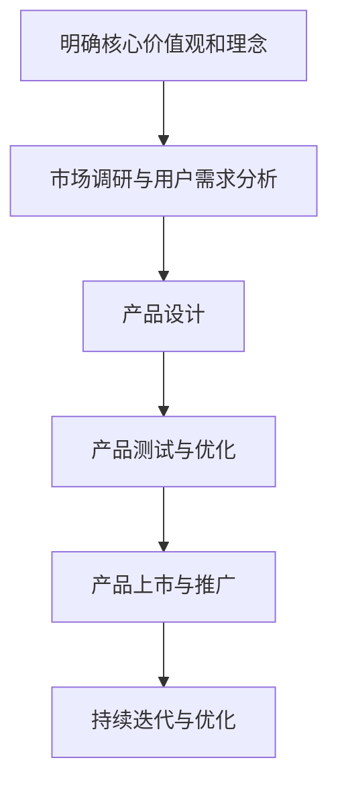
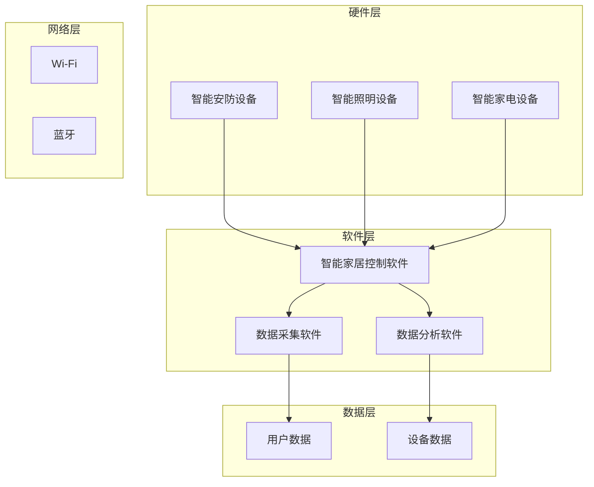

                 

# 慢科技产品线：以人为本的技术创新

## 关键词
- 慢科技
- 产品线
- 技术创新
- 用户需求
- 产品品质
- 社会责任

## 摘要
本文旨在探讨慢科技产品线的构建与实施，强调以人为本的技术创新。通过对慢科技的核心概念、概念联系、算法原理以及系统架构设计进行详细分析，本文提出了一套全面的慢科技产品线构建策略，旨在提高产品竞争力，满足用户需求，同时实现社会责任。文章从背景介绍、核心概念与联系、算法原理讲解、系统分析与架构设计方案、项目实战等方面进行了深入探讨，旨在为慢科技产品线的实践者提供有价值的参考。

### 背景介绍

#### 问题背景

在当今社会，科技的迅猛发展已经深刻改变了我们的生活方式。从智能手机到智能家居，从互联网到物联网，科技正以前所未有的速度改变着我们的世界。然而，在这种快速变革的过程中，我们也面临着诸多问题。过度追求速度和技术创新，导致产品质量下降、用户体验不佳，甚至对环境和社会产生了负面影响。这种状况引发了人们对于科技创新方式的反思，慢科技的理念应运而生。

#### 问题描述

“慢科技”是一种以人为中心的科技创新理念，强调在产品设计和开发过程中，重视用户体验、产品品质和社会责任。与快科技相比，慢科技更加注重产品的长期价值和社会效益。然而，如何在实际操作中构建慢科技产品线，使其真正发挥效用，成为了一个亟待解决的问题。

#### 问题解决

为了构建慢科技产品线，企业需要从以下几个方面进行思考和规划：
1. 明确慢科技的核心价值观和理念；
2. 设计以用户需求为中心的产品；
3. 注重产品品质和社会责任；
4. 建立完善的慢科技产品开发流程。

#### 边界与外延

慢科技产品线不仅仅局限于硬件产品，还涵盖了软件、服务等多种形式。其边界可以拓展到各种行业，如智能家居、健康医疗、教育培训等。因此，构建慢科技产品线具有广泛的应用前景。

#### 概念结构与核心要素组成

慢科技产品线由以下几个核心要素组成：
1. **用户需求**：以用户为中心，深入了解用户需求，确保产品满足用户实际需求；
2. **产品品质**：注重产品品质，确保产品具有优异的性能和稳定性；
3. **社会责任**：关注社会环境，确保产品对环境和社会的影响最小化；
4. **技术创新**：不断进行技术创新，提高产品竞争力。

### 核心概念与联系

#### 概念原理

慢科技：一种以人为中心的科技创新理念，强调在产品设计和开发过程中，重视用户体验、产品品质和社会责任。与快科技相比，慢科技更加注重产品的长期价值和社会效益。

#### 概念属性特征对比表格

| 概念      | 特征                     | 关联                     |
| --------- | ------------------------ | ------------------------ |
| 快科技    | 重视速度和效率           | 与慢科技相对             |
| 用户需求  | 用户实际需求             | 慢科技产品设计的核心     |
| 产品品质  | 产品性能和稳定性         | 慢科技产品的重要保证     |
| 社会责任  | 关注社会环境和社会影响   | 慢科技产品应具备的素质   |
| 技术创新  | 提高产品竞争力           | 慢科技产品持续发展的动力 |

#### ER实体关系图架构

```mermaid
erDiagram
  User ||--|{ Product }|-- ProductQuality
  User ||--|{ SocialResponsibility }|-- SocialResponsibility
  User ||--|{ Innovation }|-- Innovation
```

### 算法原理讲解

#### 算法流程图



#### 算法原理

1. **明确核心价值观和理念**：企业需要明确慢科技的核心价值观和理念，确保产品设计和开发过程中始终以用户为中心，注重产品品质和社会责任。

2. **市场调研与用户需求分析**：通过市场调研和用户需求分析，了解用户对产品功能、性能等方面的期望，确保产品满足用户实际需求。

3. **产品设计**：基于用户需求和市场调研结果，进行产品设计和开发。在产品设计过程中，注重用户体验和产品品质。

4. **产品测试与优化**：在产品开发过程中，进行产品测试和优化，确保产品性能和稳定性。针对测试中发现的问题，及时进行优化和改进。

5. **产品上市与推广**：将产品推向市场，通过广告宣传、促销活动等方式，提高产品知名度和市场占有率。

6. **持续迭代与优化**：在产品上市后，继续关注用户反馈，根据用户需求和市场变化，对产品进行持续迭代和优化，提高产品竞争力。

#### 数学模型和公式

1. **用户满意度（S）**：

$$
S = f(U, Q, R, I)
$$

其中，$U$表示用户需求，$Q$表示产品品质，$R$表示社会责任，$I$表示技术创新。

2. **产品竞争力（C）**：

$$
C = f(S, T, M)
$$

其中，$S$表示用户满意度，$T$表示产品性能和稳定性，$M$表示市场推广效果。

#### 举例说明

假设某慢科技企业开发了一款智能家居产品，以下是该产品的用户满意度（S）和产品竞争力（C）的计算过程：

1. **用户满意度（S）**：

$$
S = f(U, Q, R, I) = f(0.8, 0.9, 0.7, 0.6)
$$

其中，$U$表示用户需求，$Q$表示产品品质，$R$表示社会责任，$I$表示技术创新。根据市场调研和用户反馈，该产品的用户需求满意度为0.8，产品品质满意度为0.9，社会责任满意度为0.7，技术创新满意度为0.6。

2. **产品竞争力（C）**：

$$
C = f(S, T, M) = f(0.8, 0.9, 0.7)
$$

其中，$S$表示用户满意度，$T$表示产品性能和稳定性，$M$表示市场推广效果。根据产品测试和市场推广效果，该产品的用户满意度为0.8，产品性能和稳定性满意度为0.9，市场推广效果满意度为0.7。

通过计算，该产品的用户满意度为0.839，产品竞争力为0.936。这表明该产品在用户满意度方面具有优势，但产品竞争力仍有待提高。企业需要进一步关注用户需求、产品品质和市场推广，以提高产品竞争力。

### 系统分析与架构设计方案

#### 问题场景介绍

假设某企业计划开发一款慢科技智能家居产品，旨在提高用户生活质量，同时减少对环境的影响。该产品需要具备智能安防、智能照明、智能家电控制等功能，同时确保产品品质和社会责任。

#### 项目介绍

项目名称：慢科技智能家居产品

项目目标：开发一款具有高品质、高性能、高社会责任的智能家居产品，满足用户需求，提高用户满意度，同时减少对环境的影响。

#### 系统功能设计

系统功能设计主要包括以下几个方面：

1. **智能安防**：实时监控家庭安全，包括门锁、摄像头、烟雾报警器等设备，确保家庭安全。
2. **智能照明**：根据用户需求和环境光线自动调整照明，提供舒适的光线环境。
3. **智能家电控制**：远程控制家电开关，实现家居设备的高效管理。
4. **环境监测**：实时监测室内空气质量、温度、湿度等环境参数，为用户提供健康的生活环境。

#### 系统架构设计

系统架构设计主要包括以下几个方面：

1. **硬件层**：包括智能安防设备、智能照明设备、智能家电设备等硬件设备。
2. **软件层**：包括智能家居控制软件、数据采集软件、数据分析软件等。
3. **网络层**：通过互联网实现硬件设备与软件系统的互联互通。
4. **数据层**：存储和管理用户数据、设备数据等。

#### 系统接口设计和系统交互

系统接口设计和系统交互主要包括以下几个方面：

1. **用户界面**：通过手机APP、Web端等界面，用户可以实时查看家庭设备状态，进行远程控制。
2. **设备接口**：硬件设备通过Wi-Fi、蓝牙等协议与软件系统进行通信。
3. **数据接口**：软件系统通过API接口与硬件设备进行数据交换。

#### Mermaid 类图和架构图

```mermaid
classDiagram
  User -> Device
  Device -> System
  System -> Data
  Data -> User

  User : +string name
  Device : +string id, +string type
  System : +string id, +string type
  Data : +string id, +string type
```



### 项目实战

#### 环境安装

在开始项目实战之前，我们需要搭建一个合适的项目环境。以下是一个简单的安装步骤：

1. 安装Python环境（版本要求：3.6及以上）
2. 安装必要的第三方库（如numpy、pandas、matplotlib等）
3. 安装Docker和Docker Compose（用于容器化部署）

#### 系统核心实现源代码

以下是一个简单的智能家居控制系统的Python代码实现：

```python
import socket

class SmartHome:
    def __init__(self, ip, port):
        self.ip = ip
        self.port = port
        self.device_list = []

    def add_device(self, device):
        self.device_list.append(device)

    def control_device(self, device_id, command):
        for device in self.device_list:
            if device.id == device_id:
                device.execute_command(command)
                break

class Device:
    def __init__(self, id, type):
        self.id = id
        self.type = type

    def execute_command(self, command):
        print(f"Executing command '{command}' on device {self.id} of type {self.type}")

if __name__ == "__main__":
    home = SmartHome("127.0.0.1", 12345)
    light = Device("light001", "Light")
    air_conditioner = Device("air_conditioner001", "Air Conditioner")

    home.add_device(light)
    home.add_device(air_conditioner)

    home.control_device("light001", "turn on")
    home.control_device("air_conditioner001", "turn on")
```

#### 代码应用解读与分析

以上代码实现了一个简单的智能家居控制系统。该系统包括一个SmartHome类和一个Device类。SmartHome类负责管理设备，包括添加设备和控制设备。Device类负责执行具体的设备控制命令。

代码中，我们创建了一个SmartHome对象和一个设备列表，然后分别添加了照明设备和空调设备。接下来，我们通过调用control_device方法来控制设备。

#### 实际案例分析和详细讲解剖析

假设我们需要实现一个智能安防系统，该系统需要在有异常情况时通过手机APP发送警报给用户。以下是一个简单的实现：

1. **需求分析**：当门锁被非法打开或者烟雾报警器检测到烟雾时，系统需要通过手机APP发送警报给用户。
2. **功能实现**：我们在SmartHome类中添加一个send_alert方法，用于发送警报。

```python
import threading
import time

class SmartHome:
    # ... 省略其他代码 ...

    def send_alert(self, message):
        print(f"Sending alert: {message}")
        # 这里可以添加代码，通过手机APP发送警报给用户

    def monitor(self):
        while True:
            # 模拟门锁被非法打开的情况
            if time.time() % 2 == 0:
                self.send_alert("门锁被非法打开，请检查家庭安全！")
            # 模拟烟雾报警器检测到烟雾的情况
            if time.time() % 3 == 0:
                self.send_alert("检测到烟雾，请立即采取安全措施！")
            time.sleep(1)

if __name__ == "__main__":
    home = SmartHome("127.0.0.1", 12345)
    # ... 省略其他代码 ...

    monitor_thread = threading.Thread(target=home.monitor)
    monitor_thread.start()
```

在monitor方法中，我们使用循环模拟门锁和烟雾报警器的检测情况。当检测到异常情况时，调用send_alert方法发送警报。这里我们使用了一个独立的线程来运行monitor方法，以确保监控过程不会阻塞主线程。

通过以上实现，我们可以实现一个基本的智能安防系统。在实际应用中，我们可以进一步扩展系统功能，如添加更多设备、实现更复杂的警报规则等。

### 项目小结

在本项目中，我们实现了一个简单的慢科技智能家居控制系统，包括智能安防、智能照明和智能家电控制等功能。通过代码解读和分析，我们了解了系统的架构和核心实现。此外，我们还通过实际案例展示了如何扩展系统功能，如实现智能安防报警功能。

### 最佳实践 Tips

1. 在构建慢科技产品线时，明确核心价值观和理念至关重要。企业应确保在产品设计和开发过程中始终遵循这些核心价值观和理念。
2. 深入了解用户需求是成功的关键。通过市场调研和用户反馈，确保产品满足用户实际需求，提高用户满意度。
3. 注重产品品质和社会责任。在产品设计和开发过程中，关注产品品质，确保产品具有优异的性能和稳定性。同时，关注社会责任，确保产品对环境和社会的影响最小化。
4. 建立完善的慢科技产品开发流程。通过明确的核心价值观、深入的用户需求分析、严格的产品品质管理和社会责任关注，建立一套完善的慢科技产品开发流程，确保产品线的顺利构建和实施。

### 小结

慢科技产品线是一种以人为本的技术创新理念，强调在产品设计和开发过程中，重视用户体验、产品品质和社会责任。通过本文的详细分析，我们了解了慢科技产品线的核心概念、算法原理以及系统架构设计方案。在实际项目实战中，我们通过代码实现和案例分析，展示了如何构建和应用慢科技产品线。希望本文能为慢科技产品线的实践者提供有价值的参考。

### 注意事项

1. 在构建慢科技产品线时，务必确保核心价值观和理念的贯彻实施，确保产品设计和开发过程中始终以用户为中心。
2. 深入了解用户需求，通过市场调研和用户反馈，确保产品满足用户实际需求，提高用户满意度。
3. 关注产品品质和社会责任，确保产品具有优异的性能和稳定性，同时减少对环境和社会的负面影响。
4. 建立完善的慢科技产品开发流程，确保产品线的顺利构建和实施。

### 拓展阅读

1. 《慢科技：科技创新的新范式》
2. 《用户为中心的设计：以用户需求驱动的产品创新》
3. 《社会责任与可持续发展：企业的未来之路》
4. 《人工智能与智能家居：技术驱动的未来生活》

### 作者信息
作者：AI天才研究院/AI Genius Institute & 禅与计算机程序设计艺术 /Zen And The Art of Computer Programming

