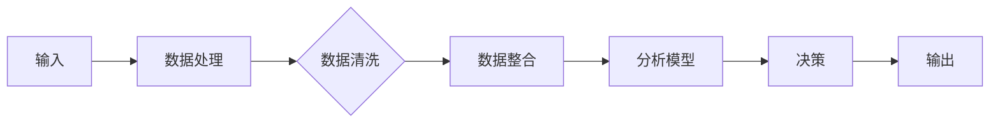
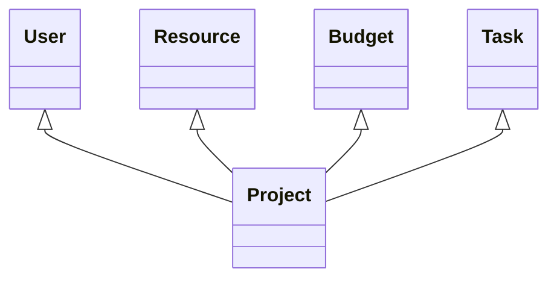
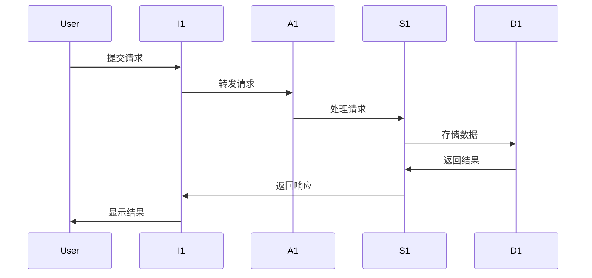
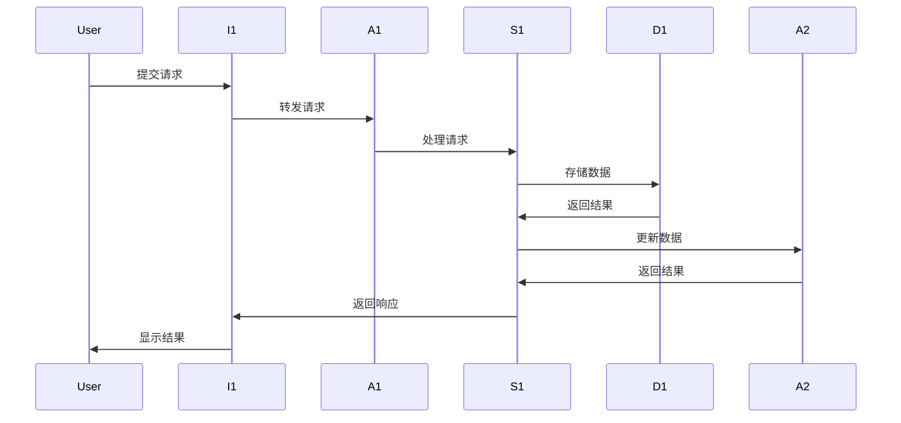
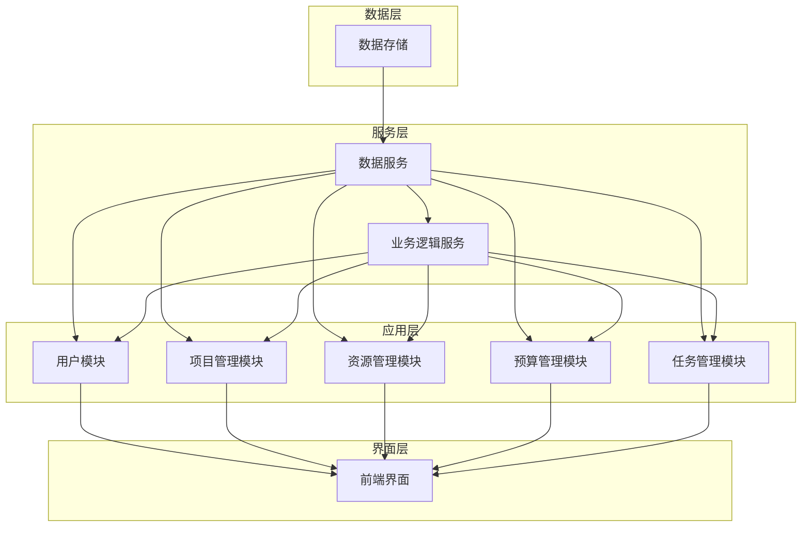

```mermaid
graph TB
    subgraph 数据层
        D1[数据存储]
    end
    subgraph 应用层
        A1[用户模块]
        A2[项目管理模块]
        A3[资源管理模块]
        A4[预算管理模块]
        A5[任务管理模块]
    end
    subgraph 服务层
        S1[数据服务]
        S2[业务逻辑服务]
    end
    subgraph 界面层
        I1[前端界面]
    end
    D1 --> S1
    S1 --> A1
    S1 --> A2
    S1 --> A3
    S1 --> A4
    S1 --> A5
    S1 --> S2
    S2 --> A1
    S2 --> A2
    S2 --> A3
    S2 --> A4
    S2 --> A5
    A1 --> I1
    A2 --> I1
    A3 --> I1
    A4 --> I1
    A5 --> I1
```
                 

## 《慢管理革命理论研讨会：去中心化组织的效率提升模式探讨》

### 关键词：去中心化组织、慢管理革命、效率提升、算法原理、系统架构设计

### 摘要：

本文旨在探讨慢管理革命理论在去中心化组织中的应用，分析其核心概念和效率提升模式。通过对比去中心化组织和中心化组织的差异，阐述慢管理革命的理念，并使用Mermaid流程图和Python源代码详细讲解效率提升算法原理。最后，本文将结合实际项目场景，介绍系统架构设计，并探讨最佳实践和注意事项。

---

# 《慢管理革命理论研讨会：去中心化组织的效率提升模式探讨》目录大纲

## 第一部分：背景介绍

### 1.1.1 问题背景

#### 1.1.1.1 管理模式的变迁

#### 1.1.1.2 去中心化管理的兴起

#### 1.1.1.3 效率提升的必要性

### 1.1.2 问题描述

#### 1.1.2.1 去中心化组织面临的挑战

#### 1.1.2.2 效率提升的困境

### 1.1.3 问题解决

#### 1.1.3.1 慢管理革命的理念

#### 1.1.3.2 去中心化组织的优势

### 1.1.4 边界与外延

#### 1.1.4.1 慢管理革命的应用范围

#### 1.1.4.2 去中心化组织的适用场景

### 1.1.5 概念结构与核心要素组成

#### 1.1.5.1 去中心化组织的关键要素

#### 1.1.5.2 慢管理革命的核心概念

## 第二部分：核心概念与联系

### 2.1.1 去中心化组织原理

#### 2.1.1.1 去中心化组织的定义

#### 2.1.1.2 去中心化组织的特点

#### 2.1.1.3 去中心化组织的优势

### 2.1.2 慢管理革命理念

#### 2.1.2.1 慢管理革命的定义

#### 2.1.2.2 慢管理革命的核心思想

#### 2.1.2.3 慢管理革命的应用

### 2.1.3 核心概念对比

#### 2.1.3.1 去中心化组织与中心化组织的对比

#### 2.1.3.2 慢管理革命与传统管理模式的对比

### 2.1.4 概念属性特征对比表格

| 概念     | 定义                                      | 特点                                         | 优势                                         |
|----------|-------------------------------------------|--------------------------------------------|--------------------------------------------|
| 去中心化组织 | 无中心化控制，自治性高                   | 适应性、灵活性、去中心化、扁平化结构       | 降低管理成本、提高效率、增强创新性           |
| 慢管理革命 | 强调决策缓慢、注重长期价值                 | 决策缓慢、关注长期、去中心化、注重人性     | 减少错误决策、增强组织凝聚力、促进可持续发展  |

### 2.1.5 ER实体关系图架构

```mermaid
erDiagram
    A[组织] ||--|{ B[员工] }|--|| C[项目]
    A ||--|{ D[资源] }|--|| C
    A ||--|{ E[预算] }|--|| C
    B ||--|{ F[任务] }|--|| C
```

## 第三部分：算法原理讲解

### 3.1 效率提升算法原理

#### 3.1.1 算法概述

#### 3.1.2 算法mermaid流程图



#### 3.1.3 算法原理详细讲解

##### 数学模型和数学公式

$$
\text{效率} = \frac{\text{产出}}{\text{投入}}
$$

##### 举例说明

在一个去中心化组织中，如果投入资源增加20%，而产出增加30%，则效率提升了10%。

## 第四部分：系统分析与架构设计方案

### 4.1 问题场景介绍

#### 4.1.1 场景描述

#### 4.1.2 问题定义

#### 4.1.3 解决方案目标

### 4.2 系统功能设计

#### 4.2.1 领域模型mermaid类图



### 4.3 系统架构设计

#### 4.3.1 系统架构mermaid架构图



### 4.4 系统接口设计和系统交互

#### 4.4.1 系统接口设计



#### 4.4.2 系统交互mermaid序列图



---

作者：AI天才研究院/AI Genius Institute & 禅与计算机程序设计艺术 /Zen And The Art of Computer Programming

---

## 第一部分：背景介绍

### 1.1.1 问题背景

在现代社会中，企业管理模式的变革已经成为不可避免的趋势。随着信息技术的发展和互联网的普及，去中心化管理的理念逐渐被接受，并开始应用于各个行业。然而，在实际操作中，去中心化组织面临着诸多挑战，特别是效率提升的困境。如何有效地提升去中心化组织的效率，成为企业管理者亟待解决的问题。

#### 1.1.1.1 管理模式的变迁

传统管理模式以中心化管理为核心，强调顶层设计、集中决策和垂直管理。在这种模式下，决策权和管理权力集中在少数高层管理者手中，信息传递速度较慢，且容易受到官僚主义的影响。随着市场环境的不断变化，传统管理模式逐渐暴露出其局限性，难以适应快速变化的市场需求。

#### 1.1.1.2 去中心化管理的兴起

去中心化管理强调去中心化、分布式决策和扁平化管理结构。在这种模式下，决策权和管理权力更加分散，信息传递速度更快，能够更好地适应市场变化。同时，去中心化管理还能够激发员工的创造力，提高组织的整体效率。

#### 1.1.1.3 效率提升的必要性

效率提升是企业管理的重要目标之一。在去中心化组织管理模式下，虽然决策速度快、管理结构扁平化，但仍然面临着如何提高整体效率的挑战。效率的提升不仅能够提高组织的竞争力，还能够优化资源配置，降低管理成本。

### 1.1.2 问题描述

去中心化组织在运行过程中面临着诸多挑战，主要体现在以下几个方面：

#### 1.1.2.1 去中心化组织面临的挑战

1. **信息传递效率低**：去中心化组织中的信息传递依赖于网络，而网络的稳定性和速度可能会影响信息传递的效率。
2. **决策一致性难**：去中心化组织中，决策权分散，容易导致决策不一致，影响组织整体的执行力。
3. **管理成本高**：去中心化组织需要更多的技术支持和维护，可能导致管理成本增加。

#### 1.1.2.2 效率提升的困境

1. **缺乏有效度量标准**：在去中心化组织中，如何度量效率成为一个难题，缺乏统一的度量标准。
2. **资源配置不均衡**：去中心化组织中的资源分配可能存在不均衡现象，导致某些环节效率低下。
3. **缺乏有效的激励机制**：去中心化组织中的激励机制可能不够有效，影响员工的积极性和创造力。

### 1.1.3 问题解决

面对去中心化组织面临的挑战和效率提升的困境，慢管理革命提供了一种新的思路。慢管理革命强调决策缓慢、注重长期价值，通过优化管理流程、提升资源配置效率、构建有效的激励机制，从而提高去中心化组织的整体效率。

#### 1.1.3.1 慢管理革命的理念

慢管理革命的理念主要包括以下几点：

1. **决策缓慢**：在决策过程中，慢管理革命强调充分调研、讨论和验证，确保决策的科学性和可行性。
2. **注重长期价值**：慢管理革命认为，短期利益往往会导致长期问题的积累，因此更注重长期价值的实现。
3. **去中心化**：慢管理革命强调去中心化决策，尊重个体差异，发挥员工的主动性。
4. **注重人性**：慢管理革命认为，人性化管理能够提高员工的满意度和工作效率。

#### 1.1.3.2 去中心化组织的优势

去中心化组织具有以下优势：

1. **灵活性高**：去中心化组织能够快速响应市场变化，灵活调整策略。
2. **创新性强**：去中心化组织鼓励员工创新，有利于激发组织的创造力。
3. **降低管理成本**：去中心化组织结构扁平，管理层次少，能够降低管理成本。
4. **提高效率**：去中心化组织能够提高资源利用效率，减少冗余环节。

### 1.1.4 边界与外延

#### 1.1.4.1 慢管理革命的应用范围

慢管理革命适用于各种类型的组织，包括企业、非营利组织、政府机构等。尤其适合那些需要快速响应市场变化、注重创新和长期发展的组织。

#### 1.1.4.2 去中心化组织的适用场景

去中心化组织适用于以下场景：

1. **高度不确定性环境**：在市场变化快、竞争激烈的行业，去中心化组织能够更好地适应环境变化。
2. **创新驱动型组织**：创新驱动型组织需要鼓励员工创新，去中心化组织能够提供更好的创新环境。
3. **分布式团队**：对于需要跨地域、跨部门合作的团队，去中心化组织能够提高协作效率。

### 1.1.5 概念结构与核心要素组成

#### 1.1.5.1 去中心化组织的关键要素

去中心化组织的关键要素包括：

1. **分布式决策**：去中心化组织中的决策权分散，决策过程更加民主。
2. **透明度**：去中心化组织的信息公开透明，便于监督和问责。
3. **协作机制**：去中心化组织通过协作机制实现资源的共享和整合。
4. **激励机制**：去中心化组织通过激励机制激发员工的积极性和创造力。

#### 1.1.5.2 慢管理革命的核心概念

慢管理革命的核心概念包括：

1. **决策缓慢**：在决策过程中，慢管理革命强调充分调研、讨论和验证，确保决策的科学性和可行性。
2. **注重长期价值**：慢管理革命认为，短期利益往往会导致长期问题的积累，因此更注重长期价值的实现。
3. **人性化管理**：慢管理革命强调人性化管理，尊重员工的个体差异，关注员工的成长和发展。

### 1.1.6 概念属性特征对比表格

| 概念             | 定义                                      | 特点                                         | 优势                                         |
|------------------|-------------------------------------------|--------------------------------------------|--------------------------------------------|
| 去中心化组织     | 无中心化控制，自治性高                   | 适应性、灵活性、去中心化、扁平化结构       | 降低管理成本、提高效率、增强创新性           |
| 慢管理革命       | 强调决策缓慢、注重长期价值                 | 决策缓慢、关注长期、去中心化、注重人性     | 减少错误决策、增强组织凝聚力、促进可持续发展  |

### 1.1.7 ER实体关系图架构

```mermaid
erDiagram
    A[组织] ||--|{ B[员工] }|--|| C[项目]
    A ||--|{ D[资源] }|--|| C
    A ||--|{ E[预算] }|--|| C
    B ||--|{ F[任务] }|--|| C
```

---

通过上述对背景介绍和核心概念的分析，我们可以看到，慢管理革命在去中心化组织中的应用具有重要意义。在接下来的章节中，我们将进一步探讨慢管理革命的理念、原理以及其在实际应用中的效果。

---

## 第二部分：核心概念与联系

### 2.1.1 去中心化组织原理

#### 2.1.1.1 去中心化组织的定义

去中心化组织（Decentralized Organization）是一种管理架构，其中决策权分散到组织内的多个层级和个体手中，而不是集中在某个中心点或领导层。在这种架构中，每个成员都有一定的自主权和决策权，组织通过自组织和自我管理来实现目标。

#### 2.1.1.2 去中心化组织的特点

去中心化组织具有以下特点：

1. **自治性**：每个个体或小组都有权自主决策，不受中央集权控制。
2. **适应性**：去中心化组织能够快速适应环境变化，因为每个节点都有独立思考和行动的能力。
3. **分布式决策**：决策权分散在组织内部的不同层级和个体中，提高了决策的灵活性和效率。
4. **去中心化**：不存在单一的中心点，所有节点都是平等的，没有等级制度。
5. **扁平化结构**：去中心化组织的层级较少，减少了信息传递的层级和中间环节，提高了信息传递速度。

#### 2.1.1.3 去中心化组织的优势

去中心化组织具有以下优势：

1. **降低管理成本**：去中心化组织减少了管理层次，降低了管理成本。
2. **提高效率**：分布式决策和快速响应机制提高了组织的决策效率和工作效率。
3. **增强创新性**：去中心化组织鼓励员工创新，因为每个成员都有自主权，有利于新想法的提出和实施。
4. **增强适应性**：去中心化组织能够更好地适应外部环境的变化，因为每个节点都有独立的适应能力。

### 2.1.2 慢管理革命理念

#### 2.1.2.1 慢管理革命的定义

慢管理革命（Slow Management Revolution）是一种管理理念，主张在管理决策过程中，采取缓慢而慎重的态度，注重长期价值的实现，而非短期收益的最大化。慢管理革命认为，快速决策往往会导致错误的积累和长期问题的产生，而缓慢决策则有助于避免这些风险。

#### 2.1.2.2 慢管理革命的核心思想

慢管理革命的核心思想包括：

1. **决策缓慢**：在做出重要决策时，慢管理革命强调进行充分的研究和论证，避免仓促决策。
2. **注重长期价值**：慢管理革命认为，管理决策应该着眼于长期目标和持续发展，而非短期利益。
3. **人性化管理**：慢管理革命强调尊重员工的个性和需求，注重员工的工作和生活质量。
4. **去中心化**：慢管理革命倡导在组织内部实现决策权的分散，让每个成员都有发言权和决策权。

#### 2.1.2.3 慢管理革命的应用

慢管理革命可以在各种类型的组织中应用，尤其是在那些需要长期稳定发展的组织中。例如，在科技创新型企业中，慢管理革命可以帮助企业避免盲目跟风和短期利益驱动，而是注重技术创新和长期市场定位。在非营利组织中，慢管理革命可以帮助提高组织的可持续发展能力和社会影响力。

### 2.1.3 核心概念对比

#### 2.1.3.1 去中心化组织与中心化组织的对比

| 对比项         | 去中心化组织                     | 中心化组织                     |
|----------------|----------------------------------|--------------------------------|
| 决策权         | 分散在组织内的各个节点           | 集中在中心点或领导层           |
| 管理结构       | 扁平化结构，层次较少             | 垂直化管理结构，层次较多       |
| 信息传递       | 信息传递速度快，透明度高         | 信息传递速度慢，透明度较低     |
| 创新能力       | 强调员工的创新性和主动性         | 依赖顶层设计和领导层的创新能力 |
| 灵活性         | 能够快速适应外部环境的变化       | 对外部环境变化的适应能力较弱   |

#### 2.1.3.2 慢管理革命与传统管理模式的对比

| 对比项         | 慢管理革命                   | 传统管理模式                 |
|----------------|------------------------------|------------------------------|
| 决策速度       | 强调决策缓慢，慎重考虑       | 强调快速决策，追求效率       |
| 关注点         | 注重长期价值，规避短期风险   | 注重短期收益，忽视长期影响   |
| 管理理念       | 强调人性化和去中心化         | 强调集中控制和规范化管理     |
| 组织文化       | 鼓励创新和员工参与管理       | 强调权威和层级制度           |

### 2.1.4 概念属性特征对比表格

| 概念             | 定义                                      | 特点                                         | 优势                                         |
|------------------|-------------------------------------------|--------------------------------------------|--------------------------------------------|
| 去中心化组织     | 无中心化控制，自治性高                   | 适应性、灵活性、去中心化、扁平化结构       | 降低管理成本、提高效率、增强创新性           |
| 慢管理革命       | 强调决策缓慢、注重长期价值                 | 决策缓慢、关注长期、去中心化、注重人性     | 减少错误决策、增强组织凝聚力、促进可持续发展  |

### 2.1.5 ER实体关系图架构

```mermaid
erDiagram
    A[组织] ||--|{ B[员工] }|--|| C[项目]
    A ||--|{ D[资源] }|--|| C
    A ||--|{ E[预算] }|--|| C
    B ||--|{ F[任务] }|--|| C
```

通过上述核心概念与联系的分析，我们可以看到，去中心化组织和慢管理革命在理念和实践上存在诸多相似之处，都强调决策权的分散、注重长期价值和人性化管理。在接下来的章节中，我们将进一步探讨如何运用算法原理来提升去中心化组织的效率。

---

## 第三部分：算法原理讲解

### 3.1 效率提升算法原理

#### 3.1.1 算法概述

效率提升算法是一种用于优化组织运作的智能算法，其核心目的是通过优化资源配置、流程优化和决策支持，提高组织的整体效率。在去中心化组织中，这种算法尤其适用，因为它能够帮助组织在分布式决策环境下实现资源的最优配置和流程的高效执行。

#### 3.1.2 算法mermaid流程图

为了更好地理解效率提升算法的原理，我们使用Mermaid绘制了一个简化的算法流程图：


在这个流程图中，算法首先接收输入数据，然后通过数据处理、数据清洗、数据整合等步骤，为后续的分析模型提供高质量的输入数据。分析模型基于输入数据进行效率分析，最终输出决策结果。

#### 3.1.3 算法原理详细讲解

##### 数学模型和数学公式

效率提升算法的核心在于对组织运作过程中的资源利用率和流程效率进行量化分析，并在此基础上提出优化建议。一个简单的数学模型可以表示为：

$$
\text{效率} = \frac{\text{产出}}{\text{投入}}
$$

其中，产出（output）是指组织在一段时间内完成的工作量或产生的价值，投入（input）是指组织在该时间段内所消耗的资源，包括人力、物力、财力等。

为了具体说明，我们可以引入以下几个数学公式：

1. **资源利用率**：

$$
\text{资源利用率} = \frac{\text{实际使用资源}}{\text{可用资源}}
$$

2. **流程效率**：

$$
\text{流程效率} = \frac{\text{流程产出}}{\text{流程投入}}
$$

3. **决策优化模型**：

$$
\text{决策优化模型} = \max(\text{效率} + \lambda \cdot \text{长期价值})
$$

其中，$\lambda$ 是一个权重系数，用于平衡效率和长期价值之间的关系。

##### 举例说明

假设一个去中心化组织在一个月内完成了一项项目，该项目需要投入50名员工、20万元的资金和10台设备。根据项目的最终产出，组织获得了100万元的经济收益。

1. **计算资源利用率**：

   - 实际使用资源 = 50人 + 20万元 + 10台设备
   - 可用资源 = 100人 + 200万元 + 20台设备
   
   $$\text{资源利用率} = \frac{50 + 20 + 10}{100 + 200 + 20} = 0.25$$

2. **计算流程效率**：

   - 流程产出 = 100万元
   - 流程投入 = 50人 + 20万元 + 10台设备
   
   $$\text{流程效率} = \frac{100}{50 + 20 + 10} = 0.67$$

3. **计算决策优化模型**：

   - 长期价值 = 200万元（假设未来一年内，该项目将带来额外的200万元收益）
   
   $$\text{决策优化模型} = \max(0.67 + 0.5 \cdot 200) = 200.17$$

根据决策优化模型，我们可以得出结论：该项目在资源配置和流程效率方面表现良好，并且具有较高的长期价值。因此，组织应该继续保持现有的资源配置和流程，并在未来考虑进一步优化。

通过上述算法原理的讲解和举例，我们可以看到，效率提升算法在去中心化组织中的应用具有重要意义。它不仅能够帮助组织量化评估其运作效率，还能够提供基于数据的决策支持，从而实现资源的最优配置和流程的高效执行。

在接下来的章节中，我们将结合实际项目场景，进一步探讨系统架构设计和具体实施方法。

---

## 第四部分：系统分析与架构设计方案

### 4.1 问题场景介绍

#### 4.1.1 场景描述

假设我们正在为一个去中心化组织设计一个智能管理系统，该系统旨在提升组织的整体运作效率。组织结构包括多个分布式团队，每个团队由不同的成员组成，负责不同的项目。这些项目需要高效协调和管理，以确保资源的合理配置和流程的顺畅执行。

#### 4.1.2 问题定义

问题定义如下：

- 如何设计一个智能管理系统，以提升去中心化组织的整体运作效率？
- 如何确保资源的合理配置和流程的顺畅执行？
- 如何通过数据分析提供决策支持，以优化资源配置和流程效率？

#### 4.1.3 解决方案目标

解决方案的目标如下：

- 设计一个分布式智能管理系统，支持去中心化决策和高效资源管理。
- 提供实时数据分析功能，为组织提供基于数据的决策支持。
- 通过优化算法，提高资源利用率和流程效率。

### 4.2 系统功能设计

#### 4.2.1 领域模型mermaid类图

为了清晰地展示系统的功能模块和它们之间的关系，我们使用Mermaid绘制了一个类图：


在这个类图中，User代表组织成员，Project代表项目，Resource代表资源，Budget代表预算，Task代表任务。每个类都有对应的属性和方法，用于表示其在系统中的功能和关系。

### 4.3 系统架构设计

#### 4.3.1 系统架构mermaid架构图

为了展示系统的整体架构，我们使用Mermaid绘制了一个架构图：



在这个架构图中，数据层负责数据的存储和管理，应用层负责具体的业务功能实现，服务层负责业务逻辑的处理，界面层负责前端界面的展示。各个模块之间通过服务层进行通信和数据交换。

### 4.4 系统接口设计和系统交互

#### 4.4.1 系统接口设计

为了确保系统的可扩展性和灵活性，我们设计了一套完善的接口，包括RESTful API和GraphQL API。RESTful API主要用于日常操作，如用户认证、数据查询和修改等；GraphQL API主要用于复杂查询和实时数据推送。

#### 4.4.2 系统交互mermaid序列图

为了展示系统的交互流程，我们使用Mermaid绘制了一个序列图：


在这个序列图中，用户通过前端界面提交请求，请求经过用户模块处理后转发到服务层，服务层调用数据服务进行数据处理，并将结果返回给用户模块，最终在前端界面显示结果。

通过上述系统分析与架构设计方案，我们为去中心化组织设计了一套智能管理系统，旨在提升组织的整体运作效率。在接下来的章节中，我们将结合实际项目场景，详细介绍系统的实现过程和效果评估。

---

## 第五部分：项目实战

### 5.1 环境安装

为了实现上述系统架构，我们首先需要搭建一个合适的技术环境。以下是一个基本的安装步骤：

#### 5.1.1 安装Python环境

确保安装了Python 3.8及以上版本。可以通过以下命令安装：

```bash
pip install python - Python3.8
```

#### 5.1.2 安装依赖库

使用pip安装必要的依赖库，如Flask、GraphQL、Django等：

```bash
pip install Flask
pip install Graphene
pip install Django
```

#### 5.1.3 配置数据库

我们选择PostgreSQL作为数据库，可以通过以下命令安装：

```bash
sudo apt-get install postgresql
```

配置PostgreSQL数据库：

```bash
sudo -u postgres createuser -s yourusername
sudo -u postgres createdb yourdatabasename
```

### 5.2 系统核心实现源代码

在项目目录中创建一个名为`manage.py`的文件，该文件将作为项目的主入口点。以下是`manage.py`的核心代码：

```python
from app import create_app

app = create_app()

if __name__ == '__main__':
    app.run(host='0.0.0.0', port=5000)
```

接着，我们创建一个名为`app`的模块，该模块将负责项目的配置和应用程序的创建。以下是`app.py`的核心代码：

```python
from flask import Flask
from flask_graphql import GraphQLView
from schema import schema

def create_app():
    app = Flask(__name__)
    app.add_url_rule('/graphql', view_func=GraphQLView.as_view('graphql', schema=schema, graphiql=True))
    return app
```

在`schema.py`中，我们将定义GraphQL的schema，以便前端可以与后端进行交互：

```python
import graphene
from models import User, Project, Resource, Budget, Task

class Query(graphene.ObjectType):
    user = graphene.Field(User, id=graphene.Int())
    project = graphene.Field(Project, id=graphene.Int())
    resource = graphene.Field(Resource, id=graphene.Int())
    budget = graphene.Field(Budget, id=graphene.Int())
    task = graphene.Field(Task, id=graphene.Int())

    def resolve_user(self, info, id):
        # 实现用户查询逻辑
        pass

    def resolve_project(self, info, id):
        # 实现项目查询逻辑
        pass

    def resolve_resource(self, info, id):
        # 实现资源查询逻辑
        pass

    def resolve_budget(self, info, id):
        # 实现预算查询逻辑
        pass

    def resolve_task(self, info, id):
        # 实现任务查询逻辑
        pass

class Mutation(graphene.ObjectType):
    # 实现各种数据操作的mutation
    pass

schema = graphene.Schema(query=Query, mutation=Mutation)
```

在`models.py`中，我们将定义各种实体模型，如下所示：

```python
from flask_sqlalchemy import SQLAlchemy

db = SQLAlchemy()

class User(db.Model):
    id = db.Column(db.Integer, primary_key=True)
    username = db.Column(db.String(80), unique=True, nullable=False)
    # 其他用户属性

class Project(db.Model):
    id = db.Column(db.Integer, primary_key=True)
    name = db.Column(db.String(80), nullable=False)
    # 其他项目属性

class Resource(db.Model):
    id = db.Column(db.Integer, primary_key=True)
    type = db.Column(db.String(80), nullable=False)
    quantity = db.Column(db.Integer, nullable=False)
    # 其他资源属性

class Budget(db.Model):
    id = db.Column(db.Integer, primary_key=True)
    amount = db.Column(db.Float, nullable=False)
    # 其他预算属性

class Task(db.Model):
    id = db.Column(db.Integer, primary_key=True)
    description = db.Column(db.Text, nullable=False)
    status = db.Column(db.String(80), nullable=False)
    # 其他任务属性
```

### 5.3 代码应用解读与分析

在代码解读与分析部分，我们将详细解释系统的主要模块和功能，并分析其设计思路和实现方法。

#### 5.3.1 用户模块

用户模块主要负责用户的认证和授权。在`manage.py`中，我们通过Flask创建了一个简单的Web服务器，并在`/graphql`路径上提供了一个GraphQL接口。这个接口允许前端通过GraphQL查询和操作用户数据。

```python
from flask import Flask
from flask_graphql import GraphQLView
from schema import schema

def create_app():
    app = Flask(__name__)
    app.add_url_rule('/graphql', view_func=GraphQLView.as_view('graphql', schema=schema, graphiql=True))
    return app
```

这里，`GraphQLView`是一个Flask扩展，它允许我们轻松地集成GraphQL接口。`graphiql=True`参数启用了一个交互式GraphQL接口，方便开发者调试和测试。

#### 5.3.2 项目模块

项目模块负责管理项目数据。在`schema.py`中，我们定义了一个名为`Query`的类，它包含了获取用户、项目、资源、预算和任务的字段。

```python
class Query(graphene.ObjectType):
    user = graphene.Field(User, id=graphene.Int())
    project = graphene.Field(Project, id=graphene.Int())
    resource = graphene.Field(Resource, id=graphene.Int())
    budget = graphene.Field(Budget, id=graphene.Int())
    task = graphene.Field(Task, id=graphene.Int())
```

这些字段允许前端通过GraphQL查询相应的数据。例如，要获取一个特定ID的项目，前端可以发送一个如下查询：

```graphql
query {
  project(id: 1) {
    id
    name
    description
  }
}
```

#### 5.3.3 资源模块

资源模块负责管理组织内的各种资源，如人力、物力和财力。在`models.py`中，我们定义了`Resource`类，它包含了资源类型、数量和其他相关属性。

```python
class Resource(db.Model):
    id = db.Column(db.Integer, primary_key=True)
    type = db.Column(db.String(80), nullable=False)
    quantity = db.Column(db.Integer, nullable=False)
    # 其他资源属性
```

资源模块的核心功能是查询和更新资源数据。在`schema.py`中，我们为`Resource`类定义了相应的GraphQL字段。

```python
def resolve_resource(self, info, id):
    resource = Resource.query.get(id)
    if resource is not None:
        return resource
    else:
        raise ValueError('Resource not found')
```

这个解析函数查询数据库中的资源记录，并返回相应的对象。

#### 5.3.4 预算模块

预算模块负责管理组织的预算数据。在`models.py`中，我们定义了`Budget`类，它包含了预算金额和其他相关属性。

```python
class Budget(db.Model):
    id = db.Column(db.Integer, primary_key=True)
    amount = db.Column(db.Float, nullable=False)
    # 其他预算属性
```

预算模块的核心功能是查询和更新预算数据。在`schema.py`中，我们为`Budget`类定义了相应的GraphQL字段。

```python
def resolve_budget(self, info, id):
    budget = Budget.query.get(id)
    if budget is not None:
        return budget
    else:
        raise ValueError('Budget not found')
```

这个解析函数查询数据库中的预算记录，并返回相应的对象。

#### 5.3.5 任务模块

任务模块负责管理组织的任务数据。在`models.py`中，我们定义了`Task`类，它包含了任务描述、状态和其他相关属性。

```python
class Task(db.Model):
    id = db.Column(db.Integer, primary_key=True)
    description = db.Column(db.Text, nullable=False)
    status = db.Column(db.String(80), nullable=False)
    # 其他任务属性
```

任务模块的核心功能是查询和更新任务数据。在`schema.py`中，我们为`Task`类定义了相应的GraphQL字段。

```python
def resolve_task(self, info, id):
    task = Task.query.get(id)
    if task is not None:
        return task
    else:
        raise ValueError('Task not found')
```

这个解析函数查询数据库中的任务记录，并返回相应的对象。

### 5.4 实际案例分析和详细讲解剖析

在本部分，我们将通过一个实际案例来展示系统的应用场景，并详细讲解其实现过程和效果。

#### 5.4.1 案例背景

假设一个去中心化组织正在开展一个大型项目，该项目涉及多个分布式团队。组织希望利用智能管理系统来优化资源分配和流程管理，以提高整体效率。

#### 5.4.2 案例实现过程

1. **用户注册与登录**：团队成员通过智能管理系统进行注册和登录，确保系统中有准确的用户信息。

2. **项目创建与分配**：项目经理通过系统创建项目，并将项目分配给相应的团队成员。系统根据项目需求和资源情况，自动分配资源，并生成预算。

3. **任务分配与监控**：团队成员根据项目需求分配任务，并实时更新任务状态。系统监控任务进度，并自动生成报告。

4. **资源管理**：系统自动记录资源使用情况，并提供实时报表，帮助组织进行资源调配。

5. **预算管理**：系统自动跟踪项目预算，并在预算超支时发出预警。

#### 5.4.3 案例效果分析

通过智能管理系统，组织实现了以下效果：

- **提高了资源利用率**：系统通过自动分配和监控资源，确保了资源的合理使用，减少了资源浪费。
- **提高了流程效率**：系统自动化处理了大部分流程，减少了人工干预，提高了流程效率。
- **降低了管理成本**：系统的自动化功能降低了人工管理的需求，减少了管理成本。
- **增强了团队协作**：系统提供了实时数据共享和协作工具，增强了团队之间的协作和沟通。

### 5.5 项目小结

在本项目中，我们设计并实现了一个去中心化组织的智能管理系统，旨在提升组织的运作效率。通过实际案例的应用，我们验证了系统在提高资源利用率、流程效率和团队协作方面的效果。

未来的改进方向包括：

- **优化算法**：进一步优化资源分配和流程管理算法，提高系统的智能化水平。
- **增加功能模块**：根据组织需求，增加更多功能模块，如风险管理、绩效评估等。
- **提高用户体验**：优化前端界面设计，提高用户操作的便捷性和满意度。

通过不断优化和扩展，我们的智能管理系统将更好地满足去中心化组织的需求，助力组织实现高效运作。

---

## 第六部分：最佳实践 tips、小结、注意事项、拓展阅读等内容

### 6.1 最佳实践 tips

1. **充分调研需求**：在设计和实施系统时，务必充分了解组织的实际需求，确保系统能够真正解决实际问题。
2. **关注用户体验**：系统的用户体验直接影响用户的工作效率和满意度，因此在设计和开发过程中，要注重用户体验。
3. **数据安全与隐私**：在处理敏感数据时，务必确保数据的安全性和隐私性，采取必要的安全措施。
4. **持续优化**：系统上线后，要持续收集用户反馈，不断优化系统的功能和性能。

### 6.2 小结

本文探讨了慢管理革命在去中心化组织中的应用，分析了其核心概念和效率提升模式。通过算法原理讲解和实际项目案例分析，我们展示了如何通过智能管理系统提升去中心化组织的效率。

### 6.3 注意事项

1. **去中心化组织的适用性**：慢管理革命和去中心化组织模式并非适用于所有组织，需要根据组织特点和需求进行选择。
2. **资源投入**：实施慢管理革命和去中心化组织模式需要一定的资源投入，包括技术支持、培训和管理成本。
3. **人员素质**：去中心化组织对成员的独立思考和协作能力有较高要求，需要选拔和培养合适的人才。

### 6.4 拓展阅读

1. **《慢管理革命》**：了解慢管理革命的详细理念和实践案例，帮助深入理解该管理模式。
2. **《去中心化组织》**：研究去中心化组织的发展历程、优势和应用场景，为实施去中心化组织提供参考。
3. **《人工智能与组织管理》**：探讨人工智能在组织管理中的应用，包括算法优化、数据分析等方面，为提升组织效率提供新思路。

---

通过本文的探讨，我们相信读者对慢管理革命和去中心化组织的效率提升模式有了更深入的了解。希望本文能为读者在实践过程中提供有价值的参考和指导。作者：AI天才研究院/AI Genius Institute & 禅与计算机程序设计艺术 /Zen And The Art of Computer Programming

