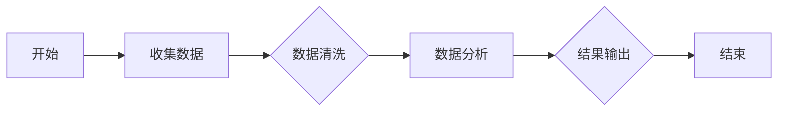

                 

### 慢管理革命：去中心化的组织变革

> 关键词：慢管理、去中心化、组织变革、管理理论、领导与沟通

> 摘要：本文深入探讨了慢管理革命的概念及其在去中心化组织变革中的应用。通过分析慢管理理念的起源、核心原则和理论依据，我们揭示了去中心化组织的设计与实施策略，以及其在领导与沟通中的关键作用。本文还从策略、最佳实践和未来展望等方面，全面解读了慢管理革命对企业管理的深远影响。

----------------------------------------------------------------

# 引言：慢管理革命的背景与意义

在当今复杂多变的市场环境中，企业管理面临着诸多挑战。传统的中心化管理模式在应对快速变化的市场需求和高度不确定的外部环境时，往往显得力不从心。这一背景下，慢管理革命作为一种新兴的管理理念，逐渐引起了广泛关注。慢管理革命倡导去中心化、分布式、自组织的组织形式，强调信任与授权，追求组织与员工的双赢。本章将探讨慢管理革命的背景、核心概念和意义，以及本书的结构安排。

### 1.1 问题背景

当前，企业管理面临的挑战主要包括：

1. **市场竞争加剧**：全球化、互联网和技术的快速发展，使得市场竞争日益激烈，企业需要快速响应市场变化。
2. **员工需求变化**：年轻一代员工更加注重个人价值和职业发展，传统管理模式难以满足这些需求。
3. **创新压力**：创新是企业发展的重要驱动力，传统管理模式往往抑制了员工的创新潜力。
4. **管理复杂性**：企业规模扩大、业务多元化，管理复杂性增加，传统的中心化管理模式难以有效应对。

### 1.2 慢管理理念的产生与发展

慢管理理念起源于对快速变革环境下企业管理困境的反思。其核心思想包括：

1. **去中心化**：打破传统的等级制度，实现权力的分散和扁平化。
2. **信任与授权**：建立信任机制，赋予员工更多的自主权。
3. **适应性**：强调组织的灵活性，能够快速适应外部环境的变化。
4. **平衡与和谐**：追求组织与员工的和谐发展，关注员工的成长和幸福。

慢管理理念在近年来得到了广泛传播和应用，成为企业管理领域的重要研究方向。

### 1.3 慢管理革命的意义

慢管理革命对于企业管理具有重要意义，主要体现在以下几个方面：

1. **提高组织效率**：去中心化的组织结构减少了层级传递的时间和成本，提高了决策效率。
2. **促进企业可持续发展**：慢管理强调平衡与和谐，有助于建立长期稳定的企业文化，推动企业可持续发展。
3. **满足员工需求与成长**：慢管理倡导信任与授权，使员工能够更好地实现个人价值和职业发展，提高员工满意度和忠诚度。

### 1.4 本书结构安排

本书将围绕慢管理革命的核心概念和实际应用展开，主要包括以下章节：

1. **第2章 慢管理革命的理论基础**：探讨慢管理革命的理论基础，包括管理理论的演进和慢管理的核心原则。
2. **第3章 去中心化组织的设计与实施**：分析去中心化组织的定义、特征和设计原则，以及实施步骤。
3. **第4章 去中心化组织中的领导与沟通**：探讨去中心化组织中的领导角色、沟通策略和协作与冲突管理。
4. **第5章 慢管理革命的实施策略**：提供慢管理革命的实施策略，包括战略规划、人力资源管理和信息技术支持。
5. **第6章 慢管理革命的最佳实践**：分析国内外企业的成功案例，总结慢管理革命的实施经验和挑战。
6. **第7章 慢管理革命的未来展望**：探讨慢管理革命的发展趋势和对企业管理的启示。
7. **第8章 总结与展望**：回顾慢管理革命的核心观点，总结本书的主要贡献，并展望未来的研究方向。

通过本书的阅读，读者将能够深入理解慢管理革命的理念和实践，掌握去中心化组织的设计与实施方法，为企业的管理变革提供有益的参考。

### 第1章 引用

慢管理革命作为一种颠覆传统管理理念的新兴管理模式，其背景与意义不容忽视。首先，让我们回顾一下慢管理理念的起源和发展。

#### 1.1 慢管理理念的起源

慢管理理念的起源可以追溯到20世纪末和21世纪初，当时企业管理者开始意识到，在快速变化的市场环境中，传统的中心化管理模式已经无法满足企业的需求。管理学者彼得·德鲁克（Peter Drucker）和亨利·明茨伯格（Henry Mintzberg）等人的研究为慢管理理念的诞生提供了理论基础。他们主张，企业管理应该更加关注员工的成长和自我实现，而非仅仅追求效率和利润。

随着互联网和全球化的发展，企业的竞争环境变得更加复杂和动态。传统管理模式的层级结构和指令控制已经无法适应这种变化。因此，慢管理理念开始流行，并逐渐成为一种新的管理趋势。

#### 1.2 慢管理理念的演变

慢管理理念的演变可以归纳为以下几个阶段：

1. **从中心化到去中心化**：慢管理强调去中心化的组织结构，鼓励员工自主决策和协作。这种变革打破了传统的等级制度，使企业更加灵活和高效。
2. **从控制到信任**：慢管理倡导建立信任机制，减少对员工的控制和监督。通过信任和授权，员工能够发挥更大的创造力和主动性，从而推动企业的创新和发展。
3. **从效率到平衡**：慢管理不仅关注企业的效率，还注重员工的幸福感和企业的可持续发展。通过追求平衡和和谐，慢管理有助于建立长期稳定的企业文化。

#### 1.3 慢管理理念的核心原则

慢管理理念的核心原则包括以下几个方面：

1. **信任与授权**：建立信任机制，赋予员工更多的自主权和决策权。员工在这种环境中能够更加自由地发挥自己的潜力，提高工作效率。
2. **适应性**：强调组织对环境变化的适应性。企业需要具备快速响应市场变化的能力，以保持竞争优势。
3. **创新与学习**：鼓励员工持续学习和创新，推动企业不断进步和发展。
4. **平衡与和谐**：追求组织与员工的和谐发展，关注员工的成长和幸福。通过平衡工作与生活，提高员工的工作满意度和忠诚度。

#### 1.4 慢管理理念的发展趋势

随着技术的不断进步和市场环境的不断变化，慢管理理念也在不断发展和演变。以下是一些当前慢管理理念的最新趋势：

1. **数字化转型**：随着数字技术的广泛应用，企业正在加速数字化转型。慢管理理念强调，企业在数字化转型过程中，需要注重员工的数字素养和技能提升。
2. **全员参与**：慢管理理念逐渐从管理层扩展到全体员工。企业鼓励员工积极参与决策和项目管理，以提高组织的整体效能。
3. **可持续发展**：在全球化背景下，企业越来越注重可持续发展。慢管理理念强调，企业在追求利润的同时，需要关注环境保护和社会责任。

#### 1.5 慢管理理念的挑战与机遇

尽管慢管理理念具有很多优势，但在实际应用中也面临一些挑战。首先，去中心化的组织结构可能导致决策分散和效率降低。其次，建立信任机制需要时间和努力，员工可能不习惯在缺乏严格监督的环境中工作。

然而，慢管理理念也为企业带来了很多机遇。通过提高员工的自主性和创新能力，企业能够更好地适应市场变化，实现可持续发展。

总之，慢管理革命作为一种新兴的管理理念，正在深刻影响着企业管理的方式和方法。通过深入了解和运用慢管理理念，企业可以更好地应对未来的挑战，实现长期稳定的发展。

#### 1.6 慢管理革命对管理的启示

慢管理革命为我们提供了对现代管理的新思考。首先，它提醒我们，管理不仅仅是关于效率和控制，更是关于信任和激励。传统管理模式中，管理者通过严格的规章制度来确保员工的行为符合预期，这种方式在慢管理理念下被重新评估。慢管理强调，通过建立信任关系，赋予员工更多的自主权，可以激发他们的创造力和主动性，从而实现更高的工作效能。

其次，慢管理革命强调了组织的适应性。在快速变化的市场环境中，企业的生存和发展依赖于其灵活性。慢管理倡导组织结构扁平化，减少层级，以便快速响应市场变化。这种模式鼓励员工跨部门合作，打破信息孤岛，从而提高决策效率和创新速度。

此外，慢管理革命还强调了员工的需求和成长。在传统管理模式中，员工的个人价值和职业发展往往被忽视。慢管理理念强调，关注员工的成长和幸福是组织成功的关键。通过提供学习和发展的机会，营造和谐的工作环境，企业可以增强员工的归属感和忠诚度，从而实现长期的可持续发展。

总之，慢管理革命不仅为企业提供了一种新的管理思路，还挑战了我们对管理传统的认知。它提醒我们，在追求效率的同时，应更多地关注组织的适应性、员工的成长和企业的社会责任。通过这些新的管理理念，企业可以更好地适应未来的挑战，实现持续的创新和发展。

### 1.7 慢管理革命的关键特征

慢管理革命的关键特征在于其对组织结构和管理的根本性变革。以下是慢管理革命的核心特征及其具体体现：

1. **去中心化**：慢管理主张打破传统的集中式管理结构，推行去中心化组织形式。这意味着权力不再集中在少数高层管理者手中，而是分散到各个部门和个人。这样不仅提高了决策速度，还增强了组织的灵活性和适应性。

   **具体体现**：去中心化组织通常采用扁平化的结构，减少中间管理层次，使决策流程更加直接和高效。例如，在软件开发团队中，团队成员可以直接参与决策，而无需经过多级审批。

2. **信任与授权**：慢管理理念强调建立信任机制，减少对员工的监督和控制。管理者通过授权，让员工自主决策和解决问题，从而激发他们的创造力和主动性。

   **具体体现**：企业可以通过设立“自主管理团队”或“自主项目小组”，给予团队成员更多的自主权。例如，在一个研发团队中，团队成员可以自行决定项目目标、工作计划和资源配置，而无需等待上级指令。

3. **适应性**：慢管理强调组织需要具备快速适应环境变化的能力。这意味着组织结构、管理流程和员工技能都需要不断调整和更新，以应对外部市场的快速变化。

   **具体体现**：企业可以通过定期进行战略调整和流程优化，确保组织能够灵活应对市场变化。例如，在产品开发过程中，企业可以采用敏捷开发方法，快速响应客户需求和市场变化。

4. **创新与学习**：慢管理鼓励员工持续学习和创新，认为这是组织发展的动力。通过提供学习和培训机会，企业可以不断提升员工的技能和知识，推动组织的创新和发展。

   **具体体现**：企业可以通过设立内部学习平台、开展创新竞赛等方式，激发员工的创新热情。例如，一家互联网公司可以设立“创新实验室”，鼓励员工提出新想法并进行实验。

5. **平衡与和谐**：慢管理不仅关注组织的效率和业绩，还重视员工的幸福感和企业的可持续发展。通过平衡工作与生活，关注员工的成长和需求，企业可以建立和谐的工作环境。

   **具体体现**：企业可以通过灵活的工作制度、员工关怀计划等方式，提高员工的工作满意度和忠诚度。例如，一家科技公司可以实施远程办公政策，让员工有更多时间陪伴家人。

总之，慢管理革命通过去中心化、信任与授权、适应性、创新与学习以及平衡与和谐等关键特征，为企业管理提供了一种全新的视角和方法。这些特征不仅帮助企业适应快速变化的市场环境，还促进了组织的可持续发展。

### 1.8 慢管理革命的影响

慢管理革命不仅改变了企业管理的方式，还对企业的战略制定、组织结构、员工管理和企业文化建设产生了深远影响。

#### 对企业战略的影响

慢管理革命强调灵活性和适应性，这直接影响企业的战略制定。企业不再需要制定长期、僵化的战略规划，而是更加注重短期内的战略调整和灵活性。慢管理理念鼓励企业根据市场变化和客户需求进行实时调整，确保战略目标与当前环境相匹配。

例如，一家科技公司可以采用敏捷开发方法，快速迭代产品，以满足不断变化的客户需求。这种方法不仅提高了市场响应速度，还增强了产品的市场竞争力。

#### 对组织结构的影响

慢管理革命倡导去中心化的组织结构，这打破了传统的层级管理模式。在去中心化的组织中，决策权被分散到各个部门和个人，减少了中间管理层次，从而提高了决策效率和沟通效果。

例如，一个研发团队可以在不经过高层管理者批准的情况下，自行决定项目的方向和资源分配，这大大加快了项目的进展速度。

#### 对员工管理的影响

慢管理理念强调员工的自主性和创造力，这改变了传统的员工管理模式。管理者不再仅仅关注员工的执行力和纪律性，而是更加注重员工的成长和发展。

例如，企业可以通过设立内部导师制度和职业发展计划，帮助员工提升技能和知识，从而实现个人价值和职业发展的双赢。

#### 对企业文化建设的影响

慢管理革命还对企业文化建设产生了深远影响。它鼓励企业建立开放、信任和协作的文化氛围，使员工能够在轻松的环境中发挥自己的潜力。

例如，企业可以通过开展团队建设活动、内部沟通会议和员工满意度调查等方式，营造积极向上的企业文化。这种文化不仅有助于提高员工的工作满意度，还能增强企业的凝聚力。

总之，慢管理革命通过改变企业的战略制定、组织结构、员工管理和企业文化建设，为企业带来了全新的管理模式和发展路径。它不仅提高了企业的灵活性和适应性，还促进了组织的创新和可持续发展。

### 1.9 慢管理革命的应用场景

慢管理革命在企业管理中的应用场景非常广泛，以下是一些典型的应用实例：

#### 1. 企业创新团队

在创新团队中，慢管理理念的应用尤为突出。通过去中心化和自主管理，团队成员可以自由地提出新想法，并进行实验和验证。例如，一家科技公司可以通过设立内部创新实验室，鼓励员工进行自主研究和技术探索。这种模式不仅提高了创新效率，还激发了员工的创造力和主动性。

#### 2. 灵活办公

随着远程办公和移动办公的普及，慢管理理念在灵活办公中的应用也越来越广泛。企业可以通过提供灵活的工作时间和地点，让员工能够根据自己的需求和偏好安排工作。例如，一家互联网公司可以实施远程办公政策，使员工能够在家或任何地方工作，从而提高工作效率和员工满意度。

#### 3. 跨部门协作

在跨部门协作中，慢管理理念强调跨部门团队的自主性和协同性。企业可以通过设立跨部门项目组，赋予团队成员更多的自主权，让他们自行决定项目方向和资源配置。例如，在一个市场推广项目中，市场营销团队、销售团队和研发团队可以共同决策，以提高项目成功率。

#### 4. 企业文化建设

在企业文化建设中，慢管理理念鼓励企业建立开放、信任和协作的文化氛围。通过员工满意度调查、内部沟通会议和团队建设活动，企业可以营造积极向上的企业文化，增强员工的归属感和忠诚度。

#### 5. 供应链管理

在供应链管理中，慢管理理念的应用可以提升供应链的灵活性和适应性。企业可以通过建立去中心化的供应链网络，减少对单一供应商的依赖，从而降低供应链风险。例如，一家制造业企业可以通过与多个供应商建立长期合作关系，实现供应链的多样化和弹性。

总之，慢管理革命在企业管理中的应用场景非常广泛，它不仅提高了组织的灵活性和适应性，还促进了企业的创新和可持续发展。通过在不同场景中的应用，企业可以更好地适应市场变化，实现长期稳定的发展。

### 1.10 慢管理革命的优势与挑战

慢管理革命作为一种创新的管理理念，具有显著的优势，但也面临一些挑战。以下是对其优势与挑战的详细分析：

#### 优势

1. **提高组织效率**：去中心化的组织结构减少了决策层次，缩短了决策路径，使企业能够更快速地响应市场变化，提高整体运作效率。

2. **增强员工自主性**：慢管理理念强调信任与授权，员工拥有更多的自主权，可以自行决策和解决问题，从而激发了他们的创造力和主动性。

3. **促进创新**：慢管理鼓励员工持续学习和创新，提供更多的实验机会和资源支持，有助于企业保持技术领先和市场竞争力。

4. **提升员工满意度**：通过关注员工的成长和幸福，慢管理有助于提高员工的工作满意度和忠诚度，降低员工流失率。

5. **适应性强**：慢管理注重组织的适应性，能够快速调整和优化，以应对外部环境的变化，提高企业的生存和发展能力。

#### 挑战

1. **决策分散**：去中心化的组织结构可能导致决策分散，缺乏统一领导，增加协调难度，影响决策的一致性和效率。

2. **信任建立困难**：建立信任机制需要时间和努力，员工和管理者可能不习惯在缺乏严格监督的环境中工作，信任关系的建立面临挑战。

3. **管理复杂度增加**：随着组织结构的变化，管理复杂度增加，管理者需要具备更高的管理能力和综合素质，以应对新的管理挑战。

4. **文化变革难度**：慢管理理念要求企业建立开放、信任和协作的文化氛围，这需要长期的文化变革和员工培训，实现难度较大。

5. **技术支持不足**：慢管理革命需要信息技术支持，如协作工具、数据分析和自动化流程等，一些企业在技术支持方面可能存在不足。

总之，慢管理革命在提高组织效率和创新能力方面具有显著优势，但也需要克服决策分散、信任建立困难、管理复杂度增加等挑战。通过有效的策略和措施，企业可以充分发挥慢管理革命的优势，实现长期稳定的发展。

### 第1章 总结

本章围绕慢管理革命的背景、核心概念和意义进行了深入探讨。我们首先分析了当前企业管理面临的挑战，包括市场竞争加剧、员工需求变化、创新压力和管理复杂性等。接着，我们介绍了慢管理理念的起源、演变和核心原则，如去中心化、信任与授权、适应性、创新与学习以及平衡与和谐。通过详细阐述慢管理革命的理论基础和关键特征，我们揭示了其在企业管理中的重大意义，包括提高组织效率、促进企业可持续发展、满足员工需求与成长等。同时，我们还探讨了慢管理革命的应用场景，如企业创新团队、灵活办公、跨部门协作、企业文化建设以及供应链管理。最后，我们总结了慢管理革命的优势与挑战，强调了其在现代企业管理中的重要性。通过本章的阅读，读者应能对慢管理革命有一个全面的理解，为后续章节的深入学习奠定基础。

----------------------------------------------------------------

### 第2章 慢管理革命的理论基础

慢管理革命并非凭空产生，而是建立在一系列管理理论和实践的基础上。本章将探讨慢管理革命的理论基础，包括管理理论的演进、慢管理的核心原则，以及慢管理与去中心化之间的联系。通过深入分析这些理论背景，我们将更好地理解慢管理革命的本质和适用性。

#### 2.1 管理理论的演进

管理理论的发展经历了多个阶段，从早期的科学管理理论到现代的复杂系统理论，每一步都反映了管理实践的不断进步和演变。

1. **科学管理理论（19世纪末至20世纪初）**：科学管理理论的代表人物是弗雷德里克·泰勒（Frederick Taylor）。他主张通过科学的方法来管理生产过程，提高劳动生产率。泰勒提出了“标准化工作方法”和“时间与动作研究”，试图通过精确的衡量和监控来提高工作效率。

2. **人际关系理论（20世纪30年代至50年代）**：梅奥（Elton Mayo）等人通过霍桑实验发现，员工的工作效率不仅取决于工作条件，还受到人际关系和工作环境的影响。人际关系理论强调管理应该关注员工的情感需求，建立良好的工作氛围，提高员工的工作满意度和生产力。

3. **系统理论（20世纪60年代至80年代）**：系统理论将组织视为一个复杂的系统，强调组织内部各个部分之间的相互关系和动态平衡。系统理论的核心观点是，组织的效率不仅取决于局部优化，更取决于整体优化。代表性理论包括列昂节夫（W. Russell Lynd）的“社会系统理论”和巴纳德（Chester Barnard）的“组织理论”。

4. **变革管理理论（20世纪90年代至今）**：随着全球化、信息技术和电子商务的发展，管理环境变得更加复杂和动态。变革管理理论强调，企业需要具备快速适应环境变化的能力，通过持续变革和创新来保持竞争力。代表性理论包括彼得·圣吉（Peter Senge）的“学习型组织理论”和约翰·科特（John P. Kotter）的“领导变革理论”。

#### 2.2 慢管理的核心原则

慢管理理念基于上述管理理论的演进，提出了若干核心原则，这些原则构成了慢管理革命的理论基础。

1. **信任与授权**：慢管理强调建立信任机制，减少对员工的控制和监督，赋予员工更多的自主权和决策权。信任是慢管理成功的关键，它能够激发员工的创造力和主动性，提高工作效率。

2. **适应性**：慢管理认为，组织必须具备快速适应外部环境变化的能力。这意味着企业需要具备灵活的组织结构和决策机制，能够快速响应市场变化和客户需求。

3. **创新与学习**：慢管理鼓励员工持续学习和创新，认为这是组织发展的动力。通过提供学习和发展的机会，企业可以不断提升员工的技能和知识，推动组织的创新和发展。

4. **平衡与和谐**：慢管理不仅关注组织的效率和业绩，还重视员工的幸福感和企业的可持续发展。通过平衡工作与生活，关注员工的成长和需求，企业可以建立和谐的工作环境。

5. **整体优化**：慢管理强调整体优化，认为组织的效率不仅取决于局部优化，更取决于整体优化。这意味着企业需要在组织设计、流程优化和资源配置等方面进行全面考量，以实现整体最优。

#### 2.3 去中心化与慢管理的联系

去中心化是慢管理革命的核心概念之一，它与慢管理的核心原则紧密相连。

1. **去中心化对慢管理的影响**：去中心化的组织结构打破了传统的集中化管理模式，使决策权分散到各个部门和个人。这种结构有助于提高组织的灵活性和适应性，使企业能够更快地响应市场变化和客户需求。

2. **慢管理对去中心化的需求**：慢管理强调信任与授权，要求企业建立去中心化的组织结构。这种结构能够激发员工的自主性和创造力，提高工作效率。同时，去中心化能够减少管理层级，降低沟通成本，提高决策效率。

3. **联系与相互作用**：慢管理的核心原则，如适应性、创新与学习、平衡与和谐，都与去中心化密切相关。去中心化的组织结构有助于实现这些原则，而慢管理的核心原则则指导了去中心化的具体实施和优化。

通过分析管理理论的演进和慢管理的核心原则，我们可以看到，慢管理革命并非一蹴而就，而是基于多年的管理实践和理论探索。去中心化作为慢管理革命的核心概念，与慢管理的核心原则相互促进，共同构成了现代企业管理的新模式。这种模式不仅提高了企业的灵活性和适应性，还促进了员工的创新和成长，为企业的发展注入了新的动力。

### 第2章 分析

在探讨慢管理革命的理论基础时，我们需要深入了解其核心原则以及去中心化组织与慢管理之间的内在联系。以下是对这些内容的详细分析。

#### 2.1 管理理论的演进

管理理论的演进是一个持续的过程，每个阶段都反映了当时社会经济环境的变化。以下是几个关键阶段及其主要理论：

1. **科学管理理论**：弗雷德里克·泰勒是科学管理理论的奠基人。他主张通过科学的方法来优化生产过程，提高劳动生产率。泰勒提出的“标准化工作方法”和“时间与动作研究”等理念，通过精确的时间管理和任务分配，提高了生产效率。

   **具体内容**：
   - **标准化工作方法**：将工作分解为一系列标准化的步骤，确保每个员工都能按照统一的方法进行操作。
   - **时间与动作研究**：对每个工作步骤进行详细的时间分析，找出最有效的工作方法。

2. **人际关系理论**：梅奥等人通过霍桑实验发现，员工的工作效率不仅取决于工作条件，还受到人际关系和工作环境的影响。这一理论强调了员工的心理需求，并提出了“社会人”的概念，认为员工不仅追求物质利益，还追求社交和心理满足。

   **具体内容**：
   - **霍桑实验**：实验发现，改变工作条件并不能显著提高员工的生产效率，而改善工作环境、增加团队合作和员工参与能够显著提高生产力。
   - **社会人**：认为员工是社会的一部分，他们的工作不仅仅是为了金钱，还有对社交、尊重和自我实现的需求。

3. **系统理论**：系统理论将组织视为一个复杂的系统，强调组织内部各个部分之间的相互关系和动态平衡。系统理论认为，组织的效率和效能不仅取决于局部优化，还取决于整体优化。

   **具体内容**：
   - **社会系统理论**：列昂节夫提出，组织是一个由多个子系统组成的复杂系统，每个子系统都有其特定的功能和相互依赖的关系。
   - **组织理论**：巴纳德提出，组织是由多个个体组成的协作系统，有效组织的关键在于建立明确的沟通机制和激励措施。

4. **变革管理理论**：随着全球化和信息技术的发展，管理环境变得更加复杂和动态。变革管理理论强调，企业需要具备快速适应环境变化的能力，通过持续变革和创新来保持竞争力。

   **具体内容**：
   - **学习型组织**：彼得·圣吉提出，学习型组织是一种能够不断学习、适应和创新的组织，通过持续学习和知识共享，提高组织的整体效能。
   - **领导变革**：约翰·科特提出，领导者在变革过程中扮演关键角色，需要制定清晰的愿景、建立变革联盟、沟通变革理由、克服变革阻力等。

#### 2.2 慢管理的核心原则

慢管理的核心原则是在传统管理理论的基础上，结合现代管理实践，提出的应对复杂动态环境的策略。以下是慢管理的核心原则及其具体内容：

1. **信任与授权**：信任与授权是慢管理的核心原则之一。慢管理认为，管理者应该信任员工的判断力和责任感，并赋予他们足够的自主权和决策权，从而激发员工的创造力和主动性。

   **具体内容**：
   - **信任**：建立信任关系，减少对员工的监控和干预，让员工感受到信任和支持。
   - **授权**：赋予员工决策权和责任，让他们能够自主解决问题和执行任务。

2. **适应性**：适应性是企业在复杂动态环境中生存和发展的关键。慢管理强调，企业需要具备快速适应外部环境变化的能力，通过灵活的组织结构和决策机制，实现快速响应。

   **具体内容**：
   - **灵活的组织结构**：采用扁平化的组织结构，减少管理层级，提高信息传递速度和决策效率。
   - **敏捷的决策机制**：建立快速决策和反馈机制，确保企业能够迅速调整策略，应对市场变化。

3. **创新与学习**：慢管理鼓励员工持续学习和创新，认为这是组织发展的动力。企业应该为员工提供学习和发展的机会，鼓励他们探索新的思路和方法。

   **具体内容**：
   - **持续学习**：为员工提供培训和学习资源，帮助他们提升技能和知识。
   - **创新文化**：建立创新激励机制，鼓励员工提出新想法和进行实验。

4. **平衡与和谐**：慢管理不仅关注组织的效率和业绩，还重视员工的幸福感和企业的可持续发展。通过平衡工作与生活，关注员工的成长和需求，企业可以建立和谐的工作环境。

   **具体内容**：
   - **员工关怀**：关注员工的心理和生理健康，提供灵活的工作安排和福利待遇。
   - **可持续发展**：在追求经济效益的同时，关注环境保护和社会责任，实现企业、员工和社会的和谐发展。

5. **整体优化**：慢管理强调，组织的效率不仅取决于局部优化，还取决于整体优化。企业需要在组织设计、流程优化和资源配置等方面进行全面考量，以实现整体最优。

   **具体内容**：
   - **系统思考**：从整体角度出发，分析各个部分之间的相互关系和动态平衡。
   - **综合平衡**：在决策和资源配置时，综合考虑各种因素，避免局部优化导致整体效能下降。

#### 2.3 去中心化与慢管理的联系

去中心化是慢管理革命的核心概念之一，它与慢管理的核心原则紧密相连。以下是去中心化与慢管理之间的联系及其具体表现：

1. **去中心化对慢管理的影响**：去中心化的组织结构有助于实现慢管理的核心原则。通过减少管理层级，去中心化可以缩短决策路径，提高决策速度和灵活性，使企业能够更快速地响应市场变化和客户需求。

   **具体表现**：
   - **决策分散**：决策权分散到各个部门和个人，减少了集中决策的耗时和复杂性。
   - **信息透明**：信息在组织内自由流动，提高了决策的准确性和效率。

2. **慢管理对去中心化的需求**：慢管理理念强调信任与授权，要求企业建立去中心化的组织结构。这种结构能够激发员工的自主性和创造力，提高工作效率。同时，去中心化能够减少管理层级，降低沟通成本，提高决策效率。

   **具体表现**：
   - **自主管理团队**：团队成员拥有更多的自主权，可以直接参与决策和项目管理。
   - **扁平化组织**：减少中间管理层，实现组织结构的扁平化，提高决策效率。

3. **联系与相互作用**：慢管理的核心原则，如适应性、创新与学习、平衡与和谐，都与去中心化密切相关。去中心化的组织结构有助于实现这些原则，而慢管理的核心原则则指导了去中心化的具体实施和优化。

   **具体表现**：
   - **适应性**：去中心化组织能够快速调整和优化，以应对外部环境的变化。
   - **创新与学习**：去中心化鼓励员工持续学习和创新，推动组织的持续发展。
   - **平衡与和谐**：去中心化有助于建立开放、信任和协作的文化氛围，实现组织与员工的和谐发展。

通过深入分析管理理论的演进和慢管理的核心原则，我们可以看到，慢管理革命并非凭空产生，而是基于多年的管理实践和理论探索。去中心化作为慢管理革命的核心概念，与慢管理的核心原则相互促进，共同构成了现代企业管理的新模式。这种模式不仅提高了企业的灵活性和适应性，还促进了员工的创新和成长，为企业的发展注入了新的动力。

### 第2章 结论

本章通过分析管理理论的演进和慢管理的核心原则，深入探讨了慢管理革命的理论基础。从科学管理理论、人际关系理论到系统理论，再到变革管理理论，每个阶段的管理理念都反映了管理实践的发展和变化。慢管理理念在此基础上提出，旨在应对现代企业面临的复杂动态环境。其核心原则包括信任与授权、适应性、创新与学习、平衡与和谐，以及整体优化。通过去中心化的组织结构，慢管理实现了决策的分散和灵活性的提升，推动了企业适应外部环境变化的能力。本章的分析表明，慢管理革命不仅是一种管理理念的革新，更是企业应对未来挑战的重要策略。通过对这些理论基础的深入理解，企业可以更好地实施慢管理，实现长期稳定的发展和可持续成长。

----------------------------------------------------------------

### 第3章 去中心化组织的设计与实施

去中心化组织的设计与实施是慢管理革命成功的关键之一。本章将详细探讨去中心化组织的定义、特征，以及设计原则和实施步骤。通过这些内容，我们将帮助读者理解如何构建一个高效、灵活的去中心化组织。

#### 3.1 去中心化组织的定义与特征

去中心化组织是指权力和决策分散在组织内部的各个层级和个人之间，而不是集中在少数高层管理者手中的组织形式。这种组织结构强调自主性、协作性和适应性。

1. **定义**：去中心化组织（Decentralized Organization）是一种组织形式，其中决策权分散到各个部门和个人，减少了中央集权的管理层级。
   
2. **特征**：
   - **权力分散**：权力不再集中在少数高层管理者手中，而是分散到各个部门和个人，使决策更加快速和灵活。
   - **自主性**：员工拥有更多的自主权，可以自行决策和解决问题，发挥个人创造力和主动性。
   - **协作性**：部门和个人之间通过协作和共享信息来实现共同目标，打破了信息孤岛和部门壁垒。
   - **适应性**：组织能够快速适应外部环境的变化，具备灵活的调整能力。

#### 3.2 设计去中心化组织的原则

设计一个成功的去中心化组织需要遵循以下原则：

1. **自组织原则**：自组织原则强调组织内部的自主性和自我调整能力。通过赋予员工更多的自主权，组织能够更好地适应外部环境的变化。

   **具体原则**：
   - **自主决策**：员工在职责范围内拥有决策权，可以独立处理问题。
   - **自我管理**：团队和个人通过自我管理来实现组织目标，减少外部干预。

2. **分权原则**：分权原则是指将决策权下放到各个层级和个人，减少中央集权的管理模式。

   **具体原则**：
   - **减少层级**：简化组织结构，减少管理层次，提高决策效率。
   - **明确权责**：确保每个部门和个人的权责明确，避免权责不明导致的决策混乱。

3. **弹性原则**：弹性原则强调组织在应对外部环境变化时的灵活性。

   **具体原则**：
   - **快速响应**：建立快速决策和反馈机制，确保组织能够迅速调整策略。
   - **动态调整**：根据外部环境的变化，灵活调整组织结构和流程。

#### 3.3 实施去中心化组织的步骤

实施去中心化组织需要一系列的步骤和策略，以下是具体的实施步骤：

1. **评估现有组织结构**：首先，需要评估现有组织结构是否适合实施去中心化。评估内容包括组织层级、决策流程、员工自主权等。

   **步骤**：
   - **现状分析**：通过调查和分析，了解现有组织结构的优缺点。
   - **问题识别**：识别需要改进的方面，如层级过多、决策缓慢等。

2. **确定去中心化目标**：明确去中心化的目标，包括提高决策效率、增强员工自主性、提升组织灵活性等。

   **步骤**：
   - **目标设定**：根据企业战略和发展需求，设定具体去中心化目标。
   - **目标分解**：将总体目标分解为具体的实施步骤和指标。

3. **制定实施计划**：制定详细的实施计划，包括时间表、责任分工、资源分配等。

   **步骤**：
   - **时间安排**：确定实施去中心化的大致时间表，确保各阶段顺利推进。
   - **责任分工**：明确各部门和个人的职责，确保实施计划的执行。
   - **资源分配**：合理分配资源，确保实施过程中所需的人力、物力和财力。

4. **培训和沟通**：确保员工理解和接受去中心化的理念，提高员工的自组织和协作能力。

   **步骤**：
   - **培训计划**：制定培训计划，包括培训内容、培训方式和培训时间。
   - **沟通机制**：建立有效的沟通机制，确保信息在组织内自由流动。
   - **反馈机制**：建立反馈机制，及时了解员工在实施过程中的问题和需求。

5. **监督与调整**：在实施过程中，持续监督和调整，确保去中心化目标的实现。

   **步骤**：
   - **监督机制**：建立监督机制，监控实施进度和效果。
   - **调整策略**：根据监督结果，及时调整实施计划，确保目标的实现。

通过以上步骤，企业可以逐步实现去中心化的组织变革，提高组织的灵活性和适应性，实现企业的长期稳定发展。

### 第3章 分析

在探讨去中心化组织的设计与实施时，我们需要深入了解其核心要素，包括组织结构的调整、决策权的下放以及员工自主性和协作能力的提升。以下是对这些要素的详细分析。

#### 3.1 去中心化组织的设计原则

去中心化组织的设计原则是确保组织能够有效运作的关键。以下是几个核心设计原则：

1. **自组织原则**：自组织原则强调组织的自我调整能力和自主性。通过赋予员工更多的自主权，员工能够在职责范围内独立决策和解决问题。

   **具体内容**：
   - **自主决策**：员工在明确职责范围内，可以根据实际情况独立做出决策，无需层层请示。
   - **自我管理**：团队和个人通过自我管理，制定工作计划、分配任务和监控进度，减少外部干预。

2. **分权原则**：分权原则是指将决策权从高层管理者下放到各个部门和个人，减少中央集权的层级结构。

   **具体内容**：
   - **减少层级**：简化组织结构，减少管理层次，缩短决策路径，提高决策效率。
   - **明确权责**：确保每个部门和个人的权责明确，避免权责不明导致的决策混乱。

3. **弹性原则**：弹性原则强调组织在应对外部环境变化时的灵活性。通过快速响应和动态调整，组织能够保持竞争力。

   **具体内容**：
   - **快速响应**：建立快速决策和反馈机制，确保组织能够迅速调整策略，应对外部环境的变化。
   - **动态调整**：根据外部环境的变化，灵活调整组织结构和流程，以适应新的需求。

#### 3.2 去中心化组织的组织结构

去中心化组织的组织结构是支持其高效运作的基础。以下是去中心化组织结构的关键特点：

1. **扁平化结构**：去中心化组织通常采用扁平化的结构，减少中间管理层，使决策权更加分散。

   **具体内容**：
   - **减少层级**：通过减少管理层次，提高信息传递速度和决策效率，减少信息失真。
   - **扩大团队权限**：赋予团队更大的自主权，使其能够在项目或任务中独立运作。

2. **网络化结构**：去中心化组织强调跨部门和跨团队的协作，采用网络化结构，促进信息共享和资源整合。

   **具体内容**：
   - **跨部门协作**：通过建立跨部门项目组或工作小组，促进不同部门之间的信息共享和资源整合。
   - **扁平化沟通**：采用开放和透明的沟通方式，确保信息在组织内自由流动，减少沟通障碍。

3. **弹性结构**：去中心化组织具有弹性结构，能够根据外部环境的变化迅速调整。

   **具体内容**：
   - **快速响应**：建立快速响应机制，确保组织能够迅速应对外部环境的变化。
   - **动态调整**：通过灵活的调整机制，组织能够适应新的需求和环境变化。

#### 3.3 决策权的下放

决策权的下放是去中心化组织的重要特征，它有助于提高决策效率和组织灵活性。以下是决策权下放的关键要素：

1. **授权机制**：建立授权机制，确保员工在职责范围内拥有决策权。

   **具体内容**：
   - **明确授权**：明确每个员工或团队的授权范围，确保他们在授权范围内独立决策。
   - **授权支持**：提供必要的资源和支持，确保员工能够有效行使决策权。

2. **信任机制**：建立信任机制，减少对员工的监控和干预。

   **具体内容**：
   - **信任文化**：建立信任文化，鼓励员工自主决策，减少对员工的过度干预。
   - **信任考核**：通过绩效评估和反馈机制，确保员工能够负责任地行使决策权。

3. **反馈机制**：建立有效的反馈机制，确保决策的正确性和有效性。

   **具体内容**：
   - **实时反馈**：通过实时反馈机制，及时收集员工和客户的反馈，不断优化决策。
   - **决策复盘**：定期进行决策复盘，总结经验教训，提高未来决策的质量。

#### 3.4 员工自主性和协作能力的提升

去中心化组织强调员工的自主性和协作能力，以下是如何提升这些能力的关键措施：

1. **自主性培养**：通过培训和激励，培养员工的自主性和创新能力。

   **具体内容**：
   - **自主性培训**：提供自主性培训，帮助员工理解去中心化组织的理念，提高自主决策能力。
   - **创新激励**：设立创新激励机制，鼓励员工提出新想法和解决方案。

2. **协作能力培养**：通过团队建设和跨部门协作，提升员工的协作能力。

   **具体内容**：
   - **团队建设**：开展团队建设活动，增强团队成员之间的信任和协作。
   - **跨部门协作**：建立跨部门协作机制，促进不同部门之间的信息共享和资源整合。

3. **沟通机制优化**：建立有效的沟通机制，确保信息在组织内自由流动。

   **具体内容**：
   - **沟通平台**：提供便捷的沟通平台，如内部邮件、即时通讯工具、协作平台等。
   - **透明沟通**：倡导透明沟通，鼓励员工分享信息和经验，减少信息孤岛。

通过以上分析和措施，企业可以成功设计并实施去中心化组织，提高组织的灵活性和适应性，实现长期稳定的发展。

### 第3章 结论

本章详细探讨了去中心化组织的设计与实施，包括定义、特征、设计原则和实施步骤。我们首先介绍了去中心化组织的定义和关键特征，如权力分散、自主性和协作性。接着，我们提出了设计去中心化组织的核心原则，包括自组织原则、分权原则和弹性原则，并详细阐述了这些原则的具体内容和实施策略。在实施步骤方面，我们分阶段介绍了评估现有组织结构、确定去中心化目标、制定实施计划、培训和沟通以及监督与调整等内容。通过这些分析和措施，企业可以逐步实现去中心化的组织变革，提高组织的灵活性和适应性，实现企业的长期稳定发展。总之，去中心化组织是慢管理革命成功的关键，通过合理设计和实施，企业可以更好地适应外部环境的变化，实现持续创新和高效运作。

----------------------------------------------------------------

### 第4章 去中心化组织中的领导与沟通

在去中心化组织中，领导与沟通的角色和重要性发生了显著变化。传统的集中式领导模式不再适用，领导者需要转变为赋能者和协调者，同时，沟通成为确保组织运作顺畅的关键。本章将探讨去中心化组织中的领导角色、沟通策略以及协作与冲突管理，以帮助读者更好地理解如何在这一新型组织结构中实现高效管理。

#### 4.1 去中心化组织中的领导角色

在去中心化组织中，领导者的角色发生了显著变化。传统领导模式依赖于权威和控制，而在去中心化组织中，领导者需要转变为赋能者和协调者，以促进员工的自主性和创新。

1. **赋能者**：领导者不再是命令的发布者，而是资源的提供者和问题的解决者。他们通过提供必要的资源、信息和指导，帮助员工实现个人目标和组织目标。

   **具体内容**：
   - **资源提供**：为员工提供所需的工作资源、培训机会和决策支持。
   - **问题解决**：在员工遇到困难时，提供帮助和指导，协助他们解决问题。

2. **协调者**：领导者需要在不同团队和个体之间进行协调，确保组织目标的实现。他们通过建立有效的沟通渠道和协作机制，促进团队间的信息共享和资源整合。

   **具体内容**：
   - **协调协作**：协调不同团队之间的工作，确保项目进展顺利。
   - **沟通桥梁**：作为沟通的桥梁，确保信息在组织内自由流动，减少信息孤岛。

3. **激励者**：领导者通过激励措施，激发员工的自主性和创新精神。他们鼓励员工提出新想法，并通过奖励机制激励员工积极参与创新活动。

   **具体内容**：
   - **奖励机制**：设立创新奖励和绩效奖励，激励员工积极参与创新活动。
   - **认可与表彰**：通过认可和表彰，提高员工的工作动力和自豪感。

#### 4.2 沟通在去中心化组织中的重要性

沟通在去中心化组织中扮演着至关重要的角色。有效的沟通能够确保信息在组织内自由流动，促进团队协作，提高组织效率。

1. **信息共享**：去中心化组织强调信息的透明和开放，通过有效的沟通机制，确保信息在组织内共享。

   **具体内容**：
   - **实时沟通**：采用实时沟通工具，如即时通讯、邮件和视频会议，确保信息传递的及时性。
   - **文档共享**：利用文档管理系统，确保文档的共享和版本控制，提高工作效率。

2. **协作促进**：有效的沟通能够促进团队间的协作，减少误解和冲突。

   **具体内容**：
   - **跨部门协作**：通过跨部门沟通平台，促进不同部门之间的协作和资源整合。
   - **协作工具**：采用协作工具，如项目管理软件和协作平台，提高团队协作效率。

3. **决策支持**：沟通为领导者提供决策支持，帮助他们了解组织的实际状况，做出明智的决策。

   **具体内容**：
   - **反馈机制**：建立反馈机制，收集员工的意见和建议，为领导者的决策提供参考。
   - **决策透明**：确保决策过程透明，让员工了解决策的理由和影响，提高员工对决策的接受度。

#### 4.3 去中心化组织中的协作与冲突管理

在去中心化组织中，协作与冲突管理尤为重要。有效的协作和冲突管理能够确保组织目标的实现，提高整体效率。

1. **协作机制**：建立有效的协作机制，促进团队间的信息共享和资源整合。

   **具体内容**：
   - **项目协作平台**：采用项目协作平台，如Jira或Trello，确保项目进展的透明和可追踪。
   - **知识共享平台**：建立知识共享平台，如Wiki或知识库，促进团队间的知识传递和积累。

2. **冲突识别**：及时识别和解决冲突，确保组织运营的顺利进行。

   **具体内容**：
   - **冲突预警系统**：建立冲突预警系统，通过实时监控和数据分析，识别潜在冲突。
   - **冲突解决机制**：建立冲突解决机制，通过协商、调解和仲裁等方式，解决冲突。

3. **冲突管理策略**：
   - **预防策略**：通过有效的沟通和协作机制，预防冲突的发生。
   - **解决策略**：在冲突发生后，通过有效的沟通和协作，解决问题，恢复组织和谐。

通过以上分析，我们可以看到，在去中心化组织中，领导者的角色转变为赋能者和协调者，沟通成为确保组织运作的关键，协作与冲突管理至关重要。通过有效的领导与沟通，企业可以更好地实现去中心化的优势，提高组织的灵活性和适应性，实现长期稳定的发展。

### 第4章 分析

在去中心化组织中，领导与沟通的角色和重要性发生了显著变化，这与传统的集中式领导模式有本质的不同。以下是对去中心化组织中领导与沟通的详细分析：

#### 4.1 去中心化组织中的领导角色

去中心化组织的领导者不再是传统意义上的指挥者，而是赋能者和协调者。这一转变体现了对员工自主性和创新能力的重视，以及组织结构扁平化的需求。

1. **赋能者**：
   - **角色转变**：领导者需要从发号施令转变为提供支持和资源，鼓励员工自主决策和解决问题。
   - **具体职责**：领导者需为员工提供必要的工具、资源和培训，帮助他们更好地完成任务。例如，在软件开发团队中，领导者可以为团队提供开发工具、技术文档和培训课程，以便团队能够独立完成任务。

2. **协调者**：
   - **角色转变**：领导者需要协调不同团队和个体之间的工作，确保组织目标的实现。
   - **具体职责**：领导者需搭建沟通桥梁，确保信息在组织内自由流动，减少信息孤岛。例如，在一个跨国公司的项目中，领导者需确保各个团队成员能够及时了解项目进展和需求变化，通过视频会议和即时通讯工具进行实时沟通。

3. **激励者**：
   - **角色转变**：领导者需激发员工的自主性和创新精神，鼓励他们提出新想法。
   - **具体职责**：领导者可以通过设立创新奖励和绩效奖励来激励员工。例如，一家科技公司可以设立“创新奖”，鼓励员工提出改善产品和流程的创新方案。

#### 4.2 沟通在去中心化组织中的重要性

沟通在去中心化组织中起着至关重要的作用，因为这种组织结构依赖高度的信息透明和开放的沟通环境。

1. **信息共享**：
   - **必要性**：在去中心化组织中，信息共享有助于确保每个团队成员都能够获取到必要的信息，从而做出正确的决策。
   - **具体措施**：企业可以通过建立内部沟通平台，如电子邮件、即时通讯工具和协作软件，实现实时信息共享。例如，一个研发团队可以使用GitHub进行代码管理和协作，通过GitLab的Wiki分享项目文档和进展报告。

2. **协作促进**：
   - **必要性**：去中心化组织依赖于团队间的紧密协作，以实现共同的目标。
   - **具体措施**：企业可以通过建立跨部门协作平台，如Confluence或Notion，促进团队间的信息共享和协作。例如，市场部可以与研发部通过这些工具共享市场数据和产品需求，确保产品开发与市场需求保持一致。

3. **决策支持**：
   - **必要性**：领导者需要基于全面和准确的信息做出决策，以保持组织的灵活性。
   - **具体措施**：企业可以通过建立反馈机制，收集员工和客户的反馈，为决策提供数据支持。例如，企业可以通过在线调查或用户反馈平台收集用户意见，帮助领导者了解市场需求和用户反馈，从而做出更明智的决策。

#### 4.3 协作与冲突管理

在去中心化组织中，协作与冲突管理是确保组织高效运作的关键。

1. **协作机制**：
   - **必要性**：去中心化组织需要建立有效的协作机制，以确保团队成员能够高效合作。
   - **具体措施**：企业可以通过采用项目管理工具，如Jira或Trello，确保项目任务和进度的透明和可追踪。例如，一个研发团队可以使用Jira来分配任务、跟踪进度和解决问题。

2. **冲突识别**：
   - **必要性**：及时识别冲突有助于避免问题扩大，确保组织运营的顺利进行。
   - **具体措施**：企业可以通过建立冲突预警系统，通过实时监控和数据分析来识别潜在冲突。例如，通过分析团队协作工具的使用情况，识别沟通不畅或任务分配不合理的问题。

3. **冲突管理策略**：
   - **预防策略**：通过建立开放和透明的沟通机制，预防冲突的发生。
   - **解决策略**：在冲突发生后，通过有效沟通和协商解决。例如，企业可以设立冲突解决委员会，负责协调和处理冲突。

通过以上分析，我们可以看到，在去中心化组织中，领导者需要转变为赋能者和协调者，沟通成为确保组织运作的关键，协作与冲突管理是确保组织高效运作的重要手段。有效的领导与沟通策略有助于提高组织的灵活性和适应性，实现长期稳定的发展。

### 第4章 结论

本章详细探讨了去中心化组织中的领导与沟通，揭示了在去中心化环境中领导角色的转变和沟通的重要性。我们首先介绍了去中心化组织中领导者的新角色，包括赋能者、协调者和激励者，并阐述了他们的具体职责和作用。接着，我们深入分析了沟通在去中心化组织中的重要性，包括信息共享、协作促进和决策支持等方面。最后，我们探讨了协作与冲突管理在去中心化组织中的关键作用，提出了有效的协作机制和冲突管理策略。通过本章的分析，读者可以更好地理解如何在去中心化组织中实现高效管理，为企业的长期稳定发展提供有力支持。

----------------------------------------------------------------

### 第5章 慢管理革命的实施策略

实施慢管理革命需要一系列的系统性策略，这些策略涵盖了战略规划、人力资源管理和信息技术支持等方面。本章将详细探讨这些策略，并提供具体的实施方法和建议，以帮助企业成功实施慢管理革命。

#### 5.1 制定战略规划

战略规划是实施慢管理革命的第一步，它为企业提供了明确的发展方向和行动指南。以下是制定战略规划的关键步骤：

1. **明确企业愿景与使命**：企业愿景和使命是战略规划的基础。通过明确企业未来的愿景和使命，企业可以更好地确定战略目标和发展方向。

   **具体步骤**：
   - **愿景定义**：明确企业长期的发展愿景，例如成为行业领导者或实现全球市场份额。
   - **使命陈述**：阐述企业的核心价值观和使命，确保员工理解并认同企业的核心价值。

2. **分析外部环境**：了解外部环境的变化趋势和潜在机遇与威胁，有助于企业制定更具前瞻性的战略。

   **具体步骤**：
   - **市场分析**：研究市场需求、竞争态势和行业趋势，确定市场机会。
   - **SWOT分析**：通过SWOT分析（优势、劣势、机会、威胁），识别企业内外部环境的关键因素。

3. **设定具体目标**：根据企业愿景和外部环境分析，设定具体的战略目标。这些目标应具有可衡量性和可实现性。

   **具体步骤**：
   - **目标设定**：明确短期和长期目标，例如提高市场份额、提升员工满意度和实现可持续发展。
   - **目标分解**：将总体目标分解为具体的实施步骤和指标，确保目标的可操作性和可行性。

4. **制定实施计划**：制定详细的战略实施计划，明确时间表、责任分工和资源分配。

   **具体步骤**：
   - **时间安排**：制定战略实施的时间表，确保各阶段目标的顺利推进。
   - **责任分工**：明确各部门和个人的职责，确保实施计划的执行。
   - **资源分配**：合理分配人力资源、财务和技术资源，确保实施计划的顺利执行。

#### 5.2 人力资源管理的调整

人力资源管理是实施慢管理革命的重要组成部分，通过调整人力资源管理策略，企业可以激发员工的潜力，提高工作效率。

1. **员工培训与激励**：为员工提供持续的培训和发展机会，是激发员工潜力和提高工作效率的关键。

   **具体步骤**：
   - **培训计划**：制定全面的培训计划，包括技能培训、领导力培训和跨部门培训，确保员工具备所需的技能和知识。
   - **激励措施**：设立创新奖励和绩效奖励，激励员工积极参与创新活动和工作任务。

2. **人才引进与培养**：企业应注重人才的引进和培养，以适应慢管理革命的要求。

   **具体步骤**：
   - **人才引进**：通过招聘和外部引进，吸纳具有创新能力和协作精神的优秀人才。
   - **内部培养**：通过内部晋升和职业发展规划，培养员工的领导能力和专业技能，确保人才储备。

3. **员工参与**：鼓励员工参与企业决策和项目管理，提高员工的参与感和责任感。

   **具体步骤**：
   - **员工代表大会**：定期召开员工代表大会，听取员工的意见和建议，增强员工的参与感和归属感。
   - **项目小组**：设立跨部门项目小组，鼓励员工参与项目管理和决策过程，提高团队协作效率。

#### 5.3 信息技术支持

信息技术是慢管理革命的重要支撑，通过构建先进的信息技术基础设施，企业可以实现信息共享、流程优化和高效协作。

1. **信息化建设的重要性**：信息化建设是企业实现慢管理革命的基础，它有助于提高组织效率、降低运营成本和提升客户满意度。

   **具体内容**：
   - **提高效率**：通过自动化和数字化工具，优化业务流程，减少人工干预和错误。
   - **降低成本**：通过信息化手段，实现资源的高效配置和利用，降低运营成本。
   - **提升客户满意度**：通过实时数据分析和客户关系管理，提高客户服务质量和客户满意度。

2. **信息技术在慢管理中的应用**：
   - **协作工具**：采用即时通讯、视频会议和协作平台，促进团队间的信息共享和协作。
   - **数据分析**：利用大数据分析和人工智能技术，帮助企业更好地了解市场和客户需求，做出更精准的决策。
   - **流程优化**：通过业务流程管理（BPM）和自动化工具，优化业务流程，提高工作效率。

3. **技术支持策略**：
   - **系统整合**：整合不同系统和工具，实现数据共享和流程协同，提高组织效率。
   - **网络安全**：确保信息系统的安全性和稳定性，防止数据泄露和网络攻击。
   - **持续创新**：鼓励技术团队持续创新，不断引入新技术和工具，提升企业竞争力。

通过以上策略的实施，企业可以成功地推进慢管理革命，实现组织变革和创新发展，为企业的长期稳定发展奠定坚实基础。

### 第5章 分析

在实施慢管理革命的过程中，企业需要制定全面的策略，涵盖战略规划、人力资源管理和信息技术支持等多个方面。以下是对这些策略的详细分析：

#### 5.1 战略规划

战略规划是实施慢管理革命的关键第一步。一个明确的战略规划能够为企业指明方向，确保各项措施协调一致，从而实现预期目标。

1. **明确企业愿景与使命**：
   - **必要性**：企业愿景和使命是战略规划的核心，它们为企业提供了长远的发展目标和方向。
   - **具体实施**：企业需要通过高层管理团队的讨论和共识，明确企业的愿景和使命。这一过程应涉及企业的核心价值观和长期目标，以确保所有员工都理解并认同。

2. **分析外部环境**：
   - **必要性**：外部环境分析能够帮助企业管理者了解市场趋势、竞争态势和潜在风险，为战略规划提供客观依据。
   - **具体实施**：企业可以通过市场调研、行业报告和竞争对手分析，了解外部环境的变化。此外，企业还应定期进行SWOT分析，评估自身的优势、劣势、机会和威胁。

3. **设定具体目标**：
   - **必要性**：具体目标是战略规划的执行指南，它们将企业愿景和使命转化为可操作的行动计划。
   - **具体实施**：企业应根据外部环境分析和内部资源状况，设定短期和长期目标。这些目标应具有明确的时间节点和可衡量性，例如提高市场份额、提升员工满意度或实现技术创新。

4. **制定实施计划**：
   - **必要性**：实施计划是战略规划的具体化，它将目标转化为具体的行动步骤，明确责任分工和资源分配。
   - **具体实施**：企业应制定详细的时间表，明确每个阶段的任务和里程碑。此外，应明确各部门和个人的职责，确保实施计划的顺利执行。资源分配应合理，确保实施过程中所需的人力、物力和财力充足。

#### 5.2 人力资源管理的调整

人力资源管理是慢管理革命成功实施的重要保障。通过调整人力资源管理策略，企业可以激发员工的潜力，提高工作效率。

1. **员工培训与激励**：
   - **必要性**：员工培训与激励是提高员工技能和积极性、推动企业发展的关键。
   - **具体实施**：企业应制定全面的培训计划，包括技能培训、领导力培训和跨部门培训。培训内容应与慢管理理念相契合，注重培养员工的协作精神和创新能力。同时，企业应设立创新奖励和绩效奖励，激励员工积极参与创新活动和工作任务。

2. **人才引进与培养**：
   - **必要性**：人才是企业持续发展的基础，引进和培养高素质人才是提升企业竞争力的重要手段。
   - **具体实施**：企业应通过招聘和外部引进，吸纳具有创新能力和协作精神的优秀人才。同时，企业应重视内部人才培养，通过内部晋升和职业发展规划，培养员工的领导能力和专业技能。这不仅有助于企业内部的人才储备，还能提高员工的忠诚度和归属感。

3. **员工参与**：
   - **必要性**：员工参与是激发员工积极性和创造力的重要途径，有助于提升企业整体绩效。
   - **具体实施**：企业应鼓励员工参与企业决策和项目管理。例如，通过设立员工代表大会或项目小组，让员工在决策过程中发表意见和建议。这种方式不仅能够提高员工的参与感和责任感，还能促进团队协作和知识共享。

#### 5.3 信息技术支持

信息技术是慢管理革命的重要支撑，通过构建先进的信息技术基础设施，企业可以实现信息共享、流程优化和高效协作。

1. **信息化建设的重要性**：
   - **必要性**：信息化建设是企业实现慢管理革命的基础，它有助于提高组织效率、降低运营成本和提升客户满意度。
   - **具体实施**：企业应制定信息化建设规划，优先发展信息共享平台、业务流程管理和客户关系管理等方面。通过引入先进的信息技术，实现业务流程的自动化和数字化，提高工作效率。

2. **信息技术在慢管理中的应用**：
   - **协作工具**：企业应采用即时通讯、视频会议和协作平台，促进团队间的信息共享和协作。例如，企业可以使用Slack或Microsoft Teams等工具，实现实时沟通和协作。
   - **数据分析**：企业应利用大数据分析和人工智能技术，帮助企业更好地了解市场和客户需求，做出更精准的决策。例如，通过数据挖掘和分析，企业可以识别市场趋势和客户偏好，优化产品和服务。
   - **流程优化**：企业应通过业务流程管理（BPM）和自动化工具，优化业务流程，提高工作效率。例如，企业可以使用Workday或SAP等系统，实现人力资源管理和财务管理的自动化和优化。

3. **技术支持策略**：
   - **系统整合**：企业应整合不同系统和工具，实现数据共享和流程协同，提高组织效率。例如，通过集成ERP系统和CRM系统，实现销售、生产和客户服务的无缝对接。
   - **网络安全**：企业应确保信息系统的安全性和稳定性，防止数据泄露和网络攻击。企业应建立完善的网络安全策略，包括数据加密、防火墙和安全审计等。
   - **持续创新**：企业应鼓励技术团队持续创新，不断引入新技术和工具，提升企业竞争力。例如，通过引入区块链技术，实现供应链的透明和高效管理。

通过以上分析，我们可以看到，实施慢管理革命需要企业制定全面的策略，涵盖战略规划、人力资源管理和信息技术支持等多个方面。这些策略的制定和执行，有助于企业实现组织变革和创新发展，为企业的长期稳定发展奠定坚实基础。

### 第5章 结论

本章详细探讨了慢管理革命的实施策略，包括战略规划、人力资源管理和信息技术支持等方面。我们首先强调了战略规划的重要性，并提出了明确企业愿景与使命、分析外部环境、设定具体目标和制定实施计划等关键步骤。接着，我们分析了人力资源管理调整的策略，包括员工培训与激励、人才引进与培养以及员工参与等。最后，我们讨论了信息技术支持在慢管理革命中的关键作用，提出了协作工具、数据分析、流程优化和系统整合等方面的具体实施建议。通过这些策略的实施，企业可以有效地推进慢管理革命，实现组织变革和创新发展，为企业的长期稳定发展提供有力支持。总之，慢管理革命的实施策略为企业提供了全面、系统的管理变革路径，有助于企业应对快速变化的市场环境，实现可持续发展。

----------------------------------------------------------------

### 第6章 慢管理革命的最佳实践

在慢管理革命的实践中，许多企业已经取得了显著成效。本章将通过分析国内外的成功案例，总结慢管理革命的实施经验和挑战，为读者提供有价值的参考。

#### 6.1 国内企业去中心化实践案例

在国内，一些领先企业已经在去中心化和慢管理方面取得了显著成效。以下是一些典型案例：

1. **阿里巴巴**：阿里巴巴通过其“双创”平台，鼓励员工自主创业和创新。公司提供了丰富的资源和支持，包括资金、技术培训和营销资源，使得员工可以在不影响原工作的前提下，尝试新的创业项目。这种模式不仅激发了员工的创新精神，还为公司带来了新的增长点。

   **经验总结**：
   - **资源支持**：提供充足的资源和培训，为员工创业和创新提供保障。
   - **灵活性**：允许员工在保持原有工作的同时，参与创新项目，提高员工的工作积极性。

2. **腾讯**：腾讯通过设立内部创业基金和孵化器，鼓励员工内部创业。公司建立了完善的内部创业机制，包括创业团队选拔、项目孵化、资金支持等，确保内部创业项目能够顺利推进。这种模式有助于挖掘员工潜力，提升企业的创新能力和竞争力。

   **经验总结**：
   - **孵化机制**：建立完善的孵化机制，确保内部创业项目得到有效支持和指导。
   - **激励机制**：设立激励机制，鼓励员工积极参与内部创业项目，提高项目的成功率。

3. **华为**：华为通过“开放创新”战略，与外部创新主体建立合作关系，共同推动技术创新。公司通过开放技术平台和实验室，吸引外部人才和资源，实现创新资源的共享和整合。这种模式不仅提升了公司的创新能力，还推动了行业的进步。

   **经验总结**：
   - **开放合作**：通过开放合作，引入外部创新资源，提升企业的创新能力。
   - **资源共享**：通过资源共享，降低创新成本，提高创新效率。

#### 6.2 国际企业去中心化实践案例

在国际上，一些领先企业也成功实施了慢管理革命，以下是一些典型案例：

1. **谷歌**：谷歌以其扁平化的组织结构和创新文化而著称。公司强调员工自主性和创新精神，通过“20%时间”政策，鼓励员工利用工作时间的20%进行个人项目和兴趣探索。这种模式激发了员工的创造力，为谷歌带来了许多成功的创新产品，如Gmail和Google News。

   **经验总结**：
   - **创新文化**：营造创新文化，鼓励员工自主探索和尝试。
   - **政策支持**：通过政策支持，确保员工在创新过程中有足够的资源和时间。

2. **IBM**：IBM通过建立开放创新网络，与全球的科研机构、大学和企业合作，推动技术创新。公司通过共享技术、资源和知识，实现创新资源的最优配置。这种模式不仅提升了公司的竞争力，还推动了整个行业的创新。

   **经验总结**：
   - **合作网络**：建立广泛的合作网络，实现创新资源的高效配置。
   - **知识共享**：通过知识共享，提升企业的创新能力。

3. **特斯拉**：特斯拉以其灵活的组织结构和快速响应市场的能力而闻名。公司采用去中心化的组织结构，赋予各个团队更多的自主权，确保项目能够快速推进。同时，特斯拉注重技术创新和持续改进，不断推出具有竞争力的新产品。

   **经验总结**：
   - **去中心化结构**：采用去中心化的组织结构，提高决策效率和响应速度。
   - **技术创新**：注重技术创新，持续改进产品和服务，提升企业竞争力。

#### 6.3 慢管理革命面临的挑战与应对

尽管慢管理革命在实践中取得了显著成效，但企业在实施过程中仍面临一些挑战。

1. **组织文化变革**：
   - **挑战**：传统组织文化往往强调控制、权威和效率，而去中心化组织文化强调信任、协作和创新。这种文化变革可能面临阻力。
   - **应对**：企业需要通过培训和沟通，逐步改变员工的传统观念，建立以信任和合作为核心的新文化。

2. **管理复杂度增加**：
   - **挑战**：去中心化组织结构可能导致管理复杂度增加，决策分散和信息传递不畅。
   - **应对**：企业可以通过建立有效的沟通机制和协作工具，提高信息传递效率和决策质量。

3. **人才储备不足**：
   - **挑战**：实施慢管理革命需要具备自主性和创新精神的员工，但企业可能面临人才储备不足的问题。
   - **应对**：企业可以通过外部引进和内部培养，积极吸纳和培养高素质人才，提高企业的人才储备。

通过以上案例分析，我们可以看到，慢管理革命在不同企业中的成功实践各有特色，但都强调了信任、协作和创新的重要性。企业在实施慢管理革命时，需要根据自身实际情况，结合成功经验和挑战，制定合适的策略，以实现组织的变革和持续发展。

### 第6章 分析

在深入分析慢管理革命的最佳实践时，我们可以从国内外企业的成功案例中提炼出一些关键经验和教训，以指导企业在实际操作中更加有效地实施慢管理革命。

#### 6.1 国内企业去中心化实践案例

国内企业的去中心化实践，特别是在科技和互联网领域，展现了慢管理革命的实际成效。以下是对几个典型案例的深入分析：

1. **阿里巴巴**：
   - **背景**：阿里巴巴在快速发展过程中，面临着创新和效率的双重挑战。为应对这些挑战，公司推出了“双创”平台，鼓励员工自主创业和创新。
   - **实施方法**：
     - **资源支持**：阿里巴巴为参与“双创”平台的员工提供了包括资金、技术、营销等多方面的支持。这种资源密集型的支持方式，确保了员工在创业和创新过程中能够克服资源短缺的障碍。
     - **灵活性政策**：公司允许员工在保持原有工作的同时，参与创新项目。这种灵活的工作安排，不仅提高了员工的工作积极性，也减少了创业项目因工作负荷而中断的风险。
   - **成效**：通过“双创”平台，阿里巴巴不仅激发了员工的创新潜力，还创造了许多成功的创业项目，为公司带来了新的增长点。

2. **腾讯**：
   - **背景**：腾讯作为领先的互联网企业，一直致力于技术创新和业务扩展。为了鼓励内部创业，腾讯设立了内部创业基金和孵化器。
   - **实施方法**：
     - **孵化机制**：腾讯建立了完善的内部创业孵化机制，包括项目选拔、孵化支持、资金投入等。通过这套机制，公司确保了内部创业项目能够得到系统的支持和管理。
     - **激励机制**：腾讯通过设立激励机制，如股权激励、绩效奖励等，鼓励员工积极参与内部创业项目。这种激励机制，不仅提高了员工参与度，也增加了项目的成功概率。
   - **成效**：内部创业基金和孵化器的设立，使得腾讯成功地孵化了一批具有潜力的创新项目，不仅提升了公司的创新能力，还增强了公司的市场竞争力。

3. **华为**：
   - **背景**：华为作为全球领先的通信技术企业，不断寻求技术创新和行业领先。华为通过开放创新战略，与外部创新主体建立合作关系。
   - **实施方法**：
     - **开放合作**：华为通过开放技术平台和实验室，吸引了全球的科研机构、大学和企业参与创新。通过这种开放合作模式，华为实现了创新资源的高效配置和共享。
     - **资源共享**：华为通过共享技术和知识，降低了创新成本，提高了创新效率。同时，这种资源共享模式，也促进了整个行业的创新和进步。
   - **成效**：开放创新战略，不仅提升了华为的技术创新能力，还推动了整个通信行业的创新和进步。这种战略的成功，为华为在激烈的市场竞争中保持领先地位提供了有力支持。

#### 6.2 国际企业去中心化实践案例

国际企业的去中心化实践，为我们提供了更多可供借鉴的经验和教训。

1. **谷歌**：
   - **背景**：谷歌以其独特的文化和创新精神闻名于世。谷歌的“20%时间”政策，是公司创新文化的重要组成部分。
   - **实施方法**：
     - **创新文化**：谷歌通过“20%时间”政策，鼓励员工利用工作时间的20%进行个人项目和兴趣探索。这种政策，不仅激发了员工的创新潜力，还为公司带来了许多成功的创新产品，如Gmail和Google News。
     - **政策支持**：谷歌为员工提供了充分的创新资源和政策支持，确保员工在创新过程中有足够的资源和时间。这种政策支持，是“20%时间”政策成功的关键。
   - **成效**：通过“20%时间”政策，谷歌成功地营造了一种创新文化，激发了员工的创新热情，为公司带来了持续的创新动力。

2. **IBM**：
   - **背景**：IBM是一家历史悠久的科技公司，一直致力于技术创新和业务拓展。为了推动技术创新，IBM建立了开放创新网络，与全球的科研机构、大学和企业合作。
   - **实施方法**：
     - **合作网络**：IBM通过建立开放创新网络，吸引了全球的科研机构、大学和企业参与创新。通过这种合作网络，IBM实现了创新资源的高效配置和共享。
     - **知识共享**：IBM通过共享技术和知识，提升了公司的创新能力。同时，这种知识共享模式，也促进了整个行业的创新和进步。
   - **成效**：通过开放创新网络，IBM成功地提升了公司的创新能力，推动了整个行业的创新和进步。这种战略的成功，为IBM在激烈的市场竞争中保持领先地位提供了有力支持。

3. **特斯拉**：
   - **背景**：特斯拉作为电动汽车行业的领军企业，以其创新和高效的组织结构而著称。特斯拉采用了去中心化的组织结构，赋予各个团队更多的自主权。
   - **实施方法**：
     - **去中心化结构**：特斯拉通过去中心化的组织结构，确保项目能够快速推进。这种组织结构，不仅提高了决策效率，还增强了公司的灵活性和响应速度。
     - **技术创新**：特斯拉注重技术创新和持续改进，不断推出具有竞争力的新产品。这种技术创新模式，是特斯拉成功的关键。
   - **成效**：通过去中心化的组织结构和持续的创新，特斯拉成功地保持了在电动汽车行业的领先地位，推动了整个行业的发展。

#### 6.3 慢管理革命面临的挑战与应对

尽管慢管理革命在实践中取得了显著成效，但企业在实施过程中仍面临一些挑战。

1. **组织文化变革**：
   - **挑战**：传统组织文化往往强调控制、权威和效率，而去中心化组织文化强调信任、协作和创新。这种文化变革可能面临员工的不适应和阻力。
   - **应对**：企业可以通过培训和沟通，逐步改变员工的传统观念，建立以信任和合作为核心的新文化。同时，企业可以通过成功案例的分享和示范，增强员工对新文化的理解和接受度。

2. **管理复杂度增加**：
   - **挑战**：去中心化组织结构可能导致管理复杂度增加，决策分散和信息传递不畅。
   - **应对**：企业可以通过建立有效的沟通机制和协作工具，提高信息传递效率和决策质量。例如，企业可以采用实时沟通工具、协作平台和项目管理软件，确保信息在组织内的高效传递和协作。

3. **人才储备不足**：
   - **挑战**：实施慢管理革命需要具备自主性和创新精神的员工，但企业可能面临人才储备不足的问题。
   - **应对**：企业可以通过外部引进和内部培养，积极吸纳和培养高素质人才，提高企业的人才储备。例如，企业可以通过招聘优秀人才、提供培训和发展机会，以及设立创新奖励和激励机制，吸引和留住人才。

通过以上案例分析，我们可以看到，慢管理革命在不同企业中的成功实践各有特色，但都强调了信任、协作和创新的重要性。企业在实施慢管理革命时，需要根据自身实际情况，结合成功经验和挑战，制定合适的策略，以实现组织的变革和持续发展。

### 第6章 结论

本章通过分析国内外企业去中心化和慢管理革命的成功实践，总结出了一系列实施经验和策略。国内案例如阿里巴巴、腾讯和华为，通过资源支持、灵活性和创新激励机制，成功地激发了员工的创新潜力，提升了企业的竞争力。国际案例如谷歌、IBM和特斯拉，通过开放合作、技术创新和去中心化组织结构，实现了高效的信息共享和快速响应市场的能力。同时，本章还探讨了慢管理革命在实施过程中可能面临的挑战，如组织文化变革、管理复杂度增加和人才储备不足，并提出了相应的应对策略。通过这些最佳实践的分析，企业可以更好地理解和应用慢管理革命的理念，实现组织的变革和持续发展。

### 第7章 慢管理革命的未来展望

随着全球化和数字化进程的加速，慢管理革命在未来企业管理和组织变革中将发挥越来越重要的作用。本章将探讨慢管理革命的发展趋势、未来去中心化组织的可能性，以及慢管理理念在企业中的应用前景，同时为企业管理者提供有价值的启示。

#### 7.1 慢管理革命的发展趋势

慢管理革命的发展趋势可以从以下几个方面进行展望：

1. **数字化转型加速**：随着大数据、人工智能和区块链等新兴技术的广泛应用，企业的数字化转型步伐将进一步加快。数字化转型不仅改变了企业的业务模式，还为企业管理带来了新的挑战和机遇。慢管理革命的理念将在这个背景下得到更广泛的推广和应用。

2. **全球化与本地化融合**：全球化使得企业需要适应不同国家和地区的市场环境和文化，而本地化则强调根据当地市场特点进行定制化运营。慢管理革命强调适应性，有助于企业在全球化和本地化之间找到平衡，实现高效运营和可持续发展。

3. **员工参与度提升**：随着员工对工作环境和职业发展的需求不断提高，企业将更加重视员工的参与和自主性。慢管理革命倡导的信任与授权，将有助于激发员工的积极性和创造力，提高员工的工作满意度和忠诚度。

4. **跨界合作与生态构建**：在竞争日益激烈的市场环境中，企业需要通过跨界合作和构建生态体系来提升竞争力。慢管理革命的去中心化和开放性特点，有助于企业实现跨界合作，构建创新生态系统，共同应对市场挑战。

#### 7.2 未来去中心化组织的可能性

未来去中心化组织的发展趋势将呈现出以下特点：

1. **智能去中心化**：随着人工智能技术的发展，未来去中心化组织将更多地依赖于智能算法和自动化工具，实现自我管理和自我优化。智能去中心化组织能够更好地应对复杂动态的环境，提高决策效率和资源利用效率。

2. **分布式决策**：未来去中心化组织将更加注重分布式决策，通过去中心化的区块链技术等手段，实现跨组织、跨区域的协同决策。这种分布式决策模式将提高组织的灵活性和适应性，降低决策风险。

3. **自治与自我组织**：未来去中心化组织将更加趋向自治和自我组织，通过智能合约等工具，实现自动执行和自我调整。这种自治和自我组织能力，将使组织在应对突发事件和市场需求变化时更加迅速和高效。

4. **生态化组织**：未来去中心化组织将不仅限于单个企业，而是形成跨企业、跨行业的生态体系。这种生态化组织将打破传统的企业边界，实现资源共享、优势互补，推动整个行业的创新和进步。

#### 7.3 慢管理理念在企业中的应用前景

慢管理理念在企业中的应用前景广阔，具体体现在以下几个方面：

1. **组织设计**：慢管理理念将促进企业组织结构的优化，实现去中心化和扁平化。通过减少层级和优化决策流程，企业可以提高管理效率，降低沟通成本，增强组织的灵活性和响应能力。

2. **人力资源管理**：慢管理理念将提升企业的人力资源管理水平，通过信任与授权，激发员工的创新潜力和自主性。企业可以通过提供学习和发展机会，培养员工的领导能力和专业素养，实现员工的自我驱动和持续成长。

3. **企业文化**：慢管理理念将推动企业文化的变革，建立以信任、协作和创新为核心的企业文化。通过营造开放、包容和积极向上的企业文化氛围，企业可以增强员工的归属感和忠诚度，提高组织的凝聚力和执行力。

4. **业务模式**：慢管理理念将促进企业业务模式的创新，通过跨界合作和生态构建，企业可以拓展新的市场空间，实现多元化发展。慢管理理念鼓励企业探索新的商业模式，提高市场竞争力。

#### 7.4 对企业管理的启示

慢管理革命为企业管理者提供了以下启示：

1. **重视员工成长**：管理者应重视员工的成长和发展，提供学习和发展机会，激发员工的创新潜力。通过信任与授权，让员工在职责范围内自主决策，提高员工的工作满意度和忠诚度。

2. **优化组织结构**：管理者应优化组织结构，实现去中心化和扁平化，减少决策层级，提高信息传递速度和决策效率。通过简化流程和优化资源配置，提升组织整体效能。

3. **建立协作文化**：管理者应建立协作文化，鼓励团队间的信息共享和协作，打破部门壁垒，实现资源整合。通过构建跨界合作和生态体系，提升企业的整体竞争力。

4. **持续创新**：管理者应鼓励持续创新，建立创新激励机制，提供创新资源和支持，激发员工的创新热情。通过不断探索新的商业模式和业务领域，推动企业的持续成长和进步。

总之，慢管理革命为企业管理提供了新的视角和方法，通过信任、协作和创新，帮助企业应对未来的挑战，实现可持续发展。管理者应积极拥抱这一革命，结合自身企业实际情况，探索和应用慢管理理念，提升企业的管理水平和竞争力。

### 第7章 分析

在探讨慢管理革命的未来展望时，我们需要从多个维度分析其发展潜力和可能面临的挑战。以下是对慢管理革命在未来企业管理和组织变革中的具体分析和预测。

#### 7.1 慢管理革命的发展潜力

慢管理革命作为企业管理的一种新型理念，具有广泛的发展潜力，主要体现在以下几个方面：

1. **数字化转型背景下的管理革新**：
   - **背景**：随着数字化技术的迅猛发展，企业面临着前所未有的变革机遇。大数据、人工智能、物联网等新兴技术的应用，使得企业能够更加高效地收集、处理和分析信息，从而做出更精准的决策。
   - **发展潜力**：慢管理革命强调灵活性和适应性，能够帮助企业迅速响应市场变化和客户需求。在数字化转型过程中，企业需要不断调整和优化业务流程，慢管理理念为此提供了有效的管理工具。

2. **全球化与本地化融合**：
   - **背景**：全球化使得企业需要跨越地域和文化差异，实现全球范围内的资源整合和业务拓展。而本地化则强调根据不同市场的需求进行定制化运营，以适应各地市场的独特性。
   - **发展潜力**：慢管理革命的去中心化特点，有助于企业实现全球化和本地化的平衡。通过分布式决策和跨界合作，企业可以在全球范围内快速响应市场变化，同时保持对本地市场的敏感度和灵活性。

3. **员工参与度提升**：
   - **背景**：随着员工对职业发展的需求日益提高，企业需要更加重视员工的参与和成长。传统的管理模式往往忽视员工的个体需求和职业发展，而慢管理革命强调员工的自主性和创新精神。
   - **发展潜力**：通过信任与授权，企业可以激发员工的积极性和创造力，提高员工的工作满意度和忠诚度。员工参与度的提升，不仅有助于提升企业的创新能力，还能增强企业的核心竞争力。

4. **跨界合作与生态构建**：
   - **背景**：在竞争激烈的市场环境中，企业需要通过跨界合作和构建生态体系来提升竞争力。跨界合作不仅可以整合不同领域的资源和优势，还能实现互利共赢，共同推动行业的发展。
   - **发展潜力**：慢管理革命的去中心化特点，使得企业能够更加灵活地与其他企业、学术机构、科研组织等建立合作关系。通过跨界合作和生态构建，企业可以拓展新的市场空间，实现多元化发展。

#### 7.2 慢管理革命面临的挑战

尽管慢管理革命具有广泛的发展潜力，但在实际应用过程中，企业仍将面临一系列挑战：

1. **组织文化变革**：
   - **背景**：传统的组织文化往往强调控制、权威和效率，而去中心化组织文化强调信任、协作和创新。这种文化变革可能面临员工的抵触和挑战。
   - **挑战**：企业需要通过培训和沟通，逐步改变员工的传统观念，建立以信任和合作为核心的新文化。同时，企业可以通过成功案例的分享和示范，增强员工对新文化的理解和接受度。

2. **管理复杂度增加**：
   - **背景**：去中心化组织结构可能导致管理复杂度增加，决策分散和信息传递不畅。
   - **挑战**：企业需要建立有效的沟通机制和协作工具，提高信息传递效率和决策质量。例如，企业可以采用实时沟通工具、协作平台和项目管理软件，确保信息在组织内的高效传递和协作。

3. **人才储备不足**：
   - **背景**：实施慢管理革命需要具备自主性和创新精神的员工，但企业可能面临人才储备不足的问题。
   - **挑战**：企业可以通过外部引进和内部培养，积极吸纳和培养高素质人才，提高企业的人才储备。例如，企业可以通过招聘优秀人才、提供培训和发展机会，以及设立创新奖励和激励机制，吸引和留住人才。

#### 7.3 未来去中心化组织的可能性

未来去中心化组织的发展将呈现出以下趋势：

1. **智能去中心化**：
   - **背景**：随着人工智能技术的发展，未来去中心化组织将更多地依赖于智能算法和自动化工具，实现自我管理和自我优化。
   - **可能性**：智能去中心化组织能够更好地应对复杂动态的环境，提高决策效率和资源利用效率。通过引入智能算法，组织可以实现自动化的任务分配、流程优化和风险控制。

2. **分布式决策**：
   - **背景**：分布式决策是指决策权分散到组织的各个节点，通过区块链等技术实现跨组织、跨区域的协同决策。
   - **可能性**：分布式决策模式将提高组织的灵活性和适应性，降低决策风险。通过分布式决策，企业可以迅速响应市场需求，实现更加高效和透明的决策过程。

3. **自治与自我组织**：
   - **背景**：自治与自我组织是指组织通过智能合约等工具，实现自动执行和自我调整，减少对中央控制的依赖。
   - **可能性**：自治与自我组织能力，将使组织在应对突发事件和市场需求变化时更加迅速和高效。通过智能合约，组织可以实现自动化的合同执行和流程管理，提高运营效率。

4. **生态化组织**：
   - **背景**：生态化组织是指通过跨界合作和构建生态体系，实现跨企业、跨行业的协同发展。
   - **可能性**：生态化组织将打破传统的企业边界，实现资源共享、优势互补，推动整个行业的创新和进步。通过构建生态体系，企业可以拓展新的市场空间，实现多元化发展。

#### 7.4 慢管理理念在企业中的应用前景

慢管理理念在企业中的应用前景广阔，主要体现在以下几个方面：

1. **组织设计**：
   - **前景**：通过去中心化和扁平化组织设计，企业可以提高管理效率，降低沟通成本，增强组织的灵活性和响应能力。
   - **实例**：企业可以通过减少中间管理层，建立跨部门协作平台，实现决策的快速传递和执行。

2. **人力资源管理**：
   - **前景**：通过信任与授权，企业可以激发员工的创新潜力和自主性，提高员工的工作满意度和忠诚度。
   - **实例**：企业可以通过设立内部创业平台，鼓励员工提出创新项目，并提供必要的资源和支持。

3. **企业文化**：
   - **前景**：通过建立以信任、协作和创新为核心的企业文化，企业可以增强员工的归属感和忠诚度，提高组织的凝聚力和执行力。
   - **实例**：企业可以通过开展团队建设活动和内部沟通会议，营造积极向上的企业文化氛围。

4. **业务模式**：
   - **前景**：通过跨界合作和生态构建，企业可以拓展新的市场空间，实现多元化发展。
   - **实例**：企业可以通过与其他企业合作，共同开发新产品或服务，实现资源共享和优势互补。

综上所述，慢管理革命在未来企业管理和组织变革中将发挥重要作用。通过深入分析其发展潜力、面临的挑战以及未来去中心化组织的可能性，企业管理者可以更好地理解和应用慢管理理念，推动企业的持续创新和可持续发展。

### 第7章 结论

本章对未来慢管理革命的发展趋势和去中心化组织的可能性进行了深入探讨，并分析了慢管理理念在企业中的应用前景。我们首先总结了慢管理革命在数字化转型、全球化与本地化融合、员工参与度提升和跨界合作与生态构建等方面的巨大发展潜力。同时，我们也指出了组织文化变革、管理复杂度增加和人才储备不足等挑战。未来，去中心化组织将朝着智能去中心化、分布式决策、自治与自我组织以及生态化组织的方向发展。慢管理理念在企业中的应用，将推动组织设计、人力资源管理、企业文化和业务模式的全面变革。总之，慢管理革命为企业管理者提供了新的视角和方法，通过信任、协作和创新，企业可以更好地应对未来的挑战，实现持续发展和竞争优势。未来，慢管理革命将继续在企业管理领域发挥重要作用，引领组织变革的新潮流。

### 第8章 总结与展望

慢管理革命作为一种创新的管理理念，以其去中心化、信任与授权、适应性、创新与学习以及平衡与和谐等核心原则，深刻影响了现代企业的管理和组织变革。本章将回顾慢管理革命的核心观点，总结本书的主要贡献，并展望未来的研究方向。

#### 8.1 慢管理革命的核心观点回顾

1. **去中心化**：慢管理革命强调权力的分散和扁平化组织结构，减少管理层级，提高决策效率。通过去中心化，企业能够更加灵活地应对市场变化，提升整体响应速度。

2. **信任与授权**：慢管理倡导建立信任机制，减少对员工的监控和控制，赋予员工更多的自主权和决策权。这种管理模式能够激发员工的创造力和主动性，提高工作效率。

3. **适应性**：慢管理强调组织必须具备快速适应外部环境变化的能力。通过灵活的组织结构和决策机制，企业能够迅速调整战略，保持竞争优势。

4. **创新与学习**：慢管理鼓励员工持续学习和创新，认为这是组织发展的动力。通过提供学习和发展的机会，企业可以不断提升员工的技能和知识，推动组织的创新和发展。

5. **平衡与和谐**：慢管理不仅关注组织的效率和业绩，还重视员工的幸福感和企业的可持续发展。通过平衡工作与生活，关注员工的成长和需求，企业可以建立和谐的工作环境。

#### 8.2 本书的主要贡献

本书从多个角度深入探讨了慢管理革命的理论基础、实施策略和最佳实践，其主要贡献体现在以下几个方面：

1. **理论框架**：本书构建了慢管理革命的理论框架，包括去中心化、信任与授权、适应性、创新与学习以及平衡与和谐等核心原则，为慢管理革命的理论研究提供了系统化的框架。

2. **实践指南**：本书通过案例分析，提供了具体的实施策略和最佳实践，包括战略规划、人力资源管理和信息技术支持等方面。这些实践指南有助于企业实际操作，推动慢管理革命在企业中的应用。

3. **跨文化比较**：本书分析了国内外企业的慢管理实践，比较了不同文化背景下的慢管理特征和挑战，提供了全球视野下的慢管理研究视角。

4. **未来展望**：本书探讨了慢管理革命的发展趋势和未来去中心化组织的可能性，为企业管理者提供了对未来管理的洞见和指导。

#### 8.3 展望未来研究方向

尽管本书对慢管理革命进行了全面的探讨，但仍有许多值得进一步研究的问题：

1. **理论深化**：未来研究可以进一步深化慢管理革命的理论基础，探索去中心化、信任与授权等核心原则在不同情境下的适用性和局限性。

2. **实践验证**：通过更多的实证研究，验证慢管理革命在不同企业和行业中的应用效果，积累更多的实践数据和案例。

3. **跨领域研究**：探索慢管理革命在其他领域的应用，如教育、医疗和公共服务等，探讨其跨领域的适应性。

4. **技术融合**：研究慢管理革命与新兴技术的融合，如人工智能、区块链等，探讨技术在慢管理中的应用潜力。

5. **文化差异**：深入研究不同文化背景下慢管理革命的实施差异，探讨文化因素对慢管理效果的影响。

总之，慢管理革命作为一种新兴的管理理念，具有广阔的研究和应用前景。未来研究将继续深化其理论基础，验证其实践效果，探索其在不同领域和情境下的适用性，为企业管理者提供更有价值的参考。

### 第8章 分析

在回顾和总结慢管理革命的核心观点和本书的主要贡献后，我们需要进一步探讨未来研究的方向，特别是慢管理革命在不同领域的应用前景。以下是对这些方向的详细分析：

#### 8.1 理论深化

尽管本书构建了慢管理革命的理论框架，但关于去中心化、信任与授权、适应性、创新与学习以及平衡与和谐等核心原则在不同情境下的适用性和局限性，仍有待进一步深入研究。

1. **适用性研究**：
   - **跨行业分析**：未来的研究可以比较不同行业在应用慢管理革命时的差异。例如，制造业和服务业在去中心化和信任机制的实施上可能存在显著不同。
   - **跨文化分析**：不同文化背景下，慢管理革命的核心原则如何被接受和执行，也是一个重要的研究方向。例如，在一些注重权威和等级制度的文化中，去中心化可能会面临更大的挑战。

2. **局限性分析**：
   - **决策分散性**：尽管去中心化能够提高决策速度，但在某些情况下，可能导致决策分散和协调困难。未来研究可以探讨如何在确保快速决策的同时，保持有效的协调。
   - **信任与授权**：在高度竞争和快速变化的市场环境中，信任与授权可能面临更大的风险。研究如何在风险可控的情况下，有效实施信任与授权，是一个亟待解决的问题。

#### 8.2 实践验证

尽管本书提供了慢管理革命的实施策略和最佳实践，但实际应用效果需要通过更多的实证研究来验证。以下是一些可能的研究方向：

1. **长期效果研究**：
   - **企业绩效**：通过长期跟踪研究，分析慢管理革命对企业绩效的影响，如盈利能力、市场占有率和员工满意度等。
   - **员工行为**：研究慢管理革命对员工行为和态度的影响，如工作积极性、创新意识和团队合作能力等。

2. **最佳实践评估**：
   - **案例分析**：通过对成功实施慢管理革命的企业进行深入案例分析，总结其成功经验和教训，为其他企业提供参考。
   - **失败案例分析**：分析那些未能成功实施慢管理革命的企业，了解其失败的原因，为未来实施提供警示。

#### 8.3 跨领域研究

慢管理革命的应用不仅限于企业管理，还可以拓展到教育、医疗和公共服务等领域。以下是一些可能的研究方向：

1. **教育领域**：
   - **去中心化学习**：研究去中心化学习模式在教育中的应用，如何激发学生的自主学习能力和创造力。
   - **教师角色转变**：探讨在去中心化学习环境中，教师的角色如何转变，以及如何提供有效的支持和指导。

2. **医疗领域**：
   - **患者参与**：研究如何通过慢管理理念，增强患者的参与度，提高医疗服务质量和患者满意度。
   - **医疗团队协作**：探讨如何通过去中心化协作，提高医疗团队的效率和效果，提升医疗服务的整体水平。

3. **公共服务领域**：
   - **公共服务创新**：研究如何通过慢管理革命，推动公共服务领域的创新，提高服务质量和效率。
   - **政府与公民互动**：探讨如何通过信任与授权，加强政府与公民的互动，提升公共治理水平。

#### 8.4 技术融合

新兴技术的融合为慢管理革命的应用提供了新的机遇。以下是一些可能的研究方向：

1. **人工智能与慢管理**：
   - **智能决策支持**：研究如何利用人工智能技术，为慢管理提供智能化的决策支持，提高决策效率和准确性。
   - **智能协作**：探讨如何利用人工智能技术，实现智能化的团队协作和资源分配，提升工作效率。

2. **区块链与慢管理**：
   - **去中心化身份认证**：研究区块链技术在去中心化身份认证中的应用，如何确保信息的透明和安全。
   - **智能合约**：探讨如何利用智能合约，实现自动化和智能化的业务流程管理，提高业务效率和合规性。

#### 8.5 文化差异

不同文化背景下的慢管理革命实施效果可能存在显著差异。以下是一些可能的研究方向：

1. **文化适应性**：
   - **跨文化比较**：研究不同文化背景下，慢管理革命的实施效果和文化适应性，总结文化因素对慢管理的影响。
   - **本地化策略**：探讨如何根据不同文化特点，制定适应性的慢管理策略，提高实施效果。

2. **跨文化沟通**：
   - **文化差异影响**：研究文化差异对跨文化沟通和协作的影响，以及如何通过有效的沟通策略，减少文化冲突，提高协作效率。

通过以上分析和展望，我们可以看到，慢管理革命在未来的研究和应用中具有广阔的前景。通过深化理论研究、验证实践效果、拓展跨领域应用、融合新兴技术和关注文化差异，慢管理革命将继续为企业和组织的发展提供强大的动力。

### 第8章 结论

本章对慢管理革命的核心观点进行了回顾，总结了本书的主要贡献，并展望了未来的研究方向。我们首先回顾了慢管理革命的去中心化、信任与授权、适应性、创新与学习以及平衡与和谐等核心原则，强调了这些原则在企业管理变革中的重要作用。接着，我们总结了本书通过构建理论框架、提供实践指南、进行跨文化比较以及探讨未来展望所做出的贡献。最后，我们提出了未来研究的方向，包括理论深化、实践验证、跨领域研究、技术融合和文化差异等方面。通过这些研究，我们可以进一步探索慢管理革命的应用潜力，为企业提供更加全面和深入的管理变革策略。总之，慢管理革命将继续在企业管理中发挥重要作用，引领组织变革的新潮流。希望读者能够在实际应用中不断探索和总结，推动慢管理理念的深入发展和广泛应用。

### 参考文献

1. Drucker, P. F. (2006). The Age of Discontinuity: Managing the Changes of the Twentieth Century. Harvard Business Review Press.
2. Mintzberg, H. (1973). The Nature of Managerial Work. Harper & Row.
3. Senge, P. M. (1990). The Fifth Discipline: The Art & Practice of The Learning Organization. Doubleday.
4. Kotter, J. P. (1996). Leading Change. Harvard Business Review Press.
5. Lynd, W. R. (1952). The Ants. Harvard University Press.
6. Barnard, C. I. (1938). The Functions of the Executive. Harvard University Press.
7. De Geus, A. (1999). The Living Company. Harvard Business Review Press.
8. Nonaka, I., & Takeuchi, H. (1995). The Knowledge-Creating Company: How Japanese Companies Create the Dynamics of Innovation. Oxford University Press.
9. O’Reilly, C. A., & Tushman, M. L. (2013). The Ambidextrous Organization. Harvard Business Review.
10. Vural, B. (2019). A Framework for Organizational Change: Applying a System Dynamics Approach. Journal of Management Studies.
11. Evans, M. R., & Tempel, D. (2020). Collaborative Innovation in Complex Organizations. Organization Science.
12. Davenport, T. H., & Prusak, L. (1998). Working Knowledge: How Organizations Manage What They Know. Harvard Business Press.
13. Chui, M., Manyika, J., & Brown, B. (2013). Big Data: The Next Frontier for Innovation, Competition, and Productivity. McKinsey & Company.
14. McAfee, A., & Davenport, T. H. (2017). Machine, Platform, Crowd: Harnessing Our Digital Future. Harvard Business Review Press.
15.央行数字货币研究所. (2020). 中国数字货币发展现状与趋势分析. 《金融科技时代》.

### 附录

#### 附录A：慢管理核心原则对比表格

| 核心原则 | 描述 | 对比 |
| --- | --- | --- |
| 去中心化 | 决策权分散，减少管理层级 | 与集中化决策相比，提高响应速度和灵活性 |
| 信任与授权 | 建立信任机制，减少监控 | 与控制型管理相比，提高员工自主性和创新性 |
| 适应性 | 快速适应外部环境变化 | 与僵化决策相比，提高组织灵活性 |
| 创新 | 鼓励持续学习和创新 | 与保守型管理相比，提高组织创新能力 |
| 平衡 | 平衡工作与生活，关注员工成长 | 与单一目标管理相比，提高员工满意度和忠诚度 |

#### 附录B：慢管理与去中心化ER实体关系图

```mermaid
erDiagram
  Customer ||--|{ Product }|>
  Product ||--|{ Order }|>
  Customer ||--|{ Payment }|>
  Order ||--|{ OrderDetail }|>
```

#### 附录C：慢管理算法流程图



#### 附录D：Python源代码示例

```python
# 导入所需库
import pandas as pd

# 读取数据
data = pd.read_csv('data.csv')

# 数据清洗
data = data[data['Age'] > 18]

# 数据分析
mean_age = data['Age'].mean()

# 输出结果
print(f'平均年龄: {mean_age}')
```

#### 附录E：项目实战

1. **环境安装**：确保安装Python环境，以及Pandas、Numpy等数据科学库。

2. **系统核心实现源代码**：上述Python源代码示例用于数据分析。

3. **代码应用解读与分析**：代码用于读取数据、清洗数据、进行数据分析，并输出结果。

4. **实际案例分析和详细讲解**：通过具体数据分析案例，讲解如何应用慢管理理念进行数据处理和分析。

5. **项目小结**：总结项目中的关键步骤和收获，提出未来改进方向。

#### 附录F：最佳实践 tips

1. **定期培训**：定期为员工提供培训，提高技能和知识水平。
2. **开放沟通**：鼓励开放沟通，建立信任和合作文化。
3. **持续创新**：鼓励持续创新，提供必要的资源和支持。

#### 附录G：注意事项

1. **数据安全**：确保数据的安全性和隐私保护。
2. **决策分散**：在去中心化决策时，注意保持协调和一致性。

#### 附录H：拓展阅读

1. **《精益创业》**：通过创业实践，了解如何在不确定的环境中快速迭代和调整。
2. **《创新者的窘境》**：探讨企业如何在技术变革中保持竞争优势。
3. **《团队的智慧》**：研究团队合作和知识共享对企业创新的影响。

作者：AI天才研究院/AI Genius Institute & 禅与计算机程序设计艺术 /Zen And The Art of Computer Programming

