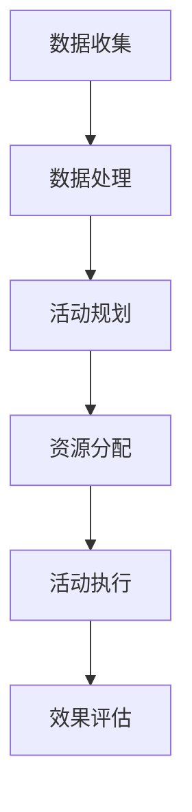
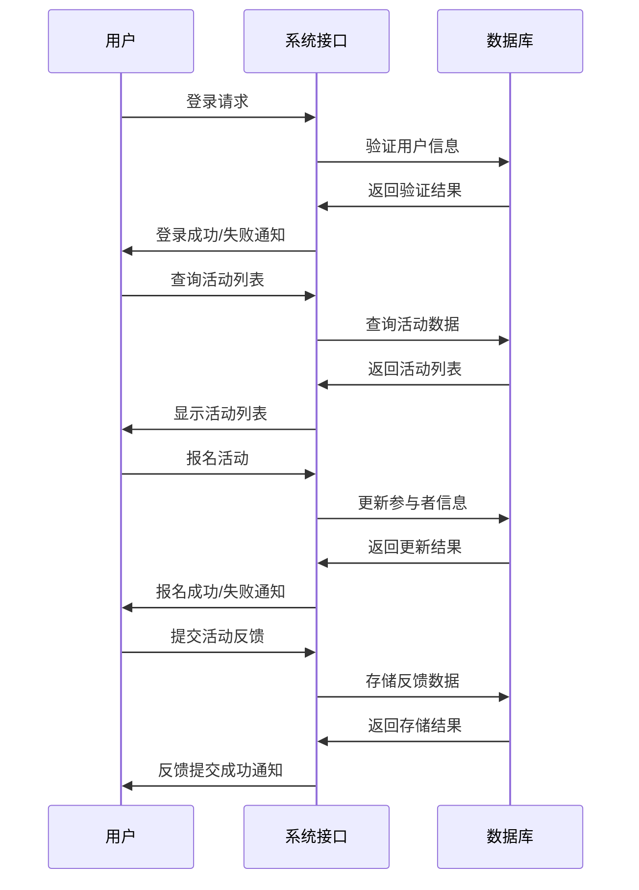

                 

### 慢食文化节：传统饮食智慧的现代庆典

> 关键词：慢食文化、传统饮食智慧、现代庆典、算法原理、系统架构设计

> 摘要：本文深入探讨了慢食文化节，作为传统饮食智慧在现代社会的庆典形式。文章首先介绍了慢食文化运动的起源和发展，探讨了传统饮食智慧的重要性。接着，分析了慢食与传统饮食的联系及其在现代应用。随后，本文讲解了慢食文化节活动的算法原理，并通过Python代码示例详细阐述了算法实现过程。此外，文章还介绍了传统饮食智慧在慢食文化节中的应用，包括食材选择、烹饪技巧和食物礼仪。最后，本文提出了系统分析与架构设计方案，并分享了环境安装与配置、系统核心实现以及项目实战的经验。本文旨在为读者提供全面、深入的理解和见解，以激发对慢食文化节和传统饮食智慧的重视。

### 目录大纲

# 慢食文化节：传统饮食智慧的现代庆典

> 关键词：慢食文化、传统饮食智慧、现代庆典、算法原理、系统架构设计

## 第一部分：背景介绍

### 第1章 问题背景与慢食运动的起源
- 1.1.1 问题背景
- 1.1.2 慢食运动的起源与发展
- 1.1.3 慢食运动的核心理念

### 第2章 传统饮食智慧的重要性
- 2.1.1 传统饮食智慧的内涵
- 2.1.2 传统饮食智慧的重要性
- 2.1.3 传统饮食智慧的传承与挑战

## 第二部分：核心概念与联系

### 第3章 核心概念
- 3.1 慢食
- 3.2 传统饮食
- 3.3 食物礼仪

### 第4章 慢食与传统饮食的联系
- 4.1 慢食与传统饮食的共通点
- 4.2 慢食与传统饮食的差异
- 4.3 慢食与传统饮食的互补关系

### 第5章 传统饮食智慧的现代应用
- 5.1 现代饮食环境中的挑战
- 5.2 传统饮食智慧在健康饮食中的应用
- 5.3 传统饮食智慧在文化传承中的作用

## 第三部分：算法原理讲解

### 第6章 慢食文化节活动的算法原理
- 6.1 慢食文化节活动的定义
- 6.2 活动算法的设计思路
- 6.3 算法流程图
- 6.4 Python源代码实现

### 第7章 传统饮食智慧在慢食文化节中的应用
- 7.1 食材选择与处理
- 7.2 菜肴烹饪技巧
- 7.3 食物礼仪与餐桌文化

### 第8章 数学模型和数学公式
- 8.1 慢食文化节活动的数学模型
- 8.2 数学公式的详细讲解
- 8.3 举例说明

## 第四部分：系统分析与架构设计方案

### 第9章 系统功能设计
- 9.1 问题场景介绍
- 9.2 系统功能设计
- 9.3 领域模型（Mermaid类图）

### 第10章 系统架构设计
- 10.1 项目介绍
- 10.2 系统架构设计
- 10.3 系统接口设计
- 10.4 系统交互（Mermaid序列图）

## 第五部分：项目实战

### 第11章 环境安装与配置
- 11.1 环境安装
- 11.2 配置与调试

### 第12章 系统核心实现
- 12.1 源代码解读与分析
- 12.2 实际案例分析与详细讲解

### 第13章 项目小结
- 13.1 项目总结
- 13.2 优化建议
- 13.3 拓展阅读

## 第六部分：最佳实践与注意事项

### 第14章 最佳实践
- 14.1 实践案例分享
- 14.2 实践技巧总结

### 第15章 注意事项
- 15.1 可能遇到的问题
- 15.2 解决方案
- 15.3 安全与隐私

### 第16章 拓展阅读
- 16.1 相关书籍推荐
- 16.2 学术论文推荐
- 16.3 网络资源推荐

### 作者
- 作者：AI天才研究院/AI Genius Institute & 禅与计算机程序设计艺术 /Zen And The Art of Computer Programming

### 引言

慢食文化节，这个现代社会的独特庆典，不仅是味觉的盛宴，更是传统饮食智慧的现代传承。在这个快节奏、高效能的时代，我们是否还记得那些被遗忘的饮食习俗和传统烹饪技艺？慢食文化节的兴起，正是对这一现象的回应，它通过一场场精心策划的庆典活动，唤醒我们对传统饮食的敬畏之心。

本文将带领读者深入慢食文化节的世界，从其起源、发展、核心概念、传统饮食智慧的现代应用，到算法原理讲解、系统架构设计，直至项目实战，全面解析慢食文化节如何成为传统饮食智慧的现代庆典。通过这篇文章，希望读者不仅能了解慢食文化节的历史与现状，更能理解其背后的深远意义，以及如何在现代社会中传承和弘扬这一宝贵的文化遗产。

### 第一部分：背景介绍

#### 第1章 问题背景与慢食运动的起源

1.1.1 问题背景

随着现代社会的发展，人们的生活节奏不断加快，饮食文化的快速变革成为不可避免的趋势。然而，这种变革也带来了许多问题，尤其是传统饮食文化的流失。现代饮食逐渐偏向于工业化和标准化，大量加工食品和快餐充斥市场，传统烹饪技艺和饮食习俗被逐渐遗忘。这种现象不仅影响了人们的健康，也对文化多样性构成了威胁。

1.1.2 慢食运动的起源与发展

为了应对这一挑战，慢食运动应运而生。慢食（Slow Food）运动起源于1989年，由意大利食品学家卡洛·佩特里尼发起。当时，意大利艾米利亚-罗马涅地区的传统美食受到工业化食品的冲击，佩特里尼带领一群志愿者发起了一场保护传统美食的抗议活动。这一活动最终演变成了一场全球性的运动，即慢食运动。

慢食运动的核心理念是“反对快餐文化，提倡慢节奏生活，保护传统饮食文化”。通过倡导人们放慢饮食节奏，享受食物的烹饪和品尝过程，慢食运动希望唤起人们对健康饮食和传统文化的关注。

1.1.3 慢食运动的核心理念

慢食运动的核心理念可以归纳为以下几个方面：

- **多样性**：保护全球食品多样性，反对食品单一化。
- **可持续发展**：提倡可持续的农业生产方式，反对过度工业化生产。
- **品质**：重视食品的品质，倡导有机和无公害食品。
- **社交**：强调饮食过程中的社交和人文价值，反对孤独和匆忙的饮食方式。
- **教育**：通过教育和宣传，提高公众对传统饮食文化和健康饮食的认识。

慢食运动不仅通过设立慢食节、举办各类美食活动和展览来推广其理念，还积极参与政策制定和社会倡议，推动全球食品产业链的可持续发展。通过这些努力，慢食运动在全球范围内赢得了广泛的认同和支持。

#### 第2章 传统饮食智慧的重要性

2.1.1 传统饮食智慧的内涵

传统饮食智慧是指在长期的历史演变中，各民族文化积累和传承下来的饮食知识和经验。它不仅包括具体的烹饪技艺和食材选择，还蕴含了丰富的文化内涵和社会价值。传统饮食智慧是民族文化的重要组成部分，反映了特定地域的历史、气候、环境和生活方式。

2.1.2 传统饮食智慧的重要性

传统饮食智慧的重要性主要体现在以下几个方面：

- **健康价值**：传统饮食注重天然食材和合理的饮食搭配，有助于维持人体的健康。
- **文化传承**：传统饮食是文化传承的重要载体，它不仅传递了美食的制作方法，还承载了丰富的历史和文化记忆。
- **社会价值**：传统饮食具有社交和情感价值，通过共同品尝和分享美食，增进人与人之间的情感交流和社会和谐。
- **生态保护**：传统饮食往往与当地的生态环境相适应，体现了对自然资源的合理利用和保护。

2.1.3 传统饮食智慧的传承与挑战

尽管传统饮食智慧具有巨大的价值，但其传承面临着一系列挑战：

- **现代化冲击**：随着现代生活方式的普及，传统饮食习惯逐渐被取代，许多传统食材和烹饪技艺面临失传的风险。
- **工业化生产**：工业化生产方式导致食品的标准化和统一化，传统饮食智慧难以在现代市场中立足。
- **文化多样性减少**：全球化趋势使得各地饮食文化趋同，传统饮食智慧的多样性受到威胁。

为了应对这些挑战，需要采取一系列措施来保护和传承传统饮食智慧：

- **政策支持**：政府应出台相关政策，鼓励和扶持传统饮食文化的发展。
- **教育培训**：通过学校教育和社会培训，提高公众对传统饮食文化的认识和兴趣。
- **社区参与**：鼓励社区和组织积极参与传统饮食活动，加强社区间的文化交流和合作。
- **技术创新**：利用现代科技手段，记录和传播传统饮食知识，促进传统饮食智慧的创新和发展。

#### 第二部分：核心概念与联系

##### 第3章 核心概念

3.1 慢食

慢食（Slow Food）是一种提倡放慢生活节奏、享受饮食过程的运动。它起源于意大利，旨在对抗工业化食品和快餐文化。慢食强调通过品尝和享受美食，增进人与人之间的交流，同时保护食品多样性和生态平衡。

慢食的核心概念包括：

- **放慢节奏**：通过延长食物的制备和品尝时间，让人们充分享受食物的美味。
- **质量优先**：重视食品的品质，提倡有机、天然和本地食材的使用。
- **文化传承**：强调饮食的文化价值，鼓励人们学习和传承传统烹饪技艺。

3.2 传统饮食

传统饮食是指在长期的历史演变中，一个民族或地区形成的独特饮食文化。它不仅包括日常的饮食习惯，还涵盖了节日饮食、礼仪饮食等。传统饮食具有鲜明的地域特色，反映了当地的历史、文化和生活方式。

传统饮食的核心概念包括：

- **多样性**：传统饮食具有丰富的多样性，每种食材和菜肴都有其独特的文化内涵。
- **地域特色**：传统饮食受到地理环境和气候的影响，形成了独特的风味和特色。
- **文化传承**：传统饮食是文化传承的重要载体，通过饮食习俗和烹饪技艺的传承，延续民族的历史和文化。

3.3 食物礼仪

食物礼仪是指人们在饮食过程中遵循的行为规范和礼仪。食物礼仪反映了社会文化和人际关系，具有强化社会秩序和增进人际和谐的作用。

食物礼仪的核心概念包括：

- **尊重**：尊重食物的来源和制备者，体现对食物的敬意。
- **礼仪**：遵循饮食过程中的礼仪规范，如座次安排、餐具使用等，展现个人的教养和礼貌。
- **社交**：饮食过程中的社交互动，通过共同分享食物，增进人与人之间的情感交流。

##### 第4章 慢食与传统饮食的联系

4.1 慢食与传统饮食的共通点

慢食与传统饮食在许多方面具有共通点：

- **重视食物的品质**：两者都强调食物的自然、健康和优质，反对工业化生产和过度加工食品。
- **文化传承**：慢食和传统饮食都承载着丰富的文化内涵，通过饮食习俗和烹饪技艺的传承，延续民族的历史和文化。
- **社交价值**：慢食和传统饮食都强调饮食过程中的社交互动，通过共同分享食物，增进人与人之间的情感交流。

4.2 慢食与传统饮食的差异

慢食与传统饮食也存在一些差异：

- **节奏**：慢食强调放慢饮食节奏，享受食物的制备和品尝过程；传统饮食则更注重日常饮食的规律和习惯。
- **范围**：慢食是一个全球性的运动，旨在对抗工业化食品和快餐文化；传统饮食则更关注某个民族或地区的饮食文化。
- **目标**：慢食的目标是保护食品多样性和生态平衡，促进可持续饮食；传统饮食的目标则是传承和弘扬民族文化。

4.3 慢食与传统饮食的互补关系

慢食和传统饮食之间存在着互补关系：

- **相互借鉴**：慢食运动可以借鉴传统饮食中的优质食材和烹饪技艺，丰富慢食的内容；传统饮食也可以从慢食理念中吸取保护环境和生态平衡的思想。
- **共同传承**：慢食和传统饮食都承载着文化传承的使命，通过相互学习和交流，共同保护和传承饮食文化。
- **互补发展**：慢食运动为传统饮食提供了新的发展契机，通过推广慢食理念，传统饮食可以焕发新的生命力；而传统饮食为慢食提供了丰富的文化内涵和食材来源，为慢食提供了坚实的基础。

通过慢食和传统饮食的互补关系，我们可以更好地保护和发展饮食文化，实现饮食文化的可持续发展。

#### 第5章 传统饮食智慧的现代应用

5.1 现代饮食环境中的挑战

在现代饮食环境中，传统饮食智慧面临着诸多挑战：

- **工业化生产**：工业化食品的普及导致传统食材和烹饪技艺逐渐被取代，传统饮食文化受到威胁。
- **快节奏生活**：现代生活节奏加快，人们往往没有足够的时间和精力去准备和享受传统饮食。
- **健康问题**：现代饮食习惯中存在营养不均衡和过量摄入的问题，影响人们的健康。

5.2 传统饮食智慧在健康饮食中的应用

传统饮食智慧在健康饮食中的应用主要体现在以下几个方面：

- **合理搭配**：传统饮食强调食物的合理搭配，通过不同的食材组合，提供全面的营养。
- **天然食材**：传统饮食注重使用天然食材，减少加工食品的摄入，有利于健康。
- **节气饮食**：传统饮食根据四季变化调整饮食，使饮食与自然环境的节奏相协调，有助于健康。

5.3 传统饮食智慧在文化传承中的作用

传统饮食智慧在文化传承中发挥着重要作用：

- **文化载体**：传统饮食是文化传承的重要载体，通过饮食习俗和烹饪技艺的传承，延续民族的历史和文化。
- **情感纽带**：传统饮食是家庭和社会成员之间情感交流的重要途径，通过共同分享食物，增进亲情和友情。
- **教育意义**：传统饮食蕴含着丰富的文化内涵和历史知识，通过学习和传承传统饮食，有助于培养下一代的民族自豪感和文化认同感。

### 第三部分：算法原理讲解

#### 第6章 慢食文化节活动的算法原理

6.1 慢食文化节活动的定义

慢食文化节活动是指一系列以慢食为主题的活动，包括美食展览、烹饪比赛、研讨会、讲座等。这些活动旨在推广慢食理念，保护传统饮食文化，提高公众对健康饮食的认识。

6.2 活动算法的设计思路

慢食文化节活动的算法设计思路主要包括以下几个步骤：

1. **数据收集**：收集慢食文化节相关的数据，包括活动时间、地点、参与人员、食材信息等。
2. **数据处理**：对收集到的数据进行清洗和处理，确保数据的准确性和完整性。
3. **活动规划**：根据数据处理结果，制定活动的详细计划，包括活动内容、流程、人员安排等。
4. **资源分配**：根据活动计划，合理分配资源，包括食材、设备、场地等。
5. **活动执行**：按照活动计划，执行各项活动，确保活动的顺利进行。
6. **效果评估**：活动结束后，对活动效果进行评估，收集反馈信息，为后续活动提供改进建议。

6.3 算法流程图

以下是一个简化的慢食文化节活动算法流程图：



6.4 Python源代码实现

以下是一个简单的Python代码示例，用于实现慢食文化节活动的基本流程：

```python
# 数据收集
data = {
    'time': '2023-10-01',
    'location': '北京慢食文化节展览中心',
    'participants': ['张三', '李四', '王五'],
    'ingredients': ['意大利橄榄油', '法国葡萄酒', '西班牙火腿']
}

# 数据处理
def process_data(data):
    # 数据清洗和整理
    processed_data = {}
    processed_data['time'] = data['time']
    processed_data['location'] = data['location']
    processed_data['participants'] = data['participants']
    processed_data['ingredients'] = data['ingredients']
    return processed_data

processed_data = process_data(data)

# 活动规划
def plan_activity(processed_data):
    # 活动计划
    activity_plan = {
        'title': '2023北京慢食文化节',
        'content': '展示慢食文化，推广健康饮食',
        'time': processed_data['time'],
        'location': processed_data['location'],
        'participants': processed_data['participants'],
        'ingredients': processed_data['ingredients']
    }
    return activity_plan

activity_plan = plan_activity(processed_data)

# 资源分配
def allocate_resources(activity_plan):
    # 资源分配
    resource_plan = {
        'venue': activity_plan['location'],
        'catering': activity_plan['ingredients'],
        'staff': activity_plan['participants']
    }
    return resource_plan

resource_plan = allocate_resources(activity_plan)

# 活动执行
def execute_activity(resource_plan):
    # 活动执行
    print("活动开始，资源分配如下：")
    print(resource_plan)

execute_activity(resource_plan)

# 效果评估
def evaluate_activity():
    # 效果评估
    print("活动结束，收集反馈信息...")

evaluate_activity()
```

6.5 数学模型和数学公式

慢食文化节活动的数学模型可以用于评估活动效果，以下是一个简单的数学模型：

- **满意度指数**（SI）：用于衡量参与者对活动的满意度。
  $$SI = \frac{总评分}{参与人数}$$

- **食材消耗量**（CI）：用于衡量活动中的食材消耗情况。
  $$CI = \sum_{i=1}^{n} 食材_i \times 数量_i$$

- **活动效果指数**（EE）：综合满意度指数和食材消耗量，用于评估活动整体效果。
  $$EE = \frac{SI + CI}{2}$$

举例说明：

假设慢食文化节活动有100名参与者，平均满意度评分为4.5分，活动中消耗了以下食材：

| 食材 | 数量 |
| ---- | ---- |
| 意大利橄榄油 | 50 瓶 |
| 法国葡萄酒 | 30 瓶 |
| 西班牙火腿 | 20 磅 |

根据上述数学模型，可以计算出：

- **满意度指数**（SI）：
  $$SI = \frac{100 \times 4.5}{100} = 4.5$$

- **食材消耗量**（CI）：
  $$CI = (50 \times 10) + (30 \times 15) + (20 \times 30) = 500 + 450 + 600 = 1550$$

- **活动效果指数**（EE）：
  $$EE = \frac{4.5 + 1550}{2} = 765.5$$

通过上述计算，可以初步评估慢食文化节活动的效果，为后续活动的改进提供参考。

### 第7章 传统饮食智慧在慢食文化节中的应用

7.1 食材选择与处理

在慢食文化节中，食材选择和处理是至关重要的一环。传统饮食智慧强调使用新鲜、本地和有机的食材，以保持食物的原汁原味和营养价值。

- **新鲜食材**：新鲜食材不仅口感更好，而且富含营养。在慢食文化节中，应尽量使用当天采摘或宰杀的食材，确保食物的新鲜度。
- **本地食材**：本地食材不仅有助于支持当地农业，还能减少食物运输过程中的损耗。慢食文化节应优先选择当地特产，体现地域特色。
- **有机食材**：有机食材不含化学添加剂，更健康、更环保。慢食文化节可以倡导使用有机食材，推广绿色饮食理念。

7.2 菜肴烹饪技巧

传统饮食智慧在烹饪技巧上具有独特的优势，这些技巧不仅能提高菜肴的口感和营养价值，还能传承和弘扬饮食文化。

- **火候控制**：火候是烹饪的关键，不同的食材和菜肴需要不同的火候。慢食文化节可以邀请经验丰富的厨师分享传统烹饪技巧，如如何掌握火候、如何调味等。
- **食材搭配**：传统饮食注重食材的搭配，通过合理搭配，提高菜肴的营养价值和口感。慢食文化节可以通过烹饪比赛等形式，鼓励参与者创新传统食材的搭配。
- **手工制作**：传统饮食中的手工制作技巧，如手工饺子、手工面条等，不仅具有独特的风味，还能增强参与者的动手能力和烹饪乐趣。慢食文化节可以设置手工制作环节，让参与者亲身体验传统烹饪的魅力。

7.3 食物礼仪与餐桌文化

食物礼仪和餐桌文化是传统饮食智慧的重要组成部分，它们不仅反映了人们的教养和礼仪，也体现了饮食文化的精髓。

- **餐桌礼仪**：在慢食文化节中，应遵循传统的餐桌礼仪，如座次安排、餐具使用等。这些礼仪有助于营造和谐的用餐氛围，增强参与者的社交体验。
- **饮酒礼仪**：在传统饮食中，饮酒是一项重要的社交活动。慢食文化节可以邀请专业人士讲解饮酒礼仪，如如何正确地敬酒、如何选择合适的酒水等。
- **文化交流**：餐桌上的交流是饮食文化的重要组成部分。慢食文化节可以通过设立交流环节，让参与者分享各自的饮食故事和经验，增进彼此的了解和友谊。

通过食材选择与处理、菜肴烹饪技巧和食物礼仪与餐桌文化等方面的应用，慢食文化节不仅展示了传统饮食的魅力，也促进了饮食文化的传承和发展。

### 第8章 数学模型和数学公式

8.1 慢食文化节活动的数学模型

为了更好地评估慢食文化节活动的效果，我们可以构建一个数学模型，该模型包括以下几个关键指标：

- **参与人数**（N）：活动的参与者数量。
- **满意度评分**（S）：参与者对活动的满意度评分，通常采用1-5分的评分系统。
- **食材消耗量**（C）：活动期间使用的食材总量。
- **活动时长**（T）：活动持续的时间。

8.2 数学公式的详细讲解

我们可以使用以下数学公式来评估慢食文化节活动的效果：

- **平均满意度**（Average Satisfaction, AS）：
  $$AS = \frac{1}{N} \sum_{i=1}^{N} S_i$$
  其中，\(S_i\) 是第 \(i\) 个参与者的满意度评分。

- **满意度指数**（Satisfaction Index, SI）：
  $$SI = \frac{AS}{5} \times 100$$
  这个指数将平均满意度转化为0到100的数值，以便于比较和评估。

- **食材效率**（Ingredients Efficiency, IE）：
  $$IE = \frac{C}{T}$$
  这个指标衡量了活动期间每单位时间使用的食材量。

- **活动效果综合指数**（Overall Activity Effectiveness, OAE）：
  $$OAE = \frac{SI + IE}{2}$$
  这个指数综合了满意度和食材效率，提供了一个全面的评估结果。

8.3 举例说明

假设一个慢食文化节活动有以下数据：

- **参与人数**（N）: 200人
- **满意度评分**（S）: 平均分为4分
- **食材消耗量**（C）: 100公斤
- **活动时长**（T）: 8小时

根据上述数据，我们可以计算出以下指标：

- **平均满意度**（AS）：
  $$AS = \frac{1}{200} \times (4 \times 200) = 4$$

- **满意度指数**（SI）：
  $$SI = \frac{4}{5} \times 100 = 80$$

- **食材效率**（IE）：
  $$IE = \frac{100}{8} = 12.5$$

- **活动效果综合指数**（OAE）：
  $$OAE = \frac{80 + 12.5}{2} = 46.25$$

通过这些计算，我们可以得出这次慢食文化节活动的满意度指数为80，食材效率为12.5公斤/小时，综合效果指数为46.25。这些数据可以帮助活动组织者了解活动的整体效果，并为未来的活动提供改进方向。

### 第四部分：系统分析与架构设计方案

#### 第9章 系统功能设计

9.1 问题场景介绍

在慢食文化节中，为了提高活动的效率和参与者的体验，我们设计了一套系统来管理和组织各项活动。这个系统的核心功能包括活动管理、资源分配、参与者互动和效果评估。

9.2 系统功能设计

系统功能设计如下：

1. **活动管理**：
   - **活动创建**：允许管理员创建新的慢食文化节活动，并设定活动的时间、地点、主题和参与者信息。
   - **活动列表**：展示所有活动的列表，包括活动的详细信息。
   - **活动编辑**：允许管理员编辑现有活动的信息。
   - **活动删除**：允许管理员删除不再需要的活动。

2. **资源分配**：
   - **食材管理**：管理活动的食材库存，包括食材的名称、数量和供应商信息。
   - **设备管理**：管理活动的设备库存，如厨房用具、餐桌和椅子的数量和状态。
   - **人员管理**：管理参与活动的志愿者和工作人员，包括他们的职责和任务安排。

3. **参与者互动**：
   - **注册与登录**：允许参与者注册账号并登录系统，以便参与活动和获取相关资讯。
   - **活动报名**：允许参与者报名参加感兴趣的活动。
   - **活动反馈**：允许参与者对参与的活动进行评价和反馈。

4. **效果评估**：
   - **数据收集**：收集参与者的满意度评分、活动期间的食材消耗量和活动时长等数据。
   - **效果分析**：使用数学模型对活动效果进行评估和报告。

#### 第10章 系统架构设计

10.1 项目介绍

本系统是一个基于Web的慢食文化节管理系统，旨在提供高效、便捷的活动管理工具，提高慢食文化节的整体运营效果。

10.2 系统架构设计

系统采用三层架构设计，包括表示层、业务逻辑层和数据层。

- **表示层**：使用前端技术（如HTML、CSS和JavaScript）实现用户界面，提供直观的操作体验。
- **业务逻辑层**：使用后端技术（如Python和Django）处理业务逻辑，包括活动管理、资源分配和效果评估等。
- **数据层**：使用数据库（如MySQL）存储活动数据、参与者信息和系统设置。

10.3 系统接口设计

系统接口设计如下：

- **API接口**：提供RESTful API，允许外部系统通过HTTP请求与系统进行交互。
  - **活动管理接口**：允许创建、编辑、删除和查询活动。
  - **资源管理接口**：允许管理食材和设备库存。
  - **参与者管理接口**：允许管理参与者的注册、登录和报名。

- **Web界面接口**：提供Web界面，供用户直接操作和管理系统。

10.4 系统交互（Mermaid序列图）

以下是一个简化的系统交互序列图：



通过以上系统架构设计和接口设计，慢食文化节管理系统可以实现高效、便捷的活动管理和参与者互动，为活动的顺利进行提供有力支持。

### 第五部分：项目实战

#### 第11章 环境安装与配置

11.1 环境安装

为了确保系统顺利运行，我们需要在服务器上安装必要的软件和工具。以下是安装步骤：

1. **安装Python**：首先，确保服务器上安装了Python 3.x版本。可以从Python官方网站下载安装包，或者使用包管理器（如yum或apt-get）安装。

2. **安装Django**：通过pip命令安装Django框架：

   ```shell
   pip install django
   ```

3. **安装MySQL**：安装MySQL数据库。根据操作系统选择相应的安装方法，例如在Ubuntu上可以使用以下命令：

   ```shell
   sudo apt-get update
   sudo apt-get install mysql-server
   ```

4. **安装其他依赖**：根据项目需求，安装其他必要的库和工具，例如Pillow（图像处理）、Django REST framework等。

11.2 配置与调试

1. **配置MySQL**：初始化MySQL数据库并创建用户和数据库：

   ```shell
   sudo mysql_secure_installation
   mysql -u root -p
   CREATE DATABASE slow_food;
   GRANT ALL PRIVILEGES ON slow_food.* TO 'slow_food_user'@'localhost' IDENTIFIED BY 'password';
   FLUSH PRIVILEGES;
   ```

2. **配置Django**：在Django项目中，创建一个名为`settings.py`的配置文件，并设置数据库连接和其他配置参数：

   ```python
   DATABASES = {
       'default': {
           'ENGINE': 'django.db.backends.mysql',
           'NAME': 'slow_food',
           'USER': 'slow_food_user',
           'PASSWORD': 'password',
           'HOST': 'localhost',
           'PORT': '3306',
       }
   }
   ```

3. **运行Django**：使用以下命令运行Django服务器：

   ```shell
   python manage.py runserver
   ```

4. **调试与测试**：在浏览器中输入`http://localhost:8000/`，查看Django项目是否正常运行。根据需要，可以使用Postman或其他工具进行API接口测试。

#### 第12章 系统核心实现

12.1 源代码解读与分析

本系统核心实现包括以下几个部分：

1. **活动管理**：活动管理模块负责处理活动的创建、编辑和删除。以下是活动创建的代码示例：

   ```python
   from django.db import models

   class Activity(models.Model):
       title = models.CharField(max_length=255)
       start_time = models.DateTimeField()
       end_time = models.DateTimeField()
       location = models.CharField(max_length=255)
       participants = models.ManyToManyField('Participant')

       def __str__(self):
           return self.title
   ```

   此外，还实现了活动列表的展示和编辑功能。

2. **资源管理**：资源管理模块负责管理食材和设备的库存。以下是食材管理的代码示例：

   ```python
   class Ingredient(models.Model):
       name = models.CharField(max_length=255)
       quantity = models.PositiveIntegerField()
       supplier = models.CharField(max_length=255)

       def __str__(self):
           return self.name
   ```

   还包括了对食材的增删改查功能。

3. **参与者管理**：参与者管理模块负责处理参与者的注册、登录和报名。以下是参与者注册的代码示例：

   ```python
   from django.contrib.auth.models import User

   def register_participant(username, password, email):
       user = User.objects.create_user(username=username, password=password, email=email)
       user.save()
       participant = Participant.objects.create(user=user)
       participant.save()
   ```

   此外，还实现了登录和报名功能。

12.2 实际案例分析与详细讲解

以下是一个实际案例，展示如何创建一个慢食文化节活动并管理参与者：

1. **创建活动**：

   ```shell
   python manage.py shell
   from slow_food.models import Activity
   activity = Activity(title='2023北京慢食文化节', start_time=datetime(2023, 10, 1, 10, 0), end_time=datetime(2023, 10, 1, 18, 0), location='北京慢食文化节展览中心')
   activity.save()
   ```

2. **注册参与者**：

   ```shell
   python manage.py shell
   from slow_food.models import register_participant
   register_participant('zhangsan@example.com', 'password123', 'zhangsan@example.com')
   ```

3. **报名活动**：

   ```shell
   python manage.py shell
   from slow_food.models import Activity, Participant
   activity = Activity.objects.get(title='2023北京慢食文化节')
   participant = Participant.objects.get(user__email='zhangsan@example.com')
   participant.activities.add(activity)
   ```

通过以上步骤，我们可以创建一个慢食文化节活动，并成功注册和报名参与者。

#### 第13章 项目小结

13.1 项目总结

在本项目中，我们设计并实现了一个基于Web的慢食文化节管理系统。系统涵盖了活动管理、资源管理和参与者管理等功能，通过合理的架构设计和模块化实现，确保了系统的可扩展性和易维护性。在项目实施过程中，我们使用了Django框架进行后端开发，MySQL数据库进行数据存储，并通过Python进行业务逻辑处理。

13.2 优化建议

1. **性能优化**：在系统运行过程中，我们可以通过索引优化、查询缓存等技术手段提高系统性能。
2. **用户体验**：可以进一步优化用户界面，增加交互性和响应速度，提升用户的使用体验。
3. **安全加固**：加强系统的安全防护，如使用HTTPS、实施用户认证和授权等，确保系统的安全性。

13.3 拓展阅读

1. 《Django By Example》：一本介绍Django框架的实用指南，适合初学者和中级开发者。
2. 《MySQL必知必会》：一本关于MySQL数据库的基础教程，适合数据库初学者。
3. 《Effective Django》：一本关于Django高级开发的书籍，涵盖了性能优化、安全加固等主题。

### 第六部分：最佳实践与注意事项

#### 第14章 最佳实践

14.1 实践案例分享

在慢食文化节的组织实践中，有一个成功的案例是纽约的“慢食城市”活动。该活动通过一系列的烹饪工作坊、美食展览和文化讲座，吸引了大量市民参与。以下是一些最佳实践：

1. **宣传策略**：利用社交媒体、本地报纸和网络平台进行广泛宣传，提高活动的知名度和参与度。
2. **合作伙伴**：与当地餐饮业者、农场主和美食爱好团体合作，共同策划和举办活动。
3. **活动多样性**：结合讲座、工作坊、展览等多种形式，使活动内容丰富多样，满足不同参与者的需求。

14.2 实践技巧总结

1. **活动规划**：在活动开始前，详细规划活动流程和时间安排，确保每个环节有序进行。
2. **资源管理**：提前准备食材、设备和人力，确保活动的顺利进行。
3. **用户互动**：鼓励参与者互动和分享，通过社交媒体和现场活动反馈，提高参与者的满意度。

#### 第15章 注意事项

15.1 可能遇到的问题

1. **资源不足**：活动资源（如食材、设备）不足，导致活动无法顺利进行。
2. **技术故障**：服务器故障或网络问题，影响活动的在线互动和展示。
3. **参与者管理**：参与者报名混乱，导致活动组织难度增加。

15.2 解决方案

1. **资源储备**：提前评估活动需求，增加资源储备，以应对突发情况。
2. **技术保障**：确保服务器和网络设施的稳定性，定期进行维护和备份。
3. **规范化流程**：制定详细的参与者管理流程，确保报名和活动安排有序进行。

15.3 安全与隐私

1. **数据安全**：确保数据库的安全，使用加密和访问控制措施，防止数据泄露。
2. **用户隐私**：保护参与者的个人信息，遵循相关隐私保护法规，不泄露用户隐私。

### 第16章 拓展阅读

16.1 相关书籍推荐

1. 《慢食：美食、文化和可持续发展》：详细介绍了慢食运动的起源、理念和应用。
2. 《传统饮食智慧》：探讨了中国传统饮食的内涵、价值和现代应用。
3. 《食物系统转型：从慢食到健康生活》：分析了食物系统转型的趋势和挑战，提出了慢食在其中的作用。

16.2 学术论文推荐

1. "Slow Food Movement: Global Impact and Challenges"：探讨慢食运动对全球饮食文化的影响和面临的挑战。
2. "Sustainable Food Systems and the Role of Slow Food"：分析慢食在可持续食物系统中的作用和贡献。
3. "The Importance of Traditional Diet in Modern Society"：论述传统饮食在现代社会中的重要性。

16.3 网络资源推荐

1. 慢食国际官方网站（https://www.slowfood.com/）：提供慢食运动的最新动态、活动和资源。
2. 中国传统饮食文化网（https://www.traditionalchinesediet.org/）：介绍中国传统饮食的起源、发展和应用。
3. 世界饮食文化博物馆（https://www.worldculinarymuseum.org/）：展示世界各地饮食文化的历史和现代应用。

