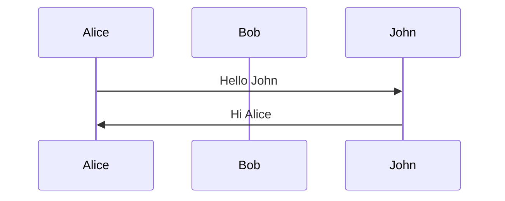

                 


### 《成为人生的主导者：自我引导的艺术》

#### 关键词：自我引导、人生主导、个人成长、自我意识、目标设定、情绪管理、算法原理、系统架构、实战应用

#### 摘要：

本文旨在探讨自我引导在个人成长和人生主导中的作用。通过逻辑清晰、结构紧凑的分析，我们深入解析了自我引导的核心概念、数学模型、系统架构以及实战应用。本文旨在帮助读者理解自我引导的原理，学会如何在日常生活中应用自我引导的艺术，从而成为人生的主导者。

---

## 引言

在快节奏的现代生活中，个人成长和自我引导变得越来越重要。自我引导不仅关乎个人成就，更关乎我们如何面对生活的挑战。本文将探讨自我引导的核心概念、数学模型、系统架构以及实战应用，旨在帮助读者理解自我引导的原理，学会如何在实际生活中应用这一艺术，从而成为人生的主导者。

### 第1章：自我引导的概念与背景

**1.1 自我引导的定义与重要性**

自我引导是指个体在没有任何外部指导的情况下，通过自我控制和自我调节，实现自我目标和自我成长的过程。自我引导的重要性在于它赋予个体自主性和自主决策的能力，使我们能够在复杂多变的环境中保持平衡，实现个人价值和目标。

**1.2 自我引导在现代社会中的应用**

自我引导在现代社会中的应用广泛，包括个人成长、职业发展、心理健康等方面。它帮助我们更好地应对压力、提高工作效率、实现个人梦想。

**1.3 自我引导的边界与外延**

自我引导的边界在于个体的自我意识和自我控制能力。自我引导的外延包括目标设定、情绪管理、决策能力等多个方面。

### 第2章：核心概念与联系

**2.1 自我意识**

自我意识是自我引导的基础。它包括个体对自己身份、情感、行为和认知的感知和认知。

**2.2 目标设定**

目标设定是自我引导的核心。它包括目标的选择、设定、实现和调整。

**2.3 情绪管理**

情绪管理是自我引导的重要方面。它包括对情绪的感知、理解和管理。

**2.4 核心概念的ER图与对比表格**

为了更好地理解这些核心概念，我们使用ER图和对比表格展示它们之间的关系和属性特征。

### 第3章：自我引导的数学模型与算法

**3.1 数学模型介绍**

自我引导的数学模型包括目标函数、决策模型和反馈机制。我们使用Mermaid流程图展示这些模型的原理。

$$
\text{目标函数} = f(\text{自我意识}, \text{目标设定}, \text{情绪管理})
$$

**3.2 算法原理讲解**

我们使用Python代码详细阐述自我引导算法的原理，并通过Mermaid流程图展示算法的执行过程。

```python
# Python代码示例：自我引导算法
class SelfGuidanceAlgorithm:
    def __init__(self, self_awareness, goal_setting, emotion_management):
        self.self_awareness = self_awareness
        self.goal_setting = goal_setting
        self.emotion_management = emotion_management

    def execute(self):
        # 执行自我引导算法
        # ...
```

**3.3 算法举例说明**

我们通过具体例子说明自我引导算法在目标设定和情绪管理中的应用。

### 第4章：自我引导的系统分析与架构设计

**4.1 问题场景介绍**

我们介绍一个实际的问题场景，并分析如何使用自我引导系统解决该问题。

**4.2 系统功能设计（领域模型Mermaid类图）**

我们使用Mermaid类图设计自我引导系统的领域模型。

```mermaid
classDiagram
    Class01 <|-- Class02
    Class03 --|> Class04
    Class05 : +int x
    Class06 : +str name
    Class01 {
        +int x
        +str name
        +int y
    }
```

**4.3 系统架构设计（Mermaid架构图）**

我们使用Mermaid架构图设计自我引导系统的整体架构。



**4.4 系统接口设计与系统交互（Mermaid序列图）**

我们使用Mermaid序列图展示自我引导系统的接口设计和系统交互。

### 第5章：项目实战

**5.1 环境安装**

我们介绍如何搭建自我引导系统的开发环境。

**5.2 系统核心实现源代码**

我们展示自我引导系统的核心实现源代码。

**5.3 代码应用解读与分析**

我们解读并分析自我引导系统的核心代码。

**5.4 实际案例分析**

我们通过实际案例展示如何应用自我引导系统。

**5.5 详细讲解与剖析**

我们详细讲解并剖析自我引导系统的实现过程。

### 第6章：最佳实践与拓展

**6.1 最佳实践**

我们提供自我引导的最佳实践。

**6.2 注意事项**

我们指出在应用自我引导时需要注意的事项。

**6.3 拓展阅读**

我们推荐相关的拓展阅读。

### 第7章：总结与展望

**7.1 全书总结**

我们总结全书的核心内容和观点。

**7.2 自我引导艺术的发展趋势**

我们展望自我引导艺术的发展趋势。

**7.3 自我引导艺术的应用前景**

我们探讨自我引导艺术在未来的应用前景。

---

作者：AI天才研究院/AI Genius Institute & 禅与计算机程序设计艺术 /Zen And The Art of Computer Programming

---

本文以《成为人生的主导者：自我引导的艺术》为题，通过逐步深入的分析和讲解，全面阐述了自我引导的核心概念、数学模型、系统架构以及实战应用。我们相信，通过学习本文，读者将能够更好地理解自我引导的原理，学会如何在实际生活中应用自我引导的艺术，从而成为人生的主导者。未来的日子里，愿每位读者都能在自我引导的道路上越走越远，实现自己的梦想和目标。

