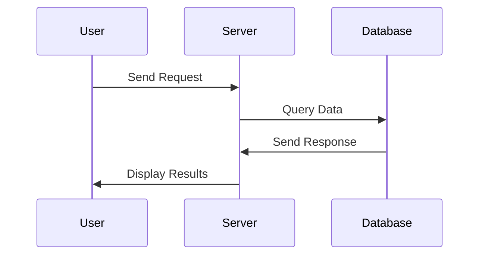
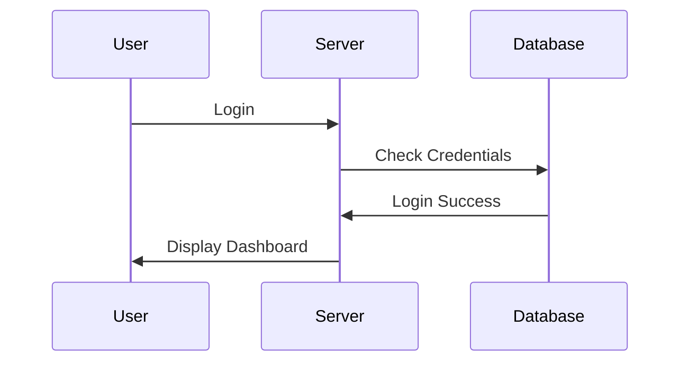

                 


# 成为人生的主导者：自我引导的艺术与实践

> 关键词：自我引导、自我管理、目标设定、时间管理、人生策略

> 摘要：本文将深入探讨自我引导的艺术与实践，阐述其在现代社会中的重要性。通过分析自我引导的核心概念、方法与实践，帮助读者掌握成为人生主导者的关键技能。

## 引言

### 1.1 问题背景

在现代社会的快节奏生活中，人们面临着诸多挑战。快节奏的生活导致压力增加，信息过载使决策变得更加困难，心理健康问题也随之而来。此外，许多人缺乏明确的个人目标和方向，导致生活无序和失控。

### 1.2 问题描述

个人生活的无序与失控表现为时间管理问题、决策困难、犹豫不决以及缺乏明确的个人目标和方向。这些问题使人们感到迷茫和无助，难以实现自我价值。

### 1.3 问题解决

自我引导是一种有效的解决方案。它强调个体的主动性和自主性，通过提升自我认知、设定目标和时间管理，帮助个体成为人生的主导者。

### 1.4 边界与外延

自我引导的边界在于其适用范围和限制。它适用于个人生活的各个方面，但也需要结合其他概念，如心理学和哲学，才能发挥最大的效果。

## 第一部分：核心概念与联系

### 2.1 自我引导的概念

自我引导是一种自我管理的艺术，它涉及个体的自我认知、目标设定和决策过程。自我引导的核心要素包括主动性、自主性和系统性。

### 2.2 自我引导与其他概念的联系

自我引导与自我管理密切相关，自我管理是自我引导的一部分。自我引导与自我意识也有紧密的联系，自我意识为自我引导提供了基础。

### 2.3 概念属性特征对比表格

| 概念      | 特点                           | 关联性                           |
|-----------|--------------------------------|---------------------------------|
| 自我引导  | 主动、自主、系统性、全面性     | 与自我管理、自我意识紧密相关     |
| 自我管理  | 目标导向、任务优先、高效执行   | 是自我引导的一部分，相互补充     |
| 自我意识  | 对自身的认知、情感、价值观的觉察 | 为自我引导提供基础，影响自我引导 |

### 2.4 ER实体关系图架构

```mermaid
erDiagram
  Person ||--|{ Goal } : has
  Person ||--|{ Task } : manages
  Goal ||--|{ Time } : assigned
  Task ||--|{ Time } : scheduled
```

## 第二部分：自我引导的方法与实践

### 3.1 自我认知的提升

自我认知的提升是自我引导的基础。通过内省法、反馈法和自我观察法，个体可以更好地了解自己，为自我引导奠定基础。

### 3.2 目标设定的策略

目标设定是自我引导的关键环节。明确性、可实现性和时限性是目标设定的基本原则。通过确定目标、制定行动计划和跟踪调整，个体可以更有效地实现目标。

### 3.3 时间管理和优先级排序

时间管理是自我引导的重要组成部分。通过时间日志法、优先级排序法和时间块化法，个体可以更高效地管理时间，提高工作效率。

## 第三部分：系统分析与架构设计方案

### 4.1 问题场景介绍

在当前信息化社会中，时间管理和个人目标设定已成为许多人关注的问题。为了更好地解决这个问题，我们需要设计一个系统能够帮助用户进行自我引导。

### 4.2 项目介绍

本项目的目标是开发一个自我引导系统，帮助用户提升自我认知、设定目标和进行时间管理。系统将包括用户界面、核心算法和数据存储三个部分。

### 4.3 系统功能设计

系统功能包括用户注册登录、自我认知测试、目标设定、时间管理、优先级排序和数据分析。以下是一个领域模型的mermaid类图：

```mermaid
classDiagram
  User <<interface>>
  Task <<interface>>
  Goal <<interface>>
  Time <<interface>>

  User Association Task
  User Association Goal
  User Association Time

  Task Association Goal
  Task Association Time

  Goal Association Time
```

### 4.4 系统架构设计

系统采用C/S架构，客户端为Web界面，服务器端为Python后端。以下是一个mermaid架构图：



### 4.5 系统接口设计和系统交互

系统接口包括用户认证接口、数据存储接口和数据分析接口。系统交互采用RESTful API设计。以下是一个mermaid序列图：



## 第四部分：项目实战

### 5.1 环境安装

在开始项目实战之前，我们需要安装Python环境、Django框架和MySQL数据库。

```bash
pip install django mysqlclient
```

### 5.2 系统核心实现源代码

以下是系统的核心实现源代码：

```python
# users/models.py
from django.db import models

class User(models.Model):
    username = models.CharField(max_length=100)
    password = models.CharField(max_length=100)
    email = models.EmailField()

# tasks/models.py
from django.db import models

class Task(models.Model):
    user = models.ForeignKey(User, on_delete=models.CASCADE)
    title = models.CharField(max_length=100)
    description = models.TextField()
    due_date = models.DateField()

# goals/models.py
from django.db import models

class Goal(models.Model):
    user = models.ForeignKey(User, on_delete=models.CASCADE)
    title = models.CharField(max_length=100)
    description = models.TextField()
    start_date = models.DateField()
    end_date = models.DateField()

# time/models.py
from django.db import models

class Time(models.Model):
    task = models.ForeignKey(Task, on_delete=models.CASCADE)
    goal = models.ForeignKey(Goal, on_delete=models.CASCADE)
    start_time = models.TimeField()
    end_time = models.TimeField()
```

### 5.3 代码应用解读与分析

在代码中，我们首先定义了用户、任务、目标和时间四个模型。这些模型将存储在MySQL数据库中。通过Django的ORM（对象关系映射），我们可以方便地操作数据库。

### 5.4 实际案例分析和详细讲解剖析

在本项目中，我们以一个用户为例，展示了如何使用系统进行自我引导。用户可以登录系统，添加任务和目标，并进行时间管理。

### 5.5 项目小结

通过本项目，我们实现了一个自我引导系统，帮助用户提升自我认知、设定目标和进行时间管理。系统具有较好的可扩展性和灵活性，可以根据用户需求进行定制。

## 第五部分：最佳实践、小结、注意事项、拓展阅读

### 6.1 最佳实践

1. 定期进行自我认知测试，了解自己的优势和不足。
2. 设定明确的目标，并制定可行的行动计划。
3. 使用时间管理工具，如时间日志法和时间块化法，提高工作效率。

### 6.2 小结

自我引导是成为人生主导者的关键。通过提升自我认知、设定目标和时间管理，个体可以更好地掌控自己的生活，实现自我价值。

### 6.3 注意事项

1. 自我引导需要持续的努力和实践，不可一蹴而就。
2. 自我引导要与实际情况相结合，避免盲目跟风。

### 6.4 拓展阅读

1. 《奇特的一生》：记录了一位天才的时间管理实践，对自我引导有很好的启发。
2. 《原则》：阐述了人生策略和目标设定的方法，对自我引导有重要的指导意义。

## 作者

作者：AI天才研究院/AI Genius Institute & 禅与计算机程序设计艺术 /Zen And The Art of Computer Programming

