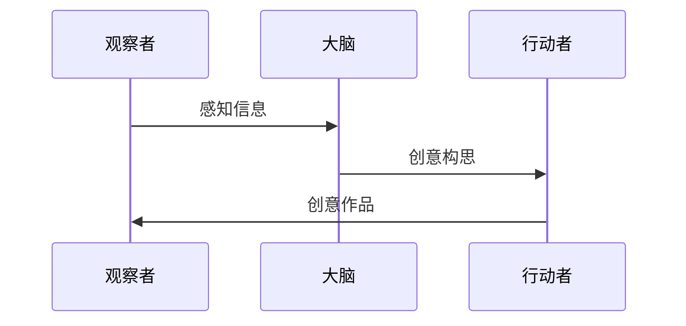
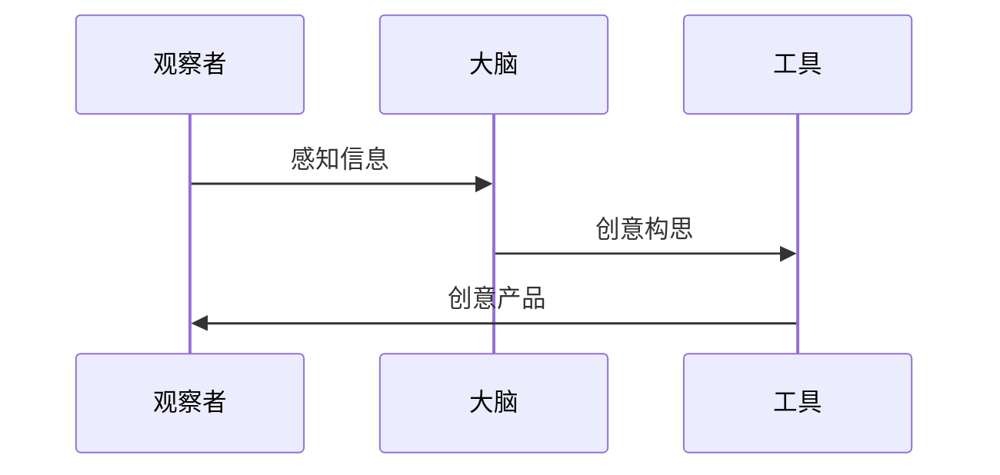
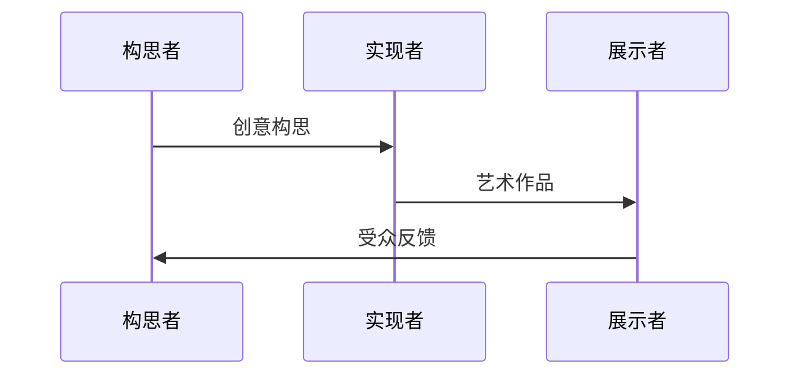
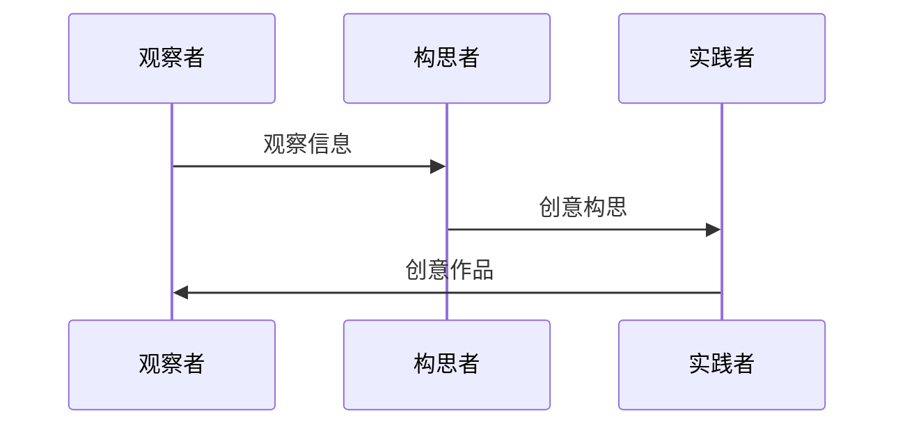
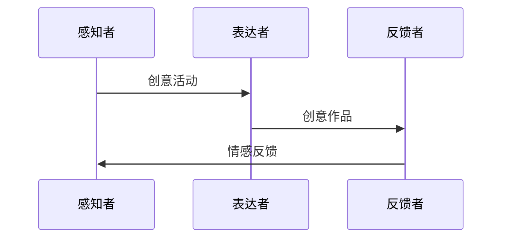
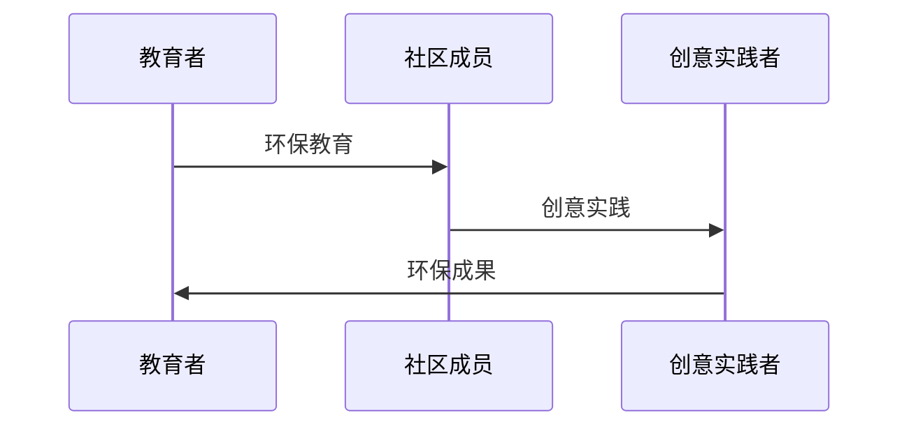
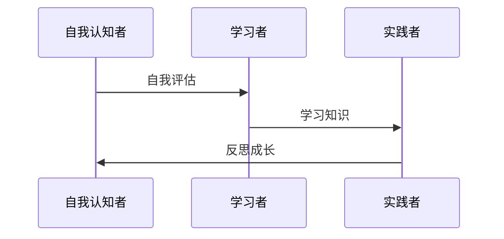

                 


### 成为生活艺术家：将平凡转化为创意表达

#### 关键词：创意生活、艺术表达、平凡转化、创意转化、可持续性

> 摘要：本文从技术视角深入探讨“成为生活艺术家：将平凡转化为创意表达”的主题，通过系统性的分析和结构化的讲解，帮助读者理解创意生活的本质，掌握将平凡事物转化为艺术表达的技巧，并在实践中探索可持续发展的路径。本文旨在为IT专业人士提供一种全新的生活方式，激发他们在日常生活中发挥创造力和技术智慧，实现个人与社会的共同进步。

#### 引言

在现代快节奏的生活中，人们往往被日常琐事所困扰，忽略了生活中的美好和可能性。然而，当我们将目光投向身边的平凡事物，运用创意思维和技术手段，就能发现其中的无限可能。《成为生活艺术家：将平凡转化为创意表达》一书正是立足于这一理念，通过系统的理论阐述和实践指导，引导读者开启创意生活的新篇章。

本书分为七个部分，从创意生活的理解与探索、平凡事物的创意转化、创意表达的方法与技巧、生活艺术家的实践案例、情感体验、可持续性到成为生活艺术家的路径，逐步展开。每个部分都紧密联系，共同构成了一个完整的创意生活体系。

#### 第一部分：创意生活的理解与探索

**第1章：创意生活的基础理论**

在这一章中，我们将首先定义什么是创意生活，并探讨其价值所在。创意生活不仅仅是一种生活方式，更是一种态度和哲学。它要求我们以开放的心态去观察、思考和创造，将平凡的事物转化为独特的艺术作品。

**核心概念与联系**

- **创意生活的定义**：创意生活是指将日常生活中的平凡事物通过创意思维和技术手段转化为独特艺术表达的过程。

- **创意思维的重要性**：创意思维是创意生活的核心，它要求我们在面对问题和挑战时，能够跳出传统思维框架，寻求创新的解决方案。

- **创意生活的实践意义**：创意生活不仅能够提升我们的生活质量，还能够激发我们的创造力和潜能，带来更多的乐趣和成就感。

**算法原理讲解**

为了更好地理解创意生活的本质，我们可以将其视为一种算法。这个算法的核心是“观察 + 思考 + 创造”。首先，我们需要通过观察来发现生活中的美好和可能性；然后，通过思考来构思和规划创意表达的方式；最后，通过创造来实现创意生活的理念。

$$
\text{创意生活算法} = \text{观察} + \text{思考} + \text{创造}
$$

**举例说明**

例如，当我们在厨房做饭时，可以尝试用不同的食材和烹饪方法来创作一道独特的菜肴。这不仅仅是做饭，更是一种创意生活的实践。

**数学模型和数学公式**

为了量化创意生活的效果，我们可以引入一个“创意指数”的概念。创意指数（CI）可以通过以下公式计算：

$$
CI = \frac{\text{创新点数}}{\text{总时间}}
$$

其中，创新点数是指我们在日常生活中发现并实现的创意数量。

**系统分析与架构设计方案**

创意生活的系统架构可以分为以下几个层次：

1. **感知层**：通过感官去观察和感知生活中的点滴。
2. **思考层**：通过大脑进行思考和构思创意表达。
3. **创造层**：通过行动将创意转化为实际的作品。

**系统接口设计和系统交互**

在这个系统中，感知层和思考层通过神经元进行信息传递，创造层则通过行动来实现创意表达。以下是一个简化的mermaid序列图：



**项目实战**

为了更好地理解创意生活的实践过程，我们可以通过一个实际的案例来进行分析。假设我们要将一个普通的桌子变成一个艺术品。

1. **环境安装**：准备一个普通的桌子，以及一些绘画工具和材料。
2. **系统核心实现源代码**：首先，我们需要设计一个创意转化算法，用于将桌子的外观转化为艺术作品。以下是一个简化的Python代码示例：

```python
def transform_table(table):
    # 观察桌子，提取关键特征
    features = observe_table(table)
    
    # 思考创意构思
    creative_concept = think_creative(features)
    
    # 创造艺术作品
    art_work = create_art(creative_concept)
    
    return art_work

def observe_table(table):
    # 观察桌子的颜色、形状、材质等特征
    return {
        "color": "blue",
        "shape": "square",
        "material": "wood"
    }

def think_creative(features):
    # 根据桌子的特征进行创意构思
    return {
        "style": "abstract",
        "technique": "watercolor"
    }

def create_art(creative_concept):
    # 根据创意构思创造艺术作品
    return "A beautiful watercolor abstract painting on a blue wooden table"
```

3. **代码应用解读与分析**：在这个案例中，我们首先通过观察桌子，提取其关键特征。然后，根据这些特征进行创意构思，最终创造出一幅艺术作品。

4. **实际案例分析和详细讲解剖析**：通过这个案例，我们可以看到创意生活是如何将平凡的事物转化为独特的艺术作品的。这种转化不仅丰富了我们的生活，还提升了我们的审美和创造力。

5. **项目小结**：通过这个项目，我们不仅学会了如何将平凡的事物转化为创意表达，还了解了创意生活背后的系统架构和算法原理。这将有助于我们在日常生活中更好地发挥创造力，实现个人成长。

**最佳实践 tips**

- **多观察**：创意源于观察，只有多观察，才能发现生活中的美好和可能性。
- **多思考**：思考是创意构思的关键，要学会从不同角度思考问题，寻求创新的解决方案。
- **多实践**：实践是检验创意的最好方式，只有不断尝试，才能不断进步。

**小结**

通过本部分的探讨，我们了解了创意生活的定义、价值、算法原理和系统架构。在接下来的章节中，我们将进一步探讨如何将平凡的事物转化为创意表达，并在实践中不断提升我们的创意能力和生活质量。

#### 第二部分：平凡事物的创意转化

**第2章：平凡事物的创意转化**

在这一章中，我们将探讨如何将平凡的事物转化为创意表达。通过观察、思考和创造，我们可以发现生活中的每一个细节都蕴含着无限的可能性。

**核心概念与联系**

- **平凡事物的定义**：平凡事物是指那些常见且容易被忽视的物品或现象，如旧衣服、废纸箱、街道景色等。

- **创意转化的方法**：创意转化是指通过创意思维和技术手段，将平凡事物转化为具有艺术价值或实用价值的新形态。

- **创意转化的意义**：创意转化不仅能够提升平凡事物的价值，还能够激发我们的创造力和创新精神。

**算法原理讲解**

创意转化的核心算法可以简化为“观察 + 创意构思 + 创造”。首先，我们需要通过观察来发现平凡事物的特点和潜在价值；然后，通过创意构思来设计出新的形态；最后，通过创造来实现创意转化的目标。

$$
\text{创意转化算法} = \text{观察} + \text{创意构思} + \text{创造}
$$

**举例说明**

例如，我们可以将一个旧纸箱转化为一个创意灯具。首先，通过观察，我们发现纸箱具有一定的结构稳定性和材料特性；然后，通过创意构思，我们设计出一个具有独特造型和照明效果的灯具；最后，通过创造，我们将纸箱转化为一个实用的创意灯具。

**数学模型和数学公式**

为了量化创意转化的效果，我们可以引入一个“创意价值指数”（CVI）。创意价值指数可以通过以下公式计算：

$$
CVI = \frac{\text{创新点数}}{\text{总成本}}
$$

其中，创新点数是指我们在创意转化过程中实现的新功能或新形态。

**系统分析与架构设计方案**

创意转化的系统架构可以分为以下几个层次：

1. **感知层**：通过感官去观察和感知平凡事物的特点。
2. **构思层**：通过大脑进行创意构思和设计。
3. **创造层**：通过技术和工具将创意转化为实际的产品或艺术作品。

**系统接口设计和系统交互**

在这个系统中，感知层和构思层通过信息传递进行互动，创造层则通过技术和工具实现创意转化。以下是一个简化的mermaid序列图：



**项目实战**

为了更好地理解创意转化的过程，我们可以通过一个实际的案例来进行分析。假设我们要将一块旧布转化为一个创意沙发。

1. **环境安装**：准备一块旧布、一些工具和材料。
2. **系统核心实现源代码**：首先，我们需要设计一个创意转化算法，用于将旧布转化为创意沙发。以下是一个简化的Python代码示例：

```python
def transform_cloth(cloth):
    # 观察旧布，提取关键特征
    features = observe_cloth(cloth)
    
    # 创意构思
    creative_concept = think_creative(features)
    
    # 创造创意沙发
    sofa = create_sofa(creative_concept)
    
    return sofa

def observe_cloth(cloth):
    # 观察旧布的颜色、纹理、材质等特征
    return {
        "color": "red",
        "texture": "flannel",
        "material": "cotton"
    }

def think_creative(features):
    # 根据旧布的特征进行创意构思
    return {
        "style": "modern",
        "shape": "armchair"
    }

def create_sofa(creative_concept):
    # 根据创意构思创造创意沙发
    return "A modern armchair made of red flannel cotton"
```

3. **代码应用解读与分析**：在这个案例中，我们首先通过观察旧布，提取其关键特征。然后，通过创意构思，我们设计出一个具有现代风格的创意沙发。最后，通过创造，我们将旧布转化为一个实用的创意沙发。

4. **实际案例分析和详细讲解剖析**：通过这个案例，我们可以看到创意转化是如何将平凡的事物转化为具有艺术价值和实用价值的产品的。这种转化不仅丰富了我们的生活，还提升了我们的创造力和创新能力。

5. **项目小结**：通过这个项目，我们不仅学会了如何将平凡的事物转化为创意表达，还了解了创意转化的系统架构和算法原理。这将有助于我们在日常生活中更好地发挥创造力，实现个人成长。

**最佳实践 tips**

- **多观察**：创意源于观察，只有多观察，才能发现生活中的美好和可能性。
- **多思考**：思考是创意构思的关键，要学会从不同角度思考问题，寻求创新的解决方案。
- **多实践**：实践是检验创意的最好方式，只有不断尝试，才能不断进步。

**小结**

通过本部分的探讨，我们了解了平凡事物的定义、创意转化的方法、算法原理和系统架构。在接下来的章节中，我们将进一步探讨创意表达的方法与技巧，帮助读者掌握将创意转化为艺术表达的具体实践方法。

### 第三部分：创意表达的方法与技巧

#### 第3章：创意表达的方法与技巧

在这一章中，我们将深入探讨如何通过绘画、文字和设计等不同的方法，将创意转化为具体的艺术表达。通过这些技巧，我们不仅能够提升自己的生活品质，还能够培养自己的创造力和审美能力。

**核心概念与联系**

- **绘画与视觉艺术**：绘画是表达创意的重要手段，它能够通过色彩、线条和形状等视觉元素，直观地传达创作者的情感和想法。

- **文字与文学创作**：文字是一种强有力的表达工具，通过语言的组织和运用，我们可以将内心的创意转化为文字，从而形成独特的文学作品。

- **设计与手工艺**：设计是一种将创意转化为实用艺术的过程，通过设计理念和手工艺技巧，我们可以创造出既美观又实用的物品。

**算法原理讲解**

创意表达的核心算法可以简化为“创意构思 + 技术实现”。首先，我们需要通过创意构思来设计出具体的表达内容；然后，通过技术手段将创意转化为实际的艺术作品。

$$
\text{创意表达算法} = \text{创意构思} + \text{技术实现}
$$

**举例说明**

例如，我们可以通过绘画来创作一幅反映现代都市生活的抽象画。首先，通过观察和思考，我们构思出画面中需要表达的主题和情感；然后，通过绘画技巧，我们将构思转化为具体的画面。以下是一个简化的mermaid流程图：


**数学模型和数学公式**

为了量化创意表达的效果，我们可以引入一个“创意影响力指数”（CI）。创意影响力指数可以通过以下公式计算：

$$
CI = \frac{\text{受众反馈}}{\text{创意成本}}
$$

其中，受众反馈是指创意表达作品所获得的认可和评价。

**系统分析与架构设计方案**

创意表达的系统架构可以分为以下几个层次：

1. **创意构思层**：通过观察和思考来构思创意表达的内容。
2. **技术实现层**：通过绘画、文字和设计等不同的技术手段来实现创意表达。
3. **作品展示层**：通过展览、出版或社交媒体等渠道来展示创意表达的作品。

**系统接口设计和系统交互**

在这个系统中，创意构思层和技术实现层通过信息传递进行互动，作品展示层则通过不同的渠道来展示作品。以下是一个简化的mermaid序列图：



**项目实战**

为了更好地理解创意表达的方法与技巧，我们可以通过一个实际案例来进行分析。假设我们要创作一部反映现代都市生活的短篇小说。

1. **环境安装**：准备一台电脑、一台打印机、一本笔记本和一些写作工具。
2. **系统核心实现源代码**：首先，我们需要设计一个创意表达算法，用于将都市生活的创意构思转化为短篇小说。以下是一个简化的Python代码示例：

```python
def express_creative(thoughts):
    # 创意构思
    story_concept =构思故事（thoughts）
    
    # 写作技巧
    story = write_story(story_concept)
    
    # 打印或发布
    publish_story(story)

def构思故事（thoughts）:
    # 根据都市生活的思考，构思故事情节
    return {
        "title": "都市之光",
        "plot": "一个都市青年在忙碌的生活中寻找自我",
        "characters": ["主角", "导师", "朋友"]
    }

def write_story(story_concept):
    # 根据故事构思，撰写短篇小说
    return """
    《都市之光》
    在繁华的都市中，有一个青年，他叫小明。每天，他都在忙碌的生活中奔波，寻找属于自己的光芒。一天，他遇到了一位导师，导师告诉他：“人生的意义在于发现和创造。”于是，小明开始反思自己的生活方式，他决定去寻找那个属于自己的光芒。
    """
```

3. **代码应用解读与分析**：在这个案例中，我们首先通过思考和构思，设计出一个反映现代都市生活的故事构思。然后，通过写作技巧，我们将构思转化为一个短篇小说。最后，通过打印或发布，我们将作品展示给受众。

4. **实际案例分析和详细讲解剖析**：通过这个案例，我们可以看到创意表达是如何通过绘画、文字和设计等不同的方法，将创意转化为具体作品的过程。这种转化不仅丰富了我们的生活，还提升了我们的创造力和表达能力。

5. **项目小结**：通过这个项目，我们不仅学会了如何通过绘画、文字和设计等不同的方法进行创意表达，还了解了创意表达的系统架构和算法原理。这将有助于我们在日常生活中更好地发挥创造力，实现个人成长。

**最佳实践 tips**

- **多阅读**：阅读是培养创意的重要途径，通过阅读，我们可以获取更多的灵感和创意。
- **多练习**：创意表达需要不断练习，只有通过实践，我们才能不断提升自己的技巧和能力。
- **多分享**：分享是创意表达的重要环节，通过分享，我们可以获得更多的反馈和建议，从而进一步提升自己的创作水平。

**小结**

通过本部分的探讨，我们了解了创意表达的定义、方法与技巧、算法原理和系统架构。在接下来的章节中，我们将进一步探讨生活艺术家的实践案例，通过具体的案例，帮助读者更好地理解和应用创意表达的方法。

### 第四部分：生活艺术家的实践案例

#### 第4章：生活艺术家的实践案例

在这一章中，我们将通过具体的实践案例，展示如何将创意生活理念应用于实际生活中。这些案例将涵盖日常物品的艺术化改造、家庭空间的创意布置以及日常生活的诗意表达，为读者提供切实可行的创意生活实践指导。

**核心概念与联系**

- **日常物品的艺术化改造**：通过对日常物品进行创意改造，赋予其新的功能和审美价值。
- **家庭空间的创意布置**：通过巧妙的布局和设计，将家庭空间转化为充满艺术氛围的生活空间。
- **日常生活的诗意表达**：通过文字、绘画或其他艺术形式，将日常生活的点滴转化为诗意的表达。

**算法原理讲解**

创意生活的实践算法可以简化为“观察 + 创意构思 + 实践应用”。首先，我们需要通过观察发现生活中的细节和潜在价值；然后，通过创意构思设计出具体的改造方案；最后，通过实践应用将创意转化为实际的作品。

$$
\text{实践算法} = \text{观察} + \text{创意构思} + \text{实践应用}
$$

**举例说明**

例如，我们可以将一个普通的鞋盒转化为一个实用的收纳盒。首先，通过观察，我们发现鞋盒具有一定的结构和材料特性；然后，通过创意构思，我们设计出一个可以用于收纳的小盒子；最后，通过实践应用，我们将鞋盒改造成了实用的收纳盒。

**数学模型和数学公式**

为了量化实践效果，我们可以引入一个“创意实用指数”（CUI）。创意实用指数可以通过以下公式计算：

$$
CUI = \frac{\text{实用价值}}{\text{改造成本}}
$$

其中，实用价值是指改造后的物品所提供的功能和审美价值。

**系统分析与架构设计方案**

创意实践的系统架构可以分为以下几个层次：

1. **观察层**：通过感官去观察和感知生活中的细节。
2. **构思层**：通过思考和创意构思设计出具体的改造方案。
3. **实践层**：通过实际操作将创意转化为实际的作品。

**系统接口设计和系统交互**

在这个系统中，观察层和构思层通过信息传递进行互动，实践层则通过实际操作将创意转化为作品。以下是一个简化的mermaid序列图：



**项目实战**

为了更好地理解创意实践的过程，我们可以通过一个实际案例来进行分析。假设我们要将一个旧自行车转化为一个创意花架。

1. **环境安装**：准备一辆旧自行车、一些工具和材料。
2. **系统核心实现源代码**：首先，我们需要设计一个创意实践算法，用于将旧自行车转化为创意花架。以下是一个简化的Python代码示例：

```python
def transform_bike(bike):
    # 观察自行车，提取关键特征
    features = observe_bike(bike)
    
    # 创意构思
    creative_concept = think_creative(features)
    
    # 实践应用
    flower_shelf = create_flower_shelf(creative_concept)
    
    return flower_shelf

def observe_bike(bike):
    # 观察自行车的结构、材料等特征
    return {
        "frame": "steel",
        "wheel_size": "27.5 inches",
        "handlebar": "straight"
    }

def think_creative(features):
    # 根据自行车的特征进行创意构思
    return {
        "style": "rustic",
        "function": "flower shelf"
    }

def create_flower_shelf(creative_concept):
    # 根据创意构思创造创意花架
    return "A rustic flower shelf made from an old bicycle frame"
```

3. **代码应用解读与分析**：在这个案例中，我们首先通过观察旧自行车，提取其关键特征。然后，通过创意构思，我们设计出一个具有 rustic 风格的创意花架。最后，通过实践应用，我们将旧自行车改造成了实用的创意花架。

4. **实际案例分析和详细讲解剖析**：通过这个案例，我们可以看到创意实践是如何将旧物品转化为具有实用价值和艺术价值的作品的。这种转化不仅提升了我们的生活品质，还激发了我们的创造力和创新精神。

5. **项目小结**：通过这个项目，我们不仅学会了如何将旧自行车转化为创意花架，还了解了创意实践的系统架构和算法原理。这将有助于我们在日常生活中更好地发挥创造力，实现个人成长。

**最佳实践 tips**

- **多观察**：创意源于观察，只有多观察，才能发现生活中的美好和可能性。
- **多思考**：思考是创意构思的关键，要学会从不同角度思考问题，寻求创新的解决方案。
- **多实践**：实践是检验创意的最好方式，只有不断尝试，才能不断进步。

**小结**

通过本部分的探讨，我们了解了创意实践的算法原理、系统架构和具体案例。在接下来的章节中，我们将进一步探讨创意生活的情感体验，帮助读者理解创意生活对个人情感和心灵成长的影响。

### 第五部分：创意生活的情感体验

#### 第5章：创意生活的情感体验

在这一章中，我们将探讨创意生活对个人情感和心灵成长的影响。通过创意表达和实践，我们可以提升情感认知、实现心灵成长，并改善人际关系。

**核心概念与联系**

- **情感认知**：通过创意生活，我们可以更加敏锐地感知和理解自己的情感。
- **心灵成长**：创意生活不仅是一种技能，更是一种心灵的修炼，能够帮助我们实现更深层次的成长。
- **人际关系**：创意生活可以作为一种桥梁，帮助我们与他人建立更加深厚和有意义的关系。

**算法原理讲解**

创意生活的情感体验算法可以简化为“情感感知 + 情感表达 + 情感反馈”。首先，我们需要通过创意活动感知和理解自己的情感；然后，通过表达和分享将这些情感转化为具体的形式；最后，通过他人的反馈和互动，进一步提升情感认知和表达技巧。

$$
\text{情感体验算法} = \text{情感感知} + \text{情感表达} + \text{情感反馈}
$$

**举例说明**

例如，通过绘画，我们可以将内心的情感和感受通过画笔表达出来。当我们将作品展示给他人时，我们不仅可以获得他人的反馈，还可以通过这个过程更好地理解和表达自己的情感。

**数学模型和数学公式**

为了量化情感体验的效果，我们可以引入一个“情感提升指数”（EFI）。情感提升指数可以通过以下公式计算：

$$
EFI = \frac{\text{情感提升}}{\text{情感投入}}
$$

其中，情感提升是指通过创意活动实现的情感成长和改善，情感投入是指参与创意活动的精力和时间。

**系统分析与架构设计方案**

创意生活的情感体验系统可以分为以下几个层次：

1. **情感感知层**：通过创意活动感知和理解自己的情感。
2. **情感表达层**：通过创意表达将情感转化为具体的形式。
3. **情感反馈层**：通过他人的反馈和互动，进一步提升情感认知和表达技巧。

**系统接口设计和系统交互**

在这个系统中，情感感知层和情感表达层通过创意活动进行互动，情感反馈层则通过社交互动和反馈机制实现情感提升。以下是一个简化的mermaid序列图：



**项目实战**

为了更好地理解情感体验的过程，我们可以通过一个实际案例来进行分析。假设我们要通过摄影来表达和记录自己的情感生活。

1. **环境安装**：准备一台相机、一些摄影配件和一些摄影素材。
2. **系统核心实现源代码**：首先，我们需要设计一个情感体验算法，用于通过摄影来表达和记录情感。以下是一个简化的Python代码示例：

```python
def express_emotion_with_photography(emotions):
    # 情感感知
    photos = capture_emotions(emotions)
    
    # 情感表达
    photo_story = create_photo_story(photos)
    
    # 情感反馈
    feedback = get_feedback(photo_story)
    
    return feedback

def capture_emotions(emotions):
    # 根据情感，捕捉不同的照片
    return [
        "Joy.jpg",
        "Sorrow.jpg",
        "Excitement.jpg"
    ]

def create_photo_story(photos):
    # 根据照片，创作情感故事
    return """
    《情感故事》
    在这个故事中，我记录了快乐、悲伤和兴奋的瞬间。每一个瞬间都是我内心情感的真实反映。
    """
```

3. **代码应用解读与分析**：在这个案例中，我们首先通过感知情感，捕捉一系列照片。然后，通过照片创作情感故事，将这些情感表达出来。最后，通过他人的反馈，进一步提升情感认知和表达技巧。

4. **实际案例分析和详细讲解剖析**：通过这个案例，我们可以看到情感体验是如何通过摄影来表达和记录自己的情感生活的。这种体验不仅丰富了我们的生活，还提升了我们的情感认知和表达能力。

5. **项目小结**：通过这个项目，我们不仅学会了如何通过摄影来表达情感，还了解了情感体验的系统架构和算法原理。这将有助于我们在日常生活中更好地发挥情感智慧，实现个人成长。

**最佳实践 tips**

- **多表达**：表达情感是情感体验的重要环节，要学会通过不同的方式表达自己的情感。
- **多倾听**：倾听他人的反馈是提升情感体验的关键，要学会从他人的意见中找到自己的不足。
- **多反思**：反思是情感认知的深化，通过反思，我们可以更好地理解自己的情感。

**小结**

通过本部分的探讨，我们了解了情感体验的定义、算法原理和系统架构。在接下来的章节中，我们将进一步探讨创意生活的可持续性，帮助读者理解如何在创意实践中兼顾环境保护和可持续性发展。

### 第六部分：创意生活的可持续性

#### 第6章：创意生活的可持续性

在这一章中，我们将探讨创意生活与环境保护、社区互动以及未来趋势之间的联系。通过系统的分析和实践指导，我们将帮助读者实现创意生活与可持续发展的有机融合。

**核心概念与联系**

- **环境保护**：创意生活不仅仅是艺术创作，更是一种生活方式，它需要我们关注环境保护，减少对自然资源的消耗。
- **社区互动**：创意生活需要社区的支持和互动，通过社区互动，我们可以实现资源共享和创意的传播。
- **未来趋势**：随着科技的发展和人们生活水平的提高，创意生活的未来将充满无限可能。

**算法原理讲解**

创意生活的可持续性算法可以简化为“环保意识 + 社区互动 + 创意实践”。首先，我们需要树立环保意识，通过减少资源消耗和循环利用来实现环境保护；然后，通过社区互动，实现资源共享和创意的传播；最后，通过创意实践，将可持续发展的理念融入日常生活中的各个方面。

$$
\text{可持续性算法} = \text{环保意识} + \text{社区互动} + \text{创意实践}
$$

**举例说明**

例如，我们可以通过在社区中组织环保主题活动，如垃圾分类、资源回收等，来提高居民的环保意识。同时，通过创意设计，将废弃物品转化为有价值的艺术品，实现资源的循环利用。

**数学模型和数学公式**

为了量化可持续性效果，我们可以引入一个“环保贡献指数”（ECI）。环保贡献指数可以通过以下公式计算：

$$
ECI = \frac{\text{环保收益}}{\text{环保成本}}
$$

其中，环保收益是指通过环保活动实现的资源节约和环境保护效果，环保成本是指参与环保活动的投入和资源消耗。

**系统分析与架构设计方案**

创意生活的可持续性系统可以分为以下几个层次：

1. **环保意识层**：通过教育和宣传提高居民的环保意识。
2. **社区互动层**：通过社区活动实现资源共享和创意传播。
3. **创意实践层**：通过创意实践将可持续发展的理念融入日常生活。

**系统接口设计和系统交互**

在这个系统中，环保意识层和社区互动层通过信息传递和活动互动进行连接，创意实践层则通过具体的实践活动来实现可持续发展的目标。以下是一个简化的mermaid序列图：



**项目实战**

为了更好地理解创意生活的可持续性，我们可以通过一个实际案例来进行分析。假设我们要在社区中推广环保创意活动。

1. **环境安装**：准备环保宣传材料、垃圾分类设备、创意实践工具等。
2. **系统核心实现源代码**：首先，我们需要设计一个可持续性推广算法，用于在社区中推广环保创意活动。以下是一个简化的Python代码示例：

```python
def promote_sustainable_practice(community):
    # 环保教育
    educate_community(community)
    
    # 社区互动
    engage_community(community)
    
    # 创意实践
    implement_creations(community)

def educate_community(community):
    # 通过宣传材料提高环保意识
    distribute_materials("垃圾分类指南", "环保知识手册")

def engage_community(community):
    # 组织环保主题活动
    organize_activities(["垃圾分类比赛", "资源回收创意大赛"])

def implement_creations(community):
    # 通过创意实践实现环保目标
    create_art_pieces("废弃物品改造艺术展")
```

3. **代码应用解读与分析**：在这个案例中，我们首先通过宣传材料和教育活动提高社区的环保意识。然后，通过组织环保主题活动，激发居民的参与热情。最后，通过创意实践，将可持续发展的理念融入日常生活中。

4. **实际案例分析和详细讲解剖析**：通过这个案例，我们可以看到创意生活的可持续性是如何通过系统性的推广和实践实现的。这种模式不仅提升了社区的环境质量，还增强了居民的环保意识。

5. **项目小结**：通过这个项目，我们不仅学会了如何推广可持续性活动，还了解了可持续性系统的架构和算法原理。这将有助于我们在日常生活中更好地实现可持续发展，为地球的环保事业贡献一份力量。

**最佳实践 tips**

- **多学习**：了解环保知识和可持续发展的理念，是参与创意生活的重要基础。
- **多参与**：积极参与社区活动，通过实际行动推动环保事业的发展。
- **多分享**：分享环保经验和创意实践，带动更多人加入可持续发展的行列。

**小结**

通过本部分的探讨，我们了解了创意生活的可持续性定义、算法原理和系统架构。在接下来的章节中，我们将探讨如何成为生活艺术家，帮助读者找到适合自己的创意生活路径。

### 第七部分：成为生活艺术家的路径

#### 第7章：成为生活艺术家的路径

在这一章中，我们将探讨如何通过自我认知、学习与交流以及实践与成长，成为真正的生活艺术家。通过系统的分析和实践指导，我们将帮助读者找到属于自己的创意生活之路。

**核心概念与联系**

- **自我认知**：了解自己的兴趣、优势和不足，是成为生活艺术家的第一步。
- **学习与交流**：通过学习新的知识和技能，以及与他人交流经验，不断提升自己的创意能力和艺术水平。
- **实践与成长**：将所学应用到实际生活中，通过不断的实践和反思，实现个人成长和艺术创作水平的提高。

**算法原理讲解**

成为生活艺术家的路径可以简化为“自我认知 + 学习与交流 + 实践与成长”。首先，我们需要通过自我认知，明确自己的目标和方向；然后，通过学习与交流，获取新的知识和经验；最后，通过实践与成长，将所学应用到实际生活中，不断提升自己的创意能力和艺术水平。

$$
\text{生活艺术家路径算法} = \text{自我认知} + \text{学习与交流} + \text{实践与成长}
$$

**举例说明**

例如，一个对绘画感兴趣的初学者，首先需要通过自我认知，了解自己对绘画的兴趣和潜力。然后，通过学习绘画的基本技巧和理论知识，不断提升自己的绘画水平。最后，通过不断的实践，将所学应用到实际创作中，逐步成长为一名生活艺术家。

**数学模型和数学公式**

为了量化成为生活艺术家的效果，我们可以引入一个“艺术成长指数”（ACI）。艺术成长指数可以通过以下公式计算：

$$
ACI = \frac{\text{艺术作品数量}}{\text{学习时间} \times \text{实践时间}}
$$

其中，艺术作品数量是指通过学习和实践创作出的作品数量，学习时间和实践时间是指投入到学习和实践中的时间。

**系统分析与架构设计方案**

成为生活艺术家的系统架构可以分为以下几个层次：

1. **自我认知层**：通过自我反思和评估，明确自己的兴趣和优势。
2. **学习与交流层**：通过学习和交流，获取新的知识和经验。
3. **实践与成长层**：通过实践和反思，不断提升自己的创意能力和艺术水平。

**系统接口设计和系统交互**

在这个系统中，自我认知层和学习与交流层通过信息传递和互动进行连接，实践与成长层则通过具体的实践活动和反思过程实现个人成长。以下是一个简化的mermaid序列图：



**项目实战**

为了更好地理解成为生活艺术家的路径，我们可以通过一个实际案例来进行分析。假设一个对绘画感兴趣的读者，想要成为一名生活艺术家。

1. **环境安装**：准备绘画工具、学习材料、创作空间等。
2. **系统核心实现源代码**：首先，我们需要设计一个成为生活艺术家的算法，用于指导读者实现个人成长。以下是一个简化的Python代码示例：

```python
def become_life_artist(learner):
    # 自我认知
    self_knowledge = self_knowledge(learner)
    
    # 学习与交流
    learning_and_exchange = learn_and_exchange(learner)
    
    # 实践与成长
    practice_and_growth = practice_and_grow(learner)
    
    return practice_and_growth

def self_knowledge(learner):
    # 通过自我评估，明确自己的兴趣和目标
    return {
        "interest": "painting",
        "goal": "become a life artist"
    }

def learn_and_exchange(learner):
    # 通过学习和交流，提升自己的知识和技能
    learn_skills(["color theory", "composition techniques"])
    exchange_experiences("online art communities")
    
    return "Acquired new knowledge and skills"

def practice_and_grow(learner):
    # 通过实践和反思，不断提升自己的艺术水平
    create_art_pieces("daily painting practice")
    reflect_on_work("monthly self-evaluation")
    
    return "Improved artistic abilities and personal growth"
```

3. **代码应用解读与分析**：在这个案例中，我们首先通过自我评估，明确读者的兴趣和目标。然后，通过学习和交流，获取新的知识和技能。最后，通过实践和反思，不断提升自己的艺术水平。

4. **实际案例分析和详细讲解剖析**：通过这个案例，我们可以看到成为生活艺术家的路径是如何通过系统性的学习和实践实现的。这种路径不仅帮助读者实现个人成长，还提升了他们的艺术创作能力。

5. **项目小结**：通过这个项目，我们不仅学会了如何成为一名生活艺术家，还了解了成为生活艺术家的系统架构和算法原理。这将有助于我们在日常生活中更好地发挥创造力，实现个人成长。

**最佳实践 tips**

- **多反思**：通过反思，我们可以更好地了解自己的进步和不足，从而制定更有效的学习和实践计划。
- **多实践**：实践是成为生活艺术家的关键，只有通过不断的实践，我们才能不断提升自己的创作能力。
- **多交流**：与他人交流经验，可以帮助我们获取新的灵感和创意，从而实现更快的成长。

**小结**

通过本部分的探讨，我们了解了成为生活艺术家的路径、算法原理和系统架构。在接下来的章节中，我们将总结全文，探讨成为生活艺术家的意义，并给出结语。

### 结论

通过前文的探讨，我们系统地了解了创意生活的定义、核心概念、算法原理、系统架构和实践方法。从平凡事物的创意转化、创意表达的方法与技巧，到生活艺术家的实践案例、情感体验和可持续性发展，再到成为生活艺术家的路径，我们构建了一个完整的创意生活体系。

**成为生活艺术家的意义**

成为生活艺术家不仅仅是一种身份的象征，更是一种生活态度和哲学。它要求我们以创意的眼光看待生活中的平凡事物，将日常琐事转化为艺术作品，从而提升生活的品质和乐趣。通过创意生活，我们不仅能够实现个人成长，还能够激发社区活力，促进环境保护和可持续发展。

**结语**

《成为生活艺术家：将平凡转化为创意表达》一书旨在为读者提供一种全新的生活方式，引导大家运用创意思维和技术手段，将平凡的生活转变为充满艺术气息和创造力的世界。通过这本书，我们希望读者能够开启自己的创意生活之旅，发现生活中的美好，实现个人与社会的共同进步。

**作者信息**

作者：AI天才研究院/AI Genius Institute & 禅与计算机程序设计艺术 /Zen And The Art of Computer Programming

在未来的日子里，让我们携手前行，成为生活艺术家，用创意点亮生活，用智慧改变世界。让我们在不断探索和实践中，找到属于自己的创意生活之道。

