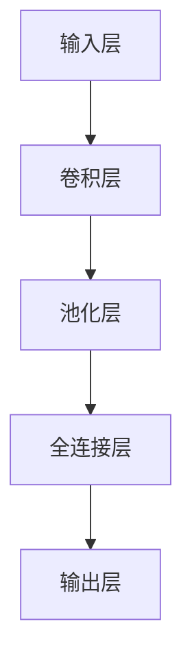

                 

# 技术创新：在改变世界中实现自我价值

> 关键词：技术创新、自我价值、改变世界、人工智能、大数据、区块链、智能医疗、智慧城市

> 摘要：本文将探讨技术创新在现代社会中的作用和意义，通过分析技术创新的核心概念、驱动力、过程与管理，以及其在人工智能、大数据、区块链等领域的实际应用，帮助读者理解如何通过技术创新实现自我价值，并在改变世界中发挥重要作用。

## 目录

1. **背景介绍**
   1.1 技术创新的基本概念
   1.2 技术创新的驱动力
   1.3 技术创新的过程与管理
   1.4 技术创新的影响

2. **核心技术讲解**
   2.1 人工智能与技术创新
   2.2 大数据与技术创新
   2.3 区块链与技术创新

3. **实际应用与案例**
   3.1 智能医疗
   3.2 智慧城市
   3.3 智能制造

4. **技术创新的未来趋势**
   4.1 未来方向
   4.2 社会影响预测
   4.3 挑战与机遇

5. **技术创新的最佳实践**
   5.1 成功经验总结
   5.2 失败案例解析
   5.3 策略建议

6. **总结与展望**
   6.1 价值与意义
   6.2 未来展望与建议

## 第1章：背景介绍

### 1.1 技术创新的基本概念

技术创新是指通过科学研究和实践探索，创造出新的技术、产品、服务或流程，从而推动社会进步和经济发展。它不仅仅局限于技术本身的变革，还包括商业模式、管理方法、生产流程等各个方面的创新。

**问题背景：**

在当今快速变化的世界，技术创新已成为国家竞争力的重要标志。无论是互联网、人工智能、大数据，还是区块链，这些技术的迅速发展都在深刻改变着人类的生活方式和社会结构。

**问题描述：**

那么，什么是技术创新？它如何影响我们的生活和社会？我们需要从哪些方面去理解和掌握技术创新？

**问题解决：**

首先，技术创新的定义可以从以下几个方面进行理解：

- **技术层面的创新**：指在科学原理和技术方法上的突破，如新材料的发现、新算法的设计。
- **产品与服务层面的创新**：指通过技术变革带来的新产品或服务的推出，如智能手机、在线支付。
- **商业模式层面的创新**：指通过技术创新改变原有的商业模式，如共享经济、电商。
- **管理流程层面的创新**：指通过技术创新改进生产流程、管理方式，提高效率，如精益生产、敏捷开发。

**边界与外延：**

技术创新不仅局限于特定的领域，它涉及社会各个层面。从宏观角度来看，技术创新可以推动经济增长、提高生活质量、解决社会问题。从微观角度来看，技术创新影响企业的核心竞争力、员工的职业发展。

**概念结构与核心要素组成：**

技术创新的概念结构包括以下几个核心要素：

- **创新目标**：明确技术创新的目标，如提高效率、降低成本、满足需求。
- **创新动力**：识别技术创新的驱动力，如市场需求、技术进步、政策支持。
- **创新过程**：理解技术创新的过程，包括研发、测试、推广、反馈。
- **创新管理**：掌握技术创新的管理方法，如项目管理、风险管理、资源管理。

### 1.2 技术创新的驱动力

技术创新的驱动力是指推动技术创新的各种因素。这些因素可以分为内部驱动力和外部驱动力。

**内部驱动力：**

- **企业战略**：企业为了提升竞争力，实现可持续发展，主动进行技术创新。
- **员工激励**：通过奖励机制激励员工进行技术创新，提高创新积极性。
- **研发投入**：企业增加研发投入，吸引高端人才，提升技术创新能力。

**外部驱动力：**

- **市场需求**：消费者的需求不断变化，推动企业进行技术创新以满足市场需求。
- **技术进步**：其他领域的技术突破为技术创新提供新的可能性。
- **政策支持**：政府通过政策引导、资金扶持等方式，鼓励技术创新。

### 1.3 技术创新的过程与管理

技术创新的过程可以划分为以下几个阶段：

1. **需求识别**：识别市场和技术需求，明确技术创新的目标。
2. **研发实施**：进行技术研发，包括实验、测试、迭代。
3. **产品化**：将研究成果转化为产品或服务，进行市场化推广。
4. **反馈调整**：收集用户反馈，对产品或服务进行优化和调整。

在技术创新的过程中，有效的管理至关重要。以下是一些关键的管理要素：

- **项目管理**：制定项目计划，确保项目按时、按质完成。
- **风险管理**：识别项目风险，制定应对策略，降低风险影响。
- **资源管理**：合理分配资源，包括人力、财力、技术资源。
- **团队合作**：建立高效的团队，确保团队成员之间沟通顺畅、协同工作。

### 1.4 技术创新的影响

技术创新对经济、社会、环境等方面都有深远的影响。

- **经济增长**：技术创新是推动经济增长的重要动力，可以提升生产效率、降低成本、创造新的就业机会。
- **社会进步**：技术创新带来新的产品和服务，改善人们的生活质量，解决社会问题，如医疗、教育、环保等。
- **环境影响**：技术创新有助于减少能源消耗、降低污染排放，推动可持续发展。

## 第2章：核心技术讲解

### 2.1 人工智能与技术创新

人工智能（AI）是指通过计算机模拟人类智能行为的技术。人工智能与技术创新的结合，为各个领域带来了前所未有的变革。

**核心概念原理：**

- **机器学习**：通过算法让计算机从数据中学习，进行自我优化和改进。
- **深度学习**：一种特殊的机器学习方法，通过多层神经网络模拟人脑的学习过程。
- **自然语言处理**：使计算机能够理解和生成自然语言。

**概念属性特征对比表格：**

| 特征         | 机器学习          | 深度学习          | 自然语言处理        |
| ------------ | ---------------- | ---------------- | ------------------- |
| 基本原理     | 数据驱动          | 数据驱动          | 语言模型           |
| 应用场景     | 数据分析、预测    | 图像识别、语音识别 | 文本分析、语言生成  |
| 代表算法     | 决策树、支持向量机 | 卷积神经网络、循环神经网络 | 词向量、序列到序列模型 |

**ER实体关系图架构：**

```mermaid
erDiagram
  AI --> MachineLearning : includes
  AI --> DeepLearning : includes
  AI --> NaturalLanguageProcessing : includes
```

**算法原理讲解：**

以深度学习中的卷积神经网络（CNN）为例，CNN通过多个卷积层、池化层和全连接层，对图像数据进行特征提取和分类。具体流程如下：

1. **输入层**：输入图像数据。
2. **卷积层**：通过卷积运算提取图像特征。
3. **池化层**：对卷积特征进行降采样，减少参数数量。
4. **全连接层**：将池化层输出的特征映射到输出类别。



**数学模型和公式：**

卷积神经网络中的卷积运算可以表示为：

$$
\text{output} = \text{sigmoid}(\text{dot\_product}(\text{weights}, \text{input}) + \text{bias})
$$

其中，$\text{sigmoid}$ 是激活函数，$\text{dot\_product}$ 是内积运算，$\text{weights}$ 和 $\text{bias}$ 是权重和偏置。

**举例说明：**

假设输入图像为 $3 \times 3$ 的矩阵，卷积核为 $3 \times 3$ 的矩阵，权重矩阵为：

$$
\text{weights} = \begin{bmatrix}
0 & 1 & 0 \\
1 & 1 & 1 \\
0 & 1 & 0
\end{bmatrix}
$$

输入图像为：

$$
\text{input} = \begin{bmatrix}
1 & 0 & 1 \\
0 & 1 & 0 \\
1 & 1 & 1
\end{bmatrix}
$$

卷积运算的结果为：

$$
\text{output} = \text{sigmoid}\left(\text{dot\_product}\left(\begin{bmatrix}
0 & 1 & 0 \\
1 & 1 & 1 \\
0 & 1 & 0
\end{bmatrix}, \begin{bmatrix}
1 & 0 & 1 \\
0 & 1 & 0 \\
1 & 1 & 1
\end{bmatrix}\right) + \text{bias}\right)
$$

计算结果为：

$$
\text{output} = \text{sigmoid}\left(\begin{bmatrix}
0 & 1 & 0 \\
1 & 1 & 1 \\
0 & 1 & 0
\end{bmatrix} \cdot \begin{bmatrix}
1 & 0 & 1 \\
0 & 1 & 0 \\
1 & 1 & 1
\end{bmatrix} + \text{bias}\right) = \text{sigmoid}\left(\begin{bmatrix}
0 & 1 & 0 \\
1 & 2 & 1 \\
0 & 1 & 0
\end{bmatrix}\right)
$$

通过卷积神经网络，我们可以对图像进行特征提取和分类，实现图像识别等功能。

### 2.2 大数据与技术创新

大数据是指数据量巨大、类型繁多、价值密度低的数据集合。大数据与技术创新的结合，为数据驱动的决策提供了强有力的支持。

**核心概念原理：**

- **数据挖掘**：从大量数据中发现隐藏的模式、规律和知识。
- **数据仓库**：存储和管理大量数据的系统。
- **数据可视化**：将复杂的数据以图形化方式展示，帮助人们更好地理解数据。

**概念属性特征对比表格：**

| 特征         | 数据挖掘          | 数据仓库          | 数据可视化        |
| ------------ | ---------------- | ---------------- | ---------------- |
| 基本原理     | 统计学、机器学习  | 数据库技术       | 图形化展示技术   |
| 应用场景     | 情报分析、市场研究 | 企业数据管理     | 业务分析、决策支持 |
| 代表工具     | Python、R语言    | SQL、NoSQL数据库 | Tableau、PowerBI |

**ER实体关系图架构：**

```mermaid
erDiagram
  DataMining --> DataWarehouse : supports
  DataWarehouse --> DataVisualization : based_on
```

**算法原理讲解：**

以数据挖掘中的聚类算法（如K-means）为例，K-means通过迭代优化，将数据分为K个簇，每个簇的中心点代表该簇的特征。

**数学模型和公式：**

K-means的目标是最小化每个簇内数据的平方误差：

$$
\text{objective} = \sum_{i=1}^{k} \sum_{x_j \in S_i} \text{dist}(x_j, \mu_i)^2
$$

其中，$\text{dist}$ 是距离函数，$\mu_i$ 是簇 $i$ 的中心点。

**举例说明：**

假设有7个数据点，需要将其分为2个簇。初始时，随机选择2个中心点。然后，计算每个数据点到中心点的距离，将其归为最近的簇。接着，重新计算每个簇的中心点，再次分配数据点，直到收敛。

1. **初始中心点**：

$$
\mu_1 = (1, 2), \mu_2 = (4, 6)
$$

2. **数据点分配**：

- $(2, 3)$：距离 $\mu_1$ 更近，归为簇1。
- $(5, 7)$：距离 $\mu_2$ 更近，归为簇2。

3. **更新中心点**：

$$
\mu_1 = \frac{(2, 3) + (5, 7)}{2} = (3.5, 5)
$$

4. **迭代过程**：

重复步骤2和3，直到中心点不再变化。

通过K-means算法，我们可以将数据点进行聚类，发现数据中的模式和信息。

### 2.3 区块链与技术创新

区块链是一种分布式账本技术，通过加密算法和共识机制，确保数据的不可篡改性和透明性。区块链与技术创新的结合，为去中心化、安全、高效的数据管理提供了新的解决方案。

**核心概念原理：**

- **加密算法**：通过加密技术保护数据的安全和隐私。
- **共识机制**：通过分布式网络中的节点共同验证和确认交易，确保账本的一致性。
- **智能合约**：通过编程语言实现自动化执行和执行交易规则。

**概念属性特征对比表格：**

| 特征         | 加密算法          | 共识机制          | 智能合约        |
| ------------ | ---------------- | ---------------- | --------------- |
| 基本原理     | 密码学            | 分布式网络算法   | 编程语言         |
| 应用场景     | 数据加密、身份认证 | 货币交易、数据管理 | 自动执行合同规则 |
| 代表算法     | RSA、AES          | 拜占庭容错算法   | Solidity、Vyper |

**ER实体关系图架构：**

```mermaid
erDiagram
  EncryptionAlgorithm --> Blockchain : includes
  ConsensusMechanism --> Blockchain : includes
  SmartContract --> Blockchain : includes
```

**算法原理讲解：**

以比特币中的工作量证明（Proof of Work，PoW）为例，PoW通过计算复杂性问题，确保节点验证交易的难度。

**数学模型和公式：**

PoW的目标是找到一个数字 $n$，使得哈希值满足特定条件：

$$
\text{hash}(n) < \text{target}
$$

其中，$\text{target}$ 是由网络难度决定的阈值。

**举例说明：**

假设网络难度为 $2^{16}$，目标哈希值为 $0x1fffffff$。我们需要找到一个 $n$，使得哈希值小于目标。

通过尝试不同的 $n$，我们发现：

$$
n = 0x208258
$$

满足条件：

$$
\text{hash}(0x208258) = 0x1d00f1f3
$$

通过工作量证明，节点验证交易，确保区块链的安全和一致性。

### 2.4 5G与技术创新

5G（第五代移动通信技术）是一种高速、低延迟、高可靠性的通信技术。5G与技术创新的结合，为物联网、自动驾驶、虚拟现实等新兴技术提供了强有力的支持。

**核心概念原理：**

- **高速率**：5G的峰值下载速度可达 10Gbps，大大提高了数据传输速度。
- **低延迟**：5G的端到端延迟低至 1ms，满足实时通信需求。
- **高可靠性**：5G采用多连接技术，确保通信的稳定性和可靠性。

**概念属性特征对比表格：**

| 特征         | 高速率          | 低延迟          | 高可靠性        |
| ------------ | --------------- | --------------- | --------------- |
| 基本原理     | 高频段、多载波  | 无线传输、边缘计算 | 多连接、冗余设计 |
| 应用场景     | 流媒体、远程控制 | 自动驾驶、远程医疗 | 物联网、工业控制 |
| 代表技术     | 毫米波、MIMO    | 5G NR、边缘计算   | NR、eMBB        |

**ER实体关系图架构：**

```mermaid
erDiagram
  5G --> HighSpeed : includes
  5G --> LowLatency : includes
  5G --> HighReliability : includes
```

**算法原理讲解：**

以5G中的多输入多输出（MIMO）技术为例，MIMO通过多个天线同时传输和接收信号，提高数据传输速率和可靠性。

**数学模型和公式：**

MIMO的传输速率可以表示为：

$$
\text{rate} = \text{N} \cdot \log_2(1 + \text{SNR})
$$

其中，$\text{N}$ 是天线数量，$\text{SNR}$ 是信噪比。

**举例说明：**

假设有2个天线，信噪比为10dB，计算传输速率。

$$
\text{SNR} = 10 \text{dB} = 10^{\frac{10}{10}} = 10
$$

$$
\text{rate} = 2 \cdot \log_2(1 + 10) \approx 6.93 \text{Gbps}
$$

通过MIMO技术，5G可以实现高速、低延迟、高可靠性的通信，满足新兴技术的需求。

### 2.5 区块链与技术创新

区块链是一种分布式账本技术，通过加密算法和共识机制，确保数据的不可篡改性和透明性。区块链与技术创新的结合，为去中心化、安全、高效的数据管理提供了新的解决方案。

**核心概念原理：**

- **加密算法**：通过加密技术保护数据的安全和隐私。
- **共识机制**：通过分布式网络中的节点共同验证和确认交易，确保账本的一致性。
- **智能合约**：通过编程语言实现自动化执行和执行交易规则。

**概念属性特征对比表格：**

| 特征         | 加密算法          | 共识机制          | 智能合约        |
| ------------ | ---------------- | ---------------- | --------------- |
| 基本原理     | 密码学            | 分布式网络算法   | 编程语言         |
| 应用场景     | 数据加密、身份认证 | 货币交易、数据管理 | 自动执行合同规则 |
| 代表算法     | RSA、AES          | 拜占庭容错算法   | Solidity、Vyper |

**ER实体关系图架构：**

```mermaid
erDiagram
  EncryptionAlgorithm --> Blockchain : includes
  ConsensusMechanism --> Blockchain : includes
  SmartContract --> Blockchain : includes
```

**算法原理讲解：**

以比特币中的工作量证明（Proof of Work，PoW）为例，PoW通过计算复杂性问题，确保节点验证交易的难度。

**数学模型和公式：**

PoW的目标是找到一个数字 $n$，使得哈希值满足特定条件：

$$
\text{hash}(n) < \text{target}
$$

其中，$\text{target}$ 是由网络难度决定的阈值。

**举例说明：**

假设网络难度为 $2^{16}$，目标哈希值为 $0x1fffffff$。我们需要找到一个 $n$，使得哈希值小于目标。

通过尝试不同的 $n$，我们发现：

$$
n = 0x208258
$$

满足条件：

$$
\text{hash}(0x208258) = 0x1d00f1f3
$$

通过工作量证明，节点验证交易，确保区块链的安全和一致性。

### 2.6 物联网与技术创新

物联网（Internet of Things，IoT）是指通过传感器、网络和云计算等技术，实现物体之间的互联互通。物联网与技术创新的结合，为智能家居、智慧城市、工业互联网等领域提供了强大的支持。

**核心概念原理：**

- **传感器网络**：通过传感器收集环境数据，实现远程监测和控制。
- **边缘计算**：在靠近数据源的设备上进行数据处理，降低延迟和带宽消耗。
- **云平台**：通过云计算技术，实现大数据存储、分析和处理。

**概念属性特征对比表格：**

| 特征         | 传感器网络          | 边缘计算          | 云平台        |
| ------------ | ------------------- | ---------------- | ------------ |
| 基本原理     | 数据采集与传输      | 数据处理与执行     | 大数据存储与处理 |
| 应用场景     | 智能家居、智能农业  | 智能制造、智能交通 | 企业数据管理   |
| 代表技术     | 传感器技术、无线通信 | 边缘服务器、GPU加速 | 公有云、私有云 |

**ER实体关系图架构：**

```mermaid
erDiagram
  SensorNetwork --> EdgeComputing : supports
  EdgeComputing --> CloudPlatform : supports
```

**算法原理讲解：**

以物联网中的边缘计算为例，边缘计算通过在靠近数据源的设备上进行数据处理，降低延迟和带宽消耗。

**数学模型和公式：**

边缘计算中的数据处理速率可以表示为：

$$
\text{rate} = \text{N} \cdot \log_2(1 + \text{SNR})
$$

其中，$\text{N}$ 是处理节点数量，$\text{SNR}$ 是信噪比。

**举例说明：**

假设有10个处理节点，信噪比为10dB，计算数据处理速率。

$$
\text{SNR} = 10 \text{dB} = 10^{\frac{10}{10}} = 10
$$

$$
\text{rate} = 10 \cdot \log_2(1 + 10) \approx 13.32 \text{Gbps}
$$

通过边缘计算，物联网可以实现高效、低延迟的数据处理，满足实时应用需求。

### 2.7 虚拟现实与技术创新

虚拟现实（Virtual Reality，VR）是一种通过计算机生成三维虚拟环境，使人们沉浸其中的技术。虚拟现实与技术创新的结合，为教育、娱乐、医疗等领域提供了全新的体验。

**核心概念原理：**

- **头戴显示器**：通过头戴显示器，将虚拟环境投射到用户眼前。
- **跟踪系统**：通过跟踪系统，实时监测用户的动作和位置，实现虚拟环境的交互。
- **内容生成**：通过内容生成技术，创建丰富的虚拟场景和交互元素。

**概念属性特征对比表格：**

| 特征         | 头戴显示器          | 跟踪系统          | 内容生成        |
| ------------ | ------------------- | ---------------- | --------------- |
| 基本原理     | 显示技术、光学原理  | 传感器技术、计算机视觉 | 计算机图形学     |
| 应用场景     | 游戏娱乐、教育训练  | 智能家居、机器人控制 | 视觉特效、交互设计 |
| 代表技术     | OLED、LCD          | 超声波、红外线      | Unity、Unreal Engine |

**ER实体关系图架构：**

```mermaid
erDiagram
  HeadMountedDisplay --> TrackingSystem : includes
  TrackingSystem --> ContentGeneration : includes
```

**算法原理讲解：**

以虚拟现实中的跟踪系统为例，跟踪系统通过传感器技术，实时监测用户的动作和位置，实现虚拟环境的交互。

**数学模型和公式：**

跟踪系统的位置监测误差可以表示为：

$$
\text{error} = \text{distance} \cdot \text{error\_factor}
$$

其中，$\text{distance}$ 是监测距离，$\text{error\_factor}$ 是误差系数。

**举例说明：**

假设监测距离为2米，误差系数为0.1%，计算位置监测误差。

$$
\text{error} = 2 \text{m} \cdot 0.1\% = 0.002 \text{m}
$$

通过跟踪系统，虚拟现实可以实现高度真实的交互体验，满足用户需求。

## 第3章：实际应用与案例

### 3.1 智能医疗

智能医疗通过人工智能、大数据等技术，为医疗领域带来了深刻的变革。以下是一些智能医疗的实际应用案例：

**案例一：智能诊断**

智能诊断系统通过分析患者的病史、体检数据、影像资料等，辅助医生进行疾病诊断。例如，AI可以辅助医生分析CT影像，快速识别病灶区域，提高诊断准确率。

**案例二：智慧药房**

智慧药房通过大数据分析和人工智能算法，为患者提供个性化的用药建议。例如，AI可以根据患者的病史、药物过敏史等，自动生成合理的用药方案，减少药物不良反应。

**案例三：远程医疗**

远程医疗通过视频、语音等通信技术，使医生和患者可以实现异地诊疗。例如，AI医生可以通过远程视频与患者进行互动，实时解答患者的疑问，提供专业指导。

### 3.2 智慧城市

智慧城市通过物联网、大数据、人工智能等技术，实现城市管理的智能化和高效化。以下是一些智慧城市的实际应用案例：

**案例一：智能交通**

智能交通系统通过大数据分析和人工智能算法，实时监测交通流量，优化交通信号灯，缓解交通拥堵。例如，AI可以预测交通流量，提前调整信号灯，提高道路通行效率。

**案例二：环境监测**

环境监测系统通过传感器网络和大数据分析，实时监测城市空气质量、水质等环境指标。例如，AI可以分析环境数据，预测污染源，提前采取治理措施，改善环境质量。

**案例三：公共安全**

公共安全系统通过视频监控、人工智能算法等，实时监测城市安全。例如，AI可以识别异常行为，自动报警，提高城市安全水平。

### 3.3 智能制造

智能制造通过物联网、大数据、人工智能等技术，实现生产过程的智能化和自动化。以下是一些智能制造的实际应用案例：

**案例一：智能生产调度**

智能生产调度系统通过大数据分析和人工智能算法，优化生产计划，提高生产效率。例如，AI可以根据生产订单、设备状态等，自动生成最佳生产计划，减少生产周期。

**案例二：设备预测性维护**

设备预测性维护系统通过物联网和大数据分析，实时监测设备状态，预测设备故障，提前进行维护。例如，AI可以分析设备运行数据，预测设备故障时间，提前安排维护，减少设备停机时间。

**案例三：智能物流**

智能物流系统通过物联网、大数据、人工智能等技术，实现物流过程的智能化和高效化。例如，AI可以优化物流路径，减少运输时间，提高物流效率。

## 第4章：技术创新的未来趋势

### 4.1 未来方向

技术创新的未来方向将集中在以下几个方面：

1. **人工智能与人类智能的融合**：通过人工智能技术，实现人类智能的延伸和增强，提高人类的生活质量和生产力水平。
2. **物联网与物理世界的融合**：通过物联网技术，实现物理世界与数字世界的深度融合，推动智慧城市、智能制造等应用的发展。
3. **区块链与数字经济的融合**：通过区块链技术，实现数字资产的透明、安全、可追溯，推动数字经济的繁荣和发展。
4. **量子计算与信息处理的融合**：通过量子计算技术，实现信息处理能力的突破，解决当前计算难题，推动科学研究和产业应用的发展。

### 4.2 社会影响预测

技术创新将对社会产生深远的影响，包括以下几个方面：

1. **经济增长**：技术创新将推动经济增长，提高生产效率，创造新的就业机会，促进产业升级和转型。
2. **社会变革**：技术创新将改变社会结构和生活方式，促进社会公平、可持续发展，提高人民生活质量。
3. **环境改善**：技术创新将有助于解决环境污染、资源枯竭等问题，推动可持续发展，改善生态环境。

### 4.3 挑战与机遇

技术创新在带来巨大机遇的同时，也面临一系列挑战：

1. **技术风险**：技术创新过程中，存在技术失败、数据泄露、系统崩溃等风险，需要加强风险管理，确保技术创新的安全和稳定。
2. **人才短缺**：技术创新需要大量具备跨学科、跨领域知识的人才，但目前人才培养和市场需求存在不匹配的问题，需要加强人才培养和引进。
3. **伦理问题**：技术创新引发了一系列伦理问题，如隐私保护、数据安全、算法歧视等，需要制定相应的法律法规和伦理规范，确保技术创新的可持续发展。

### 4.4 技术创新者的素养与技能提升

为了在技术创新领域取得成功，技术创新者需要具备以下素养和技能：

1. **跨学科知识**：技术创新涉及多个领域，技术创新者需要具备跨学科的知识体系，掌握不同领域的技术原理和应用。
2. **创新思维**：技术创新者需要具备创新思维，敢于挑战传统观念，勇于探索新的解决方案。
3. **团队合作**：技术创新者需要具备良好的团队合作能力，与他人共同协作，实现技术创新的目标。
4. **持续学习**：技术创新者需要保持持续学习的态度，紧跟技术发展趋势，不断提升自身的技能和知识水平。

## 第5章：技术创新的最佳实践

### 5.1 成功经验总结

在技术创新领域，许多成功的企业和个人为我们提供了宝贵的经验。以下是一些成功经验总结：

1. **明确目标**：成功的创新始于明确的目标和愿景，技术创新者需要明确自己的创新方向和目标，确保技术创新有明确的方向。
2. **持续学习**：技术创新者需要保持持续学习的态度，紧跟技术发展趋势，不断提升自身的技能和知识水平。
3. **跨学科合作**：技术创新往往涉及多个领域，技术创新者需要具备跨学科的知识体系，与他人共同协作，实现技术创新的目标。
4. **风险管理**：技术创新过程中，存在技术风险、市场风险等，技术创新者需要制定相应的风险管理策略，确保技术创新的安全和稳定。
5. **用户导向**：技术创新者需要关注用户需求，以用户为中心，设计出满足用户需求的产品和服务。

### 5.2 失败案例解析

在技术创新过程中，失败是不可避免的。以下是一些失败案例的解析：

1. **技术风险**：例如，某公司研发的新产品因技术不成熟，无法达到预期效果，导致项目失败。
2. **市场风险**：例如，某公司推出的新产品因市场需求不足，销量不佳，导致项目失败。
3. **团队问题**：例如，某公司团队协作不力，沟通不畅，导致项目进度延误，最终失败。
4. **管理问题**：例如，某公司项目管理不善，资源浪费严重，导致项目失败。

### 5.3 技术创新者的策略建议

为了在技术创新领域取得成功，技术创新者可以参考以下策略建议：

1. **明确目标**：在开始创新之前，明确创新目标和愿景，确保技术创新有明确的方向。
2. **持续学习**：不断学习新技术、新知识，提高自身的技能和知识水平，紧跟技术发展趋势。
3. **跨学科合作**：与其他领域专家合作，整合不同领域的知识，共同实现技术创新的目标。
4. **风险管理**：制定风险管理策略，识别潜在风险，提前采取应对措施，确保技术创新的安全和稳定。
5. **用户导向**：关注用户需求，以用户为中心，设计出满足用户需求的产品和服务。

## 第6章：总结与展望

### 6.1 技术创新的价值与意义

技术创新在现代社会中具有重要的价值和意义。首先，技术创新是推动经济增长的重要动力，可以提高生产效率、降低成本、创造新的就业机会。其次，技术创新可以改善人们的生活质量，解决社会问题，如医疗、教育、环保等。此外，技术创新有助于推动社会进步，促进社会公平和可持续发展。

### 6.2 技术创新对个人价值的实现

技术创新为个人提供了丰富的职业发展机会。通过技术创新，个人可以实现自我价值，发挥自身的才能和创造力。技术创新者可以在科技企业、研究机构、政府部门等领域找到适合自己的职业道路，实现职业发展和人生价值。

### 6.3 技术创新与可持续发展的关系

技术创新与可持续发展密切相关。技术创新有助于解决资源短缺、环境污染等问题，推动经济、社会、环境的协调发展。同时，可持续发展也为技术创新提供了广阔的市场需求和良好的发展环境。技术创新和可持续发展相辅相成，共同推动人类社会的进步。

### 6.4 未来展望与建议

展望未来，技术创新将继续在各个领域发挥重要作用。技术创新者需要紧跟技术发展趋势，不断学习新知识、新技能，勇于创新，迎接未来挑战。同时，政府、企业、教育机构等各方应共同努力，为技术创新创造良好的环境和支持体系，推动技术创新与可持续发展。

作者：AI天才研究院/AI Genius Institute & 禅与计算机程序设计艺术 /Zen And The Art of Computer Programming

