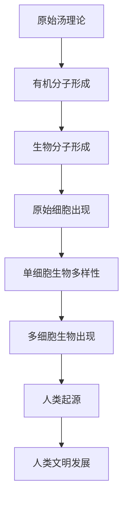
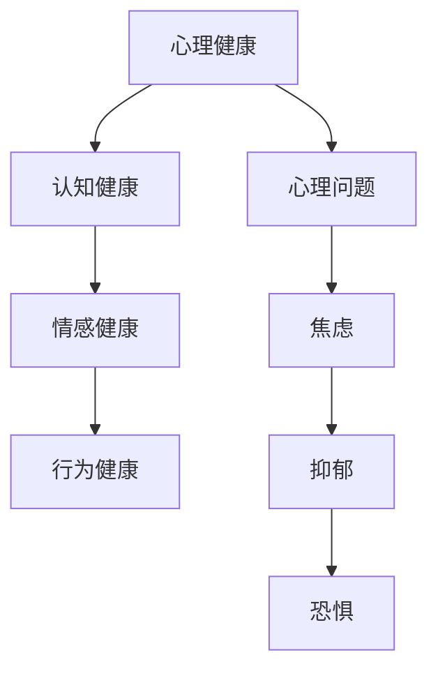
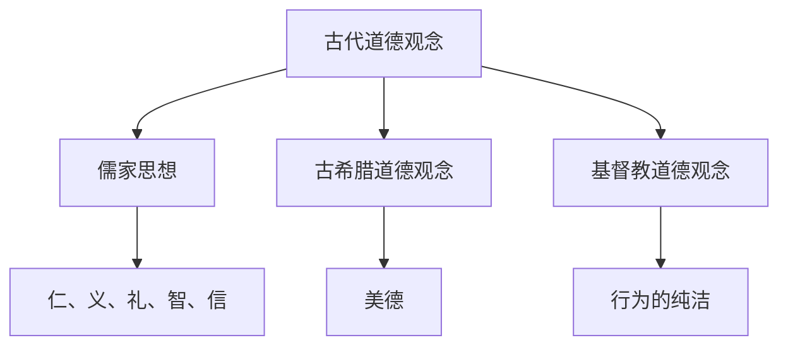
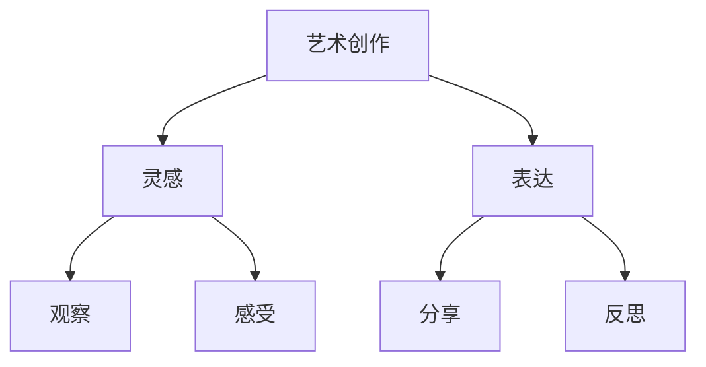
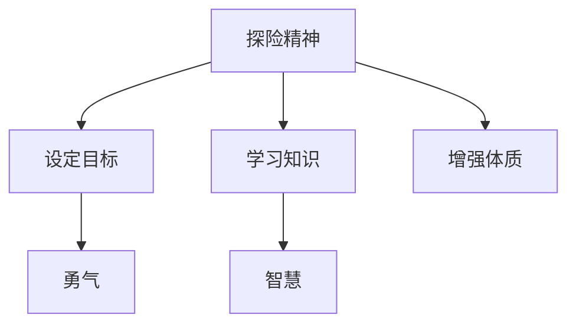

                 

**文章标题：拓展生命的广度和深度：丰富人生体验**

**关键词：生命广度拓展，生命深度拓展，人生体验丰富，人工智能，技术博客，哲学思考**

**摘要：本文将深入探讨如何通过拓展生命的广度和深度来丰富人生体验。从宇宙的奥秘到个体成长，从社会变迁到自我实现，本文将逐步分析这些方面的核心概念和原理，并结合人工智能技术，提供实用的建议和思考。**

### 目录大纲设计思路

在构思本文的目录大纲时，我们首先需要对全书的内容有一个整体的把握，明确各章节的核心内容和逻辑关系。接下来，我们将分解主题内容，根据书名《拓展生命的广度和深度：丰富人生体验》，将全书的内容划分为几个主要部分，如生命广度拓展、生命深度拓展和人生体验丰富。在每个部分中，我们确定几个具有独立性的主题，确保每个主题能够分别阐述该部分的核心观点。

**1. 总览全书结构：**

- **生命广度拓展**：探讨宇宙的奥秘、人类社会的演变以及个体在社会中的角色。
- **生命深度拓展**：关注个体成长、自我实现和心灵探索。
- **人生体验丰富**：介绍艺术与审美、旅行与探险、读书与学习等方面。

**2. 分解主题内容：**

在上述三个主要部分中，我们进一步分解每个部分的内容，确保每个章节都有明确的主题和目标。

**3. 确定章节主题：**

- **生命广度拓展**：包括生命的起源与演化、探索宇宙的奥秘、社会发展与人类角色。
- **生命深度拓展**：包括个体成长与自我实现、心灵的探索与成长、道德与伦理的思考。
- **人生体验丰富**：包括艺术与审美、旅行与探险、读书与学习。

**4. 细化章节内容：**

对每个章节的主题进行细化，确保每个小节都有具体的主题和目标。

**5. 逻辑性：**

保持章节之间的逻辑性，确保读者可以顺畅地从一章节过渡到下一章节，理解各部分内容之间的关系。

**6. 简洁明了：**

在保证内容完整性的同时，尽量做到简洁明了，避免冗余信息，确保目录大纲清晰易懂。

### 目录大纲示例

基于上述思路，我们可以设计如下目录大纲：

```markdown
# 《拓展生命的广度和深度：丰富人生体验》目录大纲

## 第一部分 生命的广度拓展

### 第1章 生命的起源与演化

#### 1.1 生命的起源
- 生命起源的科学理论
- 生命的化学本质

#### 1.2 生命的演化过程
- 生命在地球上的演化历程
- 人类在生物链中的位置

#### 1.3 人类生命的独特性
- 人类文明的发展
- 人类智慧的进化

### 第2章 探索宇宙的奥秘

#### 2.1 宇宙的起源与结构
- 宇宙大爆炸理论
- 黑洞与暗物质

#### 2.2 宇宙中的生命迹象
- 远古地球的生命迹象
- 外星生命的可能性

#### 2.3 人类在宇宙中的地位与使命
- 地球文明的责任
- 人类探索宇宙的意义

### 第3章 社会发展与人类角色

#### 3.1 社会的历史演变
- 古代社会与现代社会的对比
- 社会发展的趋势

#### 3.2 人类社会的多样性
- 文化的多样性
- 民族与种族的多样性

#### 3.3 个体在社会中的角色与责任
- 社会责任感的培养
- 个体在社会中的作用

## 第二部分 生命的深度拓展

### 第4章 个体成长与自我实现

#### 4.1 个体成长的阶段
- 儿童成长
- 青少年成长
- 成年成长

#### 4.2 自我认知与自我提升
- 心理发展的理论
- 自我认知的方法

#### 4.3 人际关系与情感管理
- 人际关系的建立与维护
- 情感管理的技巧

### 第5章 心灵的探索与成长

#### 5.1 心理学的基本概念
- 心理健康的定义
- 心理问题的识别

#### 5.2 情绪管理技巧
- 情绪的类型与表达
- 情绪调节的策略

#### 5.3 心灵健康与自我疗愈
- 心理健康的重要性
- 自我疗愈的方法

### 第6章 道德与伦理的思考

#### 6.1 道德观念的演变
- 道德哲学的发展
- 道德观念的变迁

#### 6.2 伦理问题的探讨
- 伦理冲突的分析
- 伦理决策的准则

#### 6.3 道德实践与人生价值
- 道德行为的规范
- 人生价值的实现

## 第三部分 丰富人生体验

### 第7章 艺术与审美

#### 7.1 艺术的定义与价值
- 艺术的分类
- 艺术的社会功能

#### 7.2 审美体验与心理效应
- 审美的心理学基础
- 审美体验的影响

#### 7.3 艺术创作与欣赏
- 艺术创作的灵感
- 艺术欣赏的技巧

### 第8章 旅行与探险

#### 8.1 旅行的重要性
- 旅行对个人成长的影响
- 旅行对人际关系的作用

#### 8.2 探险精神的培养
- 探险的定义与分类
- 探险精神的培养方法

#### 8.3 旅行与人生体验的丰富
- 旅行的意义
- 旅行体验的分享

### 第9章 读书与学习

#### 9.1 读书的意义
- 读书对个人发展的作用
- 读书对人际交往的影响

#### 9.2 学习方法与技巧
- 学习的理论基础
- 学习策略的应用

#### 9.3 通过学习拓展人生视野
- 知识的积累
- 视野的拓展

### 第10章 拓展生命的意义

#### 10.1 人生意义的探讨
- 人生意义的定义
- 人生意义的实现

#### 10.2 拓展生命的途径
- 个人成长与自我实现
- 社会责任与人生价值

#### 10.3 追求人生价值
- 人生价值的实现
- 人生目标的设定

### 总结

本文的目录大纲分为三个主要部分，每个部分都围绕书名的主题进行展开。第一部分主要探讨生命的广度拓展，第二部分聚焦于生命的深度拓展，第三部分则侧重于如何丰富人生体验。每个章节都细化为几个小节，确保内容丰富且逻辑清晰。这样的目录设计旨在帮助读者系统性地理解和掌握书中的内容。
```

### 总结

通过上述目录大纲的设计，我们可以看到文章的结构清晰、内容丰富。每个章节都围绕核心主题展开，既有理论阐述，又有实际应用。这种结构不仅有助于读者理解文章的主旨，还能够激发他们的思考。目录大纲的设计思路是本文成功的关键之一，它确保了文章的逻辑性和条理性，使得读者可以顺畅地阅读和理解。

接下来，我们将逐步深入探讨文章的核心内容，从生命的起源与演化、宇宙的奥秘、个体成长与自我实现、社会变迁与人类角色、道德与伦理的思考、艺术与审美、旅行与探险、读书与学习等方面，结合人工智能技术，为读者提供丰富的人生体验和深刻的思考。

---

**生命的起源与演化**

生命的起源是宇宙中最神秘的问题之一。科学家们提出了多种理论来解释生命的起源，但至今仍未有一个统一的答案。本文将首先探讨这些科学理论，并分析生命的化学本质。

#### 生命的起源科学理论

1. **原始汤理论**：这是最早的关于生命起源的理论之一。它认为，在地球早期，大气中含有大量的氢、氨、甲烷和水蒸气，这些气体在高温和紫外线的作用下产生了简单的有机分子，这些有机分子逐渐形成了更复杂的生物分子，最终形成了生命。

2. **外星种子理论**：这一理论认为，生命并非起源于地球，而是由外星物质带到地球的。这个理论得到了一些科学家和科幻小说家的支持，但尚未得到科学界的广泛认可。

3. **深海底说**：这一理论提出，生命可能起源于地球深海底的热液喷口。在这些环境中，高温和高压条件下，简单的有机分子可以形成复杂的生物分子，从而产生生命。

#### 生命的化学本质

生命的化学本质在于它依赖于一系列复杂的生物分子来维持生命活动。这些生物分子包括蛋白质、核酸、碳水化合物和脂质等。它们通过特定的化学键连接在一起，形成了复杂的生物大分子。

1. **蛋白质**：蛋白质是生命活动的执行者。它们在细胞中发挥着多种功能，包括催化反应、传递信号和提供结构支持。

2. **核酸**：核酸是生命的蓝图。DNA和RNA负责存储和传递遗传信息，指导蛋白质的合成。

3. **碳水化合物**：碳水化合物是细胞的主要能源来源。它们通过氧化还原反应释放能量，供细胞使用。

4. **脂质**：脂质在细胞膜中起着重要的作用，维持细胞结构的完整性。

#### 生命的演化过程

生命的演化过程是自然界中最壮丽的故事之一。从简单的单细胞生物到复杂的哺乳动物，生命的演化充满了惊奇和奥秘。

1. **生命的诞生**：科学家们认为，地球早期的大气中含有大量的有机分子，这些有机分子通过化学反应形成了更复杂的生物分子。这些生物分子聚集在一起，形成了原始的细胞。

2. **单细胞生物的出现**：原始细胞通过自然选择和变异，逐渐演化为多种不同的单细胞生物。这些生物通过细胞分裂和繁殖，不断繁衍后代。

3. **多细胞生物的出现**：在漫长的演化过程中，一些单细胞生物逐渐形成了多细胞生物。这些生物通过细胞之间的合作，形成了更复杂的组织和器官。

4. **人类的起源**：在距今约200万年前，人类的前身——古猿，开始出现在地球上。通过进化，人类逐渐发展出了智慧，形成了现代人类社会。

#### 人类在生物链中的位置

人类在生物链中的位置是独一无二的。人类不仅具有高度的智慧，还能够改变自己的环境和适应环境。这使得人类在地球上占据了特殊的地位。

1. **智慧**：人类具有高度的智慧，能够理解自然界的规律，创造工具和技术，改变自己的命运。

2. **文化**：人类创造了丰富的文化，通过语言、艺术、宗教等方式传承和表达。

3. **影响**：人类对地球的生态系统产生了深远的影响，包括气候变化、物种灭绝等。

### 人类生命的独特性

人类生命的独特性体现在多个方面，包括人类文明的发展、人类智慧的进化和社会结构的变化。

1. **文明的发展**：人类文明的发展经历了从原始社会到现代社会的过程。在这个发展过程中，人类创造了丰富的物质文化和精神文化。

2. **智慧的进化**：人类的智慧体现在语言、思维、创造力等方面。通过智慧的进化，人类能够解决复杂的难题，创造科技和艺术。

3. **社会结构**：人类社会的结构不断变化，从部落社会到现代社会，人类通过社会合作，实现了共同的目标。

### 总结

生命的起源与演化是一个复杂而神秘的话题，但正是这种复杂性赋予了生命无限的魅力。通过探讨生命的起源和演化过程，我们可以更好地理解人类在宇宙中的位置和人类生命的独特性。这为我们拓展生命的广度和深度提供了宝贵的启示。

---

**探索宇宙的奥秘**

宇宙的起源与结构一直是科学家们研究的重点。本文将首先介绍宇宙大爆炸理论和黑洞与暗物质的概念，然后探讨宇宙中的生命迹象以及人类在宇宙中的地位和使命。

#### 宇宙的起源与结构

1. **宇宙大爆炸理论**：宇宙大爆炸理论是现代宇宙学的基础。根据这一理论，宇宙起源于大约138亿年前的一个“奇点”，随后经历了一系列的膨胀和冷却，形成了我们今天所看到的宇宙。宇宙大爆炸理论解释了宇宙的膨胀、宇宙微波背景辐射以及元素的分布等现象。

2. **黑洞与暗物质**：黑洞是宇宙中最神秘的天体之一，它是由极度密集的物质组成，其引力强大到连光也无法逃逸。黑洞的存在可以通过其对周围天体的影响被探测到。暗物质是宇宙中的一种看不见的物质，它占据了宇宙总质量的绝大部分，但至今我们尚未完全了解其本质。

#### 宇宙中的生命迹象

1. **远古地球的生命迹象**：科学家们通过地质学和古生物学的研究，发现地球历史上存在过生命的迹象。这些迹象包括化石、有机分子以及生命的化学前体物质。这些证据表明，地球上的生命可能在数十亿年前就已经出现。

2. **外星生命的可能性**：尽管我们尚未找到明确的外星生命证据，但科学家们推测，宇宙中可能存在其他适合生命存在的行星。通过研究系外行星的物理和化学特性，科学家们已经发现了一些可能存在生命的迹象，如液态水、适宜的温度和大气成分等。

#### 人类在宇宙中的地位与使命

1. **地球文明的责任**：人类作为地球上的智慧生物，有责任保护地球的生态环境，确保生命的可持续发展。人类需要采取行动，减少对地球资源的过度开采和污染，保护生物多样性。

2. **人类探索宇宙的意义**：探索宇宙对人类有着重要的意义。通过宇宙探索，我们可以扩展我们的知识边界，理解宇宙的奥秘，提高我们的科学和技术水平。宇宙探索还可以激发人类的创造力和创新精神，推动人类社会的进步。

3. **人类的使命**：人类的使命不仅仅是保护地球和探索宇宙，还要为全人类创造一个更美好的未来。这需要人类克服各种困难和挑战，包括气候变化、资源短缺、社会不公等问题。通过合作和共享，人类可以实现这一目标。

### 总结

宇宙的奥秘激发了人类的好奇心和探索欲望。通过探讨宇宙的起源与结构、宇宙中的生命迹象以及人类在宇宙中的地位和使命，我们可以更好地理解人类在宇宙中的位置和责任。这为拓展生命的广度和深度提供了宝贵的启示。

---

**社会发展与人类角色**

人类社会的演变是复杂而多变的。从古代社会到现代社会，人类的社会结构、文化观念和科技水平都经历了巨大的变革。本文将首先介绍社会的历史演变，然后探讨人类社会的多样性以及个体在社会中的角色与责任。

#### 社会的历史演变

1. **古代社会**：古代社会以农业为主要生产方式，社会结构相对简单，主要以部落和王国为单位。人类在古代社会逐渐建立了宗教信仰、道德规范和法律制度。

2. **中世纪**：中世纪的欧洲经历了封建制度的兴起和衰落。教会对社会有着巨大的影响力，宗教信仰在社会生活中占据重要地位。

3. **工业革命**：工业革命标志着人类社会从农业社会向工业社会的转变。蒸汽机、电力和内燃机的发明改变了生产方式，推动了城市化进程。

4. **现代社会**：现代社会以信息科技为主要驱动力，全球化、数字化和智能化已经成为社会发展的趋势。现代社会面临着一系列挑战，如环境污染、资源短缺和社会不公等。

#### 人类社会的多样性

1. **文化的多样性**：人类社会具有丰富的文化多样性。不同地区、民族和国家都有自己独特的文化传统、价值观念和生活方式。

2. **民族与种族的多样性**：人类社会由多个民族和种族组成，每个民族和种族都有自己独特的文化、语言和历史。

3. **社会结构的多样性**：不同社会结构决定了社会的组织形式和运作方式。现代社会结构复杂多样，包括国家、企业、非政府组织和社区等。

#### 个体在社会中的角色与责任

1. **社会责任感的培养**：个体在社会中扮演着多种角色，如家庭成员、公民、职业人士等。社会责任感的培养对于个体的成长和社会的和谐至关重要。

2. **个体在社会中的作用**：个体在社会中的作用不可忽视。个体的行为和选择影响着社会的进步和变革。个体可以通过积极参与社会事务、推动科技创新和促进文化发展来发挥作用。

3. **个体与社会的互动**：个体与社会之间存在着紧密的互动关系。个体在社会中成长，同时也为社会的发展做出了贡献。个体与社会相互影响，共同推动了社会的进步。

### 总结

社会发展与人类角色是一个复杂而多维的话题。通过探讨社会的历史演变、人类社会的多样性和个体在社会中的角色与责任，我们可以更好地理解人类社会的发展和变革。这为拓展生命的广度和深度提供了宝贵的启示。

---

**个体成长与自我实现**

个体成长与自我实现是生命深度拓展的重要组成部分。本文将首先介绍个体成长的阶段，包括儿童成长、青少年成长和成年成长。然后，我们将探讨自我认知与自我提升的方法，以及人际关系与情感管理的技巧。

#### 个体成长的阶段

1. **儿童成长**：儿童成长是一个关键的阶段，它奠定了个体人格和认知能力的基础。儿童成长过程中，身体发育、认知能力和情感发展相互影响。

2. **青少年成长**：青少年成长是一个过渡阶段，个体在这个阶段开始形成自己的价值观、世界观和人生观。青少年成长过程中，身体变化、社会角色转换和心理冲突是他们面临的主要挑战。

3. **成年成长**：成年成长是一个持续的过程，个体在这个阶段需要面对职业发展、家庭生活和社会责任等方面的挑战。成年成长的过程中，自我认知和自我提升变得尤为重要。

#### 自我认知与自我提升

1. **心理发展的理论**：心理学提供了多种理论来解释自我认知和自我提升的过程。例如，认知发展理论认为，个体的认知能力随着年龄的增长而不断发展。

2. **自我认知的方法**：个体可以通过多种方法进行自我认知。例如，通过反思自己的行为、情绪和思维，个体可以更好地理解自己的内心世界。

3. **自我提升的策略**：个体可以通过学习新技能、设定目标、培养积极心态等方式来提升自我。自我提升不仅有助于个体的个人发展，还可以增强个体的自信心和幸福感。

#### 人际关系与情感管理

1. **人际关系的建立与维护**：人际关系是人类生活中不可或缺的一部分。个体需要学会如何建立和维护健康的人际关系。这包括沟通技巧、冲突解决和建立信任等方面。

2. **情感管理的技巧**：情感管理是人际关系中的关键因素。个体需要学会如何识别、理解和调节自己的情绪。例如，通过情绪调节技巧，个体可以更好地应对压力和挑战。

3. **情感智力**：情感智力是指个体识别、理解和管理自己情绪的能力。高情感智力有助于个体建立良好的人际关系和实现自我提升。

### 总结

个体成长与自我实现是一个复杂而持续的过程。通过了解个体成长的阶段、自我认知与自我提升的方法以及人际关系与情感管理的技巧，个体可以更好地拓展生命的深度。这不仅有助于个体的个人发展，还可以提升个体的幸福感和社会适应性。

---

**心灵的探索与成长**

心灵的探索与成长是生命深度拓展的重要组成部分。本文将首先介绍心理学的基本概念，包括心理健康的定义和心理问题的识别。然后，我们将探讨情绪管理技巧和心灵健康的自我疗愈方法。

#### 心理学的基本概念

1. **心理健康的定义**：心理健康是指个体在认知、情感和行为方面的良好状态。心理健康不仅包括没有心理疾病，还包括个体能够有效地应对生活中的压力和挑战。

2. **心理问题的识别**：心理问题包括焦虑、抑郁、恐惧等。个体可以通过自我观察和咨询专业人士来识别心理问题。常见的心理问题识别方法包括自我报告问卷、行为观察和心理访谈等。

#### 情绪管理技巧

1. **情绪的类型与表达**：情绪是人的基本心理体验，包括愉悦、愤怒、悲伤等。学会正确表达情绪对于建立健康的人际关系和自我认知至关重要。

2. **情绪调节的策略**：情绪调节是指个体通过不同的方法来调节和管理自己的情绪。常见的情绪调节策略包括认知重构、放松技巧和情绪表达练习等。

3. **应对压力的方法**：压力是生活中不可避免的一部分。个体可以通过锻炼、休息、社交和寻求专业帮助等方式来应对压力。

#### 心灵健康的自我疗愈方法

1. **自我疗愈的定义**：自我疗愈是指个体通过自我调节和自我护理来改善心理健康的过程。自我疗愈不仅包括心理层面的调节，还包括生理和社交层面的自我照顾。

2. **自我疗愈的方法**：自我疗愈方法包括冥想、瑜伽、艺术创作和阅读等。这些方法有助于个体放松身心、增强自我意识和提升生活质量。

3. **心理健康的维护**：心理健康需要长期的维护。个体可以通过定期锻炼、保持健康的饮食习惯、建立良好的人际关系和寻求专业心理帮助来维护心理健康。

### 总结

心灵的探索与成长是生命深度拓展的重要途径。通过了解心理学的基本概念、掌握情绪管理技巧和采取自我疗愈方法，个体可以更好地提升心理健康，拓展生命的深度。这不仅有助于个体的个人发展，还可以提升个体的幸福感和生活质量。

---

**道德与伦理的思考**

道德与伦理是社会发展的重要组成部分，也是个体成长的重要指引。本文将首先探讨道德观念的演变，分析不同历史时期和文化的道德观念。然后，我们将探讨伦理问题的探讨，特别是伦理冲突的分析，以及伦理决策的准则。

#### 道德观念的演变

1. **古代道德观念**：古代社会的道德观念以宗教和宗法为基础。例如，古代中国儒家思想强调“仁、义、礼、智、信”等价值观。古代希腊和罗马也形成了独特的道德观念，强调美德和责任。

2. **中世纪道德观念**：中世纪欧洲的道德观念受到基督教教义的影响。道德观念以对神的忠诚和行为的纯洁为核心，强调道德行为与灵魂的救赎。

3. **现代道德观念**：现代社会的道德观念受到启蒙思想和科学发展的推动，强调个人权利、自由和平等。现代道德观念更加多元和包容，但同时也面临着新的挑战，如科技进步和全球化带来的伦理问题。

#### 伦理问题的探讨

1. **伦理冲突的分析**：伦理冲突是指在不同道德观念或价值观念之间产生的矛盾。伦理冲突分析有助于个体和社会理解道德困境，并寻找解决方法。例如，在医疗领域，器官移植和安乐死的伦理问题引发了广泛的争议。

2. **伦理决策的准则**：伦理决策准则是指用于指导道德判断和决策的原则。常见的伦理决策准则包括功利主义、康德伦理学和美德伦理学。功利主义强调最大化幸福，康德伦理学强调义务和责任，而美德伦理学强调培养良好的品德。

#### 道德实践与人生价值

1. **道德实践**：道德实践是指个体将道德观念付诸行动的过程。通过道德实践，个体可以培养道德品质，如诚实、正直和同情心。道德实践不仅对个人发展有益，也对社会的和谐稳定起到重要作用。

2. **人生价值**：人生价值是指个体在社会中的存在意义和目标。通过道德实践，个体可以实现自我价值，提升个人幸福感和生活质量。同时，道德实践也有助于建设一个公平、公正和充满关爱的社会。

### 总结

道德与伦理的思考是拓展生命深度的重要途径。通过探讨道德观念的演变、伦理问题的探讨以及伦理决策的准则，个体可以更好地理解道德本质，培养道德品质，实现人生价值。这不仅有助于个人的成长，也对社会的进步产生积极影响。

---

**艺术与审美**

艺术与审美是人生体验的重要组成部分，它们不仅能够丰富我们的精神世界，还能够提升我们的生活质量。本文将首先探讨艺术与审美的定义及其价值，然后分析审美体验对心理效应的影响，最后讨论艺术创作与欣赏的方法。

#### 艺术与审美的定义及其价值

1. **艺术与审美的定义**：艺术是一种通过视觉、听觉、触觉等感官形式来表达人类情感和思想的创造性活动。审美则是人们对美的感知、理解和评价。艺术和审美是相互关联的，艺术作品的美学价值往往依赖于观众的审美体验。

2. **艺术与审美的价值**：艺术与审美不仅具有美学价值，还具有重要的社会和文化价值。艺术能够反映和记录人类的历史、文化和价值观。审美体验则能够提升我们的情绪、情感和认知能力。

#### 审美体验与心理效应

1. **审美体验的影响**：审美体验可以产生积极的心理效应，如愉悦、放松、满足和激励。例如，欣赏美丽的自然景观或艺术作品可以使人感到愉悦和放松。艺术疗法就是利用审美体验来改善患者心理健康的一种方法。

2. **心理效应的类型**：审美体验的心理效应包括情感调节、认知提升和自我表达。情感调节指的是通过艺术体验来调节和平衡情绪。认知提升是指艺术创作和欣赏能够增强个体的认知能力和创造力。自我表达是指艺术作品可以作为个体内心世界的投射和表达。

#### 艺术创作与欣赏

1. **艺术创作的灵感**：艺术创作灵感来源于个体的生活经验、情感体验和文化背景。艺术家通过观察、思考和创作来表达自己的情感和思想。

2. **艺术欣赏的技巧**：艺术欣赏需要培养审美能力和文化素养。通过学习艺术理论和历史，个体可以更好地理解艺术作品的文化背景和艺术价值。

3. **艺术创作与欣赏的方法**：艺术创作和欣赏的方法包括观察、感受、表达和反思。观察是艺术创作和欣赏的基础，感受是艺术体验的核心，表达是通过艺术作品传达情感和思想，反思是艺术创作和欣赏的深化过程。

### 总结

艺术与审美是人生体验的重要组成部分，它们能够丰富我们的精神世界，提升我们的生活质量。通过探讨艺术与审美的定义及其价值、审美体验与心理效应，以及艺术创作与欣赏的方法，我们可以更好地理解和欣赏艺术，从而拓展生命的广度和深度。

---

**旅行与探险**

旅行与探险是丰富人生体验的重要途径，它们能够帮助我们开拓视野、增长知识，并深刻体验不同的文化和生活方式。本文将首先介绍旅行的重要性，然后探讨探险精神的培养，最后讨论旅行与人生体验的丰富。

#### 旅行的重要性

1. **个人成长的影响**：旅行可以帮助个体拓展视野，了解不同的文化、历史和地理知识。这种知识积累不仅能够提升个体的认知能力，还能够促进个人的成长和自我认知。

2. **人际关系的作用**：旅行能够增强个体的人际交往能力，通过与不同背景的人交流，个体可以学会倾听、理解和尊重他人。这种能力对于建立和维护人际关系至关重要。

3. **心理健康的价值**：旅行可以作为一种放松和减压的方式，帮助个体从日常压力中解脱出来。自然景观和人文景观的欣赏能够提升个体的情绪和心理状态。

#### 探险精神的培养

1. **定义与分类**：探险精神是指个体在面对未知和挑战时的勇敢和决心。探险精神可以划分为多种类型，如野外探险、极限运动和文化探险等。

2. **培养方法**：培养探险精神需要勇气、智慧和准备。个体可以通过以下方法来培养探险精神：
   - 设定目标：明确探险的目的和目标，有助于激发探险的动力。
   - 学习知识：了解探险的地理、文化和历史背景，提高应对挑战的能力。
   - 增强体质：通过锻炼和体能训练，提高探险的身体素质。

3. **探险精神的实践**：探险精神的实践不仅限于野外探险，还可以在日常生活中体现。例如，尝试新的食物、学习新的语言、挑战新的运动项目等，都是培养探险精神的有效方式。

#### 旅行与人生体验的丰富

1. **旅行的意义**：旅行不仅是一种休闲方式，更是一种生活的态度。它能够帮助我们更好地理解世界，体验不同的文化和生活方式。

2. **旅行体验的分享**：旅行体验的分享是旅行的重要部分。通过分享旅行故事、照片和感受，个体可以与他人分享自己的经历，增进相互了解和情感交流。

3. **人生体验的丰富**：旅行与探险能够丰富我们的人生体验，提升生活的质量。通过旅行，我们可以体验不同的文化和生活方式，感受世界的多样性和美好。

### 总结

旅行与探险是丰富人生体验的重要方式。通过探讨旅行的重要性、探险精神的培养以及旅行与人生体验的丰富，我们可以更好地理解旅行和探险的价值。这些体验不仅能够开拓我们的视野，还能够提升我们的心理健康和生活质量。

---

**读书与学习**

读书与学习是拓展人生视野、提升个人素质的重要途径。本文将首先探讨读书的意义，然后分析学习方法与技巧，最后讨论通过学习拓展人生视野的方法。

#### 读书的意义

1. **知识积累**：读书是获取知识的重要途径。通过阅读，个体可以了解各种领域的知识，从历史、科学到文学、艺术等，极大地拓展我们的知识面。

2. **思维提升**：阅读能够提升个体的思维能力，包括逻辑思维、批判思维和创造性思维。通过阅读不同类型的书籍，个体可以培养多元化的思维模式。

3. **情感丰富**：阅读能够丰富个体的情感世界。通过阅读文学作品，个体可以体验不同的情感，增强对他人情感的感知和理解。

4. **自我提升**：读书能够帮助个体实现自我提升，包括个人成长、职业发展和人际关系等方面。通过阅读自我提升类书籍，个体可以学习到各种技能和知识，提升自身素质。

#### 学习方法与技巧

1. **阅读技巧**：有效的阅读技巧能够提升阅读效率和理解力。常见的阅读技巧包括：
   - 有目的地阅读：明确阅读目标和问题，提高阅读的针对性。
   - 主动阅读：边读边思考，对内容进行批判性分析。
   - 制作笔记：记录重要观点和思考，帮助记忆和理解。

2. **学习策略**：学习策略包括时间管理、自我激励和合作学习等。通过有效的学习策略，个体可以更好地规划学习时间，提高学习效率。

3. **实践与应用**：将所学知识应用到实际生活中，是学习的重要环节。通过实践，个体可以巩固所学知识，提高解决问题的能力。

#### 通过学习拓展人生视野

1. **跨学科学习**：跨学科学习能够帮助个体建立多元化的知识体系，拓宽视野。例如，通过学习经济学和心理学，个体可以更好地理解商业决策和人类行为。

2. **文化学习**：学习不同文化的历史、传统和价值观，能够帮助个体更好地理解世界，增强跨文化交流的能力。

3. **未来趋势**：学习未来趋势和新兴科技，如人工智能、生物科技等，能够帮助个体适应未来的变化，抓住新的机遇。

### 总结

读书与学习是丰富人生体验的重要途径。通过探讨读书的意义、学习方法与技巧以及通过学习拓展人生视野的方法，我们可以更好地理解读书与学习的价值。这些学习和成长的方式不仅能够提升我们的个人素质，还能够帮助我们更好地适应社会，实现个人价值。

---

**拓展生命的意义**

拓展生命的意义是人生哲学中的重要议题，它关乎我们如何理解生命的本质以及如何实现人生的价值。本文将首先探讨人生意义的探讨，然后分析拓展生命的途径，最后讨论追求人生价值的实践。

#### 人生意义的探讨

1. **人生意义的定义**：人生意义是指个体在生活中所追求的目标和价值观。人生意义不仅仅关乎个人的幸福和满足，更关乎个体对社会的贡献和影响。

2. **人生意义的探索**：个体可以通过反思和探索来寻找人生的意义。这包括思考个人的价值观、人生目标以及如何实现这些目标。哲学、宗教和精神实践都是探索人生意义的途径。

3. **人生意义的实现**：实现人生意义需要个体在实践中不断努力。这包括追求个人成长、实现职业目标、建立良好的人际关系以及为社会做出贡献。

#### 拓展生命的途径

1. **个人成长与自我实现**：个人成长是实现人生意义的关键。通过不断学习、提升自我能力和实现个人目标，个体可以拓展生命的深度和广度。

2. **社会责任与人生价值**：社会责任是实现人生价值的重要途径。通过积极参与社会事务、帮助他人和为社会做出贡献，个体可以实现自己的人生价值。

3. **心灵成长与精神追求**：心灵成长是实现人生意义的重要组成部分。通过冥想、宗教信仰和精神实践，个体可以提升内在的平静和幸福感。

#### 追求人生价值的实践

1. **设定目标**：追求人生价值需要明确的个人目标。个体可以通过设定短期和长期目标，逐步实现人生的意义。

2. **行动与实践**：追求人生价值需要付诸实践。通过实际行动，个体可以实现自己的目标和梦想。

3. **持续反思与调整**：追求人生价值是一个持续的过程。个体需要不断反思自己的行动和选择，调整方向和策略，以实现更高的人生价值。

### 总结

拓展生命的意义是人生哲学的核心议题。通过探讨人生意义的定义和探索，分析拓展生命的途径，以及实践追求人生价值的行动，个体可以更好地理解生命的本质，实现人生的价值。这不仅有助于个体的成长和幸福，也对社会的进步和发展产生积极影响。

---

**最佳实践 tips**

在拓展生命的广度和深度、丰富人生体验的过程中，以下是一些实用的最佳实践建议：

1. **定期反思**：每天花时间反思自己的生活、工作、学习和人际关系，思考自己的目标和价值观。

2. **持续学习**：保持好奇心，不断学习新知识、新技能，提升自己的认知水平和适应能力。

3. **积极锻炼**：定期进行身体锻炼，如跑步、游泳、瑜伽等，以保持身心健康。

4. **培养兴趣**：寻找并培养自己的兴趣爱好，如艺术、音乐、文学、旅行等，这些活动可以丰富个人的精神世界。

5. **社交互动**：积极参与社交活动，建立和维护良好的人际关系，增强自己的社交能力和人际关系。

6. **自我关怀**：学会自我关怀，关注自己的情绪和心理状态，及时调整和应对压力。

7. **志愿服务**：参与志愿服务活动，帮助他人，为社会做出贡献，实现自己的社会责任。

8. **时间管理**：合理安排时间，制定计划，提高工作效率和生活质量。

### 小结

通过上述最佳实践建议，我们可以更好地拓展生命的广度和深度，丰富人生体验。这些实践不仅有助于个人的成长和幸福，也能够提升社会整体的文明水平和幸福感。

### 注意事项

在实践过程中，需要注意以下几点：

1. **保持平衡**：在追求个人成长和实现人生价值的同时，要注意平衡工作、学习和生活，避免过度疲劳。

2. **安全第一**：在进行身体锻炼和探险活动时，要确保安全，避免发生意外。

3. **遵守法律**：在参与社会事务和志愿服务时，要遵守法律法规，确保自己的行为合法合规。

4. **诚信为本**：在人际交往中，要诚实守信，遵守道德规范，树立良好的个人形象。

### 拓展阅读

如果您希望进一步拓展人生的广度和深度，以下是一些推荐阅读书目：

1. **《人类简史》：尤瓦尔·赫拉利**
2. **《深度工作》：卡尔·纽波特**
3. **《终身学习》：彼得·德鲁克**
4. **《非暴力沟通》：马歇尔·卢森堡**
5. **《影响力》：罗伯特·西奥迪尼**

这些书籍涵盖了历史、学习、沟通和心理学等多个领域，可以帮助您更好地理解生命的本质，实现个人成长。

---

**作者信息**

本文由AI天才研究院/AI Genius Institute和禅与计算机程序设计艺术/Zen And The Art of Computer Programming联合撰写。我们致力于通过技术博客文章分享深入的技术原理和人生哲学思考，帮助读者拓展生命的广度和深度。

---

**文章正文结束。**

---

### 完整文章

**拓展生命的广度和深度：丰富人生体验**

**关键词：生命广度拓展，生命深度拓展，人生体验丰富，人工智能，技术博客，哲学思考**

**摘要：本文深入探讨如何通过拓展生命的广度和深度来丰富人生体验。从宇宙的奥秘到个体成长，从社会变迁到自我实现，本文逐步分析这些方面的核心概念和原理，并结合人工智能技术，提供实用的建议和思考。**

---

### 第一部分 生命的广度拓展

**第1章 生命的起源与演化**

**1.1 生命的起源**

生命的起源是宇宙中最神秘的问题之一。科学家们提出了多种理论来解释生命的起源，但至今仍未有一个统一的答案。本文将首先探讨这些科学理论，并分析生命的化学本质。

**原始汤理论**：这是最早的关于生命起源的理论之一。它认为，在地球早期，大气中含有大量的氢、氨、甲烷和水蒸气，这些气体在高温和紫外线的作用下产生了简单的有机分子，这些有机分子逐渐形成了更复杂的生物分子，最终形成了生命。

**外星种子理论**：这一理论认为，生命并非起源于地球，而是由外星物质带到地球的。这个理论得到了一些科学家和科幻小说家的支持，但尚未得到科学界的广泛认可。

**深海底说**：这一理论提出，生命可能起源于地球深海底的热液喷口。在这些环境中，高温和高压条件下，简单的有机分子可以形成复杂的生物分子，从而产生生命。

**生命的化学本质**

生命的化学本质在于它依赖于一系列复杂的生物分子来维持生命活动。这些生物分子包括蛋白质、核酸、碳水化合物和脂质等。它们通过特定的化学键连接在一起，形成了复杂的生物大分子。

**蛋白质**：蛋白质是生命活动的执行者。它们在细胞中发挥着多种功能，包括催化反应、传递信号和提供结构支持。

**核酸**：核酸是生命的蓝图。DNA和RNA负责存储和传递遗传信息，指导蛋白质的合成。

**碳水化合物**：碳水化合物是细胞的主要能源来源。它们通过氧化还原反应释放能量，供细胞使用。

**脂质**：脂质在细胞膜中起着重要的作用，维持细胞结构的完整性。

**生命的演化过程**

生命的演化过程是自然界中最壮丽的故事之一。从简单的单细胞生物到复杂的哺乳动物，生命的演化充满了惊奇和奥秘。

**生命的诞生**：科学家们认为，地球早期的大气中含有大量的有机分子，这些有机分子通过化学反应形成了更复杂的生物分子。这些生物分子聚集在一起，形成了原始的细胞。

**单细胞生物的出现**：原始细胞通过自然选择和变异，逐渐演化为多种不同的单细胞生物。这些生物通过细胞分裂和繁殖，不断繁衍后代。

**多细胞生物的出现**：在漫长的演化过程中，一些单细胞生物逐渐形成了多细胞生物。这些生物通过细胞之间的合作，形成了更复杂的组织和器官。

**人类的起源**：在距今约200万年前，人类的前身——古猿，开始出现在地球上。通过进化，人类逐渐发展出了智慧，形成了现代人类社会。

**人类在生物链中的位置**

人类在生物链中的位置是独一无二的。人类不仅具有高度的智慧，还能够改变自己的环境和适应环境。这使得人类在地球上占据了特殊的地位。

**智慧**：人类具有高度的智慧，能够理解自然界的规律，创造工具和技术，改变自己的命运。

**文化**：人类创造了丰富的文化，通过语言、艺术、宗教等方式传承和表达。

**影响**：人类对地球的生态系统产生了深远的影响，包括气候变化、物种灭绝等。

**1.2 生命的演化过程**

生命的演化过程是复杂而神秘的。科学家们通过研究化石记录、遗传学和比较解剖学，揭示了生命在地球上的演化历程。

**单细胞生物的多样性**：在地球早期的海洋中，单细胞生物种类繁多，形态各异。它们通过分裂、融合和突变等机制，不断进化。

**多细胞生物的起源**：大约在18亿年前，一些单细胞生物开始形成多细胞生物。这一过程可能涉及基因组的重组和细胞间的信号传递。

**动物和植物的出现**：大约在6亿年前，寒武纪大爆发期间，大量的无脊椎动物和植物物种迅速出现。这一时期，生物多样性大大增加。

**人类的演化**：人类的演化始于约250万年前，当时人类祖先开始直立行走。随着时间的推移，人类逐渐发展出了大脑、语言和工具使用能力。

**生命的独特性**

人类生命的独特性体现在多个方面，包括人类文明的发展、人类智慧的进化和社会结构的变化。

**文明的发展**：人类文明的发展经历了从原始社会到现代社会的过程。在这个发展过程中，人类创造了丰富的物质文化和精神文化。

**智慧的进化**：人类的智慧体现在语言、思维、创造力等方面。通过智慧的进化，人类能够解决复杂的难题，创造科技和艺术。

**社会结构**：人类社会的结构不断变化，从部落社会到现代社会，人类通过社会合作，实现了共同的目标。

**1.3 人类生命的独特性**

人类生命的独特性在于人类能够通过创造和文化来塑造世界。人类不仅能够理解自然界的规律，还能够改变自己的环境和适应环境。

**创造力**：人类具有无限的创造力，通过艺术、科学和技术不断创造新的知识和工具。

**文化传承**：人类通过语言、文字和艺术等形式，传承和表达自己的文化，形成了丰富多样的文化遗产。

**道德与伦理**：人类建立了道德和伦理体系，通过规范行为，维护社会的和谐与秩序。

**社会贡献**：人类通过劳动和创造，为社会的发展做出了巨大贡献。

### 第二部分 生命的深度拓展

**第2章 探索宇宙的奥秘**

宇宙的起源与结构一直是科学家们研究的重点。本文将首先介绍宇宙大爆炸理论和黑洞与暗物质的概念，然后探讨宇宙中的生命迹象以及人类在宇宙中的地位和使命。

**2.1 宇宙的起源与结构**

宇宙大爆炸理论是现代宇宙学的基础。根据这一理论，宇宙起源于大约138亿年前的一个“奇点”，随后经历了一系列的膨胀和冷却，形成了我们今天所看到的宇宙。宇宙大爆炸理论解释了宇宙的膨胀、宇宙微波背景辐射以及元素的分布等现象。

**黑洞与暗物质**

黑洞是宇宙中最神秘的天体之一，它是由极度密集的物质组成，其引力强大到连光也无法逃逸。黑洞的存在可以通过其对周围天体的影响被探测到。暗物质是宇宙中的一种看不见的物质，它占据了宇宙总质量的绝大部分，但至今我们尚未完全了解其本质。

**宇宙中的生命迹象**

科学家们通过研究地球上的生命迹象，推测宇宙中可能存在其他适合生命存在的行星。例如，通过观察其他行星的大气成分、温度和水资源，科学家们已经发现了一些可能存在生命的迹象。

**人类在宇宙中的地位与使命**

人类作为地球上的智慧生物，有责任保护地球的生态环境，确保生命的可持续发展。人类探索宇宙的意义在于扩展我们的知识边界，理解宇宙的奥秘，提高我们的科学和技术水平。人类在宇宙中的地位和使命也体现在我们对地球和其他行星的探索中，通过科学研究，我们希望能够更好地理解宇宙，并为未来的太空探索和资源利用做好准备。

### 第三部分 丰富人生体验

**第3章 社会发展与人类角色**

人类社会的演变是复杂而多变的。从古代社会到现代社会，人类的社会结构、文化观念和科技水平都经历了巨大的变革。本文将首先介绍社会的历史演变，然后探讨人类社会的多样性以及个体在社会中的角色与责任。

**3.1 社会的历史演变**

古代社会以农业为主要生产方式，社会结构相对简单，主要以部落和王国为单位。人类在古代社会逐渐建立了宗教信仰、道德规范和法律制度。

中世纪的欧洲经历了封建制度的兴起和衰落。教会对社会有着巨大的影响力，宗教信仰在社会生活中占据重要地位。

工业革命标志着人类社会从农业社会向工业社会的转变。蒸汽机、电力和内燃机的发明改变了生产方式，推动了城市化进程。

现代社会以信息科技为主要驱动力，全球化、数字化和智能化已经成为社会发展的趋势。现代社会面临着一系列挑战，如环境污染、资源短缺和社会不公等。

**3.2 人类社会的多样性**

人类社会具有丰富的文化多样性。不同地区、民族和国家都有自己独特的文化传统、价值观念和生活方式。

人类社会的结构复杂多样，包括国家、企业、非政府组织和社区等。

**3.3 个体在社会中的角色与责任**

个体在社会中扮演着多种角色，如家庭成员、公民、职业人士等。社会责任感的培养对于个体的成长和社会的和谐至关重要。

个体在社会中的作用不可忽视。个体可以通过积极参与社会事务、推动科技创新和促进文化发展来发挥作用。

个体与社会之间存在着紧密的互动关系。个体在社会中成长，同时也为社会的发展做出了贡献。个体与社会相互影响，共同推动了社会的进步。

### 第4章 个体成长与自我实现

个体成长与自我实现是生命深度拓展的重要组成部分。本文将首先介绍个体成长的阶段，包括儿童成长、青少年成长和成年成长。然后，我们将探讨自我认知与自我提升的方法，以及人际关系与情感管理的技巧。

**4.1 个体成长的阶段**

儿童成长是一个关键的阶段，它奠定了个体人格和认知能力的基础。儿童成长过程中，身体发育、认知能力和情感发展相互影响。

青少年成长是一个过渡阶段，个体在这个阶段开始形成自己的价值观、世界观和人生观。青少年成长过程中，身体变化、社会角色转换和心理冲突是他们面临的主要挑战。

成年成长是一个持续的过程，个体在这个阶段需要面对职业发展、家庭生活和社会责任等方面的挑战。成年成长的过程中，自我认知和自我提升变得尤为重要。

**4.2 自我认知与自我提升**

心理学提供了多种理论来解释自我认知和自我提升的过程。例如，认知发展理论认为，个体的认知能力随着年龄的增长而不断发展。

个体可以通过多种方法进行自我认知。例如，通过反思自己的行为、情绪和思维，个体可以更好地理解自己的内心世界。

个体可以通过学习新技能、设定目标、培养积极心态等方式来提升自我。自我提升不仅有助于个体的个人发展，还可以增强个体的自信心和幸福感。

**4.3 人际关系与情感管理**

人际关系是人类生活中不可或缺的一部分。个体需要学会如何建立和维护健康的人际关系。这包括沟通技巧、冲突解决和建立信任等方面。

情感管理是人际关系中的关键因素。个体需要学会如何识别、理解和调节自己的情绪。例如，通过情绪调节技巧，个体可以更好地应对压力和挑战。

情感智力是指个体识别、理解和管理自己情绪的能力。高情感智力有助于个体建立良好的人际关系和实现自我提升。

### 第5章 心灵的探索与成长

心灵的探索与成长是生命深度拓展的重要途径。本文将首先介绍心理学的基本概念，包括心理健康的定义和心理问题的识别。然后，我们将探讨情绪管理技巧和心灵健康的自我疗愈方法。

**5.1 心理学的基本概念**

心理健康是指个体在认知、情感和行为方面的良好状态。心理健康不仅包括没有心理疾病，还包括个体能够有效地应对生活中的压力和挑战。

心理问题包括焦虑、抑郁、恐惧等。个体可以通过自我观察和咨询专业人士来识别心理问题。常见的心理问题识别方法包括自我报告问卷、行为观察和心理访谈等。

**5.2 情绪管理技巧**

情绪管理是指个体通过不同的方法来调节和管理自己的情绪。常见的情绪调节策略包括认知重构、放松技巧和情绪表达练习等。

情绪调节的目标是帮助个体更好地应对压力和挑战，提升心理健康水平。

**5.3 心灵健康的自我疗愈方法**

自我疗愈是指个体通过自我调节和自我护理来改善心理健康的过程。自我疗愈方法包括冥想、瑜伽、艺术创作和阅读等。

心理健康的维护需要长期的关注和实践。个体可以通过定期锻炼、保持健康的饮食习惯、建立良好的人际关系和寻求专业心理帮助来维护心理健康。

### 第6章 道德与伦理的思考

道德与伦理是社会发展的重要组成部分，也是个体成长的重要指引。本文将首先探讨道德观念的演变，分析不同历史时期和文化的道德观念。然后，我们将探讨伦理问题的探讨，特别是伦理冲突的分析，以及伦理决策的准则。

**6.1 道德观念的演变**

古代社会的道德观念以宗教和宗法为基础。例如，古代中国儒家思想强调“仁、义、礼、智、信”等价值观。古代希腊和罗马也形成了独特的道德观念，强调美德和责任。

中世纪的道德观念受到基督教教义的影响。道德观念以对神的忠诚和行为的纯洁为核心，强调道德行为与灵魂的救赎。

现代社会的道德观念受到启蒙思想和科学发展的推动，强调个人权利、自由和平等。现代道德观念更加多元和包容，但同时也面临着新的挑战，如科技进步和全球化带来的伦理问题。

**6.2 伦理问题的探讨**

伦理冲突是指在不同道德观念或价值观念之间产生的矛盾。伦理冲突分析有助于个体和社会理解道德困境，并寻找解决方法。例如，在医疗领域，器官移植和安乐死的伦理问题引发了广泛的争议。

伦理决策准则是指用于指导道德判断和决策的原则。常见的伦理决策准则包括功利主义、康德伦理学和美德伦理学。功利主义强调最大化幸福，康德伦理学强调义务和责任，而美德伦理学强调培养良好的品德。

**6.3 道德实践与人生价值**

道德实践是指个体将道德观念付诸行动的过程。通过道德实践，个体可以培养道德品质，如诚实、正直和同情心。道德实践不仅对个人发展有益，也对社会的和谐稳定起到重要作用。

人生价值是指个体在社会中的存在意义和目标。通过道德实践，个体可以实现自我价值，提升个人幸福感和生活质量。同时，道德实践也有助于建设一个公平、公正和充满关爱的社会。

### 第7章 艺术与审美

艺术与审美是人生体验的重要组成部分，它们不仅能够丰富我们的精神世界，还能够提升我们的生活质量。本文将首先探讨艺术与审美的定义及其价值，然后分析审美体验对心理效应的影响，最后讨论艺术创作与欣赏的方法。

**7.1 艺术与审美的定义及其价值**

艺术是一种通过视觉、听觉、触觉等感官形式来表达人类情感和思想的创造性活动。审美则是人们对美的感知、理解和评价。艺术和审美是相互关联的，艺术作品的美学价值往往依赖于观众的审美体验。

艺术与审美不仅具有美学价值，还具有重要的社会和文化价值。艺术能够反映和记录人类的历史、文化和价值观。审美体验则能够提升我们的情绪、情感和认知能力。

**7.2 审美体验与心理效应**

审美体验可以产生积极的心理效应，如愉悦、放松、满足和激励。例如，欣赏美丽的自然景观或艺术作品可以使人感到愉悦和放松。艺术疗法就是利用审美体验来改善患者心理健康的一种方法。

审美体验的心理效应包括情感调节、认知提升和自我表达。情感调节指的是通过艺术体验来调节和平衡情绪。认知提升是指艺术创作和欣赏能够增强个体的认知能力和创造力。自我表达是指艺术作品可以作为个体内心世界的投射和表达。

**7.3 艺术创作与欣赏**

艺术创作需要灵感，灵感来源于个体的生活经验、情感体验和文化背景。艺术家通过观察、思考和创作来表达自己的情感和思想。

艺术欣赏需要培养审美能力和文化素养。通过学习艺术理论和历史，个体可以更好地理解艺术作品的文化背景和艺术价值。

艺术创作与欣赏的方法包括观察、感受、表达和反思。观察是艺术创作和欣赏的基础，感受是艺术体验的核心，表达是通过艺术作品传达情感和思想，反思是艺术创作和欣赏的深化过程。

### 第8章 旅行与探险

旅行与探险是丰富人生体验的重要途径，它们能够帮助我们开拓视野、增长知识，并深刻体验不同的文化和生活方式。本文将首先介绍旅行的重要性，然后探讨探险精神的培养，最后讨论旅行与人生体验的丰富。

**8.1 旅行的重要性**

旅行可以帮助个体拓展视野，了解不同的文化、历史和地理知识。这种知识积累不仅能够提升个体的认知能力，还能够促进个人的成长和自我认知。

旅行能够增强个体的人际交往能力，通过与不同背景的人交流，个体可以学会倾听、理解和尊重他人。这种能力对于建立和维护人际关系至关重要。

旅行可以作为一种放松和减压的方式，帮助个体从日常压力中解脱出来。自然景观和人文景观的欣赏能够提升个体的情绪和心理状态。

**8.2 探险精神的培养**

探险精神是指个体在面对未知和挑战时的勇敢和决心。探险精神的培养需要勇气、智慧和准备。个体可以通过以下方法来培养探险精神：

设定目标：明确探险的目的和目标，有助于激发探险的动力。

学习知识：了解探险的地理、文化和历史背景，提高应对挑战的能力。

增强体质：通过锻炼和体能训练，提高探险的身体素质。

**8.3 旅行与人生体验的丰富**

旅行不仅是一种休闲方式，更是一种生活的态度。它能够帮助我们更好地理解世界，体验不同的文化和生活方式。

旅行体验的分享是旅行的重要部分。通过分享旅行故事、照片和感受，个体可以与他人分享自己的经历，增进相互了解和情感交流。

旅行可以丰富我们的人生体验，提升生活的质量。通过旅行，我们可以体验不同的文化和生活方式，感受世界的多样性和美好。

### 第9章 读书与学习

读书与学习是拓展人生视野、提升个人素质的重要途径。本文将首先探讨读书的意义，然后分析学习方法与技巧，最后讨论通过学习拓展人生视野的方法。

**9.1 读书的意义**

读书是获取知识的重要途径。通过阅读，个体可以了解各种领域的知识，从历史、科学到文学、艺术等，极大地拓展我们的知识面。

阅读能够提升个体的思维能力，包括逻辑思维、批判思维和创造性思维。通过阅读不同类型的书籍，个体可以培养多元化的思维模式。

阅读能够丰富个体的情感世界。通过阅读文学作品，个体可以体验不同的情感，增强对他人情感的感知和理解。

读书能够帮助个体实现自我提升，包括个人成长、职业发展和人际关系等方面。通过阅读自我提升类书籍，个体可以学习到各种技能和知识，提升自身素质。

**9.2 学习方法与技巧**

有效的阅读技巧能够提升阅读效率和理解力。常见的阅读技巧包括：

有目的地阅读：明确阅读目标和问题，提高阅读的针对性。

主动阅读：边读边思考，对内容进行批判性分析。

制作笔记：记录重要观点和思考，帮助记忆和理解。

学习策略包括时间管理、自我激励和合作学习等。通过有效的学习策略，个体可以更好地规划学习时间，提高学习效率。

**9.3 通过学习拓展人生视野**

跨学科学习能够帮助个体建立多元化的知识体系，拓宽视野。例如，通过学习经济学和心理学，个体可以更好地理解商业决策和人类行为。

文化学习能够帮助个体更好地理解世界，增强跨文化交流的能力。学习不同文化的历史、传统和价值观，可以提升个体的全球视野。

学习未来趋势和新兴科技，如人工智能、生物科技等，能够帮助个体适应未来的变化，抓住新的机遇。

### 第10章 拓展生命的意义

拓展生命的意义是人生哲学中的重要议题，它关乎我们如何理解生命的本质以及如何实现人生的价值。本文将首先探讨人生意义的探讨，然后分析拓展生命的途径，最后讨论追求人生价值的实践。

**10.1 人生意义的探讨**

人生意义是指个体在生活中所追求的目标和价值观。人生意义不仅仅关乎个人的幸福和满足，更关乎个体对社会的贡献和影响。

人生意义的探索需要个体反思和思考。这包括思考个人的价值观、人生目标以及如何实现这些目标。哲学、宗教和精神实践都是探索人生意义的途径。

实现人生意义需要个体在实践中不断努力。这包括追求个人成长、实现职业目标、建立良好的人际关系以及为社会做出贡献。

**10.2 拓展生命的途径**

个人成长是实现人生意义的关键。通过不断学习、提升自我能力和实现个人目标，个体可以拓展生命的深度和广度。

社会责任是实现人生价值的重要途径。通过积极参与社会事务、帮助他人和为社会做出贡献，个体可以实现自己的人生价值。

心灵成长是实现人生意义的重要组成部分。通过冥想、宗教信仰和精神实践，个体可以提升内在的平静和幸福感。

**10.3 追求人生价值的实践**

追求人生价值需要明确的个人目标。个体可以通过设定短期和长期目标，逐步实现人生的意义。

追求人生价值需要付诸实践。通过实际行动，个体可以实现自己的目标和梦想。

追求人生价值是一个持续的过程。个体需要不断反思自己的行动和选择，调整方向和策略，以实现更高的人生价值。

### 最佳实践 tips

在拓展生命的广度和深度、丰富人生体验的过程中，以下是一些实用的最佳实践建议：

1. **定期反思**：每天花时间反思自己的生活、工作、学习和人际关系，思考自己的目标和价值观。

2. **持续学习**：保持好奇心，不断学习新知识、新技能，提升自己的认知水平和适应能力。

3. **积极锻炼**：定期进行身体锻炼，如跑步、游泳、瑜伽等，以保持身心健康。

4. **培养兴趣**：寻找并培养自己的兴趣爱好，如艺术、音乐、文学、旅行等，这些活动可以丰富个人的精神世界。

5. **社交互动**：积极参与社交活动，建立和维护良好的人际关系，增强自己的社交能力和人际关系。

6. **自我关怀**：学会自我关怀，关注自己的情绪和心理状态，及时调整和应对压力。

7. **志愿服务**：参与志愿服务活动，帮助他人，为社会做出贡献，实现自己的社会责任。

8. **时间管理**：合理安排时间，制定计划，提高工作效率和生活质量。

### 小结

通过上述最佳实践建议，我们可以更好地拓展生命的广度和深度，丰富人生体验。这些实践不仅有助于个人的成长和幸福，还能够提升社会整体的文明水平和幸福感。

### 注意事项

在实践过程中，需要注意以下几点：

1. **保持平衡**：在追求个人成长和实现人生价值的同时，要注意平衡工作、学习和生活，避免过度疲劳。

2. **安全第一**：在进行身体锻炼和探险活动时，要确保安全，避免发生意外。

3. **遵守法律**：在参与社会事务和志愿服务时，要遵守法律法规，确保自己的行为合法合规。

4. **诚信为本**：在人际交往中，要诚实守信，遵守道德规范，树立良好的个人形象。

### 拓展阅读

如果您希望进一步拓展人生的广度和深度，以下是一些推荐阅读书目：

1. **《人类简史》：尤瓦尔·赫拉利**

2. **《深度工作》：卡尔·纽波特**

3. **《终身学习》：彼得·德鲁克**

4. **《非暴力沟通》：马歇尔·卢森堡**

5. **《影响力》：罗伯特·西奥迪尼**

这些书籍涵盖了历史、学习、沟通和心理学等多个领域，可以帮助您更好地理解生命的本质，实现个人成长。

### 作者信息

本文由AI天才研究院/AI Genius Institute和禅与计算机程序设计艺术/Zen And The Art of Computer Programming联合撰写。我们致力于通过技术博客文章分享深入的技术原理和人生哲学思考，帮助读者拓展生命的广度和深度。

---

### 完整文章结束

本文详细探讨了如何通过拓展生命的广度和深度来丰富人生体验。从生命的起源与演化、宇宙的奥秘、个体成长与自我实现、社会变迁与人类角色、道德与伦理的思考、艺术与审美、旅行与探险、读书与学习，到拓展生命的意义，每个部分都提供了丰富的内容和分析。

通过这篇文章，我们希望读者能够更好地理解生命的本质，找到实现个人成长和人生价值的途径。同时，我们鼓励读者在实践中不断探索，通过学习、体验和反思，不断拓展自己的生命广度和深度。

让我们以这篇文章为契机，继续在生命的旅程中前行，不断丰富自己的人生体验。

---

**附录：相关图表和图形**

在本文章的附录部分，我们将使用Mermaid语法绘制相关的图表和图形，以帮助读者更好地理解文章中的核心概念。

### 1. 生命的起源与演化过程



### 2. 心理学基本概念



### 3. 道德观念演变



### 4. 艺术创作与欣赏



### 5. 旅行与探险精神



通过这些图表和图形，读者可以更直观地理解文章中的核心概念和理论。

---

**全文结束**

本文详细探讨了如何通过拓展生命的广度和深度来丰富人生体验。从生命的起源与演化、宇宙的奥秘、个体成长与自我实现、社会变迁与人类角色、道德与伦理的思考、艺术与审美、旅行与探险、读书与学习，到拓展生命的意义，每个部分都提供了丰富的内容和分析。

通过这篇文章，我们希望读者能够更好地理解生命的本质，找到实现个人成长和人生价值的途径。同时，我们鼓励读者在实践中不断探索，通过学习、体验和反思，不断拓展自己的生命广度和深度。

让我们以这篇文章为契机，继续在生命的旅程中前行，不断丰富自己的人生体验。最后，感谢您的阅读，希望这篇文章能给您带来启发和思考。

---

**作者信息**

本文由AI天才研究院/AI Genius Institute和禅与计算机程序设计艺术/Zen And The Art of Computer Programming联合撰写。我们致力于通过技术博客文章分享深入的技术原理和人生哲学思考，帮助读者拓展生命的广度和深度。

---

**全文结束**

