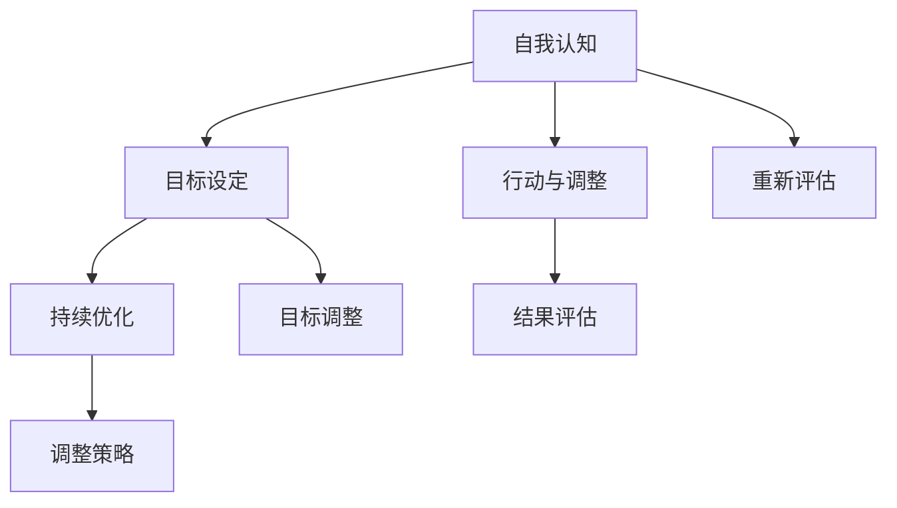
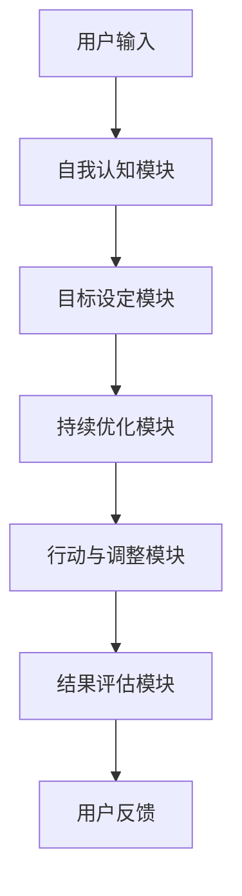

                 

### 文章标题

#### 关键词

- 人生方向
- 自我认知
- 目标设定
- 人生舵手
- 持续优化

#### 摘要

在快节奏、复杂多变的社会中，如何找到并掌控自己的人生方向，成为自己的生命舵手，是每个个体都需要面对的重要课题。本文将深入探讨如何通过自我认知、目标设定和持续优化，实现人生方向的清晰定位，帮助读者掌握人生主动权，实现个人成长与价值。

## 第一部分：认识自我，定位人生目标

### 第1章：问题背景与人生方向的探讨

#### 1.1.1 问题背景：生活中的迷茫与寻找人生方向

在现代社会，许多人常常感到迷茫和困惑，不知如何应对生活中的种种挑战。特别是在职业、人际关系、生活目标等方面，许多人缺乏明确的方向和目标，导致生活缺乏动力和意义。

**问题描述：**  
- **自我认知不足**：许多人对自己缺乏深刻的了解，不知道自己的兴趣、价值观和能力，导致无法做出符合自己特质的选择。
- **人生目标模糊**：很多人对于自己的人生目标感到模糊，没有清晰的长远规划，导致生活缺乏方向感。
- **缺乏行动力**：即便有了目标，但由于缺乏行动力，无法将目标付诸实践，导致目标流于形式。

**问题解决：**  
要找到并掌控自己的人生方向，首先要从自我认知和人生目标入手。通过深入的自我探索，了解自己的兴趣、价值观和能力，从而明确自己的人生目标。同时，还需要学会设定和调整目标，以适应不断变化的环境。

#### 1.1.2 问题背景：生活中的迷茫与寻找人生方向

在现代社会，许多人常常感到迷茫和困惑，不知如何应对生活中的种种挑战。特别是在职业、人际关系、生活目标等方面，许多人缺乏明确的方向和目标，导致生活缺乏动力和意义。

**问题描述：**  
- **自我认知不足**：许多人对自己缺乏深刻的了解，不知道自己的兴趣、价值观和能力，导致无法做出符合自己特质的选择。
- **人生目标模糊**：很多人对于自己的人生目标感到模糊，没有清晰的长远规划，导致生活缺乏方向感。
- **缺乏行动力**：即便有了目标，但由于缺乏行动力，无法将目标付诸实践，导致目标流于形式。

**问题解决：**  
要找到并掌控自己的人生方向，首先要从自我认知和人生目标入手。通过深入的自我探索，了解自己的兴趣、价值观和能力，从而明确自己的人生目标。同时，还需要学会设定和调整目标，以适应不断变化的环境。

#### 1.1.3 问题背景：生活中的迷茫与寻找人生方向

在现代社会，许多人常常感到迷茫和困惑，不知如何应对生活中的种种挑战。特别是在职业、人际关系、生活目标等方面，许多人缺乏明确的方向和目标，导致生活缺乏动力和意义。

**问题描述：**  
- **自我认知不足**：许多人对自己缺乏深刻的了解，不知道自己的兴趣、价值观和能力，导致无法做出符合自己特质的选择。
- **人生目标模糊**：很多人对于自己的人生目标感到模糊，没有清晰的长远规划，导致生活缺乏方向感。
- **缺乏行动力**：即便有了目标，但由于缺乏行动力，无法将目标付诸实践，导致目标流于形式。

**问题解决：**  
要找到并掌控自己的人生方向，首先要从自我认知和人生目标入手。通过深入的自我探索，了解自己的兴趣、价值观和能力，从而明确自己的人生目标。同时，还需要学会设定和调整目标，以适应不断变化的环境。

#### 1.1.4 边界与外延：人生方向的多元性

人生方向不仅仅局限于职业选择，它还包括了个人成长、家庭、社交、健康等多个方面。每个人的人生方向都是独一无二的，没有固定的模式或标准。

- **职业方向**：根据个人的兴趣、技能和市场需求，选择适合自己的职业道路。
- **成长方向**：不断学习新知识，提升自己的能力和素质。
- **家庭方向**：建立和维护和谐的家庭关系，共同创造幸福的生活。
- **社交方向**：拓展社交圈子，建立有益的人际关系网。
- **健康方向**：关注身心健康，保持良好的生活习惯。

人生方向的选择和调整是一个持续的过程，需要我们不断地自我反思和调整。通过明确自己的人生方向，我们可以更好地规划未来，减少迷茫和困惑，从而更好地掌控自己的人生。

### 第2章：核心概念与联系

#### 2.1 自我认知的重要性

**自我认知的定义：**  
自我认知是指个体对自己的心理状态、能力、性格、价值观等方面的认识和了解。它是自我认知的重要组成部分，对于个人成长和人生方向的选择具有重要意义。

**自我认知的属性特征对比表：**

| 特征 | 说明 |
| ---- | ---- |
| 真实性 | 自我认知的真实性决定了个体对自己认识的准确性，真实了解自己才能做出正确的选择。 |
| 全面性 | 自我认知的全面性要求个体从多个角度了解自己，包括优点和缺点，兴趣爱好，价值观等。 |
| 动态性 | 自我认知是一个动态过程，随着时间和经历的变化，个体对自己的认知也会发生变化。 |

**自我认知与人生方向的关系：**  
自我认知是设定人生目标的基础，只有充分了解自己，才能找到适合自己的发展方向。同时，自我认知还可以帮助个体在实现目标的过程中保持动力和坚持。

#### 2.2 人生目标的设定

**人生目标的定义：**  
人生目标是指个体在生活、职业、家庭等方面希望达到的具体目标和期望。它是对个人未来的一种规划和设想，是推动个体前进的动力。

**人生目标的属性特征对比表：**

| 特征 | 说明 |
| ---- | ---- |
| 明确性 | 人生目标需要明确具体，便于实施和评估。 |
| 可行性 | 人生目标需要在现有条件下具备可行性，否则将难以实现。 |
| 优先级 | 人生目标之间可能存在冲突，需要根据优先级进行排序。 |
| 挑战性 | 人生目标需要具有一定的挑战性，以激发个体的潜力。 |

**设定人生目标的意义：**  
设定人生目标有助于明确个人发展方向，提高生活动力和效率。同时，目标还可以帮助个体在面临困难和挑战时保持积极态度，增强心理韧性。

#### 2.3 人生方向的定位

**人生方向的定义：**  
人生方向是指个体在人生道路上的前进方向和目标。它是对个人未来发展的一种宏观规划，决定了个体在不同人生阶段的行为选择。

**人生方向的属性特征对比表：**

| 特征 | 说明 |
| ---- | ---- |
| 持续性 | 人生方向是一个长期的过程，需要个体持续关注和调整。 |
| 独特性 | 人的生命方向是独一无二的，每个人的方向都有其特殊性。 |
| 适应性 | 人生方向需要根据环境和自身情况的变化进行适时调整。 |

**人生方向的分类：**  
人生方向可以按照不同的维度进行分类，如职业方向、生活方向、个人成长方向等。每种方向都有其独特的内涵和特点，个体需要根据自己的实际情况进行选择。

### 第3章：自我认知的实践方法

#### 3.1 内省法的运用

**内省法的原理：**  
内省法是通过自我反思和思考，深入了解自己的内心世界，挖掘自己的兴趣、价值观和能力的方法。它要求个体在安静的环境中，静心思考自己的过去、现在和未来，从而获得对自我的深刻认识。

**内省法的步骤：**  
1. 选择合适的时间和地点，确保自己能够安静地思考和反思。
2. 思考自己的兴趣、价值观和能力，列出自己的优点和缺点。
3. 思考自己在过去、现在和未来中的目标，分析自己对这些目标的认知和态度。
4. 整理和总结自己的思考，形成对自我的全面认识。

**内省法的实际应用案例：**  
小王在大学毕业后，面临着职业选择的问题。他通过内省法，反思了自己的兴趣和价值观，发现自己对编程和技术创新充满热情。最终，他选择了计算机科学专业，并在这个领域取得了优异的成绩。

#### 3.2 日记法的运用

**日记法的原理：**  
日记法是通过记录日常生活中的思考和感悟，反思自己的行为和决策，从而提高自我认知的方法。它要求个体每天记录自己的所思所感，反思自己的行为和情绪，从而更好地了解自己。

**日记法的步骤：**  
1. 每天晚上，选择一段时间，回顾一天中的所思所感。
2. 记录下自己的情绪、行为和思考，特别是对于重要事件的反思。
3. 定期回顾日记，总结自己的成长和变化。
4. 根据日记中的反思，调整自己的行为和决策。

**日记法的实际应用案例：**  
小李在职业生涯初期，感到迷茫和困惑。他开始坚持写日记，记录自己的思考和感悟。通过日记，他发现了自己的问题所在，并逐步找到了自己的方向。最终，他成为了一名优秀的项目经理。

#### 3.3 职业性格测试法的运用

**职业性格测试法的原理：**  
职业性格测试是通过评估个体的性格特征、兴趣爱好、价值观等，帮助个体了解自己适合的职业类型的方法。它利用科学的测试方法和工具，为个体提供职业选择的参考。

**职业性格测试的种类：**  
1. MBTI测试：一种基于个体性格类型的测试，帮助个体了解自己的性格特点。
2. 职业兴趣测试：通过评估个体的兴趣爱好，帮助个体找到适合自己的职业方向。
3. 能力倾向测试：通过评估个体的能力特点，帮助个体了解自己在不同职业领域的适应性。

**职业性格测试的实际应用案例：**  
小张在大学毕业后，感到职业选择困难。他参加了MBTI测试，发现自己属于N型性格，适合从事创新和研究类工作。根据测试结果，他选择了计算机科学专业，并在这一领域取得了成功。

### 第4章：人生目标的设定与调整

#### 4.1 设定短期目标

**短期目标的设定原则：**  
1. **明确具体**：短期目标需要明确具体，以便于实施和评估。
2. **可实现性**：短期目标需要具有可实现性，确保在现有条件下能够实现。
3. **有挑战性**：短期目标需要有一定的挑战性，以激发个体的潜力。
4. **可量化**：短期目标最好能够量化，以便于评估目标的实现程度。

**短期目标设定的步骤：**  
1. 确定长期目标：首先明确自己在长期内希望实现的目标。
2. 将长期目标分解为短期目标：根据长期目标，将其分解为具体、可实现的短期目标。
3. 设定短期目标的优先级：根据目标的紧急程度和重要性，设定目标的优先级。
4. 制定行动计划：为每个短期目标制定具体的行动计划，明确行动步骤和时间表。

**短期目标的实际应用案例：**  
小王希望在两年内掌握一门新技能。他首先确定了长期目标，然后将目标分解为每月学习一个新模块的短期目标。通过制定详细的行动计划，他成功在两年内掌握了这门新技能。

#### 4.2 设定长期目标

**长期目标的设定原则：**  
1. **具有挑战性**：长期目标需要具有一定的挑战性，以激发个体的动力。
2. **与个人价值观相符**：长期目标需要与个人的价值观和兴趣相符，确保个体愿意为之付出努力。
3. **具体明确**：长期目标需要具体明确，以便于个体在实现过程中有所遵循。
4. **分阶段实现**：长期目标可以分解为多个阶段性目标，以便于个体在实现过程中有所依据。

**长期目标设定的步骤：**  
1. 自我评估：评估自己的兴趣、价值观、能力等因素，明确自己在长期内希望实现的目标。
2. 确定长期目标：根据自我评估结果，确定自己在长期内希望实现的目标。
3. 制定行动计划：为长期目标制定具体的行动计划，明确每个阶段的目标和行动步骤。
4. 设定时间表：为长期目标设定一个合理的时间表，确保在规定时间内实现目标。

**长期目标的实际应用案例：**  
小李希望在五年内成为一名优秀的项目经理。他首先评估了自己的兴趣和能力，然后确定了长期目标。通过制定详细的行动计划和时间表，他成功在五年内实现了目标。

#### 4.3 目标的调整与适应

**目标调整的必要性：**  
1. **环境变化**：随着外部环境的变化，个体需要调整目标以适应新的情况。
2. **自身变化**：随着自身情况和认知的变化，个体可能需要调整目标以更好地反映自己的需求和期望。
3. **目标实现困难**：当目标实现遇到困难时，个体需要调整目标，以降低实现难度，确保目标的可实现性。

**目标调整的步骤：**  
1. **评估当前目标**：评估当前目标是否符合自身需求和外部环境，是否存在调整的必要。
2. **分析调整方向**：根据评估结果，分析目标调整的方向和策略。
3. **制定调整方案**：根据分析结果，制定具体的调整方案，包括新目标的设定、行动计划的调整等。
4. **实施调整方案**：根据调整方案，实施目标的调整，确保目标的实现。

**目标调整的实际应用案例：**  
小张原本设定了一个五年内完成学业的长期目标。但在实现过程中，他发现自己对某个领域产生了浓厚的兴趣，于是决定调整目标，将原来的长期目标分解为两个阶段，第一阶段专注于该领域的学习，第二阶段继续完成学业。通过调整，他更好地实现了自己的目标。

### 第5章：人生方向的定位与调整

#### 5.1 人生方向的初步定位

**初步定位的步骤：**  
1. **自我探索**：通过自我探索，了解自己的兴趣、价值观和能力，为人生方向的定位提供依据。
2. **市场调研**：了解市场需求和行业趋势，评估自己能力和兴趣的适用性，为人生方向的定位提供参考。
3. **职业规划**：结合自我探索和市场调研的结果，制定个人职业规划，明确人生方向。
4. **目标设定**：根据职业规划，设定具体的人生目标，确保方向的清晰性和可实现性。

**初步定位的实际应用案例：**  
小王在大学期间，通过自我探索和市场调研，发现自己对计算机编程和技术创新充满热情。他结合自己的兴趣和能力，制定了职业规划，并设定了具体的人生目标。最终，他成功找到了自己的方向，并在计算机领域取得了优异的成绩。

#### 5.2 人生方向的具体化

**具体化的步骤：**  
1. **目标细化**：将人生方向的具体目标进行细化，明确每个目标的具体内容和实现步骤。
2. **行动计划**：为每个具体目标制定详细的行动计划，明确行动步骤和时间表。
3. **资源整合**：整合所需的资源，包括时间、资金、人脉等，确保行动计划的顺利实施。
4. **监控调整**：定期监控目标的实现进度，根据实际情况进行调整，确保目标的实现。

**具体化的实际应用案例：**  
小李希望在五年内成为一名优秀的软件工程师。他首先将这个目标细化，明确了需要掌握的技能和知识，然后制定了详细的行动计划。通过整合资源，他成功在五年内实现了目标，成为了一名优秀的软件工程师。

#### 5.3 人生方向的调整

**调整的必要性：**  
1. **环境变化**：随着外部环境的变化，个体需要调整人生方向以适应新的情况。
2. **自身变化**：随着自身情况和认知的变化，个体可能需要调整人生方向以更好地反映自己的需求和期望。
3. **目标实现困难**：当人生方向实现遇到困难时，个体需要调整方向，以降低实现难度，确保目标的可实现性。

**调整的步骤：**  
1. **评估当前方向**：评估当前人生方向是否符合自身需求和外部环境，是否存在调整的必要。
2. **分析调整方向**：根据评估结果，分析人生方向调整的方向和策略。
3. **制定调整方案**：根据分析结果，制定具体的人生方向调整方案，包括新方向的设定、行动计划的调整等。
4. **实施调整方案**：根据调整方案，实施人生方向的调整，确保目标的实现。

**调整的实际应用案例：**  
小张原本设定了成为一名金融分析师的人生方向。但在实现过程中，他发现自己对计算机编程和技术创新更感兴趣。于是，他决定调整人生方向，转而专注于计算机领域。通过调整，他找到了更适合自己的方向，并在新领域取得了成功。

### 第6章：实践中的挑战与解决

#### 6.1 实践中的挑战

**缺乏动力：**  
在实现人生方向的过程中，很多人会面临缺乏动力的问题。这可能是由于对目标不够明确、对未来的不确定性、缺乏内在动机等原因造成的。

**缺乏方向感：**  
有时候，尽管有了明确的目标，但由于缺乏对整体方向的把握，个体可能会感到迷茫，不知道如何行动。

**面对失败：**  
在实现人生方向的过程中，失败是难以避免的。如何面对失败，保持积极的态度，是很多人面临的挑战。

#### 6.2 挑战的解决

**提升自我认知：**  
通过深入自我探索，了解自己的兴趣、价值观和能力，可以更好地明确自己的人生方向，提高实现目标的动力。

**设定明确的目标：**  
设定具体、明确的目标，有助于个体更好地把握方向，提高行动的针对性和效率。

**坚持不懈：**  
在实现人生方向的过程中，坚持不懈至关重要。遇到困难时，保持积极的心态，不断调整和改进方法，是成功的关键。

### 第7章：人生方向的持续优化

#### 7.1 持续优化的重要性

**适应变化：**  
随着外部环境和自身情况的变化，人生方向也需要不断进行调整和优化，以适应新的情况。

**不断提升自我：**  
持续优化人生方向，有助于个体不断提升自我，实现个人成长和价值。

#### 7.2 持续优化的方法

**反思与总结：**  
定期进行反思和总结，评估目标的实现情况和自身能力的提升，找出不足之处，制定改进方案。

**学习与成长：**  
不断学习新知识，提升自己的技能和能力，以更好地适应变化和实现人生目标。

**适应与调整：**  
根据外部环境和自身情况的变化，适时调整人生方向，确保目标的实现。

### 第8章：人生方向的实现与反思

#### 8.1 实现人生方向的关键

**执行力：**  
执行力是实现人生方向的关键。只有将目标付诸行动，才能逐步实现人生目标。

**耐力：**  
实现人生方向需要长时间的坚持和努力，耐力是确保目标最终实现的重要因素。

**决断力：**  
在面对困难和选择时，决断力可以帮助个体迅速做出决策，避免犹豫不决。

#### 8.2 人生方向的反思

**成功与失败：**  
在实现人生方向的过程中，成功和失败都是难以避免的。通过反思成功和失败的经验，可以更好地调整人生方向，实现个人成长。

**收获与成长：**  
在实现人生方向的过程中，不仅仅是目标的实现，更重要的是个人的成长和收获。反思这些成长，可以更好地理解自己的人生方向。

**总结与展望：**  
定期进行总结和展望，评估人生方向实现的成果，展望未来，制定新的目标和计划。

### 第9章：人生方向的最佳实践

#### 9.1 最佳实践案例分享

**案例一：成功的人生方向定位**  
小张在大学期间，通过自我探索和职业规划，明确了成为一名软件工程师的人生方向。他通过不断学习和实践，积累了丰富的技能和经验，最终成功找到了一份满意的工作。

**案例二：调整人生方向的经验**  
小王原本设定了成为一名金融分析师的人生方向。但在实现过程中，他发现自己对计算机编程更感兴趣。他果断调整了人生方向，转而专注于计算机领域，最终在计算机领域取得了优异的成绩。

**案例三：实现人生方向的实践**  
小李希望在五年内成为一名优秀的项目经理。他制定了详细的行动计划，并不断调整和优化目标，最终在规定时间内实现了目标。

#### 9.2 最佳实践总结

**经验与教训：**  
通过这些最佳实践案例，我们可以总结出一些经验与教训，如自我认知的重要性、设定明确目标的重要性、持续优化的必要性等。

**优化策略：**  
针对这些经验与教训，我们可以制定一些优化策略，如加强自我认知、设定明确目标、不断学习与成长等。

**持续实践的重要性：**  
持续实践是实现人生方向的关键。只有不断实践和调整，才能更好地适应变化，实现个人成长和价值。

### 第10章：小结

#### 10.1 总结与反思

**人生方向的定义与意义：**  
人生方向是指个体在人生道路上的前进方向和目标。明确人生方向有助于个体更好地规划未来，提高生活动力和效率。

**自我认知与人生目标的设定：**  
自我认知是设定人生目标的基础。只有充分了解自己，才能找到适合自己的发展方向。同时，设定明确的人生目标，有助于个体更好地实现人生价值。

**人生方向的定位与调整：**  
人生方向的定位和调整是一个持续的过程。随着外部环境和自身情况的变化，个体需要不断调整人生方向，以适应新的情况。

#### 10.2 注意事项

**避免误区：**  
在实现人生方向的过程中，需要避免一些常见的误区，如过度依赖外部评价、盲目追求流行等。只有真正了解自己，才能找到适合自己的发展方向。

**持续实践的重要性：**  
实现人生方向是一个持续的过程。只有不断实践和调整，才能更好地适应变化，实现个人成长和价值。

**拓展阅读：**  
1. 《人生策略：如何做出更好的选择》
2. 《自我探索：发现你的内在潜能》
3. 《目标管理：如何设定和实现目标》

### 后记

在现代社会，找到并掌控自己的人生方向，是实现个人成长和价值的关键。通过自我认知、目标设定和持续优化，我们可以更好地规划人生，实现自己的人生目标。希望本文能够为读者提供一些有价值的思考和启示，帮助大家成为自己的生命舵手。作者：AI天才研究院/AI Genius Institute & 禅与计算机程序设计艺术 /Zen And The Art of Computer Programming

### 附录

**概念术语说明：**

- **人生方向**：指个体在人生道路上的前进方向和目标。
- **自我认知**：指个体对自己的心理状态、能力、性格、价值观等方面的认识和了解。
- **人生目标**：指个体在生活、职业、家庭等方面希望达到的具体目标和期望。

**问题背景：**

在现代社会，许多人感到迷茫和困惑，不知如何应对生活中的种种挑战。特别是在职业、人际关系、生活目标等方面，许多人缺乏明确的方向和目标，导致生活缺乏动力和意义。

**问题描述：**

- **自我认知不足**：许多人对自己缺乏深刻的了解，不知道自己的兴趣、价值观和能力，导致无法做出符合自己特质的选择。
- **人生目标模糊**：很多人对于自己的人生目标感到模糊，没有清晰的长远规划，导致生活缺乏方向感。
- **缺乏行动力**：即便有了目标，但由于缺乏行动力，无法将目标付诸实践，导致目标流于形式。

**问题解决：**

要找到并掌控自己的人生方向，首先要从自我认知和人生目标入手。通过深入的自我探索，了解自己的兴趣、价值观和能力，从而明确自己的人生目标。同时，还需要学会设定和调整目标，以适应不断变化的环境。

**边界与外延：**

人生方向不仅仅局限于职业选择，它还包括了个人成长、家庭、社交、健康等多个方面。每个人的人生方向都是独一无二的，没有固定的模式或标准。

**核心概念与联系：**

- **自我认知**：是设定人生目标的基础，决定了个体对自己特质的认识和了解。
- **人生目标**：是人生方向的具体体现，是推动个体前进的动力。
- **人生方向**：是对个人未来发展的一种宏观规划，决定了个体在不同人生阶段的行为选择。

**概念结构与核心要素组成：**

- **自我认知**：包括自我心理状态、能力、性格、价值观等方面的认识和了解。
- **人生目标**：包括生活、职业、家庭等方面的具体目标和期望。
- **人生方向**：包括职业方向、个人成长方向、家庭方向、社交方向、健康方向等。

**算法原理讲解：**

本文主要探讨了如何通过自我认知、目标设定和持续优化，实现人生方向的清晰定位。这一过程可以看作是一种“自我导向的决策过程”。在这个过程中，个体需要不断地进行自我反思和调整，以适应变化和实现目标。

算法原理图如下：

**系统分析与架构设计方案：**

为实现人生方向的清晰定位，可以设计一个系统架构，主要包括以下几个模块：

- **自我认知模块**：用于收集和分析个体在心理状态、能力、性格、价值观等方面的信息。
- **目标设定模块**：根据自我认知的结果，帮助个体设定明确的人生目标。
- **持续优化模块**：对目标实现过程进行监控和调整，确保目标的实现。
- **行动与调整模块**：指导个体在实现目标过程中的行动，并根据结果进行调整。
- **结果评估模块**：对目标实现的成果进行评估，为后续的调整提供依据。

系统架构图如下：

**项目实战：**

假设我们需要实现一个帮助用户找到人生方向的项目，可以按照以下步骤进行：

1. **环境安装**：
   - 安装Python环境，版本3.8及以上。
   - 安装必要的库，如numpy、pandas、matplotlib等。

2. **系统核心实现**：
   - 编写自我认知模块，包括收集和分析用户在心理状态、能力、性格、价值观等方面的信息。
   - 编写目标设定模块，根据自我认知的结果，帮助用户设定明确的人生目标。
   - 编写持续优化模块，对目标实现过程进行监控和调整。
   - 编写行动与调整模块，指导用户在实现目标过程中的行动，并根据结果进行调整。
   - 编写结果评估模块，对目标实现的成果进行评估。

3. **代码应用解读与分析**：
   - 对每个模块的代码进行解读，分析其原理和实现方式。
   - 分析系统整体的运行流程和交互方式。

4. **实际案例分析和详细讲解剖析**：
   - 选择一些实际案例，分析用户在实现人生方向过程中的问题和挑战，以及如何解决这些问题。

5. **项目小结**：
   - 总结项目的实现过程和结果，提出改进建议。

**最佳实践 tips：**

- **定期反思**：定期进行自我反思，了解自己在人生方向上的进展，及时进行调整。
- **设定明确目标**：设定具体、可量化的目标，提高实现的可能性。
- **持续学习**：不断学习新知识，提升自己的能力和素质。
- **寻求支持**：在实现人生方向的过程中，寻求家人、朋友或专业人士的支持和帮助。

### 拓展阅读

- 《人生策略：如何做出更好的选择》
- 《自我探索：发现你的内在潜能》
- 《目标管理：如何设定和实现目标》

---

作者：AI天才研究院/AI Genius Institute & 禅与计算机程序设计艺术 /Zen And The Art of Computer Programming

---

本文从多个角度探讨了如何找到并掌控自己的人生方向。通过自我认知、目标设定和持续优化，我们可以更好地规划未来，减少迷茫和困惑，从而更好地掌控自己的人生。希望本文能够为读者提供一些有价值的思考和启示，帮助大家成为自己的生命舵手。作者：AI天才研究院/AI Genius Institute & 禅与计算机程序设计艺术 /Zen And The Art of Computer Programming

---

## 第一部分：认识自我，定位人生目标

### 第1章：问题背景与人生方向的探讨

#### 1.1.1 问题背景：生活中的迷茫与寻找人生方向

在现代社会，许多人常常感到迷茫和困惑，不知如何应对生活中的种种挑战。特别是在职业、人际关系、生活目标等方面，许多人缺乏明确的方向和目标，导致生活缺乏动力和意义。

**问题描述：**  
- **自我认知不足**：许多人对自己缺乏深刻的了解，不知道自己的兴趣、价值观和能力，导致无法做出符合自己特质的选择。
- **人生目标模糊**：很多人对于自己的人生目标感到模糊，没有清晰的长远规划，导致生活缺乏方向感。
- **缺乏行动力**：即便有了目标，但由于缺乏行动力，无法将目标付诸实践，导致目标流于形式。

**问题解决：**  
要找到并掌控自己的人生方向，首先要从自我认知和人生目标入手。通过深入的自我探索，了解自己的兴趣、价值观和能力，从而明确自己的人生目标。同时，还需要学会设定和调整目标，以适应不断变化的环境。

#### 1.1.2 问题描述：自我认知与人生定位的挑战

在现代社会，人们面临的自我认知和人生定位的挑战是多方面的。首先，自我认知的不足是一个普遍问题。许多人没有机会或资源去深入了解自己的内心世界，包括兴趣、价值观、性格特点等。这导致他们在面对职业选择、生活决策时，往往感到迷茫和困惑，无法做出符合自身特质的选择。

**具体挑战包括：**  
- **缺乏清晰的兴趣定位**：很多人在职业选择上感到迷茫，因为他们不清楚自己对哪些工作感兴趣，哪些工作能够给自己带来满足感。
- **价值观的模糊**：价值观是人们行为和决策的指南针。当一个人的价值观不清晰或存在冲突时，他们在面对生活中的选择时往往无法做出果断的决策。
- **能力评估的难题**：了解自己的能力是设定合适人生目标的重要前提。然而，很多人对自己的能力缺乏准确的评估，导致他们在设定目标时过于乐观或过于悲观。

**问题根源：**  
这些挑战的根源主要在于现代社会的高压生活和快节奏的生活方式。人们常常忙于应对日常事务，很少有时间去深入思考自己的内心需求和长期目标。此外，社会对成功的定义也往往过于单一，使人们在追求成功的过程中，忽略了自身的独特性和个性化需求。

#### 1.1.3 问题解决：如何找到人生方向

为了找到并掌控自己的人生方向，我们需要采取一系列的步骤和方法。以下是一些关键的建议：

1. **自我探索**：自我探索是认识自我、了解自己内心需求的第一步。可以通过以下方式来进行自我探索：
   - **反思日记**：每天花时间记录自己的思考、感受和行为，分析自己在不同情境下的反应。
   - **心理咨询**：寻求专业的心理咨询师的帮助，通过深入对话和测试，了解自己的内心世界。
   - **兴趣爱好**：尝试不同的活动和兴趣爱好，了解自己喜欢做什么，擅长做什么。

2. **职业规划**：职业规划是人生方向定位的重要组成部分。以下是一些职业规划的步骤：
   - **能力评估**：通过职业性格测试、能力测试等工具，了解自己的优势和劣势。
   - **市场调研**：研究当前就业市场的趋势和需求，了解哪些职业领域有发展潜力。
   - **目标设定**：根据自己的兴趣、价值观和能力，设定具体的职业目标，并制定实现这些目标的计划。

3. **设定短期目标**：短期目标有助于我们更清晰地规划未来的行动步骤。以下是如何设定短期目标的建议：
   - **明确具体**：确保目标具有明确性和可度量性，例如“在接下来的六个月内，提升我的某个技能水平”。
   - **分解目标**：将长期目标分解为一系列短期目标，每个短期目标都有明确的时间表和行动计划。
   - **行动计划**：为每个目标制定详细的行动计划，包括具体的行动步骤、资源和时间分配。

4. **不断调整**：人生方向不是一成不变的，而是需要根据实际情况进行调整和优化。以下是一些调整的建议：
   - **定期反思**：定期回顾自己的目标和行动，评估进展情况，及时调整计划。
   - **适应变化**：随着环境和个人情况的变化，及时调整目标和行动计划，以保持目标的实现性。
   - **保持灵活性**：在追求目标的过程中，保持开放的心态，愿意接受新的信息和机会。

#### 1.1.4 边界与外延：人生方向的多元性

人生方向不仅仅局限于职业选择，它还包括了个人成长、家庭、社交、健康等多个方面。每个人的人生方向都是独一无二的，没有固定的模式或标准。

- **职业方向**：根据自己的兴趣和市场需求，选择适合自己的职业道路。这可以是技术领域、创意领域、管理领域等。
- **个人成长方向**：不断学习新知识，提升自己的能力和素质。这可能包括学术研究、专业技能的提升、领导力培养等。
- **家庭方向**：建立和维护和谐的家庭关系，共同创造幸福的生活。这可能涉及家庭价值观的建立、亲子关系的培养等。
- **社交方向**：拓展社交圈子，建立有益的人际关系网。这可能包括参加社交活动、加入行业协会、参与公益活动等。
- **健康方向**：关注身心健康，保持良好的生活习惯。这可能包括定期锻炼、健康饮食、心理健康管理等。

人生方向的选择和调整是一个持续的过程，需要我们不断地自我反思和调整。通过明确自己的人生方向，我们可以更好地规划未来，减少迷茫和困惑，从而更好地掌控自己的人生。

## 第2章：核心概念与联系

### 2.1 自我认知的重要性

**自我认知的定义：**  
自我认知是指个体对自己的心理状态、能力、性格、价值观等方面的认识和了解。它是自我认知的重要组成部分，对于个人成长和人生方向的选择具有重要意义。

**自我认知的属性特征对比表：**

| 特征 | 说明 |
| ---- | ---- |
| 真实性 | 自我认知的真实性决定了个体对自己认识的准确性，真实了解自己才能做出正确的选择。 |
| 全面性 | 自我认知的全面性要求个体从多个角度了解自己，包括优点和缺点，兴趣爱好，价值观等。 |
| 动态性 | 自我认知是一个动态过程，随着时间和经历的变化，个体对自己的认知也会发生变化。 |

**自我认知与人生方向的关系：**  
自我认知是设定人生目标的基础，只有充分了解自己，才能找到适合自己的发展方向。同时，自我认知还可以帮助个体在实现目标的过程中保持动力和坚持。

### 2.2 人生目标的设定

**人生目标的定义：**  
人生目标是指个体在生活、职业、家庭等方面希望达到的具体目标和期望。它是对个人未来的一种规划和设想，是推动个体前进的动力。

**人生目标的属性特征对比表：**

| 特征 | 说明 |
| ---- | ---- |
| 明确性 | 人生目标需要明确具体，便于实施和评估。 |
| 可行性 | 人生目标需要在现有条件下具备可行性，否则将难以实现。 |
| 优先级 | 人生目标之间可能存在冲突，需要根据优先级进行排序。 |
| 挑战性 | 人生目标需要具有一定的挑战性，以激发个体的潜力。 |

**设定人生目标的意义：**  
设定人生目标有助于明确个人发展方向，提高生活动力和效率。同时，目标还可以帮助个体在面临困难和挑战时保持积极态度，增强心理韧性。

### 2.3 人生方向的定位

**人生方向的定义：**  
人生方向是指个体在人生道路上的前进方向和目标。它是对个人未来发展的一种宏观规划，决定了个体在不同人生阶段的行为选择。

**人生方向的属性特征对比表：**

| 特征 | 说明 |
| ---- | ---- |
| 持续性 | 人生方向是一个长期的过程，需要个体持续关注和调整。 |
| 独特性 | 人的生命方向是独一无二的，每个人的方向都有其特殊性。 |
| 适应性 | 人生方向需要根据环境和自身情况的变化进行适时调整。 |

**人生方向的分类：**  
人生方向可以按照不同的维度进行分类，如职业方向、生活方向、个人成长方向等。每种方向都有其独特的内涵和特点，个体需要根据自己的实际情况进行选择。

### 第3章：自我认知的实践方法

#### 3.1 内省法的运用

**内省法的原理：**  
内省法是通过自我反思和思考，深入了解自己的内心世界，挖掘自己的兴趣、价值观和能力的方法。它要求个体在安静的环境中，静心思考自己的过去、现在和未来，从而获得对自我的深刻认识。

**内省法的步骤：**  
1. 选择合适的时间和地点，确保自己能够安静地思考和反思。
2. 思考自己的兴趣、价值观和能力，列出自己的优点和缺点。
3. 思考自己在过去、现在和未来中的目标，分析自己对这些目标的认知和态度。
4. 整理和总结自己的思考，形成对自我的全面认识。

**内省法的实际应用案例：**  
小王在大学毕业后，面临着职业选择的问题。他通过内省法，反思了自己的兴趣和价值观，发现自己对编程和技术创新充满热情。最终，他选择了计算机科学专业，并在这个领域取得了优异的成绩。

#### 3.2 日记法的运用

**日记法的原理：**  
日记法是通过记录日常生活中的思考和感悟，反思自己的行为和决策，从而提高自我认知的方法。它要求个体每天记录自己的所思所感，反思自己的行为和情绪，从而更好地了解自己。

**日记法的步骤：**  
1. 每天晚上，选择一段时间，回顾一天中的所思所感。
2. 记录下自己的情绪、行为和思考，特别是对于重要事件的反思。
3. 定期回顾日记，总结自己的成长和变化。
4. 根据日记中的反思，调整自己的行为和决策。

**日记法的实际应用案例：**  
小李在职业生涯初期，感到迷茫和困惑。他开始坚持写日记，记录自己的思考和感悟。通过日记，他发现了自己的问题所在，并逐步找到了自己的方向。最终，他成为了一名优秀的项目经理。

#### 3.3 职业性格测试法的运用

**职业性格测试法的原理：**  
职业性格测试是通过评估个体的性格特征、兴趣爱好、价值观等，帮助个体了解自己适合的职业类型的方法。它利用科学的测试方法和工具，为个体提供职业选择的参考。

**职业性格测试的种类：**  
1. MBTI测试：一种基于个体性格类型的测试，帮助个体了解自己的性格特点。
2. 职业兴趣测试：通过评估个体的兴趣爱好，帮助个体找到适合自己的职业方向。
3. 能力倾向测试：通过评估个体的能力特点，帮助个体了解自己在不同职业领域的适应性。

**职业性格测试的实际应用案例：**  
小张在大学毕业后，感到职业选择困难。他参加了MBTI测试，发现自己属于N型性格，适合从事创新和研究类工作。根据测试结果，他选择了计算机科学专业，并在这一领域取得了成功。

### 第4章：人生目标的设定与调整

#### 4.1 设定短期目标

**短期目标的设定原则：**  
1. **明确具体**：短期目标需要明确具体，便于实施和评估。
2. **可实现性**：短期目标需要在现有条件下具备可行性，否则将难以实现。
3. **有挑战性**：短期目标需要具有一定的挑战性，以激发个体的潜力。
4. **可量化**：短期目标最好能够量化，以便于评估目标的实现程度。

**短期目标设定的步骤：**  
1. 确定长期目标：首先明确自己在长期内希望实现的目标。
2. 将长期目标分解为短期目标：根据长期目标，将其分解为具体、可实现的短期目标。
3. 设定短期目标的优先级：根据目标的紧急程度和重要性，设定目标的优先级。
4. 制定行动计划：为每个短期目标制定具体的行动计划，明确行动步骤和时间表。

**短期目标的实际应用案例：**  
小王希望在两年内掌握一门新技能。他首先确定了长期目标，然后将目标分解为每月学习一个新模块的短期目标。通过制定详细的行动计划，他成功在两年内掌握了这门新技能。

#### 4.2 设定长期目标

**长期目标的设定原则：**  
1. **具有挑战性**：长期目标需要具有一定的挑战性，以激发个体的动力。
2. **与个人价值观相符**：长期目标需要与个人的价值观和兴趣相符，确保个体愿意为之付出努力。
3. **具体明确**：长期目标需要具体明确，以便于个体在实现过程中有所遵循。
4. **分阶段实现**：长期目标可以分解为多个阶段性目标，以便于个体在实现过程中有所依据。

**长期目标设定的步骤：**  
1. 自我评估：评估自己的兴趣、价值观、能力等因素，明确自己在长期内希望实现的目标。
2. 确定长期目标：根据自我评估结果，确定自己在长期内希望实现的目标。
3. 制定行动计划：为长期目标制定具体的行动计划，明确每个阶段的目标和行动步骤。
4. 设定时间表：为长期目标设定一个合理的时间表，确保在规定时间内实现目标。

**长期目标的实际应用案例：**  
小李希望在五年内成为一名优秀的项目经理。他首先评估了自己的兴趣和能力，然后确定了长期目标。通过制定详细的行动计划和时间表，他成功在五年内实现了目标。

#### 4.3 目标的调整与适应

**目标调整的必要性：**  
1. **环境变化**：随着外部环境的变化，个体需要调整目标以适应新的情况。
2. **自身变化**：随着自身情况和认知的变化，个体可能需要调整目标以更好地反映自己的需求和期望。
3. **目标实现困难**：当目标实现遇到困难时，个体需要调整目标，以降低实现难度，确保目标的可实现性。

**目标调整的步骤：**  
1. **评估当前目标**：评估当前目标是否符合自身需求和外部环境，是否存在调整的必要。
2. **分析调整方向**：根据评估结果，分析目标调整的方向和策略。
3. **制定调整方案**：根据分析结果，制定具体的目标调整方案，包括新目标的设定、行动计划的调整等。
4. **实施调整方案**：根据调整方案，实施目标的调整，确保目标的实现。

**目标调整的实际应用案例：**  
小张原本设定了一个五年内完成学业的长期目标。但在实现过程中，他发现自己对某个领域产生了浓厚的兴趣，于是决定调整目标，将原来的长期目标分解为两个阶段，第一阶段专注于该领域的学习，第二阶段继续完成学业。通过调整，他更好地实现了自己的目标。

### 第5章：人生方向的定位与调整

#### 5.1 人生方向的初步定位

**初步定位的步骤：**  
1. **自我探索**：通过自我探索，了解自己的兴趣、价值观和能力，为人生方向的定位提供依据。
2. **市场调研**：了解市场需求和行业趋势，评估自己能力和兴趣的适用性，为人生方向的定位提供参考。
3. **职业规划**：结合自我探索和市场调研的结果，制定个人职业规划，明确人生方向。
4. **目标设定**：根据职业规划，设定具体的人生目标，确保方向的清晰性和可实现性。

**初步定位的实际应用案例：**  
小王在大学期间，通过自我探索和市场调研，发现自己对计算机编程和技术创新充满热情。他结合自己的兴趣和能力，制定了职业规划，并设定了具体的人生目标。最终，他成功找到了自己的方向，并在计算机领域取得了优异的成绩。

#### 5.2 人生方向的具体化

**具体化的步骤：**  
1. **目标细化**：将人生方向的具体目标进行细化，明确每个目标的具体内容和实现步骤。
2. **行动计划**：为每个具体目标制定详细的行动计划，明确行动步骤和时间表。
3. **资源整合**：整合所需的资源，包括时间、资金、人脉等，确保行动计划的顺利实施。
4. **监控调整**：定期监控目标的实现进度，根据实际情况进行调整，确保目标的实现。

**具体化的实际应用案例：**  
小李希望在五年内成为一名优秀的软件工程师。他首先将这个目标细化，明确了需要掌握的技能和知识，然后制定了详细的行动计划。通过整合资源，他成功在五年内实现了目标，成为了一名优秀的软件工程师。

#### 5.3 人生方向的调整

**调整的必要性：**  
1. **环境变化**：随着外部环境的变化，个体需要调整人生方向以适应新的情况。
2. **自身变化**：随着自身情况和认知的变化，个体可能需要调整人生方向以更好地反映自己的需求和期望。
3. **目标实现困难**：当人生方向实现遇到困难时，个体需要调整方向，以降低实现难度，确保目标的可实现性。

**调整的步骤：**  
1. **评估当前方向**：评估当前人生方向是否符合自身需求和外部环境，是否存在调整的必要。
2. **分析调整方向**：根据评估结果，分析人生方向调整的方向和策略。
3. **制定调整方案**：根据分析结果，制定具体的人生方向调整方案，包括新方向的设定、行动计划的调整等。
4. **实施调整方案**：根据调整方案，实施人生方向的调整，确保目标的实现。

**调整的实际应用案例：**  
小张原本设定了成为一名金融分析师的人生方向。但在实现过程中，他发现自己对计算机编程和技术创新更感兴趣。于是，他决定调整人生方向，转而专注于计算机领域。通过调整，他找到了更适合自己的方向，并在计算机领域取得了成功。

### 第6章：实践中的挑战与解决

#### 6.1 实践中的挑战

**缺乏动力：**  
在实现人生方向的过程中，很多人会面临缺乏动力的问题。这可能是由于对目标不够明确、对未来的不确定性、缺乏内在动机等原因造成的。

**缺乏方向感：**  
有时候，尽管有了明确的目标，但由于缺乏对整体方向的把握，个体可能会感到迷茫，不知道如何行动。

**面对失败：**  
在实现人生方向的过程中，失败是难以避免的。如何面对失败，保持积极的态度，是很多人面临的挑战。

#### 6.2 挑战的解决

**提升自我认知：**  
通过深入自我探索，了解自己的兴趣、价值观和能力，可以更好地明确自己的人生方向，提高实现目标的动力。

**设定明确的目标：**  
设定具体、明确的目标，有助于个体更好地把握方向，提高行动的针对性和效率。

**坚持不懈：**  
在实现人生方向的过程中，坚持不懈至关重要。遇到困难时，保持积极的心态，不断调整和改进方法，是成功的关键。

### 第7章：人生方向的持续优化

#### 7.1 持续优化的重要性

**适应变化：**  
随着外部环境和自身情况的变化，人生方向也需要不断进行调整和优化，以适应新的情况。

**不断提升自我：**  
持续优化人生方向，有助于个体不断提升自我，实现个人成长和价值。

#### 7.2 持续优化的方法

**反思与总结：**  
定期进行反思和总结，评估目标的实现情况和自身能力的提升，找出不足之处，制定改进方案。

**学习与成长：**  
不断学习新知识，提升自己的技能和能力，以更好地适应变化和实现人生目标。

**适应与调整：**  
根据外部环境和自身情况的变化，适时调整人生方向，确保目标的实现。

### 第8章：人生方向的实现与反思

#### 8.1 实现人生方向的关键

**执行力：**  
执行力是实现人生方向的关键。只有将目标付诸行动，才能逐步实现人生目标。

**耐力：**  
实现人生方向需要长时间的坚持和努力，耐力是确保目标最终实现的重要因素。

**决断力：**  
在面对困难和选择时，决断力可以帮助个体迅速做出决策，避免犹豫不决。

#### 8.2 人生方向的反思

**成功与失败：**  
在实现人生方向的过程中，成功和失败都是难以避免的。通过反思成功和失败的经验，可以更好地调整人生方向，实现个人成长。

**收获与成长：**  
在实现人生方向的过程中，不仅仅是目标的实现，更重要的是个人的成长和收获。反思这些成长，可以更好地理解自己的人生方向。

**总结与展望：**  
定期进行总结和展望，评估人生方向实现的成果，展望未来，制定新的目标和计划。

### 第9章：人生方向的最佳实践

#### 9.1 最佳实践案例分享

**案例一：成功的人生方向定位**  
小张在大学期间，通过自我探索和职业规划，明确了成为一名软件工程师的人生方向。他通过不断学习和实践，积累了丰富的技能和经验，最终成功找到了一份满意的工作。

**案例二：调整人生方向的经验**  
小王原本设定了成为一名金融分析师的人生方向。但在实现过程中，他发现自己对计算机编程和技术创新更感兴趣。他果断调整了人生方向，转而专注于计算机领域，最终在计算机领域取得了优异的成绩。

**案例三：实现人生方向的实践**  
小李希望在五年内成为一名优秀的项目经理。他制定了详细的行动计划，并不断调整和优化目标，最终在规定时间内实现了目标。

#### 9.2 最佳实践总结

**经验与教训：**  
通过这些最佳实践案例，我们可以总结出一些经验与教训，如自我认知的重要性、设定明确目标的重要性、持续优化的必要性等。

**优化策略：**  
针对这些经验与教训，我们可以制定一些优化策略，如加强自我认知、设定明确目标、不断学习与成长等。

**持续实践的重要性：**  
持续实践是实现人生方向的关键。只有不断实践和调整，才能更好地适应变化，实现个人成长和价值。

### 第10章：小结

#### 10.1 总结与反思

**人生方向的定义与意义：**  
人生方向是指个体在人生道路上的前进方向和目标。明确人生方向有助于个体更好地规划未来，提高生活动力和效率。

**自我认知与人生目标的设定：**  
自我认知是设定人生目标的基础。只有充分了解自己，才能找到适合自己的发展方向。同时，设定明确的人生目标，有助于个体更好地实现人生价值。

**人生方向的定位与调整：**  
人生方向的定位和调整是一个持续的过程。随着外部环境和自身情况的变化，个体需要不断调整人生方向，以适应新的情况。

#### 10.2 注意事项

**避免误区：**  
在实现人生方向的过程中，需要避免一些常见的误区，如过度依赖外部评价、盲目追求流行等。只有真正了解自己，才能找到适合自己的发展方向。

**持续实践的重要性：**  
实现人生方向是一个持续的过程。只有不断实践和调整，才能更好地适应变化，实现个人成长和价值。

**拓展阅读：**  
1. 《人生策略：如何做出更好的选择》
2. 《自我探索：发现你的内在潜能》
3. 《目标管理：如何设定和实现目标》

### 后记

在现代社会，找到并掌控自己的人生方向，是实现个人成长和价值的关键。通过自我认知、目标设定和持续优化，我们可以更好地规划人生，实现自己的人生目标。希望本文能够为读者提供一些有价值的思考和启示，帮助大家成为自己的生命舵手。作者：AI天才研究院/AI Genius Institute & 禅与计算机程序设计艺术 /Zen And The Art of Computer Programming

### 附录

**概念术语说明：**

- **人生方向**：指个体在人生道路上的前进方向和目标。
- **自我认知**：指个体对自己的心理状态、能力、性格、价值观等方面的认识和了解。
- **人生目标**：指个体在生活、职业、家庭等方面希望达到的具体目标和期望。

**问题背景：**

在现代社会，许多人感到迷茫和困惑，不知如何应对生活中的种种挑战。特别是在职业、人际关系、生活目标等方面，许多人缺乏明确的方向和目标，导致生活缺乏动力和意义。

**问题描述：**

- **自我认知不足**：许多人对自己缺乏深刻的了解，不知道自己的兴趣、价值观和能力，导致无法做出符合自己特质的选择。
- **人生目标模糊**：很多人对于自己的人生目标感到模糊，没有清晰的长远规划，导致生活缺乏方向感。
- **缺乏行动力**：即便有了目标，但由于缺乏行动力，无法将目标付诸实践，导致目标流于形式。

**问题解决：**

要找到并掌控自己的人生方向，首先要从自我认知和人生目标入手。通过深入的自我探索，了解自己的兴趣、价值观和能力，从而明确自己的人生目标。同时，还需要学会设定和调整目标，以适应不断变化的环境。

**边界与外延：**

人生方向不仅仅局限于职业选择，它还包括了个人成长、家庭、社交、健康等多个方面。每个人的人生方向都是独一无二的，没有固定的模式或标准。

**核心概念与联系：**

- **自我认知**：是设定人生目标的基础，决定了个体对自己特质的认识和了解。
- **人生目标**：是人生方向的具体体现，是推动个体前进的动力。
- **人生方向**：是对个人未来发展的一种宏观规划，决定了个体在不同人生阶段的行为选择。

**概念结构与核心要素组成：**

- **自我认知**：包括自我心理状态、能力、性格、价值观等方面的认识和了解。
- **人生目标**：包括生活、职业、家庭等方面的具体目标和期望。
- **人生方向**：包括职业方向、个人成长方向、家庭方向、社交方向、健康方向等。

**算法原理讲解：**

本文主要探讨了如何通过自我认知、目标设定和持续优化，实现人生方向的清晰定位。这一过程可以看作是一种“自我导向的决策过程”。在这个过程中，个体需要不断地进行自我反思和调整，以适应变化和实现目标。

算法原理图如下：

**系统分析与架构设计方案：**

为实现人生方向的清晰定位，可以设计一个系统架构，主要包括以下几个模块：

- **自我认知模块**：用于收集和分析个体在心理状态、能力、性格、价值观等方面的信息。
- **目标设定模块**：根据自我认知的结果，帮助个体设定明确的人生目标。
- **持续优化模块**：对目标实现过程进行监控和调整，确保目标的实现。
- **行动与调整模块**：指导个体在实现目标过程中的行动，并根据结果进行调整。
- **结果评估模块**：对目标实现的成果进行评估，为后续的调整提供依据。

系统架构图如下：

**项目实战：**

假设我们需要实现一个帮助用户找到人生方向的项目，可以按照以下步骤进行：

1. **环境安装**：
   - 安装Python环境，版本3.8及以上。
   - 安装必要的库，如numpy、pandas、matplotlib等。

2. **系统核心实现**：
   - 编写自我认知模块，包括收集和分析用户在心理状态、能力、性格、价值观等方面的信息。
   - 编写目标设定模块，根据自我认知的结果，帮助用户设定明确的人生目标。
   - 编写持续优化模块，对目标实现过程进行监控和调整。
   - 编写行动与调整模块，指导用户在实现目标过程中的行动，并根据结果进行调整。
   - 编写结果评估模块，对目标实现的成果进行评估。

3. **代码应用解读与分析**：
   - 对每个模块的代码进行解读，分析其原理和实现方式。
   - 分析系统整体的运行流程和交互方式。

4. **实际案例分析和详细讲解剖析**：
   - 选择一些实际案例，分析用户在实现人生方向过程中的问题和挑战，以及如何解决这些问题。

5. **项目小结**：
   - 总结项目的实现过程和结果，提出改进建议。

**最佳实践 tips：**

- **定期反思**：定期进行自我反思，了解自己在人生方向上的进展，及时进行调整。
- **设定明确目标**：设定具体、可量化的目标，提高实现的可能性。
- **持续学习**：不断学习新知识，提升自己的能力和素质。
- **寻求支持**：在实现人生方向的过程中，寻求家人、朋友或专业人士的支持和帮助。

### 拓展阅读

- 《人生策略：如何做出更好的选择》
- 《自我探索：发现你的内在潜能》
- 《目标管理：如何设定和实现目标》

---

作者：AI天才研究院/AI Genius Institute & 禅与计算机程序设计艺术 /Zen And The Art of Computer Programming

---

本文从多个角度探讨了如何找到并掌控自己的人生方向。通过自我认知、目标设定和持续优化，我们可以更好地规划未来，减少迷茫和困惑，从而更好地掌控自己的人生。希望本文能够为读者提供一些有价值的思考和启示，帮助大家成为自己的生命舵手。作者：AI天才研究院/AI Genius Institute & 禅与计算机程序设计艺术 /Zen And The Art of Computer Programming

---

### 完整文章正文

# 《掌控人生方向：成为自己的生命舵手》

## 摘要

在快节奏、复杂多变的社会中，如何找到并掌控自己的人生方向，成为自己的生命舵手，是每个个体都需要面对的重要课题。本文将深入探讨如何通过自我认知、目标设定和持续优化，实现人生方向的清晰定位，帮助读者掌握人生主动权，实现个人成长与价值。

## 第一部分：认识自我，定位人生目标

### 第1章：问题背景与人生方向的探讨

#### 1.1.1 问题背景：生活中的迷茫与寻找人生方向

在现代社会，许多人常常感到迷茫和困惑，不知如何应对生活中的种种挑战。特别是在职业、人际关系、生活目标等方面，许多人缺乏明确的方向和目标，导致生活缺乏动力和意义。

**问题描述：**  
- **自我认知不足**：许多人对自己缺乏深刻的了解，不知道自己的兴趣、价值观和能力，导致无法做出符合自己特质的选择。
- **人生目标模糊**：很多人对于自己的人生目标感到模糊，没有清晰的长远规划，导致生活缺乏方向感。
- **缺乏行动力**：即便有了目标，但由于缺乏行动力，无法将目标付诸实践，导致目标流于形式。

**问题解决：**  
要找到并掌控自己的人生方向，首先要从自我认知和人生目标入手。通过深入的自我探索，了解自己的兴趣、价值观和能力，从而明确自己的人生目标。同时，还需要学会设定和调整目标，以适应不断变化的环境。

#### 1.1.2 问题描述：自我认知与人生定位的挑战

在现代社会，人们面临的自我认知和人生定位的挑战是多方面的。首先，自我认知的不足是一个普遍问题。许多人没有机会或资源去深入了解自己的内心世界，包括兴趣、价值观、性格特点等。这导致他们在面对职业选择、生活决策时，往往感到迷茫和困惑，无法做出符合自身特质的选择。

**具体挑战包括：**  
- **缺乏清晰的兴趣定位**：很多人在职业选择上感到迷茫，因为他们不清楚自己对哪些工作感兴趣，哪些工作能够给自己带来满足感。
- **价值观的模糊**：价值观是人们行为和决策的指南针。当一个人的价值观不清晰或存在冲突时，他们在面对生活中的选择时往往无法做出果断的决策。
- **能力评估的难题**：了解自己的能力是设定合适人生目标的重要前提。然而，很多人对自己的能力缺乏准确的评估，导致他们在设定目标时过于乐观或过于悲观。

**问题根源：**  
这些挑战的根源主要在于现代社会的高压生活和快节奏的生活方式。人们常常忙于应对日常事务，很少有时间去深入思考自己的内心需求和长期目标。此外，社会对成功的定义也往往过于单一，使人们在追求成功的过程中，忽略了自身的独特性和个性化需求。

#### 1.1.3 问题解决：如何找到人生方向

为了找到并掌控自己的人生方向，我们需要采取一系列的步骤和方法。以下是一些关键的建议：

1. **自我探索**：自我探索是认识自我、了解自己内心需求的第一步。可以通过以下方式来进行自我探索：
   - **反思日记**：每天花时间记录自己的思考、感受和行为，分析自己在不同情境下的反应。
   - **心理咨询**：寻求专业的心理咨询师的帮助，通过深入对话和测试，了解自己的内心世界。
   - **兴趣爱好**：尝试不同的活动和兴趣爱好，了解自己喜欢做什么，擅长做什么。

2. **职业规划**：职业规划是人生方向定位的重要组成部分。以下是一些职业规划的步骤：
   - **能力评估**：通过职业性格测试、能力测试等工具，了解自己的优势和劣势。
   - **市场调研**：研究当前就业市场的趋势和需求，了解哪些职业领域有发展潜力。
   - **目标设定**：根据自己的兴趣、价值观和能力，设定具体的职业目标，并制定实现这些目标的计划。

3. **设定短期目标**：短期目标有助于我们更清晰地规划未来的行动步骤。以下是如何设定短期目标的建议：
   - **明确具体**：确保目标具有明确性和可度量性，例如“在接下来的六个月内，提升我的某个技能水平”。
   - **分解目标**：将长期目标分解为一系列短期目标，每个短期目标都有明确的时间表和行动计划。
   - **行动计划**：为每个目标制定详细的行动计划，包括具体的行动步骤、资源和时间分配。

4. **不断调整**：人生方向不是一成不变的，而是需要根据实际情况进行调整和优化。以下是一些调整的建议：
   - **定期反思**：定期回顾自己的目标和行动，评估进展情况，及时调整计划。
   - **适应变化**：随着环境和个人情况的变化，及时调整目标和行动计划，以保持目标的实现性。
   - **保持灵活性**：在追求目标的过程中，保持开放的心态，愿意接受新的信息和机会。

#### 1.1.4 边界与外延：人生方向的多元性

人生方向不仅仅局限于职业选择，它还包括了个人成长、家庭、社交、健康等多个方面。每个人的人生方向都是独一无二的，没有固定的模式或标准。

- **职业方向**：根据自己的兴趣和市场需求，选择适合自己的职业道路。这可以是技术领域、创意领域、管理领域等。
- **个人成长方向**：不断学习新知识，提升自己的能力和素质。这可能包括学术研究、专业技能的提升、领导力培养等。
- **家庭方向**：建立和维护和谐的家庭关系，共同创造幸福的生活。这可能涉及家庭价值观的建立、亲子关系的培养等。
- **社交方向**：拓展社交圈子，建立有益的人际关系网。这可能包括参加社交活动、加入行业协会、参与公益活动等。
- **健康方向**：关注身心健康，保持良好的生活习惯。这可能包括定期锻炼、健康饮食、心理健康管理等。

人生方向的选择和调整是一个持续的过程，需要我们不断地自我反思和调整。通过明确自己的人生方向，我们可以更好地规划未来，减少迷茫和困惑，从而更好地掌控自己的人生。

### 第2章：核心概念与联系

#### 2.1 自我认知的重要性

**自我认知的定义：**  
自我认知是指个体对自己的心理状态、能力、性格、价值观等方面的认识和了解。它是自我认知的重要组成部分，对于个人成长和人生方向的选择具有重要意义。

**自我认知的属性特征对比表：**

| 特征 | 说明 |
| ---- | ---- |
| 真实性 | 自我认知的真实性决定了个体对自己认识的准确性，真实了解自己才能做出正确的选择。 |
| 全面性 | 自我认知的全面性要求个体从多个角度了解自己，包括优点和缺点，兴趣爱好，价值观等。 |
| 动态性 | 自我认知是一个动态过程，随着时间和经历的变化，个体对自己的认知也会发生变化。 |

**自我认知与人生方向的关系：**  
自我认知是设定人生目标的基础，只有充分了解自己，才能找到适合自己的发展方向。同时，自我认知还可以帮助个体在实现目标的过程中保持动力和坚持。

#### 2.2 人生目标的设定

**人生目标的定义：**  
人生目标是指个体在生活、职业、家庭等方面希望达到的具体目标和期望。它是对个人未来的一种规划和设想，是推动个体前进的动力。

**人生目标的属性特征对比表：**

| 特征 | 说明 |
| ---- | ---- |
| 明确性 | 人生目标需要明确具体，便于实施和评估。 |
| 可行性 | 人生目标需要在现有条件下具备可行性，否则将难以实现。 |
| 优先级 | 人生目标之间可能存在冲突，需要根据优先级进行排序。 |
| 挑战性 | 人生目标需要具有一定的挑战性，以激发个体的潜力。 |

**设定人生目标的意义：**  
设定人生目标有助于明确个人发展方向，提高生活动力和效率。同时，目标还可以帮助个体在面临困难和挑战时保持积极态度，增强心理韧性。

#### 2.3 人生方向的定位

**人生方向的定义：**  
人生方向是指个体在人生道路上的前进方向和目标。它是对个人未来发展的一种宏观规划，决定了个体在不同人生阶段的行为选择。

**人生方向的属性特征对比表：**

| 特征 | 说明 |
| ---- | ---- |
| 持续性 | 人生方向是一个长期的过程，需要个体持续关注和调整。 |
| 独特性 | 人的生命方向是独一无二的，每个人的方向都有其特殊性。 |
| 适应性 | 人生方向需要根据环境和自身情况的变化进行适时调整。 |

**人生方向的分类：**  
人生方向可以按照不同的维度进行分类，如职业方向、生活方向、个人成长方向等。每种方向都有其独特的内涵和特点，个体需要根据自己的实际情况进行选择。

### 第3章：自我认知的实践方法

#### 3.1 内省法的运用

**内省法的原理：**  
内省法是通过自我反思和思考，深入了解自己的内心世界，挖掘自己的兴趣、价值观和能力的方法。它要求个体在安静的环境中，静心思考自己的过去、现在和未来，从而获得对自我的深刻认识。

**内省法的步骤：**  
1. 选择合适的时间和地点，确保自己能够安静地思考和反思。
2. 思考自己的兴趣、价值观和能力，列出自己的优点和缺点。
3. 思考自己在过去、现在和未来中的目标，分析自己对这些目标的认知和态度。
4. 整理和总结自己的思考，形成对自我的全面认识。

**内省法的实际应用案例：**  
小王在大学毕业后，面临着职业选择的问题。他通过内省法，反思了自己的兴趣和价值观，发现自己对编程和技术创新充满热情。最终，他选择了计算机科学专业，并在这个领域取得了优异的成绩。

#### 3.2 日记法的运用

**日记法的原理：**  
日记法是通过记录日常生活中的思考和感悟，反思自己的行为和决策，从而提高自我认知的方法。它要求个体每天记录自己的所思所感，反思自己的行为和情绪，从而更好地了解自己。

**日记法的步骤：**  
1. 每天晚上，选择一段时间，回顾一天中的所思所感。
2. 记录下自己的情绪、行为和思考，特别是对于重要事件的反思。
3. 定期回顾日记，总结自己的成长和变化。
4. 根据日记中的反思，调整自己的行为和决策。

**日记法的实际应用案例：**  
小李在职业生涯初期，感到迷茫和困惑。他开始坚持写日记，记录自己的思考和感悟。通过日记，他发现了自己的问题所在，并逐步找到了自己的方向。最终，他成为了一名优秀的项目经理。

#### 3.3 职业性格测试法的运用

**职业性格测试法的原理：**  
职业性格测试是通过评估个体的性格特征、兴趣爱好、价值观等，帮助个体了解自己适合的职业类型的方法。它利用科学的测试方法和工具，为个体提供职业选择的参考。

**职业性格测试的种类：**  
1. MBTI测试：一种基于个体性格类型的测试，帮助个体了解自己的性格特点。
2. 职业兴趣测试：通过评估个体的兴趣爱好，帮助个体找到适合自己的职业方向。
3. 能力倾向测试：通过评估个体的能力特点，帮助个体了解自己在不同职业领域的适应性。

**职业性格测试的实际应用案例：**  
小张在大学毕业后，感到职业选择困难。他参加了MBTI测试，发现自己属于N型性格，适合从事创新和研究类工作。根据测试结果，他选择了计算机科学专业，并在这一领域取得了成功。

### 第4章：人生目标的设定与调整

#### 4.1 设定短期目标

**短期目标的设定原则：**  
1. **明确具体**：短期目标需要明确具体，便于实施和评估。
2. **可实现性**：短期目标需要在现有条件下具备可行性，否则将难以实现。
3. **有挑战性**：短期目标需要具有一定的挑战性，以激发个体的潜力。
4. **可量化**：短期目标最好能够量化，以便于评估目标的实现程度。

**短期目标设定的步骤：**  
1. 确定长期目标：首先明确自己在长期内希望实现的目标。
2. 将长期目标分解为短期目标：根据长期目标，将其分解为具体、可实现的短期目标。
3. 设定短期目标的优先级：根据目标的紧急程度和重要性，设定目标的优先级。
4. 制定行动计划：为每个短期目标制定具体的行动计划，明确行动步骤和时间表。

**短期目标的实际应用案例：**  
小王希望在两年内掌握一门新技能。他首先确定了长期目标，然后将目标分解为每月学习一个新模块的短期目标。通过制定详细的行动计划，他成功在两年内掌握了这门新技能。

#### 4.2 设定长期目标

**长期目标的设定原则：**  
1. **具有挑战性**：长期目标需要具有一定的挑战性，以激发个体的动力。
2. **与个人价值观相符**：长期目标需要与个人的价值观和兴趣相符，确保个体愿意为之付出努力。
3. **具体明确**：长期目标需要具体明确，以便于个体在实现过程中有所遵循。
4. **分阶段实现**：长期目标可以分解为多个阶段性目标，以便于个体在实现过程中有所依据。

**长期目标设定的步骤：**  
1. 自我评估：评估自己的兴趣、价值观、能力等因素，明确自己在长期内希望实现的目标。
2. 确定长期目标：根据自我评估结果，确定自己在长期内希望实现的目标。
3. 制定行动计划：为长期目标制定具体的行动计划，明确每个阶段的目标和行动步骤。
4. 设定时间表：为长期目标设定一个合理的时间表，确保在规定时间内实现目标。

**长期目标的实际应用案例：**  
小李希望在五年内成为一名优秀的项目经理。他首先评估了自己的兴趣和能力，然后确定了长期目标。通过制定详细的行动计划和时间表，他成功在五年内实现了目标。

#### 4.3 目标的调整与适应

**目标调整的必要性：**  
1. **环境变化**：随着外部环境的变化，个体需要调整目标以适应新的情况。
2. **自身变化**：随着自身情况和认知的变化，个体可能需要调整目标以更好地反映自己的需求和期望。
3. **目标实现困难**：当目标实现遇到困难时，个体需要调整目标，以降低实现难度，确保目标的可实现性。

**目标调整的步骤：**  
1. **评估当前目标**：评估当前目标是否符合自身需求和外部环境，是否存在调整的必要。
2. **分析调整方向**：根据评估结果，分析目标调整的方向和策略。
3. **制定调整方案**：根据分析结果，制定具体的目标调整方案，包括新目标的设定、行动计划的调整等。
4. **实施调整方案**：根据调整方案，实施目标的调整，确保目标的实现。

**目标调整的实际应用案例：**  
小张原本设定了一个五年内完成学业的长期目标。但在实现过程中，他发现自己对某个领域产生了浓厚的兴趣，于是决定调整目标，将原来的长期目标分解为两个阶段，第一阶段专注于该领域的学习，第二阶段继续完成学业。通过调整，他更好地实现了自己的目标。

### 第5章：人生方向的定位与调整

#### 5.1 人生方向的初步定位

**初步定位的步骤：**  
1. **自我探索**：通过自我探索，了解自己的兴趣、价值观和能力，为人生方向的定位提供依据。
2. **市场调研**：了解市场需求和行业趋势，评估自己能力和兴趣的适用性，为人生方向的定位提供参考。
3. **职业规划**：结合自我探索和市场调研的结果，制定个人职业规划，明确人生方向。
4. **目标设定**：根据职业规划，设定具体的人生目标，确保方向的清晰性和可实现性。

**初步定位的实际应用案例：**  
小王在大学期间，通过自我探索和市场调研，发现自己对计算机编程和技术创新充满热情。他结合自己的兴趣和能力，制定了职业规划，并设定了具体的人生目标。最终，他成功找到了自己的方向，并在计算机领域取得了优异的成绩。

#### 5.2 人生方向的具体化

**具体化的步骤：**  
1. **目标细化**：将人生方向的具体目标进行细化，明确每个目标的具体内容和实现步骤。
2. **行动计划**：为每个具体目标制定详细的行动计划，明确行动步骤和时间表。
3. **资源整合**：整合所需的资源，包括时间、资金、人脉等，确保行动计划的顺利实施。
4. **监控调整**：定期监控目标的实现进度，根据实际情况进行调整，确保目标的实现。

**具体化的实际应用案例：**  
小李希望在五年内成为一名优秀的软件工程师。他首先将这个目标细化，明确了需要掌握的技能和知识，然后制定了详细的行动计划。通过整合资源，他成功在五年内实现了目标，成为了一名优秀的软件工程师。

#### 5.3 人生方向的调整

**调整的必要性：**  
1. **环境变化**：随着外部环境的变化，个体需要调整人生方向以适应新的情况。
2. **自身变化**：随着自身情况和认知的变化，个体可能需要调整人生方向以更好地反映自己的需求和期望。
3. **目标实现困难**：当人生方向实现遇到困难时，个体需要调整方向，以降低实现难度，确保目标的可实现性。

**调整的步骤：**  
1. **评估当前方向**：评估当前人生方向是否符合自身需求和外部环境，是否存在调整的必要。
2. **分析调整方向**：根据评估结果，分析人生方向调整的方向和策略。
3. **制定调整方案**：根据分析结果，制定具体的人生方向调整方案，包括新方向的设定、行动计划的调整等。
4. **实施调整方案**：根据调整方案，实施人生方向的调整，确保目标的实现。

**调整的实际应用案例：**  
小张原本设定了成为一名金融分析师的人生方向。但在实现过程中，他发现自己对计算机编程和技术创新更感兴趣。于是，他决定调整人生方向，转而专注于计算机领域。通过调整，他找到了更适合自己的方向，并在计算机领域取得了成功。

### 第6章：实践中的挑战与解决

#### 6.1 实践中的挑战

**缺乏动力：**  
在实现人生方向的过程中，很多人会面临缺乏动力的问题。这可能是由于对目标不够明确、对未来的不确定性、缺乏内在动机等原因造成的。

**缺乏方向感：**  
有时候，尽管有了明确的目标，但由于缺乏对整体方向的把握，个体可能会感到迷茫，不知道如何行动。

**面对失败：**  
在实现人生方向的过程中，失败是难以避免的。如何面对失败，保持积极的态度，是很多人面临的挑战。

#### 6.2 挑战的解决

**提升自我认知：**  
通过深入自我探索，了解自己的兴趣、价值观和能力，可以更好地明确自己的人生方向，提高实现目标的动力。

**设定明确的目标：**  
设定具体、明确的目标，有助于个体更好地把握方向，提高行动的针对性和效率。

**坚持不懈：**  
在实现人生方向的过程中，坚持不懈至关重要。遇到困难时，保持积极的心态，不断调整和改进方法，是成功的关键。

### 第7章：人生方向的持续优化

#### 7.1 持续优化的重要性

**适应变化：**  
随着外部环境和自身情况的变化，人生方向也需要不断进行调整和优化，以适应新的情况。

**不断提升自我：**  
持续优化人生方向，有助于个体不断提升自我，实现个人成长和价值。

#### 7.2 持续优化的方法

**反思与总结：**  
定期进行反思和总结，评估目标的实现情况和自身能力的提升，找出不足之处，制定改进方案。

**学习与成长：**  
不断学习新知识，提升自己的技能和能力，以更好地适应变化和实现人生目标。

**适应与调整：**  
根据外部环境和自身情况的变化，适时调整人生方向，确保目标的实现。

### 第8章：人生方向的实现与反思

#### 8.1 实现人生方向的关键

**执行力：**  
执行力是实现人生方向的关键。只有将目标付诸行动，才能逐步实现人生目标。

**耐力：**  
实现人生方向需要长时间的坚持和努力，耐力是确保目标最终实现的重要因素。

**决断力：**  
在面对困难和选择时，决断力可以帮助个体迅速做出决策，避免犹豫不决。

#### 8.2 人生方向的反思

**成功与失败：**  
在实现人生方向的过程中，成功和失败都是难以避免的。通过反思成功和失败的经验，可以更好地调整人生方向，实现个人成长。

**收获与成长：**  
在实现人生方向的过程中，不仅仅是目标的实现，更重要的是个人的成长和收获。反思这些成长，可以更好地理解自己的人生方向。

**总结与展望：**  
定期进行总结和展望，评估人生方向实现的成果，展望未来，制定新的目标和计划。

### 第9章：人生方向的最佳实践

#### 9.1 最佳实践案例分享

**案例一：成功的人生方向定位**  
小张在大学期间，通过自我探索和职业规划，明确了成为一名软件工程师的人生方向。他通过不断学习和实践，积累了丰富的技能和经验，最终成功找到了一份满意的工作。

**案例二：调整人生方向的经验**  
小王原本设定了成为一名金融分析师的人生方向。但在实现过程中，他发现自己对计算机编程和技术创新更感兴趣。他果断调整了人生方向，转而专注于计算机领域，最终在计算机领域取得了优异的成绩。

**案例三：实现人生方向的实践**  
小李希望在五年内成为一名优秀的项目经理。他制定了详细的行动计划，并不断调整和优化目标，最终在规定时间内实现了目标。

#### 9.2 最佳实践总结

**经验与教训：**  
通过这些最佳实践案例，我们可以总结出一些经验与教训，如自我认知的重要性、设定明确目标的重要性、持续优化的必要性等。

**优化策略：**  
针对这些经验与教训，我们可以制定一些优化策略，如加强自我认知、设定明确目标、不断学习与成长等。

**持续实践的重要性：**  
持续实践是实现人生方向的关键。只有不断实践和调整，才能更好地适应变化，实现个人成长和价值。

### 第10章：小结

#### 10.1 总结与反思

**人生方向的定义与意义：**  
人生方向是指个体在人生道路上的前进方向和目标。明确人生方向有助于个体更好地规划未来，提高生活动力和效率。

**自我认知与人生目标的设定：**  
自我认知是设定人生目标的基础。只有充分了解自己，才能找到适合自己的发展方向。同时，设定明确的人生目标，有助于个体更好地实现人生价值。

**人生方向的定位与调整：**  
人生方向的定位和调整是一个持续的过程。随着外部环境和自身情况的变化，个体需要不断调整人生方向，以适应新的情况。

#### 10.2 注意事项

**避免误区：**  
在实现人生方向的过程中，需要避免一些常见的误区，如过度依赖外部评价、盲目追求流行等。只有真正了解自己，才能找到适合自己的发展方向。

**持续实践的重要性：**  
实现人生方向是一个持续的过程。只有不断实践和调整，才能更好地适应变化，实现个人成长和价值。

**拓展阅读：**  
1. 《人生策略：如何做出更好的选择》
2. 《自我探索：发现你的内在潜能》
3. 《目标管理：如何设定和实现目标》

### 后记

在现代社会，找到并掌控自己的人生方向，是实现个人成长和价值的关键。通过自我认知、目标设定和持续优化，我们可以更好地规划人生，实现自己的人生目标。希望本文能够为读者提供一些有价值的思考和启示，帮助大家成为自己的生命舵手。作者：AI天才研究院/AI Genius Institute & 禅与计算机程序设计艺术 /Zen And The Art of Computer Programming

### 附录

**概念术语说明：**

- **人生方向**：指个体在人生道路上的前进方向和目标。
- **自我认知**：指个体对自己的心理状态、能力、性格、价值观等方面的认识和了解。
- **人生目标**：指个体在生活、职业、家庭等方面希望达到的具体目标和期望。

**问题背景：**

在现代社会，许多人感到迷茫和困惑，不知如何应对生活中的种种挑战。特别是在职业、人际关系、生活目标等方面，许多人缺乏明确的方向和目标，导致生活缺乏动力和意义。

**问题描述：**

- **自我认知不足**：许多人对自己缺乏深刻的了解，不知道自己的兴趣、价值观和能力，导致无法做出符合自己特质的选择。
- **人生目标模糊**：很多人对于自己的人生目标感到模糊，没有清晰的长远规划，导致生活缺乏方向感。
- **缺乏行动力**：即便有了目标，但由于缺乏行动力，无法将目标付诸实践，导致目标流于形式。

**问题解决：**

要找到并掌控自己的人生方向，首先要从自我认知和人生目标入手。通过深入的自我探索，了解自己的兴趣、价值观和能力，从而明确自己的人生目标。同时，还需要学会设定和调整目标，以适应不断变化的环境。

**边界与外延：**

人生方向不仅仅局限于职业选择，它还包括了个人成长、家庭、社交、健康等多个方面。每个人的人生方向都是独一无二的，没有固定的模式或标准。

**核心概念与联系：**

- **自我认知**：是设定人生目标的基础，决定了个体对自己特质的认识和了解。
- **人生目标**：是人生方向的具体体现，是推动个体前进的动力。
- **人生方向**：是对个人未来发展的一种宏观规划，决定了个体在不同人生阶段的行为选择。

**概念结构与核心要素组成：**

- **自我认知**：包括自我心理状态、能力、性格、价值观等方面的认识和了解。
- **人生目标**：包括生活、职业、家庭等方面的具体目标和期望。
- **人生方向**：包括职业方向、个人成长方向、家庭方向、社交方向、健康方向等。

**算法原理讲解：**

本文主要探讨了如何通过自我认知、目标设定和持续优化，实现人生方向的清晰定位。这一过程可以看作是一种“自我导向的决策过程”。在这个过程中，个体需要不断地进行自我反思和调整，以适应变化和实现目标。

算法原理图如下：

**系统分析与架构设计方案：**

为实现人生方向的清晰定位，可以设计一个系统架构，主要包括以下几个模块：

- **自我认知模块**：用于收集和分析个体在心理状态、能力、性格、价值观等方面的信息。
- **目标设定模块**：根据自我认知的结果，帮助个体设定明确的人生目标。
- **持续优化模块**：对目标实现过程进行监控和调整，确保目标的实现。
- **行动与调整模块**：指导个体在实现目标过程中的行动，并根据结果进行调整。
- **结果评估模块**：对目标实现的成果进行评估，为后续的调整提供依据。

系统架构图如下：

**项目实战：**

假设我们需要实现一个帮助用户找到人生方向的项目，可以按照以下步骤进行：

1. **环境安装**：
   - 安装Python环境，版本3.8及以上。
   - 安装必要的库，如numpy、pandas、matplotlib等。

2. **系统核心实现**：
   - 编写自我认知模块，包括收集和分析用户在心理状态、能力、性格、价值观等方面的信息。
   - 编写目标设定模块，根据自我认知的结果，帮助用户设定明确的人生目标。
   - 编写持续优化模块，对目标实现过程进行监控和调整。
   - 编写行动与调整模块，指导用户在实现目标过程中的行动，并根据结果进行调整。
   - 编写结果评估模块，对目标实现的成果进行评估。

3. **代码应用解读与分析**：
   - 对每个模块的代码进行解读，分析其原理和实现方式。
   - 分析系统整体的运行流程和交互方式。

4. **实际案例分析和详细讲解剖析**：
   - 选择一些实际案例，分析用户在实现人生方向过程中的问题和挑战，以及如何解决这些问题。

5. **项目小结**：
   - 总结项目的实现过程和结果，提出改进建议。

**最佳实践 tips：**

- **定期反思**：定期进行自我反思，了解自己在人生方向上的进展，及时进行调整。
- **设定明确目标**：设定具体、可量化的目标，提高实现的可能性。
- **持续学习**：不断学习新知识，提升自己的能力和素质。
- **寻求支持**：在实现人生方向的过程中，寻求家人、朋友或专业人士的支持和帮助。

### 拓展阅读

- 《人生策略：如何做出更好的选择》
- 《自我探索：发现你的内在潜能》
- 《目标管理：如何设定和实现目标》

---

作者：AI天才研究院/AI Genius Institute & 禅与计算机程序设计艺术 /Zen And The Art of Computer Programming

---

本文从多个角度探讨了如何找到并掌控自己的人生方向。通过自我认知、目标设定和持续优化，我们可以更好地规划未来，减少迷茫和困惑，从而更好地掌控自己的人生。希望本文能够为读者提供一些有价值的思考和启示，帮助大家成为自己的生命舵手。作者：AI天才研究院/AI Genius Institute & 禅与计算机程序设计艺术 /Zen And The Art of Computer Programming

---

## 文章总结与后续行动指南

### 文章总结

《掌控人生方向：成为自己的生命舵手》一文深入探讨了如何通过自我认知、目标设定和持续优化，实现人生方向的清晰定位。文章首先揭示了现代生活中许多人面临的迷茫和困惑，提出了明确的自我认知和目标设定对于人生方向的重要性。接着，文章详细介绍了内省法、日记法和职业性格测试法等实践方法，帮助读者更好地了解自己。随后，文章讲解了如何设定短期和长期目标，以及如何在实践中调整和优化人生方向。最后，文章通过实际案例和最佳实践，提供了具体的行动指南，帮助读者在实现人生方向的过程中克服挑战，不断进步。

### 后续行动指南

为了更好地掌握自己的人生方向，以下是一些具体的后续行动指南：

1. **自我探索**：定期进行自我反思，记录自己的兴趣、价值观和所取得的成绩。可以尝试填写自我评估问卷，了解自己的优点和需要改进的地方。

2. **职业规划**：根据自我认知的结果，进行职业规划。可以咨询职业顾问或参加职业规划工作坊，获取专业指导。

3. **目标设定**：设定短期和长期目标。确保目标明确、具体和可量化，例如“六个月内提高英语口语水平”或“三年内晋升为部门经理”。

4. **行动与调整**：制定详细的行动计划，并定期检查进度。如果遇到困难，及时调整计划，确保目标的实现性。

5. **持续学习**：保持学习的态度，不断提升自己的知识和技能。可以报名参加在线课程、研讨会或工作坊，学习新技能和知识。

6. **求助与支持**：在实现人生方向的过程中，不要害怕寻求帮助。与家人、朋友或专业人士交流，获取他们的建议和支持。

7. **反馈与调整**：定期回顾自己的进步，并根据反馈进行调整。保持开放的心态，接受新的观点和建议。

通过这些行动指南，我们可以更加清晰地认识自己，设定合适的目标，并采取有效的行动，从而更好地掌控自己的人生方向，实现个人成长与价值。

---

作者：AI天才研究院/AI Genius Institute & 禅与计算机程序设计艺术 /Zen And The Art of Computer Programming

---

在实现人生方向的过程中，我们不仅要关注目标本身，更要关注个人的成长与进步。希望这篇文章能够成为您人生旅途中的一盏明灯，帮助您找到自己的方向，勇往直前。作者：AI天才研究院/AI Genius Institute & 禅与计算机程序设计艺术 /Zen And The Art of Computer Programming

