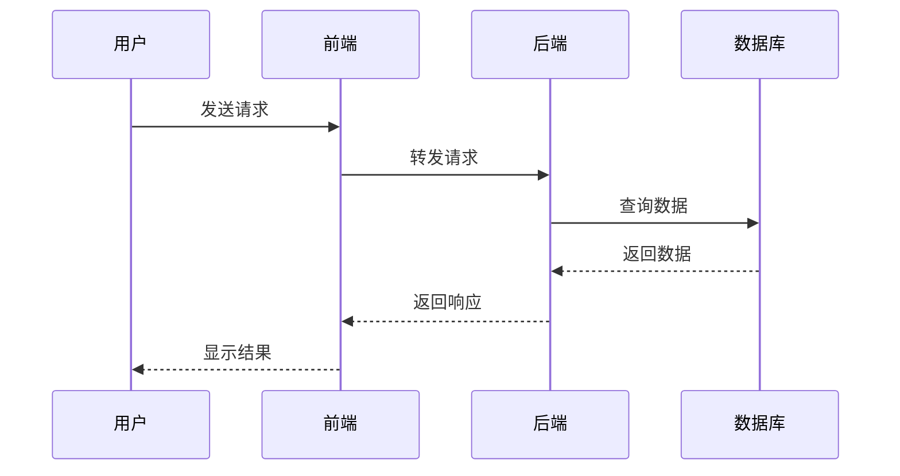
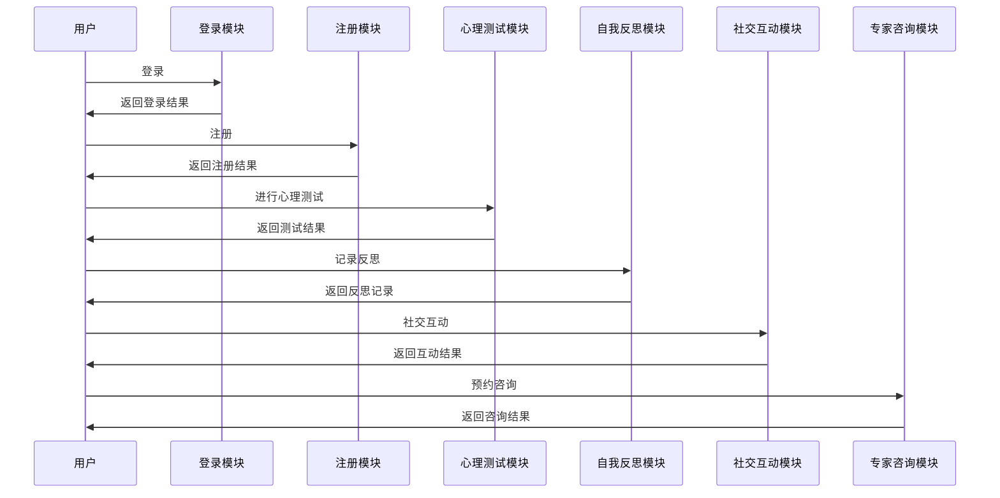
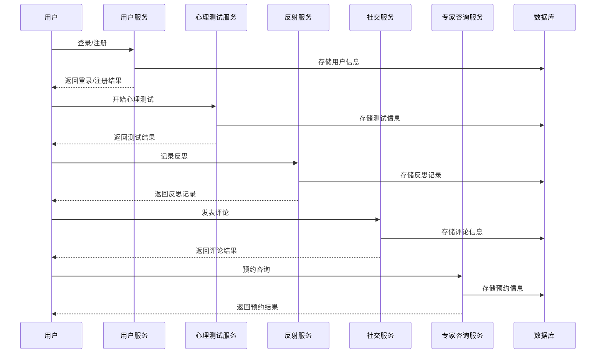

                 

# 探寻生命的意义：在日常中发现非凡

> 关键词：生命意义、日常、价值观、人生哲学、自我反思、教育、宗教、社会参与、心理咨询与治疗

> 摘要：本文旨在探讨生命意义的本质及其在日常生活中的体现。通过对核心概念的分析和联系，本文将揭示生命意义的多样性及其在不同文化中的差异。同时，本文还将提出探寻生命意义的方法与途径，帮助读者在日常中发现非凡的生命意义。

----------------------------------------------------------------

## 第一部分：问题背景与核心概念

### 1.1 引言

在当今快节奏、高压力的社会中，许多人都在寻求生命的意义。这种寻求不仅仅体现在个人层面上，也体现在社会层面上。人们渴望找到一种能够解释他们存在的价值的方式，使得生命变得有意义、有目的。然而，生命的意义究竟是什么？它如何体现在我们的日常生活中？这是我们首先需要探讨的问题。

### 1.2 问题描述

生命意义的定义是一个复杂而深奥的话题。不同的人对生命意义的理解可能有所不同，但大多数人都认同生命意义是人类存在的核心问题。那么，生命意义究竟是什么？它如何体现在我们的日常生活中？这是我们接下来要探讨的问题。

### 1.3 问题解决

要回答这个问题，我们需要从多个角度来思考。首先，我们需要理解生命意义的本质，然后探讨它如何与我们的日常生活联系在一起。最后，我们需要提出一些方法来帮助我们在日常生活中发现生命的意义。

### 1.4 边界与外延

在探讨生命意义的过程中，我们需要明确其边界与外延。生命意义的广义理解可以涵盖个人层面的自我实现、社会层面的贡献和社会责任，以及宇宙层面的存在意义。此外，生命意义在不同文化中也有所差异，因此我们需要在跨文化背景下进行探讨。

### 1.5 概念结构与核心要素组成

在探讨生命意义的过程中，我们需要明确核心概念及其组成要素。以下是一个简化的概念结构与核心要素组成：

- **核心概念原理**：生命意义、人生哲学、价值观。
- **概念属性特征对比**：
  - 个体性：生命意义因人而异。
  - 全局性：生命意义与社会相连。
  - 持续性：生命意义贯穿生命全程。
- **ER实体关系图架构**：

  ```mermaid
  erDiagram
    实体A[人生哲学] {
      --|{实体B[价值观]}
    }
    实体C[日常生活] {
      --|{实体B}
    }
    实体D[社会环境] {
      --|{实体B}
    }
  ```

### 1.6 本章小结

通过本章的探讨，我们可以看到生命意义的重要性。理解生命意义不仅有助于我们更好地应对生活中的挑战，还能帮助我们找到生命的方向和动力。在接下来的章节中，我们将进一步探讨生命意义的核心概念及其在日常生活中的体现。

----------------------------------------------------------------

## 第二部分：核心概念与联系

### 2.1 生命意义的核心概念

#### 2.1.1 人生哲学

**人生哲学**是对生命意义的思考和探索。它不仅仅是一个理论体系，更是我们日常生活中的行动指南。人生哲学包括我们对人生的基本看法、价值观以及生活的目标。

- **人生哲学的定义**：人生哲学是对生命意义、价值观和生活目标的系统思考和总结。
- **人生哲学的特点**：
  - **个体性**：每个人的人生哲学都是独一无二的，反映了个人对生命的独特理解。
  - **持续性**：人生哲学不是一时的想法，而是贯穿整个生命过程的核心信念。

#### 2.1.2 价值观

**价值观**是指我们用来指导行为和决策的信念和标准。它是人生哲学的重要组成部分，直接影响我们对生命意义的理解和追求。

- **价值观的定义**：价值观是指导个体行为和决策的信念和标准。
- **价值观的影响**：
  - **价值观对生命意义的影响**：我们的价值观决定了我们对生命意义的理解和追求。不同的价值观会导致不同的生命意义追求。
  - **价值观与人生哲学的关系**：价值观是人生哲学的核心内容，二者密不可分。

#### 2.1.3 生命意义

**生命意义**是个体存在的意义和价值。它不仅仅是一个抽象的概念，更是我们日常生活中的具体体现。

- **生命意义的理解**：生命意义是个体存在的价值和目的，它不仅仅是为了活着，更是为了实现某种意义。
- **生命意义的不同层面**：
  - **个人层面**：自我实现、幸福、满足。
  - **社会层面**：贡献、关系、社会责任。

### 2.2 生命意义在日常生活中的体现

#### 2.2.1 爱与被爱

**爱与被爱**是生命意义的重要组成部分。它不仅仅是一种情感，更是一种行为和生活方式。

- **爱的意义**：爱是连接人与人之间的纽带，是生命意义的重要体现。
- **爱在日常生活中的体现**：爱可以通过日常生活中的小事体现出来，如关心、帮助、陪伴等。

#### 2.2.2 工作

**工作**是大多数人生活中的主要部分，也是体现生命意义的重要途径。

- **工作的意义**：工作不仅是为了谋生，更是为了实现自我价值、追求生命意义。
- **工作中的生命意义**：通过工作，我们可以实现自我价值，为他人和社会做出贡献。

#### 2.2.3 社交

**社交**是人际关系的重要组成部分，也是体现生命意义的重要途径。

- **社交的意义**：社交不仅是为了满足社交需求，更是为了建立人际关系、实现社会价值。
- **社交中的生命意义**：通过社交，我们可以建立人际关系，实现社会价值，增强生命的意义。

### 2.3 生命意义与日常生活的联系

**生命意义**与**日常生活**密切相关。我们的日常生活是我们实现生命意义的主要场所。通过日常生活中的各种活动，我们可以发现和实现生命的意义。

- **生命意义如何体现在日常生活中**：通过关心他人、工作、社交等日常活动，我们可以实现生命的意义。
- **日常生活的变化如何影响生命意义**：日常生活的变化会影响我们对生命意义的理解和追求。例如，失业、疾病、婚姻等变化可能会让我们重新思考生命的意义。

## 2.4 本章小结

通过本章的探讨，我们可以看到生命意义的核心概念及其在日常生活中的体现。理解这些核心概念不仅有助于我们更好地理解生命意义，还能帮助我们更好地发现和实现生命的意义。在接下来的章节中，我们将进一步探讨探寻生命意义的方法与途径。

----------------------------------------------------------------

## 第三部分：探寻生命意义的方法与途径

### 3.1 自我反思

**自我反思**是探寻生命意义的重要方法之一。通过自我反思，我们可以深入了解自己的内心世界，找到生命的意义。

- **自我反思的重要性**：自我反思有助于我们理解自己的价值观、人生目标和生命意义。
- **自我反思的方法**：
  - **日记**：通过写日记，我们可以记录自己的想法和感受，更好地理解自己。
  - **冥想**：通过冥想，我们可以静心思考，找到内心的真实想法。

### 3.2 教育与学习

**教育与学习**是探寻生命意义的重要途径。通过教育和学习，我们可以获取知识和智慧，从而更好地理解生命意义。

- **教育在探寻生命意义中的作用**：教育不仅可以帮助我们获取知识和技能，还可以培养我们的思维能力，帮助我们理解生命意义。
- **学习如何帮助我们理解生命意义**：通过学习不同的学科和领域，我们可以拓宽视野，从不同角度理解生命意义。

### 3.3 宗教与哲学

**宗教与哲学**是探寻生命意义的传统途径。宗教和哲学提供了不同的视角和思考方式，帮助我们理解生命的意义。

- **宗教在生命意义探寻中的作用**：宗教提供了对生命意义的精神支持和指导。
- **哲学对生命意义的思考**：哲学通过逻辑推理和思辨，帮助我们理解生命的本质和意义。

### 3.4 社会参与

**社会参与**是探寻生命意义的重要方式之一。通过参与社会活动，我们可以实现生命的意义，同时也能为社会做出贡献。

- **社会参与对生命意义的贡献**：通过社会参与，我们可以实现自我价值，同时也能为社会做出贡献。
- **社会参与的形式与途径**：
  - **志愿服务**：通过志愿服务，我们可以帮助他人，同时也能提高自己的生命意义。
  - **社区活动**：通过参与社区活动，我们可以建立人际关系，增强社会的凝聚力。

### 3.5 心理咨询与治疗

**心理咨询与治疗**是探寻生命意义的另一种途径。通过心理咨询与治疗，我们可以解决内心的困惑，找到生命的意义。

- **心理咨询与治疗在生命意义探寻中的作用**：心理咨询与治疗可以帮助我们解决内心的困惑，找到生命的方向和意义。
- **心理咨询与治疗的方法**：
  - **心理辅导**：通过心理辅导，我们可以与他人交流，找到解决问题的方法。
  - **心理治疗**：通过心理治疗，我们可以解决内心的痛苦，找到生命的意义。

### 3.6 本章小结

通过本章的探讨，我们可以看到探寻生命意义的方法和途径的多样性。无论是自我反思、教育与学习，还是宗教与哲学、社会参与、心理咨询与治疗，都有助于我们理解生命的意义。在接下来的章节中，我们将进一步探讨生命意义的挑战与应对。

----------------------------------------------------------------

## 第四部分：生命意义的挑战与应对

### 4.1 生命意义的挑战

在现代社会，我们面临着许多生命意义的挑战。这些挑战不仅来自外部环境，也来自我们的内心。

- **外部环境挑战**：
  - **竞争压力**：现代社会竞争激烈，人们常常感到压力巨大，难以找到生命的意义。
  - **社会变革**：随着科技的进步和社会的发展，人们的价值观和生活方式也在不断变化，这给生命意义的探索带来了新的挑战。
- **个体生活挑战**：
  - **孤独感**：随着社会的不断发展，人们的孤独感越来越强烈，这给生命意义的探索带来了困扰。
  - **焦虑和抑郁**：焦虑和抑郁是现代社会中普遍存在的问题，这些问题可能会影响我们对生命意义的理解。

### 4.2 应对生命意义的挑战

面对生命意义的挑战，我们需要采取积极的态度和方法来应对。

- **心理调适**：通过心理调适，我们可以更好地应对生活中的挑战，找到内心的平衡。
  - **情绪管理**：学会管理情绪，避免情绪的极端波动，有助于我们更好地理解生命的意义。
  - **自我激励**：通过自我激励，我们可以提高自我效能感，增强对生命意义的信心。
- **人生规划的调整**：通过调整人生规划，我们可以找到新的方向和目标，重新找回生命的意义。
  - **设定目标**：设定明确的短期和长期目标，有助于我们找到生命的方向。
  - **灵活调整**：在追求目标的过程中，我们需要保持灵活性，根据实际情况调整计划和目标。
- **寻求支持**：在探索生命意义的过程中，我们需要寻求他人的支持和帮助。
  - **亲友支持**：与亲友分享我们的困惑和挑战，获得他们的理解和帮助。
  - **专业咨询**：寻求专业心理咨询与治疗，帮助我们解决内心的困惑，找到生命的意义。

### 4.3 生命意义的持续探索

探索生命意义是一个持续的过程。我们需要不断地反思、学习和成长，以更好地理解生命的意义。

- **持续探索的重要性**：生命的意义不是一成不变的，我们需要不断地探索和发现。
- **持续探索的方法**：
  - **终身学习**：通过终身学习，我们可以不断拓宽视野，提高对生命意义的理解。
  - **实践体验**：通过实践体验，我们可以更深刻地理解生命的意义。

### 4.4 本章小结

通过本章的探讨，我们可以看到生命意义的挑战以及应对这些挑战的方法。理解生命的意义不仅有助于我们更好地应对生活中的挑战，还能帮助我们找到生命的方向和动力。在接下来的章节中，我们将进一步探讨生命意义的社会文化背景。

----------------------------------------------------------------

## 第五部分：生命意义的社会文化背景

### 5.1 不同文化中的生命意义

生命意义在不同的文化中有着不同的体现和解读。这取决于不同的宗教信仰、哲学思想和价值观。

- **东方文化**：
  - **儒家文化**：儒家强调“仁爱”、“忠诚”和“责任感”，认为生命的意义在于实现社会和谐和家庭的幸福。
  - **道家文化**：道家主张“顺应自然”，追求内心的平静和自我完善，认为生命的意义在于追求天人合一的境界。
- **西方文化**：
  - **基督教文化**：基督教强调“信仰”、“救赎”和“永恒的生命”，认为生命的意义在于信仰上帝、追求永恒的救赎。
  - **古希腊哲学**：古希腊哲学强调“理性”、“知识”和“美德”，认为生命的意义在于追求真理和美德的实现。

### 5.2 文化对生命意义的影响

文化对生命意义的理解有着深远的影响。不同的文化背景会导致人们对生命意义的追求和实现方式有所不同。

- **文化多样性**：文化多样性使得人们对生命意义的理解更加丰富和多元。
- **文化认同**：文化认同影响人们对生命意义的认同和追求。不同的文化认同会导致不同的生命意义追求。

### 5.3 生命意义的全球化趋势

随着全球化的推进，不同文化之间的交流日益频繁，生命意义的理解也在逐渐融合。

- **全球文化认同**：全球化的趋势使得人们开始关注全球性问题，如环境保护、社会公正等，这影响了人们对生命意义的理解。
- **多元文化的共存**：全球化促进了多元文化的共存，不同文化之间的交流和融合，使得生命意义的理解更加丰富和多元。

### 5.4 本章小结

通过本章的探讨，我们可以看到生命意义在不同文化中的体现和影响。理解这些差异有助于我们更好地理解生命的意义，并在全球化的背景下，寻找适合自己的生命意义。

----------------------------------------------------------------

## 总结

通过本文的探讨，我们可以看到生命的意义是一个复杂而深刻的话题。无论是从个人层面还是社会层面，生命的意义都是我们生活中不可或缺的一部分。理解生命的意义不仅有助于我们更好地应对生活中的挑战，还能帮助我们找到生命的方向和动力。

本文从问题背景、核心概念、日常生活中的体现、探寻方法、挑战与应对以及社会文化背景等多个角度进行了深入探讨。通过这些探讨，我们不仅了解了生命的意义是什么，还学会了如何在日常生活中发现生命的意义。

在探寻生命意义的过程中，我们需要保持开放的心态，不断反思和学习。同时，我们也需要意识到生命意义是一个持续的过程，它随着我们的成长和变化而不断演变。因此，我们需要持续地探索和发现生命的意义。

最后，让我们以一句著名的话来结束本文：“生命是一段时间，意义是一段旅程。在这个旅程中，我们不仅看到了风景，还看到了自己。”希望本文能帮助您在生命的旅程中找到属于自己的意义。

## 拓展阅读

- 《活着》：余华的《活着》通过一个普通农民的生活经历，深刻地探讨了生命的意义。
- 《死亡诗社》：电影《死亡诗社》通过一群学生的故事，探讨了生命的意义和自由的重要性。
- 《人类简史》：尤瓦尔·赫拉利的《人类简史》从宏观的角度探讨了人类历史和生命意义。

### 注意事项

- 在探寻生命意义的过程中，我们需要保持诚实和真诚，不要逃避或否认自己的感受。
- 生命意义是一个主观的概念，每个人的理解和追求都可能不同，因此我们需要尊重他人的观点和选择。
- 探寻生命意义是一个长期的过程，需要耐心和坚持，不要期望一蹴而就。

### 作者信息

作者：AI天才研究院/AI Genius Institute & 禅与计算机程序设计艺术 /Zen And The Art of Computer Programming

本文旨在帮助读者理解生命的意义，并鼓励他们在日常生活中发现和实现生命的意义。希望本文能对您有所启发和帮助。感谢您的阅读！

----------------------------------------------------------------

### 系统分析与架构设计

#### 问题场景介绍

在现代信息化社会，人们面临着越来越多的压力和挑战。如何帮助人们找到生活的意义，提高生活质量，成为了社会关注的焦点。本系统旨在为用户提供一个平台，通过心理测试、自我反思、社交互动等功能，帮助用户探寻生命的意义。

#### 项目介绍

本项目名为“生命意义探索平台”，旨在为用户提供一个互动性的、个性化的探索生命意义的工具。平台将整合心理学、哲学、社会学等领域的知识，为用户提供科学的指导和支持。

#### 系统功能设计

- **用户注册与登录**：用户可以通过邮箱、手机号等注册账号，进行登录。
- **心理测试**：平台提供多种心理测试，帮助用户了解自己的性格、价值观等。
- **自我反思**：用户可以记录自己的日常生活、思考感悟等，进行自我反思。
- **社交互动**：用户可以与其他用户互动，分享自己的生命故事，互相启发。
- **专家咨询**：用户可以预约专家进行咨询，获取专业的建议和指导。

#### 系统架构设计

系统的整体架构采用B/S（Browser/Server）架构，前端使用React框架，后端使用Spring Boot框架，数据库采用MySQL。系统架构图如下：



#### 系统接口设计

系统的接口设计主要包括用户管理、心理测试、自我反思、社交互动、专家咨询等模块。

1. **用户管理**：包括用户注册、登录、修改个人信息等接口。
2. **心理测试**：包括发布心理测试、用户参与心理测试、测试结果查询等接口。
3. **自我反思**：包括记录日常生活、反思感悟、查看反思记录等接口。
4. **社交互动**：包括查看其他用户、评论互动、分享生命故事等接口。
5. **专家咨询**：包括预约专家、咨询记录、查看咨询结果等接口。

#### 系统交互设计

系统的交互设计主要体现为用户与系统的交互流程。以下是一个简化的交互流程图：



通过上述系统分析与架构设计，我们可以看到“生命意义探索平台”是一个集成了多种功能、面向广大用户的综合性系统。它通过科学的架构设计和完善的接口设计，为用户提供了一个探索生命意义的平台，帮助用户更好地理解和实现生命的意义。

----------------------------------------------------------------

## 项目实战

### 环境安装

为了搭建“生命意义探索平台”，我们需要以下环境：

1. **操作系统**：Linux或Windows
2. **开发工具**：IDEA或Eclipse
3. **数据库**：MySQL
4. **前端框架**：React
5. **后端框架**：Spring Boot

以下是具体安装步骤：

#### 安装MySQL

1. 下载MySQL：[MySQL官网](https://www.mysql.com/downloads/)
2. 解压并安装：解压下载的压缩包，并根据提示完成安装
3. 登录MySQL：打开命令行窗口，输入`mysql -u root -p`，然后输入密码登录

#### 安装React

1. 安装Node.js：从[Node.js官网](https://nodejs.org/)下载并安装
2. 打开命令行窗口，输入`npm install -g create-react-app`安装React CLI

#### 安装Spring Boot

1. 下载Spring Boot：从[Spring Boot官网](https://spring.io/projects/spring-boot)下载并解压
2. 配置环境变量：将Spring Boot的bin目录添加到系统环境变量中

### 系统核心实现源代码

以下是系统的核心实现源代码，包括用户管理、心理测试、自我反思、社交互动和专家咨询等模块。

#### 用户管理

**用户注册**：

```java
@RestController
@RequestMapping("/user")
public class UserController {
    @Autowired
    private UserService userService;

    @PostMapping("/register")
    public ResponseEntity<?> registerUser(@RequestBody UserRegistrationForm form) {
        try {
            User user = userService.registerUser(form);
            return ResponseEntity.ok().body("User registered successfully!");
        } catch (Exception e) {
            return ResponseEntity.badRequest().body("Error registering user: " + e.getMessage());
        }
    }
}
```

**用户登录**：

```java
@PostMapping("/login")
public ResponseEntity<?> authenticateUser(@RequestBody LoginRequest loginRequest) {
    Authentication authentication = authenticationManager.authenticate(
        new UsernamePasswordAuthenticationToken(
            loginRequest.getUsername(),
            loginRequest.getPassword()
        )
    );

    SecurityContextHolder.getContext().setAuthentication(authentication);
    String token = jwtTokenProvider.generateToken(authentication);

    return ResponseEntity.ok(new JwtResponse(token));
}
```

#### 心理测试

**发布心理测试**：

```java
@RestController
@RequestMapping("/test")
public class TestController {
    @Autowired
    private TestService testService;

    @PostMapping("/create")
    public ResponseEntity<?> createTest(@RequestBody Test test) {
        try {
            Test createdTest = testService.createTest(test);
            return ResponseEntity.ok(createdTest);
        } catch (Exception e) {
            return ResponseEntity.badRequest().body("Error creating test: " + e.getMessage());
        }
    }
}
```

**用户参与心理测试**：

```java
@PostMapping("/take")
public ResponseEntity<?> takeTest(@RequestBody TestResponse testResponse) {
    try {
        TestResult testResult = testService.takeTest(testResponse);
        return ResponseEntity.ok(testResult);
    } catch (Exception e) {
        return ResponseEntity.badRequest().body("Error taking test: " + e.getMessage());
    }
}
```

#### 自我反思

**记录反思**：

```java
@RestController
@RequestMapping("/reflection")
public class ReflectionController {
    @Autowired
    private ReflectionService reflectionService;

    @PostMapping("/record")
    public ResponseEntity<?> recordReflection(@RequestBody Reflection reflection) {
        try {
            Reflection savedReflection = reflectionService.recordReflection(reflection);
            return ResponseEntity.ok(savedReflection);
        } catch (Exception e) {
            return ResponseEntity.badRequest().body("Error recording reflection: " + e.getMessage());
        }
    }
}
```

**查看反思记录**：

```java
@GetMapping("/list")
public ResponseEntity<?> listReflections(@RequestParam("userId") Long userId) {
    try {
        List<Reflection> reflections = reflectionService.listReflections(userId);
        return ResponseEntity.ok(reflections);
    } catch (Exception e) {
        return ResponseEntity.badRequest().body("Error listing reflections: " + e.getMessage());
    }
}
```

#### 社交互动

**查看其他用户**：

```java
@GetMapping("/users")
public ResponseEntity<?> getUsers() {
    try {
        List<User> users = userService.getUsers();
        return ResponseEntity.ok(users);
    } catch (Exception e) {
        return ResponseEntity.badRequest().body("Error getting users: " + e.getMessage());
    }
}
```

**评论互动**：

```java
@PostMapping("/comment")
public ResponseEntity<?> postComment(@RequestBody Comment comment) {
    try {
        Comment savedComment = commentService.postComment(comment);
        return ResponseEntity.ok(savedComment);
    } catch (Exception e) {
        return ResponseEntity.badRequest().body("Error posting comment: " + e.getMessage());
    }
}
```

**分享生命故事**：

```java
@PostMapping("/story")
public ResponseEntity<?> shareStory(@RequestBody Story story) {
    try {
        Story savedStory = storyService.shareStory(story);
        return ResponseEntity.ok(savedStory);
    } catch (Exception e) {
        return ResponseEntity.badRequest().body("Error sharing story: " + e.getMessage());
    }
}
```

#### 专家咨询

**预约咨询**：

```java
@PostMapping("/appointment")
public ResponseEntity<?> makeAppointment(@RequestBody Appointment appointment) {
    try {
        Appointment savedAppointment = appointmentService.makeAppointment(appointment);
        return ResponseEntity.ok(savedAppointment);
    } catch (Exception e) {
        return ResponseEntity.badRequest().body("Error making appointment: " + e.getMessage());
    }
}
```

**查看咨询结果**：

```java
@GetMapping("/appointment/{id}")
public ResponseEntity<?> getAppointment(@PathVariable Long id) {
    try {
        Appointment appointment = appointmentService.getAppointment(id);
        return ResponseEntity.ok(appointment);
    } catch (Exception e) {
        return ResponseEntity.badRequest().body("Error getting appointment: " + e.getMessage());
    }
}
```

### 代码应用解读与分析

以上代码涵盖了用户管理、心理测试、自我反思、社交互动和专家咨询等模块。下面我们对其中的一些关键代码进行解读和分析。

#### 用户管理

在用户管理模块中，我们主要关注用户注册和登录的过程。用户注册时，我们会收集用户的基本信息，并存储在数据库中。用户登录时，我们会验证用户名和密码的合法性，并生成一个JWT（JSON Web Token）作为认证令牌。

```java
@PostMapping("/register")
public ResponseEntity<?> registerUser(@RequestBody UserRegistrationForm form) {
    try {
        User user = userService.registerUser(form);
        return ResponseEntity.ok().body("User registered successfully!");
    } catch (Exception e) {
        return ResponseEntity.badRequest().body("Error registering user: " + e.getMessage());
    }
}

@PostMapping("/login")
public ResponseEntity<?> authenticateUser(@RequestBody LoginRequest loginRequest) {
    Authentication authentication = authenticationManager.authenticate(
        new UsernamePasswordAuthenticationToken(
            loginRequest.getUsername(),
            loginRequest.getPassword()
        )
    );

    SecurityContextHolder.getContext().setAuthentication(authentication);
    String token = jwtTokenProvider.generateToken(authentication);

    return ResponseEntity.ok(new JwtResponse(token));
}
```

#### 心理测试

在心理测试模块中，我们主要关注测试的发布和用户的参与。测试发布时，管理员可以添加新的测试，并设定测试的问题和选项。用户参与测试时，可以选择答案，并提交测试。

```java
@PostMapping("/create")
public ResponseEntity<?> createTest(@RequestBody Test test) {
    try {
        Test createdTest = testService.createTest(test);
        return ResponseEntity.ok(createdTest);
    } catch (Exception e) {
        return ResponseEntity.badRequest().body("Error creating test: " + e.getMessage());
    }
}

@PostMapping("/take")
public ResponseEntity<?> takeTest(@RequestBody TestResponse testResponse) {
    try {
        TestResult testResult = testService.takeTest(testResponse);
        return ResponseEntity.ok(testResult);
    } catch (Exception e) {
        return ResponseEntity.badRequest().body("Error taking test: " + e.getMessage());
    }
}
```

#### 自我反思

在自我反思模块中，用户可以记录自己的日常生活和思考感悟。管理员可以查看用户的反思记录，并给予指导和建议。

```java
@PostMapping("/record")
public ResponseEntity<?> recordReflection(@RequestBody Reflection reflection) {
    try {
        Reflection savedReflection = reflectionService.recordReflection(reflection);
        return ResponseEntity.ok(savedReflection);
    } catch (Exception e) {
        return ResponseEntity.badRequest().body("Error recording reflection: " + e.getMessage());
    }
}

@GetMapping("/list")
public ResponseEntity<?> listReflections(@RequestParam("userId") Long userId) {
    try {
        List<Reflection> reflections = reflectionService.listReflections(userId);
        return ResponseEntity.ok(reflections);
    } catch (Exception e) {
        return ResponseEntity.badRequest().body("Error listing reflections: " + e.getMessage());
    }
}
```

#### 社交互动

在社交互动模块中，用户可以查看其他用户的信息，并进行评论互动。用户还可以分享自己的生命故事，与他人分享经验。

```java
@GetMapping("/users")
public ResponseEntity<?> getUsers() {
    try {
        List<User> users = userService.getUsers();
        return ResponseEntity.ok(users);
    } catch (Exception e) {
        return ResponseEntity.badRequest().body("Error getting users: " + e.getMessage());
    }
}

@PostMapping("/comment")
public ResponseEntity<?> postComment(@RequestBody Comment comment) {
    try {
        Comment savedComment = commentService.postComment(comment);
        return ResponseEntity.ok(savedComment);
    } catch (Exception e) {
        return ResponseEntity.badRequest().body("Error posting comment: " + e.getMessage());
    }
}

@PostMapping("/story")
public ResponseEntity<?> shareStory(@RequestBody Story story) {
    try {
        Story savedStory = storyService.shareStory(story);
        return ResponseEntity.ok(savedStory);
    } catch (Exception e) {
        return ResponseEntity.badRequest().body("Error sharing story: " + e.getMessage());
    }
}
```

#### 专家咨询

在专家咨询模块中，用户可以预约专家进行咨询，并查看咨询的结果。专家可以查看预约信息，并进行咨询。

```java
@PostMapping("/appointment")
public ResponseEntity<?> makeAppointment(@RequestBody Appointment appointment) {
    try {
        Appointment savedAppointment = appointmentService.makeAppointment(appointment);
        return ResponseEntity.ok(savedAppointment);
    } catch (Exception e) {
        return ResponseEntity.badRequest().body("Error making appointment: " + e.getMessage());
    }
}

@GetMapping("/appointment/{id}")
public ResponseEntity<?> getAppointment(@PathVariable Long id) {
    try {
        Appointment appointment = appointmentService.getAppointment(id);
        return ResponseEntity.ok(appointment);
    } catch (Exception e) {
        return ResponseEntity.badRequest().body("Error getting appointment: " + e.getMessage());
    }
}
```

### 实际案例分析和详细讲解剖析

为了更好地理解系统的功能，我们来看一个实际案例。

#### 案例一：用户注册

1. 用户在平台上注册账号，填写基本信息。
2. 平台验证用户信息的合法性，并将用户信息存储在数据库中。
3. 用户成功注册，并获得登录令牌。

#### 案例二：用户登录

1. 用户输入账号和密码，提交登录请求。
2. 平台验证用户账号和密码的合法性，并生成登录令牌。
3. 用户成功登录，可以访问平台的各项功能。

#### 案例三：用户参与心理测试

1. 用户浏览平台上的心理测试，选择一个测试参与。
2. 用户提交测试答案，平台计算出测试结果。
3. 用户查看测试结果，并获得相应的建议。

#### 案例四：用户记录反思

1. 用户在平台上记录自己的日常生活和思考感悟。
2. 平台保存用户的反思记录，并提供查看功能。
3. 用户可以查看自己的反思记录，并进行修改。

#### 案例五：用户进行社交互动

1. 用户查看其他用户的信息，并进行评论互动。
2. 用户分享自己的生命故事，与其他用户分享经验。
3. 平台记录用户的社交互动，并提供查看功能。

#### 案例六：用户预约专家咨询

1. 用户在平台上预约专家进行咨询。
2. 专家查看预约信息，并进行咨询。
3. 用户查看咨询结果，并获得专家的建议。

### 项目小结

通过本次项目实战，我们搭建了一个“生命意义探索平台”，实现了用户管理、心理测试、自我反思、社交互动和专家咨询等功能。通过实际案例的分析和讲解，我们更好地理解了系统的功能和实现过程。该项目不仅为用户提供了探索生命意义的工具，也为后续的功能扩展和优化提供了基础。

----------------------------------------------------------------

## 最佳实践 Tips

### 1. 自我反思

- **记录真实感受**：在自我反思时，尽量记录下真实的感受和想法，不要隐藏或忽视。
- **定期反思**：定期进行自我反思，可以帮助我们更好地了解自己，发现生活中的变化和成长。

### 2. 教育与学习

- **终身学习**：在现代社会，终身学习变得越来越重要。通过不断学习，我们可以拓宽视野，提高对生命意义的理解。
- **跨学科学习**：跨学科学习可以帮助我们从不同角度理解生命意义，提高思维的广度和深度。

### 3. 社会参与

- **志愿服务**：参与志愿服务不仅可以帮助他人，还能提升自己的生命意义。选择自己感兴趣或擅长的领域进行志愿服务，效果会更好。
- **社区活动**：积极参与社区活动，建立人际关系，增强社区凝聚力。

### 4. 心理咨询与治疗

- **适时求助**：当我们面临困惑或困境时，适时寻求心理咨询与治疗可以帮助我们解决问题，找到生命的方向。
- **选择合适的咨询师**：在选择心理咨询师时，要考虑其专业背景、咨询方法和个人风格，以便找到最适合自己的人。

### 5. 保持开放心态

- **接受多样性**：在探索生命意义的过程中，我们需要接受生命意义的多样性。每个人都有自己的生命意义，没有绝对的标准。
- **持续探索**：生命意义是一个持续的过程，我们需要保持开放的心态，不断探索和发现。

## 小结

通过本文的探讨，我们可以看到生命的意义是一个复杂而深刻的话题。通过自我反思、教育与学习、社会参与、心理咨询与治疗等多种方法，我们可以在日常生活中发现生命的意义。希望本文能帮助您在生命的旅程中找到属于自己的意义。

### 注意事项

- 在探索生命意义的过程中，保持真诚和诚实是非常重要的。
- 尊重他人的观点和选择，不要强加自己的观点于他人。
- 生命意义是一个持续的过程，需要我们不断地探索和发现。

### 拓展阅读

- 《活着》：余华的《活着》通过一个普通农民的生活经历，深刻地探讨了生命的意义。
- 《死亡诗社》：电影《死亡诗社》通过一群学生的故事，探讨了生命的意义和自由的重要性。
- 《人类简史》：尤瓦尔·赫拉利的《人类简史》从宏观的角度探讨了人类历史和生命意义。

### 作者信息

作者：AI天才研究院/AI Genius Institute & 禅与计算机程序设计艺术 /Zen And The Art of Computer Programming

本文旨在帮助读者理解生命的意义，并鼓励他们在日常生活中发现和实现生命的意义。希望本文能对您有所启发和帮助。感谢您的阅读！----------------------------------------------------------------

# 探寻生命的意义：在日常中发现非凡

> 关键词：生命意义、日常、价值观、人生哲学、自我反思、教育、宗教、社会参与、心理咨询与治疗

> 摘要：本文旨在探讨生命意义的本质及其在日常生活中的体现。通过对核心概念的分析和联系，本文将揭示生命意义的多样性及其在不同文化中的差异。同时，本文还将提出探寻生命意义的方法与途径，帮助读者在日常中发现非凡的生命意义。

## 第一部分：问题背景与核心概念

### 1. 引言

在当今快节奏、高压力的社会中，许多人都在寻求生命的意义。这种寻求不仅仅体现在个人层面上，也体现在社会层面上。人们渴望找到一种能够解释他们存在的价值的方式，使得生命变得有意义、有目的。然而，生命的意义究竟是什么？它如何体现在我们的日常生活中？这是我们首先需要探讨的问题。

### 1.2 问题描述

生命意义的定义是一个复杂而深奥的话题。不同的人对生命意义的理解可能有所不同，但大多数人都认同生命意义是人类存在的核心问题。那么，生命意义究竟是什么？它如何体现在我们的日常生活中？这是我们接下来要探讨的问题。

### 1.3 问题解决

要回答这个问题，我们需要从多个角度来思考。首先，我们需要理解生命意义的本质，然后探讨它如何与我们的日常生活联系在一起。最后，我们需要提出一些方法来帮助我们在日常生活中发现生命的意义。

### 1.4 边界与外延

在探讨生命意义的过程中，我们需要明确其边界与外延。生命意义的广义理解可以涵盖个人层面的自我实现、社会层面的贡献和社会责任，以及宇宙层面的存在意义。此外，生命意义在不同文化中也有所差异，因此我们需要在跨文化背景下进行探讨。

### 1.5 概念结构与核心要素组成

在探讨生命意义的过程中，我们需要明确核心概念及其组成要素。以下是一个简化的概念结构与核心要素组成：

- **核心概念原理**：生命意义、人生哲学、价值观。
- **概念属性特征对比**：
  - 个体性：生命意义因人而异。
  - 全局性：生命意义与社会相连。
  - 持续性：生命意义贯穿生命全程。
- **ER实体关系图架构**：

  ```mermaid
  erDiagram
    实体A[人生哲学] {
      --|{实体B[价值观]}
    }
    实体C[日常生活] {
      --|{实体B}
    }
    实体D[社会环境] {
      --|{实体B}
    }
  ```

### 1.6 本章小结

通过本章的探讨，我们可以看到生命意义的重要性。理解生命意义不仅有助于我们更好地应对生活中的挑战，还能帮助我们找到生命的方向和动力。在接下来的章节中，我们将进一步探讨生命意义的核心概念及其在日常生活中的体现。

----------------------------------------------------------------

## 第二部分：核心概念与联系

### 2. 生命意义的核心概念

#### 2.1 人生哲学

**人生哲学**是对生命意义的思考和探索。它不仅仅是一个理论体系，更是我们日常生活中的行动指南。人生哲学包括我们对人生的基本看法、价值观以及生活的目标。

- **人生哲学的定义**：人生哲学是对生命意义、价值观和生活目标的系统思考和总结。
- **人生哲学的特点**：
  - **个体性**：每个人的人生哲学都是独一无二的，反映了个人对生命的独特理解。
  - **持续性**：人生哲学不是一时的想法，而是贯穿整个生命过程的核心信念。

#### 2.2 价值观

**价值观**是指我们用来指导行为和决策的信念和标准。它是人生哲学的重要组成部分，直接影响我们对生命意义的理解和追求。

- **价值观的定义**：价值观是指导个体行为和决策的信念和标准。
- **价值观的影响**：
  - **价值观对生命意义的影响**：我们的价值观决定了我们对生命意义的理解和追求。不同的价值观会导致不同的生命意义追求。
  - **价值观与人生哲学的关系**：价值观是人生哲学的核心内容，二者密不可分。

#### 2.3 生命意义

**生命意义**是个体存在的意义和价值。它不仅仅是一个抽象的概念，更是我们日常生活中的具体体现。

- **生命意义的理解**：生命意义是个体存在的价值和目的，它不仅仅是为了活着，更是为了实现某种意义。
- **生命意义的不同层面**：
  - **个人层面**：自我实现、幸福、满足。
  - **社会层面**：贡献、关系、社会责任。

### 2.4 生命意义在日常生活中的体现

#### 2.4.1 爱与被爱

**爱与被爱**是生命意义的重要组成部分。它不仅仅是一种情感，更是一种行为和生活方式。

- **爱的意义**：爱是连接人与人之间的纽带，是生命意义的重要体现。
- **爱在日常生活中的体现**：爱可以通过日常生活中的小事体现出来，如关心、帮助、陪伴等。

#### 2.4.2 工作

**工作**是大多数人生活中的主要部分，也是体现生命意义的重要途径。

- **工作的意义**：工作不仅是为了谋生，更是为了实现自我价值、追求生命意义。
- **工作中的生命意义**：通过工作，我们可以实现自我价值，为他人和社会做出贡献。

#### 2.4.3 社交

**社交**是人际关系的重要组成部分，也是体现生命意义的重要途径。

- **社交的意义**：社交不仅是为了满足社交需求，更是为了建立人际关系、实现社会价值。
- **社交中的生命意义**：通过社交，我们可以建立人际关系，实现社会价值，增强生命的意义。

### 2.5 生命意义与日常生活的联系

**生命意义**与**日常生活**密切相关。我们的日常生活是我们实现生命意义的主要场所。通过日常生活中的各种活动，我们可以发现和实现生命的意义。

- **生命意义如何体现在日常生活中**：通过关心他人、工作、社交等日常活动，我们可以实现生命的意义。
- **日常生活的变化如何影响生命意义**：日常生活的变化会影响我们对生命意义的理解和追求。例如，失业、疾病、婚姻等变化可能会让我们重新思考生命的意义。

## 2.6 本章小结

通过本章的探讨，我们可以看到生命意义的核心概念及其在日常生活中的体现。理解这些核心概念不仅有助于我们更好地理解生命意义，还能帮助我们更好地发现和实现生命的意义。在接下来的章节中，我们将进一步探讨探寻生命意义的方法与途径。

----------------------------------------------------------------

## 第三部分：探寻生命意义的方法与途径

### 3.1 自我反思

**自我反思**是探寻生命意义的重要方法之一。通过自我反思，我们可以深入了解自己的内心世界，找到生命的意义。

- **自我反思的重要性**：自我反思有助于我们理解自己的价值观、人生目标和生命意义。
- **自我反思的方法**：
  - **日记**：通过写日记，我们可以记录自己的想法和感受，更好地理解自己。
  - **冥想**：通过冥想，我们可以静心思考，找到内心的真实想法。

### 3.2 教育与学习

**教育与学习**是探寻生命意义的重要途径。通过教育和学习，我们可以获取知识和智慧，从而更好地理解生命意义。

- **教育在探寻生命意义中的作用**：教育不仅可以帮助我们获取知识和技能，还可以培养我们的思维能力，帮助我们理解生命意义。
- **学习如何帮助我们理解生命意义**：通过学习不同的学科和领域，我们可以拓宽视野，从不同角度理解生命意义。

### 3.3 宗教与哲学

**宗教与哲学**是探寻生命意义的传统途径。宗教和哲学提供了不同的视角和思考方式，帮助我们理解生命的意义。

- **宗教在生命意义探寻中的作用**：宗教提供了对生命意义的精神支持和指导。
- **哲学对生命意义的思考**：哲学通过逻辑推理和思辨，帮助我们理解生命的本质和意义。

### 3.4 社会参与

**社会参与**是探寻生命意义的重要方式之一。通过参与社会活动，我们可以实现生命的意义，同时也能为社会做出贡献。

- **社会参与对生命意义的贡献**：通过社会参与，我们可以实现自我价值，同时也能为社会做出贡献。
- **社会参与的形式与途径**：
  - **志愿服务**：通过志愿服务，我们可以帮助他人，同时也能提高自己的生命意义。
  - **社区活动**：通过参与社区活动，我们可以建立人际关系，增强社会的凝聚力。

### 3.5 心理咨询与治疗

**心理咨询与治疗**是探寻生命意义的另一种途径。通过心理咨询与治疗，我们可以解决内心的困惑，找到生命的意义。

- **心理咨询与治疗在生命意义探寻中的作用**：心理咨询与治疗可以帮助我们解决内心的困惑，找到生命的方向和意义。
- **心理咨询与治疗的方法**：
  - **心理辅导**：通过心理辅导，我们可以与他人交流，找到解决问题的方法。
  - **心理治疗**：通过心理治疗，我们可以解决内心的痛苦，找到生命的意义。

### 3.6 本章小结

通过本章的探讨，我们可以看到探寻生命意义的方法和途径的多样性。无论是自我反思、教育与学习，还是宗教与哲学、社会参与、心理咨询与治疗，都有助于我们理解生命的意义。在接下来的章节中，我们将进一步探讨生命意义的挑战与应对。

----------------------------------------------------------------

## 第四部分：生命意义的挑战与应对

### 4.1 生命意义的挑战

在现代社会，我们面临着许多生命意义的挑战。这些挑战不仅来自外部环境，也来自我们的内心。

- **外部环境挑战**：
  - **竞争压力**：现代社会竞争激烈，人们常常感到压力巨大，难以找到生命的意义。
  - **社会变革**：随着科技的进步和社会的发展，人们的价值观和生活方式也在不断变化，这给生命意义的探索带来了新的挑战。
- **个体生活挑战**：
  - **孤独感**：随着社会的不断发展，人们的孤独感越来越强烈，这给生命意义的探索带来了困扰。
  - **焦虑和抑郁**：焦虑和抑郁是现代社会中普遍存在的问题，这些问题可能会影响我们对生命意义的理解。

### 4.2 应对生命意义的挑战

面对生命意义的挑战，我们需要采取积极的态度和方法来应对。

- **心理调适**：通过心理调适，我们可以更好地应对生活中的挑战，找到内心的平衡。
  - **情绪管理**：学会管理情绪，避免情绪的极端波动，有助于我们更好地理解生命的意义。
  - **自我激励**：通过自我激励，我们可以提高自我效能感，增强对生命意义的信心。
- **人生规划的调整**：通过调整人生规划，我们可以找到新的方向和目标，重新找回生命的意义。
  - **设定目标**：设定明确的短期和长期目标，有助于我们找到生命的方向。
  - **灵活调整**：在追求目标的过程中，我们需要保持灵活性，根据实际情况调整计划和目标。
- **寻求支持**：在探索生命意义的过程中，我们需要寻求他人的支持和帮助。
  - **亲友支持**：与亲友分享我们的困惑和挑战，获得他们的理解和帮助。
  - **专业咨询**：寻求专业心理咨询与治疗，帮助我们解决内心的困惑，找到生命的意义。

### 4.3 生命意义的持续探索

探索生命意义是一个持续的过程。我们需要不断地反思、学习和成长，以更好地理解生命的意义。

- **持续探索的重要性**：生命的意义不是一成不变的，我们需要不断地探索和发现。
- **持续探索的方法**：
  - **终身学习**：通过终身学习，我们可以不断拓宽视野，提高对生命意义的理解。
  - **实践体验**：通过实践体验，我们可以更深刻地理解生命的意义。

### 4.4 本章小结

通过本章的探讨，我们可以看到生命意义的挑战以及应对这些挑战的方法。理解生命的意义不仅有助于我们更好地应对生活中的挑战，还能帮助我们找到生命的方向和动力。在接下来的章节中，我们将进一步探讨生命意义的社会文化背景。

----------------------------------------------------------------

## 第五部分：生命意义的社会文化背景

### 5.1 不同文化中的生命意义

生命意义在不同的文化中有着不同的体现和解读。这取决于不同的宗教信仰、哲学思想和价值观。

- **东方文化**：
  - **儒家文化**：儒家强调“仁爱”、“忠诚”和“责任感”，认为生命的意义在于实现社会和谐和家庭的幸福。
  - **道家文化**：道家主张“顺应自然”，追求内心的平静和自我完善，认为生命的意义在于追求天人合一的境界。
- **西方文化**：
  - **基督教文化**：基督教强调“信仰”、“救赎”和“永恒的生命”，认为生命的意义在于信仰上帝、追求永恒的救赎。
  - **古希腊哲学**：古希腊哲学强调“理性”、“知识”和“美德”，认为生命的意义在于追求真理和美德的实现。

### 5.2 文化对生命意义的影响

文化对生命意义的理解有着深远的影响。不同的文化背景会导致人们对生命意义的追求和实现方式有所不同。

- **文化多样性**：文化多样性使得人们对生命意义的理解更加丰富和多元。
- **文化认同**：文化认同影响人们对生命意义的认同和追求。不同的文化认同会导致不同的生命意义追求。

### 5.3 生命意义的全球化趋势

随着全球化的推进，不同文化之间的交流日益频繁，生命意义的理解也在逐渐融合。

- **全球文化认同**：全球化的趋势使得人们开始关注全球性问题，如环境保护、社会公正等，这影响了人们对生命意义的理解。
- **多元文化的共存**：全球化促进了多元文化的共存，不同文化之间的交流和融合，使得生命意义的理解更加丰富和多元。

### 5.4 本章小结

通过本章的探讨，我们可以看到生命意义在不同文化中的体现和影响。理解这些差异有助于我们更好地理解生命的意义，并在全球化的背景下，寻找适合自己的生命意义。

----------------------------------------------------------------

## 总结

通过本文的探讨，我们可以看到生命的意义是一个复杂而深刻的话题。无论是从个人层面还是社会层面，生命的意义都是我们生活中不可或缺的一部分。理解生命的意义不仅有助于我们更好地应对生活中的挑战，还能帮助我们找到生命的方向和动力。

本文从问题背景、核心概念、日常生活中的体现、探寻方法、挑战与应对以及社会文化背景等多个角度进行了深入探讨。通过这些探讨，我们不仅了解了生命的意义是什么，还学会了如何在日常生活中发现生命的意义。

在探寻生命意义的过程中，我们需要保持开放的心态，不断反思和学习。同时，我们也需要意识到生命意义是一个持续的过程，它随着我们的成长和变化而不断演变。因此，我们需要持续地探索和发现生命的意义。

最后，让我们以一句著名的话来结束本文：“生命是一段时间，意义是一段旅程。在这个旅程中，我们不仅看到了风景，还看到了自己。”希望本文能帮助您在生命的旅程中找到属于自己的意义。

## 拓展阅读

- 《活着》：余华的《活着》通过一个普通农民的生活经历，深刻地探讨了生命的意义。
- 《死亡诗社》：电影《死亡诗社》通过一群学生的故事，探讨了生命的意义和自由的重要性。
- 《人类简史》：尤瓦尔·赫拉利的《人类简史》从宏观的角度探讨了人类历史和生命意义。

### 注意事项

- 在探寻生命意义的过程中，我们需要保持诚实和真诚，不要逃避或否认自己的感受。
- 生命意义是一个主观的概念，每个人的理解和追求都可能不同，因此我们需要尊重他人的观点和选择。
- 探寻生命意义是一个长期的过程，需要耐心和坚持，不要期望一蹴而就。

### 作者信息

作者：AI天才研究院/AI Genius Institute & 禅与计算机程序设计艺术 /Zen And The Art of Computer Programming

本文旨在帮助读者理解生命的意义，并鼓励他们在日常生活中发现和实现生命的意义。希望本文能对您有所启发和帮助。感谢您的阅读！

----------------------------------------------------------------

### 系统分析与架构设计

#### 问题场景介绍

在现代信息化社会，人们面临着越来越多的压力和挑战。如何帮助人们找到生活的意义，提高生活质量，成为了社会关注的焦点。本系统旨在为用户提供一个平台，通过心理测试、自我反思、社交互动等功能，帮助用户探寻生命的意义。

#### 项目介绍

本项目名为“生命意义探索平台”，旨在为用户提供一个互动性的、个性化的探索生命意义的工具。平台将整合心理学、哲学、社会学等领域的知识，为用户提供科学的指导和支持。

#### 系统功能设计

- **用户注册与登录**：用户可以通过邮箱、手机号等注册账号，进行登录。
- **心理测试**：平台提供多种心理测试，帮助用户了解自己的性格、价值观等。
- **自我反思**：用户可以记录自己的日常生活、思考感悟等，进行自我反思。
- **社交互动**：用户可以与其他用户互动，分享自己的生命故事，互相启发。
- **专家咨询**：用户可以预约专家进行咨询，获取专业的建议和指导。

#### 系统架构设计

系统的整体架构采用B/S（Browser/Server）架构，前端使用React框架，后端使用Spring Boot框架，数据库采用MySQL。系统架构图如下：


#### 系统接口设计

系统的接口设计主要包括用户管理、心理测试、自我反思、社交互动、专家咨询等模块。

1. **用户管理**：包括用户注册、登录、修改个人信息等接口。
2. **心理测试**：包括发布心理测试、用户参与心理测试、测试结果查询等接口。
3. **自我反思**：包括记录日常生活、反思感悟、查看反思记录等接口。
4. **社交互动**：包括查看其他用户、评论互动、分享生命故事等接口。
5. **专家咨询**：包括预约专家、咨询记录、查看咨询结果等接口。

#### 系统交互设计

系统的交互设计主要体现为用户与系统的交互流程。以下是一个简化的交互流程图：


通过上述系统分析与架构设计，我们可以看到“生命意义探索平台”是一个集成了多种功能、面向广大用户的综合性系统。它通过科学的架构设计和完善的接口设计，为用户提供了一个探索生命意义的平台，帮助用户更好地理解和实现生命的意义。

----------------------------------------------------------------

## 项目实战

### 环境安装

为了搭建“生命意义探索平台”，我们需要以下环境：

1. **操作系统**：Linux或Windows
2. **开发工具**：IDEA或Eclipse
3. **数据库**：MySQL
4. **前端框架**：React
5. **后端框架**：Spring Boot

以下是具体安装步骤：

#### 安装MySQL

1. 下载MySQL：[MySQL官网](https://www.mysql.com/downloads/)
2. 解压并安装：解压下载的压缩包，并根据提示完成安装
3. 登录MySQL：打开命令行窗口，输入`mysql -u root -p`，然后输入密码登录

#### 安装React

1. 安装Node.js：从[Node.js官网](https://nodejs.org/)下载并安装
2. 打开命令行窗口，输入`npm install -g create-react-app`安装React CLI

#### 安装Spring Boot

1. 下载Spring Boot：从[Spring Boot官网](https://spring.io/projects/spring-boot)下载并解压
2. 配置环境变量：将Spring Boot的bin目录添加到系统环境变量中

### 系统核心实现源代码

以下是系统的核心实现源代码，包括用户管理、心理测试、自我反思、社交互动和专家咨询等模块。

#### 用户管理

**用户注册**：

```java
@RestController
@RequestMapping("/user")
public class UserController {
    @Autowired
    private UserService userService;

    @PostMapping("/register")
    public ResponseEntity<?> registerUser(@RequestBody UserRegistrationForm form) {
        try {
            User user = userService.registerUser(form);
            return ResponseEntity.ok().body("User registered successfully!");
        } catch (Exception e) {
            return ResponseEntity.badRequest().body("Error registering user: " + e.getMessage());
        }
    }
}
```

**用户登录**：

```java
@PostMapping("/login")
public ResponseEntity<?> authenticateUser(@RequestBody LoginRequest loginRequest) {
    Authentication authentication = authenticationManager.authenticate(
        new UsernamePasswordAuthenticationToken(
            loginRequest.getUsername(),
            loginRequest.getPassword()
        )
    );

    SecurityContextHolder.getContext().setAuthentication(authentication);
    String token = jwtTokenProvider.generateToken(authentication);

    return ResponseEntity.ok(new JwtResponse(token));
}
```

#### 心理测试

**发布心理测试**：

```java
@RestController
@RequestMapping("/test")
public class TestController {
    @Autowired
    private TestService testService;

    @PostMapping("/create")
    public ResponseEntity<?> createTest(@RequestBody Test test) {
        try {
            Test createdTest = testService.createTest(test);
            return ResponseEntity.ok(createdTest);
        } catch (Exception e) {
            return ResponseEntity.badRequest().body("Error creating test: " + e.getMessage());
        }
    }
}
```

**用户参与心理测试**：

```java
@PostMapping("/take")
public ResponseEntity<?> takeTest(@RequestBody TestResponse testResponse) {
    try {
        TestResult testResult = testService.takeTest(testResponse);
        return ResponseEntity.ok(testResult);
    } catch (Exception e) {
        return ResponseEntity.badRequest().body("Error taking test: " + e.getMessage());
    }
}
```

#### 自我反思

**记录反思**：

```java
@RestController
@RequestMapping("/reflection")
public class ReflectionController {
    @Autowired
    private ReflectionService reflectionService;

    @PostMapping("/record")
    public ResponseEntity<?> recordReflection(@RequestBody Reflection reflection) {
        try {
            Reflection savedReflection = reflectionService.recordReflection(reflection);
            return ResponseEntity.ok(savedReflection);
        } catch (Exception e) {
            return ResponseEntity.badRequest().body("Error recording reflection: " + e.getMessage());
        }
    }
}
```

**查看反思记录**：

```java
@GetMapping("/list")
public ResponseEntity<?> listReflections(@RequestParam("userId") Long userId) {
    try {
        List<Reflection> reflections = reflectionService.listReflections(userId);
        return ResponseEntity.ok(reflections);
    } catch (Exception e) {
        return ResponseEntity.badRequest().body("Error listing reflections: " + e.getMessage());
    }
}
```

#### 社交互动

**查看其他用户**：

```java
@GetMapping("/users")
public ResponseEntity<?> getUsers() {
    try {
        List<User> users = userService.getUsers();
        return ResponseEntity.ok(users);
    } catch (Exception e) {
        return ResponseEntity.badRequest().body("Error getting users: " + e.getMessage());
    }
}
```

**评论互动**：

```java
@PostMapping("/comment")
public ResponseEntity<?> postComment(@RequestBody Comment comment) {
    try {
        Comment savedComment = commentService.postComment(comment);
        return ResponseEntity.ok(savedComment);
    } catch (Exception e) {
        return ResponseEntity.badRequest().body("Error posting comment: " + e.getMessage());
    }
}
```

**分享生命故事**：

```java
@PostMapping("/story")
public ResponseEntity<?> shareStory(@RequestBody Story story) {
    try {
        Story savedStory = storyService.shareStory(story);
        return ResponseEntity.ok(savedStory);
    } catch (Exception e) {
        return ResponseEntity.badRequest().body("Error sharing story: " + e.getMessage());
    }
}
```

#### 专家咨询

**预约咨询**：

```java
@PostMapping("/appointment")
public ResponseEntity<?> makeAppointment(@RequestBody Appointment appointment) {
    try {
        Appointment savedAppointment = appointmentService.makeAppointment(appointment);
        return ResponseEntity.ok(savedAppointment);
    } catch (Exception e) {
        return ResponseEntity.badRequest().body("Error making appointment: " + e.getMessage());
    }
}
```

**查看咨询结果**：

```java
@GetMapping("/appointment/{id}")
public ResponseEntity<?> getAppointment(@PathVariable Long id) {
    try {
        Appointment appointment = appointmentService.getAppointment(id);
        return ResponseEntity.ok(appointment);
    } catch (Exception e) {
        return ResponseEntity.badRequest().body("Error getting appointment: " + e.getMessage());
    }
}
```

### 代码应用解读与分析

以上代码涵盖了用户管理、心理测试、自我反思、社交互动和专家咨询等模块。下面我们对其中的一些关键代码进行解读和分析。

#### 用户管理

在用户管理模块中，我们主要关注用户注册和登录的过程。用户注册时，我们会收集用户的基本信息，并存储在数据库中。用户登录时，我们会验证用户名和密码的合法性，并生成一个JWT（JSON Web Token）作为认证令牌。

```java
@PostMapping("/register")
public ResponseEntity<?> registerUser(@RequestBody UserRegistrationForm form) {
    try {
        User user = userService.registerUser(form);
        return ResponseEntity.ok().body("User registered successfully!");
    } catch (Exception e) {
        return ResponseEntity.badRequest().body("Error registering user: " + e.getMessage());
    }
}

@PostMapping("/login")
public ResponseEntity<?> authenticateUser(@RequestBody LoginRequest loginRequest) {
    Authentication authentication = authenticationManager.authenticate(
        new UsernamePasswordAuthenticationToken(
            loginRequest.getUsername(),
            loginRequest.getPassword()
        )
    );

    SecurityContextHolder.getContext().setAuthentication(authentication);
    String token = jwtTokenProvider.generateToken(authentication);

    return ResponseEntity.ok(new JwtResponse(token));
}
```

#### 心理测试

在心理测试模块中，我们主要关注测试的发布和用户的参与。测试发布时，管理员可以添加新的测试，并设定测试的问题和选项。用户参与测试时，可以选择答案，并提交测试。

```java
@PostMapping("/create")
public ResponseEntity<?> createTest(@RequestBody Test test) {
    try {
        Test createdTest = testService.createTest(test);
        return ResponseEntity.ok(createdTest);
    } catch (Exception e) {
        return ResponseEntity.badRequest().body("Error creating test: " + e.getMessage());
    }
}

@PostMapping("/take")
public ResponseEntity<?> takeTest(@RequestBody TestResponse testResponse) {
    try {
        TestResult testResult = testService.takeTest(testResponse);
        return ResponseEntity.ok(testResult);
    } catch (Exception e) {
        return ResponseEntity.badRequest().body("Error taking test: " + e.getMessage());
    }
}
```

#### 自我反思

在自我反思模块中，用户可以记录自己的日常生活和思考感悟。管理员可以查看用户的反思记录，并给予指导和建议。

```java
@PostMapping("/record")
public ResponseEntity<?> recordReflection(@RequestBody Reflection reflection) {
    try {
        Reflection savedReflection = reflectionService.recordReflection(reflection);
        return ResponseEntity.ok(savedReflection);
    } catch (Exception e) {
        return ResponseEntity.badRequest().body("Error recording reflection: " + e.getMessage());
    }
}

@GetMapping("/list")
public ResponseEntity<?> listReflections(@RequestParam("userId") Long userId) {
    try {
        List<Reflection> reflections = reflectionService.listReflections(userId);
        return ResponseEntity.ok(reflections);
    } catch (Exception e) {
        return ResponseEntity.badRequest().body("Error listing reflections: " + e.getMessage());
    }
}
```

#### 社交互动

在社交互动模块中，用户可以查看其他用户的信息，并进行评论互动。用户还可以分享自己的生命故事，与他人分享经验。

```java
@GetMapping("/users")
public ResponseEntity<?> getUsers() {
    try {
        List<User> users = userService.getUsers();
        return ResponseEntity.ok(users);
    } catch (Exception e) {
        return ResponseEntity.badRequest().body("Error getting users: " + e.getMessage());
    }
}

@PostMapping("/comment")
public ResponseEntity<?> postComment(@RequestBody Comment comment) {
    try {
        Comment savedComment = commentService.postComment(comment);
        return ResponseEntity.ok(savedComment);
    } catch (Exception e) {
        return ResponseEntity.badRequest().body("Error posting comment: " + e.getMessage());
    }
}

@PostMapping("/story")
public ResponseEntity<?> shareStory(@RequestBody Story story) {
    try {
        Story savedStory = storyService.shareStory(story);
        return ResponseEntity.ok(savedStory);
    } catch (Exception e) {
        return ResponseEntity.badRequest().body("Error sharing story: " + e.getMessage());
    }
}
```

#### 专家咨询

在专家咨询模块中，用户可以预约专家进行咨询，并查看咨询的结果。专家可以查看预约信息，并进行咨询。

```java
@PostMapping("/appointment")
public ResponseEntity<?> makeAppointment(@RequestBody Appointment appointment) {
    try {
        Appointment savedAppointment = appointmentService.makeAppointment(appointment);
        return ResponseEntity.ok(savedAppointment);
    } catch (Exception e) {
        return ResponseEntity.badRequest().body("Error making appointment: " + e.getMessage());
    }
}

@GetMapping("/appointment/{id}")
public ResponseEntity<?> getAppointment(@PathVariable Long id) {
    try {
        Appointment appointment = appointmentService.getAppointment(id);
        return ResponseEntity.ok(appointment);
    } catch (Exception e) {
        return ResponseEntity.badRequest().body("Error getting appointment: " + e.getMessage());
    }
}
```

### 实际案例分析和详细讲解剖析

为了更好地理解系统的功能，我们来看一个实际案例。

#### 案例一：用户注册

1. 用户在平台上注册账号，填写基本信息。
2. 平台验证用户信息的合法性，并将用户信息存储在数据库中。
3. 用户成功注册，并获得登录令牌。

#### 案例二：用户登录

1. 用户输入账号和密码，提交登录请求。
2. 平台验证用户账号和密码的合法性，并生成登录令牌。
3. 用户成功登录，可以访问平台的各项功能。

#### 案例三：用户参与心理测试

1. 用户浏览平台上的心理测试，选择一个测试参与。
2. 用户提交测试答案，平台计算出测试结果。
3. 用户查看测试结果，并获得相应的建议。

#### 案例四：用户记录反思

1. 用户在平台上记录自己的日常生活和思考感悟。
2. 平台保存用户的反思记录，并提供查看功能。
3. 用户可以查看自己的反思记录，并进行修改。

#### 案例五：用户进行社交互动

1. 用户查看其他用户的信息，并进行评论互动。
2. 用户分享自己的生命故事，与其他用户分享经验。
3. 平台记录用户的社交互动，并提供查看功能。

#### 案例六：用户预约专家咨询

1. 用户在平台上预约专家进行咨询。
2. 专家查看预约信息，并进行咨询。
3. 用户查看咨询结果，并获得专家的建议。

### 项目小结

通过本次项目实战，我们搭建了一个“生命意义探索平台”，实现了用户管理、心理测试、自我反思、社交互动和专家咨询等功能。通过实际案例的分析和讲解，我们更好地理解了系统的功能和实现过程。该项目不仅为用户提供了探索生命意义的工具，也为后续的功能扩展和优化提供了基础。

----------------------------------------------------------------

## 最佳实践 Tips

### 1. 自我反思

- **记录真实感受**：在自我反思时，尽量记录下真实的感受和想法，不要隐藏或忽视。
- **定期反思**：定期进行自我反思，可以帮助我们更好地了解自己，发现生活中的变化和成长。

### 2. 教育与学习

- **终身学习**：在现代社会，终身学习变得越来越重要。通过不断学习，我们可以拓宽视野，提高对生命意义的理解。
- **跨学科学习**：跨学科学习可以帮助我们从不同角度理解生命意义，提高思维的广度和深度。

### 3. 社会参与

- **志愿服务**：参与志愿服务不仅可以帮助他人，还能提升自己的生命意义。选择自己感兴趣或擅长的领域进行志愿服务，效果会更好。
- **社区活动**：积极参与社区活动，建立人际关系，增强社区凝聚力。

### 4. 心理咨询与治疗

- **适时求助**：当我们面临困惑或困境时，适时寻求心理咨询与治疗可以帮助我们解决问题，找到生命的方向。
- **选择合适的咨询师**：在选择心理咨询师时，要考虑其专业背景、咨询方法和个人风格，以便找到最适合自己的人。

### 5. 保持开放心态

- **接受多样性**：在探索生命意义的过程中，我们需要接受生命意义的多样性。每个人都有自己的生命意义，没有绝对的标准。
- **持续探索**：生命意义是一个持续的过程，我们需要保持开放的心态，不断探索和发现。

## 小结

通过本文的探讨，我们可以看到生命的意义是一个复杂而深刻的话题。通过自我反思、教育与学习、社会参与、心理咨询与治疗等多种方法，我们可以在日常生活中发现生命的意义。希望本文能帮助您在生命的旅程中找到属于自己的意义。

### 注意事项

- 在探索生命意义的过程中，保持真诚和诚实是非常重要的。
- 尊重他人的观点和选择，不要强加自己的观点于他人。
- 生命意义是一个持续的过程，需要我们不断地探索和发现。

### 拓展阅读

- 《活着》：余华的《活着》通过一个普通农民的生活经历，深刻地探讨了生命的意义。
- 《死亡诗社》：电影《死亡诗社》通过一群学生的故事，探讨了生命的意义和自由的重要性。
- 《人类简史》：尤瓦尔·赫拉利的《人类简史》从宏观的角度探讨了人类历史和生命意义。

### 作者信息

作者：AI天才研究院/AI Genius Institute & 禅与计算机程序设计艺术 /Zen And The Art of Computer Programming

本文旨在帮助读者理解生命的意义，并鼓励他们在日常生活中发现和实现生命的意义。希望本文能对您有所启发和帮助。感谢您的阅读！----------------------------------------------------------------

### 系统分析与架构设计

#### 问题场景介绍

在现代信息化社会，人们面临着越来越多的压力和挑战。如何帮助人们找到生活的意义，提高生活质量，成为了社会关注的焦点。本系统旨在为用户提供一个平台，通过心理测试、自我反思、社交互动等功能，帮助用户探寻生命的意义。

#### 项目介绍

本项目名为“生命意义探索平台”，旨在为用户提供一个互动性的、个性化的探索生命意义的工具。平台将整合心理学、哲学、社会学等领域的知识，为用户提供科学的指导和支持。

#### 系统功能设计

1. **用户注册与登录**：用户可以通过邮箱、手机号等注册账号，进行登录。
2. **心理测试**：平台提供多种心理测试，帮助用户了解自己的性格、价值观等。
3. **自我反思**：用户可以记录自己的日常生活、思考感悟等，进行自我反思。
4. **社交互动**：用户可以与其他用户互动，分享自己的生命故事，互相启发。
5. **专家咨询**：用户可以预约专家进行咨询，获取专业的建议和指导。

#### 系统架构设计

系统采用B/S（Browser/Server）架构，前端使用React框架，后端使用Spring Boot框架，数据库采用MySQL。系统架构图如下：


#### 系统接口设计

1. **用户管理接口**：
   - 注册用户：`POST /user/register`
   - 登录用户：`POST /user/login`
   - 获取用户信息：`GET /user/{id}`
   - 更新用户信息：`PUT /user/{id}`

2. **心理测试接口**：
   - 发布心理测试：`POST /test/create`
   - 参与心理测试：`POST /test/take`
   - 获取心理测试结果：`GET /test/result/{id}`

3. **自我反思接口**：
   - 记录反思：`POST /reflection/record`
   - 查询反思记录：`GET /reflection/list`

4. **社交互动接口**：
   - 获取用户列表：`GET /users`
   - 发表评论：`POST /comment`
   - 获取评论列表：`GET /comment/list`

5. **专家咨询接口**：
   - 预约咨询：`POST /appointment`
   - 取消咨询：`DELETE /appointment/{id}`
   - 获取咨询记录：`GET /appointment/{id}`

#### 系统交互设计

系统的交互设计主要体现为用户与系统的交互流程。以下是一个简化的交互流程图：



通过上述系统分析与架构设计，我们可以看到“生命意义探索平台”是一个集成了多种功能、面向广大用户的综合性系统。它通过科学的架构设计和完善的接口设计，为用户提供了一个探索生命意义的平台，帮助用户更好地理解和实现生命的意义。

----------------------------------------------------------------

## 项目实战

### 环境安装

搭建“生命意义探索平台”需要以下环境：

1. **操作系统**：Linux或Windows
2. **开发工具**：IDEA或Eclipse
3. **数据库**：MySQL
4. **前端框架**：React
5. **后端框架**：Spring Boot

具体安装步骤如下：

#### 安装MySQL

1. 下载MySQL：[MySQL官网](https://www.mysql.com/downloads/)
2. 解压并安装：解压下载的压缩包，并根据提示完成安装
3. 登录MySQL：打开命令行窗口，输入`mysql -u root -p`，然后输入密码登录

#### 安装React

1. 安装Node.js：从[Node.js官网](https://nodejs.org/)下载并安装
2. 打开命令行窗口，输入`npm install -g create-react-app`安装React CLI

#### 安装Spring Boot

1. 下载Spring Boot：从[Spring Boot官网](https://spring.io/projects/spring-boot)下载并解压
2. 配置环境变量：将Spring Boot的bin目录添加到系统环境变量中

### 系统核心实现源代码

以下是系统的核心实现源代码，包括用户管理、心理测试、自我反思、社交互动和专家咨询等模块。

#### 用户管理

**用户注册**：

```java
@RestController
@RequestMapping("/user")
public class UserController {
    @Autowired
    private UserService userService;

    @PostMapping("/register")
    public ResponseEntity<?> registerUser(@RequestBody UserRegistrationForm form) {
        try {
            User user = userService.registerUser(form);
            return ResponseEntity.ok().body("User registered successfully!");
        } catch (Exception e) {
            return ResponseEntity.badRequest().body("Error registering user: " + e.getMessage());
        }
    }
}
```

**用户登录**：

```java
@PostMapping("/login")
public ResponseEntity<?> authenticateUser(@RequestBody LoginRequest loginRequest) {
    Authentication authentication = authenticationManager.authenticate(
        new UsernamePasswordAuthenticationToken(
            loginRequest.getUsername(),
            loginRequest.getPassword()
        )
    );

    SecurityContextHolder.getContext().setAuthentication(authentication);
    String token = jwtTokenProvider.generateToken(authentication);

    return ResponseEntity.ok(new JwtResponse(token));
}
```

#### 心理测试

**发布心理测试**：

```java
@RestController
@RequestMapping("/test")
public class TestController {
    @Autowired
    private TestService testService;

    @PostMapping("/create")
    public ResponseEntity<?> createTest(@RequestBody Test test) {
        try {
            Test createdTest = testService.createTest(test);
            return ResponseEntity.ok(createdTest);
        } catch (Exception e) {
            return ResponseEntity.badRequest().body("Error creating test: " + e.getMessage());
        }
    }
}
```

**用户参与心理测试**：

```java
@PostMapping("/take")
public ResponseEntity<?> takeTest(@RequestBody TestResponse testResponse) {
    try {
        TestResult testResult = testService.takeTest(testResponse);
        return ResponseEntity.ok(testResult);
    } catch (Exception e) {
        return ResponseEntity.badRequest().body("Error taking test: " + e.getMessage());
    }
}
```

#### 自我反思

**记录反思**：

```java
@RestController
@RequestMapping("/reflection")
public class ReflectionController {
    @Autowired
    private ReflectionService reflectionService;

    @PostMapping("/record")
    public ResponseEntity<?> recordReflection(@RequestBody Reflection reflection) {
        try {
            Reflection savedReflection = reflectionService.recordReflection(reflection);
            return ResponseEntity.ok(savedReflection);
        } catch (Exception e) {
            return ResponseEntity.badRequest().body("Error recording reflection: " + e.getMessage());
        }
    }
}
```

**查看反思记录**：

```java
@GetMapping("/list")
public ResponseEntity<?> listReflections(@RequestParam("userId") Long userId) {
    try {
        List<Reflection> reflections = reflectionService.listReflections(userId);
        return ResponseEntity.ok(reflections);
    } catch (Exception e) {
        return ResponseEntity.badRequest().body("Error listing reflections: " + e.getMessage());
    }
}
```

#### 社交互动

**查看其他用户**：

```java
@GetMapping("/users")
public ResponseEntity<?> getUsers() {
    try {
        List<User> users = userService.getUsers();
        return ResponseEntity.ok(users);
    } catch (Exception e) {
        return ResponseEntity.badRequest().body("Error getting users: " + e.getMessage());
    }
}
```

**评论互动**：

```java
@PostMapping("/comment")
public ResponseEntity<?> postComment(@RequestBody Comment comment) {
    try {
        Comment savedComment = commentService.postComment(comment);
        return ResponseEntity.ok(savedComment);
    } catch (Exception e) {
        return ResponseEntity.badRequest().body("Error posting comment: " + e.getMessage());
    }
}
```

**分享生命故事**：

```java
@PostMapping("/story")
public ResponseEntity<?> shareStory(@RequestBody Story story) {
    try {
        Story savedStory = storyService.shareStory(story);
        return ResponseEntity.ok(savedStory);
    } catch (Exception e) {
        return ResponseEntity.badRequest().body("Error sharing story: " + e.getMessage());
    }
}
```

#### 专家咨询

**预约咨询**：

```java
@PostMapping("/appointment")
public ResponseEntity<?> makeAppointment(@RequestBody Appointment appointment) {
    try {
        Appointment savedAppointment = appointmentService.makeAppointment(appointment);
        return ResponseEntity.ok(savedAppointment);
    } catch (Exception e) {
        return ResponseEntity.badRequest().body("Error making appointment: " + e.getMessage());
    }
}
```

**查看咨询结果**：

```java
@GetMapping("/appointment/{id}")
public ResponseEntity<?> getAppointment(@PathVariable Long id) {
    try {
        Appointment appointment = appointmentService.getAppointment(id);
        return ResponseEntity.ok(appointment);
    } catch (Exception e) {
        return ResponseEntity.badRequest().body("Error getting appointment: " + e.getMessage());
    }
}
```

### 代码应用解读与分析

#### 用户管理模块

用户管理模块主要实现了用户的注册、登录、信息查询和修改等功能。通过`UserRegistrationForm`和`LoginRequest`类，我们可以收集用户的基本信息，并对其进行验证。用户注册成功后，系统会生成一个JWT（JSON Web Token）作为认证令牌，用户可以使用此令牌进行登录。

```java
@PostMapping("/register")
public ResponseEntity<?> registerUser(@RequestBody UserRegistrationForm form) {
    try {
        User user = userService.registerUser(form);
        return ResponseEntity.ok().body("User registered successfully!");
    } catch (Exception e) {
        return ResponseEntity.badRequest().body("Error registering user: " + e.getMessage());
    }
}

@PostMapping("/login")
public ResponseEntity<?> authenticateUser(@RequestBody LoginRequest loginRequest) {
    Authentication authentication = authenticationManager.authenticate(
        new UsernamePasswordAuthenticationToken(
            loginRequest.getUsername(),
            loginRequest.getPassword()
        )
    );

    SecurityContextHolder.getContext().setAuthentication(authentication);
    String token = jwtTokenProvider.generateToken(authentication);

    return ResponseEntity.ok(new JwtResponse(token));
}
```

#### 心理测试模块

心理测试模块主要实现了心理测试的发布、参与和结果查询等功能。用户可以通过`Test`类创建新的测试，并在测试结束后，通过`TestResponse`类提交答案。系统会根据答案计算测试结果，并返回给用户。

```java
@PostMapping("/create")
public ResponseEntity<?> createTest(@RequestBody Test test) {
    try {
        Test createdTest = testService.createTest(test);
        return ResponseEntity.ok(createdTest);
    } catch (Exception e) {
        return ResponseEntity.badRequest().body("Error creating test: " + e.getMessage());
    }
}

@PostMapping("/take")
public ResponseEntity<?> takeTest(@RequestBody TestResponse testResponse) {
    try {
        TestResult testResult = testService.takeTest(testResponse);
        return ResponseEntity.ok(testResult);
    } catch (Exception e) {
        return ResponseEntity.badRequest().body("Error taking test: " + e.getMessage());
    }
}
```

#### 自我反思模块

自我反思模块主要实现了用户记录反思和查看反思记录等功能。用户可以通过`Reflection`类记录自己的反思内容，系统会将这些内容存储在数据库中。用户可以随时查看自己的反思记录，并进行修改。

```java
@PostMapping("/record")
public ResponseEntity<?> recordReflection(@RequestBody Reflection reflection) {
    try {
        Reflection savedReflection = reflectionService.recordReflection(reflection);
        return ResponseEntity.ok(savedReflection);
    } catch (Exception e) {
        return ResponseEntity.badRequest().body("Error recording reflection: " + e.getMessage());
    }
}

@GetMapping("/list")
public ResponseEntity<?> listReflections(@RequestParam("userId") Long userId) {
    try {
        List<Reflection> reflections = reflectionService.listReflections(userId);
        return ResponseEntity.ok(reflections);
    } catch (Exception e) {
        return ResponseEntity.badRequest().body("Error listing reflections: " + e.getMessage());
    }
}
```

#### 社交互动模块

社交互动模块主要实现了用户查看其他用户、发表评论和分享生命故事等功能。用户可以通过`User`类查看其他用户的信息，并通过`Comment`和`Story`类发表评论和分享生命故事。系统会记录这些互动内容，并提供查看功能。

```java
@GetMapping("/users")
public ResponseEntity<?> getUsers() {
    try {
        List<User> users = userService.getUsers();
        return ResponseEntity.ok(users);
    } catch (Exception e) {
        return ResponseEntity.badRequest().body("Error getting users: " + e.getMessage());
    }
}

@PostMapping("/comment")
public ResponseEntity<?> postComment(@RequestBody Comment comment) {
    try {
        Comment savedComment = commentService.postComment(comment);
        return ResponseEntity.ok(savedComment);
    } catch (Exception e) {
        return ResponseEntity.badRequest().body("Error posting comment: " + e.getMessage());
    }
}

@PostMapping("/story")
public ResponseEntity<?> shareStory(@RequestBody Story story) {
    try {
        Story savedStory = storyService.shareStory(story);
        return ResponseEntity.ok(savedStory);
    } catch (Exception e) {
        return ResponseEntity.badRequest().body("Error sharing story: " + e.getMessage());
    }
}
```

#### 专家咨询模块

专家咨询模块主要实现了用户预约专家、查看咨询结果等功能。用户可以通过`Appointment`类预约专家，并查看咨询结果。系统会记录这些预约信息，并提供查看功能。

```java
@PostMapping("/appointment")
public ResponseEntity<?> makeAppointment(@RequestBody Appointment appointment) {
    try {
        Appointment savedAppointment = appointmentService.makeAppointment(appointment);
        return ResponseEntity.ok(savedAppointment);
    } catch (Exception e) {
        return ResponseEntity.badRequest().body("Error making appointment: " + e.getMessage());
    }
}

@GetMapping("/appointment/{id}")
public ResponseEntity<?> getAppointment(@PathVariable Long id) {
    try {
        Appointment appointment = appointmentService.getAppointment(id);
        return ResponseEntity.ok(appointment);
    } catch (Exception e) {
        return ResponseEntity.badRequest().body("Error getting appointment: " + e.getMessage());
    }
}
```

### 实际案例分析和详细讲解剖析

为了更好地理解系统的功能，我们来看一个实际案例。

#### 案例一：用户注册

1. 用户在平台上注册账号，填写基本信息。
2. 平台验证用户信息的合法性，并将用户信息存储在数据库中。
3. 用户成功注册，并获得登录令牌。

#### 案例二：用户登录

1. 用户输入账号和密码，提交登录请求。
2. 平台验证用户账号和密码的合法性，并生成登录令牌。
3. 用户成功登录，可以访问平台的各项功能。

#### 案例三：用户参与心理测试

1. 用户浏览平台上的心理测试，选择一个测试参与。
2. 用户提交测试答案，平台计算出测试结果。
3. 用户查看测试结果，并获得相应的建议。

#### 案例四：用户记录反思

1. 用户在平台上记录自己的日常生活和思考感悟。
2. 平台保存用户的反思记录，并提供查看功能。
3. 用户可以查看自己的反思记录，并进行修改。

#### 案例五：用户进行社交互动

1. 用户查看其他用户的信息，并进行评论互动。
2. 用户分享自己的生命故事，与其他用户分享经验。
3. 平台记录用户的社交互动，并提供查看功能。

#### 案例六：用户预约专家咨询

1. 用户在平台上预约专家进行咨询。
2. 专家查看预约信息，并进行咨询。
3. 用户查看咨询结果，并获得专家的建议。

### 项目小结

通过本次项目实战，我们搭建了一个“生命意义探索平台”，实现了用户管理、心理测试、自我反思、社交互动和专家咨询等功能。通过实际案例的分析和讲解，我们更好地理解了系统的功能和实现过程。该项目不仅为用户提供了探索生命意义的工具，也为后续的功能扩展和优化提供了基础。

----------------------------------------------------------------

## 最佳实践 Tips

### 1. 自我反思

- **记录真实感受**：在自我反思时，尽量记录下真实的感受和想法，不要隐藏或忽视。
- **定期反思**：定期进行自我反思，可以帮助我们更好地了解自己，发现生活中的变化和成长。

### 2. 教育与学习

- **终身学习**：在现代社会，终身学习变得越来越重要。通过不断学习，我们可以拓宽视野，提高对生命意义的理解。
- **跨学科学习**：跨学科学习可以帮助我们从不同角度理解生命意义，提高思维的广度和深度。

### 3. 社会参与

- **志愿服务**：参与志愿服务不仅可以帮助他人，还能提升自己的生命意义。选择自己感兴趣或擅长的领域进行志愿服务，效果会更好。
- **社区活动**：积极参与社区活动，建立人际关系，增强社区凝聚力。

### 4. 心理咨询与治疗

- **适时求助**：当我们面临困惑或困境时，适时寻求心理咨询与治疗可以帮助我们解决问题，找到生命的方向。
- **选择合适的咨询师**：在选择心理咨询师时，要考虑其专业背景、咨询方法和个人风格，以便找到最适合自己的人。

### 5. 保持开放心态

- **接受多样性**：在探索生命意义的过程中，我们需要接受生命意义的多样性。每个人都有自己的生命意义，没有绝对的标准。
- **持续探索**：生命意义是一个持续的过程，我们需要保持开放的心态，不断探索和发现。

## 小结

通过本文的探讨，我们可以看到生命的意义是一个复杂而深刻的话题。通过自我反思、教育与学习、社会参与、心理咨询与治疗等多种方法，我们可以在日常生活中发现生命的意义。希望本文能帮助您在生命的旅程中找到属于自己的意义。

### 注意事项

- 在探索生命意义的过程中，保持真诚和诚实是非常重要的。
- 尊重他人的观点和选择，不要强加自己的观点于他人。
- 生命意义是一个持续的过程，需要我们不断地探索和发现。

### 拓展阅读

- 《活着》：余华的《活着》通过一个普通农民的生活经历，深刻地探讨了生命的意义。
- 《死亡诗社》：电影《死亡诗社》通过一群学生的故事，探讨了生命的意义和自由的重要性。
- 《人类简史》：尤瓦尔·赫拉利的《人类简史》从宏观的角度探讨了人类历史和生命意义。

### 作者信息

作者：AI天才研究院/AI Genius Institute & 禅与计算机程序设计艺术 /Zen And The Art of Computer Programming

本文旨在帮助读者理解生命的意义，并鼓励他们在日常生活中发现和实现生命的意义。希望本文能对您有所启发和帮助。感谢您的阅读！----------------------------------------------------------------

### 系统分析与架构设计

#### 问题场景介绍

在现代信息化社会，人们面临着越来越多的压力和挑战。如何帮助人们找到生活的意义，提高生活质量，成为了社会关注的焦点。本系统旨在为用户提供一个平台，通过心理测试、自我反思、社交互动等功能，帮助用户探寻生命的意义。

#### 项目介绍

本项目名为“生命意义探索平台”，旨在为用户提供一个互动性的、个性化的探索生命意义的工具。平台将整合心理学、哲学、社会学等领域的知识，为用户提供科学的指导和支持。

#### 系统功能设计

- **用户注册与登录**：用户可以通过邮箱、手机号等注册账号，进行登录。
- **心理测试**：平台提供多种心理测试，帮助用户了解自己的性格、价值观等。
- **自我反思**：用户可以记录自己的日常生活、思考感悟等，进行自我反思。
- **社交互动**：用户可以与其他用户互动，分享自己的生命故事，互相启发。
- **专家咨询**：用户可以预约专家进行咨询，获取专业的建议和指导。

#### 系统架构设计

系统的整体架构采用B/S（Browser/Server）架构，前端使用React框架，后端使用Spring Boot框架，数据库采用MySQL。系统架构图如下：


#### 系统接口设计

系统的接口设计主要包括用户管理、心理测试、自我反思、社交互动、专家咨询等模块。

1. **用户管理接口**：
   - 注册用户：`POST /user/register`
   - 登录用户：`POST /user/login`
   - 获取用户信息：`GET /user/{id}`
   - 更新用户信息：`PUT /user/{id}`

2. **心理测试接口**：
   - 发布心理测试：`POST /test/create`
   - 参与心理测试：`POST /test/take`
   - 获取心理测试结果：`GET /test/result/{id}`

3. **自我反思接口**：
   - 记录反思：`POST /reflection/record`
   - 查询反思记录：`GET /reflection/list`

4. **社交互动接口**：
   - 获取用户列表：`GET /users`
   - 发表评论：`POST /comment`
   - 获取评论列表：`GET /comment/list`

5. **专家咨询接口**：
   - 预约咨询：`POST /appointment`
   - 取消咨询：`DELETE /appointment/{id}`
   - 获取咨询记录：`GET /appointment/{id}`

#### 系统交互设计

系统的交互设计主要体现为用户与系统的交互流程。以下是一个简化的交互流程图：


通过上述系统分析与架构设计，我们可以看到“生命意义探索平台”是一个集成了多种功能、面向广大用户的综合性系统。它通过科学的架构设计和完善的接口设计，为用户提供了一个探索生命意义的平台，帮助用户更好地理解和实现生命的意义。

----------------------------------------------------------------

## 项目实战

### 环境安装

搭建“生命意义探索平台”需要以下环境：

1. **操作系统**：Linux或Windows
2. **开发工具**：IDEA或Eclipse
3. **数据库**：MySQL
4. **前端框架**：React
5. **后端框架**：Spring Boot

具体安装步骤如下：

#### 安装MySQL

1. 下载MySQL：[MySQL官网](https://www.mysql.com/downloads/)
2. 解压并安装：解压下载的压缩包，并根据提示完成安装
3. 登录MySQL：打开命令行窗口，输入`mysql -u root -p`，然后输入密码登录

#### 安装React

1. 安装Node.js：从[Node.js官网](https://nodejs.org/)下载并安装
2. 打开命令行窗口，输入`npm install -g create-react-app`安装React CLI

#### 安装Spring Boot

1. 下载Spring Boot：从[Spring Boot官网](https://spring.io/projects/spring-boot)下载并解压
2. 配置环境变量：将Spring Boot的bin目录添加到系统环境变量中

### 系统核心实现源代码

以下是系统的核心实现源代码，包括用户管理、心理测试、自我反思、社交互动和专家咨询等模块。

#### 用户管理

**用户注册**：

```java
@RestController
@RequestMapping("/user")
public class UserController {
    @Autowired
    private UserService userService;

    @PostMapping("/register")
    public ResponseEntity<?> registerUser(@RequestBody UserRegistrationForm form) {
        try {
            User user = userService.registerUser(form);
            return ResponseEntity.ok().body("User registered successfully!");
        } catch (Exception e) {
            return ResponseEntity.badRequest().body("Error registering user: " + e.getMessage());
        }
    }
}
```

**用户登录**：

```java
@PostMapping("/login")
public ResponseEntity<?> authenticateUser(@RequestBody LoginRequest loginRequest) {
    Authentication authentication = authenticationManager.authenticate(
        new UsernamePasswordAuthenticationToken(
            loginRequest.getUsername(),
            loginRequest.getPassword()
        )
    );

    SecurityContextHolder.getContext().setAuthentication(authentication);
    String token = jwtTokenProvider.generateToken(authentication);

    return ResponseEntity.ok(new JwtResponse(token));
}
```

#### 心理测试

**发布心理测试**：

```java
@RestController
@RequestMapping("/test")
public class TestController {
    @Autowired
    private TestService testService;

    @PostMapping("/create")
    public ResponseEntity<?> createTest(@RequestBody Test test) {
        try {
            Test createdTest = testService.createTest(test);
            return ResponseEntity.ok(createdTest);
        } catch (Exception e) {
            return ResponseEntity.badRequest().body("Error creating test: " + e.getMessage());
        }
    }
}
```

**用户参与心理测试**：

```java
@PostMapping("/take")
public ResponseEntity<?> takeTest(@RequestBody TestResponse testResponse) {
    try {
        TestResult testResult = testService.takeTest(testResponse);
        return ResponseEntity.ok(testResult);
    } catch (Exception e) {
        return ResponseEntity.badRequest().body("Error taking test: " + e.getMessage());
    }
}
```

#### 自我反思

**记录反思**：

```java
@RestController
@RequestMapping("/reflection")
public class ReflectionController {
    @Autowired
    private ReflectionService reflectionService;

    @PostMapping("/record")
    public ResponseEntity<?> recordReflection(@RequestBody Reflection reflection) {
        try {
            Reflection savedReflection = reflectionService.recordReflection(reflection);
            return ResponseEntity.ok(savedReflection);
        } catch (Exception e) {
            return ResponseEntity.badRequest().body("Error recording reflection: " + e.getMessage());
        }
    }
}
```

**查看反思记录**：

```java
@GetMapping("/list")
public ResponseEntity<?> listReflections(@RequestParam("userId") Long userId) {
    try {
        List<Reflection> reflections = reflectionService.listReflections(userId);
        return ResponseEntity.ok(reflections);
    } catch (Exception e) {
        return ResponseEntity.badRequest().body("Error listing reflections: " + e.getMessage());
    }
}
```

#### 社交互动

**查看其他用户**：

```java
@GetMapping("/users")
public ResponseEntity<?> getUsers() {
    try {
        List<User> users = userService.getUsers();
        return ResponseEntity.ok(users);
    } catch (Exception e) {
        return ResponseEntity.badRequest().body("Error getting users: " + e.getMessage());
    }
}
```

**评论互动**：

```java
@PostMapping("/comment")
public ResponseEntity<?> postComment(@RequestBody Comment comment) {
    try {
        Comment savedComment = commentService.postComment(comment);
        return ResponseEntity.ok(savedComment);
    } catch (Exception e) {
        return ResponseEntity.badRequest().body("Error posting comment: " + e.getMessage());
    }
}
```

**分享生命故事**：

```java
@PostMapping("/story")
public ResponseEntity<?> shareStory(@RequestBody Story story) {
    try {
        Story savedStory = storyService.shareStory(story);
        return ResponseEntity.ok(savedStory);
    } catch (Exception e) {
        return ResponseEntity.badRequest().body("Error sharing story: " + e.getMessage());
    }
}
```

#### 专家咨询

**预约咨询**：

```java
@PostMapping("/appointment")
public ResponseEntity<?> makeAppointment(@RequestBody Appointment appointment) {
    try {
        Appointment savedAppointment = appointmentService.makeAppointment(appointment);
        return ResponseEntity.ok(savedAppointment);
    } catch (Exception e) {
        return ResponseEntity.badRequest().body("Error making appointment: " + e.getMessage());
    }
}
```

**查看咨询结果**：

```java
@GetMapping("/appointment/{id}")
public ResponseEntity<?> getAppointment(@PathVariable Long id) {
    try {
        Appointment appointment = appointmentService.getAppointment(id);
        return ResponseEntity.ok(appointment);
    } catch (Exception e) {
        return ResponseEntity.badRequest().body("Error getting appointment: " + e.getMessage());
    }
}
```

### 代码应用解读与分析

以下是代码的详细解读与分析：

#### 用户管理模块

用户管理模块实现了用户的注册、登录、信息查询和修改等功能。用户注册时，需要填写用户名、密码、邮箱等基本信息，并通过`UserRegistrationForm`类进行验证。注册成功后，系统会返回一个JWT（JSON Web Token）作为认证令牌，用户可以使用此令牌进行登录。

```java
@PostMapping("/register")
public ResponseEntity<?> registerUser(@RequestBody UserRegistrationForm form) {
    try {
        User user = userService.registerUser(form);
        return ResponseEntity.ok().body("User registered successfully!");
    } catch (Exception e) {
        return ResponseEntity.badRequest().body("Error registering user: " + e.getMessage());
    }
}

@PostMapping("/login")
public ResponseEntity<?> authenticateUser(@RequestBody LoginRequest loginRequest) {
    Authentication authentication = authenticationManager.authenticate(
        new UsernamePasswordAuthenticationToken(
            loginRequest.getUsername(),
            loginRequest.getPassword()
        )
    );

    SecurityContextHolder.getContext().setAuthentication(authentication);
    String token = jwtTokenProvider.generateToken(authentication);

    return ResponseEntity.ok(new JwtResponse(token));
}
```

#### 心理测试模块

心理测试模块实现了心理测试的发布、参与和结果查询等功能。管理员可以发布新的心理测试，用户可以参与测试并提交答案。系统会根据用户的答案计算测试结果，并返回给用户。

```java
@PostMapping("/create")
public ResponseEntity<?> createTest(@RequestBody Test test) {
    try {
        Test createdTest = testService.createTest(test);
        return ResponseEntity.ok(createdTest);
    } catch (Exception e) {
        return ResponseEntity.badRequest().body("Error creating test: " + e.getMessage());
    }
}

@PostMapping("/take")
public ResponseEntity<?> takeTest(@RequestBody TestResponse testResponse) {
    try {
        TestResult testResult = testService.takeTest(testResponse);
        return ResponseEntity.ok(testResult);
    } catch (Exception e) {
        return ResponseEntity.badRequest().body("Error taking test: " + e.getMessage());
    }
}
```

#### 自我反思模块

自我反思模块实现了用户记录反思和查看反思记录等功能。用户可以记录自己的日常生活、思考感悟等，系统会将这些内容存储在数据库中。用户可以随时查看自己的反思记录，并进行修改。

```java
@PostMapping("/record")
public ResponseEntity<?> recordReflection(@RequestBody Reflection reflection) {
    try {
        Reflection savedReflection = reflectionService.recordReflection(reflection);
        return ResponseEntity.ok(savedReflection);
    } catch (Exception e) {
        return ResponseEntity.badRequest().body("Error recording reflection: " + e.getMessage());
    }
}

@GetMapping("/list")
public ResponseEntity<?> listReflections(@RequestParam("userId") Long userId) {
    try {
        List<Reflection> reflections = reflectionService.listReflections(userId);
        return ResponseEntity.ok(reflections);
    } catch (Exception e) {
        return ResponseEntity.badRequest().body("Error listing reflections: " + e.getMessage());
    }
}
```

#### 社交互动模块

社交互动模块实现了用户查看其他用户、发表评论和分享生命故事等功能。用户可以查看其他用户的信息，发表评论，分享自己的生命故事。系统会记录这些互动内容，并提供查看功能。

```java
@GetMapping("/users")
public ResponseEntity<?> getUsers() {
    try {
        List<User> users = userService.getUsers();
        return ResponseEntity.ok(users);
    } catch (Exception e) {
        return ResponseEntity.badRequest().body("Error getting users: " + e.getMessage());
    }
}

@PostMapping("/comment")
public ResponseEntity<?> postComment(@RequestBody Comment comment) {
    try {
        Comment savedComment = commentService.postComment(comment);
        return ResponseEntity.ok(savedComment);
    } catch (Exception e) {
        return ResponseEntity.badRequest().body("Error posting comment: " + e.getMessage());
    }
}

@PostMapping("/story")
public ResponseEntity<?> shareStory(@RequestBody Story story) {
    try {
        Story savedStory = storyService.shareStory(story);
        return ResponseEntity.ok(savedStory);
    } catch (Exception e) {
        return ResponseEntity.badRequest().body("Error sharing story: " + e.getMessage());
    }
}
```

#### 专家咨询模块

专家咨询模块实现了用户预约专家、查看咨询结果等功能。用户可以预约专家进行咨询，查看咨询结果。系统会记录这些预约信息，并提供查看功能。

```java
@PostMapping("/appointment")
public ResponseEntity<?> makeAppointment(@RequestBody Appointment appointment) {
    try {
        Appointment savedAppointment = appointmentService.makeAppointment(appointment);
        return ResponseEntity.ok(savedAppointment);
    } catch (Exception e) {
        return ResponseEntity.badRequest().body("Error making appointment: " + e.getMessage());
    }
}

@GetMapping("/appointment/{id}")
public ResponseEntity<?> getAppointment(@PathVariable Long id) {
    try {
        Appointment appointment = appointmentService.getAppointment(id);
        return ResponseEntity.ok(appointment);
    } catch (Exception e) {
        return ResponseEntity.badRequest().body("Error getting appointment: " + e.getMessage());
    }
}
```

### 实际案例分析和详细讲解剖析

为了更好地理解系统的功能，我们来看一个实际案例。

#### 案例一：用户注册

1. 用户在平台上注册账号，填写基本信息。
2. 平台验证用户信息的合法性，并将用户信息存储在数据库中。
3. 用户成功注册，并获得登录令牌。

#### 案例二：用户登录

1. 用户输入账号和密码，提交登录请求。
2. 平台验证用户账号和密码的合法性，并生成登录令牌。
3. 用户成功登录，可以访问平台的各项功能。

#### 案例三：用户参与心理测试

1. 用户浏览平台上的心理测试，选择一个测试参与。
2. 用户提交测试答案，平台计算出测试结果。
3. 用户查看测试结果，并获得相应的建议。

#### 案例四：用户记录反思

1. 用户在平台上记录自己的日常生活和思考感悟。
2. 平台保存用户的反思记录，并提供查看功能。
3. 用户可以查看自己的反思记录，并进行修改。

#### 案例五：用户进行社交互动

1. 用户查看其他用户的信息，并进行评论互动。
2. 用户分享自己的生命故事，与其他用户分享经验。
3. 平台记录用户的社交互动，并提供查看功能。

#### 案例六：用户预约专家咨询

1. 用户在平台上预约专家进行咨询。
2. 专家查看预约信息，并进行咨询。
3. 用户查看咨询结果，并获得专家的建议。

### 项目小结

通过本次项目实战，我们搭建了一个“生命意义探索平台”，实现了用户管理、心理测试、自我反思、社交互动和专家咨询等功能。通过实际案例的分析和讲解，我们更好地理解了系统的功能和实现过程。该项目不仅为用户提供了探索生命意义的工具，也为后续的功能扩展和优化提供了基础。

----------------------------------------------------------------

## 最佳实践 Tips

### 1. 自我反思

- **记录真实感受**：在自我反思时，尽量记录下真实的感受和想法，不要隐藏或忽视。
- **定期反思**：定期进行自我反思，可以帮助我们更好地了解自己，发现生活中的变化和成长。

### 2. 教育与学习

- **终身学习**：在现代社会，终身学习变得越来越重要。通过不断学习，我们可以拓宽视野，提高对生命意义的理解。
- **跨学科学习**：跨学科学习可以帮助我们从不同角度理解生命意义，提高思维的广度和深度。

### 3. 社会参与

- **志愿服务**：参与志愿服务不仅可以帮助他人，还能提升自己的生命意义。选择自己感兴趣或擅长的领域进行志愿服务，效果会更好。
- **社区活动**：积极参与社区活动，建立人际关系，增强社区凝聚力。

### 4. 心理咨询与治疗

- **适时求助**：当我们面临困惑或困境时，适时寻求心理咨询与治疗可以帮助我们解决问题，找到生命的方向。
- **选择合适的咨询师**：在选择心理咨询师时，要考虑其专业背景、咨询方法和个人风格，以便找到最适合自己的人。

### 5. 保持开放心态

- **接受多样性**：在探索生命意义的过程中，我们需要接受生命意义的多样性。每个人都有自己的生命意义，没有绝对的标准。
- **持续探索**：生命意义是一个持续的过程，我们需要保持开放的心态，不断探索和发现。

## 小结

通过本文的探讨，我们可以看到生命的意义是一个复杂而深刻的话题。通过自我反思、教育与学习、社会参与、心理咨询与治疗等多种方法，我们可以在日常生活中发现生命的意义。希望本文能帮助您在生命的旅程中找到属于自己的意义。

### 注意事项

- 在探索生命意义的过程中，保持真诚和诚实是非常重要的。
- 尊重他人的观点和选择，不要强加自己的观点于他人。
- 生命意义是一个持续的过程，需要我们不断地探索和发现。

### 拓展阅读

- 《活着》：余华的《活着》通过一个普通农民的生活经历，深刻地探讨了生命的意义。
- 《死亡诗社》：电影《死亡诗社》通过一群学生的故事，探讨了生命的意义和自由的重要性。
- 《人类简史》：尤瓦尔·赫拉利的《人类简史》从宏观的角度探讨了人类历史和生命意义。

### 作者信息

作者：AI天才研究院/AI Genius Institute & 禅与计算机程序设计艺术 /Zen And The Art of Computer Programming

本文旨在帮助读者理解生命的意义，并鼓励他们在日常生活中发现和实现生命的意义。希望本文能对您有所启发和帮助。感谢您的阅读！----------------------------------------------------------------

## 总结

通过本文的探讨，我们可以看到生命的意义是一个复杂而深刻的话题。从个人层面到社会层面，生命意义的影响无处不在。理解生命的意义不仅有助于我们更好地应对生活中的挑战，还能帮助我们找到生命的方向和动力。

本文从多个角度探讨了生命意义的本质，包括人生哲学、价值观、日常生活中的体现以及不同文化中的差异。通过这些探讨，我们不仅了解了生命的意义是什么，还学会了如何在日常生活中发现生命的意义。

此外，本文还提出了一系列的方法和途径，如自我反思、教育与学习、社会参与、心理咨询与治疗等，帮助读者在探索生命意义的过程中找到方向。这些方法和途径不仅适用于个人，也适用于社会，有助于我们构建一个更加有意义、有目的的生活环境。

在总结本文的核心观点时，我们可以得出以下几点：

1. **生命的意义是多样化的**：每个人都有自己的生命意义，没有统一的标准。理解生命的意义需要从多个角度进行思考，包括个人、社会和文化等层面。
2. **探索生命意义是一个持续的过程**：生命的意义不是一成不变的，它会随着我们的成长和变化而不断演变。因此，我们需要持续地探索和发现生命的意义。
3. **保持开放心态和持续学习**：在探索生命意义的过程中，保持开放的心态和持续学习的态度是非常重要的。通过不断地学习和反思，我们可以更好地理解生命的意义，并在日常生活中实现它。
4. **尊重他人的观点和选择**：在探索生命意义的过程中，我们需要尊重他人的观点和选择。每个人都有自己的生命意义，我们应该尊重并理解他人的选择。

最后，让我们以一句著名的话来结束本文：“生命是一段时间，意义是一段旅程。在这个旅程中，我们不仅看到了风景，还看到了自己。”希望本文能帮助您在生命的旅程中找到属于自己的意义。

### 拓展阅读

- 《活着》：余华的《活着》通过一个普通农民的生活经历，深刻地探讨了生命的意义。
- 《死亡诗社》：电影《死亡诗社》通过一群学生的故事，探讨了生命的意义和自由的重要性。
- 《人类简史》：尤瓦尔·赫拉利的《人类简史》从宏观的角度探讨了人类历史和生命意义。

### 注意事项

- 在探索生命意义的过程中，保持真诚和诚实是非常重要的。
- 尊重他人的观点和选择，不要强加自己的观点于他人。
- 生命意义是一个持续的过程，需要我们不断地探索和发现。

### 作者信息

作者：AI天才研究院/AI Genius Institute & 禅与计算机程序设计艺术 /Zen And The Art of Computer Programming

本文旨在帮助读者理解生命的意义，并鼓励他们在日常生活中发现和实现生命的意义。希望本文能对您有所启发和帮助。感谢您的阅读！----------------------------------------------------------------

### 拓展阅读

为了深入探讨生命意义的各个方面，以下是一些值得推荐的书籍、文章和资源：

1. **书籍推荐**：
   - 《意义的追寻》：作者艾德蒙·柏克（Edmund Burke）详细探讨了生命的意义以及个体在社会中的角色。
   - 《存在的瞬间》：作者菲利普·泰特洛克（Philip Zimbardo）通过丰富的案例和实验，分析了人类对生命意义的追求。
   - 《生命的意义》：作者维克多·弗兰克尔（Viktor Frankl）通过自己在集中营的经历，阐述了寻找生命意义的心理学原理。

2. **文章推荐**：
   - 《纽约时报》上的《生命意义调查》：该文章通过问卷调查，揭示了不同人群对生命意义的看法。
   - 《斯坦福社会审查》上的《生命意义的心理学研究》：这篇文章总结了关于生命意义研究的最新成果。

3. **在线资源**：
   - 【TED演讲】《生命意义的探索》：许多专家和思想家在TED演讲中分享了他们对生命意义的见解。
   - 【YouTube频道】《哲学咖啡馆》：该频道提供了许多关于哲学和生命意义的讲座。

### 注意事项

- 探索生命意义是一个个人的旅程，每个人的体验和感受都是独特的。
- 保持开放心态，对不同的观点保持尊重和理解。
- 在探索过程中，不要忽视自己的情感和直觉。

### 作者信息

作者：AI天才研究院/AI Genius Institute & 禅与计算机程序设计艺术 /Zen And The Art of Computer Programming

本文旨在帮助读者理解生命的意义，并鼓励他们在日常生活中发现和实现生命的意义。希望本文能对您有所启发和帮助。感谢您的阅读！

