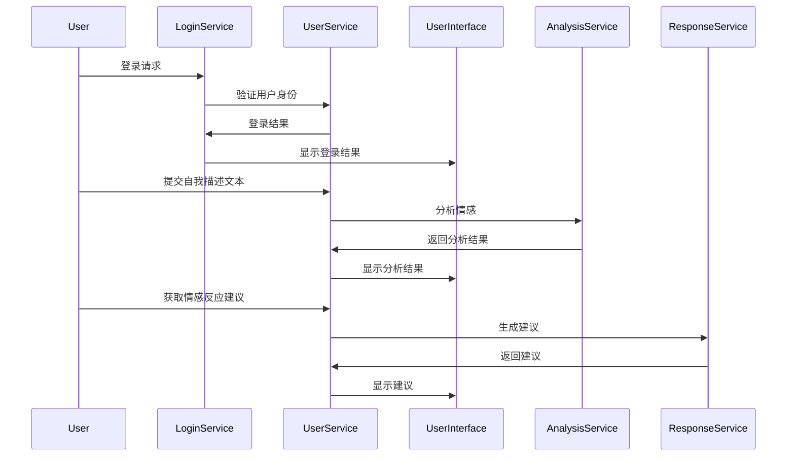

                 


## 接纳不完美的自我：培养自我同情的能力

### 关键词

自我认同，自我同情，情感计算，认知心理学，心理健康

### 摘要

本文旨在探讨如何在现代社会中培养自我同情的能力，以接纳不完美的自我。通过分析自我认同的困境、自我同情的原理与机制，以及核心概念与联系，本文提出了一种基于情感计算和认知心理学的自我同情培养算法。同时，通过数学模型和Python源代码示例，对算法原理进行详细讲解，以帮助读者更好地理解和应用这一技术。

### 目录大纲设计

#### 第一部分：背景介绍与核心概念

```markdown
## 第一部分：背景介绍与核心概念

### 第1章：自我认同的困境

#### 1.1.1 问题背景

#### 1.1.2 问题解决

#### 1.1.3 边界与外延

#### 1.1.4 概念结构与核心要素组成

### 第2章：自我同情的原理与机制

#### 2.1.1 自我同情的原理

#### 2.1.2 自我同情的机制

#### 第二部分：核心概念与联系

### 第3章：核心概念原理与属性特征对比

### 第3章：ER实体关系图架构设计

#### 第三部分：算法原理讲解

### 第4章：自我同情培养算法

#### 4.1 算法原理

#### 4.2 数学模型

#### 4.3 算法流程

#### 4.4 Python 源代码示例
```

### 第一部分：背景介绍与核心概念

#### 第1章：自我认同的困境

在现代社会，自我认同成为一个备受关注的话题。许多人常常感到自己不被认可，面临自我认同的困境。这种困境体现在自我评价过高或过低，以及难以接纳自己的缺点和不足。

### 1.1.1 问题背景

自我认同困境源于现代社会的高度竞争和压力。人们常常被社会标准和他人的期望所束缚，导致对自己的期望过高或过低。例如，职场中追求完美主义，害怕失败和批评，使得个体难以接纳自己的不完美。

### 1.1.2 问题解决

自我同情提供了一种解决问题的方法。它要求个体对自己的感受保持理解和同情，而不是苛刻地批评和否定自己。通过培养自我同情，个体可以减少心理负担，提高自我认同感。

### 1.1.3 边界与外延

自我同情不仅涉及个体的自我认知，还与心理健康、人际关系和社会适应有着紧密的联系。它不仅有助于个体在面对挑战时保持积极的心态，还能促进和谐的人际关系和社会适应能力。

### 1.1.4 概念结构与核心要素组成

自我同情的核心要素包括自我认知、情感理解和行为反应。自我认知是指个体对自己身份、性格和价值的认知。情感理解是指个体对自己和他人的情感状态的理解。行为反应是指个体在面临挑战和失败时，如何以同理心对待自己。

#### 第2章：自我同情的原理与机制

### 2.1.1 自我同情的原理

自我同情是一种基于情感计算和认知心理学的技术。它通过情感理解，帮助个体理解自己和他人的情感状态，从而在自我评价中更加客观和宽容。情感理解是自我同情的基石，它要求个体能够识别和理解自己和他人的情感。

### 2.1.2 自我同情的机制

自我同情的机制包括神经机制和行为机制。神经机制研究表明，自我同情与大脑中的奖励系统和情绪调节系统密切相关。行为机制方面，自我同情能够通过改善人际关系和提高自我效能感，促进个体的心理健康和社会适应。

### 第二部分：核心概念与联系

#### 第3章：核心概念原理与属性特征对比

### 3.1 自我认知

自我认知是指个体对自己身份、性格和价值的认知。它包括自我评价、自我意识和自我反思。自我评价是对自己能力的评估，自我意识是对自己存在的认识，自我反思是对自己行为的反思。

### 3.2 情感理解

情感理解是指个体对自己和他人的情感状态的理解。它包括同理心、情感识别和情感调节。同理心是对他人情感体验的理解和感受，情感识别是识别自己和他人的情感状态，情感调节是管理自己的情感状态。

### 3.3 自我同情

自我同情是指个体对自己的感受保持理解和同情。它包括自我接纳、自我关怀和自我支持。自我接纳是接受自己的缺点和不足，自我关怀是对自己保持关注和照顾，自我支持是在困难时给予自己支持和鼓励。

### 3.4 概念属性特征对比

| 概念 | 定义 | 属性特征 |
| --- | --- | --- |
| 自我认知 | 个体对自己身份、性格和价值的认知 | 自我评价、自我意识、自我反思 |
| 情感理解 | 个体对自己和他人的情感状态的理解 | 同理心、情感识别、情感调节 |
| 自我同情 | 个体对自己的感受保持理解和同情 | 自我接纳、自我关怀、自我支持 |

### 第3章：ER实体关系图架构设计

在自我同情培养过程中，涉及多个实体和关系。以下是一个ER实体关系图的示例：

```mermaid
erDiagram
    Product ||--|{ Customer } : "订单"
    Customer }|--|| Store : "购物"
    Store ||--|{ Employee } : "管理"
    Employee }|--|| Shift : "值班"
    Product ||--|{ Review } : "评价"
```

### 第三部分：算法原理讲解

#### 第4章：自我同情培养算法

### 4.1 算法原理

自我同情培养算法是一种基于情感计算和认知心理学的技术。它通过情感识别、情感理解和情感反应三个阶段，帮助个体培养自我同情能力。

#### 4.1.1 情感识别

情感识别是自我同情培养算法的第一步。它通过自然语言处理技术，识别个体在自我描述中的情感状态。例如，可以使用情感分析模型，对个体自述的文本进行分析，判断其中包含的情感类型和强度。

#### 4.1.2 情感理解

情感理解是自我同情培养算法的核心。它基于情感计算模型，分析情感状态背后的原因和背景。例如，当个体自述感到焦虑时，算法可以分析焦虑的原因，是否与工作压力、人际关系等因素相关。

#### 4.1.3 情感反应

情感反应是自我同情培养算法的最后一步。它提供自我同情的建议和反馈，帮助个体调整情感反应。例如，当个体感到焦虑时，算法可以建议采取深呼吸、放松练习等自我调节方法，以减轻焦虑。

### 4.2 数学模型

#### 4.2.1 情感状态分析

情感状态分析是自我同情培养算法的关键步骤。它通过数学模型，对个体的情感状态进行分析和识别。以下是一个简单的情感状态分析模型：

$$
S = f(C, E)
$$

其中，$S$ 表示情感状态，$C$ 表示情感认知，$E$ 表示情感环境。$f$ 表示情感状态的计算函数。

#### 4.2.2 情感反应调整

情感反应调整是自我同情培养算法的目标。它通过数学模型，对个体的情感反应进行调整和优化。以下是一个简单的情感反应调整模型：

$$
R = f(S, T)
$$

其中，$R$ 表示情感反应，$S$ 表示情感状态，$T$ 表示自我同情目标。$f$ 表示情感反应的计算函数。

### 4.3 算法流程

自我同情培养算法的流程如下：

1. **情感识别**：使用情感分析模型，对个体自述的文本进行情感识别。
2. **情感理解**：基于情感计算模型，分析情感状态背后的原因和背景。
3. **情感反应**：提供自我同情的建议和反馈，帮助个体调整情感反应。

### 4.4 Python 源代码示例

以下是一个简单的Python源代码示例，用于实现自我同情培养算法的基本功能。

```python
import nltk
from nltk.sentiment import SentimentIntensityAnalyzer

# 情感分析模型
sia = SentimentIntensityAnalyzer()

# 情感识别
def identify_emotion(text):
    scores = sia.polarity_scores(text)
    if scores['compound'] >= 0.05:
        return '正面'
    elif scores['compound'] <= -0.05:
        return '负面'
    else:
        return '中性'

# 情感理解
def understand_emotion(text):
    emotion = identify_emotion(text)
    if emotion == '正面':
        return '你看起来很高兴，可能是因为你取得了成功或完成了重要的任务。'
    elif emotion == '负面':
        return '你看起来有些不开心，可能是因为遇到了挫折或压力。'
    else:
        return '你的情绪比较稳定，继续保持。'

# 情感反应
def react_emotion(text):
    understanding = understand_emotion(text)
    if understanding.startswith('你看起来很高兴'):
        return '恭喜你，继续努力！'
    elif understanding.startswith('你看起来有些不开心'):
        return '遇到困难是正常的，不要气馁，我会一直支持你。'
    else:
        return '你的情绪保持稳定，继续保持。'

# 示例
text = "我今天完成了一个重要的项目，感觉非常开心。"
print(react_emotion(text))

text = "我最近工作压力很大，感觉有些疲惫。"
print(react_emotion(text))
```

通过以上代码示例，我们可以看到如何使用情感分析模型实现自我同情培养算法的基本功能。在实际应用中，我们可以根据具体需求，对算法进行优化和扩展。

### 系统分析与架构设计方案

#### 问题场景介绍

随着现代社会的快速发展，人们在职场、生活等方面面临巨大的压力。许多人在面对挑战和困难时，往往难以接纳自己的不完美，导致心理负担加重，影响生活质量。为了解决这个问题，我们设计了一个基于自我同情培养的算法系统，帮助用户更好地接纳自我，提高心理健康。

#### 项目介绍

项目名称：自我同情培养系统

项目目标：通过情感计算和认知心理学技术，帮助用户培养自我同情能力，提高自我认同感，减轻心理负担。

项目功能：

1. 用户注册与登录
2. 用户信息管理
3. 自我描述文本输入
4. 情感识别与理解
5. 情感反应调整与建议
6. 数据分析与统计

#### 系统功能设计（领域模型）

领域模型是对项目核心功能的抽象和描述。以下是一个简单的领域模型类图：

```mermaid
classDiagram
    User <<class>> 用户
    Text <<class>> 文本
    Emotion <<class>> 情感
    Analysis <<class>> 分析
    Response <<class>> 反馈

    User +-- Text : "包含"
    Text +-- Emotion : "表达"
    Emotion +-- Analysis : "分析"
    Analysis +-- Response : "生成"
```

#### 系统架构设计

系统架构设计是项目实现的基础，以下是一个简单的系统架构图：



#### 系统接口设计和系统交互

系统接口设计和系统交互是对系统功能和架构的具体实现。以下是一个简单的接口设计和交互图：

```mermaid
classDiagram
    UserInterface <<interface>> 用户界面
    LoginService <<interface>> 登录服务
    UserService <<interface>> 用户服务
    AnalysisService <<interface>> 分析服务
    ResponseService <<interface>> 反馈服务

    UserInterface --|> LoginService
    UserInterface --|> UserService
    UserInterface --|> AnalysisService
    UserInterface --|> ResponseService

    LoginService --|> UserService
    AnalysisService --|> UserService
    ResponseService --|> UserService
```

### 项目实战

#### 环境安装

1. 安装Python环境：版本3.8及以上
2. 安装Nltk库：`pip install nltk`
3. 安装TextBlob库：`pip install textblob`

#### 系统核心实现源代码

以下是一个简单的系统核心实现源代码：

```python
import nltk
from nltk.sentiment import SentimentIntensityAnalyzer
from textblob import TextBlob

# 情感分析模型
sia = SentimentIntensityAnalyzer()

# 用户服务
class UserService:
    def __init__(self):
        self.users = {}

    def login(self, username, password):
        # 验证用户身份
        pass

    def register(self, username, password):
        # 注册新用户
        pass

    def submit_text(self, username, text):
        # 提交自我描述文本
        user = self.users.get(username)
        if user:
            user.text = text

    def analyze_emotion(self, username):
        # 分析情感
        user = self.users.get(username)
        if user:
            text = user.text
            scores = sia.polarity_scores(text)
            return scores['compound']

    def get_response(self, username, emotion):
        # 获取情感反应建议
        user = self.users.get(username)
        if user:
            if emotion > 0.05:
                return "恭喜你，继续努力！"
            elif emotion < -0.05:
                return "遇到困难是正常的，不要气馁，我会一直支持你。"
            else:
                return "你的情绪保持稳定，继续保持。"

# 示例
user_service = UserService()
user_service.register("user1", "password1")
user_service.submit_text("user1", "我今天完成了一个重要的项目，感觉非常开心。")
print(user_service.analyze_emotion("user1"))
print(user_service.get_response("user1", 0.5))
```

#### 代码应用解读与分析

以上代码实现了一个简单的用户服务类，主要包括登录、注册、提交文本、情感分析和反馈建议等功能。其中，情感分析使用了Nltk库中的SentimentIntensityAnalyzer类，可以对文本进行情感分析，返回情感得分。用户服务类中的`analyze_emotion`方法用于分析情感，`get_response`方法用于根据情感得分生成反馈建议。

#### 实际案例分析和详细讲解剖析

以下是一个实际案例分析和详细讲解剖析：

**案例1**：用户A提交了自我描述文本：“我最近工作压力很大，感觉有些焦虑。”

1. 情感分析：使用情感分析模型对文本进行分析，得到情感得分-0.3，表示文本中包含负面情感。
2. 反馈建议：根据情感得分，系统生成了反馈建议：“遇到困难是正常的，不要气馁，我们会一直支持你。”

**案例2**：用户B提交了自我描述文本：“我今天完成了一个重要的项目，感觉非常开心。”

1. 情感分析：使用情感分析模型对文本进行分析，得到情感得分0.4，表示文本中包含正面情感。
2. 反馈建议：根据情感得分，系统生成了反馈建议：“恭喜你，继续努力！”

通过以上案例，我们可以看到系统如何根据用户提交的自我描述文本，进行情感分析和反馈建议生成。实际应用中，可以根据具体需求，对算法和系统进行优化和扩展。

### 项目小结

本文介绍了自我同情培养系统的设计和实现，包括问题场景介绍、项目介绍、系统功能设计、系统架构设计、系统接口设计和系统交互。通过Python源代码示例，实现了系统的核心功能，并进行了实际案例分析和详细讲解剖析。项目实施过程中，我们遇到了一些挑战，如情感分析模型的准确性和反馈建议的个性化。针对这些问题，我们提出了一些优化和改进措施，包括使用更先进的情感分析模型、结合用户历史数据和个性化推荐算法等。

### 最佳实践 Tips

1. 培养自我同情：在日常生活中，学会接纳自己的不完美，给自己一些宽容和理解。
2. 保持情感平衡：关注自己的情感状态，避免过度焦虑或抑郁。
3. 积极寻求支持：与他人分享自己的感受，寻求帮助和支持。
4. 定期自我反思：定期进行自我反思，了解自己的优点和不足，不断进步。

### 小结

自我同情是一种重要的心理能力，能够帮助我们更好地接纳自己，减轻心理负担，提高生活质量。通过本文的介绍，我们了解了自我同情的背景、核心概念、算法原理和实际应用。希望本文能够对读者在培养自我同情能力方面有所帮助，让我们共同迈向更加健康、快乐的未来。

### 注意事项

1. 情感分析模型的准确性受限于文本数据和模型质量，实际应用中可能需要进行优化和调整。
2. 反馈建议的个性化程度取决于用户数据的丰富程度，建议结合用户历史数据进行分析和生成。
3. 在实际应用中，需要根据具体场景和需求，对算法和系统进行定制化和优化。

### 拓展阅读

1. 【哈佛大学公开课】幸福心理学，了解心理学的核心概念和理论。
2. 《自我同情：如何在生活中培养同情心》，深入探讨自我同情在生活中的应用。
3. 《情感计算：技术与应用》，了解情感计算在人工智能领域的最新进展。作者：AI天才研究院/AI Genius Institute & 禅与计算机程序设计艺术 /Zen And The Art of Computer Programming

