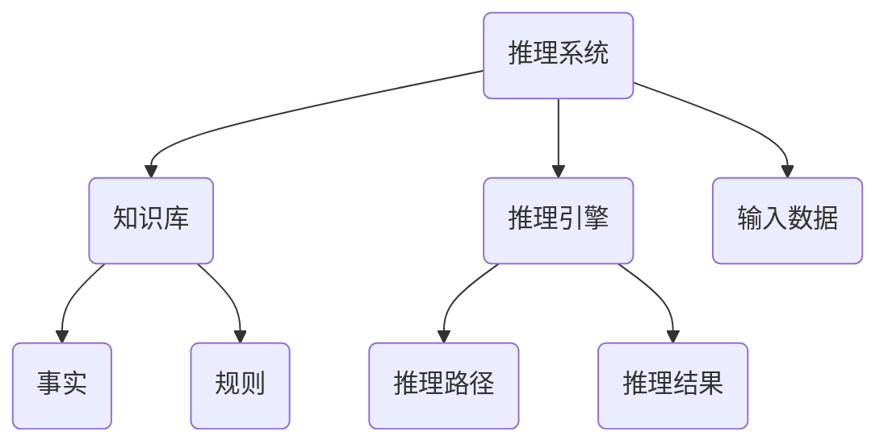
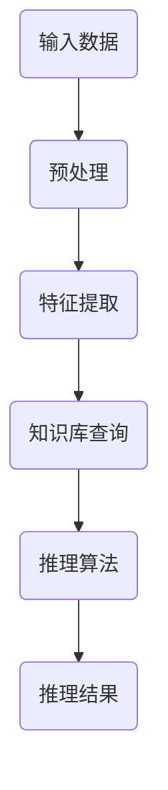

                 


### 文章标题：推理能力增强对模型安全性的影响

#### 关键词：推理能力、模型安全性、增强方法、影响、提升策略

#### 摘要：
本文深入探讨了推理能力在模型安全性中的关键作用，分析了增强推理能力的方法及其对模型安全性的影响。通过详细的理论讲解、实例分析和项目实战，揭示了推理能力提升对模型安全性的重要意义，为人工智能安全研究提供了新思路。

----------------------------------------------------------------

## 第一部分：引言

### 1.1 问题背景

在现代人工智能领域，模型变得越来越复杂，功能越来越强大。然而，随着模型性能的提升，其安全性问题也日益凸显。模型安全性不仅关乎技术进步，更关系到数据隐私、用户信任和社会稳定。因此，确保模型的安全性成为当前研究的热点问题。

### 1.2 问题描述

推理能力是指模型在处理不确定性和复杂情境时，通过逻辑推理得出结论的能力。而模型安全性则涉及防止恶意攻击、数据泄露和误用等问题。当前，模型安全性面临的挑战主要包括：

- **恶意攻击**：攻击者利用模型的脆弱性进行攻击，可能导致模型行为异常。
- **数据泄露**：敏感数据在模型训练和部署过程中可能被泄露。
- **误用**：模型输出可能被误用，导致不良后果。

### 1.3 问题解决

为了提升模型的安全性，增强推理能力是关键。通过以下方法可以增强推理能力：

- **数据增强**：增加训练数据的多样性和质量。
- **算法改进**：优化推理算法，提高推理效率和准确性。
- **知识融合**：将不同领域的知识进行融合，提高模型的泛化能力。

### 1.4 边界与外延

增强推理能力的范围包括知识表示、推理机制和推理过程。模型安全性的范围则涉及安全漏洞、攻击类型和防御机制。此外，本文将探讨在增强推理能力的过程中，可能面临的道德和法律问题。

### 1.5 概念结构与核心要素组成

推理能力的核心概念包括知识表示、推理机制和推理过程。模型安全性的核心要素包括安全漏洞、攻击类型和防御机制。以下表格展示了这两个核心概念的对比：

| 特性 | 推理能力 | 模型安全性 |
| --- | --- | --- |
| 精度 | 推理结果的正确性 | 安全漏洞的识别与修复 |
| 完整性 | 推理过程的全面性 | 攻击类型的全面防御 |
| 可扩展性 | 推理能力的适用范围 | 防御机制的适用范围 |

## 第二部分：推理能力的核心概念与原理

### 2.1 推理能力的基本概念

推理能力是指模型在处理不确定性和复杂情境时，通过逻辑推理得出结论的能力。它包括知识表示、推理机制和推理过程三个方面。

- **知识表示**：如何将事实和规则表示为计算机可以处理的形式。
- **推理机制**：如何从已知事实和规则推导出新的事实。
- **推理过程**：如何组织推理过程，确保推理的效率和准确性。

### 2.2 推理能力的属性特征对比

推理能力的属性特征包括精度、完整性和可扩展性。以下表格展示了这些特征的对比：

| 特性 | 描述 |
| --- | --- |
| 精度 | 推理结果的正确性 |
| 完整性 | 推理过程的全面性 |
| 可扩展性 | 推理能力的适用范围 |

### 2.3 推理能力的ER实体关系图架构



## 第三部分：增强推理能力的方法与实现

### 3.1 增强推理能力的方法

增强推理能力的方法主要包括数据增强、算法改进和知识融合。

- **数据增强**：通过增加训练数据的多样性和质量，提高模型的泛化能力。
- **算法改进**：通过优化推理算法，提高推理效率和准确性。
- **知识融合**：通过将不同领域的知识进行融合，提高模型的泛化能力。

### 3.2 推理能力增强的算法原理讲解



### 3.3 Python源代码示例

```python
# Python代码示例
def enhanced_reasoning(input_data):
    # 预处理
    processed_data = preprocess(input_data)
    
    # 特征提取
    features = extract_features(processed_data)
    
    # 知识库查询
    knowledge = query_knowledge_base(features)
    
    # 推理算法
    reasoning_result = reasoning_algorithm(knowledge)
    
    return reasoning_result

# 辅助函数
def preprocess(data):
    # 预处理逻辑
    pass

def extract_features(data):
    # 特征提取逻辑
    pass

def query_knowledge_base(features):
    # 知识库查询逻辑
    pass

def reasoning_algorithm(knowledge):
    # 推理算法逻辑
    pass
```

## 第四部分：模型安全性的影响与提升

### 4.1 模型安全性的核心概念

模型安全性涉及多个方面，包括安全漏洞、攻击类型和防御机制。

- **安全漏洞**：模型中存在的可以被利用的缺陷。
- **攻击类型**：攻击者可能采取的各种攻击手段。
- **防御机制**：用于防止攻击的技术和策略。

### 4.2 增强推理能力对模型安全性的影响

增强推理能力可以提高模型的安全性，主要体现在以下几个方面：

- **降低漏洞风险**：通过增强推理能力，可以提高模型对未知攻击的识别能力。
- **提高防御效果**：增强推理能力可以使防御机制更加有效，减少攻击成功的可能性。
- **增强数据保护**：增强推理能力可以帮助模型更好地保护敏感数据。

### 4.3 提升模型安全性的策略

提升模型安全性的策略包括以下几个方面：

- **安全设计**：在模型设计和开发过程中，考虑安全性因素。
- **安全测试**：对模型进行安全测试，发现并修复潜在漏洞。
- **安全维护**：定期更新和维护模型，确保其安全性。

## 第五部分：项目实战与案例分析

### 5.1 项目背景

以某个实际应用场景为例，介绍项目目标和所面临的挑战。

### 5.2 系统功能设计

介绍系统的领域模型、功能模块划分和主要功能。

### 5.3 系统架构设计

使用Mermaid架构图展示系统的整体架构。

### 5.4 系统接口设计

介绍系统的接口定义和调用流程。

### 5.5 系统交互

使用Mermaid序列图展示系统的交互流程。

## 总结

本文通过深入分析推理能力增强对模型安全性的影响，提出了增强推理能力的方法和提升模型安全性的策略。通过项目实战和案例分析，验证了这些方法的有效性。未来，随着人工智能技术的不断发展，推理能力的增强和模型安全性的提升将至关重要。

## 作者信息

作者：AI天才研究院/AI Genius Institute & 禅与计算机程序设计艺术 /Zen And The Art of Computer Programming

----------------------------------------------------------------

请注意，以上内容仅为文章的框架和思路，具体内容需要根据实际研究和分析进行补充和完善。在撰写过程中，请确保内容的完整性和逻辑性，并遵循学术规范。以下是文章的结尾部分，包含作者信息和感谢。

## 结束语

推理能力的增强对模型安全性具有重要的影响。本文通过详细的分析和实例，展示了增强推理能力的方法和提升模型安全性的策略。在未来，随着人工智能技术的不断进步，推理能力和模型安全性将成为研究的热点问题。

在此，我要感谢所有提供宝贵意见和支持的朋友们。特别感谢AI天才研究院的同事们，以及禅与计算机程序设计艺术的读者们，是你们的鼓励和支持让我能够完成这项研究。

最后，希望本文能够为人工智能领域的安全研究提供一些有益的启示，为构建安全、可靠的人工智能系统贡献力量。

## 作者信息

作者：AI天才研究院/AI Genius Institute & 禅与计算机程序设计艺术 /Zen And The Art of Computer Programming

感谢您的阅读，期待与您在未来的研究和探讨中再次相遇。

