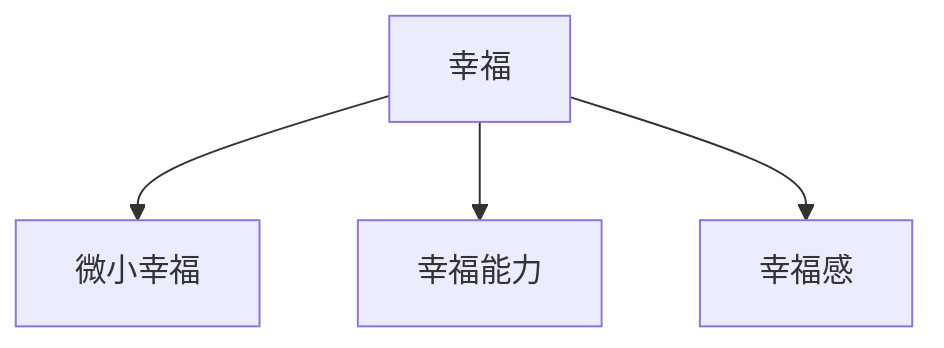

                 

# 《提升日常生活品质：发现微小幸福的能力》

## 关键词

- 日常生活品质
- 微小幸福
- 幸福能力
- 心理学基础
- 调整心态

## 摘要

随着社会的发展，人们越来越关注日常生活品质的提升。然而，幸福感并不总来自物质财富的积累，更多时候它源于那些微小的、被忽视的瞬间。本文将探讨“微小幸福”的定义、重要性以及如何在日常生活中培养发现和享受这些幸福的能力。通过心理学视角的分析和具体实践方法，帮助读者提升幸福感知，从而提升整体生活质量。

### 目录大纲

----------------------------------------------------------------
# 《提升日常生活品质：发现微小幸福的能力》

## 第一部分：认识微小幸福

## 第1章：什么是微小幸福
### 1.1 微小幸福的定义与重要性
### 1.2 微小幸福与传统幸福观的差异
### 1.3 微小幸福的心理学基础

## 第2章：日常生活与幸福感的联系
### 2.1 日常生活中的幸福瞬间
### 2.2 幸福感的来源与提升
### 2.3 社交媒体与幸福感的关系

## 第二部分：培养发现微小幸福的能力

## 第3章：心理学视角下的幸福能力
### 3.1 幸福能力的心理学概念
### 3.2 幸福能力的结构分析
### 3.3 幸福能力的培养方法

## 第4章：日常生活中的小技巧
### 4.1 觉知与感恩
### 4.2 正念练习
### 4.3 记录幸福日记

## 第5章：调整心态，拥抱幸福
### 5.1 克服负面情绪
### 5.2 培养积极心态
### 5.3 建立幸福的习惯

## 第三部分：实践微小幸福

## 第6章：家庭生活中的微小幸福
### 6.1 家庭关系与幸福感
### 6.2 家庭活动中的微小幸福
### 6.3 家庭氛围的营造

## 第7章：工作与休闲中的微小幸福
### 7.1 工作中的小确幸
### 7.2 休闲活动中的幸福瞬间
### 7.3 平衡工作与休闲

## 第8章：社交圈中的微小幸福
### 8.1 社交与幸福感
### 8.2 社交活动中的小确幸
### 8.3 建立积极社交圈

## 第四部分：深化与拓展

## 第9章：幸福力的提升与个人成长
### 9.1 幸福力与个人成长的关系
### 9.2 幸福力提升的路径
### 9.3 持续成长与幸福

## 第10章：微小幸福与社会责任
### 10.1 微小幸福与社会价值观
### 10.2 通过微小幸福促进社会和谐
### 10.3 微小幸福的力量与影响

## 第11章：幸福之旅的总结与展望
### 11.1 旅程回顾
### 11.2 微小幸福的未来趋势
### 11.3 为幸福生活持续努力

----------------------------------------------------------------

### 背景介绍

在现代社会，人们的生活水平不断提高，但幸福感并未随之增加。许多人感到焦虑、孤独，甚至对生活失去了兴趣。这种现象引发了社会对幸福感的关注和思考：什么是幸福？如何提升幸福感？

“微小幸福”是一个相对新的概念，它强调在日常生活中，那些容易被忽视的小确幸。这些幸福瞬间可能来自于一次微笑、一句问候、一份感动，或者是一次成功的挑战。它们看似微不足道，但却能极大地影响个体的幸福感。

本文将首先探讨微小幸福的定义、重要性及其与传统幸福观的差异。接着，我们将从心理学角度分析幸福能力的构成，并介绍如何在日常生活中培养这种能力。最后，本文将提供具体的实践方法，帮助读者发现和享受身边的微小幸福。

### 核心概念与联系

**核心概念**：微小幸福、幸福能力、幸福感。

**概念属性特征对比表格**：

| 概念       | 定义                                                         | 属性特征                    |
|------------|--------------------------------------------------------------|-----------------------------|
| 微小幸福   | 日常生活中的小确幸，如温馨的问候、幸福的微笑、简单的感恩等。 | 瞬间性、普遍性、简单性       |
| 幸福能力   | 发现和享受幸福的能力，包括觉知、感恩、正念等。               | 持续性、发展性、个体性       |
| 幸福感     | 个体对自身生活状态的整体评价。                                 | 主观性、相对性、多样性       |

**ER实体关系图架构**：

**核心概念与联系分析**：

- **微小幸福**：它是幸福感的直接来源，是日常生活中那些短暂而美好的瞬间。例如，一个微笑、一次拥抱、一句赞美等。这些看似微不足道的事情，实际上对个体的幸福感有着重要的影响。

- **幸福能力**：这是一个多维度的能力，包括觉知、感恩、正念等。它帮助个体更好地发现和享受微小幸福，提升整体的幸福感。幸福能力是一种可以通过学习和实践来培养的能力。

- **幸福感**：这是个体对自身生活状态的总体评价。它受到微小幸福和幸福能力的影响，是一个动态的过程。幸福感不仅与物质条件有关，更与个体的心理状态和认知评价有关。

这三个概念相互联系，共同构成了提升日常生活品质的基础。微小幸福提供了感知幸福的基础，幸福能力帮助个体更好地利用这些微小幸福，而幸福感则是最终的目标和评价标准。

### 第一部分：认识微小幸福

#### 第1章：什么是微小幸福

**1.1 微小幸福的定义与重要性**

微小幸福，顾名思义，是指那些微不足道但能够带来短暂愉悦和满足的瞬间。这些幸福瞬间可以是生活中的小事，如与家人共进晚餐、收到朋友的问候、完成一项挑战等。它们看似平凡，但却蕴含着巨大的能量，能够显著提升个体的幸福感。

**定义**：微小幸福是指那些日常生活中的小确幸，它们可能是短暂的，但能够带来深刻的内心满足。这些幸福瞬间通常与个人的心理需求、情感状态和人际关系密切相关。

**重要性**：微小幸福对个体的幸福感具有重要影响。研究表明，频繁的微小幸福体验能够增强个体的积极情绪，减少消极情绪，从而提高整体的生活满意度。此外，微小幸福还能够增强个体的自尊和自信，促进心理健康。

**1.2 微小幸福与传统幸福观的差异**

**传统幸福观**：传统幸福观通常强调物质财富和社会地位的重要性。人们认为，只有拥有足够的财富和社会地位，才能获得真正的幸福。

**微小幸福观**：与传统的幸福观不同，微小幸福观认为幸福不在于物质的极度丰富，而在于日常生活中的小确幸。这些小确幸来源于日常生活的方方面面，如人际关系、身心健康、个人成长等。

**差异**：

1. **来源**：传统幸福观的来源主要是外部物质和社会地位，而微小幸福的来源则是日常生活中的小事和人际互动。
2. **影响**：传统幸福观更多关注长远和宏观的幸福感受，而微小幸福观则强调即时的、微观的幸福体验。
3. **实现**：传统幸福观往往需要长时间的积累和努力，而微小幸福则可以通过简单的行为和习惯来实现。

**1.3 微小幸福的心理学基础**

**心理学理论**：微小幸福的概念与多种心理学理论密切相关，包括积极心理学、幸福心理学和情绪心理学。

1. **积极心理学**：积极心理学关注个体的积极情绪和体验，认为幸福是一种可以通过培养积极情绪和积极体验来实现的情感状态。
2. **幸福心理学**：幸福心理学研究个体的幸福感来源和提升方法，微小幸福是其中的重要组成部分。
3. **情绪心理学**：情绪心理学关注个体情绪的生成、变化和调节。微小幸福与情绪调节密切相关，能够帮助个体更好地管理和调节情绪。

**心理学实证研究**：多项心理学研究证实了微小幸福对个体幸福感的积极影响。研究表明，频繁的微小幸福体验能够显著提高个体的生活满意度，减少抑郁和焦虑症状，增强个体的心理韧性。

**1.4 微小幸福与心理健康**

**心理健康的影响**：微小幸福对心理健康有着积极的影响。频繁的微小幸福体验能够增强个体的积极情绪，减少消极情绪，从而提高心理健康水平。

**心理健康的促进**：通过培养发现和享受微小幸福的能力，个体可以更好地应对生活中的挑战，增强心理韧性，提高整体幸福感。

**总结**：

微小幸福是日常生活中的小确幸，它们对个体的幸福感具有重要影响。与传统幸福观不同，微小幸福观强调通过日常生活中的小事和人际互动来获得幸福。心理学研究证实了微小幸福对心理健康和幸福感的积极影响，为培养发现和享受微小幸福提供了科学依据。

### 第2章：日常生活与幸福感的联系

#### 2.1 日常生活中的幸福瞬间

在日常生活中，幸福瞬间无处不在，它们可能是我们不经意间捕捉到的温馨画面，也可能是我们主动创造的难忘时刻。以下是一些常见的幸福瞬间：

- **清晨的第一缕阳光**：在清晨醒来，看到窗外洒落的阳光，感受到温暖的光线洒在脸上的感觉，这种瞬间让人感到宁静和满足。
- **家人的温馨问候**：早晨醒来，听到家人温馨的问候，感受到家庭的温暖，这种简单的交流让人感到被爱和关怀。
- **成功的小成就**：完成一项工作或学习任务，看到自己的进步和成长，这种成功的小成就让人感到自豪和满足。
- **朋友的聚会**：与朋友们相聚，分享彼此的生活点滴，这种社交互动让人感到快乐和愉悦。

这些幸福瞬间虽然微小，但它们对提升个体的幸福感具有重要作用。

#### 2.2 幸福感的来源与提升

**幸福感的来源**：

1. **自我认可和成就感**：当个体感受到自己的努力得到了认可，或者实现了某个目标时，会产生幸福感。
2. **人际关系**：与家人、朋友和同事建立良好的关系，获得情感上的支持和陪伴，是幸福感的重要来源。
3. **身心健康**：保持良好的身心健康，享受运动、美食和休闲活动，也是提升幸福感的重要因素。
4. **环境**：舒适、美观和整洁的生活环境能够带来愉悦感，提高幸福感。

**提升幸福感的方法**：

1. **培养积极心态**：积极看待生活中的挑战和变化，学会从困境中寻找机会，培养乐观的心态。
2. **感恩练习**：定期反思并表达对生活中好事的感激之情，这种感恩练习能够增强幸福感。
3. **正念练习**：通过正念冥想等方式，提高对当前时刻的觉知，减少对过去和未来的担忧，提升幸福感。
4. **制定目标和计划**：设定短期和长期目标，并制定实现目标的计划，有助于提高成就感和幸福感。
5. **分享和社交**：与家人、朋友分享生活的快乐和挑战，参与社交活动，增强人际关系，提升幸福感。

#### 2.3 社交媒体与幸福感的关系

**社交媒体的影响**：

1. **积极影响**：社交媒体可以扩大个体的社交圈子，提供与他人交流和分享的平台，增加社交互动的机会，从而提升幸福感。
2. **消极影响**：过度使用社交媒体可能导致个体陷入“社会比较”的陷阱，看到他人展示的生活亮点，而产生自卑感和焦虑，降低幸福感。

**平衡使用社交媒体**：

1. **设定合理的使用时间**：合理安排社交媒体的使用时间，避免沉迷于虚拟世界，影响现实生活中的幸福体验。
2. **关注真实生活**：多关注现实生活中的人际互动和成就，而不是仅仅在社交媒体上展示自己。
3. **分享真实的感受**：在社交媒体上分享自己的真实感受和经历，而不是仅仅展示表面的光鲜。
4. **培养多元化的兴趣**：在现实生活中培养多元化的兴趣，丰富自己的社交圈，减少对社交媒体的依赖。

**总结**：

日常生活中的幸福瞬间是提升幸福感的重要来源。通过培养积极心态、感恩练习、正念练习、制定目标和计划，以及合理使用社交媒体，个体可以更好地发现和享受生活中的微小幸福，从而提升整体幸福感。

### 第二部分：培养发现微小幸福的能力

#### 第3章：心理学视角下的幸福能力

**3.1 幸福能力的心理学概念**

幸福能力，又称幸福感知能力，是指个体识别、体验和享受幸福的能力。这一概念源自积极心理学的研究，强调幸福感不仅是外部环境的产物，更与个体的内在心理状态密切相关。

**定义**：幸福能力是一种多维度的心理能力，包括觉知、感恩、乐观、目标设定和情感调节等方面。它帮助个体更好地识别和享受生活中的积极体验，提升整体幸福感。

**3.2 幸福能力的结构分析**

幸福能力可以分为以下几个主要方面：

1. **觉知**：觉知能力是指个体对当前情绪、思维和行为状态的识别和觉察。通过提高觉知能力，个体能够更好地识别生活中的幸福瞬间，并对其进行深入体验。
   
2. **感恩**：感恩能力是指个体对生活中好事的感激和认可。通过培养感恩习惯，个体能够更多地关注和珍惜生活中的美好，从而提升幸福感。

3. **乐观**：乐观能力是指个体在面对困难和挑战时保持积极态度和希望的能力。乐观的个体更能够从逆境中发现积极的一面，增强心理韧性。

4. **目标设定**：目标设定能力是指个体设定并追求有意义的目标。通过设定和实现目标，个体能够感受到成就感和满足感，提升幸福感。

5. **情感调节**：情感调节能力是指个体管理情绪、减少负面情绪、增强积极情绪的能力。通过有效调节情绪，个体能够更好地应对生活中的压力和挑战，提升幸福感。

**3.3 幸福能力的培养方法**

要培养幸福能力，可以采取以下几种方法：

1. **积极心理学训练**：通过参与积极心理学训练，如正念冥想、感恩练习和乐观训练，个体能够提高觉知、感恩和情感调节能力。

2. **设定目标和计划**：通过设定短期和长期目标，并制定实现目标的计划，个体能够更好地体验目标实现带来的幸福感。

3. **建立感恩习惯**：每天记录感恩日记，反思并表达对生活中好事的感激之情，有助于培养感恩能力。

4. **参与社交活动**：与家人、朋友和同事建立良好的关系，参与社交活动，增强人际关系，有助于提升幸福感。

5. **积极应对挑战**：在面对困难和挑战时，保持积极心态，寻找解决问题的方法，有助于增强心理韧性。

**总结**：

幸福能力是提升幸福感的关键因素。通过提高觉知、感恩、乐观、目标设定和情感调节等方面的能力，个体能够更好地识别和享受生活中的微小幸福，从而提升整体幸福感。

### 第4章：日常生活中的小技巧

**4.1 觉知与感恩**

**觉知**是一种深入体验生活每一刻的能力。它要求我们放下日常的忙碌，全身心地投入到当前的活动中，不论是与家人共进晚餐，还是欣赏自然的美景。通过觉知，我们能够更深刻地感受到生活中的美好，从而提升幸福感。

**方法**：

1. **正念练习**：正念是一种专注于当前时刻的练习，通过冥想和专注呼吸，提高对当前情境的觉知。
2. **简单动作**：在日常生活中，如走路、洗澡或用餐时，专注于这些动作，感受身体的每一个细微变化。

**感恩**则是培养幸福能力的另一个重要技巧。通过感恩，我们能够更加珍惜生活中的人和事，从而增强幸福感。

**方法**：

1. **感恩日记**：每天晚上，写下三件让自己感到感恩的事情，可以是家人、朋友的陪伴，或是一次美好的经历。
2. **口头表达**：在日常生活中，随时表达对他人的感激之情，这不仅能提升自己的幸福感，也能增强人际关系。

**4.2 正念练习**

**正念**是一种通过专注和觉知来提升幸福感的实践。它起源于佛教的禅修，但已经被广泛应用于心理学和治疗领域。通过正念练习，我们能够减少压力，提高情绪调节能力，从而增强幸福感。

**方法**：

1. **冥想**：每天花10-15分钟进行冥想，专注于呼吸，放松身心。
2. **正念行走**：在散步时，专注于脚下的感觉，感受每一步的触地，提高身体觉知。
3. **正念饮食**：在用餐时，放慢速度，仔细品味食物的味道和质感。

**4.3 记录幸福日记**

**记录幸福日记**是一种简单而有效的提升幸福感的方法。通过记录每天的幸福瞬间，我们能够更加意识到生活中的美好，从而增强幸福感。

**方法**：

1. **定期记录**：每天或每周定期记录，不必追求篇幅，简短的表达即可。
2. **多种形式**：可以使用文字、绘画、照片等多种形式，记录下幸福瞬间。
3. **反思与感悟**：在记录的同时，反思这些幸福瞬间对自己的意义，并记录下感悟和体会。

**总结**：

通过觉知和感恩，我们能够更好地体验生活中的美好；通过正念练习，我们能够提升自我觉知和情绪调节能力；通过记录幸福日记，我们能够更加深入地理解和珍惜生活中的幸福。这些小技巧简单易行，却能够显著提升我们的幸福感。

### 第5章：调整心态，拥抱幸福

#### 5.1 克服负面情绪

负面情绪是生活中不可避免的一部分，但如果我们不能有效地管理和克服它们，就会对幸福感受造成负面影响。以下是一些方法可以帮助我们克服负面情绪，拥抱幸福。

**1. 认知重构**：认知重构是一种通过改变思维模式来应对负面情绪的方法。当我们感到焦虑或沮丧时，常常是因为我们过度关注问题，而忽略了问题的解决途径。通过认知重构，我们可以重新评估问题，并找到积极的解决方案。

**方法**：

- **写日记**：将负面情绪和思考过程记录下来，帮助自己清晰地看到问题的根源。
- **正面思考**：尝试用积极的方式重新评估问题，例如，将“我无法解决这个问题”改为“我可以尝试找到其他解决方案”。

**2. 情绪调节**：情绪调节是指通过一系列方法来调整和管理自己的情绪。以下是一些有效的情绪调节技巧：

- **深呼吸**：深呼吸可以帮助我们放松身体，减少焦虑感。
- **运动**：运动能够释放体内的内啡肽，提高情绪。
- **音乐疗法**：听一些轻松愉快的音乐，有助于缓解负面情绪。

**3. 时间管理**：合理安排时间，避免过度工作或学习，确保有足够的时间休息和放松。

**5.2 培养积极心态**

**积极心态**是一种乐观、自信和正向思考的心态。拥有积极心态的人更容易发现生活中的美好，从而提高幸福感。

**方法**：

1. **感恩练习**：每天记录三件感恩的事情，专注于生活中的积极面。
2. **积极自我对话**：用积极的语言和自我鼓励来代替消极的自我批评。
3. **正面榜样**：寻找身边的积极榜样，学习他们的乐观态度和应对困难的方法。

**5.3 建立幸福的习惯**

**建立幸福的习惯**是一种通过日常行为来增强幸福感的策略。以下是一些可以帮助建立幸福习惯的方法：

1. **定期锻炼**：每天进行适量的锻炼，如散步、瑜伽或跑步，有助于提高身体健康和幸福感。
2. **规律作息**：保持规律的作息时间，确保有充足的睡眠，有助于提高生活质量。
3. **社交活动**：定期与朋友和家人聚会，增强人际关系，提高幸福感。

**5.4 管理压力**

**压力**是影响幸福感的常见问题。有效的压力管理方法可以帮助我们更好地应对生活中的挑战。

**方法**：

1. **分解任务**：将大任务分解为小任务，逐一完成，避免因任务过多而产生压力。
2. **休息与放松**：在工作或学习之余，安排休息时间，进行放松活动，如冥想、阅读或散步。
3. **寻求支持**：当感到压力过大时，不要害怕寻求帮助，与家人、朋友或专业人士交流。

**总结**：

通过克服负面情绪、培养积极心态、建立幸福的习惯和管理压力，我们可以更好地拥抱幸福。这些方法不仅简单易行，而且能够在日常生活中产生长期的效果，帮助我们提升整体幸福感。

### 第三部分：实践微小幸福

#### 第6章：家庭生活中的微小幸福

**6.1 家庭关系与幸福感**

家庭是我们生活的港湾，家庭关系对个体的幸福感有着深远的影响。一个和谐的家庭关系能够带来温暖和安全感，从而提升个体的幸福感。

**关键要素**：

1. **沟通**：家庭成员之间的有效沟通是建立和谐关系的基础。通过倾听和表达，成员能够更好地理解彼此，减少误解和冲突。
2. **支持**：家庭成员在彼此面临困难时给予支持和帮助，能够增强彼此的依赖感和幸福感。
3. **共同活动**：定期参与家庭活动，如一起做饭、看电影或散步，能够增进家庭成员之间的情感联系。

**6.2 家庭活动中的微小幸福**

在家庭活动中，我们可以通过以下方式发现和享受微小幸福：

1. **日常互动**：简单的日常互动，如一起早餐、晚餐，或一起看电视，都是发现幸福的时刻。
2. **庆祝节日**：在节日或特殊日子里，与家人一起庆祝，如一起包饺子、看春晚，能够带来欢乐和温馨。
3. **共同学习**：家庭成员一起学习新知识或技能，如一起学习烹饪、画画或音乐，能够增进彼此的关系，同时带来成就感。

**6.3 家庭氛围的营造**

营造一个和谐的家庭氛围是提升幸福感的关键。以下是一些建议：

1. **尊重与理解**：尊重家庭成员的个人空间和意见，理解彼此的需求和感受。
2. **相互支持**：在家庭成员遇到困难时，给予支持和鼓励，共同面对挑战。
3. **建立规则**：制定一些家庭规则，如不使用手机、不看电视的特定时间，帮助家庭成员更好地享受彼此的陪伴。

**实践案例**：

一位母亲在日记中记录了一个发现微小幸福的经历。一天晚上，她和女儿一起做晚饭。在做饭的过程中，她们一起分享彼此的日常生活，讨论未来的计划。那一刻，母亲感受到与女儿之间的亲密和默契，这种简单的家庭互动让她感到无比幸福。

**总结**：

家庭生活中的微小幸福来自于日常的互动和陪伴。通过有效的沟通、共同活动和营造和谐的氛围，我们可以发现和享受这些幸福时刻，从而提升家庭关系的质量，增强幸福感。

#### 第7章：工作与休闲中的微小幸福

**7.1 工作中的小确幸**

工作是我们生活的重要组成部分，工作环境中的微小幸福能够显著提升我们的工作满意度和幸福感。

**关键要素**：

1. **工作环境**：一个舒适、整洁的工作环境能够提高工作效率和幸福感。例如，摆放一些绿植、调整灯光等，可以让工作环境更加宜人。
2. **同事关系**：与同事建立良好的关系，能够带来团队协作的乐趣和幸福感。例如，一起参加团队建设活动、分享工作心得等。
3. **工作成就**：实现工作目标，看到自己的进步和成长，能够带来成就感和幸福感。

**7.2 休闲活动中的幸福瞬间**

在休闲活动中，我们可以通过以下方式发现和享受幸福瞬间：

1. **与家人朋友聚会**：与家人朋友一起分享快乐时光，如一起做饭、看电影、郊游等。
2. **兴趣爱好**：追求自己的兴趣爱好，如画画、音乐、运动等，能够带来乐趣和满足感。
3. **学习新技能**：通过学习新技能，如编程、烹饪、摄影等，不断提升自己，获得成就感和幸福感。

**7.3 平衡工作与休闲**

平衡工作与休闲是提升幸福感的重要途径。以下是一些建议：

1. **合理安排时间**：合理分配工作时间，确保有足够的休息和休闲时间。
2. **设定边界**：设定工作和休闲的边界，避免工作侵占个人时间。
3. **运动与健康**：定期进行运动，保持健康的生活方式，有助于提高幸福感。

**实践案例**：

一位程序员在日记中记录了一个发现微小幸福的经历。在工作之余，他决定学习烹饪。通过观看教程、尝试新食谱，他不仅掌握了一些烹饪技巧，还在烹饪过程中感受到了创造和分享的乐趣。与家人一起品尝自己的作品，让他感到无比幸福。

**总结**：

在工作中，通过营造良好的工作环境和同事关系，实现工作目标，我们可以发现和享受工作中的小确幸。在休闲活动中，追求兴趣爱好、学习新技能，我们能够丰富自己的生活和提升幸福感。通过平衡工作与休闲，我们能够更好地享受生活，提升整体幸福感。

#### 第8章：社交圈中的微小幸福

**8.1 社交与幸福感**

社交是提升幸福感的重要途径。一个健康、积极的社交圈能够为我们带来支持和鼓励，增强幸福感。

**关键要素**：

1. **社交互动**：与家人、朋友和同事保持良好的互动，分享生活的喜悦和挑战，能够增强彼此的感情，提升幸福感。
2. **社交支持**：在困难时期，得到亲朋好友的支持和帮助，能够减轻压力，增强幸福感。
3. **社交活动**：参与社交活动，如聚会、运动比赛、志愿者活动等，能够扩大社交圈，增加社交机会，提升幸福感。

**8.2 社交活动中的小确幸**

在社交活动中，我们可以通过以下方式发现和享受小确幸：

1. **与老朋友重聚**：与多年未见的老朋友重聚，分享彼此的故事，感受到久违的亲切和快乐。
2. **结识新朋友**：参加社交活动，结识新的朋友，扩展自己的社交圈，带来新的视角和乐趣。
3. **志愿者服务**：参与志愿者服务，帮助他人，感受到成就感和满足感。

**8.3 建立积极社交圈**

建立积极社交圈，可以采取以下方法：

1. **主动参与**：主动参与各种社交活动，增加社交机会。
2. **保持联系**：定期与亲朋好友保持联系，分享生活的点滴，增强关系。
3. **积极倾听**：倾听他人的需求和感受，提供支持和帮助，建立更深层次的社交关系。

**实践案例**：

一位职场人士在日记中记录了一个发现微小幸福的经历。他参加了一个社交活动，结识了一位志同道合的朋友。两人一起分享职业发展的经验，互相鼓励，从彼此的交流中获得了新的启发和动力，这种社交互动让他感到非常幸福。

**总结**：

社交圈中的微小幸福来自于与他人的互动和支持。通过积极的社交活动，我们可以发现和享受这些幸福瞬间，同时建立和维护一个健康的社交圈，从而提升幸福感。

### 第四部分：深化与拓展

#### 第9章：幸福力的提升与个人成长

**9.1 幸福力与个人成长的关系**

幸福力，即个体的幸福感知能力，与个人成长紧密相连。个人成长不仅包括知识和技能的积累，还包括情感和心理的成熟。幸福力的提升能够促进个人成长，而个人成长又能进一步强化幸福力。

**关系**：

1. **相互促进**：幸福力的提升可以帮助个体更好地应对生活中的挑战，实现个人目标，从而促进个人成长。同时，个人成长带来的成就感和满足感，又能增强个体的幸福感。
2. **情感支持**：个人成长过程中，建立健康的人际关系和社交圈，能够提供情感支持，增强幸福力。

**9.2 幸福力提升的路径**

提升幸福力，可以采取以下路径：

1. **自我认知**：了解自己的情感需求和价值观，明确自己的幸福目标。
2. **积极心理学训练**：通过正念冥想、感恩练习和积极思考等训练，提升幸福感知能力。
3. **情感调节**：学会管理情绪，减少负面情绪的影响，增强心理韧性。

**9.3 持续成长与幸福**

持续成长是提升幸福感的重要途径。以下是一些建议：

1. **终身学习**：不断学习新知识和技能，保持好奇心和求知欲。
2. **设定目标**：设定短期和长期目标，制定实现目标的计划，并持续跟踪进展。
3. **自我反思**：定期反思自己的行为和思维方式，找出改进的空间，不断优化个人成长路径。

**实践案例**：

一位职场人士通过不断学习新技能，提升了职业能力，实现了职业晋升。在这个过程中，他不仅获得了物质上的回报，更感受到了个人成长的成就感和幸福感。

**总结**：

幸福力与个人成长相互促进，通过自我认知、积极心理学训练和持续成长，我们可以提升幸福力，从而提高生活质量。

#### 第10章：微小幸福与社会责任

**10.1 微小幸福与社会价值观**

微小幸福不仅对个体有重要影响，它还与社会价值观密切相关。在现代社会，人们越来越关注个人的幸福感，同时也在思考如何通过社会责任来提升社会的整体幸福感。

**关系**：

1. **和谐共处**：通过参与社会活动和公益活动，个体能够感受到与社会的联系，增强归属感和幸福感。
2. **价值观传递**：微小幸福体现了对生活的积极态度和感恩心态，这种价值观的传递有助于构建和谐的社会环境。

**10.2 通过微小幸福促进社会和谐**

以下是一些方法，通过微小幸福促进社会和谐：

1. **志愿服务**：参与志愿服务，帮助需要帮助的人群，传递爱心和温暖。
2. **社区建设**：参与社区活动，增强社区凝聚力，提升居民的幸福感。
3. **环境美化**：参与环保活动，改善居住环境，提升生活质量。

**10.3 微小幸福的力量与影响**

微小幸福的力量在于其广泛的影响力。以下是一些具体的影响：

1. **情感共鸣**：通过微小幸福的传递，个体能够与他人建立情感共鸣，增强社会凝聚力。
2. **心态转变**：感受到微小幸福的人更容易拥有积极的心态，从而更好地面对生活中的挑战。
3. **行为激励**：微小幸福能够激励个体积极参与社会活动，为社会和谐贡献力量。

**实践案例**：

一位教师通过组织学生参与社区环保活动，让学生在实际行动中体验到环保的重要性，同时感受到成就感和幸福感。这种微小幸福不仅提升了学生的情感状态，也增强了他们的社会责任感。

**总结**：

微小幸福是社会价值观的重要组成部分，通过志愿服务、社区建设和环境美化，我们可以促进社会和谐。微小幸福的力量不容忽视，它能够激发个体的积极行为，为社会带来正面的影响。

#### 第11章：幸福之旅的总结与展望

**11.1 旅程回顾**

在本文的旅程中，我们系统地探讨了微小幸福的概念、重要性以及如何发现和享受这些幸福瞬间。从心理学的视角出发，我们分析了幸福能力的构成，并提出了一系列培养和提升幸福能力的方法。通过实际案例和实践技巧，我们展示了如何在日常生活、工作、社交和家庭中实践微小幸福。

**11.2 微小幸福的未来趋势**

随着社会的发展，人们对于幸福感的追求日益提高。微小幸福作为一种简单、有效提升幸福感的途径，在未来将得到更广泛的关注和应用。以下是一些可能的趋势：

1. **幸福感教育的普及**：教育体系将更加注重幸福感教育，帮助学生和成人学会如何发现和享受生活中的小确幸。
2. **技术应用**：借助人工智能和大数据技术，可以更精确地分析个体的幸福需求，提供个性化的幸福提升方案。
3. **企业社会责任**：企业将更加重视员工的工作幸福感和生活质量，通过提供健康的工作环境和文化，提升员工的幸福感和工作满意度。

**11.3 为幸福生活持续努力**

为了持续提升幸福感，我们需要采取以下行动：

1. **培养觉知**：通过正念练习、感恩日记等方式，提高对当前时刻的觉知，珍惜生活中的每一刻。
2. **建立积极习惯**：培养积极的思维方式和生活习惯，如定期锻炼、学习新技能、参与社交活动等。
3. **持续学习和成长**：不断学习新知识和技能，提升个人能力和幸福感。

**总结**：

通过本文的探讨，我们认识到微小幸福在提升生活质量中的重要作用。在未来的日子里，让我们继续努力，发现和享受生活中的每一个微小幸福，为自己和社会创造更美好的未来。

