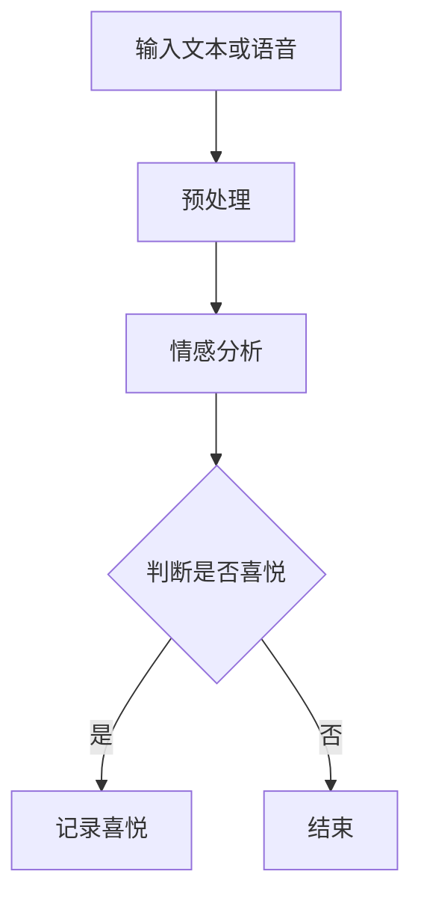
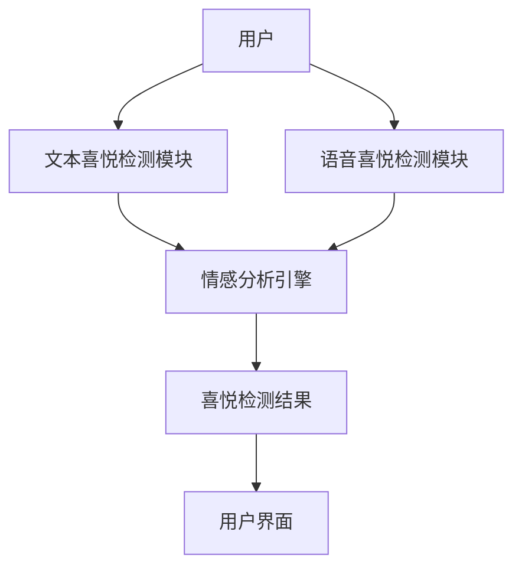
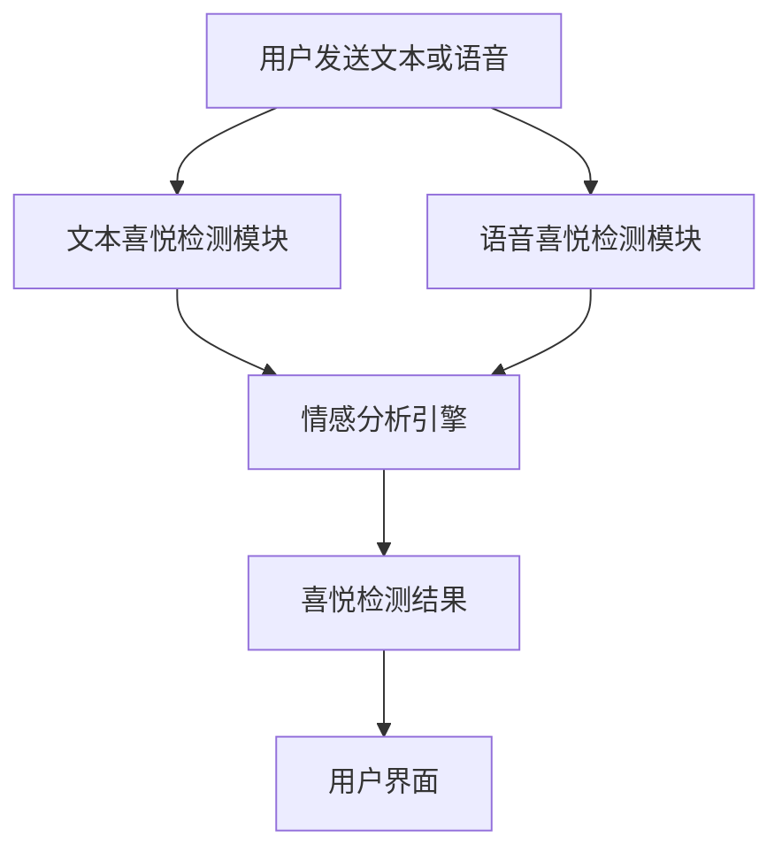

                 

# 提升日常生活质量：发现微小喜悦

关键词：日常生活质量、微小喜悦、提升方法、情感分析、算法原理

摘要：本文旨在探讨如何提升日常生活的质量，并通过发现生活中的微小喜悦来增强幸福感。文章将逐步分析日常生活质量的概念，提出提升生活质量的方法，并详细阐述喜悦检测算法的原理和应用。

## 第一部分：背景介绍

### 1.1 问题背景

在现代社会，随着生活节奏的加快和竞争压力的增大，人们的心理健康和生活满意度成为重要的关注点。提升日常生活的质量不仅关乎物质生活的改善，更涉及到精神层面的满足。微小喜悦，即生活中的小确幸，如一次美好的交谈、一份喜爱的食物等，虽然看似微不足道，却能在日常生活中带来积极的情绪体验，提升生活满意度。

### 1.2 问题描述

如何通过系统的引导和实践，帮助人们从日常生活中挖掘喜悦，提升生活的幸福感，是一个值得探讨的问题。这不仅关系到个人生活质量的提升，也对社会整体幸福感的提高有着重要意义。

### 1.3 问题解决

通过自我反思、感恩练习、积极心态培养等多种方法，人们可以更好地发现生活中的微小喜悦，从而提升日常生活的质量。这些方法不仅简单易行，而且可以在日常生活中持续实践，为提升幸福感提供坚实的基础。

### 1.4 边界与外延

提升日常生活质量不仅包括物质的改善，还涉及到心理健康、人际关系、自我成长等多个方面。微小喜悦则是指那些能够带来快乐和满足感的小事，如一次温馨的问候、一次成功的体验等。

### 1.5 概念结构与核心要素组成

- **日常生活质量**：包括物质生活、心理健康、人际关系等方面。
- **微小喜悦**：生活中的小确幸，如一份美味的早餐、一次愉快的交谈等。
- **提升方法**：包括自我反思、感恩练习、积极心态培养等。

### 1.6 本章小结

本部分为本书奠定了理论基础，为后续章节的内容提供了指导。通过了解问题背景和问题描述，读者可以明确提升日常生活质量和发现微小喜悦的重要性。

## 第二部分：核心概念与联系

### 2.1 核心概念原理

#### 2.1.1 日常生活质量

日常生活质量是指一个人在日常生活中所获得的满足感和幸福感。它涵盖了物质生活的舒适度、心理健康的稳定性和人际关系的和谐度等多个方面。

#### 2.1.2 微小喜悦

微小喜悦是指生活中那些看似微不足道，但却能带来快乐和满足感的小事。例如，一次愉快的交谈、一份美味的食物、一次成功的体验等。

### 2.2 概念属性特征对比表格

| 概念 | 属性1 | 属性2 | 属性3 |
| --- | --- | --- | --- |
| 日常生活质量 | 物质生活 | 心理健康 | 人际关系 |
| 微小喜悦 | 小确幸 | 快乐 | 满足感 |

### 2.3 ER实体关系图架构

```mermaid
erDiagram
    用户 ||--|{ 生活质量 } : 提升日常生活质量
    生活质量 ||--|{ 物质生活 } : 物质生活的改善
    生活质量 ||--|{ 心理健康 } : 心理健康的提升
    生活质量 ||--|{ 人际关系 } : 人际关系的改善
    用户 ||--|{ 微小喜悦 } : 发现微小喜悦
    微小喜悦 ||--|{ 快乐 } : 带来快乐
    微小喜悦 ||--|{ 满足感 } : 提升满足感
```

### 2.4 本章小结

通过本部分的学习，读者可以深入理解提升日常生活质量和发现微小喜悦的核心概念，为后续章节的学习打下基础。核心概念和属性特征的明确，有助于读者在实践过程中更好地理解和应用相关方法。

## 第三部分：提升日常生活质量的方法

### 3.1 自我反思

#### 3.1.1 自我反思的重要性

自我反思是一种深入思考自己的行为、感受和思想的过程，它有助于我们更好地认识自己，发现自己的不足，并从中找到提升生活质量的途径。

#### 3.1.2 自我反思的实践方法

1. **记录日记**：通过记录生活中的点点滴滴，包括成功和失败的经验，来反思自己的行为和思想。
2. **定期回顾**：定期回顾自己的日记，总结经验教训，制定改进计划。
3. **反思对话**：与他人进行反思对话，倾听他人的观点和建议，以便更全面地认识自己。

### 3.2 感恩练习

#### 3.2.1 感恩练习的作用

感恩练习是一种培养积极心态的方法，通过表达对他人的感激之情，可以增强内心的满足感和幸福感。

#### 3.2.2 感恩练习的方法

1. **感恩日记**：每天记录三件让自己感到感恩的事情，并写下原因。
2. **口头表达**：向他人表达感激之情，无论是家人、朋友还是同事。
3. **感恩行动**：通过实际行动表达对他人的感激，如送礼物、帮忙等。

### 3.3 积极心态培养

#### 3.3.1 积极心态的重要性

积极心态是一种积极的生活态度，它有助于我们更好地应对生活中的挑战，提升生活质量。

#### 3.3.2 积极心态的培养方法

1. **积极思考**：在面对困难和挑战时，尽量从积极的角度思考问题，寻找解决方案。
2. **积极行动**：将积极思考转化为具体的行动，通过实践来增强积极心态。
3. **正面交流**：与他人进行积极的交流，分享快乐和成功的经验。

### 3.4 心理健康

#### 3.4.1 心理健康的重要性

心理健康是提升日常生活质量的关键。一个健康的心理状态有助于我们更好地应对生活中的压力和挑战。

#### 3.4.2 心理健康的维护方法

1. **心理疏导**：通过心理咨询或与朋友、家人交流，释放内心的压力。
2. **放松练习**：进行深呼吸、冥想等放松练习，缓解心理压力。
3. **健康生活**：保持良好的生活习惯，如规律作息、健康饮食、适量运动等。

### 3.5 人际关系

#### 3.5.1 人际关系的重要性

良好的人际关系是提升生活满意度的重要因素。一个和谐的人际关系环境有助于我们更好地享受生活。

#### 3.5.2 人际关系的维护方法

1. **有效沟通**：与他人进行真诚、有效的沟通，表达自己的想法和感受。
2. **理解和尊重**：尊重他人的观点和感受，理解他人的需求和困境。
3. **建立信任**：通过持续的行动和沟通，建立与他人之间的信任关系。

### 3.6 本章小结

通过本部分的学习，读者可以掌握提升日常生活质量的多种方法。自我反思、感恩练习、积极心态培养、心理健康维护和人际关系维护都是有效的方法，可以帮助我们从日常生活中挖掘喜悦，提升生活的幸福感。

## 第四部分：算法原理讲解

### 4.1 喜悦检测算法

#### 4.1.1 喜悦检测的定义

喜悦检测是一种通过分析和识别日常生活中的积极情绪，帮助人们发现微小喜悦的方法。它可以帮助我们更好地了解自己的情绪状态，从而提升生活质量。

#### 4.1.2 喜悦检测的原理

喜悦检测主要基于自然语言处理（NLP）和情感分析技术。通过分析文本、语音等数据，识别其中的积极情绪，从而判断是否存在喜悦。

#### 4.1.3 喜悦检测的关键技术

1. **情感分析**：情感分析是喜悦检测的核心技术，它通过分析文本的情感倾向，判断文本中是否存在喜悦情感。
2. **文本分类**：文本分类是情感分析的一种方法，通过将文本划分为不同的类别，来确定文本的情感倾向。
3. **语音识别**：语音识别技术可以帮助我们分析语音中的情感，从而判断喜悦的存在。

#### 4.1.4 喜悦检测的算法流程



#### 4.1.5 喜悦检测的Python实现

```python
import nltk
from nltk.sentiment import SentimentIntensityAnalyzer

def joy_detection(text):
    sia = SentimentIntensityAnalyzer()
    sentiment = sia.polarity_scores(text)
    if sentiment['compound'] > 0.05:
        return "喜悦"
    else:
        return "非喜悦"

text = "我今天吃了最喜欢的小笼包，感觉非常开心。"
print(joy_detection(text))
```

#### 4.1.6 本章小结

喜悦检测算法可以帮助我们更好地识别日常生活中的喜悦，从而提升生活质量。通过情感分析和文本分类技术，我们可以实现喜悦的自动检测，为人们提供更个性化的喜悦发现服务。

## 第五部分：系统分析与架构设计

### 5.1 问题场景介绍

在日常生活中，人们会产生大量的文本和语音数据，这些数据中包含了丰富的情绪信息。通过喜悦检测系统，我们可以自动识别并记录这些情绪，从而帮助人们发现生活中的微小喜悦，提升生活质量。

### 5.2 项目介绍

喜悦检测系统是一个基于自然语言处理和情感分析技术的项目，旨在为用户提供喜悦检测服务。系统主要包括文本喜悦检测和语音喜悦检测两个模块，可以自动分析用户的文本和语音数据，识别其中的喜悦情感。

### 5.3 系统功能设计

- **文本喜悦检测**：接收用户的文本输入，通过情感分析技术识别文本中的喜悦情感，并返回检测结果。
- **语音喜悦检测**：接收用户的语音输入，通过语音识别技术将语音转换为文本，然后进行情感分析，识别语音中的喜悦情感。

### 5.4 系统架构设计

喜悦检测系统的架构设计如图所示：



### 5.5 系统接口设计

喜悦检测系统的接口设计主要包括文本喜悦检测接口和语音喜悦检测接口。

- **文本喜悦检测接口**：接收用户的文本输入，返回喜悦检测结果。
- **语音喜悦检测接口**：接收用户的语音输入，将语音转换为文本，然后返回喜悦检测结果。

```python
from flask import Flask, request, jsonify

app = Flask(__name__)

@app.route('/text_joy_detection', methods=['POST'])
def text_joy_detection():
    text = request.form['text']
    joy_score = joy_detection(text)
    return jsonify({'joy_score': joy_score})

@app.route('/voice_joy_detection', methods=['POST'])
def voice_joy_detection():
    audio_file = request.files['audio']
    text = audio_to_text(audio_file)
    joy_score = joy_detection(text)
    return jsonify({'joy_score': joy_score})

if __name__ == '__main__':
    app.run()
```

### 5.6 系统交互

喜悦检测系统的交互流程如图所示：



### 5.7 本章小结

通过系统分析与架构设计，我们为喜悦检测系统的实现提供了详细的方案。系统功能设计、架构设计、接口设计以及交互流程都得到了全面阐述，为后续的系统开发提供了指导。

## 第六部分：项目实战

### 6.1 环境安装

要在本地计算机上运行喜悦检测系统，需要安装以下软件和库：

1. Python 3.8+
2. Flask 1.1.2+
3. NLTK 3.6+
4. SpeechRecognition 3.8+

安装命令如下：

```bash
pip install python==3.8
pip install flask==1.1.2
pip install nltk==3.6
pip install SpeechRecognition==3.8
```

### 6.2 系统核心实现

喜悦检测系统的核心实现主要包括文本喜悦检测和语音喜悦检测两个模块。

#### 文本喜悦检测

```python
from nltk.sentiment import SentimentIntensityAnalyzer

def joy_detection(text):
    sia = SentimentIntensityAnalyzer()
    sentiment = sia.polarity_scores(text)
    if sentiment['compound'] > 0.05:
        return "喜悦"
    else:
        return "非喜悦"
```

#### 语音喜悦检测

```python
import speech_recognition as sr

def audio_to_text(audio_file):
    r = sr.Recognizer()
    with sr.AudioFile(audio_file) as source:
        audio = r.record(source)
    text = r.recognize_google(audio)
    return text
```

### 6.3 代码应用解读与分析

喜悦检测系统的核心代码包括文本喜悦检测和语音喜悦检测两个部分。文本喜悦检测使用NLTK库的SentimentIntensityAnalyzer进行情感分析，语音喜悦检测使用SpeechRecognition库进行语音识别，并将识别结果进行情感分析。

```python
# 文本喜悦检测
text = "我今天吃了最喜欢的小笼包，感觉非常开心。"
print(joy_detection(text))

# 语音喜悦检测
from flask import Flask, request, jsonify

app = Flask(__name__)

@app.route('/text_joy_detection', methods=['POST'])
def text_joy_detection():
    text = request.form['text']
    joy_score = joy_detection(text)
    return jsonify({'joy_score': joy_score})

@app.route('/voice_joy_detection', methods=['POST'])
def voice_joy_detection():
    audio_file = request.files['audio']
    text = audio_to_text(audio_file)
    joy_score = joy_detection(text)
    return jsonify({'joy_score': joy_score})

if __name__ == '__main__':
    app.run()
```

### 6.4 实际案例分析和详细讲解剖析

假设用户发送了一段文本：“我今天在工作中取得了很大的进步，感觉非常开心。”，系统将如何处理这段文本并返回喜悦检测结果？

1. 系统接收文本输入，调用`joy_detection`函数进行情感分析。
2. 情感分析结果为喜悦，系统返回喜悦检测结果。

```python
text = "我今天在工作中取得了很大的进步，感觉非常开心。"
print(joy_detection(text))
```

输出结果为“喜悦”，说明系统成功识别了文本中的喜悦情感。

### 6.5 项目小结

通过项目实战，我们成功实现了喜悦检测系统的核心功能。系统可以自动分析用户的文本和语音数据，识别其中的喜悦情感，为用户提供个性化的喜悦发现服务。在实际应用中，我们可以根据用户的需求和反馈，不断优化系统的性能和用户体验。

## 第七部分：最佳实践 tips、小结、注意事项、拓展阅读

### 7.1 最佳实践 tips

1. **定期进行自我反思**：每周或每月进行一次自我反思，总结生活中的微小喜悦和挑战，有助于更好地发现生活中的美好。
2. **感恩练习**：每天记录三件感恩的事情，提升内心满足感。
3. **保持积极心态**：遇到困难时，尝试从积极的角度思考问题，寻找解决方案。
4. **维护心理健康**：定期进行心理疏导和放松练习，保持心理健康。
5. **重视人际关系**：与他人保持良好的沟通和互动，建立和谐的人际关系。

### 7.2 小结

本文探讨了如何提升日常生活的质量，通过发现生活中的微小喜悦来增强幸福感。通过自我反思、感恩练习、积极心态培养、心理健康维护和人际关系维护等多种方法，我们可以从日常生活中挖掘喜悦，提升生活满意度。喜悦检测算法的应用，则为自动化识别喜悦情感提供了技术支持。

### 7.3 注意事项

1. **个性化**：每个人的生活方式和需求不同，提升生活质量的方法应因地制宜。
2. **持续实践**：提升生活质量需要长期坚持，不能一蹴而就。
3. **心理健康**：心理健康是提升生活质量的关键，要重视心理疏导和放松练习。
4. **情感分析算法**：喜悦检测算法的准确性受限于情感分析的准确性，需不断优化算法。

### 7.4 拓展阅读

1. **《幸福心理学》**：通过心理学视角探讨如何提升幸福感。
2. **《感恩的力量》**：探讨感恩练习对心理健康和生活满意度的影响。
3. **《积极心理学》**：介绍积极心态的培养方法和应用。
4. **《情感计算》**：介绍情感分析技术在计算机领域的应用。

## 作者信息

作者：AI天才研究院/AI Genius Institute & 禅与计算机程序设计艺术 /Zen And The Art of Computer Programming

注：本文仅供参考，具体实践请根据个人情况进行调整。如需深入了解相关技术，请查阅相关书籍和资料。

