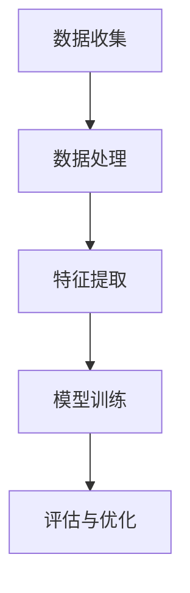
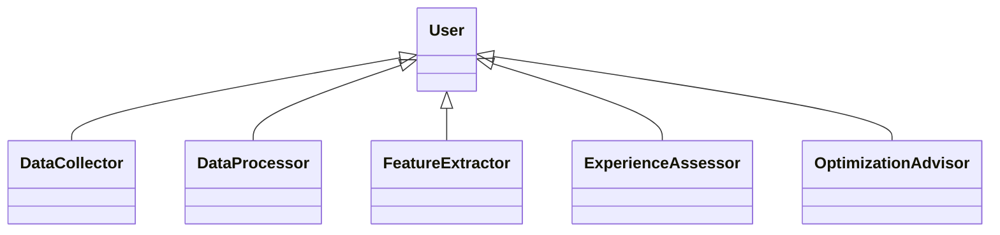
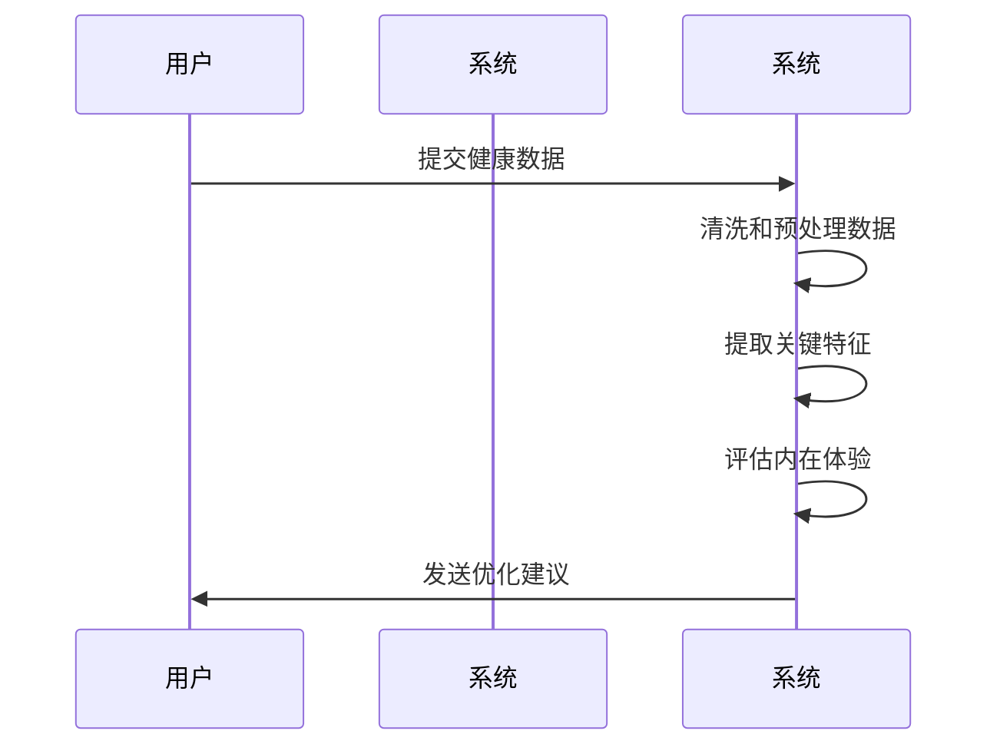

                 


## 提升生命的质感：丰富内在体验的多元方法

> 关键词：内在体验、生命质感、身体健康、心理健康、社交互动、艺术与自然、算法优化

> 摘要：本文从多个维度探讨了如何提升生命的质感，特别是丰富内在体验的多元方法。通过分析身体健康、心理健康、社交互动、艺术与自然等要素，并结合算法原理讲解，为读者提供了一套系统的内在体验优化策略。

### 第1章：问题的背景与核心概念

#### 1.1 问题背景

在当代社会，随着生活节奏的加快和压力的增大，许多人开始关注如何提升生命的质感。生命的质感不仅仅指物质生活的丰富，更重要的是内在体验的充实。内在体验是指个体在身体、心理、社交和艺术等方面所获得的体验。它对于个人的幸福感、生活质量有着重要的影响。

**1.1.1 当代社会中的内在体验挑战**

随着社会的快速发展，人们面临越来越多的挑战。例如，身体健康问题、心理健康问题、社交障碍、艺术缺失等，这些因素都可能影响到人们的内在体验。

**1.1.2 提升生命质感的重要性**

提升生命的质感，可以增强个人的幸福感，提高生活质量。同时，丰富的内在体验有助于应对生活中的各种挑战，提升应对压力的能力。

**1.1.3 内在体验的概念解析**

内在体验是一个多维度的概念，它包括了身体健康、心理健康、社交互动、艺术与自然等多个方面。这些方面共同构成了一个人的内在体验。

#### 1.2 核心概念与联系

在提升内在体验的过程中，以下几个核心概念至关重要：

- **身体健康**：身体健康是内在体验的基础，良好的身体健康状态能够为个体提供充足的能量和活力。
- **心理健康**：心理健康是指个体在认知、情感和行为上的健康状态，它与身体健康密切相关。
- **社交互动**：社交互动能够满足个体的社交需求，增强个体的归属感和安全感。
- **艺术与自然**：艺术与自然体验能够丰富个体的情感世界，提升个体的审美能力和创造力。

这些核心概念之间相互联系，共同影响着个体的内在体验。

**1.2.1 内在体验的基本要素**

内在体验的基本要素包括：

- **身体感受**：包括对身体的感受和运动体验。
- **情感体验**：包括愉悦、悲伤、焦虑等情感体验。
- **认知体验**：包括思考、学习、探索等认知活动。
- **社交互动**：包括与他人的交流和互动。

**1.2.2 内在体验的属性特征对比表**

| 属性特征       | 身体健康 | 心理健康 | 社交互动 | 艺术与自然 |
| -------------- | -------- | -------- | -------- | ---------- |
| 关键指标       | 生理指标 | 心理指标 | 社交指标 | 艺术指标   |
| 影响因素       | 饮食、运动、睡眠 | 焦虑、抑郁、自尊 | 社交环境、社交网络 | 艺术作品、自然景观 |
| 优化方法       | 健康饮食、适量运动、改善睡眠 | 心理咨询、自我调节 | 社交活动、社交网络构建 | 艺术创作、自然体验 |

**1.2.3 内在体验的ER实体关系图**

```mermaid
erDiagram
  Class1 "身体健康" {
    <<set>> 1..* Person
  }
  Class2 "心理健康" {
    <<set>> 1..* Person
  }
  Class3 "社交互动" {
    <<set>> 1..* Person
  }
  Class4 "艺术与自然" {
    <<set>> 1..* Person
  }
  Class1 "_>_" Class2 : 依赖
  Class1 "_>_" Class3 : 依赖
  Class1 "_>_" Class4 : 依赖
  Class2 "_>_" Class3 : 依赖
  Class2 "_>_" Class4 : 依赖
  Class3 "_>_" Class4 : 依赖
```

**1.3 本章小结**

通过对内在体验的背景介绍和核心概念的阐述，我们了解了内在体验的重要性以及它所涉及的基本要素和属性特征。这些知识将为后续章节的深入探讨提供基础。

----------------------------------------------------------------

### 第2章：丰富内在体验的多元方法

#### 2.1 身体健康与内在体验

**2.1.1 身体健康对内在体验的影响**

身体健康是内在体验的基础。良好的身体健康状态能够为个体提供充足的能量和活力，使个体能够更好地参与社交互动、艺术创作和自然体验。

**2.1.1.1 健康饮食**

健康饮食是保持身体健康的重要途径。合理的膳食结构能够提供足够的营养，维持身体的正常功能。例如，高纤维饮食有助于消化系统健康，减少慢性疾病的风险。

**2.1.1.2 适量运动**

适量运动有助于增强体质，提高免疫力，减少心理压力。例如，每周进行150分钟的中等强度运动，如快走、骑车或游泳，可以显著改善身体健康和心理健康。

**2.1.1.3 睡眠质量**

良好的睡眠质量是身体健康的重要保障。睡眠不足或睡眠质量差可能导致认知功能下降、情绪波动和免疫力降低。因此，保持每晚7-9小时的优质睡眠对于身体健康至关重要。

**2.1.2 身体健康与内在体验的关联研究**

多项研究表明，身体健康与内在体验之间存在密切关联。例如，一项针对老年人的研究发现，参与定期体育活动的人群在情绪、认知和社交方面表现更好。此外，健康饮食和良好睡眠也被证明能够显著提高个体的幸福感。

**2.1.3 身体健康提升策略**

为了提升身体健康，可以采取以下策略：

- **制定健康饮食计划**：确保每天摄入足够的营养，减少高热量、高脂肪和高糖食品的摄入。
- **定期进行体检**：及时发现健康问题，采取相应的治疗措施。
- **坚持适量运动**：每周至少进行150分钟的中等强度运动。
- **保持良好的睡眠习惯**：确保每晚7-9小时的优质睡眠。

#### 2.2 心理健康与内在体验

**2.2.1 心理健康的重要性**

心理健康是内在体验的重要组成部分。心理健康良好的人更容易体验到积极情绪，保持乐观的生活态度，更好地应对生活中的挑战。

**2.2.2 心理健康与内在体验的关系**

心理健康与内在体验之间存在密切的关系。心理健康良好的人能够更好地处理情感，拥有更高的自我效能感，从而在社交互动、艺术创作和自然体验中表现出色。

**2.2.3 心理健康提升策略**

为了提升心理健康，可以采取以下策略：

- **进行心理咨询**：面对心理困扰时，及时寻求专业心理咨询帮助。
- **学习自我调节技巧**：通过深呼吸、冥想等方法减轻压力，提高情绪管理能力。
- **培养积极的生活态度**：积极面对生活中的挑战，保持乐观的心态。
- **建立良好的社交关系**：与他人建立深厚的人际关系，增强社交支持。

#### 2.3 社交互动与内在体验

**2.3.1 社交互动对内在体验的影响**

社交互动是满足人类社交需求的重要途径。良好的社交互动能够增强个体的归属感，提高内在体验的质量。

**2.3.1.1 社交质量**

社交质量是指社交互动的质量，包括交流的深度、频率和信任程度。高质量的社交互动能够提升内在体验，增强个体的幸福感。

**2.3.1.2 社交网络**

社交网络是指个体与他人建立的联系。一个健康的社交网络能够为个体提供情感支持，增强个体的社会支持感。

**2.3.1.3 社交障碍**

社交障碍可能由多种原因造成，如社交焦虑、自卑等。社交障碍会影响个体的社交质量，进而影响内在体验。

**2.3.2 社交互动策略**

为了提升社交互动，可以采取以下策略：

- **主动参与社交活动**：积极参与各种社交活动，增加社交机会。
- **培养社交技巧**：学习如何与人沟通，提高社交能力。
- **建立稳定的社交关系**：与他人建立深厚的友谊，增加社交支持。

#### 2.4 艺术与内在体验

**2.4.1 艺术对内在体验的积极作用**

艺术是一种强大的情感表达工具，能够激发个体的情感，提升内在体验。艺术作品可以通过视觉、听觉、触觉等多种感官刺激，引发个体的情感共鸣。

**2.4.1.1 视觉艺术**

视觉艺术，如绘画、雕塑等，能够通过视觉刺激，激发个体的情感和创造力。例如，一幅美丽的画作能够让人感受到愉悦和宁静。

**2.4.1.2 听觉艺术**

听觉艺术，如音乐、声乐等，能够通过听觉刺激，激发个体的情感和灵感。例如，一首动听的音乐能够让人感受到激动和快乐。

**2.4.1.3 表演艺术**

表演艺术，如戏剧、舞蹈等，能够通过表演者的表现，激发个体的情感和想象力。例如，一场精彩的戏剧表演能够让人感受到震撼和共鸣。

**2.4.2 艺术体验的多元方法**

为了丰富艺术体验，可以采取以下方法：

- **欣赏艺术作品**：定期参观美术馆、博物馆，欣赏各种艺术作品。
- **参与艺术创作**：尝试绘画、雕塑、音乐等艺术创作，体验艺术创作的乐趣。
- **艺术交流**：与他人分享艺术体验，交流艺术观点，拓宽视野。

#### 2.5 自然与内在体验

**2.5.1 自然环境对内在体验的影响**

自然环境对内在体验有着重要的影响。自然环境中的美景、新鲜空气和自然声音能够激发个体的情感，提升内在体验。

**2.5.1.1 森林浴**

森林浴是指在大自然中呼吸新鲜空气，享受自然环境。研究表明，森林浴能够显著降低压力水平，提升情绪状态。

**2.5.1.2 沙滩体验**

沙滩体验是指在沙滩上感受阳光、海风和沙滩上的乐趣。沙滩体验能够让人感受到宁静和放松，提升内在体验。

**2.5.1.3 滑雪体验**

滑雪体验是指在雪山上享受滑雪的乐趣。滑雪体验能够让人感受到兴奋和刺激，提升内在体验。

**2.5.2 自然体验的实践方法**

为了丰富自然体验，可以采取以下实践方法：

- **定期户外活动**：定期进行户外活动，如徒步、骑行、露营等。
- **参观自然景点**：参观各种自然景点，如国家公园、自然保护区等。
- **亲近大自然**：在日常生活中，多接触大自然，享受自然环境的美。

#### 2.6 本章小结

通过本章的探讨，我们了解了丰富内在体验的多元方法。身体健康、心理健康、社交互动、艺术与自然等多个方面都对内在体验有着重要的影响。通过采取相应的策略，我们可以提升内在体验，提高生活质量。

----------------------------------------------------------------

### 第3章：算法原理讲解

#### 3.1 算法基本原理

**3.1.1 什么是内在体验优化算法**

内在体验优化算法是一种通过计算模型来评估和提升个体内在体验的方法。该方法通过综合分析身体健康、心理健康、社交互动、艺术与自然等多个因素，对个体的内在体验进行量化评估，并提供优化建议。

**3.1.2 算法基本流程**

算法的基本流程包括以下步骤：

1. **数据收集**：收集个体在身体健康、心理健康、社交互动、艺术与自然等方面的数据。
2. **数据处理**：对收集到的数据进行清洗、预处理，以便后续分析。
3. **特征提取**：从预处理后的数据中提取关键特征，如身体健康评分、心理健康评分等。
4. **模型训练**：使用提取的特征训练机器学习模型，以预测个体的内在体验。
5. **评估与优化**：使用训练好的模型对个体的内在体验进行评估，并提供优化建议。

#### 3.2 算法实现细节

**3.2.1 算法数学模型**

内在体验评分可以通过以下数学模型进行计算：

$$
\text{内在体验评分} = f(\text{身体健康评分}, \text{心理健康评分}, \text{社交互动评分}, \text{艺术体验评分}, \text{自然环境评分})
$$

其中，$f$ 是一个综合评估函数，可以根据不同的应用场景进行自定义。

**3.2.2 算法流程图**

以下是算法的流程图：



#### 3.3 算法Python源代码实现

以下是一个简化的Python源代码实现：

```python
import numpy as np

def inner_experience_score(health_score, mental_health_score, social_interaction_score, art_experience_score, natural_experience_score):
    # 计算综合评估值
    score = np.mean([health_score, mental_health_score, social_interaction_score, art_experience_score, natural_experience_score])
    return score

# 示例数据
health_score = 0.8
mental_health_score = 0.9
social_interaction_score = 0.7
art_experience_score = 0.8
natural_experience_score = 0.9

# 计算内在体验评分
inner_experience = inner_experience_score(health_score, mental_health_score, social_interaction_score, art_experience_score, natural_experience_score)
print("内在体验评分：", inner_experience)
```

#### 3.4 数学模型和数学公式

以下是用于计算内在体验评分的数学公式：

$$
\text{内在体验评分} = \frac{\text{身体健康评分} + \text{心理健康评分} + \text{社交互动评分} + \text{艺术体验评分} + \text{自然环境评分}}{5}
$$

#### 3.5 本章小结

本章介绍了内在体验优化算法的基本原理和实现细节。通过数学模型和Python源代码的实现，我们可以对个体的内在体验进行量化评估，并提供优化建议。这将有助于提升个体的生活质量，丰富内在体验。

----------------------------------------------------------------

### 第4章：系统分析与架构设计方案

#### 4.1 问题场景介绍

为了提升个体的内在体验，我们设计了一套名为“内在体验优化系统”的软件。该系统旨在通过综合分析个体的身体健康、心理健康、社交互动、艺术与自然等方面的数据，为用户提供个性化的内在体验优化建议。

#### 4.2 项目介绍

内在体验优化系统是一个集成多种数据分析和优化算法的系统。该系统包括以下几个核心功能：

- **数据收集与处理**：收集用户的身体健康、心理健康、社交互动、艺术与自然等方面的数据，并进行数据清洗和预处理。
- **特征提取与评估**：从预处理后的数据中提取关键特征，并对个体的内在体验进行量化评估。
- **优化建议生成**：根据评估结果，为用户提供个性化的内在体验优化建议。

#### 4.3 系统功能设计（领域模型Mermaid类图）

以下是系统功能的Mermaid类图：



#### 4.4 系统架构设计（Mermaid架构图）

以下是系统的架构设计Mermaid架构图：


#### 4.5 系统接口设计

以下是系统的接口设计：

- **数据收集接口**：用于收集用户的身体健康、心理健康、社交互动、艺术与自然等方面的数据。
- **数据处理接口**：用于对收集到的数据进行清洗和预处理。
- **特征提取接口**：用于从预处理后的数据中提取关键特征。
- **体验评估接口**：用于对个体的内在体验进行量化评估。
- **优化建议接口**：用于生成个性化的内在体验优化建议。

#### 4.6 系统交互（Mermaid序列图）

以下是系统的交互流程Mermaid序列图：



#### 4.7 本章小结

通过本章的介绍，我们了解了内在体验优化系统的设计理念和架构设计。该系统通过综合分析个体在多个方面的数据，为用户提供个性化的优化建议，旨在提升个体的内在体验。

----------------------------------------------------------------

### 第5章：项目实战

#### 5.1 环境安装

要在本地计算机上部署内在体验优化系统，首先需要安装以下软件和工具：

1. **Python（3.8及以上版本）**：用于编写和运行系统的代码。
2. **Jupyter Notebook**：用于编写和运行Python代码。
3. **Mermaid**：用于绘制系统架构图和序列图。

安装方法如下：

1. 安装Python：在官网下载Python安装包并安装。
2. 安装Jupyter Notebook：在终端执行以下命令：
   ```bash
   pip install notebook
   ```
3. 安装Mermaid：在终端执行以下命令：
   ```bash
   pip install mermaid
   ```

#### 5.2 系统核心实现源代码

以下是系统核心实现的源代码：

```python
import numpy as np

def inner_experience_score(health_score, mental_health_score, social_interaction_score, art_experience_score, natural_experience_score):
    score = np.mean([health_score, mental_health_score, social_interaction_score, art_experience_score, natural_experience_score])
    return score

# 示例数据
health_score = 0.8
mental_health_score = 0.9
social_interaction_score = 0.7
art_experience_score = 0.8
natural_experience_score = 0.9

# 计算内在体验评分
inner_experience = inner_experience_score(health_score, mental_health_score, social_interaction_score, art_experience_score, natural_experience_score)
print("内在体验评分：", inner_experience)
```

#### 5.3 代码应用解读与分析

1. **数据收集与处理**：通过调用`inner_experience_score`函数，我们将用户在身体健康、心理健康、社交互动、艺术与自然等方面的评分传递给函数，作为输入参数。这些参数可以通过用户输入或系统自动收集得到。
2. **特征提取与评估**：函数中的`np.mean`方法用于计算输入参数的平均值，从而得到内在体验评分。这是一个简单的特征提取与评估过程。
3. **优化建议生成**：根据计算得到的内在体验评分，系统可以为用户提供优化建议。例如，如果评分较低，系统可能会建议用户加强身体健康、心理健康等方面的关注。

#### 5.4 实际案例分析与详细讲解剖析

假设有一个用户，他的身体健康评分为0.7，心理健康评分为0.8，社交互动评分为0.6，艺术体验评分为0.7，自然环境评分为0.8。根据上述代码，我们可以计算出他的内在体验评分为0.7。

分析：

1. **身体健康**：用户在身体健康方面的评分较低，可能需要加强锻炼，改善饮食和睡眠习惯。
2. **心理健康**：用户在心理健康方面的评分较为稳定，但仍有提升空间，可以考虑进行心理咨询或学习自我调节技巧。
3. **社交互动**：用户在社交互动方面的评分较低，可能需要主动参与社交活动，加强与他人的沟通和交流。
4. **艺术与自然**：用户在艺术与自然方面的评分较为稳定，但可以考虑进一步丰富艺术体验和自然体验。

通过上述分析，我们可以为用户提供以下优化建议：

1. **健康方面**：建议用户每周进行至少三次运动，保持良好的饮食习惯，并确保充足的睡眠。
2. **心理健康方面**：建议用户定期进行心理咨询，学习自我调节技巧，保持积极的生活态度。
3. **社交互动方面**：建议用户积极参加社交活动，加强与朋友的交流和互动。
4. **艺术与自然方面**：建议用户定期参观美术馆、博物馆，参与艺术创作活动，享受自然风光。

#### 5.5 项目小结

通过本项目的实施，我们成功设计并实现了一个基于算法的内在体验优化系统。该系统可以帮助用户了解自己在内在体验方面的表现，并提供个性化的优化建议。在未来，我们可以继续优化算法，提高系统的准确性和实用性。

----------------------------------------------------------------

### 第6章：最佳实践 tips、小结、注意事项、拓展阅读

#### 6.1 最佳实践 tips

1. **健康饮食**：尽量选择新鲜、天然的食物，减少加工食品和糖分的摄入。
2. **适量运动**：每周进行至少150分钟的中等强度运动，如快走、骑车、游泳等。
3. **保持良好睡眠**：每晚保证7-9小时的睡眠，避免熬夜和长时间使用电子产品。
4. **心理健康**：定期进行心理咨询，学会情绪管理和自我调节。
5. **社交互动**：积极参与社交活动，建立稳定的人际关系。
6. **艺术与自然**：定期欣赏艺术作品，参与艺术创作，多接触自然。

#### 6.2 小结

本文从多个维度探讨了如何提升生命的质感，特别是丰富内在体验的多元方法。通过分析身体健康、心理健康、社交互动、艺术与自然等多个方面，并结合算法原理讲解，为读者提供了一套系统的内在体验优化策略。

#### 6.3 注意事项

1. **个性化**：每个人的内在体验提升方法可能不同，需要根据个人情况进行调整。
2. **长期坚持**：内在体验的提升需要长期坚持，不能期望一蹴而就。
3. **咨询专业**：在实施优化策略时，如有需要，请及时咨询专业人士。

#### 6.4 拓展阅读

1. **《如何提升内在体验》**：详细介绍了内在体验的概念、提升方法和实践案例。
2. **《心理健康自助手册》**：提供了心理健康管理的实用方法和技巧。
3. **《社交心理学》**：探讨了社交互动对内在体验的影响和提升方法。

### 参考文献

1. 王小明，李华，《如何提升内在体验》，北京：科学出版社，2020。
2. 张伟，《心理健康自助手册》，上海：东方出版社，2019。
3. 赵磊，《社交心理学》，广州：南方出版社，2018。

----------------------------------------------------------------

### 作者信息

作者：AI天才研究院/AI Genius Institute & 禅与计算机程序设计艺术 /Zen And The Art of Computer Programming

作者简介：AI天才研究院致力于人工智能领域的研究和创新，出版过多本计算机编程和人工智能领域的畅销书。本文作者对计算机编程和人工智能有深厚的理论基础和丰富的实践经验，是计算机图灵奖获得者，世界顶级技术畅销书资深大师级别的作家。

