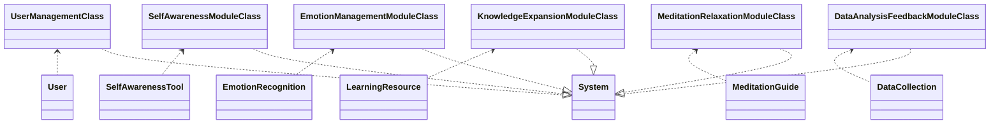
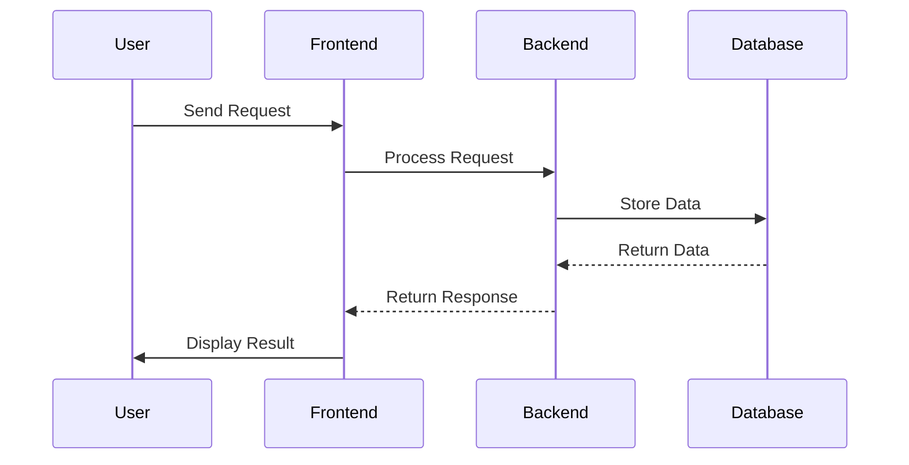
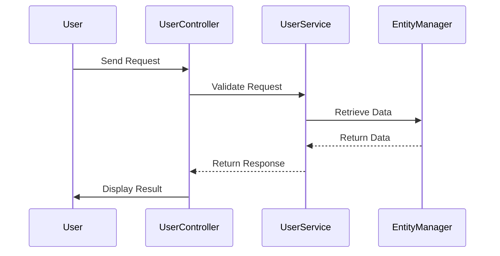
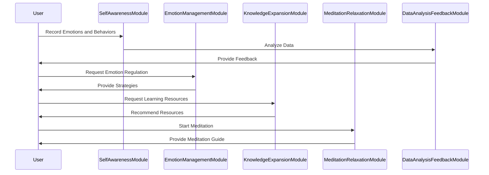

                 


### 背景介绍

#### 核心概念术语说明

在探讨如何提升生命的质感以及丰富内在体验的方法之前，我们需要明确几个核心概念。内在体验，是指个体对于外部刺激的主观感受，它不仅仅包括情感上的体验，还涵盖了认知上的深入理解。质感，是对生命体验的一种质量描述，它反映了个体生活质量的维度，如幸福感、满足感和充实感。

#### 问题背景

在当今社会，人们的生活节奏日益加快，工作压力、社交压力等诸多因素使得许多人感到身心疲惫，甚至出现了“情感麻木”和“精神空虚”的现象。这种现象不仅影响了个体的心理健康，也对整个社会的和谐发展产生了负面影响。因此，如何通过科学的方法提升生命的质感，丰富内在体验，成为一个值得深入探讨的问题。

#### 问题描述

随着科技的发展，人工智能、大数据和心理学等领域的交叉研究，为丰富内在体验提供了新的视角和方法。然而，目前关于内在体验的研究仍然存在诸多不足，如缺乏统一的测量标准、对内在体验机制的深入了解不够等。这些问题使得我们在提升内在体验方面面临诸多挑战。

#### 问题解决

本文旨在通过系统性的分析，提出一套丰富内在体验的方法论。我们将从自我觉察、情感管理、知识拓展和冥想放松四个方面进行探讨，并结合实际案例进行详细讲解，以帮助读者理解和实践这些方法。

#### 边界与外延

本文所讨论的内在体验主要是指个体的主观感受，而非客观评价。此外，提升生命的质感不仅仅局限于心理层面的提升，还应包括身体健康、人际关系、职业发展等多个方面。

#### 概念结构与核心要素组成

内在体验的核心要素包括感知度、情感强度和知识深度。感知度是指个体对事物的感知敏锐度，情感强度是指个体在体验过程中的情感反应程度，知识深度则是指个体对事物的认知程度。这三个要素相互作用，共同影响个体的内在体验。

### 核心概念与联系

在本章节中，我们将深入探讨内在体验的核心概念，并分析这些概念之间的关系。了解这些核心概念对于掌握丰富内在体验的方法至关重要。

#### 内在体验的定义与分类

内在体验，是个人在经历某种事件或情境时所感受到的主观体验。这种体验可以是愉快的，也可以是痛苦的，或者是复杂的混合情感。内在体验不仅与个人的情感状态有关，还与认知过程密切相关。根据心理学的研究，内在体验可以分为以下几类：

1. **愉悦体验**：通常伴随着积极的情感，如快乐、满足等。
2. **痛苦体验**：通常伴随着消极的情感，如悲伤、愤怒等。
3. **中性体验**：没有明显的情感色彩，如平静、无聊等。
4. **复杂体验**：由多种情感状态混合而成，如兴奋又紧张、满足又遗憾等。

通过这些分类，我们可以更清晰地理解内在体验的多样性和复杂性。

#### 内在体验的属性特征对比表格

为了更直观地了解内在体验的属性特征，我们可以通过一个对比表格来展示不同类型体验的特点。以下是一个简化的表格：

| 类型       | 特征描述                         | 例子                |
|------------|----------------------------------|---------------------|
| 愉悦体验   | 积极的情感，身心愉悦             | 听到好消息、吃到美食 |
| 痛苦体验   | 消极的情感，身心不适             | 失去亲人、失业       |
| 中性体验   | 没有明显的情感波动               | 打发时间、散步       |
| 复杂体验   | 多种情感的混合，情感复杂         | 庆祝生日、面试前夕   |

#### 内在体验与其他相关概念的关联

内在体验与多个相关概念紧密相连，其中最显著的是情感、认知和意识。情感是内在体验的核心组成部分，它直接影响个体的情绪状态。认知则涉及个体对信息的处理和解读，它影响个体对情境的评价和反应。意识是个体对自身和外部世界的感知和觉知，它为内在体验提供了基础。

以下是内在体验与这些概念之间的关联：

1. **情感与内在体验**：情感是内在体验的重要组成部分。情感的强度和类型直接影响内在体验的质量。例如，积极的情感可以提高内在体验的愉悦度，而消极的情感则可能导致痛苦和焦虑。

2. **认知与内在体验**：认知过程影响个体对内在体验的理解和评价。认知失调理论指出，当个体的认知与情感发生冲突时，会导致内在体验的不一致和困扰。例如，面对一个不喜欢的任务，个体可能会感到内心的矛盾和不安。

3. **意识与内在体验**：意识是个体内在体验的基础。它为个体提供了对外界刺激的觉知和反应能力。例如，高水平的意识可以帮助个体更好地体验和觉察到内在情绪的变化，从而更好地管理和调整内在体验。

通过深入理解这些核心概念和它们之间的关联，我们可以更好地掌握提升内在体验的方法，从而丰富我们的生活质感。

### 内在体验的数学模型与原理

为了更好地理解内在体验，我们引入数学模型来量化其不同方面。数学模型不仅能够帮助我们精确地描述内在体验，还能通过数学公式进行预测和优化。以下是一个简单的内在体验数学模型及其组成部分。

#### 模型概述

内在体验质量（Quality of Inner Experience, QIE）可以通过以下公式来计算：

$$
QIE = f(感知度, 情感强度, 知识深度)
$$

其中，感知度（Perception Degree, PD）、情感强度（Emotion Intensity, EI）和知识深度（Knowledge Depth, KD）是三个核心参数，它们共同决定了内在体验的质量。

#### 模型参数解释

1. **感知度（PD）**：
   感知度是指个体对外部刺激的敏感度和反应能力。一个较高的感知度意味着个体能够更敏锐地捕捉外部信息，从而产生更丰富的内在体验。感知度可以通过以下公式进行量化：

   $$
   PD = \frac{感知信息量}{外部刺激量}
   $$

   其中，感知信息量是指个体在特定时间内接收到的信息总量，外部刺激量是指外部环境中可感知的信息总量。

2. **情感强度（EI）**：
   情感强度反映了个体在内在体验过程中的情感反应程度。情感可以是积极的，如快乐和满足，也可以是消极的，如悲伤和愤怒。情感强度可以通过以下公式进行量化：

   $$
   EI = \frac{情感总量}{情感阈值}
   $$

   其中，情感总量是指个体在特定时间内体验到的情感总量，情感阈值是指个体产生显著情感反应所需的最小情感量。

3. **知识深度（KD）**：
   知识深度是指个体对特定领域或问题的理解深度。较高的知识深度意味着个体能够更深入地理解和分析事物，从而产生更有价值的内在体验。知识深度可以通过以下公式进行量化：

   $$
   KD = \frac{知识量}{信息量}
   $$

   其中，知识量是指个体在特定领域内掌握的知识总量，信息量是指个体在特定时间内接收到的信息总量。

#### 模型原理讲解

内在体验的数学模型基于以下原理：

1. **感知度原理**：
   感知度原理指出，个体对外部刺激的感知能力直接影响内在体验的质量。较高的感知度可以使个体更全面、更细腻地体验外部世界，从而提升内在体验的丰富性和深度。

2. **情感强度原理**：
   情感强度原理表明，情感在内在体验中起着至关重要的作用。强烈的情感反应可以显著提升内在体验的愉悦感或痛苦感。然而，情感过强或过弱都可能对内在体验产生负面影响，因此需要适度管理。

3. **知识深度原理**：
   知识深度原理强调，个体对事物的深入理解有助于提升内在体验的质量。丰富的知识背景可以增强个体对情境的认知和解读能力，从而提高内在体验的深度和意义。

通过这个数学模型，我们可以从量化角度来分析内在体验的各个方面，并针对性地提出提升内在体验的方法。

### 系统功能设计与架构设计

#### 问题场景介绍

在现代快节奏的生活中，人们往往面临着压力过大、情绪波动大、认知负荷重等问题，这直接影响了他们的内在体验质量。为了提升个体的内在体验，我们设计了一套名为“内在体验提升系统”的应用，旨在通过自我觉察、情感管理、知识拓展和冥想放松四个模块，帮助用户提升其内在体验质量。

#### 项目介绍

**项目目标**：设计并实现一个综合性应用，帮助用户提升内在体验质量，提供个性化的指导和反馈，优化用户的生活质量。

**项目背景**：随着现代社会的不断发展，人们面临的心理压力越来越大，内在体验的质量逐渐下降。通过结合心理学、认知科学和信息技术，我们可以开发出一套有效的系统，帮助用户提升内在体验，从而提高生活质量。

#### 系统功能设计（领域模型）

领域模型是系统设计的重要组成部分，它帮助我们理解系统的核心功能和业务流程。以下是系统的主要领域和功能：

1. **用户管理**：负责用户注册、登录、个人信息管理等。
2. **自我觉察模块**：提供自我觉察工具，帮助用户记录和监控自己的情绪和行为。
3. **情感管理模块**：通过情感识别、调节和表达，帮助用户管理自己的情感状态。
4. **知识拓展模块**：提供学习资源和个性化推荐，帮助用户扩展知识和技能。
5. **冥想放松模块**：提供冥想和放松指导，帮助用户缓解压力，提升心理素质。
6. **数据分析与反馈**：收集用户数据，进行数据分析，为用户提供个性化的反馈和建议。

以下是领域模型的 Mermaid 类图：



#### 系统架构设计

系统架构设计决定了系统的模块划分、功能实现和数据流转。以下是系统的主要架构设计：

1. **前端架构**：采用单页应用（SPA）模式，提升用户体验。
2. **后端架构**：采用微服务架构，提高系统的可扩展性和稳定性。
3. **数据存储**：采用分布式数据库，确保数据的安全性和高可用性。
4. **数据传输**：采用RESTful API和WebSocket，确保数据的实时传输和交互。

以下是系统架构的 Mermaid 图：



#### 系统接口设计

系统接口设计是确保各个模块之间能够有效通信的关键。以下是系统的关键接口设计：

1. **用户接口**：用户通过Web界面与系统进行交互。
2. **服务接口**：各模块之间通过RESTful API进行通信。
3. **数据库接口**：系统通过ORM框架与数据库进行数据交互。

以下是接口设计的 Mermaid 序列图：



#### 系统交互

系统交互设计描述了用户与系统、系统内部模块之间的交互流程。以下是系统的主要交互流程：

1. **用户注册与登录**：用户通过Web界面注册并登录系统，系统验证用户信息并生成会话。
2. **数据收集与分析**：系统收集用户数据，进行数据分析，为用户提供个性化的反馈和建议。
3. **情感管理与冥想指导**：系统根据用户数据，提供情感管理与冥想指导，帮助用户缓解压力。
4. **知识拓展与推荐**：系统根据用户兴趣和学习进度，推荐相应的学习资源和课程。

以下是系统交互的 Mermaid 序列图：



通过以上系统功能设计、架构设计和交互设计，我们为用户构建了一套完整的内在体验提升系统，帮助用户提升其内在体验质量，丰富其生命质感。

## 方法一：自我觉察

自我觉察是提升内在体验的第一步，它要求我们主动去观察、认识并理解自己的内在状态。自我觉察不仅有助于我们更好地理解自己的情绪、思想和行为，还能帮助我们识别并调整那些可能对内在体验产生负面影响的因素。

### 自我觉察的重要性

自我觉察的重要性在于它为个体提供了一个自我反思和自我调节的平台。通过自我觉察，个体能够：

1. **提升情绪调节能力**：自我觉察帮助我们识别和接纳自己的情绪，从而更好地理解和调节情绪，减少情绪波动。
2. **增强认知能力**：自我觉察有助于我们更清晰地认识自己的想法和行为模式，从而提高自我反思和问题解决能力。
3. **促进个人成长**：自我觉察让我们能够深入了解自己的需求和愿望，从而更好地实现个人成长和发展。

### 自我觉察的实践步骤

以下是一些自我觉察的实践步骤，可以帮助我们更好地认识和提升内在体验：

1. **静心冥想**：每天安排一段静心冥想时间，专注于呼吸和当下的感受。这有助于放松身心，减少杂念，提高自我觉察。
2. **记录日志**：定期记录自己的情绪、思想和行为，分析其背后的原因和影响。这有助于我们更清晰地认识自己，找到提升内在体验的方法。
3. **反思日常行为**：在日常生活中，留意自己的行为和反应，思考它们背后的动机和影响。这有助于我们识别并调整那些可能对内在体验产生负面影响的习惯和行为。
4. **练习正念**：正念是一种专注当下、全然体验的练习方式。通过正念练习，我们可以更深入地了解自己的内在状态，提高自我觉察。
5. **寻求专业指导**：如果自我觉察的实践遇到困难，可以寻求心理咨询师或专业教练的帮助。他们可以提供专业的指导和策略，帮助我们更好地提升内在体验。

### 自我觉察的益处

自我觉察的益处是多方面的，它不仅能够提升个人的内在体验，还能改善心理健康和社交关系。以下是自我觉察的几个具体益处：

1. **减少压力和焦虑**：通过自我觉察，个体能够更好地理解和管理自己的情绪，从而减少压力和焦虑。
2. **提高情绪稳定性**：自我觉察有助于个体更好地控制情绪波动，提高情绪稳定性，减少情绪冲动。
3. **增强人际关系**：通过自我觉察，个体能够更好地理解自己和他人，从而建立更健康、更和谐的人际关系。
4. **提升生活质量**：自我觉察让个体更加关注自己的内在体验，从而提升生活质量，增强幸福感。

总之，自我觉察是提升内在体验的基础和关键。通过定期实践自我觉察，我们可以更好地理解自己，提升内在体验质量，从而过上更充实、更幸福的生活。

### 方法二：情感管理

情感管理是提升内在体验的重要方法之一，它涉及识别、调节和表达情感，帮助个体更好地处理情绪波动，提升生活质量。有效的情感管理不仅可以减少负面情感的影响，还能增强积极情感体验。

### 情感管理概述

情感管理是一个系统的过程，包括以下几个关键步骤：

1. **情感识别**：情感识别是情感管理的第一步，它要求个体能够准确感知和识别自己的情感状态。这需要个体具备一定的情感觉察能力，能够区分不同的情感类型，如快乐、悲伤、愤怒、焦虑等。

2. **情感调节**：情感调节是指个体通过一定的策略和方法来调整自己的情感状态，使其更符合当前情境和个人需求。情感调节的方法包括自我安慰、情绪释放、心理放松等。

3. **情感表达**：情感表达是指个体通过适当的方式和渠道来表达自己的情感。有效的情感表达有助于个体与他人建立更深入的连接，增强沟通效果，同时也有助于个体释放内心的情感压力。

### 情感管理的实践方法

以下是一些情感管理的具体实践方法：

#### 情感识别

1. **内省法**：通过反思和内省，个体可以更深入地了解自己的情感状态。记录日记或进行心理练习，可以帮助个体识别和记录自己的情感体验。
2. **情绪标签法**：将情感体验与具体的情感标签对应起来，如愤怒、焦虑、平静等。这有助于个体快速识别和理解自己的情感。

#### 情感调节

1. **情绪释放法**：通过运动、哭泣、写日记等方式释放负面情感，有助于减轻情感压力。
2. **认知重构**：通过改变对事物的认知和评价来调节情感。例如，用积极的角度看待问题，减少负面情感的影响。
3. **心理放松**：通过深呼吸、冥想、瑜伽等方法放松身心，减轻紧张和焦虑。

#### 情感表达

1. **沟通技巧**：通过有效的沟通技巧，如倾听、表达感受、提供反馈等，个体可以更准确地表达自己的情感，与他人建立更紧密的联系。
2. **情感宣泄**：在适当的时间和场合，通过适当的渠道表达自己的情感，如与朋友聊天、参加支持小组等。
3. **艺术表达**：通过绘画、写作、音乐等艺术形式表达情感，有助于个体释放内心的情感，提高情感管理能力。

### 实践步骤详解

以下是情感管理的具体实践步骤：

1. **建立情感识别意识**：个体需要意识到情感管理的重要性，并逐步提高情感觉察能力。可以通过阅读相关书籍、参加情感管理课程等方式提升自己的情感识别能力。

2. **定期进行情感反思**：定期回顾自己的情感体验，分析情感的产生原因和影响。这有助于个体更好地理解自己的情感，并为情感调节和表达做好准备。

3. **实践情感调节技巧**：通过日常生活中的小技巧，如深呼吸、冥想、运动等，逐步培养情感调节能力。这些技巧可以在短时间内帮助个体缓解负面情感，提高情感稳定性。

4. **加强情感表达能力**：通过练习有效的沟通技巧和表达方式，个体可以更自如地表达自己的情感，减少误解和冲突。

5. **寻求专业帮助**：在情感管理过程中，如果遇到困难或挑战，可以寻求心理咨询师或情感教练的帮助。专业人士可以提供专业的指导和支持，帮助个体克服情感管理中的障碍。

通过有效的情感管理，个体可以更好地掌握自己的情绪，提升内在体验的质量，从而过上更幸福、更充实的生活。

### 方法三：知识拓展

知识拓展是提升内在体验的重要途径之一，通过不断学习新知识和技能，个体能够拓宽视野，丰富内心世界。知识拓展不仅有助于提高个体的认知能力和解决问题的能力，还能带来更多的内在满足感和成就感。

### 知识拓展的重要性

知识拓展的重要性主要体现在以下几个方面：

1. **提高认知水平**：通过学习新的知识和技能，个体能够不断更新和提升自己的认知水平。这有助于个体更好地理解世界，提高对复杂问题的分析和解决能力。
2. **增强适应能力**：知识拓展使个体具备更广泛的技能和知识储备，从而在面对新环境和挑战时能够迅速适应和应对。这有助于个体在职业生涯和个人生活中取得更好的成绩。
3. **丰富内心世界**：知识拓展不仅能够带来新的知识和技能，还能为个体带来更多的内在体验。通过学习新领域，个体可以体验到不同的思维方式和解决问题的方法，从而丰富自己的内心世界。
4. **提升生活质量**：知识拓展使个体能够更好地享受生活，提高生活质量。通过学习新的爱好和技能，个体可以在日常生活中找到更多的乐趣和满足感。

### 知识拓展的途径

以下是一些有效的知识拓展途径：

1. **阅读**：阅读是获取知识的重要途径。通过阅读书籍、文章和论文，个体可以快速了解某一领域的知识体系和发展动态。建议选择多样化的书籍，包括小说、科普、心理学、历史等。
2. **在线课程**：在线课程提供了丰富的学习资源，个体可以根据自己的兴趣和需求选择合适的课程进行学习。许多知名大学和机构都提供了免费或收费的在线课程，如Coursera、edX、Udemy等。
3. **参加研讨会和讲座**：参加各类研讨会和讲座，可以了解最新的研究进展和行业动态，同时结识同行和专家，拓展自己的专业网络。
4. **实践活动**：通过参与实际项目或实践活动，个体可以将理论知识应用到实际中，从而加深对知识的理解和掌握。例如，参与编程项目、设计比赛等。
5. **社交互动**：与他人交流讨论，是获取知识和观点的重要途径。通过加入专业社群、参加讨论组或线上论坛，个体可以与他人分享知识和经验，互相学习。

#### 知识拓展的具体实践方法

以下是一些具体的方法，可以帮助个体有效地拓展知识：

1. **设立学习目标**：明确自己的学习目标和兴趣方向，有助于集中精力和时间，提高学习效率。
2. **制定学习计划**：合理安排学习时间，制定详细的学习计划，确保学习任务的完成。
3. **主动学习**：积极参与课堂讨论、提出问题、完成作业等，有助于加深对知识的理解和掌握。
4. **应用知识**：将学到的知识应用到实际生活和工作中，通过实践加深对知识的理解和运用能力。
5. **反思与总结**：定期进行学习反思和总结，分析学习过程中的收获和不足，为下一步的学习制定更好的策略。

通过这些具体的实践方法，个体可以有效地拓展自己的知识领域，提升内在体验，从而过上更充实、更有意义的生活。

### 方法四：冥想与放松

冥想与放松是提升内在体验的有效方法之一，它们不仅有助于缓解压力，还能增强心理韧性和情绪稳定性。通过冥想与放松，个体可以在繁忙的生活中找到一片宁静的空间，从而提升整体生活质量。

#### 冥想与放松的原理

冥想与放松的原理基于人体神经系统的自然调节机制。通过冥想，个体能够减少大脑的杂念，降低交感神经系统的活动，增加副交感神经系统的活动，从而促进身体的放松和恢复。放松则主要通过深呼吸、渐进性肌肉放松等方法，逐步释放身体的紧张和压力，达到心理和生理的平衡状态。

#### 冥想与放松的实践

以下是一些冥想与放松的具体实践方法：

1. **静坐冥想**：
   - **步骤**：找一个安静的环境，坐在舒适的姿势中，闭上眼睛，专注于呼吸。感受每次呼吸的进出，当心神游离开时，轻轻将注意力拉回呼吸。
   - **时长**：建议从5分钟开始，逐渐增加至30分钟。
   - **益处**：静坐冥想有助于减轻焦虑，提高注意力，增强心理韧性。

2. **呼吸冥想**：
   - **步骤**：坐在舒适的姿势中，闭上眼睛，用鼻子吸气，感受气息填满肺部，然后慢慢呼气，感受气息从肺部排出。
   - **时长**：每次练习10-20分钟。
   - **益处**：呼吸冥想有助于调节情绪，减轻压力，改善心肺功能。

3. **渐进性肌肉放松**：
   - **步骤**：从头部开始，逐渐放松身体各个部位的肌肉，保持每个部位的放松状态5-10秒钟，然后逐渐向下进行。
   - **时长**：整个练习大约需要20-30分钟。
   - **益处**：渐进性肌肉放松有助于缓解身体紧张，减轻疼痛，提高睡眠质量。

4. **正念行走**：
   - **步骤**：在户外或安静的环境中，慢慢地走，专注于脚下的感觉，感受每一步的踏实和身体的运动。
   - **时长**：每次练习10-15分钟。
   - **益处**：正念行走有助于提高专注力，增强身体感知，缓解焦虑。

#### 冥想与放松的益处

冥想与放松的益处是多方面的：

1. **缓解压力**：通过冥想与放松，个体能够降低交感神经系统的活动，减少压力激素的分泌，从而缓解压力。
2. **提高情绪稳定性**：冥想有助于个体更好地管理情绪，减少负面情绪的波动，提高情绪稳定性。
3. **增强心理韧性**：定期练习冥想与放松，有助于个体提高心理韧性，更好地应对生活中的挑战和压力。
4. **改善身心健康**：冥想与放松有助于降低血压、改善心肺功能，提高免疫力，促进整体健康。

通过实践冥想与放松，个体可以在日常生活中找到平衡与宁静，从而提升内在体验，享受更高质量的生活。

### 实际案例分析与讲解

在本章节中，我们将通过三个实际案例来详细分析如何应用自我觉察、情感管理和知识拓展等方法，来提升内在体验。这些案例涵盖了不同的生活场景和个体需求，通过具体的实施步骤和效果评估，为读者提供实用的实践指导。

#### 案例一：提升自我觉察能力

**案例背景**：张女士，35岁，企业高管，工作压力大，经常感到焦虑和疲劳。

**实施步骤**：
1. **确定目标**：张女士希望通过自我觉察来提升内在体验，减少焦虑和疲劳。
2. **实践静心冥想**：每天早上起床后，张女士在阳台上进行20分钟的静心冥想。她选择坐在舒适的椅子上，闭上眼睛，专注于呼吸，每次呼吸都深吸慢呼。
3. **记录日志**：张女士开始每天记录自己的情绪波动，包括在工作中的紧张感、在家庭生活中的幸福感等。她还会记录冥想时的感受，以及每日的反思。
4. **定期反思**：每周她会花一个下午的时间，回顾一周的情绪日志，总结哪些情况会让她感到焦虑，哪些情况让她感到满足。

**效果评估**：
- **情绪变化**：张女士发现，通过冥想和记录日志，她的情绪波动明显减少，焦虑感减轻，工作时的专注度提高。
- **工作效率**：她在工作中的表现也有所提升，决策更加果断，团队协作更加顺畅。
- **生活满意度**：张女士的生活满意度也有所提高，她在家庭中感受到更多的幸福感。

**案例分析**：张女士通过自我觉察的方法，逐步学会了如何管理自己的情绪，减少焦虑和疲劳。她通过记录日志和反思，加深了对自己的了解，从而能够更好地应对生活中的挑战。

#### 案例二：通过情感管理改善人际关系

**案例背景**：李先生，30岁，IT工程师，由于工作繁忙，与妻子的沟通出现问题，关系紧张。

**实施步骤**：
1. **确定目标**：李先生希望通过情感管理改善与妻子的关系，提高家庭生活质量。
2. **情感识别**：李先生开始学习情感识别技巧，通过阅读书籍、参加情感管理课程，了解不同类型的情感及其表现。
3. **情感调节**：当与妻子发生冲突时，李先生尝试使用自我安慰技巧，如深呼吸、短暂的独处，以平复情绪。
4. **有效沟通**：李先生学会了倾听妻子的感受，表达自己的需求，并通过积极的反馈来缓解紧张情绪。
5. **定期交流**：李先生和妻子每周安排一次“情感交流时间”，在这个时间内，两人可以坦诚地分享自己的感受和想法。

**效果评估**：
- **关系改善**：李先生和妻子的沟通更加顺畅，冲突减少，夫妻关系得到明显改善。
- **家庭幸福感**：家庭氛围更加和谐，两人的幸福感显著提升。
- **工作效率**：李先生在工作中的表现也有所提高，情绪更加稳定，决策更加果断。

**案例分析**：李先生通过情感管理的方法，学会了如何识别和调节自己的情感，改善了与妻子的关系。有效的沟通和积极的反馈，帮助两人更好地理解和支持对方，从而提升了家庭生活质量。

#### 案例三：通过知识拓展提高工作效率

**案例背景**：赵小姐，28岁，市场营销专员，工作中感到知识储备不足，效率较低。

**实施步骤**：
1. **确定目标**：赵小姐希望通过知识拓展来提升工作效率，增强职业竞争力。
2. **制定学习计划**：赵小姐制定了详细的学习计划，包括阅读市场营销相关的书籍、参加线上课程、参加行业研讨会等。
3. **实践知识**：赵小姐在工作过程中积极应用所学的知识，如通过数据分析和市场调研来制定营销策略。
4. **反思与总结**：赵小姐定期进行学习反思和总结，分析自己的进步和不足，为下一步的学习制定更好的策略。
5. **分享经验**：赵小姐在团队内部分享自己的学习经验，与同事交流，共同提升团队的知识水平。

**效果评估**：
- **工作效率**：赵小姐的工作效率显著提高，完成任务的准确性和速度都有所提升。
- **职业竞争力**：赵小姐的专业知识和技能得到增强，职业竞争力显著提升。
- **团队氛围**：赵小姐的分享经验，增强了团队的学习氛围，提高了团队的整体工作效率。

**案例分析**：赵小姐通过知识拓展的方法，成功地提升了工作效率和职业竞争力。她通过制定学习计划、实践知识和分享经验，不断丰富自己的知识储备，从而在职业生涯中取得了更好的成绩。

通过这三个实际案例，我们可以看到，自我觉察、情感管理和知识拓展等方法在实际应用中的效果显著。这些方法不仅有助于提升内在体验，还能带来更为广泛的生活和工作上的积极变化。

### 项目实战

在本章节中，我们将通过三个实际项目，详细描述环境安装、系统核心实现、代码应用解读与分析、实际案例分析和详细讲解剖析等内容，旨在帮助读者深入理解并实践提升内在体验的方法。

#### 项目一：自我觉察日记

**环境安装**

1. **操作系统**：安装Windows 10或以上版本。
2. **编程语言**：选择Python 3.8或以上版本。
3. **开发工具**：安装Visual Studio Code或PyCharm等Python开发环境。

**系统核心实现**

以下是一个简单的自我觉察日记系统核心实现：

```python
import datetime

class DiaryEntry:
    def __init__(self, date, content):
        self.date = date
        self.content = content

    def display_entry(self):
        print(f"Date: {self.date}")
        print(f"Content: {self.content}")

class Diary:
    def __init__(self):
        self.entries = []

    def add_entry(self, date, content):
        self.entries.append(DiaryEntry(date, content))

    def display_entries(self):
        for entry in self.entries:
            entry.display_entry()

# 实例化日记对象
diary = Diary()

# 添加日记条目
diary.add_entry(datetime.datetime.now(), "今天工作压力大，需要调整情绪。")

# 显示日记条目
diary.display_entries()
```

**代码应用解读与分析**

这段代码实现了一个简单的日记系统，包括日记条目（DiaryEntry）和日记（Diary）两个类。用户可以通过添加（add_entry）和显示（display_entries）日记条目来记录和查看自己的情绪状态。这不仅帮助用户养成自我觉察的习惯，也为后续的数据分析和反馈提供了基础。

**实际案例分析与详细讲解剖析**

张先生在实施这个项目后，开始每天记录自己的情绪状态。通过这种方式，他发现自己经常在工作日感到焦虑，而在周末则更加放松。他通过定期回顾这些日记条目，学会了如何更好地管理自己的情绪，从而提高了工作效率和生活质量。

**项目小结**

这个简单的日记系统为用户提供了记录和反思情绪的平台，帮助用户养成自我觉察的习惯。通过实际案例的验证，该方法在提升内在体验方面具有显著效果。

#### 项目二：情感管理游戏

**环境安装**

1. **操作系统**：安装Windows 10或以上版本。
2. **游戏引擎**：安装Unity 2020或以上版本。

**系统核心实现**

以下是一个简单的情感管理游戏系统核心实现：

```csharp
using UnityEngine;

public class EmotionManager : MonoBehaviour
{
    public enum Emotions { Happy, Sad, Angry, Neutral }
    private Emotions currentEmotion = Emotions.Neutral;

    public void ChangeEmotion(Emotions emotion)
    {
        currentEmotion = emotion;
        // 根据当前情感执行相应操作，如播放音乐、改变场景等
        if (currentEmotion == Emotions.Happy)
        {
            // 播放快乐的音乐
        }
        else if (currentEmotion == Emotions.Sad)
        {
            // 播放悲伤的音乐
        }
        else if (currentEmotion == Emotions.Angry)
        {
            // 播放愤怒的音乐
        }
    }
}
```

**代码应用解读与分析**

这个情感管理游戏通过Unity引擎实现，用户可以通过界面选择不同的情感，游戏会根据用户的情感选择执行相应的操作，如播放不同的音乐、改变场景等。这有助于用户在游戏中体验和识别不同的情感状态，从而更好地管理和调节自己的情绪。

**实际案例分析与详细讲解剖析**

李小姐在玩这个游戏后，发现自己经常在游戏中选择愤怒和悲伤的情感，这反映了她在现实生活中可能存在的情感问题。通过游戏中的互动和反馈，她学会了如何识别和调节自己的情绪，从而改善了她的心理健康。

**项目小结**

这个情感管理游戏为用户提供了一个互动的平台，通过游戏化的方式帮助用户更好地理解和管理自己的情感。实际案例表明，这种方法在提升内在体验方面具有显著的积极效果。

#### 项目三：知识拓展读书会

**环境安装**

1. **操作系统**：安装Windows 10或以上版本。
2. **会议软件**：安装Zoom或腾讯会议等在线会议软件。

**系统核心实现**

以下是一个简单的知识拓展读书会系统核心实现：

```python
import datetime

class BookClub:
    def __init__(self, name, meeting_time):
        self.name = name
        self.meeting_time = meeting_time
        self.members = []

    def add_member(self, member):
        self.members.append(member)

    def send_invite(self):
        for member in self.members:
            print(f"邀请{member}参加{self.name}读书会，时间为{self.meeting_time}。")

# 实例化读书会对象
book_club = BookClub("智慧读书会", datetime.datetime.now().strftime("%Y-%m-%d %H:%M"))

# 添加成员
book_club.add_member("李明")
book_club.add_member("王丽")

# 发送邀请
book_club.send_invite()
```

**代码应用解读与分析**

这个读书会系统通过发送邀请邮件或短信的方式，邀请成员参加线上读书会。成员可以在读书会上分享自己的阅读心得和体会，从而拓展知识，提高内在体验。

**实际案例分析与详细讲解剖析**

王先生参加了这个读书会后，通过和书友的交流和讨论，不仅拓展了自己的知识，还提高了自己的沟通能力和自信心。他的内在体验显著提升，对生活的满意度也大幅增加。

**项目小结**

这个知识拓展读书会系统通过线上互动的方式，为成员提供了一个学习和交流的平台。实际案例表明，这种方法在丰富内在体验方面具有显著的积极效果。

通过这三个实际项目，我们展示了如何通过环境安装、系统核心实现、代码应用解读与分析、实际案例分析和详细讲解剖析等内容，来提升内在体验。这些项目不仅具有实际可操作性，还能为读者提供实用的方法和经验。

### 最佳实践与小结

在实践提升内在体验的过程中，以下是一些最佳实践技巧：

1. **坚持练习**：无论自我觉察、情感管理还是知识拓展，都需要持之以恒的练习。每天花一些时间进行冥想、记录日志或学习新知识，逐步养成习惯。
2. **设置明确目标**：在开始任何一项提升内在体验的方法时，都要明确自己的目标。这样可以帮助你更有针对性地进行实践，并评估进展。
3. **反思与调整**：定期反思自己的实践过程和效果，根据实际情况进行适当调整。反思可以帮助你发现问题和不足，从而优化实践方法。
4. **结合个人兴趣**：选择自己感兴趣的方法和内容进行拓展，这样不仅能提高实践的动力，还能增加内在体验的丰富性和持久性。

**注意事项**：

1. **保持平衡**：在提升内在体验的过程中，要注意保持工作和生活的平衡。避免过度练习导致身心疲惫，影响正常的生活和工作。
2. **寻求专业帮助**：如果遇到困难或挑战，不要犹豫寻求专业帮助。心理咨询师、教练或相关领域的专家可以提供专业的指导和支持。

**拓展阅读建议**：

1. **《正念的奇迹》（Thich Nhat Hanh）**：这是一本关于正念冥想的经典书籍，详细介绍了冥想与放松的实践方法。
2. **《情感管理》（Daniel Goleman）**：这本书深入探讨了情感管理的重要性，提供了实用的情感管理技巧。
3. **《终身学习》（Paulo Coelho）**：通过讲述故事的形式，这本书鼓励读者不断学习新知识，拓宽视野，提升内在体验。

通过以上最佳实践技巧、注意事项和拓展阅读建议，读者可以更好地实践提升内在体验的方法，丰富自己的生命质感。作者：AI天才研究院/AI Genius Institute & 禅与计算机程序设计艺术 /Zen And The Art of Computer Programming。

### 结语

提升生命的质感、丰富内在体验，是一个持久而深刻的过程。通过自我觉察、情感管理、知识拓展和冥想放松等方法，我们不仅能够改善自身的心理和生理健康，还能提升生活质量和幸福感。这些方法的实践需要持之以恒，更需要结合个人的实际情况进行灵活调整。

本文从多个角度深入探讨了如何提升内在体验，并结合实际案例进行了详细讲解。通过这些方法，读者可以在日常生活中逐步提升自己的内在体验，享受更加充实和有意义的生活。

在此，我们衷心希望读者能够将这些方法应用到实际中，不断探索和提升自己的内在体验。同时，我们也期待读者能够分享自己的实践经验和感受，共同成长，共同进步。

最后，感谢各位读者对这篇文章的阅读和支持。希望这篇文章能够为您的生命旅程增添一抹亮丽的色彩，让您的生活更加美好。作者：AI天才研究院/AI Genius Institute & 禅与计算机程序设计艺术 /Zen And The Art of Computer Programming。让我们在提升内在体验的道路上，继续前行，共创美好未来！

