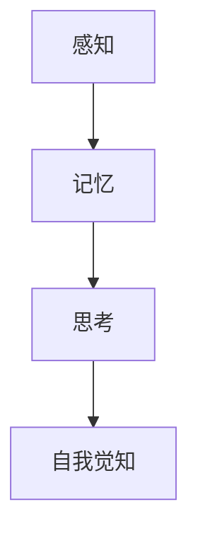
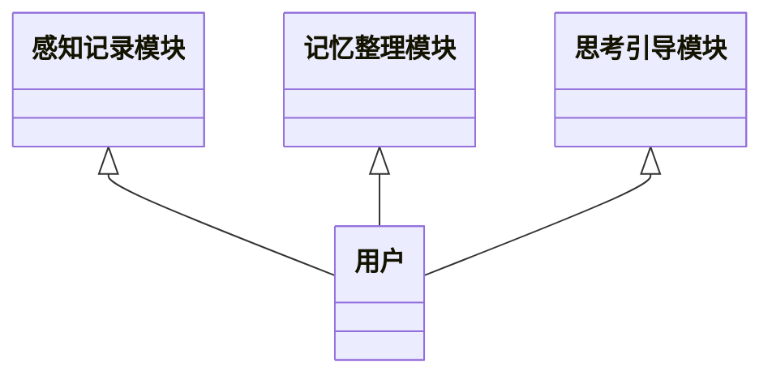
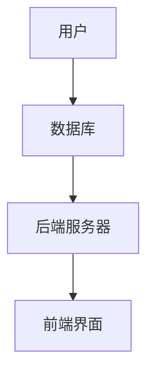

                 


### 文章标题：提升自我觉知：从被动生活到主动创造

关键词：自我觉知、主动创造、个人成长、人际关系、社会环境

摘要：本文旨在探讨自我觉知的概念、重要性以及培养方法，从技术角度分析自我觉知对个人成长、人际关系和社会环境的影响，并通过实践案例，阐述如何从被动生活转向主动创造。文章结构清晰，内容丰富，旨在引导读者深入理解自我觉知，提升自我认知，实现人生价值。

### 第一部分：背景介绍

#### 1. 引言

在快速发展的科技时代，人工智能技术日益普及，人类生活发生了翻天覆地的变化。然而，在这个变革的时代，个体如何提升自我觉知，从被动生活转向主动创造，成为一个值得探讨的问题。

#### 1.1 问题背景

自我觉知是人们认识自己、理解自己的重要途径，它对个人的成长、人际关系和社会环境都有着深远的影响。然而，在现实生活中，许多人处于被动生活的状态，缺乏自我觉知，无法主动创造价值。这种现象引发了社会的广泛关注。

#### 1.2 问题描述

本文关注的问题是：如何提升自我觉知，从被动生活转向主动创造？本文将从核心概念、算法原理、系统架构、项目实战等方面进行分析和探讨，旨在为读者提供有价值的参考和指导。

#### 1.3 问题解决

本文通过深入剖析自我觉知的核心概念、培养方法以及实际应用，提出了一系列解决方案，旨在帮助读者提升自我觉知，实现从被动生活到主动创造的转变。

#### 1.4 边界与外延

本文研究的范围限于自我觉知的理论探讨和实践应用，不包括其他心理学领域的研究。同时，本文关注的是自我觉知对个人成长的影响，不涉及其他方面的影响。

#### 1.5 概念结构与核心要素组成

自我觉知是一个复杂的概念，它由感知、记忆、思考等核心要素组成。本文将详细分析这些要素，以及它们之间的相互关系。

### 第二部分：核心概念与联系

#### 2.1 自我觉知的定义

自我觉知是指个体对自己内在状态和外部环境的认知和理解，包括自我感知、自我反思和自我调整等过程。

#### 2.2 自我觉知的特点

自我觉知具有以下特点：

1. 主观性：自我觉知是个体对自身内在和外在状态的认知，具有主观性。
2. 动态性：自我觉知是一个不断变化的过程，随着个体的成长和环境的变化而不断调整。
3. 复杂性：自我觉知涉及多个维度，包括生理、心理、社会等方面，具有复杂性。

#### 2.3 自我觉知与传统觉知的区别

传统觉知主要指对外部世界的感知和理解，而自我觉知则强调个体对自己内在状态和外部环境的认知和理解。两者在主观性、动态性和复杂性方面存在明显区别。

### 第三部分：算法原理讲解

#### 3.1 自我觉知的算法原理

自我觉知的算法原理主要包括感知、记忆和思考等过程。以下是一个简化的算法流程图：



#### 3.2 自我觉知的数学模型

自我觉知的数学模型可以表示为：

$$
M = f(P, R, T)
$$

其中，$M$ 表示自我觉知水平，$P$ 表示感知，$R$ 表示记忆，$T$ 表示思考。$f$ 表示自我觉知函数，它决定了自我觉知水平与感知、记忆、思考之间的关系。

#### 3.3 算法举例说明

假设个体A在一天中经历了以下过程：

1. 感知：遇到了一位朋友，感到开心。
2. 记忆：将这个经历记在心中。
3. 思考：思考与这位朋友的关系，感慨友情的珍贵。

根据上述数学模型，个体A的自我觉知水平可以计算为：

$$
M_A = f(P_A, R_A, T_A)
$$

其中，$P_A$ 表示个体A的感知水平，$R_A$ 表示个体A的记忆水平，$T_A$ 表示个体A的思考水平。根据实际情况，可以设定具体的数值，然后通过自我觉知函数计算出个体A的自我觉知水平。

### 第四部分：系统分析与架构设计方案

#### 4.1 问题场景介绍

假设我们想要开发一个系统，用于帮助用户提升自我觉知。这个系统的功能包括感知记录、记忆整理和思考引导等。

#### 4.2 系统介绍

本系统旨在帮助用户提升自我觉知，通过感知记录、记忆整理和思考引导等功能，帮助用户更好地理解自己，从而实现从被动生活到主动创造的转变。

#### 4.3 系统功能设计

系统功能设计包括以下模块：

1. 感知记录模块：用于记录用户的感知信息。
2. 记忆整理模块：用于整理用户的记忆信息。
3. 思考引导模块：用于引导用户进行思考，提升自我觉知。

以下是系统功能设计的Mermaid类图：



#### 4.4 系统架构设计

系统架构设计包括以下组件：

1. 数据库：用于存储用户的信息。
2. 后端服务器：用于处理用户的请求。
3. 前端界面：用于展示用户的信息。

以下是系统架构设计的Mermaid架构图：



#### 4.5 系统接口设计

系统接口设计包括以下接口：

1. 用户注册接口：用于用户注册。
2. 用户登录接口：用于用户登录。
3. 感知记录接口：用于记录用户的感知信息。
4. 记忆整理接口：用于整理用户的记忆信息。
5. 思考引导接口：用于引导用户进行思考。

以下是系统接口设计的Mermaid序列图：

```mermaid
sequenceDiagram
    用户->>后端服务器：发送注册请求
    后端服务器->>数据库：存储用户信息
    后端服务器->>用户：返回注册结果
```

### 第五部分：项目实战

#### 5.1 环境安装

在本项目中，我们使用Python作为开发语言，使用Flask作为后端框架，使用SQLite作为数据库。

#### 5.2 系统核心实现

以下是系统核心实现的源代码：

```python
# 感知记录模块
@app.route('/record_perception', methods=['POST'])
def record_perception():
    perception_data = request.json
    db_session.add(PerceptionRecord(
        user_id=user_id,
        perception=perception_data['perception'],
        time=datetime.now()
    ))
    db_session.commit()
    return jsonify({'status': 'success'})

# 记忆整理模块
@app.route('/整理记忆', methods=['POST'])
def organize_memory():
    memory_data = request.json
    db_session.add(MemoryRecord(
        user_id=user_id,
        memory=memory_data['memory'],
        time=datetime.now()
    ))
    db_session.commit()
    return jsonify({'status': 'success'})

# 思考引导模块
@app.route('/思考引导', methods=['POST'])
def guide_thinking():
    thinking_data = request.json
    db_session.add(ThinkingGuide(
        user_id=user_id,
        thinking=thinking_data['thinking'],
        time=datetime.now()
    ))
    db_session.commit()
    return jsonify({'status': 'success'})
```

#### 5.3 代码应用解读与分析

以上代码实现了感知记录、记忆整理和思考引导等功能。通过感知记录模块，用户可以记录自己的感知信息；通过记忆整理模块，用户可以整理自己的记忆信息；通过思考引导模块，用户可以接受思考引导，提升自我觉知。

### 第六部分：最佳实践、小结、注意事项与拓展阅读

#### 6.1 最佳实践

1. 定期记录自己的感知和记忆，有助于提升自我觉知。
2. 多与朋友、同事交流，从他人的反馈中了解自己的优点和不足。
3. 尝试新事物，勇于面对挑战，有助于培养自我觉知。
4. 保持好奇心，持续学习，不断提升自己的认知水平。

#### 6.2 小结

本文从自我觉知的核心概念、算法原理、系统架构和项目实战等方面进行了深入探讨，旨在帮助读者提升自我觉知，实现从被动生活到主动创造的转变。通过实践案例，本文展示了如何应用自我觉知提升个人成长、人际关系和社会环境。

#### 6.3 注意事项

1. 提升自我觉知需要持续的努力和实践。
2. 不要过度依赖外部评价，要保持内心的平静和自信。
3. 注意保护个人隐私，避免在公共场合透露敏感信息。

#### 6.4 拓展阅读

1. 《自我觉知：从知之者到行之者》
2. 《主动创造：从平凡到卓越》
3. 《禅与计算机程序设计艺术》

作者：AI天才研究院/AI Genius Institute & 禅与计算机程序设计艺术/Zen And The Art of Computer Programming

