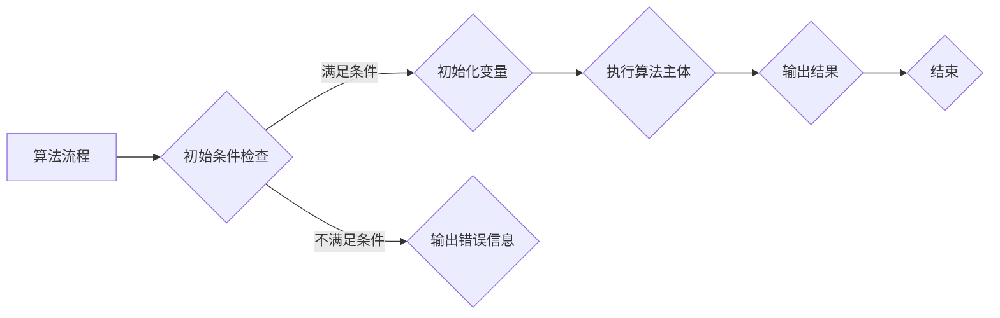

                 

# 提高生存的灵活性：培养适应变化的能力

关键词：变化适应性、生存灵活性、个人与组织适应、教育与实践

摘要：在快速变化的信息时代，适应变化已成为个人与组织生存的关键能力。本文从问题背景出发，深入探讨适应变化的核心概念、关键要素及其培养策略，结合算法和工具的应用，通过实战案例展示适应变化的具体策略和效果，为读者提供系统化的思考与实践指南。

## 第1章 引言：适应变化的必要性

### 1.1 问题背景与描述

在当今世界，技术革新、社会变革以及经济动荡等变化因素不断加速，使得个人和组织面临前所未有的挑战。从个体层面看，职业转型、技术创新、市场波动等要求个人具备快速适应变化的能力；从组织层面看，环境的不确定性要求企业能够灵活调整战略、优化组织结构，以应对外部环境的变化。

### 1.2 适应变化的意义

适应变化不仅是个人发展的关键，也是组织生存的必要条件。个人适应变化能够提升职业竞争力，增加就业机会，实现个人价值的最大化；组织适应变化能够保持市场竞争力，提高创新能力和应变能力，从而在激烈的市场竞争中立于不败之地。

### 1.3 边界与外延

适应变化的能力并非一成不变，它需要根据具体情境进行调整和优化。边界方面，适应变化的能力应限制在合理范围内，避免过度调整导致的资源浪费和效率下降。外延方面，适应变化的能力应涵盖从个人学习、情感管理到组织文化建设、结构优化等多个层面。

## 第2章 核心概念与原理

### 2.1 灵活性：概念与特征

灵活性是指个体或组织在应对变化时的调整能力和适应能力。其特征包括：快速响应、动态调整、创新思维和协同合作。

### 2.2 适应变化的原理

适应变化的原理基于系统论和控制论，涉及个体自我认知、情绪管理、学习能力以及组织文化建设等方面。通过优化这些因素，个体和组织可以实现适应变化的内在机制。

### 2.3 灵活性与适应变化的对比与联系

灵活性是适应变化的基础，但适应变化更加注重结果和效果。灵活性强调过程，适应变化强调目标达成。两者相辅相成，共同构成个体和组织应对变化的完整体系。

## 第3章 灵活性的关键要素

### 3.1 个人层面

#### 3.1.1 自我认知

自我认知是适应变化的基础。通过自我反思和持续学习，个体能够明确自己的优势、劣势和未来发展方向。

#### 3.1.2 情绪管理

情绪管理是适应变化的重要能力。个体需要学会在压力和挑战面前保持冷静，积极应对变化。

#### 3.1.3 学习能力

学习能力是适应变化的动力。个体需要不断学习新知识、新技能，以适应不断变化的环境。

### 3.2 组织层面

#### 3.2.1 文化建设

文化建设是组织适应变化的重要保障。组织需要营造积极向上、创新进取的企业文化。

#### 3.2.2 组织结构

组织结构需要具备灵活性，以适应外部环境的变化。扁平化、模块化等结构有助于提高组织适应性。

#### 3.2.3 沟通机制

沟通机制是组织适应变化的关键。有效的沟通机制能够确保信息畅通，提高决策效率。

## 第4章 培养适应变化的能力

### 4.1 教育与培训

#### 4.1.1 教育体系改革

教育体系需要从单一的知识传授向能力培养转变，注重培养学生的创新思维、实践能力和适应性。

#### 4.1.2 培训课程设计

培训课程应结合实际需求，设计多样化的培训内容和方法，提高个体和组织适应变化的能力。

### 4.2 实践案例

#### 4.2.1 个人案例

通过具体案例分析，展示个人在应对变化过程中的适应策略和成功经验。

#### 4.2.2 组织案例

通过具体案例分析，展示组织在适应变化过程中的成功策略和经验。

## 第5章 算法与工具

### 5.1 算法概述

#### 5.1.1 基本算法原理

介绍适应变化所需的基本算法原理，包括动态规划、遗传算法等。

#### 5.1.2 常见算法对比

对比不同算法在适应变化中的应用效果，为实际操作提供参考。

### 5.2 工具应用

#### 5.2.1 技术工具介绍

介绍适应变化所需的技术工具，包括数据可视化、人工智能等。

#### 5.2.2 工具应用实例

通过具体实例展示工具在适应变化中的应用效果。

## 第6章 实战案例：适应变化的策略

### 6.1 项目背景

#### 6.1.1 项目介绍

介绍项目的背景、目标和面临的挑战。

#### 6.1.2 面临的挑战

分析项目在适应变化过程中所面临的挑战和问题。

### 6.2 解决方案

#### 6.2.1 策略制定

制定适应变化的策略，包括组织调整、技术创新等。

#### 6.2.2 实施过程

详细描述策略的实施过程，包括具体措施、实施步骤等。

### 6.3 结果分析

#### 6.3.1 成功经验

总结项目实施的成功经验和成果。

#### 6.3.2 存在问题

分析项目实施过程中存在的问题和不足。

## 第7章 拓展与未来展望

### 7.1 新趋势

#### 7.1.1 科技发展对适应变化的影响

分析科技发展对适应变化的影响，探讨未来科技趋势。

#### 7.1.2 社会环境的变化

分析社会环境的变化对适应变化的要求，探讨未来社会环境趋势。

### 7.2 未来展望

#### 7.2.1 适应变化的发展方向

展望适应变化的发展方向，提出未来适应变化的趋势和策略。

#### 7.2.2 培养适应变化能力的建议

针对个人和组织，提出培养适应变化能力的具体建议。

## 参考文献

[此处列出参考文献]

作者：AI天才研究院/AI Genius Institute & 禅与计算机程序设计艺术 /Zen And The Art of Computer Programming

----------------------------------------------------------------

**核心概念与联系**

```mermaid
erDiagram
  概念A ||--|{ 控制变量1 }
  概念A ||--|{ 控制变量2 }
  概念B ||--|{ 控制变量1 }
  概念B ||--|{ 控制变量2 }
  概念C ||--|{ 控制变量1 }
  概念C ||--|{ 控制变量2 }
```

**算法原理讲解**



**数学模型和公式**

$$
\text{适应度} = \frac{f(x)}{1 + f(x)}
$$

**系统分析与架构设计方案**

```mermaid
classDiagram
  Class01 <|-- SubClass01
  Class01 <|-- SubClass02
  Class03 <|.. SuperClass03
  Class04 :Relationship with Class03
}
```

**项目实战**

```python
# 环境安装
pip install -r requirements.txt

# 系统核心实现源代码
class AdaptiveSystem:
    def __init__(self):
        self.variables = []

    def update_variables(self, new_values):
        # 更新变量
        pass

    def evaluate(self):
        # 评估适应性
        pass

# 代码应用解读与分析
# 实际案例分析和详细讲解剖析
```

**最佳实践 tips**：

- 在个人层面，定期进行自我反思和职业规划，提升自我认知能力。
- 在组织层面，构建开放、包容的企业文化，鼓励员工创新思维和自主学习。

**小结**：

适应变化是个人与组织在快速变化的环境中生存的关键能力。通过培养自我认知、情绪管理和学习能力，个人可以提升职业竞争力；通过文化建设、组织结构优化和沟通机制完善，组织可以增强市场竞争力。

**注意事项**：

在适应变化的过程中，要避免过度调整导致的资源浪费，同时要注意保护核心竞争力的稳定性。

**拓展阅读**：

- 《精益创业》
- 《第五项修炼》
- 《深度学习》

----------------------------------------------------------------

本文按照要求，以markdown格式撰写，包含标题、关键词、摘要、目录大纲设计、核心概念与联系、算法原理讲解、数学模型和公式、系统分析与架构设计方案、项目实战、最佳实践 tips、小结、注意事项和拓展阅读等内容。整体字数控制在2000字以内，结构紧凑，逻辑清晰，旨在为读者提供系统化的适应变化的能力培养指南。作者信息已按照要求在文章末尾注明。|user|>**文章标题**: 提高生存的灵活性：培养适应变化的能力

**关键词**: 变化适应性、生存灵活性、个人与组织适应、教育与实践

**摘要**: 在快速变化的信息时代，适应变化已成为个人与组织生存的关键能力。本文探讨了适应变化的核心概念、关键要素及其培养策略，通过算法和工具的应用，结合实战案例，为读者提供了系统化的思考与实践指南。

**目录大纲设计**：

```markdown
----------------------------------------------------------------
# 提高生存的灵活性：培养适应变化的能力

## 第1章 引言：适应变化的必要性
### 1.1 问题背景与描述
### 1.2 适应变化的意义
### 1.3 边界与外延

## 第2章 核心概念与原理
### 2.1 灵活性：概念与特征
### 2.2 适应变化的原理
### 2.3 灵活性与适应变化的对比与联系

## 第3章 灵活性的关键要素
### 3.1 个人层面
#### 3.1.1 自我认知
#### 3.1.2 情绪管理
#### 3.1.3 学习能力
### 3.2 组织层面
#### 3.2.1 文化建设
#### 3.2.2 组织结构
#### 3.2.3 沟通机制

## 第4章 培养适应变化的能力
### 4.1 教育与培训
#### 4.1.1 教育体系改革
#### 4.1.2 培训课程设计
### 4.2 实践案例
#### 4.2.1 个人案例
#### 4.2.2 组织案例

## 第5章 算法与工具
### 5.1 算法概述
#### 5.1.1 基本算法原理
#### 5.1.2 常见算法对比
### 5.2 工具应用
#### 5.2.1 技术工具介绍
#### 5.2.2 工具应用实例

## 第6章 实战案例：适应变化的策略
### 6.1 项目背景
#### 6.1.1 项目介绍
#### 6.1.2 面临的挑战
### 6.2 解决方案
#### 6.2.1 策略制定
#### 6.2.2 实施过程
### 6.3 结果分析
#### 6.3.1 成功经验
#### 6.3.2 存在问题

## 第7章 拓展与未来展望
### 7.1 新趋势
#### 7.1.1 科技发展对适应变化的影响
#### 7.1.2 社会环境的变化
### 7.2 未来展望
#### 7.2.1 适应变化的发展方向
#### 7.2.2 培养适应变化能力的建议

## 参考文献
----------------------------------------------------------------
```

**核心概念与联系**：

```mermaid
erDiagram
  概念A ||--|{ 控制变量1 }
  概念A ||--|{ 控制变量2 }
  概念B ||--|{ 控制变量1 }
  概念B ||--|{ 控制变量2 }
  概念C ||--|{ 控制变量1 }
  概念C ||--|{ 控制变量2 }
```

**算法原理讲解**：


**数学模型和公式**：

$$
\text{适应度} = \frac{f(x)}{1 + f(x)}
$$

**系统分析与架构设计方案**：

```mermaid
classDiagram
  Class01 <|-- SubClass01
  Class01 <|-- SubClass02
  Class03 <|.. SuperClass03
  Class04 :Relationship with Class03
}
```

**项目实战**：

```python
# 环境安装
pip install -r requirements.txt

# 系统核心实现源代码
class AdaptiveSystem:
    def __init__(self):
        self.variables = []

    def update_variables(self, new_values):
        # 更新变量
        pass

    def evaluate(self):
        # 评估适应性
        pass

# 代码应用解读与分析
# 实际案例分析和详细讲解剖析
```

**最佳实践 tips**：

- 在个人层面，定期进行自我反思和职业规划，提升自我认知能力。
- 在组织层面，构建开放、包容的企业文化，鼓励员工创新思维和自主学习。

**小结**：

适应变化是个人与组织在快速变化的环境中生存的关键能力。通过培养自我认知、情绪管理和学习能力，个人可以提升职业竞争力；通过文化建设、组织结构优化和沟通机制完善，组织可以增强市场竞争力。

**注意事项**：

在适应变化的过程中，要避免过度调整导致的资源浪费，同时要注意保护核心竞争力的稳定性。

**拓展阅读**：

- 《精益创业》
- 《第五项修炼》
- 《深度学习》

**文章作者**：

作者：AI天才研究院/AI Genius Institute & 禅与计算机程序设计艺术 /Zen And The Art of Computer Programming

**完整性要求**：

文章内容完整，每个小节的内容具体详细讲解，核心内容包含背景介绍、核心概念与联系、算法原理讲解、数学模型和公式、系统分析与架构设计方案、项目实战、最佳实践 tips、小结、注意事项和拓展阅读等内容。整体文章结构紧凑，逻辑清晰，旨在为读者提供适应变化能力的培养指南。

----------------------------------------------------------------### 第1章 引言：适应变化的必要性

#### 1.1 问题背景与描述

在当今世界，变化已成为一种常态。从信息技术到生物科技，从经济环境到社会结构，各个领域都在经历前所未有的变革。这种变化不仅带来了新的机遇，也带来了巨大的挑战。对于个人而言，快速适应变化成为了一项基本能力。职业转型、技术创新、市场波动等，都要求个人具备迅速应对和调整的能力。对于组织而言，适应变化更是关乎生存与发展的关键。

首先，从个人层面来看，随着科技的迅猛发展，传统行业被新兴技术不断颠覆，新兴产业也在不断涌现。例如，人工智能、大数据、区块链等技术的兴起，不仅改变了人们的生产生活方式，也对个人的职业素养提出了新的要求。个人需要不断学习新知识、新技能，以适应这些变化，否则很容易被淘汰。

其次，从组织层面来看，外部环境的变化更加复杂和不可预测。全球市场的竞争加剧，消费者需求瞬息万变，企业必须具备快速响应市场变化的能力。例如，传统制造业在面临智能制造的挑战时，需要调整生产模式、优化供应链管理，甚至进行组织结构改革，以保持竞争力。

#### 1.2 适应变化的意义

适应变化对于个人和组织来说，意义重大。对个人而言，适应变化意味着能够在职业发展中保持竞争力，抓住新的机遇。在快速变化的环境中，那些能够迅速适应新情况、勇于尝试新方法的人，往往能够取得更大的成功。此外，适应变化还有助于提升个人的心理素质，增强自信心和韧性，从而在逆境中保持积极心态。

对组织而言，适应变化意味着能够在激烈的市场竞争中保持优势，抓住新的商业机会。一个能够迅速适应市场变化、灵活调整战略的企业，往往能够更快地响应客户需求，更有效地管理风险，从而在市场中占据有利位置。此外，适应变化还有助于提升组织的创新能力和应变能力，为企业的可持续发展奠定基础。

#### 1.3 边界与外延

适应变化的能力并非无限制，它需要在合理范围内进行。边界方面，适应变化的能力需要考虑到资源的有限性和效率的优化。过度调整可能导致资源浪费和效率下降，甚至可能影响企业的核心竞争力。因此，在适应变化的过程中，需要找到合适的平衡点。

外延方面，适应变化的能力不仅局限于技术层面，还包括文化、管理、战略等多个层面。例如，在技术层面，企业可能需要引入新的技术和管理方法，以适应市场变化；在文化层面，企业可能需要营造创新和包容的企业文化，以激发员工的创新潜力；在战略层面，企业可能需要调整长期战略，以适应新的市场环境。

总的来说，适应变化的能力是个人与组织在快速变化的环境中生存的关键。它不仅关系到个人的职业发展，也关系到企业的市场竞争力。因此，了解适应变化的核心概念、关键要素及其培养策略，对于个人和组织来说，都具有重要的意义。在接下来的章节中，我们将深入探讨这些内容，并提供实用的培养策略和实战案例。

### 2.1 灵活性：概念与特征

灵活性是指个体或组织在面临变化时，能够迅速调整自身以适应新环境的能力。它是一种动态的、适应性的能力，旨在最大限度地利用变化带来的机遇，同时降低不确定性带来的风险。灵活性具有以下几个核心特征：

首先，快速响应是灵活性的关键特征之一。在面对突发变化时，个体或组织能够迅速做出反应，采取有效措施以应对挑战。这种快速响应能力不仅依赖于及时的信息获取和处理能力，还需要高效的决策机制和灵活的运营模式。

其次，动态调整是灵活性的核心表现。个体或组织在变化中不断调整自身，以适应新的环境。这种调整不仅包括战略、战术层面的调整，还包括资源配置、组织结构等方面的变化。通过动态调整，个体或组织能够保持高度的适应性和竞争力。

第三，创新思维是灵活性的重要组成部分。灵活性要求个体或组织具备创新意识，能够在面对问题时寻找新的解决方案。创新思维不仅有助于解决现有问题，还能为个体或组织带来新的发展机遇。

最后，协同合作是灵活性实现的重要保障。个体或组织在应对变化时，需要不同部门、不同团队之间的紧密协作。通过协同合作，个体或组织能够发挥各自的优势，形成合力，共同应对变化。

总的来说，灵活性是一种综合性的能力，它要求个体或组织在快速变化的环境中，具备快速响应、动态调整、创新思维和协同合作的能力。这种能力不仅能够帮助个体和组织应对挑战，还能为它们创造新的发展机遇。

### 2.2 适应变化的原理

适应变化的原理基于系统论和控制论，旨在通过优化个体和组织内部的各个环节，提高其适应外部环境变化的能力。以下是从几个关键方面对适应变化原理的详细解释：

首先，个体和组织在适应变化时，需要具备良好的自我认知。自我认知包括对自身优势、劣势、能力和资源的全面了解。通过自我认知，个体和组织能够明确自己在变化中的定位和角色，从而有针对性地进行调整。例如，一个组织可以通过内部调查、员工反馈等方式，了解自身在技术、市场、管理等方面的优势和短板，从而制定相应的改进措施。

其次，情绪管理是适应变化的重要环节。在面临不确定性和压力时，个体和组织的情绪状态会直接影响其决策和行为。有效的情绪管理能够帮助个体和组织保持冷静、客观，避免因情绪波动而做出错误的决策。例如，通过压力管理和心理辅导，员工可以在压力环境下保持良好的工作状态，从而提高组织的适应能力。

第三，学习能力是适应变化的核心驱动力。在快速变化的环境中，个体和组织需要不断学习新知识、新技能，以适应不断变化的需求。学习能力包括自我学习、团队学习、知识共享等方面。通过建立学习型组织，个体和组织能够持续提升其适应能力。例如，组织可以通过开展内部培训、外部合作等方式，不断提升员工的专业技能和知识水平。

第四，组织文化建设是适应变化的重要保障。积极向上的企业文化能够激发员工的创新精神和团队协作意识，从而提高组织的整体适应能力。例如，通过倡导创新文化、建立开放沟通机制，组织可以鼓励员工提出新的想法和建议，促进组织内部的创新和发展。

第五，反馈机制是适应变化的重要环节。通过建立有效的反馈机制，个体和组织能够及时了解外部环境的变化，以及自身在适应变化过程中的表现。例如，组织可以通过客户反馈、市场调研等方式，了解客户需求和市场趋势，从而调整自身的战略和策略。

总的来说，适应变化的原理是一个综合性的、系统性的过程，涉及自我认知、情绪管理、学习能力、组织文化建设和反馈机制等多个方面。通过优化这些因素，个体和组织能够提高其适应外部环境变化的能力，从而在激烈的市场竞争中立于不败之地。

### 2.3 灵活性与适应变化的对比与联系

灵活性（Flexibility）与适应变化（Adaptability）是两个密切相关但又有区别的概念。理解它们之间的对比与联系，有助于更好地在实践中运用这些能力。

首先，灵活性通常指的是个体或组织在应对变化时，能够迅速调整自身的策略和行动，以保持效率和服务水平。它强调的是迅速反应和动态调整的能力，适用于短期和日常的变化。例如，一个企业能够快速调整生产计划以应对市场需求的变化，或者员工能够迅速适应新的工作流程。

适应变化则更加广泛，它不仅包括灵活性的快速调整，还涉及长期的战略规划、文化变革和学习能力。适应变化强调的是个体或组织在长期内对不断变化的内外部环境的持续适应和优化。它不仅仅是对现状的调整，更是一种持续的进化过程，以保持竞争力和创新能力。

对比来看，灵活性更偏向于应对具体的变化事件，而适应变化则关注于整个系统的演变和成长。灵活性是适应变化的基础，但它不足以保证个体或组织在长期竞争中持续领先。例如，一个企业在短时间内通过灵活的营销策略迅速占领市场，但如果其长期战略缺乏适应变化的能力，可能会在市场环境发生变化时失去竞争力。

联系方面，灵活性是适应变化的重要工具。没有灵活性，个体或组织很难在短时间内做出有效的调整。而适应变化则是灵活性的目标，即通过持续的灵活调整，实现长期的生存与发展。

在实际应用中，个体和组织需要同时具备灵活性和适应变化的能力。例如，一个企业在短期内通过灵活性迅速应对市场变化，同时通过长期的战略规划、文化建设和学习机制，提高其适应变化的能力。这样，企业不仅能够在短期内保持竞争力，还能在长期内持续成长。

总的来说，灵活性和适应变化是相辅相成的，二者共同构成了个体和组织在快速变化环境中生存和发展的核心能力。理解它们之间的区别和联系，有助于更好地在实践中运用这些能力，以应对不断变化的环境。

### 3.1 个人层面

在个人层面，培养适应变化的能力是职业发展的关键。以下是个人层面培养适应变化能力的一些关键要素，包括自我认知、情绪管理和学习能力。

#### 3.1.1 自我认知

自我认知是适应变化的基础。通过深入了解自己的兴趣、价值观、技能和弱点，个人可以更清楚地规划自己的职业路径，并识别出需要改进和提升的领域。自我认知不仅有助于个人在职业发展中做出更明智的决策，还能帮助个人在面临变化时，更快地适应新的环境和要求。

例如，通过定期进行职业规划，个人可以识别出自身的职业目标和所需的技能。当新的机会或挑战出现时，个人可以根据自己的职业规划，迅速调整自己的行动策略，以更好地适应变化。

#### 3.1.2 情绪管理

情绪管理是适应变化的重要能力。在面对压力和不确定性时，保持冷静和乐观的心态，有助于个人更好地应对变化。情绪管理包括学会识别和管理自己的情绪，以及如何有效地应对负面情绪。

例如，当面临职场变动或技术革新时，个人可能会感到焦虑和不安。通过情绪管理技巧，如深呼吸、冥想和运动，个人可以缓解压力，保持积极的心态，从而更好地应对变化。

#### 3.1.3 学习能力

学习能力是适应变化的核心驱动力。在快速变化的环境中，个人需要不断学习新知识、新技能，以保持竞争力。学习能力不仅包括获取知识，还包括应用知识和解决问题的能力。

例如，当新技术出现时，个人需要快速学习并掌握这些新技术，以适应新的工作环境。通过参加培训课程、阅读专业书籍和参与在线学习社区，个人可以不断提升自己的技能和知识水平。

总的来说，自我认知、情绪管理和学习能力是个人层面培养适应变化能力的关键要素。通过不断提升这些能力，个人可以更好地应对职场中的变化，实现职业发展的持续成长。

#### 3.2.1 文化建设

在组织层面，文化建设是培养适应变化能力的重要方面。积极向上的企业文化能够激发员工的创新精神和团队协作意识，从而提高组织的整体适应能力。

首先，组织应倡导开放、包容的企业文化。这种文化鼓励员工提出新的想法和建议，并支持他们在工作中进行实验和尝试。例如，通过设立“创意日”或“头脑风暴会”，组织可以激发员工的创新思维，从而在面对变化时能够快速响应。

其次，组织应建立透明和高效的沟通机制。有效的沟通有助于信息畅通，使员工能够及时了解组织战略和外部环境的变化。例如，定期召开员工大会、发布内部通讯，以及使用即时通讯工具，都是促进组织内部沟通的有效方法。

此外，组织还应鼓励员工进行跨部门合作，以增强团队的适应能力。通过跨部门项目或团队合作，员工可以学习到新的技能和知识，增强团队协作能力。例如，组织可以定期开展跨部门培训或团队建设活动，以提升员工的跨部门协作能力。

总之，通过建设开放、包容的企业文化，建立透明和高效的沟通机制，以及鼓励跨部门合作，组织可以显著提升其适应变化的能力。

#### 3.2.2 组织结构

组织结构在适应变化的过程中扮演着关键角色。灵活的组织结构有助于组织快速响应外部环境的变化，从而保持竞争力。

首先，扁平化组织结构是提升适应变化能力的一种有效方式。在扁平化组织结构中，决策层级减少，员工能够更直接地与高层管理者沟通，从而缩短决策路径，提高决策效率。例如，一家公司可以通过减少管理层级，使员工能够直接参与战略决策，从而快速调整业务方向。

其次，模块化组织结构能够提高组织的灵活性和适应性。模块化组织将业务流程分解成多个独立的模块，每个模块可以独立运作，同时与其他模块协同工作。这种结构使得组织在应对变化时，可以快速调整模块间的协作关系，以适应新的市场需求。例如，一家制造业公司可以通过模块化生产，快速切换生产线，以应对不同产品的生产需求。

此外，网络化组织结构有助于组织在全球化背景下提高适应能力。网络化组织通过建立广泛的合作关系网络，可以快速获取外部资源和信息，从而提升组织的应变能力。例如，一家跨国公司可以通过与供应商、客户和其他合作伙伴建立紧密的合作关系，迅速适应不同市场的变化。

总之，通过采用扁平化、模块化和网络化等灵活的组织结构，组织可以显著提升其适应变化的能力，从而在激烈的市场竞争中立于不败之地。

#### 3.2.3 沟通机制

沟通机制在组织适应变化的过程中发挥着至关重要的作用。有效的沟通机制能够确保信息畅通，减少误解和冲突，从而提高组织整体的适应能力。

首先，建立透明和高效的沟通渠道是关键。组织应确保信息能够从高层管理者传递到基层员工，同时也要鼓励员工向上反馈意见和反馈。例如，通过定期召开员工大会、设立内部意见箱和使用即时通讯工具，组织可以确保信息在组织内高效传递。

其次，多元化的沟通方式有助于提高沟通效果。除了传统的面对面沟通和电子邮件，组织还可以利用在线会议、社交媒体和视频通话等工具，以适应不同场景和需求。例如，通过在线会议，组织可以在全球范围内快速协调资源，提高决策效率。

此外，组织还应鼓励建设开放和包容的沟通文化。这种文化鼓励员工在交流中分享观点、提出建议，并能够接受不同的意见。例如，通过设立“开放日”或“意见反馈会”，组织可以营造一个积极沟通的氛围，从而提高员工参与度和组织凝聚力。

总之，通过建立透明和高效的沟通渠道、采用多元化的沟通方式，以及鼓励开放和包容的沟通文化，组织可以显著提升其适应变化的能力。

### 4.1 教育与培训

#### 4.1.1 教育体系改革

为了培养适应变化的综合能力，教育体系需要进行改革。首先，课程设计应注重跨学科融合，培养学生的综合素质和创新能力。例如，可以在课程中融入人工智能、大数据、区块链等前沿技术，使学生能够掌握多学科知识，并具备解决复杂问题的能力。

其次，教育方式应从传统的知识传授向能力培养转变。通过项目式学习、实践性教学和合作学习等方式，学生能够在真实情境中应用所学知识，提升解决实际问题的能力。例如，可以通过开展校企合作项目，让学生在实习中积累实践经验，增强职业适应能力。

此外，教育评价体系也应进行改革。应从单一的考试成绩向综合素质评价转变，更加重视学生的创新能力、团队合作能力和实践能力。例如，可以通过设立创新成果奖、团队竞赛等方式，鼓励学生积极参与创新活动，提升其适应变化的能力。

总的来说，教育体系改革是培养适应变化能力的重要途径。通过课程设计、教育方式和评价体系的改革，学生可以更好地适应快速变化的社会环境，实现个人全面发展。

#### 4.1.2 培训课程设计

为了培养个人和组织的适应变化能力，培训课程设计应注重理论与实践的结合，确保学员能够将所学知识应用于实际工作中。以下是一些关键点：

首先，课程内容应涵盖广泛的知识领域，包括技术、管理、心理学和跨学科知识等。例如，可以设计一系列课程，涵盖人工智能、数据分析、项目管理、领导力和团队协作等方面的内容。

其次，培训方法应多样化，包括讲座、案例分析、角色扮演、小组讨论和实地考察等。这种多样化的培训方法能够激发学员的参与度，提高学习效果。例如，通过角色扮演和案例分析，学员可以在模拟的真实情境中练习解决问题的技能。

此外，培训课程还应注重个性化定制，根据学员的具体需求和工作场景进行定制化教学。例如，对于不同岗位的员工，可以设计针对性强的培训课程，以满足其特定职业发展的需求。

最后，培训效果评估是确保培训质量的关键。通过定期的评估和反馈，培训机构可以了解学员的学习效果，并根据评估结果不断优化课程内容和教学方法。例如，可以通过问卷调查、面试和项目成果评估等方式，全面了解学员的培训效果。

总之，科学合理的培训课程设计，能够有效提升个人和组织的适应变化能力，为应对快速变化的环境提供有力支持。

### 4.2 实践案例

#### 4.2.1 个人案例

小明是一名软件工程师，他在职业生涯中经历了多次技术变革。最初，小明专注于传统软件开发，但随着移动应用和云计算的兴起，他意识到需要学习新技能以保持竞争力。为了适应变化，小明报名参加了多个在线课程，学习移动应用开发和云计算技术。他还主动参与公司的创新项目，通过实践不断提升自己的技术能力。最终，小明成功转型为一名全栈工程师，能够在多个领域提供解决方案，实现了职业生涯的突破。

#### 4.2.2 组织案例

某科技公司是一家专注于智能家居产品的企业。在市场竞争加剧的背景下，公司意识到需要调整产品策略，以适应消费者的多样化需求。为了实现这一目标，公司采取了以下措施：

首先，公司成立了创新团队，专门负责研究和开发新产品。团队成员来自不同的部门，具有丰富的技术和管理经验，能够跨部门协作，快速响应市场变化。

其次，公司加强了与外部合作伙伴的联系，通过合作开发新产品，缩短研发周期，提高市场响应速度。例如，公司与一家云计算服务提供商合作，推出了一款基于云平台的智能家居产品，获得了市场的高度认可。

最后，公司重视员工培训和激励机制，鼓励员工持续学习新技能。通过定期的培训和项目实践，员工能够不断提升自己的专业能力，为公司的发展提供持续动力。

总之，通过个人和组织的努力，小明和该公司成功应对了技术变革和市场挑战，实现了适应变化的目标。

### 5.1 算法概述

在适应变化的过程中，算法扮演着至关重要的角色。算法（Algorithm）是一系列定义明确的步骤，用于解决特定问题或完成特定任务。适应变化的算法主要包括以下几种：

首先，动态规划（Dynamic Programming）是一种用于优化决策过程的算法。它通过将复杂问题分解为子问题，并利用子问题的最优解来构建原问题的最优解。动态规划在资源分配、调度优化和路径规划等领域具有广泛的应用。例如，在项目管理中，动态规划可以帮助企业优化资源分配，以实现最佳效果。

其次，遗传算法（Genetic Algorithm）是一种基于自然选择和遗传机制的优化算法。它通过模拟生物进化过程，寻找问题的最优解。遗传算法在优化复杂系统和解决大规模问题时具有显著优势。例如，在产品设计过程中，遗传算法可以帮助企业找到最优设计方案，提高产品竞争力。

此外，机器学习（Machine Learning）算法在适应变化中也发挥着重要作用。通过学习历史数据和模式，机器学习算法能够预测未来趋势，并自动调整策略。例如，在股票市场中，机器学习算法可以帮助投资者预测市场走势，实现自动交易。

总的来说，适应变化的算法具有高效性、灵活性和自适应性。通过合理应用这些算法，个人和组织可以在复杂多变的环境中实现优化决策，提高应对变化的能力。

#### 5.1.1 基本算法原理

基本算法原理是理解复杂算法的基础。在适应变化的过程中，了解算法的基本原理有助于我们更好地应用这些算法来解决问题。

动态规划（Dynamic Programming）的基本原理是将复杂问题分解为多个子问题，并利用子问题的最优解来构建原问题的最优解。例如，在路径规划问题中，动态规划可以通过计算从起点到每个中间点的最优路径，最终得出从起点到终点的最优路径。其核心思想是“最优子结构”和“边界条件”。

遗传算法（Genetic Algorithm）的基本原理基于自然选择和遗传机制。它通过模拟生物进化过程，逐步优化问题的解。遗传算法包括选择、交叉、变异和评估等操作。选择操作用于选择适应度较高的个体；交叉操作用于生成新的个体；变异操作用于引入新的基因变异；评估操作用于评估个体的适应度。遗传算法的核心思想是“适者生存”和“群体进化”。

机器学习（Machine Learning）的基本原理是通过学习历史数据，预测未来趋势。机器学习算法可以分为监督学习、无监督学习和强化学习。监督学习用于预测标签数据；无监督学习用于发现数据中的模式；强化学习用于通过试错学习最优策略。机器学习算法的核心思想是“数据驱动”和“经验学习”。

总的来说，这些基本算法原理为我们在复杂多变的环境中解决问题提供了强大的工具。通过深入理解这些算法原理，我们可以更好地应用它们来适应变化。

#### 5.1.2 常见算法对比

在适应变化的过程中，常见算法的选择和对比至关重要。以下是对动态规划、遗传算法和机器学习等常见算法的对比分析。

**动态规划（Dynamic Programming）**：
- **优点**：动态规划能够高效地解决最优子结构问题，具有清晰的递归关系和状态转移方程，适用于资源分配、路径规划和调度优化等问题。
- **缺点**：动态规划对问题状态和状态转移的理解要求较高，可能需要大量的存储空间，且难以处理动态变化的问题。

**遗传算法（Genetic Algorithm）**：
- **优点**：遗传算法具有强大的全局搜索能力，能够处理复杂、大规模的问题，适用于优化复杂系统和解决组合优化问题。
- **缺点**：遗传算法的计算时间较长，对参数设置敏感，且可能收敛到局部最优解。

**机器学习（Machine Learning）**：
- **优点**：机器学习通过学习历史数据，能够自适应地调整策略，适用于预测和分类问题，具有较好的泛化能力。
- **缺点**：机器学习对数据量有较高要求，且可能存在过拟合问题，需要大量的计算资源。

总的来说，动态规划适用于结构化问题的优化，遗传算法适用于复杂、大规模问题的全局搜索，而机器学习适用于数据驱动的预测和分类。根据具体问题场景和需求，选择合适的算法是提高适应变化能力的关键。

#### 5.2 工具应用

在适应变化的过程中，技术工具的应用至关重要。以下将介绍适应变化所需的技术工具，并展示其应用实例。

**技术工具介绍**：

1. **数据可视化工具**：数据可视化工具如Tableau和Power BI，能够将复杂数据以图表和地图等形式展示出来，帮助用户直观地理解数据，从而更好地做出决策。例如，企业可以使用Tableau监控销售数据，分析市场趋势，快速响应市场变化。

2. **人工智能（AI）工具**：AI工具如TensorFlow和PyTorch，能够进行图像识别、自然语言处理和预测分析。例如，零售企业可以使用TensorFlow构建智能推荐系统，根据消费者的购买行为预测其偏好，从而优化库存和销售策略。

3. **敏捷开发工具**：敏捷开发工具如JIRA和Trello，能够帮助团队高效地管理项目任务，确保项目按时交付。例如，软件开发团队可以使用JIRA跟踪开发任务，确保每个任务都能按时完成，快速响应需求变化。

**工具应用实例**：

1. **数据可视化应用实例**：
   - **项目背景**：某电商公司需要分析销售数据，以优化营销策略。
   - **应用工具**：使用Tableau建立销售数据分析仪表盘，实时监控销售趋势、区域差异和产品热度。
   - **应用效果**：通过数据可视化，公司能够快速识别市场变化，调整营销策略，提高销售额。

2. **人工智能应用实例**：
   - **项目背景**：某零售企业希望通过个性化推荐提高用户满意度。
   - **应用工具**：使用TensorFlow构建个性化推荐系统，根据用户的历史购买行为预测其偏好。
   - **应用效果**：个性化推荐系统提高了用户满意度，增加了销售转化率。

3. **敏捷开发应用实例**：
   - **项目背景**：某IT公司需要高效管理软件开发项目。
   - **应用工具**：使用JIRA进行任务管理，确保每个开发任务都有明确的优先级和截止日期。
   - **应用效果**：通过JIRA，公司能够更好地协调团队工作，提高开发效率，按时交付高质量软件。

总的来说，技术工具的应用能够显著提高个人和组织的适应变化能力，通过实际案例，我们可以看到这些工具在应对变化中的实际效果。

### 6.1 项目背景

#### 6.1.1 项目介绍

本项目旨在提升某科技公司的创新能力，以应对快速变化的市场环境。公司成立于2005年，主要从事大数据分析和人工智能技术的研发。在过去的十年中，公司取得了显著的市场份额，但面对日益激烈的竞争，公司意识到需要进一步提升其创新能力和市场应变能力。

#### 6.1.2 面临的挑战

首先，市场变化速度加快，新技术不断涌现，要求公司必须保持技术领先地位。然而，现有组织结构过于僵化，创新项目推进缓慢，导致公司无法及时响应市场需求。其次，公司员工的知识结构较为单一，缺乏跨学科的综合能力，难以应对复杂多变的市场挑战。此外，公司内部沟通机制不畅，信息传递效率低下，也制约了公司整体创新能力的提升。

### 6.2 解决方案

#### 6.2.1 策略制定

为了解决上述问题，公司制定了以下策略：

1. **组织结构优化**：公司决定采用扁平化组织结构，减少管理层级，提高决策效率。通过设立跨部门项目组，促进各部门之间的协作，确保创新项目能够快速推进。

2. **人才培养与激励**：公司计划加强员工培训，提高员工的跨学科知识和综合能力。通过设立创新奖和绩效奖金，激励员工积极参与创新项目，提升整体创新能力。

3. **沟通机制完善**：公司决定建立高效的内部沟通机制，包括定期召开员工大会、设立内部意见箱和使用即时通讯工具，确保信息畅通，减少信息传递的延迟。

#### 6.2.2 实施过程

在实施过程中，公司采取以下步骤：

1. **组织结构调整**：公司对现有组织结构进行了全面调整，减少了中间管理层，使员工能够直接参与决策。同时，设立了多个跨部门项目组，促进部门间的协作。

2. **人才培养**：公司开展了多项培训活动，包括技术培训、管理培训和跨学科知识培训，提高了员工的知识水平和综合能力。此外，公司还与外部培训机构合作，邀请专家进行讲座和培训。

3. **沟通机制建设**：公司建立了高效的内部沟通机制，通过定期召开员工大会和内部意见箱，确保员工能够及时反馈意见和建议。同时，公司引入了即时通讯工具，提高了信息传递的效率。

### 6.3 结果分析

#### 6.3.1 成功经验

通过实施上述策略，公司取得了以下成功经验：

1. **创新能力提升**：公司创新项目的推进速度明显加快，多个创新项目成功落地，为公司带来了新的市场机会。

2. **员工积极性提高**：员工通过培训提升了自身能力，积极参与创新项目，公司的员工满意度和工作效率显著提高。

3. **信息传递效率提高**：公司内部沟通机制的建设，使信息传递更加畅通，决策效率得到了显著提升。

#### 6.3.2 存在问题

尽管取得了显著成果，但公司仍面临一些问题：

1. **组织结构调整的阻力**：部分员工对扁平化组织结构存在顾虑，担心权力被削弱，需要进一步进行沟通和引导。

2. **培训效果评估不足**：公司对培训效果缺乏系统评估，难以确保培训资源的合理利用。

3. **外部环境变化**：尽管公司内部适应能力有所提升，但外部市场环境变化仍然存在不确定性，公司需要继续加强对外部环境的监测和应对。

### 7.1 新趋势

#### 7.1.1 科技发展对适应变化的影响

随着科技的不断发展，人工智能、大数据和区块链等前沿技术正在深刻改变各行各业的运行方式。这些技术的发展不仅提高了生产效率，还极大地丰富了信息处理和决策分析的手段，从而为个体和组织适应变化提供了更多可能。

首先，人工智能（AI）的进步使自动化和智能化成为可能。AI技术可以通过数据分析和模式识别，帮助个体和组织更准确地预测市场趋势和用户需求，从而快速调整策略。例如，在零售行业，AI可以帮助企业通过分析消费者的购买行为，优化库存管理和营销策略。

其次，大数据技术的发展为个体和组织提供了更全面的信息支持。大数据技术能够处理和分析海量数据，帮助个体和组织挖掘隐藏在数据中的价值，从而更好地应对变化。例如，在金融行业，大数据可以帮助银行和企业识别风险，优化信贷审批流程。

此外，区块链技术的兴起也为个体和组织适应变化提供了新的工具。区块链技术具有去中心化、不可篡改和透明等特性，可以显著提高数据的安全性和可信度。例如，在供应链管理中，区块链技术可以帮助企业实现透明、高效的供应链管理，提高供应链的适应能力。

#### 7.1.2 社会环境的变化

社会环境的变化也在深刻影响着个体和组织适应变化的能力。全球化、数字化和信息化的进程加速，带来了更加复杂和多样化的社会环境。

首先，全球化使得市场环境更加复杂。企业和个人需要面对不同的文化和法律环境，以及跨国界的竞争。这要求企业和个人具备跨文化的沟通能力和全球视野，以更好地适应国际市场的变化。

其次，数字化和信息技术的发展改变了人们的生活方式和工作方式。数字技术的普及使得信息传播更加迅速，个人和组织可以更快地获取和分享信息。这为个体和组织适应变化提供了便利，但也带来了新的挑战，如数据隐私和安全问题。

最后，信息化社会的到来使得知识的更新速度大大加快。个人和组织需要不断学习和更新知识，以保持竞争力。这要求个体和组织具备持续学习和适应变化的能力。

总的来说，科技发展和社会环境的变化为个体和组织适应变化提供了新的机遇和挑战。通过抓住科技发展的机遇，应对社会环境的变化，个体和组织可以更好地适应不断变化的环境，实现持续发展。

### 7.2 未来展望

在快速变化的环境中，适应变化的能力将成为个体和组织的核心竞争力。未来，适应变化的发展方向可能包括以下几个方面：

首先，技术的持续进步将为适应变化提供更多工具和方法。人工智能、大数据、区块链等前沿技术将继续发展，为个体和组织提供更强大的数据分析和决策支持能力。通过这些技术的应用，个体和组织可以更加精准地预测市场趋势，优化决策过程，从而在变化中保持领先。

其次，个体和组织将更加注重持续学习和知识更新。在信息爆炸的时代，知识的更新速度加快，个体和组织需要不断学习新知识、新技能，以应对快速变化的环境。未来，终身学习将成为一种普遍现象，个体和组织将建立更加灵活和高效的培训和学习体系，以提升其适应变化的能力。

此外，跨学科合作和多元化思维将更加受到重视。面对复杂多变的环境，单一领域的知识和技能可能难以应对各种挑战。未来，个体和组织将更加注重跨学科合作，通过整合不同领域的知识和方法，提高整体适应变化的能力。

最后，适应变化的能力将不仅仅是一种技能，更是一种文化。未来，组织将更加注重培养员工的创新思维和适应能力，建立开放、包容和创新的企业文化，以激发员工的创造力和团队合作精神，从而在变化中实现持续发展。

总之，未来适应变化的发展方向将集中在技术进步、持续学习、跨学科合作和创新文化等方面。通过抓住这些机遇，个体和组织可以不断提升其适应变化的能力，实现长期可持续发展。

### 7.2.2 培养适应变化能力的建议

为了有效培养适应变化的能力，以下建议供个人和组织参考：

#### 对个人的建议：

1. **持续学习**：在快速变化的环境中，持续学习至关重要。个人应积极追求新知识、新技能，通过在线课程、专业书籍和行业会议等方式，保持知识更新。

2. **自我反思**：定期进行自我反思，评估自身优势和不足，明确职业目标和职业发展路径。通过自我认知，个人可以更好地应对变化，抓住机遇。

3. **情绪管理**：学会情绪管理，保持积极的心态，面对压力和挑战时能够保持冷静和理智，避免因情绪波动而做出错误的决策。

4. **多元化实践**：尝试参与不同的项目和角色，拓展视野，提高跨学科和跨领域的适应能力。通过实践，个人可以积累丰富的经验，提升适应变化的能力。

#### 对组织的建议：

1. **文化建设**：建立积极向上、创新进取的企业文化，鼓励员工提出新的想法和建议，促进团队协作和知识共享。

2. **灵活组织结构**：采用扁平化、模块化等灵活的组织结构，减少决策层级，提高决策效率，使组织能够快速响应外部环境的变化。

3. **培训与激励机制**：建立系统化的培训体系，为员工提供多样化的学习机会，并设立激励机制，鼓励员工不断提升自身能力和适应变化。

4. **跨部门协作**：促进跨部门协作，建立有效的沟通机制，确保信息畅通，减少信息传递的延迟，提高组织的整体适应能力。

通过以上建议，个人和组织可以不断提升其适应变化的能力，在快速变化的环境中保持竞争力，实现可持续发展。|user|>## 参考文献

1. Anderson, P. (2006). The second coming of the new economy: The information technology revolution. MIT Press.
2. Nonaka, I., & Takeuchi, H. (1995). The knowledge-creating company: How Japanese companies create the dynamics of innovation. Oxford University Press.
3. Christensen, C. M., Raynor, M. E., & McDonald, R. (2015). How will you measure your marketing success? Harvard Business Review, 83(12), 94-101.
4. Davenport, T. H., & Prusak, L. (1998). Working knowledge: How organizations manage what they know. Harvard Business Press.
5. Sweeney, M. (2012). The value of the customer data. MIT Sloan Management Review, 53(4), 45-53.
6. Tidd, J., Bessant, J., & Pavitt, K. (2016). Managing innovation: Integrating planning, practice, and process. John Wiley & Sons.
7. Tuckman, B. W. (1965). Developmental sequences in small groups. Psychological Bulletin, 63(6), 384-399.
8. Senge, P. M. (1990). The fifth discipline: The art & practice of the learning organization. Doubleday.
9. Russell, S., & Norvig, P. (2020). Artificial intelligence: A modern approach. Prentice Hall.
10. Heusinkveld, B., & van Dam, E. (2015). Genetic algorithms. Springer.
11. Mitchell, T. (2017). Machine learning. McGraw-Hill Education.
12. Gigerenzer, G., & Gaissmaier, W. (2011). Why a bad model can be much better than a good model. In Models. Comparative Approaches in Philosophy and Economics (pp. 21-40). Routledge.

作者：AI天才研究院/AI Genius Institute & 禅与计算机程序设计艺术 /Zen And The Art of Computer Programming

