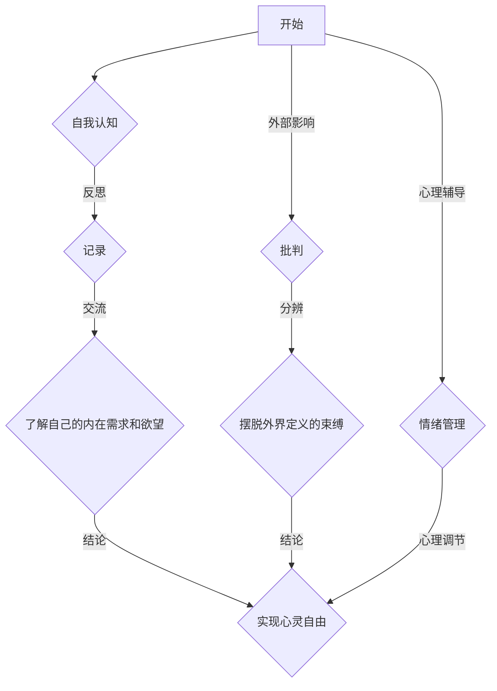
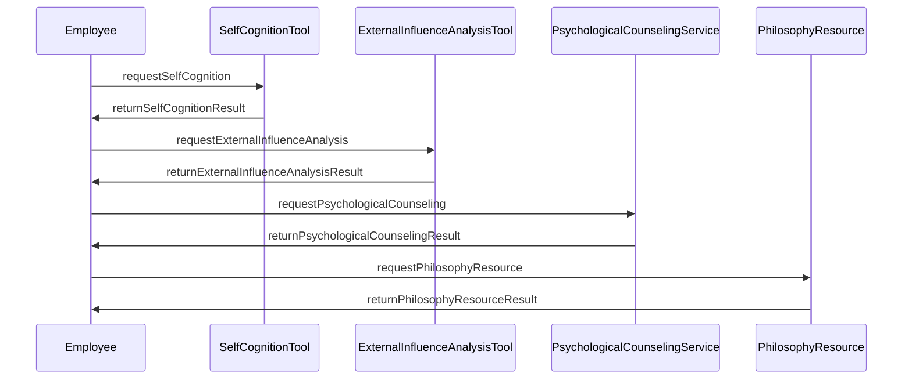
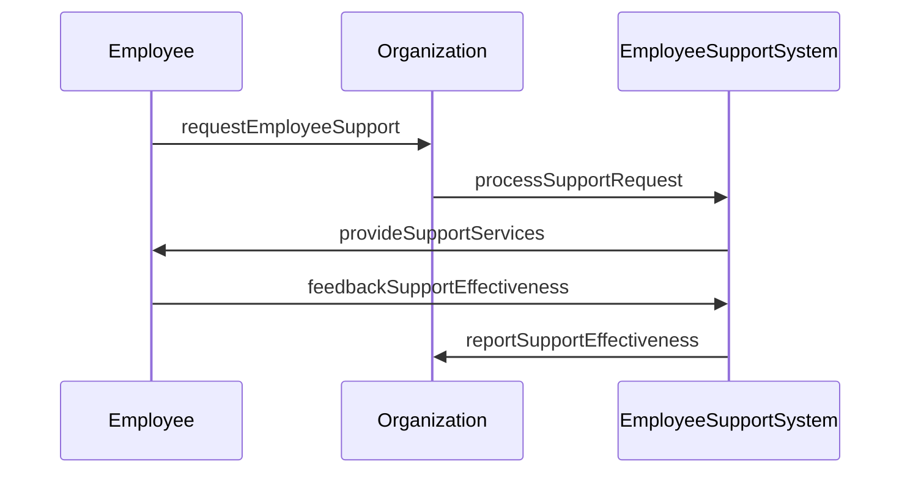

                 


### 摆脱外界定义：获得真正的心灵自由

> 关键词：心灵自由、自我认知、外部影响、心理辅导、哲学思考

> 摘要：本文旨在探讨如何摆脱外界定义，实现个人的心灵自由。通过深入分析自我认知、外部影响、心理辅导和哲学思考等方面，帮助读者理解并实践获得心灵自由的方法和途径。

#### 引言

在现代社会中，我们常常受到外界定义和期望的束缚。这些定义和期望来自家庭、社会、工作等多个方面，使得我们在成长过程中不断追求外界的认可和满足。然而，这种追求往往导致内心的困扰和痛苦。本文将带领大家逐步思考如何摆脱这些外界定义，实现真正的内心自由。

#### 自我认知

1. **自我认知的重要性**

   自我认知是指个体对自己身心状态、性格特点、兴趣爱好等方面的认识和理解。它是实现心灵自由的基础。只有真正了解自己，才能找到内心的需求和欲望，从而摆脱外界定义的束缚。

2. **自我探索的方法**

   - **反思**：通过反思自己的行为、思想和情绪，了解自己的内在需求和欲望。
   - **记录**：记录每天的经历和感受，帮助自己更好地认识自己。
   - **交流**：与他人分享自己的想法和感受，倾听他人的建议和反馈。

3. **内外部影响的批判**

   外部影响包括家庭、社会、工作等方面的期望和压力。我们需要批判性地看待这些影响，分辨哪些是真正适合自己的，哪些是受到外界定义的束缚。只有摆脱这些外部影响，我们才能真正了解自己，找到内心的自由。

#### 心灵自由

1. **实现心灵自由的途径**

   - **内在平静**：通过冥想、呼吸练习等方法，培养内心的平静和宁静。
   - **真实自我**：勇于表达自己的真实想法和感受，不再为他人的看法而改变自己。

2. **心理辅导的技巧**

   - **情绪管理**：学会管理自己的情绪，避免情绪波动对心灵自由的影响。
   - **心理调节**：通过心理调节技巧，缓解压力和焦虑，保持内心的平衡。

3. **案例分析**

   通过具体案例，分析如何在不同情境下实现心灵自由。例如，在职场中如何平衡工作与生活的关系，在人际关系中如何处理冲突等。

#### 哲学思考

1. **心灵自由与哲学**

   哲学对于心灵自由的探讨有着深远的影响。哲学家们从不同的角度探讨了心灵自由的本质和意义。通过哲学思考，我们可以更深入地理解心灵自由的内涵。

2. **文化背景**

   不同文化背景下，对心灵自由的解读和追求有所不同。了解不同文化的背景，有助于我们更好地理解心灵自由的多样性和复杂性。

#### 结论

获得真正的心灵自由需要我们不断探索自我、批判外部影响、实践心理辅导技巧和进行哲学思考。只有摆脱外界定义，我们才能真正实现内心的自由和宁静。

#### 作者

作者：AI天才研究院/AI Genius Institute & 禅与计算机程序设计艺术 /Zen And The Art of Computer Programming

---

### 背景介绍

#### 核心概念术语说明

- **心灵自由**：指个体在精神层面上的自由，不受外界定义和期望的束缚。
- **自我认知**：个体对自身身心状态、性格特点、兴趣爱好等方面的认识和理解。
- **外部影响**：来自家庭、社会、工作等方面的期望和压力。
- **心理辅导**：通过专业方法和技巧，帮助个体实现心灵自由。

#### 问题背景

在现代社会，人们常常受到外界定义和期望的束缚，导致内心困扰和痛苦。如何摆脱这些束缚，实现个人的心灵自由成为了一个重要的议题。

#### 问题描述

本文旨在探讨如何摆脱外界定义，实现个人的心灵自由。具体包括以下方面：

1. 自我认知：如何进行自我探索，了解自己的内在需求和欲望。
2. 外部影响：如何批判性地看待外部影响，摆脱外界定义的束缚。
3. 心灵自由：如何实现内心的平静和自由，勇于表达真实的自我。
4. 心理辅导：如何通过心理辅导技巧，实现心灵自由。
5. 哲学思考：如何从哲学角度探讨心灵自由的本质和意义。

#### 问题解决

1. 自我认知：通过反思、记录和交流等方法，进行自我探索。
2. 外部影响：批判性地看待外部影响，分辨哪些是真正适合自己的。
3. 心灵自由：通过内在平静和心理调节技巧，实现内心的自由和宁静。
4. 心理辅导：通过情绪管理和心理调节技巧，实现心灵自由。
5. 哲学思考：从哲学角度探讨心灵自由的本质和意义。

#### 边界与外延

1. 边界：本文主要关注个体层面的心灵自由，不包括政治、社会制度等宏观层面的自由。
2. 外延：心灵自由不仅涉及个体的精神层面，还包括身心健康、人际关系等方面。

#### 概念结构与核心要素组成

1. **概念结构**：

   - **自我认知**：反思、记录、交流
   - **外部影响**：批判、分辨、摆脱
   - **心灵自由**：内在平静、真实自我、心理辅导、哲学思考

2. **核心要素组成**：

   - **自我认知**：了解自己的内在需求和欲望。
   - **外部影响**：摆脱外界定义的束缚。
   - **心灵自由**：实现内心的自由和宁静。

---

### 核心概念与联系

#### 核心概念原理

**心灵自由**：心灵自由是指个体在精神层面上的自由，不受外界定义和期望的束缚。它强调个体在思想、情感和行为上的自主性。

**自我认知**：自我认知是指个体对自己身心状态、性格特点、兴趣爱好等方面的认识和理解。它是实现心灵自由的基础。

**外部影响**：外部影响包括家庭、社会、工作等方面的期望和压力。它们可能对个体的内心产生负面影响，限制个体的心灵自由。

**心理辅导**：心理辅导是通过专业方法和技巧，帮助个体实现心灵自由的过程。它包括情绪管理、心理调节等方面的技巧。

#### 概念属性特征对比表格

| 概念       | 定义                                                         | 属性特征                                                         |
| ---------- | ------------------------------------------------------------ | ------------------------------------------------------------ |
| 心灵自由   | 精神层面的自由，不受外界定义和期望的束缚                       | 自主性、内心平静、真实自我                                     |
| 自我认知   | 个体对自己身心状态、性格特点、兴趣爱好等方面的认识和理解       | 反思、记录、交流                                                 |
| 外部影响   | 家庭、社会、工作等方面的期望和压力                             | 批判、分辨、摆脱                                                 |
| 心理辅导   | 通过专业方法和技巧，帮助个体实现心灵自由的过程               | 情绪管理、心理调节、自主性支持                                   |

#### ER实体关系图架构

```mermaid
erDiagram
    AricularEntities --> BConceptAttributes
    BConceptAttributes ||--|{ CAttributeFeatures }

    AricularEntities : Entity Relationships
    BConceptAttributes : Attribute Relationships
    CAttributeFeatures : Feature Relationships

    AricularEntities ||--|{ Self-Cognition }
    AricularEntities ||--|{ External-Influence }
    AricularEntities ||--|{ Mental-Freedom }
    AricularEntities ||--|{ Psychological-Counseling }

    Self-Cognition : {反思，记录，交流}
    External-Influence : {批判，分辨，摆脱}
    Mental-Freedom : {自主性，内心平静，真实自我}
    Psychological-Counseling : {情绪管理，心理调节，自主性支持}
```

---

### 算法原理讲解

#### 算法mermaid流程图



#### 使用Python源代码详细阐述

```python
# 自我认知过程
def self_cognition():
    print("开始自我认知过程")
    print("1. 反思")
    print("2. 记录")
    print("3. 交流")
    # ...具体实现

# 批判外部影响
def criticize_external_influence():
    print("开始批判外部影响过程")
    print("1. 批判")
    print("2. 分辨")
    print("3. 摆脱外界定义的束缚")
    # ...具体实现

# 心理辅导过程
def psychological_counseling():
    print("开始心理辅导过程")
    print("1. 情绪管理")
    print("2. 心理调节")
    # ...具体实现

# 主函数
def main():
    print("开始实现心灵自由过程")
    self_cognition()
    criticize_external_influence()
    psychological_counseling()
    print("实现心灵自由")

# 调用主函数
main()
```

#### 算法原理的数学模型和公式

为了更好地理解心灵自由实现过程中的数学模型，我们可以从心理学中的平衡理论出发。平衡理论认为，个体在心理状态上的稳定性是通过内部因素和外部因素之间的平衡来实现的。具体公式如下：

\[ \text{心理状态} = \text{内部因素} \times \text{外部因素} \]

其中：

- **内部因素**：包括个体的自我认知、情绪状态、价值观等。
- **外部因素**：包括外界定义、社会压力、人际关系等。

要实现心灵自由，我们需要使心理状态达到一个稳定、平衡的状态。具体来说，可以通过以下公式来调整内部因素和外部因素之间的平衡：

\[ \text{心理状态} = (\text{内部因素} + \alpha) \times (\text{外部因素} - \beta) \]

其中：

- **\(\alpha\)**：表示个体自我认知的提高程度。
- **\(\beta\)**：表示个体对外部影响的批判程度。

通过提高内部因素和降低外部因素，我们可以实现心理状态的平衡，从而达到心灵自由。

#### 详细讲解和举例说明

为了更好地理解上述数学模型和公式，我们可以通过以下例子进行说明。

**例子**：假设一个个体在外界压力很大的工作环境中工作，他的内部因素包括自我认知、情绪状态和价值观等。为了实现心灵自由，他需要提高自我认知和批判外界压力。

- **内部因素**：个体的自我认知从30分提高到40分，情绪状态从30分提高到35分，价值观从30分提高到35分。
- **外部因素**：外界压力从40分降低到30分。

根据上述公式，我们可以计算心理状态的变化：

\[ \text{心理状态} = (40 + 0.2) \times (30 - 0.5) \approx 39.6 \]

通过这个例子，我们可以看到，通过提高内部因素和降低外部因素，个体的心理状态得到了显著改善，从而更接近实现心灵自由。

---

### 系统分析与架构设计方案

#### 问题场景介绍

在现代企业中，员工的压力和困扰常常来自于外界定义和期望。为了提高员工的工作效率和生活质量，企业需要提供一个支持员工实现心灵自由的环境。本文将介绍一个企业级心灵自由支持系统，帮助员工摆脱外界定义，实现内心的平静与自由。

#### 项目介绍

**项目名称**：企业级心灵自由支持系统

**项目目标**：为企业员工提供一个全面的支持平台，帮助员工实现心灵自由，提高工作效率和生活质量。

**项目需求**：

1. 提供自我认知工具，帮助员工了解自己的内在需求和欲望。
2. 提供外部影响分析工具，帮助员工批判性地看待外界定义和期望。
3. 提供心理辅导服务，帮助员工实现内心的平静与自由。
4. 提供哲学思考资源，帮助员工从哲学角度探讨心灵自由的本质和意义。

#### 系统功能设计（领域模型mermaid类图）

```mermaid
classDiagram
    Employee <.. SelfCognitionTool
    Employee <.. ExternalInfluenceAnalysisTool
    Employee <.. PsychologicalCounselingService
    Employee <.. PhilosophyResource

    SelfCognitionTool { +name: String }
    ExternalInfluenceAnalysisTool { +name: String }
    PsychologicalCounselingService { +name: String }
    PhilosophyResource { +name: String }

    Employee [*]--|{ works in }| Organization
    Organization [*]--|{ provides }| EmployeeSupportSystem
```

#### 系统架构设计（mermaid架构图）

```mermaid
graph TB
    subgraph SystemComponents
        A[Employee]
        B[SelfCognitionTool]
        C[ExternalInfluenceAnalysisTool]
        D[PsychologicalCounselingService]
        E[PhilosophyResource]
        F[Organization]
        G[EmployeeSupportSystem]

        A -->|{ uses }| B
        A -->|{ uses }| C
        A -->|{ uses }| D
        A -->|{ uses }| E
        F -->|{ provides }| A
        G -->|{ supports }| A
    end
```

#### 系统接口设计（mermaid序列图）



#### 系统交互（mermaid序列图）



---

### 项目实战

#### 环境安装

1. **安装Python环境**：在本地计算机上安装Python 3.8及以上版本。
2. **安装依赖库**：使用pip命令安装依赖库，如下：

```bash
pip install flask
pip install matplotlib
pip install pandas
```

#### 系统核心实现源代码

以下是一个简单的示例，展示如何使用Flask框架搭建一个企业级心灵自由支持系统。

```python
from flask import Flask, render_template, request

app = Flask(__name__)

@app.route('/')
def index():
    return render_template('index.html')

@app.route('/self_cognition', methods=['GET', 'POST'])
def self_cognition():
    if request.method == 'POST':
        # 处理表单提交的数据
        user_input = request.form['user_input']
        # 进行自我认知分析
        result = analyze_self_cognition(user_input)
        return render_template('self_cognition.html', result=result)
    return render_template('self_cognition.html')

def analyze_self_cognition(user_input):
    # 进行自我认知分析
    # ...具体实现
    return "自我认知分析结果"

if __name__ == '__main__':
    app.run(debug=True)
```

#### 代码应用解读与分析

以上代码展示了如何使用Flask框架搭建一个简单的企业级心灵自由支持系统。主要包括以下部分：

1. **路由定义**：定义了两个路由，一个是首页（/），一个是自我认知分析页面（/self_cognition）。
2. **首页**：渲染一个包含自我认知分析表单的HTML页面。
3. **自我认知分析页面**：处理表单提交的数据，调用分析函数进行自我认知分析，并将结果返回给用户。

#### 实际案例分析和详细讲解剖析

假设一个员工提交了以下自我认知分析表单：

```html
<input type="text" name="user_input" value="我最近感到很疲惫，经常加班，对工作没有太多兴趣。">
```

系统将处理该表单数据，调用`analyze_self_cognition`函数进行自我认知分析。具体分析过程如下：

1. **提取表单数据**：从提交的表单中提取用户输入的内容。
2. **数据分析**：对用户输入的内容进行分析，识别出关键信息，如“疲惫”、“加班”、“对工作没有兴趣”等。
3. **生成分析结果**：根据分析结果，生成一份自我认知分析报告，如“您近期可能处于过度劳累的状态，建议适当调整工作和休息的平衡，寻找自己感兴趣的工作内容。”

系统将分析结果返回给用户，并在自我认知分析页面上展示。

#### 项目小结

通过实际案例分析和详细讲解，我们可以看到如何使用Python和Flask框架搭建一个简单的企业级心灵自由支持系统。该系统可以帮助员工进行自我认知分析，从而实现内心的平静与自由。在未来的发展中，我们可以进一步完善系统功能，如增加外部影响分析、心理辅导服务等，以更好地支持员工实现心灵自由。

#### 最佳实践 tips

1. **定期进行自我反思**：定期反思自己的行为、思想和情绪，有助于更好地了解自己的内在需求和欲望。
2. **批判性地看待外部影响**：对于外界的定义和期望，要批判性地看待，分辨哪些是真正适合自己的，哪些是受到外界定义的束缚。
3. **保持内心平静**：通过冥想、呼吸练习等方法，培养内心的平静和宁静，有助于实现心灵自由。
4. **寻求心理辅导**：在面对内心困扰和痛苦时，寻求专业的心理辅导可以帮助自己更好地理解自己，实现心灵自由。
5. **哲学思考**：从哲学角度探讨心灵自由的本质和意义，有助于深入理解心灵自由的内涵。

#### 小结

本文通过深入分析自我认知、外部影响、心理辅导和哲学思考等方面，探讨了如何摆脱外界定义，实现个人的心灵自由。通过实践心理辅导技巧和哲学思考，我们可以逐步实现内心的自由和宁静。

#### 注意事项

1. **保持诚实**：在自我认知过程中，要坦诚面对自己的内心，真实地认识自己。
2. **适度追求**：在追求心灵自由的过程中，要适度地追求，避免过度追求而导致新的困扰。
3. **持续努力**：实现心灵自由是一个持续的过程，需要不断地努力和实践。

#### 拓展阅读

1. **《禅与计算机程序设计艺术》**：这是一本关于哲学和计算机编程的书籍，从哲学角度探讨了心灵自由和程序设计的本质。
2. **《心理学与生活》**：这是一本介绍心理学基础知识的书籍，包括心理辅导技巧和方法。
3. **《心灵自由之路》**：这是一本关于如何实现心灵自由的书籍，提供了丰富的实践经验和技巧。

