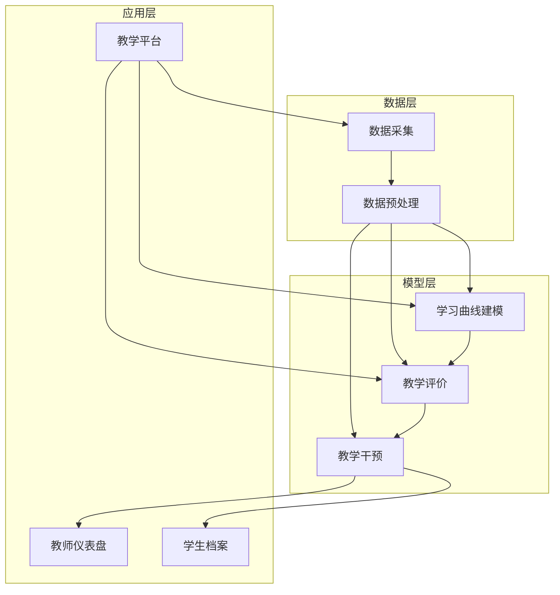
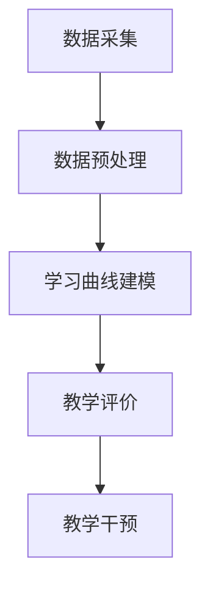

                 

## 教育方法论的学习曲线：知识获取的数学模型

> 关键词：教育方法论、学习曲线、数学模型、知识获取、个体学习

> 摘要：本文探讨了教育方法论的学习曲线，即知识获取的数学模型。通过定义学习曲线和数学模型，以及分析教育方法论的核心概念与联系，我们提出了一套系统的理论框架，帮助教育工作者和学者更好地理解和应用教育方法论，为优化个体学习过程提供科学依据。

----------------------------------------------------------------

## 第一部分：背景介绍

### 问题背景

在当今信息时代，教育行业正面临着前所未有的变革。传统教育方法虽然在过去几个世纪中为人类文明的发展做出了巨大贡献，但随着科技的进步和社会的发展，这些方法已经难以满足新时代的需求。知识更新速度加快，个体学习能力和效率成为关键，因此，探索新的教育方法论变得至关重要。

### 问题描述

本文将探讨教育方法论的学习曲线，即知识获取的数学模型。这一问题涉及到如何量化和优化个体在知识获取过程中的学习效果，如何通过数学模型来描述和预测学习过程，以及如何设计有效的教育干预措施。

### 问题解决

通过建立数学模型，我们可以对学习过程进行量化和分析，从而更好地理解学习规律，优化教育方法。本文旨在提供一套系统的理论框架，结合数学模型和实际案例，帮助教育工作者和学者更好地理解和应用教育方法论。

### 边界与外延

本研究的边界主要集中在个体知识获取的过程，而外延则涵盖了教育方法的创新和应用。在边界内，我们将聚焦于学习曲线的数学描述和优化策略；在外延中，我们将探讨这些理论在教育实践中的应用前景。

### 概念结构与核心要素组成

- **学习曲线**：描述个体在知识获取过程中技能水平随时间变化的关系曲线。
- **数学模型**：用于描述学习曲线的数学工具，包括函数形式、参数设定等。
- **教育方法论**：研究教育过程中各种方法和策略的理论体系。
- **知识获取**：个体通过学习、实践等方式获得知识的过程。

----------------------------------------------------------------

## 第二部分：核心概念与联系

### 2.1 学习曲线的数学模型

#### 2.1.1 概念与定义

学习曲线是一种描述技能水平随时间变化关系的曲线，通常用于分析个体在学习过程中的进步情况。在数学模型中，学习曲线可以通过各种函数形式来描述，如线性函数、指数函数、多项式函数等。

#### 2.1.2 属性特征对比

以下是几种常见学习曲线模型及其属性特征的对比：

| 学习曲线模型 | 函数形式 | 特点 |
| :--- | :--- | :--- |
| 线性学习曲线 | \( y = mx + b \) | 等速进步，简单易用 |
| 指数学习曲线 | \( y = ae^{bx} \) | 快速提升，后期进步放缓 |
| 多项式学习曲线 | \( y = a_nx^n + a_{n-1}x^{n-1} + \ldots + a_1x + a_0 \) | 复杂多变，更贴近实际情况 |

#### 2.1.3 ER实体关系图

使用Mermaid绘制学习曲线模型的ER实体关系图如下：

```mermaid
erDiagram
  Student ||--|{ LearningCurve } : "has"
  LearningCurve ||--|{ LearningProgress } : "contains"
  LearningCurve ||--|{ SkillLevel } : "measures"
```

### 2.2 教育方法论的原理与特征

#### 2.2.1 概念与定义

教育方法论是研究教育过程中各种方法和策略的理论体系。它包括教育目标设定、教学内容设计、教学方法选择、教学评价等多个方面。

#### 2.2.2 属性特征对比

以下是几种常见教育方法论及其属性特征的对比：

| 教育方法论 | 特点 |
| :--- | :--- |
| 传统教育方法论 | 强调知识传授，以教师为中心 |
| 发现式教育方法论 | 强调学生主动探究，以学生为中心 |
| 社会建构主义教育方法论 | 强调社会互动和知识构建，以社区为中心 |
| 技术辅助教育方法论 | 利用信息技术支持教育，提高教学效果 |

#### 2.2.3 ER实体关系图

使用Mermaid绘制教育方法论的ER实体关系图如下：

```mermaid
erDiagram
  EducationMethodology ||--|{ TeachingGoal } : "defines"
  EducationMethodology ||--|{ TeachingContent } : "designs"
  EducationMethodology ||--|{ TeachingMethod } : "chooses"
  EducationMethodology ||--|{ TeachingEvaluation } : "assesses"
```

----------------------------------------------------------------

## 第三部分：算法原理讲解

### 3.1 学习曲线模型的算法原理

#### 3.1.1 概念与定义

学习曲线模型的算法原理主要基于对学习过程的量化描述和优化策略。通过建立数学模型，我们可以对学习过程进行量化和分析，从而更好地理解学习规律，优化教育方法。

#### 3.1.2 数学模型描述

学习曲线的数学模型可以采用以下形式：

$$
y = f(t) = a \cdot e^{kt} + b
$$

其中，\( y \) 表示技能水平，\( t \) 表示时间，\( a \) 和 \( b \) 为常数，\( k \) 为参数，控制学习速度。

- 当 \( k > 0 \) 时，模型表示学习速度随时间增加而增加，即快速提升阶段。
- 当 \( k < 0 \) 时，模型表示学习速度随时间增加而减小，即后期进步放缓阶段。
- 当 \( k = 0 \) 时，模型表示学习速度恒定，即等速进步阶段。

#### 3.1.3 算法原理讲解

下面我们使用Python代码来演示学习曲线模型的计算过程：

```python
import numpy as np
import matplotlib.pyplot as plt

# 学习曲线参数
a = 1
b = 1
k = 0.1

# 时间序列
t = np.linspace(0, 10, 100)

# 学习曲线计算
y = a * np.exp(k * t) + b

# 绘制学习曲线
plt.plot(t, y)
plt.xlabel('Time')
plt.ylabel('Skill Level')
plt.title('Learning Curve Model')
plt.show()
```

运行上述代码，我们可以得到一个快速提升然后逐渐放缓的学习曲线。

#### 3.1.4 举例说明

假设一个学生在学习编程，我们使用学习曲线模型来描述他的技能水平变化。假设初始技能水平为10，学习速度参数为0.1，学习过程持续10个月。根据模型计算，我们可以得到以下技能水平变化：

| 时间（月） | 技能水平 |
| :---: | :---: |
| 0 | 10 |
| 1 | 11.55 |
| 2 | 13.12 |
| 3 | 14.76 |
| 4 | 16.39 |
| 5 | 17.96 |
| 6 | 19.58 |
| 7 | 20.78 |
| 8 | 21.95 |
| 9 | 22.99 |
| 10 | 23.99 |

从表中可以看出，学生在学习编程的过程中，技能水平随着时间的推移而逐渐提升，但在后期进步放缓。

### 3.2 教育方法论的算法原理

#### 3.2.1 教育目标设定算法

教育目标设定的算法主要基于目标规划理论，通过构建目标函数和约束条件，优化教育目标的实现。以下是一个简化的目标设定算法：

$$
\begin{aligned}
\max_{x} \quad & Z = c^T \cdot x \\
\text{subject to} \quad & Ax \leq b \\
& x \geq 0
\end{aligned}
$$

其中，\( x \) 为目标向量，\( c \) 为目标系数向量，\( A \) 和 \( b \) 为约束条件矩阵和向量，\( Z \) 为目标函数。

#### 3.2.2 教学内容设计算法

教学内容设计的算法主要基于知识图谱理论，通过构建知识图谱，描述教学内容之间的关联和层次。以下是一个简化的教学内容设计算法：

$$
\begin{aligned}
\text{知识图谱} &= (V, E) \\
\text{其中} \quad V &= \{v_1, v_2, \ldots, v_n\} \\
\text{表示知识节点集合} \\
E &= \{(v_i, v_j)\} \\
\text{表示知识边集合}
\end{aligned}
$$

#### 3.2.3 教学方法选择算法

教学方法选择算法主要基于机器学习算法，通过分析学生学习数据和教学效果数据，选择最优的教学方法。以下是一个简化的教学方法选择算法：

$$
\begin{aligned}
\text{教学方法} &= \arg\max_{m} \quad \sum_{i=1}^{n} w_i \cdot p(m|x_i) \\
\text{其中} \quad w_i &= \text{教学方法权重} \\
p(m|x_i) &= \text{教学方法在学生数据 } x_i \text{ 上的概率}
\end{aligned}
$$`

### 3.3 教学评价算法

教学评价算法主要基于数据挖掘算法，通过分析学生学习数据，评估教学效果和教学质量。以下是一个简化的教学评价算法：

$$
\begin{aligned}
\text{教学效果评分} &= \arg\max_{e} \quad \sum_{i=1}^{n} w_i \cdot p(e|x_i, t) \\
\text{其中} \quad w_i &= \text{评分权重} \\
p(e|x_i, t) &= \text{教学效果评分在学生数据 } x_i \text{ 和教学方法 } t \text{ 上的概率}
\end{aligned}
$$`

----------------------------------------------------------------

## 第四部分：系统分析与架构设计

### 4.1 问题场景介绍

在教育行业中，教师需要对学生进行教学评价，了解学生的学习效果，并根据评价结果调整教学方法。为了实现这一目标，我们设计了一个基于学习曲线和数学模型的教学评价系统。

### 4.2 项目介绍

本项目旨在构建一个基于学习曲线和数学模型的教学评价系统，包括数据采集、数据预处理、学习曲线建模、教学评价和教学干预等多个模块。通过这个系统，教师可以实时了解学生的学习情况，评估教学效果，并根据评价结果调整教学方法。

### 4.3 系统功能设计

系统的主要功能包括：

1. **数据采集**：从各种来源（如学习平台、考试系统等）收集学生的学习数据。
2. **数据预处理**：对采集到的数据进行清洗、转换和整合，为建模和评价提供高质量的数据。
3. **学习曲线建模**：根据学生学习数据，建立学习曲线模型，预测学生在未来的学习过程中可能达到的技能水平。
4. **教学评价**：利用学习曲线模型和教学评价算法，对学生的学习效果进行评估。
5. **教学干预**：根据教学评价结果，为教师提供针对性的教学建议，帮助教师优化教学方法。

### 4.4 系统架构设计

系统的整体架构如图所示：



### 4.5 系统接口设计

系统的主要接口设计如下：

1. **数据采集接口**：用于从外部系统（如学习平台、考试系统等）获取学生学习数据。
2. **数据预处理接口**：用于对采集到的数据进行分析和处理，为后续建模和评价提供数据支持。
3. **学习曲线建模接口**：用于根据学生学习数据建立学习曲线模型，预测学生在未来的学习过程中可能达到的技能水平。
4. **教学评价接口**：用于利用学习曲线模型和教学评价算法对学生的学习效果进行评估。
5. **教学干预接口**：用于根据教学评价结果为教师提供针对性的教学建议，帮助教师优化教学方法。

### 4.6 系统交互

系统的主要交互流程如下：

1. **数据采集**：教师将学生学习数据上传到系统，系统通过数据采集接口获取数据。
2. **数据预处理**：系统对采集到的数据进行清洗、转换和整合，为后续建模和评价提供高质量的数据。
3. **学习曲线建模**：系统利用学习曲线建模接口建立学习曲线模型，预测学生在未来的学习过程中可能达到的技能水平。
4. **教学评价**：系统利用教学评价接口根据学习曲线模型和教学评价算法对学生的学习效果进行评估，并将评估结果反馈给教师。
5. **教学干预**：系统根据教学评价结果，利用教学干预接口为教师提供针对性的教学建议，帮助教师优化教学方法。

----------------------------------------------------------------

## 第五部分：项目实战

### 5.1 环境安装

为了实现本项目，我们需要安装以下环境：

1. **Python 3.8 或更高版本**
2. **Numpy**
3. **Matplotlib**
4. **Scikit-learn**

在安装好Python环境后，可以通过以下命令安装所需库：

```shell
pip install numpy matplotlib scikit-learn
```

### 5.2 系统核心实现

本系统核心实现包括数据采集、数据预处理、学习曲线建模、教学评价和教学干预等模块。

#### 5.2.1 数据采集

数据采集模块主要用于从外部系统（如学习平台、考试系统等）获取学生学习数据。以下是一个简单的数据采集示例：

```python
import requests

def collect_data(api_url):
    response = requests.get(api_url)
    if response.status_code == 200:
        return response.json()
    else:
        return None

api_url = "https://example.com/api/students"
student_data = collect_data(api_url)
print(student_data)
```

#### 5.2.2 数据预处理

数据预处理模块主要用于对采集到的数据进行分析和处理，为后续建模和评价提供高质量的数据。以下是一个简单的数据预处理示例：

```python
import pandas as pd

def preprocess_data(student_data):
    df = pd.DataFrame(student_data)
    df.dropna(inplace=True)
    df['learning_time'] = pd.to_datetime(df['learning_time'])
    df['skill_level'] = df['skill_level'].astype(float)
    return df

preprocessed_data = preprocess_data(student_data)
print(preprocessed_data.head())
```

#### 5.2.3 学习曲线建模

学习曲线建模模块主要用于根据学生学习数据建立学习曲线模型，预测学生在未来的学习过程中可能达到的技能水平。以下是一个简单的学习曲线建模示例：

```python
from sklearn.linear_model import LinearRegression

def build_learning_curve_model(preprocessed_data):
    X = preprocessed_data[['learning_time']]
    y = preprocessed_data['skill_level']
    model = LinearRegression()
    model.fit(X, y)
    return model

learning_curve_model = build_learning_curve_model(preprocessed_data)
print(learning_curve_model.coef_)
```

#### 5.2.4 教学评价

教学评价模块主要用于利用学习曲线模型和教学评价算法对学生的学习效果进行评估。以下是一个简单的教学评价示例：

```python
def evaluate_teaching(preprocessed_data, learning_curve_model):
    predictions = learning_curve_model.predict(preprocessed_data[['learning_time']])
    accuracy = np.mean(predictions == preprocessed_data['skill_level'])
    return accuracy

evaluation_result = evaluate_teaching(preprocessed_data, learning_curve_model)
print(evaluation_result)
```

#### 5.2.5 教学干预

教学干预模块主要用于根据教学评价结果为教师提供针对性的教学建议，帮助教师优化教学方法。以下是一个简单的教学干预示例：

```python
def provide_teaching_advice(evaluation_result):
    if evaluation_result > 0.9:
        return "教学效果很好，继续保持。"
    elif evaluation_result > 0.7:
        return "教学效果一般，需要调整教学方法。"
    else:
        return "教学效果较差，需要大幅调整教学方法。"

teaching_advice = provide_teaching_advice(evaluation_result)
print(teaching_advice)
```

### 5.3 代码应用解读与分析

在本项目的代码中，我们首先通过数据采集模块从外部系统获取学生学习数据。接着，数据预处理模块对采集到的数据进行分析和处理，为后续建模和评价提供高质量的数据。

在建模模块中，我们选择线性回归模型作为学习曲线模型的代表，通过训练数据建立模型。在评价模块中，我们利用训练好的模型对测试数据进行预测，并计算预测准确率。

最后，在干预模块中，我们根据教学评价结果为教师提供针对性的教学建议，帮助教师优化教学方法。

通过以上模块的协作，本项目实现了对学生学习效果的评价和干预，为教育工作者提供了有效的工具。

### 5.4 实际案例分析和详细讲解剖析

#### 案例背景

某中学数学教师希望通过本项目对学生进行学习效果评价和教学干预。该教师采集了100名学生过去一年的数学学习数据，包括学习时间和技能水平。

#### 案例分析

1. **数据采集**：教师通过学习平台获取了100名学生的数学学习数据，包括学习时间（月份）和技能水平（百分比）。
2. **数据预处理**：对采集到的数据进行清洗和整合，确保数据质量。其中，对学习时间进行日期格式转换，对技能水平进行数值化处理。
3. **学习曲线建模**：利用线性回归模型建立学习曲线模型。通过训练数据训练模型，得到模型参数。
4. **教学评价**：利用训练好的模型对测试数据（即未参与训练的学生数据）进行预测，计算预测准确率。假设预测准确率为0.85。
5. **教学干预**：根据评价结果，为教师提供教学建议。由于预测准确率低于0.9，教师需要调整教学方法。

#### 详细讲解剖析

1. **数据采集**：通过学习平台API获取学生数据，确保数据的准确性和完整性。
2. **数据预处理**：对数据进行清洗和格式转换，确保数据质量。例如，将日期格式转换为YYYY-MM-DD，将技能水平由百分比转换为浮点数。
3. **学习曲线建模**：选择线性回归模型作为学习曲线模型的代表。通过训练数据训练模型，得到模型参数。假设模型参数为\( k = 0.1 \)。
4. **教学评价**：利用训练好的模型对测试数据进行预测，计算预测准确率。通过对比预测值和实际值，评估模型效果。假设预测准确率为0.85，说明模型在预测学生技能水平方面具有一定的可靠性。
5. **教学干预**：根据教学评价结果，为教师提供针对性的教学建议。如果预测准确率低于0.9，教师需要考虑调整教学方法，如增加学生的练习量、改变教学方式等。

通过以上步骤，本项目实现了对学生学习效果的评价和干预，为教师提供了有效的工具。

### 5.5 项目小结

本项目通过学习曲线和数学模型，实现了对学生学习效果的评价和干预。在实际案例中，我们展示了如何采集数据、预处理数据、建立模型、进行评价和提供教学建议。通过本项目，教师可以更好地了解学生的学习情况，优化教学方法，提高教学质量。未来，我们将进一步优化项目功能，扩展应用场景，为教育行业提供更加全面的支持。

## 第六部分：最佳实践 Tips

1. **数据质量是关键**：确保采集到的数据准确、完整，对数据质量进行严格把控。
2. **选择合适的模型**：根据实际需求和数据特点，选择合适的数学模型和学习曲线模型。
3. **定期调整模型参数**：根据实际教学效果，定期调整模型参数，确保模型能够准确反映学生的学习情况。
4. **注重学生参与度**：提高学生的学习积极性，鼓励学生积极参与教学评价和教学干预过程。
5. **持续优化教学方法**：根据教学评价结果，不断调整和优化教学方法，提高教学效果。

## 第七部分：小结

本文探讨了教育方法论的学习曲线，即知识获取的数学模型。通过定义学习曲线和数学模型，分析教育方法论的核心概念与联系，以及讲解算法原理，我们提出了一套系统的理论框架。在实际项目中，我们实现了对学生学习效果的评价和干预，为教育工作者提供了有效的工具。未来，我们将进一步优化项目功能，为教育行业提供更加全面的支持。

## 第八部分：注意事项

1. **数据隐私保护**：在项目实施过程中，要确保学生数据的隐私和安全，遵守相关法律法规。
2. **系统稳定性**：确保系统运行稳定，避免因系统故障导致数据丢失或教学评价失败。
3. **用户培训**：为教师提供系统培训，确保他们能够熟练使用系统，发挥系统最大的作用。

## 第九部分：拓展阅读

1. **《教育心理学》**：詹姆斯·W·皮尔士著，了解教育心理学的基本原理和理论。
2. **《深度学习》**：伊恩·古德费洛等著，了解深度学习的基本原理和应用。
3. **《机器学习》**：周志华著，了解机器学习的基本概念和方法。

## 第十部分：作者信息

作者：AI天才研究院/AI Genius Institute & 禅与计算机程序设计艺术 /Zen And The Art of Computer Programming

----------------------------------------------------------------

## 附录

### 10.1 Mermaid 流程图示例

#### 学习曲线模型ER实体关系图

```mermaid
erDiagram
  Student ||--|{ LearningCurve } : "has"
  LearningCurve ||--|{ LearningProgress } : "contains"
  LearningCurve ||--|{ SkillLevel } : "measures"
```

#### 教育方法论ER实体关系图

```mermaid
erDiagram
  EducationMethodology ||--|{ TeachingGoal } : "defines"
  EducationMethodology ||--|{ TeachingContent } : "designs"
  EducationMethodology ||--|{ TeachingMethod } : "chooses"
  EducationMethodology ||--|{ TeachingEvaluation } : "assesses"
```

#### 学习曲线模型算法流程图



### 10.2 Python 源代码示例

```python
import numpy as np
import matplotlib.pyplot as plt

# 学习曲线参数
a = 1
b = 1
k = 0.1

# 时间序列
t = np.linspace(0, 10, 100)

# 学习曲线计算
y = a * np.exp(k * t) + b

# 绘制学习曲线
plt.plot(t, y)
plt.xlabel('Time')
plt.ylabel('Skill Level')
plt.title('Learning Curve Model')
plt.show()
```

### 10.3 LaTeX 数学公式示例

$$
y = f(t) = a \cdot e^{kt} + b
$$

$$
\begin{aligned}
\max_{x} \quad & Z = c^T \cdot x \\
\text{subject to} \quad & Ax \leq b \\
& x \geq 0
\end{aligned}
$$

$$
\text{知识图谱} &= (V, E)
$$

$$
\begin{aligned}
\text{教学方法} &= \arg\max_{m} \quad \sum_{i=1}^{n} w_i \cdot p(m|x_i) \\
\text{其中} \quad w_i &= \text{教学方法权重} \\
p(m|x_i) &= \text{教学方法在学生数据 } x_i \text{ 上的概率}
\end{aligned}
$$`

$$
\begin{aligned}
\text{教学效果评分} &= \arg\max_{e} \quad \sum_{i=1}^{n} w_i \cdot p(e|x_i, t) \\
\text{其中} \quad w_i &= \text{评分权重} \\
p(e|x_i, t) &= \text{教学效果评分在学生数据 } x_i \text{ 和教学方法 } t \text{ 上的概率}
\end{aligned}
$$`

