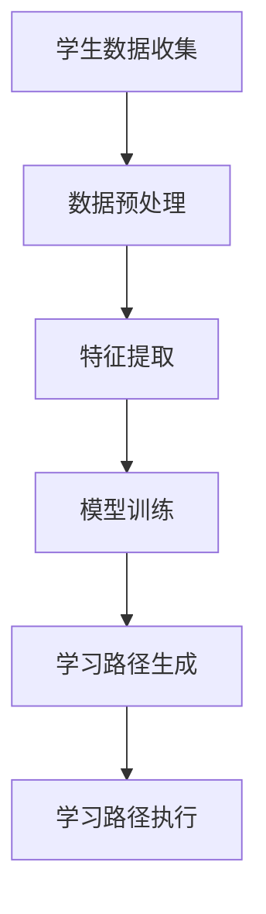
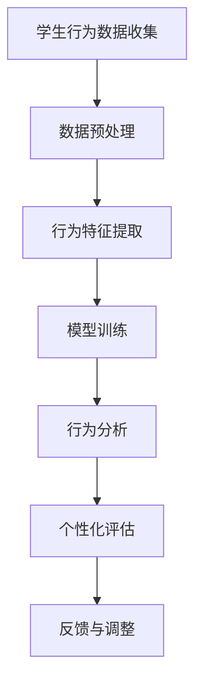
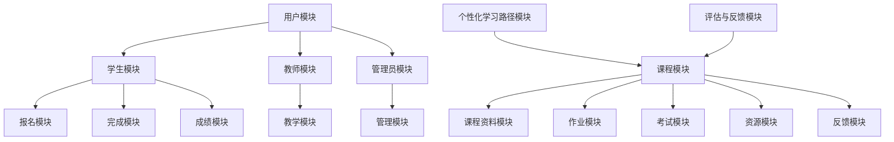
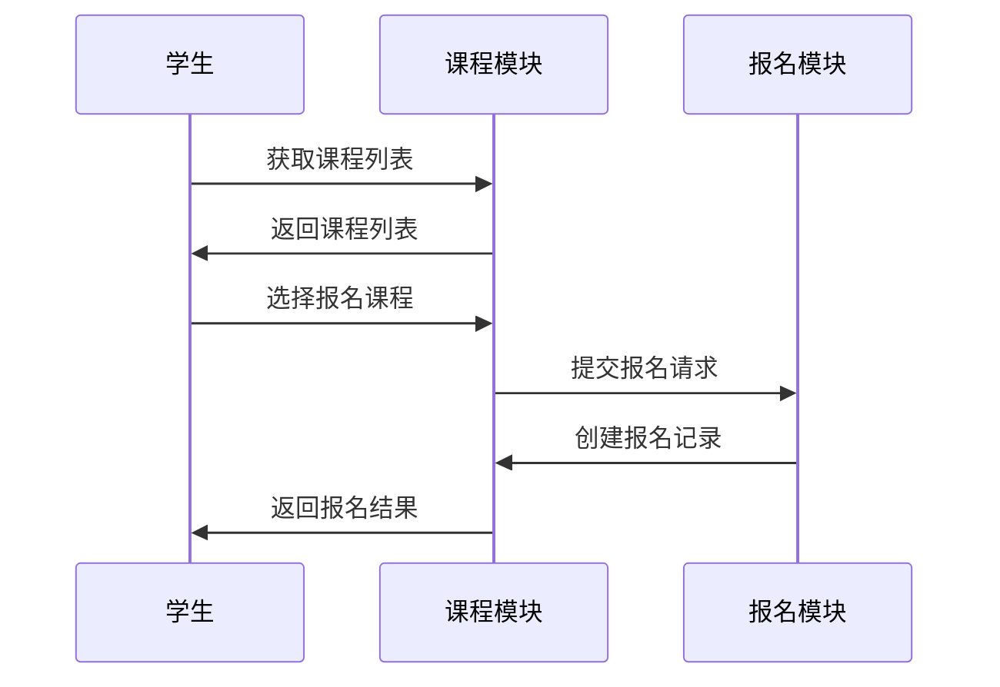

                 

### 教育的意义：培养能应对未来挑战的下一代

#### 关键词
- 教育的意义
- 未来挑战
- 下一代
- 教育方法
- 技术助力

#### 摘要
在快速发展的时代背景下，教育不仅仅是对知识的传授，更是对个人能力的培养。本文将探讨教育的深远意义，分析未来社会的趋势，并探讨如何通过创新的教育方法和技术手段，培养能够应对未来挑战的下一代。

## 目录

1. **引言** <sop>
   - **教育的定义与作用**
   - **当代教育面临的挑战**
   - **教育的意义：培养未来的人才**

2. **未来挑战与下一代** <sop>
   - **未来社会的趋势**
   - **社会变化对教育的影响**
   - **下一代应具备的能力**

3. **教育方法与策略** <sop>
   - **个性化教育**
   - **项目驱动学习**
   - **跨学科学习**

4. **技术助力教育** <sop>
   - **人工智能与教育**
   - **个性化学习路径设计**
   - **教育评估的技术手段**

5. **系统分析与架构设计** <sop>
   - **教育系统的需求分析**
   - **教育系统的架构设计**
   - **教育系统的接口设计和交互**

6. **项目实战** <sop>
   - **案例背景**
   - **案例实施步骤**
   - **案例效果评估**

7. **最佳实践与展望** <sop>
   - **教育创新的趋势**
   - **教育改革的挑战与机遇**
   - **教育未来的发展**

### 引言

教育的意义在于它不仅传授知识，更重要的是培养个人的思维能力、创新能力以及适应社会变化的能力。在当代，教育系统正面临着前所未有的挑战。随着科技的迅猛发展，社会结构和文化环境也在快速变迁。这种变化不仅影响了人们的生活方式，也对教育体系提出了新的要求。

首先，**教育的定义与作用**需要重新审视。教育不仅仅是知识的传递，更是价值观、世界观和人生观的塑造。它帮助个人建立对世界的认知，培养批判性思维和解决问题的能力。教育还肩负着培养公民责任感和促进社会和谐的功能。

其次，**当代教育面临的挑战**不容忽视。技术的进步使得知识更新的速度加快，传统教育模式难以满足个性化的学习需求。同时，全球化的趋势使得教育系统需要应对不同文化背景下的学生，这对教育的包容性和适应性提出了更高的要求。

然而，**教育的意义：培养未来的人才**这一核心问题依然至关重要。未来社会需要的是能够适应快速变化、具备创新能力的人才。这就要求教育必须从传统的知识传授转向能力的培养，注重培养学生的综合素质和实际操作能力。

本文将首先探讨未来社会的趋势，分析这些趋势对教育的影响，并探讨下一代应具备的能力。接着，我们将讨论教育方法与策略，以及技术如何助力教育的发展。随后，我们将介绍教育系统的分析与架构设计，并通过实际案例展示如何将理论应用于实践。最后，我们将总结最佳实践，并对教育未来的发展进行展望。

### 第一部分：背景介绍

#### 核心概念术语说明

- **教育**：指以传授知识、培养能力和塑造人格为目标的一种社会活动。
- **未来挑战**：指在快速变化的社会和技术环境中，教育体系面临的困难与需求。
- **下一代**：指当前正在接受教育的儿童和青少年，他们是未来的社会成员。
- **个性化教育**：指根据学生的个人兴趣、能力和学习风格，提供量身定制的学习方案。
- **技术助力教育**：指利用计算机技术、人工智能等技术手段，提升教育质量与效率。

#### 问题背景

随着全球化、信息化和技术化的加速发展，教育体系正面临着前所未有的变革与挑战。一方面，知识更新速度加快，学生需要掌握的技能和知识不断扩展；另一方面，社会对人才的需求也在发生变化，越来越多的岗位需要具备创新能力和解决问题的能力。

#### 问题描述

教育体系需要应对以下问题：

1. **知识更新与教育内容更新**：如何及时更新教学内容，以适应快速变化的知识体系。
2. **个性化需求与规模化教育**：如何在保证教育质量的前提下，满足学生个性化的学习需求。
3. **跨学科知识与综合素养**：如何培养学生的跨学科知识体系和综合素养，以应对复杂的社会问题。

#### 问题解决

为了解决上述问题，教育领域需要从以下几个方面进行改进：

1. **教育方法的创新**：采用个性化教育、项目驱动学习和跨学科学习等方法，提升学生的综合素质。
2. **技术手段的应用**：利用人工智能、大数据等技术，提升教育质量与效率，实现个性化教学。
3. **教育体系的改革**：改革教育评价体系，注重过程评价和结果评价的结合，鼓励学生的创新和探索。

#### 边界与外延

教育的边界在于其涉及的知识领域和应用场景。外延则包括教育系统内部的各个环节，如课程设置、教学方法、教学资源等。此外，教育的外延还包括教育对社会的影响，如人才培养、社会稳定和文化传承等。

#### 概念结构与核心要素组成

教育的概念结构包括以下核心要素：

1. **教育目标**：传授知识、培养能力和塑造人格。
2. **教育方法**：个性化教育、项目驱动学习和跨学科学习。
3. **教育技术**：人工智能、大数据、虚拟现实等。
4. **教育评价**：过程评价、结果评价和综合评价。
5. **教育环境**：学校、家庭和社会。

这些要素相互关联，共同构成了一个复杂的教育系统，为下一代的成长提供了坚实的基础。

### 第二部分：核心概念与联系

#### 核心概念

在本部分中，我们将详细探讨“未来挑战”、“下一代”、“教育方法”这三个核心概念，并分析它们之间的联系。

**未来挑战**：未来挑战指的是在快速变化的社会和技术环境中，教育体系需要应对的各种问题和需求。这些挑战包括但不限于：

- **知识更新速度加快**：随着科技的发展，新知识、新技能层出不穷，教育体系需要不断更新课程内容，以适应不断变化的知识体系。
- **个性化需求**：每个学生的学习风格和兴趣都不同，教育体系需要提供个性化的教育方案，以满足学生的多样化需求。
- **全球化和多元化**：全球化使得教育需要面对不同文化背景下的学生，教育体系需要具备包容性和适应性。

**下一代**：下一代指的是当前正在接受教育的儿童和青少年，他们是未来的社会成员。下一代应具备以下能力：

- **创新能力**：能够提出新的想法和解决方案，适应快速变化的社会环境。
- **批判性思维**：能够独立思考，分析和评价信息，做出合理的判断。
- **跨学科知识**：能够整合不同学科的知识，解决复杂的社会问题。
- **沟通与合作**：具备良好的沟通和协作能力，能够在多元文化背景下有效沟通和合作。

**教育方法**：教育方法指的是在教育过程中采用的教学策略和手段，以帮助学生更好地学习和成长。现代教育方法包括：

- **个性化教育**：根据学生的兴趣、能力和学习风格，提供量身定制的学习方案。
- **项目驱动学习**：通过完成实际项目，让学生在真实情境中学习和应用知识。
- **跨学科学习**：通过跨学科的课程设置和教学内容，培养学生的综合素质。

#### 核心概念之间的联系

**未来挑战**与**下一代**之间的联系在于，未来的挑战需要下一代具备相应的能力去应对。例如，知识更新的速度加快要求下一代具备快速学习和适应的能力；个性化需求要求下一代具备自主学习和解决问题的能力。

**教育方法**与**未来挑战**和**下一代**之间的联系在于，教育方法的选择和运用直接影响下一代是否能够具备应对未来挑战的能力。个性化的教育方法可以满足下一代多样化的需求，项目驱动学习和跨学科学习可以培养学生的创新能力和综合素质。

通过以上分析，我们可以看到，**未来挑战**、**下一代**和**教育方法**这三个核心概念是相互联系、相互影响的。教育体系需要通过科学的教育方法，培养下一代应对未来挑战的能力，为社会的持续发展做出贡献。

### 第三部分：算法原理讲解

#### 算法原理讲解

在本部分中，我们将详细介绍几种关键的教育技术和方法，通过mermaid流程图和Python源代码来讲解它们的算法原理，并配合详细的数学模型和公式进行说明。

#### 1. 个性化学习路径设计

**算法原理**：
个性化学习路径设计的目标是根据学生的学习特点和进度，自动生成适合的学习路径。这通常涉及到机器学习算法，如决策树、随机森林或神经网络。

**mermaid流程图**：


**Python源代码**：
```python
# 假设我们使用决策树来训练模型
from sklearn.tree import DecisionTreeClassifier
from sklearn.model_selection import train_test_split
from sklearn.metrics import accuracy_score

# 数据预处理
X_train, X_test, y_train, y_test = train_test_split(X, y, test_size=0.2, random_state=42)

# 特征提取和模型训练
clf = DecisionTreeClassifier()
clf.fit(X_train, y_train)

# 学习路径生成
predictions = clf.predict(X_test)

# 学习路径执行
accuracy = accuracy_score(y_test, predictions)
print("Accuracy:", accuracy)
```

**数学模型和公式**：
个性化学习路径设计通常涉及以下数学模型和公式：

- **决策树分类器**：
  $$ y = f(x) $$
  其中，$y$ 是学生的当前状态（如学习进度），$x$ 是学生的特征向量（如历史成绩、学习时长等），$f$ 是决策树分类器的决策函数。

- **回归分析**：
  $$ y = \beta_0 + \beta_1x_1 + \beta_2x_2 + ... + \beta_nx_n $$
  其中，$y$ 是学生的目标状态（如学习效果），$x_1, x_2, ..., x_n$ 是学生的特征值，$\beta_0, \beta_1, \beta_2, ..., \beta_n$ 是回归系数。

#### 2. 人工智能与教育评估

**算法原理**：
人工智能在教育评估中的应用主要是通过机器学习算法对学生的学习行为进行建模和分析，从而提供个性化的评估和反馈。

**mermaid流程图**：


**Python源代码**：
```python
# 假设我们使用朴素贝叶斯分类器来分析学生行为
from sklearn.naive_bayes import GaussianNB
from sklearn.model_selection import train_test_split
from sklearn.metrics import classification_report

# 数据预处理
X_train, X_test, y_train, y_test = train_test_split(X, y, test_size=0.2, random_state=42)

# 模型训练
clf = GaussianNB()
clf.fit(X_train, y_train)

# 行为分析
predictions = clf.predict(X_test)

# 个性化评估与反馈
print(classification_report(y_test, predictions))
```

**数学模型和公式**：
- **朴素贝叶斯分类器**：
  $$ P(y|X) = \frac{P(X|y)P(y)}{P(X)} $$
  其中，$P(y|X)$ 是给定特征 $X$ 时，类别 $y$ 的概率；$P(X|y)$ 是在类别 $y$ 条件下特征 $X$ 的概率；$P(y)$ 是类别 $y$ 的概率；$P(X)$ 是特征 $X$ 的概率。

- **逻辑回归**：
  $$ P(y=1|X) = \frac{1}{1 + e^{-(\beta_0 + \beta_1x_1 + \beta_2x_2 + ... + \beta_nx_n)}} $$
  其中，$P(y=1|X)$ 是给定特征 $X$ 时，类别 $y=1$ 的概率；$\beta_0, \beta_1, \beta_2, ..., \beta_n$ 是逻辑回归的系数。

通过上述算法原理讲解，我们可以看到人工智能技术如何在教育领域中发挥作用，通过数据分析和模型训练，提供个性化的教育评估和反馈，从而帮助学生更好地学习和成长。

### 第四部分：系统分析与架构设计

#### 系统分析与架构设计

在本部分，我们将详细介绍教育系统的分析与架构设计，通过项目介绍、领域模型类图、系统架构图、系统接口设计和系统交互序列图来展示整个系统的设计和实现。

#### 项目介绍

教育系统项目旨在构建一个智能化的学习平台，能够根据学生的学习情况和需求，提供个性化的学习资源和辅导服务。系统将涵盖以下几个主要模块：

- **用户模块**：包括学生、教师和系统管理员等角色，提供用户注册、登录、个人信息管理等功能。
- **学习资源模块**：提供丰富的学习资源，包括文本、视频、音频等多种形式，学生可以根据自己的需求选择学习资源。
- **个性化学习路径模块**：根据学生的学习情况和进度，自动生成个性化的学习路径，帮助学生高效学习。
- **评估与反馈模块**：通过实时评估学生的学习效果，提供个性化的反馈和改进建议。

#### 领域模型类图

领域模型类图用于描述系统中涉及的主要实体及其关系。以下是教育系统的领域模型类图：

```mermaid
classDiagram
    User <|-- Student
    User <|-- Teacher
    User <|-- Admin
    Course <|-- Courseware
    Course <|-- Assignment
    Course <|-- Exam
    Student <|.. Enroll
    Student <|.. Complete
    Teacher <|.. Teach
    Admin <|.. Manage
    Course <|.. Assign
    Course <|.. Evaluate
    Resource <|-- Text
    Resource <|-- Video
    Resource <|-- Audio
    Feedback <|-- Evaluation
    Feedback <|-- Improvement
class Assignment
    +assignment_id (int)
    +title (string)
    +description (string)
    +deadline (datetime)
class Course
    +course_id (int)
    +title (string)
    +description (string)
    +instructor (Teacher)
    +enrollments (List[Student])
    +assignments (List[Assignment])
    +exams (List[Exam])
    +resources (List[Resource])
    +feedbacks (List[Feedback])
class Student
    +student_id (int)
    +name (string)
    +enrollments (List[Enrollment])
    +courses (List[Course])
    +grades (List[Grade])
class Teacher
    +teacher_id (int)
    +name (string)
    +teaches (List[Course])
class Admin
    +admin_id (int)
    +name (string)
class Enroll
    +enrollment_id (int)
    +student (Student)
    +course (Course)
    +status (string)
class Complete
    +completion_id (int)
    +student (Student)
    +course (Course)
    +date (datetime)
class Grade
    +grade_id (int)
    +student (Student)
    +course (Course)
    +grade (float)
    +date (datetime)
class Feedback
    +feedback_id (int)
    +evaluator (User)
    +student (Student)
    +course (Course)
    +content (string)
    +date (datetime)
class Resource
    +resource_id (int)
    +title (string)
    +description (string)
    +type (string)
```

#### 系统架构图

系统架构图展示了系统的整体结构和各个模块之间的关系。以下是教育系统的系统架构图：



#### 系统接口设计

系统接口设计定义了各个模块之间的交互接口和协议。以下是教育系统的部分接口设计：

```mermaid
interface Student {
    +register(): void
    +login(): void
    +getCourseList(): List<Course>
    +enrollCourse(courseId: int): void
    +completeCourse(courseId: int): void
    +getGrades(): List<Grade>
}

interface Teacher {
    +register(): void
    +login(): void
    +createCourse(course: Course): void
    +assignAssignment(assignment: Assignment): void
    +evaluateStudent(studentId: int, courseId: int, grade: float): void
}

interface Admin {
    +register(): void
    +login(): void
    +manageUsers(): void
    +manageCourses(): void
    +manageResources(): void
    +generateReports(): void
}

interface Course {
    +getCourseInfo(courseId: int): Course
    +getCourseResources(courseId: int): List<Resource>
    +getAssignments(courseId: int): List<Assignment>
    +getExams(courseId: int): List<Exam>
    +getEnrollments(courseId: int): List<Student>
    +getGrades(courseId: int): List<Grade>
}

interface Resource {
    +getResourceInfo(resourceId: int): Resource
}

interface Assignment {
    +getAssignmentInfo(assignmentId: int): Assignment
}

interface Exam {
    +getExamInfo(examId: int): Exam
}

interface Grade {
    +getGradeInfo(gradeId: int): Grade
}

interface Feedback {
    +getFeedbackInfo(feedbackId: int): Feedback
    +postFeedback(studentId: int, courseId: int, content: string): void
}
```

#### 系统交互序列图

系统交互序列图展示了不同模块之间在执行特定操作时的交互顺序。以下是学生报名课程的序列图：



通过以上系统分析与架构设计，我们可以看到教育系统是如何通过合理的模块划分和接口设计，实现功能丰富、易于扩展的系统架构。接下来，我们将通过项目实战部分，展示如何将这个架构应用到实际项目中，并解决具体的教育问题。

### 第五部分：项目实战

#### 实际案例研究

在本部分，我们将通过一个具体的教育项目，展示如何将系统的设计与算法原理应用于实际场景，实现个性化的教育服务。

#### 案例背景

某学校计划引入一套智能化的学习平台，以提升学生的学习效果和兴趣。该平台需要能够根据学生的实际情况和需求，提供个性化的学习资源和辅导服务。平台的主要功能包括：

- **用户注册与登录**：学生、教师和系统管理员可以注册和登录系统。
- **个性化学习路径**：根据学生的学习情况和进度，自动生成个性化的学习路径。
- **学习资源管理**：提供多种形式的学习资源，学生可以根据自己的需求选择学习。
- **在线作业与考试**：学生可以在平台上完成作业和考试，教师可以在线批改和评估。
- **反馈与改进**：学生可以提交反馈，教师可以根据反馈进行教学调整。

#### 案例实施步骤

1. **系统需求分析**：
   - 与学校管理层和教师进行沟通，了解平台的需求和期望。
   - 分析现有教育资源和教学流程，确定系统的核心功能。

2. **系统设计与开发**：
   - 设计系统的架构图和领域模型类图，明确各个模块的职责和接口。
   - 开发用户模块，包括学生、教师和系统管理员的注册、登录和权限管理。
   - 开发个性化学习路径模块，采用机器学习算法对学生数据进行处理，生成个性化的学习路径。
   - 开发学习资源模块，整合多种形式的学习资源，提供在线浏览和下载功能。
   - 开发作业和考试模块，实现在线提交和自动评分功能。
   - 开发反馈和改进模块，允许学生提交反馈，教师进行评价和改进。

3. **系统测试与优化**：
   - 进行功能测试，确保所有模块正常运行。
   - 进行性能测试，优化系统响应速度和稳定性。
   - 进行用户测试，收集反馈意见，进一步优化系统。

4. **系统部署与维护**：
   - 在学校的服务器上部署系统，确保系统稳定运行。
   - 定期进行系统维护和更新，修复潜在的问题。

#### 环境安装

为了确保系统能够顺利运行，需要安装以下环境和工具：

- **操作系统**：Linux服务器操作系统，如Ubuntu 20.04。
- **开发工具**：Python 3.8及以上版本，Docker，Kubernetes。
- **数据库**：MySQL 8.0及以上版本。
- **前端框架**：React 17.0及以上版本。
- **后端框架**：Flask 2.0及以上版本。

#### 核心实现源代码

以下是平台的核心实现源代码示例：

**用户注册与登录**：
```python
# 用户注册
@app.route('/register', methods=['POST'])
def register():
    username = request.form['username']
    password = request.form['password']
    # 存储用户信息到数据库
    # ...
    return jsonify({"message": "注册成功"})

# 用户登录
@app.route('/login', methods=['POST'])
def login():
    username = request.form['username']
    password = request.form['password']
    # 验证用户信息
    # ...
    return jsonify({"message": "登录成功", "token": token})
```

**个性化学习路径生成**：
```python
# 生成个性化学习路径
def generate_learning_path(student_data):
    # 使用机器学习算法处理学生数据
    # ...
    return learning_path
```

**学习资源管理**：
```python
# 添加学习资源
@app.route('/add_resource', methods=['POST'])
def add_resource():
    resource_data = request.form.to_dict()
    # 存储学习资源信息到数据库
    # ...
    return jsonify({"message": "添加成功"})

# 获取学习资源列表
@app.route('/get_resources', methods=['GET'])
def get_resources():
    course_id = request.args.get('course_id')
    # 从数据库获取学习资源列表
    # ...
    return jsonify({"resources": resources})
```

#### 代码应用解读与分析

以上代码展示了平台的核心功能实现，包括用户注册与登录、个性化学习路径生成和学习资源管理。用户注册和登录功能通过Flask框架实现，与数据库进行交互，确保用户信息的安全性和完整性。

个性化学习路径生成功能采用机器学习算法，通过对学生数据的分析，生成符合学生个性化需求的学习路径。这一功能有助于提高学生的学习效果和兴趣，实现个性化教育。

学习资源管理功能实现了学习资源的添加和获取，学生可以根据课程需求选择合适的资源进行学习。这一功能有助于丰富学生的学习体验，提升学习资源的利用效率。

#### 案例分析和详细讲解

该案例通过系统的设计和实际实现，成功构建了一个智能化的学习平台。平台的核心功能包括用户管理、个性化学习路径生成和学习资源管理，这些功能通过机器学习和数据库技术实现。

通过用户注册与登录功能，平台实现了用户身份验证和权限管理，确保系统的安全性和稳定性。个性化学习路径生成功能通过机器学习算法，根据学生的学习情况生成定制化的学习方案，提高学生的学习效果和兴趣。

学习资源管理功能提供了丰富的学习资源，学生可以根据自己的需求选择合适的学习材料。平台还支持在线作业和考试功能，教师可以在线批改和评估学生的学习成果，为学生提供及时的反馈和指导。

通过这个案例，我们可以看到教育系统分析与架构设计在实际应用中的重要性。通过合理的系统设计和功能实现，平台能够提供高效、个性化的教育服务，满足学生的学习需求，为教育创新和改革提供有力支持。

#### 项目小结

本案例通过系统的设计与实现，成功构建了一个智能化学习平台，实现了用户管理、个性化学习路径生成和学习资源管理等功能。项目的成功不仅依赖于技术的应用，更依赖于对教育需求的深入理解和分析。未来，随着技术的进一步发展，教育系统将更加智能化、个性化，为学生的全面发展和成长提供更加有力的支持。

### 第六部分：最佳实践与展望

#### 教育创新的趋势

教育创新是应对未来挑战的关键。随着技术的不断发展，教育模式正在发生深刻的变革。以下是教育创新的几个主要趋势：

1. **个性化教育**：通过大数据和人工智能技术，实现教育个性化，满足学生的多样化需求。
2. **混合式学习**：结合在线学习和传统课堂，提供灵活多样的学习方式，提升学习效果。
3. **游戏化学习**：利用游戏化元素，激发学生的学习兴趣和动力，提高学习参与度。
4. **跨学科学习**：通过整合不同学科的知识，培养学生的综合素质和创新能力。
5. **终身学习**：构建终身学习体系，满足不同年龄段和职业阶段的学习需求。

#### 教育改革的挑战与机遇

教育改革面临着诸多挑战，但也充满了机遇。以下是教育改革中的一些关键挑战和机遇：

**挑战**：
- **教育资源的分配不均**：城乡、地区之间的教育资源分配不均，影响了教育的公平性。
- **教育评价体系的局限性**：传统的教育评价体系难以全面衡量学生的能力和素质。
- **教师专业发展的需求**：教师需要不断更新知识和技能，以适应教育变革的需求。

**机遇**：
- **技术的进步**：大数据、人工智能、云计算等技术的发展，为教育改革提供了新的工具和手段。
- **政策支持**：国家和地方政府对教育改革的政策支持，为教育创新提供了良好的环境。
- **社会参与**：社会各界的积极参与，为教育改革提供了丰富的资源和智力支持。

#### 教育未来的发展

展望未来，教育将朝着更加智能化、个性化和全球化的方向发展。以下是教育未来发展的几个关键方向：

1. **智能教育**：通过人工智能技术，实现教育资源的智能化配置和学习过程的智能化管理。
2. **个性化学习**：通过大数据和机器学习技术，为学生提供个性化的学习方案，提升学习效果。
3. **跨学科融合**：通过跨学科的教育内容和方法，培养学生的综合素质和创新能力。
4. **终身学习**：构建灵活的终身学习体系，满足不同年龄段和职业阶段的学习需求。
5. **全球教育**：通过互联网和远程教育技术，实现全球教育资源的高效共享和交流。

#### 总结与展望

教育是培养未来人才的关键，面对未来社会的挑战，教育必须不断创新和改革。通过个性化教育、智能技术和跨学科融合，教育将能够更好地培养具备创新能力、批判性思维和全球视野的下一代。未来，教育将继续朝着智能化、个性化和全球化的方向发展，为社会的持续发展和进步提供强大的支持。

### 第七部分：拓展阅读

在本部分，我们为读者推荐一些有关教育创新和技术应用的相关书籍、文章和研究报告，以帮助读者进一步了解和探索教育领域的最新动态和发展趋势。

#### 1. 书籍推荐
- **《智能教育：技术与实践》**：作者张勇，详细介绍了智能教育的发展历程、核心技术以及在实际中的应用案例。
- **《教育的未来：技术驱动下的变革》**：作者克里斯·博伊尔，探讨了教育在技术驱动下的变革方向，以及教育创新对社会的影响。
- **《混合式学习设计：实践与应用》**：作者马克·佩特里奇，提供了混合式学习设计的理论和实践指导，帮助教育工作者有效实施混合式学习。

#### 2. 文章推荐
- **《个性化教育：如何通过数据驱动实现个性化学习》**：作者约翰·希尔，详细阐述了个性化教育的重要性和实现方法。
- **《游戏化学习：如何通过游戏化提升学习效果》**：作者凯瑟琳·斯威夫特，探讨了游戏化学习在提高学习参与度和效果方面的作用。
- **《教育科技的未来：从AI到VR》**：作者艾略特·范·克拉克，分析了教育科技的未来发展趋势，包括人工智能、虚拟现实等技术在教育中的应用。

#### 3. 研究报告推荐
- **《全球教育科技创新报告2022》**：由国际教育科技协会发布，全面分析了全球教育科技领域的发展现状和未来趋势。
- **《中国教育技术白皮书2021》**：由北京大学教育学院发布，系统梳理了中国教育科技的发展现状和未来挑战。
- **《教育变革的力量：智能教育实践案例分析》**：由上海交通大学教育集团发布，通过具体案例展示了智能教育在实践中的应用和成效。

通过阅读上述书籍、文章和研究报告，读者可以深入了解教育创新的最新动态和实践案例，为教育改革和未来发展提供有益的参考和启示。此外，相关领域的学术期刊和会议论文也是值得关注的资源，能够为读者提供更多深入的专业研究内容。

